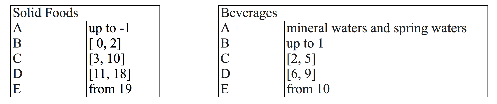

# Open Food Facts: the carbon “food-print” we do not eat

## Abstract
<i>Everything we do has a carbon footprint, and our diet is no exception. From growing, farming, processing and packaging our food, energy and organic resources are consumed and released, which reflects in the emission of greenhouse gases, like CO<sub>2</sub>. In our project, we analyze the processed foods industry - its manufacturing, product composition, and sales - for the main sources of carbon emissions, using the Open Food Facts dataset. We explain the carbon footprint repartition, starting on an understanding of the products, followed by the breakdown of production countries as well as point of sales and evaluating trends in diet composition, with a special focus on nutritionally high marked products in France and the UK. 

With this study, we want to provide a better understanding of the agri-food industry, and eventually help reducing carbon emissions.</i>

In this notebook, we are performingt the above analysis on the OpenFoodFacts database, which we pre-processed using the __Open Food Facts - Cleanse Data__ notebook in the main directory.

<h1>Table of Contents<span class="tocSkip"></span></h1>
<div class="toc"><ul class="toc-item"><li><span><a href="#Abstract" data-toc-modified-id="Abstract-1"><span class="toc-item-num">1&nbsp;&nbsp;</span>Abstract</a></span></li><li><span><a href="#Import-cleansed-data" data-toc-modified-id="Import-cleansed-data-2"><span class="toc-item-num">2&nbsp;&nbsp;</span>Import cleansed data</a></span></li><li><span><a href="#Analyse-data" data-toc-modified-id="Analyse-data-3"><span class="toc-item-num">3&nbsp;&nbsp;</span>Analyse data</a></span><ul class="toc-item"><li><span><a href="#Production-/-manufacture-impact" data-toc-modified-id="Production-/-manufacture-impact-3.1"><span class="toc-item-num">3.1&nbsp;&nbsp;</span>Production / manufacture impact</a></span><ul class="toc-item"><li><span><a href="#Global-distribution-of-global-food-producers" data-toc-modified-id="Global-distribution-of-global-food-producers-3.1.1"><span class="toc-item-num">3.1.1&nbsp;&nbsp;</span>Global distribution of global food producers</a></span><ul class="toc-item"><li><span><a href="#Which-are-the-dominant-global-food-producers-and-manufacturers?" data-toc-modified-id="Which-are-the-dominant-global-food-producers-and-manufacturers?-3.1.1.1"><span class="toc-item-num">3.1.1.1&nbsp;&nbsp;</span>Which are the dominant global food producers and manufacturers?</a></span></li><li><span><a href="#How-is-this-distribution-impacted-when-we-consider-neutral-and-large-carbon-footprint-products?" data-toc-modified-id="How-is-this-distribution-impacted-when-we-consider-neutral-and-large-carbon-footprint-products?-3.1.1.2"><span class="toc-item-num">3.1.1.2&nbsp;&nbsp;</span>How is this distribution impacted when we consider neutral and large carbon footprint products?</a></span></li></ul></li><li><span><a href="#Case-study:-Palm-oil" data-toc-modified-id="Case-study:-Palm-oil-3.1.2"><span class="toc-item-num">3.1.2&nbsp;&nbsp;</span>Case study: Palm oil</a></span><ul class="toc-item"><li><span><a href="#Can-we-observe-any-trend-in-the-number-of-products-including-this-oil-(assuming-a-strong-dependence-between-date-the-product-was-added-to-the-database-and-data-the-product-was-invented)?" data-toc-modified-id="Can-we-observe-any-trend-in-the-number-of-products-including-this-oil-(assuming-a-strong-dependence-between-date-the-product-was-added-to-the-database-and-data-the-product-was-invented)?-3.1.2.1"><span class="toc-item-num">3.1.2.1&nbsp;&nbsp;</span>Can we observe any trend in the number of products including this oil (assuming a strong dependence between date the product was added to the database and data the product was invented)?</a></span></li><li><span><a href="#Which-country-use-palm-oils-for-production?" data-toc-modified-id="Which-country-use-palm-oils-for-production?-3.1.2.2"><span class="toc-item-num">3.1.2.2&nbsp;&nbsp;</span>Which country use palm oils for production?</a></span></li></ul></li></ul></li><li><span><a href="#Good-nutrition-impact" data-toc-modified-id="Good-nutrition-impact-3.2"><span class="toc-item-num">3.2&nbsp;&nbsp;</span>Good nutrition impact</a></span><ul class="toc-item"><li><span><a href="#High-nutrional-products" data-toc-modified-id="High-nutrional-products-3.2.1"><span class="toc-item-num">3.2.1&nbsp;&nbsp;</span>High-nutrional products</a></span><ul class="toc-item"><li><span><a href="#Has-there-been-a-surge-in-high-graded-Products-in-the-UK-/-France-over-the-past-years?" data-toc-modified-id="Has-there-been-a-surge-in-high-graded-Products-in-the-UK-/-France-over-the-past-years?-3.2.1.1"><span class="toc-item-num">3.2.1.1&nbsp;&nbsp;</span>Has there been a surge in high graded Products in the UK / France over the past years?</a></span></li></ul></li><li><span><a href="#High-nutrional-products" data-toc-modified-id="High-nutrional-products-3.2.2"><span class="toc-item-num">3.2.2&nbsp;&nbsp;</span>High-nutrional products</a></span><ul class="toc-item"><li><span><a href="#What-are-those-products-made-of?" data-toc-modified-id="What-are-those-products-made-of?-3.2.2.1"><span class="toc-item-num">3.2.2.1&nbsp;&nbsp;</span>What are those products made of?</a></span></li><li><span><a href="#Where-do-these-product-come-from-and-where-are-they-manufactured?" data-toc-modified-id="Where-do-these-product-come-from-and-where-are-they-manufactured?-3.2.2.2"><span class="toc-item-num">3.2.2.2&nbsp;&nbsp;</span>Where do these product come from and where are they manufactured?</a></span></li><li><span><a href="#Where-are-those-products-sold?" data-toc-modified-id="Where-are-those-products-sold?-3.2.2.3"><span class="toc-item-num">3.2.2.3&nbsp;&nbsp;</span>Where are those products sold?</a></span></li></ul></li><li><span><a href="#Carbon-footprint-of-nutrionally-high-graded-products" data-toc-modified-id="Carbon-footprint-of-nutrionally-high-graded-products-3.2.3"><span class="toc-item-num">3.2.3&nbsp;&nbsp;</span>Carbon footprint of nutrionally-high graded products</a></span><ul class="toc-item"><li><span><a href="#Is-there-a-general-correlation-between-high-carbon-footprint-and-price?" data-toc-modified-id="Is-there-a-general-correlation-between-high-carbon-footprint-and-price?-3.2.3.1"><span class="toc-item-num">3.2.3.1&nbsp;&nbsp;</span>Is there a general correlation between high carbon footprint and price?</a></span></li></ul></li></ul></li></ul></li></ul></div>


```python
import numpy as np
import pandas as pd
import matplotlib.pyplot as plt
import folium
from scipy import stats
from datetime import datetime

import json
import pickle

import os
import sys
nb_dir = os.path.split(os.getcwd())[0]
if nb_dir not in sys.path:
    sys.path.append(nb_dir)
    
%load_ext autoreload
%autoreload 2
    
import libs.exploring as explore
import libs.visualising as visualize
import libs.cleansing as cleanse

# Set up plotly environment
from plotly.offline import download_plotlyjs, init_notebook_mode, plot, iplot
import plotly.graph_objs as go
import plotly.tools as tls
init_notebook_mode(connected=True)
```


<script type="text/javascript">window.PlotlyConfig = {MathJaxConfig: 'local'};</script><script type="text/javascript">if (window.MathJax) {MathJax.Hub.Config({SVG: {font: "STIX-Web"}});}</script><script>requirejs.config({paths: { 'plotly': ['https://cdn.plot.ly/plotly-latest.min']},});if(!window._Plotly) {require(['plotly'],function(plotly) {window._Plotly=plotly;});}</script>


<script type="text/javascript">window.PlotlyConfig = {MathJaxConfig: 'local'};</script><script type="text/javascript">if (window.MathJax) {MathJax.Hub.Config({SVG: {font: "STIX-Web"}});}</script><script>requirejs.config({paths: { 'plotly': ['https://cdn.plot.ly/plotly-latest.min']},});if(!window._Plotly) {require(['plotly'],function(plotly) {window._Plotly=plotly;});}</script>


Command to import the link for the website


```python
tls.get_embed('https://plot.ly/~maxencedraguet/25/')
```


    '<iframe id="igraph" scrolling="no" style="border:none;" seamless="seamless" src="https://plot.ly/~maxencedraguet/25.embed" height="525" width="100%"></iframe>'


## Import cleansed data


```python
# Import data
open_food_facts_csv_file = "./data/openfoodfacts_clean.csv"

food_facts_pd = pd.read_csv(open_food_facts_csv_file,
                            delimiter="\t")
```


```python
# Change column data types
food_facts_pd['carbon-footprint_100g'] = food_facts_pd['carbon-footprint_100g'].apply(pd.to_numeric, args=('coerce',))
food_facts_pd['energy_100g'] = food_facts_pd['energy_100g'].apply(pd.to_numeric, args=('coerce',))
food_facts_pd['price_per_100g'] = food_facts_pd['price_per_100g'].apply(pd.to_numeric, args=('coerce',))
food_facts_pd['created_datetime'] = food_facts_pd['created_datetime'].apply(pd.to_datetime, args=('coerce',))
```


```python
food_facts_pd.head(5)
```


<div>
<style scoped>
    .dataframe tbody tr th:only-of-type {
        vertical-align: middle;
    }

    .dataframe tbody tr th {
        vertical-align: top;
    }

    .dataframe thead th {
        text-align: right;
    }
</style>
<table border="1" class="dataframe">
  <thead>
    <tr style="text-align: right;">
      <th></th>
      <th>Unnamed: 0</th>
      <th>code</th>
      <th>created_t</th>
      <th>created_datetime</th>
      <th>product_name</th>
      <th>quantity</th>
      <th>packaging</th>
      <th>brands</th>
      <th>categories_en</th>
      <th>origins</th>
      <th>...</th>
      <th>ingredients_text</th>
      <th>main_category</th>
      <th>energy_100g</th>
      <th>carbon-footprint_100g</th>
      <th>nutrition-score-fr_100g</th>
      <th>nutrition-score-uk_100g</th>
      <th>price_per_100g</th>
      <th>store_currency</th>
      <th>manufacturing_place</th>
      <th>purchase_places</th>
    </tr>
  </thead>
  <tbody>
    <tr>
      <th>0</th>
      <td>0</td>
      <td>0000000274722</td>
      <td>1514659309</td>
      <td>2017-12-30 18:41:49</td>
      <td>Blanquette de Volaille et son Riz</td>
      <td>NaN</td>
      <td>carton,plastique</td>
      <td>Comme J’aime</td>
      <td>Meals,Meat-based products,Meals with meat,Poul...</td>
      <td>Unknown</td>
      <td>...</td>
      <td>Riz précuit 40,4 % (eau, riz, huile de colza, ...</td>
      <td>Meats</td>
      <td>450.0</td>
      <td>NaN</td>
      <td>0.0</td>
      <td>0.0</td>
      <td>NaN</td>
      <td>NaN</td>
      <td>France</td>
      <td>France</td>
    </tr>
    <tr>
      <th>1</th>
      <td>1</td>
      <td>0000000394710</td>
      <td>1484497370</td>
      <td>2017-01-15 16:22:50</td>
      <td>Danoises à la cannelle roulées</td>
      <td>1.150 kg</td>
      <td>Frais</td>
      <td>Kirkland Signature</td>
      <td>Sugary snacks,Biscuits and cakes,Pastries</td>
      <td>France</td>
      <td>...</td>
      <td>Ingrédients: Pâte (farine, eau, beurre, sucre,...</td>
      <td>Sugary snacks</td>
      <td>1520.0</td>
      <td>NaN</td>
      <td>NaN</td>
      <td>NaN</td>
      <td>NaN</td>
      <td>NaN</td>
      <td>France</td>
      <td>France</td>
    </tr>
    <tr>
      <th>2</th>
      <td>2</td>
      <td>0000001071894</td>
      <td>1409411252</td>
      <td>2014-08-30 15:07:32</td>
      <td>Flute</td>
      <td>NaN</td>
      <td>Paper,plastic film</td>
      <td>Waitrose</td>
      <td>Plant-based foods and beverages,Plant-based fo...</td>
      <td>Canada</td>
      <td>...</td>
      <td>Wheat</td>
      <td>Plant-based</td>
      <td>NaN</td>
      <td>NaN</td>
      <td>NaN</td>
      <td>NaN</td>
      <td>NaN</td>
      <td>NaN</td>
      <td>Unknown</td>
      <td>Canada</td>
    </tr>
    <tr>
      <th>3</th>
      <td>3</td>
      <td>0000001938067</td>
      <td>1484501528</td>
      <td>2017-01-15 17:32:08</td>
      <td>Chaussons tressés aux pommes</td>
      <td>1.200 kg</td>
      <td>Frais</td>
      <td>Kirkland Signature</td>
      <td>Sugary snacks,Biscuits and cakes,Pastries</td>
      <td>France</td>
      <td>...</td>
      <td>Ingrédients : Pâte (farine, margarines d'huile...</td>
      <td>Sugary snacks</td>
      <td>1090.0</td>
      <td>NaN</td>
      <td>9.0</td>
      <td>9.0</td>
      <td>NaN</td>
      <td>NaN</td>
      <td>United Kingdom</td>
      <td>United Kingdom</td>
    </tr>
    <tr>
      <th>4</th>
      <td>4</td>
      <td>0000004302544</td>
      <td>1488464896</td>
      <td>2017-03-02 14:28:16</td>
      <td>Pain Burger Artisan</td>
      <td>1.008 kg / 12 pain</td>
      <td>Frais,plastique</td>
      <td>Kirkland Signature</td>
      <td>boulange</td>
      <td>Canada</td>
      <td>...</td>
      <td>Ingrédients : Farine, eau, sel, levure, orge m...</td>
      <td>Boulange</td>
      <td>1160.0</td>
      <td>NaN</td>
      <td>1.0</td>
      <td>1.0</td>
      <td>NaN</td>
      <td>NaN</td>
      <td>Unknown</td>
      <td>Canada</td>
    </tr>
  </tbody>
</table>
<p>5 rows × 23 columns</p>
</div>


Additionally to the OpenFoodFact dataset, we obtained an extract of the Eaternity dataset hosted by the ETH Zurich, which contains 692 more products and their CO2 footprint. Unfortunately, these products are not contained in the OpenFoodFacts database, so we lack manufacturing and purchasing information as well as the OpenFoodFacts categories for this set.


```python
# Import data
carbon_footprint_csv_file = "./data/carbon_footprint_categories.csv"

carbon_footprint_pd = pd.read_csv(carbon_footprint_csv_file, delimiter=",")
carbon_footprint_pd.info()
```

    <class 'pandas.core.frame.DataFrame'>
    RangeIndex: 682 entries, 0 to 681
    Data columns (total 13 columns):
    Unnamed: 0                      682 non-null int64
    ID                              682 non-null int64
    Title                           682 non-null object
    Weight [gram/serving]           682 non-null int64
    CO2-Value [gram CO2/serving]    682 non-null float64
    CO2 rating                      682 non-null float64
    FAT                             682 non-null float64
    WATER                           682 non-null float64
    ENERC                           682 non-null float64
    PROT                            682 non-null float64
    category                        682 non-null object
    parent_category                 682 non-null object
    category_en                     682 non-null object
    dtypes: float64(6), int64(3), object(4)
    memory usage: 69.3+ KB


```python
carbon_footprint_pd.head(10)
```


<div>
<style scoped>
    .dataframe tbody tr th:only-of-type {
        vertical-align: middle;
    }

    .dataframe tbody tr th {
        vertical-align: top;
    }

    .dataframe thead th {
        text-align: right;
    }
</style>
<table border="1" class="dataframe">
  <thead>
    <tr style="text-align: right;">
      <th></th>
      <th>Unnamed: 0</th>
      <th>ID</th>
      <th>Title</th>
      <th>Weight [gram/serving]</th>
      <th>CO2-Value [gram CO2/serving]</th>
      <th>CO2 rating</th>
      <th>FAT</th>
      <th>WATER</th>
      <th>ENERC</th>
      <th>PROT</th>
      <th>category</th>
      <th>parent_category</th>
      <th>category_en</th>
    </tr>
  </thead>
  <tbody>
    <tr>
      <th>0</th>
      <td>0</td>
      <td>4300175162708</td>
      <td>K Classic - Junger Gemüsemais</td>
      <td>100</td>
      <td>9.0</td>
      <td>20.812</td>
      <td>3.480252</td>
      <td>52.999834</td>
      <td>765.655520</td>
      <td>8.601195</td>
      <td>Gemüsekonserven</td>
      <td>gemuese_pilze</td>
      <td>vegetable mushrooms</td>
    </tr>
    <tr>
      <th>1</th>
      <td>1</td>
      <td>4388840231829</td>
      <td>ja! Gemüsemais</td>
      <td>100</td>
      <td>17.0</td>
      <td>37.941</td>
      <td>2.312597</td>
      <td>35.218431</td>
      <td>1070.401621</td>
      <td>5.715417</td>
      <td>Gemüsekonserven</td>
      <td>gemuese_pilze</td>
      <td>vegetable mushrooms</td>
    </tr>
    <tr>
      <th>2</th>
      <td>2</td>
      <td>8690777653008</td>
      <td>Sera Ajvar</td>
      <td>100</td>
      <td>44.0</td>
      <td>61.076</td>
      <td>11.526800</td>
      <td>22.286400</td>
      <td>1276.524000</td>
      <td>12.058200</td>
      <td>Gemüsaufstriche &amp;amp; -salate</td>
      <td>gemuese_pilze</td>
      <td>vegetable mushrooms</td>
    </tr>
    <tr>
      <th>3</th>
      <td>3</td>
      <td>4311527608225</td>
      <td>Edeka Ackergold Mehligkochend</td>
      <td>100</td>
      <td>11.0</td>
      <td>67.383</td>
      <td>0.100000</td>
      <td>78.700000</td>
      <td>320.000000</td>
      <td>2.000000</td>
      <td>Kartoffeln</td>
      <td>gemuese_pilze</td>
      <td>vegetable mushrooms</td>
    </tr>
    <tr>
      <th>4</th>
      <td>4</td>
      <td>7610632971826</td>
      <td>Bio Kartoffeln festkochend</td>
      <td>100</td>
      <td>11.0</td>
      <td>67.383</td>
      <td>0.100000</td>
      <td>78.700000</td>
      <td>320.000000</td>
      <td>2.000000</td>
      <td>Kartoffeln</td>
      <td>gemuese_pilze</td>
      <td>vegetable mushrooms</td>
    </tr>
    <tr>
      <th>5</th>
      <td>5</td>
      <td>4316268432429</td>
      <td>Botato Kartoffel Wedges</td>
      <td>100</td>
      <td>20.0</td>
      <td>71.343</td>
      <td>4.032246</td>
      <td>70.485923</td>
      <td>512.666890</td>
      <td>3.501101</td>
      <td>Kartoffelbeilagen &amp;amp; Pommes Frites</td>
      <td>gemuese_pilze</td>
      <td>vegetable mushrooms</td>
    </tr>
    <tr>
      <th>6</th>
      <td>6</td>
      <td>4032600122055</td>
      <td>Pfanni Kartoffel Püree besonders locker 3 x 80 g</td>
      <td>100</td>
      <td>12.0</td>
      <td>73.344</td>
      <td>0.099000</td>
      <td>77.913000</td>
      <td>316.800000</td>
      <td>1.980000</td>
      <td>Kartoffelbeilagen &amp;amp; Pommes Frites</td>
      <td>gemuese_pilze</td>
      <td>vegetable mushrooms</td>
    </tr>
    <tr>
      <th>7</th>
      <td>7</td>
      <td>4005009101204</td>
      <td>Kartoffelpüree</td>
      <td>100</td>
      <td>14.0</td>
      <td>82.441</td>
      <td>0.197999</td>
      <td>75.754800</td>
      <td>310.801700</td>
      <td>2.129955</td>
      <td>Knödel &amp;amp; Pürees</td>
      <td>gemuese_pilze</td>
      <td>vegetable mushrooms</td>
    </tr>
    <tr>
      <th>8</th>
      <td>8</td>
      <td>4003880685257</td>
      <td>Agrarfrost Germany Knusper Frites</td>
      <td>100</td>
      <td>22.0</td>
      <td>84.098</td>
      <td>5.488000</td>
      <td>73.978000</td>
      <td>500.600000</td>
      <td>1.880000</td>
      <td>Kartoffelbeilagen &amp;amp; Pommes Frites</td>
      <td>gemuese_pilze</td>
      <td>vegetable mushrooms</td>
    </tr>
    <tr>
      <th>9</th>
      <td>9</td>
      <td>4311596464074</td>
      <td>Backofen Rösti Ecken - aus Qualitätskartoffeln</td>
      <td>100</td>
      <td>23.0</td>
      <td>87.815</td>
      <td>5.393437</td>
      <td>72.587372</td>
      <td>488.711426</td>
      <td>1.947783</td>
      <td>Kartoffelbeilagen &amp;amp; Pommes Frites</td>
      <td>gemuese_pilze</td>
      <td>vegetable mushrooms</td>
    </tr>
  </tbody>
</table>
</div>


## Analyse data

Before we analyse the data, we have to some confesssions to make:

The data that we loaded into this notebook was already preprocessed in the "Open Food Facts - Cleanse data" notebook, that can be found in the same directory. In there we translated countries, labels, and categories and formatted and matched tags. However, we also droped more than 90% of the data set, because the data points were not complete for the purpose of our analysis.

OpenFoodFacts was initiated in France, and products sold in france are dominantly represented in this data set. Moreover, most of the products are sold in Europe or industrial nations, and we have no or only sparse data about the African, Asian, Australian, and South-american continent, which excludes the majority of the world population and especially the societes in Asia and Africa, that undergo the most decisive transformations at the moment.

Further, we only have qualitative data about the products, but no quantities that are produced and purchased world wide, hence we cannot provide a scale for all the insights that we gain throughout this notebook.

What we are trying to say is, that the data is under no circumstances representive to analyse the the research questions that we have posed. However, we will provide the methods to perform this analysis on this comprised dataset, and see what kind of insights we can already squeek out of it.

### Production / manufacture impact

#### Global distribution of global food producers


```python
countries_label = pd.read_csv("./data/country_lookup.csv")[['name', 'cca3']]     
```

##### Which are the dominant global food producers and manufacturers?

- From where are those products originating?


```python
visualize.plot_occurences_on_map(df=food_facts_pd, 
                                 column_key='origins',
                                 show_distances=False,
                                 title='Countries of origin for products')
```


<div id="fd18e856-186f-45e1-91ce-05c991aca31a" style="height: 525px; width: 100%;" class="plotly-graph-div"></div><script type="text/javascript">require(["plotly"], function(Plotly) { window.PLOTLYENV=window.PLOTLYENV || {};window.PLOTLYENV.BASE_URL="https://plot.ly";Plotly.newPlot("fd18e856-186f-45e1-91ce-05c991aca31a", [{"type": "choropleth", "locations": ["SEN", "GRL", "LTU", "VNM", "PRT", "TWN", "MAR", "TUR", "ZAF", "GLP", "NFK", "DZA", "SGP", "RWA", "CYP", "PYF", "PNG", "MKD", "REU", "JAM", "NOR", "SRB", "ROU", "MYS", "NER", "GEO", "UKR", "KOR", "GBR", "SYC", "ARG", "WSM", "NZL", "NAM", "AZE", "LUX", "HTI", "LSO", "UGA", "FRA", "ISR", "CHE", "FRO", "BGD", "LAO", "SLV", "CHL", "MEX", "TZA", "TGO", "DMA", "PAN", "NLD", "CAN", "GUF", "IND", "GRC", "CIV", "BGR", "PRY", "COM", "BIH", "BOL", "BES", "SWE", "NCL", "SVK", "USA", "LBN", "NPL", "ESP", "GHA", "BRB", "ECU", "BFA", "TTO", "IMN", "COL", "PER", "ETH", "VEN", "MTQ", "IDN", "BDI", "COD", "PHL", "NIC", "JPN", "MHL", "POL", "FIN", "KEN", "LKA", "THA", "SJM", "AUT", "SDN", "URY", "HKG", "BRA", "MDG", "DOM", "HND", "JEY", "MDA", "ISL", "AUS", "HUN", "IOT", "STP", "RUS", "DNK", "MMR", "GIN", "EGY", "PAK", "CUB", "CMR", "SVN", "BEL", "GTM", "DEU", "TUN", "IRN", "BLR", "UMI", "CHN", "EST", "ITA", "IRL", "GUY", "CRI", "HRV"], "z": [1.3862943611198906, 0.0, 1.3862943611198906, 4.2626798770413155, 3.5553480614894135, 3.295836866004329, 3.7612001156935624, 4.30406509320417, 3.9318256327243257, 1.3862943611198906, 0.6931471805599453, 2.70805020110221, 0.6931471805599453, 0.0, 1.3862943611198906, 2.302585092994046, 2.5649493574615367, 1.3862943611198906, 3.2188758248682006, 0.6931471805599453, 5.0106352940962555, 0.6931471805599453, 2.302585092994046, 1.3862943611198906, 2.3978952727983707, 1.3862943611198906, 0.6931471805599453, 2.302585092994046, 6.439350371100098, 0.6931471805599453, 4.477336814478207, 1.6094379124341003, 3.367295829986474, 0.0, 0.0, 0.6931471805599453, 1.6094379124341003, 0.0, 1.3862943611198906, 9.099297073182859, 2.0794415416798357, 4.189654742026425, 3.091042453358316, 0.6931471805599453, 1.0986122886681098, 1.0986122886681098, 3.9889840465642745, 5.484796933490655, 2.0794415416798357, 0.6931471805599453, 3.6888794541139363, 0.0, 4.74493212836325, 5.062595033026967, 0.0, 4.007333185232471, 4.454347296253507, 2.70805020110221, 1.9459101490553132, 2.8903717578961645, 0.0, 0.6931471805599453, 3.5553480614894135, 0.0, 2.302585092994046, 1.0986122886681098, 0.0, 5.752572638825633, 0.6931471805599453, 0.0, 6.214608098422191, 2.0794415416798357, 0.0, 3.7612001156935624, 0.6931471805599453, 1.3862943611198906, 0.0, 2.4849066497880004, 5.093750200806762, 1.6094379124341003, 2.302585092994046, 2.1972245773362196, 3.4657359027997265, 0.6931471805599453, 0.6931471805599453, 3.4657359027997265, 1.791759469228055, 3.1780538303479458, 0.6931471805599453, 3.7612001156935624, 1.0986122886681098, 2.302585092994046, 3.4011973816621555, 4.5217885770490405, 0.0, 3.332204510175204, 0.0, 2.995732273553991, 1.0986122886681098, 4.060443010546419, 4.454347296253507, 3.6635616461296463, 1.791759469228055, 0.0, 0.6931471805599453, 3.2188758248682006, 4.882801922586371, 2.70805020110221, 3.2188758248682006, 1.9459101490553132, 3.8501476017100584, 3.332204510175204, 0.0, 2.6390573296152584, 2.3978952727983707, 2.302585092994046, 2.3978952727983707, 2.0794415416798357, 1.3862943611198906, 4.955827057601261, 1.6094379124341003, 5.988961416889864, 2.995732273553991, 2.4849066497880004, 0.6931471805599453, 1.3862943611198906, 4.852030263919617, 1.0986122886681098, 5.968707559985366, 4.553876891600541, 0.6931471805599453, 2.70805020110221, 1.3862943611198906], "name": ["Senegal", "Greenland", "Lithuania", "Vietnam", "Portugal", "Taiwan", "Morocco", "Turkey", "South Africa", "Guadeloupe", "Norfolk Island", "Algeria", "Singapore", "Rwanda", "Cyprus", "French Polynesia", "Papua New Guinea", "Macedonia", "R\u00e9union", "Jamaica", "Norway", "Serbia", "Romania", "Malaysia", "Niger", "Georgia", "Ukraine", "South Korea", "United Kingdom", "Seychelles", "Argentina", "Samoa", "New Zealand", "Namibia", "Azerbaijan", "Luxembourg", "Haiti", "Lesotho", "Uganda", "France", "Israel", "Switzerland", "Faroe Islands", "Bangladesh", "Laos", "El Salvador", "Chile", "Mexico", "Tanzania", "Togo", "Dominica", "Panama", "Netherlands", "Canada", "French Guiana", "India", "Greece", "Ivory Coast", "Bulgaria", "Paraguay", "Comoros", "Bosnia and Herzegovina", "Bolivia", "Caribbean Netherlands", "Sweden", "New Caledonia", "Slovakia", "United States", "Lebanon", "Nepal", "Spain", "Ghana", "Barbados", "Ecuador", "Burkina Faso", "Trinidad and Tobago", "Isle of Man", "Colombia", "Peru", "Ethiopia", "Venezuela", "Martinique", "Indonesia", "Burundi", "DR Congo", "Philippines", "Nicaragua", "Japan", "Marshall Islands", "Poland", "Finland", "Kenya", "Sri Lanka", "Thailand", "Svalbard and Jan Mayen", "Austria", "Sudan", "Uruguay", "Hong Kong", "Brazil", "Madagascar", "Dominican Republic", "Honduras", "Jersey", "Moldova", "Iceland", "Australia", "Hungary", "British Indian Ocean Territory", "S\u00e3o Tom\u00e9 and Pr\u00edncipe", "Russia", "Denmark", "Myanmar", "Guinea", "Egypt", "Pakistan", "Cuba", "Cameroon", "Slovenia", "Belgium", "Guatemala", "Germany", "Tunisia", "Iran", "Belarus", "United States Minor Outlying Islands", "China", "Estonia", "Italy", "Ireland", "Guyana", "Costa Rica", "Croatia"], "autocolorscale": false, "reversescale": true, "colorbar": {"autotick": true, "title": "Counts [log10]"}}], {"title": "Countries of origin for products", "geo": {"projection": {"type": "Mercator"}, "showframe": false, "showcoastlines": true, "showland": true, "landcolor": "rgb(229, 229, 229)", "countrycolor": "rgb(255, 255, 255)", "coastlinecolor": "rgb(255, 255, 255)"}, "showlegend": false, "xaxis": {"fixedrange": true}, "yaxis": {"fixedrange": true}}, {"showLink": true, "linkText": "Export to plot.ly"})});</script><script type="text/javascript">window.addEventListener("resize", function(){window._Plotly.Plots.resize(document.getElementById("fd18e856-186f-45e1-91ce-05c991aca31a"));});</script>


Note that country in purple are  not assigned any value. 

- Where are those products manufactured?


```python
visualize.plot_occurences_on_map(df=food_facts_pd, 
                                 column_key='manufacturing_place',
                                 show_distances=False,
                                 title='Manufacturing countries of products')
```


<div id="7e9764a2-5e84-4c4d-9201-6d759b10c82a" style="height: 525px; width: 100%;" class="plotly-graph-div"></div><script type="text/javascript">require(["plotly"], function(Plotly) { window.PLOTLYENV=window.PLOTLYENV || {};window.PLOTLYENV.BASE_URL="https://plot.ly";Plotly.newPlot("7e9764a2-5e84-4c4d-9201-6d759b10c82a", [{"type": "choropleth", "locations": ["SEN", "LTU", "MAF", "VNM", "PRT", "TWN", "MAR", "TUR", "ZAF", "GLP", "NFK", "DZA", "SGP", "CYM", "CYP", "PYF", "PNG", "MKD", "REU", "NOR", "SRB", "ROU", "MYS", "NER", "GEO", "UKR", "MYT", "KOR", "GBR", "LIE", "SYC", "ARM", "ARG", "WSM", "NZL", "NAM", "AZE", "LUX", "FRA", "ISR", "CHE", "CPV", "BGD", "LAO", "SLV", "CHL", "CZE", "MEX", "SPM", "TZA", "TGO", "PAN", "NLD", "CAN", "GUF", "IND", "GRC", "CIV", "BGR", "BLM", "PRY", "MLT", "BIH", "SWZ", "BOL", "BES", "SWE", "NCL", "SVK", "USA", "LBN", "ESP", "GHA", "ECU", "COL", "PER", "ETH", "ALB", "VEN", "MTQ", "IDN", "PHL", "PRI", "JPN", "MHL", "POL", "FIN", "KEN", "LVA", "LKA", "GGY", "THA", "AUT", "URY", "MCO", "HKG", "BRA", "MDG", "DOM", "MDA", "BRN", "ISL", "AUS", "HUN", "KIR", "STP", "RUS", "DNK", "MMR", "PAK", "CUB", "CMR", "SVN", "BEL", "DEU", "TUN", "UMI", "IRN", "BLR", "CHN", "EST", "SAU", "ATF", "ITA", "IRL", "GUY", "CRI", "HRV", "MUS"], "z": [1.3862943611198906, 3.295836866004329, 0.0, 4.174387269895637, 4.74493212836325, 4.700480365792417, 4.727387818712341, 3.7612001156935624, 3.258096538021482, 2.9444389791664403, 2.9444389791664403, 2.302585092994046, 1.791759469228055, 0.6931471805599453, 1.9459101490553132, 2.5649493574615367, 0.6931471805599453, 2.1972245773362196, 3.9512437185814275, 2.5649493574615367, 3.044522437723423, 2.3978952727983707, 2.1972245773362196, 3.58351893845611, 2.0794415416798357, 1.9459101490553132, 1.6094379124341003, 2.302585092994046, 8.281470857895167, 1.6094379124341003, 2.3978952727983707, 1.791759469228055, 2.0794415416798357, 3.091042453358316, 2.5649493574615367, 0.6931471805599453, 0.0, 3.1780538303479458, 10.152571717850691, 2.9444389791664403, 5.41610040220442, 0.6931471805599453, 0.0, 0.6931471805599453, 0.0, 1.791759469228055, 3.1780538303479458, 5.159055299214529, 0.0, 0.0, 0.6931471805599453, 0.0, 6.089044875446846, 5.438079308923196, 2.3978952727983707, 3.091042453358316, 5.204006687076795, 2.1972245773362196, 3.4011973816621555, 0.0, 0.0, 0.0, 0.6931471805599453, 0.0, 4.634728988229636, 0.6931471805599453, 4.30406509320417, 1.6094379124341003, 1.9459101490553132, 6.129050210060545, 2.1972245773362196, 7.029087564149662, 2.0794415416798357, 2.4849066497880004, 1.791759469228055, 3.4657359027997265, 0.0, 0.0, 2.995732273553991, 2.70805020110221, 2.772588722239781, 3.4965075614664802, 0.6931471805599453, 4.394449154672439, 2.1972245773362196, 4.890349128221754, 2.1972245773362196, 2.6390573296152584, 1.9459101490553132, 3.367295829986474, 1.0986122886681098, 5.25227342804663, 4.532599493153256, 0.6931471805599453, 1.6094379124341003, 2.8903717578961645, 2.3978952727983707, 3.8066624897703196, 1.3862943611198906, 2.1972245773362196, 0.6931471805599453, 3.332204510175204, 4.882801922586371, 3.295836866004329, 0.6931471805599453, 0.6931471805599453, 5.351858133476067, 3.9889840465642745, 0.6931471805599453, 2.0794415416798357, 1.3862943611198906, 1.791759469228055, 2.5649493574615367, 7.221835825288449, 7.891330757661889, 3.4011973816621555, 3.4965075614664802, 4.0943445622221, 1.0986122886681098, 5.3230099791384085, 1.6094379124341003, 0.0, 2.0794415416798357, 7.224753405767971, 4.74493212836325, 0.0, 1.9459101490553132, 3.5263605246161616, 1.6094379124341003], "name": ["Senegal", "Lithuania", "Saint Martin", "Vietnam", "Portugal", "Taiwan", "Morocco", "Turkey", "South Africa", "Guadeloupe", "Norfolk Island", "Algeria", "Singapore", "Cayman Islands", "Cyprus", "French Polynesia", "Papua New Guinea", "Macedonia", "R\u00e9union", "Norway", "Serbia", "Romania", "Malaysia", "Niger", "Georgia", "Ukraine", "Mayotte", "South Korea", "United Kingdom", "Liechtenstein", "Seychelles", "Armenia", "Argentina", "Samoa", "New Zealand", "Namibia", "Azerbaijan", "Luxembourg", "France", "Israel", "Switzerland", "Cape Verde", "Bangladesh", "Laos", "El Salvador", "Chile", "Czechia", "Mexico", "Saint Pierre and Miquelon", "Tanzania", "Togo", "Panama", "Netherlands", "Canada", "French Guiana", "India", "Greece", "Ivory Coast", "Bulgaria", "Saint Barth\u00e9lemy", "Paraguay", "Malta", "Bosnia and Herzegovina", "Eswatini", "Bolivia", "Caribbean Netherlands", "Sweden", "New Caledonia", "Slovakia", "United States", "Lebanon", "Spain", "Ghana", "Ecuador", "Colombia", "Peru", "Ethiopia", "Albania", "Venezuela", "Martinique", "Indonesia", "Philippines", "Puerto Rico", "Japan", "Marshall Islands", "Poland", "Finland", "Kenya", "Latvia", "Sri Lanka", "Guernsey", "Thailand", "Austria", "Uruguay", "Monaco", "Hong Kong", "Brazil", "Madagascar", "Dominican Republic", "Moldova", "Brunei", "Iceland", "Australia", "Hungary", "Kiribati", "S\u00e3o Tom\u00e9 and Pr\u00edncipe", "Russia", "Denmark", "Myanmar", "Pakistan", "Cuba", "Cameroon", "Slovenia", "Belgium", "Germany", "Tunisia", "United States Minor Outlying Islands", "Iran", "Belarus", "China", "Estonia", "Saudi Arabia", "French Southern and Antarctic Lands", "Italy", "Ireland", "Guyana", "Costa Rica", "Croatia", "Mauritius"], "autocolorscale": false, "reversescale": true, "colorbar": {"autotick": true, "title": "Counts [log10]"}}], {"title": "Manufacturing countries of products", "geo": {"projection": {"type": "Mercator"}, "showframe": false, "showcoastlines": true, "showland": true, "landcolor": "rgb(229, 229, 229)", "countrycolor": "rgb(255, 255, 255)", "coastlinecolor": "rgb(255, 255, 255)"}, "showlegend": false, "xaxis": {"fixedrange": true}, "yaxis": {"fixedrange": true}}, {"showLink": true, "linkText": "Export to plot.ly"})});</script><script type="text/javascript">window.addEventListener("resize", function(){window._Plotly.Plots.resize(document.getElementById("7e9764a2-5e84-4c4d-9201-6d759b10c82a"));});</script>


- Where are those products bought?


```python
visualize.plot_occurences_on_map(df=food_facts_pd, 
                                 column_key='purchase_places',
                                 show_distances=False,
                                 title='Purchase countries of products')
```


<div id="f986f228-1ebb-46e6-8c77-4f71e078d61b" style="height: 525px; width: 100%;" class="plotly-graph-div"></div><script type="text/javascript">require(["plotly"], function(Plotly) { window.PLOTLYENV=window.PLOTLYENV || {};window.PLOTLYENV.BASE_URL="https://plot.ly";Plotly.newPlot("f986f228-1ebb-46e6-8c77-4f71e078d61b", [{"type": "choropleth", "locations": ["SEN", "LTU", "MAF", "PRT", "TWN", "AIA", "MAR", "TUR", "ZAF", "GLP", "DZA", "CYP", "PYF", "MKD", "REU", "MNE", "NOR", "KWT", "SRB", "ROU", "MYS", "GEO", "UKR", "MYT", "KOR", "GBR", "ARM", "ARG", "NZL", "LUX", "FRA", "VIR", "COG", "ISR", "CHE", "CHL", "CZE", "MEX", "SPM", "TGO", "NLD", "CAN", "GUF", "IND", "GRC", "CIV", "BGR", "MLT", "BIH", "SWE", "NCL", "SVK", "USA", "LBN", "ESP", "ECU", "BFA", "COL", "PER", "ALB", "MTQ", "IDN", "PHL", "JPN", "POL", "FIN", "ARE", "LVA", "LKA", "THA", "AUT", "URY", "MCO", "HKG", "BRA", "MDG", "DOM", "SXM", "MLI", "MDA", "ISL", "AUS", "HUN", "KNA", "OMN", "RUS", "DNK", "JOR", "MMR", "GIN", "EGY", "CUB", "CMR", "SVN", "BEL", "DEU", "TUN", "CHN", "EST", "SAU", "KAZ", "ITA", "GAB", "IRL", "CRI", "HRV", "MUS"], "z": [1.9459101490553132, 1.0986122886681098, 0.0, 4.90527477843843, 2.9444389791664403, 0.0, 2.4849066497880004, 1.9459101490553132, 2.1972245773362196, 4.0943445622221, 1.9459101490553132, 0.0, 4.418840607796598, 0.6931471805599453, 4.430816798843313, 1.6094379124341003, 1.9459101490553132, 0.0, 4.624972813284271, 4.30406509320417, 1.0986122886681098, 2.3978952727983707, 1.0986122886681098, 0.0, 1.0986122886681098, 7.326465613840322, 0.0, 1.0986122886681098, 1.9459101490553132, 3.332204510175204, 10.463531820089617, 0.0, 0.6931471805599453, 1.6094379124341003, 6.606650186198215, 0.6931471805599453, 2.6390573296152584, 6.255750041753367, 2.0794415416798357, 0.0, 4.787491742782046, 5.820082930352362, 2.70805020110221, 1.6094379124341003, 3.5263605246161616, 0.0, 2.70805020110221, 0.0, 1.0986122886681098, 5.030437921392435, 2.3978952727983707, 0.6931471805599453, 6.220590170099739, 1.0986122886681098, 7.138866999945524, 0.0, 0.6931471805599453, 1.3862943611198906, 0.6931471805599453, 0.6931471805599453, 3.1780538303479458, 1.0986122886681098, 2.1972245773362196, 3.091042453358316, 2.6390573296152584, 2.995732273553991, 1.6094379124341003, 1.6094379124341003, 0.0, 0.6931471805599453, 3.7612001156935624, 0.0, 1.3862943611198906, 3.258096538021482, 0.6931471805599453, 3.784189633918261, 0.0, 0.0, 0.6931471805599453, 1.0986122886681098, 0.6931471805599453, 5.8289456176102075, 3.295836866004329, 1.0986122886681098, 0.0, 5.5134287461649825, 4.204692619390966, 0.0, 0.0, 0.0, 0.0, 1.3862943611198906, 1.0986122886681098, 1.9459101490553132, 6.720220155135295, 7.620214770574455, 1.6094379124341003, 1.9459101490553132, 1.791759469228055, 0.0, 0.0, 4.382026634673881, 0.0, 4.543294782270004, 0.6931471805599453, 1.3862943611198906, 1.6094379124341003], "name": ["Senegal", "Lithuania", "Saint Martin", "Portugal", "Taiwan", "Anguilla", "Morocco", "Turkey", "South Africa", "Guadeloupe", "Algeria", "Cyprus", "French Polynesia", "Macedonia", "R\u00e9union", "Montenegro", "Norway", "Kuwait", "Serbia", "Romania", "Malaysia", "Georgia", "Ukraine", "Mayotte", "South Korea", "United Kingdom", "Armenia", "Argentina", "New Zealand", "Luxembourg", "France", "United States Virgin Islands", "Republic of the Congo", "Israel", "Switzerland", "Chile", "Czechia", "Mexico", "Saint Pierre and Miquelon", "Togo", "Netherlands", "Canada", "French Guiana", "India", "Greece", "Ivory Coast", "Bulgaria", "Malta", "Bosnia and Herzegovina", "Sweden", "New Caledonia", "Slovakia", "United States", "Lebanon", "Spain", "Ecuador", "Burkina Faso", "Colombia", "Peru", "Albania", "Martinique", "Indonesia", "Philippines", "Japan", "Poland", "Finland", "United Arab Emirates", "Latvia", "Sri Lanka", "Thailand", "Austria", "Uruguay", "Monaco", "Hong Kong", "Brazil", "Madagascar", "Dominican Republic", "Sint Maarten", "Mali", "Moldova", "Iceland", "Australia", "Hungary", "Saint Kitts and Nevis", "Oman", "Russia", "Denmark", "Jordan", "Myanmar", "Guinea", "Egypt", "Cuba", "Cameroon", "Slovenia", "Belgium", "Germany", "Tunisia", "China", "Estonia", "Saudi Arabia", "Kazakhstan", "Italy", "Gabon", "Ireland", "Costa Rica", "Croatia", "Mauritius"], "autocolorscale": false, "reversescale": true, "colorbar": {"autotick": true, "title": "Counts [log10]"}}], {"title": "Purchase countries of products", "geo": {"projection": {"type": "Mercator"}, "showframe": false, "showcoastlines": true, "showland": true, "landcolor": "rgb(229, 229, 229)", "countrycolor": "rgb(255, 255, 255)", "coastlinecolor": "rgb(255, 255, 255)"}, "showlegend": false, "xaxis": {"fixedrange": true}, "yaxis": {"fixedrange": true}}, {"showLink": true, "linkText": "Export to plot.ly"})});</script><script type="text/javascript">window.addEventListener("resize", function(){window._Plotly.Plots.resize(document.getElementById("f986f228-1ebb-46e6-8c77-4f71e078d61b"));});</script>


In conclusion, we note that we mainly have data for "western" countries, with a <b> huge bias toward France</b>. We mostly lack information for country in Africa and the centre of Asia. Our dataset is thus clearly not a truthful representation of the world. We shall therefore restrict our analysis to the case of France, meaning purchases countries will be limited to the case of France. [This category was selected since it is the most furnished one.] 

This is carried out in the next cell. Note that <i> purchases_places </i> is only requested to contain 'France' as one of the entries in its list. There could thus be other countries still contained in the <i> purchases_places </i> column. 


```python
food_facts_pd['filter'] = food_facts_pd.purchase_places.apply(lambda l: explore.filter_france(l))
food_facts_pd = food_facts_pd[food_facts_pd['filter'] == 'France'].drop(columns=['filter'])
```

##### How is this distribution impacted when we consider neutral and large carbon footprint products? 


```python
# dataset carbon footprint coming from Eaternity
# This will be assess in future version of this project

```

#### Case study: Palm oil

##### Can we observe any trend in the number of products including this oil (assuming a strong dependence between date the product was added to the database and data the product was invented)?


```python
#extracting products with palm oil 
palm_oil_pd = food_facts_pd[food_facts_pd.ingredients_text.str.contains("palm").fillna(value=False)]
```


```python
print('{0:.2f} % of the products in the dataset contain palm oil'.format(palm_oil_pd.shape[0]/food_facts_pd.shape[0]*100))
```

    5.01 % of the products in the dataset contain palm oil


```python
#palm_oil_pd.groupby('main_category')
palm_oil_pd['created_yyyy'] = palm_oil_pd["created_datetime"].dt.year
```

    /home/kingkolibri/Programs/anaconda3/lib/python3.6/site-packages/ipykernel_launcher.py:2: SettingWithCopyWarning:
    
    
    A value is trying to be set on a copy of a slice from a DataFrame.
    Try using .loc[row_indexer,col_indexer] = value instead
    
    See the caveats in the documentation: http://pandas.pydata.org/pandas-docs/stable/indexing.html#indexing-view-versus-copy
    


```python
#plotly.tools.set_credentials_file(username='ninatubau', api_key='z75HqORQkKdVL98Fi0tX')

```


```python
palm_oil_over_time = palm_oil_pd['created_yyyy'].value_counts()
```


```python
data = [go.Bar(x=palm_oil_over_time.index,
            y=palm_oil_over_time.values)]

layout = go.Layout(
    title='Usage of palm oil over time',
    xaxis=dict(
        title='time (years)',
        titlefont=dict(
            family='Courier New, monospace',
            size=18,
            color='#7f7f7f'
        )
    ),
    yaxis=dict(
        title='number of products with palm oil',
        titlefont=dict(
            family='Courier New, monospace',
            size=18,
            color='#7f7f7f'
        )
    )
)
fig = go.Figure(data=data, layout=layout)

iplot(fig, filename='jupyter-basic_bar')
```


<div id="5ab1d67a-45cc-442d-94f0-0e5d64d1ee60" style="height: 525px; width: 100%;" class="plotly-graph-div"></div><script type="text/javascript">require(["plotly"], function(Plotly) { window.PLOTLYENV=window.PLOTLYENV || {};window.PLOTLYENV.BASE_URL="https://plot.ly";Plotly.newPlot("5ab1d67a-45cc-442d-94f0-0e5d64d1ee60", [{"x": [2015, 2016, 2017, 2018, 2013, 2014, 2012], "y": [428, 349, 276, 217, 149, 144, 46], "type": "bar", "uid": "14db1f53-6fd8-43c5-9a3a-abc66ec65e4a"}], {"title": "Usage of palm oil over time", "xaxis": {"title": "time (years)", "titlefont": {"color": "#7f7f7f", "family": "Courier New, monospace", "size": 18}}, "yaxis": {"title": "number of products with palm oil", "titlefont": {"color": "#7f7f7f", "family": "Courier New, monospace", "size": 18}}}, {"showLink": true, "linkText": "Export to plot.ly"})});</script><script type="text/javascript">window.addEventListener("resize", function(){window._Plotly.Plots.resize(document.getElementById("5ab1d67a-45cc-442d-94f0-0e5d64d1ee60"));});</script>


There is a clear tendancy of using palm oil in products from 2012 up to now. Also, we notice a large increase in the palm oil products these lasts years. 

##### Which country use palm oils for production?


```python
a = palm_oil_pd.origins.groupby(palm_oil_pd.origins).sum
```


```python
visualize.plot_column_composition(palm_oil_pd, 'manufacturing_place' );
```


<div>
<style scoped>
    .dataframe tbody tr th:only-of-type {
        vertical-align: middle;
    }

    .dataframe tbody tr th {
        vertical-align: top;
    }

    .dataframe thead th {
        text-align: right;
    }
</style>
<table border="1" class="dataframe">
  <thead>
    <tr style="text-align: right;">
      <th></th>
      <th>key</th>
      <th>value</th>
    </tr>
  </thead>
  <tbody>
    <tr>
      <th>0</th>
      <td>United Kingdom</td>
      <td>156.0</td>
    </tr>
    <tr>
      <th>7</th>
      <td>Unknown</td>
      <td>127.0</td>
    </tr>
    <tr>
      <th>3</th>
      <td>Italy</td>
      <td>70.0</td>
    </tr>
    <tr>
      <th>1</th>
      <td>Germany</td>
      <td>54.0</td>
    </tr>
    <tr>
      <th>11</th>
      <td>Belgium</td>
      <td>33.0</td>
    </tr>
    <tr>
      <th>12</th>
      <td>Spain</td>
      <td>15.0</td>
    </tr>
    <tr>
      <th>2</th>
      <td>Netherlands</td>
      <td>11.0</td>
    </tr>
    <tr>
      <th>22</th>
      <td>Switzerland</td>
      <td>11.0</td>
    </tr>
    <tr>
      <th>26</th>
      <td>China</td>
      <td>8.0</td>
    </tr>
    <tr>
      <th>17</th>
      <td>Greece</td>
      <td>7.0</td>
    </tr>
    <tr>
      <th>16</th>
      <td>Poland</td>
      <td>6.0</td>
    </tr>
    <tr>
      <th>9</th>
      <td>Vietnam</td>
      <td>4.0</td>
    </tr>
    <tr>
      <th>32</th>
      <td>Thailand</td>
      <td>4.0</td>
    </tr>
    <tr>
      <th>29</th>
      <td>Portugal</td>
      <td>4.0</td>
    </tr>
    <tr>
      <th>15</th>
      <td>Ireland</td>
      <td>3.0</td>
    </tr>
    <tr>
      <th>39</th>
      <td>Sri Lanka</td>
      <td>2.0</td>
    </tr>
    <tr>
      <th>28</th>
      <td>Bolivia</td>
      <td>2.0</td>
    </tr>
    <tr>
      <th>25</th>
      <td>Japan</td>
      <td>2.0</td>
    </tr>
    <tr>
      <th>44</th>
      <td>Niger</td>
      <td>2.0</td>
    </tr>
    <tr>
      <th>42</th>
      <td>French Guiana</td>
      <td>2.0</td>
    </tr>
    <tr>
      <th>35</th>
      <td>Réunion</td>
      <td>2.0</td>
    </tr>
    <tr>
      <th>31</th>
      <td>Algeria</td>
      <td>2.0</td>
    </tr>
    <tr>
      <th>23</th>
      <td>Cyprus</td>
      <td>2.0</td>
    </tr>
    <tr>
      <th>45</th>
      <td>Peru</td>
      <td>2.0</td>
    </tr>
    <tr>
      <th>20</th>
      <td>United States</td>
      <td>2.0</td>
    </tr>
    <tr>
      <th>4</th>
      <td>Norway</td>
      <td>2.0</td>
    </tr>
    <tr>
      <th>10</th>
      <td>Denmark</td>
      <td>1.0</td>
    </tr>
    <tr>
      <th>36</th>
      <td>Taiwan</td>
      <td>1.0</td>
    </tr>
    <tr>
      <th>43</th>
      <td>Luxembourg</td>
      <td>1.0</td>
    </tr>
    <tr>
      <th>5</th>
      <td>Kenya</td>
      <td>1.0</td>
    </tr>
    <tr>
      <th>41</th>
      <td>Turkey</td>
      <td>1.0</td>
    </tr>
    <tr>
      <th>40</th>
      <td>Philippines</td>
      <td>1.0</td>
    </tr>
    <tr>
      <th>6</th>
      <td>South Africa</td>
      <td>1.0</td>
    </tr>
    <tr>
      <th>38</th>
      <td>Namibia</td>
      <td>1.0</td>
    </tr>
    <tr>
      <th>37</th>
      <td>Samoa</td>
      <td>1.0</td>
    </tr>
    <tr>
      <th>21</th>
      <td>Canada</td>
      <td>1.0</td>
    </tr>
    <tr>
      <th>8</th>
      <td>Iceland</td>
      <td>1.0</td>
    </tr>
    <tr>
      <th>24</th>
      <td>Venezuela</td>
      <td>1.0</td>
    </tr>
    <tr>
      <th>33</th>
      <td>Sweden</td>
      <td>1.0</td>
    </tr>
    <tr>
      <th>13</th>
      <td>Mauritius</td>
      <td>1.0</td>
    </tr>
    <tr>
      <th>30</th>
      <td>Slovakia</td>
      <td>1.0</td>
    </tr>
    <tr>
      <th>14</th>
      <td>Moldova</td>
      <td>1.0</td>
    </tr>
    <tr>
      <th>18</th>
      <td>Iran</td>
      <td>1.0</td>
    </tr>
    <tr>
      <th>27</th>
      <td>Austria</td>
      <td>1.0</td>
    </tr>
    <tr>
      <th>19</th>
      <td>Laos</td>
      <td>1.0</td>
    </tr>
    <tr>
      <th>34</th>
      <td>Unknown</td>
      <td>127.0</td>
    </tr>
  </tbody>
</table>
</div>


<div id="ecb76893-68b6-4959-8c59-d6b55dcbde00" style="height: 300px; width: 800px;" class="plotly-graph-div"></div><script type="text/javascript">require(["plotly"], function(Plotly) { window.PLOTLYENV=window.PLOTLYENV || {};window.PLOTLYENV.BASE_URL="https://plot.ly";Plotly.newPlot("ecb76893-68b6-4959-8c59-d6b55dcbde00", [{"marker": {"color": "#F4B5A6", "line": {"color": "rgb(248, 248,249)", "width": 1}}, "name": "United Kingdom", "orientation": "h", "x": [156.0], "y": [0], "type": "bar", "uid": "5faa7d06-1e67-44e9-88e9-2faff45a2571"}, {"marker": {"color": "#F4EBA6", "line": {"color": "rgb(248, 248,249)", "width": 1}}, "name": "Unknown", "orientation": "h", "x": [127.0], "y": [0], "type": "bar", "uid": "4010ef5f-3d18-4def-888a-7a77bf694a24"}, {"marker": {"color": "#B2F4A6", "line": {"color": "rgb(248, 248,249)", "width": 1}}, "name": "Italy", "orientation": "h", "x": [70.0], "y": [0], "type": "bar", "uid": "e3f99489-4387-49f8-8d2e-8a4f602a0c13"}, {"marker": {"color": "#A6E3F4", "line": {"color": "rgb(248, 248,249)", "width": 1}}, "name": "Germany", "orientation": "h", "x": [54.0], "y": [0], "type": "bar", "uid": "371411f5-6014-4a8b-8608-008c94926084"}, {"marker": {"color": "#C4A6F4", "line": {"color": "rgb(248, 248,249)", "width": 1}}, "name": "Belgium", "orientation": "h", "x": [33.0], "y": [0], "type": "bar", "uid": "f4ee4f2c-917b-435e-9e01-4c10e66319f6"}, {"marker": {"color": "#E0DBDD", "line": {"color": "rgb(248, 248,249)", "width": 1}}, "name": "Others", "orientation": "h", "x": [241.0], "y": [0], "type": "bar", "uid": "03603180-ac0a-4fcf-be5b-7f82ab6beafa"}], {"barmode": "stack", "height": 300, "showlegend": true, "title": "manufacturing_place", "width": 800, "xaxis": {"tickvals": [0, 50, 100, 150, 200, 250, 300, 350, 400, 450, 500, 550, 600, 650, 681.0]}, "yaxis": {"showgrid": false, "showline": false, "showticklabels": false, "zeroline": false}}, {"showLink": true, "linkText": "Export to plot.ly"})});</script>


```python
visualize.plot_occurences_on_map(df=food_facts_pd, 
                                 column_key='manufacturing_place',
                                 show_distances=True,
                                 title='Manufacturing countries of products')
```


<div id="40abff9f-a6e7-42ae-b043-385f608ad0ee" style="height: 525px; width: 100%;" class="plotly-graph-div"></div><script type="text/javascript">require(["plotly"], function(Plotly) { window.PLOTLYENV=window.PLOTLYENV || {};window.PLOTLYENV.BASE_URL="https://plot.ly";Plotly.newPlot("40abff9f-a6e7-42ae-b043-385f608ad0ee", [{"type": "choropleth", "locations": ["SEN", "LTU", "MAF", "VNM", "PRT", "TWN", "MAR", "TUR", "ZAF", "GLP", "DZA", "SGP", "CYM", "CYP", "PYF", "PNG", "MKD", "REU", "NOR", "SRB", "ROU", "MYS", "NER", "MYT", "UKR", "KOR", "GBR", "LIE", "SYC", "ARM", "ARG", "WSM", "NZL", "NAM", "LUX", "FRA", "ISR", "CHE", "LAO", "SLV", "CHL", "CZE", "MEX", "TGO", "NLD", "CAN", "GUF", "IND", "GRC", "CIV", "BGR", "BLM", "PRY", "SWZ", "BOL", "SWE", "NCL", "SVK", "USA", "LBN", "ESP", "GHA", "ECU", "COL", "PER", "VEN", "MTQ", "IDN", "PHL", "PRI", "JPN", "POL", "FIN", "KEN", "LVA", "LKA", "GGY", "THA", "AUT", "URY", "MCO", "HKG", "BRA", "MDG", "DOM", "MDA", "ISL", "AUS", "HUN", "STP", "RUS", "DNK", "MMR", "CMR", "BEL", "SVN", "DEU", "TUN", "IRN", "UMI", "CHN", "EST", "SAU", "ATF", "ITA", "IRL", "CRI", "HRV", "MUS"], "z": [0.6931471805599453, 2.9444389791664403, 0.0, 4.060443010546419, 4.174387269895637, 4.30406509320417, 4.564348191467836, 3.332204510175204, 1.791759469228055, 2.0794415416798357, 2.1972245773362196, 1.0986122886681098, 0.6931471805599453, 0.6931471805599453, 0.0, 0.0, 0.0, 2.772588722239781, 2.3978952727983707, 0.6931471805599453, 1.0986122886681098, 1.6094379124341003, 3.5553480614894135, 1.6094379124341003, 0.0, 1.0986122886681098, 7.957527402230773, 0.0, 1.791759469228055, 1.6094379124341003, 0.6931471805599453, 3.044522437723423, 0.6931471805599453, 0.6931471805599453, 2.9444389791664403, 10.107774429000033, 2.1972245773362196, 4.9344739331306915, 0.6931471805599453, 0.0, 1.0986122886681098, 2.4849066497880004, 1.791759469228055, 0.0, 5.7430031878094825, 3.6375861597263857, 2.0794415416798357, 0.0, 4.709530201312334, 1.9459101490553132, 2.1972245773362196, 0.0, 0.0, 0.0, 4.543294782270004, 3.4339872044851463, 1.3862943611198906, 1.0986122886681098, 4.406719247264253, 1.0986122886681098, 6.220590170099739, 1.9459101490553132, 1.791759469228055, 0.0, 2.833213344056216, 2.4849066497880004, 2.0794415416798357, 1.6094379124341003, 2.3978952727983707, 0.0, 3.8501476017100584, 4.553876891600541, 0.6931471805599453, 2.0794415416798357, 0.6931471805599453, 3.091042453358316, 1.0986122886681098, 4.634728988229636, 3.4011973816621555, 0.0, 1.3862943611198906, 1.0986122886681098, 1.3862943611198906, 1.6094379124341003, 0.6931471805599453, 0.6931471805599453, 3.295836866004329, 0.6931471805599453, 2.302585092994046, 0.0, 1.791759469228055, 3.258096538021482, 0.0, 1.0986122886681098, 6.80903930604298, 1.6094379124341003, 6.7580945044277305, 2.8903717578961645, 4.02535169073515, 3.2188758248682006, 4.795790545596741, 0.6931471805599453, 0.0, 2.0794415416798357, 6.9782137426306985, 3.4011973816621555, 0.6931471805599453, 1.3862943611198906, 1.6094379124341003], "name": ["Senegal", "Lithuania", "Saint Martin", "Vietnam", "Portugal", "Taiwan", "Morocco", "Turkey", "South Africa", "Guadeloupe", "Algeria", "Singapore", "Cayman Islands", "Cyprus", "French Polynesia", "Papua New Guinea", "Macedonia", "R\u00e9union", "Norway", "Serbia", "Romania", "Malaysia", "Niger", "Mayotte", "Ukraine", "South Korea", "United Kingdom", "Liechtenstein", "Seychelles", "Armenia", "Argentina", "Samoa", "New Zealand", "Namibia", "Luxembourg", "France", "Israel", "Switzerland", "Laos", "El Salvador", "Chile", "Czechia", "Mexico", "Togo", "Netherlands", "Canada", "French Guiana", "India", "Greece", "Ivory Coast", "Bulgaria", "Saint Barth\u00e9lemy", "Paraguay", "Eswatini", "Bolivia", "Sweden", "New Caledonia", "Slovakia", "United States", "Lebanon", "Spain", "Ghana", "Ecuador", "Colombia", "Peru", "Venezuela", "Martinique", "Indonesia", "Philippines", "Puerto Rico", "Japan", "Poland", "Finland", "Kenya", "Latvia", "Sri Lanka", "Guernsey", "Thailand", "Austria", "Uruguay", "Monaco", "Hong Kong", "Brazil", "Madagascar", "Dominican Republic", "Moldova", "Iceland", "Australia", "Hungary", "S\u00e3o Tom\u00e9 and Pr\u00edncipe", "Russia", "Denmark", "Myanmar", "Cameroon", "Belgium", "Slovenia", "Germany", "Tunisia", "Iran", "United States Minor Outlying Islands", "China", "Estonia", "Saudi Arabia", "French Southern and Antarctic Lands", "Italy", "Ireland", "Costa Rica", "Croatia", "Mauritius"], "autocolorscale": false, "reversescale": true, "colorbar": {"autotick": true, "title": "Counts [log10]"}}, {"type": "scattergeo", "lon": [-14, 2], "lat": [14, 46], "mode": "lines+marker", "name": "Senegal", "line": {"width": 0.34657359027997264, "color": "red"}}, {"type": "scattergeo", "lon": [24, 2], "lat": [56, 46], "mode": "lines+marker", "name": "Lithuania", "line": {"width": 1.4722194895832201, "color": "red"}}, {"type": "scattergeo", "lon": [-63.95, 2], "lat": [18.08333333, 46], "mode": "lines+marker", "name": "Saint Martin", "line": {"width": 0.0, "color": "red"}}, {"type": "scattergeo", "lon": [107.83333333, 2], "lat": [16.16666666, 46], "mode": "lines+marker", "name": "Vietnam", "line": {"width": 2.0302215052732095, "color": "red"}}, {"type": "scattergeo", "lon": [-8, 2], "lat": [39.5, 46], "mode": "lines+marker", "name": "Portugal", "line": {"width": 2.0871936349478184, "color": "red"}}, {"type": "scattergeo", "lon": [121, 2], "lat": [23.5, 46], "mode": "lines+marker", "name": "Taiwan", "line": {"width": 2.152032546602085, "color": "red"}}, {"type": "scattergeo", "lon": [-5, 2], "lat": [32, 46], "mode": "lines+marker", "name": "Morocco", "line": {"width": 2.282174095733918, "color": "red"}}, {"type": "scattergeo", "lon": [35, 2], "lat": [39, 46], "mode": "lines+marker", "name": "Turkey", "line": {"width": 1.666102255087602, "color": "red"}}, {"type": "scattergeo", "lon": [24, 2], "lat": [-29, 46], "mode": "lines+marker", "name": "South Africa", "line": {"width": 0.8958797346140275, "color": "red"}}, {"type": "scattergeo", "lon": [-61.583333, 2], "lat": [16.25, 46], "mode": "lines+marker", "name": "Guadeloupe", "line": {"width": 1.0397207708399179, "color": "red"}}, {"type": "scattergeo", "lon": [3, 2], "lat": [28, 46], "mode": "lines+marker", "name": "Algeria", "line": {"width": 1.0986122886681098, "color": "red"}}, {"type": "scattergeo", "lon": [103.8, 2], "lat": [1.36666666, 46], "mode": "lines+marker", "name": "Singapore", "line": {"width": 0.5493061443340549, "color": "red"}}, {"type": "scattergeo", "lon": [-80.5, 2], "lat": [19.5, 46], "mode": "lines+marker", "name": "Cayman Islands", "line": {"width": 0.34657359027997264, "color": "red"}}, {"type": "scattergeo", "lon": [33, 2], "lat": [35, 46], "mode": "lines+marker", "name": "Cyprus", "line": {"width": 0.34657359027997264, "color": "red"}}, {"type": "scattergeo", "lon": [-140, 2], "lat": [-15, 46], "mode": "lines+marker", "name": "French Polynesia", "line": {"width": 0.0, "color": "red"}}, {"type": "scattergeo", "lon": [147, 2], "lat": [-6, 46], "mode": "lines+marker", "name": "Papua New Guinea", "line": {"width": 0.0, "color": "red"}}, {"type": "scattergeo", "lon": [22, 2], "lat": [41.83333333, 46], "mode": "lines+marker", "name": "Macedonia", "line": {"width": 0.0, "color": "red"}}, {"type": "scattergeo", "lon": [55.5, 2], "lat": [-21.15, 46], "mode": "lines+marker", "name": "R\u00e9union", "line": {"width": 1.3862943611198906, "color": "red"}}, {"type": "scattergeo", "lon": [10, 2], "lat": [62, 46], "mode": "lines+marker", "name": "Norway", "line": {"width": 1.1989476363991853, "color": "red"}}, {"type": "scattergeo", "lon": [21, 2], "lat": [44, 46], "mode": "lines+marker", "name": "Serbia", "line": {"width": 0.34657359027997264, "color": "red"}}, {"type": "scattergeo", "lon": [25, 2], "lat": [46, 46], "mode": "lines+marker", "name": "Romania", "line": {"width": 0.5493061443340549, "color": "red"}}, {"type": "scattergeo", "lon": [112.5, 2], "lat": [2.5, 46], "mode": "lines+marker", "name": "Malaysia", "line": {"width": 0.8047189562170501, "color": "red"}}, {"type": "scattergeo", "lon": [8, 2], "lat": [16, 46], "mode": "lines+marker", "name": "Niger", "line": {"width": 1.7776740307447068, "color": "red"}}, {"type": "scattergeo", "lon": [45.16666666, 2], "lat": [-12.83333333, 46], "mode": "lines+marker", "name": "Mayotte", "line": {"width": 0.8047189562170501, "color": "red"}}, {"type": "scattergeo", "lon": [32, 2], "lat": [49, 46], "mode": "lines+marker", "name": "Ukraine", "line": {"width": 0.0, "color": "red"}}, {"type": "scattergeo", "lon": [127.5, 2], "lat": [37, 46], "mode": "lines+marker", "name": "South Korea", "line": {"width": 0.5493061443340549, "color": "red"}}, {"type": "scattergeo", "lon": [-2, 2], "lat": [54, 46], "mode": "lines+marker", "name": "United Kingdom", "line": {"width": 3.9787637011153865, "color": "red"}}, {"type": "scattergeo", "lon": [9.53333333, 2], "lat": [47.26666666, 46], "mode": "lines+marker", "name": "Liechtenstein", "line": {"width": 0.0, "color": "red"}}, {"type": "scattergeo", "lon": [55.66666666, 2], "lat": [-4.58333333, 46], "mode": "lines+marker", "name": "Seychelles", "line": {"width": 0.8958797346140275, "color": "red"}}, {"type": "scattergeo", "lon": [45, 2], "lat": [40, 46], "mode": "lines+marker", "name": "Armenia", "line": {"width": 0.8047189562170501, "color": "red"}}, {"type": "scattergeo", "lon": [-64, 2], "lat": [-34, 46], "mode": "lines+marker", "name": "Argentina", "line": {"width": 0.34657359027997264, "color": "red"}}, {"type": "scattergeo", "lon": [-172.33333333, 2], "lat": [-13.58333333, 46], "mode": "lines+marker", "name": "Samoa", "line": {"width": 1.5222612188617115, "color": "red"}}, {"type": "scattergeo", "lon": [174, 2], "lat": [-41, 46], "mode": "lines+marker", "name": "New Zealand", "line": {"width": 0.34657359027997264, "color": "red"}}, {"type": "scattergeo", "lon": [17, 2], "lat": [-22, 46], "mode": "lines+marker", "name": "Namibia", "line": {"width": 0.34657359027997264, "color": "red"}}, {"type": "scattergeo", "lon": [6.16666666, 2], "lat": [49.75, 46], "mode": "lines+marker", "name": "Luxembourg", "line": {"width": 1.4722194895832201, "color": "red"}}, {"type": "scattergeo", "lon": [2, 2], "lat": [46, 46], "mode": "lines+marker", "name": "France", "line": {"width": 5.053887214500016, "color": "red"}}, {"type": "scattergeo", "lon": [35.13, 2], "lat": [31.47, 46], "mode": "lines+marker", "name": "Israel", "line": {"width": 1.0986122886681098, "color": "red"}}, {"type": "scattergeo", "lon": [8, 2], "lat": [47, 46], "mode": "lines+marker", "name": "Switzerland", "line": {"width": 2.4672369665653457, "color": "red"}}, {"type": "scattergeo", "lon": [105, 2], "lat": [18, 46], "mode": "lines+marker", "name": "Laos", "line": {"width": 0.34657359027997264, "color": "red"}}, {"type": "scattergeo", "lon": [-88.91666666, 2], "lat": [13.83333333, 46], "mode": "lines+marker", "name": "El Salvador", "line": {"width": 0.0, "color": "red"}}, {"type": "scattergeo", "lon": [-71, 2], "lat": [-30, 46], "mode": "lines+marker", "name": "Chile", "line": {"width": 0.5493061443340549, "color": "red"}}, {"type": "scattergeo", "lon": [15.5, 2], "lat": [49.75, 46], "mode": "lines+marker", "name": "Czechia", "line": {"width": 1.2424533248940002, "color": "red"}}, {"type": "scattergeo", "lon": [-102, 2], "lat": [23, 46], "mode": "lines+marker", "name": "Mexico", "line": {"width": 0.8958797346140275, "color": "red"}}, {"type": "scattergeo", "lon": [1.16666666, 2], "lat": [8, 46], "mode": "lines+marker", "name": "Togo", "line": {"width": 0.0, "color": "red"}}, {"type": "scattergeo", "lon": [5.75, 2], "lat": [52.5, 46], "mode": "lines+marker", "name": "Netherlands", "line": {"width": 2.8715015939047412, "color": "red"}}, {"type": "scattergeo", "lon": [-95, 2], "lat": [60, 46], "mode": "lines+marker", "name": "Canada", "line": {"width": 1.8187930798631928, "color": "red"}}, {"type": "scattergeo", "lon": [-53, 2], "lat": [4, 46], "mode": "lines+marker", "name": "French Guiana", "line": {"width": 1.0397207708399179, "color": "red"}}, {"type": "scattergeo", "lon": [77, 2], "lat": [20, 46], "mode": "lines+marker", "name": "India", "line": {"width": 0.0, "color": "red"}}, {"type": "scattergeo", "lon": [22, 2], "lat": [39, 46], "mode": "lines+marker", "name": "Greece", "line": {"width": 2.354765100656167, "color": "red"}}, {"type": "scattergeo", "lon": [-5, 2], "lat": [8, 46], "mode": "lines+marker", "name": "Ivory Coast", "line": {"width": 0.9729550745276566, "color": "red"}}, {"type": "scattergeo", "lon": [25, 2], "lat": [43, 46], "mode": "lines+marker", "name": "Bulgaria", "line": {"width": 1.0986122886681098, "color": "red"}}, {"type": "scattergeo", "lon": [-63.41666666, 2], "lat": [18.5, 46], "mode": "lines+marker", "name": "Saint Barth\u00e9lemy", "line": {"width": 0.0, "color": "red"}}, {"type": "scattergeo", "lon": [-58, 2], "lat": [-23, 46], "mode": "lines+marker", "name": "Paraguay", "line": {"width": 0.0, "color": "red"}}, {"type": "scattergeo", "lon": [31.5, 2], "lat": [-26.5, 46], "mode": "lines+marker", "name": "Eswatini", "line": {"width": 0.0, "color": "red"}}, {"type": "scattergeo", "lon": [-65, 2], "lat": [-17, 46], "mode": "lines+marker", "name": "Bolivia", "line": {"width": 2.271647391135002, "color": "red"}}, {"type": "scattergeo", "lon": [15, 2], "lat": [62, 46], "mode": "lines+marker", "name": "Sweden", "line": {"width": 1.7169936022425731, "color": "red"}}, {"type": "scattergeo", "lon": [165.5, 2], "lat": [-21.5, 46], "mode": "lines+marker", "name": "New Caledonia", "line": {"width": 0.6931471805599453, "color": "red"}}, {"type": "scattergeo", "lon": [19.5, 2], "lat": [48.66666666, 46], "mode": "lines+marker", "name": "Slovakia", "line": {"width": 0.5493061443340549, "color": "red"}}, {"type": "scattergeo", "lon": [-97, 2], "lat": [38, 46], "mode": "lines+marker", "name": "United States", "line": {"width": 2.2033596236321267, "color": "red"}}, {"type": "scattergeo", "lon": [35.83333333, 2], "lat": [33.83333333, 46], "mode": "lines+marker", "name": "Lebanon", "line": {"width": 0.5493061443340549, "color": "red"}}, {"type": "scattergeo", "lon": [-4, 2], "lat": [40, 46], "mode": "lines+marker", "name": "Spain", "line": {"width": 3.1102950850498696, "color": "red"}}, {"type": "scattergeo", "lon": [-2, 2], "lat": [8, 46], "mode": "lines+marker", "name": "Ghana", "line": {"width": 0.9729550745276566, "color": "red"}}, {"type": "scattergeo", "lon": [-77.5, 2], "lat": [-2, 46], "mode": "lines+marker", "name": "Ecuador", "line": {"width": 0.8958797346140275, "color": "red"}}, {"type": "scattergeo", "lon": [-72, 2], "lat": [4, 46], "mode": "lines+marker", "name": "Colombia", "line": {"width": 0.0, "color": "red"}}, {"type": "scattergeo", "lon": [-76, 2], "lat": [-10, 46], "mode": "lines+marker", "name": "Peru", "line": {"width": 1.416606672028108, "color": "red"}}, {"type": "scattergeo", "lon": [-66, 2], "lat": [8, 46], "mode": "lines+marker", "name": "Venezuela", "line": {"width": 1.2424533248940002, "color": "red"}}, {"type": "scattergeo", "lon": [-61, 2], "lat": [14.666667, 46], "mode": "lines+marker", "name": "Martinique", "line": {"width": 1.0397207708399179, "color": "red"}}, {"type": "scattergeo", "lon": [120, 2], "lat": [-5, 46], "mode": "lines+marker", "name": "Indonesia", "line": {"width": 0.8047189562170501, "color": "red"}}, {"type": "scattergeo", "lon": [122, 2], "lat": [13, 46], "mode": "lines+marker", "name": "Philippines", "line": {"width": 1.1989476363991853, "color": "red"}}, {"type": "scattergeo", "lon": [-66.5, 2], "lat": [18.25, 46], "mode": "lines+marker", "name": "Puerto Rico", "line": {"width": 0.0, "color": "red"}}, {"type": "scattergeo", "lon": [138, 2], "lat": [36, 46], "mode": "lines+marker", "name": "Japan", "line": {"width": 1.9250738008550292, "color": "red"}}, {"type": "scattergeo", "lon": [20, 2], "lat": [52, 46], "mode": "lines+marker", "name": "Poland", "line": {"width": 2.2769384458002704, "color": "red"}}, {"type": "scattergeo", "lon": [26, 2], "lat": [64, 46], "mode": "lines+marker", "name": "Finland", "line": {"width": 0.34657359027997264, "color": "red"}}, {"type": "scattergeo", "lon": [38, 2], "lat": [1, 46], "mode": "lines+marker", "name": "Kenya", "line": {"width": 1.0397207708399179, "color": "red"}}, {"type": "scattergeo", "lon": [25, 2], "lat": [57, 46], "mode": "lines+marker", "name": "Latvia", "line": {"width": 0.34657359027997264, "color": "red"}}, {"type": "scattergeo", "lon": [81, 2], "lat": [7, 46], "mode": "lines+marker", "name": "Sri Lanka", "line": {"width": 1.545521226679158, "color": "red"}}, {"type": "scattergeo", "lon": [-2.58333333, 2], "lat": [49.46666666, 46], "mode": "lines+marker", "name": "Guernsey", "line": {"width": 0.5493061443340549, "color": "red"}}, {"type": "scattergeo", "lon": [100, 2], "lat": [15, 46], "mode": "lines+marker", "name": "Thailand", "line": {"width": 2.317364494114818, "color": "red"}}, {"type": "scattergeo", "lon": [13.33333333, 2], "lat": [47.33333333, 46], "mode": "lines+marker", "name": "Austria", "line": {"width": 1.7005986908310777, "color": "red"}}, {"type": "scattergeo", "lon": [-56, 2], "lat": [-33, 46], "mode": "lines+marker", "name": "Uruguay", "line": {"width": 0.0, "color": "red"}}, {"type": "scattergeo", "lon": [7.4, 2], "lat": [43.73333333, 46], "mode": "lines+marker", "name": "Monaco", "line": {"width": 0.6931471805599453, "color": "red"}}, {"type": "scattergeo", "lon": [114.188, 2], "lat": [22.267, 46], "mode": "lines+marker", "name": "Hong Kong", "line": {"width": 0.5493061443340549, "color": "red"}}, {"type": "scattergeo", "lon": [-55, 2], "lat": [-10, 46], "mode": "lines+marker", "name": "Brazil", "line": {"width": 0.6931471805599453, "color": "red"}}, {"type": "scattergeo", "lon": [47, 2], "lat": [-20, 46], "mode": "lines+marker", "name": "Madagascar", "line": {"width": 0.8047189562170501, "color": "red"}}, {"type": "scattergeo", "lon": [-70.66666666, 2], "lat": [19, 46], "mode": "lines+marker", "name": "Dominican Republic", "line": {"width": 0.34657359027997264, "color": "red"}}, {"type": "scattergeo", "lon": [29, 2], "lat": [47, 46], "mode": "lines+marker", "name": "Moldova", "line": {"width": 0.34657359027997264, "color": "red"}}, {"type": "scattergeo", "lon": [-18, 2], "lat": [65, 46], "mode": "lines+marker", "name": "Iceland", "line": {"width": 1.6479184330021646, "color": "red"}}, {"type": "scattergeo", "lon": [133, 2], "lat": [-27, 46], "mode": "lines+marker", "name": "Australia", "line": {"width": 0.34657359027997264, "color": "red"}}, {"type": "scattergeo", "lon": [20, 2], "lat": [47, 46], "mode": "lines+marker", "name": "Hungary", "line": {"width": 1.151292546497023, "color": "red"}}, {"type": "scattergeo", "lon": [7, 2], "lat": [1, 46], "mode": "lines+marker", "name": "S\u00e3o Tom\u00e9 and Pr\u00edncipe", "line": {"width": 0.0, "color": "red"}}, {"type": "scattergeo", "lon": [100, 2], "lat": [60, 46], "mode": "lines+marker", "name": "Russia", "line": {"width": 0.8958797346140275, "color": "red"}}, {"type": "scattergeo", "lon": [10, 2], "lat": [56, 46], "mode": "lines+marker", "name": "Denmark", "line": {"width": 1.629048269010741, "color": "red"}}, {"type": "scattergeo", "lon": [98, 2], "lat": [22, 46], "mode": "lines+marker", "name": "Myanmar", "line": {"width": 0.0, "color": "red"}}, {"type": "scattergeo", "lon": [12, 2], "lat": [6, 46], "mode": "lines+marker", "name": "Cameroon", "line": {"width": 0.5493061443340549, "color": "red"}}, {"type": "scattergeo", "lon": [4, 2], "lat": [50.83333333, 46], "mode": "lines+marker", "name": "Belgium", "line": {"width": 3.40451965302149, "color": "red"}}, {"type": "scattergeo", "lon": [14.81666666, 2], "lat": [46.11666666, 46], "mode": "lines+marker", "name": "Slovenia", "line": {"width": 0.8047189562170501, "color": "red"}}, {"type": "scattergeo", "lon": [9, 2], "lat": [51, 46], "mode": "lines+marker", "name": "Germany", "line": {"width": 3.3790472522138653, "color": "red"}}, {"type": "scattergeo", "lon": [9, 2], "lat": [34, 46], "mode": "lines+marker", "name": "Tunisia", "line": {"width": 1.4451858789480823, "color": "red"}}, {"type": "scattergeo", "lon": [53, 2], "lat": [32, 46], "mode": "lines+marker", "name": "Iran", "line": {"width": 2.012675845367575, "color": "red"}}, {"type": "scattergeo", "lon": [166.633333, 2], "lat": [19.3, 46], "mode": "lines+marker", "name": "United States Minor Outlying Islands", "line": {"width": 1.6094379124341003, "color": "red"}}, {"type": "scattergeo", "lon": [105, 2], "lat": [35, 46], "mode": "lines+marker", "name": "China", "line": {"width": 2.3978952727983707, "color": "red"}}, {"type": "scattergeo", "lon": [26, 2], "lat": [59, 46], "mode": "lines+marker", "name": "Estonia", "line": {"width": 0.34657359027997264, "color": "red"}}, {"type": "scattergeo", "lon": [45, 2], "lat": [25, 46], "mode": "lines+marker", "name": "Saudi Arabia", "line": {"width": 0.0, "color": "red"}}, {"type": "scattergeo", "lon": [69.167, 2], "lat": [-49.25, 46], "mode": "lines+marker", "name": "French Southern and Antarctic Lands", "line": {"width": 1.0397207708399179, "color": "red"}}, {"type": "scattergeo", "lon": [12.83333333, 2], "lat": [42.83333333, 46], "mode": "lines+marker", "name": "Italy", "line": {"width": 3.4891068713153492, "color": "red"}}, {"type": "scattergeo", "lon": [-8, 2], "lat": [53, 46], "mode": "lines+marker", "name": "Ireland", "line": {"width": 1.7005986908310777, "color": "red"}}, {"type": "scattergeo", "lon": [-84, 2], "lat": [10, 46], "mode": "lines+marker", "name": "Costa Rica", "line": {"width": 0.34657359027997264, "color": "red"}}, {"type": "scattergeo", "lon": [15.5, 2], "lat": [45.16666666, 46], "mode": "lines+marker", "name": "Croatia", "line": {"width": 0.6931471805599453, "color": "red"}}, {"type": "scattergeo", "lon": [57.55, 2], "lat": [-20.28333333, 46], "mode": "lines+marker", "name": "Mauritius", "line": {"width": 0.8047189562170501, "color": "red"}}], {"title": "Manufacturing countries of products", "geo": {"projection": {"type": "Mercator"}, "showframe": false, "showcoastlines": true, "showland": true, "landcolor": "rgb(229, 229, 229)", "countrycolor": "rgb(255, 255, 255)", "coastlinecolor": "rgb(255, 255, 255)"}, "showlegend": false, "xaxis": {"fixedrange": true}, "yaxis": {"fixedrange": true}}, {"showLink": true, "linkText": "Export to plot.ly"})});</script><script type="text/javascript">window.addEventListener("resize", function(){window._Plotly.Plots.resize(document.getElementById("40abff9f-a6e7-42ae-b043-385f608ad0ee"));});</script>


### Good nutrition impact


```python
nutrition_fr = food_facts_pd[['product_name',
                              'created_datetime',
                              'nutrition-score-fr_100g', 
                              'product_name', 
                              'main_category', 
                              'origins', 
                              'purchase_places', 
                              'manufacturing_place',
                              'stores']
                            ]

nutrition_fr = nutrition_fr[nutrition_fr['nutrition-score-fr_100g'].notna()]
nutrition_over_time = nutrition_fr.sort_values(by = 'created_datetime')
nutrition_over_time['main_category'] = nutrition_over_time.main_category.fillna(value='Unknown')
```

Meanong of the nutrition score index can be found at https://world.openfoodfacts.org/nutriscore. The main facts are the following : 
- Products are marked according to the amount of nutrients they contain [per 100 g] and given a grade between A and E (A being obviously the best mark).


- If the product is solids, this is linked to a nutrition score as displayed the next table. This score itself is computed with two parts. The first one considers the energy, saturated fat, sugars and sodium. A high level in that category is considered unhealthy. The second part reflects the proportion of fruits, vegetables and nuts, fibers and proteins for which high levels are considered beneficial to the health.




```python
#Assigning the grades
nutrition_over_time["nutrition_grade"] =\
                                    nutrition_over_time[['nutrition-score-fr_100g','main_category']].\
                                    apply(explore.assign_score, axis=1)

```

#### High-nutrional products

##### Has there been a surge in high graded Products in the UK / France over the past years?


```python
nutrition_over_time_reduced = explore.nutrition_grade(nutrition_over_time)
```

#### High-nutrional products


```python
visualize.make_grade_stacked_bar(nutrition_over_time_reduced, 'nutrition_grade', 'year', 'Count')                        
```


We observe that, as time passes, more products are being added with a nutritional grade, with a peak occurring during the years 2015-2016.


```python
visualize.make_grade_stacked_bar(nutrition_over_time_reduced, 'nutrition_grade', 'year', 'Percentage')
```


We observe that the percentage of prevalence of each grade has been mostly maintained during the last six years with a barely noticeable peak in 2013 for grade 'A'. 


```python
df = nutrition_over_time_reduced
```


```python
figure = {
    'data': [],
    'layout': {},
    'frames': [],
}

# fill in most of layout
figure['layout']['xaxis'] = {'title': 'Nutrtion Grade'}
figure['layout']['yaxis'] = {'title': '# Products'}
figure['layout']['hovermode'] = 'closest'

# add play and pause button
figure['layout']['updatemenus'] = [
    {
        'buttons': [
            {
                'args': [None, {'frame': {'duration': 500, 'redraw': False},
                         'fromcurrent': True, 'transition': {'duration': 300, 'easing': 'quadratic-in-out'}}],
                'label': 'Play',
                'method': 'animate'
            },
            {
                'args': [[None], {'frame': {'duration': 0, 'redraw': False}, 'mode': 'immediate',
                'transition': {'duration': 0}}],
                'label': 'Pause',
                'method': 'animate'
            }
        ],
        'direction': 'left',
        'pad': {'r': 10, 't': 87},
        'showactive': False,
        'type': 'buttons',
        'x': 0.1,
        'xanchor': 'right',
        'y': 0,
        'yanchor': 'top'
    }
]

# define slider
sliders_dict = {
    'active': 0,
    'yanchor': 'top',
    'xanchor': 'left',
    'currentvalue': {
        'font': {'size': 20},
        'prefix': 'Year:',
        'visible': True,
        'xanchor': 'right'
    },
    'transition': {'duration': 300, 'easing': 'cubic-in-out'},
    'pad': {'b': 10, 't': 50},
    'len': 0.9,
    'x': 0.1,
    'y': 0,
    'steps': []
}
```


```python
year = 2018
trace = go.Bar(
    x = df[df['year']==year].nutrition_grade.values,
    y = df[df['year']==year].Count.values,
    marker = dict(
        color = ["#008010", "#9ACD32","#FFD700", "#FF8C00", "#DB4832"]
        ),
    )

figure['data'].append(trace)
```


```python
for year in sorted(df.year.unique()):
    
    frame = {'data': [], 'name': str(year)}
    trace = go.Bar(
        x = df[df['year']==year].nutrition_grade.values,
        y = df[df['year']==year].Count.values,
        marker = dict(
            color = ["#008010", "#9ACD32","#FFD700", "#FF8C00", "#DB4832"]
            ),
    )
    
    frame['data'].append(trace)
    figure['frames'].append(frame)
    
    slider_step = {'args': [
        [year],
        {'frame': {'duration': 300, 'redraw': False},
         'mode': 'immediate',
       'transition': {'duration': 300}}
     ],
     'label': int(year),
     'method': 'animate'}
    sliders_dict['steps'].append(slider_step)

figure['layout']['sliders'] = [sliders_dict]
```


```python
iplot(figure, filename='nutrition_grades')
```


<div id="d2c1ad10-396d-4900-a159-706c87c2b417" style="height: 525px; width: 100%;" class="plotly-graph-div"></div><script type="text/javascript">require(["plotly"], function(Plotly) { window.PLOTLYENV=window.PLOTLYENV || {};window.PLOTLYENV.BASE_URL="https://plot.ly";
        Plotly.plot(
            'd2c1ad10-396d-4900-a159-706c87c2b417',
            [{"marker": {"color": ["#008010", "#9ACD32", "#FFD700", "#FF8C00", "#DB4832"]}, "x": ["A", "B", "C", "D", "E"], "y": [504, 480, 810, 1077, 612], "type": "bar", "uid": "342e80d0-194f-4fad-833c-307fcf19c7f5"}],
            {"hovermode": "closest", "sliders": [{"active": 0, "currentvalue": {"font": {"size": 20}, "prefix": "Year:", "visible": true, "xanchor": "right"}, "len": 0.9, "pad": {"b": 10, "t": 50}, "steps": [{"args": [[2012.0], {"frame": {"duration": 300, "redraw": false}, "mode": "immediate", "transition": {"duration": 300}}], "label": "2012", "method": "animate"}, {"args": [[2013.0], {"frame": {"duration": 300, "redraw": false}, "mode": "immediate", "transition": {"duration": 300}}], "label": "2013", "method": "animate"}, {"args": [[2014.0], {"frame": {"duration": 300, "redraw": false}, "mode": "immediate", "transition": {"duration": 300}}], "label": "2014", "method": "animate"}, {"args": [[2015.0], {"frame": {"duration": 300, "redraw": false}, "mode": "immediate", "transition": {"duration": 300}}], "label": "2015", "method": "animate"}, {"args": [[2016.0], {"frame": {"duration": 300, "redraw": false}, "mode": "immediate", "transition": {"duration": 300}}], "label": "2016", "method": "animate"}, {"args": [[2017.0], {"frame": {"duration": 300, "redraw": false}, "mode": "immediate", "transition": {"duration": 300}}], "label": "2017", "method": "animate"}, {"args": [[2018.0], {"frame": {"duration": 300, "redraw": false}, "mode": "immediate", "transition": {"duration": 300}}], "label": "2018", "method": "animate"}], "transition": {"duration": 300, "easing": "cubic-in-out"}, "x": 0.1, "xanchor": "left", "y": 0, "yanchor": "top"}], "updatemenus": [{"buttons": [{"args": [null, {"frame": {"duration": 500, "redraw": false}, "fromcurrent": true, "transition": {"duration": 300, "easing": "quadratic-in-out"}}], "label": "Play", "method": "animate"}, {"args": [[null], {"frame": {"duration": 0, "redraw": false}, "mode": "immediate", "transition": {"duration": 0}}], "label": "Pause", "method": "animate"}], "direction": "left", "pad": {"r": 10, "t": 87}, "showactive": false, "type": "buttons", "x": 0.1, "xanchor": "right", "y": 0, "yanchor": "top"}], "xaxis": {"title": "Nutrtion Grade"}, "yaxis": {"title": "# Products"}},
            {"showLink": true, "linkText": "Export to plot.ly"}
        ).then(function () {return Plotly.addFrames('d2c1ad10-396d-4900-a159-706c87c2b417',[{"data": [{"marker": {"color": ["#008010", "#9ACD32", "#FFD700", "#FF8C00", "#DB4832"]}, "x": ["A", "B", "C", "D", "E"], "y": [151, 160, 181, 195, 119], "type": "bar"}], "name": "2012.0"}, {"data": [{"marker": {"color": ["#008010", "#9ACD32", "#FFD700", "#FF8C00", "#DB4832"]}, "x": ["A", "B", "C", "D", "E"], "y": [493, 397, 475, 537, 320], "type": "bar"}], "name": "2013.0"}, {"data": [{"marker": {"color": ["#008010", "#9ACD32", "#FFD700", "#FF8C00", "#DB4832"]}, "x": ["A", "B", "C", "D", "E"], "y": [530, 469, 609, 850, 387], "type": "bar"}], "name": "2014.0"}, {"data": [{"marker": {"color": ["#008010", "#9ACD32", "#FFD700", "#FF8C00", "#DB4832"]}, "x": ["A", "B", "C", "D", "E"], "y": [949, 1029, 1355, 1748, 1098], "type": "bar"}], "name": "2015.0"}, {"data": [{"marker": {"color": ["#008010", "#9ACD32", "#FFD700", "#FF8C00", "#DB4832"]}, "x": ["A", "B", "C", "D", "E"], "y": [862, 879, 1352, 1879, 1144], "type": "bar"}], "name": "2016.0"}, {"data": [{"marker": {"color": ["#008010", "#9ACD32", "#FFD700", "#FF8C00", "#DB4832"]}, "x": ["A", "B", "C", "D", "E"], "y": [725, 698, 1072, 1325, 863], "type": "bar"}], "name": "2017.0"}, {"data": [{"marker": {"color": ["#008010", "#9ACD32", "#FFD700", "#FF8C00", "#DB4832"]}, "x": ["A", "B", "C", "D", "E"], "y": [504, 480, 810, 1077, 612], "type": "bar"}], "name": "2018.0"}]);}).then(function(){Plotly.animate('d2c1ad10-396d-4900-a159-706c87c2b417');})
        });</script><script type="text/javascript">window.addEventListener("resize", function(){window._Plotly.Plots.resize(document.getElementById("d2c1ad10-396d-4900-a159-706c87c2b417"));});</script>


##### What are those products made of?
What is the composition? Do they contain many additives?  Where are these products sold? 

This plot displays the most common categories in the list of product possessing a nutritional index


```python
visualize.make_content_stacked_bar(visualize.plot_grade_content(nutrition_over_time), 'keys', 'grade', 'Percentage')
```


Observe how good nutritional products are mostly (more than 50%) plant-based and how this category as well as carbs and canned food shrink when considering less beneficial food standards. This reduction is compensated by a sharp increase in prevalence of sugary snacks and a lesser increase of meat-based producs. Both seafood and dairy seem to concentre in, respectevely, the lower and higger part of the middle marks. 

##### Where do these product come from and where are they manufactured?


```python
visualize.plot_column_composition(nutrition_fr, 'purchase_places') 
```


<div>
<style scoped>
    .dataframe tbody tr th:only-of-type {
        vertical-align: middle;
    }

    .dataframe tbody tr th {
        vertical-align: top;
    }

    .dataframe thead th {
        text-align: right;
    }
</style>
<table border="1" class="dataframe">
  <thead>
    <tr style="text-align: right;">
      <th></th>
      <th>key</th>
      <th>value</th>
    </tr>
  </thead>
  <tbody>
    <tr>
      <th>0</th>
      <td>France</td>
      <td>26335</td>
    </tr>
  </tbody>
</table>
</div>


<div id="a63275a8-6ad4-46a1-a2da-4d63ef17e784" style="height: 300px; width: 800px;" class="plotly-graph-div"></div><script type="text/javascript">require(["plotly"], function(Plotly) { window.PLOTLYENV=window.PLOTLYENV || {};window.PLOTLYENV.BASE_URL="https://plot.ly";Plotly.newPlot("a63275a8-6ad4-46a1-a2da-4d63ef17e784", [{"marker": {"color": "#F4B5A6", "line": {"color": "rgb(248, 248,249)", "width": 1}}, "name": "France", "orientation": "h", "x": [26335], "y": [0], "type": "bar", "uid": "8dc4a44f-bbc2-4eda-8193-6e7db5f1106d"}, {"marker": {"color": "#F4EBA6", "line": {"color": "rgb(248, 248,249)", "width": 1}}, "name": "Others", "orientation": "h", "x": [0], "y": [0], "type": "bar", "uid": "ca38d199-3296-43d7-b82e-fd1693047c5d"}], {"barmode": "stack", "height": 300, "showlegend": true, "title": "purchase_places", "width": 800, "xaxis": {"tickvals": [0, 5000, 10000, 15000, 20000, 25000, 26335]}, "yaxis": {"showgrid": false, "showline": false, "showticklabels": false, "zeroline": false}}, {"showLink": true, "linkText": "Export to plot.ly"})});</script>


This plot is of course highly bias towards france since the cut was perform on that column


```python
visualize.plot_column_composition(nutrition_fr, 'manufacturing_place') 
```


<div>
<style scoped>
    .dataframe tbody tr th:only-of-type {
        vertical-align: middle;
    }

    .dataframe tbody tr th {
        vertical-align: top;
    }

    .dataframe thead th {
        text-align: right;
    }
</style>
<table border="1" class="dataframe">
  <thead>
    <tr style="text-align: right;">
      <th></th>
      <th>key</th>
      <th>value</th>
    </tr>
  </thead>
  <tbody>
    <tr>
      <th>0</th>
      <td>United Kingdom</td>
      <td>2408.0</td>
    </tr>
    <tr>
      <th>2</th>
      <td>Unknown</td>
      <td>1760.0</td>
    </tr>
    <tr>
      <th>3</th>
      <td>Italy</td>
      <td>881.0</td>
    </tr>
    <tr>
      <th>4</th>
      <td>Germany</td>
      <td>686.0</td>
    </tr>
    <tr>
      <th>25</th>
      <td>Belgium</td>
      <td>626.0</td>
    </tr>
    <tr>
      <th>1</th>
      <td>Spain</td>
      <td>382.0</td>
    </tr>
    <tr>
      <th>5</th>
      <td>Netherlands</td>
      <td>245.0</td>
    </tr>
    <tr>
      <th>9</th>
      <td>Switzerland</td>
      <td>128.0</td>
    </tr>
    <tr>
      <th>23</th>
      <td>China</td>
      <td>95.0</td>
    </tr>
    <tr>
      <th>19</th>
      <td>Thailand</td>
      <td>84.0</td>
    </tr>
    <tr>
      <th>8</th>
      <td>Greece</td>
      <td>82.0</td>
    </tr>
    <tr>
      <th>38</th>
      <td>Morocco</td>
      <td>79.0</td>
    </tr>
    <tr>
      <th>48</th>
      <td>Bolivia</td>
      <td>77.0</td>
    </tr>
    <tr>
      <th>45</th>
      <td>Poland</td>
      <td>76.0</td>
    </tr>
    <tr>
      <th>15</th>
      <td>Portugal</td>
      <td>51.0</td>
    </tr>
    <tr>
      <th>16</th>
      <td>Taiwan</td>
      <td>51.0</td>
    </tr>
    <tr>
      <th>10</th>
      <td>United States</td>
      <td>44.0</td>
    </tr>
    <tr>
      <th>6</th>
      <td>Iran</td>
      <td>44.0</td>
    </tr>
    <tr>
      <th>61</th>
      <td>Vietnam</td>
      <td>42.0</td>
    </tr>
    <tr>
      <th>33</th>
      <td>Japan</td>
      <td>33.0</td>
    </tr>
    <tr>
      <th>17</th>
      <td>Canada</td>
      <td>27.0</td>
    </tr>
    <tr>
      <th>14</th>
      <td>Turkey</td>
      <td>25.0</td>
    </tr>
    <tr>
      <th>47</th>
      <td>Sweden</td>
      <td>24.0</td>
    </tr>
    <tr>
      <th>35</th>
      <td>Iceland</td>
      <td>24.0</td>
    </tr>
    <tr>
      <th>29</th>
      <td>Denmark</td>
      <td>22.0</td>
    </tr>
    <tr>
      <th>13</th>
      <td>Ireland</td>
      <td>22.0</td>
    </tr>
    <tr>
      <th>54</th>
      <td>Austria</td>
      <td>22.0</td>
    </tr>
    <tr>
      <th>11</th>
      <td>Niger</td>
      <td>22.0</td>
    </tr>
    <tr>
      <th>63</th>
      <td>United States Minor Outlying Islands</td>
      <td>20.0</td>
    </tr>
    <tr>
      <th>65</th>
      <td>Sri Lanka</td>
      <td>19.0</td>
    </tr>
    <tr>
      <th>...</th>
      <td>...</td>
      <td>...</td>
    </tr>
    <tr>
      <th>86</th>
      <td>Lebanon</td>
      <td>2.0</td>
    </tr>
    <tr>
      <th>100</th>
      <td>Cayman Islands</td>
      <td>2.0</td>
    </tr>
    <tr>
      <th>85</th>
      <td>Laos</td>
      <td>2.0</td>
    </tr>
    <tr>
      <th>83</th>
      <td>Romania</td>
      <td>2.0</td>
    </tr>
    <tr>
      <th>51</th>
      <td>Cyprus</td>
      <td>2.0</td>
    </tr>
    <tr>
      <th>101</th>
      <td>Madagascar</td>
      <td>2.0</td>
    </tr>
    <tr>
      <th>71</th>
      <td>Chile</td>
      <td>2.0</td>
    </tr>
    <tr>
      <th>60</th>
      <td>Dominican Republic</td>
      <td>2.0</td>
    </tr>
    <tr>
      <th>59</th>
      <td>Estonia</td>
      <td>2.0</td>
    </tr>
    <tr>
      <th>58</th>
      <td>Moldova</td>
      <td>2.0</td>
    </tr>
    <tr>
      <th>56</th>
      <td>Senegal</td>
      <td>2.0</td>
    </tr>
    <tr>
      <th>46</th>
      <td>Cameroon</td>
      <td>2.0</td>
    </tr>
    <tr>
      <th>40</th>
      <td>Singapore</td>
      <td>2.0</td>
    </tr>
    <tr>
      <th>34</th>
      <td>Saint Martin</td>
      <td>1.0</td>
    </tr>
    <tr>
      <th>94</th>
      <td>French Polynesia</td>
      <td>1.0</td>
    </tr>
    <tr>
      <th>21</th>
      <td>Myanmar</td>
      <td>1.0</td>
    </tr>
    <tr>
      <th>99</th>
      <td>Hong Kong</td>
      <td>1.0</td>
    </tr>
    <tr>
      <th>98</th>
      <td>New Zealand</td>
      <td>1.0</td>
    </tr>
    <tr>
      <th>27</th>
      <td>São Tomé and Príncipe</td>
      <td>1.0</td>
    </tr>
    <tr>
      <th>96</th>
      <td>Paraguay</td>
      <td>1.0</td>
    </tr>
    <tr>
      <th>95</th>
      <td>Costa Rica</td>
      <td>1.0</td>
    </tr>
    <tr>
      <th>77</th>
      <td>Colombia</td>
      <td>1.0</td>
    </tr>
    <tr>
      <th>93</th>
      <td>Togo</td>
      <td>1.0</td>
    </tr>
    <tr>
      <th>92</th>
      <td>El Salvador</td>
      <td>1.0</td>
    </tr>
    <tr>
      <th>28</th>
      <td>Australia</td>
      <td>1.0</td>
    </tr>
    <tr>
      <th>31</th>
      <td>Saudi Arabia</td>
      <td>1.0</td>
    </tr>
    <tr>
      <th>74</th>
      <td>Liechtenstein</td>
      <td>1.0</td>
    </tr>
    <tr>
      <th>53</th>
      <td>Monaco</td>
      <td>1.0</td>
    </tr>
    <tr>
      <th>82</th>
      <td>Puerto Rico</td>
      <td>1.0</td>
    </tr>
    <tr>
      <th>89</th>
      <td>Unknown</td>
      <td>1760.0</td>
    </tr>
  </tbody>
</table>
<p>102 rows × 2 columns</p>
</div>


<div id="e71676a9-6444-48d0-8797-0255cc2fbd75" style="height: 300px; width: 800px;" class="plotly-graph-div"></div><script type="text/javascript">require(["plotly"], function(Plotly) { window.PLOTLYENV=window.PLOTLYENV || {};window.PLOTLYENV.BASE_URL="https://plot.ly";Plotly.newPlot("e71676a9-6444-48d0-8797-0255cc2fbd75", [{"marker": {"color": "#F4B5A6", "line": {"color": "rgb(248, 248,249)", "width": 1}}, "name": "United Kingdom", "orientation": "h", "x": [2408.0], "y": [0], "type": "bar", "uid": "1bba9e34-3f37-47c9-90ea-6d9954ea3510"}, {"marker": {"color": "#F4EBA6", "line": {"color": "rgb(248, 248,249)", "width": 1}}, "name": "Unknown", "orientation": "h", "x": [1760.0], "y": [0], "type": "bar", "uid": "448d72cd-83bf-48ea-bd4c-341a23a87fce"}, {"marker": {"color": "#B2F4A6", "line": {"color": "rgb(248, 248,249)", "width": 1}}, "name": "Italy", "orientation": "h", "x": [881.0], "y": [0], "type": "bar", "uid": "a1e7cefe-1b70-4ee9-9777-012676ba8164"}, {"marker": {"color": "#A6E3F4", "line": {"color": "rgb(248, 248,249)", "width": 1}}, "name": "Germany", "orientation": "h", "x": [686.0], "y": [0], "type": "bar", "uid": "d28accb7-6b7f-463f-813e-ae271b306187"}, {"marker": {"color": "#C4A6F4", "line": {"color": "rgb(248, 248,249)", "width": 1}}, "name": "Belgium", "orientation": "h", "x": [626.0], "y": [0], "type": "bar", "uid": "3a437b69-9f1f-47e9-be64-77557b1f7f60"}, {"marker": {"color": "#E0DBDD", "line": {"color": "rgb(248, 248,249)", "width": 1}}, "name": "Others", "orientation": "h", "x": [3806.0], "y": [0], "type": "bar", "uid": "60c08091-946b-40be-820b-4773b02a4745"}], {"barmode": "stack", "height": 300, "showlegend": true, "title": "manufacturing_place", "width": 800, "xaxis": {"tickvals": [0, 5000, 10000, 10167.0]}, "yaxis": {"showgrid": false, "showline": false, "showticklabels": false, "zeroline": false}}, {"showLink": true, "linkText": "Export to plot.ly"})});</script>


Naturally, most of the food consumed in France is manufactured there though approximately 30% is produced somewhere else. 

##### Where are those products sold?


```python
visualize.plot_column_composition(nutrition_fr, 'stores')
```


<div>
<style scoped>
    .dataframe tbody tr th:only-of-type {
        vertical-align: middle;
    }

    .dataframe tbody tr th {
        vertical-align: top;
    }

    .dataframe thead th {
        text-align: right;
    }
</style>
<table border="1" class="dataframe">
  <thead>
    <tr style="text-align: right;">
      <th></th>
      <th>key</th>
      <th>value</th>
    </tr>
  </thead>
  <tbody>
    <tr>
      <th>20</th>
      <td>Carrefour</td>
      <td>5096</td>
    </tr>
    <tr>
      <th>193</th>
      <td>Magasins U</td>
      <td>2281</td>
    </tr>
    <tr>
      <th>22</th>
      <td>Auchan</td>
      <td>1997</td>
    </tr>
    <tr>
      <th>35</th>
      <td>Leclerc</td>
      <td>1972</td>
    </tr>
    <tr>
      <th>11</th>
      <td>Intermarché</td>
      <td>1571</td>
    </tr>
    <tr>
      <th>50</th>
      <td>Super U</td>
      <td>1233</td>
    </tr>
    <tr>
      <th>175</th>
      <td>Magasins U</td>
      <td>1193</td>
    </tr>
    <tr>
      <th>77</th>
      <td>LIDL</td>
      <td>1103</td>
    </tr>
    <tr>
      <th>65</th>
      <td>Cora</td>
      <td>1098</td>
    </tr>
    <tr>
      <th>23</th>
      <td>Franprix</td>
      <td>1030</td>
    </tr>
    <tr>
      <th>5</th>
      <td>Walmart</td>
      <td>988</td>
    </tr>
    <tr>
      <th>47</th>
      <td>Picard</td>
      <td>819</td>
    </tr>
    <tr>
      <th>203</th>
      <td>Casino</td>
      <td>803</td>
    </tr>
    <tr>
      <th>154</th>
      <td>Monoprix</td>
      <td>663</td>
    </tr>
    <tr>
      <th>140</th>
      <td>Leader Price</td>
      <td>521</td>
    </tr>
    <tr>
      <th>132</th>
      <td>ALDI</td>
      <td>510</td>
    </tr>
    <tr>
      <th>84</th>
      <td>Coop</td>
      <td>509</td>
    </tr>
    <tr>
      <th>173</th>
      <td>Netto</td>
      <td>458</td>
    </tr>
    <tr>
      <th>13</th>
      <td>Soriana</td>
      <td>411</td>
    </tr>
    <tr>
      <th>170</th>
      <td>Migros</td>
      <td>367</td>
    </tr>
    <tr>
      <th>192</th>
      <td>Dia</td>
      <td>275</td>
    </tr>
    <tr>
      <th>130</th>
      <td>Sky</td>
      <td>259</td>
    </tr>
    <tr>
      <th>167</th>
      <td>Banque Alimentaire</td>
      <td>255</td>
    </tr>
    <tr>
      <th>196</th>
      <td>Simply Market</td>
      <td>246</td>
    </tr>
    <tr>
      <th>24</th>
      <td>Bodega Aurrera</td>
      <td>242</td>
    </tr>
    <tr>
      <th>180</th>
      <td>Grand Frais</td>
      <td>196</td>
    </tr>
    <tr>
      <th>108</th>
      <td>Noz</td>
      <td>193</td>
    </tr>
    <tr>
      <th>241</th>
      <td>Ica Supermarket</td>
      <td>176</td>
    </tr>
    <tr>
      <th>206</th>
      <td>U Express</td>
      <td>170</td>
    </tr>
    <tr>
      <th>263</th>
      <td>Bio14</td>
      <td>163</td>
    </tr>
    <tr>
      <th>...</th>
      <td>...</td>
      <td>...</td>
    </tr>
    <tr>
      <th>768</th>
      <td>Biscuiterie De Kerlann</td>
      <td>1</td>
    </tr>
    <tr>
      <th>769</th>
      <td>Kerlann</td>
      <td>1</td>
    </tr>
    <tr>
      <th>770</th>
      <td>La Petite Marquise</td>
      <td>1</td>
    </tr>
    <tr>
      <th>771</th>
      <td>Carrefour Villiers En Biere 77</td>
      <td>1</td>
    </tr>
    <tr>
      <th>772</th>
      <td>Grandeur Nature</td>
      <td>1</td>
    </tr>
    <tr>
      <th>747</th>
      <td>Grand'Frais</td>
      <td>1</td>
    </tr>
    <tr>
      <th>746</th>
      <td>Biobulle</td>
      <td>1</td>
    </tr>
    <tr>
      <th>745</th>
      <td>Mayenne Bio Soleil</td>
      <td>1</td>
    </tr>
    <tr>
      <th>238</th>
      <td>Leclere</td>
      <td>1</td>
    </tr>
    <tr>
      <th>717</th>
      <td>Leclercq</td>
      <td>1</td>
    </tr>
    <tr>
      <th>246</th>
      <td>Bon Samaritain Kalgondin</td>
      <td>1</td>
    </tr>
    <tr>
      <th>719</th>
      <td>Raimo Glacier  - 59/63 Boulevard De Reuilly - ...</td>
      <td>1</td>
    </tr>
    <tr>
      <th>243</th>
      <td>Pays-Bas</td>
      <td>1</td>
    </tr>
    <tr>
      <th>723</th>
      <td>Guérance</td>
      <td>1</td>
    </tr>
    <tr>
      <th>724</th>
      <td>Que Du Bonheur</td>
      <td>1</td>
    </tr>
    <tr>
      <th>725</th>
      <td>Http://Www.Labelleiloise.Fr/Fr/Nos-Boutiques/I...</td>
      <td>1</td>
    </tr>
    <tr>
      <th>726</th>
      <td>La Belle-Iloise Nantes</td>
      <td>1</td>
    </tr>
    <tr>
      <th>239</th>
      <td>Secours Populaire</td>
      <td>1</td>
    </tr>
    <tr>
      <th>731</th>
      <td>V&amp;B</td>
      <td>1</td>
    </tr>
    <tr>
      <th>744</th>
      <td>Zodio</td>
      <td>1</td>
    </tr>
    <tr>
      <th>732</th>
      <td>Au Goûter Breton</td>
      <td>1</td>
    </tr>
    <tr>
      <th>734</th>
      <td>Epicerie Sofine</td>
      <td>1</td>
    </tr>
    <tr>
      <th>735</th>
      <td>Salon Du Chocolat</td>
      <td>1</td>
    </tr>
    <tr>
      <th>237</th>
      <td>Wikirencontre-17102014-Cedalyon</td>
      <td>1</td>
    </tr>
    <tr>
      <th>738</th>
      <td>Www.Nosmeilleurescourses.Com</td>
      <td>1</td>
    </tr>
    <tr>
      <th>739</th>
      <td>Epicer'Ie Vitalienne</td>
      <td>1</td>
    </tr>
    <tr>
      <th>740</th>
      <td>Supermarchés Casino</td>
      <td>1</td>
    </tr>
    <tr>
      <th>741</th>
      <td>Carrefour Saint-Pierre</td>
      <td>1</td>
    </tr>
    <tr>
      <th>742</th>
      <td>Tft Spécialités</td>
      <td>1</td>
    </tr>
    <tr>
      <th>650</th>
      <td>Biscuiterie Penven</td>
      <td>1</td>
    </tr>
  </tbody>
</table>
<p>1301 rows × 2 columns</p>
</div>


<div id="8b3265bb-bc51-4594-9266-843797b0e365" style="height: 300px; width: 800px;" class="plotly-graph-div"></div><script type="text/javascript">require(["plotly"], function(Plotly) { window.PLOTLYENV=window.PLOTLYENV || {};window.PLOTLYENV.BASE_URL="https://plot.ly";Plotly.newPlot("8b3265bb-bc51-4594-9266-843797b0e365", [{"marker": {"color": "#F4B5A6", "line": {"color": "rgb(248, 248,249)", "width": 1}}, "name": "Carrefour", "orientation": "h", "x": [5096], "y": [0], "type": "bar", "uid": "56888c6e-b788-4e3a-a76a-6bb7aa98f593"}, {"marker": {"color": "#F4EBA6", "line": {"color": "rgb(248, 248,249)", "width": 1}}, "name": " Magasins U", "orientation": "h", "x": [2281], "y": [0], "type": "bar", "uid": "4161b3d1-c218-46d7-93ad-9689230074d9"}, {"marker": {"color": "#B2F4A6", "line": {"color": "rgb(248, 248,249)", "width": 1}}, "name": "Auchan", "orientation": "h", "x": [1997], "y": [0], "type": "bar", "uid": "3fbc314b-3d27-467d-97dc-4a4f74bbb536"}, {"marker": {"color": "#A6E3F4", "line": {"color": "rgb(248, 248,249)", "width": 1}}, "name": "Leclerc", "orientation": "h", "x": [1972], "y": [0], "type": "bar", "uid": "83263dca-31d6-431a-88ac-7fa5e5b87bc7"}, {"marker": {"color": "#C4A6F4", "line": {"color": "rgb(248, 248,249)", "width": 1}}, "name": "Intermarch\u00e9", "orientation": "h", "x": [1571], "y": [0], "type": "bar", "uid": "a0cf4614-3db5-4eb6-8a65-c2eef4c120f7"}, {"marker": {"color": "#E0DBDD", "line": {"color": "rgb(248, 248,249)", "width": 1}}, "name": "Others", "orientation": "h", "x": [21747], "y": [0], "type": "bar", "uid": "fbbee53a-6fc0-4c3c-a95f-80a818cce16e"}], {"barmode": "stack", "height": 300, "showlegend": true, "title": "stores", "width": 800, "xaxis": {"tickvals": [0, 5000, 10000, 15000, 20000, 25000, 30000, 34664]}, "yaxis": {"showgrid": false, "showline": false, "showticklabels": false, "zeroline": false}}, {"showLink": true, "linkText": "Export to plot.ly"})});</script>


Side fact: [market share grocery stores in France](https://www.statista.com/statistics/535415/grocery-market-share-france/) (October 2017)
    

#### Carbon footprint of nutrionally-high graded products

In this section we investigate the carbon footprint of different products and categories. Therefore, we investigate the OpenFoodFacts dataset. Common sense would suggest most nutritionally-high graded products are organic (plant, fruit, vegetables, …) and are therefore not manufactured, thus having a small footprint. Let's see what story the data has to tell...

But as before, we should be careful as the dataset is biased. So we begin with examing what kind of data is represented in the datasets.

We begin with extracting all the carbon footprint data.


```python
carbon_footprints = food_facts_pd[food_facts_pd['carbon-footprint_100g'].notna() & 
                                  food_facts_pd['carbon-footprint_100g']!=0]
display(carbon_footprints.main_category.value_counts())
```


    Sugary snacks                             29
    Plant-based                               17
    Dairies                                   15
    Carbs                                      8
    Beverages                                  8
    Meats                                      7
    Seafood                                    6
    Frozen foods                               3
    Groceries                                  2
    Sweeteners                                 2
    Meals                                      2
    Canned foods                               1
    Tortellini-Aux-Epinard-Et-A-La-Ricotta     1
    Salty snacks                               1
    Name: main_category, dtype: int64


First, we should sensibilize for the data that we are dealing with. Therefore we visualize the origin and composition of the products.


```python
visualize.plot_column_composition(df=carbon_footprints, column_str='manufacturing_place')
```


<div>
<style scoped>
    .dataframe tbody tr th:only-of-type {
        vertical-align: middle;
    }

    .dataframe tbody tr th {
        vertical-align: top;
    }

    .dataframe thead th {
        text-align: right;
    }
</style>
<table border="1" class="dataframe">
  <thead>
    <tr style="text-align: right;">
      <th></th>
      <th>key</th>
      <th>value</th>
    </tr>
  </thead>
  <tbody>
    <tr>
      <th>0</th>
      <td>Unknown</td>
      <td>5.0</td>
    </tr>
    <tr>
      <th>2</th>
      <td>United Kingdom</td>
      <td>5.0</td>
    </tr>
    <tr>
      <th>4</th>
      <td>Cayman Islands</td>
      <td>2.0</td>
    </tr>
    <tr>
      <th>8</th>
      <td>Sweden</td>
      <td>1.0</td>
    </tr>
    <tr>
      <th>1</th>
      <td>Spain</td>
      <td>1.0</td>
    </tr>
    <tr>
      <th>3</th>
      <td>Bolivia</td>
      <td>1.0</td>
    </tr>
    <tr>
      <th>5</th>
      <td>Thailand</td>
      <td>1.0</td>
    </tr>
    <tr>
      <th>6</th>
      <td>Belgium</td>
      <td>1.0</td>
    </tr>
    <tr>
      <th>7</th>
      <td>Unknown</td>
      <td>5.0</td>
    </tr>
  </tbody>
</table>
</div>


<div id="eafe03af-ec68-4595-b3f4-6bdc4b9d3250" style="height: 300px; width: 800px;" class="plotly-graph-div"></div><script type="text/javascript">require(["plotly"], function(Plotly) { window.PLOTLYENV=window.PLOTLYENV || {};window.PLOTLYENV.BASE_URL="https://plot.ly";Plotly.newPlot("eafe03af-ec68-4595-b3f4-6bdc4b9d3250", [{"marker": {"color": "#F4B5A6", "line": {"color": "rgb(248, 248,249)", "width": 1}}, "name": "Unknown", "orientation": "h", "x": [5.0], "y": [0], "type": "bar", "uid": "d2eeea86-dac8-45bb-8f7b-941d467882f9"}, {"marker": {"color": "#F4EBA6", "line": {"color": "rgb(248, 248,249)", "width": 1}}, "name": "United Kingdom", "orientation": "h", "x": [5.0], "y": [0], "type": "bar", "uid": "6ad0d227-fd97-429d-b2f7-22e9c8a5f062"}, {"marker": {"color": "#B2F4A6", "line": {"color": "rgb(248, 248,249)", "width": 1}}, "name": "Cayman Islands", "orientation": "h", "x": [2.0], "y": [0], "type": "bar", "uid": "d96d9161-0f28-4fd9-9e6c-e6a9e036971b"}, {"marker": {"color": "#A6E3F4", "line": {"color": "rgb(248, 248,249)", "width": 1}}, "name": "Sweden", "orientation": "h", "x": [1.0], "y": [0], "type": "bar", "uid": "d1d24b23-f8a2-420f-863d-605d68be4eb2"}, {"marker": {"color": "#C4A6F4", "line": {"color": "rgb(248, 248,249)", "width": 1}}, "name": "Spain", "orientation": "h", "x": [1.0], "y": [0], "type": "bar", "uid": "0b859d51-76cf-47e1-9ce0-555c9d3cf15a"}, {"marker": {"color": "#E0DBDD", "line": {"color": "rgb(248, 248,249)", "width": 1}}, "name": "Others", "orientation": "h", "x": [8.0], "y": [0], "type": "bar", "uid": "eeb0d6a6-aadd-4ec8-93da-7f343c75b909"}], {"barmode": "stack", "height": 300, "showlegend": true, "title": "manufacturing_place", "width": 800, "xaxis": {"tickvals": [0, 5, 10, 15, 20, 22.0]}, "yaxis": {"showgrid": false, "showline": false, "showticklabels": false, "zeroline": false}}, {"showLink": true, "linkText": "Export to plot.ly"})});</script>


Let's if there is a correlation between country of origin, and hence transportation distance, and the carbon footprint. (No use because all products are from France or missing origin information).


```python
visualize.plot_column_composition(df=carbon_footprints, column_str='stores')
```


<div>
<style scoped>
    .dataframe tbody tr th:only-of-type {
        vertical-align: middle;
    }

    .dataframe tbody tr th {
        vertical-align: top;
    }

    .dataframe thead th {
        text-align: right;
    }
</style>
<table border="1" class="dataframe">
  <thead>
    <tr style="text-align: right;">
      <th></th>
      <th>key</th>
      <th>value</th>
    </tr>
  </thead>
  <tbody>
    <tr>
      <th>3</th>
      <td>Migros</td>
      <td>23</td>
    </tr>
    <tr>
      <th>5</th>
      <td>Casino</td>
      <td>20</td>
    </tr>
    <tr>
      <th>16</th>
      <td>Carrefour</td>
      <td>18</td>
    </tr>
    <tr>
      <th>11</th>
      <td>Magasins U</td>
      <td>12</td>
    </tr>
    <tr>
      <th>13</th>
      <td>Auchan</td>
      <td>12</td>
    </tr>
    <tr>
      <th>9</th>
      <td>Monoprix</td>
      <td>9</td>
    </tr>
    <tr>
      <th>14</th>
      <td>Intermarché</td>
      <td>8</td>
    </tr>
    <tr>
      <th>12</th>
      <td>Leclerc</td>
      <td>7</td>
    </tr>
    <tr>
      <th>7</th>
      <td>Géant</td>
      <td>7</td>
    </tr>
    <tr>
      <th>18</th>
      <td>Magasins U</td>
      <td>5</td>
    </tr>
    <tr>
      <th>8</th>
      <td>Spar</td>
      <td>3</td>
    </tr>
    <tr>
      <th>10</th>
      <td>Super U</td>
      <td>3</td>
    </tr>
    <tr>
      <th>1</th>
      <td>Sarl Ajm</td>
      <td>2</td>
    </tr>
    <tr>
      <th>4</th>
      <td>Vival</td>
      <td>2</td>
    </tr>
    <tr>
      <th>2</th>
      <td>Ajm</td>
      <td>2</td>
    </tr>
    <tr>
      <th>20</th>
      <td>Hyper U</td>
      <td>1</td>
    </tr>
    <tr>
      <th>23</th>
      <td>Food And Wine</td>
      <td>1</td>
    </tr>
    <tr>
      <th>22</th>
      <td>Raiponce F84300 Cavaillon</td>
      <td>1</td>
    </tr>
    <tr>
      <th>21</th>
      <td>Carrefour Lingostière</td>
      <td>1</td>
    </tr>
    <tr>
      <th>0</th>
      <td>Sami Fruits</td>
      <td>1</td>
    </tr>
    <tr>
      <th>19</th>
      <td>Carrefour Bio</td>
      <td>1</td>
    </tr>
    <tr>
      <th>17</th>
      <td>Cora</td>
      <td>1</td>
    </tr>
    <tr>
      <th>15</th>
      <td>Simply</td>
      <td>1</td>
    </tr>
    <tr>
      <th>6</th>
      <td>Géant Casino</td>
      <td>1</td>
    </tr>
    <tr>
      <th>24</th>
      <td>Kaufland</td>
      <td>1</td>
    </tr>
  </tbody>
</table>
</div>


<div id="2a7c8c2a-c8e2-43f1-9d3e-d0e38e502ab3" style="height: 300px; width: 800px;" class="plotly-graph-div"></div><script type="text/javascript">require(["plotly"], function(Plotly) { window.PLOTLYENV=window.PLOTLYENV || {};window.PLOTLYENV.BASE_URL="https://plot.ly";Plotly.newPlot("2a7c8c2a-c8e2-43f1-9d3e-d0e38e502ab3", [{"marker": {"color": "#F4B5A6", "line": {"color": "rgb(248, 248,249)", "width": 1}}, "name": "Migros", "orientation": "h", "x": [23], "y": [0], "type": "bar", "uid": "402ebe55-0030-4ea0-aafb-918b6812b5c1"}, {"marker": {"color": "#F4EBA6", "line": {"color": "rgb(248, 248,249)", "width": 1}}, "name": "Casino", "orientation": "h", "x": [20], "y": [0], "type": "bar", "uid": "7d384413-54a8-4d1f-9574-79a99900568a"}, {"marker": {"color": "#B2F4A6", "line": {"color": "rgb(248, 248,249)", "width": 1}}, "name": "Carrefour", "orientation": "h", "x": [18], "y": [0], "type": "bar", "uid": "593dd579-0e9e-498c-8d10-ebf4d0cff6b1"}, {"marker": {"color": "#A6E3F4", "line": {"color": "rgb(248, 248,249)", "width": 1}}, "name": " Magasins U", "orientation": "h", "x": [12], "y": [0], "type": "bar", "uid": "9985ebe2-d24e-496d-9ef3-3121f3fc96fc"}, {"marker": {"color": "#C4A6F4", "line": {"color": "rgb(248, 248,249)", "width": 1}}, "name": "Auchan", "orientation": "h", "x": [12], "y": [0], "type": "bar", "uid": "e4dcfffd-ad55-40bb-90ae-30b8c2dff2d9"}, {"marker": {"color": "#E0DBDD", "line": {"color": "rgb(248, 248,249)", "width": 1}}, "name": "Others", "orientation": "h", "x": [58], "y": [0], "type": "bar", "uid": "9c49a588-4bc1-4ee2-aae5-c69f2a9cd24f"}], {"barmode": "stack", "height": 300, "showlegend": true, "title": "stores", "width": 800, "xaxis": {"tickvals": [0, 50, 100, 143]}, "yaxis": {"showgrid": false, "showline": false, "showticklabels": false, "zeroline": false}}, {"showLink": true, "linkText": "Export to plot.ly"})});</script>


From the above plot, we can observe that the majority of the products are sold in france, and especially the stores in provided by the shops of

Most of the carbon footprint data was produced by the research group around ###, that claims that the processed data was ###.


```python
visualize.plot_column_composition(carbon_footprints, column_str='main_category')
```


<div>
<style scoped>
    .dataframe tbody tr th:only-of-type {
        vertical-align: middle;
    }

    .dataframe tbody tr th {
        vertical-align: top;
    }

    .dataframe thead th {
        text-align: right;
    }
</style>
<table border="1" class="dataframe">
  <thead>
    <tr style="text-align: right;">
      <th></th>
      <th>key</th>
      <th>value</th>
    </tr>
  </thead>
  <tbody>
    <tr>
      <th>3</th>
      <td>Sugary snacks</td>
      <td>29</td>
    </tr>
    <tr>
      <th>0</th>
      <td>Plant-based</td>
      <td>17</td>
    </tr>
    <tr>
      <th>2</th>
      <td>Dairies</td>
      <td>15</td>
    </tr>
    <tr>
      <th>4</th>
      <td>Beverages</td>
      <td>8</td>
    </tr>
    <tr>
      <th>6</th>
      <td>Carbs</td>
      <td>8</td>
    </tr>
    <tr>
      <th>1</th>
      <td>Meats</td>
      <td>7</td>
    </tr>
    <tr>
      <th>9</th>
      <td>Seafood</td>
      <td>6</td>
    </tr>
    <tr>
      <th>5</th>
      <td>Frozen foods</td>
      <td>3</td>
    </tr>
    <tr>
      <th>8</th>
      <td>Meals</td>
      <td>2</td>
    </tr>
    <tr>
      <th>10</th>
      <td>Sweeteners</td>
      <td>2</td>
    </tr>
    <tr>
      <th>12</th>
      <td>Groceries</td>
      <td>2</td>
    </tr>
    <tr>
      <th>7</th>
      <td>Salty snacks</td>
      <td>1</td>
    </tr>
    <tr>
      <th>11</th>
      <td>Canned foods</td>
      <td>1</td>
    </tr>
    <tr>
      <th>13</th>
      <td>Tortellini-Aux-Epinard-Et-A-La-Ricotta</td>
      <td>1</td>
    </tr>
  </tbody>
</table>
</div>


<div id="8582d88f-5169-4de7-a98e-1749374fe49e" style="height: 300px; width: 800px;" class="plotly-graph-div"></div><script type="text/javascript">require(["plotly"], function(Plotly) { window.PLOTLYENV=window.PLOTLYENV || {};window.PLOTLYENV.BASE_URL="https://plot.ly";Plotly.newPlot("8582d88f-5169-4de7-a98e-1749374fe49e", [{"marker": {"color": "#F4B5A6", "line": {"color": "rgb(248, 248,249)", "width": 1}}, "name": "Sugary snacks", "orientation": "h", "x": [29], "y": [0], "type": "bar", "uid": "29b5cb9d-040a-42e3-ae9a-8ce321a5880d"}, {"marker": {"color": "#F4EBA6", "line": {"color": "rgb(248, 248,249)", "width": 1}}, "name": "Plant-based", "orientation": "h", "x": [17], "y": [0], "type": "bar", "uid": "cba8400f-8dd4-4a87-baed-76fea2540bf2"}, {"marker": {"color": "#B2F4A6", "line": {"color": "rgb(248, 248,249)", "width": 1}}, "name": "Dairies", "orientation": "h", "x": [15], "y": [0], "type": "bar", "uid": "e10e559f-75b4-40bb-9b16-638322886bbc"}, {"marker": {"color": "#A6E3F4", "line": {"color": "rgb(248, 248,249)", "width": 1}}, "name": "Beverages", "orientation": "h", "x": [8], "y": [0], "type": "bar", "uid": "b3270d37-031c-4302-bedf-71d39ffc56e9"}, {"marker": {"color": "#C4A6F4", "line": {"color": "rgb(248, 248,249)", "width": 1}}, "name": "Carbs", "orientation": "h", "x": [8], "y": [0], "type": "bar", "uid": "85d9e620-9dfa-4906-868a-3890fa8b1e7a"}, {"marker": {"color": "#E0DBDD", "line": {"color": "rgb(248, 248,249)", "width": 1}}, "name": "Others", "orientation": "h", "x": [25], "y": [0], "type": "bar", "uid": "7b87b05a-7c6c-4920-9966-094d4ee9ee43"}], {"barmode": "stack", "height": 300, "showlegend": true, "title": "main_category", "width": 800, "xaxis": {"tickvals": [0, 50, 100, 102]}, "yaxis": {"showgrid": false, "showline": false, "showticklabels": false, "zeroline": false}}, {"showLink": true, "linkText": "Export to plot.ly"})});</script>


We see that the main categories that we have carbon footprint data of are sugary snacks (mainly plain chocolets) and dairies. This is not surprising since they are made up of only few ingredients. 


```python
# Food calories over carbon-foot print
visualize.plot_cluster_by_tags(df=carbon_footprints,
                               plot2D_features = ["carbon-footprint_100g", "price_per_100g"],
                               cluster="main_category")
```


<div id="ad4c47c7-0ae0-45fb-8dc7-4d6710fcbed8" style="height: 525px; width: 100%;" class="plotly-graph-div"></div><script type="text/javascript">require(["plotly"], function(Plotly) { window.PLOTLYENV=window.PLOTLYENV || {};window.PLOTLYENV.BASE_URL="https://plot.ly";Plotly.newPlot("ad4c47c7-0ae0-45fb-8dc7-4d6710fcbed8", [{"mode": "markers", "name": "Sugary snacks", "text": ["Cookies Tout Chocolat", "Biscuits Matin Miel et P\u00e9pites de Chocolat", "Noir intense d\u00e9gustation", "Lait noisettes enti\u00e8res", "Noir \u00e9clats d'amandes", "Noir \u00e9corces d'orange", "Chocolat Blanc Nougatine Amande", "Chocolat Lait classique d\u00e9gustation Bio Alter Eco", "P\u00e9rou 85%", "Noir \u00e9clats de menthe", "Noir Zestes de Citron", "Cookies Nougatine", "Lait Caramel Beurre sal\u00e9", "P\u00e9rou 90%", "Alter eco Noir amandes enti\u00e8res", "Chocolat noir 70%", "Noir pointe de piment", "Noir \u00c9clats de Gingembre", "Chocolat noir, \u00e9clats amandes", "Alter eco 90% P\u00e9rou", "Noir Fruit de la Passion", "Chocolat au lait aux \u00e9clats de noisettes", "Chocolat Tourist Cr\u00e9mant", "Chocolat Tourist", "Les Adorables Cremetta", "Chocolat noir fourr\u00e9 \u00e0 la cr\u00e8me d'amandes", "Supr\u00eame Lait Noisettes", "Supr\u00eame Noir Authentique", "Croissants Pr\u00e9cuits au Beurre"], "x": [305.0, 250.0, 160.0, 135.0, 153.0, 177.0, 251.0, 160.0, 178.0, 153.0, 177.0, 160.0, 150.0, 197.0, 122.0, 237.0, 219.0, 205.0, 153.0, 197.0, 214.0, 1178.0, 1311.0, 1145.0, 1206.0, 1293.0, 1001.0, 2842.0, 76.1], "y": [2.025, 1.252, 2.39, 2.38, 2.45, 1.45, 2.28, 2.78, 2.49, 2.8, 2.86, 0.39, 0.398, 2.69, 2.78, 2.75, 2.44, 2.8, 0.99, 2.49, 3.01, 2.1, 2.25, 2.25, 2.2, 1.75, 2.35, 2.7, 1.7], "type": "scatter", "uid": "548d39f7-9e8e-44f4-a546-0e38b1171b43"}, {"mode": "markers", "name": "Plant-based", "text": ["ch\u00e2taignes pel\u00e9es et r\u00f4ties cesares", "Riz long grain Camargue", "Pains au lait (x 10) aux p\u00e9pites de chocolat au lait 350 g", "Oeufs frais dat\u00e9s du jour de ponte (x 6)", "Huile d'olive vierge extra, extraite \u00e0 froid", "Semoule semi-compl\u00e8te Bio Casino", "Riz & bl\u00e9 complet Nature", "Riz & bl\u00e9 complet - Fruits rouges", "Farine de bl\u00e9 fluide", "Boisson aux fruits plate tropical", "Fleur de Colza", "Banane coco Alter Eco", "Soft white", "Risotto S. Andrea M-Classic", "Riz Carolina Parboiled M-Classic", "Riz BASMATI", "Tresse au beurre"], "x": [300.0, 545.0, 325.0, 8.4, 276.0, 155.0, 485.0, 560.0, 165.0, 5.0, 150.0, 102.0, 125.0, 281.0, 324.0, 362.0, 32.3], "y": [0.635, 0.418, 0.6890000000000001, null, 1.067, null, 0.35, 0.35, 0.01, 0.218, 0.267, 0.425, null, 0.255, 0.225, 0.29, null], "type": "scatter", "uid": "2ed8d9cb-3727-4f67-8b9c-1e172d8539bb"}, {"mode": "markers", "name": "Dairies", "text": ["Migros, M Classic", "Yogurt Mandarine", "Yogourt Rhubarbe/Vanille", "Lait \u00c9cr\u00e9m\u00e9", "Val d'Automne (28 % MG)", "Emmental Fran\u00e7ais Est-Central IGP au lait cru (32 % MG) Grand Cru - label Rouge ", "Miel liquide fleurs d'oranger d'Espagne", "Emmental Fran\u00e7ais R\u00e2p\u00e9 (29 % MG)", "Emmental Fran\u00e7ais R\u00e2p\u00e9 (29 % MG)", "Emmental Fran\u00e7ais R\u00e2p\u00e9 (29 % MG)", "P\u00e2te \u00e0 tartiner", "Yogourt fraise BIO", "Yogourt Chocolat ferme M-Classic", "Yogourt Mocca ferme M-Classic ", "Yogourt Nature"], "x": [199.7, 196.5, 193.4, 175.0, 1065.0, 1275.0, 120.0, 1113.0547, 1113.0547, 1127.0, 149.0, 180.9, 267.4, 204.5, 55.6], "y": [null, 0.6, 0.6, 0.129, 0.532, null, 1.218, 1.19, 1.19, 1.19, 1.018, 0.6, 0.6, 0.6, 0.2], "type": "scatter", "uid": "e31c1c47-51a6-4cf0-a241-0da9c3544621"}, {"mode": "markers", "name": "Carbs", "text": ["Torti (Cuisson 3 min.)", "Coquillettes au Bl\u00e9 Complet", "Cheveux d'Ange (Al dente 3 min.)", "Coquillettes", "Farfalle", "Coquillettes (Al dente 9 min.)", "Coquillettes au bl\u00e9 int\u00e9gral Bio", "Tortelloni ricotta e spinaci"], "x": [185.0, 4.4, 202.36, 200.75, 209.85, 198.9, 182.85, 288.9], "y": [null, 0.08900000000000001, 0.289, 0.08900000000000001, 0.13, 0.135, 0.218, 1.5], "type": "scatter", "uid": "d8bdd434-5e70-490a-99ba-a9839e3bc637"}, {"mode": "markers", "name": "Beverages", "text": ["100 % Pur Jus Orange", "Th\u00e9 Vert Ceylan Bio Alter Eco", "Caf\u00e9 moulu pur arabica Guat\u00e9mala", "Rooibos nature bio & \u00e9quitable", "Rooibos \u00e9pices", "Nectar ananas mangue passion", "Nectar banane goyave acerola", "Goyave passion "], "x": [130.0, 775.0, 124.0, 607.0, 562.0, 300.0, 94.0, 102.0], "y": [0.159, 7.525, 1.536, 0.197, 8.55, 0.418, 0.418, 0.53], "type": "scatter", "uid": "511e816f-630d-4304-8bcb-e1badc6bcfd4"}, {"mode": "markers", "name": "Meats", "text": ["Terrine de Chevreuil", "TERRINE AUX CH\u00c2TAIGNES", "Lardons Nature (2 barquettes)", "Lardons Fum\u00e9s (2 barquettes)", "Saucisses de Francfort", "B\u0153uf Bourguignon et ses Tagliatelles", "Aiguillettes de poulet, sauce normande et son riz"], "x": [0.05, 0.05, 945.0, 945.0, 825.0, 770.0, 495.0], "y": [null, null, 1.327, 1.327, 1.061, 1.43, 1.662], "type": "scatter", "uid": "b80fd09a-e19e-499c-96cb-ebc6cb419472"}, {"mode": "markers", "name": "Seafood", "text": ["Truite fum\u00e9e au bois de h\u00eatre (6 tranches) - 150 g", "Truite fum\u00e9e Capaccio au Poivre de Sichuan", "Truite fum\u00e9e de France", "Truite Fum\u00e9e Pyr\u00e9n\u00e9es (4 tranches) - 120 g", "Truite Fum\u00e9e Pyr\u00e9n\u00e9es", "Truite fum\u00e9e Pyr\u00e9n\u00e9es Offre exceptionnelle"], "x": [900.0, 828.0, 828.0, 828.0, 2760.0, 828.0], "y": [2.772, 3.75, 4.825, 5.675, 5.675, 5.675], "type": "scatter", "uid": "6023afd6-3a1d-4a9d-997f-22711f5cb6be"}, {"mode": "markers", "name": "Frozen foods", "text": ["Cabillaud 100 % Filet, Surgel\u00e9s (8 pan\u00e9s)", "Lasagnes au saumon, Surgel\u00e9es", "Pommes Dauphines"], "x": [425.0, 430.0, 345.0], "y": [2.289, 0.6970000000000001, 0.398], "type": "scatter", "uid": "cdcac5c5-23e9-484e-9ee8-01b98c12b2e3"}, {"mode": "markers", "name": "Groceries", "text": ["Sugo Pomodoro Anna\u2019s Best, Bio", "Pesto basilico"], "x": [191.9, 381.6], "y": [0.975, 1.93], "type": "scatter", "uid": "f7861ea3-1379-4fd0-9db6-05c558ee53d2"}, {"mode": "markers", "name": "Sweeteners", "text": ["Sucre Complet Muscovado", "Sucre de canne complet Rapadura"], "x": [136.0, 17.0], "y": [0.358, 0.574], "type": "scatter", "uid": "baa0f33d-df27-4de0-b6ae-f2034e537fcd"}, {"mode": "markers", "name": "Meals", "text": ["Lasagnes au ch\u00e8vre et aux \u00e9pinards", "Pav\u00e9 de lieu sauce citron riz et julienne de l\u00e9gumes (2,4 % MG)"], "x": [485.0, 590.0], "y": [0.65, 0.532], "type": "scatter", "uid": "2f2449c0-8bb0-4e62-9614-e63cc2af0148"}, {"mode": "markers", "name": "Canned foods", "text": ["Carne de Porc in suc propriu - Scandia"], "x": [300.0], "y": [2.063], "type": "scatter", "uid": "49653aed-01a9-41ad-acc7-ea972fa28fa3"}, {"mode": "markers", "name": "Tortellini-Aux-Epinard-Et-A-La-Ricotta", "text": ["Tortellini aux \u00e9pinard et \u00e0 la ricotta"], "x": [248.2], "y": [0.46], "type": "scatter", "uid": "5adc123f-499c-479e-92ae-3688895d9670"}, {"mode": "markers", "name": "Salty snacks", "text": ["Chips saveur poulet thym"], "x": [340.0], "y": [1.069], "type": "scatter", "uid": "c691fa67-ceb0-4911-b4d5-ead52286dedc"}], {"xaxis": {"title": "Carbon footprint per 100g [g]"}, "yaxis": {"title": "Price per 100g [g]"}}, {"showLink": true, "linkText": "Export to plot.ly"})});</script><script type="text/javascript">window.addEventListener("resize", function(){window._Plotly.Plots.resize(document.getElementById("ad4c47c7-0ae0-45fb-8dc7-4d6710fcbed8"));});</script>


The above prices were found from online stores of Walmart, Monoprix, and Migros. It should be noted, that the dataset dominantly contains dairies and sweets with carbon footprint, so we hope to gain more insight of other products from the Carbon Footprint Eaternity dataset.


##### Is there a general correlation between high carbon footprint and price? 

Because the carbon footprint column of the OpenFoodFacts database contains a small amount of data, we will match OpenFoodFacts dataset with the sample given by Eaternity. The approach is the following :
    - Webscrap codeinfo website to get categories and parent categories of each product
    - Translate categories into english
    - Match categories of Open FoodFacts database with parent categories scraped from the website
    - Add the mean value of carbon footprint categories on Open Food Facts database
    


```python
#for the 30 most common categories
food_facts_pd.main_category.value_counts().head(30)
```


    Plant-based                    6795
    Dairies                        4830
    Sugary snacks                  3890
    Meats                          3675
    Beverages                      3062
    Frozen foods                   1623
    Meals                          1153
    Seafood                        1122
    Groceries                      1036
    Carbs                           862
    Salty snacks                    670
    Canned foods                    369
    Sandwiches                      197
    Desserts                        183
    Sweeteners                      139
    Fish And Meat And Eggs          128
    Baby Foods                      119
    Crêpes And Galettes             107
    Vinegars                         75
    Dietary Supplements              72
    Terrine                          64
    Breakfasts                       43
    Aliments-D-Origine-Vegetale      42
    Pet Food                         30
    Pies                             26
    Marzipan                         25
    Food Additives                   22
    Cooking Helpers                  22
    Fats                             21
    Allumettes De Porc               18
    Name: main_category, dtype: int64


```python
print('Taking into account 30 most important categories represents {0}% of the data'.format(sum(food_facts_pd.main_category.value_counts()[:30])/len(food_facts_pd.main_category)*100))
```

    Taking into account 30 most important categories represents 94.79884072423572% of the data


Dict done by hand to match main categories of the OpenFoodFact dataset with the one's found in the sample of Eternity. 


```python
dict_categories = {
   "Plant-based": ['vegetable mushrooms','fruit berries','soy saitan meat substitute','Grain','nuts','seeds koerner','legumes','nut plant milk'],
    "Dairies": ['Milk, dairy products, eggs','Cheese','ice creme pudding'],
    "Sugary snacks":'confectionery',
    "Meats": 'Fruit and vegetables Meat',
    "Beverages":['Fruit and vegetable juices','Wine and Sparkling Wine','Syrup','cocoa drinking chocolate','Coffee','Mineral water','lemonades refreshment drinks','Milkshakes'],
    "Meals":'fast food whole ready meals',
    "Seafood":'fish sea fruits',
    "Groceries":['mayo ketchup mustard','finished sauces fix products','SPREADS'],
    "Carbs":['rice couscous quinoa co','Baked goods','breadsticks','muesli cereals'],
    "Fish And Meat And Eggs":'Eggs.',
    "Baby Foods":'shred',
    "Aliments-D-Origine-Vegetale":['vegetable mushrooms','fruit berries'],
    "Cooking Helpers": ['cooking ingredients spices','baking ingredients']
}

```


```python
#computing carbon footprint mean for each parent category of Eaternity database
df_mean_carbon_eaternity = explore.carbon_mean_eaternity(carbon_footprint_pd)
```


```python
carbon_footprint_pd.category_en.value_counts()
```


    vegetable mushrooms             164
    cooking ingredients spices       73
    Fruit and vegetables Meat        49
    Milk, dairy products, eggs       41
    Baked goods                      35
    confectionery                    32
    breadsticks                      32
    rice couscous quinoa co          22
    Cheese                           21
    muesli cereals                   17
    fast food whole ready meals      17
    shred                            17
    mayo ketchup mustard             16
    fruit berries                    14
    ice creme pudding                14
    finished sauces fix products     12
    Fruit and vegetable juices       12
    fish sea fruits                  12
    baking ingredients               11
    soy saitan meat substitute       10
    Grain                             8
    legumes                           7
    nuts                              7
    seeds koerner                     7
    SPREADS                           7
    nut plant milk                    6
    Wine and Sparkling Wine           4
    Syrup                             4
    cocoa drinking chocolate          3
    Eggs.                             2
    Coffee                            2
    Mineral water                     1
    Facial skincare                   1
    lemonades refreshment drinks      1
    Milkshakes                        1
    Name: category_en, dtype: int64


```python
df_mean_carbon_openff = explore.carbon_mean_openff(dict_categories,df_mean_carbon_eaternity)
```


```python
df_mean_carbon_openff
```


<div>
<style scoped>
    .dataframe tbody tr th:only-of-type {
        vertical-align: middle;
    }

    .dataframe tbody tr th {
        vertical-align: top;
    }

    .dataframe thead th {
        text-align: right;
    }
</style>
<table border="1" class="dataframe">
  <thead>
    <tr style="text-align: right;">
      <th></th>
      <th>Plant-based</th>
      <th>Dairies</th>
      <th>Sugary snacks</th>
      <th>Meats</th>
      <th>Beverages</th>
      <th>Meals</th>
      <th>Seafood</th>
      <th>Groceries</th>
      <th>Carbs</th>
      <th>Fish And Meat And Eggs</th>
      <th>Baby Foods</th>
      <th>Aliments-D-Origine-Vegetale</th>
      <th>Cooking Helpers</th>
    </tr>
  </thead>
  <tbody>
    <tr>
      <th>0</th>
      <td>96.048595</td>
      <td>551.237408</td>
      <td>174.5</td>
      <td>622.714286</td>
      <td>411.807778</td>
      <td>230.941176</td>
      <td>299.583333</td>
      <td>1234.505265</td>
      <td>1061.1444</td>
      <td>219.5</td>
      <td>82.0</td>
      <td>2194.067109</td>
      <td>2301.950048</td>
    </tr>
  </tbody>
</table>
</div>


```python
food_facts_pd
```


<div>
<style scoped>
    .dataframe tbody tr th:only-of-type {
        vertical-align: middle;
    }

    .dataframe tbody tr th {
        vertical-align: top;
    }

    .dataframe thead th {
        text-align: right;
    }
</style>
<table border="1" class="dataframe">
  <thead>
    <tr style="text-align: right;">
      <th></th>
      <th>Unnamed: 0</th>
      <th>code</th>
      <th>created_t</th>
      <th>created_datetime</th>
      <th>product_name</th>
      <th>quantity</th>
      <th>packaging</th>
      <th>brands</th>
      <th>categories_en</th>
      <th>origins</th>
      <th>...</th>
      <th>ingredients_text</th>
      <th>main_category</th>
      <th>energy_100g</th>
      <th>carbon-footprint_100g</th>
      <th>nutrition-score-fr_100g</th>
      <th>nutrition-score-uk_100g</th>
      <th>price_per_100g</th>
      <th>store_currency</th>
      <th>manufacturing_place</th>
      <th>purchase_places</th>
    </tr>
  </thead>
  <tbody>
    <tr>
      <th>0</th>
      <td>0</td>
      <td>0000000274722</td>
      <td>1514659309</td>
      <td>2017-12-30 18:41:49</td>
      <td>Blanquette de Volaille et son Riz</td>
      <td>NaN</td>
      <td>carton,plastique</td>
      <td>Comme J’aime</td>
      <td>Meals,Meat-based products,Meals with meat,Poul...</td>
      <td>Unknown</td>
      <td>...</td>
      <td>Riz précuit 40,4 % (eau, riz, huile de colza, ...</td>
      <td>Meats</td>
      <td>450.0</td>
      <td>NaN</td>
      <td>0.0</td>
      <td>0.0</td>
      <td>NaN</td>
      <td>NaN</td>
      <td>France</td>
      <td>France</td>
    </tr>
    <tr>
      <th>1</th>
      <td>1</td>
      <td>0000000394710</td>
      <td>1484497370</td>
      <td>2017-01-15 16:22:50</td>
      <td>Danoises à la cannelle roulées</td>
      <td>1.150 kg</td>
      <td>Frais</td>
      <td>Kirkland Signature</td>
      <td>Sugary snacks,Biscuits and cakes,Pastries</td>
      <td>France</td>
      <td>...</td>
      <td>Ingrédients: Pâte (farine, eau, beurre, sucre,...</td>
      <td>Sugary snacks</td>
      <td>1520.0</td>
      <td>NaN</td>
      <td>NaN</td>
      <td>NaN</td>
      <td>NaN</td>
      <td>NaN</td>
      <td>France</td>
      <td>France</td>
    </tr>
    <tr>
      <th>7</th>
      <td>7</td>
      <td>0000010090206</td>
      <td>1370977431</td>
      <td>2013-06-11 19:03:51</td>
      <td>Thé de Noël aromatisé orange-cannelle</td>
      <td>75 g</td>
      <td>aluminium</td>
      <td>Alice Délice</td>
      <td>Plant-based foods and beverages,Beverages,Plan...</td>
      <td>Unknown</td>
      <td>...</td>
      <td>Thé noir de Chine, zestes d'oranges 7,5 %, arô...</td>
      <td>Beverages</td>
      <td>NaN</td>
      <td>NaN</td>
      <td>NaN</td>
      <td>NaN</td>
      <td>NaN</td>
      <td>NaN</td>
      <td>France</td>
      <td>France</td>
    </tr>
    <tr>
      <th>10</th>
      <td>10</td>
      <td>0000027533048</td>
      <td>1418732915</td>
      <td>2014-12-16 12:28:35</td>
      <td>Luxury Christmas Pudding</td>
      <td>907g</td>
      <td>plastic,bowl</td>
      <td>Asda,Asda Extra Special</td>
      <td>Sugary snacks,Desserts,Biscuits and cakes,Cake...</td>
      <td>Unknown</td>
      <td>...</td>
      <td>Demerara Sugar, Sultanas (14%), Raisins (9.4%)...</td>
      <td>Sugary snacks</td>
      <td>1284.0</td>
      <td>NaN</td>
      <td>10.0</td>
      <td>10.0</td>
      <td>NaN</td>
      <td>NaN</td>
      <td>France</td>
      <td>France</td>
    </tr>
    <tr>
      <th>13</th>
      <td>13</td>
      <td>0000204286484</td>
      <td>1483099966</td>
      <td>2016-12-30 12:12:46</td>
      <td>Mehrkomponeneten Protein 90 C6 Haselnuß</td>
      <td>2,5 kg</td>
      <td>bucket</td>
      <td>allfitnessfactory.de</td>
      <td>Dietary supplements,Bodybuilding supplements,P...</td>
      <td>France</td>
      <td>...</td>
      <td>Proteinmischung (_Sojaprotein_, _Weizenprotein...</td>
      <td>Dietary Supplements</td>
      <td>1533.0</td>
      <td>NaN</td>
      <td>NaN</td>
      <td>NaN</td>
      <td>NaN</td>
      <td>NaN</td>
      <td>France</td>
      <td>France</td>
    </tr>
    <tr>
      <th>17</th>
      <td>17</td>
      <td>000031</td>
      <td>1468014954</td>
      <td>2016-07-08 21:55:54</td>
      <td>Cakes aux Fruits</td>
      <td>600 g</td>
      <td>Boîte,Carton,Sachet,Plastique</td>
      <td>Bijou</td>
      <td>Sugary snacks,Desserts,Biscuits and cakes,Cake...</td>
      <td>Unknown</td>
      <td>...</td>
      <td>Fruits 37.4% [fruits confits 21,5% [fruits (pa...</td>
      <td>Sugary snacks</td>
      <td>1670.0</td>
      <td>NaN</td>
      <td>12.0</td>
      <td>12.0</td>
      <td>NaN</td>
      <td>NaN</td>
      <td>France</td>
      <td>France</td>
    </tr>
    <tr>
      <th>21</th>
      <td>21</td>
      <td>0000501050603</td>
      <td>1484302351</td>
      <td>2017-01-13 10:12:31</td>
      <td>Whey Protein aus Molke 1000 Gramm Vanilla</td>
      <td>1000g</td>
      <td>bag</td>
      <td>allfitnessfactory.de</td>
      <td>Dietary supplements,Bodybuilding supplements,P...</td>
      <td>Unknown</td>
      <td>...</td>
      <td>Molkenproteinkonzentrat 99%(_Wheyproteinkonzen...</td>
      <td>Dietary Supplements</td>
      <td>1644.0</td>
      <td>NaN</td>
      <td>NaN</td>
      <td>NaN</td>
      <td>NaN</td>
      <td>NaN</td>
      <td>France</td>
      <td>France</td>
    </tr>
    <tr>
      <th>22</th>
      <td>22</td>
      <td>000051</td>
      <td>1480622364</td>
      <td>2016-12-01 19:59:24</td>
      <td>Fondants Citron</td>
      <td>660 g (30 étuis individuels)</td>
      <td>Boîte carton,Sachet Plastique</td>
      <td>Bijou</td>
      <td>Sugary snacks,Desserts,Biscuits and cakes,Cake...</td>
      <td>Unknown</td>
      <td>...</td>
      <td>Sucre, blanc d’_œufs_ frais, poudre d’_amande_...</td>
      <td>Sugary snacks</td>
      <td>1896.0</td>
      <td>NaN</td>
      <td>22.0</td>
      <td>22.0</td>
      <td>NaN</td>
      <td>NaN</td>
      <td>France</td>
      <td>France</td>
    </tr>
    <tr>
      <th>25</th>
      <td>25</td>
      <td>00011686</td>
      <td>1424529249</td>
      <td>2015-02-21 14:34:09</td>
      <td>All Butter Sultana Cookies</td>
      <td>250 g</td>
      <td>Sachet,Plastique</td>
      <td>Marks &amp; Spencer</td>
      <td>Sugary snacks,Biscuits and cakes,Biscuits,Cook...</td>
      <td>Unknown</td>
      <td>...</td>
      <td>Farine de _blé_ contient _Gluten_ (avec Farine...</td>
      <td>Sugary snacks</td>
      <td>1866.0</td>
      <td>NaN</td>
      <td>21.0</td>
      <td>21.0</td>
      <td>NaN</td>
      <td>NaN</td>
      <td>France</td>
      <td>France</td>
    </tr>
    <tr>
      <th>27</th>
      <td>27</td>
      <td>00011709</td>
      <td>1423389200</td>
      <td>2015-02-08 09:53:20</td>
      <td>All Butter Fruity Flapjack Cookies</td>
      <td>225 g e</td>
      <td>sachet,plastique</td>
      <td>Marks &amp; Spencer</td>
      <td>Sugary snacks,Biscuits and cakes,Biscuits,Cook...</td>
      <td>Unknown</td>
      <td>...</td>
      <td>Sucre • Beurre (_Lait_) (15%) • flocons d'_avo...</td>
      <td>Sugary snacks</td>
      <td>1887.0</td>
      <td>NaN</td>
      <td>21.0</td>
      <td>21.0</td>
      <td>NaN</td>
      <td>NaN</td>
      <td>France</td>
      <td>France</td>
    </tr>
    <tr>
      <th>29</th>
      <td>29</td>
      <td>00011754</td>
      <td>1496652867</td>
      <td>2017-06-05 08:54:27</td>
      <td>Cookies Stem Ginger</td>
      <td>225 g</td>
      <td>barquette,plastique</td>
      <td>Marks &amp; Spencer</td>
      <td>Sugary snacks,Biscuits and cakes,Biscuits,Cookies</td>
      <td>Unknown</td>
      <td>...</td>
      <td>Farine de _blé_ contient _Gluten_ (avec Farine...</td>
      <td>Sugary snacks</td>
      <td>1979.0</td>
      <td>NaN</td>
      <td>20.0</td>
      <td>20.0</td>
      <td>NaN</td>
      <td>NaN</td>
      <td>France</td>
      <td>France</td>
    </tr>
    <tr>
      <th>31</th>
      <td>31</td>
      <td>00012444</td>
      <td>1494676312</td>
      <td>2017-05-13 11:51:52</td>
      <td>Sundae Mix</td>
      <td>10 L e (1 * 10 L e)</td>
      <td>Plastique,Carton</td>
      <td>McDonald's</td>
      <td>Desserts,Frozen foods,Frozen desserts,Ice crea...</td>
      <td>Unknown</td>
      <td>...</td>
      <td>_Lait_ écrémé, sucre, _crème_, sirop de glucos...</td>
      <td>Frozen foods</td>
      <td>NaN</td>
      <td>NaN</td>
      <td>NaN</td>
      <td>NaN</td>
      <td>NaN</td>
      <td>NaN</td>
      <td>United Kingdom</td>
      <td>France</td>
    </tr>
    <tr>
      <th>37</th>
      <td>37</td>
      <td>00024280</td>
      <td>1506504757</td>
      <td>2017-09-27 09:32:37</td>
      <td>All Butter Cookies</td>
      <td>NaN</td>
      <td>Boîte,métal,plastique</td>
      <td>Marks &amp; Spencer</td>
      <td>Sugary snacks,Biscuits and cakes,Biscuits,Dry ...</td>
      <td>Unknown</td>
      <td>...</td>
      <td>Wheatflour contains Gluten (With {nuti Wheatfl...</td>
      <td>Sugary snacks</td>
      <td>2096.0</td>
      <td>NaN</td>
      <td>20.0</td>
      <td>20.0</td>
      <td>NaN</td>
      <td>NaN</td>
      <td>Belgium</td>
      <td>France</td>
    </tr>
    <tr>
      <th>41</th>
      <td>41</td>
      <td>00027083</td>
      <td>1509892689</td>
      <td>2017-11-05 14:38:09</td>
      <td>Made Without Wheat Blueberry Muffins</td>
      <td>230 g</td>
      <td>plastique</td>
      <td>Marks &amp; Spencer</td>
      <td>Sugary snacks,Biscuits and cakes,Cakes,Muffins...</td>
      <td>Unknown</td>
      <td>...</td>
      <td>_Œufs_ de poules élevées en plein air pasteuri...</td>
      <td>Sugary snacks</td>
      <td>1515.0</td>
      <td>NaN</td>
      <td>12.0</td>
      <td>12.0</td>
      <td>NaN</td>
      <td>NaN</td>
      <td>France</td>
      <td>France</td>
    </tr>
    <tr>
      <th>42</th>
      <td>42</td>
      <td>00028202</td>
      <td>1493552503</td>
      <td>2017-04-30 11:41:43</td>
      <td>Cornish Cruncher Cheddar &amp; Pickled Onion Hand ...</td>
      <td>150 g e</td>
      <td>sachet,plastique</td>
      <td>Marks &amp; Spencer</td>
      <td>Plant-based foods and beverages,Plant-based fo...</td>
      <td>Unknown</td>
      <td>...</td>
      <td>Pommes de terre - Huile de tournesol - Lait dé...</td>
      <td>Salty snacks</td>
      <td>2054.0</td>
      <td>NaN</td>
      <td>9.0</td>
      <td>9.0</td>
      <td>NaN</td>
      <td>NaN</td>
      <td>United Kingdom</td>
      <td>France</td>
    </tr>
    <tr>
      <th>47</th>
      <td>47</td>
      <td>00031059</td>
      <td>1489173681</td>
      <td>2017-03-10 19:21:21</td>
      <td>Ultimate English Muffins</td>
      <td>308 g (4 * 77 g)</td>
      <td>Plastique,sachet,carton</td>
      <td>Marks &amp; Spencer</td>
      <td>Plant-based foods and beverages,Plant-based fo...</td>
      <td>Unknown</td>
      <td>...</td>
      <td>NaN</td>
      <td>Plant-based</td>
      <td>1234.0</td>
      <td>NaN</td>
      <td>7.0</td>
      <td>7.0</td>
      <td>NaN</td>
      <td>NaN</td>
      <td>United Kingdom</td>
      <td>France</td>
    </tr>
    <tr>
      <th>49</th>
      <td>49</td>
      <td>00033046</td>
      <td>1419617980</td>
      <td>2014-12-26 18:19:40</td>
      <td>British Beef Braising Steak</td>
      <td>450 g</td>
      <td>tray - plastic, film - plastic</td>
      <td>Simply M&amp;S,Marks &amp; Spencer</td>
      <td>Meats,Beef</td>
      <td>Unknown</td>
      <td>...</td>
      <td>beef braising steak</td>
      <td>Meats</td>
      <td>615.0</td>
      <td>NaN</td>
      <td>-2.0</td>
      <td>-2.0</td>
      <td>NaN</td>
      <td>NaN</td>
      <td>United Kingdom</td>
      <td>France</td>
    </tr>
    <tr>
      <th>55</th>
      <td>55</td>
      <td>00050319</td>
      <td>1535657067</td>
      <td>2018-08-30 19:24:27</td>
      <td>Blanche Drao</td>
      <td>75 cl</td>
      <td>bouteille verre</td>
      <td>Drao</td>
      <td>Beverages,Alcoholic beverages</td>
      <td>Unknown</td>
      <td>...</td>
      <td>Malte d'orge</td>
      <td>Beverages</td>
      <td>NaN</td>
      <td>NaN</td>
      <td>NaN</td>
      <td>NaN</td>
      <td>NaN</td>
      <td>NaN</td>
      <td>France</td>
      <td>France</td>
    </tr>
    <tr>
      <th>59</th>
      <td>59</td>
      <td>00071093</td>
      <td>1490121365</td>
      <td>2017-03-21 18:36:05</td>
      <td>Hollow Milk Chocolate Decorated R2D2 Figure</td>
      <td>215 g e</td>
      <td>Plastique,Boîte</td>
      <td>Marks &amp; Spencer,Disney</td>
      <td>Sugary snacks,Chocolates,Chocolate molds,Milk ...</td>
      <td>Unknown</td>
      <td>...</td>
      <td>Sugar, Dried Whole _Milk_, Cocoa Butter, Cocoa...</td>
      <td>Sugary snacks</td>
      <td>2245.0</td>
      <td>NaN</td>
      <td>25.0</td>
      <td>25.0</td>
      <td>NaN</td>
      <td>NaN</td>
      <td>Unknown</td>
      <td>France</td>
    </tr>
    <tr>
      <th>60</th>
      <td>60</td>
      <td>00071185</td>
      <td>1490121281</td>
      <td>2017-03-21 18:34:41</td>
      <td>Spiketail the dinosaur</td>
      <td>205 g e</td>
      <td>Plastique</td>
      <td>Marks &amp; Spencer</td>
      <td>Sugary snacks,Chocolates,Chocolate molds,Easte...</td>
      <td>Unknown</td>
      <td>...</td>
      <td>Sucre - _Lait_ en poudre entier - Beurre de ca...</td>
      <td>Sugary snacks</td>
      <td>2163.0</td>
      <td>NaN</td>
      <td>26.0</td>
      <td>26.0</td>
      <td>NaN</td>
      <td>NaN</td>
      <td>United Kingdom</td>
      <td>France</td>
    </tr>
    <tr>
      <th>62</th>
      <td>62</td>
      <td>00073899</td>
      <td>1488619049</td>
      <td>2017-03-04 09:17:29</td>
      <td>Cornish Cove Cheddar</td>
      <td>200 g e</td>
      <td>Frais,Plastique</td>
      <td>Marks &amp; Spencer,M&amp;S</td>
      <td>Dairies,Fermented foods,Fermented milk product...</td>
      <td>France</td>
      <td>...</td>
      <td>Fromage cheddar cornish cove (_Lait_) • Piment...</td>
      <td>Dairies</td>
      <td>1720.0</td>
      <td>NaN</td>
      <td>15.0</td>
      <td>20.0</td>
      <td>NaN</td>
      <td>NaN</td>
      <td>France</td>
      <td>France</td>
    </tr>
    <tr>
      <th>69</th>
      <td>69</td>
      <td>00088886</td>
      <td>1425925620</td>
      <td>2015-03-09 18:27:00</td>
      <td>British Self Raising Flour</td>
      <td>500 g e</td>
      <td>sachet,papier</td>
      <td>Marks &amp; Spencer</td>
      <td>Farines,Farines-avec-levures</td>
      <td>United Kingdom</td>
      <td>...</td>
      <td>Fortified British _Wheat_ Flour (_Wheat_ Flour...</td>
      <td>Farines</td>
      <td>1469.0</td>
      <td>NaN</td>
      <td>14.0</td>
      <td>14.0</td>
      <td>NaN</td>
      <td>NaN</td>
      <td>United Kingdom</td>
      <td>France</td>
    </tr>
    <tr>
      <th>75</th>
      <td>75</td>
      <td>00099332</td>
      <td>1472742598</td>
      <td>2016-09-01 15:09:58</td>
      <td>Wrap Poulet à la Jamaïcaine</td>
      <td>231 g</td>
      <td>Plastique,Frais,Carton</td>
      <td>Marks &amp; Spencer</td>
      <td>Meals,Fresh foods,Sandwiches,Fresh meals,Poult...</td>
      <td>Unknown</td>
      <td>...</td>
      <td>Farine de _blé_ contient _Gluten_ (avec Farine...</td>
      <td>Meals</td>
      <td>811.0</td>
      <td>NaN</td>
      <td>-3.0</td>
      <td>-3.0</td>
      <td>NaN</td>
      <td>NaN</td>
      <td>Italy</td>
      <td>France</td>
    </tr>
    <tr>
      <th>78</th>
      <td>78</td>
      <td>0010248765135</td>
      <td>1541793569</td>
      <td>2018-11-09 19:59:29</td>
      <td>Yemina Semilla de melón</td>
      <td>200 g</td>
      <td>Bolsa de plastico</td>
      <td>Yemina</td>
      <td>Plant-based foods and beverages,Plant-based fo...</td>
      <td>Italy</td>
      <td>...</td>
      <td>Sémola de trigo duro, mezcla de vitaminas y mi...</td>
      <td>Carbs</td>
      <td>2.5</td>
      <td>NaN</td>
      <td>-6.0</td>
      <td>-6.0</td>
      <td>NaN</td>
      <td>NaN</td>
      <td>Italy</td>
      <td>France</td>
    </tr>
    <tr>
      <th>81</th>
      <td>81</td>
      <td>0011110020109</td>
      <td>1425363413</td>
      <td>2015-03-03 06:16:53</td>
      <td>Hamburger enriched buns</td>
      <td>12 oz</td>
      <td>Plastic,Bag</td>
      <td>Kroger</td>
      <td>Plant-based foods and beverages,Plant-based fo...</td>
      <td>Unknown</td>
      <td>...</td>
      <td>ENRICHED _WHEAT_ FLOUR (FLOUR, MALTED BARLEY F...</td>
      <td>Plant-based</td>
      <td>1170.0</td>
      <td>NaN</td>
      <td>2.0</td>
      <td>2.0</td>
      <td>NaN</td>
      <td>NaN</td>
      <td>Unknown</td>
      <td>France</td>
    </tr>
    <tr>
      <th>104</th>
      <td>104</td>
      <td>001256420004503</td>
      <td>1418728778</td>
      <td>2014-12-16 11:19:38</td>
      <td>Orange &amp; Cranberry Pudding</td>
      <td>900g</td>
      <td>plastic,bowl</td>
      <td>Sainsbury's,Sainsbury's Taste the difference</td>
      <td>Sugary snacks,Desserts,Biscuits and cakes,Cake...</td>
      <td>Unknown</td>
      <td>...</td>
      <td>Cranberries (18%) (Sugar, Cranberries, Sunflow...</td>
      <td>Sugary snacks</td>
      <td>1371.0</td>
      <td>NaN</td>
      <td>13.0</td>
      <td>13.0</td>
      <td>NaN</td>
      <td>NaN</td>
      <td>France</td>
      <td>France</td>
    </tr>
    <tr>
      <th>129</th>
      <td>129</td>
      <td>0014100097013</td>
      <td>1426276629</td>
      <td>2015-03-13 19:57:09</td>
      <td>Chocolate Chunk White Chocolate Macadamia Cris...</td>
      <td>204 g</td>
      <td>papier</td>
      <td>Chocolate Chunk,Pepperidge Farm</td>
      <td>Sugary snacks,Biscuits and cakes,Biscuits,Cookies</td>
      <td>Unknown</td>
      <td>...</td>
      <td>Farine de _blé_ enrichie (farine, niacine, fer...</td>
      <td>Sugary snacks</td>
      <td>2167.0</td>
      <td>NaN</td>
      <td>26.0</td>
      <td>26.0</td>
      <td>NaN</td>
      <td>NaN</td>
      <td>Spain</td>
      <td>France</td>
    </tr>
    <tr>
      <th>146</th>
      <td>146</td>
      <td>0016000194304</td>
      <td>1541018430</td>
      <td>2018-10-31 20:40:30</td>
      <td>Fruit by the foot</td>
      <td>128 g</td>
      <td>Caja,Cartón</td>
      <td>Foot</td>
      <td>caramelo-sabor-a-frutas</td>
      <td>Unknown</td>
      <td>...</td>
      <td>sabor fresa, ingredientes: Azúcar, maltodextri...</td>
      <td>Caramelo-Sabor-A-Frutas</td>
      <td>1110.0</td>
      <td>NaN</td>
      <td>17.0</td>
      <td>17.0</td>
      <td>NaN</td>
      <td>NaN</td>
      <td>Unknown</td>
      <td>France</td>
    </tr>
    <tr>
      <th>149</th>
      <td>149</td>
      <td>0016000289987</td>
      <td>1531263894</td>
      <td>2018-07-10 23:04:54</td>
      <td>Betún sabor a vainilla</td>
      <td>453 gr</td>
      <td>Cartón</td>
      <td>Betty crocker</td>
      <td>betun</td>
      <td>Unknown</td>
      <td>...</td>
      <td>Azúcar, aceite vegetal (aceite de palma), agua...</td>
      <td>Betun</td>
      <td>1750.0</td>
      <td>NaN</td>
      <td>24.0</td>
      <td>24.0</td>
      <td>NaN</td>
      <td>NaN</td>
      <td>United States</td>
      <td>France</td>
    </tr>
    <tr>
      <th>151</th>
      <td>151</td>
      <td>0016000374201</td>
      <td>1531343473</td>
      <td>2018-07-11 21:11:13</td>
      <td>Betún sabor a queso crema</td>
      <td>340 gr</td>
      <td>Cartón</td>
      <td>Betty Crocker</td>
      <td>betun</td>
      <td>Unknown</td>
      <td>...</td>
      <td>Azúcar, aceite vegetal (aceite de palma), agua...</td>
      <td>Betun</td>
      <td>1920.0</td>
      <td>NaN</td>
      <td>27.0</td>
      <td>27.0</td>
      <td>NaN</td>
      <td>NaN</td>
      <td>United States</td>
      <td>France</td>
    </tr>
    <tr>
      <th>...</th>
      <td>...</td>
      <td>...</td>
      <td>...</td>
      <td>...</td>
      <td>...</td>
      <td>...</td>
      <td>...</td>
      <td>...</td>
      <td>...</td>
      <td>...</td>
      <td>...</td>
      <td>...</td>
      <td>...</td>
      <td>...</td>
      <td>...</td>
      <td>...</td>
      <td>...</td>
      <td>...</td>
      <td>...</td>
      <td>...</td>
      <td>...</td>
    </tr>
    <tr>
      <th>40866</th>
      <td>40866</td>
      <td>9446314213469</td>
      <td>1453045243</td>
      <td>2016-01-17 15:40:43</td>
      <td>Col rizada Kale</td>
      <td>300 g</td>
      <td>Sin envase</td>
      <td>Verdcamp Fruits... es garantía,//Propiedad de:...</td>
      <td>Plant-based foods and beverages,Plant-based fo...</td>
      <td>Unknown</td>
      <td>...</td>
      <td>Col rizada de la variedad Kale. Categoría: I</td>
      <td>Plant-based</td>
      <td>NaN</td>
      <td>NaN</td>
      <td>NaN</td>
      <td>NaN</td>
      <td>NaN</td>
      <td>NaN</td>
      <td>Belgium</td>
      <td>France</td>
    </tr>
    <tr>
      <th>40867</th>
      <td>40867</td>
      <td>94547160</td>
      <td>1461836234</td>
      <td>2016-04-28 09:37:14</td>
      <td>English Breakfast Marmalade</td>
      <td>500g</td>
      <td>Glass Jar</td>
      <td>Roses,Heinz Co Australia,Kraft Heinz,Kraft</td>
      <td>Plant-based foods and beverages,Plant-based fo...</td>
      <td>Unknown</td>
      <td>...</td>
      <td>Sugar, Oranges (47%) [Juice &amp; Peel (Contain Pr...</td>
      <td>Plant-based</td>
      <td>1150.0</td>
      <td>NaN</td>
      <td>NaN</td>
      <td>NaN</td>
      <td>NaN</td>
      <td>NaN</td>
      <td>Belgium</td>
      <td>France</td>
    </tr>
    <tr>
      <th>40868</th>
      <td>40868</td>
      <td>9501005000022</td>
      <td>1495705953</td>
      <td>2017-05-25 09:52:33</td>
      <td>18 Petits Beurre</td>
      <td>100 g</td>
      <td>Plastique</td>
      <td>SOCOBIS</td>
      <td>Sugary snacks,Biscuits and cakes,Biscuits,bisc...</td>
      <td>Unknown</td>
      <td>...</td>
      <td>Farine, sucre, graisses végétales, beurre, lac...</td>
      <td>Sugary snacks</td>
      <td>1808.0</td>
      <td>NaN</td>
      <td>NaN</td>
      <td>NaN</td>
      <td>NaN</td>
      <td>NaN</td>
      <td>Belgium</td>
      <td>France</td>
    </tr>
    <tr>
      <th>40869</th>
      <td>40869</td>
      <td>9501005000053</td>
      <td>1495265586</td>
      <td>2017-05-20 07:33:06</td>
      <td>Goldy</td>
      <td>65 g</td>
      <td>Plastique</td>
      <td>SOCOBIS</td>
      <td>Sugary snacks,Biscuits and cakes,Biscuits,Dry ...</td>
      <td>Unknown</td>
      <td>...</td>
      <td>Farine de blé, sucre, graisse végétale, beurre...</td>
      <td>Sugary snacks</td>
      <td>2540.0</td>
      <td>NaN</td>
      <td>NaN</td>
      <td>NaN</td>
      <td>NaN</td>
      <td>NaN</td>
      <td>Belgium</td>
      <td>France</td>
    </tr>
    <tr>
      <th>40870</th>
      <td>40870</td>
      <td>9501005000060</td>
      <td>1495270090</td>
      <td>2017-05-20 08:48:10</td>
      <td>Biscuit BIP</td>
      <td>18 g</td>
      <td>Plastique</td>
      <td>Socobis</td>
      <td>Sugary snacks,Biscuits and cakes,Biscuits</td>
      <td>Unknown</td>
      <td>...</td>
      <td>Farine, sucre, matière grasses végétales, caca...</td>
      <td>Sugary snacks</td>
      <td>1832.0</td>
      <td>NaN</td>
      <td>NaN</td>
      <td>NaN</td>
      <td>NaN</td>
      <td>NaN</td>
      <td>Unknown</td>
      <td>France</td>
    </tr>
    <tr>
      <th>40875</th>
      <td>40875</td>
      <td>9501046018604</td>
      <td>1495012148</td>
      <td>2017-05-17 09:09:08</td>
      <td>THB</td>
      <td>50 cl</td>
      <td>Canette</td>
      <td>STAR</td>
      <td>Beverages,Alcoholic beverages,Beers</td>
      <td>Unknown</td>
      <td>...</td>
      <td>eau, malt d'orge, maïs, houblon</td>
      <td>Beverages</td>
      <td>NaN</td>
      <td>NaN</td>
      <td>NaN</td>
      <td>NaN</td>
      <td>NaN</td>
      <td>NaN</td>
      <td>Belgium</td>
      <td>France</td>
    </tr>
    <tr>
      <th>40877</th>
      <td>40877</td>
      <td>9501046019304</td>
      <td>1495089635</td>
      <td>2017-05-18 06:40:35</td>
      <td>Eau Vive</td>
      <td>0,5 l</td>
      <td>Bouteille,Plastique</td>
      <td>STAR</td>
      <td>Beverages,Waters,Spring waters,Mineral waters,...</td>
      <td>Unknown</td>
      <td>...</td>
      <td>Eau de source naturelle d'Andranovelona</td>
      <td>Beverages</td>
      <td>NaN</td>
      <td>NaN</td>
      <td>NaN</td>
      <td>NaN</td>
      <td>NaN</td>
      <td>NaN</td>
      <td>Belgium</td>
      <td>France</td>
    </tr>
    <tr>
      <th>40879</th>
      <td>40879</td>
      <td>9501046025206</td>
      <td>1495012780</td>
      <td>2017-05-17 09:19:40</td>
      <td>GOLD</td>
      <td>50 cl</td>
      <td>Canette aluminium</td>
      <td>STAR</td>
      <td>Beverages,Alcoholic beverages,Beers</td>
      <td>Unknown</td>
      <td>...</td>
      <td>eau, malte d'orge, maïs, sucre, houblon</td>
      <td>Beverages</td>
      <td>NaN</td>
      <td>NaN</td>
      <td>NaN</td>
      <td>NaN</td>
      <td>NaN</td>
      <td>NaN</td>
      <td>Italy</td>
      <td>France</td>
    </tr>
    <tr>
      <th>40880</th>
      <td>40880</td>
      <td>9501100333636</td>
      <td>1495011633</td>
      <td>2017-05-17 09:00:33</td>
      <td>RANO VISY</td>
      <td>0,5 l</td>
      <td>Bouteille Plastique</td>
      <td>NaN</td>
      <td>Beverages,Carbonated drinks,Waters,Spring wate...</td>
      <td>Unknown</td>
      <td>...</td>
      <td>eau minérale naturelle</td>
      <td>Beverages</td>
      <td>NaN</td>
      <td>NaN</td>
      <td>NaN</td>
      <td>NaN</td>
      <td>NaN</td>
      <td>NaN</td>
      <td>Italy</td>
      <td>France</td>
    </tr>
    <tr>
      <th>40881</th>
      <td>40881</td>
      <td>9501100335890</td>
      <td>1495906708</td>
      <td>2017-05-27 17:38:28</td>
      <td>YOUPY Bacon</td>
      <td>20 g</td>
      <td>Plastique</td>
      <td>TAF</td>
      <td>Salty snacks</td>
      <td>Unknown</td>
      <td>...</td>
      <td>Céréales, arômes, sel, colorants : E124, E132,...</td>
      <td>Salty snacks</td>
      <td>NaN</td>
      <td>NaN</td>
      <td>NaN</td>
      <td>NaN</td>
      <td>NaN</td>
      <td>NaN</td>
      <td>Belgium</td>
      <td>France</td>
    </tr>
    <tr>
      <th>40883</th>
      <td>40883</td>
      <td>9501100335913</td>
      <td>1495268328</td>
      <td>2017-05-20 08:18:48</td>
      <td>YOUPI Frites</td>
      <td>40 g</td>
      <td>Plastique</td>
      <td>TAF</td>
      <td>Salty snacks</td>
      <td>Unknown</td>
      <td>...</td>
      <td>Flocons de pomme de terre, arômes, sel, huile ...</td>
      <td>Salty snacks</td>
      <td>NaN</td>
      <td>NaN</td>
      <td>NaN</td>
      <td>NaN</td>
      <td>NaN</td>
      <td>NaN</td>
      <td>Belgium</td>
      <td>France</td>
    </tr>
    <tr>
      <th>40886</th>
      <td>40886</td>
      <td>9501100337160</td>
      <td>1495017236</td>
      <td>2017-05-17 10:33:56</td>
      <td>THE SAHAMBAVY</td>
      <td>25 g</td>
      <td>Carton</td>
      <td>TAF</td>
      <td>Plant-based foods and beverages,Beverages,Hot ...</td>
      <td>Unknown</td>
      <td>...</td>
      <td>Thé noir nature de Sahambavy</td>
      <td>Beverages</td>
      <td>NaN</td>
      <td>NaN</td>
      <td>NaN</td>
      <td>NaN</td>
      <td>NaN</td>
      <td>NaN</td>
      <td>United Kingdom</td>
      <td>France</td>
    </tr>
    <tr>
      <th>40888</th>
      <td>40888</td>
      <td>9501100430021</td>
      <td>1495020797</td>
      <td>2017-05-17 11:33:17</td>
      <td>LAIT CONCENTRE KAOATRY</td>
      <td>390 g</td>
      <td>Conserve,Boîte,Aluminium</td>
      <td>SOCOLAIT</td>
      <td>Dairies,Evaporated milks</td>
      <td>Unknown</td>
      <td>...</td>
      <td>Lait concentré, sucre, matières grasses végéta...</td>
      <td>Dairies</td>
      <td>NaN</td>
      <td>NaN</td>
      <td>NaN</td>
      <td>NaN</td>
      <td>NaN</td>
      <td>NaN</td>
      <td>Belgium</td>
      <td>France</td>
    </tr>
    <tr>
      <th>40892</th>
      <td>40892</td>
      <td>9501100433084</td>
      <td>1495263452</td>
      <td>2017-05-20 06:57:32</td>
      <td>YAO Banane</td>
      <td>250 ml</td>
      <td>Bouteille,Plastique</td>
      <td>Socolait</td>
      <td>yaourts-a-boire-gout-banane</td>
      <td>Unknown</td>
      <td>...</td>
      <td>Lait entier, lait écrémé, épaississant E1442, ...</td>
      <td>Yaourts-A-Boire-Gout-Banane</td>
      <td>NaN</td>
      <td>NaN</td>
      <td>NaN</td>
      <td>NaN</td>
      <td>NaN</td>
      <td>NaN</td>
      <td>Belgium</td>
      <td>France</td>
    </tr>
    <tr>
      <th>40893</th>
      <td>40893</td>
      <td>9501100433138</td>
      <td>1495104142</td>
      <td>2017-05-18 10:42:22</td>
      <td>Yaourt Brassé Fraise</td>
      <td>100 g</td>
      <td>Boîte,Plastique</td>
      <td>Socolait</td>
      <td>Dairies,Fermented foods,Desserts,Fermented mil...</td>
      <td>Unknown</td>
      <td>...</td>
      <td>Lait frais 100 % partiellement écremé, sucre, ...</td>
      <td>Dairies</td>
      <td>NaN</td>
      <td>NaN</td>
      <td>NaN</td>
      <td>NaN</td>
      <td>NaN</td>
      <td>NaN</td>
      <td>Belgium</td>
      <td>France</td>
    </tr>
    <tr>
      <th>40894</th>
      <td>40894</td>
      <td>9501100433152</td>
      <td>1495103991</td>
      <td>2017-05-18 10:39:51</td>
      <td>Yaourt Brassé Vanille</td>
      <td>100 g</td>
      <td>Boîte,Plastique</td>
      <td>Socolait</td>
      <td>Dairies,Fermented foods,Desserts,Fermented mil...</td>
      <td>Unknown</td>
      <td>...</td>
      <td>Lait frais 100 % partiellement écremé, sucre, ...</td>
      <td>Dairies</td>
      <td>NaN</td>
      <td>NaN</td>
      <td>NaN</td>
      <td>NaN</td>
      <td>NaN</td>
      <td>NaN</td>
      <td>Belgium</td>
      <td>France</td>
    </tr>
    <tr>
      <th>40895</th>
      <td>40895</td>
      <td>9501100433176</td>
      <td>1495103772</td>
      <td>2017-05-18 10:36:12</td>
      <td>Yaourt Brassé Coco</td>
      <td>100 g</td>
      <td>Boîte,Plastique</td>
      <td>Socolait</td>
      <td>Dairies,Fermented foods,Fermented milk product...</td>
      <td>Unknown</td>
      <td>...</td>
      <td>Lait frais 100 % partiellement écremé, sucre, ...</td>
      <td>Dairies</td>
      <td>209.0</td>
      <td>NaN</td>
      <td>3.0</td>
      <td>3.0</td>
      <td>NaN</td>
      <td>NaN</td>
      <td>Belgium</td>
      <td>France</td>
    </tr>
    <tr>
      <th>40897</th>
      <td>40897</td>
      <td>9501100433251</td>
      <td>1495264099</td>
      <td>2017-05-20 07:08:19</td>
      <td>YAO Coco</td>
      <td>250 ml</td>
      <td>Bouteille,Plastique</td>
      <td>Socolait</td>
      <td>Beverages,Dairies,Fermented foods,Fermented mi...</td>
      <td>Unknown</td>
      <td>...</td>
      <td>NaN</td>
      <td>Beverages</td>
      <td>NaN</td>
      <td>NaN</td>
      <td>NaN</td>
      <td>NaN</td>
      <td>NaN</td>
      <td>NaN</td>
      <td>Belgium</td>
      <td>France</td>
    </tr>
    <tr>
      <th>40900</th>
      <td>40900</td>
      <td>9501100434388</td>
      <td>1495357332</td>
      <td>2017-05-21 09:02:12</td>
      <td>Fromage fondu à l'ail</td>
      <td>NaN</td>
      <td>Boîte,Plastique</td>
      <td>Socolait</td>
      <td>Spreads,Canned foods,Dairies,Fermented foods,S...</td>
      <td>Unknown</td>
      <td>...</td>
      <td>Fromage, sels de fonte, sels de cuisine, ails,...</td>
      <td>Dairies</td>
      <td>1054.0</td>
      <td>NaN</td>
      <td>NaN</td>
      <td>NaN</td>
      <td>NaN</td>
      <td>NaN</td>
      <td>Belgium</td>
      <td>France</td>
    </tr>
    <tr>
      <th>40901</th>
      <td>40901</td>
      <td>9501100992178</td>
      <td>1495446377</td>
      <td>2017-05-22 09:46:17</td>
      <td>CORN IKO</td>
      <td>120 ml</td>
      <td>Plastique</td>
      <td>IKO</td>
      <td>Desserts,Frozen foods,Frozen desserts,Ice crea...</td>
      <td>Unknown</td>
      <td>...</td>
      <td>Water, sugar, skimmed milk powder, vegetable o...</td>
      <td>Frozen foods</td>
      <td>NaN</td>
      <td>NaN</td>
      <td>NaN</td>
      <td>NaN</td>
      <td>NaN</td>
      <td>NaN</td>
      <td>Belgium</td>
      <td>France</td>
    </tr>
    <tr>
      <th>40902</th>
      <td>40902</td>
      <td>9501100992314</td>
      <td>1495087651</td>
      <td>2017-05-18 06:07:31</td>
      <td>Glace Royale IKO</td>
      <td>1 l</td>
      <td>Boîte,Plastique</td>
      <td>IKO</td>
      <td>Desserts,Cremes-glacees,Desserts-glaces,Glaces...</td>
      <td>Peru</td>
      <td>...</td>
      <td>NaN</td>
      <td>Desserts</td>
      <td>NaN</td>
      <td>NaN</td>
      <td>NaN</td>
      <td>NaN</td>
      <td>NaN</td>
      <td>NaN</td>
      <td>Belgium</td>
      <td>France</td>
    </tr>
    <tr>
      <th>40907</th>
      <td>40907</td>
      <td>9501101400177</td>
      <td>1495017831</td>
      <td>2017-05-17 10:43:51</td>
      <td>THE GLACE</td>
      <td>50 cl</td>
      <td>Bouteille,Plastique</td>
      <td>SAINTO</td>
      <td>Beverages,Iced teas,Peach flavored iced teas,S...</td>
      <td>Unknown</td>
      <td>...</td>
      <td>100% eau de source naturelle Sainto, sucre, ar...</td>
      <td>Beverages</td>
      <td>80.0</td>
      <td>NaN</td>
      <td>NaN</td>
      <td>NaN</td>
      <td>NaN</td>
      <td>NaN</td>
      <td>Belgium</td>
      <td>France</td>
    </tr>
    <tr>
      <th>40909</th>
      <td>40909</td>
      <td>9503921235014</td>
      <td>1495703404</td>
      <td>2017-05-25 09:10:04</td>
      <td>JUTOP Cocktail</td>
      <td>1 l</td>
      <td>Bouteille,Plastique</td>
      <td>JUTOP</td>
      <td>Plant-based foods and beverages,Beverages,Plan...</td>
      <td>Unknown</td>
      <td>...</td>
      <td>eau traitée, sucre, concentré d'ananas, goyave...</td>
      <td>Beverages</td>
      <td>NaN</td>
      <td>NaN</td>
      <td>NaN</td>
      <td>NaN</td>
      <td>NaN</td>
      <td>NaN</td>
      <td>Belgium</td>
      <td>France</td>
    </tr>
    <tr>
      <th>40925</th>
      <td>40925</td>
      <td>9556041130943</td>
      <td>1480961884</td>
      <td>2016-12-05 18:18:04</td>
      <td>Huile de coco vierge bio Ayam™</td>
      <td>165 ml</td>
      <td>Bocal,verre</td>
      <td>Ayam</td>
      <td>huile-de-coco-biologique</td>
      <td>Unknown</td>
      <td>...</td>
      <td>Huile de coco Biologique 100%</td>
      <td>Huile-De-Coco-Biologique</td>
      <td>3389.0</td>
      <td>NaN</td>
      <td>20.0</td>
      <td>20.0</td>
      <td>NaN</td>
      <td>NaN</td>
      <td>Belgium</td>
      <td>France</td>
    </tr>
    <tr>
      <th>40927</th>
      <td>40927</td>
      <td>9556085302771</td>
      <td>1522006745</td>
      <td>2018-03-25 19:39:05</td>
      <td>Cream Crackers</td>
      <td>130 g</td>
      <td>plastique</td>
      <td>KERK</td>
      <td>Salty snacks,Appetizers,Crackers</td>
      <td>Unknown</td>
      <td>...</td>
      <td>Farine de blé, Huile végétale (huile de palme)...</td>
      <td>Salty snacks</td>
      <td>NaN</td>
      <td>NaN</td>
      <td>NaN</td>
      <td>NaN</td>
      <td>NaN</td>
      <td>NaN</td>
      <td>Belgium</td>
      <td>France</td>
    </tr>
    <tr>
      <th>40929</th>
      <td>40929</td>
      <td>9556156046399</td>
      <td>1459119179</td>
      <td>2016-03-27 22:52:59</td>
      <td>Boisson au soja (soy bean 8%)</td>
      <td>1 L</td>
      <td>Tetra Pak,Brique,tetra pak</td>
      <td>Yeo's</td>
      <td>Plant-based foods and beverages,Beverages,Plan...</td>
      <td>Unknown</td>
      <td>...</td>
      <td>Eau, extrait de _soja_ (_soja_ 8 %), sucre de ...</td>
      <td>Plant-based</td>
      <td>209.0</td>
      <td>NaN</td>
      <td>0.0</td>
      <td>0.0</td>
      <td>NaN</td>
      <td>NaN</td>
      <td>Belgium</td>
      <td>France</td>
    </tr>
    <tr>
      <th>40931</th>
      <td>40931</td>
      <td>9556174902202</td>
      <td>1413044592</td>
      <td>2014-10-11 16:23:12</td>
      <td>Quaker Quick Cooking Oatmeal</td>
      <td>800 g</td>
      <td>Bag</td>
      <td>Quaker</td>
      <td>Plant-based foods and beverages,Plant-based fo...</td>
      <td>Unknown</td>
      <td>...</td>
      <td>100% Oats</td>
      <td>Plant-based</td>
      <td>1538.0</td>
      <td>NaN</td>
      <td>10.0</td>
      <td>10.0</td>
      <td>NaN</td>
      <td>NaN</td>
      <td>Belgium</td>
      <td>France</td>
    </tr>
    <tr>
      <th>40934</th>
      <td>40934</td>
      <td>9556587103869</td>
      <td>1486235963</td>
      <td>2017-02-04 19:19:23</td>
      <td>Mini Paratha</td>
      <td>210 g</td>
      <td>carton,surgelé</td>
      <td>Kawan</td>
      <td>Plant-based foods and beverages,Plant-based fo...</td>
      <td>Germany</td>
      <td>...</td>
      <td>Farine de _blé_ (52%), eau, huile de palme, su...</td>
      <td>Plant-based</td>
      <td>1309.0</td>
      <td>NaN</td>
      <td>10.0</td>
      <td>10.0</td>
      <td>NaN</td>
      <td>NaN</td>
      <td>Germany</td>
      <td>France</td>
    </tr>
    <tr>
      <th>40935</th>
      <td>40935</td>
      <td>96092514</td>
      <td>1410026342</td>
      <td>2014-09-06 17:59:02</td>
      <td>Blue Cheese Dressing</td>
      <td>250ml</td>
      <td>Glass,Bottle</td>
      <td>Newman's Own</td>
      <td>Groceries,Sauces,Salad dressings</td>
      <td>Unknown</td>
      <td>...</td>
      <td>Rapeseed Oil, Water, Blue Cheese Stock 5% (con...</td>
      <td>Groceries</td>
      <td>2111.0</td>
      <td>NaN</td>
      <td>17.0</td>
      <td>17.0</td>
      <td>NaN</td>
      <td>NaN</td>
      <td>Belgium</td>
      <td>France</td>
    </tr>
    <tr>
      <th>40939</th>
      <td>40939</td>
      <td>9876754344551</td>
      <td>1528096206</td>
      <td>2018-06-04 07:10:06</td>
      <td>Coffret de 10 Mini Cookies</td>
      <td>115 g</td>
      <td>Boîte,Carton,Refermable</td>
      <td>Pierre &amp; Tim Cookies,Pierre &amp; Tim</td>
      <td>Sugary snacks,Biscuits and cakes,Biscuits,Choc...</td>
      <td>Unknown</td>
      <td>...</td>
      <td>Farine de _blé_, beurre doux, _œufs_ entiers, ...</td>
      <td>Sugary snacks</td>
      <td>NaN</td>
      <td>NaN</td>
      <td>NaN</td>
      <td>NaN</td>
      <td>NaN</td>
      <td>NaN</td>
      <td>Belgium</td>
      <td>France</td>
    </tr>
  </tbody>
</table>
<p>32089 rows × 23 columns</p>
</div>


```python
category = 'Meats'
#[food_facts_pd.main_category == category and food_facts_pd['carbon-footprint_100g']!=NaN]


(food_facts_pd.main_category == category) & (food_facts_pd['carbon-footprint_100g'] != None)
#(food_facts_pd['carbon-footprint_100g'] != None)
 
#(True & True) 
```


    0         True
    1        False
    7        False
    10       False
    13       False
    17       False
    21       False
    22       False
    25       False
    27       False
    29       False
    31       False
    37       False
    41       False
    42       False
    47       False
    49        True
    55       False
    59       False
    60       False
    62       False
    69       False
    75       False
    78       False
    81       False
    104      False
    129      False
    146      False
    149      False
    151      False
             ...  
    40866    False
    40867    False
    40868    False
    40869    False
    40870    False
    40875    False
    40877    False
    40879    False
    40880    False
    40881    False
    40883    False
    40886    False
    40888    False
    40892    False
    40893    False
    40894    False
    40895    False
    40897    False
    40900    False
    40901    False
    40902    False
    40907    False
    40909    False
    40925    False
    40927    False
    40929    False
    40931    False
    40934    False
    40935    False
    40939    False
    Length: 32089, dtype: bool


```python
#complete carbon footprint OpenFoodFacts
for category in dict_categories : 
    condition = ((food_facts_pd.main_category == category) & (food_facts_pd['carbon-footprint_100g'] != None))
    food_facts_pd['carbon-footprint_100g'][condition]=df_mean_carbon_openff[category][0]
    
 
```

    /home/kingkolibri/Programs/anaconda3/lib/python3.6/site-packages/ipykernel_launcher.py:4: SettingWithCopyWarning:
    
    
    A value is trying to be set on a copy of a slice from a DataFrame
    
    See the caveats in the documentation: http://pandas.pydata.org/pandas-docs/stable/indexing.html#indexing-view-versus-copy
    


```python
food_facts_pd = food_facts_pd[food_facts_pd['carbon-footprint_100g'].notna() & 
                                  food_facts_pd['carbon-footprint_100g']!=0]
```


```python
visualize.plot_column_composition(df=food_facts_pd, column_str='manufacturing_place')
```


<div>
<style scoped>
    .dataframe tbody tr th:only-of-type {
        vertical-align: middle;
    }

    .dataframe tbody tr th {
        vertical-align: top;
    }

    .dataframe thead th {
        text-align: right;
    }
</style>
<table border="1" class="dataframe">
  <thead>
    <tr style="text-align: right;">
      <th></th>
      <th>key</th>
      <th>value</th>
    </tr>
  </thead>
  <tbody>
    <tr>
      <th>0</th>
      <td>United Kingdom</td>
      <td>2411.0</td>
    </tr>
    <tr>
      <th>2</th>
      <td>Unknown</td>
      <td>1794.0</td>
    </tr>
    <tr>
      <th>3</th>
      <td>Italy</td>
      <td>913.0</td>
    </tr>
    <tr>
      <th>4</th>
      <td>Germany</td>
      <td>738.0</td>
    </tr>
    <tr>
      <th>26</th>
      <td>Belgium</td>
      <td>710.0</td>
    </tr>
    <tr>
      <th>1</th>
      <td>Spain</td>
      <td>410.0</td>
    </tr>
    <tr>
      <th>5</th>
      <td>Netherlands</td>
      <td>264.0</td>
    </tr>
    <tr>
      <th>21</th>
      <td>Switzerland</td>
      <td>111.0</td>
    </tr>
    <tr>
      <th>24</th>
      <td>China</td>
      <td>109.0</td>
    </tr>
    <tr>
      <th>19</th>
      <td>Greece</td>
      <td>90.0</td>
    </tr>
    <tr>
      <th>41</th>
      <td>Thailand</td>
      <td>85.0</td>
    </tr>
    <tr>
      <th>7</th>
      <td>Bolivia</td>
      <td>81.0</td>
    </tr>
    <tr>
      <th>48</th>
      <td>Poland</td>
      <td>79.0</td>
    </tr>
    <tr>
      <th>16</th>
      <td>Morocco</td>
      <td>78.0</td>
    </tr>
    <tr>
      <th>52</th>
      <td>Taiwan</td>
      <td>65.0</td>
    </tr>
    <tr>
      <th>8</th>
      <td>Portugal</td>
      <td>55.0</td>
    </tr>
    <tr>
      <th>17</th>
      <td>Vietnam</td>
      <td>50.0</td>
    </tr>
    <tr>
      <th>35</th>
      <td>Iran</td>
      <td>45.0</td>
    </tr>
    <tr>
      <th>66</th>
      <td>United States</td>
      <td>41.0</td>
    </tr>
    <tr>
      <th>12</th>
      <td>Japan</td>
      <td>39.0</td>
    </tr>
    <tr>
      <th>18</th>
      <td>Canada</td>
      <td>36.0</td>
    </tr>
    <tr>
      <th>15</th>
      <td>Niger</td>
      <td>31.0</td>
    </tr>
    <tr>
      <th>30</th>
      <td>Sweden</td>
      <td>26.0</td>
    </tr>
    <tr>
      <th>39</th>
      <td>Turkey</td>
      <td>26.0</td>
    </tr>
    <tr>
      <th>32</th>
      <td>Austria</td>
      <td>25.0</td>
    </tr>
    <tr>
      <th>10</th>
      <td>Denmark</td>
      <td>22.0</td>
    </tr>
    <tr>
      <th>53</th>
      <td>Iceland</td>
      <td>21.0</td>
    </tr>
    <tr>
      <th>25</th>
      <td>Sri Lanka</td>
      <td>21.0</td>
    </tr>
    <tr>
      <th>33</th>
      <td>United States Minor Outlying Islands</td>
      <td>21.0</td>
    </tr>
    <tr>
      <th>69</th>
      <td>Ireland</td>
      <td>21.0</td>
    </tr>
    <tr>
      <th>...</th>
      <td>...</td>
      <td>...</td>
    </tr>
    <tr>
      <th>87</th>
      <td>Cayman Islands</td>
      <td>2.0</td>
    </tr>
    <tr>
      <th>86</th>
      <td>Laos</td>
      <td>2.0</td>
    </tr>
    <tr>
      <th>84</th>
      <td>Senegal</td>
      <td>2.0</td>
    </tr>
    <tr>
      <th>49</th>
      <td>Moldova</td>
      <td>2.0</td>
    </tr>
    <tr>
      <th>61</th>
      <td>Dominican Republic</td>
      <td>2.0</td>
    </tr>
    <tr>
      <th>62</th>
      <td>New Zealand</td>
      <td>2.0</td>
    </tr>
    <tr>
      <th>29</th>
      <td>Costa Rica</td>
      <td>2.0</td>
    </tr>
    <tr>
      <th>77</th>
      <td>Lebanon</td>
      <td>2.0</td>
    </tr>
    <tr>
      <th>103</th>
      <td>Ukraine</td>
      <td>1.0</td>
    </tr>
    <tr>
      <th>100</th>
      <td>Togo</td>
      <td>1.0</td>
    </tr>
    <tr>
      <th>95</th>
      <td>Cyprus</td>
      <td>1.0</td>
    </tr>
    <tr>
      <th>104</th>
      <td>São Tomé and Príncipe</td>
      <td>1.0</td>
    </tr>
    <tr>
      <th>99</th>
      <td>Paraguay</td>
      <td>1.0</td>
    </tr>
    <tr>
      <th>98</th>
      <td>Papua New Guinea</td>
      <td>1.0</td>
    </tr>
    <tr>
      <th>105</th>
      <td>Saint Martin</td>
      <td>1.0</td>
    </tr>
    <tr>
      <th>97</th>
      <td>Colombia</td>
      <td>1.0</td>
    </tr>
    <tr>
      <th>96</th>
      <td>Myanmar</td>
      <td>1.0</td>
    </tr>
    <tr>
      <th>102</th>
      <td>Liechtenstein</td>
      <td>1.0</td>
    </tr>
    <tr>
      <th>57</th>
      <td>Namibia</td>
      <td>1.0</td>
    </tr>
    <tr>
      <th>93</th>
      <td>Eswatini</td>
      <td>1.0</td>
    </tr>
    <tr>
      <th>92</th>
      <td>Puerto Rico</td>
      <td>1.0</td>
    </tr>
    <tr>
      <th>90</th>
      <td>El Salvador</td>
      <td>1.0</td>
    </tr>
    <tr>
      <th>31</th>
      <td>Saint Barthélemy</td>
      <td>1.0</td>
    </tr>
    <tr>
      <th>56</th>
      <td>Serbia</td>
      <td>1.0</td>
    </tr>
    <tr>
      <th>79</th>
      <td>French Polynesia</td>
      <td>1.0</td>
    </tr>
    <tr>
      <th>22</th>
      <td>Saudi Arabia</td>
      <td>1.0</td>
    </tr>
    <tr>
      <th>75</th>
      <td>Finland</td>
      <td>1.0</td>
    </tr>
    <tr>
      <th>38</th>
      <td>Australia</td>
      <td>1.0</td>
    </tr>
    <tr>
      <th>59</th>
      <td>Macedonia</td>
      <td>1.0</td>
    </tr>
    <tr>
      <th>106</th>
      <td>Unknown</td>
      <td>1794.0</td>
    </tr>
  </tbody>
</table>
<p>107 rows × 2 columns</p>
</div>


<div id="7d1a71d8-b0c1-43d0-9abe-030850a77e8d" style="height: 300px; width: 800px;" class="plotly-graph-div"></div><script type="text/javascript">require(["plotly"], function(Plotly) { window.PLOTLYENV=window.PLOTLYENV || {};window.PLOTLYENV.BASE_URL="https://plot.ly";Plotly.newPlot("7d1a71d8-b0c1-43d0-9abe-030850a77e8d", [{"marker": {"color": "#F4B5A6", "line": {"color": "rgb(248, 248,249)", "width": 1}}, "name": "United Kingdom", "orientation": "h", "x": [2411.0], "y": [0], "type": "bar", "uid": "1132f038-f433-4a40-8820-debd91f45750"}, {"marker": {"color": "#F4EBA6", "line": {"color": "rgb(248, 248,249)", "width": 1}}, "name": "Unknown", "orientation": "h", "x": [1794.0], "y": [0], "type": "bar", "uid": "6389f066-edfa-4373-bf62-c48ecae75dfa"}, {"marker": {"color": "#B2F4A6", "line": {"color": "rgb(248, 248,249)", "width": 1}}, "name": "Italy", "orientation": "h", "x": [913.0], "y": [0], "type": "bar", "uid": "74dc50de-ece5-4028-a82a-a383cadd7898"}, {"marker": {"color": "#A6E3F4", "line": {"color": "rgb(248, 248,249)", "width": 1}}, "name": "Germany", "orientation": "h", "x": [738.0], "y": [0], "type": "bar", "uid": "603a20f2-d505-42bd-8153-3230556a11b2"}, {"marker": {"color": "#C4A6F4", "line": {"color": "rgb(248, 248,249)", "width": 1}}, "name": "Belgium", "orientation": "h", "x": [710.0], "y": [0], "type": "bar", "uid": "670c980a-21e4-46ae-88c7-23187fd6af2f"}, {"marker": {"color": "#E0DBDD", "line": {"color": "rgb(248, 248,249)", "width": 1}}, "name": "Others", "orientation": "h", "x": [3984.0], "y": [0], "type": "bar", "uid": "9885101f-f06b-487c-9117-771a4040f902"}], {"barmode": "stack", "height": 300, "showlegend": true, "title": "manufacturing_place", "width": 800, "xaxis": {"tickvals": [0, 5000, 10000, 10550.0]}, "yaxis": {"showgrid": false, "showline": false, "showticklabels": false, "zeroline": false}}, {"showLink": true, "linkText": "Export to plot.ly"})});</script>


```python
# Food calories over carbon-foot print
visualize.plot_cluster_by_tags(df=food_facts_pd,
                               plot2D_features = ["carbon-footprint_100g", "price_per_100g"],
                               cluster="main_category")
```


<div id="40f18780-efcd-41c0-8663-f08d6991b3e5" style="height: 525px; width: 100%;" class="plotly-graph-div"></div><script type="text/javascript">require(["plotly"], function(Plotly) { window.PLOTLYENV=window.PLOTLYENV || {};window.PLOTLYENV.BASE_URL="https://plot.ly";Plotly.newPlot("40f18780-efcd-41c0-8663-f08d6991b3e5", [{"mode": "markers", "name": "Plant-based", "text": ["Ultimate English Muffins", "Hamburger enriched buns", "Harina para preparar pastel sabor a chocolate estilo red velvet", "Harina para preparar brownie saboe a chocolate", "Harina para preparar pastel sabor a vainilla francesa", "Cr\u00e8me de Marrons de l'Ard\u00e8che", "Mr Brown Iced Coffee Blue Mountain Blend", "Special K 12g protein Meal bars chocolate caramel", "Leche de coco", "Harina preparada para pastelitos sabor pl\u00e1tano con nuez", "Soupe rustique aux legumes a l'italienne", "s\u00e9lection des biscuits", "Pure Creamed Coconut", "Gruau Instantan\u00e9 (pomme Cannelle Et Sucre)", "Carrots", "Multigrain flocons de son d\u2019avoine", "Life Smart Mieux-\u00eatre", "Manzanillas farcies avec p\u00e2t\u00e9 de piment", "Corn Flakes", "Noix de Californie", "Abricots \u2022 Malatya", "Diced Beets", "Noodle Soup", "Greek Extra Virgin Olive Oil", "Seedless Navel Oranges", "Fruit & Nut Muesli", "Houmous with Extra Virgin Olive Oil", "AVENA INSTANTANEA SIN AZUCAR", "Avena Instant\u00e1nea Integral", "Melon Free Salad", "Peeled plum tomatoes in tomato juice packed from fresh using Italian tomatoes", "fair trade black pepper corn", "Pain Campagne C\u00e9r\u00e9ales", "Pain complet bio Campani\u00e8re", "Pain de Campagne", "Vegetables & Beansprout stir fry", "Brotes de jud\u00eda mungo en conserva ecol\u00f3gicas &quot;Carrefour Bio&quot;", "Button Mushrooms", "Mermelada de Fresa reducida en calorias", "Arizona con jugo de Sand\u00eda", "Lait amande au chocolat", "\u0410\u0440\u0430\u0445\u0438\u0441\u043e\u0432\u0430\u044f \u043f\u0430\u0441\u0442\u0430 \u043a\u0440\u0435\u043c\u043e\u0432\u0430\u044f", "Wholemeal Pittas Enriched with Extra Virgin Olive Oil", "Seville orange Marmalade", "Vintage Dundee Orange Marmalade", "haricots verts coup\u00e9s", "Harina preparada para pastel sabor a chocolate", "Harina para pastel sabor mantequilla", "Harina preparada para pastel sabor a chocolate suizo", "Harina preparada para pastel de zanahoria", "Harina preparada para pastel triple chocolate", "durch den [KAKAO] gezogen - Das Low Carb Knusper M\u00fcsli", "TEMPURA", "AJONJOLI NEGRO", "Salmas Horneadas San\u00edssimo", "Patience fruit & co", "One Bun", "Riz sauvage", "bagel maguire", "Riz blanc Jasmin biologiqu", "Baru", "Hemp Hearts", "Asparagus Fresh", "Cebu Dried Mangoes", "Mini Croutons Soup Mandel", "Sonrisa Natura jugo de Manzana 100%", "Sonrisa Natura jugo de Uva 100%", "Coco Dream", "Muesli biologique", "Achcharu", "Muesli aux canneberges goji myrtilles", "2 Large White Baps", "Calahua crema de coco", "Acapulcoco", "Acapulcoco", "sp\u00e9ciale k", "ch\u00e2taignes pel\u00e9es et r\u00f4ties cesares", "Amande crue d\u00e9cortiqu\u00e9e", "Cerises \u00e0 tartiner", "Chips de Banane Plantain", "Oatmeal with dates and almonds", "Vegetable Pasta Bake with Broccoli & Petit Pois", "Croquetas de espinacas", "Enriched Long Grain White Rice", "Toddy Palm's Seed & Jackfruit in syrup", "Toddy Palm's Seed whole in syrup", "Palm Seeds (Attap) in Heavy Syrup", "P\u00e9toncles v\u00e9g\u00e9taliens pan\u00e9s", "Tomates en d\u00e9s", "Coconut Water - Pineapple", "Sprouted pumpkin seeds", "Beurre de noix Macadamia avec cajous", "Aloe vera King Original", "Bois. Aloe Vera Coco 500ML Okf", "WAFFLE CRISP", "COCOA PEBBLES", "Frosted Mixed Berry", "FROSTED S'MORES BITES CEREAL", "Great grains- coconut almond crunch", "confiture figue bio", "Green Asparagus", "Munsbit", "Radish", "Whole Champignons", "Mesclun (5/6 portions)", "Kn\u00e4ckebr\u00f6d dill", "Skorpor kardemumma", "Munsbit apple and strawberry", "Aceitunas verdes partidas ali\u00f1adas a la gazpacha &quot;Fragata&quot;", "Champi\u00f1ones laminados &quot;Angelita&quot;", "Champi\u00f1ones laminados &quot;Sublit&quot;", "Fresones &quot;Corchito&quot;", "Bruschetta con olivas", "Mezcla de frutas tropicales congeladas &quot;Golden Fruit&quot;", "Pat\u00e9 vegetariano Champi\u00f1\u00f3n Shiitake", "Pat\u00e9 vegetariano Jud\u00edas Tofu ahumado", "Aceite de oliva virgen extra", "Semillas de ch\u00eda", "Caf\u00e9 Reko - Heart Coffee Roasters", "Curry", "Pat\u00e9 vegetariano Tofu Cebolla", "Trio de pommes", "Figuettes Sauvages d'Andalousie Mini", "Garam masala", "Tandoori", "cranberries s\u00e9ch\u00e9es", "Compote Pommes-Abricots all\u00e9g\u00e9e en sucre", "Bola de Centeio", "Pur\u00e9e Pommes Bio", "P'tite Nectarine", "Pomme Bio", "Preparado para untar Bruscheta con pimiento", "Olives vertes farcies \u00e0 l'anchois", "SAINT MAURICE", "Mangue au sirop", "Touche de champignons", "Salade C\u00e9zanne", "Galettes de haricots blancs germ\u00e9s, tomate et basilic", "Tabul\u00e9 de quinoa", "Arroz basmati con lentejas y verduras", "Hummus con garbanzos, s\u00e9samo y pimiento", "Veggie Curry Thai", "Filete de Tofu Espinacas congelado", "Pain aux C\u00e9r\u00e9ales", "Petit pain froment long X 8", "Baguette Millavoise 6 c\u00e9r\u00e9ales", "Pain batard complet", "Paprika Doux", "Confiture Maribel p\u00eaches", "ICA Supermarket Eksj\u00f6 Bag k\u00f6ttbulle/r\u00f6dbe", "Framboise", "Flocs de civada suaus", "Amandes en poudre", "Compote de pommes", "Cacahu\u00e8tes grill\u00e9es & sal\u00e9es", "Pur\u00e9e de tomates", "Haricots verts extra fins", "Cornichons", "Pur\u00e9e de tomates double concentr\u00e9e", "Mac\u00e9doine de l\u00e9gumes", "Pur\u00e9e de Tomates", "Freshona Baked Beans in Tomato Sauce", "Cacahu\u00e8tes grill\u00e9es & sal\u00e9es", "Dulce de membrillo", "Huile d'olive", "Aceitunas verdes enteras &quot;Baresa&quot; Variedad Manzanilla", "Aceitunas verdes ali\u00f1adas Gazpacha", "Riz Long Grain Sachet cuisson", "Thai Jasmin (riz long grain)", "Aceitunas verdes enteras &quot;Baresa&quot; Variedad Gordal", "whole black peppercorns", "2 Burgers Vegetales Quinoa al Curry", "Seit\u00e1n Tofu", "Newgate Instant Instant noodles Curry flavour", "M\u00e9lange de fruits", "Huile d'Olive Vierge Extra d'Espagne", "Original Schw\u00e4bische Eiersp\u00e4tzle", "\u0152ufs Bio", "Gari Shoga Blanc", "Bio multi rosso", "Onion Rings", "Surtido de encurtidos &quot;Baresa&quot;", "Oeufs frais Plein Air gros", "Tofu Quinoa y Zanahoria Bio", "Tofu Alga Wakame Bio", "Sol & Mar olives noires d\u00e9noyaut\u00e9es", "Newgate Instant Instant noodles Spicy Prawn flavour", "Newgate Instant Instant noodles Barbecue beef flavour", "Ensaladilla congelada &quot;Barnetti&quot;", "Jud\u00edas verdes planas troceadas congeladas &quot;Barnetti&quot;", "Fruit Hoops", "\u041c\u043e\u0440\u0441\u043a\u0430\u044f \u043a\u0430\u043f\u0443\u0441\u0442\u0430", "\u0424\u0430\u0441\u043e\u043b\u044c \u043a\u0440\u0430\u0441\u043d\u0430\u044f \u043d\u0430\u0442\u0443\u0440\u0430\u043b\u044c\u043d\u0430\u044f", "Pane per Bruschetta", "Bio Fusille", "Vita D'or Plant Margarine 60% Fat", "Tortitas de arroz con chocolate negro", "Aceitunas Negras Cacere\u00f1as deshuesadas", "Bebida de soja con chocolate - DESCATALOGADO", "Bio-Sonnenblumenkerne", "Fruits rouges", "Ar\u00e1ndanos", "Vollkorntaost", "Pilau Rice - Microwaveable", "Crunchy peanut butter", "Cranberries S\u00e9ch\u00e9es et Sucr\u00e9es", "Jud\u00edas verdes en salsa de tomate", "Aubergines \u00e0 la sauce tomate", "Menestra suprema congelada", "Jeunes carottes extra fines", "Chickpeas", "Thai Curry Spice Mix", "Tostas integrales de centeno Ma\u00eetre Jean Pierre", "Carottes en rondelles", "Bio-Linsen rot", "Arroz para microondas Basmati", "P\u00e3o de Forma Cl\u00e1ssico", "Huile d'olive vierge d'espagne", "family pack tomatoes", "Double Concentr\u00e9 de Tomates", "Muesli croustillant aux \u00e9clats de chocolat", "Master crumble chocolat noisette", "Special Flakes Red Berries", "Special Flakes Chocolate", "Mix de br\u00f3coli y coliflor", "Saveur d'Autrefois Relev\u00e9e \u00e0 la Noix de Muscade", "Oeufs frais bio", "Couscous grain moyen", "Thai Noodles sweet & sour", "Thai Noodles Satay sauce", "Pain aux c\u00e9r\u00e9ales tranch\u00e9", "Volkorn Toast", "Leeks", "Oranges \u00e0 jus", "Clementinas", "Can\u00f3nigos", "Almendras tostadas con sal Variedad Largueta", "Ariane", "Pommes bicolores Joburn", "M\u00e2che en culture traditionelle \u00e0 grandes feuilles", "Poires Conference", "Jud\u00edas verdes planas", "Corn on the cob", "Peras Blanquilla", "Chasselas de Moissac irr\u00e9sistible", "Kiwi hayward", "Tomate Cherry", "Tomates cherry pera", "Curry (46g)", "Pommes de terre rouge chair ferme", "Steirisches K\u00fcrbiskern\u00f6l", "Champi\u00f1ones laminados &quot;Emar&quot;", "Parmentine \u00e0 rissoler", "Haricots verts extra fins", "Petits pains pita style grec ail coriandre", "Alcachofa 5-7 corazones", "Peras al vino en alm\u00edbar &quot;Deluxe&quot;", "noix de cajou non sal\u00e9es", "Sugar peanuts XXL", "Habitas fritas en aceite de oliva", "Swiss Style Classic Muesli", "Huile d'Olive Vierge Extra Grecque", "Aceitunas de Kalamata", "Espinacas", "Rollitos de primavera", "Pain aux c\u00e9r\u00e9ales Bio", "Grosellas", "Tomate Mix", "Zarzamora", "Espinaca", "Coles de Bruselas congeladas &quot;Barnetti&quot;", "Habas congeladas &quot;Barnetti&quot;", "Mezcla de setas", "Cebolla congelada", "Jud\u00edas verdes redondas troceadas congeladas &quot;Barnetti&quot;", "Wok Vegetable Thai", "Baresa Green Olives with Salad Cheese", "Baresa Green Olives with Chili and Pepper", "Corn Flakes", "Pain d'\u00e9pices aux figues et aux raisins", "Walnusse in der schale", "Petits pains au lait (x 12) Extra moelleux XXL", "Zanahorias", "Esp\u00e1rragos verdes", "Pistaches de Californie (XXL)", "Almendras fritas Variedad Marcona", "Basmati", "Cerises bigarreaux, d\u00e9noyaut\u00e9es en sirop", "Pisto", "Cebolletas tiernas blancas", "Cebollino", "Freshona Haricots verts", "Falafel 1001 Delights", "Aceitunas de color cambiante enteras &quot;Baresa&quot; Variedad Arbequina", "Aceitunas verdes partidas ali\u00f1adas &quot;Baresa&quot; Variedad Obreg\u00f3n ", "Aceitunas verdes partidas ali\u00f1adas &quot;Baresa&quot;", "Pat\u00e9 de aceitunas verdes arbequinas", "Mermeladas surtidas &quot;Deluxe&quot;", "Pimiento del piquillo caramelizado &quot;Deluxe&quot;", "Boletus caramelizada", "Setas nameko", "Setas shiitake", "Pepino de tipo holand\u00e9s", "Sopa de agri\u00e3o", "Pommes de terres chair ferme", "Ma\u00edz dulce cocido", "Mango getrocknet", "Mango", "Ananas surgel\u00e9", "Mezcla de frutas congeladas ", "Kvarnvingen Frukostlimpa", "2 Demi-Baguettes", "Deluxe Pistazienkern\u00f6l", "Pan de d\u00e1til con nueces", "Pan de higo con almendra", "M\u00e9lange de champignons", "Princesse Amandine", "Chanterelles", "Glass Noodles", "Crema de esp\u00e1rrago verde", "Olives Vertes Farcies \u00e0 la P\u00e2te de Poivron", "Surtido de encurtidos en banderillas &quot;Baresa&quot; Dulces", "M\u00e9lange gourmand savoureux & color\u00e9", "Tomate entero pelado", "Bulgur", "Haricots blancs g\u00e9ants", "C\u00e9r\u00e9ale milk pillows", "Cruspies Hamburger Flavor", "Aloe vera deshidratado en trozos &quot;Alesto&quot;", "Svenska Frukost\u00e4gg fr\u00e5n frig\u00e5ende h\u00f6ns inomhus", "Pomodori secchi in olio di girasole", "Carciofi in olio di girasole", "Manzanas Granny Smith", "Zanahorias baby congeladas", "Mermelada de mango", "Setas mezcla", "Carne de pimiento choricero", "Champi\u00f1ones laminados condimentados en conserva &quot;Baresa&quot;. Funghi Trifolari", "Mezcla de setas condimentadas en conserva &quot;Baresa&quot;. Misto Funghi", "N\u00edsperos", "Tomates Kumato", "Platerinas", "M\u00e9lange de fruits secs", "Mezcla de vegetales &quot;VitAsia&quot; Wok China vegetables", "M\u00e9lange de fruits s\u00e9ch\u00e9", "Po\u00eal\u00e9e \u00e0 la Bretonne", "Nouilles \u00e0 la vietnamienne au porc & aux crevettes", "Fruits rouges surgel\u00e9s", "La pomme de terre - frites", "Coeurs d'artichauts", "Pipas de girasol con sal", "Pat\u00e9 de aceitunas verdes", "Soba noodles", "Curry Tikka", "S\u00e9same", "S\u00e9samo natural", "Jengibre encurtido", "Algas Nori", "Pat\u00e9 de aceitunas negras de Arag\u00f3n con cayena", "Carne de membrillo con naranja", "Perlas manzana y jengibre", "Ensalada de la huerta", "Vegan spread smoked tofu", "Confiture ananas kiwi", "Oeufs frais label rouge", "mangue cuit au chqudron liddle", "Jud\u00eda verde", "Aceitunas Kalamon con tomate deshidratado", "Sauce Grecque Feta & Tomate S\u00e9ch\u00e9e", "Flakes Fruit & Fibre", "15 eggs from caged hends - class A", "Ciabatta \u00e0 finir de cuire", "Gazpacho", "Mezcla de verduras y hortalizas para caldo", "Ajo negro", "Peras Variedad Conferencia Origen Rinc\u00f3n de Soto", "Endives 6 jeunes pousses", "Alubias blancas cocidas", "Pat\u00e9 de tomate seco al natural", "Pat\u00e9 de tomate seco con aceitunas negras", "Pat\u00e9 de tomate seco con alcaparras", "Alubias de Le\u00f3n con berza", "S\u00e9samo tostado", "Italian blend - 100% Arabica", "French blend 100% Arabica", "My Best Veggie Vegetarian Spaghetti Bolognese with fried Tofu", "My Best Veggie Vegetarian Chili sin Carne with fried Tofu & Rice", "Hummus cl\u00e1sico", "Hinojo", "Alesto Jab\u0142uszka Chrupi\u0105ce plasterki", "compote", "Coings Gel\u00e9e Extra", "Alubia plancheta", "Cerezas con chocolate", "Shii-take", "Pain de mie", "Betteraves rouges enti\u00e8res Bio", "Brocolis en fleurettes", "Houmous classic", "Tomates de Tunisie sech\u00e9es au soleil", "Semillas de s\u00e9samo", "Verduras para sofrito", "Parrillada campestre", "Tomate seco en aceite", "Pimiento piquillo", "Quinoa", "Ciruela", "Jengibre molido", "M\u00e9lange fruits moelleux", "Paraguayos", "Aubergine Bio", "Hamburguesas veganas de remolacha roja", "Couscous", "Caramelised Hazelnuts with Sesame Seeds", "Caramelised Peanuts with Sesame Seeds", "Tomate Frito", "Oliven", "Bebida de avena", "Gazpacho", "Aceituna Morada", "Smoothie mix Pi\u00f1a, papaya y mango", "Smoothie mix Fresas, pl\u00e1tano y ar\u00e1ndanos", "Galette de ma\u00efs", "Rasperry vanilla", "Faluche x2", "Cebolla negra", "Velout\u00e9 de l\u00e9gumes du soleil", "2 Burgers vegetales Jud\u00edas con esp\u00e1rragos y jengibre", "Pain de saucisse fum\u00e9e", "C\u00e9r\u00e9ales fourr\u00e9es chocolat noisette", "Deglet Nour Dates", "Ma\u00efs Doux Bio", "Washed Potatoes", "Fresh Tomatoes", "Fresh whole Mushrooms", "Carrots", "Brussel sprouts", "Whole Mushrooms", "Yellow Nectarines", "Royal Gala Apples", "Fresh Leeks", "Sweet White Thompson Seedless Grapes", "Sliced Mushrooms", "Puchero vegetariano de jud\u00edas con tiras de soja", "Gr\u00e3o de Bico Cozido", " Olives espagnoles \u00e0 la p\u00e2te de poivrons", "Penne Nudeln", "Toast Le petit Moulin", "Banane Cavendish", "Blackberries", "White Mushrooms", "Tomatoes", "Pineapple", "Zanahorias &quot;V Agr\u00edcola Villena&quot;", "Setas shiitake &quot;Champinter&quot;", "Pepino de tipo holand\u00e9s", "Col Kale", "Ensalada de Bulgur", "Moras", "P\u00e3o de Forma", "Peladillas", "Arroz cocido Basmati", "Arroz cocido Basmati", "Tofu", "Cayena", "Judi\u00f3n cocido", "Tortitas de ma\u00edz", "Quinoa", "Risotto con alga wakame", "Calabaza", "Tomates cherry en rama", "Jengibre fresco", "Dulce de membrillo", "Bebida de soja", "Brotes de jud\u00eda mungo en conserva", "Ma\u00edz Tierno Frito", "Mangos en alm\u00edbar &quot;Asia Green Garden&quot;", "Infusi\u00f3n de jengibre", "Coles de Bruselas", "Semillas de calabaza con c\u00e1scara tostadas con sal", "Nueces de California peladas", "Ras el hanout", "Plantas arom\u00e1ticas liofilizadas", "Ar\u00e1ndanos", "Granada en granos", "Cubitos de caldo Asia Wok - Curry", "Mezcla de setas deshidratadas", "Alubias rojas cocidas en conserva", "Lentejas cocidas", "Alubias blancas cocidas en conserva", "Crema de verduras", "Chucrut al vino", "Antilles fran\u00e7aises", "Antilles fran\u00e7aises", "Pisto de hortalizas", "Pepinillos agridulces", "Aceitunas rellenas de pimiento", "Aceitunas ali\u00f1adas Gazpacha", "Altramuces encurtidos", "Ar\u00e1ndanos rojos deshidratados", "Aceitunas ali\u00f1adas Alore\u00f1a", "Aceitunas verdes deshuesadas &quot;El Cultivador&quot; Variedad Manzanilla", "Pat\u00e9 vegetariano Natural", "Crema vegetariana Hierbas", "Crema de Cerduras", "Gazpacho - Pack de 3", "Tabul\u00e9 oriental", "Fideos orientales", "Caldo de verduras deshidratado", "Guisantes", "Chips vegetales", "Pi\u00f1ones pelados", "Barritas de frutos secos", "Mezcla de frutas del bosque congeladas &quot;Golden Fruit&quot;", "Pepinos agridulces en rodajas", "Raviolis de verduras en salsa de tomate eco", "Veggie Picadillo", "Salvado de Trigo", "Jud\u00eda Helda", "Setas shiitake &quot;Caser Fresh&quot;", "N\u00edsperos", "Uvas rojas sin semillas", "Mel\u00f3n Variedad Piel de sapo", "Kokosmilch", "Museli aux noix avec b\u00eata-glucane", "Tomates Kumato", "Pl\u00e1tanos ecol\u00f3gicos &quot;Agrorigen Bio&quot;", "Puerros &quot;Talv\u00ed&quot;", "Puerros &quot;Hortalizas C\u00e1ndido&quot;", "Calabaza troceada", "Pl\u00e1tanos &quot;Bonnysa&quot;", "Pl\u00e1tanos &quot;Riego&quot;", "Pl\u00e1tanos &quot;Coplaca&quot;", "Vevaloe sabor Manzana Verde", "Pimientos verdes &quot;Talv\u00ed&quot;", "Nabos blancos pelados", "Cereal de trigo inflado sabor vainilla", "Seitan Gourmet Original", "Nabos blancos", "Batatas", "Pimientos rojos &quot;Isla Bonita&quot;", "Pimientos rojos", "figue Lerida", "C\u0153urs d'Artichauts", "Noix de Cajou Grill\u00e9es \u00e0 l'Huile et Sal\u00e9es", "Farine de Bl\u00e9 type 45", "Jog'Frit", "Pruneaux d'Agen D\u00e9noyaut\u00e9s", "Pain de mie sans cro\u00fbte nature", "Flocons d'Avoine", "P\u00e9tales de riz, bl\u00e9 complet et orge nature", "8 palets Courgettes Petits l\u00e9gumes Surgel\u00e9s", "Bl\u00e9 souffl\u00e9 au miel", "Riz Tha\u00ef", "P\u00e9tales aux trois c\u00e9r\u00e9ales chocolat noir", "Riz souffl\u00e9 au chocolat", "Muesli Fruits & Baies Rouges", "Riz Basmati", "M\u00e9lange de baies", "Asperges miniature", "L'Asperge", "10 \u0152ufs frais (calibre Gros L)", "\u0152ufs Frais", "6 oeufs frais (pondus en France)", "Marmelade Orange Am\u00e8re", "Baguette aux Graines et aux C\u00e9r\u00e9ales", "Pain pav\u00e9 rustique", "Huile d'olive", "Demi-Abricots aux sirop l\u00e9ger", "Compote de Pomme et poire bio all\u00e9g\u00e9e en sucres", "Pur\u00e9e de Tomates", "Tomates enti\u00e8res pel\u00e9es au jus", "Garniture 4 l\u00e9gumes", "Entiers 1er Choix (Champignons de Paris)", "Pieds et Morceaux (Champignons de Paris)", "Ma\u00efs Doux en Grains Sous Vide", "Ratte Chair ferme", "Petits Pois \u00e0 l'\u00e9tuv\u00e9 extra fins", "Choux de Bruxelles", "Haricots Verts, Tr\u00e8s Fins", "C\u0153urs de Palmiers", "Haricots Blancs \u00e0 la tomate", "Petits pois \u00e0 l'\u00e9tuv\u00e9e extra fin", "\u00c9pinards en branches", "Olives vertes d\u00e9noyaut\u00e9es", "Pommes", "Chipotles", "Barres aux amandes, noisettes  et arachides", "10 Pains au Lait (Extra moelleux)", "Haricots Rouges", "Salade gourmande (3/4 personnes)", "Muesli Fruits & Epeautre", "Whole Champignons", "Muesli Clusters Fruity", "Champignons de Paris", "Noix de Grenoble", "Pepinos ecol\u00f3gicos &quot;NaturSun&quot;", "Raisins Sultana", "Galette de riz", "M\u00e9lange bien \u00eatre", "Soy & Linseed Bakehouse Bread", "Light Rye", "Vegetable Medley Tub", "Morello Cherry Premium Fruit Spread", "Zanahorias", "White Toast Sliced", "Apple Sauce", "Remano Tomato Paste ", "Just Bran", "Remano Australian Crushed Tomatoes", "Manzanas Fuji", "Market Fare Frozen Chives", "Bramwells Peanut Butter Crunchy", "Grilled Vegetables", "Ground Paprika", "Stonemill Black Pepper", "Navel Oranges", "Mandarins", "Lentils", "Shepherds's Pie Recipe Base", "Spinach", "Papaya", "Baby Cauliflower", "6 Wraps Mehrkorn mit Leinsamen", "Zwieback", "Wild-Preiselbeeren", "Mezcla de pipas, s\u00e9samo y anacardos", "Mehrkornbr\u00f6tchen", "Das Milde Weizenmischbrot", "K\u00f6stlich-zarte Vollkorn-Haferflocken", "Kernige Vollkorn Haferflocken", "Activ M\u00fcsli Schoko", "Preparado para gazpacho", "Ma\u00e7\u00e3 Royal Gala", "Repollo", "Menta poleo", "Lombarda", "Pl\u00e1tanos &quot;Bargosa&quot;", "Guisantes frescos en vaina", "An\u00eds verde", "Hierba luisa seca molida", "Pl\u00e1tanos", "Confiture artisanale des Monts d'Arr\u00e9e - Framboise", "Ma\u00e7\u00e3 Fuji", "Roquette", "Echalotes traditionnelles de Bretagne", "Echalotes", "Demi Baguette", "Pommes de Terre de Consommation", "Lentille Blonde De Saint Flour", "Pommes Golden", "Pommes de Terre de Consommation", "Pommes de terre de consommation", "mesclum", "Le Tha\u00ef du plateau de L'I-San", "Cracotte", "Biscottes Fibres +", "Le pain grill\u00e9", "heudebert biscottes", "Go\u00fbt Brioch\u00e9 savoureuse et fondante", "Petits Pois Extra Fins", "Petits Pois Fins", "Flageolets, Extra Fins", "Haricots verts Extra Fins", "Haricots Beurre, Extra Fins", "Haricots Verts Extra Fins", "Petits Pois Extra Fins", "Haricots verts tr\u00e8s fins", "Flageolets Extra Fins", "\u00c9pinards hach\u00e9s", "Haricots rouges", "Pois Chiches secs & tremp\u00e9s sultanines", "Choux de Bruxelles", "Haricots beurre extra fins", "Betterave", "Ma\u00efs ultra croquant", "Betteraves Rouges Assaisonn\u00e9es en D\u00e9s", "Flageolets verts extra-fins", "Haricots rouges", "Gem\u00fcsemais Gold", "Haricots verts plats coup\u00e9s", "Duo de Haricots Verts et Haricots Beurre ", "Duo de Haricots Verts et Beurre coup\u00e9s", "Haricots verts plats coup\u00e9s", "Confit de Ratatouille \u00e0 la Proven\u00e7ale \u00e0 l'Huile d'Olive Vierge Extra", "Petits pois doux \u00e0 l\\'\u00e9tuv\u00e9e", "Haricots verts", "Bte 225G Haricot Beurre Persil D'aucy", "Po\u00eal\u00e9e Jardini\u00e8re", "Gem\u00fcsemais", "Haricots vert", "Po\u00eal\u00e9e Vend\u00e9enne aux Mogettes de Vend\u00e9e", "Haricots Verts 1/2", "Duo haricots verts haricots beurre", "\u00c9pinards en branches", "Orange", "Couscous aux 9 L\u00e9gumes", "Sauce Tomate de Provence Languedoc", "Haricots Rouges cuisin\u00e9s \u00e0 la Mexicaine", "Lentilles cuisin\u00e9es \u00e0 l'Auvergnate", "Compotes pomme poire Materne", "Pomme Coing sans sucres ajout\u00e9s", "Dessert De Fruits Pomme Pruneau", "Compotes pomme, p\u00eache et abricot, sans sucres ajout\u00e9s", "Abricot Intense", "Framboise Intense", "Compotes de Pomme", "Pomme Framboise Groseille", "Compotes pomme fraise framboise Materne", "Pom'Potes Pomme", "Pomme Banane 90 g", "Pom'Potes Pomme Poire Mandarine", "Confipote Abricot", "Pom' Potes 5 fruits", "Pom'Potes 5 fruits sans sucres ajout\u00e9s", "Pom'potes m\u00fbre", "Pommes Framboises", "Pom'potes", "Pom'Potes Pomme nature Bio", "Pomme Fraise Bio", "Pom'potes pomme mirabelle", "Pom' Potes Pomme Cerise", "Pom' Potes Sans Sucres Ajout\u00e9s", "Pom'potes", "Pom'potes fraise/pomme bio", "Pom pote crazy waouh", "Confipote framboise", "Confipote de Poire", "Confipote de Quetsche", "Confipote Mandarine", "Confipote Framboise", "Pom'Potes - 12 pommes nature", "Pom' potes", "Pom'Potes Sans Sucres Ajout\u00e9s Multivari\u00e9t\u00e9s", "Pom' Potes Pomme Nature", "Pom'Potes (Pomme/Poire)", "Baguette pointue", "Mini cornichons aux 2 vinaigres cueillis main", "Pickles au vinaigre", "\u00c9pinards en branches", "Garniture Gigot", "Chou blanc lacto-ferment\u00e9", "St Hubert 41 (Doux, L\u00e9ger & tendre), (38 % MG)", "Olives vertes enti\u00e8res", "12 \u0152ufs de Poules \u00c9lev\u00e9es au Sol", "Pain de mie Jacquet L'Original", "Petite Fourn\u00e9e \u00e0 finir de cuire Demi-Baguettes Nature", "Le Moelleux", "Crousti Moelleux Complet", "Tartine P'tit D\u00e9j BRIOCHE", "Bon Ap' - Le Pain au Seigle", "La Brioch\u00e9e", "Baguettine Bl\u00e9 tendre", "6 Pains Pitas", "Pain de mie", "Pain de mie complet", "Maxi Jac' Complet", "Carr\u00e9ment mie complet", "Pain Burger G\u00e9ant", "Carr\u00e9ment Mie \u00e0 Rouler Nature sans cro\u00fbte", "G\u00e9ant Burger (offre \u00e9conomique)", "Grandes tranches 11 c\u00e9r\u00e9ales & graines", "Pain de Mie Sans Sucres Ajout\u00e9s Sans Cro\u00fbte Nature", "PurSoup' Velout\u00e9 de cresson", "Tomacoulis", "Pulpe fine de Tomates bio", "Lentilles Vertes du Berry IGP label Rouge", "Lentilles Vertes", "Bl\u00e9dine Cacao", "Mon 1er petit pot pommes", "Mon 1er petit pot bananes", "Pommes bananes myrtilles", "Pommes Fruits Rouges", "Cracotte gourmande", "Cracotte Froment", "Pommes fraises", "Cocktail de fruits", "Pomme Abricot", "Pommes Passion", "Pommes Mangues", "Pommes prunes", "Pommes P\u00eaches Fraises", "Pommes Poires Vanille", "Pommes Mangue Passion", "3 pommes", "Pommes fraises bananes", "Confiture P\u00eaches", "Oranges Am\u00e8res", "Bte 1 / 2 Mais Doux Legal", "Pois chiches", "Baguette de campagne", "P\u00e2te d'arachide pot 500g", "Huile de Tournesol", "Baltic Capres Verre", "Volvic zest citron", "Juicy Fruits Exotiques", "Juicy P\u00eache", "Juicy Orange", "Volvic Juicy Fruits Exotiques", "Bouquet Garni", "Estragon Coup\u00e9", "M\u00e9lange gourmand", "Haricot Mungo", "Feuille de Ch\u00eane", "Baby Carottes", "Salade m\u00e9lang\u00e9e pr\u00eate \u00e0 consommer (3/4 portions)", "Farine de Bl\u00e9 Tous usages T45", "Farine de bl\u00e9 compl\u00e8te", "P\u00e2te d'abricots", "Cup Cerises, Amandes, Fraises, Noix de Cajou", "M\u00e9lange le croquant non sal\u00e9", "Cerneaux de noix", "Raisins sec Sun", "Figues S\u00e9ch\u00e9es Pulled", "Double Concentr\u00e9 de Tomates", "Double concentr\u00e9 de tomate", "Ratatouille Proven\u00e7ale aux l\u00e9gumes frais", "Haricots verts fins", "Olives noires", "Olives Vertes \u00e0 La Farce De Poivron Doux, La Boite De", "Olives vertes \u00e0 la farce d'anchois", "Crespo Oliv.v Amandes BT1", "Olives Vertes \u00e0 la farce d'anchois ", "Olives vertes farcies amandes", "Olives Vertes D\u00e9noyaut\u00e9es Marin\u00e9es", "Olives noires \u00e0 la grecque", "Olives vertes denoyaut\u00e9es", "C\u00e2pres", "Olives violettes en tranches", "Ze Compot' Velout\u00e9e Pomme P\u00eache", "Abricots de M\u00e9diterran\u00e9e", "Bigarreaux", "Poires Williams", "Poires Williams", "Cocktail de fruits", "Ananas Tranches au Sirop L\u00e9ger et Jus d'Ananas", "Framboises", "Cocktail de fruits", "Lychees d\u00e9noyaut\u00e9s", "Fruitesse", "Airelles", "Mon Ananas avec une Touche de Coco", "Ze compot", "Compote velout\u00e9e Pomme Douceur", "Compote Velout\u00e9e pomme/poire", "Puree de pomme des consommateurs", "Zwiebeln", "D\u00e9moul' bien", "Jardini\u00e8re Aux 4 l\u00e9gumes ", "Sweet Corn", "Mac\u00e9doine de l\u00e9gumes", "Salsifis", "petits pois et carottes tr\u00e8s fins \u00e0 l'\u00e9tuv\u00e9e", "Ma\u00efs Doux Sans Sucres Ajout\u00e9s", "Haricots verts", "Ma\u00efs doux sans OGM", "Lentilles", "Haricots Verts extra-fins & rang\u00e9s", "Petits pois et carottes", "300G Galette Poireaux Carotte Bonduelle", "Galettes de L\u00e9gumes, La Campagne", "Pousses de Soja", "Mes L\u00e9gumes pour salades, Pousses de soja", "Galettes de l\u00e9gumes La Proven\u00e7ale L\u00e9gumes du Soleil", "La Catalane aux Haricots plats, Courgettes grill\u00e9es, Thym", "Jeunes Pousses Batavia-Laitue rouge-Romaine", "Ma\u00efs bio", "Ma\u00efs Bio", "Galettes de l\u00e9gumes", "C\u00e9leris R\u00e2p\u00e9s", "Trio de crudit\u00e9s", "Tajine de Carottes et Olives - miel et cumin", "Bonduelle \u00e0 Po\u00ealer : La Printani\u00e8re", "La Parisienne \u00e0 po\u00ealer", "Bonduelle \u00e0 po\u00ealer la Proven\u00e7ale", "Po\u00eal\u00e9e La Romaine", "Aubergines Cuisin\u00e9es \u00e0 la Proven\u00e7ale", "Courgettes Cuisin\u00e9es \u00e0 la Proven\u00e7ale", "Ratatouille Cuisin\u00e9e \u00e0 la Proven\u00e7ale \u00e0 l'Huile d'Olive Vierge Extra", "L\u00e9gumes Fa\u00e7on Pot-au-Feu", "Carottes R\u00e2p\u00e9es \u00e0 l'Echalote et au Persil", "Salade de Lentilles aux carottes et aux oignons", "Petits pois extra fins", "Les Galettes de l\u00e9gumes La Jardini\u00e8re", "Tomates mi-s\u00e9ch\u00e9es", "Touche de pois chiches", "M\u00e2che Roquette Bio", "Pav\u00e9 V\u00e9g\u00e9tal haricots et petits pois", "Pav\u00e9s V\u00e9g\u00e9tal ma\u00efs et poivrons", "Steak V\u00e9g\u00e9tal soja et pois", "Soupe potimarron bio", "Gaspacho andalou", "Petits Pois et Carottes", "piment doux", "NIGELLE", "S\u00e9same dor\u00e9", "Baguetton aux olives", "Fleurs De Mais", "Baguette Tradition Fran\u00e7aise ", "Pralines aux amandes", "Crosti Petales Choc'", "Joseph Favrichon Muesli Prot\u00e9in\u00e9 soja & fruits", "Muesli croustillant pomme et cannelle", "Muesli croustillant nature", "Muesli Croustillant Chocolat", "Muesli croustillant - Fruits du soleil", "Muesli Tradition Fruits & Graines Gourmandes", "J. Favrichon Muesli p\u00e9pites", "Muesli Croustillant Chocolat & ch\u00e2taigne", "Mueseli tradition fruit rouge", "Muesli Bien-\u00eatre", "Muesli Chocolat Noir & Noix de Coco", "Muesli Croustillant Nature avoine et riz", "Muesli bio Pomme Raisin Cannelle", "Muesli bio croustillant 3 chocolats", "Muesli bio croustillant amande vanille", "Muesli Bio Croustillant Superfruits : Cassis Myrtille Cranberry", "Trompettes de la Mort s\u00e9ch\u00e9es", "Lentilles vertes de France", "Sabarot Lentille Corail Chaperon Rouge 500 Gr", "Framboises", "Quinoa blanc", "Pois cass\u00e9s", "Panier forestier", "Trompettes", "Pleurotes", "Girolles s\u00e9ch\u00e9es", "M\u00e9lange de champignons des bois s\u00e9ch\u00e9s", "Morilles", "M\u00e9langes de F\u00eates", "Ma\u00efs doux bio", "Ma\u00efs doux", "Haricots verts extra fins", "\u00c9pinard en Branches", "Pommes de terre", "Ma\u00efs doux en grains bio", "Oasis duo d'oranges", "double concentr\u00e9 de tomate 28% mini", "Chair de Tomate", "Gel\u00e9e extra de groseille", "Cr\u00e8me de marrons", "Confit de p\u00e9tales de rose", "Confiture Mi-figues Mi-raisins", "pruneaux d'Agen d\u00e9noyaut\u00e9s/stoned prunes from Agen", "Confiture extra de Fraises - Fraises des Bois", "Bio douceur", "Margarine 15 % doux", "Tartine Doux", "Primev\u00e8re Doux", "Primev\u00e8re", "Fonds d'artichaut", "Huile sp\u00e9ciale pizza", "Huile Vierge de Noix de Coco Biologique", "Betteraves rouges", "Flageolets verts avec oignons Extra Fins", "Flageolets et Haricots verts Extra-Fins", "Mac\u00e9doine de l\u00e9gumes", "Petits pois et Carottes", "Petits Pois Extra Fins", "Haricots beurre extra-fins", "Betteraves rouges en d\u00e9s", "Flageolets verts extra fins", "Salsifis", "Carottes extra-fines", "Corn Flakes", "Rice Krispies", "Galettes de son d'avoine vanill\u00e9e", "M\u00e9lange pour Pizza", "Curcuma Oriental", "P\u00e2tes de fruits d'Auvergne", "P\u00e2tes de fruits d'Auvergne", "Pruneaux d'Agen d\u00e9noyaut\u00e9s mi-cuits", "Pruneaux d'Agen mi-cuits pasteuris\u00e9s", "Pruneaux d'Agen", "Cornichons Fran\u00e7ais extra-fins au vinaigre d'Orl\u00e9ans", "Polenta", "Chapelure Dor\u00e9e", "C\u00e9r\u00e9ales M\u00e9diterran\u00e9ennes avec une pointe de persillade", "Sauge", "Melange Malin Guacamole Mexicain", "Thym", "M\u00e9lange Malin Poulet Tandoori", "M\u00e9lange Malin Poulet Tikka", "Curry Tradition", "M\u00e9lange Malin Mediterran\u00e9en", "Poulet en papillote \u00e0 la Provencale", "Riz d'Or", "Piments concass\u00e9s", "Albahaca Molinillo", "Thym", "M\u00e9lange Malin Faijtas Mexicaines", "Curry Korma doux force 2 le flacon de 42 g", "Gingembre moulu", "Curry Poudre Ducros", "Quaker Oats Flocons d'avoine", "Au Tournesol", "Margarine", "Germes de haricot mungo", "Abricot", "Cr\u00e8me de marrons", "We bio Fraise Cassis", "We Bio ! Citron", "Cr\u00e8me de marrons vanill\u00e9e", "Gros Oeufs", "Gros \u0153ufs dat\u00e9s", "Tartines croquantes multic\u00e9r\u00e9ales - riz, sarrasin & quinoa", "Tostadas &quot;Gerbl\u00e9&quot; Arroz y ma\u00edz. Sin gluten", "Galette Riz Complet Chocolat Noir", "C\u00e9r\u00e9choc farine de ma\u00efs et de riz", "Croq'Soja Champignons shitak\u00e9s & gingembre", "Galettes de Riz Fourr\u00e9es Go\u00fbt Choco-Noisette", "P\u00e9tales de c\u00e9r\u00e9ales & copeaux de chocolat sans gluten", "Son d'Avoine Gerbl\u00e9", "Cuisin\u00e9 Orge, Aubergines & Soja", "Tartines craquantes Bio Ch\u00e2taigne", "Pain Azyme au Froment", "Tofu soyeux", "Son de bl\u00e9 Gerbl\u00e9", "Boisson Soja du Sud-Ouest  Nature", "Boisson Soja Calcium", "Boisson soja du Sud-Ouest", "Galettes Son d'avoine vanill\u00e9es", "Tofu fum\u00e9", "Galette de riz", "Pat\u00e9 vegetal ecol\u00f3gico &quot;C\u00e9r\u00e9al Bio&quot; Tofu y finas hierbas", "Glucoregul framboise", "Galettes polenta Jardini\u00e8re Carottes, Petits pois, Brocolis", "Hamburguesa de cereales Oriental", "Tofu s\u00e9samo", "Falafel", "L\u00e9gumes Mijot\u00e9s Proven\u00e7ale & Haricots Rouges", "Cuisin\u00e9 Lentilles, Riz & Soja", "Cuisin\u00e9 Lentilles, Millet & Petits l\u00e9gumes", "Galette de Riz Complet Chocolat Lait", "Escalopes soja & bl\u00e9", "Steak Soja et Bl\u00e9", "Galette ma\u00efs saveur tomate basilic", "Galette riz chocolat noir", "L\u00e9cithine de soja", "Glucoregul myrtille", "Glucoregul abricot", "Confiture de fraises sans sucres ajout\u00e9s", "Potage Instantan\u00e9 Carotte Cumin", "G\u00e9lifiant naturel v\u00e9g\u00e9tal Agar-Agar bio", "Potabio", "Beurre", "Primev\u00e8re 63% MG (Tartine et Cuisson)", "Primev\u00e8re Doux 55% MG (Tartine)", "12 pains azymes", "Confiture de Myrtilles Sauvages au Fructose", "Noisettes D\u00e9cortiqu\u00e9es", "Noisettes en poudre", "\u00c9corces de Citrons Confits", "Amandes d\u00e9cortiqu\u00e9es", " Cerneaux de noix", "Bigarreaux confits de Provence", "\u00c9corces d'Orange Confites", "Agar-Agar", "Figues S\u00e8ches", "Ail Violet Espagne", "Oignon Jaune", "Haricot chevriers verts", "Figues layer", "Bananes S\u00e9ch\u00e9es - 250g", "Pain grill\u00e9 campagnard", "Grillettines", "La Biscotte Equilibre (36 biscottes)", "Le Pain Azyme Equilibre (12 tranches) 200 g - Brioche Pasquier", "Biscottes Au Froment (x 100) - Brioche Pasquier", "Les Grillettines Tradition Au Froment (18 tartines)", "Tartine de pain de campagne", "Orange Banane Fraise", "P\u00eache-Abricot (Maxi Format)", "Mon Fruit Pr\u00e9f\u00e9r\u00e9, Fraise Gourmande", "Danao framboise irr\u00e9sistible", "Pommes de terre enti\u00e8res cuites \u00e0 la vapeur", "Betteraves Rouges Cuites et \u00c9pluch\u00e9es", "Gros sel iod\u00e9 La Baleine", "Sel Gros (Sp\u00e9cial Salaisons)", "Cro\u00fbtons Nature", "Cuisine des \u00eeles", "M\u00e9lange Poissons Sp\u00e9cial Papillotte", "Sp\u00e9cial Court Bouillon", "Confiture extra framboise \u00e9p\u00e9pin\u00e9e", "Beurre Moul\u00e9 Demi-Sel Aux Cristaux de Sel de Gu\u00e9rande", "Oignons \u00e9minc\u00e9s", "Pulpe de tomates en d\u00e9s", "Barre m\u00e9lange noix", "Crusty classic", "S\u00e9same Curry", "Crusty Tomate - Mozzarella", "Pain complet aux raisins + noisettes", "Cro\u00fbtons Croustillants \u00e0 l'Ail", "Cro\u00fbtons Go\u00fbt Ail", "Cro\u00fbtons Croustillants Fromage", "Pur arabica des petits producteurs", "Caf\u00e9 en grains Arabica Des petits producteurs.", "La Pulpe de Tomates Concass\u00e9es 390 g - Heinz", "Raviolini au Ch\u00e8vre & Pesto", "Figues pulled", "Papaye", "Dattes", "Dattes", "Dattes branch\u00e9es ", "Demi-p\u00eaches au sirop l\u00e9ger", "M\u00e9lange Super Fruits", "Mini figues bio", "Baguette Label Rouge", "Haricots verts extra fins de Bretagne", "Mini poireaux", "Flageolets verts extra fins", "Lentilles vertes du Puy", "Topinambours du val de Loire", "Fraises", "Pomme, Mangue & Citron", "Le Petit Cornichon Fran\u00e7ais \u00e0 l'Estragon", "Le Gros Cornichon Fran\u00e7ais Aigre Doux", "Tomates enti\u00e8res pel\u00e9es, au jus", "Riz Long Grain", "Poires Williams au sirop l\u00e9ger", "Poires Williams au sirop l\u00e9ger", "Champignon Pied MCX Co 460G", "Olives farcies aux amandes", "Pousses de haricot mungo", "Farine de bl\u00e9 tous usages", "Ma\u00efs doux en grains sous vide", "Haricots vert", "Olives farcies au poivron", "Noix de cajou grill\u00e9es et sal\u00e9es", "Haricots Verts extra-fins 400 g", "Mac\u00e9doine de l\u00e9gumes", "Oeufs frais de poules \u00e9lev\u00e9es en Plein air- Casino", "Lentilles pr\u00e9par\u00e9es Casino", "Petits pois et jeunes carottes \u00e0 l'\u00e9tuv\u00e9e tr\u00e8s fins", "Compote all\u00e9g\u00e9e Pomme", "Farine de bl\u00e9 Type 65", "Confiture extra fraises bio", "Sp\u00e9cial Sandwich Complet (14 Tranches)", "Sp\u00e9cial Sandwich (14 tranches)", "Extra moelleux 100g", "C\u00e9leri Remoulade", "Confiture Extra Cerises", "4 muffins complet - saveurs d'ailleurs", "Muffins blancs", "Riz long grain Camargue", "Points d'asperges blanches pel\u00e9es", "Oeufs dat\u00e9s du jour de ponte (x 20) calibre Moyen - Casino", "Pains au lait (x 10) aux p\u00e9pites de chocolat au lait 350 g", "Confiture extra de myrtilles au sucre de canne", "Oeufs frais Dat\u00e9s du Jour de Ponte (x 12) calibre Moyen - Casino", "Compot' Pomme", "Moulin\u00e9 l\u00e9gumes vari\u00e9s", "Velout\u00e9 Potiron", "Haricots Beurre, Tr\u00e8s Fins", "Extra moelleux complet", "Lait de Coco", "Epinards hach\u00e9s \u00e0 la cr\u00e8me Casino 1 kg (surgel\u00e9s)", "Equilence 4", "Pur\u00e9e Nature", "Biscottes au germe de bl\u00e9 Casino", "\u0152ufs plein air label rouge", "Pain de Mie pour Toast (sp\u00e9cial Canap\u00e9) 36 tranches rondes", "Oeufs frais dat\u00e9s du jour de ponte (x 6)", "Sp\u00e9cial Sandwich, Complet (21 Tranches) Maxi Format", "Huile d'olive vierge extra", "Huile d'olive vierge extra, extraite \u00e0 froid", "Farine boulang\u00e8re \u00e0 pain", "Compot' Pomme", "Compote all\u00e9g\u00e9e Pomme Poire", "Compote pommes fraises all\u00e9g\u00e9es", "Compote all\u00e9g\u00e9e Pomme P\u00eache", "Compote all\u00e9g\u00e9e Pomme Figue Cannelle", "Compote Pomme (All\u00e9g\u00e9e en sucres)", "Boisson au Soja Nature", "Boisson au Soja Calcium", "Huile de p\u00e9pins de raisins", "Compote Pocket all\u00e9g\u00e9e en sucres Pomme", "Pain de Mie Bio", "Soja Cuisine", "100 % Pur Jus Tomate", "Pur\u00e9e de pommes de terre", "Compote all\u00e9g\u00e9e Pomme Litchi Framboise", "Ma\u00efs Doux Bio", "Casino Pomme Cassis \u00e0 l'eau de source", "Boisson au Soja \u00e0 la Vanille", "Cappuccino", "Fines galettes de c\u00e9r\u00e9ales compl\u00e8tes aux deux fromages", "Pur\u00e9e de tomates 560 g", "Choux de Bruxelles", "Cornichons aigres-doux", "Coleslaw", "\u00c9pinards en Branches", "Boisson au Riz Calcium", "Pomme Bio", "Gnocchi \u00e0 la Pomme de terre", "Semoule semi-compl\u00e8te Bio Casino", "Riz & bl\u00e9 complet Nature", "Riz & Bl\u00e9 Complet", "Riz & bl\u00e9 complet - Fruits rouges", "Compote Pomme Ananas Mangue", "Farine de bl\u00e9 fluide", "Trio de fleurettes", "Gel\u00e9e extra framboises", "Choux-fleurs Bio", "Extra mie Complet, Sans cro\u00fbte (21 Tranches)", "Mangues au sirop l\u00e9ger en Tranches", "Recette gourmande Minestrone", "Pomme Kiwi", "Extra mie Grandes tranches, Sans cro\u00fbte (14 tranches)", "Kroast Froment recette Su\u00e9doise", "Kroast bl\u00e9 complet", "Kroast bl\u00e9 complet", "100 % Pus Jus Tomate", "Galettes Multic\u00e9r\u00e9ales fines", "Polenta", "Lentilles vertes de France", "\u00c9pis de Ma\u00efs", "Mini Piments", "Orange", "Boisson au riz nature", "Boisson amande au sirop d'agave", "Salade 4 saveurs Maxi  (6-7 portions)", "Salade 4 saveurs (4 portions)", "M\u00e2che, Pr\u00eate \u00e0 consommer (2-3 portions)", "C\u0153ur de laitue, Pr\u00eat \u00e0 consommer (4 \u00e0 5 portions) + 20 % Gratuit", "Fourr\u00e9s coeur choco noisette", "Mini biscuits aux p\u00e9pites parfum choco", "Boisson aux Fruits Fa\u00e7on Pina Colada", "Baguette", "Muesli Croustillant Chocolat Noir", "Mini toast S\u00e9same", "Tartines craquantes au bl\u00e9 complet", "Tartines craquantes au froment", "Carottes cuites \u00e0 la vapeur (Pr\u00eates \u00e0 cuisiner)", "Petits oignons nacr\u00e9s", "Confiture de fraise fraise des bois au sucre de canne", "Confiture extra frambroises au sucre de canne", "Pocket pomme sans sucres ajout\u00e9s", "Riz Complet et Quinoa Rouge", "M\u00e9lange de L\u00e9gumes (Surgel\u00e9s)", "Encas de pepites cereales & noisettes", "Haricots verts extra-fins coup\u00e9s", "Galettes de ma\u00efs complet", "Pain Azyme Froment Paul Heumann", "Pain Azyme", "Les Pommes de terre rondes \u00e0 rissoler", "Les Pommes de terre lamelles \u00e0 rissoler", "Les betteraves cubes", "Les Carottes Lamelles", "Les l\u00e9gumes Couscous", "Classique", "Beau & Bon \u00c9clats de Noix", "Burger Gourmand aux graines & c\u00e9r\u00e9ales", "100 % Mie 7 C\u00e9r\u00e9ales Sans Cro\u00fbte", "Extra Moelleux Nature", "100% mie Complet", "American sandwich complet", "American Sandwich Complet", "100% Mie Sp\u00e9cial Foie Gras", "100 % mie", "100 % mie", "American Sandwich complet", "Pain de Mie Complet Sans Cro\u00fbte Bio", "American Sandwich Complet", "Pain seigle cplet bjorg", "Flocons d\u2019Avoine Compl\u00e8te BIO", "Soja nature sans sucre ajout\u00e9 bio", "Soja douceur et calcium BIO", "Soja Vanille Bio", "Soja cuisine Bio", "Soupe Moulin\u00e9 Campagnard Bio", "Onctueuse pur\u00e9e de pomme de terre Bio", "R\u00e9gal de l\u00e9gumes verts Bio Bjorg", "Galettes de Ma\u00efs Bio extra-fines", "Terrine Foresti\u00e8re", "Soja Chocolat Bio", "Croustillant chocolat", "Galettes riz s\u00e9same", "Soupe Miso aux L\u00e9gumes", "Noisette", "Riz Cuisine bio", "Riz ch\u00e2taignes", "Quinoa Pois Chiches Bio", "Quinoa Lentilles Bio - 250 g - Bjorg", "Lentilles carottes bio", "Nouilles japonaises saveur Poulet Teriyaki", "Gingembre en Fines Lamelles", "Tofu Nature Sachets fra\u00eecheur", "Amande cuisine", "Pur\u00e9e pois cass\u00e9s courgettes", "Lait d'amande Intense BIO", "Muesli avoine chocolat", "Lait de coco", "Muesli Superfruits Raisin Cassis Cranberry Myrtille", "Mian Tiao saveur boeuf - 85 g - Tien Shan", "Lait d'amande chocolat", "Avoine fa\u00e7on risotto aux l\u00e9gumes", "Salade Lentilles et l\u00e9gumes Bio - 180 g - Bjorg", "Pur\u00e9e de tomates bio", "Galettes de Riz, Ma\u00efs, Graines", "farine d'epeautre", "Bjorg flocons d'avoine 4 graines et raisins", "Nouilles de bl\u00e9 instantan\u00e9es asiatiques saveur curry", "Avoine cuisine bio", "Lait d'amande calcium", "Riz, Soja et L\u00e9gumes Printaniers", "Boulgour, Quinoa et S\u00e9same", "Perles de Bl\u00e9, Boulghour, L\u00e9gumes", "Mes Galettes aux L\u00e9gumes Bio", "Mes Galettes Nature Bio", "Cr\u00e8me de coco l\u00e9g\u00e8re", "Galettes de Riz Chocolat au Lait Bio", "Nouilles asiatiques \u00e0 po\u00ealer pour wok", "Galettes aux C\u00e9r\u00e9ales L\u00e9gumes du Soleil", "Boisson Gourmande Amandes Caramel Sal\u00e9", "C\u00e9r\u00e9ales & L\u00e9gumes secs - Orge, \u00c9peautre, Pois cass\u00e9s", "Galettes de Riz Caramel bio", "Les D\u00e9licieux Palets soja \u00e0 l'indienne", "Riz Chanvre Calcium", "Soja Cuisine semi-\u00e9pais sans gluten", "Avoine", "Porridge 3 C\u00e9r\u00e9ales", "Lentilles Tofu Fum\u00e9 Petits L\u00e9gumes", "Muesli Fibres SON de BLE FIGUES PRUNEAUX", "Galette, mais , amarante", "Avoine, Quinoa et Algues", "Galettes Quinoa, Millet et Algues", "Pur\u00e9e de piments sambal oelek", "Cr\u00e8me de Citron - Lemon Curd", "Salade & Compagnie - Manhattan", "Salade & Compagnie - Antibes", "Salade & Compagnie - Roma", "Huile de noix", "Huile pour wok thai", "Huile Vierge de Noix de Coco Bio", "Huile &quot;La Quotidienne&quot; \u00e0 l'Huile de Noix", "Huile La Quotidienne Cuisson & Assaisonnement Equilibre", "Huile vierge de noix 1\u00e8re pression", "Duo de Cerises", "Confiture cerises bio", "Mandarine Jus de Passion all\u00e9g\u00e9e", "P\u00eache Mangue Bio", "Fruits rouges d'Ile-de-France", "Picholines Olives noires confites", "Picholines du bassin m\u00e9diterran\u00e9en", "Confiture de mirabelles de Lorraine", "Confiture de Figues de Provence", "Confiture d'abricots du Roussillon", "6 oeufs frais Bio pondus en Nord-Pas-De-Calais - Picardie", "Mogettes cuisin\u00e9es \u00e0 l'ancienne", "Bocal 80CL Mogette Vendee Nature Reflets De France", "Confiture de myrtilles de l'Ard\u00e8che", "Confiture d'oranges et de cl\u00e9mentines de Corse", "Farine de bl\u00e9 noir de Bretagne", "Confiture de quetsches d'Alsace", "Confiture de cassis d'Ile de France", "Lentilles Vertes du Puy Cuisin\u00e9es \u00e0 la Graisse de Canard et au Vin Blanc", "Huile d'Olive de Corse AOP vierge extra", "Farine de bl\u00e9 T45", "Tournesol", "Boisson au soja vanille", "M\u00e9lange de 4 Huiles V\u00e9g\u00e9tales Extraites \u00e0 Froid Bio", "Galettes riz complet", "Pur\u00e9e de Pomme \u00e0 la Vanille", "Coulis de tomates de Provence", "Po\u00eal\u00e9e 6 l\u00e9gumes", "Boisson au riz", "Pommes de terre de consommation bio Fran\u00e7aise Bio", "Marrons glac\u00e9s au Cognac", "Pain au lait", "Soja, Boisson au Soja chocolat", "Soja, Boisson soja nature", "Champignons de Paris entiers (lot de 3 x 200 g) Carrefour", "Lentilles vertes", "Couscous Grain fin", "Pain de mie Complet", "Infusion 4 plantes Romarin, M\u00e9lisse, Reine des pr\u00e9s, Citron", "Biscottes (Croustillantes et dopr\u00e9es) 2 Sachets x 17", "Haricots rouges", "Pur\u00e9e de piment", "Nouilles Chinoises \u00e0 la farine de bl\u00e9 tendre (recette chinoise)", "Galettes de Riz", "Muffins complets", "Poires au sirop", "Poires demi-fruits au sirop", "Abricots demi-fruits au sirop l\u00e9ger", "Desserts de fruits Pomme (x 8)", "Compote pomme poire", "Dessert de fruits Pomme Fraise (x 4)", "Sp\u00e9cialit\u00e9 de fruits Pomme-Abricot (x 4)", "Dessert de fruits Pomme-Banane (x 4)", "Houmous", "Pain de Mie Nature", "Toasts nature (x 36)", "Toasts Seigle", "Couscous aux \u00e9pices", "Salade pr\u00eate \u00e0 consommer, Roquette (4 portions)", "Crok' fourrage \u00e0 la framboise", "Huile vierge de colza Extraite \u00e0 froid Bio Carrefour", "Galettes de riz complet go\u00fbt choco-noisettes", "M\u00e9lange de c\u00e9r\u00e9ales & l\u00e9gumes secs (Bl\u00e9, soja, lentilles corail, quinoa rouge)", "Bl\u00e9 D\u00e9licat", "Pain de mie complet", "Salade pr\u00eate \u00e0 consommer, M\u00e2che", "Salade pr\u00eate \u00e0 consommer, Iceberg (Maxi Format) 6 portions", "Dattes avec noyaux", "Pomme Mangue BIO", "Gnocchi \u00e0 po\u00ealer", "Compote Pommes Poires", "Pommes", "Compote Pommes Vanille sans sucre ajout\u00e9", "Farine de bl\u00e9 type 55", "Dessert de pommes bio", "Sushi Nori", "Pain Grill\u00e9 Froment (24 Tranches)", "Pain grill\u00e9", "Pain sp\u00e9cial au levain campagne", "Haricots verts extra fins (+20% gratuit)", "Ma Po\u00eal\u00e9e de L\u00e9gumes Sauce Potiron", "Choux-Fleurs en Fleurette ", "Petits pois \u00e0 l'\u00e9tuv\u00e9e tr\u00e8s fins", "Haricots Verts Tr\u00e8s fins", "Chair de tomates", "Haricots Blancs Cuisin\u00e9s \u00e0 la Graisse d'Oie", "Biscottes au froment", "C\u00e9r\u00e9ales fourr\u00e9es chocolat", "6 \u0153ufs de poules \u00e9lev\u00e9es en plein air (Moyen : 53/63 g) Bio", "Jacquet Toast Francais", "Lentilles Vertes", "Farine de bl\u00e9", "L'Huile d'Arachide", "Petits pois \u00e0 l'\u00e9tuv\u00e9e extra fins", "Petits Pois et Jeunes Carottes \u00e0 l'\u00c9tuv\u00e9e, Extra-Fins", "Haricots Verts Extra-Fins", "Haricots verts", "Haricots verts tr\u00e8s fins", "Tomates enti\u00e8res pel\u00e9es au jus", "Mac\u00e9doine de l\u00e9gumes", "Mac\u00e9doine de l\u00e9gumes", "Muscade moulue", "Curry", "Cumin grains", "Poivre noir moulu", "Ciboulette 12 g", "Flageolets verts extra-fins", "Haricots Blancs \u00e0 la tomate", "Lentilles blondes", "Pois cass\u00e9s", "Lentilles Vertes ", "Pois chiches", "Lentilles pr\u00e9par\u00e9es", "Planteur Qualite Filtre", "Biscotte sans sel", "Ma\u00efs Doux en grains sous vide", "\u00c9minc\u00e9s Champignons de Paris", "Oignons Eminces", "Pain de mie extra moelleux", "Extra Moelleux Nature", "Champignons de Paris", "Haricots Verts coup\u00e9s, Tr\u00e8s Fins ", "Poires demi-fruits au sirop l\u00e9ger", "Demi-fruits P\u00eaches au sirop l\u00e9ger", "Petal' Choco", "Confiture Fraises", "Choux de Bruxelles", "Les Cornichons croquants extra fins", "Les Cornichons Croquant", "Haricot rouge", "Haricots rouges", "Sp\u00e9cialit\u00e9 Di\u00e9t\u00e9tique au Fructose Fraise", "Epinards hach\u00e9s \u00e0 la cr\u00e8me", "L\u00e9gumes pour couscous", "Pomme Abricot all\u00e9g\u00e9e en sucres", "Riz Long Grain Incollable & de qualit\u00e9 sup\u00e9rieure (10 min.)", "Biscottes aux 6 c\u00e9r\u00e9ales", "Muesli Crisp 3 chocolats", "Ratatouille", "2 Gousses de Vanille", "6 \u0152ufs R\u00e9gionaux", "6 \u0152ufs frais de poules Elev\u00e9es en Plein Air (Calibre Gros)", "6 oeufs frais biologiques de poules \u00e9lev\u00e9es en plein air", "Haricots Beurre Tr\u00e8s Fins", "Haricots verts tr\u00e8s fins", "Ma\u00efs doux tendre", "Pistaches grill\u00e9es \u00e0 sec", "Pistaches Grill\u00e9es et Sal\u00e9es", "Carottes en rondelles surgel\u00e9es", "Asperges Blanches", "Tomates enti\u00e8res pel\u00e9es au jus", "Haricots rouges", "Caf\u00e9 Au Lait Chicor\u00e9e, Pr\u00e9paration Instantan\u00e9e, La Bo\u00eete, 400g", "Biscottes nature", "Pur\u00e9e de Fruits Sans sucres Ajout\u00e9s Pomme", "Les Canap\u00e9s Nature", "R\u00e9gal Cors\u00e9 & G\u00e9n\u00e9reux", "Pur\u00e9e de Piments", "Riz Rond", "Tartines Craquantes Bl\u00e9 Complet", "Pain Sandwich Nature", "Farine de bl\u00e9 noir de Bretagne", "Saint Eloi Riz Rond", "Lentilles Vertes", "M\u00e9lange 5 Baies", "Marrons entiers", "Noix de Cajou grill\u00e9es et sal\u00e9es", "Julienne de l\u00e9gumes", "Aneth", "TROPICAL", "Oeufs frais Fermiers (x 12) Label Rouge", "Pommes de terre", "Courgettes en rondelles", "Extra Moelleux Complet", "Lentilles Vertes", "Fonds d'artichauts - 5 \u00e0 7 fonds", "Nature (36 canap\u00e9s)", "Carottes R\u00e2p\u00e9es Assaisonn\u00e9es", "Ciboulette surgel\u00e9e coup\u00e9e", "Bl\u00e9 10 min Trigo", "Cacahu\u00e8tes grill\u00e9es et sal\u00e9es", "Crokawak saveur Vanille Chocolat\u00e9", "Dessert De Fruits Pomme Mangue Passion, 4 x 100g,", "Grand mie 7 c\u00e9r\u00e9ales", "Potage Poireaux Pommes de terre", "Pr\u00e9paration de fraises de Dordogne", "Muesli Crisp 4 Noix", "Salade M\u00e9lange", "S\u00e9same", "Olives vertes d\u00e9noyaut\u00e9es", "15 Pains au Lait aux \u0152ufs Frais (Format Familial)", "Pomme Mangue Passion", "Campaniere Pain Figues", "Haricots beurre tr\u00e8s fins", "Cornichons Aigres-doux", "Cro\u00fbtons go\u00fbt Ail", "Pur\u00e9e de carottes cuisin\u00e9e surgel\u00e9e", "Riz Long Semi Complet", "12 Pains au lait - Pur Beurre ", "Framboises enti\u00e8res", "Petits Oignons Blancs", "Confiture Extra Framboise", "Endives", "Velout\u00e9 L\u00e9gumes du Sud", "Soupe Savoyarde", "4 Coins du Monde", "Extra Moelleux", "Herbes de Provence", "Champignons de Paris \u00e9minc\u00e9s 1er choix", "Biscottes compl\u00e8tes Sans sucres ajout\u00e9s", "Pocket pomme fraise", "Pulpe de tomates", "Pruneaux d'agen", "Compote Pomme all\u00e9g\u00e9e en sucres", "Petits Pains Grill\u00e9s au Froment", "Poireaux en Rondelles", "Courgettes en Rondelles", "Carottes en rondelles", "M\u00e9lange cuisin\u00e9 pour Recettes Proven\u00e7ales", "Om\u00e9ga-3", "M\u00e9lange de Jeunes Pousses (4/5 portions)", "Courgettes verte", "\u00c9chalote Bio", "Tomate ronde Daniela", "Pomme Dalinette", "Olives noires \u00e0 la Grecque", "Galettes au riz complet", "Toasts de riz", "Farine fluide sans grumeau", "Muesli aux P\u00e9pites de Chocolat", "Boisson au Soja, Saveur Vanille", "Boisson au Soja - nature", "Boisson au Soja", "Soja cuisine", "Confiture Abricot", "Pain Sandwich Nature (Offre Sp\u00e9ciale)", "Huile d'Olive", "Confiture fruits rouges", "Haricots verts Tr\u00e8s Fins", "Flageolets verts Extra-Fins", "Haricots blancs \u00e0 la tomate", "Confiture Extra de Figues", "Grand Mie", "Caf\u00e9 R\u00e9gal cors\u00e9 & g\u00e9n\u00e9reux", "Lingots Blancs", "Riz de Camargue", "Dessert de fruits Pomme (x 16)", "Confiture Extra d'Abricots", "Marmelade d'Oranges", "Origan", "Petits pains grill\u00e9s", "6 \u0152ufs frais de poules \u00e9lev\u00e9es en plein air", "10 \u0153ufs frais - calibre moyen", "Riz complet", "Tomates enti\u00e8res pel\u00e9es au jus", "Huile de tournesol", "Coulis de tomates", "Pur\u00e9e de tomates", "Pulpe de tomates", "Avocats m\u00fbrs \u00e0 point", "Figues S\u00e8ches Bio", "Tendrissim", "Raisin Moelleux", "M\u00e9lange croquant", "Pocket 5 Fruits", "Champignons de Paris Pieds & Morceaux", "Pomme Fraise all\u00e9g\u00e9e en sucres", "Petits Pois et Jeunes Carottes Extra-Fins (Offre Sp\u00e9ciale Lot de 3)", "Amerique Centrale", "Olives noires confites d\u00e9noyaut\u00e9es", "Olives \u00e0 la farce d'Anchois", "Olives farcies aux Amandes", "Olives \u00e0 la Farce de Poivron", "Crack n'Choc", "Petits oignons Blancs", "Paquito Cranberry - 1L", "Galettes de Ma\u00efs", "Mac\u00e9doine de Fruits au Sirop  L\u00e9ger", "Houmous", "Huile d'olive", "Margarine All\u00e9g\u00e9e au Tournesol 60 % MG (Tartine et cuisson)", "L'in\u00e9galable Fraise & Framboise", "Mini piments rouges", "Demi-Baguettes Pr\u00e9cuites", "L'exceptionnelle huile de noisette", "Boulgour", "Caviar d'aubergine", "Pain aux deux lins", "Crica Lait", "Couscous grain moyen", "S\u00e9lection de 3 Riz", "Itin\u00e9raire des Saveurs, Olives vertes Picholines", "Just' Mie Nature", "Biscottes compl\u00e8tes", "Marrons entiers", "Olives Grecques D\u00e9noyaut\u00e9es aux Herbes de Provence", "Chabrior Maxi Pack Crica Choc' Chocolat Noisette", "Ma\u00efs doux en grains Bio", "Pr\u00e9paration de Poires Williams du Lot et Garonne", "Mirabelles de lorraine", "Biscottes compl\u00e8tes", "Pur\u00e9e de pomme Bio Paquito", "Pur\u00e9e de pomme, p\u00eache, mangue Bio", "Huile de colza", "Farine de bl\u00e9 T110", "Coeur de mie Complet sans cro\u00fbte", "Crisp Muesli 2 Chocolats et Caramel", "Mini fonds d'artichauts", "Blanquette de volaille", "4 Muffins nature", "Haricots Verts Extra fins coup\u00e9s", "Champignons de Paris Pieds & Morceaux", "Piperade au Piment d'Espelette", "Son d'Avoine", "Flocons d'Avoine", "Chab Coeur Mie Gran.tranc", "Forme & Chocolat au Lait", "Pur\u00e9e de Pomme, Fraise, Myrtille", "Nouilles chinoises Saveur Poulet (Lot de 3 sachets)", "Pruneaux d'Agen G\u00e9ants", "Velout\u00e9 potiron et ch\u00e2taignes", "Huile d'olive", "Cl\u00e9mentines de Corse", "L'Essentiel Pomme-Poire sans sucres ajout\u00e9s", "Julienne de l\u00e9gumes bio surgel\u00e9 Saint Eloi", "M\u00e9langes de Fruits du Verger", "Galettes \u00c9peautre et Son d'Avoine", "Huile d'olive vierge extra", "Huile d'olive vierge extra", "Mon March\u00e9 Plaisir Tomates cerises la barquette de 250 g", "Biscottes nature (Super Promo dont 25 % Gratuit)", "Choux-Fleurs Bio", "Muscat du Ventoux", "Tortillas de ma\u00efs", "Constance", "Raisin blanc sans p\u00e9pin", "AOP Pomme du Limousin", "Pommes de terre", "Corn flakes", "Mandarines \u00e0 Dessert", "12 Pains au lait - Pur Beurre (Offre Sp\u00e9ciale)", "Quinoa Blond", "Crack n' Gold", "Bagel Nature", "12 \u0152ufs Frais de Poules \u00c9lev\u00e9es en Plein Air", "Moisson \u0152ufs frais moyen de poules \u00e9lev\u00e9es en plein air Label Rouge 18", "Lentilles corail", "Haricots Verts Extra-Fins (Offre Sp\u00e9ciale Lot de 4)", "Mac\u00e9doine moins verte", "\u00c9pinards en Branches", "Confiture rhubarbe", "Gel\u00e9e de Framboises", "Crica Choc'", "C\u00e9r\u00e9ales Crica Lait", "Boisson riz et amande", "Muesli crisp 5 fruits", "Petits pains grill\u00e9s - 5 c\u00e9r\u00e9ales 2 graines", "Pomme sans sucre ajout\u00e9", "Poireaux Bio", "Ratatouille \u00e0 la Proven\u00e7ale", "Melange d olives", "Grand mie complet aux graines de lin", "Boisson Soja Calcium", "Tomates Grappe", "Clous de Girofle", "Fruit de nos r\u00e9gions", "Pr\u00e9paration de cl\u00e9mentines et oranges de Corse ", "Pr\u00e9paration de fraises de Dordogne", "Les Gros Bio 4 Oeufs Bio Fermiers", "6 gros \u0153ufs fermiers de poules \u00e9lev\u00e9es en libert\u00e9", "4 Gros \u0152ufs Fermiers", "6 \u0152ufs fermiers (gros) de Lou\u00e9", "4 oeufs de poules \u00e9lev\u00e9es en plein air Gros Bio", "Croq' soja \u00e0 la proven\u00e7ale", "Soja Vanille", "Soja Doux Saveur Noisette", "Soja Calcium ", "Lentilles Vertes Bio", "Noix de Grenoble, s\u00e8ches", "Sel", "Pommes Bananes", "Petits Pots Fruits B\u00e9b\u00e9 / Fruits En Coupelle 6-8 Mois", "Moulin\u00e9 de L\u00e9gumes Vari\u00e9s", "Velout\u00e9 de Tomates", "Couscous Bio ", "Couscous", "Mais", "Fonds d'artichauts G\u00e9ant Vert", "Coeur d'artichaut", "Coeur de palmier", "Huile de tournesol", "Epis de Ma\u00efs", "Double concentr\u00e9 de tomates (28%)", "Haricot beurre (tr\u00e8s fins)", "Cornichons Extra Fins aux deux vinaigres", "Haricots verts (extra fins)", "Haricots blancs cuisin\u00e9s \u00e0 la tomate", "Mac\u00e9doine de l\u00e9gumes", "Tomates enti\u00e8res pel\u00e9es au jus", "Tournesol 60% MG (Tartine et Cuisson)", "Riz long grain incollable  (cuisson rapide 10 mn) ", "Pois chiches", "Tradition Caf\u00e9 Moulu", "Couscous grain fin", "Haricots verts extra fins surgel\u00e9s", "Coeur de mie Extra moelleux nature", "Oranges \u00e0 Jus", "Pommes de Terre : Frites Pur\u00e9e Potage", "Pain de Mie Classic Nature", "Carottes", "Oeufs dat\u00e9s du jour de ponte (x 12) calibre Moyen", "Cornichons aux deux vinaigres extra fins", "Choux de Bruxelles", "Haricots verts cueillis et rang\u00e9s main extra fins - 400 g - Auchan", "Tomate, Pur Jus (Sal\u00e9)", "Tropical", "10 Pains au lait", "Galettes au riz complet bio", "Fagotins de Haricots Verts extra-fins", "Pois Chiches au Naturel Bio", "P\u00eaches demi-fruits au sirop l\u00e9ger", "Pruneaux d'Agen, avec noyaux, sachet familial", "Haricots Verts Extra Fins - Surgel\u00e9s (+ 50 % Gratuit)", "Brocolis en fleurette, +50% gratuit", "Oeufs moyens, frais, de poules \u00e9l\u00e9v\u00e9es en plein air", "Riz long Thai", "Riz \u00e0 la proven\u00e7ale micro-ondable", "Olives noires confites d\u00e9noyaut\u00e9es", "Olives noires enti\u00e8res fa\u00e7on grecque", "M\u00e9lange cocktail ap\u00e9ritif", "M\u00e9lange de Jeunes Pousses, Pr\u00eat \u00e0 assaisonner (3/4 portions)", "Carottes r\u00e2p\u00e9es", "Pur\u00e9e de fruits aux pommes framboise sans sucres ajout\u00e9s", "Coupelle sans sucres ajout\u00e9s pur\u00e9e de p\u00eaches", "Coupelle all.dessert de fruits pomme nature", "Muffins nature \"Recette Anglaise\"", "Muffins au bl\u00e9 complet \"Recette Anglaise\"", "10 Oeufs de plein air calibre mixte", "Houmous", "Cerneaux de noix,", "Huile d'olive vierge extra", "Lentilles", "M\u00e9lange De Riz Et L\u00e9gumes U Bio,", "Corn flakes", "Galettes 4 c\u00e9r\u00e9ales au riz de Camargue", "Chair de tomates", "Petits Pains Grill\u00e9s aux P\u00e9pites de Chocolat", "M\u00e9lange ap\u00e9ritif amandes et fruits rouges", "Riz Basmati nature micro-ondable", "Haricots beurre extra fins", "Champignons noirs d\u00e9shydrat\u00e9s", "Ma\u00efs Doux en Grains", "Betteraves rouges enti\u00e8res (Cuites \u00e0 la vapeur) Bio", "Boisson aux fruits plate tropical", "Boisson aux fruits plate pomme/cassis/framboise", "Mesclun", "Farine de bl\u00e9 patissi\u00e8re T45", "Farine fluide T45", "M\u00e9lange Gourmand (Fris\u00e9e, m\u00e2che, chicor\u00e9e rouge) 1 portion", "Gazpacho", "Haricots Blancs Cuisin\u00e9s", "Marrons entiers", "Pur Jus de Tomate", "Noix de cajou grill\u00e9es sal\u00e9es", "Pistache grill\u00e9e \u00e0 sec", "Noix du Br\u00e9sil grill\u00e9es sal\u00e9es", "Riz long Basmati", "Bols pomme 4/6 mois", "Pur\u00e9e au lait entier", "Pur\u00e9e saveur d'Antan \u00e0 la cr\u00e8me et noix de muscade", "Confiture reines claudes all\u00e9g\u00e9e", "Salade Coleslaw", "Fruits gourmands passion", "Lentilles cuisin\u00e9es", "Riz Souffl\u00e9 Enrob\u00e9 de Chocolat", "P\u00e9tales Chocolat au Lait", "Sp\u00e9cialit\u00e9 de pommes fraises/ Sp\u00e9cialit\u00e9 de pommes framboises sans sucres ajout\u00e9s.", "Oreillons de P\u00eaches au sirop l\u00e9ger", "Petits pois extra fins \u00e0 l'\u00e9tuv\u00e9e", "Petits pois tr\u00e8s fins \u00e0 l'\u00e9tuv\u00e9e", "Haricots verts extra-fins cueillis et rang\u00e9s \u00e0 la main", "Flageolets verts extra-fins", "Ma\u00efs Doux En Grains", "Petits pois extra-fins \u00e0 l'\u00e9tuv\u00e9e", "Champignons de Paris \u00e9minc\u00e9s 1er choix", "Marrons glac\u00e9s gros morceaux, aux gousses vanille bourbon de Madagascar", "Mac\u00e9doine de l\u00e9gumes", "Pains pour hamburgers", "Baguette Pr\u00e9cuite sur Four \u00e0 Pierre", "Velout\u00e9 de L\u00e9gumes et Vermicelles", "Ecras\u00e9 de Pommes de Terre \u00e0 l'Huile d'Olive 10%", "Coeurs d'artichauts", "Expresso moulu", "Riz long \u00e9tuv\u00e9 Bio", "L\u00e9gumes pour Couscous", "Riz long arborio", "Pur\u00e9e nature", "Bouquets de m\u00e2che ", "P'tites Pousses, Pr\u00eat \u00e0 assaisonner (2/3 portions)", "Raisins Sultanine,", "Raisin Golden,", "Figues de Montagne", "Muesli croustillant aux fruits", "Muesli croustillant aux fruits secs", "Tofu \u00e0 l'indienne riz Basmati et lentilles", "Pain de mie gourmand c\u00e9r\u00e9ales", "Muesli croustillant au chocolat au lait", "Pomme saveur Cannelle (EDITION LIMITEE)", "Fraise Framboise, saveur Menthe (EDITION LIMITEE)", "Fraise Citron (EDITION LIMITEE)", "Epinards h\u00e2ch\u00e9s \u00e0 la cr\u00e8me fra\u00eeche", "Gnocchi - Pommes de terre", "Margarine all\u00e9g\u00e9e de cuisson au tournesol 60%MG", "Dessert de fruits pomme banane", "Dessert de Fruits Pomme Fraise", "6 Oeufs de plein air calibre mixte", "20 Oeufs moyens dat\u00e9s du jour de ponte", "Trio de Courges", "P\u00e9pites et p\u00e9tales aux fruits secs", "P\u00e9pites et p\u00e9tales aux 3 chocolats", "Carottes", "Gressins s\u00e9same", "Salade p\u00e2tes poulet et crudit\u00e9s", "Salade p\u00e2tes surimi oeuf et crudit\u00e9s", "Coleslaw", "Carottes r\u00e2p\u00e9es", "Carottes r\u00e2p\u00e9es assaisonn\u00e9es", "Petits pois extra fins", "Haricots verts extra fins", "Carottes en Rondelles", "Pain de mie extra moelleux complet", "Cacahu\u00e8tes Grill\u00e9es \u00e0 Sec", "Noix de cajou grill\u00e9es et sal\u00e9es", "Confiture Fruits Exotiques", "Assiette tartinable 3 saveurs houmous tarama tzatziki", "Figues de montagne", "Pains au lait", "M\u00e9lange 4 Huiles V\u00e9g\u00e9tales", "Gourdes compotes all\u00e9g\u00e9e en sucres pomme banane", "Lentilles pr\u00e9par\u00e9es", "Haricots blancs pr\u00e9par\u00e9s", "Pois chiches", "Boules de c\u00e9r\u00e9ales au miel", "Riz souffl\u00e9 enrob\u00e9 de chocolat", "Gourdes pomme-pomme, poire, pomme-banane sans sucre ajout\u00e9", "Gourdes pomme, pomme-abricot, pomme-fraise sans sucre ajout\u00e9", "Gourdes pomme sans sucre ajout\u00e9", "Gourdes pomme sans sucre ajout\u00e9", "Dessert de fruits pomme/abricot pomme/banane", "Ratatouille cuisin\u00e9e", "P'tit Velout\u00e9 Potiron au Fromage fondu", "P'tit Velout\u00e9 L\u00e9gumes au Fromage fondu", "Coupelle dessert de fruits pommes", "Velout\u00e9 potiron chataignes", "Velout\u00e9 de L\u00e9gumes du Soleil", "Velout\u00e9 de Champignons et C\u00e8pes", "Velout\u00e9 aux 7 l\u00e9gumes vari\u00e9s", "Velout\u00e9 aux 7 l\u00e9gumes", "Toast moelleux, Mini Su\u00e9dois, \u00e0 tartiner", "Salade Chinoise m\u00e9lange de l\u00e9gumes vari\u00e9s en saumure", "Pains aux Graines", "Petits pains brioch\u00e9s", "Pomme Citron Vert saveur Concombre", "P\u00e9tales de riz et bl\u00e9 complet avec copeaux choco.lait", "P\u00e9tales de riz et de bl\u00e9 orge chocolat noir", "Boisson \u00e0 base d'eau de source ar\u00f4matis\u00e9e et jus de fraise", "Tomates enti\u00e8res pel\u00e9es", "Boisson aux fruits plate orange", "Pi\u00e9montaise au jambon sup\u00e9rieur", "Pi\u00e9montaise au jambon", "Pi\u00e9montaise au jambon sup\u00e9rieur", "Lentilles vertes cuisson rapide 10 minutes", "Noix de coco rap\u00e9e", "Vanille de Bourbon Madagascar", "Cacahu\u00e8te sel et poivre", "Cacahu\u00e8tes grill\u00e9es sel et vinaigre", "Cacahu\u00e8tes enrob\u00e9es saveur sweet chili", "Noix de cajou romarin poivre", "M\u00e9lange Luxueux", "Pain de mie sans cro\u00fbte nature", "Galettes quinoa & boulgour proven\u00e7ale", "Steaks pan\u00e9s au bl\u00e9,\u00e9pinards et emmental", "Bouch\u00e9es pan\u00e9es bl\u00e9 et oignons", "Falafels,", "Pav\u00e9s au soja proven\u00e7al", "Pav\u00e9s au bl\u00e9 \u00e9pinards emmental,", "Galette boulgour, lentilles, poireaux,", "Galette boulgour, pois chiche et l\u00e9gumes du soleil,", "Demi-baguette aux c\u00e9r\u00e9ales&graines pr\u00e9cuite sur four \u00e0 pierre", "Caviar d'aubergine \u00e0 l'huile d'olive vierge extra", "Pistaches grill\u00e9es et sal\u00e9es", "Quinoa boulgour", "Lentilles Vertes", "Taboul\u00e9 \u00e0 l'orientale", "Taboul\u00e9 \u00e0 l'orientale,", "Taboul\u00e9 au poulet", "Taboul\u00e9 au poulet,", "Noix de P\u00e9can Grill\u00e9es et Sal\u00e9es", "Boulgour quinoa rouge et blanc, pois chiches et cranberries", "Salade de conchiglie au saumon et tomate cerise", "Velout\u00e9 de potiron", "Amandes Grill\u00e9es", "Noix de Macadamia", "C\u00e9r\u00e9ales fourr\u00e9es chocolat noisettes", "Pain au lait - 420 g - Brioche Pasquier", "6 Muffins nature \u00e0 toaster", "Huile de Tournesol", "\u0152ufs frais gros", "Petits pois et carottes", "Farine de bl\u00e9 Fluide", "Champignons de paris pied et morceaux", "Champignons de Paris 1er choix", "Haricots verts extra fins", "Lentilles pr\u00e9par\u00e9es", "Lentilles pr\u00e9par\u00e9es", "Brocolis en fleurettes", "Pains au lait (x 10) aux oeufs frais 350 g", "Pommes de terre Four, pur\u00e9e, plats mijot\u00e9s, potage", "Huile Vierge De Tournesol - Derniers Stocks", "Biscottes compl\u00e8tes", "Oeufs bio nature x6", "Sp\u00e9cial sandwich nature (14 tranches)", "Maxi Tranches Complet", "Huile d'olive de Nyons AOP", "Couscous grains fins", "Cacahu\u00e8tes grill\u00e9es et sal\u00e9es", "Pomme du Limousin AOP", "Huile De Colza", "6 oeufs frais de poules \u00e9lev\u00e9es en plein air gros", "Coeurs de Laitue (Maxi Format)", "Chair de tomates", "Compote Pomme fraise, all\u00e9g\u00e9e en sucres (x 4)", "12 oeufs frais de poules \u00e9lev\u00e9es en plein air moyen", "Golden face ros\u00e9e", "20 oeufs frais moyens + 10 gratuits", "10 \u0152ufs de Poules \u00c9lev\u00e9es en Plein Ar Bio", "Sans sucres ajout\u00e9s, Pomme abricot p\u00eache (x 4)", "Sans sucres ajout\u00e9s, Pomme Banane (x 4)", "Confiture all\u00e9g\u00e9e P\u00eache", "Confiture all\u00e9g\u00e9e Framboise", "Confiture all\u00e9g\u00e9e Fraise", "Confiture all\u00e9g\u00e9e Abricot", "Confiture all\u00e9g\u00e9e Orange", "Confiture all\u00e9g\u00e9e Cerise", "Confiture all\u00e9g\u00e9e Mirabelle", "Confiture all\u00e9g\u00e9e Myrtille", "Cacahu\u00e8tes enrob\u00e9es go\u00fbt sal\u00e9es", "Oeufs frais tr\u00e8s gros", "pav\u00e9 de campagne Malte", "Baguette Tradition Fran\u00e7aise", "Muffins nature", "Sp\u00e9cial Sandwich Nature, maxi format (21 tranches)", "Mirabelles au sirop", "Litchis d\u00e9noyaut\u00e9s au sirop l\u00e9ger", "Pav\u00e9 tradition Fran\u00e7aise", "Sans sucres ajout\u00e9s Pomme P\u00eache Abricot", "Confiture extra Figue", "Soja Cuisine", "Pomme Figue Noix cuit au chaudron", "Pains Hot Dog (x 4)", "P\u00e2tes de fruits d'Auvergne 5 saveurs", "M\u00e2che", "\u0152ufs de Poules \u00c9lev\u00e9es en Plein Air", "Harmony Cacahu\u00e8tes grill\u00e9es sans sel ajout\u00e9", "Pains pour Hamburger G\u00e9ant", "Caf\u00e9 moulu Selection", "Caf\u00e9 moulu S\u00e9lection", "Muesli croustillant fruits", "Boules ma\u00efs miel", "Sans sucres ajout\u00e9s Pomme", "P\u00e2tes de fruits d'Auvergne 4 saveurs", "4 oeufs tr\u00e8s gros", "Pruneaux d'Agen", "Lait d'Amande", "Pistaches grill\u00e9es \u00e0 sec", "Champignons de Paris \u00e9minc\u00e9s", "Pain de mie Nature (14 Grandes tranches)", "6 Oeufs frais Bio", "Oeufs frais calibres gros", "Tofu nature", "Seitan en tranches", "Croc Tofou \u00e0 la Proven\u00e7ale", "Croc tofu aux algues de bretagne", "Biosoy Nature", "Biosoy Vanille Calcium, Boisson au soja", "Biosoy Calcium", "Soya Cuisine", "Boisson au soja nature Bio", "Galettes C\u00e9r\u00e9ales Sarrasin Comt\u00e9", "Croq' Soja au curry & pavot", "Boisson au soja go\u00fbt vanille", "Riz complet de Camargue, Boisson Nature", "Grinioc orge, ch\u00e8vre, miel et noix", "Pa\u00eblla recette v\u00e9g\u00e9tale", "Soya Cuisine", "Croc Tofou Ch\u00eavre, Epinards & Graines de pavot", "Tofinelle roquefort & figues", "Croc Tofou parmesan & l\u00e9gumes du soleil", "2 Galettes Brebis - Figues", "Boisson plaisir au soja, Petit \u00e9peautre et noisette", "Galettes de polenta comt\u00e9 et tomates s\u00e9ch\u00e9es", "Tempeh \u00e0 cuisiner", "Grignoc Boulgour de bl\u00e9, Curry & Coco", "Galettes de Polenta Feta et Olives Noires", "15 Falafels", "Galettes savoyarde", "Croc Tofu Lentilles & Carottes au Tofu Fum\u00e9", "Galettes de Polenta \u00c9pinards et Noisettes", "Boisson plaisir au soja caramel et orge", "Boisson au millet francais", "Soyciss' Paprika", "Pousses de haricot mungo", "Brotes de jud\u00eda mungo en conserva ecol\u00f3gicas &quot;Minerve&quot;", "Caf\u00e9 en grains Bio", "D\u00e9gustation Pur Arabica Moulu", "Olives Noires de Nyons", "Riz de Camargue rouge long complet", "Galettes de riz de Camargue Complet", "Pain Azyme", "Olives noires \u00e0 la grecque", "Farcies au poivron go\u00fbt piment", "Olives Vertes Cass\u00e9es au Basilic et \u00e0 l'Ail", "Olives noires aux aromates de Provence", "Cocktail d'Olives", "Olives Noires au naturel", "Olives vertes d\u00e9noyaut\u00e9es", "Olives noires de pays", "Olives vertes d\u00e9noyaut\u00e9es", "Olives vertes d\u00e9noyaut\u00e9es", "Farine de bl\u00e9 Type 65", "Galettes de pommes de terre de l'oncle Hansi", "Lentilles Vertes du Puy", "Lentille verte du Puy AOP", "Haricots verts extra-fins surgel\u00e9s", "Carottes en rondelles surgel\u00e9es", "Poireaux en Rondelles", "Courgettes en rondelles, Surgel\u00e9", "Epinards en branches", "L\u00e9gumes Cuisin\u00e9s \u00e0 l'Italienne", "Mes L\u00e9gumes Vapeur Assaisonn\u00e9s", "Mes l\u00e9gumes vapeur assaisonn\u00e9s", "Huile de colza", "Huile d'olive vierge", "Huile d'olive vierge extra", "Huile de p\u00e9pins de raisin", "Caf\u00e9", "Thym", "Cornichons malossol \u00e0 la Russe", "Cornichons au vinaigre ", "Cornichons au vinaigre", "Cornichons aigres-doux", "Cornichons extra-fins", "Cornichons extra-fins", "Crousti-Frit", "Nouilles orientales saveur boeuf - 85 g - Leader Price", "Nouilles orientales saveur curry - 85 g - Leader Price", "Papillons - P\u00e2tes d'Alsace 7 \u0152ufs Frais au Kilo", "C\u00e2pres Capucines au vinaigre", "Grains de bl\u00e9 pr\u00e9cuits tendres", "Muesli croustillant au chocolat", "Boisson au soja vanille bio", "Gressins nature", "Galettes de Ma\u00efs", "Semoule Fine (100 % Bl\u00e9 dur)", "Riz complet ", "Riz long \u00e9tuv\u00e9", "Riz long grain", "Riz long grain qualit\u00e9 sup\u00e9rieure", "Riz 3 Vari\u00e9t\u00e9s", "Riz Risotto Arborio", "Riz long complet bio", "Riz de Camargue", "Riz Complet \u00c9tuv\u00e9", "Chair de Tomates Bio", "Tomates s\u00e9ch\u00e9es Antipasti", "Double concentr\u00e9 de tomates \u00e0 base de tomates fra\u00eeches", "farine de bl\u00e9 bio", "Pain multi-c\u00e9r\u00e9ales", "Th\u00e9 citron", "Abricots Moelleux D\u00e9noyaut\u00e9s", "Chocolate coated rice", "Top Miel", "Muesli Croustillant aux 3 Chocolats", "Top Cao fourr\u00e9 au lait", "Flakes ma\u00efs", "Fruits & fibres", "Croki miel", "Riz et bl\u00e9 complet fruits rouges", "Riz et bl\u00e9 complet chocolat", "Bio Muesli croustillant au chocolat", "Boisson au soja nature", "Parfait Ar\u00f4me Ail-Persil", "Pur\u00e9e au lait de pommes de terre en flocons", "Pur\u00e9e saveur", "Muesli floconneux", "M\u00e9lange de c\u00e9r\u00e9ales et copeaux de chocolat sans gluten", "Lentilles (Lot de 3 bo\u00eetes) ", "\u00c9pinards hach\u00e9s", "Haricots Verts extra-fins", "Tomates enti\u00e8res pel\u00e9es au jus", "Choux de Bruxelles", "Endives enti\u00e8res", "Haricots verts tr\u00e8s fins", "Flageolets verts extra-fins", "Petits Pois & Jeunes Carottes extra-fins \u00e0 l'\u00e9tuv\u00e9e", "Pois chiches", "Ma\u00efs doux en grain sous vide bio", "Ma\u00efs doux croquant", "Champignons de Paris Pieds et Morceaux", "Champignons de Paris \u00e9minc\u00e9s", "Girolles", "Petits Pois & Jeunes Carottes extra-fins \u00e0 l'\u00e9tuv\u00e9e", "Chapelure", "Petits Pois Extra-Fins \u00e0 l'\u00c9tuv\u00e9e", "Champignons C\u00e8pes Jambes et Morceaux", "Confiture extra de figue de Provence", "Cr\u00e8me de marrons vanill\u00e9e", "Confiture de Reine-Claude cuite au chaudron", "Compote de pommes all\u00e9g\u00e9e en sucres", "Compote de p\u00eaches avec morceaux", "Compote all\u00e9g\u00e9e pomme fraise", "Compote All\u00e9g\u00e9e de Pommes", "Fine ligne pomme fraise 400 g", "Tartines craquantes au froment", "Tartines craquantes au bl\u00e9 complet", "Biscottes compl\u00e8tes Bio", "Biscottes tr\u00e8s pauvres en sel (36 biscottes)", "Biscottes aux six c\u00e9r\u00e9ales", "Chapelure extra-fine", "Cro\u00fbtons go\u00fbt ail et fines herbes sp\u00e9cial salade Leader price", "M\u00e9lange T\u00e9l\u00e9", "Cardons au Naturel", "Boisson aux jus Kiwi - Pommes Leader Price", "Fraise framboise \u00e0 l'eau de source", "Pain boule complet tranch\u00e9", "Laitue Iceberg", "L\u00e9gumes grill\u00e9s vapeur", "Galettes Boulgour et Lentilles Corail", "Compote All\u00e9g\u00e9e de Pommes", "6 gros \u0153ufs dat\u00e9s du jour de ponte", "Pains au lait", "Tomates semi-d\u00e9ch\u00e9es", "Oeufs de poules \u00e9lev\u00e9es en plein air Bio", "12 Oeufs Dat\u00e9s du Jour de Ponte moyen", "\u0152ufs de poules \u00e9lev\u00e9es en plein air (x 12)Moyen Leader Price", "6 \u0153ufs plein air Label Rouge", "Oeufs dat\u00e9s du jour de ponte (x 6) Calibre Gros", "Dessert aux 3 Pommes", "Dessert de Pomme fraise", "Pur\u00e9e de Pomme Poire", "Houmous", "Pain de mie Sans Cro\u00fbte Nature (21 tranches)", "6 petits pains pr\u00e9cuits ", "Baguette pr\u00e9cuite", "Pain tranch\u00e9 au seigle", "Bouquets de m\u00e2che", "Pommes de Terre P\u00e9rigourdine", "Mini Rosty", "Pur\u00e9e de Pommes de Terre", "Printani\u00e8re de L\u00e9gumes", "L\u00e9gumes cuisin\u00e9 pour Couscous", "L\u00e9gumes Cuisin\u00e9s \u00e0 la Chinoise", "L\u00e9gumes cuisin\u00e9s \u00e0 la m\u00e9ridionale", "Champignons de Paris \u00e9minc\u00e9s, Surgel\u00e9", "Haricots Verts \u00e0 la P\u00e9rigourdine", "Julienne de l\u00e9gumes", "\u00c9chalote coup\u00e9e surgel\u00e9e", "Aneth coup\u00e9", "Persil coup\u00e9", "Ail Coup\u00e9", "Framboises Enti\u00e8res", "Haricots Verts Tr\u00e8s Fins", "Petits Pois Bio", "Haricots verts Tr\u00e8s Fins surgel\u00e9s ", "Germalyne", "Coeur de Tournesol", "C\u0153ur de Tournesol (Offre Saisonni\u00e8re)", "Fleur de Colza", "Coeur de Tournesol facile \u00e0 \u00e9taler", "Gratin de Ravioles aux courgettes", "Pur\u00e9e d'Amandes", "Pur\u00e9e de S\u00e9same", "Muesli Croustillant au Quinoa et au Chocolat", "Muesli Croustillant au Chocolat et \u00e0 la Noix de Coco", "Muesli croustillant Nature", "Muesli aux Fruits du Verger et Morceaux de Dattes", "Galettes de Riz Fines Sans Sel", "Galette de Ma\u00efs", "Huile Vierge de Tournesol", "Raisin Sultanine", "Farine de ma\u00efs", "Pruneaux D\u00e9noyaut\u00e9s du Sud de la France", "Pruneaux Entiers du Sud de la France", "Pur\u00e9e pommes poires 100% fruits", "2 Galettes de C\u00e9r\u00e9ales - Roquefort Seigle et Noix", "Crackers de Riz", "Gressini aux Olives", "2 Galettes de C\u00e9r\u00e9ales Fromage de Savoie", "C\u00e9r\u00e9ales souffl\u00e9es au chocolat", "P\u00e9tales de quinoa au cacao", "Boisson \u00e0 l'Avoine Nature", "Boisson riz noisette", "Riz rond blanc", "Riz long complet Basmati", "Gel\u00e9e de coings", "confiture extra 4 fruits rouges", "Ap\u00e9ri Caille", "Escalopes Soja & Bl\u00e9", "Amandina, Lait d'Amande Bio", "Pur\u00e9e Crue Noisettes", "Pur\u00e9e s\u00e9same Tahin", "Amandina", "Lentilles Cuisin\u00e9es \u00e0 L'ancienne", "Oeufs de caille", "Biscottes \u00e0 la farine compl\u00e8te", "Petits Pains Grill\u00e9s c\u00e9r\u00e9ales et graines", "Mogette de Vend\u00e9e Cuite au Naturel", "Mogettes de vendee a la paysanne recettes", "Confiture past\u00e8que citron", "Pommes Saut\u00e9es en Rondelles", "Petits Pois Doux Extra-fins et Jeunes Carottes", "Melon en Billes", "Haricots verts tr\u00e8s fins surgel\u00e9s", "Rhubarbe en morceaux", "Ma\u00efs Doux en \u00c9pis", "Oignons \u00c9minc\u00e9s", "L\u00e9gumes pour Ratatouille", "\u00c9chalote coup\u00e9e, Surgel\u00e9e", "Haricots Verts extra fins surgel\u00e9s", "Potage m\u00e9lange de l\u00e9gumes", "Oseille Coup\u00e9e Surgel\u00e9e", "Epinards coup\u00e9s \u00e0 la cr\u00e8me", "Ail coup\u00e9 surgel\u00e9", "Fonds d'Artichauts de Bretagne", "Fleurettes de brocoli", "Haricots verts, non calibr\u00e9s, surgel\u00e9s", "\u00e9pinards en branche", "\u00c9pinards en Branches", "Courgettes en rondelles Bio", "M\u00e9lange de L\u00e9gumes - Bol Vapeur Surg\u00e9le Brocolis, Chou-fleurs, Jeunes Carottes", "L\u00e9gumes Vapeur. Brocolis, Pois, Courgettes Et Tomates Cerises 250g", "Ratatouille Cuisin\u00e9e", "M\u00e9lange pour Potage Minestrone", "Epinards hach\u00e9s \u00e0 la cr\u00e8me Picard", "Riz Basmati Cuit Surgel\u00e9", "Po\u00eal\u00e9e \u00e0 l'italienne", "Pur\u00e9e de Pommes de Terre Bio", "Ail Coup\u00e9", "Coriandre Coup\u00e9e Surgel\u00e9e", "M\u00e9lange pour Salade", "Thym Coup\u00e9", "Ciboulette coup\u00e9e surgel\u00e9e", "Aneth Coup\u00e9", "Estragon Coup\u00e9", "Jeunes C\u00e8pes Coup\u00e9s, 300 Grammes, Marque Picard", "C\u00e8pes \u00c9minc\u00e9s", "M\u00e9lange tradition, Congel\u00e9", "Girolles", "Cocktail de Fruits Rouges", "Salade aux Fruits Rouges", "Mirabelles de Lorraine en Oreillons", "Figues En Quartiers, Importation. Le Sac De 600 Grammes", "Potage l\u00e9gumes verts", "So Soupe Poireau Pomme de Terre", "M\u00e9lange de L\u00e9gumes avec Morceaux", "Gaspacho Tomate, Concombre, Poivron, Oignon, Le Sac De 1 Kilo", "Potage de l\u00e9gumes", "Mon Coulis Framboise Surgel\u00e9", "M\u00e9lange Ap\u00e9ritif", "8 Nems aux L\u00e9gumes avec Sauce Aigre Douce", "Bagels, 4 Petits Pain Am\u00e9ricains", "4 Petits Pains Aux Figues, Pr\u00e9cuits, Sachet De 240 Grammes", "6 Petits Pains Assortis : Pavot, S\u00e9same, C\u00e9r\u00e9ales", "4 Petites Boules de Pain Bio", "Pain aux noix tranch\u00e9", "Pain Muesli", "2 Petites Baguettes C\u00e9r\u00e9ales", "2 Petites Baguettes du Fournil", "Morilles", "Wedges \u00e0 rotir", "Pur\u00e9e aux 2 courgettes et pomme de terre surgel\u00e9e", "Oignons \u00e9minc\u00e9s Bio", "Pur\u00e9e de pomme de terre \u00e0 la tomate et \u00e0 la mozzarella", "Rostis de pomme de terre", "Po\u00eal\u00e9e de pommes de terre fa\u00e7on r\u00f4tissoire", "Pommes de Terre Grenaille Fa\u00e7on Hasselback", "Duo de haricots plats coup\u00e9s", "M\u00e9lange de L\u00e9gumes Vapeur", "F\u00e8ves Extra-Fines", "Flageolets Verts Fins", "Choux de Bruxelles", "Garden Peas", "Velout\u00e9 de L\u00e9gumes Bretons Surgel\u00e9", "Velout\u00e9 Carottes \u00e0 la Tha\u00eflandaise", "Velout\u00e9 Glac\u00e9 de Tomate a l\u2019Andalouse", "Fruits pour Smoothie (Mangue, Raisin, Physalis, Jus de Fruits de la Passion)", "Fruits pour smoothie : Ananas, Banane, Papaye, \u00c9pinard, Menthe", "Bol de Fruits Rouges", "Fruits exotiques", "Cocktail de Fruits Rouges Bio", "Potage L\u00e9gumes du soleil", "Salade de Fruits Exotiques", "Salade Multifruits", "Velout\u00e9 de Tomates \u00e0 l'Italienne ", "Velout\u00e9 lentilles corail, cr\u00e8me de coco, curry, coriandre", "Abricots en Oreillons", "Velout\u00e9 d'\u00c9pinard, Petit Pois, cr\u00e8me, emmental", "Velout\u00e9 Patate douce, Carotte jaune et Ciboulette", "Gaspacho Tomates et Poivron Rouge", "So Soupe Bouillon, L\u00e9gumes, P\u00e2tes, Gingembre, Citronnelle", "Lait de coco", "2 Naans", "Edamame et sauce \u00e9pic\u00e9e", "Bol Vapeur Brocolis, Carottes, Haricots Verts Bio", "L\u00e9gumes pour potage bio surgel\u00e9s Picard", "Duo de fleurettes brocolis, chou-fleur Bio Picard", "Coeurs d'artichaut \u00e0 l'italienne, surgel\u00e9s", "Bagel", "Mini Toasts Ap\u00e9ritif", "Confit d'Oignon au Miel et Aux \u00c9pices", "Tomates S\u00e9ch\u00e9es au Soleil", "Mix Aperitif", "Po\u00eal\u00e9e de Gnocchis Tomates Mozzarella", "12 Falafels, Sauce \u00e0 la Pur\u00e9e de S\u00e9same", "Riz \u00e0 la Tha\u00eflandaise (Veggie)", "Chili sin Carne et Riz Veggie", "Galettes de c\u00e9r\u00e9ales, p\u00e2tes aux oeufs, sauce f\u00e9ta basilic", "Courgette farcie, riz, sauce \u00e0 la tomate", "M\u00e9lange de L\u00e9gumes Biologiques Vapeur", "M\u00e9lange de l\u00e9gumes vapeur", "Les Mijot\u00e9s Pour 2 - L\u00e9gumes \u00e0 la Proven\u00e7ale", "Caponatina di Melanzane con Uvetta e Pinoli", "Panais en Morceaux", "Trio de Riz Camarguais Cuisin\u00e9 Sauce Vierge", "\u00c9cras\u00e9e de Pommes de Terre aux C\u00e8pes", "M\u00e9lange de L\u00e9gumes Asiatiques", "Choux-Fleurs en Fleurettes", "Galettes V\u00e9g\u00e9tales \u00e0 la parisienne", "L\u00e9gumes du soleil \u00e0 r\u00f4tir", "M\u00e9lange de L\u00e9gumes et Haricot Rouge", "Sandwich Falafel", "Houmous", "MOKA \u00c9quilibr\u00e9, pur arabica moulu", "Cornichons (Tr\u00e8s Fins)", "Ma\u00efs doux croquant", "Confiture de myrtilles", "Confiture Cerise", "Gel\u00e9e De Groseilles Rouges Au Sucre De Canne", "Le Grand Classique G\u00e9n\u00e9reux & Tonique", "Huile d'olive vierge extra", "HUILE D'OLIVE VIERGE EXTRA", "Couscous, Grain Moyen", "Pain grill\u00e9, grandes tranches g\u00e9n\u00e9reuses", "Carottes Bio", "Citrons", "Noix bio", "Tournesol tartine & cuisson", "Petits pois doux extra-fins", "\u0152ufs dat\u00e9s du jour de ponte (x 12) calibre Moyen", "Oeufs de poule \u00e9lev\u00e9es en plein air", "\u0152ufs dat\u00e9s du jour de ponte x 6 (Calibre Gros)", "Champignons de Paris \u00e9minc\u00e9s", "Scarole", "Salade pr\u00eate \u00e0 consommer, M\u00e9lange Gourmand (4 portions)", "Surgel\u00e9 CARREFOUR", "Brocoli en Fleurettes, Surgel\u00e9", "Muesli Floconneux", "Abricot", "Pulpe de tomates de Provence", "Farine de bl\u00e9 T45", "Cacahu\u00e8tes Grill\u00e9es Sal\u00e9es", "Huile de tournesol", "Noix de cajou", "Abricots au sirop l\u00e9ger", "Cornichons", "Confiture de fraises au sucre de canne Bio", "Confiture d'abricots au sucre de canne", "confiture d\u2019oranges", "Boulgour Bio ", "Lentilles vertes Bio", "Biscottes Au Germe De Bl\u00e9 Bio", "Boisson au soja, Nature", "Farine de bl\u00e9 Type 65 Bio", "Huile de noisette", "Huile de noix", "Huile de S\u00e9same", "Couscous Grain fin", "Pulpe de tomates Fra\u00eeches", "Muesli floconneux 30% fruits secs", "Farine de bl\u00e9 semi compl\u00e8te", "Haricots verts extra fins", "Compote Pommes Abricots All\u00e9g\u00e9e en Sucres", "Tomates enti\u00e8res pel\u00e9es au jus", "Ma\u00efs poivrons (Croquant)", "P\u00e2tes de fruits", "Cornichons extra-fins", "Pulpe de tomates pel\u00e9es en d\u00e9s au jus", "Brocolis origine France", "Marmelade Orange", "Reine-Claude", "M\u00fbre", "Bl\u00e9 D\u00e9licat", "Biscottes Au Froment", "Biscottes multic\u00e9r\u00e9ales", "Muesli Croustillant c\u00e9r\u00e9ales, chocolat et quinoa", "Carottes en rondelles - surgel\u00e9", "\u0152ufs de poules Elev\u00e9es en Plein Air (Calibre Gros)", "12 \u0152ufs", "Haricots verts Tr\u00e8s fins Bio surgel\u00e9s", "Brocolis en fleurette surgel\u00e9s Bio", "Petits-pois tr\u00e8s fins Carrefour Bio", "Epinards en branches surgel\u00e9s Bio Carrefour", "Pain de mie grandes tranches", "Salade pr\u00eate \u00e0 consommer, Jeunes Pousses (4 portions)", "Mezcla de setas congeladas", "Cranberries", "Mix rhubarbe", "Mix cerises", "Fruits rouges Daco Bello", "Duo Amandes Grill\u00e9es Sans Sel Ajout\u00e9", "Amandes \u00e9mond\u00e9es Couleurs cuisine", "Graines de courge grill\u00e9es sal\u00e9es", "Courgettes \u00e0 la proven\u00e7ale cuisin\u00e9es au basilic", "Courgettes \u00e0 la proven\u00e7ale cuisin\u00e9es au basilic", "Cro\u00fbtons Go\u00fbt Ail", "Cro\u00fbtons Nature", "Cro\u00fbtons go\u00fbt ail", "6 oeufs frais bio \u00e9lev\u00e9es en plein air", "Cocorette Plein Air (x 6) calibre Gros (L) ", "Oeufs blancs de poules \u00e9lev\u00e9es en plein air", "Bio Fermier", "Sarrasin", "Gros Flocons d'Avoine", "3KG Muesli Du Montagnard", "Sirop de Malt d'Orge", "Miso pur soja", "Farine de riz complet", "Muesli sans gluten", "Farine d'avoine demi-compl\u00e8te", "Muesli croustillant noisettes & amandes", "Boisson de soja, saveur Vanille", "Boisson gourmande soja & amande", "Steaks de soja fines herbes", "Steaks de Soja Tomates & Basilic", "Steaks de Soja Curry", "Steaks de Soja L\u00e9gumes du Jardin", "Repas V\u00e9g\u00e9tal Pois Cass\u00e9s", "Boisson v\u00e9g\u00e9tale Nature", "Boisson de soja nature", "Bebida de soja &quot;Sojasun&quot; Con calcio", "Untable Vegetal Natural", "Untable Vegetal Ajo & Finas Hierbas", "Untable Vegetal Aceitunas", "Galette Kauffer's pdt carottes Poireaux", "Mini toasts Aixois grill\u00e9s", "Biscotte Form\u00e9a", "smoothie bio", "V\u00e9ritable citronnade Bio", "V\u00e9ritable citronnade Bio", "Velout\u00e9 de L\u00e9gumes Vari\u00e9s", "Velout\u00e9 de Courgettes au Basilic Bio", "Moulin\u00e9 de l\u00e9gumes printaniers bio", "Moulin\u00e9 de l\u00e9gumes d'hiver", "Moulin\u00e9 Printanier", "Velout\u00e9 de l\u00e9gumes", "Velout\u00e9 de Carottes & Cr\u00e8me Fraiche", "Velout\u00e9 aux 7 l\u00e9gumes vari\u00e9s", "Velout\u00e9 de l\u00e9gumes verts", "V\u00e9lout\u00e9 de tomates", "Moulin\u00e9 L\u00e9gumes Vari\u00e9s", "Chorba", "Velout\u00e9 de tomates & basilic", "Carottes Potiron et Noisettes EDITION LIMITEE !", "\u00c9dition Limit\u00e9e! Tomates et Piment d'Espelette", "\u00c9dition Limit\u00e9e! L\u00e9gumes de Saison", "L\u00e9gumes \u00e0 la Proven\u00e7ale et Pointe d'Origan EDITION LIMITEE !", "Soupe legumes anciens edition limitee la potagere", "Gaspacho de Tomates", "Gaspacho \u00e0 l'Andalouse Bio", "Croutons nature bio au bl\u00e9 complet", "Lychee drink", "Chia Seed Drink", "Olives vertes d\u00e9noyaut\u00e9es", "Pommes Golden", "Pommes Daunette", "Pain complet", "Pain aux Fibres tranch\u00e9 ", "Tomate R\u00e9bellion", "Cerneaux de noix du Dauphin\u00e9 ", "Framboises jaunes", "Champignons blancs de Paris", "Pain Hamburger", "Filet d'oignons jaunes calibre 40/60", "Ail Blanc", "Past\u00e8que", "Carottes (Cat\u00e9gorie 1, Calibre 20/35 mm)", "oignon", "Oignon 1Kg Cat. 1 Cal. 50-70 Ferme des Arches", "Gariguette des Coteaux de Garonne", "Rattes du Touquet", "Asperges des sables des Landes IGP", "Gala de Provence", "Asperge blanche du Lot", "Pommes de terre Artemis", "Mandarine Bio Clemenvilla", "Pomelo chino", "Baguettine Rustique", "\u00c9chalote de Bretagne", "Framboises", "Fraises Gariguette", "Champignon de Paris blanc", "Nectarine Blanche", "Kiwi", "Baguette Bio", "Sucrine x3", "Pomelo de Corse bio", "Semoule Orge", "Semoule Orge Grosse 1 Kg,", "Pois chiches", "Ma\u00efs Pop Corn", "Amande Poudre Blanche", "Pistaches grill\u00e9es sal\u00e9es", "Profruit 500G TOURNESOL GRILLES SALES", "Noix de cajou", "7 l\u00e9gumes cuisin\u00e9s pour couscous", "Poivrons del Piquillo Farcis \u00e0 la Morue", "Pois chiches ", "P\u00eaches Blanches Enti\u00e8res du Sud-Ouest au Sirop", "Poires Williams enti\u00e8res au sirop EDERKI", "Demi-Abricots du Languedoc Roussillon au Sirop", "Prunes Reine-Claude Enti\u00e8res du Sud-Ouest au Sirop", "M\u00e9lange P\u00e2tissier", "Fruits confits assortis", "Extrait Naturel de Caf\u00e9", "confiture de p\u00eaches et abricots", "confiture de rhubarbe pruneaux", "Raifort r\u00e2p\u00e9", "Cafe moulu arabica bio issu du commerce equitable BROCELIANDE", "Mesclun", " Plateau 3 L\u00e9gumes ap\u00e9ro", "Roquette Lot de 2 sachets fra\u00eecheurs", "Jeunes pousses (lot de 2 sachets fra\u00eecheur)", "Champignons de Paris \u00e9minc\u00e9s", "Le Chou Rouge, Pr\u00eat \u00e0 consommer (3/4 portions)", "Mini Melange De Saison", "Trio M\u00e2che-Roquette-Betterave (5/6 portions)", "C\u0153ur de Laitue", "M\u00e2che", "Basilic", "Salade m\u00e9lang\u00e9e pr\u00eate \u00e0 consommer", "Radis pr\u00eats \u00e0 croquer", "Jeunes pousses r\u00e9colte fut\u00e9e", "Gourmand Extra - Maxi Format", "Salade", "Champignons de Paris \u00e9minc\u00e9s", "Wok Asiatique", "L'assiette Saveur (Chou blanc, Fris\u00e9e, Chicor\u00e9e rouge, Courgette, Poivron rouge & Persil) 2/3 portions", "L'Assiette Croquante", "Les Crudit\u00e9s M\u00e9lang\u00e9es (Chou blanc, Carotte & C\u00e9leri branche) ", "Laitue Iceberg", "Tradition", "Baguette Authentique \u00e0 l'\u00c9peautre", "Salicorne Fra\u00eeche", "Huile d'Olive Vierge Extra", "Mon Taboul\u00e9 Oriental \u00e0 l'Huile d'Olive Vierge Extra", "Mes Betteraves Rouges au Vinaigre Balsamique", "Mes Champignons \u00e0 la Grecque", "Tabul\u00e9 oriental", "Tabul\u00e9 mediterr\u00e1neo", "Salades Portions Carottes Rap\u00e9es & Taboul\u00e9 Oriental ", "Tabul\u00e9 oriental", "Ma Salade de Quinoa aux L\u00e9gumes", "Hummus con aceituna manzanilla", "Ensalada de quinoa con hortalizas", "Mes Carottes R\u00e2p\u00e9es au Citron", "Salade de quinoa aux l\u00e9gumes", "Ensalada de quinoa", "Ensalada de quinoa con tomates y semillas de calabaza Bio", "Tabul\u00e9 oriental con hierbabuena Bio", "Oeufs de Cailles", "4 Gros oeufs Extra-frais", "12 Gros oeufs Extra-Frais", "15 Oeufs de poules \u00e9lev\u00e9es en Plein air", "Fra\u00eecheur Coque Gros", "Oeufs blancs frais", "12 \u0153ufs bio", "Fra\u00eecheur Coque 6 Gros Oeufs extra frais - Matines", "6 Gros \u0153ufs dat\u00e9s du jour de ponte Extra-Frais (poules en cage)", "24 oeufs dat\u00e9s sur la coquille", "6 \u0153ufs de poules \u00e9lev\u00e9es en plein air", "12 Gros \u0152ufs de Poules \u00c9lev\u00e9es en Plein Air", "\u0153ufs de poule bio", "12 \u0152ufs Frais Bio", "10 Pains au Lait", "8 Pains au lait Bio", "10 Gros \u0152ufs Bio", "Cool Fruit Pomme Poire Acerola", "Orange d\u00e9lice de fruits bio", "Cassis d\u00e9lice de fruits bio", "Fraise-Myrtille-Cassis D\u00e9lice de fruits Bio", "Orange Citron Ac\u00e9rola", "Compote Pomme Framboise Myrtille", "Compote pomme mangue ac\u00e9rola bio", "MURE MYRTILLE CRANBERRY", "Tex-Mex haricots rouges & ma\u00efs", "P\u00eache du Roussillon Pomme d'Aquitaine", "Panais", "Petits pots \u00e0 la pomme et banane, d\u00e8s 4 mois, certifi\u00e9 AB", "Pomme d'Aquitaine Mangue", "Cool Fruit Manzana Pera Melocoton", "Cool Fruits Ac\u00e9rola, Pomme, Mangue et Ananas", "Cool Fruits Ac\u00e9rola, Pomme, Fraise, Myrtille", "Cool Fruits Acerola Pomme Poire Williams X4", "Cool p\u00e9tales", "Cool Fruits Pomme P\u00eache Abricot + Ac\u00e9rola et Pomme Poire + Ac\u00e9rola", "Cool fruits", "Pav\u00e9 aux graines de lin", "Baguette tradition", "Boule de campagne", "Pain de Mie Sandwich nature Longue Conservation (14 tranches)", "Pav\u00e9 aux noix", "Huile de la Vall\u00e9e Baux de Provence", "Huile vierge extra Olive extraite \u00e0 froid", "Tartines BIO croquantes \u00e0 l'amande", "Houmous", "Olives manzanilla \u00e0 la m\u00e9diterran\u00e9enne", "Lentilles cuisin\u00e9es", "Haricots cuisin\u00e9s", "Dattes Sidi Mehrez", "Rameaux de Salicorne", "P\u00e2te de piment rouge", "Lentilles cuisin\u00e9es \u00e0 la cr\u00e9ole - 800 g - Royal Bourbon", "Haricots Rouges", "Lentilles", "Pois du Cap", "compote pommes et ch\u00e2taignes", "Compote Bio Pommes et Coings", "Pommes Fraises", "Pommes poires williams", "Pommes abricots bergeron", "Pommes Cerises Sans Sucres Ajout\u00e9s", "Compote de Pommes Sans Sucres Ajout\u00e9s (Maxi Format)", "Pommes kiwis sans sucres ajout\u00e9s", "Pommes Abricots Bergeron", "Pommes Mirabelles Sans Sucres Ajout\u00e9s", "Panach\u00e9 de Compotes sans Sucres Ajout\u00e9s", "Pommes Fraises", "Pommes Poires", "Pommes Framboises", "Beyer rhubarbe", "Bigarreaux", "Bigarreaux", "Epicerie / Epicerie Sucr\u00e9e / Confitures Bio", "Citron Bio", "Velout\u00e9 de L\u00e9gumes du Soleil", "Velout\u00e9 de potiron ch\u00e2taigne", "Velout\u00e9 de poireaux & pommes de terre", "Velout\u00e9 de Poireaux & Pommes de terre ", "Velout\u00e9 de L\u00e9gumes verts", "Moulin\u00e9 de l\u00e9gumes vari\u00e9s", "Farine pain de campagne", "Compote Abricot avec Morceaux", "Confiture de Cerises", "Confiture Rhubarbe Fraises extra", "Confiture Fraise, Framboise, Myrtille", "Gel\u00e9e groseilles extra", "Pur\u00e9e Pommes Cassis", "Pur\u00e9e de Pommes", "Pur\u00e9e pommes framboises", "Pur\u00e9e P\u00eaches Cerises - Planet Bio", "Couscous aux falafels", "Curry indien l\u00e9gumes et riz", "Pot au feu", "Pois cass\u00e9", "Couscous complet grain moyen bio", "Ma\u00efs doux", "Lentilles vertes Bio", "Confiture de fraise", "Baguette de Tradition Fran\u00e7aise", "Farine de bl\u00e9", "Poivre blanc grains - Selection Rabelais", "Lentilles noires beluga", "Caf\u00e9 moulu sous vide arabica", "Confiture melon vanill\u00e9", "Confiture de framboises \u00e0 l'ancienne", "Smoothie Confiture Framboise", "Compote de Figues", "Compote de Fraises", "Mackays Marmelade D'orange Dundee", "Marmelade Lime Lemon", "Confiture De Cerise Bio Alleg\u00e9e en sucres", "Confiture Orange Bio", "Confiture All\u00e9g\u00e9e Figue Bio", "Confiture Myrtilles Bio", "Orange Gourmande", "Figues s\u00e8ches Layer holy", "Pistaches grill\u00e9es \u00e0 sec", "Cacahu\u00e8tes grill\u00e9es et sal\u00e9es", "Coktail Olives-Lupins", "Cacahu\u00e8te en coque grill\u00e9es", "Betteraves rouges cuites sous vide", "Betterave rouge cuite sous vide", "Confiture Extra Ananas", "Confiture Extra Coco", "P\u00e2te de mangue", "Olive Cass\u00e9e Piquante", "M\u00e9daillons de coeurs de palmier", "Boulgour fin", "Flocons 5 c\u00e9r\u00e9ales", "Riz long 1/2 Complet", "Riz rond complet", "Riz basmati blanc", "Riz sp\u00e9cial risotto", "Riz Thai 1/2 Complet", "Farine de Sarrasin Int\u00e9grale", "Prot\u00e9ines de soja petits morceaux", "Epicerie / Fruits Secs Et Pur\u00e9es / Fruits Secs \u00e0 Coques Bio", "Pralines Amandes Enti\u00e8res", "Pruneaux d'Agen", "Orange cuit au chaudron", "Ananas cuit au chaudron", "Cerises noires griottes 100% cuit au chaudron", "Abricot cuit au chaudron", "Confiture de fraises", "Coing", "Confiture poire Williams \u00e0 la vanille", "Figue rouge", "Rhubarbe cuite au chaudron", "lucien georlin 4 agrumes", "Myrtille Sauvage cuite au chaudron", "Confiture de melons", "P\u00eache de vigne", "Mirabelle cuite au chaudron", "Framboise cuite au chaudron", "Cerise Noire", "Mangue", "Goyave cuite au chaudron", "Banane Cuite aux Pommes et au Chaudron", "Noix de Coco Cuit au Chaudron", "Ananas - Kiwi", "Pr\u00e9paration Fruit Exotique Passion Mangue Pommes", "5 Fruits Rouges cuits aux pommes et au chaudron", "Nectarine", "Pomme au Beurre Sal\u00e9 au Sel de Gu\u00e9rande", "Confiture extra abricot rouge du roussillon", "Raisin de Bordeaux", "Confiture Extra Abricots du Roussillon", "Confiture orange amere", "Compote Pomme cuite au chaudron", "Raisin de Bordeaux rouge cuit au chaudron", "Compote Pomme Vanille", "Compote de Pomme Passion Mangue", "Compote de Pomme Ananas Kiwi", "Les Desserts \u00e0 ma Fa\u00e7on Mangue-Passion", "Confiture orange citron pamplemousse", "Fraise Bio", "Citron de Corse", "Cerise noire kirsch", "Confit Oignon Rouges", "Confit de tomates vertes de marmande cuit au chaudron", "Confit de poire Williams cuit au chaudron", "D\u00e9lice Forestier en Persillade \u00e0 tartiner", "D\u00e9lice d'Artichaut au Basilic \u00e0 Tartiner", "D\u00e9lice de Tomates S\u00e9ch\u00e9es \u00e0 Tartiner", "D\u00e9lice de Poivrons \u00e0 Tartiner", "Les fruits bio orange", "4 agrumes liqueur orange", "10 oeufs frais", "Champignons entiers au naturel", "Eminc\u00e9s \u00e9pais au naturel", "Eminc\u00e9s au naturel Champignons de Paris", "Les Ap\u00e9ro'Champi Proven\u00e7ale", "Champignons de Paris entiers", "Menthe fra\u00eeche pour Mojito", "Basilic", "Epinards en branches", "Haricots Verts Extra-Fins Bio & Equitable", "Marmelade Oranges", "Huile vierge sp\u00e9ciale cuisson Olive & Tournesol", "Huile d'Olive Selection Cauvin", "Ail en Pur\u00e9e", "croutons", "Noix de Cajou", "Houmous de haricots citron cumin", "P\u00e2t\u00e9 v\u00e9g\u00e9tal carottes graines de pavot", "Tomates s\u00e9ch\u00e9es", "Ratatouille aux petits oignons", "Confiture extra reine-claude", "confiture pasteques oranges", "Confiture De Cerise Noire Enti\u00e8res 65%", "Pain de Mie", "M\u00e9lange de jeunes pousses", "Roquette", "M\u00e2che", "Mes Endives classiques, Prstige", "Lingot du Nord", "Lingot du Nord", "Amandes crues d\u00e9cortiqu\u00e9es ", "La figue de Provence", "Farine de petit \u00e9peautre demi-compl\u00e8te Type 110", "Galette de petit \u00e9peautre napp\u00e9es chocolat au goji", "Farine de Pois Chiche", "Farine d'\u00c9peautre Compl\u00e8te Type 150", "Gressins d epeautre", "Farine de ma\u00efs", "M\u00e9lange de l\u00e9gumineuses", "Son d'avoine alimentaire", "Banane unique", "Carottes Cultiv\u00e9es en France", "\u0153ufs", "Le 7 C\u00e9r\u00e9ales Pain de Mie", "6 oeufs frais moyen Label Rouge", "Choux et Carottes R\u00e2p\u00e9es aux Raisins Secs", "Pompadour pommes de terre \u00e0 chair ferme", "Aubergine Bio", "Pain de mie blanc Bio", "Tomates cerise en grappe", "Tomates Cocktail en Grappe", "Only Mie, Pain de Mie Blanc, Sans Cro\u00fbte (21 Tranches)", "Noix de Coco Bio Cueillie \u00e0 Maturit\u00e9", "Pruneaux d'agen avec noyaux", "Noix de Coco Bio Cueillie \u00e0 Maturit\u00e9", "Tomates cerise allong\u00e9es", "Pomme Jaune Golden Delicious", "Poires Bio", "2 galettes de bl\u00e9 noir jambon emmental", "6 \u0152ufs frais plein air", "Toast Croustillant aux 3 graines Bio", "Pain aux C\u00e9r\u00e9ales", "Pain sp\u00e9cial de Campagne Bio", "C\u0153ur de Laitue (1 \u00e0 2 personnes)", "M\u00e2che Pr\u00eate \u00e0 Servir", "Poivron Tricolore Bio", "Courge spaghetti", "Jeunes Pousses", "Pousses de soja", "Confiture extra de fraise bio", "Confiture extra figues rouges", "P\u00e9tales riz et bl\u00e9 complet Monoprix", "Cornichons extra-fins croquants au vinaigre", "Riz Basmati 4 sachets cuisson Monoprix", "P\u00e9pites croustillantes 30% de fruits", "Muesli 25% de fruit 4 c\u00e9r\u00e9ales Bio Monoprix", "Huile d'olive Italie vierge extra", "Bl\u00e9 pr\u00e9cuit pr\u00eat en 10 minutes - 500 g - Monoprix", "Coulis de Tomates", "Riste d'Aubergines, Tomates et Poivrons \u00e0 la Proven\u00e7ale", "Haricots Verts Extra-Fins 660 g ", "Riz long blanc Camargue Monoprix Gourmet", "Lychees au sirop", "Nouilles recette asiatique aux oeufs", "Lait de coco", "P\u00e9pites croustillantes \u00e9clats de chocolat noir", "Biscottes aux 6 c\u00e9r\u00e9ales", "Farine de bl\u00e9 Type 55", "Pur\u00e9e de Pommes", "Confiture Oranges All\u00e9g\u00e9e en sucres", "Confiture all\u00e9g\u00e9e Reines Claudes", "100 % Pur Jus Tomate", "C\u0153ur de fruitd cuits au chaudron", "C\u0153ur de fruits cuits au chaudron Rhubarbe Framboise", "C\u0153ur de fruits cuits au chaudron: Griotte", "Biscottes", "Muesli croustillant fruits rouges Bio Monoprix", "Haricots verts tr\u00e8s fins surgel\u00e9s Bio", "Galettes fines aux 3 c\u00e9r\u00e9ales et s\u00e9same Bio", "Pain de mie Le Complet Grand Format (21 Tranches)", "Lentilles au saumon fum\u00e9 et sauce gravlax", "Toast Croustillant tomate et mozzarella Bio", "C\u0153ur de fruits cuits au chaudron - mandarine, passion", "Poivronnade au parmesan", "Pr\u00e9paration de fruits : C\u0153ur de fruits cuits au chaudron poire williams vanill\u00e9 au sucre de canne", "Poivrons grill\u00e9s", "Boisson \u00e0 l'aloe vera avec pulpe", "P\u00e9pites croustillantes \u00e9clats de chocolat noir", "Quinoa aux L\u00e9gumes du Soleil", "Cranberry", "Confiture all\u00e9g\u00e9e Reines Claudes", "Boisson au Soja Nature", "Boisson au Soja Vanille", "Confiture extra fraises", "Gnocchi \u00e0 po\u00ealer", "Compote en pur\u00e9e de fruits pomme et fruits rouges", "Poivre Noir Moulu", "Biscottes au germe de bl\u00e9 Monoprix Bio", "C\u00e9r\u00e9ales fourr\u00e9es chocolat noisette", "Muffins c\u00e9r\u00e9ales &graines", "Boulettes Lentilles Corail, Nouilles de Riz aux L\u00e9gumes, Sauce Cacahu\u00e8te", "Th\u00e9 Blanc infus\u00e9 saveur p\u00eache", "Peanut Butter Choco", "M\u00e9lange Salades et Plats", "m\u00e9lange 4 baies", "piment doux moulu", "Pralines Rouges", "Sp\u00e9ciales Frites", "Cheroky", "P\u00e9tales de Ma\u00efs Nature", "Copos de Trigo Integral y Arroz sin az\u00facares a\u00f1adidos", "Houmous", "Gariguette", "Mara des Bois", "Mara des Bois du Lot et Garonne", "Ciflorette", "Tomates cerise \u00e0 croquer crues 500 g", "\u00c9pis Ma\u00efs (jeune)", "Haricots Mungo", "Graines de s\u00e9same blanc", "Citronnelle congel\u00e9e", "Gingembre confit en tranches", "Peanut crisps", "Straw Mushrooms (whole)", "Lychees au sirop", "Arbouses au sirop", "N\u00e8fles au Sirop", "Tournolive (100 % V\u00e9g\u00e9tal)", "Doux (prix mini)", "Sel de Mer", "Om\u00e9ga 3 Sans Sel", "Omega3", "St Hubert Om\u00e9ga 3 (Sel de Mer, Tartine et Cuisson), (5", "Om\u00e9ga 3 - DHA C\u00e9r\u00e9bral & Vision, Doux", "St Hubert Om\u00e9ga 3 (Doux, Tartine et Cuisson), (54 % MG)", "St Hubert Om\u00e9ga 3 (Sel de Mer, Tartine et Cuisson), (54 % MG)", "St Hubert 41 (38 % MG)", "St Hubert 41 doux (38% m.g.)", "St Hubert omega 3", "St Hubert Om\u00e9ga 3 (Doux, Tartine et Cuisson), (54 % MG) Maxi Format", "Omega 3", "Om\u00e9ga 3 demi-sel", "St Hubert Pur V\u00e9g\u00e9tal Doux", "St Hubert Soja doux", "St Hubert Bio (Doux, Tartine et Cuisine), (58 % MG)", "St Hubert Bio (Doux, Tartine et Cuisine), (58 % MG)", "St Hubert Om\u00e9ga 3 Doux", "Saint Hubert Omega 3", "Le Fleurier", "Le Fleurier Demi-Sel", "Le fleurier", "St Hubert 41 Doux sans Huile de Palme", "Les Petits Plaisirs Soja Multifruit", "St Hubert 41 Doux", "Marrons Glac\u00e9s Entiers, aux Gousses de Vanille Bourbon de Madagascar", "Mogettes cuisin\u00e9es \u00e0 l'ancienne", "C\u00e8pes champignons sauvages", "Girolles champignons sauvages", "Muesli croustillant choco.lait + noir caramel", "Olives noires \u00e0 la grecque \u00e0 l'ail et aux herbes de Provence", "Olives m\u00e9lange ap\u00e9ritif", "Tomates s\u00e9ch\u00e9es", "Oignons grill\u00e9s", "Artichauts en quartiers marin\u00e9s", "D\u00e9lice de tomates s\u00e9ch\u00e9es", "Poivrons rouges grill\u00e9s", "Falafels", "Olives vertes farcies \u00e0 la pate d'anchois", "Confiture de fraises r\u00e9colt\u00e9es dans le Sud-Ouest", "Confiture d'abricots r\u00e9colt\u00e9s dans le Languedoc-Roussillon", "Confiture de mirabelles r\u00e9colt\u00e9es en Lorraine", "Confiture de Quetsche de Lorraine", "Confitures de Poires de Provence", "Ciboulette", "Basilic", "Mini Chou-Fleur", "Les Cerises Grappes", "Coco de Paimpol AOP", "Salade Iceberg Prince de Bretagne Cat. 1", "La Gariguette", "Mara des bois", "20 \u0152ufs Frais de Martinique", "Confiture Mirabelle", "Coulis lyonnais", "Marrons entiers cuits \u00e0 la vapeur", "Pure origine Honduras", "Cornichons au sel", "Pomme de Terre La Noirmoutier", "Bonnotte primeur", "Raisin sultanine", "Gingembre confit en tranches ", "Instant noodles mushroom flavour", "Longans au sirop", "Ramboutans au sirop", "P\u00e2te d'Arachide", "Gingembre confit", "Tartines craquantes bio \u00e0 la ch\u00e2taigne sans gluten", "Muesli Chocolat & quinoa", "Tartines Bio Craquantes au sarrasin sans gluten", "Pain bio 3 c\u00e9r\u00e9ales pr\u00e9tranch\u00e9", "Farine bio de sarrasin", "Farine bio de ma\u00efs", "Farine bio de riz demi-complet", "Corn flakes glac\u00e9s bio", "Farine bio de millet", "Vite une Pur\u00e9e ! Pommes de Terre & Ch\u00e2taigne", "Mix C\u00e9r\u00e9ales et L\u00e9gumineuses au Millet", "Galettes de Riz de Camargue au s\u00e9same", "Couscous aux fleurs", "Lentilles & Pois", "Couscous parfum\u00e9 au citron", "Velout\u00e9 de L\u00e9gumes Verts", "Velout\u00e9 Tomates & Lentilles corail", "Trio de Quinoa", "Tartine bio craquantes aux lentilles vertes sans gluten", "Crunchly fruits rouges&quinoa", "Pois chiches \u00e0 la Libanaise", "Lentilles beluga bio Prim\u00e9al", "Farine de Quinoa", "soja vert", "Velours de tomates confites barq.125g France", "Cocktail d'olives", "Panach\u00e9 Piment\u00e9", "Olives Vertes tournantes et Picholines du Maroc \u00e0 la Mexicaine", "Fitness nature", "Fitness Chocolat Au Lait", "Cookie Crisp", "Cheerios miel et 5 C\u00e9r\u00e9ales compl\u00e8tesl", "Fitness Original with oats", "Golden Grahams", "Pommes De Terre Four et Gratin", "Cannelle Moulue", "Piment doux 100 g", "Pur\u00e9e amande compl\u00e8te", "Pur\u00e9e Cacahu\u00e8te", "Milkerv\u00e9", "Pur\u00e9e de S\u00e9same Blanc Tahin", "Pur\u00e9e Tahin s\u00e9same blanc", "Poudre d'amande", "Caroube", "Heudebert 6 c\u00e9r\u00e9ales", "Biscottes heudebert", "La Gourmande Tradition", "Heudebert Forme +", "Toast Brioch\u00e9 Raisins", "Pur\u00e9e aux 3 Pommes", "Pur\u00e9e de Pomme poire", "Pur\u00e9e de Pomme banane", "Pur\u00e9e de Pomme abricot", "6 Gros oeufs frais bio Bonneterre", "Galette de Riz Sandwich Noisettes Cacao", "Riz Basmati complet", "Tranches veggie fa\u00e7on salami", "Tranches veggie l\u00e9gumes", "Boisson riz ch\u00e2taigne avoine", "M\u00fbre", "Framboise Jaune", "Lentilles Pr\u00e9par\u00e9es", "Haricots verts tr\u00e8s fins", "Mac\u00e9doine de L\u00e9gumes", "Ma\u00efs doux en grains sous-vide", "R\u00e9gal Cors\u00e9 & G\u00e9n\u00e9reux", "Huile d'olive vierge extra", "Cacahu\u00e8tes grill\u00e9es et sal\u00e9es", "Champignons de Paris Pieds et Morceaux", "Choux-Fleurs en fleurettes surgel\u00e9s", "Compote de pommes all\u00e9g\u00e9e en sucres", "Salade m\u00e9lang\u00e9e", "Double concentr\u00e9 de tomates (28%)", "Soupe de L\u00e9gumes Vari\u00e9s", "Riz Souffl\u00e9 Go\u00fbt Cacao", "Pain grill\u00e9 nature", "echalote d'anjou", "Mes Tarti D\u00e9lis Ail & fines herbes", "15 \u0153ufs frais", "Cardamome", "poivre blanc Sri Lanka", "S\u00e9same", "Noix de Muscade", "B\u00e2tons de cannelle", "M\u00e9lange pour vin chaud", "Gousses de Vanille", "Cannelle moulue", "Lait de coco", "M\u00e9lange de fruits secs", "Amarante", "Caf\u00e9 pur arabica moulu", "\u0152ufs frais l'\u0152uf de nos Villages", "Oeufs", "20 oeufs frais", "Gros \u0152ufs Frais", "Gazpacho", "Cumin moulu", "Champignons de Paris \u00e9minc\u00e9s", "Carottes", "3 kg De Carottes", "Asperges des sables des Landes", "Radis rose", "Po\u00eal\u00e9e de l\u00e9gumes grill\u00e9s", "Orange Confite enrob\u00e9e de Chocolat Noir", "Muesli 5 fruits", "Muesli Gran'o Pommes & noix Grillon d'Or", "Muesli Chocolat", "Muesli Fruits Rouges", "Tournesol d\u00e9cortiqu\u00e9", "Krounchy Too Chocolat", "Krounchy chocolat", "Krounchy Saveur des Andes Quinoa et Cacao", "Krounchy Super Fruits ", "Flakes d'\u00c9peautre Complet", "Flakes de sarrasin", "Corn Flakes Cacao", "Krounchy", "Muesli+sans gluten Raisin, Figue, Banane", "Tartines KIKROC sarrasin", "Ka'r\u00e9 fourr\u00e9 chocolinette", "Ka'r\u00e9 fourr\u00e9 choco noisettes", "Ka'r\u00e9 Caramel beurre sal\u00e9", "Choco aux 3 c\u00e9r\u00e9ales", "Flakes de Sarrasin", "P\u00e9tales Epeautre complet et riz au chocolat", "Crispy O\u2019choc", "P\u00e9tales O Choc", "Muesli Lin et Courges", "Muesli aux Fruits sans Gluten", "Muesli aux Fruits Bio", "Muesli croustillant aux fruits rouges", "Muesli croustillant cacao noix de coco", "Muesli Croustillant aux 7 Fruits", "Prot\u00e9ines de Soja \u00c9minc\u00e9es", "Crok Fondant Chocolat Noisettes", "Mueli croustillant chia myrtilles", "Galettes de Riz Complet", "Flocons De 5 Cereales", "Mops miel", "Prot\u00e9ines de Soja petit", "Prot\u00e9ines de soja gros", "Galettes Riz Complet", "Galettes de riz chocolat noir", "Flocons 5 c\u00e9r\u00e9ales", "Flocons d'avoine Complets", "Muesli croustillant \u00e0 la ch\u00e2taigne", "Corn Flakes Bio Sans Sucres Ajout\u00e9s", "Infusion des Marmottes", "Le velout\u00e9 5 l\u00e9gumes", "Velout\u00e9 de Saison courgettes", "Le Velout\u00e9 L\u00e9gumes BIO", "Cr\u00e9aline velout\u00e9 de l\u00e9gumes oubli\u00e9s ", "Le velout\u00e9 butternut ch\u00e2taignes", "Gazpacho L'Original", "Mon Gazpacho bio", "Pur\u00e9e de pommes de terre", "La Pur\u00e9e Choux Fleurs", "La Pur\u00e9e Brocolis", "L'\u00c9cras\u00e9 de pommes de terre aux 2 carottes", "Confiture de Myrtilles", "Poire Guyot", "Mouture Expresso 100% Arabica", "Moulu 100% Arabica", "D\u00e9caf\u00e9in\u00e9 Moulu 100% Arabica", "La Pompadour", "La Ratte", "La Patate Bio Marinette", "Gourdes de pur\u00e9e de fruits", "Gourdes de Pur\u00e9e de Fruits : mix Pommes-Poires-Fraises-Bananes", "Compote Pomme Poire", "Cr\u00e8me de ch\u00e2taignes", "Gel\u00e9e de Myrte au sucre de canne", "Strawberry With Clementine Extra Organic Jam, Upc", "Confiture de fruits rouges", "Amandes effil\u00e9es", "Confiture Papaye - Orange", "Baguette de pain farin\u00e9e", "Haricots Blancs Cuisin\u00e9s", "Lentilles aux petits l\u00e9gumes", "Ma\u00efs doux", "Miso orge", "Miso riz", "Haricots verts coup\u00e9s", "Petits Pois et Carottes", "Dani'Pom - Pomme Vanille", "Dani'Pom - Pomme Banane", "Dani'Pom pomme abricot", "Dani'Pom - Pomme Myrtille", "Haricots Verts Extra Fins", "Soupe de Pois Cass\u00e9s", "Pur\u00e9e de Pomme 100% fruit", "Poki Bio Pomme", "Poki Bio Pomme", "Soupe aux 12 l\u00e9gumes", "Les graines Express Tr\u00e9sor du Maroc Bio", "Soupe aux lentilles corail et epices", "Dani Pom Pommes Abricots 700G +20% Promo", "Dani' Pom' Pomme Banane", "Pokibio Pomme, Pomme Fraise, Pomme Banane, Pomme Mangu", "Danival Fruits 100% France Pomme Mirabelle", "Pur\u00e9e Pomme Poire bio 100% fruit Danival", "Fruits 100% Fruits Pomme", "Pur\u00e9e Pomme & Framboise 100% Fruit Bio Sans Sucres Ajout\u00e9s", "Compotes Pomme Poire Sans Sucres Ajout\u00e9s", "100% Fruit Poire", "Dattes Deglet Nour Branch\u00e9es", "Truffe Noire", "Tomates grappe", "Les Gariguettes", "Les Cerises 250 g - Sav\u00e9ol", "Les Cerises", "Cerise Rubis", "Tomates Coeurs-de-Pigeon sans pesticides", "Raifort", "Epinards en branches", "Mac\u00e9doine de l\u00e9gumes", "Petits pois et carottes Extra Fins", "Flageolets verts extra fins", "Haricots verts coup\u00e9s fins", "Carottes en rondelles", "Petits pois tr\u00e8s fins et Carottes", "Garniture 4 l\u00e9gumes", "Pousses de Haricots Mungo", "6 oeufs frais", "10 Oeufs Frais", "C\u00e2pres au Vinaigre", "Concentr\u00e9 de tomates", "Olives vertes d\u00e9noyaut\u00e9es", "Cumin Moulu", "Quatre \u00c9pices", "Riz long \u00e9tuv\u00e9 cuisson rapide", "Farine de bl\u00e9 T55", "M\u00e9lange Grill\u00e9 Sal\u00e9 et Raisins", "Pain de Mie Complet", "Focaccia \u00e0 l'Huile d'Olive Vierge Extra", "6 \u0152ufs Plein Air", "Gourdes Minute Fruit\u00e9e Mirabelle", "Gourdes Minute Fruit\u00e9e Quetsche Pomme", "Gourdes Minute Fruit\u00e9e Cerise Mirabelle Pomme", "Huile de lin vierge", "Huile de tournesol friture + po\u00eal\u00e9es", "Huile vierge de tournesol", "Huile D'olive Fruitee Medium", "Huile d'olive douce vierge extra", "Huile Olive Aop France 50CL", "Huile de Colza", "L'oeuf de Provence", "Fleur de sel de Gu\u00e9rande", "Fleur de sel de Gu\u00e9rande", "Gros sel de Gu\u00e9rande s\u00e9ch\u00e9 et poivre noir concass\u00e9 bio", "Lentilles vertes au naturel - 660 g - G\u00e9rard Louis", "Le pain BAP", "Haricots Blancs", "Olives noires enti\u00e8res", "Piment d'Espelette AOC", "Olives Vertes \u00e0 la Farce de Jambon Serrano", "Olives a la farce d'anchois", "Olive \u00e0 la farce de piment d'Espelette", "Tomates enti\u00e8res pel\u00e9es au jus", "Cacahu\u00e8tes grill\u00e9es et sal\u00e9es", "Echalotes traditionnelles longues", "Huile de lin-orange", "Huile Vierge de Tournesol Biologique", "Griotte Cerise noire", "Fraise Frambois\u00e9e", "CDP Bio 100 % 3 Agrume", "Confiture extra Fraise", "Confiture myrtille", "Vergers des Alpilles - Mirabelle de Lorraine", "Poire Williams et Coing", "Poires Conf\u00e9rence", "Confiture P'tit Bisou", "Tomates s\u00e9ch\u00e9es", "Velout\u00e9 de petits champignons", "Soupe aux choux + plantes & chou Kale", "Marrons Glac\u00e9s, morceaux", "Marrons Glac\u00e9s", "Salsifis", "Germes de Haricot Mungo", "Pousses gourmandes d'Alfalfa", "Olives Vertes Cass\u00e9es Proven\u00e7ale", "Olives Noires \u00e0 la Proven\u00e7ale", "Olives Cocktail Ap\u00e9ritif", "Olives Vertes D\u00e9noyaut\u00e9es Piment\u00e9es", "Olives Vertes Cass\u00e9es Escab\u00e8che", "zespri green kiwifruit", "Fraise Rhubarbe", "Gel\u00e9e de M\u00fbre", "Gel\u00e9e de Pomme de Landeleau", "Confiture de Lait", "Fraise", "confiture de fraise de plougastel", "M\u00fbre Framboise Cranberry", "M\u00fbre Framboise Cranberry (+10% gratuit)", "Mirabelle de Lorraine", "Cerise Noire pour fromage de brebis", "La Freizh", "Abricot", "Rhubarbe rouge +25% GRATUIT", "Framboise", "Rhubarbe rouge", "M\u00fbre", "Myrtille de Bretagne", "Cerise Griotte", "Cl\u00e9mentine Corse", "Cassis", "Abricot de la Vall\u00e9e du Rh\u00f4ne", "4 Fruits Rouges", "Fraise", "Figue violette du Var", "P\u00eache de vigne de la vall\u00e9e du Rh\u00f4ne", "Harissa Bensoussan", "farine d'\u00e9peautre type 150", "Galettes de c\u00e9r\u00e9ales compl\u00e8tes \u00e9pinards-pignons", "2 Galettes Tomate - Ch\u00e8vre", "4 galettes au SON d'AVOINE Nature", "Melang Aperitif,", "Farine de Bl\u00e9 Blanche Type 55", "Confiture Fraise Cerise Groseille bio", "Riz de camargue semi-complet", "Lentilles cuisin\u00e9es aux petits l\u00e9gumes", "L\u00e9gumes pour couscous et plats orientaux", "Semoule de ma\u00efs pour polenta", "Confiture extra  de framboise", "Riz tha\u00ef complet", "Confiture de m\u00fbre", "Baguette de Tradition Fran\u00e7aise", "Baguette de campagne", "Baguette \u00e0 l'ancienne", "Marmelade de Citron vert - Gingembre", "Coeur de bl\u00e9", "Lentilles cuisin\u00e9es", "Tofu nature", "Tofu Basilic", "2 Steaks de Tofu \u00e0 l'indienne Bio", "Steak de Tofu Potimarron Bio", "Steak de Tofu aux Noisettes Bio", "Tofu Fum\u00e9 Bio", "Steaks de Tofu \u00e0 la Proven\u00e7ale Bio", "Steaks de Tofu aux \u00e9pinards et \u00e0 l'emmental Bio", "Steaks de Tofu \u00e0 l'Aubergine et au Parmesan Bio", "Panisse Nature Bio", "Steak de Tofu Tomate et Ch\u00e8vre Bio", "Hach\u00e9 V\u00e9g\u00e9tal Cuisin\u00e9 \u00e0 la Proven\u00e7ale", "Tofu Herbes", "Tofu Aux Olives", "Tofu fum\u00e9", "Galettes au tofu \u00e9pinard fromage", "Galettes au tofu aubergine parmesan", "Galettes au tofu tomates ch\u00e8vre", "Welch's Island Fruits Snacks", "D\u00e9lice de Pomme", "D\u00e9lice de Pomme Fraise", "D\u00e9lice de Pomme Petit beurre", "D\u00e9lice de Pomme", "D\u00e9lice de Pomme Fraise", "Ty plaisirs Pomme Caramel", "D\u00e9lice de Pomme poire", "Pomme, Pomme-Fraise, Pomme-Poire, Pomme Petit-Beurre", "Baguette La Montagnarde", "La Baguette aux Graines", "Oeufs de poules \u00e9lev\u00e9es en plein air", "Oeufs de poules \u00e9lev\u00e9es en plein air", "Ebly\u00ae", "Express Langkorn & Wildreis", "Ebly\u00ae 5 min", "P\u00e2tes de Coings", "Butternut & Piment d'Espelette", "Cr\u00e8me d'\u00e9pinard", "Cacahu\u00e8tes", "Huile de Tournesol (1L)", "Asperges blanches, petites de qualit\u00e9 sup\u00e9rieure", "4 Mini Gratins de Pommes de terre fa\u00e7on sarladais", "Galettes sarrasin boulgour et poireaux", "Galettes de soja proven\u00e7ales", "Long nuggets de bl\u00e9", "Steak Bl\u00e9 et Oignon", "Pois Chiches", "Flageolets verts", "Haricots blancs lingots", "lentilles vertes Au Naturel", "Haricots rouges", "Muesli Croustillant 4 Fruits", "Crunchy muesly with 4 nuts", "Ciabatta", "Dessert de fruits pomme fraise", "Pommes caram\u00e9lis\u00e9es au beurre sal\u00e9", "Confiture de kiwi REINE DE CORNOUAILLE", "Breizh Konfitur Extra Abricots", "Breizh Konfitur Figues", "Cerises noires", "Oignons Ros\u00e9s de Bretagne", "Haricots verts marins au Naturel", "Croutons Nature", "Noisettes coques", "Pruneaux d'Agen D\u00e9noyaut\u00e9s", "Pistaches Coques Grill\u00e9es Sal\u00e9es", "P\u00e9pites de P\u00eaches et Amandes Grill\u00e9es", "Dattes, Deglet Nour, ", "pruneaux d'Agen", "Melange evasion", "M\u00e9lange Trocadero", "Amandes d\u00e9cortiqu\u00e9es grill\u00e9es sans sel", "Raisins secs Golden", "Tomates cerises allong\u00e9es", "Confiture extra figue blanche de Provence", "Confiture extra cerise noire", "Confiture extra melon de Provence au citron", "Marmelade d'oranges am\u00e8res", "Huile d'olive vierge extra Bio", "confiture extra de mirabelles", "Fruits du verger", "Riz de Camargue Canavere", "Marmelade de Goyave", "Oeufs dat\u00e9s du jour de ponte (x 6) Calibre Gros", "Farine bl\u00e9 t65", "Farine bl\u00e9 T65", "Cl\u00e9mentine de Corse", "Mandarine", "Pommes de terre Delicatesse primeur", "P\u00e2tisson", "Bl\u00e9 Tendre \u00e0 Germer", "Petit \u00e9peautre d\u00e9cortiqu\u00e9", "Cardons biologiques au naturel", "Bord \u00e0 bord", "Spaghettis De Mer", "Grissini", "Sp\u00e9cialit\u00e9 \u00e0 base d'olive & de basilic", "Ch\u00e2teau Virant Famille Cheylan Aix-en-Provence AOP", "Caf\u00e9 \u00e0 la chicor\u00e9e", "Lucques Olives Vertes Nature", "Olives vertes  gout anchois", "Pain aux fibres sans gluten et lactose", "5 Pains Su\u00e9dois", "5 Pains Libanais Panorient", "4 Pains Kebab", "Marrons Cuits", "Farine De Seigle T130 compl\u00e8te", "Pain Coupiaguette", "Confiture Extra Ananas Victoria au sucre de canne", "Confiture Extra Banane au sucre de canne", "Confiture Extra Mangue au sucre de canne", "Confiture extra Letchis au sucre de canne", "Confiture extra d'Abricots", "Confitures extra de Cassis", "Confiture extra de Figues", "Confiture extra de Fraises", "Confiture extra de Reines Claudes", "Confiture extra de Rhubarbes", "Confiture extra de Framboise", "Confiture extra de C\u00e9drats", "Confiture extra de Fraise", "PECHES AU SIROP", "Ananas En Tranches", "D\u00e9clic melange croustillany aux Graines", "Champignons de Paris", "Champignons de Paris entiers", "Olives vertes farcies aux anchois", "C\u00e2pres au Vinaigre", "Pur\u00e9e gourmande", "Coles de Bruselas congeladas &quot;Carrefour&quot;", "Alcachofas troceadas congeladas &quot;Carrefour&quot;", "Zanahorias baby congeladas &quot;Carrefour&quot;", "Jud\u00edas verdes redondas troceadas congeladas &quot;Carrefour&quot;", "Fibra Flakes Choco", "Coles de Bruselas congeladas &quot;Carrefour&quot;", "Haricots blancs", "Haricots blancs \u00e0 la sauce tomate", "Fonds d'Artichauts", "Toast gourmand brioch\u00e9", "Cocktail de fruits au sirop l\u00e9ger", "Riz long grain incollable", "Confiture de p\u00eache", "Duo Choc croustillant & fondant", "Cebollitas encurtidas &quot;Carrefour&quot;", "Double Concentr\u00e9 de tomates (28%) l\\'Intense", "Noix de Macadamia", "Crunchy Muesli 4 Noix", "Pur\u00e9e de Tomates 7% La Classique", "Ch\u00e2taigne", "Haricots blancs", "Pois chiches", "Confiture de framboises Bio", "Double Concentr\u00e9 de tomates (28%) l\\'Intense (3 x 70 g)", "Olives noires enti\u00e8res \u00e0 la grecque", "Double concentr\u00e9 de tomates l'Intense", "Double Concentr\u00e9 de tomates (28%) l'Intense", "Carottes extra fines", "Carottes Extra-Fines", "Biscottes compl\u00e8tes", "Epinards Hach\u00e9s", "Haricots verts Tr\u00e8s fins", "Epinards hach\u00e9s \u00e0 la cr\u00e8me surgel\u00e9s", "Petits pois \u00e0 l'\u00e9tuv\u00e9e extra fins", "F\u00e8ves", "Petits pois carottes \u00e0 l'\u00e9tuv\u00e9e (Extra-fins)", "Petits pois et carottes \u00e0 l'\u00e9tuv\u00e9e (Extra-fins)", "Haricots verts extra-fins", "Haricots verts extra-fins", "Petits pois \u00e0 l'\u00e9tuv\u00e9e extra fins", "Pur\u00e9e de tomates la Classique 500 g", "Flageolets Extra fins", "Haricots verts (tr\u00e8s fins)", "P\u00e9tales de ma\u00efs sucr\u00e9s", "P\u00e9tales de bl\u00e9 au chocolat", "Boules de c\u00e9r\u00e9ales au chocolat", "Boissons aux fruits, Orange", "Haricots verts extra fins", "Mac\u00e9doine de l\u00e9gumes", "Tomates enti\u00e8res pel\u00e9es au jus", "Double concentr\u00e9 de tomate (28%)", "Ma\u00efs doux en grains", "Pur\u00e9e de Pommes de Terre", "Huile de tournesol", "Confiture fraise", "Compote de pommes all\u00e9g\u00e9e en sucres", "Pain de mie Sandwich complet", "Pains au Lait", "Champignons de paris", "Pousses de Haricots Mungo (soja) Bio", "Ch\u00e2taignes Pel\u00e9es au feu", "Pomme Pocket (x 4)", "Mezcla de setas en conserva &quot;Carrefour&quot;", "Corn Flakes Choco", "Double concentr\u00e9 de tomates", "Confiture Fraise", "Pommes Potirons Bananes", "Soja \u00e0 cuisiner", "Sp\u00e9cialit\u00e9 de Fuits Pomme P\u00eache Sans Sucres Ajout\u00e9s", "All\u00e9g\u00e9e, Boisson au soja", "Pur\u00e9e de Mangues et de Pommes Bio Carrefour", "Oeufs frais (x 10) calibre Moyen", "Haricots verts extra-fins", "2 Baguettes pr\u00e9cuites (2 x 125 g) No Gluten ", "Pain de Mie au Riz Complet", "Biscottes \u00e0 la farine compl\u00e8te", "Surtido de encurtidos en banderillas &quot;Carrefour&quot; Picantes", "Velout\u00e9 7 L\u00e9gumes Bio", "Velout\u00e9 l\u00e9gumes saveur du Sud", "Cerise noires", "Haricots blancs sauce tomate BIO", "Haricots blancs", "P\u00e2tes de fruits d'Auvergne", "Gressins au s\u00e9same et \u00e0 l'huile d'olive", "Aceitunas negras sin hueso", "Aceitunas negras enteras &quot;Carrefour&quot; Variedad Cacere\u00f1a", "Champignons de Paris \u00e9minc\u00e9s Bio", "\u0152ufs \u00e9lev\u00e9s en cage", "\u00c9pinards hach\u00e9s \u00e0 la Cr\u00e8me", "Coulis de tomates", "Haricots rouges", "Haricots verts en fagots", "Galettes 4 c\u00e9r\u00e9ales", "Haricots Verts Tr\u00e8s Fins", "Guisantes congelados &quot;Carrefour&quot;", "Menestra congelada", "Choux de Bruxelles", "Gourdes aux fruits", "Asperges blanches Bio Carrefour", "Esp\u00e1rragos verdes en conserva", "Mix 3 Fleurettes - Surgel\u00e9", "Pain sp\u00e9cial de campagne", "Moulin\u00e9 aux L\u00e9gumes et Lentilles", "Moulin\u00e9 pois cass\u00e9s aux lardons", "Velout\u00e9 au Potiron & \u00e0 la Cr\u00e8me", "Velout\u00e9 aux courgettes et au basilic", "Soupe Moulin\u00e9 de L\u00e9gumes Verts Bio", "Ratatouille cuisin\u00e9e \u00e0 l'huile d'olive vierge extra 3,2% Bio", "Garbanzos cocidos congelados &quot;Carrefour&quot;", "M\u00e9lange de Bl\u00e9 et de Sarrasin", "Confiture rhubarbe", "Huile d'arachide", "M\u00e9lange de champignons Sylvestres et de Paris", "Olives \u00e0 la Proven\u00e7ale", "Toast brioch\u00e9 recette gourmande 10 c\u00e9r\u00e9ales et graines", "Tomates enti\u00e8res pel\u00e9es au jus 800 g ", "Tomate, 100 % Pur Jus Press\u00e9", "Guisantes congelados &quot;Carrefour&quot;", "Poireaux en rondelles surgel\u00e9s Bio", "V\u00e9lout\u00e9 \u00e9pinards artichauts avec pointe de cr\u00e8me", "Cardo congelado &quot;Carrefour&quot;", "Alcachofas baby congeladas &quot;Carrefour&quot;", "Habas congeladas &quot;Carrefour&quot;", "Galettes de riz napp\u00e9es chocolat blanc saveur yaourt Bio", "P\u00e2tes de Fruits", "Ajos encurtidos &quot;Carrefour&quot;", "Huile de noix riche en om\u00e9ga 3 Carrefour", "Crunchy Muesli Chocolat caramel Dor\u00e9 au four", "Muesli raisins noisettes Bio", "Muesli croustillant chocolat", "Corn flakes cacao", "Aubergines \u00e0 la Proven\u00e7ale", "Lentilles corail", "Pur\u00e9e nature", "P\u00e2tes de fruits", "Muesli croustillant Graines de courge et de tournesol", "Haricots verts Extra fins Bio", "C\u00e8pes s\u00e9ch\u00e9s Bio", "Haricots verts extra-fins", "Petits pois extra fins \u00e0 l'\u00e9tuv\u00e9e", "Mac\u00e9doine de l\u00e9gumes", "Garniture 3 l\u00e9gumes Carrefour", "Haricots verts & haricots beurre", "Arroz precocido congelado &quot;Carrefour&quot;", "Boisson au soja saveur chocolat", "Boisson soja Saveur vanille", "L\u00e9gumes Couscous", "Betteraves Pr\u00eates \u00e0 assaisonner (en Cubes, Cuites \u00e0 la vapeur)", "Courgettes en rondelles surgel\u00e9s Bio", "Epinards hach\u00e9s ", "Carottes en rondelles surgel\u00e9es Bio", "Espinacas en hojas congeladas ecol\u00f3gicas &quot;Carrefour Bio&quot;", "Jud\u00edas verdes redondas troceadas congeladas ecol\u00f3gicas &quot;Carrefour Bio&quot;", "Tofu \u00e0 l'indienne", "Confiture de framboises de Champagne-Ardenne", "Galettes de riz napp\u00e9s chocolat noir noix de coco r\u00e2p\u00e9e", "Crunchy Muesli Chocolat au lait et noisettes", "Muesli croustillant aux 6 fruits secs", "Pur\u00e9e \u00e0 la patate douce", "Boisson soja Saveur chocolat", "Boisson soja Saveur vanille", "Muesli Croustillant aux fruits", "Electro Choc", "Stylesse Nature", "Stylesses chocolat noir", "Stylesse chocolat noir", "C\u00e9r\u00e9ales Stylesse Chocolat au Lait", "Stylesse chocolat au lait", "Pur\u00e9 de patatas", "Crudit\u00e9s pr\u00eates \u00e0 consommer, M\u00e9lange Catalan (3 portions)", "Pistachos tostados", "Pistachos tostados", "Sp\u00e9cial sandwich Complet (x 21 Grandes tranches) Maxi Pack", "Marrons glac\u00e9s", "Fruits & fibres", "Boisson au soja saveur miel", "Caldo de verduras", "M\u00e9lange de l\u00e9gumes Carrefour", "Aceitunas verdes rellenas de jalape\u00f1o &quot;Carrefour&quot;", "Aceitunas verdes rellenas de pasta de lim\u00f3n &quot;Carrefour&quot;", "Boisson au soja saveur chocolat", "Galettes De Riz Complet et quinoa 100g", "Galettes de riz napp\u00e9es chocolat noir orange", "Pomme p\u00eache banane", "Compote carrefour baby pomme fraise", "Aceitunas verdes partidas ali\u00f1adas &quot;Carrefour&quot; Variedad Manzanilla", "Olives vertes farcies amandes", "C\u00e9l\u00e9ri-rave r\u00e2p\u00e9", "C\u0153urs de palmier sauvage", "Demi-baguette De Campagne Pre-cuites x2 - 250g", "Pains sp\u00e9ciaux sp\u00e9cial burger", "Les cr\u00e9ations gourmandes Velout\u00e9 Saveur Tha\u00ef", "Riz long grain", "Coussins d'avoine", "Cornflakes", "Flocon d'avoine", "Choco Numbers", "Couscous Grains moyens Bio", "C\u00e8pes", "M\u00e9lange Forestier", "Fritada", "Brotes de jud\u00eda mungo en conserva ecol\u00f3gicas &quot;Carrefour Bio&quot; A los tres pimientos", "Aceitunas negras enteras &quot;Carrefour&quot; Variedad Hojiblanca", "Haricots verts extra-fins coup\u00e9s", "Petits pois et jeunes carottes extra-fins \u00e0 l\\'\u00e9tuv\u00e9e", "Carottes extra fines", "Champignons de Paris pieds et morceaux", "Noisettes Grill\u00e9es et pel\u00e9es", "Nouilles Saut\u00e9es aux Crevettes", "Choux de Bruxelles", "Pepinillos laminados agridulces", "Cacahuetes con c\u00e1scara tostados", "Cerneaux de noix du Dauphin\u00e9", "Cornichons Mini (Extra Croquants)", "Galettes de Ma\u00efs Bio", "Salsifis", "Salsifis", "Mezcla de frutas del bosque congeladas &quot;Carrefour&quot;", "Alcaparras &quot;Carrefour&quot;", "Arroz cocido Basmati", "Pomme biscuit", "Cocktail Sans Sel Ajout\u00e9", "Mirabelle", "Confiture de figue", "Confiture M\u00fbre", "L\u00e9gumes pour couscous", "Raisins secs Sultanine", "Mix de raisins secs et de fruits secs", "Cerneaux de noix BIO", "Pur\u00e9e de tomates Fra\u00eeches Bio 700 g", "Poivrons, En lani\u00e8res, Surgel\u00e9s", "Salade pr\u00eate \u00e0 consommer, M\u00e2che Roquette (4 portions)", "36 Dosettes d\u00e9caf\u00e9in\u00e9es", "Cocktail Mix", "Cocktail Fruits", "M\u00e9lange Tendre", "Galettes - Kamut", "Mini galettes de riz au chocolat au lait", "Mermelada de ciruela &quot;Carrefour&quot;", "Tomates PEL\u00c9ES concass\u00e9es en D\u00c9S au JUS", "Les cr\u00e9ations gourmandes Moulin\u00e9 saveur Orientale Pois chiches & Pointe d'\u00e9pices", "X\u00b4trem chocolat noisettes", "Cacahu\u00e8tes Grill\u00e9es Sal\u00e9es (Lot de 3)", "Corazones de alcachofa en cuartos", "Mini Galettes de Riz Chocolat Noir Noix de Coco R\u00e2p\u00e9e", "Pommes de terre de Noirmoutier", "Haricots verts Extra-fins (Lot de 3 bo\u00eetes) ", "Haricots verts Extra-fins", "Pomme pruneau", "Curry", "Persil", "\u00c9chalote", "Basilic d\u00e9shydrat\u00e9", "Poivre Noir Moulu", "Compote de pomme bio", "Compote de pommes", "Pulpe d'ail", "Menestra especial congelada", "Mezcla de vegetales para paella congelada &quot;Carrefour&quot;", "Pav\u00e9 pr\u00e9cuit au four \u00e0 pierre", "Velout\u00e9 de tomates", "Cacahu\u00e8tes grill\u00e9es \u00e0 sec", "Altramuces encurtidos", "X'trem c\u00e9r\u00e9ales coeur fondant au lait - maxi pack", "Muesli floconneux raisins noisettes amandes", "Cranberry", "C\u00e9r\u00e9ales coeur fondant  aux noisettes au chocolat", "Choco Rice", "Snow flakes", "Wizzy Crisp", "Crunchy Muesli M\u00fbres enti\u00e8res, Figues & Mangues", "Pur\u00e9e de tomates la Classique (3 x 200 g)", "Classic Burger", "Baguette pr\u00e9cuite", "Cr\u00eapes de Froment Champignons", "L\u00e9gumes couscous", "X'trem coeur fondant sp\u00e9culoos", "100 % Pur fruit press\u00e9, Jus de tomate bio sal\u00e9 \u00e0 3 g/l", "M\u00e9lange d'\u00c9pices pour Fajitas", "Nos melanges gourmands", "CRUNCHY Muesli Chocolat noir intense", "Carrefour Crunchy Muesli 5 Fruits secs", "Boules C\u00e9r\u00e9ales", "Riz long grain", "Riz Long Grain", "Couscous de Bl\u00e9 Complet", "Mogette de Vend\u00e9e IGP", "Biscottes \u00e0 la farine compl\u00e8te", "Mix Muesli & Flakes Chocolat Noisette", "Muesli croustillant aux fruits secs", "M\u00e9langes Gourmands - Soja, petits pois, lentilles", "Nos M\u00e9langes Gourmands - \u00c9peautre, Petits Pois, Lentilles Vertes, Soja, Lentilles Blondes, Lentilles Corail", "Semoule de bl\u00e9 fine", "Riz \u00e0 po\u00ealer Finement Dor\u00e9", "Riz \u00e0 po\u00ealer \u00e0 la Proven\u00e7ale", "Biscottes brais\u00e9es", "Pr\u00e9paration de fruits : abricots et mangues", "Fraises Framboises", "Noodles saveur L\u00e9gumes", "Noodles saveur poulet", "Noodles saveur B\u0153uf", "Biscottes", "Figues Cassis", "Oranges douces Oranges am\u00e8res", "Quinoa", "Grenade Bio", "La Pur\u00e9e \u00e0 la Vitelotte", "Pur\u00e9e aux Pois Chiches", "Pois cass\u00e9s", "Lingots blancs", "Th\u00e9 noir P\u00eache Mangue", "Pistaches grill\u00e9es sal\u00e9es", "Huile D'olive", "Sp\u00e9cialit\u00e9 Huile d'olive aromatis\u00e9e au basilic", "Petits pois carottes \u00e0 l'\u00e9tuv\u00e9e (Tr\u00e8s fins)", "Petits Pois Extra Fins", "Petits pois Extra Fins et jeunes carottes", "Cro\u00fbtons Saveur Ail", "Pain de Mie Complet Tranch\u00e9", "Pain au seigle", "Cacahu\u00e8tes enrob\u00e9es go\u00fbt paprika", "X'trem au chocolat au lait", "Oeufs de poules \u00e9lev\u00e9es en plein air Bio (x 4) - Carrefour Bio", "Pain de mie Complet - Extra moelleux", "Dessert de fruits Poire avec morceaux", "Dessert de fruits P\u00eache avec morceaux", "Riz long grain", "Huile d'olive, vierge extra Extraite \u00e0 froid", "Farine pour  pain", "Compotes all\u00e9g\u00e9e en sucres Pommes Carrefour", "Pur\u00e9e de pommes bananes", "Pur\u00e9e de pommes poires", "Riz long grain \u00e9tuv\u00e9", "Pomme", "Pomme - Poire", "Noix de cajou grill\u00e9es et sal\u00e9es", "Nos M\u00e9langes Gourmands (Bl\u00e9, Soja, Orge, Avoine)", "Medaillons De Coeurs De Palmiers", "Gourdes aux fruits 4x pomme fraise", "Pur\u00e9e pommes fraises", "Pur\u00e9e Pommes Mangues", "Muesli", "6 \u0152ufs de Poules \u00c9lev\u00e9es en Plein Air", "Pur\u00e9e Pomme Sans Sucres Ajout\u00e9s", "Pain de Mie Sp\u00e9cial Sandwich 7 C\u00e9r\u00e9ales", "Confiture d'abricots du Pays d'Oc", "Taboul\u00e9 aux 5 L\u00e9gumes", "Quinoa & Boulgour L\u00e9gumes Verts & amandes", "Galettes - Quinoa, Boulgour, Tomate, Basilic", "Galettes \u00e9pinard, pois, emmental", "Nuggets Bl\u00e9, Oignon", "Quinoa et boulgour", "Sp\u00e9cialit\u00e9 de fruits pomme vanille", "M\u00e9lange de 4 champignons", "Boulgour Bio", "Boulettes au soja, tomate, basilic", "Steaks au soja", "Steaks au Soja Fines herbes ", "Tartine Croustillante Seigle Complet", "Houmous", "Squiiiz confiture de fraise", "Squiiiz confiture de cassis", "Velout\u00e9 aux panais et aux courgettes", "Melange sarrasin, lentilles corail, quinoa rouge, graines de courges", "Vitamin\u00e9 Cranberries, Amandes, Raisins secs, Graines de courge Carrefour", "Crunchy Chocolat noir intense", "Crunchy Chocolat Au Lait & Noisettes", "Stylesse Fruits Rouges", "Stylesse Chocolat Noir", "Stylesse p\u00e9tales de riz, bl\u00e9 complet et orge compl\u00e8te", "Boisson Douceur d'Amande", "Haricots blancs \u00e0 la tomate", "Toasts fins", "Houmous aux olives", "Houmous carotte et coriandre", "Houmous au curry", "Pois chiches au sel de Noirmoutier", "Crunchy Coco & Chocolat", "Tartine craquante", "Framboises enti\u00e8res", "Panais des Pays de la Loire", "Rutabaga des Pays de la Loire", "Navet du bassin du Mont-Saint-Michel", "Boulgour Butternut et Feve Orientale", "100% Pur fruit press\u00e9, Jus de Tomate de Marmande Bio, Sal\u00e9 \u00e0 3 g/L", "Mac\u00e9doine", "Th\u00e9 noir infus\u00e9 saveur p\u00eache et verveine", "Les legumes minute brocolis en fleurette", "Red Delicious Red Chief", "Panach\u00e9 de piments", "12 \u0152ufs Frais dat\u00e9s du Jour de Ponte", "6 \u0152ufs Frais dat\u00e9s du Jour de Ponte (Calibre Gros)", "20 Oeufs Dat\u00e9s du Jour de Ponte", "Ananas au jus naturel - Tranches enti\u00e8res", "Asperges Blanches Miniatures", "Cacahu\u00e8tes Grill\u00e9es \u00e0 sec", "Tha\u00ef s\u00e9lection riz long", "Marmelade Orange", "Betteraves rouges en cubes", "Betteraves Rouges Enti\u00e8res", "Basmati s\u00e9lection riz long", "6 \u008d\u0152ufs frais de poules \u00e9lev\u00e9es en Plein Air (Calibre Gros)", "12 \u0152ufs frais de poules \u00e9lev\u00e9es en Plein Air (Calibre Moyen)", "Abricots moelleux", "Olives Noires au Naturel des Alpes Maritimes La Cailletier", "Dattes Deglet Nour", "Quatre muffins blancs", "Olives vertes d\u00e9noyaut\u00e9es", "Couscous aux \u00e9pices", "Laitue Iceberg (3/4 pers.)", "Oeufs Fermiers (x 6) label Rouge calibre Moyen", "Roquette", "Houmous Pur\u00e9e de pois chiches aux graines de sesames", "Lait de Coco", "Muffins complets", "Amandes en poudre", "Noix de Coco R\u00e2p\u00e9e", "Pains pour Hamburgers Classic'", "Po\u00eal\u00e9e \u00e0 la Franc-Comtoise", "5 fagots de Haricots verts extra fins 405 g", "Double Concentr\u00e9 de tomates", "C\u0153urs de laitue", "Bouquets de M\u00e2che (1 pers.)", "Carottes r\u00e2p\u00e9es \u00e0 Assaisonner (2 personnes)", "Chou rouge r\u00e2p\u00e9 \u00e0 assaisonner (2 personnes)", "Champignons \u00e9minc\u00e9s", "M\u00e9lange de crudit\u00e9s \u00e0 Assaisonner (2 personnes)", "Cocktail d'Olives et lupins", "C\u00e2pres surfines au vinaigre", "Kit pour Burritos", "Cacahu\u00e8tes Tokapi", "Potage Gourmand Carottes, Poireaux, Haricots verts", "Tomates rondes en grappes Sp\u00e9ciales Salades", "6 Oeufs frais de poules \u00e9lev\u00e9es en Plein Air Calibre Gros", "BASMATI", "Olives noires \u00e0 la grecque aux herbes de Provence", "S\u00e9lection 3 riz", "Pommes de terre Vapeur microondable", "Ratatouille \u00e0 la proven\u00e7ale", "Cornichons Extra-Fins", "Sp\u00e9cial Mie Nature", "Abricots moelleux", "Velout\u00e9 de L\u00e9gumes du Soleil ", "Sp\u00e9cial Mie Complet", "Pistaches grill\u00e9es \u00e0 sec", "Pruneaux d'Agen", "Curcuma Moulu", "Gingembre Moulu", "Nouilles instantann\u00e9es (saveur boeuf)", "Nouilles Instantan\u00e9es Saveur Poulet", "M\u00e9lange de fruits exotiques", "Tortillas de Bl\u00e9", "Salade Pi\u00e9montaise au Thon", "4 carr\u00e9s Burgers pr\u00e9tranch\u00e9s", "Classic 6 pains pour hamburgers", "Haricots Verts Vapeur", "Quinoa", "Cacahu\u00e8tes grill\u00e9es et sal\u00e9es", "M\u00e9lange Couscous Oriental", "M\u00e9lange Chili Mexicain", "Melange paella valenciana", "Ravioli Ricotta Epinard", "Gnocchi", "Champignons de Paris Entiers", "4 \u0152ufs Frais de Poules \u00c9lev\u00e9es en Plein Air", "6 \u0152ufs Frais Bio", "Pommes", "Avocats", "Tomates Cerises", "36 biscottes au germe de bl\u00e9", "Riz tha\u00ef Bio", "Boulgour", "Oeufs frais", "Lentilles vertes Bio", "Pomme sans sucres ajout\u00e9s", "Ma\u00efs sans Sucres Ajout\u00e9s", "100% Pur Jus de Tomates", "Confiture de fraise", "Julienne de l\u00e9gumes - Carottes, Courgettes, Brocolis, C\u00e9leris-raves", "Boisson Avoine", "Corn Flakes", "Muesli croustillant fruits rouges", "Flocons D'avoine", "Galettes de riz fourr\u00e9es choco-noisette", "Pomme Poire", "Sel de Gu\u00e9rande", "Abricots rouges du Roussillon", "Mirabelles de Lorraine", "Coings du Sud-Ouest", "Prunes du Lot et Garonne", "Pomme du Limousin A.O.P", "Carottes des Sables des Landes", "Confiture de citron Corse", "Pomelo de Corse", "Cr\u00e8me de marron de l'Ard\u00e8che", "Framboises du Massif Central", "Sel Fin de l'\u00cele de R\u00e9", "Lentille verte du centre", "Cassis d'Ile-de-France au Sucre de Canne", "Mogettes s\u00e8ches de vend\u00e9e", "Compote de kiwis et de pommes avec morceaux", "Champignons Blonds du Val de Loire & Pleurotes des Landes", "Caf\u00e9 saveur chocolat", "Olives Vertes Naturelles", "Olives noires d\u00e9noyaut\u00e9es", "Pommes Golden Delicious", "Royal Gala", "Marino\u00eb Wakam\u00e9", "Kombu Breton", "Agar Agar", "Salades d' algues Esprit du sud", "Confiture \u00e9glantine d'Ard\u00e8che", "Pain de seigle complet", "Gnocchi farcis Gorgonzola", "P\u00e9tales d'Epeautre", "C\u00e9r\u00e9ale Croc'Choc", "Farine de bl\u00e9 T.150", "Kiwi Hayward bio", "Kiwi de l'Adour", "Petits Pois Extra-Fins", "Tartine & moi comme un fromage Cumin Bio (12,9 % MG)", "Tofu lactoferment\u00e9", "Tofu lactoferment\u00e9 olives", "Tofu lactoferment\u00e9 Pesto", "Tofu lactoferment\u00e9 baies roses", "Confiture d'oranges de Corse et de cl\u00e9mentines", "Confiture de Fraises de Dordogne", "Confitures Abricots", "Confiture de Mirabelles de Lorraine", "Farine de bl\u00e9 semi-compl\u00e8te bio", "Galettes de riz napp\u00e9es de chocolat au lait", "C\u00e9r\u00e9ales & lentilles", "Couscous aux \u00e9pices", "Boulgour fin", "Quinoa", "Abricots secs", "Dattes Branch\u00e9es Coffret 500 G R\u00e9colte", "Lentilles vertes", "Pistaches grill\u00e9es sal\u00e9es", "Olives vertes d\u00e9noyaut\u00e9es ", "C\u00e2pres au vinaigre", "Variantes de l\u00e9gumes au vinaigre", "Petits Piments Forts", "Houmous", "Bruschetta poivrons et piments", "Huile vierge de noix", "Tomates enti\u00e8res pel\u00e9es", "Poivrons Rouges Grill\u00e9s", "Poivrons grill\u00e9s \u00e0 l'huile", "Velout\u00e9 d'asperge", "Velout\u00e9 De Potiron Et Potimarron", "Veloute de carotte", "Soupe Carottes Fa\u00e7on Tha\u00ef", "Nouilles chinoises", "Ail doux au basilic", "5 Moricettes", "Corbeille de 10 Moricettes", "Ultra Fruit Jellied", "Ultra fruit jellies cassis pomme ac\u00e9rola", "Ultra Fruit Jellies fraise canneberge ac\u00e9rola", "Ultra fruit jellies pamplemousse citron orange ac\u00e9rola", "Galettes aux l\u00e9gumes confits", "4 Brioch' Burger", "4 Brioch' Burger Complet", "Le Pain Blanc Italien", "Pommes de terre Ditta bross\u00e9e", "Tomates Cerises", "Radis Frais", "M\u00e2che Nantaise", "Tomates rondes", "Farine De Bl\u00e9 2,5 kg", "Noix enti\u00e8res", "Pruneaux d'Agen entiers", "Pruneaux Agen Bio, IGP, calibre 44/55, sachet", "Pistaches grill\u00e9es & sal\u00e9es", "Compote de pommes all\u00e9g\u00e9e en sucres", "Courgettes en Rondelles", "Les palets, Choux-fleurs, brocolis, carottes", "Pain de mie complet sp\u00e9cial sandwich", "C\u0153ur de mie - Extra moelleux - nature", "Coeurs d'artichauts", "Riz de Camargue", "Velout\u00e9 de Potiron \u00e0 la Cr\u00e8me Fra\u00eeche", "Curry", "Deliform fruits rouge", "Oeufs de poules \u00e9lev\u00e9es en plein air (x 6) Label Rouge", "Tomate, Pur Jus (Sal\u00e9)", "Carottes en rondelles", "Po\u00eal\u00e9e fermi\u00e8re", "Framboises enti\u00e8res, Surgel\u00e9es (vari\u00e9t\u00e9 Mecker)", "C\u0153ur de laitue", "Riz \u00e0 la M\u00e9diterran\u00e9enne Express", "Bran flakes", "Biscottes a la farine compl\u00e8te", "Pain grill\u00e9 \u00e0 la farine int\u00e9grale", "Galettes de Riz Chocolat Noir", "Muesli croustillant lin et graines de courges", "Muesli croustillant quinoa chocalat Bio", "Flocons d'Avoine 100 % c\u00e9r\u00e9ales ", "Compote de pomme poire avec morceaux", "Compote de Pomme Poire avec morceaux", "Boisson au SOJA Saveur Vanille", "Quinoa bio ", "Chair de tomates issues de l'agriculture biologique", "Poivre noir moulin", "Iceberg, Maxi Pack (6/7 portions)", "Auchan - Poivre blanc moulu", "Poivre noir moulu", "Olives vertes et d\u00e9s de fromage", "Mac\u00e9doine de l\u00e9gumes", "Petits pois carottes extra fins", "Pain de Mie Nature Bio (14 tranches)", "Graines de lin Brun Bio", "Laitue iceberg (3/4 portions)", "Oeufs de poules \u00e9lev\u00e9es en plein air Bio (x 10)", "Lentille Verte du Puy", "Confiture de cl\u00e9mentines & Oranges de Corse ", "Pur\u00e9e de Pomme de Terre Bio", "Betteraves rouges enti\u00e8res Bio", "Pomme poire puree", "M\u00e9lange verdoyant (3/4 portions)", "Betteraves cube", "Plaisir de Fruits Pomme", "Oeufs moyens de poules \u00e9lev\u00e9es en plein air Label Rouge", "Abricots Moelleux Bio", "Bio pruneaux", "Ma\u00efs Pop Corn", "Concass\u00e9 de Tomates", "Crousty Cao BIO", "Crousty Premium 3 Chocolats", "Muesli 7 Fruits", "Muesli 7 fruits croustillant", "Caf\u00e9 moulu du Mexique", "Aubergines \u00e0 la Proven\u00e7ale Issues de l'Agriculture Biologique", "Velout\u00e9 de l\u00e9gumes bio", "Wraps de bl\u00e9", "Confiture extra de myrtilles", "Huile d'olive vierge extra de Nyons AOP extraite \u00e0 froid", "Assaisonnement pour Chili con Carne", "compote pommes poires kiwis", "Compotes a boire specialites de fruits bio 12x90g rik&rok", "Huile d'olive et ail mmm!", "Huile d'olive & basilic mmm!", "Haricot rouge", "Pois chiches de l'Aude - 500 g - Auchan", "Mogette de Vend\u00e9e", "Lentilles corail", "Herbes de Provence bio", "M\u00e9lange de 4 huiles vierges v\u00e9g\u00e9tales", "10 \u0153ufs frais moyens", "15 \u0152ufs de Poules \u00c9lev\u00e9es en Plein Air Bio", "Huile d'olive Vierge Extra Origine U.E", "Soja Sp\u00e9cial Cuisine", "Boisson au Soja", "Pomme poire", "Po\u00eal\u00e9e cuisin\u00e9e normande aux brocolis, carottes, pommes et pommes de terre, sauce au cidre", "Haricots Verts Extra Fins", "\u00c9pinards Hach\u00e9s", "Riz BASMATI bio", "Dosette caf\u00e9 arabica", "P\u00e2tes de fruits", "Flageolets verts extra fins", "Oeufs gros Auchan", "10 \u0153ufs de Poules \u00c9lev\u00e9es en Plein Air", "10 Oeufs Bios", "12 \u0152ufs Moyens de Poules \u00c9lev\u00e9es en Plein Air Label Rouge", "Penne & Veg. Frikadellen", "Envie de Veggie, Falafel Boulgour L\u00e9gumes", "D\u00e9liform Chocolat au Lait", "Miel nuts", "Compote de pomme", "Sp\u00e9cialit\u00e9 Pomme Fraise-Myrtille Bio", "Cacahu\u00e8tes grill\u00e9es et sal\u00e9es", "Iceberg (2/3 portions)", "Coulis Tomate de Provence", "6 oeufs de poules \u00e9lev\u00e9es en plein air", "12 oeufs de poule elevees En Plein Air - Auchan", "Oeufs", "Figue violette - Higo morado", "P\u00eache et mangue", "Bl\u00e9, \u00e9peautre, quinoa rouge BIO", "Riz Basmati, Boulgour, Quinoa Rouge", "Duo douceur", "Galettes de Riz", "12 \u0152ufs", "\u0152ufs moyens", "Pain De Table au froment", "Original Maxi Burgers Complet", "Confiture myrtilles du massif central", "Fruits rouges fraises framboises cassis", "Fruits exotiques litchi, mangue, goyave", "Velout\u00e9 de poireaux pommes de terre", "Haricots Verts Extra Fins", "Extra Moelleux Nature", "Pain sp\u00e9cial Kebab \u00e0 garnir", "Huile d'olive de la vall\u00e9e des Baux-de-Provence AOP vierge extra", "Carr\u00e9 de mie", "Pains pour Hot dogs", "Pain Burger", "Bolo' D'aubergines Grill\u00e9es", "Petits pains sp\u00e9ciaux muffin Nature", "Supr\u00eames de Mandarine", "P\u00e2tes de fruits d'Auvergne", "Olives au zeste de citron", "Petits pois carottes \u00e0 l'\u00e9tuv\u00e9e extra fins", "Flocon d'avoine", "Laitue Iceberg", "Betteraves rouges", "Flocons 5 C\u00e9r\u00e9ales", "Pistaches", "Quinoa blond du P\u00e9rou", "Rondelle d'olives noires", "M\u00e9lange forestier", "Houmous", "Noix de cajou sans sel ajout\u00e9", "Velout\u00e9 de l\u00e9gumes du soleil", "Fruits jaunes pour smoothie", "Fruits rouges pour smoothie", "AUCHAN sans sucre Ajout\u00e9s - Compote pomme", "Boisson tropical a eau de source", "Boisson \u00e0 l'orange \u00c0 l'eau de source", "Pur\u00e9e de Pomme de terre et \u00e9pinards", "Pur\u00e9e de Pomme de terre", "Muffins Nature", "Muffins Complet", "6 oeufs - poules \u00e9lev\u00e9s au sol", "Velout\u00e9 de l\u00e9gumes", "Oats", "Soupe Potiron, Ch\u00e2taignes & Pointe de Cr\u00e8me Fraiche", "Velout\u00e9 patates douces, aubergines et pointe de cr\u00e8me fra\u00eeche", "Cro\u00fbtons Croustillants Ail", "Quinoa", "L\u00e9gumes Secs Gourmands", "Quinoa cuisson parfaite", "quinoa", "Couscous du soleil et petits l\u00e9gumes TIPIAK", "Fine chapelure de pain", "Couscous parfume aux epices du monde", "Fraises", "Carottes Cal. 20-35 ", "Laitue Iceberg filme", "riz thai Jasmin", "Citrons", "Confiture fraise et groseilles", "Compote pomme", "Compote pomme-poire", "Pomme Nature", "Dessert Fruitier Pomme Banane Fraise", "Cerises et M\u00fbres", "Pomme Fruits du Verger", "Abricot Recette velout\u00e9e", "Confiture Abricots et P\u00eaches", "Fraises et Groseilles", "La Groseille fruit\u00e9e intense", "L'Abricot Fruit\u00e9e Intense", "Confiture Fraises", "Abricots et Mangues", "Confiture Mirabelles", "Abricots", "Fraise", "Abricot", "Framboise", "Rhubarbe", "Dessert Fruitier - Pomme Citron", "Confiture Myrtille Intense", "Cerise intense", "Mirabelle INTENSE", "Andros pomme-poire", "Cranberries Enrob\u00e9es de Chocolat Noir 70%", "Cornichons croquants au vinaigre", "Fruits sticks", "Fruit Sticks Pomme", "Roquette", "Roquette", "Roquette", "Jeunes Pousses d'\u00c9pinards", "Haricots Verts Extra-fins", "Salade M\u00e9lang\u00e9e pr\u00eate \u00e0 l'emploi", "Olives vertes", "Olives Noires \u00e0 la Grecque", "Compote de Pommes", "Fonds d'Artichauts", "Huile de Tournesol", "Fraise", "Saveur Pina Colada", "Echalotes Traditionnelles (Cat\u00e9gorie : 1, Calibre : 30/50)", "Pois verts au wasabi", "Pain de Seigle", "Choux rouges & Pommes bio", "Betterave rouge tranch\u00e9e bio", "Pois chiches bio", "Petits pois bio", "Petits pois et carottes bio", "Carottes bio", "Haricots verts bio", "Haricots verts bio", "Haricots blancs bio", "Haricots blancs bio", "Haricots rouges bio", "Flageolets bio", "\u00c9pinards bio", "Epinards bio", "Ma\u00efs doux bio", "Mac\u00e9doine bio", "Mac\u00e9doine bio", "Carottes", "Carottes \u00e0 Cuisiner", "Carottes \u00e0 cuisiner", "Carottes \u00e0 Cuisiner", "Poireaux", "Roquette", "pomme de terre sautees", "Riz basmati", "Muesli Croustillant Pomme-cannelle", "Muesli croustillant banane-vanille Kokoji", "Muesli Croustillant Cacao Noisette", "6 Oeufs Bio", "Les minis poivrons", "Tomates Cerises", "Tomate c\u00f4tel\u00e9e Jaune", "Champignon de Paris \u00e0 la Grecque et Confiture d'Oignons", "Houmous au yaourt grec", "Concass\u00e9 de tomates", "Taboul\u00e9 tomate/courgettes Mix Buffet", "Taboul\u00e9 libanais", "Les gourmandes", "Princesse Amandine", "P\u00e2te d'arachide", "Lait de Coco", "Baguette de tradition fran\u00e7aise", "Falafels", "Lentilles vertes", "Muesli raisins-noisettes", "L\u00e9gumes secs", "Pimientos piquillo tiras con ajo", "Ails au Piment", "Ails au Curry", "Graines de lupin", "Olives vertes", "Olives Vertes Farcies \u00e0 la P\u00e2te d'Anchois", "Caf\u00e9", "Marrons glac\u00e9s recette confiseur", "Marrons Glac\u00e9s (10), Motta", "Formes de fruits", "Pav\u00e9 de l'Aveyron", "Amandes D\u00e9cortiqu\u00e9es Bio", "Amandes Effil\u00e9es Bio", "Amandes en Poudre Bio", "Noix de Coco R\u00e2p\u00e9e Bio", "Ma\u00efs \u00e0 Popcorn Bio", "Noisettes D\u00e9cortiqu\u00e9es Biologiques", "Pignons de Pin", "Graines de Courge D\u00e9cortiqu\u00e9es Bio", "M\u00e9lange Salade Bio", "M\u00e9lange Tonus", "Pistaches Grill\u00e9es Sal\u00e9es Bio", "Noix de Cajou Grill\u00e9es Bio", "Cranberries", "Noix de macadamia Bio", "Bananes Chips", "Mix pain & p\u00e2tisserie ", "Pain campagnard", "Biscottes", "ALTER ECO - Riz rouge", "Banane coco Alter Eco", "Boisson V\u00e9g\u00e9tale Au Riz Et Au Quinoa Bio & \u00c9quitable", "Boisson riz quinoa cacao", "Lentilles vertes du Berry", "Mogette de Vend\u00e9e", "Pois chiches", "Velout\u00e9 de carottes \u00e0 la cr\u00e8me", "L'Endive de Pleine Terre", "Petits pois tr\u00e8s fins et jeunes carottes \u00e0 l'\u00e9tuv\u00e9e", "Mac\u00e9doine de L\u00e9gumes", "Compote de pommes all\u00e9g\u00e9e en sucre Tous les jours Casino", "Petits pains grilles", "Confiture d'abricot ", "Confiture d'abricot", "Confiture de fraise ", "Olives vertes d\u00e9noyaut\u00e9es", "Pain de Mie (24 tranches)", "Demi poires Williams au sirop l\u00e9ger", "Tomates enti\u00e8res pel\u00e9es au jus 800 g", "Salade m\u00e9lang\u00e9e", "Sauce tomate au basilic", "Olives vertes enti\u00e8res", "Ananas en tranches au sirop l\u00e9ger", "Haricots rouges", "Cornichons au vinaigre", "Pois chiches - 800 g - Tous les jours (Casino)", "Haricots blancs \u00e0 la tomate Tous les jours Casino", "Huile d'olive vierge", "Farine de bl\u00e9 type55", "Tomates Cerises M\u00e9lang\u00e9es", "Fraises Gariguette", "Fraises Gariguette", "Tomate Cerise", "Baguette de pain leclerc", "Poire Beurre d'Anjou Bio", "Avocat Pr\u00eat \u00e0 D\u00e9guster", "Fraises Clery", "Huile vierge de tournesol", "Champignons Pleurote", "Ananas Victoria de La R\u00e9union", "Haricots verts", "Pain sans gluten", "Boule aux graines sans gluten", "Pomme de terre bio Sp\u00e9cial Gratin - Vapeur - Rissol\u00e9", "Nems aux L\u00e9gumes", "Cumin Moulu", "Cacahou\u00e8tes Sucr\u00e9es", "Mangue", "Pommes Braeburn", "Pommes Gala", "Pain gaines farine riz", "Baby Carottes", "pain de mie nature", "Risotto de Boulgour et ses L\u00e9gumes, Cr\u00e8me de Chorizo V\u00e9g\u00e9tarien", "Poivron Duo", "M\u00e9lange Fruits Secs, Grill\u00e9s, Sal\u00e9s", "Noix de Cajou grill\u00e9es \u00e0 sec", "Chou plat (blanc cabus)", "Sandwich tomates s\u00e9ch\u00e9es c\u00e2pres et seitan", "Huile 50+", "Les Framboises d'Orl\u00e9ans", "Pur\u00e9e de Pomme", "Champignons de Paris Blancs biologiques", "Fraises Gariguette", "Baguette Courti Bio", "Flute Leclerc", "Baguette rustique", "Salade sachet Batavia", "6 \u0152ufs Frais Bio", "Marrons Glac\u00e9s", "Framboise", "Pr\u00e9paration de cassis", "Pr\u00e9paration de fruits Groseille", "Poire Chocolat", "Pr\u00e9paration de fruits Fraise 0 % de sucres ajout\u00e9s", "Pr\u00e9paration de fruits ch\u00e2taigne", "Creamy", "SuperCrunch", "M\u00e9lange Fruits & Graines", "haricots Verts Fins (fraiche d\u00e9coupe micro-ondable)", "Muesli au lait", "Grissini alle olive", "Grissino gusto classico", "Pousses de soja haricot mungo", "Instant Fra\u00eecheur Quinoa aux ch\u00e2taignes d'Ard\u00e8che et fruits secs", "6 Galettes de Polenta", "Tomates S\u00e9ch\u00e9es", "Polenta aux Truffes", "Tagliatelle", "Dessert Biofruits Pomme Poire", "Dessert Biofruits Pomme Cassis Jardin Bio", "Dessert Biofruits Pomme Mangue", "Dessert Biofruits Pomme Banane ", "Courgettes Cuisin\u00e9es", "Double concentr\u00e9 de tomates", "Goji", "Polenta potimarron", "Muesli chocolat noir et graines de lin", "Petit \u00c9peautre", "Bouillon cube l\u00e9gumes d\u00e9graiss\u00e9", "Tartines croquantes sarrasin", "Tartines craquantes Cacao c\u00e9r\u00e9ales", "C\u00e9r\u00e9ales et lentilles cuisin\u00e9es", "Pur\u00e9e Gourmande Haricots Verts", "Lentilles vertes saveur du terroir", "Lentilles fa\u00e7on petit sal\u00e9", "Tartines craquantes Ma\u00efs Riz", "Lentilles et Pois Chiches Cuisin\u00e9s", "Quinoa Graines Gourmandes", "Pur\u00e9e gourmande de pomme de terre", "Galettes de ma\u00efs sans gluten", "Tartines craquantes Avoine", "Muesli au chocolat", "poire william's", "Potage poireaux lauriers", "Cannelle Poudre", "Amandes d\u00e9cortiqu\u00e9es", "Pralines amandes rouges", "M\u00e9lange qu\u00e9b\u00e9cois", "Cerneaux de noix de France", "Melange sportif", "Lamelles d'orange confites", "Lamelles de citron confit", "Mac\u00e9doine Confite", "P\u00e2tes de fruits barres qualit\u00e9 Auvergne", "Pav\u00e9s de P\u00e2tes de Fruits Qualit\u00e9 Auvergne", "Melons lamelles", "Beignets de courgettes fra\u00eeches", "R\u00e2p\u00e9es", "laurier", "Framboises S\u00e9lection Qualit\u00e9 Premium", "Lait d'amande", "Lait d'amande", "Pomme de Terre Prim\u00e9ale", "Pommes de terre Rooster", "Pommes de terre Anya", "Purple Majesty", "Pommes de terre Micro-ondes", "Ch\u00e2taignes cuites et pel\u00e9es", "Confiture de myrtille de montagne du Limousin", "Confiture de fraise mara des bois du P\u00e9rigord", "Supr\u00eame endives", "Confiture Fraise C\u00e9drat", "Marrons entiers", "Huile d'Olive Vierge Bio Aromatisation Naturelle de Truffe", "Poivre noir* et poivre blanc*", "Carottes", "Huile d'olive de Provence", "Citron Vert", "Champignons de Paris", "Olives vertes", "Epinards en branches", "Pain de mie", "Toastiligne \u00e0 la farine compl\u00e8te", "Baguettes Viennoises d\u00e9j\u00e0 fendues", "pain du monde suedois", "Pains Su\u00e9dois", "Pain de Mie C\u00e9r\u00e9ales et Graines", "Pain de mie nature Bio", "Pain de mie c\u00e9r\u00e9ales graines", "Petites tranches nature", "Pain de mie Weight watcherPain de mie C\u00e9r\u00e9ales et Graines sans croute", "Toastiligne c\u00e9r\u00e9ales", "Pains du Monde - Pains Bruschetta", "Pains du Monde 4 Pains Panini", "Pain de No\u00ebl", "Baguette \u00e0 r\u00e9chauffer Tradition", "4 PAINS BURGER Tradition BIO", "Tartines C\u00e9r\u00e9ales", "Sp\u00e9cial Pain Surprise Festif", "L'Atelier \u00c9peautre", "\u0152ufs Frais Guillierois", "Huile d\u2019olive vierge extra", "Mini Carotte", "Mini Poireau", "Mini Courgette", "Mini L\u00e9gumes Mixtes", "La Fraise", "Darselect", "La Capucine des Catiches", "Tartare d'Algues", "Carottes Maxi Format", "Croq' Carotte", "Confiture extra \u00e0 la cassonade Rhubarbe", "Mug amandes Be Happy", "Safran", "Pralines concass\u00e9es", "Pr\u00e9paration soluble pour Potage Tomate", "\u0152ufs Plein Air", "Velout\u00e9 des Pyrenees \u00e0 la pomme", "Onctueux de Caramel Framboises", "Batavia rouge Plein champ bio Les Paysans Bio de Provence", "Pomme de terre primeur R\u00e9colte 2015", "Courgette Biologique", "Kiwi", "Tomate Grappe Biologique", "Abricots semi-fruits au sirop l\u00e9ger", "Coeurs de palmiers cueillis \u00e0 la main", "Haricots Blancs", "Poivrons grilles", "Pur\u00e9e de tomates fra\u00eeches italiennes", "Arborio", "Crostini Classiques \u00e0 l'Huile d'Olive", "Olio Extra Vergine di Oliva", "Huile d'olive vierge extra filtr\u00e9e", "Riso Venere", "\u0152ufs bio", "Farine de p\u00e9pins de raisin", "Coeur de C\u00e9leri", "M\u00e9lange Graines et Fruits", "Pur Jus de Tomate Bio Pleins Champs", "Lentilles vertes bio", "Huile de Tournesol du Gers bio \u00e9quitable", "Farine Bio Bl\u00e9 et grand \u00e9peautre du Gers T80", "Noix de cajou Sans sel", "Ananas de Madagascar", "Lentilles vertes bio", "Moka \u00c9thiopie Kivu", "Petit \u00c9peautre en Grains Bio", "Lentilles Blondes Bio & \u00e9quitable", "Lentilles roses bio", "Herbes Bio de Provence", "Thym bio", "Origan Bio", "Romarin bio", "Jus Antioxydant", "Muesli 35% de fruits et graines Classiques 750g", "BANANES CHIPS", "Champignons noirs s\u00e9ch\u00e9s", "Curry Flavor Noodles (Lot de 3)", "Chicken Flavor Noodles (Lot de 3)", "Nouilles instantan\u00e9es saveur crevette TOM YUM", "Nouilles instantan\u00e9es saveur poulet", "12 oeufs Plein Air-Bruno Debray", "Oeufs de Poules \u00e9lev\u00e9es en Plein Air (x 15) calibre Moyen - Bruno Debray", "Mon granola bio", "Lentilles du Puy aux Petits L\u00e9gumes", "4 endives sp\u00e9ciales salade", "4 endives sp\u00e9ciales \u00e0 braiser", "Endives Rouges", "Le 5 endives", "Endives de pleine terre", "Huile d'Olive Vierge Extra", "Gnocchi nature", "Houmous", "D\u00e9lice de Tomates S\u00e9ch\u00e9es au Basilic", "Confiture de Savoie Fruits des Bois", "Confiture de Savoie Cassis, Airelles & Miel de Savoie", "Confiture de Savoie Myrtilles Sauvages - G\u00e9n\u00e9py", "Muesli au Lait - Framboise - Fraise - Figue", "huile d'olive vierge extra", "Echalote issue du semi", "6 oeufs de poules \u00e9lev\u00e9es en plein air", "GRISSINI Torinesi", "Marrons cuits bio", "Pain de campagne", "Endives La Familliale", "Baguette de tradition paysanne", "Velout\u00e9 de l\u00e9gumes verts", "Pur\u00e9e Pomme sans sucre ajout\u00e9", "Pur\u00e9e Pommes Bananes", "Compote De Pomme Allegee En Sucre", "Galettes tofu Parmesan Tomates s\u00e9ch\u00e9es", "Pur\u00e9e Pomme", "Pur\u00e9e de Pommes Sans Sucres Ajout\u00e9s", "Pur\u00e9e Pommes Rhubarbe Sans Sucres Ajout\u00e9s", "Pur\u00e9e Pommes Fruits Rouges", "Chair de tomates", "Baies de Goji biologiques", "Ciflorettes", "Abricots orangered (Calibre 35/40)", "Les S\u00e9ch\u00e9s Girolles", "Les S\u00e9ch\u00e9s C\u00e8pes", "Champignon blanc de Paris", "Farine de Ma\u00efs Bio", "Gaspacho original sans gluten", "C\u00e8pes", "M\u00e9lange forestier", "Compote p\u00eache de vigne", "Classique type 55", "Gros \u0152ufs Premi\u00e8re Fra\u00eecheur", "6 GROS \u0152UFS BIO AB sans ogm", "Oeufs frais (x 12) calibre Gros Premi\u00e8re Fra\u00eecheur - Lustucru", "6 \u0153ufs Tr\u00e8s Gros Coque, Extra-Frais", "Aligot", "POK POK AU SIROP", "Pains \u00e0 Hamburger", "C\u00e9r\u00e9ales Fourr\u00e9es Cacao & Noisette", "Dattes fra\u00eeches Mazafati", "Arachides Sucr\u00e9es dites &quot;Pralines&quot;", "Biscottes Sans Sucres Ajout\u00e9s", "Pain complet bio", "Pistaches grill\u00e9es & sal\u00e9es", "Farine de froment", "Farine de Froment Type 65", "Farine de Froment Type 55", "Farine de Sarrasin", "Farine d'Epeautre Type 80", "Farine de Seigle Type 110", "Pommes Golden", "Concombre Bio", "Kiwi Hayward Biologique", "Confiture Artisanale de Goyaves Roses", "Lentin du Ch\u00eane (Shiitake) des Monts du Lyonnais", "6 \u0152ufs Frais de Poules \u00c9lev\u00e9es en Plein Air", "Pommes Granny Bio", "Poires Guyot", "Thym", "Patates douces de Provence", "Quinoa d'Anjou", "Lentilles Beluga de la Brie", "Pommes de terre primeur Lady Christl Ferme du Colombier", "F\u00e8ves natives non torr\u00e9fi\u00e9es", "Lentilles corail", "Farine De Riz Complet", "Farine De Pois Chiche", "Farine de ma\u00efs", "Pommes de table", "Farine de bl\u00e9 meunier compl\u00e8te", "Confiture de lait Les D\u00e9lices d'Augustine", "Flocons d\u2019avoine", "Flocons de millet", "Huile \u00e0 l'Ail", "Huile au Piment d'Espelette", "Huile d'Olive Vierge Extra AOP Kalamata", "100% pur jus tomate", "Quinoa crack", "farine de bl\u00e9 T 80", "Le caf\u00e9", "Huile de Tournesol Raffin\u00e9e", "Soupe Carottes / Courgettes / Cumin", "Soupe poireaux - pomme de terre", "Soupe \u00e0 la Marocaine", "Soupe Bortcsh de la Baie", "Champignons de Paris", "asperg\u00e9 pic nic", "Pommes de terre", "La Charlotte", "Oignons jaunes bio", "Navets nouveaux bio", "Choux de Bruxelles", "Betterave rouge crue bio", "Pain frais artisanal", "Pommes Braeburn", "Original en Bloc", "new York bagels nature", "rebelle", "Riz blanc parfum\u00e9", "Riz \u00e0 po\u00ealer", "Poireau rondelle bio", "Dattes", "olives noires aop nyons", "Savour' \u0153ufs", "Eau de coco", "P\u00e9tales de Coco", "AOP piment d'Espelette", "Huile Vierge de Tournesol", "Pur\u00e9e de tomate de Provence", "Riz \u00e0 la Noix de Coco", "Pr\u00e9paration Galettes pois chiches fa\u00e7on Dosa", "Lentille corail a la tomate", "Curry de Lentilles aux \u00e9pinards Fa\u00e7on Dal Cachemire", "Riz \u00e0 la Tomate fa\u00e7on Goa", "Riz Curcuma Gingembre", "Trop bien", "Ratatouille aux Courgettes Grill\u00e9es", "spirales en vert", "Farine de bl\u00e9 semi compl\u00e8te T80 bio", "Farine de bl\u00e9 blanche T65 Bio", "Falafel haricots azuki et tomates", "\u0152ufs de poules \u00e9lev\u00e9es en plein air, gros", "surelles cristalisees", "Cornichons Extra Fins Croquant", "Confiture de framboises", "Physalis, Amour en cage", "Pfirsiche gelbfleischig Klasse 1 Kal. B (61/67cm)", "Myrtilles cultiv\u00e9es", "Tr\u00fcffel Sahne", "Sahne-Nougat", "Schichtnougat Sahne feinherb", "Marc de Champagne", "Sahne-Tr\u00fcffel", "Multivitamin", "Tea & Red Fruits", "Cous cous", "Margarina Org\u00e1nica", "Pain complet de seigle", "Schw\u00e4bische Kn\u00f6pfle", "Faden-Nestchen", "Oberschw\u00e4bische Landnudeln Spiralen", "Weizenmehl", "Weizenmehl Type 405", "Vitalis Knusper M\u00fcsli Flakes + Mandeln", "C\u00e2pres", "Kerrygold original irische Butter", "Kerrygold original irische S\u00fc\u00dfrahm-Butter", "Baked Beans", "L\u00e9gumes pour wok et salades", "Cr\u00e8me de coco", "Champignons noirs", "Ananas Scheiben", "75% Frucht Schwarzkirsche", "Oranges marmelade", "Alsan Bio", "F\u00e9cule de ma\u00efs", "Cranberry Nektar", "6 frische Bio-Eier aus \u00f6kologischer Haltung", "Crema de cacahuetes", "Kesseln\u00fcsse", "Tartex Hungarian style vegetarische p\u00e2t\u00e9 ", "Markt Gem\u00fcse Brotaufstrich Tomate Olive", "Shiitake Asia", "P\u00e2t\u00e9 aux herbes", "Chardonnay C\u00f4te d'Or", "M\u00fcnsterl\u00e4nder Originale", "American Style Beurre de Cacahu\u00e8te", "Fr\u00fchst\u00fccksbrei Fr\u00fcchte", "Cocktail \u00c9tudiant", "Kalamata Oliven ohne Stein in Lake", "Spirelli - Vollkorn", "Spirelli Semola", "Bouillon sans levure", "Tomaten in nativem Oliven\u00f6l extra, sonnengetrocknet", "Dinkel-Zwieback", "Freiland-Eier", "Bio Eier", "Farina Speciale per Pizza", "Dominos", "Bio Buttertoast", "Bio Dinkel-Vollkorn-Toast", "Bio Weizen Vollkorn Toast", "6 frische Eier aus Bodenhaltung", "Chucrut al estilo b\u00e1varo", "Tomaten st\u00fcckig", "Tomaten passiert", "St\u00fcckige Tomaten - scharf", "Tomatenmark", "Apfelmus", "Pepinillos encurtidos &quot;Knax&quot; crujientes ", "Mandelsplitter", "Sirop de Li\u00e8ge", "Croq\u2019Fitness non sal\u00e9", "Pignons de pins", "Mangue s\u00e9ch\u00e9e", "Dinkel-Ecken", "Flocons d'avoine", "Chou rouge aux pommes", "Kirschlik\u00f6r F\u00e4sschen", "Eierlik\u00f6r F\u00e4sschen", "Cranberry Myrtilles", "Choc'n Crisp", "Muesli con frutas", "P\u00e3o de Centeio", "Cornichons", "Gew\u00fcrz-Gurken", "Selleriesalat", "Asia Snack Box Chinmi Gem\u00fcse", "Basmati Reis Vollkorn", "DM Bio Tomaten Natur", "Weizenmehl Type 550", "Weizen Mehl Type 1050", "Dinkel Mehl Type 1050", "Erdnussmus", "Bulgur", "Rote Linsen", "Paleo Muesli", "Schoko M\u00fcsli", "Beeren Crunchy", "DM Bio Hummus Natur", "Samt Himbeere", "Samt Aprikose", "Fusilli", "Farfalle", "Raifort r\u00e2p\u00e9 fort", "Oignons frits", "Tofu fum\u00e9", "Tofu Almendra-S\u00e9samo", "Filets de tofu \u00e0 la japonaise", "Filetes de tofu al ajo silvestre", "Papillon", "Rondo", "Tofu ahumado con almendras y s\u00e9samo", "Filetes de tofu con or\u00e9gano", "Pur\u00e9 de patatas instant\u00e1neo y en copos", "Burger Zwieback Bio", "Pita-Brot", "CousCous", "Grissini Piccoli Tomate & Basilikum", "Ingwer kandiert", "Mousse Carr\u00e9s", "Gr\u00fcner Smoothie mit rote Bete, Gr\u00fcnkohl und Spinat", "Buchweizenmehl Vollkorn", "Falafel", "Falafel", "Pr\u00e9paration Pour Falafels", "Burger d'Avoine", "Dinkelmehl Vollkorn", "Haferflocken Kleinblatt", "Reisdrink naturell", "Spiralen", "Bio-M\u00f6hren Klasse 1", "Holsteiner Cherry Rispentomaten", "Sm\u00f6rreBr\u00f6d Curry-Linse", "Lupi Love Tomate", "Rucola", "6 Bio-Eier G\u00fctekl. A", "Rotschalige Kartoffeln", "Fusilli", "Hartweizen-Fusilli", "Fusilli Tricolori", "Tomaten fein-st\u00fcckig", "Kartoffel p\u00fcree", "Sandwich Baguette", "Hamburger Buns", "Gingembre", "Kiba Banane-Kirsch-Drink", "Kokosmilch", "Kokosfett", "Kr\u00e4uter Eier", "Bio-Eier", "6 frische Eier aus Freilandhaltung", "Blattspinat", "Fruits Des Bois", "Basilikum", "Ail Granul\u00e9", "Bioland Eier", "Cocktail-Rispentomaten", "V\u00e9g\u00e9'tranches Classic", "V\u00e9g\u00e9'tranches Fum\u00e9es biologique", "Mini Weenies", "Vege' Andalouses", "Pain croustillant Chia & Avoine", "Tomate & Mozzarella", "Graisse de Coco", "Spirelli Semola", "Grobe Bratwurst", "Schinkenwurst", "Bio-Kulturchampignons", "Bio-Kulturchampignons Kl. 2 braun mittel", "Rotkrautsalat", "Bio Kartoffeln festkochend", "Kulturchampignons", "Brombeeren s\u00fc\u00df und fruchtig", "compote pomme-poire", "Vital+Fit", "Xxl Burger Br\u00f6tchen", "Piments verts fins et forts", "Hierba Lim\u00f3n", "Smoothie mix Fruta & Verdura", "Braseado de la huerta con jud\u00eda y salsa de tomate", "Braseado mediterr\u00e1neo con berenjena y calabac\u00edn", "Coliflor, Br\u00f3coli y Zanahoria", "Quinoa & Kale con Hortalizas", "Pi\u00f1a", "Edamame Beans shelled", "Jus de fruit Tropical concentr\u00e9", "Bio-Alpenbutter", "Kartoffel P\u00fcree", "Hafer Crunchy", "Erdnuss Mus", "Erdnuss Creme", "Weizenmehl Type 405", "Rosinen", "Natives Oliven\u00f6l extra", "Sonnenblumen\u00f6l", "Tomaten St\u00fccke Natur", "Apfelmark mit Aprikose", "Apfelmark mit Banane", "Schoko Reis Waffeln", "Grissini", "Kn\u00e4cke-Brot", "6 Bio-Eier", "Pralinen Variationen", "Falafel", "Fr\u00fchst\u00fccksbrei", "Sauerkirschen", "Gem\u00fcse Bouillon", "Kidney Bohnen", "Wei\u00dfe Bohnen", "Tahin Pur\u00e9e de s\u00e9same", "Nougat Mandeln", "Dinkel Schoko Eier", "Kokos Marzipan Konfekt Zartbitter", "Mandelmus wei\u00df", "Indisches Curry", "Bio Roggenvollkornbrot aus Roggenvollkornschrot", "Boisson \u00e0 l'\u00e9peautre non sucr\u00e9e", "Apfelmark - Puree de pommes", "Nut & Fruit Mix", "Om\u00e9ga 3 Tartine Vegan", "Obstsalat", "Getrocknete Tomaten", "Bio Buchweizenbrot", "Kokos", "Mandel Cranberry", "Paprika Mix Rot Gelb Gr\u00fcn", "Cocktail-Rispentomaten", "Bio-Oliven\u00f6l", "Jonagored", "Bio-M\u00f6hren", "Bio Gurke", "Linsen", "Hafer Nilk", "Alcamatin Bio", "Vollautomatenmischung", "Bananeira Bio Quinoa wei\u00df", "STARK Protein Porridge", "STARK Protein Porridge Blaubeer Mandel Kokos", "STARK Protein M\u00fcsli Himbeer Schoko", "VeggiePur Mediterrane Mischung", "Papa Fuego Mexikaner- mittelscharf- 0,7l", "Baguette mit 20% Knoblauchbutterzubereitung", "Baguette mit 20% Kr\u00e4uterbutterzubereitung", "Feine Speisest\u00e4rke", "Kernlose Trauben", "Olives vertes d\u00e9noyaut\u00e9es", "M\u00fcsli Knusper-Honig", "Tomaten in St\u00fccken mit Tomatensaft", "Cherrytomaten", "Wei\u00dfe Champignons", "Braune Champignons", "Bio \u00c4pfel", "Brokkoli", "Blattsalat-Mix", "Bio Schalotten, rund", "Tafel Trauben aus Italien", "Flensburger Kaffee Espresso Classic", "Espresso Classic", "6 frische Landeier", "Bio-Sp\u00e4tzlemehl", "Aprikosen", "Sonnengetrocknete Tomaten in w\u00fcrziger Knoblauch-Kr\u00e4utermarinade", "Zucchini", "6 frische Eier aus Baden-W\u00fcrttemberg", "Mondo Italiano Spaghetti", "Weizenmischbrot", "Frische deutsche Eier aus Freilandhaltung", "Erdnuss Creme Creamy", "Erdnuss Creme Crunchy", "6 frische deutsche Eier", "Bunte Eier", "Samlip breadcrumbs panko", "Coconut Milk", "Brocolis en Fleurettes", "Fr\u00fcchte M\u00fcsli k classic", "Bio Speisezwiebeln", "Farine de petit \u00e9peautre int\u00e9grale", "Bio Zucchini", "Bio Cherry Rispen Tomaten", "Bio Paprika rot", "Malz Mehrkornbrot", "Fusili glutenfrei", "Eisbergsalat", "Tomaten Fruchtfleisch in St\u00fccken", "Bio-Rispentomaten", "Pomodori e Capperi", "Bio-Gurke", "M\u00f6hren", "Speisekartoffeln", "Macadamia ohne \u00d6l ger\u00f6stet & gesalzen", "Bio Cherry Rispentomaten", "Bio Cherry Roma Tomaten", "Bio-Pastinaken", "Harina de trigo", "corn flakes", "\u0412\u0435\u0440\u043c\u0438\u0448\u0435\u043b\u044c \u0431\u044b\u0441\u0442\u0440\u043e\u0433\u043e \u043f\u0440\u0438\u0433\u043e\u0442\u043e\u0432\u043b\u0435\u043d\u0438\u044f \u0441 \u0433\u043e\u0432\u044f\u0436\u044c\u0438\u043c \u0431\u0443\u043b\u044c\u043e\u043d\u043e\u043c", "\u0420\u0438\u0441 \u041e\u0442\u0431\u043e\u0440\u043d\u044b\u0439 \u0434\u043b\u0438\u043d\u043d\u043e\u0437\u0435\u0440\u043d\u044b\u0439", "\u041a\u0440\u0443\u043f\u0430 \u0433\u0440\u0435\u0447\u043d\u0435\u0432\u0430\u044f", "\u0413\u0440\u0435\u0447\u043d\u0435\u0432\u0430\u044f \u043a\u0440\u0443\u043f\u0430", "\u0420\u0443\u043b\u0435\u0442 \u0441\u043b\u043e\u0451\u043d\u044b\u0439 \u00ab\u041c\u0435\u0434\u0432\u0435\u0434\u043a\u043e\u0432\u0441\u043a\u0438\u0439\u00bb \u0441 \u043c\u0430\u043a\u043e\u043c", "\u0421\u043e\u043a \u0442\u043e\u043c\u0430\u0442\u043d\u044b\u0439 \u0441 \u0441\u0430\u0445\u0430\u0440\u043e\u043c \u0438 \u0441\u043e\u043b\u044c\u044e \u0441 \u043c\u044f\u043a\u043e\u0442\u044c\u044e \u0434\u043b\u044f \u0434\u0435\u0442\u0441\u043a\u043e\u0433\u043e \u043f\u0438\u0442\u0430\u043d\u0438\u044f", "\u0412\u043e\u043b\u0448\u0435\u0431\u043d\u0430\u044f \u0441\u043a\u0430\u0437\u043a\u0430", "\u0411\u0430\u0442\u043e\u043d \u043d\u0430\u0440\u0435\u0437\u043d\u043e\u0439 \u0432 \u043d\u0430\u0440\u0435\u0437\u043a\u0435", "\u0425\u043b\u0435\u0431 \u043e\u0431\u0435\u0434\u0435\u043d\u043d\u044b\u0439 \u043d\u0430\u0440\u0435\u0437\u043d\u043e\u0439", "\u0411\u0430\u0442\u043e\u043d \u0429\u0451\u043b\u043a\u043e\u0432\u0441\u043a\u0438\u0439 \u043c\u0438\u043d\u0438", "\u041c\u0443\u043a\u0430 \u043f\u0448\u0435\u043d\u0438\u0447\u043d\u0430\u044f \u0445\u043b\u0435\u0431\u043e\u043f\u0435\u043a\u0430\u0440\u043d\u0430\u044f \u0432\u044b\u0441\u0448\u0438\u0439 \u0441\u043e\u0440\u0442", "\u042f\u0434\u0440\u0438\u0446\u0430 \u0433\u0440\u0435\u0447\u043d\u0435\u0432\u0430\u044f", "\u0425\u043b\u0435\u0431 \u0413\u043e\u0440\u0447\u0438\u0447\u043d\u044b\u0439", "\u041f\u0440\u0438\u043f\u0440\u0430\u0432\u0430 \u0411\u0443\u043a\u0435\u0442 \u043f\u0435\u0440\u0446\u0430", "\u041a\u0443\u0440\u0438\u043d\u0430\u044f \u043b\u0430\u043f\u0448\u0430 \u043f\u043e-\u0434\u043e\u043c\u0430\u0448\u043d\u0435\u043c\u0443", "\u041b\u0430\u043f\u0448\u0430 \u0441 \u0433\u043e\u0432\u044f\u0434\u0438\u043d\u043e\u0439 \u00ab\u043f\u043e-\u0434\u043e\u043c\u0430\u0448\u043d\u0435\u043c\u0443\u00bb", "\u0413\u0430\u0432\u0430\u0439\u0441\u043a\u0430\u044f \u0441\u043c\u0435\u0441\u044c", "\u041a\u0440\u0443\u043f\u0430 \u0420\u0438\u0441 \u0434\u043b\u0438\u043d\u043d\u043e\u0437\u0451\u0440\u043d\u044b\u0439 \u0448\u043b\u0438\u0444\u043e\u0432\u0430\u043d\u043d\u044b\u0439. \u0421\u043e\u0440\u0442 2.", "\u00ab\u0417\u0434\u043e\u0440\u043e\u0432\u044c\u0435\u00bb \u0441\u043e \u0441\u043b\u0438\u0432\u043e\u0447\u043d\u044b\u043c \u043a\u0440\u0435\u043c\u043e\u043c", "\u041c\u0430\u0441\u043b\u043e \u043f\u043e\u0434\u0441\u043e\u043b\u043d\u0435\u0447\u043d\u043e\u0435 \u043d\u0435\u0440\u0430\u0444\u0438\u043d\u0438\u0440\u043e\u0432\u0430\u043d\u043d\u043e\u0435", "\u041c\u0430\u0441\u043b\u043e \u043f\u043e\u0434\u0441\u043e\u043b\u043d\u0435\u0447\u043d\u043e\u0435 \u0440\u0430\u0444\u0438\u043d\u0438\u0440\u043e\u0432\u0430\u043d\u043d\u043e\u0435", "\u0425\u043b\u0435\u0431 \u0441\u0442\u043e\u043b\u0438\u0447\u043d\u044b\u0439", "\u042f\u0439\u0446\u0430 \u043a\u0443\u0440\u0438\u043d\u044b\u0435 \u043f\u0438\u0449\u0435\u0432\u044b\u0435 \u0441\u0442\u043e\u043b\u043e\u0432\u044b\u0435 \u043f\u0435\u0440\u0432\u0430\u044f \u043a\u0430\u0442\u0435\u0433\u043e\u0440\u0438\u044f", "\u0421\u0443\u0445\u0430\u0440\u0438 \u0432\u0430\u043d\u0438\u043b\u044c\u043d\u044b\u0435", "\u041f\u0440\u043e\u0442\u0435\u0440\u0442\u0430\u044f \u043c\u044f\u043a\u043e\u0442\u044c \u0442\u043e\u043c\u0430\u0442\u043e\u0432", "\u0418\u043a\u0440\u0430 \u0431\u0430\u043a\u043b\u0430\u0436\u0430\u043d\u043d\u0430\u044f \u00ab\u043d\u0435\u0436\u043d\u0430\u044f\u00bb", "\u0417\u043b\u0430\u043a\u043e\u0432\u044b\u0439 \u043a\u043e\u043a\u0442\u0435\u0439\u043b\u044c \u043a\u043b\u044e\u043a\u0432\u0435\u043d\u043d\u044b\u0439", "\u0413\u0440\u0435\u0447\u043d\u0435\u0432\u0430\u044f \u043a\u0440\u0443\u043f\u0430 \u042d\u043a\u0441\u0442\u0440\u0430", "\u041a\u0440\u0443\u043f\u0430 \u043c\u0430\u043d\u043d\u0430\u044f \u00ab\u0417\u0435\u0440\u043d\u043e\u0434\u0430\u0440\u00bb - \u043c\u0430\u0440\u043a\u0430 \u041c", "\u041a\u0443\u043a\u0443\u0440\u0443\u0437\u043d\u0430\u044f \u043a\u0440\u0443\u043f\u0430", "\u0413\u043e\u0440\u043e\u0448\u0435\u043a \u0437\u0435\u043b\u0451\u043d\u044b\u0439", "\u041e\u043b\u0435\u0439\u043d\u0430 &quot;\u041a\u043b\u0430\u0441\u0441\u0438\u0447\u0435\u0441\u043a\u0430\u044f&quot;", "\u0425\u0430\u043b\u0432\u0430 \u043f\u043e\u0434\u0441\u043e\u043b\u043d\u0435\u0447\u043d\u0430\u044f", "\u041f\u043e\u0434\u0441\u043e\u043b\u043d\u0435\u0447\u043d\u044b\u0439 \u041a\u043e\u0437\u0438\u043d\u0430\u043a", "\u041d\u0435\u043a\u0442\u0430\u0440 \u0441 \u043c\u044f\u043a\u043e\u0442\u044c\u044e \u044f\u0431\u043b\u043e\u043a\u043e-\u043c\u043e\u0440\u043a\u043e\u0432\u044c", "\u0425\u043b\u0435\u0431 \u0430\u0440\u043e\u043c\u0430\u0442\u043d\u044b\u0439", "\u0425\u043b\u0435\u0431 \u0431\u0435\u043b\u044b\u0439", "\u0418\u0437\u043c\u0430\u0439\u043b\u043e\u0432\u0441\u043a\u0438\u0439 \u0445\u043b\u0435\u0431", "\u0425\u043b\u0435\u0431 \u0423\u043a\u0440\u0430\u0438\u043d\u0441\u043a\u0438\u0439", "\u0425\u043b\u0435\u0431 \u0443\u043a\u0440\u0430\u0438\u043d\u0441\u043a\u0438\u0439", "\u0425\u043b\u0435\u0431 \u0423\u043a\u0440\u0430\u0438\u043d\u0441\u043a\u0438\u0439", "\u0411\u0435\u043b\u044b\u0439 \u0445\u043b\u0435\u0431", "\u0443\u043a\u0440\u0430\u0438\u043d\u0441\u043a\u0438\u0439 \u0445\u043b\u0435\u0431", "\u0425\u043b\u0435\u0431 \u0431\u0435\u043b\u044b\u0439", "\u0411\u0430\u0442\u043e\u043d \u043d\u0430\u0440\u0435\u0437\u043d\u043e\u0439 \u043d\u0430\u0440\u0435\u0437\u0430\u043d\u043d\u044b\u0439", "\u0425\u043b\u0435\u0431 \u0411\u043e\u0440\u043e\u0434\u0438\u043d\u0441\u043a\u0438\u0439 (\u043f\u043e\u043b\u043e\u0432\u0438\u043d\u0430)", "\u0425\u043b\u0435\u0431 \u0414\u0430\u0440\u043d\u0438\u0446\u043a\u0438\u0439 (\u043f\u043e\u043b\u043e\u0432\u0438\u043d\u0430)", "\u0425\u043b\u0435\u0431 \u0421\u0442\u043e\u043b\u0438\u0447\u043d\u044b\u0439 (\u043f\u043e\u043b\u043e\u0432\u0438\u043d\u0430, \u043d\u0430\u0440\u0435\u0437\u043a\u0430)", "\u0425\u043b\u0435\u0431 \u0423\u043a\u0440\u0430\u0438\u043d\u0441\u043a\u0438\u0439", "\u0425\u043b\u0435\u0431 \u0442\u043e\u0441\u0442\u043e\u0432\u044b\u0439 \u043a \u0437\u0430\u0432\u0442\u0440\u0430\u043a\u0443", "Black olives pitted", "\u0410\u0440\u0430\u0445\u0438\u0441\u043e\u0432\u0430\u044f \u043f\u0430\u0441\u0442\u0430 \u043a\u0440\u0435\u043c\u043e\u0432\u0430\u044f", "\u041a\u0430\u043f\u0443\u0441\u0442\u0430 \u0431\u0440\u043e\u043a\u043a\u043e\u043b\u0438", "\u0425\u043b\u0435\u0431 \u0414\u0430\u0440\u043d\u0438\u0446\u043a\u0438\u0439 (\u043d\u0430 \u0436\u0438\u0434\u043a\u043e\u0439 \u0440\u0436\u0430\u043d\u043e\u0439 \u0437\u0430\u043a\u0432\u0430\u0441\u043a\u0435, \u043f\u043e\u043b\u043e\u0432\u0438\u043d\u0430)", "\u041c\u0430\u0441\u043b\u043e \u043f\u043e\u0434\u0441\u043e\u043b\u043d\u0435\u0447\u043d\u043e\u0435 \u00ab\u041b\u0438\u0440\u0430\u00bb \u0440\u0430\u0444\u0438\u043d\u0438\u0440\u043e\u0432\u0430\u043d\u043d\u043e\u0435 \u0434\u0435\u0437\u043e\u0434\u043e\u0440\u0438\u0440\u043e\u0432\u0430\u043d\u043d\u043e\u0435 \u0432\u044b\u043c\u043e\u0440\u043e\u0436\u0435\u043d\u043d\u043e\u0435", "\u041e\u0432\u0441\u044f\u043d\u0430\u044f \u043a\u0430\u0448\u0430 \u0431\u044b\u0441\u0442\u0440\u043e\u0433\u043e \u043f\u0440\u0438\u0433\u043e\u0442\u043e\u0432\u043b\u0435\u043d\u0438\u044f \u0441 \u043a\u043b\u0443\u0431\u043d\u0438\u043a\u043e\u0439", "\u0425\u043b\u0435\u0431 \u0423\u043a\u0440\u0430\u0438\u043d\u0441\u043a\u0438\u0439", "\u0425\u043b\u0435\u0431 \u0431\u0435\u043b\u044b\u0439 \u0438\u0437 \u043f\u0448\u0435\u043d\u0438\u0447\u043d\u043e\u0439 \u043c\u0443\u043a\u0438", "\u0411\u0430\u0442\u043e\u043d \u043d\u0430\u0440\u0435\u0437\u043d\u043e\u0439 \u043d\u0430\u0440\u0435\u0437\u0430\u043d\u043d\u044b\u0439", "\u041f\u043e\u0434\u0441\u043e\u043b\u043d\u0435\u0447\u043d\u043e\u0435 \u043c\u0430\u0441\u043b\u043e \u00abClever\u00bb", "\u041b\u0430\u0432\u0430\u0448 \u00ab\u041a\u0430\u0432\u043a\u0430\u0437\u0441\u043a\u0438\u0439\u00bb", "Nouilles chinoises instantan\u00e9es go\u00fbt boeuf", "Chin Chin Aloe Vera Mango Juice", "Gel\u00e9e d'herbe", "Ai Yu Gel\u00e9e", "Vegetarian Chop-Suey", "Pousses de bambou", "Crisp Chili Oil with Peanut", "Kauno Gr\u016bdai Instant noodles Chicken flavour", "Kauno Gr\u016bdai Instant noodles Shrimp flavour", "Kauno Gr\u016bdai Instant noodles Vegetables flavour", "Coconut milk", "Confiture de M\u00fbre Noire", "Tomato", "Cucumber", "Golden Curry Hot", "Golden curry medium", "Soupe miso Kanten aux l\u00e9gumes", "Soupe instantan\u00e9e miso Kanten aux fruits de mer", "Tofu", "Dried Red Anatto Seed", "Pot Noodle King Chicken And Mushroom", "Butter Beans in water", "Falafel & Houmous Wrap", "Chopped tomatoes", "Cream of Mushroom", "Organic chestnuts mushrooms", "Versatile and firm button mushrooms", "cup mushrooms", "Delicate oyster mushrooms", "Baby Topped Carrots", "cup mushrooms", "Chestnuts mushrooms", "Portabellini Mushrooms", "Cup Mushrooms", "Large flat white mushrooms", " British Free Range Eggs", "Sweet and fragrant Hom Mali jasmine rice", "Organic white cup mushrooms", "Tenderstem broccooli spears", "Schwartz Perfect Shake Chicken Herb and Spice Blend", "15 free range British eggs", "15 free range British eggs", "Schwarz Vanilla pod", "Hovis Soft White Medium", "Oatbran Crisp Nuts & Honey", "Muesli - noix et graines", "Original 95% Bl\u00e9 Complet", "Weetabix Original", "Alpen", "Alpen, The Original", "Crispy Minis Fruit & Nut", "Minis Banana", "Weetos Anneaux Multi-C\u00e9r\u00e9ales", "Riz et Quinoa", "Riz cuisin\u00e9 - Riz aux champignons de Paris", "Riz \u00e0 la M\u00e9diterran\u00e9enne", "Riz Basmati au Curry et L\u00e9gumes", "Riz cuisin\u00e9 citron et romarin", "Soft white", "Tasty Wholemeal Bread - Kingsmill - 800G", "Kingsmill 50/50", "Baguettes", "White Medium", "Super Toastie White", "Wholemeal Medium", "Toastie White With More", "Fjord Volkoren rogge - Seigle", "Tofu Extra firm silken style", "Medium Egg Noodles", "Jordan's Country Crisp", "Country Crisp C\u00e9r\u00e9ales Compl\u00e8tes & Chocolat au Lait Extra Fin", "Country Crisp Sirop d'Erable & Noix de P\u00e9can", "Country Crisp 3 Baies", "Flocon d'avoine", "Supr\u00eame Muesli", "Country Crisp 4 Noix", "Country crisp fraises", "Country Crisp 3 Baies", "Muesli Bio", "Sp\u00e9cial muesli", "Country Crisp Fruits & Noix", "Granola", "Country crisp BIO", "Muesli", "Muesli Bio Superfruits & Graines", "Granola, flocons d'avoine grill\u00e9s chocolat noir, coco, graines", "Coconut Milk", "Pinhead Porridge Oats", "Tropical Juice Drink", "Long Grain Rice", "4 plain mini Naans", "Caramelo", "Nescaf\u00e9", "Whole Earth Corn Flakes", "whole cloves", "Ginger Powder", "Cauldron Original Tofu", "St. Dalfour Zarzamora", "St. Dalfour Mora salvaje", "St Dalfour Four Fruits Spread", "Thick Cut Orange Spread", "St. Dalfour Durazno", "St Dalfour Raspberry Spread", "Rhapsodie de fruit Strawberry", "St Dalfour Fig Royale Spread", "LIVLIFE  with HALF THE CARBS Seriously Seeded", "Alara Fair Trade Muesli", "Riz Tha\u00ef au Citron Vert et aux Herbes", "Riz Brun \u00e0 Grains Entiers et Quinoa", "Organic Whole Chia Seeds", "green lentils", "Mung Beans - Haricots Moong", "Bagels au S\u00e9same", "Simply Fruity Muesli", "Marmite yeast extract", "Pride Coconut Milk", "Hach\u00e9", "Pan\u00e9s au Fromage v\u00e9g\u00e9tarien", "Steak hach\u00e9", "Saucisses", "Filets", "Fines tranches", "Natural Cashews", "Cinnamon sticks", "Eggs", "Free range eggs", "Original Seed Bar", "6 free range eggs with deep brown coloured shelss", "Tiger Dipping Pure Sesame Oil", "XXX Extra Strong Mints", "Thyme", "Papdi Lilva", "10 Big British Eggs", "Queso vegetal Creamy Original", "Aloe Vera Go\u00fbt Mangue", "Aloe Vera Drink", "Vintage Oxford Marmalade Coarse Cut", "Original Oxford Marmalade Coarse Cut", "Fine Cut Oxford Marmalade ", "Fruit and Nut Bar - Darker Chocolate", "Coconut water", "Gazpacho", "Smoothie purs fruits Kiwi, Pomme & Ananas", "C\u00e9r\u00e9ales Extra aux Fruits 1.5", "Sp\u00e9cial K Nature", "Baby Parsnips", "Plums", "Exotic Mushrooms", "Broccoli Florets", "Cauliflower Florets", "Chestnut Mushrooms", "Black Seedless Grapes", "Garlic Cloves in Brine", "British Radish", "Clemenvilla Mandarins", "Long Grain White Rice", "Sunbeam Tomatoes", "Watermelon", "Bluberries", "Unwaxed Lemons", "Asparagus Tips", "Juicy Water citrons et citrons verts", "red kidney beans in water", "Tiger baton", "Green Mango", "Pitahaya Dragon Fruit", "Vine Ripened Tomatoes", "Limes", "White Mushrooms", "Tenderstem Broccoli Tips", "Sweet divine tomatoes", "Tenderstem Broccoli and Extra Fine Beans", "Fine Asparagus Spears", "Seedless Baby Peppers", "Sweet baby Cucumbers", "Roasted salted peanuts", "roasted salted pistachio nuts", "FROSTIES", "Knusper M\u00fcsli mit Schokolade und Haseln\u00fcssen", "Tr\u00e9sor break Chocolat Noisette", "Muesli Croustillant - Petit \u00e9peautre, cacao, noix de cajou, amandes et graines de tournesol", "Crunchy m\u00fcsli peanut butter", "Mushrooms", "Blueberries", "Strawberries", "Chestnut Mushrooms", "Oyster Mushrooms", "Shiitake Mushrooms", "Custard Apple", "Cherry Tomatoes on the vine", "Baby Plum tomatoes", "white bloomer", "6 british Free-range eggs", "Pain de Mie Tranch\u00e9 Sans Gluten ", "Vanilla flavour mallow", "Punchy protein nuts", "Baby Potatoes with Garlic & Rosemary", "Citron & Th\u00e9 vert", "Grenade & Th\u00e9 Vert", "Kids Mini Soft Energy Balls Fraise", "Cashew Cookie", "Cherry flavour infused raisins", "Peanut Delight", "Rooster potatoes", "Pure Fruite Yo Yo's - Raspberry", "Toast For Cheese Apricots, Pistachios & Sunflower Seeds", "Genius Gluten Free Brown Loaf", "Demi baguette sans gluten", "Pear & kiwi fruit crisps", "Apple fruit crisps", "itsu - crispy seaweed thins", "Rice Noodles Gusto Verdure", "Fast fruit snack - Apple & strawberry", "Chia Seeds", "6 fresh eggs class A medium", "Ginger", "Lemon curd", "Lemon Jelly Marmalade", "Olde English marmalade", "Spelt Soda Bread", "Free Range Eggs", "Brown Rice", "Multigrain salted corn cake thins", "Olives vertes d\u00e9noyaut\u00e9es", "Feuilles de Vigne Farcies au Riz", "Huile d'olive extra vierge Farmers Union", "Nescaf\u00e9 ", "Dolmades", "Olives vertes farcies \u00e0 la feta", "Mix olives enti\u00e8res biologiques marin\u00e9es", "Olives Vertes enti\u00e8res biologiques", "Olives de Kalamata enti\u00e8res biologiques", "Natives Oliven\u00f6l extra", "Olives vertes far\u00e7ies aux amandes", "Sparta Natives Oliven\u00f6l Extra", "GREEK - Olives vertes piment et poivre noir", "Olives d\u00e9noyaut\u00e9es de Kalamata bIologiques", "Olives Vertes D\u00e9noyaut\u00e9es Biologiques", "Olives vertes farcies aux poivrons rouges", "Olives vertes far\u00e7ies \u00e0 l'ail", "Olives d\u00e9noyaut\u00e9es de Kalamata", "Olives vertes far\u00e7ies aux amandes", "Demi-P\u00eaches Jaunes au sirop l\u00e9ger ", "Hommos aux Poivrons Rouge", "Olives noires dans l'huile d'olive, fra\u00eeches, non pasteuris\u00e9es", "Garlic Infused Australian Extra virgin Olive Oil", "Houmous prestige", "Australian  Broccolini Baby Broccoli", "British cauliflower class 1", "Quinoa & Chia Seed Wrap with Teff Seeds & Flax Seeds", "Berrylicious Smoothie", "Chilli no Carne", "Cool Jim's Granola", "Dark chocolate corn cakes", "Riz parfum\u00e9", "Galettes de riz", "carrefour bio carottes rapees", "Griottes d\u00e9noyaut\u00e9es", "Mandarines au sirop l\u00e9ger", "Petits pois \u00e0 l'\u00e9tuv\u00e9e", "Petit pois tr\u00e8s fins jeunes carottes ", "Biscottes au froment", "Cornichons Aigres-Doux", "Bl\u00e9 Souffl\u00e9 Bio Au Miel", "Huile vierge de colza", "olives vertes d\u00e9noyaut\u00e9es", "Croutons sir", "Carottes fines de Hesbaye", "Boulgour aux petits l\u00e9gumes", "Basmati", "P\u00e9tales de ma\u00efs", "chair de tomate au piment d'espelette", "Tomates en Cubes", "moka", "Paprika poivron gril\u00e9s", "aneth", "Haricots vert bris\u00e9s Bio-time", "Boni CHAMPGNONS de Paris \u00e9minc\u00e9s", "Huile d'Olive Vierge Extra", "Oeufs de poules \u00e9lev\u00e9es au sol", "Oxfam Honey Balls", "Muesli", "Tomates pel\u00e9es", "Corn Flakes", "Farine de bl\u00e9 Type 55", "Pur\u00e9e de pommes de terre en flocons", "Huile d'Olive Vierge Extra", "Panach\u00e9 de Laitues", "Salade M\u00e9lang\u00e9e", "Choux-fleurs en fleurettes", "Haricots verts tr\u00e8s fins surgel\u00e9s", "Sel fin de table", "Olives noires confites avec noyau", "Cherises", "Tomates grappes Princess", "Brinta Petit d\u00e9jeuner aux c\u00e9r\u00e9ales compl\u00e8tes", "Buddy Fruits -  Mangue Pomme Passion", "Confiture de Fraise (Fruits 45%) ", "Golden Croquettes ", "Soupe Froide Poivron Doux & \u00c9pices", "Soupe froide tomate, menthe & basilic", "Gazpacho", "Soupe Froide Poivron Rouge & Piment Doux", "Soupe chaude Petits pois & menthe", "Salmorejo", "Douceur des tropiques", "Rouge Plaisir", "myrtilles sauvages europ\u00e9ennes", "Huile de tournesol", "Riz Long Grain", "Riz Long Grain 10 minutes", "Riz Jasmin", "Riz Long Grain Tradition", "Riz Long Grain", "Riz Complet Grain extra-tendre", "Riz Basmati", "Riz Tha\u00ef", "Riz Basmati", "tahina", "Abricots secs", "Tomates pel\u00e9es", "Olives vertes en rondelles", "Guylian's Temptations", "pernoix cashew", "Soya Cuisine", "Soya Vanilla", "Alpro Soya Original", "Lait d'amande grill\u00e9e non-sucr\u00e9", "Soya Cuisine", "Boisson Au Soja Fraise Bio - 250ML - Provamel", "Chocolate Flavour Soya Milk", "Single Soya", "Bebida de soja", "Brocolis en Fleurettes", "Fruit Berry Mix", "M\u00e9lange de cacahu\u00e8tes et noix de cajou", "Cacahu\u00e8tes", "Batata prefrita ultracongelada", "Muesli", "Seitan nature", "Galettes de riz complet", "Rice drink natural", "Rice drink Calcium", "Lait d'avoine Vanille", "Perejil troceado", "Coles de Bruselas", "Zanahoria baby", "Bouillon de legumes DAMHERT", "Huile de tournesol", "Patatas prefritas congeladas &quot;Agristo&quot; Bravas", "La Sauce Belge Mayonnaise", "tofu", "soja (f\u00e8ves mungo)", "Epinards hach\u00e9s \u00e0 la cr\u00e8me", "Pur\u00e9e de pommes de terre en flocons recette au lait entier", "Granola amande et noix de pecan", "Rice Dream Cuisine", "Toscane (Carrefour) ", "flocons sarrasin instant", "Sweet Cocktail", "Berry & Nuts", "Confiture Pommes Tatin", "Kiwi", "Pistaches californiennes grill\u00e9es et sal\u00e9es", "L'\u00c9veil du Boudha (Acai, Banane & Fraise) ", "P\u00e3o Moinhos Vivos - fatiado", "Avoine Germ\u00e9e, Chanvre & Raisins Secs", "Chili vegetal", "Bebida de avena", "Nestum mel", "Azeite de Moura DOP virgem extra", "Farelo de trigo", "Huile d'olive vierge extra", "Haricots noirs cuits", "Haricots noirs", "Petits pois", "Olive Verte Macarico,", "Pickles", "Granola superior", "Casta\u00f1as congeladas", "Licor Beir\u00e3o", "Milho para Pipocas BIO", "Pois-Chiches cuits", "Linha\u00e7a dourada e mo\u00edda", "Feij\u00e3o manteiga cozido", "Ensalada Mesclum", "Ensalada Ib\u00e9rica", "P\u00e3o de Aveia", "P\u00e3o da Lagoinha", "Organic peanut butter Crunchy", "Fintsk\u00e5rne jordb\u00e6r", "Suced\u00e1neo de caviar a base de algas Sabor wasabi", "Organic Juicy Dates", "Harvest Best Baked Beans In Tomato Sauce", "Yoggi Muesli Top Orange", "Cini minis", "Havermout", "Cucumber soup with dill", "Ma\u00efs doux en grains sous vide", "M\u00e9lange de petits pois non calibr\u00e9s", "Sushi Nori", "Cornichons entiers pasteuris\u00e9s", "kasza gryczana pra\u017cona", "Pat\u00e9 vegetal", "Soba chicken", "Nouilles Japonaises Crevettes 'Hamayaki'", "Nouilles Japonaises - Saveur Wasabi", "Soba Thai", "Sauerkirschmus mit Akazienhonig", "Cerbona Crunchy ropog\u00f3s gy\u00fcm\u00f6lcs\u00f6s m\u00fczli", "6 free range eggs", "Strawberries in Season", "Blueberries", "FLORA margarine", "Tias Fruit And Nut Muesli", "Haricots Verts", "Sweet Potato Cottage Pie", "tamarind jelly", "MERMELADA DE NARANJA", "Apollo noodles", "Noodles saveur de crevette", "Nouilles instantan\u00e9es saveur Crevettes", "Ananas", "Ananas frais", "Olives Noires \u00e0 La Grecque Aicha", "Citrons", "Couscous fin", "pain de mie", "Citrons Confits", "Biscotte chakib", "DATTES", "Placali de C\u00f4te d'Ivoire", "Dattes de Tunisie", "boisson au jus de p\u00eache", "Harissa berb\u00e8re", "Salade M\u00e9chouia Piquante", "Biodynamische Datteln", "Dattes Deglet Nour", "Grain d'or", "Datteln natur am Zweig", "Harissa du Cap Bon", "Tahini de S\u00e9same", "Wild Cucumber Pickles", "huile de tournesol", "Noix de cajou crues", "m\u00e9lange graines et raisins", "Cocobella Coconut Water Pineapple", "Farine d'Epeautre Bio 1/2 compl\u00e8te", "Wholemeal Family Loaf", "Finn crisp", "\u0421\u0443\u0445\u0430\u0440\u0438\u043a\u0438 \u0440\u0436\u0430\u043d\u044b\u0435", "SanoVita Crispy Buckwheat", "Nouilles chinoises", "Nouilles Soba", "Champignons pieds et morceaux", "Pomelo chino &quot;Yantai Yitian Food&quot;", "Honey Pomelo", "Frukt- & n\u00f8ttemix", "Huiled'olive - extra vierge", "VERITABLE PAIN CRAQUANT NORVEGIEN", "V\u00e9ritable pain croquant norv\u00e9gien - \u00e9peautre et graines de courge", "Pain craquant avoine sans gluten", "pom'potes", "Laitue Iceberg", "Whole Wheat Bread", "Crushed Garlic", "Houmous Original - 200 g - Kerels", "Medjool Dates", "Coop Dagens pasta med Ricotta & Spenat", "Coop eko Ekologisk Tomatsoppa Morot, selleri, basilika", "Coop Eko Ekologisk Linssoppa", "Coop eko Ekologisk Pumpa soppa Kokos, ingef\u00e4ra, r\u00f6d curry", "Wasa authentique", "Wasa Kr\u00f6garens", "Wasa Vitalit\u00e9 Kaura", "Rustik", "Fibres", "Tartines croustillantes au seigle", "BOB Squeezy Apelsinmarmelad utan bitar", "Felix Klassiskt Potatismos", "Felix Ekologiska Potatisbullar", "Anamma Chili- & Ingef\u00e4rastrimlor", "Findus Simplicity v\u00e5r klassiska Kinamix", "ICA Potatismos", "ProViva Bl\u00e5b\u00e4r", "Eldorado Vita b\u00f6nor i tomats\u00e5s", "Eldorado \u00c4rter, majs, paprika", "Eldorado Solrosfr\u00f6n med skal, rostade och saltade", "Eldorado \u00c4ppelmos", "Eldorado Sommargr\u00f6nsaker", "Eldorado Wokmix", "Eldorado \u00c4ggnudlar", "Garant Fiberhavregryn", "Eldorado Dryck med apelsinsmak", "Eldorado \u00c4ggnudlar", "Eldorado Snabbnudlar med smak av biff", "Eldorado Snabbnudlar med smak av kyckling", "Garant Russin", "Petits pains suedois complets", "Petits pains su\u00e9dois complets", "Krisprolls complet sans sucre ajout\u00e9", "Krisprolls - C\u00e9r\u00e9ales et Fibres", "Krisprolls brioch\u00e9e", "balance Myrtilles & Cranberries", "Rosta!", "Poivre de Sichuan moulu", "Black pepper whole", "Polarbr\u00f6d H\u00e4llakaka", "Leksandskn\u00e4cke Normalgr\u00e4ddat", "Frebaco Kvarn Svenska havreringar naturell", "Berte Qvarn Ekologiskt Vetemj\u00f6l", "ICA Jordn\u00f6tter", "ICA Krossade tomater", "ICA Asia Snabbnudlar biffsmak", "ICA Asia Snabbnudlar kycklingsmak", "ICA Asia Snabbnudlar r\u00e4ksmak", "Frostiga flingor", "ICA Apelsinmarmelad", "ICA Mor\u00f6tter", "Ica Str\u00f6br\u00f6d", "ICA Basic Majskorn", "ICA Basic Chilin\u00f6tter", "ICA Basic Cornflakes", "ICA Basic Sm\u00f6rg\u00e5sgurka", "ICA Basic Vita b\u00f6nor i tomats\u00e5s", "ICA Riskakor Ost", "\u00c4ggnudlar", "ICA Basic R\u00e5gbr\u00f6d", "ICA Basic \u00c4ppelmos", "ICA Basic Frukostmarmelad", "ICA Basic Skivade champinjoner", "ICA Gazpacho", "ICA R\u00f6dbetssallad", "ICA i\u2665eco Ekologiska krossade tomater", "ICA Toast", "ICA Formfranska", "ICA Gott Liv Kik\u00e4rtspastej med sambal oelek", "Stj\u00e4rn\u00e4gg Solgula 10 svenska \u00e4gg med gulare gula", "Coop X-tra Jordgubbar", "Coop X-tra Vita b\u00f6nor i tomats\u00e5s", "Coop X-tra Majs", "Coop X-tra Jordgubbssylt", "Coop Vita b\u00f6nor i tomats\u00e5s", "H\u00e4lsans K\u00f6k Ingredienser Vegansk f\u00e4rs", "H\u00e4lsans K\u00f6k Vardagsfavoriter Veganska burgare", "H\u00e4lsans K\u00f6k Vardagsfavoriter Veganska Nuggets", "Garant Vita b\u00f6nor i tomats\u00e5s", "Eldorado Flytande margarin", "Eldorado Skivade Champinjoner", "Eldorado Broccolibuketter", "Eldorado Snabbnudlar med smak av biff", "Eldorado Snabbnudlar med smak av fl\u00e4sk", "Eldorado Snabbnudlar med smak av r\u00e4kor", "Eldorado Snabbnudlar med smak av kyckling", "Garant Ekologiskt jasminris", "Sesame & spice crispbread sticks", "Samyang Ramen Kyckling smak", "Samyang Ramen Biff smak", "Samyang Ramen R\u00e4k smak", "Samyang Ramen Orientalisk smak", "Samyang Ramen Champinjon smak", "Samyang Ramen Kryddstark", "Gros \u0152ufs", "Oatly avena cacao bio", "Oatlty avoine calcium bio", "Oat", "Flocons d'avoine", "Cereal tipo granola", "Alpro Soya Fruits rouges", "Coeur de palmier m\u00e9daillons", "Ananas Costa Rica", "Sal Liquida Xcambo Vainilla", "QUINOA AVENA", "COCOA AVENA", "NOPAL AVENA", "Chia Wand's", "GRANOLA GOURMET", "NATURAL COMPANY GRANOLA", "Natural company Granola", "QUAKER OATS", "AVENA 3 MINUTOS QUAKER", "SUPER FOODS", "AVENA 3 MINUTOS", "AVENA SUPER FOODS", "Super Foods", "PAN BLANCO 680 g.", "PAN INTEGRAL BIMBO", "Bimbo Linaza", "Herdez Jugo de 8 verduras", "Mc Cormick Mermelada Frutos rojos", "Mc. Cormick Mermelada de Fresa", "McCormick Mermelada de Fresa", "McCormick Mermelada de Fresa", "McCormick Mermelada de Zarzamora", "MERMELADA DE PI\u00d1A McCORMICK", "MC CORMICK MERMELADA DE FRAMBUESA", "Duo Pack McCormik Mermelada de Fresa y Zarzamora", "McCormick Mermelada de Fresa", "Mc cormick Mermelada Zarzamora", "Aceitunas deshuesadas B\u00fafalo", "Ades sabor naranja", "Ades", "ALL BRAN PASAS", "CORN POPS", "FROOT LOOPS", "EXTRA ARANDANOS", "Zucaritas", "SPECIAL ANTIOXIDANTES", "SPECIAL EQUILIBRIO", "Froot Loops Barra", "ALL BRAN ORIGINAL", "SPECIAL K CON PROTEINA Y FIBRA", "Zucaritas Barra", "CRUSLI", "Froot Loops Cubox", "Choco Krispis CuboX", "CHOCO KRISPIS", "SPECIAL K PROTEINA CON CALCIO", "KE SURTIDO", "NESQUIK", "M\u00dbSLI MIEL", "CHOCO KRISPIS CROOKIES", "SPECIAL K  CHOCOLATE ENERG\u00cdA", "ZUCARITAS CON CHOCOLATE Y MALVAVISCOS", "Corn Flakes", "Zucaritas", "ZUCARITAS", "Special K pay de queso y frambuesa", "Zucaritas Barra", "EXTRA SABOR CHOCOLATE", "V8 El original", "V8 jugo de verduras", "Jumex Unico Fresco Ar\u00e1ndano", "DURAZNO EN ALM\u00cdBAR MITADES", "PI\u00d1A EN ALM\u00cdBAR EN REBANADAS LA COSTE\u00d1A", "COCT\u00c9L DE FURTAS EN ALM\u00cdBAR LA COSTE\u00d1A", "PERAS EN ALM\u00cdBAR LA COSTE\u00d1A", "GUAYABAS EN ALM\u00cdBAR ENTERAS", "FRIJOLES BAYOS REFRITOS", "Mermelada de Fresa", "FRIJOLES BAYOS ENTEROS", "Chipotles", "CUBITOS DE DURAZNO EN ALM\u00cdBAR LA COSTE\u00d1A", "FRIJOLES REFRITOS CON QUESO Y CHORIZO", "FRIJOLES REFRITOS PERUANOS MAYOCOBA", "FRIJOLES REFRITOS BAYOS", "OROWEAT THINS INTEGRAL", "THINS MULTIGRANO", "MINI TOSTADO SILUETA", "Multigrano arandanos y sabor fresa", "PAN SIN GLUTEN SAN\u00cdSSIMO", "REBANADAS MULTIPACK 6 PIEZAS", "VITAL", "Pan artesano", "Pan doble fibra", "TOSTIS CON FIBRA", "TOSTIS 8 CEREALES", "TOSTIS PANECITOS", "PANECILLOS DE AVENA INTEGRAL TAIFELD'S", "Boing Tradicional Mango", "Boing Tradicional Uva", "Boing Tradicional Fresa", "Boing Tradicional Durazno", "Boing Tradicional Naranja", "TUC\u00c1N SABOR ARROZ", "TUC\u00c1N TAMARINDO", "TUC\u00c1N SABOR JAMAICA", "Haba Pelada La Merced", "FRIJOL FLOR DE MAYO", "Arroz super extra La Merced", "FRIJOLES NEGROS REFRITOS", "FRIJOLES BAYOS REFRITOS", "FRIJOLES BAYOS REFRITOS", "FRIJOL PINTO", "Clemente Jacques Mermelada de Fresa", "Clemente Jacques Mermelada de Fresa", "Clemente Jacques Mermelada de Fresa", "MERMELADA DE CHABACANO CLEMENTE JACQUES", "Clemente Jacques Mermelada de Zarzamora", "TROZOS DE PI\u00d1A EN ALM\u00cdBAR", "TORTILLAS MISSI\u00d3N", "del Valle Verde Nutri vegetales", "del Valle Morado, Nutri Vegetales", "Cheerios Miel", "Nesquik Barra", "FITNESS ORIGINAL", "COOKIE CRISP", "CHEERIOS MANZANA CANELA", "CHEERIOS 4 GRANOS", "NESQUIK", "CHEERIOS CHOCOLATE", "FITNESS FRUITS", "FITNESS MIEL Y ALMENDRA", "Harina de trigo integral", "Harina de trigo", "Harina de trigo para pastel", "Harina de trigo para pastel", "Harina preparada para crepas", "Harina de arroz", "Harina de trigo preparada para hot cakes", "Harina de trigo preparada para hot cakes", "FRIJOL FLOR DE MAYO", "Alubia Verde Valle", "FRIJOL PERUANO", "Garbanzo Verde Valle", "Lentejas Verde Valle", "Ma\u00edz Palomero Verde Valle", "Arroz blanco entero Verde Valle", "Arroz Verde Valle", "Granola 5 Semillas", "CRUJI NOLA", "CRIJINOLA YOGURT", "Granola Antioxidante", "Granola Quinoa", "Granola Cocoa", "FRIJOLES BAYOS BAJOS EN GRASA", "FRIJOLES REFRITOS CON CHORIZO", "FRIJOLES REFRITOS PERUANOS", "FRIJOLES REFRITOS NEGROS", "FRIJOLES ENTEROS CLAROS", "Harina de ma\u00edz nixtamalizado", "Harina de ma\u00edz nixtamalizado", "Harina de ma\u00edz para preparar masa", "Harina para preparar hot cakes", "Harina de trigo", "Harina preparada reducida en az\u00facar y baja en grasa", "Harina para preparar hot cakes", "Harina para preparar hot cakes instantaneos", "Harina preparara para elaborar panque sabor elote", "Harina preparada para elaborar panque sabor naranja", "PUMPERNICKEL", "WHOLE WHEAT DELI BAGEL", "BAGEL CHIPS AJO", "BAGEL CHIPS GRANOS Y SEMILLAS", "FRIJOL PERUANO", "FRIJOL PINTO", "Harina de trigo", "Harina para tortillas", "AMARANTO NATURAL", "Granola  de cereales horneados", "LINAZA MOLIDA", "AMARANTO SABOR VAINILLA", "AMARANTO SABOR CHOCOLATE", "GRANOLA PREMIUM", "GRANOLA SIN AZUCAR", "GRANOLA DORADA", "Harina de trigo", "Harina preparada para hot cakes", "Harina integral preparada para hot cakes", "Harina preparada para hot cakes", "GRANOLA CON MIEL Y ALMENDRAS", "Harina preparada fortificada para Hot Cakes", "Instant Avena Plus con Ar\u00e1ndanos y Linaza", "Granola Quaker", "GRANOLA CON ALMENDRAS Y ARANDANOS", "AVENA INSTANT FRESAS CON CREMA", "AVENA INSTANT MANZANA Y CANELA", "GRANOLA CON AVENA PASAS ALMENDRA Y MIEL", "AVENA FLAKES VAINILLA", "Buenos d\u00edas Avena Instant sabor Miel y Almendras", "Buenos D\u00edas Avena Instant Moras y Sabor Yogurt", "AVENA INSTANT MIEL Y ALMENDRAS", "AVENA INSTANT MORAS Y YOGURT", "AVENA INSTANT FRESAS CON CREMA", "AVENA INSTANT MANZANA Y CANELA", "Harina para preparar hot cakes", "AVENA QUAKER O'S", "Mermelada de fresa", "Aurrera Nectar de Uva", "Aurrera nectar de manzana", "Aurrera Nectar de Fresa", "REBANADAS DE PI\u00d1A EN ALM\u00cdBAR GREAT VALUE", "Mermelada de Frambuesa", "MERMELADAS DE FRUTAS TROPICALES", "MERMELADA DE MANZANA CON CANELA", "MERMELADA DE MORA AZUL Y GRANADA", "MERMELADA DE KIWI", "FRIJOL PINTO", "Alubia chica Great Value", "Lenteja Great Value", "Aurrera Leche evaporada", "TOMATES SECOS", "TROZOS DE PI\u00d1A EN ALM\u00cdBAR", "WORLD TABLE", "CROSTINI TOMATE Y ROMERO", "CROSTINI SABOR PESTO", "CROSTINI ACEITUNA NEGRA", "Garbanzos Great Value", "Arroz super extra grano largo Great Value", "Crema de Cacao con Trozos de Caf\u00e9", "Slim Fit", "Harina de trigo", "BRAN FIBRA FLAKES", "Mermelada de zarzamora", "Mermelada de Fresa", "Mermelada de zarzamora", "Crema de cacahuate con TROCITOS", "Harina de ma\u00edz nixtamalizado", "HOJUELAS DE AVENA", "Mermelada de Jamaica", "Mermelada de Guayaba", "Extra special Hummus Natural", "AVENA Y SEMOLA DE TRIGO", "BRAN FIBRA", "HOJUELAS DE AVENA", "AZUCARADAS", "Pan pita Receta tradicional", "Pan pita Taquero", "Pan pita de trigo integral", "Libanius Hummus", "Saboretti discos para empanadas tama\u00f1o grande", "Maxilu Granola Maxinola", "GERMEN NATURAL", "NUEZ ORGANICA EN MITADES", "ARROZ INTEGRAL ORGANICO SUPER EXTRA", "MERMELADA ORGANICA SIN AZUCAR", "MERMELADA FRUTOS TROPICALES SIN AZUCAR", "ALADINO Soft y Sweety", "ALADINO Honey Crunchy", "Soyactive", "Glacs", "Golden Fit Chocolate", "Golden Fit", "Coco!Nut Water", "Harina para preparar hot cakes integrales", "FRIJOLITOS CON ELOTE", "FRIJOLES REFRITOS CON ELOTE", "Calahua crema de coco", "Acapulcoco", "Acapulcoco con jugo de Maracuy\u00e0", "Acapulcoco sabor Pi\u00f1a", "LINAZA CANADIENSE", "A de Coco", "A de Coco", "AJONJOLI MORADO", "AJONJOLI VERDE", "AJONJOLI NARANJA", "Tostadas de ma\u00edz con nopal Susalia", "ESQUITES", "BERRY NUTS", "Obela Hummus clasico", "Obela Hummus con chipotle", "Obela Hummus", "JASMINE RICE", "QUINOA COCIDA", "Quinoa sabor original", "ESQUITES", "FRIJOLES PINTOS REFRITOS", "QUINOA ORGANICA", "CHIA ORGANICA", "CRUNCHY GRANOLA CON CHOCOLATE", "CRUNCHY GRANOLA FRUTOS DEL BOSQUE", "ARROZ CON AZAFRAN", "Ades cero sabor mango", "Swiss BabyM\u00fcesli", "Corn-Flakes", "SEL FIN, Sel des Alpes,", "Polenta Ticinese Maggi", "Condiment en poudre Mirador", "Volg R\u00f6sti", "M classic Raisins Sultanines Clair Migros 300G", "Noix de Coco R\u00e2p\u00e9e", "Risotto S. Andrea M-Classic", "Riz Carolina Parboiled M-Classic", "Pois Jaunes", "Haricots vert s\u00e9ch\u00e9s", "Grains de ma\u00efs non sal\u00e9s", "Riz BASMATI", "Riz CARNAROLI", "Studentenfutter Sun Queen", "Galettes de Riz Complet Chocolat au Lait", "Haricots verts fins M-Classic,", "Flocons d\\'avoine complets", "Huile v\u00e9g\u00e9tale M-Budget,", "Oeufs bio \u00e9levage en plein air", "Olives Grecques", "Pommes de terre \u00e0 chair ferme", "Citronat en Cubes", "Swiss Cereal Drink", "Raisins blancs sans p\u00e9pins", "Champignons blancs du pays", "Cornes d'abondance", "\u0152ufs suisses", "Naturaplan : Lentilles vertes", "Crunch Muesli", "Huile d'Olive Italienne", "Bolets", "Passata di pomodoro", "Bio Broccoli Burger", "Dinkelpops", "Potage \u00e0 la cr\u00e9me \u00e0 la tomate Naturaplan", "Sugar Cornflakes", "Abricots", "Ruccola", "Pain Pagnol Bio", "Bio Bircher M\u00fcesli", "M\u00fcesli aux 5 c\u00e9r\u00e9ales", "Saucisses au Chili", "B\u00e4ckerei Chur - Mini Bireweggli", "Confiture Framboises Bio", "Cocktail de melons", "Pain de Mie Fonc\u00e9", "Stocki Pur\u00e9e de pommes de terre", "Velout\u00e9 de potiron", "Zwieback", "Compote de pommes", "Hojiblanca", "Cappuccino Ice", "NaturNes Poires", "NaturNes Fruits du soleil", "NaturNes Pommes, Fraises, Myrtilles", "Clusters", "Tomate aux vermicelles et oignons", "Los garbanzos con su sofrito", "Nescaf\u00e9 Cappuccino Choco", "Bouillon KUB\u00ae DUO L\u00e9gumes + Herbes du march\u00e9", "Golden Grahams", "coeur de bouillon l\u00e9gumes m\u00e9diterran\u00e9ens ", "Fitness energie nutritve chocolat au lait", "Chocapic C\u0153ur Fondant", "Nesquik Coeur Lact\u00e9", "Saveur \u00e0 l'Ancienne Velout\u00e9 de l\u00e9gumes au Comt\u00e9 A.O.C.", "Mousseline Magg", "Mousline au lait entier", "Mousline (4 sachets de 4 assiettes)", "Tendresse de Lait (3 sachets de 4 assiettes)", "Mousline (maxi format)", "Chocapic", "Lentejas con verduras", "Garbanzos con espinacas", "Alubia pinta con arroz", "Mousline", "Chocapic", "Mousline Saveur \u00e0 l'ancienne Cr\u00e8me et noix de muscade", "C\u00e9r\u00e9ales au Chocolat Nesquik", "Mousline au lait entier", "Mousline Saveur \u00e0 l'Ancienne Cr\u00e8me & Noix de Muscade", "Choco Crossies Classic", "Guiso de verduras y patata", "Lion Wild", "Pur\u00e9e saveur \u00e0 l'ancienne", "Crunch Max", "AVENA Y MAS GRANOLA", "AVENA Y MAS GRANOLA CHOCOLATE", "Fitness granola", "Lilibiggs Galettes au Ma\u00efs", "Tomates pel\u00e9es", "Vermicelles de Riz", "M\u00e9lange de Noix de Qualit\u00e9", "c\u00e2pres", "Smoothie kiwi banane", "D\u00e9s de Mangue", "pain tessinois", "Farmer'S Best Asia", "Boisson au Riz Amande", "Polenta classic", "Farmer Flakes Nature", "Hummus Trio curry, olive, pomodori", "Lein\u00f6l", "Le Crissirois", "Salade de lentilles", "Edamame", "4 Gros \u0152ufs Suisses", "Salade Wakame Gomae", "Basmati", "Basilic", "Estragon", "Cerneaux de Noix Bio", "Gem\u00fcse R\u00f6sti", "Rouleaux de Printemps aux L\u00e9gumes", "M\u00e9lange de Fruits", "Burger de Froment et Soja", "Porridge nature sans sucres ajout\u00e9s", "Porridge aux baies sans sucres ajout\u00e9s", "Blueberry chia Granola", "Flocons d'avoine fins", "Dattes", "Compotes de Pommes Abricot", "M\u00fcesli aux fruits", "Cenovis (condiment sal\u00e9 \u00e1 tartiner)", "Toast & Sandwich", "Tresse au beurre", "Pain au S\u00e9same avec des Graines de Lin", "Pain du Champ de Ma\u00efs", "Baguettes", "AMERICAN FAVORITES XL TOAST TERRASUISSE", "Pain bis", "Crusta Baguette", "Couronne Croustillante", "Pain des Alpes", "Petits Pains Pr\u00e9cuits", "Toast complet", "Confiture Extra Abricots", "Confiture Extra Framboise", "Compote de pommes M-Classic", "Croquettes de pomme de terre au four", "Concentr\u00e9 de tomates", "Petits pois fins M-Classic", "Petits pois et carottes", "Carottes et petits pois", "Original R\u00f6sti - Pommes de Terre pr\u00eates \u00e0 r\u00f4tir", "Minestrone Bon Chef", "Farce pour vol-au-vent Foresti\u00e8re M-Classic", "Lentilles aux lardons M-Classic", "Haricots blancs", "Epinards \u00e0 la cr\u00e8me ", "Lentilles \u00e0 la sauce tomate BIO", "R\u00f6sti au beurre", "Ail", "Cappuccino", "Champignons suisses coup\u00e9s", "Farine Fleur", "Virgen extra", "Galettes de Riz Complet au Chocolat Noir", "Farmer Croc Chocolat", "Salade m\u00eal\u00e9e M-Budget", "Lentilles Vertes, Carottes, Cuites", "Crunchy Choco", "Haricots frais (action)", "Champignons de Paris coup\u00e9s", "Fitness Zwieback", "Biscottes La Bretonne", "Le Pain Grill\u00e9 Go\u00fbt Brioch\u00e9", "Forme+ (5 Vitamines & 4 Min\u00e9raux), C\u00e9r\u00e9ale Compl\u00e8te (Lot x 3)", "La biscotte", "La Biscotte", "Nespresso Ristretto", "Muesli Pour Bebe 6eme Mois", "Tranches d'ananas dans le sirop", "Champignons \u00e9minc\u00e9s", "Lait de soja Chinois", "Man\u00ed Moto", "Pulpa de maracuy\u00e1", "Physalis", "Guisantes secos verdes partidos", "Guisantes secos verdes enteros", "Aji Amarillo Molido", "Quinoa P\u00e9rou", "Figues de Provence", "Vivo Line", "Granola Quaker", "Nescafe classic", "Torrada Tradicional", "P\u00e3o de coco", "Sococo coco ralado", "Ducoco", "Doce De Amendoim Pacoquita", "\u00d3leo misto de soja e azeite de oliva 5%", "Alho frito", "No stir Creamy Peanut Butter", "Lentilles cuisin\u00e9es", "Lavazza l espresso italiano", "Perfetto Lungo", "Caf\u00e9 Il Mattino", "Carte Noire - Caf\u00e9 d\u00e9caf\u00e9in\u00e9 pur arabica", "Caf\u00e9 viennois", "21 Marrons glac\u00e9s", "12 Marrons glac\u00e9s", "10 marrons glac\u00e9s", "9 petits marrons glac\u00e9s", "Pulpe fine de tomates", "Pr\u00e9paration biologique pour pain bio sans gluten", "Double concentr\u00e9 de tomates 28%", "Double concentr\u00e9 de tomates (28%)", "pur\u00e9e de tomates", "Tomates s\u00e9ch\u00e9es au soleil", "Coeurs d'artichauts sans gluten Bio", "Tomates s\u00e9ch\u00e9es au soleil", "Pur\u00e9e de tomate bio", "Burger de trigo sarraceno y aceitunas", "Burger de garbanzos y tomates secos", "Mix de quinoa y setas shiitake", "Mix de arroz negro con tofu y aceitunas", "Miniburger de amaranto, guisantes y zanahoria", "Miniburger de garbanzos y alubias negras", "Ensaladilla rusa", "Corn Flakes", "Tomates Cerises Demi S\u00e9ch\u00e9es \u00e0 l'Huile de Tournesol", "Dececco Gnocchi di patate", "Gressins Traditionnels", "Arroz blanco Variedad Carnaroli", "Les Tomates Pel\u00e9es bio", "Fiordif Sinaasappeljam", "Fiordifrutta Cerise", "Fior di frutta - abricots", "Fiordifrutta Confiture Myrtilles Sauvages  BIO", "Fior di frutta", "Fior di Frutta Groseilles \u00e0 Maquereaux", "Fior di Frutta Cranberry (Canneberges)", "Fiordifrutta Citrons", "Riso Arborio Risotto", "LAIT de RIZ", "Aroma di Napoli", "Huile d'olive vierge extra s\u00e9lection sp\u00e9ciale", "Filippo Berio Extra Virgin Olive Oil", "Spaccatini Corti", "Amandino Pur\u00e9e d'amandes grill\u00e9es Bio", "Pur\u00e9e de noisettes  grill\u00e9es", "Huile d'olive vierge extra Classico", "Il Nobile", "Huile d'Olive Vierge Extra Bio", "Huile d'olive vierge extra BIO", "Delicato - Huile d\u2019olive vierge extra douce", "Carapelli Il Centenario", "Tomates pel\u00e9es italiennes", "Tomates en morceaux italienne", "Fagioli borlotti", "La Castellina, ", "Polpa di Pomodoro", "Corn Flakes", "Pois chiches", "Spaghetti Creazioni d'Italia", "Muesli alla frutta", "Polenta istantanea", "Khorasan Kamut", "Caf\u00e9 en grains Illy blend 100% arabica", "MONOARABICA Whole Bean Coffee BRAZIL 100% arabica", "Double concentr\u00e9 de tomate", "Polpa tomates concass\u00e9es fines", "Fornacina Gusto Classico", "Myrtille Cranberry", "Victor", "Datterini", "Merandine", "Huile d'olive vierge extra GranFruttato Monini", "Monini classico Olio extra vergine", "GranFruttato", "Pur\u00e9e de tomates", "Condisoia Besciamella", "Avena da Cucina", "Soya Cuisine", "Tomates Pel\u00e9es Enti\u00e8res au jus de tomates 400 g - La Belinda", "Olio Extra Vergine di Oliva TerrAnima", "Gnocchi aux flocons de pommes de terre", "Gnocchi di Patate", "Carciofini", "Crost\u00ec Pomodoro & Basilico", "Sfornatini gusto Pizza", "Gluten Free Grissini", "Gluten free Petit Crisp Skorpor", "Mini Baguette", "Rustica", "MixC Mix P\u00e2tisserie", "Maestro Classic", "Cereal Flakes", "Tartine Croustillante Sans Gluten", "Tartine croustillante Sarrasin", "Gluten free Wraps", "Ertha", "Vollkornbrot", "Semillas de lino dorado", "Semillas de ch\u00eda", "Semillas de s\u00e9samo tostado", "Manzanas Variedad Gala", "riso integrale", "Cubitos Caldo Vegetal", "Polenta Istantanea", "Pois chiches", "Petits pois reg\u00e9n\u00e9r\u00e9s", "Gressins rubat\u00e0 aux olives", "&quot;FI&quot;, Marrons glac\u00e9s ", "Passata di Pomodoro con Basilico", "Couscous fin", "Couscous fin", "Couscous Kamut", "Quinoa", "Olio extra vergine di oliva", "Cornichons Recette Paysanne Aigres-doux", "Olio Extra Vergine Di Oliva", "Marmelade orange am\u00e8res", "Crema de esp\u00e1rragos fresca", "Vichyssoise Puerro y Patata", "Crema de verduras", "Chicche de Pomme de Terre Tricolores", "Tomate seco en aceite", "Grissini Torinesi", "Pan di Segale", "Muesli Croccante alla frutta", "Riz Vialone Nano", "fioretto gialla", "Crispy Corn Flakes", "Olive nere in salamoia", "Agavi", "C\u00e9r\u00e9ales pour Petit-D\u00e9jeuner - Aux 5 C\u00e9r\u00e9ales Croquantes", "Boisson biologique \u00e0 base de riz", "Bio Rice Drink Vaniglia", "Boisson V\u00e9g\u00e9tale Avoine Bio & Sans Gluten", "Rice Cuisine (cr\u00e8me de riz)", "Boisson de Riz Coco Bio", "Boisson Avoine 14%", "grissin con olive", "Boisson Riz Premium", "Boisson Avoine", "Boisson au riz avec calcium", "Boisson \u00e0 l'epeautre", "Riso Cocco", "Riso Mandorla", "Lait Epeautre", "Avoine + Calcium", "Cuisine riz", "Cuisine \u00e9peautre", "Cereales Noisettes", "Graines de Couscous (Moyen)", "Manzanas Variedad Golden Delicious", "Spinacino", "Iceberg", "Fantasia", "Oliven-\u00d6l aus Italien", "Mini hamburguesas Vegetales con guisantes y espinacas", "Hamburguesas Vegetales con berenjenas", "Hamburguesas Vegetales con semillas de calabaza y girasol", "Olio Extra Vergine di Oliva", "Poivrons grill\u00e9s aux herbes", "Zitronen-Fruchtaufstrich", "Eier aus Freilandhaltung", "Mosto d'uva", "Fleurs de c\u00e2pres", "Orange Sanguine", "La Pulpe de Tomates", "Alubias guisadas", "Ma\u00edz dulce en grano en conserva", "Ma\u00edz dulce en grano en conserva - Pack de 3", "Setas con ajo y perejil", "Mermelada de kiwi &quot;Helios&quot;", "Picos de crema de melocot\u00f3n", "Frijoles de la Hacienda Texicana", "Bebida de zumo y soja &quot;ViveSoy&quot; Naranja", "Bebida de zumo y soja &quot;ViveSoy&quot; Melocot\u00f3n", "Bebida de soja Natural", "Bebida de zumo y soja &quot;ViveSoy&quot; Naranja. Pack de 3", "Bebida de soja ligera", "Bebida de soja &quot;ViveSoy&quot; Natural. Pack de 3", "Bebida de soja &quot;ViveSoy&quot; Chocolate", "M\u00e9diterran\u00e9enne", "Aceitunas negras deshuesadas &quot;Fragata&quot;", "Bebida de arroz y nuez", "Uvas negras sin semillas", "Mermelada de calabaza &quot;Hero&quot; Temporada", "Alcaparrones encurtidos", "Thai Jazmine Rice - Sundari - 500 G", "Quinoa blanca y roja", "Arroz cocido salvaje con arroz Basmati", "Alcachofa cuarteada", "Bebida de zumo y soja &quot;Don Sim\u00f3n&quot; Pi\u00f1a", "Bebida de zumo y soja &quot;Don Sim\u00f3n&quot; Melocot\u00f3n", "Bebida de soja light", "Gazpacho Gourmet", "Bebida de soja Original", "Bebida de soja Chocolate", "Crema casera de calabaza", "Crema casera mediterr\u00e1nea", "Piments piquants au vinaigre", "Alubias blancas cocidas en conserva", "Aceite de oliva virgen extra", "Sopa campesina deshidratada", "Risotto al curry", "Aceitunas Rellenas de Anchoa", "Alcaparras &quot;Auchan&quot;", "Remolacha encurtida en tiras", "Aceitunas verdes enteras ecol\u00f3gicas &quot;Auchan&quot;", "Aceituna verdial partida ali\u00f1ada", "Garbanzos con verduras", "Almendras crudas sin piel", "Nueces de Brasil", "Lentejas pardinas", "Cebollitas encurtidas &quot;Rioverde&quot;", "Tomate seco en aceite", "Carne de alcachofas", "Champi\u00f1ones de Straw en conserva", "mini Rollitos Primavera con Setas", "Guisantes en conserva", "Albaricoques deshidratados &quot;Casa Pons&quot;", "Albaricoques deshidratados &quot;Casa Pons&quot;", "Aceite de oliva virgen extra Variedad Cornicabra", "Aceite de oliva virgen extra Variedad Arbequina", "Aceitunas verdes partidas ali\u00f1adas a la gazpacha &quot;Barruz&quot; Variedad Manzanilla", "Rega\u00f1\u00e1s integrales con s\u00e9samo ", "Berenjenas encurtidas ali\u00f1adas &quot;Antonio&quot; Origen Almagro", "Corazones de berenjenas de Almagro", "Moras congeladas &quot;La Cuerva&quot;", "Bebida de chufa ligera", "Calabaza glaseada", "Corazones de alcachofa en cuartos", "Classic Melocot\u00f3n en Alm\u00edbar", "Ma\u00efs grill\u00e9", "Almendras crudas sin piel", "Tortitas de ma\u00edz", "Coeur de Sucrine", "Ma\u00efs doux", "Seit\u00e1n", "Hamburguesas vegetales Sabor barbacoa", "Tofu fresco", "Pan de ar\u00e1ndanos con almendras", "Pan de higo con almendras", "Pan de molde", "Pan de molde integral", "P\u00e3o de Forma Integral", "Masa madre", "Aceitunas verdes enteras &quot;Guerra&quot; Variedad Campo Real", "Aceitunas verdes partidas ali\u00f1adas. Variedad Alore\u00f1a de M\u00e1laga", "Aceitunas verdes deshuesadas &quot;Guerra&quot; Variedad Campo Real", "Piment\u00f3n dulce ahumado Origen La Vera", "Lentejas al natural", "Jengibre molido", "Comino molido", "Piment Doux", "Semillas de girasol con c\u00e1scara tostadas", "Zanahorias &quot;El Valle de Madriles&quot;", "Pan de albaricoque con almendras", "Frutas de Arag\u00f3n &quot;Nakoa&quot;", "Zanahorias &quot;Alipende&quot;", "Lenteja castellana", "Ma\u00edz dulce cocido en mazorca", "Alubias", "Lenteja castellana", "Harina de quinoa", "Cebollas blancas", "Echalotes", "Clementinas &quot;Alipende&quot;", "Pistachos tostados", "Cacahuetes con c\u00e1scara tostados sin sal", "Romero seco molido", "Pepinillos encurtidos agridulces", "D\u00e1tiles con hueso &quot;Alipende&quot;", "Acelgas troceadas", "Pi\u00f1ones con az\u00facar", "Champi\u00f1ones con ajos tiernos", "Espinacas en hojas", "Arroz cocido integral", "Tortitas de ma\u00edz", "Mezcla de verduras para sopa y pur\u00e9 congelada &quot;Alipende&quot;", "Aceite de Oliva Virgen Extra", "Cebolla troceada congelada &quot;Alipende&quot;", "Almendras tostadas con sal Variedad Largueta", "Habas congeladas &quot;Alipende&quot;", "Pistachos tostados", "Anacardos fritos", "Gazpacho Original", "Crema de 6 verduras mediterr\u00e1neas", "10 Tortillas de Ma\u00edz para Tacos", "Seit\u00e1n en rodajas", "Tofu estilo japon\u00e9s", "Semillas de S\u00e9samo", "Harina de garbanzo", "Aceite de oliva virgen extra &quot;Hojiblanca&quot;", "Hamburguesas vegetales Tofu y amaranto", "C\u00farcuma molida", "Tortitas de arroz chocolate negro", "Hamburguesa Vegetal Hortelana", "Hamburguesa vegetal de Quinoa", "Hamburguesas vegetales Alcachofa", "Croquetas vegetales de boletus", "Tortitas de ma\u00edz con olivas y cebollino", "Pisto", "Escarola rizada", "Cl\u00e9mentine", "Crema de cacahuete", "Tomate triturado ecol\u00f3gico &quot;Pedro Luis Conservas Artesanas&quot;", "Guisantes en conserva", "Crema de calabac\u00edn", "Br\u00f3coli", "Can\u00f3nigos", "Champi\u00f1ones enteros &quot;Champi\u00f1ones Ya\u00f1ez&quot;", "Tomates Tipo Canario", "Jengibre molido", "Lait de coco Original", "Arroz integral redondo", "Limas", "C\u00farcuma ecol\u00f3gica", "Albahaca seca molida", "Curry", "Higos secos &quot;SuperSol&quot;", "Bebida de Avena", "Acelgas troceadas", "Ensalada 4 Estaciones", "Alubias pintas Origen La Ba\u00f1eza-Le\u00f3n", "Perejil seco molido", "Alubias blancas cocidas en conserva", "8 Tortillas de Ma\u00edz", "Perejil seco molido", "Bebida de zumo y soja &quot;Fr\u00edas&quot; Mediterr\u00e1neo", "Sand\u00eda", "Tomate seco", "Pulpa de lulo congelada", "Champi\u00f1ones laminados", "Hummus con aceite de oliva", "Mezcla de setas &quot;Olmo Mazcu\u00f1\u00e1n&quot;", "Gazpacho", "Tomate seco", "Champi\u00f1\u00f3n laminado", "Setas de ostra &quot;La Cueva&quot;", "Galia", "Semillas de c\u00e1\u00f1amo peladas ", "Semillas de Ch\u00eda", "Tofu ecol\u00f3gico &quot;Sojhappy&quot; En bolitas. Al curry", "Tofu ecol\u00f3gico &quot;Sojhappy&quot; Al curry", "Tofu ecol\u00f3gico &quot;Sojhappy&quot; Con pl\u00e1tano", "Hamburguesas vegetales con verduras", "Hamburguesas vegetales Tofu al miso", "Picotas", "Curry Vegano", "Hummus de pi\u00f1a", "100% fruit Orange-Banane", "Cep Boletus edulis", "Setas shiitake", "Setas de ostra", "Champi\u00f1ones enteros", "Champi\u00f1\u00f3n laminado", "Bebida de Quinua Real y arroz", "Qu\u00ednoa con aceitunas y tomate", "Seit\u00e1n con tomate y aceitunas", "Vegan paella", "Vegan kebab", "Surtido de encurtidos en banderillas", "Aceitunas verdes enteras &quot;Barruz&quot; Variedad Cacere\u00f1a", "Altramuces encurtidos", "Crema de calabaza y zanahoria congelada", "Garbanzos con espinacas", "Lentejas con verduras", "Crema de calabacines congelada", "Pain con tomate origan", "pan con ajo", "Salmorejo", "Mini-Hamburguesa con espinacas y zanahoria", "Hamburguesa con quinoa y calabac\u00edn", "Tr\u00edo de arroces con verduras y salsa teriyaki", "Garbanzos al Garam Masala", "Tabbouleh", "Gazpacho Original", "Gazpacho ecol\u00f3gico", "Piment\u00f3n de la Vera Calidad Dulce", "Br\u00f3coli &quot;San Juan del Valle&quot;", "Rollitos de espinacas", "P\u00e2te d'olives bio", "Aceite de Oliva Virgen Extra", "Esp\u00e1rragos verdes", "Algas dulse deshidratadas", "Pimientos rojos asados", "Perejil fresco", "Gazpacho issu de l'agriculture biologique", "Gazpacho andaluz Solfr\u00edo", "Gazpacho", "Crema de calabaza", "Cerezas", "Frambuesas", "Hummus Guacamole", "Cebolletas tiernas blancas", "Cebollas &quot;Fuencampo&quot;", "Bread Sinclair MultiGrains Sans Gluten", "Pimiento asado tiras rojo y verde", "Fresones", "Pan de higo con chocolate negro", "Pan de d\u00e1til con coco", "Mix frutas confitadas", "Surtido de encurtidos en banderillas ecol\u00f3gico &quot;Campomar Nature&quot; Picantes", "Tomate seco", "Albahaca fresca", "Hierbabuena fresca", "Aceitunas negras deshuesadas", "Galletas marineras", "Sopa juliana", "Pat\u00e9 vegetal ecol\u00f3gico &quot;NaturGreen&quot; Almendra, ajos salvajes", "Escarola", "Alcachofas mitades", "Mollete", "Patatas a lo pobre", "Champignons de Paris", "Plato hind\u00fa", "Calabaza pelada en dados congelada &quot;Grupo Marfesa&quot;", "Garrof\u00f3n", "Lentejas rubias peladas", "Lentejas negras", "Jud\u00edas mungo", "Surtido de setas", "Setas Para Arroces", "Daditos de fresa y naranja ba\u00f1ados en chocolate", "Dulce de manzana", "Sucrine", "Oliven-\u00d6l original aus Spanien", "Higos secos", "Frutas de Arag\u00f3n", "Champi\u00f1ones laminados", "Crema de Legumbres ecol\u00f3gica", "Alubias con verduras", "Pat\u00e9 de Oliva Negra y Tofu ecol\u00f3gico", "Pat\u00e9 de Pimiento y Tofu ecol\u00f3gico", "Pat\u00e9 de champi\u00f1\u00f3n y tofu ecol\u00f3gico", "Hamburguesas de Cereales vegetarianas y ecol\u00f3gicas", "Hamburguesas de Champi\u00f1ones vegetales y ecol\u00f3gicas", "Hamburguesas de quinoa y borraja vegetales y ecol\u00f3gicas", "Alubia pinta", "Bebida de chufa sin lactosa", "Tortitas de ma\u00edz", "Mermelada de Melocot\u00f3n", "Pimientos en tiras condimentados", "Esp\u00e1rragos blancos en conserva", "Remolacha encurtida en tiras", "Menestra", "Apio en tiras agridulce", "Mazorquitas de ma\u00edz encurtidas &quot;Hacendado&quot;", "Porras", "Alubia roja", "Bebida de soja con calcio", "Salvado de avena", "Nueces mondadas", "Almendras garrapi\u00f1adas", "Semillas de girasol con c\u00e1scara tostadas aguasal", "Clavo en grano", "Curry", "Albahaca", "Hierbabuena seca molida", "Espaguetti Sazonador", "Vainilla en rama", "Jengibre molido", "Avellana natural", "Pipas calabaza naturales", "Nuez mondada", "Mango", "Semillas de calabaza con c\u00e1scara tostadas con sal", "Cacahuetes fritos con sal", "Cacahuetes fritos con sal con piel", "D\u00e1tiles sin hueso &quot;Hacendado&quot;", "Pan de higo con almendra", "Higos secos &quot;Hacendado&quot;", "Almendra molida", "Pistacho tostado sin sal", "Bebida de zumo de Fresa Pl\u00e1tano Soja. Pack de 3", "Menestra de verduras congelada", "Coliflor, br\u00f3coli y zanahoria congelados &quot;Hacendado&quot;", "Menestra especial congelada", "Parrillada de verduras asadas", "Ma\u00edz dulce en grano congelado &quot;Hacendado&quot;", "Ajo troceado congelado &quot;Hacendado&quot;", "Br\u00f3coli troceado congelado &quot;Hacendado&quot;", "Zanahorias baby congeladas &quot;Hacendado&quot;", "Garbanzos cocidos congelados", "Corazones de alcachofa congelados &quot;Hacendado&quot;", "Alcachofas troceadas congeladas &quot;Hacendado&quot;", "Ajos tiernos troceados congelados &quot;Hacendado&quot;", "Aceitunas negras enteras &quot;Hacendado&quot; Negra de Arag\u00f3n", "Tabul\u00e9 Oriental", "Pan tostado con ajo y perejil", "Pan de avena", "Semillas y pipas de calabaza", "Bebida de avena con calcio", "Mermelada de fresa extra", "Pepino de tipo holand\u00e9s", "Biscottes aux 6 c\u00e9r\u00e9ales", "Champi\u00f1ones laminados en conserva &quot;Dia&quot;", "Lentilles Vertes", "M\u00e2che", "Crema de calabaza", "Coulis de Framboise", "Calabacines", "Espinacas", "L\u00e9gumes pour couscous", "Avellanas tostadas", "Aceitunas verdes partidas ali\u00f1adas a la gazpacha &quot;Dia&quot; Variedad Manzanilla", "Pepinillos encurtidos &quot;Dia&quot; Agridulces", "Pain de mie Complet Sp\u00e9cial sandwich", "Ma\u00edz frito gigante", "Muesli crocante chocolate", "Pain Azyme \u00e0 la farine de Froment", "Houmous", "Alcachofas troceadas congeladas &quot;Dia&quot;", "Aceite de oliva virgen extra &quot;Dia&quot;", "Ar\u00e1ndanos rojos deshidratados", "Mermelada de ciruela y kiwi", "Surtido de confitados: pimiento de piquillo y cebolla", "Bebida de avena", "Lentejas cocidas", "Cornichons aigres-doux", "Gazpacho", "Aceitunas verdes partidas ali\u00f1adas &quot;Alteza&quot;", "Aceitunas negras enteras &quot;Alteza&quot;", "Alcaparras", "Menestra de verduras congelada", "Tutti Frutti drink", "M\u00fcsli Crunchy Honey & Nuts", "Hleb od celog zrna", "Omega - 3 jaja", "Sve\u017ea jaja - S klasa", "Hleb beli se\u010deni", "Rote Bohnen in Tomatensauce", "Smooth peanut butter", "Potatoes \u00e0 R\u00f4tir - Ail et persil", "Sea cups naturel (nouvelle recette)", "Espelta Crackers", "Tassimo Caf\u00e9 L'or Cappuccino", "Cafe", "Planta Fin 60% MG Demi-sel (Tartine et Cuisson)", "Bouillon de l\u00e9gumes", "Bio Ingwer", "Bio Zucchini Klasse II", "Bio \u00c4pfel", "Bio Cherrystrauchtomaten", "Fallafel mix", "Fruit d'Or 100% V\u00e9g\u00e9tal sans huile de palme", "Knorr Asia Snack Curry Taste Noodles", "Organic Falafels Bio", "Falafel", "Tomates cherry &quot;Sarita&quot;", "Sauce Soja", "Seasoning Mix Taco", "Seasoning mix Chili", "Framboises", "Pois chiches Bio", "Biologische Bladspinazie", "Paul's Quinoa", "Quinoa Curry Coco", "Barre de canneberge crunchy", "Beurre de noix m\u00e9lang\u00e9es", "Nouilles Cor\u00e9enne Go\u00fbt L\u00e9gumes", "Original Korean Ramen go\u00fbt Fruits de Mer", "Boisson Aloe Vera", "Authentic Korean Udon", "Korean Rice Cup Go\u00fbt Poulet Curry", "Tofu aux Herbes", "Pure tamarind paste", "Ramboutans fourr\u00e9s \u00e0 l'ananas au sirop", "Instant Noodles Tom Yum Pork Flavour", "Nouilles instantan\u00e9es avec go\u00fbt de poulet - 90 g - Mama", "Potage de nouilles instantan\u00e9es \u00e9pic\u00e9e forte - 90 g - Mama", "Instant Noodles Pork Flavour with Black Pepper", "Mi Goreng Plat de Nouilles instantan\u00e9es - 80 g - Mama", "Nouilles instantan\u00e9es avec go\u00fbt de canard", "Instant Noodles Chicken Green Curry Flavor", "Yentafo Instant Rice Vermicelli", "Lait de coco", "Vermicelles de Riz (Bun Gao)", "Huong Sen", "Banane s\u00e8che", "Sesame nut candy", "Spice Toast", "ABC Kopi Gula & Susu", "Holunderbl\u00fcten Gelee", "Pago Fraise", "Dinkel-Vollkorn Spiralen", "Urkorn Muesli aux fruits", "100% Steirisches K\u00fcrbiskern\u00f6l g.g.A.", "Beeren Fr\u00fchst\u00fcck", "Bebida de arroz ecol\u00f3gica &quot;Joya&quot;", "Vollkorn Hafer", "Mediterranean mix with black olive rings", "Gebrannte Erdn\u00fcsse", "Griechisches natives Bio-Oliven\u00f6l extra", "SBudget Kartoffelgnocchi mit Lauch und K\u00e4se verfeinert", "riz complet basmati", "Brown Onions", "Champignons Pieces and Stems", "Crunchy peanut butter", "Coles Water Chestnuts", "Smooth Peanut Butter", "Coles Green Sliced Beans", "Red Kidney Beans", "Whole Pitted Lychees", "Coles Pineapple Pieces in Syrup", "Coles Mandarin Segments in Syrup", "Coles Mandarin Segments in Syrup Canned", "Mixed Dried Fruit", "Tomato Paste", "Australian Lime Leaf", "Champignons Whole", "Winter Vegetable Mix", "Indulgent Sticky Date & Caramel Hot Cross Buns", "Blackcurrant Jam", "Smooth Peanut Butter", "Crunchy Peanut Butter", "Champignons Mushrooms Pieces and Stems", "Woolworths Select Green Asparagus Spears", "Homebrand Water Chestnuts", "Vegemite 455g", "Vegemite", "Australian Bush Foods Breakfast - Dick Smith - 500G", "Apricot Lite Fruit Spread", "Turmeric", "Red Kidney Bean Salad", "Australian Made Fruit Salad diced in Juice", " Diced Italian Tomatoes", "SoleNatura Triturato di Pomodoro Italiano", "Tomato Juice", "Trident Premium Coconut Cream", "Farm Fresh Eggs Cage Eggs", "Wholemeal Family Loaf", "Peanut Butter Crunchy - No added Salt", "Kid Size Mandarins", "Light Crunchy Peanut Spread - 30% Less Fat", "12 Large Free Range Eggs", "Spud Lite - Low Carbohydrate Potato", "Fresh Roti Original", "Pace Farm 12 Fresher Eggs X-Large", "Cage Eggs", "No.1 Grade Carrots", "Fresh Broccolini Baby Broccoli ", "Glasshouse Grown Tomato Medley", "Australian Figs Premium Selection", "Baby Red Potatoes", "Mareeba Gold Pineapple", "Map Italian Coffee Caffitaly Strong Naples Coffee Capsules  10 pack ", "Coconut Water", "Lebanese Cucumber", " Coles Fresh Garlic -   4 pack ", "Abbott's Rustic White Bread", "H2 Coco Pure Coconut Water", "Cocnut Water", "Just Natural Banana & Honey", "Fresh Spinach Bunch", "Australian Avocado", "Strawberries", "Driscolls Blueberries", "Berry Valley Fresh Blueberries", "Australian Blood Orange Marmalade", "Vegemite", "Changs Sesame Oil", "Goodness Grains - Original Swiss Toast", "Ploughmans Harvest Rye", "Ploughmans Otago Oats & Seeds", "Fruit Loaf - Cranberry & Coconut Thick Sliced", "Blueberries", "Col rizada Kale", "English Breakfast Marmalade", "Boisson au soja (soy bean 8%)", "Quaker Quick Cooking Oatmeal", "Mini Paratha"], "x": [96.04859538327526, 96.04859538327526, 96.04859538327526, 96.04859538327526, 96.04859538327526, 96.04859538327526, 96.04859538327526, 96.04859538327526, 96.04859538327526, 96.04859538327526, 96.04859538327526, 96.04859538327526, 96.04859538327526, 96.04859538327526, 96.04859538327526, 96.04859538327526, 96.04859538327526, 96.04859538327526, 96.04859538327526, 96.04859538327526, 96.04859538327526, 96.04859538327526, 96.04859538327526, 96.04859538327526, 96.04859538327526, 96.04859538327526, 96.04859538327526, 96.04859538327526, 96.04859538327526, 96.04859538327526, 96.04859538327526, 96.04859538327526, 96.04859538327526, 96.04859538327526, 96.04859538327526, 96.04859538327526, 96.04859538327526, 96.04859538327526, 96.04859538327526, 96.04859538327526, 96.04859538327526, 96.04859538327526, 96.04859538327526, 96.04859538327526, 96.04859538327526, 96.04859538327526, 96.04859538327526, 96.04859538327526, 96.04859538327526, 96.04859538327526, 96.04859538327526, 96.04859538327526, 96.04859538327526, 96.04859538327526, 96.04859538327526, 96.04859538327526, 96.04859538327526, 96.04859538327526, 96.04859538327526, 96.04859538327526, 96.04859538327526, 96.04859538327526, 96.04859538327526, 96.04859538327526, 96.04859538327526, 96.04859538327526, 96.04859538327526, 96.04859538327526, 96.04859538327526, 96.04859538327526, 96.04859538327526, 96.04859538327526, 96.04859538327526, 96.04859538327526, 96.04859538327526, 96.04859538327526, 96.04859538327526, 96.04859538327526, 96.04859538327526, 96.04859538327526, 96.04859538327526, 96.04859538327526, 96.04859538327526, 96.04859538327526, 96.04859538327526, 96.04859538327526, 96.04859538327526, 96.04859538327526, 96.04859538327526, 96.04859538327526, 96.04859538327526, 96.04859538327526, 96.04859538327526, 96.04859538327526, 96.04859538327526, 96.04859538327526, 96.04859538327526, 96.04859538327526, 96.04859538327526, 96.04859538327526, 96.04859538327526, 96.04859538327526, 96.04859538327526, 96.04859538327526, 96.04859538327526, 96.04859538327526, 96.04859538327526, 96.04859538327526, 96.04859538327526, 96.04859538327526, 96.04859538327526, 96.04859538327526, 96.04859538327526, 96.04859538327526, 96.04859538327526, 96.04859538327526, 96.04859538327526, 96.04859538327526, 96.04859538327526, 96.04859538327526, 96.04859538327526, 96.04859538327526, 96.04859538327526, 96.04859538327526, 96.04859538327526, 96.04859538327526, 96.04859538327526, 96.04859538327526, 96.04859538327526, 96.04859538327526, 96.04859538327526, 96.04859538327526, 96.04859538327526, 96.04859538327526, 96.04859538327526, 96.04859538327526, 96.04859538327526, 96.04859538327526, 96.04859538327526, 96.04859538327526, 96.04859538327526, 96.04859538327526, 96.04859538327526, 96.04859538327526, 96.04859538327526, 96.04859538327526, 96.04859538327526, 96.04859538327526, 96.04859538327526, 96.04859538327526, 96.04859538327526, 96.04859538327526, 96.04859538327526, 96.04859538327526, 96.04859538327526, 96.04859538327526, 96.04859538327526, 96.04859538327526, 96.04859538327526, 96.04859538327526, 96.04859538327526, 96.04859538327526, 96.04859538327526, 96.04859538327526, 96.04859538327526, 96.04859538327526, 96.04859538327526, 96.04859538327526, 96.04859538327526, 96.04859538327526, 96.04859538327526, 96.04859538327526, 96.04859538327526, 96.04859538327526, 96.04859538327526, 96.04859538327526, 96.04859538327526, 96.04859538327526, 96.04859538327526, 96.04859538327526, 96.04859538327526, 96.04859538327526, 96.04859538327526, 96.04859538327526, 96.04859538327526, 96.04859538327526, 96.04859538327526, 96.04859538327526, 96.04859538327526, 96.04859538327526, 96.04859538327526, 96.04859538327526, 96.04859538327526, 96.04859538327526, 96.04859538327526, 96.04859538327526, 96.04859538327526, 96.04859538327526, 96.04859538327526, 96.04859538327526, 96.04859538327526, 96.04859538327526, 96.04859538327526, 96.04859538327526, 96.04859538327526, 96.04859538327526, 96.04859538327526, 96.04859538327526, 96.04859538327526, 96.04859538327526, 96.04859538327526, 96.04859538327526, 96.04859538327526, 96.04859538327526, 96.04859538327526, 96.04859538327526, 96.04859538327526, 96.04859538327526, 96.04859538327526, 96.04859538327526, 96.04859538327526, 96.04859538327526, 96.04859538327526, 96.04859538327526, 96.04859538327526, 96.04859538327526, 96.04859538327526, 96.04859538327526, 96.04859538327526, 96.04859538327526, 96.04859538327526, 96.04859538327526, 96.04859538327526, 96.04859538327526, 96.04859538327526, 96.04859538327526, 96.04859538327526, 96.04859538327526, 96.04859538327526, 96.04859538327526, 96.04859538327526, 96.04859538327526, 96.04859538327526, 96.04859538327526, 96.04859538327526, 96.04859538327526, 96.04859538327526, 96.04859538327526, 96.04859538327526, 96.04859538327526, 96.04859538327526, 96.04859538327526, 96.04859538327526, 96.04859538327526, 96.04859538327526, 96.04859538327526, 96.04859538327526, 96.04859538327526, 96.04859538327526, 96.04859538327526, 96.04859538327526, 96.04859538327526, 96.04859538327526, 96.04859538327526, 96.04859538327526, 96.04859538327526, 96.04859538327526, 96.04859538327526, 96.04859538327526, 96.04859538327526, 96.04859538327526, 96.04859538327526, 96.04859538327526, 96.04859538327526, 96.04859538327526, 96.04859538327526, 96.04859538327526, 96.04859538327526, 96.04859538327526, 96.04859538327526, 96.04859538327526, 96.04859538327526, 96.04859538327526, 96.04859538327526, 96.04859538327526, 96.04859538327526, 96.04859538327526, 96.04859538327526, 96.04859538327526, 96.04859538327526, 96.04859538327526, 96.04859538327526, 96.04859538327526, 96.04859538327526, 96.04859538327526, 96.04859538327526, 96.04859538327526, 96.04859538327526, 96.04859538327526, 96.04859538327526, 96.04859538327526, 96.04859538327526, 96.04859538327526, 96.04859538327526, 96.04859538327526, 96.04859538327526, 96.04859538327526, 96.04859538327526, 96.04859538327526, 96.04859538327526, 96.04859538327526, 96.04859538327526, 96.04859538327526, 96.04859538327526, 96.04859538327526, 96.04859538327526, 96.04859538327526, 96.04859538327526, 96.04859538327526, 96.04859538327526, 96.04859538327526, 96.04859538327526, 96.04859538327526, 96.04859538327526, 96.04859538327526, 96.04859538327526, 96.04859538327526, 96.04859538327526, 96.04859538327526, 96.04859538327526, 96.04859538327526, 96.04859538327526, 96.04859538327526, 96.04859538327526, 96.04859538327526, 96.04859538327526, 96.04859538327526, 96.04859538327526, 96.04859538327526, 96.04859538327526, 96.04859538327526, 96.04859538327526, 96.04859538327526, 96.04859538327526, 96.04859538327526, 96.04859538327526, 96.04859538327526, 96.04859538327526, 96.04859538327526, 96.04859538327526, 96.04859538327526, 96.04859538327526, 96.04859538327526, 96.04859538327526, 96.04859538327526, 96.04859538327526, 96.04859538327526, 96.04859538327526, 96.04859538327526, 96.04859538327526, 96.04859538327526, 96.04859538327526, 96.04859538327526, 96.04859538327526, 96.04859538327526, 96.04859538327526, 96.04859538327526, 96.04859538327526, 96.04859538327526, 96.04859538327526, 96.04859538327526, 96.04859538327526, 96.04859538327526, 96.04859538327526, 96.04859538327526, 96.04859538327526, 96.04859538327526, 96.04859538327526, 96.04859538327526, 96.04859538327526, 96.04859538327526, 96.04859538327526, 96.04859538327526, 96.04859538327526, 96.04859538327526, 96.04859538327526, 96.04859538327526, 96.04859538327526, 96.04859538327526, 96.04859538327526, 96.04859538327526, 96.04859538327526, 96.04859538327526, 96.04859538327526, 96.04859538327526, 96.04859538327526, 96.04859538327526, 96.04859538327526, 96.04859538327526, 96.04859538327526, 96.04859538327526, 96.04859538327526, 96.04859538327526, 96.04859538327526, 96.04859538327526, 96.04859538327526, 96.04859538327526, 96.04859538327526, 96.04859538327526, 96.04859538327526, 96.04859538327526, 96.04859538327526, 96.04859538327526, 96.04859538327526, 96.04859538327526, 96.04859538327526, 96.04859538327526, 96.04859538327526, 96.04859538327526, 96.04859538327526, 96.04859538327526, 96.04859538327526, 96.04859538327526, 96.04859538327526, 96.04859538327526, 96.04859538327526, 96.04859538327526, 96.04859538327526, 96.04859538327526, 96.04859538327526, 96.04859538327526, 96.04859538327526, 96.04859538327526, 96.04859538327526, 96.04859538327526, 96.04859538327526, 96.04859538327526, 96.04859538327526, 96.04859538327526, 96.04859538327526, 96.04859538327526, 96.04859538327526, 96.04859538327526, 96.04859538327526, 96.04859538327526, 96.04859538327526, 96.04859538327526, 96.04859538327526, 96.04859538327526, 96.04859538327526, 96.04859538327526, 96.04859538327526, 96.04859538327526, 96.04859538327526, 96.04859538327526, 96.04859538327526, 96.04859538327526, 96.04859538327526, 96.04859538327526, 96.04859538327526, 96.04859538327526, 96.04859538327526, 96.04859538327526, 96.04859538327526, 96.04859538327526, 96.04859538327526, 96.04859538327526, 96.04859538327526, 96.04859538327526, 96.04859538327526, 96.04859538327526, 96.04859538327526, 96.04859538327526, 96.04859538327526, 96.04859538327526, 96.04859538327526, 96.04859538327526, 96.04859538327526, 96.04859538327526, 96.04859538327526, 96.04859538327526, 96.04859538327526, 96.04859538327526, 96.04859538327526, 96.04859538327526, 96.04859538327526, 96.04859538327526, 96.04859538327526, 96.04859538327526, 96.04859538327526, 96.04859538327526, 96.04859538327526, 96.04859538327526, 96.04859538327526, 96.04859538327526, 96.04859538327526, 96.04859538327526, 96.04859538327526, 96.04859538327526, 96.04859538327526, 96.04859538327526, 96.04859538327526, 96.04859538327526, 96.04859538327526, 96.04859538327526, 96.04859538327526, 96.04859538327526, 96.04859538327526, 96.04859538327526, 96.04859538327526, 96.04859538327526, 96.04859538327526, 96.04859538327526, 96.04859538327526, 96.04859538327526, 96.04859538327526, 96.04859538327526, 96.04859538327526, 96.04859538327526, 96.04859538327526, 96.04859538327526, 96.04859538327526, 96.04859538327526, 96.04859538327526, 96.04859538327526, 96.04859538327526, 96.04859538327526, 96.04859538327526, 96.04859538327526, 96.04859538327526, 96.04859538327526, 96.04859538327526, 96.04859538327526, 96.04859538327526, 96.04859538327526, 96.04859538327526, 96.04859538327526, 96.04859538327526, 96.04859538327526, 96.04859538327526, 96.04859538327526, 96.04859538327526, 96.04859538327526, 96.04859538327526, 96.04859538327526, 96.04859538327526, 96.04859538327526, 96.04859538327526, 96.04859538327526, 96.04859538327526, 96.04859538327526, 96.04859538327526, 96.04859538327526, 96.04859538327526, 96.04859538327526, 96.04859538327526, 96.04859538327526, 96.04859538327526, 96.04859538327526, 96.04859538327526, 96.04859538327526, 96.04859538327526, 96.04859538327526, 96.04859538327526, 96.04859538327526, 96.04859538327526, 96.04859538327526, 96.04859538327526, 96.04859538327526, 96.04859538327526, 96.04859538327526, 96.04859538327526, 96.04859538327526, 96.04859538327526, 96.04859538327526, 96.04859538327526, 96.04859538327526, 96.04859538327526, 96.04859538327526, 96.04859538327526, 96.04859538327526, 96.04859538327526, 96.04859538327526, 96.04859538327526, 96.04859538327526, 96.04859538327526, 96.04859538327526, 96.04859538327526, 96.04859538327526, 96.04859538327526, 96.04859538327526, 96.04859538327526, 96.04859538327526, 96.04859538327526, 96.04859538327526, 96.04859538327526, 96.04859538327526, 96.04859538327526, 96.04859538327526, 96.04859538327526, 96.04859538327526, 96.04859538327526, 96.04859538327526, 96.04859538327526, 96.04859538327526, 96.04859538327526, 96.04859538327526, 96.04859538327526, 96.04859538327526, 96.04859538327526, 96.04859538327526, 96.04859538327526, 96.04859538327526, 96.04859538327526, 96.04859538327526, 96.04859538327526, 96.04859538327526, 96.04859538327526, 96.04859538327526, 96.04859538327526, 96.04859538327526, 96.04859538327526, 96.04859538327526, 96.04859538327526, 96.04859538327526, 96.04859538327526, 96.04859538327526, 96.04859538327526, 96.04859538327526, 96.04859538327526, 96.04859538327526, 96.04859538327526, 96.04859538327526, 96.04859538327526, 96.04859538327526, 96.04859538327526, 96.04859538327526, 96.04859538327526, 96.04859538327526, 96.04859538327526, 96.04859538327526, 96.04859538327526, 96.04859538327526, 96.04859538327526, 96.04859538327526, 96.04859538327526, 96.04859538327526, 96.04859538327526, 96.04859538327526, 96.04859538327526, 96.04859538327526, 96.04859538327526, 96.04859538327526, 96.04859538327526, 96.04859538327526, 96.04859538327526, 96.04859538327526, 96.04859538327526, 96.04859538327526, 96.04859538327526, 96.04859538327526, 96.04859538327526, 96.04859538327526, 96.04859538327526, 96.04859538327526, 96.04859538327526, 96.04859538327526, 96.04859538327526, 96.04859538327526, 96.04859538327526, 96.04859538327526, 96.04859538327526, 96.04859538327526, 96.04859538327526, 96.04859538327526, 96.04859538327526, 96.04859538327526, 96.04859538327526, 96.04859538327526, 96.04859538327526, 96.04859538327526, 96.04859538327526, 96.04859538327526, 96.04859538327526, 96.04859538327526, 96.04859538327526, 96.04859538327526, 96.04859538327526, 96.04859538327526, 96.04859538327526, 96.04859538327526, 96.04859538327526, 96.04859538327526, 96.04859538327526, 96.04859538327526, 96.04859538327526, 96.04859538327526, 96.04859538327526, 96.04859538327526, 96.04859538327526, 96.04859538327526, 96.04859538327526, 96.04859538327526, 96.04859538327526, 96.04859538327526, 96.04859538327526, 96.04859538327526, 96.04859538327526, 96.04859538327526, 96.04859538327526, 96.04859538327526, 96.04859538327526, 96.04859538327526, 96.04859538327526, 96.04859538327526, 96.04859538327526, 96.04859538327526, 96.04859538327526, 96.04859538327526, 96.04859538327526, 96.04859538327526, 96.04859538327526, 96.04859538327526, 96.04859538327526, 96.04859538327526, 96.04859538327526, 96.04859538327526, 96.04859538327526, 96.04859538327526, 96.04859538327526, 96.04859538327526, 96.04859538327526, 96.04859538327526, 96.04859538327526, 96.04859538327526, 96.04859538327526, 96.04859538327526, 96.04859538327526, 96.04859538327526, 96.04859538327526, 96.04859538327526, 96.04859538327526, 96.04859538327526, 96.04859538327526, 96.04859538327526, 96.04859538327526, 96.04859538327526, 96.04859538327526, 96.04859538327526, 96.04859538327526, 96.04859538327526, 96.04859538327526, 96.04859538327526, 96.04859538327526, 96.04859538327526, 96.04859538327526, 96.04859538327526, 96.04859538327526, 96.04859538327526, 96.04859538327526, 96.04859538327526, 96.04859538327526, 96.04859538327526, 96.04859538327526, 96.04859538327526, 96.04859538327526, 96.04859538327526, 96.04859538327526, 96.04859538327526, 96.04859538327526, 96.04859538327526, 96.04859538327526, 96.04859538327526, 96.04859538327526, 96.04859538327526, 96.04859538327526, 96.04859538327526, 96.04859538327526, 96.04859538327526, 96.04859538327526, 96.04859538327526, 96.04859538327526, 96.04859538327526, 96.04859538327526, 96.04859538327526, 96.04859538327526, 96.04859538327526, 96.04859538327526, 96.04859538327526, 96.04859538327526, 96.04859538327526, 96.04859538327526, 96.04859538327526, 96.04859538327526, 96.04859538327526, 96.04859538327526, 96.04859538327526, 96.04859538327526, 96.04859538327526, 96.04859538327526, 96.04859538327526, 96.04859538327526, 96.04859538327526, 96.04859538327526, 96.04859538327526, 96.04859538327526, 96.04859538327526, 96.04859538327526, 96.04859538327526, 96.04859538327526, 96.04859538327526, 96.04859538327526, 96.04859538327526, 96.04859538327526, 96.04859538327526, 96.04859538327526, 96.04859538327526, 96.04859538327526, 96.04859538327526, 96.04859538327526, 96.04859538327526, 96.04859538327526, 96.04859538327526, 96.04859538327526, 96.04859538327526, 96.04859538327526, 96.04859538327526, 96.04859538327526, 96.04859538327526, 96.04859538327526, 96.04859538327526, 96.04859538327526, 96.04859538327526, 96.04859538327526, 96.04859538327526, 96.04859538327526, 96.04859538327526, 96.04859538327526, 96.04859538327526, 96.04859538327526, 96.04859538327526, 96.04859538327526, 96.04859538327526, 96.04859538327526, 96.04859538327526, 96.04859538327526, 96.04859538327526, 96.04859538327526, 96.04859538327526, 96.04859538327526, 96.04859538327526, 96.04859538327526, 96.04859538327526, 96.04859538327526, 96.04859538327526, 96.04859538327526, 96.04859538327526, 96.04859538327526, 96.04859538327526, 96.04859538327526, 96.04859538327526, 96.04859538327526, 96.04859538327526, 96.04859538327526, 96.04859538327526, 96.04859538327526, 96.04859538327526, 96.04859538327526, 96.04859538327526, 96.04859538327526, 96.04859538327526, 96.04859538327526, 96.04859538327526, 96.04859538327526, 96.04859538327526, 96.04859538327526, 96.04859538327526, 96.04859538327526, 96.04859538327526, 96.04859538327526, 96.04859538327526, 96.04859538327526, 96.04859538327526, 96.04859538327526, 96.04859538327526, 96.04859538327526, 96.04859538327526, 96.04859538327526, 96.04859538327526, 96.04859538327526, 96.04859538327526, 96.04859538327526, 96.04859538327526, 96.04859538327526, 96.04859538327526, 96.04859538327526, 96.04859538327526, 96.04859538327526, 96.04859538327526, 96.04859538327526, 96.04859538327526, 96.04859538327526, 96.04859538327526, 96.04859538327526, 96.04859538327526, 96.04859538327526, 96.04859538327526, 96.04859538327526, 96.04859538327526, 96.04859538327526, 96.04859538327526, 96.04859538327526, 96.04859538327526, 96.04859538327526, 96.04859538327526, 96.04859538327526, 96.04859538327526, 96.04859538327526, 96.04859538327526, 96.04859538327526, 96.04859538327526, 96.04859538327526, 96.04859538327526, 96.04859538327526, 96.04859538327526, 96.04859538327526, 96.04859538327526, 96.04859538327526, 96.04859538327526, 96.04859538327526, 96.04859538327526, 96.04859538327526, 96.04859538327526, 96.04859538327526, 96.04859538327526, 96.04859538327526, 96.04859538327526, 96.04859538327526, 96.04859538327526, 96.04859538327526, 96.04859538327526, 96.04859538327526, 96.04859538327526, 96.04859538327526, 96.04859538327526, 96.04859538327526, 96.04859538327526, 96.04859538327526, 96.04859538327526, 96.04859538327526, 96.04859538327526, 96.04859538327526, 96.04859538327526, 96.04859538327526, 96.04859538327526, 96.04859538327526, 96.04859538327526, 96.04859538327526, 96.04859538327526, 96.04859538327526, 96.04859538327526, 96.04859538327526, 96.04859538327526, 96.04859538327526, 96.04859538327526, 96.04859538327526, 96.04859538327526, 96.04859538327526, 96.04859538327526, 96.04859538327526, 96.04859538327526, 96.04859538327526, 96.04859538327526, 96.04859538327526, 96.04859538327526, 96.04859538327526, 96.04859538327526, 96.04859538327526, 96.04859538327526, 96.04859538327526, 96.04859538327526, 96.04859538327526, 96.04859538327526, 96.04859538327526, 96.04859538327526, 96.04859538327526, 96.04859538327526, 96.04859538327526, 96.04859538327526, 96.04859538327526, 96.04859538327526, 96.04859538327526, 96.04859538327526, 96.04859538327526, 96.04859538327526, 96.04859538327526, 96.04859538327526, 96.04859538327526, 96.04859538327526, 96.04859538327526, 96.04859538327526, 96.04859538327526, 96.04859538327526, 96.04859538327526, 96.04859538327526, 96.04859538327526, 96.04859538327526, 96.04859538327526, 96.04859538327526, 96.04859538327526, 96.04859538327526, 96.04859538327526, 96.04859538327526, 96.04859538327526, 96.04859538327526, 96.04859538327526, 96.04859538327526, 96.04859538327526, 96.04859538327526, 96.04859538327526, 96.04859538327526, 96.04859538327526, 96.04859538327526, 96.04859538327526, 96.04859538327526, 96.04859538327526, 96.04859538327526, 96.04859538327526, 96.04859538327526, 96.04859538327526, 96.04859538327526, 96.04859538327526, 96.04859538327526, 96.04859538327526, 96.04859538327526, 96.04859538327526, 96.04859538327526, 96.04859538327526, 96.04859538327526, 96.04859538327526, 96.04859538327526, 96.04859538327526, 96.04859538327526, 96.04859538327526, 96.04859538327526, 96.04859538327526, 96.04859538327526, 96.04859538327526, 96.04859538327526, 96.04859538327526, 96.04859538327526, 96.04859538327526, 96.04859538327526, 96.04859538327526, 96.04859538327526, 96.04859538327526, 96.04859538327526, 96.04859538327526, 96.04859538327526, 96.04859538327526, 96.04859538327526, 96.04859538327526, 96.04859538327526, 96.04859538327526, 96.04859538327526, 96.04859538327526, 96.04859538327526, 96.04859538327526, 96.04859538327526, 96.04859538327526, 96.04859538327526, 96.04859538327526, 96.04859538327526, 96.04859538327526, 96.04859538327526, 96.04859538327526, 96.04859538327526, 96.04859538327526, 96.04859538327526, 96.04859538327526, 96.04859538327526, 96.04859538327526, 96.04859538327526, 96.04859538327526, 96.04859538327526, 96.04859538327526, 96.04859538327526, 96.04859538327526, 96.04859538327526, 96.04859538327526, 96.04859538327526, 96.04859538327526, 96.04859538327526, 96.04859538327526, 96.04859538327526, 96.04859538327526, 96.04859538327526, 96.04859538327526, 96.04859538327526, 96.04859538327526, 96.04859538327526, 96.04859538327526, 96.04859538327526, 96.04859538327526, 96.04859538327526, 96.04859538327526, 96.04859538327526, 96.04859538327526, 96.04859538327526, 96.04859538327526, 96.04859538327526, 96.04859538327526, 96.04859538327526, 96.04859538327526, 96.04859538327526, 96.04859538327526, 96.04859538327526, 96.04859538327526, 96.04859538327526, 96.04859538327526, 96.04859538327526, 96.04859538327526, 96.04859538327526, 96.04859538327526, 96.04859538327526, 96.04859538327526, 96.04859538327526, 96.04859538327526, 96.04859538327526, 96.04859538327526, 96.04859538327526, 96.04859538327526, 96.04859538327526, 96.04859538327526, 96.04859538327526, 96.04859538327526, 96.04859538327526, 96.04859538327526, 96.04859538327526, 96.04859538327526, 96.04859538327526, 96.04859538327526, 96.04859538327526, 96.04859538327526, 96.04859538327526, 96.04859538327526, 96.04859538327526, 96.04859538327526, 96.04859538327526, 96.04859538327526, 96.04859538327526, 96.04859538327526, 96.04859538327526, 96.04859538327526, 96.04859538327526, 96.04859538327526, 96.04859538327526, 96.04859538327526, 96.04859538327526, 96.04859538327526, 96.04859538327526, 96.04859538327526, 96.04859538327526, 96.04859538327526, 96.04859538327526, 96.04859538327526, 96.04859538327526, 96.04859538327526, 96.04859538327526, 96.04859538327526, 96.04859538327526, 96.04859538327526, 96.04859538327526, 96.04859538327526, 96.04859538327526, 96.04859538327526, 96.04859538327526, 96.04859538327526, 96.04859538327526, 96.04859538327526, 96.04859538327526, 96.04859538327526, 96.04859538327526, 96.04859538327526, 96.04859538327526, 96.04859538327526, 96.04859538327526, 96.04859538327526, 96.04859538327526, 96.04859538327526, 96.04859538327526, 96.04859538327526, 96.04859538327526, 96.04859538327526, 96.04859538327526, 96.04859538327526, 96.04859538327526, 96.04859538327526, 96.04859538327526, 96.04859538327526, 96.04859538327526, 96.04859538327526, 96.04859538327526, 96.04859538327526, 96.04859538327526, 96.04859538327526, 96.04859538327526, 96.04859538327526, 96.04859538327526, 96.04859538327526, 96.04859538327526, 96.04859538327526, 96.04859538327526, 96.04859538327526, 96.04859538327526, 96.04859538327526, 96.04859538327526, 96.04859538327526, 96.04859538327526, 96.04859538327526, 96.04859538327526, 96.04859538327526, 96.04859538327526, 96.04859538327526, 96.04859538327526, 96.04859538327526, 96.04859538327526, 96.04859538327526, 96.04859538327526, 96.04859538327526, 96.04859538327526, 96.04859538327526, 96.04859538327526, 96.04859538327526, 96.04859538327526, 96.04859538327526, 96.04859538327526, 96.04859538327526, 96.04859538327526, 96.04859538327526, 96.04859538327526, 96.04859538327526, 96.04859538327526, 96.04859538327526, 96.04859538327526, 96.04859538327526, 96.04859538327526, 96.04859538327526, 96.04859538327526, 96.04859538327526, 96.04859538327526, 96.04859538327526, 96.04859538327526, 96.04859538327526, 96.04859538327526, 96.04859538327526, 96.04859538327526, 96.04859538327526, 96.04859538327526, 96.04859538327526, 96.04859538327526, 96.04859538327526, 96.04859538327526, 96.04859538327526, 96.04859538327526, 96.04859538327526, 96.04859538327526, 96.04859538327526, 96.04859538327526, 96.04859538327526, 96.04859538327526, 96.04859538327526, 96.04859538327526, 96.04859538327526, 96.04859538327526, 96.04859538327526, 96.04859538327526, 96.04859538327526, 96.04859538327526, 96.04859538327526, 96.04859538327526, 96.04859538327526, 96.04859538327526, 96.04859538327526, 96.04859538327526, 96.04859538327526, 96.04859538327526, 96.04859538327526, 96.04859538327526, 96.04859538327526, 96.04859538327526, 96.04859538327526, 96.04859538327526, 96.04859538327526, 96.04859538327526, 96.04859538327526, 96.04859538327526, 96.04859538327526, 96.04859538327526, 96.04859538327526, 96.04859538327526, 96.04859538327526, 96.04859538327526, 96.04859538327526, 96.04859538327526, 96.04859538327526, 96.04859538327526, 96.04859538327526, 96.04859538327526, 96.04859538327526, 96.04859538327526, 96.04859538327526, 96.04859538327526, 96.04859538327526, 96.04859538327526, 96.04859538327526, 96.04859538327526, 96.04859538327526, 96.04859538327526, 96.04859538327526, 96.04859538327526, 96.04859538327526, 96.04859538327526, 96.04859538327526, 96.04859538327526, 96.04859538327526, 96.04859538327526, 96.04859538327526, 96.04859538327526, 96.04859538327526, 96.04859538327526, 96.04859538327526, 96.04859538327526, 96.04859538327526, 96.04859538327526, 96.04859538327526, 96.04859538327526, 96.04859538327526, 96.04859538327526, 96.04859538327526, 96.04859538327526, 96.04859538327526, 96.04859538327526, 96.04859538327526, 96.04859538327526, 96.04859538327526, 96.04859538327526, 96.04859538327526, 96.04859538327526, 96.04859538327526, 96.04859538327526, 96.04859538327526, 96.04859538327526, 96.04859538327526, 96.04859538327526, 96.04859538327526, 96.04859538327526, 96.04859538327526, 96.04859538327526, 96.04859538327526, 96.04859538327526, 96.04859538327526, 96.04859538327526, 96.04859538327526, 96.04859538327526, 96.04859538327526, 96.04859538327526, 96.04859538327526, 96.04859538327526, 96.04859538327526, 96.04859538327526, 96.04859538327526, 96.04859538327526, 96.04859538327526, 96.04859538327526, 96.04859538327526, 96.04859538327526, 96.04859538327526, 96.04859538327526, 96.04859538327526, 96.04859538327526, 96.04859538327526, 96.04859538327526, 96.04859538327526, 96.04859538327526, 96.04859538327526, 96.04859538327526, 96.04859538327526, 96.04859538327526, 96.04859538327526, 96.04859538327526, 96.04859538327526, 96.04859538327526, 96.04859538327526, 96.04859538327526, 96.04859538327526, 96.04859538327526, 96.04859538327526, 96.04859538327526, 96.04859538327526, 96.04859538327526, 96.04859538327526, 96.04859538327526, 96.04859538327526, 96.04859538327526, 96.04859538327526, 96.04859538327526, 96.04859538327526, 96.04859538327526, 96.04859538327526, 96.04859538327526, 96.04859538327526, 96.04859538327526, 96.04859538327526, 96.04859538327526, 96.04859538327526, 96.04859538327526, 96.04859538327526, 96.04859538327526, 96.04859538327526, 96.04859538327526, 96.04859538327526, 96.04859538327526, 96.04859538327526, 96.04859538327526, 96.04859538327526, 96.04859538327526, 96.04859538327526, 96.04859538327526, 96.04859538327526, 96.04859538327526, 96.04859538327526, 96.04859538327526, 96.04859538327526, 96.04859538327526, 96.04859538327526, 96.04859538327526, 96.04859538327526, 96.04859538327526, 96.04859538327526, 96.04859538327526, 96.04859538327526, 96.04859538327526, 96.04859538327526, 96.04859538327526, 96.04859538327526, 96.04859538327526, 96.04859538327526, 96.04859538327526, 96.04859538327526, 96.04859538327526, 96.04859538327526, 96.04859538327526, 96.04859538327526, 96.04859538327526, 96.04859538327526, 96.04859538327526, 96.04859538327526, 96.04859538327526, 96.04859538327526, 96.04859538327526, 96.04859538327526, 96.04859538327526, 96.04859538327526, 96.04859538327526, 96.04859538327526, 96.04859538327526, 96.04859538327526, 96.04859538327526, 96.04859538327526, 96.04859538327526, 96.04859538327526, 96.04859538327526, 96.04859538327526, 96.04859538327526, 96.04859538327526, 96.04859538327526, 96.04859538327526, 96.04859538327526, 96.04859538327526, 96.04859538327526, 96.04859538327526, 96.04859538327526, 96.04859538327526, 96.04859538327526, 96.04859538327526, 96.04859538327526, 96.04859538327526, 96.04859538327526, 96.04859538327526, 96.04859538327526, 96.04859538327526, 96.04859538327526, 96.04859538327526, 96.04859538327526, 96.04859538327526, 96.04859538327526, 96.04859538327526, 96.04859538327526, 96.04859538327526, 96.04859538327526, 96.04859538327526, 96.04859538327526, 96.04859538327526, 96.04859538327526, 96.04859538327526, 96.04859538327526, 96.04859538327526, 96.04859538327526, 96.04859538327526, 96.04859538327526, 96.04859538327526, 96.04859538327526, 96.04859538327526, 96.04859538327526, 96.04859538327526, 96.04859538327526, 96.04859538327526, 96.04859538327526, 96.04859538327526, 96.04859538327526, 96.04859538327526, 96.04859538327526, 96.04859538327526, 96.04859538327526, 96.04859538327526, 96.04859538327526, 96.04859538327526, 96.04859538327526, 96.04859538327526, 96.04859538327526, 96.04859538327526, 96.04859538327526, 96.04859538327526, 96.04859538327526, 96.04859538327526, 96.04859538327526, 96.04859538327526, 96.04859538327526, 96.04859538327526, 96.04859538327526, 96.04859538327526, 96.04859538327526, 96.04859538327526, 96.04859538327526, 96.04859538327526, 96.04859538327526, 96.04859538327526, 96.04859538327526, 96.04859538327526, 96.04859538327526, 96.04859538327526, 96.04859538327526, 96.04859538327526, 96.04859538327526, 96.04859538327526, 96.04859538327526, 96.04859538327526, 96.04859538327526, 96.04859538327526, 96.04859538327526, 96.04859538327526, 96.04859538327526, 96.04859538327526, 96.04859538327526, 96.04859538327526, 96.04859538327526, 96.04859538327526, 96.04859538327526, 96.04859538327526, 96.04859538327526, 96.04859538327526, 96.04859538327526, 96.04859538327526, 96.04859538327526, 96.04859538327526, 96.04859538327526, 96.04859538327526, 96.04859538327526, 96.04859538327526, 96.04859538327526, 96.04859538327526, 96.04859538327526, 96.04859538327526, 96.04859538327526, 96.04859538327526, 96.04859538327526, 96.04859538327526, 96.04859538327526, 96.04859538327526, 96.04859538327526, 96.04859538327526, 96.04859538327526, 96.04859538327526, 96.04859538327526, 96.04859538327526, 96.04859538327526, 96.04859538327526, 96.04859538327526, 96.04859538327526, 96.04859538327526, 96.04859538327526, 96.04859538327526, 96.04859538327526, 96.04859538327526, 96.04859538327526, 96.04859538327526, 96.04859538327526, 96.04859538327526, 96.04859538327526, 96.04859538327526, 96.04859538327526, 96.04859538327526, 96.04859538327526, 96.04859538327526, 96.04859538327526, 96.04859538327526, 96.04859538327526, 96.04859538327526, 96.04859538327526, 96.04859538327526, 96.04859538327526, 96.04859538327526, 96.04859538327526, 96.04859538327526, 96.04859538327526, 96.04859538327526, 96.04859538327526, 96.04859538327526, 96.04859538327526, 96.04859538327526, 96.04859538327526, 96.04859538327526, 96.04859538327526, 96.04859538327526, 96.04859538327526, 96.04859538327526, 96.04859538327526, 96.04859538327526, 96.04859538327526, 96.04859538327526, 96.04859538327526, 96.04859538327526, 96.04859538327526, 96.04859538327526, 96.04859538327526, 96.04859538327526, 96.04859538327526, 96.04859538327526, 96.04859538327526, 96.04859538327526, 96.04859538327526, 96.04859538327526, 96.04859538327526, 96.04859538327526, 96.04859538327526, 96.04859538327526, 96.04859538327526, 96.04859538327526, 96.04859538327526, 96.04859538327526, 96.04859538327526, 96.04859538327526, 96.04859538327526, 96.04859538327526, 96.04859538327526, 96.04859538327526, 96.04859538327526, 96.04859538327526, 96.04859538327526, 96.04859538327526, 96.04859538327526, 96.04859538327526, 96.04859538327526, 96.04859538327526, 96.04859538327526, 96.04859538327526, 96.04859538327526, 96.04859538327526, 96.04859538327526, 96.04859538327526, 96.04859538327526, 96.04859538327526, 96.04859538327526, 96.04859538327526, 96.04859538327526, 96.04859538327526, 96.04859538327526, 96.04859538327526, 96.04859538327526, 96.04859538327526, 96.04859538327526, 96.04859538327526, 96.04859538327526, 96.04859538327526, 96.04859538327526, 96.04859538327526, 96.04859538327526, 96.04859538327526, 96.04859538327526, 96.04859538327526, 96.04859538327526, 96.04859538327526, 96.04859538327526, 96.04859538327526, 96.04859538327526, 96.04859538327526, 96.04859538327526, 96.04859538327526, 96.04859538327526, 96.04859538327526, 96.04859538327526, 96.04859538327526, 96.04859538327526, 96.04859538327526, 96.04859538327526, 96.04859538327526, 96.04859538327526, 96.04859538327526, 96.04859538327526, 96.04859538327526, 96.04859538327526, 96.04859538327526, 96.04859538327526, 96.04859538327526, 96.04859538327526, 96.04859538327526, 96.04859538327526, 96.04859538327526, 96.04859538327526, 96.04859538327526, 96.04859538327526, 96.04859538327526, 96.04859538327526, 96.04859538327526, 96.04859538327526, 96.04859538327526, 96.04859538327526, 96.04859538327526, 96.04859538327526, 96.04859538327526, 96.04859538327526, 96.04859538327526, 96.04859538327526, 96.04859538327526, 96.04859538327526, 96.04859538327526, 96.04859538327526, 96.04859538327526, 96.04859538327526, 96.04859538327526, 96.04859538327526, 96.04859538327526, 96.04859538327526, 96.04859538327526, 96.04859538327526, 96.04859538327526, 96.04859538327526, 96.04859538327526, 96.04859538327526, 96.04859538327526, 96.04859538327526, 96.04859538327526, 96.04859538327526, 96.04859538327526, 96.04859538327526, 96.04859538327526, 96.04859538327526, 96.04859538327526, 96.04859538327526, 96.04859538327526, 96.04859538327526, 96.04859538327526, 96.04859538327526, 96.04859538327526, 96.04859538327526, 96.04859538327526, 96.04859538327526, 96.04859538327526, 96.04859538327526, 96.04859538327526, 96.04859538327526, 96.04859538327526, 96.04859538327526, 96.04859538327526, 96.04859538327526, 96.04859538327526, 96.04859538327526, 96.04859538327526, 96.04859538327526, 96.04859538327526, 96.04859538327526, 96.04859538327526, 96.04859538327526, 96.04859538327526, 96.04859538327526, 96.04859538327526, 96.04859538327526, 96.04859538327526, 96.04859538327526, 96.04859538327526, 96.04859538327526, 96.04859538327526, 96.04859538327526, 96.04859538327526, 96.04859538327526, 96.04859538327526, 96.04859538327526, 96.04859538327526, 96.04859538327526, 96.04859538327526, 96.04859538327526, 96.04859538327526, 96.04859538327526, 96.04859538327526, 96.04859538327526, 96.04859538327526, 96.04859538327526, 96.04859538327526, 96.04859538327526, 96.04859538327526, 96.04859538327526, 96.04859538327526, 96.04859538327526, 96.04859538327526, 96.04859538327526, 96.04859538327526, 96.04859538327526, 96.04859538327526, 96.04859538327526, 96.04859538327526, 96.04859538327526, 96.04859538327526, 96.04859538327526, 96.04859538327526, 96.04859538327526, 96.04859538327526, 96.04859538327526, 96.04859538327526, 96.04859538327526, 96.04859538327526, 96.04859538327526, 96.04859538327526, 96.04859538327526, 96.04859538327526, 96.04859538327526, 96.04859538327526, 96.04859538327526, 96.04859538327526, 96.04859538327526, 96.04859538327526, 96.04859538327526, 96.04859538327526, 96.04859538327526, 96.04859538327526, 96.04859538327526, 96.04859538327526, 96.04859538327526, 96.04859538327526, 96.04859538327526, 96.04859538327526, 96.04859538327526, 96.04859538327526, 96.04859538327526, 96.04859538327526, 96.04859538327526, 96.04859538327526, 96.04859538327526, 96.04859538327526, 96.04859538327526, 96.04859538327526, 96.04859538327526, 96.04859538327526, 96.04859538327526, 96.04859538327526, 96.04859538327526, 96.04859538327526, 96.04859538327526, 96.04859538327526, 96.04859538327526, 96.04859538327526, 96.04859538327526, 96.04859538327526, 96.04859538327526, 96.04859538327526, 96.04859538327526, 96.04859538327526, 96.04859538327526, 96.04859538327526, 96.04859538327526, 96.04859538327526, 96.04859538327526, 96.04859538327526, 96.04859538327526, 96.04859538327526, 96.04859538327526, 96.04859538327526, 96.04859538327526, 96.04859538327526, 96.04859538327526, 96.04859538327526, 96.04859538327526, 96.04859538327526, 96.04859538327526, 96.04859538327526, 96.04859538327526, 96.04859538327526, 96.04859538327526, 96.04859538327526, 96.04859538327526, 96.04859538327526, 96.04859538327526, 96.04859538327526, 96.04859538327526, 96.04859538327526, 96.04859538327526, 96.04859538327526, 96.04859538327526, 96.04859538327526, 96.04859538327526, 96.04859538327526, 96.04859538327526, 96.04859538327526, 96.04859538327526, 96.04859538327526, 96.04859538327526, 96.04859538327526, 96.04859538327526, 96.04859538327526, 96.04859538327526, 96.04859538327526, 96.04859538327526, 96.04859538327526, 96.04859538327526, 96.04859538327526, 96.04859538327526, 96.04859538327526, 96.04859538327526, 96.04859538327526, 96.04859538327526, 96.04859538327526, 96.04859538327526, 96.04859538327526, 96.04859538327526, 96.04859538327526, 96.04859538327526, 96.04859538327526, 96.04859538327526, 96.04859538327526, 96.04859538327526, 96.04859538327526, 96.04859538327526, 96.04859538327526, 96.04859538327526, 96.04859538327526, 96.04859538327526, 96.04859538327526, 96.04859538327526, 96.04859538327526, 96.04859538327526, 96.04859538327526, 96.04859538327526, 96.04859538327526, 96.04859538327526, 96.04859538327526, 96.04859538327526, 96.04859538327526, 96.04859538327526, 96.04859538327526, 96.04859538327526, 96.04859538327526, 96.04859538327526, 96.04859538327526, 96.04859538327526, 96.04859538327526, 96.04859538327526, 96.04859538327526, 96.04859538327526, 96.04859538327526, 96.04859538327526, 96.04859538327526, 96.04859538327526, 96.04859538327526, 96.04859538327526, 96.04859538327526, 96.04859538327526, 96.04859538327526, 96.04859538327526, 96.04859538327526, 96.04859538327526, 96.04859538327526, 96.04859538327526, 96.04859538327526, 96.04859538327526, 96.04859538327526, 96.04859538327526, 96.04859538327526, 96.04859538327526, 96.04859538327526, 96.04859538327526, 96.04859538327526, 96.04859538327526, 96.04859538327526, 96.04859538327526, 96.04859538327526, 96.04859538327526, 96.04859538327526, 96.04859538327526, 96.04859538327526, 96.04859538327526, 96.04859538327526, 96.04859538327526, 96.04859538327526, 96.04859538327526, 96.04859538327526, 96.04859538327526, 96.04859538327526, 96.04859538327526, 96.04859538327526, 96.04859538327526, 96.04859538327526, 96.04859538327526, 96.04859538327526, 96.04859538327526, 96.04859538327526, 96.04859538327526, 96.04859538327526, 96.04859538327526, 96.04859538327526, 96.04859538327526, 96.04859538327526, 96.04859538327526, 96.04859538327526, 96.04859538327526, 96.04859538327526, 96.04859538327526, 96.04859538327526, 96.04859538327526, 96.04859538327526, 96.04859538327526, 96.04859538327526, 96.04859538327526, 96.04859538327526, 96.04859538327526, 96.04859538327526, 96.04859538327526, 96.04859538327526, 96.04859538327526, 96.04859538327526, 96.04859538327526, 96.04859538327526, 96.04859538327526, 96.04859538327526, 96.04859538327526, 96.04859538327526, 96.04859538327526, 96.04859538327526, 96.04859538327526, 96.04859538327526, 96.04859538327526, 96.04859538327526, 96.04859538327526, 96.04859538327526, 96.04859538327526, 96.04859538327526, 96.04859538327526, 96.04859538327526, 96.04859538327526, 96.04859538327526, 96.04859538327526, 96.04859538327526, 96.04859538327526, 96.04859538327526, 96.04859538327526, 96.04859538327526, 96.04859538327526, 96.04859538327526, 96.04859538327526, 96.04859538327526, 96.04859538327526, 96.04859538327526, 96.04859538327526, 96.04859538327526, 96.04859538327526, 96.04859538327526, 96.04859538327526, 96.04859538327526, 96.04859538327526, 96.04859538327526, 96.04859538327526, 96.04859538327526, 96.04859538327526, 96.04859538327526, 96.04859538327526, 96.04859538327526, 96.04859538327526, 96.04859538327526, 96.04859538327526, 96.04859538327526, 96.04859538327526, 96.04859538327526, 96.04859538327526, 96.04859538327526, 96.04859538327526, 96.04859538327526, 96.04859538327526, 96.04859538327526, 96.04859538327526, 96.04859538327526, 96.04859538327526, 96.04859538327526, 96.04859538327526, 96.04859538327526, 96.04859538327526, 96.04859538327526, 96.04859538327526, 96.04859538327526, 96.04859538327526, 96.04859538327526, 96.04859538327526, 96.04859538327526, 96.04859538327526, 96.04859538327526, 96.04859538327526, 96.04859538327526, 96.04859538327526, 96.04859538327526, 96.04859538327526, 96.04859538327526, 96.04859538327526, 96.04859538327526, 96.04859538327526, 96.04859538327526, 96.04859538327526, 96.04859538327526, 96.04859538327526, 96.04859538327526, 96.04859538327526, 96.04859538327526, 96.04859538327526, 96.04859538327526, 96.04859538327526, 96.04859538327526, 96.04859538327526, 96.04859538327526, 96.04859538327526, 96.04859538327526, 96.04859538327526, 96.04859538327526, 96.04859538327526, 96.04859538327526, 96.04859538327526, 96.04859538327526, 96.04859538327526, 96.04859538327526, 96.04859538327526, 96.04859538327526, 96.04859538327526, 96.04859538327526, 96.04859538327526, 96.04859538327526, 96.04859538327526, 96.04859538327526, 96.04859538327526, 96.04859538327526, 96.04859538327526, 96.04859538327526, 96.04859538327526, 96.04859538327526, 96.04859538327526, 96.04859538327526, 96.04859538327526, 96.04859538327526, 96.04859538327526, 96.04859538327526, 96.04859538327526, 96.04859538327526, 96.04859538327526, 96.04859538327526, 96.04859538327526, 96.04859538327526, 96.04859538327526, 96.04859538327526, 96.04859538327526, 96.04859538327526, 96.04859538327526, 96.04859538327526, 96.04859538327526, 96.04859538327526, 96.04859538327526, 96.04859538327526, 96.04859538327526, 96.04859538327526, 96.04859538327526, 96.04859538327526, 96.04859538327526, 96.04859538327526, 96.04859538327526, 96.04859538327526, 96.04859538327526, 96.04859538327526, 96.04859538327526, 96.04859538327526, 96.04859538327526, 96.04859538327526, 96.04859538327526, 96.04859538327526, 96.04859538327526, 96.04859538327526, 96.04859538327526, 96.04859538327526, 96.04859538327526, 96.04859538327526, 96.04859538327526, 96.04859538327526, 96.04859538327526, 96.04859538327526, 96.04859538327526, 96.04859538327526, 96.04859538327526, 96.04859538327526, 96.04859538327526, 96.04859538327526, 96.04859538327526, 96.04859538327526, 96.04859538327526, 96.04859538327526, 96.04859538327526, 96.04859538327526, 96.04859538327526, 96.04859538327526, 96.04859538327526, 96.04859538327526, 96.04859538327526, 96.04859538327526, 96.04859538327526, 96.04859538327526, 96.04859538327526, 96.04859538327526, 96.04859538327526, 96.04859538327526, 96.04859538327526, 96.04859538327526, 96.04859538327526, 96.04859538327526, 96.04859538327526, 96.04859538327526, 96.04859538327526, 96.04859538327526, 96.04859538327526, 96.04859538327526, 96.04859538327526, 96.04859538327526, 96.04859538327526, 96.04859538327526, 96.04859538327526, 96.04859538327526, 96.04859538327526, 96.04859538327526, 96.04859538327526, 96.04859538327526, 96.04859538327526, 96.04859538327526, 96.04859538327526, 96.04859538327526, 96.04859538327526, 96.04859538327526, 96.04859538327526, 96.04859538327526, 96.04859538327526, 96.04859538327526, 96.04859538327526, 96.04859538327526, 96.04859538327526, 96.04859538327526, 96.04859538327526, 96.04859538327526, 96.04859538327526, 96.04859538327526, 96.04859538327526, 96.04859538327526, 96.04859538327526, 96.04859538327526, 96.04859538327526, 96.04859538327526, 96.04859538327526, 96.04859538327526, 96.04859538327526, 96.04859538327526, 96.04859538327526, 96.04859538327526, 96.04859538327526, 96.04859538327526, 96.04859538327526, 96.04859538327526, 96.04859538327526, 96.04859538327526, 96.04859538327526, 96.04859538327526, 96.04859538327526, 96.04859538327526, 96.04859538327526, 96.04859538327526, 96.04859538327526, 96.04859538327526, 96.04859538327526, 96.04859538327526, 96.04859538327526, 96.04859538327526, 96.04859538327526, 96.04859538327526, 96.04859538327526, 96.04859538327526, 96.04859538327526, 96.04859538327526, 96.04859538327526, 96.04859538327526, 96.04859538327526, 96.04859538327526, 96.04859538327526, 96.04859538327526, 96.04859538327526, 96.04859538327526, 96.04859538327526, 96.04859538327526, 96.04859538327526, 96.04859538327526, 96.04859538327526, 96.04859538327526, 96.04859538327526, 96.04859538327526, 96.04859538327526, 96.04859538327526, 96.04859538327526, 96.04859538327526, 96.04859538327526, 96.04859538327526, 96.04859538327526, 96.04859538327526, 96.04859538327526, 96.04859538327526, 96.04859538327526, 96.04859538327526, 96.04859538327526, 96.04859538327526, 96.04859538327526, 96.04859538327526, 96.04859538327526, 96.04859538327526, 96.04859538327526, 96.04859538327526, 96.04859538327526, 96.04859538327526, 96.04859538327526, 96.04859538327526, 96.04859538327526, 96.04859538327526, 96.04859538327526, 96.04859538327526, 96.04859538327526, 96.04859538327526, 96.04859538327526, 96.04859538327526, 96.04859538327526, 96.04859538327526, 96.04859538327526, 96.04859538327526, 96.04859538327526, 96.04859538327526, 96.04859538327526, 96.04859538327526, 96.04859538327526, 96.04859538327526, 96.04859538327526, 96.04859538327526, 96.04859538327526, 96.04859538327526, 96.04859538327526, 96.04859538327526, 96.04859538327526, 96.04859538327526, 96.04859538327526, 96.04859538327526, 96.04859538327526, 96.04859538327526, 96.04859538327526, 96.04859538327526, 96.04859538327526, 96.04859538327526, 96.04859538327526, 96.04859538327526, 96.04859538327526, 96.04859538327526, 96.04859538327526, 96.04859538327526, 96.04859538327526, 96.04859538327526, 96.04859538327526, 96.04859538327526, 96.04859538327526, 96.04859538327526, 96.04859538327526, 96.04859538327526, 96.04859538327526, 96.04859538327526, 96.04859538327526, 96.04859538327526, 96.04859538327526, 96.04859538327526, 96.04859538327526, 96.04859538327526, 96.04859538327526, 96.04859538327526, 96.04859538327526, 96.04859538327526, 96.04859538327526, 96.04859538327526, 96.04859538327526, 96.04859538327526, 96.04859538327526, 96.04859538327526, 96.04859538327526, 96.04859538327526, 96.04859538327526, 96.04859538327526, 96.04859538327526, 96.04859538327526, 96.04859538327526, 96.04859538327526, 96.04859538327526, 96.04859538327526, 96.04859538327526, 96.04859538327526, 96.04859538327526, 96.04859538327526, 96.04859538327526, 96.04859538327526, 96.04859538327526, 96.04859538327526, 96.04859538327526, 96.04859538327526, 96.04859538327526, 96.04859538327526, 96.04859538327526, 96.04859538327526, 96.04859538327526, 96.04859538327526, 96.04859538327526, 96.04859538327526, 96.04859538327526, 96.04859538327526, 96.04859538327526, 96.04859538327526, 96.04859538327526, 96.04859538327526, 96.04859538327526, 96.04859538327526, 96.04859538327526, 96.04859538327526, 96.04859538327526, 96.04859538327526, 96.04859538327526, 96.04859538327526, 96.04859538327526, 96.04859538327526, 96.04859538327526, 96.04859538327526, 96.04859538327526, 96.04859538327526, 96.04859538327526, 96.04859538327526, 96.04859538327526, 96.04859538327526, 96.04859538327526, 96.04859538327526, 96.04859538327526, 96.04859538327526, 96.04859538327526, 96.04859538327526, 96.04859538327526, 96.04859538327526, 96.04859538327526, 96.04859538327526, 96.04859538327526, 96.04859538327526, 96.04859538327526, 96.04859538327526, 96.04859538327526, 96.04859538327526, 96.04859538327526, 96.04859538327526, 96.04859538327526, 96.04859538327526, 96.04859538327526, 96.04859538327526, 96.04859538327526, 96.04859538327526, 96.04859538327526, 96.04859538327526, 96.04859538327526, 96.04859538327526, 96.04859538327526, 96.04859538327526, 96.04859538327526, 96.04859538327526, 96.04859538327526, 96.04859538327526, 96.04859538327526, 96.04859538327526, 96.04859538327526, 96.04859538327526, 96.04859538327526, 96.04859538327526, 96.04859538327526, 96.04859538327526, 96.04859538327526, 96.04859538327526, 96.04859538327526, 96.04859538327526, 96.04859538327526, 96.04859538327526, 96.04859538327526, 96.04859538327526, 96.04859538327526, 96.04859538327526, 96.04859538327526, 96.04859538327526, 96.04859538327526, 96.04859538327526, 96.04859538327526, 96.04859538327526, 96.04859538327526, 96.04859538327526, 96.04859538327526, 96.04859538327526, 96.04859538327526, 96.04859538327526, 96.04859538327526, 96.04859538327526, 96.04859538327526, 96.04859538327526, 96.04859538327526, 96.04859538327526, 96.04859538327526, 96.04859538327526, 96.04859538327526, 96.04859538327526, 96.04859538327526, 96.04859538327526, 96.04859538327526, 96.04859538327526, 96.04859538327526, 96.04859538327526, 96.04859538327526, 96.04859538327526, 96.04859538327526, 96.04859538327526, 96.04859538327526, 96.04859538327526, 96.04859538327526, 96.04859538327526, 96.04859538327526, 96.04859538327526, 96.04859538327526, 96.04859538327526, 96.04859538327526, 96.04859538327526, 96.04859538327526, 96.04859538327526, 96.04859538327526, 96.04859538327526, 96.04859538327526, 96.04859538327526, 96.04859538327526, 96.04859538327526, 96.04859538327526, 96.04859538327526, 96.04859538327526, 96.04859538327526, 96.04859538327526, 96.04859538327526, 96.04859538327526, 96.04859538327526, 96.04859538327526, 96.04859538327526, 96.04859538327526, 96.04859538327526, 96.04859538327526, 96.04859538327526, 96.04859538327526, 96.04859538327526, 96.04859538327526, 96.04859538327526, 96.04859538327526, 96.04859538327526, 96.04859538327526, 96.04859538327526, 96.04859538327526, 96.04859538327526, 96.04859538327526, 96.04859538327526, 96.04859538327526, 96.04859538327526, 96.04859538327526, 96.04859538327526, 96.04859538327526, 96.04859538327526, 96.04859538327526, 96.04859538327526, 96.04859538327526, 96.04859538327526, 96.04859538327526, 96.04859538327526, 96.04859538327526, 96.04859538327526, 96.04859538327526, 96.04859538327526, 96.04859538327526, 96.04859538327526, 96.04859538327526, 96.04859538327526, 96.04859538327526, 96.04859538327526, 96.04859538327526, 96.04859538327526, 96.04859538327526, 96.04859538327526, 96.04859538327526, 96.04859538327526, 96.04859538327526, 96.04859538327526, 96.04859538327526, 96.04859538327526, 96.04859538327526, 96.04859538327526, 96.04859538327526, 96.04859538327526, 96.04859538327526, 96.04859538327526, 96.04859538327526, 96.04859538327526, 96.04859538327526, 96.04859538327526, 96.04859538327526, 96.04859538327526, 96.04859538327526, 96.04859538327526, 96.04859538327526, 96.04859538327526, 96.04859538327526, 96.04859538327526, 96.04859538327526, 96.04859538327526, 96.04859538327526, 96.04859538327526, 96.04859538327526, 96.04859538327526, 96.04859538327526, 96.04859538327526, 96.04859538327526, 96.04859538327526, 96.04859538327526, 96.04859538327526, 96.04859538327526, 96.04859538327526, 96.04859538327526, 96.04859538327526, 96.04859538327526, 96.04859538327526, 96.04859538327526, 96.04859538327526, 96.04859538327526, 96.04859538327526, 96.04859538327526, 96.04859538327526, 96.04859538327526, 96.04859538327526, 96.04859538327526, 96.04859538327526, 96.04859538327526, 96.04859538327526, 96.04859538327526, 96.04859538327526, 96.04859538327526, 96.04859538327526, 96.04859538327526, 96.04859538327526, 96.04859538327526, 96.04859538327526, 96.04859538327526, 96.04859538327526, 96.04859538327526, 96.04859538327526, 96.04859538327526, 96.04859538327526, 96.04859538327526, 96.04859538327526, 96.04859538327526, 96.04859538327526, 96.04859538327526, 96.04859538327526, 96.04859538327526, 96.04859538327526, 96.04859538327526, 96.04859538327526, 96.04859538327526, 96.04859538327526, 96.04859538327526, 96.04859538327526, 96.04859538327526, 96.04859538327526, 96.04859538327526, 96.04859538327526, 96.04859538327526, 96.04859538327526, 96.04859538327526, 96.04859538327526, 96.04859538327526, 96.04859538327526, 96.04859538327526, 96.04859538327526, 96.04859538327526, 96.04859538327526, 96.04859538327526, 96.04859538327526, 96.04859538327526, 96.04859538327526, 96.04859538327526, 96.04859538327526, 96.04859538327526, 96.04859538327526, 96.04859538327526, 96.04859538327526, 96.04859538327526, 96.04859538327526, 96.04859538327526, 96.04859538327526, 96.04859538327526, 96.04859538327526, 96.04859538327526, 96.04859538327526, 96.04859538327526, 96.04859538327526, 96.04859538327526, 96.04859538327526, 96.04859538327526, 96.04859538327526, 96.04859538327526, 96.04859538327526, 96.04859538327526, 96.04859538327526, 96.04859538327526, 96.04859538327526, 96.04859538327526, 96.04859538327526, 96.04859538327526, 96.04859538327526, 96.04859538327526, 96.04859538327526, 96.04859538327526, 96.04859538327526, 96.04859538327526, 96.04859538327526, 96.04859538327526, 96.04859538327526, 96.04859538327526, 96.04859538327526, 96.04859538327526, 96.04859538327526, 96.04859538327526, 96.04859538327526, 96.04859538327526, 96.04859538327526, 96.04859538327526, 96.04859538327526, 96.04859538327526, 96.04859538327526, 96.04859538327526, 96.04859538327526, 96.04859538327526, 96.04859538327526, 96.04859538327526, 96.04859538327526, 96.04859538327526, 96.04859538327526, 96.04859538327526, 96.04859538327526, 96.04859538327526, 96.04859538327526, 96.04859538327526, 96.04859538327526, 96.04859538327526, 96.04859538327526, 96.04859538327526, 96.04859538327526, 96.04859538327526, 96.04859538327526, 96.04859538327526, 96.04859538327526, 96.04859538327526, 96.04859538327526, 96.04859538327526, 96.04859538327526, 96.04859538327526, 96.04859538327526, 96.04859538327526, 96.04859538327526, 96.04859538327526, 96.04859538327526, 96.04859538327526, 96.04859538327526, 96.04859538327526, 96.04859538327526, 96.04859538327526, 96.04859538327526, 96.04859538327526, 96.04859538327526, 96.04859538327526, 96.04859538327526, 96.04859538327526, 96.04859538327526, 96.04859538327526, 96.04859538327526, 96.04859538327526, 96.04859538327526, 96.04859538327526, 96.04859538327526, 96.04859538327526, 96.04859538327526, 96.04859538327526, 96.04859538327526, 96.04859538327526, 96.04859538327526, 96.04859538327526, 96.04859538327526, 96.04859538327526, 96.04859538327526, 96.04859538327526, 96.04859538327526, 96.04859538327526, 96.04859538327526, 96.04859538327526, 96.04859538327526, 96.04859538327526, 96.04859538327526, 96.04859538327526, 96.04859538327526, 96.04859538327526, 96.04859538327526, 96.04859538327526, 96.04859538327526, 96.04859538327526, 96.04859538327526, 96.04859538327526, 96.04859538327526, 96.04859538327526, 96.04859538327526, 96.04859538327526, 96.04859538327526, 96.04859538327526, 96.04859538327526, 96.04859538327526, 96.04859538327526, 96.04859538327526, 96.04859538327526, 96.04859538327526, 96.04859538327526, 96.04859538327526, 96.04859538327526, 96.04859538327526, 96.04859538327526, 96.04859538327526, 96.04859538327526, 96.04859538327526, 96.04859538327526, 96.04859538327526, 96.04859538327526, 96.04859538327526, 96.04859538327526, 96.04859538327526, 96.04859538327526, 96.04859538327526, 96.04859538327526, 96.04859538327526, 96.04859538327526, 96.04859538327526, 96.04859538327526, 96.04859538327526, 96.04859538327526, 96.04859538327526, 96.04859538327526, 96.04859538327526, 96.04859538327526, 96.04859538327526, 96.04859538327526, 96.04859538327526, 96.04859538327526, 96.04859538327526, 96.04859538327526, 96.04859538327526, 96.04859538327526, 96.04859538327526, 96.04859538327526, 96.04859538327526, 96.04859538327526, 96.04859538327526, 96.04859538327526, 96.04859538327526, 96.04859538327526, 96.04859538327526, 96.04859538327526, 96.04859538327526, 96.04859538327526, 96.04859538327526, 96.04859538327526, 96.04859538327526, 96.04859538327526, 96.04859538327526, 96.04859538327526, 96.04859538327526, 96.04859538327526, 96.04859538327526, 96.04859538327526, 96.04859538327526, 96.04859538327526, 96.04859538327526, 96.04859538327526, 96.04859538327526, 96.04859538327526, 96.04859538327526, 96.04859538327526, 96.04859538327526, 96.04859538327526, 96.04859538327526, 96.04859538327526, 96.04859538327526, 96.04859538327526, 96.04859538327526, 96.04859538327526, 96.04859538327526, 96.04859538327526, 96.04859538327526, 96.04859538327526, 96.04859538327526, 96.04859538327526, 96.04859538327526, 96.04859538327526, 96.04859538327526, 96.04859538327526, 96.04859538327526, 96.04859538327526, 96.04859538327526, 96.04859538327526, 96.04859538327526, 96.04859538327526, 96.04859538327526, 96.04859538327526, 96.04859538327526, 96.04859538327526, 96.04859538327526, 96.04859538327526, 96.04859538327526, 96.04859538327526, 96.04859538327526, 96.04859538327526, 96.04859538327526, 96.04859538327526, 96.04859538327526, 96.04859538327526, 96.04859538327526, 96.04859538327526, 96.04859538327526, 96.04859538327526, 96.04859538327526, 96.04859538327526, 96.04859538327526, 96.04859538327526, 96.04859538327526, 96.04859538327526, 96.04859538327526, 96.04859538327526, 96.04859538327526, 96.04859538327526, 96.04859538327526, 96.04859538327526, 96.04859538327526, 96.04859538327526, 96.04859538327526, 96.04859538327526, 96.04859538327526, 96.04859538327526, 96.04859538327526, 96.04859538327526, 96.04859538327526, 96.04859538327526, 96.04859538327526, 96.04859538327526, 96.04859538327526, 96.04859538327526, 96.04859538327526, 96.04859538327526, 96.04859538327526, 96.04859538327526, 96.04859538327526, 96.04859538327526, 96.04859538327526, 96.04859538327526, 96.04859538327526, 96.04859538327526, 96.04859538327526, 96.04859538327526, 96.04859538327526, 96.04859538327526, 96.04859538327526, 96.04859538327526, 96.04859538327526, 96.04859538327526, 96.04859538327526, 96.04859538327526, 96.04859538327526, 96.04859538327526, 96.04859538327526, 96.04859538327526, 96.04859538327526, 96.04859538327526, 96.04859538327526, 96.04859538327526, 96.04859538327526, 96.04859538327526, 96.04859538327526, 96.04859538327526, 96.04859538327526, 96.04859538327526, 96.04859538327526, 96.04859538327526, 96.04859538327526, 96.04859538327526, 96.04859538327526, 96.04859538327526, 96.04859538327526, 96.04859538327526, 96.04859538327526, 96.04859538327526, 96.04859538327526, 96.04859538327526, 96.04859538327526, 96.04859538327526, 96.04859538327526, 96.04859538327526, 96.04859538327526, 96.04859538327526, 96.04859538327526, 96.04859538327526, 96.04859538327526, 96.04859538327526, 96.04859538327526, 96.04859538327526, 96.04859538327526, 96.04859538327526, 96.04859538327526, 96.04859538327526, 96.04859538327526, 96.04859538327526, 96.04859538327526, 96.04859538327526, 96.04859538327526, 96.04859538327526, 96.04859538327526, 96.04859538327526, 96.04859538327526, 96.04859538327526, 96.04859538327526, 96.04859538327526, 96.04859538327526, 96.04859538327526, 96.04859538327526, 96.04859538327526, 96.04859538327526, 96.04859538327526, 96.04859538327526, 96.04859538327526, 96.04859538327526, 96.04859538327526, 96.04859538327526, 96.04859538327526, 96.04859538327526, 96.04859538327526, 96.04859538327526, 96.04859538327526, 96.04859538327526, 96.04859538327526, 96.04859538327526, 96.04859538327526, 96.04859538327526, 96.04859538327526, 96.04859538327526, 96.04859538327526, 96.04859538327526, 96.04859538327526, 96.04859538327526, 96.04859538327526, 96.04859538327526, 96.04859538327526, 96.04859538327526, 96.04859538327526, 96.04859538327526, 96.04859538327526, 96.04859538327526, 96.04859538327526, 96.04859538327526, 96.04859538327526, 96.04859538327526, 96.04859538327526, 96.04859538327526, 96.04859538327526, 96.04859538327526, 96.04859538327526, 96.04859538327526, 96.04859538327526, 96.04859538327526, 96.04859538327526, 96.04859538327526, 96.04859538327526, 96.04859538327526, 96.04859538327526, 96.04859538327526, 96.04859538327526, 96.04859538327526, 96.04859538327526, 96.04859538327526, 96.04859538327526, 96.04859538327526, 96.04859538327526, 96.04859538327526, 96.04859538327526, 96.04859538327526, 96.04859538327526, 96.04859538327526, 96.04859538327526, 96.04859538327526, 96.04859538327526, 96.04859538327526, 96.04859538327526, 96.04859538327526, 96.04859538327526, 96.04859538327526, 96.04859538327526, 96.04859538327526, 96.04859538327526, 96.04859538327526, 96.04859538327526, 96.04859538327526, 96.04859538327526, 96.04859538327526, 96.04859538327526, 96.04859538327526, 96.04859538327526, 96.04859538327526, 96.04859538327526, 96.04859538327526, 96.04859538327526, 96.04859538327526, 96.04859538327526, 96.04859538327526, 96.04859538327526, 96.04859538327526, 96.04859538327526, 96.04859538327526, 96.04859538327526, 96.04859538327526, 96.04859538327526, 96.04859538327526, 96.04859538327526, 96.04859538327526, 96.04859538327526, 96.04859538327526, 96.04859538327526, 96.04859538327526, 96.04859538327526, 96.04859538327526, 96.04859538327526, 96.04859538327526, 96.04859538327526, 96.04859538327526, 96.04859538327526, 96.04859538327526, 96.04859538327526, 96.04859538327526, 96.04859538327526, 96.04859538327526, 96.04859538327526, 96.04859538327526, 96.04859538327526, 96.04859538327526, 96.04859538327526, 96.04859538327526, 96.04859538327526, 96.04859538327526, 96.04859538327526, 96.04859538327526, 96.04859538327526, 96.04859538327526, 96.04859538327526, 96.04859538327526, 96.04859538327526, 96.04859538327526, 96.04859538327526, 96.04859538327526, 96.04859538327526, 96.04859538327526, 96.04859538327526, 96.04859538327526, 96.04859538327526, 96.04859538327526, 96.04859538327526, 96.04859538327526, 96.04859538327526, 96.04859538327526, 96.04859538327526, 96.04859538327526, 96.04859538327526, 96.04859538327526, 96.04859538327526, 96.04859538327526, 96.04859538327526, 96.04859538327526, 96.04859538327526, 96.04859538327526, 96.04859538327526, 96.04859538327526, 96.04859538327526, 96.04859538327526, 96.04859538327526, 96.04859538327526, 96.04859538327526, 96.04859538327526, 96.04859538327526, 96.04859538327526, 96.04859538327526, 96.04859538327526, 96.04859538327526, 96.04859538327526, 96.04859538327526, 96.04859538327526, 96.04859538327526, 96.04859538327526, 96.04859538327526, 96.04859538327526, 96.04859538327526, 96.04859538327526, 96.04859538327526, 96.04859538327526, 96.04859538327526, 96.04859538327526, 96.04859538327526, 96.04859538327526, 96.04859538327526, 96.04859538327526, 96.04859538327526, 96.04859538327526, 96.04859538327526, 96.04859538327526, 96.04859538327526, 96.04859538327526, 96.04859538327526, 96.04859538327526, 96.04859538327526, 96.04859538327526, 96.04859538327526, 96.04859538327526, 96.04859538327526, 96.04859538327526, 96.04859538327526, 96.04859538327526, 96.04859538327526, 96.04859538327526, 96.04859538327526, 96.04859538327526, 96.04859538327526, 96.04859538327526, 96.04859538327526, 96.04859538327526, 96.04859538327526, 96.04859538327526, 96.04859538327526, 96.04859538327526, 96.04859538327526, 96.04859538327526, 96.04859538327526, 96.04859538327526, 96.04859538327526, 96.04859538327526, 96.04859538327526, 96.04859538327526, 96.04859538327526, 96.04859538327526, 96.04859538327526, 96.04859538327526, 96.04859538327526, 96.04859538327526, 96.04859538327526, 96.04859538327526, 96.04859538327526, 96.04859538327526, 96.04859538327526, 96.04859538327526, 96.04859538327526, 96.04859538327526, 96.04859538327526, 96.04859538327526, 96.04859538327526, 96.04859538327526, 96.04859538327526, 96.04859538327526, 96.04859538327526, 96.04859538327526, 96.04859538327526, 96.04859538327526, 96.04859538327526, 96.04859538327526, 96.04859538327526, 96.04859538327526, 96.04859538327526, 96.04859538327526, 96.04859538327526, 96.04859538327526, 96.04859538327526, 96.04859538327526, 96.04859538327526, 96.04859538327526, 96.04859538327526, 96.04859538327526, 96.04859538327526, 96.04859538327526, 96.04859538327526, 96.04859538327526, 96.04859538327526, 96.04859538327526, 96.04859538327526, 96.04859538327526, 96.04859538327526, 96.04859538327526, 96.04859538327526, 96.04859538327526, 96.04859538327526, 96.04859538327526, 96.04859538327526, 96.04859538327526, 96.04859538327526, 96.04859538327526, 96.04859538327526, 96.04859538327526, 96.04859538327526, 96.04859538327526, 96.04859538327526, 96.04859538327526, 96.04859538327526, 96.04859538327526, 96.04859538327526, 96.04859538327526, 96.04859538327526, 96.04859538327526, 96.04859538327526, 96.04859538327526, 96.04859538327526, 96.04859538327526, 96.04859538327526, 96.04859538327526, 96.04859538327526, 96.04859538327526, 96.04859538327526, 96.04859538327526, 96.04859538327526, 96.04859538327526, 96.04859538327526, 96.04859538327526, 96.04859538327526, 96.04859538327526, 96.04859538327526, 96.04859538327526, 96.04859538327526, 96.04859538327526, 96.04859538327526, 96.04859538327526, 96.04859538327526, 96.04859538327526, 96.04859538327526, 96.04859538327526, 96.04859538327526, 96.04859538327526, 96.04859538327526, 96.04859538327526, 96.04859538327526, 96.04859538327526, 96.04859538327526, 96.04859538327526, 96.04859538327526, 96.04859538327526, 96.04859538327526, 96.04859538327526, 96.04859538327526, 96.04859538327526, 96.04859538327526, 96.04859538327526, 96.04859538327526, 96.04859538327526, 96.04859538327526, 96.04859538327526, 96.04859538327526, 96.04859538327526, 96.04859538327526, 96.04859538327526, 96.04859538327526, 96.04859538327526, 96.04859538327526, 96.04859538327526, 96.04859538327526, 96.04859538327526, 96.04859538327526, 96.04859538327526, 96.04859538327526, 96.04859538327526, 96.04859538327526, 96.04859538327526, 96.04859538327526, 96.04859538327526, 96.04859538327526, 96.04859538327526, 96.04859538327526, 96.04859538327526, 96.04859538327526, 96.04859538327526, 96.04859538327526, 96.04859538327526, 96.04859538327526, 96.04859538327526, 96.04859538327526, 96.04859538327526, 96.04859538327526, 96.04859538327526, 96.04859538327526, 96.04859538327526, 96.04859538327526, 96.04859538327526, 96.04859538327526, 96.04859538327526, 96.04859538327526, 96.04859538327526, 96.04859538327526, 96.04859538327526, 96.04859538327526, 96.04859538327526, 96.04859538327526, 96.04859538327526, 96.04859538327526, 96.04859538327526, 96.04859538327526, 96.04859538327526, 96.04859538327526, 96.04859538327526, 96.04859538327526, 96.04859538327526, 96.04859538327526, 96.04859538327526, 96.04859538327526, 96.04859538327526, 96.04859538327526, 96.04859538327526, 96.04859538327526, 96.04859538327526, 96.04859538327526, 96.04859538327526, 96.04859538327526, 96.04859538327526, 96.04859538327526, 96.04859538327526, 96.04859538327526, 96.04859538327526, 96.04859538327526, 96.04859538327526, 96.04859538327526, 96.04859538327526, 96.04859538327526, 96.04859538327526, 96.04859538327526, 96.04859538327526, 96.04859538327526, 96.04859538327526, 96.04859538327526, 96.04859538327526, 96.04859538327526, 96.04859538327526, 96.04859538327526, 96.04859538327526, 96.04859538327526, 96.04859538327526, 96.04859538327526, 96.04859538327526, 96.04859538327526, 96.04859538327526, 96.04859538327526, 96.04859538327526, 96.04859538327526, 96.04859538327526, 96.04859538327526, 96.04859538327526, 96.04859538327526, 96.04859538327526, 96.04859538327526, 96.04859538327526, 96.04859538327526, 96.04859538327526, 96.04859538327526, 96.04859538327526, 96.04859538327526, 96.04859538327526, 96.04859538327526, 96.04859538327526, 96.04859538327526, 96.04859538327526, 96.04859538327526, 96.04859538327526, 96.04859538327526, 96.04859538327526, 96.04859538327526, 96.04859538327526, 96.04859538327526, 96.04859538327526, 96.04859538327526, 96.04859538327526, 96.04859538327526, 96.04859538327526, 96.04859538327526, 96.04859538327526, 96.04859538327526, 96.04859538327526, 96.04859538327526, 96.04859538327526, 96.04859538327526, 96.04859538327526, 96.04859538327526, 96.04859538327526, 96.04859538327526, 96.04859538327526, 96.04859538327526, 96.04859538327526, 96.04859538327526, 96.04859538327526, 96.04859538327526, 96.04859538327526, 96.04859538327526, 96.04859538327526, 96.04859538327526, 96.04859538327526, 96.04859538327526, 96.04859538327526, 96.04859538327526, 96.04859538327526, 96.04859538327526, 96.04859538327526, 96.04859538327526, 96.04859538327526, 96.04859538327526, 96.04859538327526, 96.04859538327526, 96.04859538327526, 96.04859538327526, 96.04859538327526, 96.04859538327526, 96.04859538327526, 96.04859538327526, 96.04859538327526, 96.04859538327526, 96.04859538327526, 96.04859538327526, 96.04859538327526, 96.04859538327526, 96.04859538327526, 96.04859538327526, 96.04859538327526, 96.04859538327526, 96.04859538327526, 96.04859538327526, 96.04859538327526, 96.04859538327526, 96.04859538327526, 96.04859538327526, 96.04859538327526, 96.04859538327526, 96.04859538327526, 96.04859538327526, 96.04859538327526, 96.04859538327526, 96.04859538327526, 96.04859538327526, 96.04859538327526, 96.04859538327526, 96.04859538327526, 96.04859538327526, 96.04859538327526, 96.04859538327526, 96.04859538327526, 96.04859538327526, 96.04859538327526, 96.04859538327526, 96.04859538327526, 96.04859538327526, 96.04859538327526, 96.04859538327526, 96.04859538327526, 96.04859538327526, 96.04859538327526, 96.04859538327526, 96.04859538327526, 96.04859538327526, 96.04859538327526, 96.04859538327526, 96.04859538327526, 96.04859538327526, 96.04859538327526, 96.04859538327526, 96.04859538327526, 96.04859538327526, 96.04859538327526, 96.04859538327526, 96.04859538327526, 96.04859538327526, 96.04859538327526, 96.04859538327526, 96.04859538327526, 96.04859538327526, 96.04859538327526, 96.04859538327526, 96.04859538327526, 96.04859538327526, 96.04859538327526, 96.04859538327526, 96.04859538327526, 96.04859538327526, 96.04859538327526, 96.04859538327526, 96.04859538327526, 96.04859538327526, 96.04859538327526, 96.04859538327526, 96.04859538327526, 96.04859538327526, 96.04859538327526, 96.04859538327526, 96.04859538327526, 96.04859538327526, 96.04859538327526, 96.04859538327526, 96.04859538327526, 96.04859538327526, 96.04859538327526, 96.04859538327526, 96.04859538327526, 96.04859538327526, 96.04859538327526, 96.04859538327526, 96.04859538327526, 96.04859538327526, 96.04859538327526, 96.04859538327526, 96.04859538327526, 96.04859538327526, 96.04859538327526, 96.04859538327526, 96.04859538327526, 96.04859538327526, 96.04859538327526, 96.04859538327526, 96.04859538327526, 96.04859538327526, 96.04859538327526, 96.04859538327526, 96.04859538327526, 96.04859538327526, 96.04859538327526, 96.04859538327526, 96.04859538327526, 96.04859538327526, 96.04859538327526, 96.04859538327526, 96.04859538327526, 96.04859538327526, 96.04859538327526, 96.04859538327526, 96.04859538327526, 96.04859538327526, 96.04859538327526, 96.04859538327526, 96.04859538327526, 96.04859538327526, 96.04859538327526, 96.04859538327526, 96.04859538327526, 96.04859538327526, 96.04859538327526, 96.04859538327526, 96.04859538327526, 96.04859538327526, 96.04859538327526, 96.04859538327526, 96.04859538327526, 96.04859538327526, 96.04859538327526, 96.04859538327526, 96.04859538327526, 96.04859538327526, 96.04859538327526, 96.04859538327526, 96.04859538327526, 96.04859538327526, 96.04859538327526, 96.04859538327526, 96.04859538327526, 96.04859538327526, 96.04859538327526, 96.04859538327526, 96.04859538327526, 96.04859538327526, 96.04859538327526, 96.04859538327526, 96.04859538327526, 96.04859538327526, 96.04859538327526, 96.04859538327526, 96.04859538327526, 96.04859538327526, 96.04859538327526, 96.04859538327526, 96.04859538327526, 96.04859538327526, 96.04859538327526, 96.04859538327526, 96.04859538327526, 96.04859538327526, 96.04859538327526, 96.04859538327526, 96.04859538327526, 96.04859538327526, 96.04859538327526, 96.04859538327526, 96.04859538327526, 96.04859538327526, 96.04859538327526, 96.04859538327526, 96.04859538327526, 96.04859538327526, 96.04859538327526, 96.04859538327526, 96.04859538327526, 96.04859538327526, 96.04859538327526, 96.04859538327526, 96.04859538327526, 96.04859538327526, 96.04859538327526, 96.04859538327526, 96.04859538327526, 96.04859538327526, 96.04859538327526, 96.04859538327526, 96.04859538327526, 96.04859538327526, 96.04859538327526, 96.04859538327526, 96.04859538327526, 96.04859538327526, 96.04859538327526, 96.04859538327526, 96.04859538327526, 96.04859538327526, 96.04859538327526, 96.04859538327526, 96.04859538327526, 96.04859538327526, 96.04859538327526, 96.04859538327526, 96.04859538327526, 96.04859538327526, 96.04859538327526, 96.04859538327526, 96.04859538327526, 96.04859538327526, 96.04859538327526, 96.04859538327526, 96.04859538327526, 96.04859538327526, 96.04859538327526, 96.04859538327526, 96.04859538327526, 96.04859538327526, 96.04859538327526, 96.04859538327526, 96.04859538327526, 96.04859538327526, 96.04859538327526, 96.04859538327526, 96.04859538327526, 96.04859538327526, 96.04859538327526, 96.04859538327526, 96.04859538327526, 96.04859538327526, 96.04859538327526, 96.04859538327526, 96.04859538327526, 96.04859538327526, 96.04859538327526, 96.04859538327526, 96.04859538327526, 96.04859538327526, 96.04859538327526, 96.04859538327526, 96.04859538327526, 96.04859538327526, 96.04859538327526, 96.04859538327526, 96.04859538327526, 96.04859538327526, 96.04859538327526, 96.04859538327526, 96.04859538327526, 96.04859538327526, 96.04859538327526, 96.04859538327526, 96.04859538327526, 96.04859538327526, 96.04859538327526, 96.04859538327526, 96.04859538327526, 96.04859538327526, 96.04859538327526, 96.04859538327526, 96.04859538327526, 96.04859538327526, 96.04859538327526, 96.04859538327526, 96.04859538327526, 96.04859538327526, 96.04859538327526, 96.04859538327526, 96.04859538327526, 96.04859538327526, 96.04859538327526, 96.04859538327526, 96.04859538327526, 96.04859538327526, 96.04859538327526, 96.04859538327526, 96.04859538327526, 96.04859538327526, 96.04859538327526, 96.04859538327526, 96.04859538327526, 96.04859538327526, 96.04859538327526, 96.04859538327526, 96.04859538327526, 96.04859538327526, 96.04859538327526, 96.04859538327526, 96.04859538327526, 96.04859538327526, 96.04859538327526, 96.04859538327526, 96.04859538327526, 96.04859538327526, 96.04859538327526, 96.04859538327526, 96.04859538327526, 96.04859538327526, 96.04859538327526, 96.04859538327526, 96.04859538327526, 96.04859538327526, 96.04859538327526, 96.04859538327526, 96.04859538327526, 96.04859538327526, 96.04859538327526, 96.04859538327526, 96.04859538327526, 96.04859538327526, 96.04859538327526, 96.04859538327526, 96.04859538327526, 96.04859538327526, 96.04859538327526, 96.04859538327526, 96.04859538327526, 96.04859538327526, 96.04859538327526, 96.04859538327526, 96.04859538327526, 96.04859538327526, 96.04859538327526, 96.04859538327526, 96.04859538327526, 96.04859538327526, 96.04859538327526, 96.04859538327526, 96.04859538327526, 96.04859538327526, 96.04859538327526, 96.04859538327526, 96.04859538327526, 96.04859538327526, 96.04859538327526, 96.04859538327526, 96.04859538327526, 96.04859538327526, 96.04859538327526, 96.04859538327526, 96.04859538327526, 96.04859538327526, 96.04859538327526, 96.04859538327526, 96.04859538327526, 96.04859538327526, 96.04859538327526, 96.04859538327526, 96.04859538327526, 96.04859538327526, 96.04859538327526, 96.04859538327526, 96.04859538327526, 96.04859538327526, 96.04859538327526, 96.04859538327526, 96.04859538327526, 96.04859538327526, 96.04859538327526, 96.04859538327526, 96.04859538327526, 96.04859538327526, 96.04859538327526, 96.04859538327526, 96.04859538327526, 96.04859538327526, 96.04859538327526, 96.04859538327526, 96.04859538327526, 96.04859538327526, 96.04859538327526, 96.04859538327526, 96.04859538327526, 96.04859538327526, 96.04859538327526, 96.04859538327526, 96.04859538327526, 96.04859538327526, 96.04859538327526, 96.04859538327526, 96.04859538327526, 96.04859538327526, 96.04859538327526, 96.04859538327526, 96.04859538327526, 96.04859538327526, 96.04859538327526, 96.04859538327526, 96.04859538327526, 96.04859538327526, 96.04859538327526, 96.04859538327526, 96.04859538327526, 96.04859538327526, 96.04859538327526, 96.04859538327526, 96.04859538327526, 96.04859538327526, 96.04859538327526, 96.04859538327526, 96.04859538327526, 96.04859538327526, 96.04859538327526, 96.04859538327526, 96.04859538327526, 96.04859538327526, 96.04859538327526, 96.04859538327526, 96.04859538327526, 96.04859538327526, 96.04859538327526, 96.04859538327526, 96.04859538327526, 96.04859538327526, 96.04859538327526, 96.04859538327526, 96.04859538327526, 96.04859538327526, 96.04859538327526, 96.04859538327526, 96.04859538327526, 96.04859538327526, 96.04859538327526, 96.04859538327526, 96.04859538327526, 96.04859538327526, 96.04859538327526, 96.04859538327526, 96.04859538327526, 96.04859538327526, 96.04859538327526, 96.04859538327526, 96.04859538327526, 96.04859538327526, 96.04859538327526, 96.04859538327526, 96.04859538327526, 96.04859538327526, 96.04859538327526, 96.04859538327526, 96.04859538327526, 96.04859538327526, 96.04859538327526, 96.04859538327526, 96.04859538327526, 96.04859538327526, 96.04859538327526, 96.04859538327526, 96.04859538327526, 96.04859538327526, 96.04859538327526, 96.04859538327526, 96.04859538327526, 96.04859538327526, 96.04859538327526, 96.04859538327526, 96.04859538327526, 96.04859538327526, 96.04859538327526, 96.04859538327526, 96.04859538327526, 96.04859538327526, 96.04859538327526, 96.04859538327526, 96.04859538327526, 96.04859538327526, 96.04859538327526, 96.04859538327526, 96.04859538327526, 96.04859538327526, 96.04859538327526, 96.04859538327526, 96.04859538327526, 96.04859538327526, 96.04859538327526, 96.04859538327526, 96.04859538327526, 96.04859538327526, 96.04859538327526, 96.04859538327526, 96.04859538327526, 96.04859538327526, 96.04859538327526, 96.04859538327526, 96.04859538327526, 96.04859538327526, 96.04859538327526, 96.04859538327526, 96.04859538327526, 96.04859538327526, 96.04859538327526, 96.04859538327526, 96.04859538327526, 96.04859538327526, 96.04859538327526, 96.04859538327526, 96.04859538327526, 96.04859538327526, 96.04859538327526, 96.04859538327526, 96.04859538327526, 96.04859538327526, 96.04859538327526, 96.04859538327526, 96.04859538327526, 96.04859538327526, 96.04859538327526, 96.04859538327526, 96.04859538327526, 96.04859538327526, 96.04859538327526, 96.04859538327526, 96.04859538327526, 96.04859538327526, 96.04859538327526, 96.04859538327526, 96.04859538327526, 96.04859538327526, 96.04859538327526, 96.04859538327526, 96.04859538327526, 96.04859538327526, 96.04859538327526, 96.04859538327526, 96.04859538327526, 96.04859538327526, 96.04859538327526, 96.04859538327526, 96.04859538327526, 96.04859538327526, 96.04859538327526, 96.04859538327526, 96.04859538327526, 96.04859538327526, 96.04859538327526, 96.04859538327526, 96.04859538327526, 96.04859538327526, 96.04859538327526, 96.04859538327526, 96.04859538327526, 96.04859538327526, 96.04859538327526, 96.04859538327526, 96.04859538327526, 96.04859538327526, 96.04859538327526, 96.04859538327526, 96.04859538327526, 96.04859538327526, 96.04859538327526, 96.04859538327526, 96.04859538327526, 96.04859538327526, 96.04859538327526, 96.04859538327526, 96.04859538327526, 96.04859538327526, 96.04859538327526, 96.04859538327526, 96.04859538327526, 96.04859538327526, 96.04859538327526, 96.04859538327526, 96.04859538327526, 96.04859538327526, 96.04859538327526, 96.04859538327526, 96.04859538327526, 96.04859538327526, 96.04859538327526, 96.04859538327526, 96.04859538327526, 96.04859538327526, 96.04859538327526, 96.04859538327526, 96.04859538327526, 96.04859538327526, 96.04859538327526, 96.04859538327526, 96.04859538327526, 96.04859538327526, 96.04859538327526, 96.04859538327526, 96.04859538327526, 96.04859538327526, 96.04859538327526, 96.04859538327526, 96.04859538327526, 96.04859538327526, 96.04859538327526, 96.04859538327526, 96.04859538327526, 96.04859538327526, 96.04859538327526, 96.04859538327526, 96.04859538327526, 96.04859538327526, 96.04859538327526, 96.04859538327526, 96.04859538327526, 96.04859538327526, 96.04859538327526, 96.04859538327526, 96.04859538327526, 96.04859538327526, 96.04859538327526, 96.04859538327526, 96.04859538327526, 96.04859538327526, 96.04859538327526, 96.04859538327526, 96.04859538327526, 96.04859538327526, 96.04859538327526, 96.04859538327526, 96.04859538327526, 96.04859538327526, 96.04859538327526, 96.04859538327526, 96.04859538327526, 96.04859538327526, 96.04859538327526, 96.04859538327526, 96.04859538327526, 96.04859538327526, 96.04859538327526, 96.04859538327526, 96.04859538327526, 96.04859538327526, 96.04859538327526, 96.04859538327526, 96.04859538327526, 96.04859538327526, 96.04859538327526, 96.04859538327526, 96.04859538327526, 96.04859538327526, 96.04859538327526, 96.04859538327526, 96.04859538327526, 96.04859538327526, 96.04859538327526, 96.04859538327526, 96.04859538327526, 96.04859538327526, 96.04859538327526, 96.04859538327526, 96.04859538327526, 96.04859538327526, 96.04859538327526, 96.04859538327526, 96.04859538327526, 96.04859538327526, 96.04859538327526, 96.04859538327526, 96.04859538327526, 96.04859538327526, 96.04859538327526, 96.04859538327526, 96.04859538327526, 96.04859538327526, 96.04859538327526, 96.04859538327526, 96.04859538327526, 96.04859538327526, 96.04859538327526, 96.04859538327526, 96.04859538327526, 96.04859538327526, 96.04859538327526, 96.04859538327526, 96.04859538327526, 96.04859538327526, 96.04859538327526, 96.04859538327526, 96.04859538327526, 96.04859538327526, 96.04859538327526, 96.04859538327526, 96.04859538327526, 96.04859538327526, 96.04859538327526, 96.04859538327526, 96.04859538327526, 96.04859538327526, 96.04859538327526, 96.04859538327526, 96.04859538327526, 96.04859538327526, 96.04859538327526, 96.04859538327526, 96.04859538327526, 96.04859538327526, 96.04859538327526, 96.04859538327526, 96.04859538327526, 96.04859538327526, 96.04859538327526, 96.04859538327526, 96.04859538327526, 96.04859538327526, 96.04859538327526, 96.04859538327526, 96.04859538327526, 96.04859538327526, 96.04859538327526, 96.04859538327526, 96.04859538327526, 96.04859538327526, 96.04859538327526, 96.04859538327526, 96.04859538327526, 96.04859538327526, 96.04859538327526, 96.04859538327526, 96.04859538327526, 96.04859538327526, 96.04859538327526, 96.04859538327526, 96.04859538327526, 96.04859538327526, 96.04859538327526, 96.04859538327526, 96.04859538327526, 96.04859538327526, 96.04859538327526, 96.04859538327526, 96.04859538327526, 96.04859538327526, 96.04859538327526, 96.04859538327526, 96.04859538327526, 96.04859538327526, 96.04859538327526, 96.04859538327526, 96.04859538327526, 96.04859538327526, 96.04859538327526, 96.04859538327526, 96.04859538327526, 96.04859538327526, 96.04859538327526, 96.04859538327526, 96.04859538327526, 96.04859538327526, 96.04859538327526, 96.04859538327526, 96.04859538327526, 96.04859538327526, 96.04859538327526, 96.04859538327526, 96.04859538327526, 96.04859538327526, 96.04859538327526, 96.04859538327526, 96.04859538327526, 96.04859538327526, 96.04859538327526, 96.04859538327526, 96.04859538327526, 96.04859538327526, 96.04859538327526, 96.04859538327526, 96.04859538327526, 96.04859538327526, 96.04859538327526, 96.04859538327526, 96.04859538327526, 96.04859538327526, 96.04859538327526, 96.04859538327526, 96.04859538327526, 96.04859538327526, 96.04859538327526, 96.04859538327526, 96.04859538327526, 96.04859538327526, 96.04859538327526, 96.04859538327526, 96.04859538327526, 96.04859538327526, 96.04859538327526, 96.04859538327526, 96.04859538327526, 96.04859538327526, 96.04859538327526, 96.04859538327526, 96.04859538327526, 96.04859538327526, 96.04859538327526, 96.04859538327526, 96.04859538327526, 96.04859538327526, 96.04859538327526, 96.04859538327526, 96.04859538327526, 96.04859538327526, 96.04859538327526, 96.04859538327526, 96.04859538327526, 96.04859538327526, 96.04859538327526, 96.04859538327526, 96.04859538327526, 96.04859538327526, 96.04859538327526, 96.04859538327526, 96.04859538327526, 96.04859538327526, 96.04859538327526, 96.04859538327526, 96.04859538327526, 96.04859538327526, 96.04859538327526, 96.04859538327526, 96.04859538327526, 96.04859538327526, 96.04859538327526, 96.04859538327526, 96.04859538327526, 96.04859538327526, 96.04859538327526, 96.04859538327526, 96.04859538327526, 96.04859538327526, 96.04859538327526, 96.04859538327526, 96.04859538327526, 96.04859538327526, 96.04859538327526, 96.04859538327526, 96.04859538327526, 96.04859538327526, 96.04859538327526, 96.04859538327526, 96.04859538327526, 96.04859538327526, 96.04859538327526, 96.04859538327526, 96.04859538327526, 96.04859538327526, 96.04859538327526, 96.04859538327526, 96.04859538327526, 96.04859538327526, 96.04859538327526, 96.04859538327526, 96.04859538327526, 96.04859538327526, 96.04859538327526, 96.04859538327526, 96.04859538327526, 96.04859538327526, 96.04859538327526, 96.04859538327526, 96.04859538327526, 96.04859538327526, 96.04859538327526, 96.04859538327526, 96.04859538327526, 96.04859538327526, 96.04859538327526, 96.04859538327526, 96.04859538327526, 96.04859538327526, 96.04859538327526, 96.04859538327526, 96.04859538327526, 96.04859538327526, 96.04859538327526, 96.04859538327526, 96.04859538327526, 96.04859538327526, 96.04859538327526, 96.04859538327526, 96.04859538327526, 96.04859538327526, 96.04859538327526, 96.04859538327526, 96.04859538327526, 96.04859538327526, 96.04859538327526, 96.04859538327526, 96.04859538327526, 96.04859538327526, 96.04859538327526, 96.04859538327526, 96.04859538327526, 96.04859538327526, 96.04859538327526, 96.04859538327526, 96.04859538327526, 96.04859538327526, 96.04859538327526, 96.04859538327526, 96.04859538327526, 96.04859538327526, 96.04859538327526, 96.04859538327526, 96.04859538327526, 96.04859538327526, 96.04859538327526, 96.04859538327526, 96.04859538327526, 96.04859538327526, 96.04859538327526, 96.04859538327526, 96.04859538327526, 96.04859538327526, 96.04859538327526, 96.04859538327526, 96.04859538327526, 96.04859538327526, 96.04859538327526, 96.04859538327526, 96.04859538327526, 96.04859538327526, 96.04859538327526, 96.04859538327526, 96.04859538327526, 96.04859538327526, 96.04859538327526, 96.04859538327526, 96.04859538327526, 96.04859538327526, 96.04859538327526, 96.04859538327526, 96.04859538327526, 96.04859538327526, 96.04859538327526, 96.04859538327526, 96.04859538327526, 96.04859538327526, 96.04859538327526, 96.04859538327526, 96.04859538327526, 96.04859538327526, 96.04859538327526, 96.04859538327526, 96.04859538327526, 96.04859538327526, 96.04859538327526, 96.04859538327526, 96.04859538327526, 96.04859538327526, 96.04859538327526, 96.04859538327526, 96.04859538327526, 96.04859538327526, 96.04859538327526, 96.04859538327526, 96.04859538327526, 96.04859538327526, 96.04859538327526, 96.04859538327526, 96.04859538327526, 96.04859538327526, 96.04859538327526, 96.04859538327526, 96.04859538327526, 96.04859538327526, 96.04859538327526, 96.04859538327526, 96.04859538327526, 96.04859538327526, 96.04859538327526, 96.04859538327526, 96.04859538327526, 96.04859538327526, 96.04859538327526, 96.04859538327526, 96.04859538327526, 96.04859538327526, 96.04859538327526, 96.04859538327526, 96.04859538327526, 96.04859538327526, 96.04859538327526, 96.04859538327526, 96.04859538327526, 96.04859538327526, 96.04859538327526, 96.04859538327526, 96.04859538327526, 96.04859538327526, 96.04859538327526, 96.04859538327526, 96.04859538327526, 96.04859538327526, 96.04859538327526, 96.04859538327526, 96.04859538327526, 96.04859538327526, 96.04859538327526, 96.04859538327526, 96.04859538327526, 96.04859538327526, 96.04859538327526, 96.04859538327526, 96.04859538327526, 96.04859538327526, 96.04859538327526, 96.04859538327526, 96.04859538327526, 96.04859538327526, 96.04859538327526, 96.04859538327526, 96.04859538327526, 96.04859538327526, 96.04859538327526, 96.04859538327526, 96.04859538327526, 96.04859538327526, 96.04859538327526, 96.04859538327526, 96.04859538327526, 96.04859538327526, 96.04859538327526, 96.04859538327526, 96.04859538327526, 96.04859538327526, 96.04859538327526, 96.04859538327526, 96.04859538327526, 96.04859538327526, 96.04859538327526, 96.04859538327526, 96.04859538327526, 96.04859538327526, 96.04859538327526, 96.04859538327526, 96.04859538327526, 96.04859538327526, 96.04859538327526, 96.04859538327526, 96.04859538327526, 96.04859538327526, 96.04859538327526, 96.04859538327526, 96.04859538327526, 96.04859538327526, 96.04859538327526, 96.04859538327526, 96.04859538327526, 96.04859538327526, 96.04859538327526, 96.04859538327526, 96.04859538327526, 96.04859538327526, 96.04859538327526, 96.04859538327526, 96.04859538327526, 96.04859538327526, 96.04859538327526, 96.04859538327526, 96.04859538327526, 96.04859538327526, 96.04859538327526, 96.04859538327526, 96.04859538327526, 96.04859538327526, 96.04859538327526, 96.04859538327526, 96.04859538327526, 96.04859538327526, 96.04859538327526, 96.04859538327526, 96.04859538327526, 96.04859538327526, 96.04859538327526, 96.04859538327526, 96.04859538327526, 96.04859538327526, 96.04859538327526, 96.04859538327526, 96.04859538327526, 96.04859538327526, 96.04859538327526, 96.04859538327526, 96.04859538327526, 96.04859538327526, 96.04859538327526, 96.04859538327526, 96.04859538327526, 96.04859538327526, 96.04859538327526, 96.04859538327526, 96.04859538327526, 96.04859538327526, 96.04859538327526, 96.04859538327526, 96.04859538327526, 96.04859538327526, 96.04859538327526, 96.04859538327526, 96.04859538327526, 96.04859538327526, 96.04859538327526, 96.04859538327526, 96.04859538327526, 96.04859538327526, 96.04859538327526, 96.04859538327526, 96.04859538327526, 96.04859538327526, 96.04859538327526, 96.04859538327526, 96.04859538327526, 96.04859538327526, 96.04859538327526, 96.04859538327526, 96.04859538327526, 96.04859538327526, 96.04859538327526, 96.04859538327526, 96.04859538327526, 96.04859538327526, 96.04859538327526, 96.04859538327526, 96.04859538327526, 96.04859538327526, 96.04859538327526, 96.04859538327526, 96.04859538327526, 96.04859538327526, 96.04859538327526, 96.04859538327526, 96.04859538327526, 96.04859538327526, 96.04859538327526, 96.04859538327526, 96.04859538327526, 96.04859538327526, 96.04859538327526, 96.04859538327526, 96.04859538327526, 96.04859538327526, 96.04859538327526, 96.04859538327526, 96.04859538327526, 96.04859538327526, 96.04859538327526, 96.04859538327526, 96.04859538327526, 96.04859538327526, 96.04859538327526, 96.04859538327526, 96.04859538327526, 96.04859538327526, 96.04859538327526, 96.04859538327526, 96.04859538327526, 96.04859538327526, 96.04859538327526, 96.04859538327526, 96.04859538327526, 96.04859538327526, 96.04859538327526, 96.04859538327526, 96.04859538327526, 96.04859538327526, 96.04859538327526, 96.04859538327526, 96.04859538327526, 96.04859538327526, 96.04859538327526, 96.04859538327526, 96.04859538327526, 96.04859538327526, 96.04859538327526, 96.04859538327526, 96.04859538327526, 96.04859538327526, 96.04859538327526, 96.04859538327526, 96.04859538327526, 96.04859538327526, 96.04859538327526, 96.04859538327526, 96.04859538327526, 96.04859538327526, 96.04859538327526, 96.04859538327526, 96.04859538327526, 96.04859538327526, 96.04859538327526, 96.04859538327526, 96.04859538327526, 96.04859538327526, 96.04859538327526, 96.04859538327526, 96.04859538327526, 96.04859538327526, 96.04859538327526, 96.04859538327526, 96.04859538327526, 96.04859538327526, 96.04859538327526, 96.04859538327526, 96.04859538327526, 96.04859538327526, 96.04859538327526, 96.04859538327526, 96.04859538327526, 96.04859538327526, 96.04859538327526, 96.04859538327526, 96.04859538327526, 96.04859538327526, 96.04859538327526, 96.04859538327526, 96.04859538327526, 96.04859538327526, 96.04859538327526, 96.04859538327526, 96.04859538327526, 96.04859538327526, 96.04859538327526, 96.04859538327526, 96.04859538327526, 96.04859538327526, 96.04859538327526, 96.04859538327526, 96.04859538327526, 96.04859538327526, 96.04859538327526, 96.04859538327526, 96.04859538327526, 96.04859538327526, 96.04859538327526, 96.04859538327526, 96.04859538327526, 96.04859538327526, 96.04859538327526, 96.04859538327526, 96.04859538327526, 96.04859538327526, 96.04859538327526, 96.04859538327526, 96.04859538327526, 96.04859538327526, 96.04859538327526, 96.04859538327526, 96.04859538327526, 96.04859538327526, 96.04859538327526, 96.04859538327526, 96.04859538327526, 96.04859538327526, 96.04859538327526, 96.04859538327526, 96.04859538327526, 96.04859538327526, 96.04859538327526, 96.04859538327526, 96.04859538327526, 96.04859538327526, 96.04859538327526, 96.04859538327526, 96.04859538327526, 96.04859538327526, 96.04859538327526, 96.04859538327526, 96.04859538327526, 96.04859538327526, 96.04859538327526, 96.04859538327526, 96.04859538327526, 96.04859538327526, 96.04859538327526, 96.04859538327526, 96.04859538327526, 96.04859538327526, 96.04859538327526, 96.04859538327526, 96.04859538327526, 96.04859538327526, 96.04859538327526, 96.04859538327526, 96.04859538327526, 96.04859538327526, 96.04859538327526, 96.04859538327526, 96.04859538327526, 96.04859538327526, 96.04859538327526, 96.04859538327526, 96.04859538327526, 96.04859538327526, 96.04859538327526, 96.04859538327526, 96.04859538327526, 96.04859538327526, 96.04859538327526, 96.04859538327526, 96.04859538327526, 96.04859538327526, 96.04859538327526, 96.04859538327526, 96.04859538327526, 96.04859538327526, 96.04859538327526, 96.04859538327526, 96.04859538327526, 96.04859538327526, 96.04859538327526, 96.04859538327526, 96.04859538327526, 96.04859538327526, 96.04859538327526, 96.04859538327526, 96.04859538327526, 96.04859538327526, 96.04859538327526, 96.04859538327526, 96.04859538327526, 96.04859538327526, 96.04859538327526, 96.04859538327526, 96.04859538327526, 96.04859538327526, 96.04859538327526, 96.04859538327526, 96.04859538327526, 96.04859538327526, 96.04859538327526, 96.04859538327526, 96.04859538327526, 96.04859538327526, 96.04859538327526, 96.04859538327526, 96.04859538327526, 96.04859538327526, 96.04859538327526, 96.04859538327526, 96.04859538327526, 96.04859538327526, 96.04859538327526, 96.04859538327526, 96.04859538327526, 96.04859538327526, 96.04859538327526, 96.04859538327526, 96.04859538327526, 96.04859538327526, 96.04859538327526, 96.04859538327526, 96.04859538327526, 96.04859538327526, 96.04859538327526, 96.04859538327526, 96.04859538327526, 96.04859538327526, 96.04859538327526, 96.04859538327526, 96.04859538327526, 96.04859538327526, 96.04859538327526, 96.04859538327526, 96.04859538327526, 96.04859538327526, 96.04859538327526, 96.04859538327526, 96.04859538327526, 96.04859538327526, 96.04859538327526, 96.04859538327526, 96.04859538327526, 96.04859538327526, 96.04859538327526, 96.04859538327526, 96.04859538327526, 96.04859538327526, 96.04859538327526, 96.04859538327526, 96.04859538327526, 96.04859538327526, 96.04859538327526, 96.04859538327526, 96.04859538327526, 96.04859538327526, 96.04859538327526, 96.04859538327526, 96.04859538327526, 96.04859538327526, 96.04859538327526, 96.04859538327526, 96.04859538327526, 96.04859538327526, 96.04859538327526, 96.04859538327526, 96.04859538327526, 96.04859538327526, 96.04859538327526, 96.04859538327526, 96.04859538327526, 96.04859538327526, 96.04859538327526, 96.04859538327526, 96.04859538327526, 96.04859538327526, 96.04859538327526, 96.04859538327526, 96.04859538327526, 96.04859538327526, 96.04859538327526, 96.04859538327526, 96.04859538327526, 96.04859538327526, 96.04859538327526, 96.04859538327526, 96.04859538327526, 96.04859538327526, 96.04859538327526, 96.04859538327526, 96.04859538327526, 96.04859538327526, 96.04859538327526, 96.04859538327526, 96.04859538327526, 96.04859538327526, 96.04859538327526, 96.04859538327526, 96.04859538327526, 96.04859538327526, 96.04859538327526, 96.04859538327526, 96.04859538327526, 96.04859538327526, 96.04859538327526, 96.04859538327526, 96.04859538327526, 96.04859538327526, 96.04859538327526, 96.04859538327526, 96.04859538327526, 96.04859538327526, 96.04859538327526, 96.04859538327526, 96.04859538327526, 96.04859538327526, 96.04859538327526, 96.04859538327526, 96.04859538327526, 96.04859538327526, 96.04859538327526, 96.04859538327526, 96.04859538327526, 96.04859538327526, 96.04859538327526, 96.04859538327526, 96.04859538327526, 96.04859538327526, 96.04859538327526, 96.04859538327526, 96.04859538327526, 96.04859538327526, 96.04859538327526, 96.04859538327526, 96.04859538327526, 96.04859538327526, 96.04859538327526, 96.04859538327526, 96.04859538327526, 96.04859538327526, 96.04859538327526, 96.04859538327526, 96.04859538327526, 96.04859538327526, 96.04859538327526, 96.04859538327526, 96.04859538327526, 96.04859538327526, 96.04859538327526, 96.04859538327526, 96.04859538327526, 96.04859538327526, 96.04859538327526, 96.04859538327526, 96.04859538327526, 96.04859538327526, 96.04859538327526, 96.04859538327526, 96.04859538327526, 96.04859538327526, 96.04859538327526, 96.04859538327526, 96.04859538327526, 96.04859538327526, 96.04859538327526, 96.04859538327526, 96.04859538327526, 96.04859538327526, 96.04859538327526, 96.04859538327526, 96.04859538327526, 96.04859538327526, 96.04859538327526, 96.04859538327526, 96.04859538327526, 96.04859538327526, 96.04859538327526, 96.04859538327526, 96.04859538327526, 96.04859538327526, 96.04859538327526, 96.04859538327526, 96.04859538327526, 96.04859538327526, 96.04859538327526, 96.04859538327526, 96.04859538327526, 96.04859538327526, 96.04859538327526, 96.04859538327526, 96.04859538327526, 96.04859538327526, 96.04859538327526, 96.04859538327526, 96.04859538327526, 96.04859538327526, 96.04859538327526, 96.04859538327526, 96.04859538327526, 96.04859538327526, 96.04859538327526, 96.04859538327526, 96.04859538327526, 96.04859538327526, 96.04859538327526, 96.04859538327526, 96.04859538327526, 96.04859538327526, 96.04859538327526, 96.04859538327526, 96.04859538327526, 96.04859538327526, 96.04859538327526, 96.04859538327526, 96.04859538327526, 96.04859538327526, 96.04859538327526, 96.04859538327526, 96.04859538327526, 96.04859538327526, 96.04859538327526, 96.04859538327526, 96.04859538327526, 96.04859538327526, 96.04859538327526, 96.04859538327526, 96.04859538327526, 96.04859538327526, 96.04859538327526, 96.04859538327526, 96.04859538327526, 96.04859538327526, 96.04859538327526, 96.04859538327526, 96.04859538327526, 96.04859538327526, 96.04859538327526, 96.04859538327526, 96.04859538327526, 96.04859538327526, 96.04859538327526, 96.04859538327526, 96.04859538327526, 96.04859538327526, 96.04859538327526, 96.04859538327526, 96.04859538327526, 96.04859538327526, 96.04859538327526, 96.04859538327526, 96.04859538327526, 96.04859538327526, 96.04859538327526, 96.04859538327526, 96.04859538327526, 96.04859538327526, 96.04859538327526, 96.04859538327526, 96.04859538327526, 96.04859538327526, 96.04859538327526, 96.04859538327526, 96.04859538327526, 96.04859538327526, 96.04859538327526, 96.04859538327526, 96.04859538327526, 96.04859538327526, 96.04859538327526, 96.04859538327526, 96.04859538327526, 96.04859538327526, 96.04859538327526, 96.04859538327526, 96.04859538327526, 96.04859538327526, 96.04859538327526, 96.04859538327526, 96.04859538327526, 96.04859538327526, 96.04859538327526, 96.04859538327526, 96.04859538327526, 96.04859538327526, 96.04859538327526, 96.04859538327526, 96.04859538327526, 96.04859538327526, 96.04859538327526, 96.04859538327526, 96.04859538327526, 96.04859538327526, 96.04859538327526, 96.04859538327526, 96.04859538327526, 96.04859538327526, 96.04859538327526, 96.04859538327526, 96.04859538327526, 96.04859538327526, 96.04859538327526, 96.04859538327526, 96.04859538327526, 96.04859538327526, 96.04859538327526, 96.04859538327526, 96.04859538327526, 96.04859538327526, 96.04859538327526, 96.04859538327526, 96.04859538327526, 96.04859538327526, 96.04859538327526, 96.04859538327526, 96.04859538327526, 96.04859538327526, 96.04859538327526, 96.04859538327526, 96.04859538327526, 96.04859538327526, 96.04859538327526, 96.04859538327526, 96.04859538327526, 96.04859538327526, 96.04859538327526, 96.04859538327526, 96.04859538327526, 96.04859538327526, 96.04859538327526, 96.04859538327526, 96.04859538327526, 96.04859538327526, 96.04859538327526, 96.04859538327526, 96.04859538327526, 96.04859538327526, 96.04859538327526, 96.04859538327526, 96.04859538327526, 96.04859538327526, 96.04859538327526, 96.04859538327526, 96.04859538327526, 96.04859538327526, 96.04859538327526, 96.04859538327526, 96.04859538327526, 96.04859538327526, 96.04859538327526, 96.04859538327526, 96.04859538327526, 96.04859538327526, 96.04859538327526, 96.04859538327526, 96.04859538327526, 96.04859538327526, 96.04859538327526, 96.04859538327526, 96.04859538327526, 96.04859538327526, 96.04859538327526, 96.04859538327526, 96.04859538327526, 96.04859538327526, 96.04859538327526, 96.04859538327526, 96.04859538327526, 96.04859538327526, 96.04859538327526, 96.04859538327526, 96.04859538327526, 96.04859538327526, 96.04859538327526, 96.04859538327526, 96.04859538327526, 96.04859538327526, 96.04859538327526, 96.04859538327526, 96.04859538327526, 96.04859538327526, 96.04859538327526, 96.04859538327526, 96.04859538327526, 96.04859538327526, 96.04859538327526, 96.04859538327526, 96.04859538327526, 96.04859538327526, 96.04859538327526, 96.04859538327526, 96.04859538327526, 96.04859538327526, 96.04859538327526, 96.04859538327526, 96.04859538327526, 96.04859538327526, 96.04859538327526, 96.04859538327526, 96.04859538327526, 96.04859538327526, 96.04859538327526, 96.04859538327526, 96.04859538327526, 96.04859538327526, 96.04859538327526, 96.04859538327526, 96.04859538327526, 96.04859538327526, 96.04859538327526, 96.04859538327526, 96.04859538327526, 96.04859538327526, 96.04859538327526, 96.04859538327526, 96.04859538327526, 96.04859538327526, 96.04859538327526, 96.04859538327526, 96.04859538327526, 96.04859538327526, 96.04859538327526, 96.04859538327526, 96.04859538327526, 96.04859538327526, 96.04859538327526, 96.04859538327526, 96.04859538327526, 96.04859538327526, 96.04859538327526, 96.04859538327526, 96.04859538327526, 96.04859538327526, 96.04859538327526, 96.04859538327526, 96.04859538327526, 96.04859538327526, 96.04859538327526, 96.04859538327526, 96.04859538327526, 96.04859538327526, 96.04859538327526, 96.04859538327526, 96.04859538327526, 96.04859538327526, 96.04859538327526, 96.04859538327526, 96.04859538327526, 96.04859538327526, 96.04859538327526, 96.04859538327526, 96.04859538327526, 96.04859538327526, 96.04859538327526, 96.04859538327526, 96.04859538327526, 96.04859538327526, 96.04859538327526, 96.04859538327526, 96.04859538327526, 96.04859538327526, 96.04859538327526, 96.04859538327526, 96.04859538327526, 96.04859538327526, 96.04859538327526, 96.04859538327526, 96.04859538327526, 96.04859538327526, 96.04859538327526, 96.04859538327526, 96.04859538327526, 96.04859538327526, 96.04859538327526, 96.04859538327526, 96.04859538327526, 96.04859538327526, 96.04859538327526, 96.04859538327526, 96.04859538327526, 96.04859538327526, 96.04859538327526, 96.04859538327526, 96.04859538327526, 96.04859538327526, 96.04859538327526, 96.04859538327526, 96.04859538327526, 96.04859538327526, 96.04859538327526, 96.04859538327526, 96.04859538327526, 96.04859538327526, 96.04859538327526, 96.04859538327526, 96.04859538327526, 96.04859538327526, 96.04859538327526, 96.04859538327526, 96.04859538327526, 96.04859538327526, 96.04859538327526, 96.04859538327526, 96.04859538327526, 96.04859538327526, 96.04859538327526, 96.04859538327526, 96.04859538327526, 96.04859538327526, 96.04859538327526, 96.04859538327526, 96.04859538327526, 96.04859538327526, 96.04859538327526, 96.04859538327526, 96.04859538327526, 96.04859538327526, 96.04859538327526, 96.04859538327526, 96.04859538327526, 96.04859538327526, 96.04859538327526, 96.04859538327526, 96.04859538327526, 96.04859538327526, 96.04859538327526, 96.04859538327526, 96.04859538327526, 96.04859538327526, 96.04859538327526, 96.04859538327526, 96.04859538327526, 96.04859538327526, 96.04859538327526, 96.04859538327526, 96.04859538327526, 96.04859538327526, 96.04859538327526, 96.04859538327526, 96.04859538327526, 96.04859538327526, 96.04859538327526, 96.04859538327526, 96.04859538327526, 96.04859538327526, 96.04859538327526, 96.04859538327526, 96.04859538327526, 96.04859538327526, 96.04859538327526, 96.04859538327526, 96.04859538327526, 96.04859538327526, 96.04859538327526, 96.04859538327526, 96.04859538327526, 96.04859538327526, 96.04859538327526, 96.04859538327526, 96.04859538327526, 96.04859538327526, 96.04859538327526, 96.04859538327526, 96.04859538327526, 96.04859538327526, 96.04859538327526, 96.04859538327526, 96.04859538327526, 96.04859538327526, 96.04859538327526, 96.04859538327526, 96.04859538327526, 96.04859538327526, 96.04859538327526, 96.04859538327526, 96.04859538327526, 96.04859538327526, 96.04859538327526, 96.04859538327526, 96.04859538327526, 96.04859538327526, 96.04859538327526, 96.04859538327526, 96.04859538327526, 96.04859538327526, 96.04859538327526, 96.04859538327526, 96.04859538327526, 96.04859538327526, 96.04859538327526, 96.04859538327526, 96.04859538327526, 96.04859538327526, 96.04859538327526, 96.04859538327526, 96.04859538327526, 96.04859538327526, 96.04859538327526, 96.04859538327526, 96.04859538327526, 96.04859538327526, 96.04859538327526, 96.04859538327526, 96.04859538327526, 96.04859538327526, 96.04859538327526, 96.04859538327526, 96.04859538327526, 96.04859538327526, 96.04859538327526, 96.04859538327526, 96.04859538327526, 96.04859538327526, 96.04859538327526, 96.04859538327526, 96.04859538327526, 96.04859538327526, 96.04859538327526, 96.04859538327526, 96.04859538327526, 96.04859538327526, 96.04859538327526, 96.04859538327526, 96.04859538327526, 96.04859538327526, 96.04859538327526, 96.04859538327526, 96.04859538327526, 96.04859538327526, 96.04859538327526, 96.04859538327526, 96.04859538327526, 96.04859538327526, 96.04859538327526, 96.04859538327526, 96.04859538327526, 96.04859538327526, 96.04859538327526, 96.04859538327526, 96.04859538327526, 96.04859538327526, 96.04859538327526, 96.04859538327526, 96.04859538327526, 96.04859538327526, 96.04859538327526, 96.04859538327526, 96.04859538327526, 96.04859538327526, 96.04859538327526, 96.04859538327526, 96.04859538327526, 96.04859538327526, 96.04859538327526, 96.04859538327526, 96.04859538327526, 96.04859538327526, 96.04859538327526, 96.04859538327526, 96.04859538327526, 96.04859538327526, 96.04859538327526, 96.04859538327526, 96.04859538327526, 96.04859538327526, 96.04859538327526, 96.04859538327526, 96.04859538327526, 96.04859538327526, 96.04859538327526, 96.04859538327526, 96.04859538327526, 96.04859538327526, 96.04859538327526, 96.04859538327526, 96.04859538327526, 96.04859538327526, 96.04859538327526, 96.04859538327526, 96.04859538327526, 96.04859538327526, 96.04859538327526, 96.04859538327526, 96.04859538327526, 96.04859538327526, 96.04859538327526, 96.04859538327526, 96.04859538327526, 96.04859538327526, 96.04859538327526, 96.04859538327526, 96.04859538327526, 96.04859538327526, 96.04859538327526, 96.04859538327526, 96.04859538327526, 96.04859538327526, 96.04859538327526, 96.04859538327526, 96.04859538327526, 96.04859538327526, 96.04859538327526, 96.04859538327526, 96.04859538327526, 96.04859538327526, 96.04859538327526, 96.04859538327526, 96.04859538327526, 96.04859538327526, 96.04859538327526, 96.04859538327526, 96.04859538327526, 96.04859538327526, 96.04859538327526, 96.04859538327526, 96.04859538327526, 96.04859538327526, 96.04859538327526, 96.04859538327526, 96.04859538327526, 96.04859538327526, 96.04859538327526, 96.04859538327526, 96.04859538327526, 96.04859538327526, 96.04859538327526, 96.04859538327526, 96.04859538327526, 96.04859538327526, 96.04859538327526, 96.04859538327526, 96.04859538327526, 96.04859538327526, 96.04859538327526, 96.04859538327526, 96.04859538327526, 96.04859538327526, 96.04859538327526, 96.04859538327526, 96.04859538327526, 96.04859538327526, 96.04859538327526, 96.04859538327526, 96.04859538327526, 96.04859538327526, 96.04859538327526, 96.04859538327526, 96.04859538327526, 96.04859538327526, 96.04859538327526, 96.04859538327526, 96.04859538327526, 96.04859538327526, 96.04859538327526, 96.04859538327526, 96.04859538327526, 96.04859538327526, 96.04859538327526, 96.04859538327526, 96.04859538327526, 96.04859538327526, 96.04859538327526, 96.04859538327526, 96.04859538327526, 96.04859538327526, 96.04859538327526, 96.04859538327526, 96.04859538327526, 96.04859538327526, 96.04859538327526, 96.04859538327526, 96.04859538327526, 96.04859538327526, 96.04859538327526, 96.04859538327526, 96.04859538327526, 96.04859538327526, 96.04859538327526, 96.04859538327526, 96.04859538327526, 96.04859538327526, 96.04859538327526, 96.04859538327526, 96.04859538327526, 96.04859538327526, 96.04859538327526, 96.04859538327526, 96.04859538327526, 96.04859538327526, 96.04859538327526, 96.04859538327526, 96.04859538327526, 96.04859538327526, 96.04859538327526, 96.04859538327526, 96.04859538327526, 96.04859538327526, 96.04859538327526, 96.04859538327526, 96.04859538327526, 96.04859538327526, 96.04859538327526, 96.04859538327526, 96.04859538327526, 96.04859538327526, 96.04859538327526, 96.04859538327526, 96.04859538327526, 96.04859538327526, 96.04859538327526, 96.04859538327526, 96.04859538327526, 96.04859538327526, 96.04859538327526, 96.04859538327526, 96.04859538327526, 96.04859538327526, 96.04859538327526, 96.04859538327526, 96.04859538327526, 96.04859538327526, 96.04859538327526, 96.04859538327526, 96.04859538327526, 96.04859538327526, 96.04859538327526, 96.04859538327526, 96.04859538327526, 96.04859538327526, 96.04859538327526, 96.04859538327526, 96.04859538327526, 96.04859538327526, 96.04859538327526, 96.04859538327526, 96.04859538327526, 96.04859538327526, 96.04859538327526, 96.04859538327526, 96.04859538327526, 96.04859538327526, 96.04859538327526, 96.04859538327526, 96.04859538327526, 96.04859538327526, 96.04859538327526, 96.04859538327526, 96.04859538327526, 96.04859538327526, 96.04859538327526, 96.04859538327526, 96.04859538327526, 96.04859538327526, 96.04859538327526, 96.04859538327526, 96.04859538327526, 96.04859538327526, 96.04859538327526, 96.04859538327526, 96.04859538327526, 96.04859538327526, 96.04859538327526, 96.04859538327526, 96.04859538327526, 96.04859538327526, 96.04859538327526, 96.04859538327526, 96.04859538327526, 96.04859538327526, 96.04859538327526, 96.04859538327526, 96.04859538327526, 96.04859538327526, 96.04859538327526, 96.04859538327526, 96.04859538327526, 96.04859538327526, 96.04859538327526, 96.04859538327526, 96.04859538327526, 96.04859538327526, 96.04859538327526, 96.04859538327526, 96.04859538327526, 96.04859538327526, 96.04859538327526, 96.04859538327526, 96.04859538327526, 96.04859538327526, 96.04859538327526, 96.04859538327526, 96.04859538327526, 96.04859538327526, 96.04859538327526, 96.04859538327526, 96.04859538327526, 96.04859538327526, 96.04859538327526, 96.04859538327526, 96.04859538327526, 96.04859538327526, 96.04859538327526, 96.04859538327526, 96.04859538327526, 96.04859538327526, 96.04859538327526, 96.04859538327526, 96.04859538327526, 96.04859538327526, 96.04859538327526, 96.04859538327526, 96.04859538327526, 96.04859538327526, 96.04859538327526, 96.04859538327526, 96.04859538327526, 96.04859538327526, 96.04859538327526, 96.04859538327526, 96.04859538327526, 96.04859538327526, 96.04859538327526, 96.04859538327526, 96.04859538327526, 96.04859538327526, 96.04859538327526, 96.04859538327526, 96.04859538327526, 96.04859538327526, 96.04859538327526, 96.04859538327526, 96.04859538327526, 96.04859538327526, 96.04859538327526, 96.04859538327526, 96.04859538327526, 96.04859538327526, 96.04859538327526, 96.04859538327526, 96.04859538327526, 96.04859538327526, 96.04859538327526, 96.04859538327526, 96.04859538327526, 96.04859538327526, 96.04859538327526, 96.04859538327526, 96.04859538327526, 96.04859538327526, 96.04859538327526, 96.04859538327526, 96.04859538327526, 96.04859538327526, 96.04859538327526, 96.04859538327526, 96.04859538327526, 96.04859538327526, 96.04859538327526, 96.04859538327526, 96.04859538327526, 96.04859538327526, 96.04859538327526, 96.04859538327526, 96.04859538327526, 96.04859538327526, 96.04859538327526, 96.04859538327526, 96.04859538327526, 96.04859538327526, 96.04859538327526, 96.04859538327526, 96.04859538327526, 96.04859538327526, 96.04859538327526, 96.04859538327526, 96.04859538327526, 96.04859538327526, 96.04859538327526, 96.04859538327526, 96.04859538327526, 96.04859538327526, 96.04859538327526, 96.04859538327526, 96.04859538327526, 96.04859538327526, 96.04859538327526, 96.04859538327526, 96.04859538327526, 96.04859538327526, 96.04859538327526, 96.04859538327526, 96.04859538327526, 96.04859538327526, 96.04859538327526, 96.04859538327526, 96.04859538327526, 96.04859538327526, 96.04859538327526, 96.04859538327526, 96.04859538327526, 96.04859538327526, 96.04859538327526, 96.04859538327526, 96.04859538327526, 96.04859538327526, 96.04859538327526, 96.04859538327526, 96.04859538327526, 96.04859538327526, 96.04859538327526, 96.04859538327526, 96.04859538327526, 96.04859538327526, 96.04859538327526, 96.04859538327526, 96.04859538327526, 96.04859538327526, 96.04859538327526, 96.04859538327526, 96.04859538327526, 96.04859538327526, 96.04859538327526, 96.04859538327526, 96.04859538327526, 96.04859538327526, 96.04859538327526, 96.04859538327526, 96.04859538327526, 96.04859538327526, 96.04859538327526, 96.04859538327526, 96.04859538327526, 96.04859538327526, 96.04859538327526, 96.04859538327526, 96.04859538327526, 96.04859538327526, 96.04859538327526, 96.04859538327526, 96.04859538327526, 96.04859538327526, 96.04859538327526, 96.04859538327526, 96.04859538327526, 96.04859538327526, 96.04859538327526, 96.04859538327526, 96.04859538327526, 96.04859538327526, 96.04859538327526, 96.04859538327526, 96.04859538327526, 96.04859538327526, 96.04859538327526, 96.04859538327526, 96.04859538327526, 96.04859538327526, 96.04859538327526, 96.04859538327526, 96.04859538327526, 96.04859538327526, 96.04859538327526, 96.04859538327526, 96.04859538327526, 96.04859538327526, 96.04859538327526, 96.04859538327526, 96.04859538327526, 96.04859538327526, 96.04859538327526, 96.04859538327526, 96.04859538327526, 96.04859538327526, 96.04859538327526, 96.04859538327526, 96.04859538327526, 96.04859538327526, 96.04859538327526, 96.04859538327526, 96.04859538327526, 96.04859538327526, 96.04859538327526, 96.04859538327526, 96.04859538327526, 96.04859538327526, 96.04859538327526, 96.04859538327526, 96.04859538327526, 96.04859538327526, 96.04859538327526, 96.04859538327526, 96.04859538327526, 96.04859538327526, 96.04859538327526, 96.04859538327526, 96.04859538327526, 96.04859538327526, 96.04859538327526, 96.04859538327526, 96.04859538327526, 96.04859538327526, 96.04859538327526, 96.04859538327526, 96.04859538327526, 96.04859538327526, 96.04859538327526, 96.04859538327526, 96.04859538327526, 96.04859538327526, 96.04859538327526, 96.04859538327526, 96.04859538327526, 96.04859538327526, 96.04859538327526, 96.04859538327526, 96.04859538327526, 96.04859538327526, 96.04859538327526, 96.04859538327526, 96.04859538327526, 96.04859538327526, 96.04859538327526, 96.04859538327526, 96.04859538327526, 96.04859538327526, 96.04859538327526, 96.04859538327526, 96.04859538327526, 96.04859538327526, 96.04859538327526, 96.04859538327526, 96.04859538327526, 96.04859538327526, 96.04859538327526, 96.04859538327526, 96.04859538327526, 96.04859538327526, 96.04859538327526, 96.04859538327526, 96.04859538327526, 96.04859538327526, 96.04859538327526, 96.04859538327526, 96.04859538327526, 96.04859538327526, 96.04859538327526, 96.04859538327526, 96.04859538327526, 96.04859538327526, 96.04859538327526, 96.04859538327526, 96.04859538327526, 96.04859538327526, 96.04859538327526, 96.04859538327526, 96.04859538327526, 96.04859538327526, 96.04859538327526, 96.04859538327526, 96.04859538327526, 96.04859538327526, 96.04859538327526, 96.04859538327526, 96.04859538327526, 96.04859538327526, 96.04859538327526, 96.04859538327526, 96.04859538327526, 96.04859538327526, 96.04859538327526, 96.04859538327526, 96.04859538327526, 96.04859538327526, 96.04859538327526, 96.04859538327526, 96.04859538327526, 96.04859538327526, 96.04859538327526, 96.04859538327526, 96.04859538327526, 96.04859538327526, 96.04859538327526, 96.04859538327526, 96.04859538327526, 96.04859538327526, 96.04859538327526, 96.04859538327526, 96.04859538327526, 96.04859538327526, 96.04859538327526, 96.04859538327526, 96.04859538327526, 96.04859538327526, 96.04859538327526, 96.04859538327526, 96.04859538327526, 96.04859538327526, 96.04859538327526, 96.04859538327526, 96.04859538327526, 96.04859538327526, 96.04859538327526, 96.04859538327526, 96.04859538327526, 96.04859538327526, 96.04859538327526, 96.04859538327526, 96.04859538327526, 96.04859538327526, 96.04859538327526, 96.04859538327526, 96.04859538327526, 96.04859538327526, 96.04859538327526, 96.04859538327526, 96.04859538327526, 96.04859538327526, 96.04859538327526, 96.04859538327526, 96.04859538327526, 96.04859538327526, 96.04859538327526, 96.04859538327526, 96.04859538327526, 96.04859538327526, 96.04859538327526, 96.04859538327526, 96.04859538327526, 96.04859538327526, 96.04859538327526, 96.04859538327526, 96.04859538327526, 96.04859538327526, 96.04859538327526, 96.04859538327526, 96.04859538327526, 96.04859538327526, 96.04859538327526, 96.04859538327526, 96.04859538327526, 96.04859538327526, 96.04859538327526, 96.04859538327526, 96.04859538327526, 96.04859538327526, 96.04859538327526, 96.04859538327526, 96.04859538327526, 96.04859538327526, 96.04859538327526, 96.04859538327526, 96.04859538327526, 96.04859538327526, 96.04859538327526, 96.04859538327526, 96.04859538327526, 96.04859538327526, 96.04859538327526, 96.04859538327526, 96.04859538327526, 96.04859538327526, 96.04859538327526, 96.04859538327526, 96.04859538327526, 96.04859538327526, 96.04859538327526, 96.04859538327526, 96.04859538327526, 96.04859538327526, 96.04859538327526, 96.04859538327526, 96.04859538327526, 96.04859538327526, 96.04859538327526, 96.04859538327526, 96.04859538327526, 96.04859538327526, 96.04859538327526, 96.04859538327526, 96.04859538327526, 96.04859538327526, 96.04859538327526, 96.04859538327526, 96.04859538327526, 96.04859538327526, 96.04859538327526, 96.04859538327526, 96.04859538327526, 96.04859538327526, 96.04859538327526, 96.04859538327526, 96.04859538327526, 96.04859538327526, 96.04859538327526, 96.04859538327526, 96.04859538327526, 96.04859538327526, 96.04859538327526, 96.04859538327526, 96.04859538327526, 96.04859538327526, 96.04859538327526, 96.04859538327526, 96.04859538327526, 96.04859538327526, 96.04859538327526, 96.04859538327526, 96.04859538327526, 96.04859538327526, 96.04859538327526, 96.04859538327526, 96.04859538327526, 96.04859538327526, 96.04859538327526, 96.04859538327526, 96.04859538327526, 96.04859538327526, 96.04859538327526, 96.04859538327526, 96.04859538327526, 96.04859538327526, 96.04859538327526, 96.04859538327526, 96.04859538327526, 96.04859538327526, 96.04859538327526, 96.04859538327526, 96.04859538327526, 96.04859538327526, 96.04859538327526, 96.04859538327526, 96.04859538327526, 96.04859538327526, 96.04859538327526, 96.04859538327526, 96.04859538327526, 96.04859538327526, 96.04859538327526, 96.04859538327526, 96.04859538327526, 96.04859538327526, 96.04859538327526, 96.04859538327526, 96.04859538327526, 96.04859538327526, 96.04859538327526, 96.04859538327526, 96.04859538327526, 96.04859538327526, 96.04859538327526, 96.04859538327526, 96.04859538327526, 96.04859538327526, 96.04859538327526, 96.04859538327526, 96.04859538327526, 96.04859538327526, 96.04859538327526, 96.04859538327526, 96.04859538327526, 96.04859538327526, 96.04859538327526, 96.04859538327526, 96.04859538327526, 96.04859538327526, 96.04859538327526, 96.04859538327526, 96.04859538327526, 96.04859538327526, 96.04859538327526, 96.04859538327526, 96.04859538327526, 96.04859538327526, 96.04859538327526, 96.04859538327526, 96.04859538327526, 96.04859538327526, 96.04859538327526, 96.04859538327526, 96.04859538327526, 96.04859538327526, 96.04859538327526, 96.04859538327526, 96.04859538327526, 96.04859538327526, 96.04859538327526, 96.04859538327526, 96.04859538327526, 96.04859538327526, 96.04859538327526, 96.04859538327526, 96.04859538327526, 96.04859538327526, 96.04859538327526, 96.04859538327526, 96.04859538327526, 96.04859538327526, 96.04859538327526, 96.04859538327526, 96.04859538327526, 96.04859538327526, 96.04859538327526, 96.04859538327526, 96.04859538327526, 96.04859538327526, 96.04859538327526, 96.04859538327526, 96.04859538327526, 96.04859538327526, 96.04859538327526, 96.04859538327526, 96.04859538327526, 96.04859538327526, 96.04859538327526, 96.04859538327526, 96.04859538327526, 96.04859538327526, 96.04859538327526, 96.04859538327526, 96.04859538327526, 96.04859538327526, 96.04859538327526, 96.04859538327526, 96.04859538327526, 96.04859538327526, 96.04859538327526, 96.04859538327526, 96.04859538327526, 96.04859538327526, 96.04859538327526, 96.04859538327526, 96.04859538327526, 96.04859538327526, 96.04859538327526, 96.04859538327526, 96.04859538327526, 96.04859538327526, 96.04859538327526, 96.04859538327526, 96.04859538327526, 96.04859538327526, 96.04859538327526, 96.04859538327526, 96.04859538327526, 96.04859538327526, 96.04859538327526, 96.04859538327526, 96.04859538327526, 96.04859538327526, 96.04859538327526, 96.04859538327526, 96.04859538327526, 96.04859538327526, 96.04859538327526, 96.04859538327526, 96.04859538327526, 96.04859538327526, 96.04859538327526, 96.04859538327526, 96.04859538327526, 96.04859538327526, 96.04859538327526, 96.04859538327526, 96.04859538327526, 96.04859538327526, 96.04859538327526, 96.04859538327526, 96.04859538327526, 96.04859538327526, 96.04859538327526, 96.04859538327526, 96.04859538327526, 96.04859538327526, 96.04859538327526, 96.04859538327526, 96.04859538327526, 96.04859538327526, 96.04859538327526, 96.04859538327526, 96.04859538327526, 96.04859538327526, 96.04859538327526, 96.04859538327526, 96.04859538327526, 96.04859538327526, 96.04859538327526, 96.04859538327526, 96.04859538327526, 96.04859538327526, 96.04859538327526, 96.04859538327526, 96.04859538327526, 96.04859538327526, 96.04859538327526, 96.04859538327526, 96.04859538327526, 96.04859538327526, 96.04859538327526, 96.04859538327526, 96.04859538327526, 96.04859538327526, 96.04859538327526, 96.04859538327526, 96.04859538327526, 96.04859538327526, 96.04859538327526, 96.04859538327526, 96.04859538327526, 96.04859538327526, 96.04859538327526, 96.04859538327526, 96.04859538327526, 96.04859538327526, 96.04859538327526, 96.04859538327526, 96.04859538327526, 96.04859538327526, 96.04859538327526, 96.04859538327526, 96.04859538327526, 96.04859538327526, 96.04859538327526, 96.04859538327526, 96.04859538327526, 96.04859538327526, 96.04859538327526, 96.04859538327526, 96.04859538327526, 96.04859538327526, 96.04859538327526, 96.04859538327526, 96.04859538327526, 96.04859538327526, 96.04859538327526, 96.04859538327526, 96.04859538327526, 96.04859538327526, 96.04859538327526, 96.04859538327526, 96.04859538327526, 96.04859538327526, 96.04859538327526, 96.04859538327526, 96.04859538327526, 96.04859538327526, 96.04859538327526, 96.04859538327526, 96.04859538327526, 96.04859538327526, 96.04859538327526, 96.04859538327526, 96.04859538327526, 96.04859538327526, 96.04859538327526, 96.04859538327526, 96.04859538327526, 96.04859538327526, 96.04859538327526, 96.04859538327526, 96.04859538327526, 96.04859538327526, 96.04859538327526, 96.04859538327526, 96.04859538327526, 96.04859538327526, 96.04859538327526, 96.04859538327526, 96.04859538327526, 96.04859538327526, 96.04859538327526, 96.04859538327526, 96.04859538327526, 96.04859538327526, 96.04859538327526, 96.04859538327526, 96.04859538327526, 96.04859538327526, 96.04859538327526, 96.04859538327526, 96.04859538327526, 96.04859538327526, 96.04859538327526, 96.04859538327526, 96.04859538327526, 96.04859538327526, 96.04859538327526, 96.04859538327526, 96.04859538327526, 96.04859538327526, 96.04859538327526, 96.04859538327526, 96.04859538327526, 96.04859538327526, 96.04859538327526, 96.04859538327526, 96.04859538327526, 96.04859538327526, 96.04859538327526, 96.04859538327526, 96.04859538327526, 96.04859538327526, 96.04859538327526, 96.04859538327526, 96.04859538327526, 96.04859538327526, 96.04859538327526, 96.04859538327526, 96.04859538327526, 96.04859538327526, 96.04859538327526, 96.04859538327526, 96.04859538327526, 96.04859538327526, 96.04859538327526, 96.04859538327526, 96.04859538327526, 96.04859538327526, 96.04859538327526, 96.04859538327526, 96.04859538327526, 96.04859538327526, 96.04859538327526, 96.04859538327526, 96.04859538327526, 96.04859538327526, 96.04859538327526, 96.04859538327526, 96.04859538327526, 96.04859538327526, 96.04859538327526, 96.04859538327526, 96.04859538327526, 96.04859538327526, 96.04859538327526, 96.04859538327526, 96.04859538327526, 96.04859538327526, 96.04859538327526, 96.04859538327526, 96.04859538327526, 96.04859538327526, 96.04859538327526, 96.04859538327526, 96.04859538327526, 96.04859538327526, 96.04859538327526, 96.04859538327526, 96.04859538327526, 96.04859538327526, 96.04859538327526, 96.04859538327526, 96.04859538327526, 96.04859538327526, 96.04859538327526, 96.04859538327526, 96.04859538327526, 96.04859538327526, 96.04859538327526, 96.04859538327526, 96.04859538327526, 96.04859538327526, 96.04859538327526, 96.04859538327526, 96.04859538327526, 96.04859538327526, 96.04859538327526, 96.04859538327526, 96.04859538327526, 96.04859538327526, 96.04859538327526, 96.04859538327526, 96.04859538327526, 96.04859538327526, 96.04859538327526, 96.04859538327526, 96.04859538327526, 96.04859538327526, 96.04859538327526, 96.04859538327526, 96.04859538327526, 96.04859538327526, 96.04859538327526, 96.04859538327526, 96.04859538327526, 96.04859538327526, 96.04859538327526, 96.04859538327526, 96.04859538327526, 96.04859538327526, 96.04859538327526, 96.04859538327526, 96.04859538327526, 96.04859538327526, 96.04859538327526, 96.04859538327526, 96.04859538327526, 96.04859538327526, 96.04859538327526, 96.04859538327526, 96.04859538327526, 96.04859538327526, 96.04859538327526, 96.04859538327526, 96.04859538327526, 96.04859538327526, 96.04859538327526, 96.04859538327526, 96.04859538327526, 96.04859538327526, 96.04859538327526, 96.04859538327526, 96.04859538327526, 96.04859538327526, 96.04859538327526, 96.04859538327526, 96.04859538327526, 96.04859538327526, 96.04859538327526, 96.04859538327526, 96.04859538327526, 96.04859538327526, 96.04859538327526, 96.04859538327526, 96.04859538327526, 96.04859538327526, 96.04859538327526, 96.04859538327526, 96.04859538327526, 96.04859538327526, 96.04859538327526, 96.04859538327526, 96.04859538327526, 96.04859538327526, 96.04859538327526, 96.04859538327526, 96.04859538327526, 96.04859538327526, 96.04859538327526, 96.04859538327526, 96.04859538327526, 96.04859538327526, 96.04859538327526, 96.04859538327526, 96.04859538327526, 96.04859538327526, 96.04859538327526, 96.04859538327526, 96.04859538327526, 96.04859538327526, 96.04859538327526, 96.04859538327526, 96.04859538327526, 96.04859538327526, 96.04859538327526, 96.04859538327526, 96.04859538327526, 96.04859538327526, 96.04859538327526, 96.04859538327526, 96.04859538327526, 96.04859538327526, 96.04859538327526, 96.04859538327526, 96.04859538327526, 96.04859538327526, 96.04859538327526, 96.04859538327526, 96.04859538327526, 96.04859538327526, 96.04859538327526, 96.04859538327526, 96.04859538327526, 96.04859538327526, 96.04859538327526, 96.04859538327526, 96.04859538327526, 96.04859538327526, 96.04859538327526, 96.04859538327526, 96.04859538327526, 96.04859538327526, 96.04859538327526, 96.04859538327526, 96.04859538327526, 96.04859538327526, 96.04859538327526, 96.04859538327526, 96.04859538327526, 96.04859538327526, 96.04859538327526, 96.04859538327526, 96.04859538327526, 96.04859538327526, 96.04859538327526, 96.04859538327526, 96.04859538327526, 96.04859538327526, 96.04859538327526, 96.04859538327526, 96.04859538327526, 96.04859538327526, 96.04859538327526, 96.04859538327526, 96.04859538327526, 96.04859538327526, 96.04859538327526, 96.04859538327526, 96.04859538327526, 96.04859538327526, 96.04859538327526, 96.04859538327526, 96.04859538327526, 96.04859538327526, 96.04859538327526, 96.04859538327526, 96.04859538327526, 96.04859538327526, 96.04859538327526, 96.04859538327526, 96.04859538327526, 96.04859538327526, 96.04859538327526, 96.04859538327526, 96.04859538327526, 96.04859538327526, 96.04859538327526, 96.04859538327526, 96.04859538327526, 96.04859538327526, 96.04859538327526, 96.04859538327526, 96.04859538327526, 96.04859538327526, 96.04859538327526, 96.04859538327526, 96.04859538327526, 96.04859538327526, 96.04859538327526, 96.04859538327526, 96.04859538327526, 96.04859538327526, 96.04859538327526, 96.04859538327526, 96.04859538327526, 96.04859538327526, 96.04859538327526, 96.04859538327526, 96.04859538327526, 96.04859538327526, 96.04859538327526, 96.04859538327526, 96.04859538327526, 96.04859538327526, 96.04859538327526, 96.04859538327526, 96.04859538327526, 96.04859538327526, 96.04859538327526, 96.04859538327526, 96.04859538327526, 96.04859538327526, 96.04859538327526, 96.04859538327526, 96.04859538327526, 96.04859538327526, 96.04859538327526, 96.04859538327526, 96.04859538327526, 96.04859538327526, 96.04859538327526, 96.04859538327526, 96.04859538327526, 96.04859538327526, 96.04859538327526, 96.04859538327526, 96.04859538327526, 96.04859538327526, 96.04859538327526, 96.04859538327526, 96.04859538327526, 96.04859538327526, 96.04859538327526, 96.04859538327526, 96.04859538327526, 96.04859538327526, 96.04859538327526, 96.04859538327526, 96.04859538327526, 96.04859538327526, 96.04859538327526, 96.04859538327526, 96.04859538327526, 96.04859538327526], "y": [null, null, null, null, null, null, null, null, null, null, null, null, null, null, null, null, null, null, null, null, null, null, null, null, null, null, null, null, null, null, null, null, null, null, null, null, null, null, null, null, null, null, null, null, null, null, null, null, null, null, null, null, null, null, null, null, null, null, null, null, null, null, null, null, null, null, null, null, null, null, null, null, null, null, null, null, 0.635, null, null, null, null, null, null, null, null, null, null, null, null, null, null, null, null, null, null, null, null, null, null, null, null, null, null, null, null, null, null, null, null, null, null, null, null, null, null, null, null, null, null, null, null, null, null, null, null, null, null, null, null, null, null, null, null, null, null, null, null, null, null, null, null, null, null, null, null, null, null, null, null, null, null, null, null, null, null, null, null, null, null, null, null, null, null, null, null, null, null, null, null, null, null, null, null, null, null, null, null, null, null, null, null, null, null, null, null, null, null, null, null, null, null, null, null, null, null, null, null, null, null, null, null, null, null, null, null, null, null, null, null, null, null, null, null, null, null, null, null, null, null, null, null, null, null, null, null, null, null, null, null, null, null, null, null, null, null, null, null, null, null, null, null, null, null, null, null, null, null, null, null, null, null, null, null, null, null, null, null, null, null, null, null, null, null, null, null, null, null, null, null, null, null, null, null, null, null, null, null, null, null, null, null, null, null, null, null, null, null, null, null, null, null, null, null, null, null, null, null, null, null, null, null, null, null, null, null, null, null, null, null, null, null, null, null, null, null, null, null, null, null, null, null, null, null, null, null, null, null, null, null, null, null, null, null, null, null, null, null, null, null, null, null, null, null, null, null, null, null, null, null, null, null, null, null, null, null, null, null, null, null, null, null, null, null, null, null, null, null, null, null, null, null, null, null, null, null, null, null, null, null, null, null, null, null, null, null, null, null, null, null, null, null, null, null, null, null, null, null, null, null, null, null, null, null, null, null, null, null, null, null, null, null, null, null, null, null, null, null, null, null, null, null, null, null, null, null, null, null, null, null, null, null, null, null, null, null, null, null, null, null, null, null, null, null, null, null, null, null, null, null, null, null, null, null, null, null, null, null, null, null, null, null, null, null, null, null, null, null, null, null, null, null, null, null, null, null, null, null, null, null, null, null, null, null, null, null, null, null, null, null, null, null, null, null, null, null, null, null, null, null, null, null, null, null, null, null, null, null, null, null, null, null, null, null, null, null, null, null, null, null, null, null, null, null, null, null, null, null, null, null, null, null, null, null, null, null, null, null, null, null, null, null, null, null, null, null, null, null, null, null, null, null, null, null, null, null, null, null, null, null, null, null, null, null, null, null, null, null, null, null, null, null, null, null, null, null, null, null, null, null, null, null, null, null, null, null, null, null, null, null, null, null, null, null, null, null, null, null, null, null, null, null, null, null, null, null, null, null, null, null, null, null, null, null, null, null, null, null, null, null, null, null, null, null, null, null, null, null, null, null, null, null, null, null, null, null, null, null, null, null, null, null, null, null, null, null, null, null, null, null, null, null, null, null, null, null, null, null, null, null, null, null, null, null, null, null, null, null, null, null, null, null, null, null, null, null, null, null, null, null, null, null, null, null, null, null, null, null, null, null, null, null, null, null, null, null, null, null, null, null, null, null, null, null, null, null, null, null, null, null, null, null, null, null, null, null, null, null, null, null, null, null, null, null, null, null, null, null, null, null, null, null, null, null, null, null, null, null, null, null, null, null, null, null, null, null, null, null, null, null, null, null, null, null, null, null, null, null, null, null, null, null, null, null, null, null, null, null, null, null, null, null, null, null, null, null, null, null, null, null, null, null, null, null, null, null, null, null, null, null, null, null, null, null, null, null, null, null, null, null, null, null, null, null, null, null, null, null, null, null, null, null, null, null, null, null, null, null, null, null, null, null, null, null, null, null, null, null, null, null, null, null, null, null, null, null, null, null, null, null, null, null, null, null, null, null, null, null, null, null, null, null, null, null, null, null, null, null, null, null, null, null, null, null, null, null, null, null, null, null, null, null, null, null, null, null, null, null, null, null, null, null, null, null, null, null, null, null, null, null, null, null, null, null, null, null, null, null, null, null, null, null, null, null, null, null, null, null, null, null, null, null, null, null, null, null, null, null, null, null, null, null, null, null, null, null, null, null, null, null, null, null, null, null, null, null, null, null, null, null, null, null, null, null, null, null, null, null, null, null, null, null, null, null, null, null, null, null, null, null, null, null, null, null, null, null, null, null, null, null, null, null, null, null, null, null, null, null, null, null, null, null, null, null, null, null, null, null, null, null, null, null, null, null, null, null, null, null, null, null, null, null, null, null, null, null, null, null, null, null, null, null, null, null, null, null, null, null, null, null, null, null, null, null, null, null, null, null, null, null, null, null, null, null, null, null, null, null, null, null, null, null, null, null, null, null, null, null, null, null, null, null, null, null, null, null, null, null, null, null, null, null, null, null, null, null, null, null, null, null, null, null, null, null, null, null, null, null, null, null, null, null, null, null, null, null, null, null, null, null, null, null, null, null, null, null, null, null, null, null, null, null, null, null, null, null, null, null, null, null, null, null, null, null, null, null, null, null, null, null, null, null, null, null, null, null, null, null, null, null, null, null, null, null, null, null, null, null, null, null, null, null, null, null, null, 0.418, null, null, 0.6890000000000001, null, null, null, null, null, null, null, null, null, null, null, null, null, null, null, null, null, 1.067, null, null, null, null, null, null, null, null, null, null, null, null, null, null, null, null, null, null, null, null, null, null, null, null, null, null, null, null, null, null, 0.35, null, 0.35, null, 0.01, null, null, null, null, null, null, null, null, null, null, null, null, null, null, null, null, null, null, null, null, null, null, null, null, null, null, null, null, null, null, null, null, null, null, null, null, null, null, null, null, null, null, null, null, null, null, null, null, null, null, null, null, null, null, null, null, null, null, null, null, null, null, null, null, null, null, null, null, null, null, null, null, null, null, null, null, null, null, null, null, null, null, null, null, null, null, null, null, null, null, null, null, null, null, null, null, null, null, null, null, null, null, null, null, null, null, null, null, null, null, null, null, null, null, null, null, null, null, null, null, null, null, null, null, null, null, null, null, null, null, null, null, null, null, null, null, null, null, null, null, null, null, null, null, null, null, null, null, null, null, null, null, null, null, null, null, null, null, null, null, null, null, null, null, null, null, null, null, null, null, null, null, null, null, null, null, null, null, null, null, null, null, null, null, null, null, null, null, null, null, null, null, null, null, null, null, null, null, null, null, null, null, null, null, null, null, null, null, null, null, null, null, null, null, null, null, null, null, null, null, null, null, null, null, null, null, null, null, null, null, null, null, null, null, null, null, null, null, null, null, null, null, null, null, null, null, null, null, null, null, null, null, null, null, null, null, null, null, null, null, null, null, null, null, null, null, null, null, null, null, null, null, null, null, null, null, null, null, null, null, null, null, null, null, null, null, null, null, null, null, null, null, null, null, null, null, null, null, null, null, null, null, null, null, null, null, null, null, null, null, null, null, null, null, null, null, null, null, null, null, null, null, null, null, null, null, null, null, null, null, null, null, null, null, null, null, null, null, null, null, null, null, null, null, null, null, null, null, null, null, null, null, null, null, null, null, null, null, null, null, null, null, null, null, null, null, null, null, null, null, null, null, null, null, null, null, null, null, null, null, null, null, null, null, null, null, null, null, null, null, null, null, null, null, null, null, null, null, null, null, null, null, null, null, null, null, null, null, null, null, null, null, null, null, null, null, null, null, null, null, null, null, null, null, null, null, null, null, null, null, null, null, null, null, null, null, null, null, null, null, null, null, null, null, null, null, null, null, null, null, null, null, null, null, null, null, null, null, null, null, null, null, null, null, null, null, null, null, null, null, null, null, null, null, null, null, null, null, null, null, null, null, null, null, null, null, null, null, null, null, null, null, null, null, null, null, null, null, null, null, null, null, null, null, null, null, null, null, null, null, null, null, null, null, null, null, null, null, null, null, null, null, null, null, null, null, null, null, null, null, null, null, null, null, null, null, null, null, null, null, null, null, null, null, null, null, null, null, null, null, null, null, null, null, null, null, null, null, null, null, null, null, null, null, null, null, null, null, null, null, null, null, null, null, null, null, null, null, null, null, null, null, null, null, null, null, null, null, null, null, 0.218, null, null, null, null, null, null, null, null, null, null, null, null, null, null, null, null, null, null, null, null, null, null, null, null, null, null, null, null, null, null, null, null, null, null, null, null, null, null, null, null, null, null, null, null, null, null, null, null, null, null, null, null, null, null, null, null, null, null, null, null, null, null, null, null, null, null, null, null, null, null, null, null, null, null, null, null, null, null, null, null, null, null, null, null, null, null, null, null, null, null, null, null, null, null, null, null, null, null, null, null, null, null, null, null, null, null, null, null, null, null, null, null, null, null, null, null, null, null, null, null, null, null, null, null, null, null, null, null, null, null, null, null, null, null, null, null, null, null, null, null, null, null, null, null, null, null, null, null, null, null, null, null, null, null, null, null, null, null, null, null, null, null, null, null, null, null, null, null, null, null, null, null, null, null, null, null, null, null, null, null, null, null, null, null, null, null, null, null, null, null, null, null, null, null, null, null, null, null, null, null, null, null, null, null, null, null, null, null, null, null, null, null, null, null, null, null, null, null, null, null, null, null, null, null, null, null, null, null, null, null, null, null, 0.556, null, null, null, null, null, null, null, 0.556, null, null, null, null, null, null, null, null, null, null, null, null, null, null, null, null, null, null, null, null, null, null, null, null, null, null, null, null, null, null, null, null, null, null, null, null, null, null, null, null, null, null, null, null, null, null, null, null, null, null, null, null, null, null, null, null, null, null, null, null, null, null, null, null, null, null, null, null, null, null, null, null, null, null, null, null, null, null, null, null, null, null, null, null, null, null, null, null, null, null, null, null, null, null, null, null, null, null, null, null, null, null, null, null, null, null, null, null, null, null, null, null, null, null, null, null, null, null, null, null, null, null, null, null, null, null, null, null, null, null, null, null, null, null, null, null, null, null, null, null, null, null, null, null, null, null, null, null, null, null, null, null, null, null, null, null, null, null, null, null, null, null, null, null, null, null, null, null, null, null, null, null, null, null, null, null, null, null, null, null, null, null, 0.267, null, null, null, null, null, null, null, null, null, null, null, null, null, null, null, null, null, null, null, null, null, null, null, null, null, null, null, null, null, null, null, null, null, null, null, null, null, null, null, null, null, null, null, null, null, null, null, null, null, null, null, null, null, null, null, null, null, null, null, null, null, null, null, null, null, null, null, null, null, null, null, null, null, null, null, null, null, null, null, null, null, null, null, null, null, null, null, null, null, null, null, null, null, null, null, null, null, null, null, null, null, null, null, null, null, null, null, null, null, null, null, null, null, null, null, null, null, null, null, null, null, null, null, null, null, null, null, null, null, null, null, null, null, null, null, null, null, null, null, null, null, null, null, null, null, null, null, null, null, null, null, null, null, null, null, null, null, null, null, null, null, null, null, null, null, null, null, null, null, null, null, null, null, null, null, null, null, null, null, null, null, null, null, null, null, null, null, null, null, null, null, null, null, null, null, null, null, null, null, null, null, null, null, null, null, null, null, null, null, null, null, null, null, null, null, null, null, null, null, null, null, null, null, null, null, null, null, null, null, null, null, null, null, null, null, null, null, null, null, null, null, null, null, null, null, null, null, null, null, null, null, null, null, null, null, null, null, null, null, null, null, null, null, null, null, null, null, null, null, null, null, null, null, null, null, null, null, null, null, null, null, null, null, null, null, null, null, null, null, null, null, null, null, null, null, null, null, null, null, null, null, null, null, null, null, null, null, null, null, null, null, null, null, null, null, null, null, null, null, null, null, null, null, null, null, null, null, null, null, null, null, null, null, null, null, null, null, null, null, null, null, null, null, null, null, null, null, null, null, null, null, null, null, null, null, null, null, null, null, null, null, null, null, null, null, null, null, null, null, null, null, null, null, null, null, null, null, null, null, null, null, null, null, null, null, null, null, null, null, null, null, null, null, null, null, null, null, null, null, null, null, null, null, null, null, null, null, null, null, null, null, null, null, null, null, null, null, null, null, null, null, null, null, null, null, null, null, null, null, null, null, null, null, null, null, null, null, null, null, null, null, null, null, null, null, null, null, null, null, null, null, null, null, null, null, null, null, null, null, null, null, null, null, null, null, null, null, null, null, null, null, null, null, null, null, null, null, null, null, null, null, null, null, null, null, null, null, null, null, null, null, null, null, null, null, null, null, null, null, null, null, null, null, null, null, null, null, null, null, null, null, null, null, null, null, null, null, null, null, null, null, null, null, null, null, null, null, null, null, null, null, null, null, null, null, null, null, null, null, null, null, null, null, null, null, null, null, null, null, null, null, null, null, null, null, null, null, null, null, null, null, null, null, null, null, null, null, null, null, null, null, null, null, null, null, null, null, null, null, null, null, null, null, null, null, null, null, null, null, null, null, null, null, null, null, null, null, null, null, null, null, null, null, null, null, null, null, null, null, null, null, null, null, null, null, null, null, null, null, null, null, null, null, null, null, null, null, null, null, null, null, null, null, null, null, null, null, null, null, null, null, null, null, null, null, null, null, null, null, null, null, null, null, null, null, null, null, null, null, null, null, null, null, null, null, null, null, null, null, null, null, null, null, null, null, null, null, null, null, null, null, null, null, null, null, null, null, null, null, null, null, null, null, null, null, null, null, null, null, null, null, null, null, null, null, null, null, null, null, null, null, null, null, null, null, null, null, null, null, null, null, null, null, null, null, null, null, null, null, null, null, null, null, null, null, null, null, null, null, null, null, null, null, null, null, null, null, null, null, null, null, null, null, null, null, null, null, null, null, null, null, null, null, null, null, null, null, null, null, null, null, null, null, null, null, null, null, null, null, null, null, null, null, null, null, null, null, null, null, null, null, null, null, null, null, null, null, null, null, null, null, null, null, null, null, null, null, null, null, null, null, null, null, null, null, null, null, null, null, null, null, null, null, null, null, null, null, null, null, null, null, null, null, null, null, null, null, null, null, null, null, null, null, null, null, null, null, null, null, null, null, null, null, null, null, null, null, null, null, null, null, null, null, null, null, null, null, null, null, null, null, null, null, null, null, null, null, null, null, null, null, null, null, null, null, null, null, null, null, null, null, null, null, null, null, null, null, null, null, null, null, null, null, null, null, null, null, null, null, null, null, null, null, null, null, null, null, null, null, null, null, null, null, null, null, null, null, null, null, null, null, null, null, null, null, null, null, null, null, null, null, null, null, null, null, null, null, null, null, null, null, null, null, null, null, null, null, null, null, null, null, null, null, null, null, null, null, null, null, null, null, null, null, null, null, null, null, null, null, null, null, null, null, null, null, null, null, null, null, null, null, null, null, null, null, null, null, null, null, null, null, null, null, null, null, null, null, null, null, null, null, null, null, null, null, null, null, null, null, null, null, null, null, null, null, null, null, null, null, null, null, null, null, null, null, null, null, null, null, null, null, null, null, null, null, null, null, null, null, null, null, null, null, null, null, null, null, null, null, null, null, null, null, null, null, null, null, null, null, null, null, null, null, null, 0.383, null, null, null, null, null, null, null, null, null, null, null, null, null, null, null, null, null, null, null, null, null, null, null, null, null, null, null, null, null, null, null, null, null, null, null, null, null, null, null, null, null, null, null, null, null, null, null, null, null, null, null, null, null, null, null, null, null, null, null, null, null, null, null, null, null, null, null, null, null, null, null, null, null, null, null, null, null, null, null, null, null, null, null, null, null, null, null, null, null, null, null, null, null, null, null, null, null, null, null, null, null, null, null, null, null, null, null, null, null, null, null, null, null, null, null, null, null, null, null, null, null, null, null, null, null, null, null, null, null, null, null, null, null, null, null, null, null, null, null, null, null, null, null, null, null, null, null, null, null, null, null, null, null, null, null, null, null, null, null, null, null, null, null, null, null, null, null, null, null, null, null, null, null, null, null, null, null, null, null, null, null, null, null, null, null, null, null, null, null, null, null, null, null, null, null, null, null, null, null, null, null, null, null, null, null, null, null, null, null, null, null, null, null, null, null, null, null, null, null, null, null, null, null, null, null, null, null, null, null, null, null, null, null, null, null, null, null, null, null, null, null, null, null, null, null, null, null, null, null, null, null, null, null, null, null, null, null, null, null, null, null, null, null, null, null, null, null, null, null, null, null, null, null, null, null, null, null, null, null, null, null, null, null, null, null, null, null, null, null, null, null, null, null, null, null, null, null, null, null, null, null, null, null, null, null, null, null, null, null, null, null, null, null, null, null, null, null, null, null, null, null, null, null, null, null, null, null, null, null, null, null, null, null, null, null, null, null, null, null, null, null, null, null, null, null, null, null, null, null, null, null, null, null, null, null, null, null, null, null, null, null, null, null, null, null, null, null, null, null, null, null, null, null, null, null, null, null, null, null, null, null, null, null, null, null, null, null, null, null, null, null, null, null, null, null, null, null, null, null, null, null, null, null, null, null, null, null, null, null, null, null, null, null, null, null, null, null, null, null, null, null, null, null, null, null, null, null, null, null, null, null, null, null, null, null, null, null, null, null, null, null, null, null, null, null, null, null, null, null, null, null, 0.453, null, null, null, null, null, null, null, null, null, null, null, null, null, null, null, null, null, null, null, null, null, null, null, null, null, null, null, null, null, null, null, null, null, null, null, null, null, null, null, null, null, null, null, null, null, null, null, null, null, null, null, null, null, null, null, null, null, null, null, null, null, null, null, null, null, null, null, null, null, null, null, null, null, null, null, null, null, null, null, null, null, null, null, null, null, null, null, null, null, null, null, null, null, null, null, null, null, null, null, null, null, null, null, null, null, null, null, null, null, null, null, null, null, null, null, null, null, null, null, null, null, null, null, null, null, null, null, null, null, null, null, null, null, null, null, null, null, null, null, null, null, null, null, null, null, null, null, null, null, null, null, null, null, null, null, null, null, null, null, null, null, null, null, null, null, null, null, null, null, null, null, null, null, null, null, null, null, null, null, null, null, null, null, null, null, null, null, null, null, null, null, null, null, null, null, null, null, null, null, null, null, null, null, null, null, null, null, null, null, null, null, null, null, null, null, null, null, null, null, null, null, null, null, null, null, null, null, null, null, null, null, null, null, null, null, null, null, null, null, null, null, null, null, null, null, null, null, null, null, null, null, null, null, null, null, null, null, null, null, null, null, null, null, null, null, null, null, null, null, null, null, null, null, null, null, null, null, null, null, null, null, null, null, null, null, null, null, null, null, null, null, null, null, null, null, null, null, null, null, null, null, null, null, null, null, null, null, null, null, null, null, null, null, null, null, null, null, null, null, null, null, null, null, null, null, null, null, null, null, null, null, null, null, null, null, null, null, null, null, null, null, null, null, null, null, null, null, null, null, null, null, null, null, null, null, null, null, null, null, null, null, null, null, null, null, null, null, null, null, null, null, null, null, null, null, null, null, null, null, null, null, null, null, null, null, null, null, null, null, null, null, null, null, null, null, null, null, null, null, null, null, null, null, null, null, null, null, null, null, null, null, null, null, null, null, null, null, null, null, null, null, null, null, null, null, null, null, null, null, null, null, null, null, null, null, null, null, null, null, null, null, null, null, null, null, null, null, null, null, null, null, null, null, null, null, null, null, null, null, null, null, null, null, null, null, null, null, null, null, null, null, null, null, null, null, null, null, null, null, null, null, null, null, null, null, null, null, null, null, null, null, null, null, null, null, null, null, null, null, null, null, null, null, null, null, null, null, null, null, null, null, null, null, null, null, null, null, null, null, null, null, null, null, null, null, null, null, null, null, null, null, null, null, null, null, null, null, null, null, null, null, null, null, null, null, null, null, null, null, null, null, null, null, null, null, null, null, null, null, null, null, null, null, null, null, null, null, null, null, null, null, null, null, null, null, null, null, null, null, null, null, null, null, null, null, null, null, null, null, null, null, null, null, null, null, null, null, null, null, null, null, null, 0.425, null, null, null, null, null, null, null, null, null, null, null, null, null, null, null, null, null, null, null, null, null, null, null, null, null, null, null, null, null, null, null, null, null, null, null, null, null, null, null, null, null, null, null, null, null, null, null, null, null, null, null, null, null, null, null, null, null, null, null, null, null, null, null, null, null, null, null, null, null, null, null, null, null, null, null, null, null, null, null, null, null, null, null, null, null, null, null, null, null, null, null, null, null, null, null, null, null, null, null, null, null, null, null, null, null, null, null, null, null, null, null, null, null, null, null, null, null, null, null, null, null, null, null, null, null, null, null, null, null, null, null, null, null, null, null, null, null, null, null, null, null, null, null, null, null, null, null, null, null, null, null, null, null, null, null, null, null, null, null, null, null, null, null, null, null, null, null, null, null, null, null, null, null, null, null, null, null, null, null, null, null, null, null, null, null, null, null, null, null, null, null, null, null, null, null, null, null, null, null, null, null, null, null, null, null, null, null, null, null, null, null, null, null, null, null, null, null, null, null, null, null, null, null, null, null, null, null, null, null, null, null, null, null, null, null, null, null, null, null, null, null, null, null, null, null, null, null, null, null, null, null, null, null, null, null, null, null, null, null, null, null, null, null, null, null, null, null, null, null, null, null, null, null, null, null, null, null, null, null, null, null, null, null, null, null, null, null, null, null, null, null, null, null, null, null, null, null, null, null, null, null, null, null, null, null, null, null, null, null, null, null, null, null, null, null, null, null, null, null, null, null, null, null, null, null, null, null, null, null, null, null, null, null, null, null, null, null, null, null, null, null, null, null, null, null, null, null, null, null, null, null, null, null, null, null, null, null, null, null, null, null, null, null, null, null, null, null, null, null, null, null, null, null, null, null, null, null, null, null, null, null, null, null, null, null, null, null, null, null, null, null, null, null, null, null, null, null, null, null, null, null, null, null, null, null, null, null, null, null, null, null, null, null, null, null, null, null, null, null, null, null, null, null, null, null, null, null, null, null, null, null, null, null, null, null, null, null, null, null, null, null, null, null, null, null, null, null, null, null, null, null, null, null, null, null, null, null, null, null, null, null, null, null, null, null, null, null, null, null, null, null, 0.13, null, null, null, null, null, null, null, null, null, null, null, null, null, null, null, null, null, null, null, null, null, null, null, null, null, null, null, null, null, null, null, null, null, null, null, null, null, null, null, null, null, null, null, null, null, null, null, null, null, null, null, null, null, null, null, null, null, null, null, null, null, null, null, null, null, null, null, null, null, null, null, null, null, null, null, null, null, null, null, null, null, null, null, null, null, null, null, null, null, null, null, null, null, null, null, null, null, null, null, null, null, null, null, null, null, null, null, null, null, null, null, null, null, null, null, null, null, null, null, null, null, null, null, null, null, null, null, null, null, null, null, null, null, null, null, null, null, null, null, null, null, null, null, null, null, null, null, null, null, null, null, null, null, null, null, null, null, null, null, null, null, null, null, null, null, null, null, null, null, null, null, null, null, null, null, null, null, null, null, null, null, null, null, null, null, null, null, null, null, null, null, null, null, null, null, null, null, null, null, null, null, null, null, null, null, null, null, null, null, null, null, null, null, null, null, null, null, null, null, null, null, null, null, null, null, null, null, null, null, null, null, null, null, null, null, null, null, null, null, null, null, null, null, null, null, null, null, null, null, null, null, null, null, null, null, null, null, null, null, null, null, null, null, null, null, 0.236, null, null, null, null, null, null, null, null, null, null, null, null, null, null, null, null, null, null, null, null, null, null, null, null, null, null, null, null, null, null, null, null, null, null, null, null, null, null, null, null, null, null, null, null, null, null, null, null, null, null, null, null, null, null, null, null, null, null, null, null, null, null, null, null, null, null, null, null, null, null, null, null, null, null, null, null, null, null, null, null, null, null, null, null, null, null, null, null, null, null, null, null, null, null, null, null, null, null, null, null, null, null, null, null, null, null, null, null, null, null, null, null, null, null, null, null, null, null, null, null, null, null, null, null, null, null, null, null, null, null, null, null, null, null, null, null, null, null, null, null, null, null, null, null, null, null, null, null, null, null, null, null, null, null, null, null, null, null, null, null, null, null, null, null, null, null, null, null, null, null, null, null, null, null, null, null, null, null, null, null, null, null, null, null, null, null, null, null, null, null, null, null, null, null, null, null, null, null, null, null, null, null, null, null, null, null, null, null, null, null, null, null, null, null, null, null, null, null, null, null, null, null, null, null, null, null, null, null, null, null, null, null, null, null, null, null, null, null, null, null, null, null, null, null, null, null, null, null, null, null, null, null, null, null, null, null, null, null, null, null, null, null, null, null, null, null, null, null, null, null, null, null, null, null, null, null, null, null, null, null, null, null, null, null, null, null, null, null, null, null, null, null, null, null, null, null, null, null, null, null, null, null, null, null, null, null, null, null, null, null, null, 0.556, null, null, null, 0.556, 0.259, null, null, null, null, null, null, null, null, null, null, null, null, null, null, null, null, null, null, null, null, null, null, null, null, null, null, null, null, null, null, null, null, null, null, null, null, null, null, null, null, null, null, null, null, null, null, null, null, null, null, null, null, null, null, null, null, null, null, null, null, null, null, null, null, null, null, null, null, null, null, null, null, null, null, null, null, null, null, null, null, null, null, null, null, null, null, null, null, null, null, null, null, null, null, null, null, null, null, null, null, null, null, null, null, null, null, null, null, null, null, null, null, null, null, null, null, null, null, null, null, null, null, null, null, null, null, null, null, null, null, null, null, null, null, null, null, null, null, null, null, null, null, null, null, null, null, null, null, null, null, null, null, null, null, null, null, null, null, null, null, null, null, null, null, null, null, null, null, null, null, null, null, null, null, null, null, null, null, null, null, null, null, null, null, null, null, null, null, null, null, null, null, null, null, null, null, null, null, null, null, null, null, null, null, null, null, null, null, null, null, null, null, null, null, null, null, null, null, null, null, null, null, null, null, null, null, null, null, null, null, null, null, null, null, null, null, null, null, null, null, null, null, null, null, null, null, null, null, null, null, null, null, null, null, null, null, null, null, null, null, null, null, null, null, null, null, null, null, null, null, null, null, null, null, null, null, null, null, null, null, null, null, null, null, null, null, null, null, null, null, null, null, null, null, null, null, null, null, null, null, null, null, null, null, null, null, null, null, null, null, null, null, null, null, null, null, null, null, null, null, null, null, null, null, null, null, null, null, null, null, null, null, null, null, null, null, null, null, null, null, null, null, null, null, null, null, null, null, null, null, null, null, null, null, null, null, null, null, null, null, null, null, null, null, null, null, null, null, null, null, null, null, null, null, null, null, null, null, null, null, null, null, null, null, null, null, null, null, null, null, null, null, null, null, null, null, null, null, null, null, null, null, null, null, null, null, null, null, null, null, null, null, null, null, null, null, null, null, null, null, null, null, null, null, null, null, null, null, null, null, null, null, null, null, null, null, null, null, null, null, null, null, null, null, null, null, null, null, null, null, null, null, null, null, null, null, null, null, null, null, null, null, null, null, null, null, null, null, null, null, null, null, null, null, null, null, null, null, null, null, null, null, null, null, null, null, null, null, null, null, null, null, null, null, null, null, null, null, null, null, null, null, null, null, null, null, null, null, null, null, null, null, null, null, null, null, null, null, null, null, null, null, null, null, null, null, null, null, null, null, null, null, 0.255, 0.225, null, null, null, 0.29, null, null, null, null, null, null, null, null, null, null, null, null, null, null, null, null, null, null, null, null, null, null, null, null, null, null, null, null, null, null, null, null, null, null, null, null, null, null, null, null, null, null, null, null, null, null, null, null, null, null, null, null, null, null, null, null, null, null, null, null, null, null, null, null, null, null, null, null, null, null, null, null, null, null, null, null, null, null, null, null, null, null, null, null, null, null, null, null, null, null, null, null, null, null, null, null, null, null, null, null, null, null, null, null, null, null, null, null, null, null, null, null, null, null, null, null, null, null, null, null, null, null, null, null, null, null, null, null, null, null, null, null, null, null, null, null, null, null, null, null, null, null, null, null, null, null, null, null, null, null, null, null, null, null, null, null, null, null, null, null, null, null, null, null, null, null, null, null, null, null, null, null, null, null, null, null, null, null, null, null, null, null, null, null, null, null, null, null, null, null, null, null, null, null, null, null, null, null, null, null, null, null, null, null, null, null, null, null, null, null, null, null, null, null, null, null, null, null, null, null, null, null, null, null, null, null, null, null, null, null, null, null, null, null, null, null, null, null, null, null, null, null, null, null, null, null, null, null, null, null, null, null, null, null, null, null, null, null, null, null, null, null, 0.556, null, null, null, null, null, null, null, null, null, null, null, null, null, null, null, null, null, null, null, null, null, null, null, null, null, null, null, null, null, null, null, null, null, null, null, null, null, null, null, null, null, null, null, null, null, null, null, null, null, null, null, null, null, null, null, null, null, null, null, null, null, null, null, null, null, null, null, null, null, null, null, null, null, null, null, null, null, null, null, null, null, null, null, null, null, null, null, null, null, null, null, null, null, null, null, null, null, null, null, null, null, null, null, null, null, null, null, null, null, null, null, null, null, null, null, null, null, null, null, null, null, null, null, null, null, null, null, null, null, null, null, null, null, null, null, null, null, null, null, null, null, null, null, null, null, null, null, null, null, null, null, null, null, null, null, null, null, null, null, null, null, null, null, null, null, null, null, null, null, null, null, null, null, null, null, null, null, null, null, null, null, null, null, null, null, null, null, null, null, null, null, null, null, null, null, null, null, null, null, null, null, null, null, null, null, null, null, null, null, null, null, null, null, null, null, null, null, null, null, null, null, null, null, null, null, null, null, null, null, null, null, null, null, null, null, null, null, null, null, null, null, null, null, null, null, null, null, null, null, null, null, null, null, null, null, null, null, null, null, null, null, null, null, null, null, null, null, null, null, null, null, null, null, null, null, null, null, null, null, null, null, null, null, null, null, null, null, null, null, null, null, null, null, null, null, null, null, null, null, null, null, null, null, null, null, null, null, null, null, null, null, null, null, null, null, null, null, null, null, null, null, null, null, null, null, null, null, null, null, null, null, null, null, null, null, null, null, null, null, null, null, null, null, null, null, null, null, null, null, null, null, null, null, null, null, null, null, null, null, null, null, null, null, null, null, null, null, null, null, null, null, null, null, null, null, null, null, null, null, null, null, null, null, null, null, null, null, null, null, null, null, null, null, null, null, null, null, null, null, null, null, null, null, null, null, null, null, null, null, null, null, null, null, null, null, null, null, null, null, null, null, null, null, null, null, null, null, null, null, null, null, null, null, null, null, null, null, null, null, null, null, null, null, null, null, null, null, null, null, null, null, null, null, null, null, null, null, null, null, null, null, null, null, null, null, null, null, null, null, null, null, null, null, null, null, null, null, null, null, null, null, null, null, null, null, null, null, null, null, null, null, null, null, null, null, null, null, null, null, null, null, null, null, null, null, null, null, null, null, null, null, null, null, null, null, null, null, null, null, null, null, null, null, null, null, null, null, null, null, null, null, null, null, null, null, null, null, null, null, null, null, null, null, null, null, null, null, null, null, null, null, null, null, null, null, null, null, null, null, null, null, null, null, null, null, null, null, null, null, null, null, null, null, null, null, null, null, null, null, null, null, null, null, null, null, null, null, null, null, null, null, null, null], "type": "scatter", "uid": "656e0364-83e3-4931-9e44-d52c34eb124d"}, {"mode": "markers", "name": "Dairies", "text": ["Cornish Cove Cheddar", "Camembert", "All natural Brie ", "Ravens Oak Goat's Cheese", "100% parmesan", "Triple Cheddar", "Tranches de Fromage Cheddar", "lune de miel", "French camembert", "chevrot", "Comt\u00e9 Au Lait Cru (34 % MG)", "Gouda graine cumin", "St Chevrier Cendr\u00e9 LP19%MG 1KG", "morbier", "Comt\u00e9", "Beaufort AOP au Lait Cru", "Mimolette 1/2 Vieille Isigny", "le vieux pan\u00e9", "Shredded Pizza Blend Cheese", "Le petit cr\u00e9meux", "Yogourt en tubes", "I\u00f6go Nano", "yogourt GREC", "Miel d'Anicet - Fleurs sauvages", "Yogurt al marzepane e mandorle", "Galbani Queso Ricotta", "Organic Monterey Jack", "Pure Irish Butter", "hummus l\u00e9gumes", "Organic Kefir Whole Milk, Strawberry", "Pure Honey", "St Endellion Cornish Brie", "Pure Forest Honey", "organic skim milk", "fromage frais st malo", "Lait demi-\u00e9cr\u00e9m\u00e9  UHT bio Envia", "Comt\u00e9", "velout\u00e9 Danone nature", "L'Original Tartare, Ail & Fines Herbes (12 Portions) - (32,2 % MG)", "Pur Ch\u00e8vre (13 % MG)", "fromage blanc bio", "Fromage blanc au lait de brebis", "Fromage de Ch\u00e8vre au lait cru (25% MG)", "Semoule au lait saveur Vanille", "Lait pour caf\u00e9", "Rohmilch-Speisequark", "stadtScheibenhonig", "Processed Cheese Slices Cheddar", "Greek Style Natural Yogurt", "Jocoque seco hierbas finas y ajo", "Jocoque seco con chipotle", "Miel de fleurs blond dor\u00e9", "Grana Padano (28% MG)", "Cr\u00e8me fra\u00eeche", "Yaourt Fraise", "K\u00f6rniger Frischk\u00e4se", "Hirtenk\u00e4se", "Mozzarella", "Goldessa Cream Cheese with Herbs", "creem cheese with herbs", "Woolworths Fresh Low Fat Milk", "Tiramisu", "Chorizo fort", "Lait demi-\u00e9cr\u00e9m\u00e9", "Fromage au lait de ch\u00e8vre pasteuris\u00e9", "Grana padano en cubes", "Raclette en tranchettes", "Yaourt P\u00eache-Passion", "Cr\u00e8me Enti\u00e8re liquide", "Le Yaourt Saveur Vanille (4 Pots)", "Yofrutta mit Schokobits Himbeere", "Camembert", "Ricotta", "Gouda jeune en tranches doux (18,8% MG)", "Cr\u00e8me aux \u0153ufs - Saveur vanille", "Postre Coco Mango", "Weichk\u00e4se in Salzlake", "Lait Demi \u00c9cr\u00e9m\u00e9", "Lait demi-\u00e9cr\u00e9m\u00e9", "Cref\u00e9e Knoblauch", "Cref\u00e9e Paprika-Chili", "Mimolette jeune", "Milbona Choco milk", "Mozzarella all\u00e9g\u00e9e (8,5% MG)", "Rap\u00e9 aux 3 fromages", "Camembert bio (22% MG) au lait microfiltr\u00e9", "Yaourt Ananas", "To Drink parfum Fraise", "Cr\u00e9f\u00e9 Ail & Fines Herbes", "Bio Mozzarella", "Quart Maroilles", "Coulommiers de caract\u00e8re", "K\u00f6rniger Frischk\u00e4se light", "vanille", "Creme Joghurt mild Erdbeere", "Stracciatella", "Creme Joghurt mild Pfirsich-Maracuja", "Beurre Gastronomique Doux", "Beurre doux extra fin (82 % MG)", "Petit Livarot (20,7% MG)", "Yaourt Bio Pomme Poire", "Scamorza bianca", "Scamorza affumicata", "Fromage blanc 3,3%", "Mousse au fromage frais", "Yaourt noix de coco", "Yaourt type pomme caram\u00e9lis\u00e9e", "Brass\u00e9 Nature", "Feta", "Panna cotta sur lit de fruits rouges", "Panna cotta napp\u00e9 de caramel", "Fromage Abondance", "Cref\u00e9e B\u00e4rlauch", "Fromage de ch\u00e8vre", "Emmental r\u00e2p\u00e9 fran\u00e7ais (29,2% MG)", "Lactolus morango", "Chaource AOP (22% MG) - 250 g", "Fromage frais en Faisselle (6 % MG)", "Milbona Natural Original", "Joghurt, Karamell Popcorn", "Joghurt, Cranberry Mit Schokosplits", "Yogurt al marzapane e mandorle", "Yogurt allo zabaione", "Feta", "Fromage blanc 0%", "Mocha Flavour Spread", "Hazelnut Spread", "Bouchons du Quercy", "Emmental Fran\u00e7ais R\u00e2p\u00e9 (28 % MG)", "Ail & fines herbes", "Yogurt - lychee & elderflower", "Langres", "Lait demi-\u00e9cr\u00e9m\u00e9 bio", "Ossau-Iraty", "Cheese for burgers", "Le fromage doux (27 % MG)", "Yaourt \u00e0 la grecque", "Postre de soja Melocot\u00f3n", "Yaourt Abricots", "Yaourt Noix de Coco Yogosan", "Mature blue Stilton", "Quark Traum Natur 0,2% Fett", "Miel d'Acacia avec Rayon", "Farmdale Full Cream Long Life Milk", "Yaourt Nature", "Le petit Doucr\u00e9meux (30% MG)", "Grana Padano Riserva", "Linessa - Yaourt aux fruits 0% - Cerise, P\u00eache, Mangue, Fraise", "Bifidus Nature (12 x)", "Schnittlauch Gartenfrisch", "Milbona Soft Cheese Spread with Herbs", "Appenzeller Classic", "Piave Vecchio DOP (36% MG)", "Brique de ch\u00e8vre", "Obazda", "Bifidus Ananas (4 x) ", "Milbona Vispgr\u00e4dde", "Milbona Vispgr\u00e4dde", "\u00c4ngens Laktosfri svensk mellanmj\u00f6lkdryck", "Beurre de Bretagne Doux", "\u00c4ngens Laktosfri svensk mj\u00f6lkdryck", "Milbona Laktosfri cr\u00e8me fraiche", "Milbona Laktosfri l\u00e4tt cr\u00e8me fraiche", "\u00c4ngens Cottage Cheese", "\u00c4ngens Cottage Cheese", "Miel de Azahar", "Yaourts patissiers", "Camembert de Normandie au lait cru", "Yaourt au lait entier vanille", "B\u00fbche de ch\u00e8vre", "Berries & Cherries Yogurts", "Boisson lact\u00e9e \u00e0 base de yaourt", "Halloumi with Chili", "Milbona Gouda", "French Roul\u00e9 - Garlic & Herb", "Roquefort", "Tapas de Queso", "Cu\u00f1a de queso Manchego", "Lait demi-\u00e9cr\u00e9m\u00e9 pasteuris\u00e9", "Yaourt \u00e0 la grecque ananas orange mandarine", "Danish blue", "Coeur de Savoie au lait cru", "Emmental", "Lait Demi-\u00e9cr\u00e9m\u00e9", "Petits Suisses", "Mexican Style Yogurt Passion Fruit & Lime", "Mexican Style Yogurt Prickly Pear & Passion Fruit", "Yaourt fruits de la passion", "Skyr Pur", "Skyr Vanille", "Fromage blanc 0% mati\u00e8re grasse", "Petit Pot de Cr\u00e8me saveur vanille", "\u00c4ngens svensk chokladmj\u00f6lk", "Milbona Free from Lactose Soft Cheese", "Beurre bio moul\u00e9 doux", "Haltbare Voll-Milch", "Edam", "Yaourt au lait entier sur lit de confiture de fraise", "Pilos Iaurt cremos in stil Grecesc", "Mozzarella", "Sp\u00e9culoos \u00e0 Tartiner Croustillant", "Lait Demi-\u00c9cr\u00e9m\u00e9", "Lait \u00c9cr\u00e9m\u00e9 ", "Spanischer Schafsk\u00e4se", "Flan Vanille Napp\u00e9 Caramel", "Fromage blanc framboise", "1001 delights Labneh", "Vacherin fribourgeois mi-sal\u00e9", "Raccard Tradition Mini", "Maasdam (27% MG) - 394 g - Molenland", "Comt\u00e9 au lait cru Le Berger Comtois", "Comt\u00e9", "Reblochon au lait cru AOP (27% MG) ", "Farmdale Full Cream ", "Beaufort au Lait Cru", "Brie de Meaux", "Milsani Manteiga - Sabor Tradicional dos A\u00e7ores", "Migros, M Classic", "Yogurt Mandarine", "Birchermuesli Joghurt", "Yogourt Rhubarbe/Vanille", "Maasdam (27% MG)", "Reblochon de Savoie au lait cru", "Yogourt Moka ferme M-Classic par 6", "M\u00fcesli Truffes", "Abondance", "Parmigiano Reggiano DOP", "Buche de ch\u00e8vre", "beaufort", "Parmigiano reggiano", "Gouda Holland", "Reblochon de Savoie", "Morbier au lait cru", "Cantal Entre Deux AOP", "3 pot au feu ** avec os \u00e0 mijoter", "Gouda vieux", "Gouda au cumin", "Le Moulis affin\u00e9 sur planche au lait cru de vache", "Emmental (26 % MG) ", "Emmental (28 % MG) ", "Mimolette Fran\u00e7aise (25 % MG)", "amande \u00e0 tartiner au sucre de canne", "Bethmale de Bamalou", "Bleu d'Auvergne", "Frische Milfina Vollmilch pasteurisiert", "Gruy\u00e8re France (32% MG)", "Rudi, nat\u00far", "iogurte Natural", "Postre de soja &quot;Milsani&quot; Frutos rojos", "Grego Stracciatella", "Emmentaler", "emmental de Savoie pointe perc\u00e9e", "Pecorino Pepato (33 % MG)", "Saint Nectaire", "Tomme de Savoie IGP", "Cantal entre-deux au lait cru", "Salers au lait cru", "Tomme de Brebis", "Comt\u00e9 10-12 mois d'affinage au lait cru", "Gorgonzola AOP", "Gorgonzola DOP", "Grana Padano", "Manchego", "Abondance AOP (33% MG)", "Brie de Meaux AOP (22% MG)", "Gouda au cumin (30% M.G)", "Comt\u00e9 AOP", "Cantal Entre-Deux AOP", "Comt\u00e9 12 Mois", "Greek Style Natural Yoghurt", "active yogurt", "Alpura Semi", "Gorgonzola au Mascarpone", "Comt\u00e9 12 mois", "Comt\u00e9 AOP (32 % MG) Au Lait Cru d'Hiver", "Comt\u00e9 AOP Au Lait Cru d'\u00c9t\u00e9 (32 % MG)", "Lait Entier", "Lait Demi \u00e9cr\u00e9m\u00e9 St\u00e9rilis\u00e9 UHT", "Lait Demi-\u00e9cr\u00e9m\u00e9", "Beurre Doux (82 % MG)", "P'tit fondu \u00e0 la cr\u00e8me (29,5 % MG) 12 Portions", "Yaourts sucr\u00e9s aromatis\u00e9s (x 16)", "4 ch\u00e8vre chauds", "Feta grecque originale", "Lait facile \u00e0 dig\u00e9rer demi-\u00e9cr\u00e9m\u00e9 st\u00e9rilis\u00e9 UHT", "Mimolette", "Cr\u00e8me dessert go\u00fbt Chocolat", "Abondance ou Beaufort AOP (33 % MG)", "Mont d'or AOP", "Petit pot de cr\u00e8me au caramel", "Cr\u00e8me Dessert Saveur caramel", "R\u00e2p\u00e9 fondant Mozzarella - Emmental Sp\u00e9cial Gratins (24 % MG)", "Camembert de Normandie AOP, Au Lait Cru (22 % MG)", "\u00cele Flottante sur cr\u00e8me anglaise, nappage caramel", "Double Cr\u00e8me (30 % MG)", "Le carr\u00e9", "Camembert", "Yaourt Brass\u00e9", "Emmental Fran\u00e7ais r\u00e2p\u00e9 (29 % MG)", "Camembert, au lait pasteuris\u00e9 (21 % MG)", "Cabochon d'Anjou", "Fromage de ch\u00e8vre (25% MG)", "Coulommiers (23 % MG) au lait pasteuris\u00e9", "Saint felicien", "Riz au lait saveur Vanille", "Cancoillotte franc comtoise", "Fromage \u00e0 Tartiner Nature", "Yaourt & Fruits (Abricots, Ananas, Cerises, Fraises, M\u00fbres, P\u00eaches) 12 Pots", "Beurre Doux (82,5 % MG)", "Tiramisu (2 pots)", "Lys De France", "P\u00e8re Michel (34% MG)", "Parmigiano Reggiano copeaux OU Parmigiano Reggiano r\u00e2p\u00e9", "Farmdale Full Cream Long Life Milk", "Mousse de fromage frais sur lit de Framboise", "yaourt nature", "Emmental fran\u00e7ais", "Deli Yoghurt Peach Mango Passionfruit", "Tasty Cheddar Chjeese", "Langres", "Emmental (28% MG)", "Joghurt Minis", "Une specialit\u00e9 des Vosges", "Crisp Knixx", "Frische Vollmilch 3,5% Fett", "Milsani Joghurt MILD", "Creme Dessert mit Schokolade Zabalone", "Gouda gerieben", "Schlagsahne", "Allg\u00e4uer Weichk\u00e4se", "Mischstreichfett ungesalzen", "Ziegenrolle natur", "Brie Pr\u00e9sident", "Nutella", "miel de printemps", "Pom potes brass\u00e9s aux fruits mix\u00e9s fraise", "Pom'Potes Brass\u00e9s Banane", "Pom'Potes Brass\u00e9s Abricot", "Fromage de brebis, herbes de Provence", "le Palet de Ch\u00e8vre Cr\u00e9meux", "100 % Brebis L\u00e9ger (9 % MG)", "Roquefort AOP Caves Baragnaudes", "P'tit basque", "100% brebis", "Roquefort au lait cru de brebis (31 % MG)", "100 % Brebis Basilic", "Neufch\u00e2tel au lait cru (25,4% MG)", "150G Brin-paille Lanquetot", "Salakis, 100% Brebis ", "-25% de Sel (23% MG)", "100 % Brebis Bio (25 % MG)", "Fourme d'Ambert", "Roquefort AOP Cave Saveur", "Roquefort AOP (part d\u00e9gustation)", "Roquefort AOP Bio", "Bleu Plaisir (31% MG)", "100 % Brebis (22,9 % MG)", "Roq'Croque (8 Tranches) - (17,5 % MG)", "\u00c0 saupoudrer (38% MG)", "La brique de Brebis", "P\u00e9rail", "La Tomme du Pays-Basque", "100% brebis", "D\u00e9s Nature", "Roquefort Bio au Lait Cru de Brebis", "Yaourt nature bio", "Le yaourt vanille bio", "L'onctueux sur lit de myrtilles BIO", "Le Yaourt \u00e0 la Grecque sur lit d'Agrumes", "Maronsui's", "Mousse \u00e0 la cr\u00e8me de marron Maronsui's", "Feuillet\u00e9 de Mousse Poire", "Flan", "Le Li\u00e9geois au Yaourt lit de Fraises", "Le yaourt pot verre La Laitiere \u00e0 la vanille", "Le Viennois Chocolat noir", "Le Viennois Cr\u00e9ation Chocolat", "Le Viennois Chocolat (Offre Eco)", "Le Viennois (4 Chocolat, 4 Caf\u00e9)", "Le yaourt \u00e0 la vanille", "Le Yaourt \u00e0 la Fraise (4 Pots)", "Le yaourt au citron", "Assortiment de Yaourts au Lait Entier Aromatis\u00e9s Noix de Coco, Vanille, Fraise et Citron", "Le Viennois (Compote Pomme Fraise)", "Le Petit Pot de Cr\u00e8me au Caf\u00e9 (4 Pots)", "Le Petit Pot de Cr\u00e8me au Chocolat (8 Pots)", "Le Yaourt \u00e0 la Grecque (\u00e0 la pulpe de citron)", "Yaos - Le yaourt \u00e0 la grecque vanille", "Semoule au lait Saveur Vanille", "Le Petit Pot de Cr\u00e8me au Caramel (Offre D\u00e9couverte)", "Le Petit Pot de Cr\u00e8me au Chocolat Noir", "Neige de lait, Noix de Coco (4 Pots)", "La Laiti\u00e8re Feuillet\u00e9 de Mousse", "L'Ile Flottante aux \u00e9clats de caramel", "Petit Nesquik", "Viennois au chocolat", "Le Viennois Caf\u00e9", "After Eight Mousse", "Mousse de Viennois (4 Chocolat) Offre Eco", "Feuillet\u00e9 de Mousse Vanille (4 Pots)", "Ferme & Fondant, saveur Cr\u00e8me Br\u00fbl\u00e9e", "Ferme et Fondant, Chocolat", "Sveltesse Ferme & Fondant saveur M\u00fbre-Myrtille", "Le Petit Pot de Cr\u00e8me au Chocolat", "Ferme & Fondant Saveur Pralin\u00e9 Fa\u00e7on Rocher", "Nesquik Go!!", "Le Viennois Saveur Fraise ", "Ferme et Fondant (0 % MG, 0 % de Sucres ajout\u00e9s), Saveur Framboise (4 Pots)", "Secret de Mousse Citron", "Feuillet\u00e9 de Mousse Menthe (4 Pots)", "Yaourts P\u00e2tissiers, Citron Fa\u00e7on Tarte (4 Pots)", "Yaourts P\u00e2tissiers, Fruits Rouges Fa\u00e7on Tarte (4 Pots)", "Sveltesse, encas mangue-passion", "Milkybar Creme Dessert", "Rolo dessert", "Ferme et Fondant, Chocolat Noir", "Velours de Cr\u00e8me Chocolat au lait La Laiti\u00e8re", "Yaourts P\u00e2tissiers (12 Pots)", "La Laiti\u00e8re Secret de Mousse Chocolat au Lait (format familial)", "G\u00e2teau de Riz sur Lit de Caramel", "Secret de Mousse Chocolat au Lait (4 Pots)", "Secret de Mousse Chocolat Noir", "Secret de Mousse Caf\u00e9 Espresso (4 Pots)", "Cr\u00e8me dessert Craquante Saveur Vanille", "MaronSui's", "Le Yaourt \u00e0 la Grecque, Nature", "Le viennois mousse", "Le Petit Pot de Cr\u00e8me Saveur Biscuit", "Yaourt au lait entier, sucr\u00e9 et aromatis\u00e9 (Saveurs : Coco, Fraise des Bois, Vanille, Citron) 8 Pots ", "Semoule au lait (Saveur Vanille)", "Yaourt \u00e0 la Grecque Nature", "Velours de Cr\u00e8me (Saveur Vanille)", "Le Petit Pot de Cr\u00e8me, Chocolat-Menthe (4 Pots)", "After Eight", "Cr\u00e8me br\u00fbl\u00e9e", "Le Viennois Chocolat Saveur Noisette ", "Ferme et Fondant Saveur Fraise des Bois", "Secret de Mousse Saveur Rocher Coco (4 Pots)", "Le Petit Pot de Cr\u00e8me, Saveur Chocolat Noisette (4 Pots)", "Le Viennois (Compote Pomme)", "Le Viennois (Compote Pomme Banane)", "Mousse de Viennois (4 Caramel)", "Velours de Cr\u00e8me (Caramel)", "Ferme & Fondant Nature (0 % MG) 8 Pots", "Le Yaourt Nature (4 Pots)", "Ferme & Fondant Saveur Vanille", "Le Yaourt, Saveur Vanille (8 Pots)", "Ferme et Fondant (0 % MG, 0 % de Sucres ajout\u00e9s) 12 Pots", "Le Petit Pot de Cr\u00e8me au Chocolat (4 Pots)", "Le Petit Pot de Cr\u00e8me au Chocolat (8 Pots)", "le viennois mousse", "Mousse de Viennois (4 Caf\u00e9)", "G\u00e2teau de Riz sur Lit de Caramel", "Tapenade olives noir", "Mon flan entremets au chocolat", "Burger' Cheddar & Emmental 12 Tranches (17 % MG)", "Croque' Emmental 12 Tranches (17 % MG)", "Burger' Cheddar & Emmental 20 Tranches (17 % MG)", "Activia Recette au fromage blanc (2,9 % MG) Saveur Vanille", "Le Nature", "Velout\u00e9", "Velout\u00e9 Fruix Fruits Rouges", "Lassi inspire d inde", "Cottage Cheese", "Danette Noir Extra", "Danette Chocolat et Lait", "Velout\u00e9 (Nature) 16 Pots", "Danette (saveur vanille sur lit au caramel)", "CROUSTI 3 CHOCO", "Gervais (Saveurs : Fraise, Banane, P\u00eache, Framboise, Abricot) 18 Pots", "Lait ferment\u00e9 \u00e0 boire sucr\u00e9", "Danette noir extra", "Danette Expresso", "Fromage blanc", "Danette Saveur Chocolat-Noisette", "Danette Saveur Chocolat-Noisette", "Gervais Petit Frais (3,9 % MG)", "Danette croustillant 3 choco", "Jockey Avec du bon lait entier (8 % MG)", "Jockey Onctueux et Doux", "Activia Eclats de Noix C\u00e9r\u00e9ale", "Activia (Saveur Vanille) 12 pots + 4 Gratuits", "Danette Saveur Vanille", "Le Yoghourt Nature", "Le Yoghourt (Nature) 16 Pots", "Le Yoghourt (Nature) 4 Pots", "Gervais (Fraise, Framboise, Abricot, P\u00eache, Banane) - (2 % MG) 18 Pots", "Activia Fruits (Ananas)", "Velout\u00e9 Nature", "Velout\u00e9 (Nature)", "Velout\u00e9 Fruix (Fraise, Framboise, P\u00eache, Abricot)", "Danette Mousse Li\u00e9geoise Chocolat", "Jockey Stracciatella (6,9 % MG)", "Jockey Aux Fraises (4,1 % MG)", "Activia (Saveur Citron, Saveur Coco) 12 pots + 4 Gratuits", "Danacol (0 % MG) P\u00eache Abricot", "Activia (Saveur Vanille) 12 Pots (Prix Choc)", "Activia (Brass\u00e9 Nature) 8 Pots", "Taillefine (0 % MG, 0 % Sucres ajout\u00e9s), (Ar\u00f4mes naturels : Saveurs Coco, Vanille, P\u00eache) 12 pots", "Danette (le Li\u00e9geois Caf\u00e9) 4 Pots", "Danette (le Li\u00e9geois Caramel) 4 Pots", "Activa (Nature) 12 Pots", "Activia (Nature) 16 Pots", "Actimel + (0 % MG) x 6 Bouteilles", "Le Li\u00e9geois Saveur Vanille", "Taillefine les Desserts Fondant \u00e0 la Vanille (0,9 % MG)", "Yaourt (Nature) 16 Pots", "Danette (8 Chocolat - 8 Saveur Vanille)", "Danette", "Taillefine aux fruits - Pruneau", "Yaourt au lait entier de Savoie sur lit de fruits rouges", "Le Chandor (25 % MG)", "confiture de lait", "Yaourt \u00e0 La Confiture d'Abricot", "Reblochon AOP Au Lait Cru", "Garniture pour Flammekueche", "Fromage pour repas Raclette \u00e0 la Moutarde au lait pasteuris\u00e9", "Tranchettes Cheddar", "Tomme Blanche (27,5 % MG)", "D\u00e9s d'Emmental", "D\u00e9s de Mimolette (24 % MG)", "Gouda (30,6 % MG)", "Gouda Mimolette r\u00e2p\u00e9", "Mc Cambell Cheddar saveur Intense (35,3% MG)", "Les D\u00e9lices d'Am\u00e9lie Cossettes de mozzarella", "R\u00e2p\u00e9 3 Fromages (Emmental, Mimolette, Ch\u00e8vre)", "Emmental Fran\u00e7ais R\u00e2p\u00e9", "Fromage Blanc Battu Nature", "Coulommiers au Lait Entier (23 % MG)", "Camembert, Moul\u00e9 \u00e0 la louche (22 % MG)", "Mini Babybel (23 % MG) x 12", "Mini Babybel (23 % MG) x 6", "Toastinette Pour Croque Monsieur Nature", "Toastinette pour Hamburger au cheddar", "Ap\u00e9ricube Recettes du P\u00eacheur", "Ap\u00e9ricube Long Drink", "La vache qui rit", "Fondant \u00e0 l'Emmental 12 portions (7,5 % MG)", "La Vache qui rit\u00ae 32 Portions (19 % MG)", "Ap\u00e9ricube Tonic", "Kiri \u00e0 la cr\u00e8me de lait", "Pik & Croq' Gressins nature (x 5) - (16,5 % MG)", " Syrtos aux herbes de Provence", "Cantadou Quatre Poivres", "Mini Babybel \u00e0 l'Emmental x6", "Cantadou Professionnel Nature", "Port Salut", "Samos 99", "Mini Babybel au Ch\u00e8vre  x 6", "La Vache qui rit\u00ae L\u00e9g\u00e8re (7 % MG) 16 Portions", "Mini Babybel", "Ap\u00e9ricube Les Saveurs des Supporters", "Kiri go\u00fbter 5 portions", "Le Moelleux", "Fromage fondu 8 portions (20 % MG)", "Leerdammer \u00ae sp\u00e9cial baguette (8 tranches)", "Lightlife caract\u00e8re", "Tomate, Oignon & Ciboulette (39,5 % MG) ", "Double Cr\u00e8me", "Cantadou Extra vitl\u00f6k", "Salade & Ap\u00e9ritif, Noisettes et 3 Noix (43 % MG)", "Kiri au ch\u00e8vre 8 portions", "\u00c9chalote & Ciboulette, x 10 portions", "Mini Babybel Mini Caract\u00e8re  x 6", "Noisettes & 3 Noix - 10 portions", "Cranberry & Poivre (38 % MG)", "Sp\u00e9cial pour vos Raclettes Nature", "Sp\u00e9cial pour vos Raclettes Fum\u00e9", "Ap\u00e9ricube Viva ITALIA !", "Bloc S\u00e9lection", "Salade & ap\u00e9ritif S\u00e9lection", "Basilic & Pignons de Pin", "Les saveurs Charcut' Fromages", "Mini roul\u00e9s x5", "Ail & Fines Herbes (40 % MG) Format Gourmand", "Boursin figue et 3 noix", "Cousteron", "La Vache qui rit\u00ae", "Mini Babybel x12", "Figue & 3 Noix", "Recette aux Herbes", "Boursin Ap\u00e9ritif Billes Saumon", "Ap\u00e9ritif billes - Coeur Figue", "Le fondant", "BOURSIN", "Mini Babybel x14", "Original 14 tranches", "Babybel (27 % MG)", "La vache qui rit\u00ae 8 Portions (18,5 % MG)", "Kiri \u00e0 la cr\u00e8me de lait (8 Portions)", "miel noisette", "Miel et gel\u00e9e royale", "Miel & Ginseng", "Tartimiel", "Miel de fleurs", "Miel l'Apiculteur For\u00eat et Sapin", "Miel l'apiculteur du g\u00e2tinais", "Cr\u00e9meux de France ", "Miel l'Apiculteur", "Miel l'apiculteur de nos terroirs", "Miel l'Apiculteur Montagne", "Miel acacia de France", "Miel de Fleurs bio", "Tartimiel", "Miel de France", "Miel de for\u00eat et sapin", "Miel cr\u00e9meux", "Miel de Montagne", "Miel d'Acacia", "Miel de fleurs liquide", "Miel de provence", "Miel l'apiculteur", "Le grand miel famille Michaud", "Miel d'Acacia", "Miel de Fleurs Cr\u00e9meux \u00e0 Tartiner", "Miel", "Miel cr\u00e9meux", "Lune de miel", "Miel L'Apiculteur Bourdaine des landes", "Miel L'Apiculteur Ch\u00e2taigner des Pyr\u00e9n\u00e9es", "Miel et Ginseng", "Miel et Gel\u00e9e Royale", "Miel et gel\u00e9e royale", "Miel de fleurs", "Miel d'acacia", "Miel Cr\u00e9meux Bio", "Miel Sapin De France", "G\u00e9ramont cremig-zarte Scheiben", "Fromage cr\u00e9meux et finement typ\u00e9", "Extra Fines Classic", "Recette originale tendre & fruit\u00e9e", "Le Vieux Pan\u00e9 - Brique intense & fondante", "Le Vieux Pan\u00e9", "Saint Albray mild-w\u00fcrzig & cremig", "Les Cr\u00e8mes Tradition au Chocolat", "Miel d'Acacia du Massif central", "Miel de Sapin du Jura", "Beurre demi-sel", "Chauss\u00e9e aux moines", "Emmental", "L'Emmental Fran\u00e7ais Doux", "Emmental fran\u00e7ais (29 % MG) Format Familial", "Comte", "Sp\u00e9cial Pizza (24 % MG)", "Comt\u00e9", "Comt\u00e9 AOP (34% MG)", "Terroirs du Comt\u00e9 AOP (Fruit\u00e9 du Haut Doubs) - 200 g - EntreMont", "Terroirs du Comt\u00e9 AOP (Le go\u00fbt rustique du Revermont)", "Emmental Fran\u00e7ais Extra Fin", "Emmental r\u00e2p\u00e9, extra-fin (29 % MG)", "Emmental r\u00e2p\u00e9 (28 % MG)", "Comt\u00e9 r\u00e2p\u00e9, fruit\u00e9 & fondant", "Fromage fondu pour Croque-Monsieur", "Raclette Gourmande (28% MG) - 480 g - EntreMont", "Raclette (30% MG) Saveur d'Antan au lait entier - 350 g - EntreMont", "Raclette Saveur d'Antan (+50g gratis)", "Saveur d'Antan Fondue Savoyarde", "Cantal Jeune", "Cantal, entre-deux (150j mini)", "Cantal aop jeune", "Emmental fran\u00e7ais (29 % MG)", "Le D\u00e9gustation", "Cr\u00e8me de pruneau", "P\u00e9rail (26,3% MG)", "Lou P\u00e9rac Pur Brebis (26% MG)", "La Brique de Brebis", "Roquefort (32% MG)", "Roquefort", "Roquefort (32 % MG)", "Camembert Le Rustique de Printemps", "Camembert, Le Rustique de Printemps (20 % MG)", "Coulommiers", "Cr\u00e8me Liquide", "Mozzarella (18% MG) - 125 g - Monte Oro", "Rollot fermier (22% MG)", "Cr\u00e8me fouett\u00e9e", "Cr\u00e8me leger", "Cr\u00e8me fra\u00eeche Epaisse (15 % MG)", "Brid\u00e9lice \u00c9paisse (15 % MG)", "Cr\u00e8me anglaise", "Si Gourmand - Demi-Sel (40 % MG)", "Lait st\u00e9rilis\u00e9 UHT demi-\u00e9cr\u00e9m\u00e9", "Lait de Bretagne", "Rondel\u00e9 Ail de Garonne & Fines Herbes (30 % MG)", "Cr\u00e8me L\u00e9g\u00e8re fluide (12 % MG)", "Lait Ribot de Bretagne", "Lait entier pasteuris\u00e9", "Lait ribot", "Beurre 15% mg", "Cr\u00e8me anglaise", "La Cr\u00e8merie Bio, Cr\u00e8me enti\u00e8re Fluide (30 % MG)", "\u00c9paisse 4% mat. gr.", "Le P'tit Gourmand", "Cr\u00e8me Semi-\u00e9paisse", "Camembert (21 % MG)", "Bridelight (8 % MG) Tendre & Fruit\u00e9 ", "Le Carr\u00e9 Bridel (25 % MG)", "Rondel\u00e9 Le Cors\u00e9 (30 % MG)", "Cr\u00e8me Liquide 4% de Mati\u00e8res Grasses", "Le Beurre Bio Doux (82 % MG)", "Cr\u00e8me Fra\u00eeche Enti\u00e8re", "Noix de Dordogne", "Nesquik Tartine", "Beurre gastronomique demi-sel", "La Motte aux cristaux de sel", "Secret de Cr\u00e8me semi-\u00e9paisse", "Lait Ferment\u00e9", "Beurrier Tendre Doux", "Caprice des Dieux", "Camembert de France (23,5 % MG)", "Le Montagnard des Vosges", "Mini Caprice & Go", "G\u00e9ramont mit ger\u00f6steten K\u00fcrbiskernen", "Boursault", "Caprice des dieux", "Mini Caprice", "En Cas de Caprice ... (31 % MG) ", "G\u00e9ramont Le Snack", "Le Beurre Gourmand Noisy", "Le Bon Brie", "Saint Andr\u00e9", "Le Mini Beurre Gastronomique", "P\u00e2t\u00e9 Faisan aux Airelles et au Marc de Bourgogne", "Tartinable de surimi & crabe tourteau (format familial)", "Tartinable de surimi & crabe tourteau", "Tartinable de Surimi & Crabe tourteau (+20% gratuit)", "Tartinable de Thon", "Tartinable de Poulet sauce Hannibal", "Salade de Poulet \u00e0 l'indienne", "Salade de Poulet sauce Pitta", "Mousse au chocolat", "Yaourts Brass\u00e9s Vanille", "Yaourt \u00e0 la grecque LP", "VALENCAY", "Faisselle Au lait de ch\u00e8vre Cabreignac", "D\u00e9lices de Touraine, Lait Demi-\u00c9cr\u00e9m\u00e9 St\u00e9rilis\u00e9 UHT", "Le D\u00e9lice du Cr\u00e9mier (30 % MG)", "le Cabrissac", "Yaourt \u00e0 la grecque", "V\u00e9ritable Ile flottante & sa vanille de Madagascar", "L'Authentique Bleu de Bresse (30 % MG)", "Saveurs proven\u00e7ales (31% MG)", "Kidiboo", "Ail & Fines Herbes (39 % MG)", "Boursin Poivre Noir", "Boursault (36% MG)", "Ail & Fines Herbes, 10 portions (41 % MG)", "Boursault", "BOURSIN NATURE", "Ail & Fines Herbes, x 6 portions", "Echalote & Ciboulette (40 % MG)", "Tartinade D'olive Verte Le Mon\u00e9gasque", "baby croissance 3", "Lait grand lait 2 L", "GrandLait Frais de Montagne Entier", "Grandlait Frais demi-\u00e9cr\u00e9m\u00e9", "GrandLait Entier", "GrandLait Demi-\u00e9cr\u00e9m\u00e9", "Silhouette \u00c9cr\u00e9m\u00e9", "Candy'Up Chocolat\u00e9", "Viva", "Lait viva", "Saveur d'Autrefois, Yaourt sur lit de fraise", "Saveur d'Autrefois, Yaourt sur lit de m\u00fbre", "Ile Gourmande (6 Pots)", "Nature Sucr\u00e9 Au Sucre de Canne au Lait Entier ", "Nature sucr\u00e9 Au Sucre de Canne", "Petit Yoplait, (3,8 % MG) 6 fromages frais nature ", "Petits Filous, Chocolat (100g x 6 Pots)", "Petit Yoplait, (0 % MG) 12 fromages blancs nature ", "Le Petit Campagne Faisselle", "Cr\u00e8me Fra\u00eeche \u00c9paisse (30 % MG) ", "Cr\u00e8me Fra\u00eeche \u00c9paisse (30 % MG)", "Cr\u00e8me Fra\u00eeche \u00c9paisse (30 % MG)", "Cr\u00e8me fra\u00eeche \u00e9paisse enti\u00e8re \u00e0 30% de mati\u00e8re grasse", "Yaourts aromatis\u00e9s au Lait Entier (10 Parfums) 16 Pots ", "Yaourt \u00e0 boire aromatis\u00e9 Go\u00fbt Vanille", "Camembert (21% MG)", "Coulommiers (24 % MG) - Offre \u20acco", "Camembert Sel R\u00e9duit de 25%", "Camembert (20 % MG), Offre Gourmande", "La Raclette (26% MG) Tranches XXL", "Les id\u00e9es Raclette sans cro\u00fbte (26% MG)", "Camembert (20 % MG)", "Le Cr\u00e9meux Normand (30 % MG)", "Raclette de caract\u00e8re (29% MG)", "Coulommiers l'Extra-Cr\u00e9meux", "Id\u00e9es Raclettes Classique-Oignon (26 % M.G.)", "La Raclette Classique (+ 10 % gratuit)", "Id\u00e9es Raclette classique & oignon (+10 % gratuit)", "La Raclette sans cro\u00fbte (+10 % gratuit)", "La Raclette de Caract\u00e8re (+10 % gratuit)", "Id\u00e9es Raclette classique & ch\u00e8vre (+10 % gratuit)", "Coulommiers", "4 mini \u00e0 dorer", "La Raclette classique -25 % de sel", "Cr\u00e9merin de Moselle (30 % MG)", "Brie de caract\u00e8re (23 % MG)", "La Raclette Classique (26% MG) Format familial", "Camembert", "Creme Brul\u00e9e", "Pr\u00e9paration Cr\u00e8me Caramel Au Beurre Sal\u00e9", "Camembert Cravate au lait cru moul\u00e9 \u00e0 la louche", "Camembert, Moul\u00e9 \u00e0 la Louche (22 % MG)", "Li\u00e9geois Chocolat", "Le Nature Sucre de Canne au Lait Breton", "Gourmand - Yaourt P\u00eache du Roussillon", "Roquefort le Bio", "Roquefort (32% MG)", "2 Tartares 5% de M.G. et leur sauce", "Tapenade noire", "Tapenade noire", "Tapenade verte", "Olives noires, fromage de ch\u00e8vre, herbes de Provence", "Miel de Lavande de Provence", "Roquefort Verni\u00e8res fr\u00e8res", "Le Beurre Moul\u00e9 Doux (82 % MG)", "Le Beurre Moul\u00e9 Demi-Sel (80 % MG)", "Le Beurre Moul\u00e9 Demi-Sel (80 % MG)", "L'emmental fran\u00e7ais rap\u00e9", "L' Emmental fran\u00e7ais r\u00e2p\u00e9", "Paysan Breton Beurre demi sel", "Le Seau de Fromage Blanc (7% MG) 750 g", "La Faisselle", "Le carr\u00e9 fondant au chocolat", "La Faisselle Coulis de Citron-Citron Vert", "La Faisselle au Lait de Brebis", "La Ch\u00e8vre, yaourt sur lit de fruits : c\u00e9rises", "Le Yaourt au lait de Ch\u00e8vre (Nature) - (5 % MG)", "La Brebis Yaourt nature", "La Brebis Yaourt sur lit de fruits Ch\u00e2taigne Vanill\u00e9e", "Le Yaourt au lait de Ch\u00e8vre Citron", "La Ch\u00e8vre Figue et Miel ", "L'onctueux Caramel beurre sal\u00e9", "Panna Cotta m\u00fbre & cassis", "La cr\u00e8me br\u00fbl\u00e9e", "Le flan vanille et caramel", "Ile flottante", "La Cabrette", "Le Bouchon (29% MG)", "Picandou Picandine en P\u00e9rigord", "Le Roul\u00e9 Ail & Fines Herbes (28% MG)", "Sabl\u00e9 de Wissant", "Tranches Pave Light (18% MG)", "Beurre de Baratte d'Excellence Doux", "Beurre de Baratte d'Excellence Demi-Sel AOP", "Beurre Doux", "Gouda Holland jeune", "Mimolette hollandaise (24% MG)", "Le Lait Ribot", "Even Lait Frais Pasteurise Entier", "Camembert Le Kergall (23 % MG)", "Etorki \u00ae (33% MG)", "Le Brebiou des Pyr\u00e9n\u00e9es", "Saint Albray", "Saint Agur Cr\u00e8me (25 % MG)", "Le Brebiou des Pyr\u00e9n\u00e9es", "Pur brebis", "Saint Albray 6 mini parts", "Saint Albray", "Petit Tourtain (33% MG)", "Etorki \u00ae (33% MG) + 10% gratuit", "Frais Plaisir, Fromage au bleu (38 % MG)", "Saint Agur \u00ae (33% MG) - Offre \u20acco", "Chaumes le v\u00e9ritable", "Saint Albray (34% M.G)", "Creme Saint Agur 25%", "Saint Agur (+15% gratuit)", "Saint Agur \u00ae (33% MG) - Offre \u20acco", "Saint Albray \u00ae", "Etorki \u00ae (33% MG)", "L'Intense", "Saint Agur", "Au Bouchon", "Saint Agur (33% MG)", "L'Original (25 % MG)", "Le Brebiou des Pyr\u00e9n\u00e9es typ\u00e9 & fondant", "Etorki", "Tranches pur brebis", "Tomme de ch\u00e8vre", "Brousse au lait entier (15% MG)", "St Marcellin", "Ziegenk\u00e4setaler natur", "Ziegenk\u00e4setaler mit feinen Kr\u00e4utern", "Le Petit Suisse", "Roquefort AOP (31 % MG)", "Coulommiers au lait pasteuris\u00e9 (24 % MG)", "Camembert au lait pasteuris\u00e9", "Ailladou, ail et fines herbes (24 % MG)", "Le Petit-Suisse", "Fromage blanc velout\u00e9 Nature (7.6% MG)", "Yaourt au lait entier Nature (4 Pots)", "Fromage Blanc Velout\u00e9 0%,", "Yaourts & Fruits myrtille (Au Lait Entier)", "Lait Demi-\u00c9cr\u00e9m\u00e9", "Emmental fran\u00e7ais R\u00e2p\u00e9 (29 % MG)", "Emmental fran\u00e7ais r\u00e2p\u00e9", "Emmental fran\u00e7ais", "Fromage Blanc Velout\u00e9", "Lait \u00c9cr\u00e9m\u00e9", "Yaourt Brass\u00e9 Nature (16 pots)", "Yaourt brass\u00e9 nature", "Lait demi-\u00e9cr\u00e9m\u00e9", "G\u00e2teau de Riz au caramel", "Lait demi-\u00e9cr\u00e9m\u00e9", "Yaourt au lait entier Saveur Citron", "Val d'Automne (28 % MG)", "Yaourt \u00e0 la Grecque", "Cr\u00e8me dessert au chocolat Bio", "Fromage Bleu De Bresse Casino", "Beurre tendre doux", "Brique Au lait de vache (32 % MG)", "Yaourts desserts (4 Fraise, 2 Pomme, 2 Citron)", "Mozzarella (18% MG) - 660 g - Casino", "Cancoillotte nature", "Beurre Traditionnel Doux", "Cr\u00e8me Enti\u00e8re Fluide (30 % MG)", "Mozzarella", "Beurre moul\u00e9 extra fin demi-sel Casino", "Bifidus saveur noix de coco", "Emmental Fran\u00e7ais (28 % MG)", "Emmental Fran\u00e7ais Est-Central IGP au lait cru (32 % MG) Grand Cru - label Rouge ", "Ricotta", "Cr\u00e8me br\u00fbl\u00e9e - \u00e9clats de caramel", "Mozzarella di Bufala Campana AOP (25% MG)", "Noisettes", "Tiramisu \u00e0 la framboise fruit\u00e9 et moelleux", "Faisselle moul\u00e9e \u00e0 la louche", "Cr\u00e8me Sucr\u00e9 Aromatis\u00e9e Vanille L\u00e9g\u00e8re", "Miel liquide acacia", "Miel liquide de montagne", "Yaourt brass\u00e9 nature bio", "Tapenade olives vertes", "D\u00e9lice de tomates s\u00e9ch\u00e9es", "Lait concentr\u00e9 sucr\u00e9", "Miel liquide fleurs d'oranger d'Espagne", "Tomme des Pyr\u00e9n\u00e9es", "Flan ", "Lait Demi-\u00e9cr\u00e9m\u00e9 (Pack de 6)", "Lait Demi-\u00e9cr\u00e9m\u00e9", "D\u00e9s de salade Basilic - Ciboulette", "Ailladou, ail et fines herbes (24 % MG)", "Fromage fondu Croque Monsieur (21 % MG)", "Fromage fondu Hamburger (21% MG)", "Parmigiano Reggiano AOP r\u00e2p\u00e9 Casino", "Lait \u00c9cr\u00e9m\u00e9 Bio", "Fromage sans cro\u00fbte pour repas raclette (28 % MG)", "Noisette", "Yaourt de brebis \u00e0 la grecque Bio", "Roquefort AOP Bio au lait cru de brebis (32 % MG)", "Cr\u00e8me Fluide Enti\u00e8re ", "Beurre doux Bio", "Cr\u00e8me-dessert parfum caramel", "Cr\u00e9me-dessert parfum vanille", "Flan choco sauce coulante go\u00fbt choco ", "Onctueux tendre & doux", "Fromage frais au lait de ch\u00e8vre pasteuris\u00e9 (15 % M.G.)", "Yaourts & Fruits (16 pots)", "Miel Liquide Fleurs de France", "Brique affin\u00e9e Au lait de vache (31 % MG)", "Bleu d'Auvergne A.O.P (30 % MG)", "Selles sur Cher", "Pont l'\u00e9v\u00eaque", "Yaourts & fruits avec morceaux", "Yaourt brass\u00e9s aux fruits mix\u00e9s", "Mont d'Or au Lait Cru", "Miel de fleurs liquide", "Lait Demi-\u00c9cr\u00e9m\u00e9 de Montagne", "Beurre d'Isigny doux", "Yaourt au Lait Entier Saveur Citron", "Saveurs d'Ailleurs Queso Manchego", "Beurre moule doux", "Fromage blanc au lait de Brebis", "Neufch\u00e2tel", "Comte", "Noisette", "Lait \u00e9cr\u00e9m\u00e9", "Cloche D'or Sainte Maure Tour Aop Cave250G", "Maroilles Quart (26 % MG)", "R\u00e2p\u00e9 du Fromager", "Sainte Maure", "Cr\u00e8me Enti\u00e8re", "Camembert Auguste Lepetit & fils (21 % MG)", "Beurre gastronomique doux", "Beurre gastronomique demi-sel", "Beurre Doux (82% MG) Gastronomique", "Camembert", "Camembert en portions", "Petit Camembert (20% MG)", "Coulommiers (21 % MG) - (Plaisir 100 % Cr\u00e9meux)", "Fromage fondu Hamburger", "Comt\u00e9 Le Montarlier (34 % MG) Affin\u00e9 6 mois", "Cancoillotte \u00e0 l'Ail (9 % MG)", "Fromage Carr\u00e9", "Fromage", "Chauss\u00e9e aux Moines (25 % MG)", "Comt\u00e9 le Montarlier", "Emmental C\u0153ur de Meule", "La brique fondante", "Petit Brie Format Familial", "Le Brie", "Camembert (20 % MG)", "La fondue aux 3 fromages", "Beurre Tendre", "Beurre Tendre Demi-Sel (80% MG)", "Motte Tendre Beurre Doux", "L\u00e9ger (11 % MG)", "Camembert, Sel r\u00e9duit de 30 % (21 % MG)", "Emmental coeur de meule", "Emmental R\u00e2p\u00e9 Fondant (28 % MG)", "Le Bleu (28% MG)", "Brique de ch\u00e8vre (25% MG)", "Le bleu Pr\u00e9sident", "Emmental Grand Affin\u00e9", "Emmental R\u00e2p\u00e9 Fondant (29% MG)", "Camembert", "Chauss\u00e9e aux Moines", "La Bo\u00eete Pr\u00e9sident \u00e0 Chaud", "Freschetto pesto", "Beurre tendre doux", "Camembert, le Vieux Colombier (20 % MG)", "Emmental R\u00e2p\u00e9 Fondant (29 % MG)", "Fromage fondu \u00e0 tartiner 16 Portions (19,5 % MG)", "La Fondue aux 3 fromages", "Camembert (21 % MG)", "Coulommiers (22 % MG)", "Chauss\u00e9e aux Moines (25 % MG)", "Emmental C\u0153ur de meule", "Emmental C\u0153ur de Meule (28 % MG)", "Emmental Grated (27,9 % MG)", "Emmental Coeur de Meule (28 % MG) + 10 % Gratuit", "Cr\u00e8me de Camembert (25% MG)", "La Brique Fondante", "Camembert L'Aromatique", "La Brique Ziegenk\u00e4se", "Le 3 Saveurs (Tomme de Caract\u00e8re, Emmental, Mozzarella 28 % MG", "Beurre gastronomique demi-sel (lot de 2)", "Emmental R\u00e2p\u00e9 (28 % MG)", "Camembert (21 % MG)", "Coulommiers", "Camembert (21 % MG) ", "6 Petits Ch\u00e8vres Nature", "Burger Gourmand au Ch\u00e8vre (18 % MG) 8 Tranches", "Camembert de Campagne", "Rouy (25 % MG)", "La b\u00fbche fondante", "Chauss\u00e9e aux Moines 17% Mg", "Mimolette \u00e0 Croquer", "Le Pr\u00e9sident L\u00e9ger", "Coulommiers (21 % MG) - (Plaisir 100 % Cr\u00e9meux)", "Il Gusto Nature Pointe d'Huile d'Olive", "Emmental C\u0153ur de Meule (28 % MG) Format Familial", "Miel", "Cr\u00e8me saveur chocolat", "Terrine proven\u00e7ale bio", "Le Fromage Fouett\u00e9 Madame Lo\u00efk, Nature au sel de Gu\u00e9rande (25 % MG) Pot \u20acco", "Le Fromage Fouett\u00e9 Madame Lo\u00efk, Nature au sel de Gu\u00e9rande (24 % MG)", "Le Fromage Fouett\u00e9 Madame Lo\u00efk, Echalote Ciboulette (23 % MG)", "Le Fromage Fouett\u00e9 Madame Lo\u00efk, Nature au sel de Gu\u00e9rande (25 % MG) + 20 % Gratuit", "Saint-Marcellin", "Saint-Marcellin", "Saint-Marcellin (23% MG)", "Saint Marcellin IGP (23% MG)", "Sec du Laboureur", "Saint F\u00e9licien bio", "Le tentation de st F\u00e9licien", "Les Boucantrins", "Cr\u00e8me pour Professionnel 35 %", "Camembert de Normandie AOP au lait cru", "Cr\u00e8me Fra\u00eeche d'Isigny AOP (40% MG)", "Cancoillotte fabriqu\u00e9e en Franche-Comt\u00e9", "Cr\u00e8me d'Isigny AOP", "Miel du G\u00e2tinais", "Saint-Marcellin au lait cru fabriqu\u00e9 en Dauphin\u00e9 (20 % M.G.)", "Confiture au lait de Normandie", "Saint-F\u00e9licien du Dauphin\u00e9 (25% MG)", "Beurre de Bretagne doux", "Sainte-Maure de Touraine", "Petit Saint-Nectaire Laitier AOP", "Pont l'Ev\u00eaque (24% MG)", "Livarot (22% MG)", "Selles-Sur-Cher AOP au lait cru", "Miel du Monast\u00e8re Cabrespine en Aveyron", "Raclette de Savoie (30% MG) au lait cru ", "Beurre d'Isigny AOP de Baratte Doux", "Fourme d'Ambert AOP", "Ossau-iraty, A O C, Portion De 230 Grammes, Marque Reflets De France", "Beurre moul\u00e9 de Bretagne Doux (82 % MG)", "Camembert de Normandie AOP (20% MG) au lait cru", "Mousse de cr\u00e8me fra\u00eeche Fruits Rouges", "La Brique", "Emmental R\u00e2p\u00e9", "Bifidus nature", "Lait Ferment\u00e9 Sucr\u00e9 Au L Cas\u00e9i, Fraise", "L\u00e9ger (11 % MG)", "Lait de Croissance", "Emmental R\u00e2p\u00e9", "Emmental Fran\u00e7ais (28 % MG)", "Petit Pot de Cr\u00e8me au Caramel", "Camembert de caract\u00e8re (20 % MG)", "Yaourt brass\u00e9 \u00e0 la Grecque, Nature (4 Pots)", "Yaourt bifidus vanille", "Bifidus saveur Citron (4 pots)", "Yaourt aux Fruits Mix\u00e9s", "Fromage frais", "Cr\u00e8me anglaise", "Li\u00e9geois \u00e0 la Cr\u00e8me fra\u00eeche Chocolat (x 4)", "Li\u00e9geois saveur vanille", "Cr\u00e8me aux \u0153ufs - Saveur vanille", "Lait Demi-\u00c9cr\u00e9m\u00e9", "Lait Demi-\u00c9cr\u00e9m\u00e9", "Comt\u00e9 AOP (32% MG) - 350 g - Carrefour", "Lait \u00c9cr\u00e9m\u00e9", "Tiramisu", "Fromage Blanc 0%", "Cr\u00e8me dessert Saveur Vanille", "12 Petits Suisses (10,4 % MG)", "Tiramisu (4 pots) 360 g - Carrefour", "Beurre moul\u00e9 aux cristaux de Sel de Gu\u00e9rande", "Lait Demi-\u00c9cr\u00e9m\u00e9 St\u00e9rilis\u00e9 UHT", "Cr\u00e8me enti\u00e8re liquide (30 % MG)", "Cr\u00e8me Enti\u00e8re Liquide St\u00e9rilis\u00e9e UHT \u00e0 30% de Mat. Gr.", "Lait demi-\u00e9cr\u00e9m\u00e9", "Le lait de chez nous", "Le Lait d'\u00eele de France", "Lait demi-\u00e9cr\u00e9m\u00e9 st\u00e9rilis\u00e9 U.H.T.", "Coulommiers au Lait Pasteuris\u00e9 (24 % MG)", "Emmental Fran\u00e7ais R\u00e2p\u00e9 (29 % MG)", "Emmental Fran\u00e7ais R\u00e2p\u00e9 (29 % MG)", "Emmental Fran\u00e7ais R\u00e2p\u00e9 (29 % MG)", "Emmental Fran\u00e7ais R\u00e2p\u00e9 (29 % MG)", "Fromage blanc, 0% de mati\u00e8res grasses sur produit fini", "Beurre de baratte extra fin AOP Charente Poitou Monoprix Gourmet", "Cr\u00e8me dessert saveur chocolat au lait entier", "Lait demi \u00e9cr\u00e9m\u00e9", "Yaourt au Sucre de Canne", "Cr\u00e8me Fluide Enti\u00e8re (30 % MG) ", "Cr\u00e8me Fluide L\u00e9g\u00e8re (12 % MG)", "Cr\u00e8me fra\u00eeche d'Isigny \u00c9paisse", "Fromage blanc", "Lait demi-\u00e9cr\u00e9m\u00e9", "Lait Entier St\u00e9rilis\u00e9 UHT", "P\u00e2turages Printiligne", "Cr\u00e8me Fra\u00eeche \u00c9paisse Enti\u00e8re (30 % MG)", "Beurre Gastronomique Doux (82% MG)", "Coulommiers (23 % MG)", "Emmental fran\u00e7ais r\u00e2p\u00e9", "Fromage Frais Sucr\u00e9 \u00e0 la Fraise 0% Mat. Gr.", "Naturea", "6 Petits Suisses Nature 9, 2% Mat.gr.", "Beurre", "P'tit Arom (x 16)", "Camembert de Normandie au lait cru", "Pointe de brie", "Lait Frais Entier", "Lait entier", "Lait Demi-\u00e9cr\u00e9m\u00e9", "fleur d'ange", "Mousse au Chocolat Noir", "Printiligne nature (0 % MG) 12 pots", "Onctueux Aux Fruits Mix\u00e9s P\u00e2turages 2 KG (16 Pots) [4 x (4 x 125 G)]", "Emmental fran\u00e7ais rap\u00e9", "Petit Pont-l'\u00c9v\u00eaque AOP (22 % MG)", "Creme caramel", "Lait demi-\u00e9cr\u00e9m\u00e9", "Beurre Gastronomique Fin Demi-Sel", "Yaourt maigre aromatis\u00e9 saveur vanille", "Bleu des Causses AOP (30 % MG)", "Reblochon de Savoie au lait cru", "Lait Demi-\u00e9cr\u00e9m\u00e9 BIO", "Saint-F\u00e9licien (27% MG)", "Raclette en tranches", "L'Emmental fran\u00e7ais (29 % MG)", "Naturais (18,5 % MG)", "Beurre Moule demi-sel", "Beurre moul\u00e9 doux", "Tommette de Domessin", "La Brique", "Camembert 8 portions", "Petit Brie", "Frutimax (8 pots)", "Lait concentr\u00e9 sucr\u00e9", "Yaourt nature au lait entier (x 12)", "Yaourt \u00e0 la vanille de Madagascar au lait entier", "P'tit Fondant", "Roquefort AOP Au Lait Cru (32 % MG)", "Doux & Cr\u00e9meux (30 % MG)", "Le Carr\u00e9 Roux (27 % MG)", "Printiligne Les Fruits (0 % MG, 0 % Sucres ajout\u00e9s) 16 Pots", "P'tit Cr\u00e9meux (x 12 portions) - (30 % MG)", "P'tit Onctueux (Fruits Rouges, Banane, Fraise, Abricot, Framboise, P\u00eache) x 16", "Parmigiano Reggiano AOP (28% MG)", "Beurre Moul\u00e9 Doux (82 % MG)", "Roquefort", "Semoule au lait saveur Vanille", "Lait bio st\u00e9rilis\u00e9 U.H.T demi-\u00e9cr\u00e9m\u00e9", "Le Crottin De Ch\u00e8vre Affin\u00e9 2 x 60g 45% MG", "Fromage pour Tartiflette (27 % MG)", "Bifidus nature (12 Pots)", "Yaourt Brass\u00e9 aux Fruits Mix\u00e9s", "Lait concentr\u00e9 sucr\u00e9", "Yaourts Nature", "P\u00e2turette Caramel", "Paturette Vanille", "Paturette Chocolat", "Eskerri", "Emmental fran\u00e7ais rap\u00e9", "Mimolette les Tranchettes", "L.actiPause, Nature Sucr\u00e9 (x 6)", "All\u00e9g\u00e9 (15,5 % MG)", "Frutimax aux bons morceaux de fruits", "Yaourt au Lait Entier - Saveur Vanille (x 8) ", "Comt\u00e9 au lait cru AOP (34% MG)", "Le Bleu", "P\u00e2turette saveur Pistache", "Bifidus Nature", "P\u00e2te \u00e0 Tartiner Duo", "Fromage Blanc 0% Nature", "Roquefort au lait cru de Brebis (+15% gratuits)", "Petit Brie au lait pasteuris\u00e9 (33 % MG)", "Brique tendre et cr\u00e9meuse", "Carr\u00e9", "Camembert (20% MG)", "Bleu (31% MG)", "Ail & Fines Herbes (24 % MG) Fromage \u00e0 tartiner", "Ile flottante", "Maasdam (27 % MG) les Tranchettes", "Cr\u00e8me Dessert Saveur Pistache", "Frutimax P\u00eache et Abricot", "Fromage Blanc 0%", "Coulommiers des Champs (23 % MG) ", "Selles-Sur-Cher AOP", "Mozzarella di latte di Bufala", "P\u00e2te \u00e0 tartiner", "10 petits Ch\u00e8vres Doux", "Yaourt Ananas Passion au lait entier", "Brie", "Bifidus aromatis\u00e9s Paturages", "Fromage frais sous mousse de cr\u00e8me fouett\u00e9 nature", "Feta grecque", "Yaourt aux cerises au lait entier", "Bifidus saveur vanille (12 Pots)", "Assortiment pour raclette 3 vari\u00e9t\u00e9s (Fum\u00e9, Poivres, Nature)", "Assortiment pour Raclette 3 Vari\u00e9t\u00e9s (Fum\u00e9, Poivre, nature)", "Yaourt \u00e0 la grecque sur lit de fruits", "Cr\u00e8me br\u00fbl\u00e9e", "Fr\u00e8re Augustin", "Camembert, Doux Plaisir (20 % MG)", "Le Petit Ch\u00e8vre Frais", "Lait Demi-\u00c9cr\u00e9m\u00e9", "Beurre d'Isigny extra-fin doux", "Beurre d'Isigny extra-fin aux cristaux de sel marin", "Panna cotta Caramel au beurre sal\u00e9 (2 pots)", "Les cr\u00e9ations - La delicieuse Panna cotta framboise", "Yaourt aux fruits (Fraise)", "Petit Pont-l'\u00c9v\u00eaque AOP (22 % MG)", "Fromage Frais aux pommes caram\u00e9lis\u00e9es", "Paturages Fromage frais aux framboises", "Lait demi-\u00e9cr\u00e9m\u00e9 bio", "Yaourt au lait de Brebis Nature", "Gorgonzola AOP", "Fromage blanc Bio paturages", "Beurre Moul\u00e9 en Pays de la Loire Demi-Sel", "Beurre Moul\u00e9 en Pays de la Loire Doux", "Camembert d'Isigny Bio (22% MG)", "Yaourt Pur brebis Nature", "Grana Padano AOP (28% MG)", "Fromage Cantal", "Paturette Choco-Caramel", "Velours de Bleu (34% MG)", "Cr\u00e8me dessert au chocolat", "Mozzarella billes", "Yaourt Onctueux Ar\u00f4me Naturel Vanille", "Mimolette vieille", "Yaourt 0% BIO p\u00e2turages", "B\u00fbche de ch\u00e8vre au lait cru (25% MG)", "Maroilles Quart (26 % MG)", "Fromage sans cro\u00fbte (29 % MG)", "Lait demi-\u00e9cr\u00e9m\u00e9 st\u00e9rilis\u00e9 UHT", "Beurre extra-fin demi-sel", "Emmental r\u00e2p\u00e9 au lait cru (31% MG)", "Emmental Fran\u00e7ais", "P\u00e2turages pur brebis vanille", "Glace Yaourt Fruits rouges", "6 Petits Fromage Frais Nature (3,8 % MG)", "Tapenade noire", "Sp\u00e9cialit\u00e9 Au Soja Nature, Les 6 Pots De 100g", "Les fondus", "Roquefort - au lait cru de Brebis -Bio", "Cancoillotte de Franche Comte a l'ail, le pot de", "Camembert, 8 Portions (21 % MG)", "Paturages Yab Sav. Fraise", "Paturages Yab Sav.vanille", "YAB saveur Citron", "Miel de Lavande de Provence Cr\u00e9meux", "Mon Petit Yab", "Roquefort", "Tiramisu Framboise au Mascarpone", "B\u00fbche de ch\u00e8vre (21 % MG)", "Roquefort (32% MG)", "Printendre ail et fines herbes", "Rigotte de Condrieu AOP", "Croque-Monsieur \u00e0 l'Emmental", "Hamburger au Cheddar", "Printendre Echalote Ciboulette", "Lait entier st\u00e9rilis\u00e9 UHT bio", "Cr\u00e8me Anglaise pr\u00eate \u00e0 l'emploi", "Cr\u00e8me anglaise", "Cantal jeune", "Frere Anton\u00edn", "Tomme de ch\u00e8vre (29% MG)", "L'Emmental fran\u00e7ais tranchettes sp\u00e9cial baguette (29 % MG)", "Frutimax Noix (Avec morceaux)", "R\u00e2p\u00e9 aux 3 fromages (Maasdam, Mozzarella, Emmental) - (28 % MG)", "Yaourt brasse nature BIO", "Yaourts l'essentiel \u00e0 la framboise", "Paturette saveur Guimauve", "Frutimax aux bons morceaux de fruits", "Pecorino romano aop", "L'Essentiel Figue", "Lait frais entier pasteuris\u00e9", "Lait ferment\u00e9", "Lait Demi-\u00e9cr\u00e9m\u00e9 [Le pack de 6 : code barre 3250392041786]", "Lait Demi-\u00e9cr\u00e9m\u00e9 [La bouteille : code barre 3250392041779]", "Yaourt au Lait Entier saveur Fraise des Bois", "Gouda Holland les tranchettes (30 % M.G.)", "Edam Holland Les Tranchettes", "P\u00e9pites de Chocolat Tartine et Cuisine", "Beurre au Piment d'Espelette Demi-Sel", "Cr\u00e8me dessert Chocolat ", "Yaourt sucr\u00e9e sur lit de myrtilles", "Mousse au chocolat au lait", "Cr\u00e8me dessert saveur Banane Flamb\u00e9e Paturages", "Gruy\u00e8re IGP France au lait cru - Itin\u00e9raire des saveurs - S\u00e9lection intermarch\u00e9", "Yaourt Pur brebis sur lit de Cerises noires", "Yaourt au citron au lait entier", "Parmigiano Reggiano AOP R\u00e2p\u00e9", "Fromage Blanc au Lait de Brebis", "Massdam tranchette", "La li\u00e9goise", "Emmental  Fran\u00e7ais R\u00e2p\u00e9 -30% de Sel", "Yaourt de brebis nature bio", "Ad\u00e9lie L'Essentiel Cr\u00e8me glac\u00e9e vanille le bac de 500", "Yaourt \u00e0 la Grecque", "Lait UHT Demi-\u00c9cr\u00e9m\u00e9", "Cr\u00e8me fra\u00eeche \u00e9paisse enti\u00e8re", "Beurre demi-sel", "Ermitage From'Chaud", "Raclette nature", "Fromage pour Raclette C\u00eapes en morceaux", "From'Barbecue Doux", "Fromage pour Tartiflette de Caract\u00e8re", "Raclette Label Rouge", "Raclette \u00e0 l\u2019italienne", "Emmental thermis\u00e9 (31 % MG)", "Morbier", "Munster", "Munster", "Lait demi-\u00e9cr\u00e9m\u00e9 avec Vitamine D", "Bol de Vie (1,2 % MG)", "Fourme D'ambert Aop 220g", "Petit Camembert Normand", "Gouda Cumin (31 % MG) ", "Tomme des Pyr\u00e9n\u00e9es", "Pur Brebis (30 % MG)", "Lait entier", "Beurre de Baratte \u00e0 la fleur de sel de Gu\u00e9rande Le Gall", "La Motte d'Antan Beurre de baratte Doux", "Beurre de baratte fabrication @ l'ancienne demi sel", "Beurre de Barratte", "Beurre de Bretagne Demi-Sel", "Beurre de baratte Algues de Bretagne", "Beurre de Baratte Fleur de Sel de Gu\u00e9rande", "Beurre de baratte biologique doux", "Beurre de baratte cru Doux", "Beurre de baratte cru demi-sel", "Beurre de Baratte Biologique Doux", "Grand Cru Doux", "Beurre de baratte cru Demi-Sel", "Beurre de Baratte Doux Bio", "Lait Bio demi-\u00e9cr\u00e9m\u00e9", "Cr\u00e8me fra\u00eeche \u00e9paisse", "Cr\u00e8me Fraiche Fleurette", "Cr\u00e8me Fleurette Biologique", "Semoule au Lait de Brebis", "Cr\u00e8me Caramel Beurre Sal\u00e9", "Beurre de baratte biologique doux", "Beurre de Bretagne Doux ", "Cr\u00e8me Fra\u00eeche \u00c9paisse de Normandie (42 % MG)", "Camembert au lait cru (23% MG)", "Camembert de Normandie AOP", "Petit Camembert au Four", "Coulommiers sur paille au lait cru (23% MG)", "Coulommiers Au Lait Cru (23 % MG)", "Coulommiers au lait cru (23% MG) (+30% gratuit)", "Camembert", "Camembert de Normandie au lait cru (22 % MG)", "Livarot de la Perelle AOP (22 % MG)", "Petit Livarot AOP (22 % MG)", "Grain d'Orge affin\u00e9 au Calvados sur paille (22 % MG)", "Cr\u00e8me Fra\u00eeche \u00c9paisse de Normandie (42 % MG)", "Petit Pont l'Ev\u00eaque AOP (23 % MG)", "Petit Pont l'Ev\u00eaque AOP (24% MG)", "Camembert de Normandie au lait cru (23% MG)", "Fromage fondu avec des noix", "Beurre de Crevette sp\u00e9cial toast", "Tapenade", "Confit de tomates s\u00e9ch\u00e9es", "Poivronade", "Sechons", "Saint-Marcellin", "Cr\u00e8me fra\u00eeche pasteuris\u00e9e", "1L Lait Vache Bio Uht Demi-\u00c9cr\u00e9m\u00e9", "Cr\u00e8me Fra\u00eeche d'Isigny", "Beurre d'Isigny extra fin", "Beurre Doux Bio (82% MG)", "Beurre de Baratte Doux", "Camembert d'Isigny (22% MG)", "Camembert d'Isigny (22% MG)", "Camembert d'Isigny (22% MG)", "Camembert (22% MG)", "Petit camembert aux truffes", "Mimolette extra-vieille fran\u00e7aise (40 % MG)", "Camembert de Normandie AOP (22% MG) au lait cru", "Camembert au lait cru (22% MG)", "Camembert au Calvados", "Petit Pont-L'\u00c9v\u00eaque", "Camembert au Four (22% MG)", "Fromage Frais", "Fromage Frais De Campagne 8 %", "Fromage frais aux pommes caram\u00e9lis\u00e9es", "Fromage frais aux Fraises 6.5% Mg", "Coulommiers au lait pasteuris\u00e9 (24 % MG)", "Lait demi-\u00e9cr\u00e9m\u00e9 des campagnes fran\u00e7aises", "Yaourt sucr\u00e9 aromatis\u00e9", "G\u00e2teau De Riz saveur Vanille", "Cr\u00e8me Caramel", "Beurre doux", "Lait demi-\u00e9cr\u00e9m\u00e9 des campagnes fran\u00e7aises", "Mousse au Chocolat au Lait", "Fromage Blanc 7,8% de Mati\u00e8re Grasse ", "Fromage blanc (3 % MG)", "Petits Suisses (9.2 % MG) - (12 pots de 60 g)", "Yaourt nature brass\u00e9 (8 pots)", "Beurre doux (82 % MG)", "Yaourt nature (0 % MG)", "Roquefort au lait cru de brebis (32% MG)", "Cr\u00e8me caramel aux oeufs extra-frais", "Camembert Moul\u00e9 \u00e0 la louche au lait de Normandie (22% MG)", "Beurre moul\u00e9 demi-sel", "Lait Concentr\u00e9 Sucr\u00e9", "Mmm ! Cr\u00e8me fra\u00eeche d'Isigny", "Pr\u00e9paration pour Cr\u00e8me Br\u00fbl\u00e9e aux \u0152ufs-frais", "Maroilles Mignon (26 % MG)", "Maroilles Quart (26 % MG)", "Vieux Lille (24 % MG)", "Fromage au lait pasteuris\u00e9 Tranche du Soleil 23%MG", "Yaourt \u00e0 boire sucr\u00e9 saveur framboise", "Lait concentr\u00e9 sucr\u00e9 8% mati\u00e8re grasse", "Lait concentr\u00e9 non sucr\u00e9 5%MG", "Beurre moul\u00e9 de Bretagne doux 82%MG", "Beurre moul\u00e9 de Bretagne demi-sel 80% MG", "Yaourt 0%MG et alleg\u00e9 en sucres aux fruits", "Miel de fleurs doseur", "Mimolette pasteuris\u00e9e 24%MG Affinage 4/6 sem.", "Gouda au lait pasteuris\u00e9 30%MG", "Mascarpone au lait pasteuris\u00e9 5%MG", "Fromage au poivre au lait pasteuris\u00e9 25%MG", "Mini Mozzarella (17% MG)", "Cr\u00e8me Anglaise Saveur Vanille UHT", "Cr\u00e8me Anglaise Saveur Vanille UHT", "Lait ferment\u00e9 sucr\u00e9 au bifidus saveur vanille", "Sp\u00e9cialit\u00e9 laiti\u00e8re extra l\u00e9g\u00e8re UHT 5%MG", "Comt\u00e9 AOP au lait cru 34%MG", "Yaourts au lait entier sucr\u00e9s aux fruits rouges", "Yaourt au lait entier sucr\u00e9 fruits jaunes poires abricots ananas p\u00eache", "Tomme des Pyr\u00e9n\u00e9es IGP lait pasteuris\u00e9 28%mg", "Yaourt bio nature", "Tomme de Savoie IGP (30% MG) au lait cru", "Fromage pour raclette au lait pasteuris\u00e9 frott\u00e9e au vin blanc 28% de MG", "Camembert au lait microfiltr\u00e9 22%mg", "Roquefort AOP lait cr U_BIO logique 32% de MG", "Coulommiers pasteurise 23%mg", "Yaourts brass\u00e9s sucr\u00e9s \u00e0 la pulpe de fruits rouges", "Yaourt brass\u00e9 mix sucr\u00e9 \u00e0 la pulpe de fruits jaunes", "Yaourts bio au lait de brebis saveur vanille", "Pointe de brie Bio (21 % MG)", "Fromage de ch\u00e8vre", "Les entremets pr\u00e9paration pour flan chocolat", "Gouda pasteuris\u00e9 aux graines de cumin portions 30% de MG", "Fromage Brique lait de brebis pasteuris\u00e9 25%MG", "Yaourts nature", "Cr\u00e8me Dessert Bi-go\u00fbt Choco et Lait", "Comt\u00e9 au lait cru de vache (33 % MG)", "Beurre tendre doux 82% de MG", "Beurre tendre demi sel 80% de MG", "Lait Demi-\u00c9cr\u00e9m\u00e9 St\u00e9rilis\u00e9 UHT", "Beurre \u00e0 teneur r\u00e9duite en mati\u00e8re grasse 60%MG demi-sel", "Yaourt brass\u00e9 nature", "Fromage frais au lait pasteuris\u00e9 au sucre de canne 3%MG", "Cr\u00e8mes dessert saveurs panach\u00e9es chocolat-saveur vanille-caramel", "Yaourt \u00e0 la grecque sur lit de m\u00fbres", "Cr\u00e8me caramel", "Cr\u00e8me caramel", "Fromage de Ch\u00e8vre Frais Bio U", "F\u00e9ta grecque AOP au lait pasteuris\u00e9 de brebis et ch\u00e8vre issue de l'agriculture biologue, 4% de mg", "Raclette au lait pasteuris\u00e9 tranch\u00e9e sans cro\u00fbte 28% de MG", "Lait \u00e9cr\u00e9m\u00e9", "Yaourt brass\u00e9 nature sur lit de fruits (frambois myrtille poire) ,", "Fromage frais nature au lait pasteuris\u00e9 0%MG", "Fromage frais nature, 0% de MG,", "Cantal entre-deux", "Cr\u00e8me aux oeufs saveur vanille", "Cr\u00e8me aux oeufs sur lit de pommes au caramel", "Beurre demi sel bio  80%MG", "Ricotta au lait pasteuris\u00e9 9%MG", "Yaourt brass\u00e9 nature sucr\u00e9", "Yaourt Brass\u00e9 Sucr\u00e9 \u00e0 la Vanille", "1/2 Reblochon de Savoie fruitier AOP lait cru 27%MG", "Fromage fondu pasteuris\u00e9 au cheddar pour hamburger 18%MG", "Fromage fondu pasteuris\u00e9 \u00e0 l'emmental pour croque monsieur 18%MG", "Fromage B\u00fbche de ch\u00e8vre bio au lait pasteuris\u00e9  21%MG", "Fromage Brique pasteuris\u00e9 affin\u00e9e de caract\u00e8re 31%MG", "M\u00e9lange de fromages r\u00e2p\u00e9s au lait pasteuris\u00e9 sp\u00e9cial pizza 25%MG", "Comt\u00e9 AOP au lait cr U_BIO logique 34,6% mg", "Fromage Frais Nature au Lait Pasteuris\u00e9 3,2% de MG", "Tarama Aux Oeufs De Cabillaud", "Lait ferment\u00e9 au bifidus nature", "Lait ferment\u00e9 au bifidus saveur vanille", "Yaourts Brass\u00e9s Nature", "Yaourts Brass\u00e9s Nature", "Yaourts brass\u00e9s sucr\u00e9s \u00e0 la pulpe de fruits,", "Cr\u00e8me fra\u00eeche \u00e9paisse l\u00e9g\u00e8re 15%MG", "Cr\u00e8me fra\u00eeche \u00e9paisse 30%mg", "Cr\u00e8me l\u00e9g\u00e8re liquide UHT 15%MG", "Lait \u00c9cr\u00e9m\u00e9 (0 % MG)", "Lait 1/2 \u00e9cr\u00e9m\u00e9", "Lait 1/2 \u00e9cr\u00e9m\u00e9", "Lait entier st\u00e9rilis\u00e9 UHT", "Lait entier St\u00e9rilis\u00e9 UHT", "Lait 1/2 \u00e9cr\u00e9m\u00e9 St\u00e9rilis\u00e9 UHT", "Lait demi-\u00e9cr\u00e9m\u00e9", "Lait Demi-\u00e9cr\u00e9m\u00e9 st\u00e9rilis\u00e9 UHT", "Fromage frais 0%MG", "Fromage frais 0% MG", "Fromage frais de Caract\u00e8re 8%MG", "Yaourt \u00e0 la Grecque brass\u00e9 nature", "Fromage frais saveur vanille 0%MG", "Cr\u00e8me dessert au chocolat", "G\u00e2teaux de riz napp\u00e9s de caramel", "Yaourts 0% mg, aux fruits avec morceaux, fraise-ceris-p\u00eache-ananas-poire-pruneau", "Yaourts au lait entier saveur vanille", "Yaourts au lait entier saveur vanille", "Yaourt aux morceaux de fruits panach\u00e9s", "Beurre extra fin doux", "Beurre doux de baratte", "Beurre moul\u00e9 demi-sel 80%mg", "Beurre doux", "Beurre tendre \u00e0 tartiner doux 82%mg barquette", "Mozzarella au lait pasteuris\u00e9 18%MG", "Camembert pasteuris\u00e9 21%MG", "Coulommiers au lait pasteuris\u00e9 23%MG", "Camembert au Lait Cru (22 % MG)", "Fromage double cr\u00e8me au lait pasteuris\u00e9 30%MG", "Fromage au lait pasteuris\u00e9 Le Carr\u00e9 23%MG", "Mozzarella", "Roquefort au lait de brebis", "Tranchettes d'emmental pasteuris\u00e9 5%MG", "Edam en tranchettes au lait pasteuris\u00e9 24%MG", "Bleu d'Auvergne", "Fromage pasteuris\u00e9 \u00e0 p\u00e2te persill\u00e9e Le Bleu 33%MG", "Bleu des Causses AOP lait pasteurise 30%", "Fromage Brique au lait de vache pasteuris\u00e9 32%MG", "Fromage au lait pasteuris\u00e9 B\u00fbche de ch\u00e8vre Ste Maure, 25% de MG,", "Fromage past.a tartiner ail et fines herbes 24%MG", "Camembert de Caract\u00e8re au Lait Pasteuris\u00e9 21%MG", "Triangles Fromag\u00e9s 24 portions (19,5 % MG)  ", "Grana Padano r\u00e2p\u00e9 DOP au lait cru 29%MG", "Mascarpone au lait pasteuris\u00e9 5%MG", "Emmental francais au lait pasteuris\u00e9 29%MG", "Yaourt & Cr\u00e8me Citron", "Emmental fran\u00e7ais pasteuris\u00e9 rap\u00e9 29%MG", "Emmental fran\u00e7ais pasteuris\u00e9 rap\u00e9 29%MG", "Emmental fran\u00e7ais pasteuris\u00e9 rap\u00e9 29%MG", "Emmental fran\u00e7ais pasteuris\u00e9 rap\u00e9 29%MG", "Emmental fran\u00e7ais pasteuris\u00e9 28%MG", "Fromage pasteuris\u00e9 all\u00e9g\u00e9 15,7%MG", "St Paulin au lait pasteuris\u00e9 22%MG", "Lait UHT Ar\u00f4me Fraise", "R\u00eave de Lait vanille", "Fromag.blc.lt past.sucr\u00e9 aux fruits2,5%", "Cr\u00e8me dessert bi-go\u00fbt chocolat et lait", "Dessert lact\u00e9 flan go\u00fbt vanille napp\u00e9 caramel", "Mat & Lou Flans go\u00fbt Vanille Napp\u00e9s de Caramel", "Fromage frais au lait pasteuris\u00e9 sucr\u00e9 aux fruits  2% deMG", "Dessert lact\u00e9 g\u00e9lifi\u00e9 au chocolat ou \u00e0 la vanille panach\u00e9s", "Fromage au lait pasteuris\u00e9 Meule du Besac 32% de MG", "Fromage frais au lait pasteuris\u00e9 sucr\u00e9 aux fruits  2% deMG", "Cr\u00e8me UHT liquide 18% de MG", "Cr\u00e8me UHT semi-\u00e9paisse 30%MG", "Mini beurre doux 82% U, 20 unit\u00e9s, 200g", "Fromage blanc fondu au lait pasteuris\u00e9  30% de MG", "Sp\u00e9cialit\u00e9 laiti\u00e8re ferment\u00e9e sucr\u00e9e noix coco", "Sp\u00e9cialit\u00e9 laiti\u00e8re maigre \u00e0 la m\u00fbre sucr\u00e9 aromatis\u00e9", "Sp\u00e9cialit\u00e9 laiti\u00e8re maigre \u00e0 la fraise sucr\u00e9 aromatis\u00e9", "Sp\u00e9cialit\u00e9 laiti\u00e8re maigre \u00e0 la framboise sucr\u00e9 aromatis\u00e9", "Yaourt \u00e0 la grecque au citron", "\u00cele Flottante Coco Cr\u00e8me au Chocolat", "Yaourt \u00e0 la grecque nature au lait de brebis (10 % MG)", "Yaourt \u00e0 la Grecque sur Lit de Ch\u00e2taigne au Lait de Brebis", "Miel cr\u00e9meux de Romarin", "Miel de Tilleul", "Miel de fleurs", "Fromage \u00e0 tartiner nature  5% de MG", "Lait Concentr\u00e9 Sucr\u00e9 Entier", "Bleu d'Auvergne", "Fourme d'Ambert AOP au lait pasteuris\u00e9 26% de MG,", "Fromage frais sur lit de fruits,fraise/framboise/p\u00eache", "Soja sur lit de m\u00fbre", "Tapenade aux olives noires", "Pr\u00e9paration \u00e0 base d'olives vertes,", "Cr\u00e8me UHT l\u00e9g\u00e8re liquide bleu blanc coeur 12%MG", "Cr\u00e8me UHT enti\u00e8re liquide bleu blanc coeur 30%", "Tomme de brebis", "Cr\u00e8me dessert Chocolat", "Flans Napp\u00e9s De Caramel", "Yaourt Brass\u00e9 Nature", "Cr\u00e8me l\u00e9g\u00e8re sucr\u00e9e", "Fromage frais (3,2% MG)", "Double Cr\u00e8me (30 % MG) ", "Fromage de ch\u00e8vre", "Lait Entier", "Val d'automne (27 % MG)", "Cr\u00e8me dessert Caramel", "Cr\u00e8me fra\u00eeche L\u00e9g\u00e8re (15 % MG)", "Cr\u00e8me fra\u00eeche \u00c9paisse (30 % MG)", "\u00cele flottante sur cr\u00e8me anglaise", "Fromage r\u00e2p\u00e9 bio (28% MG) - 100 g - Nature Bio", "Cr\u00e8me fra\u00eeche \u00e9paisse", "Morbier AOP Fruiti\u00e8re des Fournets (29 % MG)", "Camembert d'Isigny (22% MG)", "Miel Cr\u00e9meux Fleurs Sauvages", "Lait Entier ", "Ail & fines herbes (6,8 % MG)", "Beurre doux", "Beurre moul\u00e9 de Bretagne demi-sel", "Carr\u00e9 de l'Est", "Camembert moul\u00e9 \u00e0 la louche", "Emmental fran\u00e7ais r\u00e2p\u00e9", "Emmental", "Fromage frais 0% Mat.g, 8x100g", "Beurre d'Isigny doux", "Yaourt \u00e0 la grecque", "Grana Padano r\u00e2p\u00e9", "Yaourt aux Fruits avec Morceaux", "Flans Napp\u00e9s de Caramael", "Parmigiano Reggiano", "Selles-sur-Cher", "Fondu pour Burger (10 tranches) - (17 % MG)", "Mousse sur ganache chocolat", "Emmental fran\u00e7ais r\u00e2p\u00e9", "Miel Brut de ruche", "Cr\u00e8me dessert Chocolat & Lait", "Bleu d'Auvergne", "Camembert de Normandie AOP au lait cru (21,9 % MG)", "Gruy\u00e8re de France (32% MG)", "Tapenade noire d\u00e9gustation", "Flans chocolat (x 4)", "Tomme des Pyr\u00e9n\u00e9es (29,1% MG)", "Ossau Iraty pur brebis (36,4% MG)", "Feta grecque (22,5% MG)", "Mimolette", "Beurre de baratte demi-sel", "Cr\u00e8me dessert (4 saveur Vanille, 4 Chocolat, 4 Caramel)", "Yaourt aux Fruits avec Morceaux", "Yaourt sur lit de fruits", "Emmental fran\u00e7ais r\u00e2p\u00e9", "Fromage \u00e0 Tartiner aux Noix", "Yaourt brass\u00e9 vanille", "Encas sur lit de framboise (2,4% MG)", "St F\u00e9licien", "Beurre A.O.P Charentes-Poitou Doux", "Beurre AOP Charentes-Poitou demi-sel", "Miel de Fleurs Cr\u00e9meux", "Lait Demi-\u00c9cr\u00e9m\u00e9 St\u00e9rilis\u00e9", "Yaourt Nature 0% M.G.", "Cr\u00e8me dessert saveur vanille ", "Fromage \u00e0 tartiner, ail et fines herbes (24 % MG)", "Yaourts de Savoie P\u00eache et Abricot", "Camembert d'isigny", "Saint felicien", "Mozzarella di Bufala Campana", "P\u00e2te \u00e0 tartiner - NOISETTE CHOCOLAT 100% vegetal", "Terrine de Lapin (Serpolet & Vin Blanc)", "Terrine de Poulet R\u00f4ti au Romarin", "Terrine de Campagne (Ciboulette & Armagnac)", "Tartinable de Surimi & crabe tourteau", "Tartinable de Thon", "Emmental Bio (29% MG)", "D\u00e9lice de yaourt Mirabelles", "D\u00e9lice De Yaourt Cerise", "Cr\u00e8me fra\u00eeche fluide d'Alsace (32% MG)", "Cr\u00e8me fra\u00eeche fluide enti\u00e8re (30% MG)", "Cr\u00e8me liquide enti\u00e8re UHT", "Cr\u00e8me Anglaise \u00e0 la vanille Bourbon", "Pr\u00e9paration pour Cr\u00e8me Br\u00fbl\u00e9e \u00e0 la Vanille Bourbon", "Dessert Au Fromage Blanc 6,2 % Vanille - Framboise", "Fromage blanc  Bibeleskaes", "Fromage Blanc Nature au Lait Entier - Bibeleskaes", "Dessert Au Fromage Blanc Vanille/Myrtilles", "Fromage blanc framboise", "Bibeleskaes pommes cannelle", "Fromage Blanc Saveur Vanille", "Lait ferment\u00e9", "Chaource AOP (22% MG) - 250 g", "Le D\u00e9lice De Bourgogne (Brillat-Savarin affin\u00e9) (38% MG)", "Le senonais", "Rond des Vignes", "Doux", "Miel de citronnier", "Miel de France d'\u00c9t\u00e9", "Miel de France printemps", "Miel d'Oranger", "Miel de Citronnier", "miel de romarin", "Miel de bruyere", "boules fourrees au miel de tilleul", "Dolilait lait concentr\u00e9 sucr\u00e9", "Terrine de Foie de Volaille", "Miel de fleurs origine Am\u00e9rique du Sud Bio Leader Price", "Pralina", "Pralina Noisettes", "Pralina aux \u00e9clats de noisette", "P\u00e2te \u00e0 tartiner noisettes", "P\u00e2te \u00e0 tartiner noisettes", "Tapenade noire", "Confit de Tomates s\u00e9ch\u00e9es", "Compot\u00e9e d'Artichaut", "Lait Demi \u00c9cr\u00e9m\u00e9", "Lait demi-\u00e9cr\u00e9m\u00e9", "Lait Demi-\u00c9cr\u00e9m\u00e9", "Beurre moul\u00e9 cristaux de sel (80 % MG)", "Camembert de caract\u00e8re (21 % MG)", "Emmental R\u00e2p\u00e9", "Lait frais demi-\u00e9cr\u00e9m\u00e9 pasteuris\u00e9", "Lait frais entier pasteuris\u00e9", "Burrata", "Emmental Fran\u00e7ais R\u00e2p\u00e9", "Ossau-Iraty", "Yaourt myrtilles", "Fromage frais pur ch\u00e8vre", "Mozzarella R\u00e2p\u00e9e", "Douceur de cr\u00e8me chocolat au lait", "Camembert d'Isigny moul\u00e9 \u00e0 la louche", "Beurre Moul\u00e9 Cristaux de Sel (80 % MG)", "Beurre Moul\u00e9 Doux", "Beurre Tendre Doux (82 % MG)", "Beurre tendre demi-sel (80 % MG)", "Camembert moul\u00e9 \u00e0 la louche", "Camembert de Normandie au lait cru moul\u00e9 \u00e0 la louche", "Camembert (21 % MG)", "Camembert (21 % MG)", "Le vieux colombier", "Coulommiers au lait cru", "Coulommiers au lait pasteuris\u00e9", "Pointe de Brie (32 % MG)", "Le D\u00e9licieux Double cr\u00e8me (31 % MG)", "Petit Pont l'\u00c9v\u00eaque", "Petit Munster G\u00e9rom\u00e9", "Emmental R\u00e2p\u00e9 (29.5 % MG)", "Emmental Fran\u00e7ais R\u00e2p\u00e9 (28 % MG)", "Grana Padano AOP r\u00e2p\u00e9 (28% MG)", "Grana Padano (r\u00e2pe int\u00e9gr\u00e9e sp\u00e9ciale r\u00e2p\u00e9 fin)", "Le Gruy\u00e8re AOP Switzerland", "Emmental Fran\u00e7ais R\u00e2p\u00e9 (28 % MG)", "Abondance (33% MG)", "Reblochon de Savoie AOP", "Parmiggiano Reggiano D.O.P. Copeaux", "Cheddar Extra Mature (34,9% MG)", "Comt\u00e9 R\u00e2p\u00e9 au Lait Cru", "Crottin de Chavignol", "Fourme d'Ambert", "Quart de Maroilles", "Saint-F\u00e9licien", "Saint Marcellin (23% MG)", "Camembert de Normandie au lait cru moul\u00e9 \u00e0 la louche", "Cantal Entre-deux AOP", "Morbier", "Gouda en tranches", "Tomme de brebis", "Emmental (28,5% MG) x 9 tranches  - 200 g - Leader Price", "Fromage \u00e0 raclette (26% MG)", "Fromage en Cubes - Gouda Mimolette", "Gruy\u00e8re IGP France", "Cantal jeune", "Gouda au Cumin", "Tomme de Montagne", "Morbier au Lait Cru", "Pur ch\u00e8vre doux (12% MG)", "crottin de ch\u00e8vre", "Sainte Maure cendr\u00e9", "Caussac (26,3% MG)", "Rocamadour Ch\u00e8vre", "Selles-sur-Cher", "Sainte-Maure de Touraine", "Cabecou au lait de ch\u00e8vre", "Tomme de Brebis", "Bleu des Causses (30% MG)", "Fourme d'Ambert", "Roquefort ", "Roquefort", "Roquefort", "Cantal Entre-deux", "Petit Livarot AOP (21 %MG)", "Bleu d'Auvergne AOP (30 % MG)", "Cheddar extra-mature", "Carr\u00e9 \u00e0 la cr\u00e8me (29,5 % MG) 12 Portions", "Fromage \u00e0 tartiner - Raisin, figue et noix (27,9 % MG)", "Mozzarella (18% MG)", "Ail & fines herbes", "Ail et fines herbes fromage \u00e0 tartiner (27% MG)", "Mozzarella di Bufala Campana", "Ligne fine \u00e0 tartiner nature", "Ch\u00e8vre", "D\u00e9s Ail et Fines Herbes", "Mascarpone (41% MG) - 250 g - Leader Price", "Mascarpone (40% MG) - 250 g - Leader Price", "Ricotta", "Fromage Cr\u00e9meux (38% MG)", "Mozzarella", "Mozzarella di Bufala Campana Tress\u00e9e \u00e0 la Main", "Mini Brochettes Aneth et Saumon Fum\u00e9", "Mozzarella di Bufala Campana", "Chaource au lait pasteuris\u00e9 (24% MG)", "Mozzarella mini billes", "Cr\u00e8me L\u00e9g\u00e8re (12 % MG)", "Yaourts nature (16 Pots)", "Yaourt Nature", "Yaourts nature sucr\u00e9s Au Sucre de Canne", "Yaourt Brass\u00e9 nature (12 pots)", "Bifidus nature", "Yaourts de ch\u00e8vre nature", "Yaourts aux Fruits avec Morceaux de Fruits", "Yaourts aux fruits Mix\u00e9s - Sans Morceaux", "Bifidus brass\u00e9 avec morceaux de fruits (cerise, fraise, mangue, figue, rhubarbe, pruneau)", "Yaourts aux fruits avec morceaux Cerises", "Yaourts aux fruits avec morceaux Poires", "Yaourts \u00e0 la Grecque Pignon-Noisette-Raisin", "Yaourts \u00e0 la Grecque Ananas-Passion", "Yaourts Brass\u00e9s parfum noix de coco", "Yaourts Brass\u00e9s vanille", "Yaourts Brass\u00e9s au Citron", "Yaourt bifidus Brass\u00e9 nature (0 % MG, 0 % sucre ajout\u00e9) ", "Yaourts Cr\u00e9meux aux Fruits", "yaourts cerises griottes ", "Yaourts Mangues", "Yaourts Myrtilles", "Mini Pause Fraise", "Yaourts Cr\u00e9meux aux fruits jaunes (Abricot, Poire, Ananas, Nectarine) 8 Pots", "Cr\u00e9me dessert chocolat", "Cr\u00e8me dessert Chocolat extra Noir", "Cr\u00e9me dessert saveur pistache", "Cr\u00e8me dessert saveur pistache", "Ile flottante aux oeufs frais", "Cr\u00e8me dessert saveur chocolat", "Cr\u00e8me Onctueuse Sp\u00e9culoos", "Cr\u00e8me aux \u0152ufs \u00e0 la Noix de Coco sur Lit de Caramel", "Flan caramel (12 pots)", "Petits Pots \u00e0 la Cr\u00e8me", "Mousse au chocolat noir ", "Mousse au chocolat au lait Leader Price", "Mousse de marrons", "Cr\u00e8me caramel aux \u0153ufs extra-frais", "Tiramisu au Sp\u00e9culoos", "Kids Fromages frais aux fruits (3,3 % MG) ", "Cr\u00e8me fra\u00eeche \u00e9paisse enti\u00e8re (30 % MG)", "Cr\u00e8me fra\u00eeche Bio (30 % MG)", "Cr\u00e8me \u00e9paisse l\u00e9g\u00e8re (15 % MG)", "Cr\u00e8me semi-\u00e9paisse l\u00e9g\u00e8re (18 % MG)", "Lait ferment\u00e9", "Yaourt nature ", "Li\u00e9geois chocolat", "Cr\u00e8me dessert, chocolat", "Cr\u00e8me dessert Saveur vanille", "Beurre de baratte d'Isigny", "Beurre de baratte d'Isigny", "Mousse au fromage frais sucr\u00e9 aux fruits", "Fromage blanc 0 % sucr\u00e9 et M\u00fcesli", "Fromage frais \u00e0 la fraise", "Fromage frais sucr\u00e9", "Fromage Frais aux Fruits 2% M.G.", "Fromage frais nature", "Saint-Paulin (23% MG)", "Raclette tranches", "Cancoillotte Nature", "Cancoillotte La belle \u00e9toile", "Miel d'Acacia", "Miel de Fleurs", "Miel de Lavande maritime", "Yaourt au Lait de Ch\u00e8vre sur Lit d'Abricot", "Yaourt au Lait de Ch\u00e8vre sur Lit de Ch\u00e2taignes", "Yaourt au Lait de Ch\u00e8vre sur Lit de Myrtilles", "Yaourt Doux 0% M.G. au Lait de Brebis", "Yaourt Nature \u00c9cr\u00e9m\u00e9 0% de M.G.", "Yaourt Nature Fabrication Artisanale au Lait de Brebis", "Yaourt nature", "Tomme du Vigneron", "Fromage de ch\u00e8vre Ap\u00e9riCroc", "Romans de Romans", "Camembert de Normandie affin\u00e9", "Camembert de Normandie AOP", "Camembert de Normandie AOP au Lait Cru (22% MG)", "Camembert de Normandie au lait cru", "Camembert de Normandie Saint-Hilaire du lait cru", "Camembert au lait cru (22% MG)", "Camembert Petit Normand (45% MG) au lait cru", "Camembert \u00e0 cuire au four", "Coulommiers au lait cru (22 % MG)", "Palet normand au Calvados (22 % M.G.)", "Petit camembert au lait cru", "Camembert Bio au lait cru fabriqu\u00e9 en Normandie (22 % MG)", "Camembert Au Lait Cru Bio (22 % MG)", "Petit camembert bio au lait cru", "Petit camembert bio au lait cru", "Camembert bio", "Petit Pont L'Ev\u00eaque (24% MG)", "Coulommiers", "Pur\u00e9e crue noisette", "Beurre du moulin Doux", "Cr\u00e8me dessert Caramel", "Tapenade aux Olives Noires", "Tiramisu aux Fruits", "2 Coupes P\u00e2tissi\u00e8res Tiramis\u00f9", "Sp\u00e9cialit\u00e9 \u00e0 la Tomate S\u00e9ch\u00e9e et au Basilic", "Emmental R\u00e2p\u00e9 au Lait Cru (32 % MG) Grand Cru - IGP - label Rouge", "Camembert (21 % MG) Onctueux & Cr\u00e9meux", "Beurre moul\u00e9 demi sel", "Beurre moul\u00e9 Demi-Sel Bretagne (80 % MG)", "Cr\u00e8me l\u00e9g\u00e8re et \u00e9paisse (15 % MG)", "Cr\u00e8me fra\u00eeche l\u00e9g\u00e8re et \u00e9paisse 15% 50 cl Carrefour", "Yaourt nature Brass\u00e9", "Fromage blanc nature 0%", "Cr\u00e8me fra\u00eeche \u00e9paisse, Enti\u00e8re (30 % MG)", "Cr\u00e8me fra\u00eeche \u00e9paisse 30% Carrefour", "Coulommiers (20 % MG)", "Lait de Montagne Entier", "C\u0153ur Complice (5 % MG)", "Coeur Complice", "Yaourt saveur vanille", "Camembert d'Isigny (22 % MG)", "Beurre moul\u00e9 doux Bretagne", "Yaourts aux fruits", "Yaourt nature Brass\u00e9 (8 pots)", "Yaourt Nature Brass\u00e9 (16 pots)", "Cr\u00e8me dessert Saveur Caf\u00e9", "Lait Demi-\u00c9cr\u00e9m\u00e9 St\u00e9rilis\u00e9 UHT", "Fromage de Ch\u00e8vre", "Beurre doux Bio", "Le Pav\u00e9 Ocre", "G\u00e2teau de Riz - Sur lit de caramel (x 4)", "Cr\u00e8me Fluide Enti\u00e8re (30 % MG)", "Miel doux", "Ile flottante", "Lait", "Lait de Montagne Entier", "Beurre doux Origine France 82 % MG)", "Beurre demi-sel origine Bretagne", "Emmental r\u00e2p\u00e9", "Emmental Fran\u00e7ais R\u00e2p\u00e9 (28 % MG)", "Roquefort AOP Bio  (32 % MG)", "Riz au lait, Saveur Vanille (x 4)", "Lait de montagne demi \u00e9cr\u00e9m\u00e9", "Nos petits pots de cr\u00e8me Saveur Vanille", "Emmental", "Terrine de Foie de Volaille", "Terrine de Lapin au Serpolet", "Miel", "Caviar d'aubergine", "Tomme de Montagne au lait entier", "Mon beurre gastronomique demi-sel", "Mon beurre moul\u00e9 demi-sel", "Le bon lait de ma Bretagne - Agrilait", "Mon lait demi-\u00e9cr\u00e9m\u00e9 Bio", "Mon lait entier", "Mon lait de Bretagne 0% \u00e9cr\u00e9m\u00e9", "Mon beurre de baratte au sel de Gu\u00e9rande", "Charcennay (30% MG)", "Le 1921 - l'Ortolan", "L'Ortolan Familial, Doux & Nature", "Charcennay (29% MG)", "Nuage L\u00e9ger", "L'Ortolan \u00c9quilibre", "l'Ortolan Organic", "Cr\u00e8meux Fou", "Roucoulons Bio", "Roucoulons Noix (30% MG)", "Roucoulons (30% MG)", "Chavroux (13 % MG)", "L'Original Tartare, Ail & Fines Herbes (6 portions) - (32,2 % MG)", "Le Go\u00fbt Primeur (17,5 % MG)", "Ptit louis", "St M\u00f4ret\u00ae Le Go\u00fbt Primeur (17,5% MG) - fomat \u0090Familial 300 g", "Chavroux Chives", "L'Original Tartare, Ail & Fines Herbes (8 portions) - (32,2 % MG)", "Le Moul\u00e9 \u00e0 la Cr\u00e8me, Fleur de Sel (36,5 % MG)", "St Mor\u00eat Ligne & Plaisir ", "Tartare - l'original", "P'tit Louis\u00ae (26% MG) - 320 g (16 Coques)", "Tartare, Les Cr\u00e9ations Fleur de Sel (36,5 % MG)", "Tartare, Ail & Fines Herbes (Tartiner et Cuisiner) - (19,9 % MG)", "L'Original Tartare Ail et Fines Herbes", "L'Original Tartare, Noix Croquantes (8 portions) - (34 % MG)", "ST MORET", "Le  go\u00fbt primeur", "St Moret L\u00e9ger", "St Mor\u00eat Ligne & Plaisir", "Poivre & Fines Herbes (35 % MG)", "Cranberry & Poivres", "Noix et \u00e9clats d'amandes", "La buche pur ch\u00e9vre produit et affin\u00e9 dans le poitou-charentes", "Le Go\u00fbt Primeur - offre \u00e9co", "Ap\u00e9ritif 24 Billes au coeur de Tomates (28% MG)", "Tartare ail et graines croquantes", "Tartare Ail & Fines herbes", "Saint M\u00f4ret", "Tartare portion", "Tartare Ail sauvage", "Pur ch\u00e8vre format sp\u00e9cial", "Fromage bio Mottin Charentais", "Les crottins cr\u00e9meux", "Tartare l original", "L'onctueux (26% MG)", "Sojasun nature", "Nature", "Sojasun nature", "5 Fleurs \u00e9dition limit\u00e9e", "Dessert v\u00e9g\u00e9tal, Figues (4 Pots)", "Dessert v\u00e9g\u00e9tal, Fruits mix\u00e9s (Mangue) 4 Pots", "Sojasun citron", "Dessert v\u00e9g\u00e9tal, Fruits mix\u00e9s (Myrtilles) 4 Pots", "Dessert v\u00e9g\u00e9tal, Pruneaux (4 Pots) ", "Dessert v\u00e9g\u00e9tal aux morceaux de fruits, Fruits Rouges (4 Pots)", "Dessert v\u00e9g\u00e9tal aux morceaux de fruits, P\u00eache (4 Pots)", "Yaourt Bifidus nature", "Yaourt de Brebis saveur Citron", "Yaourt au lait de ch\u00e8vre", "Yaourt nature au lait de brebis", "Fromage Blanc au Lait de Brebis", "Yaourt Brass\u00e9 au Lait de Brebis", "Beurre de Baratte Doux", "Sp\u00e9cialit\u00e9 au soja, Banane", "Sojade Cassis Cranberry Bio", "Sp\u00e9cialit\u00e9 au soja, Fraise", "Sp\u00e9cialit\u00e9 au Soja, Framboise Passion", "Sp\u00e9cialit\u00e9 au soja, Cerise", "Sp\u00e9cialit\u00e9 au soja, P\u00eache Fleur de Sureau", "Soja myrtille", "So soja nature", "Sojade Vanille", "Petit Brebis", "Fromage blanc bio", "Yaourt brass\u00e9 nature Bio", "Yaourt Bio Nature", "Yaourt Bio Nature", "Yaourt Brass\u00e9 au Citron de Corse", "Yaourt Bio Brass\u00e9 au Lait Entier Framboise", "D\u00e9lices au Cacao Bio", "Yaourt Bifidus Ar\u00f4me Bio Citron", "Yaourt bio au lait de brebis nature", "Yaourt au lait de Ch\u00e8vre (Nature) Bio", "Fromage blanc au lait de ch\u00e8vre", "Petit fromage bio au lait de brebis", "Beurre de baratte doux Bio Vrai", "Petit Billy + 10% gratuit", "So soya", "Greek Style Joghurt", "Postre Soja Natural con Almendra", "Postre de Soja Natural con Stevia", "Postre de soja &quot;Sojasun&quot; Albaricoque y guayaba", "Postre de soja &quot;Sojasun&quot; Pl\u00e1tano", "Postre de soja &quot;Sojasun&quot; Mango", "Postre de soja &quot;Sojasun&quot; Cereza", "Postre de soja Muesli y Frutas", "Postre de soja Ar\u00e1ndanos", "Postre de soja &quot;Sojasun&quot; Melocot\u00f3n (2 Uds)", "Especialidad de soja Lim\u00f3n", "Especialidad de soja Natural", "Especialidad de soja Fresa", "Especialidad de soja Ar\u00e1ndanos", "Postre de soja &quot;Sojasun&quot; Natural Cremoso (2 Uds)", "Postre de soja &quot;Sojasun&quot; Albaricoque Cremoso (2 Uds)", "Postre de soja &quot;Sojasun&quot; Frambuesa Cremoso (2 Uds)", "Postre de soja &quot;Sojasun&quot; Frutas del bosque (2 Uds)", "Petit Maxi Fresa", "Petit Maxi Pl\u00e1tano", "Petit Maxi 2 Albaricoque & 2 Pl\u00e1tano", "Emmental Fran\u00e7ais R\u00e2p\u00e9", "B\u00fbche glac\u00e9e Citron Violette", "Camembert Bons Mayennais", "Camembert Main'Or", "Coulommiers", "Coulommiers", "Bon Mayennais \u00e0 Chauffer et Picorer Poivre 4 Saisons (27% M/G.)", "Bons Mayennais \u00e0 chauffer et picorer", "Camembert (23% MG) - 30% de sel", "Le Rollot de Picardie", "Maroilles (27% MG)", "Le Rollot de Picardie (29% MG)", "Yaourts des hautes alpes vanille", "Rillettes de St Jacques \u00e0 la Bretonne", "Tarti'Kids Thon & Kiri", "Yaourts sur lit de fruits", "Yaourts sur lit de fruits au lait entier de Savoie, Fruits d'\u00e9t\u00e9", "Yaourt au lait entier sucr\u00e9 \u00e0 la m\u00fbre Bio ", "Yaourt sucr\u00e9 \u00e0 la fraise", "Yaourt au lait entier sucr\u00e9 \u00e0 la framboise Bio", "Yaourt au lait entier nature", "Yaourt \u00e0 la Praline rose", "Savoie Yaourt yaourt brass\u00e9 nature", "P'tit Yaourt Fraise et P\u00eache", "P'tit Yaourt au Lait Entier", "Savoie yaourt au lait de ch\u00e8vre", "Fourme d'Ambert La M\u00e9m\u00e9e", "Bleu d'Auvergne", "Bleu D'auvergne Bio", "Beurre Demi-Sel", "Beurre demi-sel fin et naturel", "Beurre doux fin et naturel", "Malo chocolat intense", "Yaourt au lait entier saveur noix de coco", "Yaourt Saveur Fraise", "Empresur\u00e9 chocolat Intense", "Empr\u00e9sur\u00e9 Chocolat saveur Noisette", "Empr\u00e9sur\u00e9 Caramel Beurre Sel de Gu\u00e9rande", "Fruits Fromage frais", "Fromage Frais Sucr\u00e9 40% MG", "Saveur Vanille Fromage Frais", "Saveur Vanille Fraise Fromage Frais", "Fromage Frais Saveur Vanille", "Fromage Blanc 0%", "Fromage Frais Nature 0%", "Fromage Frais 20%", "Fromage Frais Nature", "Yaourt nature", "Yaourt Nature", "Yaourt au Lait Entier saveur Vanille", "Yaourt sucr\u00e9", "Yaourt au Sucre de Canne", "Yaourt Nature 0%", "Yaourt au lait entier Saveur Goyave", "Yaourt au lait entier Saveur Vanille", "Yaourt lait entier Malo saveur coco", "Yaourt au lait entier saveur ananas", "Yaourt Saveur Grenadine", "Yaourt au lait entier saveur Framboise", "Yaourt au lait entier saveur citron", "Yaourt au lait entier (coco, vanille, framboise, citron)", "Mousse au Caramel au Beurre Sal\u00e9", "Yaourt au Lait Entier saveur Citron Bio", "Mousse au Chocolat Blanc sur Lit de Framboise", "4X100G Fromage Abricot/Mangue-Cassis/Groseille 40%MG Malo", "L'Empr\u00e9sur\u00e9 Chocolat", "Empr\u00e9sur\u00e9 Caramel", "L'Empr\u00e9sur\u00e9 saveur Caf\u00e9", "Empr\u00e9sur\u00e9 Saveur Pistache", "Lait Ribot", "Flan chocolat bio", "Yaourt nature bio", "Yaourt au lait entier saveur cerise", "Yaourts au Lait Entier saveur Goyave", "Yaourt nature", "Yaourt Saveur Framboise Au Lait Entier", "My Smoothie Yogurt Ananas-Citron Vert", "My smoothie Yogurt, fraise-cassis", "My Smoothie Yogurt (Framboise-Fraise)", "My Smoothie Yogurt, Mangue-Passion", "La fermi\u00e8re, vanille", "Le yaourt aux fruits, marron", "Le yaourt aux fruits, m\u00fbre myrtille", "Yaourt onctueux", "Th\u00e9 menthe", "Le g\u00e2teau de riz", "Yaourt cr\u00e8me aux oeufs", "Le Pot de Cr\u00e8me aux Marrons", "La Mousse de Marron", "Yaourt de brebis nature Bio", "douceur de brebis", "Mousse au Chocolat noir aux oeufs frais", "Banana Split", "Yaourt \u00e0 la grecque au lait de brebis", "Yaourt \u00e0 la Grecque Bio", "Yaourt de lait de brebis ar\u00f4matis\u00e9 \u00e0 la vanille", "Yaourt de brebis Vanille 0%", "Yaourt de brebis sur lit de fruits rouges (3 % MG)", "Yaourt de brebis sur Lit de Ch\u00e2taignes", "Yaourt Velout\u00e9 au lait de Brebis", "Velout\u00e9 au lait de brebis nature", "Yaourt de brebis sur lit de figues", "Fromage", "Lait demi \u00e9cr\u00e9m\u00e9", "Saint-Marcellin", "Saint-F\u00e9licien", "La cancoillotte Nature 6,5% M.G.", "fromage frais en faisselle", "Milumel Relais 1", "Babybio optima lait nourrissant", "Prim\u00e9a Lait Nourrisson 1", "P'tit Go\u00fbter au lait cacao", "Chabichou du Poitou AOP", "Beurre Royal Doux (82 % MG)", "Carr\u00e9 de l'Est affin\u00e9 \u00e0 l'eau de vie de mirabelle (18% MG)", "Panier de Yoplait - Fruits mix\u00e9s - Fraise, Framboise, Cerise", "Panier de Yoplait - Fruits mix\u00e9s - Goyave, Mangue, Abricot", "Caresse sucr\u00e9 Brass\u00e9 et onctueux", "yop", "Reblochon de Savoie AOP Fruitier", "Raclette de nos montagnes (29% MG)", "Reblochon de Savoie AOP", "Reblochon de Savoie Fermier AOC (27% de MG)", "Brillat-Savarin", "Le Bourguignon (22 % M.G.)", "Brillat-Savarin affin\u00e9 (40 % MG)", "Miel ch\u00e2taignier France", "Miel toutes fleurs France", "Miel acacia France", "Miel Ard\u00e8che", "Sainte Maure de Touraine Couturier fromager", "Miel de Bruy\u00e8re Blanche", "Faisselle Bio (4,5 % MG)", "Fromage Blanc Battu", "Le dessert onctueux chocolat", "Petit Munster Fermier au Lait Cru", "Miel de lavande cr\u00e9meux", "Miel", "Miel de romarin", "Miel de garrigue", "Le Cab\u00e9cou du P\u00e9rigord", "Picolin", "Pav\u00e9 du Vivarois (20% MG)", "Pav\u00e9 d'Affinois Ail & Fines herbes", "Florette 24 % M.G.", "Pav\u00e9 d'Affinois (lot de 2) (20% MG)", "Le Brin", "Fromage au lait pasteuris\u00e9 PAVE D'AFFINOIS ambr\u00e9, 30%MG", "Bleu Doux & Onctueux", "\u00c9poisses", "\u00c9poisses affin\u00e9 au marc de Bourgogne (24% MG)", "Fromages r\u00e2p\u00e9s (30% MG)", "Tome fra\u00eeche de l\u2019Aubrac", "Tome fra\u00eeche de l'Aubrac", "Mon D\u00e9lice Ch\u00e8vre au Lait Cru Entier", "Baratine ch\u00e8vre", "Romorantin cendr\u00e9", "Val de Lou Ciboulette", "Val de Lou", "Val de Lou Noisettes grill\u00e9es", "L'Edel de Cl\u00e9ron aux truffes", "L'edel de Cleron", "Le Sapin", "Morbier", "Morbier au lait cru (29 % MG)", "Raclette gourmande piment", "Raclette Gourmande Ciboulette", "Raclette gourmande", "Raclette gourmande poivre (30 % MG)", "Raclette Gourmande Moutarde", "Raclette gourmande nature", "Assiette pour raclette au lait cru (31 % MG)", "Assiette pour raclette trois saveurs", "Fromage pour Raclette au lait cru (28% MG)", "Tomme jurassienne aux truffes", "Morbier AOP Grand Affinage", "Camembert Biologique (22 % MG)", "Cr\u00e8me fra\u00eeche \u00e9paisse", "Cr\u00e8me fra\u00eeche de Normandie \u00e9paisse", "Beurre Demi-Sel", "Le d\u00e9lice Mornantais", "Le d\u00e9lice Mornantais", "Creme Fleurette", "Fleurette (20 % MG), Tr\u00e8s onctueuse", "Perle de Lait (Fraise) 4 Pots", "Calin +", "Calin+ Fruits P\u00eache, Abricot, Fraise, Framboise)", "Perle de Lait (Nature) 8 Pots", "Perle de Lait (Citron) 4 Pots", "Perle de lait cr\u00e8me de marron", "Perle de Lait (Caramel) 4 Pots", "Frulos (Go\u00fbts : Fraise, P\u00eache, Vanille, Framboise, Abricot) 16 Pots ", "Yop, Parfum Framboise (Offre Economique)", "Yop, Parfum Vanille (Offre Economique)", "P'tit Yop, Go\u00fbt Vanille (Offre \u20acco)", "Petits Filous (6 Go\u00fbts : Fraise, Banane, P\u00eache, Abricot, Fruits Rouges, Framboise) 18 Pots", "Ma dose choco (1,1 % MG) 6 pots", "Panier de Yoplait Cerise, Fraise, Framboise, M\u00fbre", "Panier de Yoplait Cerise, Fruits rouges", "Paniers de Yoplait (Abricot, Ananas, Cerise, Fraise, M\u00fbre, P\u00eache) 16 Pots", "Panier de Yoplait (format \u00e9conomique)", "Panier de Yoplait, Fraise, M\u00fbre, Cerise, P\u00eache, Abricot, Ananas", "Perle de lait", "\u00cele Gourmande Choco (6 Pots)", "Mini Yop Fraise", "Yop, Parfum Vanille", "Yop, Parfum Citron", "Yop, Parfum Coco", "Yop, Parfum Ananas-P\u00eache-C\u00e9r\u00e9ales", "P'tit Yop go\u00fbt Fraise", "P'tit Yop go\u00fbt Framboise", "Mini Yop, Go\u00fbt Fraise", "Mini Yop, Go\u00fbt Framboise", "Calin + \u00e0 boire", "Panier de Yoplait Exotique Mangue, Coco, Ananas", "Panier de Yoplait (2 P\u00eache, 2 Poire) 4 Pots", "Panier de Yoplait Abricot Nectarine", "Panier de Yoplait Fraise", "Panier de Yoplait Framboise M\u00fbre", "Panier de Yoplait (Cerise, Fraise, Framboise, M\u00fbre) 8 Pots", "Panier de Yoplait (Abricot, Ananas, P\u00eache, Poire) 6 Pots", "Calin + \u00e0 boire, Nature sucr\u00e9 (Maxi Format)", "Mini Yop G\u00f4ut Fraise", "Perle de Lait (Nature d\u00e9licatement Sucr\u00e9) 4 Pots", "Yopa ! Nature (2,5 % MG)", "Yopa ! Nature sur lit de Fruits rouges (2 % MG)", "Yopa ! Nature sur lit de fraises (0 % MG)", "Yopa", "Petit Yoplait (0 % MG)", "Petit Yoplait", "Petit Yoplait (3,8 % MG)", "Calin+", "Fromage Blanc", "finesse au fromage blanc sur lit de fruits (framboise, m\u00fbre)", "Duelto chocolat (1,8% MG)", "\u00cele Fondante sur lit de caramel (0.6% MG)", "Yaourt Mangue passion", "Panier Yoplait Quartiers 0%", "Frulos", "Panier de Yoplait 0 % MG, 0 % Sucres ajout\u00e9s P\u00eache, Poire", "Paniers de Yoplait Aux Bons Fruits 0% mg", "Panier de Yoplait", "Panier de Yoplait  (0 % MG, 0 % Sucres ajout\u00e9s) - (Abricot, Ananas, Cerise, Fraise, M\u00fbre, P\u00eache) 16 Pots", "Perle de Lait (Sur lit de Framboise) 4 Pots", "Perle de Lait (Sur lit de Mangue-Passion)", "Perle de Lait (Citron) 4 Pots", "Perle de Lait (Nature) 4 Pots", "Perle de Lait Nature ", "Perle de Lait  (Saveur Vanille) 8 Pots", "Consistant & Fondant : Recette au yaourt au caramel (0 % MG) 4 pots", "Consistant & Fondant : Recette au yaourt au miel (0 % MG) 4 pots", "Yop, Chocolat", "Yop Parfum Coco", "Yop Parfum Fraise", "Yop, Go\u00fbt Choco-Caramel", "Yopa ! Nature sur lit de Cerise (0 % MG)", "Yopa ! Nature sur lit d'Ananas (0 % MG)", "Yopa ! Noix de Coco (1,1 % MG)", "Yopa ! Nature sur lit de Caramel (2,8 % MG)", "Yopa ! Nature sur lit de Framboise (2 % MG)", "Petits Filous (Magic Duo Go\u00fbt Framboise & Go\u00fbt Vanille) ", "Petits Filous (Magic Duo Go\u00fbt Fraise & Go\u00fbt Vanille)", "Panier de Yoplait, Nature Sur Fruits (Fraise, M\u00fbre, Cerise, P\u00eache, Mirabelle, Abricot)", "Calin + (Fraise, Framboise, P\u00eache, Abricot)", "Calin + (Saveur Vanille)", "Panier de Yoplait (0 % MG, 0 % Sucres ajout\u00e9s) - (Cerise, Fraise, Framboise, M\u00fbre) 8 Pots", "Panier de Yoplait (Framboise, Fraise, Cerise, M\u00fbre) 8 Pots", "Nature", "Yaourts Sucr\u00e9s Aromatis\u00e9s", "Yaourt Panier De Yoplait Aux Fruits Mix\u00e9s", "Perle de lait saveur Amande", "Panier de Yoplait  Nature sur Fruits", "Panier de Yoplait Quartiers x8", "Cr\u00e8me fra\u00eeche l\u00e9g\u00e8re \u00e9paisse (15 % M.G.)", "Panier de Yoplait Quartiers Cr\u00e9meux & Onctueux Fraise", "Yaourt aux fruits Tentation", "Panier de Yoplait Abricot - Ananas- P\u00eache - Poire", "Panier de Yoplait Extra Mandarine", "Panier de Yoplait Extra Cerise", "P'tit Yop", "Yo Fruit Fraise", "Calin Extra 0%", "Yaourt 100% Lait de Brebis sur lit de cerises", "Yaourt 100% lait de brebis sur lit de figue", "Yaourt 100% Lait de Brebis Nature", "Panier de Yoplait Abricot / Nectarine", "Panier de Yoplait Cerise", "Panier de fraise", "Panier de Yoplait - l'Original - M\u00fbre/Myrtille", "Panier de Yoplait L'Original Pomme Poire", "Panier de Yoplait L'original", "Panier de Yoplait", "Panier de Yoplait - Fruits panach\u00e9s", "Perle de lait", "Perles de lait", "Petits Filous FRuits Mix\u00e9s", "Panier de Yoplait - Champs de Fruits - Baies de Myrtilles", "Panier de Yoplait - Champs de fruits Morceaux de Mangue", "Panier de Yoplait - Champs de fruits Fruits de la Passion", "Panier de Yoplait sensations Fraise/Framboise", "Perle de lait nature", "Yop parfum citron", "Panier de Yoplait Nature sur Fruits : Framboise, Mirabelle, M\u00fbre, Abricot, Fraise, P\u00eache", "Calin extra 0%", "Mozzarella (22% MG)", "P\u00e2te \u00e0 tartiner", "Pate \u00e0 tartiner noisette cacao", "P\u00e2te a tartiner noisettes cacao", "P\u00e2te \u00e0 tartiner - Noisette Cacao", "D\u00e9lice de Canard aux Oignons Confits \u00e0 Tartiner", "D\u00e9lice de Hareng Fa\u00e7on Pilchard \u00e0 Tartiner", "D\u00e9lice d'Olives Vertes \u00e0 tartiner !", "P\u00e2t\u00e9 Charentais \u00e0 la Fine Champagne de Cognac", "Confit d'Airelles", "2 Panna Cotta Sauce aux Fruits Rouges", "Beurre de Baratte demi-sel", "Cr\u00e8me fra\u00eeche de Normandie (42 % MG)", "Camembert de Normandie AOP (22% MG) au lait cru", "Camembert de Normandie AOP (22% MG) au lait cru - 250 g -", "Camembert de normandie au lait cru AOP", "Camembert de Normandie AOP (22% MG) - 250 g - R\u00e9o Noir", "Camembert de Normandie au lait cru (22% MG)", "Cr\u00e8me fra\u00eeche de Normandie", "Yaourts au lait entier pasteuris\u00e9 aux fruits rouges", "Cabri au piment (23% MG) 200 g", "Miel de Tr\u00e8fle BIO", "L'Affin\u00e9 au Chablis (22% MG)", "Langres s\u00e9lection cr\u00e9mier (23% MG)", "Tartinade De Lentilles Courgettes Herbes Fines Bio", "Yaourt et cr\u00e9me pure gourmandise ch\u00e2taigne", "Cr\u00e8me Dessert au Caf\u00e9 des Indes", "Yaourt gourmand Abricot Miel", "Quart de Vieux Lille", "Cr\u00e8me de Maroilles (24% MG)", "Le Pav\u00e9 de l'Helpe affin\u00e9 \u00e0 la bi\u00e8re de Jenlain (26% MG)", "Le Pav\u00e9 de l'Helpe affin\u00e9 au Geni\u00e8vre de Wambrechies (26% MG)", "Tranches Force & Fondant", "Saint Agur", "Rocamadour", "Coeur de Thierache (26% MG)", "Emmental Fran\u00e7ais R\u00e2p\u00e9 (29 % MG)", "Emmental Fran\u00e7ais R\u00e2p\u00e9 (29 % MG)", "Fromage Blanc Nature 3% MG", "Mozzarella (19% MG)", "Crottin de Chavignol", "Le Cr\u00e9meux (31 % MG)", "Pointe de Brie (32 % MG)", "Gouda", "Grana Padano AOP r\u00e2p\u00e9 (28% MG)", "Yaourt \u00e0 la Grecque Nature", "Beurre de baratte doux Bio Monoprix", "Beurre Doux Extra-Fin", "Beurre demi-sel (80 % MG)", "Gourmandises Viennoises au Chocolat", "Parmigiano Reggiano", "Parmigiano Reggiano en copeaux", "Emmental Fran\u00e7ais R\u00e2p\u00e9 (29 % MG)", "Fromage \u00e0 Tartiner, Ail & Fines Herbes (24 % MG)", "Brique au lait de vache (32 % MG)", "Cr\u00e8me Fra\u00eeche L\u00e9g\u00e8re \u00c9paisse (15 % MG) ", "Emmental fran\u00e7ais (29 % MG)", "Bleu d'Auvergne (30% MG)", "Yaourts 0% brass\u00e9s nature", "Semoule au lait saveur vanille", "Fromage 100% brebis", "Cantal Entre-Deux AOP au lait cru (30 % MG)", "Morbier au Lait Cru", "Camembert au lait pasteuris\u00e9 (21 % MG) ", "Comt\u00e9 r\u00e2p\u00e9 affinage 4 mois minimum", "T\u00eate de moine rosettes, fromage de Bellelay", "Comt\u00e9 AOP au lait cru (34 % MG)", "Petit Valen\u00e7ay", "Lait frais entier Microfiltr\u00e9 Bio", "Camembert de Normandie AOP (22% MG) au lait cru ", "Beurre d'Isigny au Sel de Gu\u00e9rande Fabriqu\u00e9 en Baratte", "Parmigiano Reggiano AOP r\u00e2p\u00e9 (28% MG) - 70 g - Monoprix", "Tiramisu \u00e0 la framboise", "Comt\u00e9 AOP (35 % MG)", "Yaourt de brebis \u00e0 la grecque", "Le Cr\u00e9meux (30 % MG)", "Cr\u00e8me dessert au chocolat", "Petits Suisses Nature (10,4 % MG) - (12 pots de 60 g)", "Lait Demi-\u00c9cr\u00e9m\u00e9", "Lait demi-\u00e9cr\u00e9m\u00e9 st\u00e9rilis\u00e9 UHT", "Lait Demi-\u00c9cr\u00e9m\u00e9", "Mozzarella di Bufala Campana", "Panna Cotta coulis framboise", "Cr\u00e8me enti\u00e8re st\u00e9rilis\u00e9 UHT (30 % MG) liquide", "Roquefort AOP au lait cru de brebis (31 % MG)", "Cheddar extra-mature", "Fondue 2 Fromages", "Cr\u00e8me Fluide", "Burrata au lait de vache (17% MG)", "Lait Demi-\u00c9cr\u00e9m\u00e9", "Yaourt de brebis saveur citron", "Miel cr\u00e9meux de fleurs de France", "Cr\u00e8me fra\u00eeche (30 % MG)", "Fromage frais de ch\u00e8vre Nature", "P\u00e2te \u00e0 Tartiner Noisettes", "Emmental fran\u00e7ais r\u00e2p\u00e9", "Le Yaourt Brebis Fruits Rouges", "Yaourt au lait de brebis vanille", "Miel de Fleurs Liquide", "Emmental de savoie r\u00e2p\u00e9 au lait cru", "Burrata C\u0153ur de Cr\u00e8me Fondant", "Yaourt aux fruits mix\u00e9s", "Camembert Au Lait Cru", "Camembert", "Beurre \u00e0 la baratte Demi-Sel Bio (80 % MG)", "Reblochon de Savoie", "Beurre Extra-Fin Doux (82 % MG)", "Beurre AOP Charentes-Poitou demi-sel (80% M.G)", "Charentes Poitou Doux AOP (82 % MG)", "Fromage de ch\u00e8vre frais (12 % MG)", "Faisselle de Rians au lait de ch\u00e8vre", "Cabroton", "Roche M\u00e9lange", "Bresse", "Roche Vache", "L'Ami du Chambertin", "Le Saint-Vincent (23% MG) - 200 g - Fromagerie Gaugry", "Reblochon de Savoie AOP Le Piolet Fruitier Au lait cru", "Fromage frais", "Saveur d'Antan (20% MG)", "Chavegrand Fromage L`angevine", "Camembert (20% MG)", "Coulommiers Le Berger", "Les petits plaisirs soja aux fruits rouges", "P\u00e9pites Chocolat (39 % MG)", "Frais de brebis bio", "Frais de ch\u00e8vre bio", "Fromage blanc de campagne", "Quart de Maroilles AOP au lait pasteuris\u00e9 26% de MG", "Mozzarella billes", "Chaource AOP au lait thermis\u00e9 22%MG", "Parmigiano", "Fromage de ch\u00e8vre au lait cru Sainte-Maure AOP 22%MG", "Pont l'Ev\u00e8que AOP au lait pasteuris\u00e9 23%MG", "Crottin de Chavignol", "Chabichou du Poitou AOP au lait de ch\u00e8vre pasteuris\u00e9 25 %MG", "Roquefort AOP au lait cru 32% de MG", "Saint F\u00e9licien au lait thermis\u00e9 27%MG", "Tiramisu aux sp\u00e9culoos", "Feta", "Cheese cake au citron", "Comt\u00e9 AOP au lait cru 34%MG", "Dessert p\u00e2tissier saveur cappucino", "Fromage frais faisselle au lait/cr\u00e8me pasteuris\u00e9 7,5%mg", "Cr\u00e8me br\u00fbl\u00e9e nature", "Morbier AOP au lait cru 29%MG", "Brillat Savarin au lait pasteuris\u00e9 38%MG", "Petit munster AOP au lait pasteuris\u00e9 24%MG", "St Marcellin IGP au lait thermis\u00e9 50%MG", "PARMIGIANO REGGIANO AOP lait cru 30% de MG", "Gorgonzola AOP au lait pasteuris\u00e9 27%MG", "Pate \u00e0 tartiner au chocolat noir noisettes", "Tiramisu Framboise", "Epoisses AOP (24% MG)", "Coeur du Berry", "La Cancoillotte du fromager vin jaune", "La fondue Franc-Comtoise", "Mousse chocolat noir biologique", "Cr\u00e8me Br\u00fbl\u00e9e", "Mousse au chocolat", "Yaourt abricot bio", "Riz au lait \u00e0 la vanille de Madasgascar", "Camembert Fermier", "Yaourt aux fruits Citron", "Fromage du Cur\u00e9", "Yoghurt with a blueberry puree layer", "Yaourt Bulgare au go\u00fbt Ch\u00e2taigne d'Ard\u00e8che", "Raclette au lait cru", "Raclette", "Le petit Orl\u00e9anais", "Lait Occitan", "Tommette basque de vache", "Ossau-iratY AOP", "Creme Fraiche Legere", "Tapenade verte", "terrine aux artichauts et au cidre", "P\u00e2te \u00e0 tartiner au lait frais Chocolat Noisette", "Le Petit Torc\u00e9en (20 % MG)", "Yaourt Noix De Coco Au Lait Entier, 180 Grammes, Marque La Ferme Du Man\u00e8ge", "Yaourt \u00e0 la Rhubarbe", "Yaourt Citron", "Yaourt au Lait du Jour Caf\u00e9", "Yaourt Framboise", "Yaourt Abricot", "Yaourt Vanille", "Faisselles de brebis", "Brique du Velay (25 % MG)", "Buchette d'Yssingeaux", "Fromage blanc au lait de montagne Laiterie Gerentes, 40% MG", "LAIT DEMI-\u00c9CR\u00c9M\u00c9", "Lait de montagne entier", "Lait demi-\u00e9cr\u00e9m\u00e9", "P\u00e2te \u00e0 Tartiner Chocolade", "Chocolade Sans Huile de Palme", "Fromage \u00e0 la fleur de Bi\u00e8re (28% MG)", "Fromage affin\u00e9 au Marc de Gew\u00fcrztraminer (27% MG)", "Le Ch\u00e8vre typ\u00e9 et cr\u00e9meux", "Miels de Fleurs de Montagne", "Flan Vanille Caramel", "Camembert au Lait Pasteuris\u00e9", "Cr\u00e8me dessert chocolat", "GOUDA AU CUMIN PORTION", "Gouda de ch\u00e8vre", "Fourme d'Ambert", "Le Petit Tendre (29 % MG)", "Comt\u00e9 portion au lait cru", "Feta A.O.P", "Dessert Lact\u00e9s saveur Vanille Napp\u00e9 de Caramel", "Cr\u00e8me fra\u00eeche \u00e9paisse 30% de mati\u00e8re grasse", "Coulommiers (23 % MG) ", "Camembert (23 % MG)", "Fromage blanc", "12 Yaourts sucr\u00e9s aromatis\u00e9s", "Brie", "Yaourt \u00e0 boire \u00e0 la vanillle", "Le Lait Ferment\u00e9 Extra Doux", "La Cr\u00e8me Fra\u00eeche Epaisse Paysan Breton", "20 Petits Beurres au Sel de Gu\u00e9rande (80 % MG)", "Le Beurre Moul\u00e9 Demi-Sel (80 % MG)", "Petits Beurres Demi-Sel", "Beurre Moul\u00e9 Demi-Sel Au Sel de Mer Avec Cristaux", "Le Beurrier Demi-Sel", "Le Beurre Moul\u00e9 Doux (82 % MG)", "Le Beurre Moul\u00e9 demi-sel (80 % MG)", "La pointe de sel, beurre moul\u00e9", "L'Emmental Fran\u00e7ais", "Brie", "Le Fromage Fouett\u00e9 Madame Lo\u00efk, Ail & Fines Herbes (23 % MG)", "La Brique (32 % MG)", "yaourt \u00e0 boire au lait entier fraise", "yaourt \u00e0 boire au lait entier Vanille", "Yaourt caramel beurre sal\u00e9", "Fromage bio Vacherin Fruiti\u00e8res Chabert", "Reblochon de Savoie au lait cru", "Vacherin", "Yaourts nature fermiers, lait demi-\u00e9cr\u00e9m\u00e9", "Frais de Saint-Martial", "L'Enrob\u00e9 Airelles", "Le Bageon de Valorges affin\u00e9 ovale", "Le Bageon de Valorges affin\u00e9 rond", "Le Bageon de Valorges Bag-ap\u00e9ritif affin\u00e9s", "Le Maroilles bio au lait cru entier Quart", "Maroilles au lait cru entier (quart)", "Maroilles au lait cru entier (sorbais)", "Fromage fum\u00e9 au feu de bois (28 % MG)", "Gratte-Paille (39% MG)", "Miel Vendee Poitou Charentes", "Miel d'acacia de France", "Miel d'acacia et gel\u00e9e royale", "Grog Miel D\u00e9tox", "Lait Bio de Bretagne", "Lait Demi-Ecr\u00e9m\u00e9", "Le Lait \u00c9cr\u00e9m\u00e9", "B'A au Bifidus (4 Pots)", "Lait Entier Pasteuris\u00e9", "Cr\u00e8me Anglaise vanille Bourbon-grains de vanille", "Matin L\u00e9ger", "Lait Demi-\u00c9cr\u00e9m\u00e9 ", "Lait demi-\u00e9cr\u00e9m\u00e9 st\u00e9rilis\u00e9 UHT", "Demi-\u00e9cr\u00e9m\u00e9 avec Vitamine D", "Demi-\u00c9cr\u00e9m\u00e9 avec Vitamine D", "Lait Bio Demi-\u00c9cr\u00e9m\u00e9", "Lait de ch\u00e8vre", "Lait Bio origine france - Format familial", "Matin l\u00e9ger facile \u00e0 dig\u00e9rer bio sans lactose", "Lait \u00c9cr\u00e9m\u00e9 Bio", "Lait Bio Entier", "Demi-\u00c9cr\u00e9m\u00e9 avec Vitamine D (7 Bouteilles + 1 Gratuite)", "Matin L\u00e9ger", "Lactel Nr 1", "Matin L\u00e9ger \u00c9cr\u00e9m\u00e9", "Demi-\u00c9cr\u00e9m\u00e9 avec Vitamine D", "Jour apr\u00e8s Jour Jeunesse \u00c9cr\u00e9m\u00e9", "Matin L\u00e9ger Demi-\u00c9cr\u00e9m\u00e9", "Lait Bio Demi-\u00c9cr\u00e9m\u00e9", "Matin l\u00e9ger caf\u00e9 au lait", "Brique vache s\u00e9lection, au lait pasteuris\u00e9", "Rocamadour fermier", "Rocamadour", "Rocamadour fromage de ch\u00e8vre au lait cru", "Tradition B\u00fbche Glac\u00e9e Vanille - Framboise", "Craquotant chocolat", "Flan Napp\u00e9 Caramel Bio", "Miel du Sud-Ouest d'Acacia", "Gourmandise Amande & Cacao", "Confit du Sud", "Dessert Coco & Mangue", "Camembert", "Cafeneige", "Riz Au Lait de Ch\u00e8vre", "Oeufs Au Lait", "Fromage blanc liss\u00e9 demi-\u00e9cr\u00e9m\u00e9", "Fromage blanc Le Campagnard", "Pralin\u00e9", "Petit Ch\u00e8vre", "Fromage \u00e0 Tartiner Nature", "Faisselles", "Fromage Blanc 2,8 de mati\u00e8re grasse", "Fromage de chevre au lait cru Coeur d'Alvignac, 45%MG", "La feuille de ch\u00e8vre au lait cru (20% MG)", "Lait Ribot Tradition", "yaourt fermier a la chataigne", "Miel d'acacia", "Miel de sapin", "Miel cr\u00e9meux", "Miel d'acacia", "Miel de montagne", "Miel de fleurs sauvages", "Miel bio", "Yaourts sucr\u00e9s aromatis\u00e9s", "Flan Vanille 4X", "Fromage Blanc", "Miel de Fleurs", "Coulommiers au Lait Pasteuris\u00e9 (24 % MG)", "Petit suisse eco +", "Saint-Paulin au lait pasteuris\u00e9", "Pointe de Brie (31% MG) au lait pasteuris\u00e9", "Lait demi-\u00e9cr\u00e9m\u00e9 st\u00e9rilis\u00e9 UHT (1,5 % MG)", "Cr\u00e8me dessert - Saveur Vanille", "Tranchettes de Gouda (29,9% MG)", "Le Beurre - R\u00e9duit en mati\u00e8re grasse", "Le Beurre de la laiterie de Cond\u00e9-sur-Vire aux cristaux de sel", "Le Nature", "Le Mini Beurre Gastronomique", "Cr\u00e8me liquide 35% M.G UHT", "Cr\u00e8me Cuisson", "Fruits des bois", "Le Beurre Tendre au sel de Gu\u00e9rande baratt\u00e9 en Normandie", "Cr\u00e8me fleurette de Normandie enti\u00e8re", "Beurre", "Beurre All\u00e9g\u00e9 Demi-Sel", "Cr\u00e8me Cuisson Excellence", "Cr\u00e8me Semi \u00c9paisse", "Cr\u00e8me Enti\u00e8re (30 % MG) - (Lot de 2 x 25 cl)", "Elle & Vire Mangue", "Cr\u00e8me l\u00e9g\u00e8re", "Cr\u00e8me L\u00e9g\u00e8re de Normandie Fluide", "Cr\u00e8me enti\u00e8re \u00e9paisse Elle & Vire", "Le beurre tendre", "Beurre", "Cr\u00e8me Liquide 35% de Mati\u00e8res Grasses", "Cr\u00e8me anglaise \u00e0 la vanille Bourbon", "Le Beurre de la laiterie de Cond\u00e9-sur-Vire baratt\u00e9 en Normandie (Doux)", "Le Beurre Tendre, doux", "Le beurre tendre", "Le Mini Beurre gastronomique demi-sel", "miel du p\u00e9rigord", "Yaourt grec nature", "Bio Nature au lait entier", "La Fontaine \u00e0 Yaourt Nature Bio", "Gourmand Dessert Chocolat", "Gourmand yaourt aux fruits", "Entremets Cr\u00e8me renvers\u00e9e napp\u00e9e Caramel", "Cr\u00e8me Chocolat Noir", "Yaourt Pomme Verte Kiwi", "Gourmand Yaourt Noix de Coco", "Yaourt \u00e0 la cr\u00e8me Straciatella", "Cr\u00e8me Caf\u00e9 Cappuccino", "Cr\u00e8me dessert Caramel", "Fromage blanc aux fruits Fraise-Abricot-Banane", "Postre de soja con frutas del bosque", "Bifidus Nature", "Cr\u00e8me amande", "Yaourts aux fruits Fa\u00e7on P\u00e2tissiers (Fraise, Pomme, Citron)", "Vanille Lait g\u00e9lifi\u00e9 aromatis\u00e9", "Caramel Lait g\u00e9lifi\u00e9", "Mousse au Chocolat", "Yaourts Brass\u00e9s Nature", "Yaourt Mandarine Citron Vert", "C\u0153ur de Li\u00e9gois Vanille C\u0153ur Caramel Beurre Sal\u00e9", "Yaourt Framboise", "Dessert caf\u00e9", "Fondant Caramel Beurre Sal\u00e9", "Yaourt Gourmand Copacabana", "Yaourt figue", "Mon Op\u00e9ra Tra la la - Chocolat Caf\u00e9", "Risotto cremissimo au lait de coco sur lit de mangue", "Yaourt Sucre de canne Roux", "Fromage Blanc Sucr\u00e9", "yaourt litchy & rose", "Gourmand Yaourt Fruit du Dragon", "Postre de soja &quot;Auchan&quot; Frutas amarillas", "Postre de soja &quot;Auchan&quot; Frutas del bosque", "Postre de soja &quot;Auchan&quot; Natural", "Dessert r\u00e9glisse / menthe", "Lait g\u00e9lifi\u00e9 aromatis\u00e9 Chocolat", "Fromage frais Fraise", "Yaourt Citron Lemon Curd", "Yaourt Fraises Litchi", "Dessert Gourmand Cr\u00e8me \u00e0 La Cr\u00e8me De Marrons", "Flan bio chocolat", "Probiotic'k Nature Sucr\u00e9", "Fruits rouges : Fraise - Framboise - Myrtille", "Corbeille de fruits : pomme-cerise-citron-m\u00fbre-mirabelle-cassis", "Yaourt brass\u00e9 au pruneau", "Faisselle 7% M.G.", "Fromage de Langres fermier", "Sardinade fraiche", "Perles de Saveurs Citron & Poivre", "Perles de Saveurs Vinaigre & Echalote", "Perles de Saveurs Vinaigre Balsamique de Mod\u00e8ne", "Caramel \u00e0 tartiner", "Pur Bonheur Citron \u00e0 Tartiner", "Pur Bonheur Fraise \u00e0 tartiner", "Extra noir \u00e0 tartiner", "Cr\u00e8me de Caramel \u00e0 la fleur de sel de Gu\u00e9rande", "Cr\u00e8me de Citron", "Cr\u00eame de Caramel \u00e0 la fleur de sel de Gu\u00e9rande", "Breizella", "Neufch\u00e2tel artisanal (24% MG)", "Mont d'Or", "Miel d'acacia du Val de Sa\u00f4ne", "Miel de sapin", "Miel de for\u00eat", "Miel de fleurs", "Miel de montagne du Haut-Beaujolais", "P\u00e2te \u00e0 Tartiner Chocolat Noisette", "Caprice des Anges", "Ail ail ail ! Mes Fines Herbes", "Carr\u00e9 Frais", "Carr\u00e9 frais bio", "L'Authentique Bleu de Bresse (30 % MG) ", "Carr\u00e9 Frais Estragon & Echalote (17,5% MG)", "Tomates confites Basilic - Oignon - Poivron (29% MG)", "Caprice Des Anges 200 Gr, 1 Pi\u00e8ce", "Carr\u00e9 Frais (0% MG) - 200 g - Elle & Vire", "10 kleine Ziegenk\u00e4se mild", "Beurre Doux Extra Fin", "Miel Acacia de France", "Miel de Garrigue", "Fourme d'ambert Cantaliens", "Cantal jeune", "Bleu Fondant", "Roquefort (32% MG)", "Bleu d'Auvergne (28% MG)", "Fourme d'Ambert", "Cantal Jeune 28 %", "Tomme noire des Pyr\u00e9n\u00e9es (27% MG)", "Bleu d'Auvergne au lait pasteuris\u00e9", "Tomme des Pyr\u00e9n\u00e9es", "Baskeriu (format familial)", "les fruitiers de Noir\u00e9table", "J'aime le lait d'ici", "J'\u2665 le lait d'ici demi-\u00e9cr\u00e9m\u00e9 st\u00e9rilis\u00e9 UHT", "Brique du Forez (26% MG)", "Brique du Forez au lait pasteuris\u00e9 de ch\u00e8vre (25 % MG)", "Beurre Moul\u00e9 de Bretagne, Demi-sel", "P\u00e2te \u00e0 Tartiner Noisettes Chocolat Noir", "P\u00e2te \u00e0 tartiner Bio sans huile de palme, sans gluten", "P\u00e2te \u00e0 Tartiner Bio Chocolat au Lait - Noisettes", "V\u00e9ritable p\u00e2te \u00e0 tartiner bio", "Veritable p\u00e2te \u00e0 tartiner", "Veritable p\u00e2te \u00e0 tartiner Noisettes - Chocolat noir", "Bouchons Fines Herbes et Curry Mexicain", "Tonnelet", "Cervelle de Canut", "Le Petit Millevaches", "D\u00e9lice au fruit", "Yaourts avec des morceaux de fruits", "Beurre Doux", "Fromage Fort", "Yaourt de Brebis aux Fruits Rouges", "Yaourt de Brebis \u00e0 la Ch\u00e2taigne des C\u00e9vennes", "Quart maroilles fermier (29,6% MG)", "Miel de France", "Miel de fleurs", "Miel d'Oranger suave et parfum\u00e9", "Miel de france", "Miel de Feurs de Menthe", "Miel de france cremeux", "Mont d'Or Mini", "Yaourt nature biologique ", "Beurre moul\u00e9 doux Charentes-Poitou AOP (82 % MG)", "Fromage de ch\u00e8vre Sainte maure (format familial) (23% MG)", "4 yaourts brass\u00e9s vanille", "Fromage blanc au lait de ch\u00e8vre nature", "Yaourt au lait de ch\u00e8vre nature au lait entier", "Cr\u00e8me fra\u00eeche \u00e9paisse 40 cl 30% de mat. gr. Bio nat'", "Fromage blanc biologique extrait naturel de vanille", "Yaourt au lait de ch\u00e8vre sur lit de myrtilles", "Beurre moul\u00e9 biologique doux", "Fromage blanc biologique 0%", "Cr\u00e8me dessert caramel Bio ", "Fromage de ch\u00e8vre", "Tranches de Ch\u00e8vre (32% MG)", "R\u00e2p\u00e9 de ch\u00e8vre (34% MG) - 150 g - Soignon", "Yaourts au lait entier pruneaux Bio Bionat", "Fromage blanc Biologique Myrtilles", "Fromage Blanc au lait de ch\u00e8vre nature", "Fromage de chevre", "La b\u00fbche cr\u00e9meuse", "Brass\u00e9 au lait de ch\u00e8vre avec morceaux de myrtilles", "Beurre Biologigue Demi Sel aux Cristaux de Sel de Mer de Noirmoutier", "Beurre aux cristaux de sel de mer de Noirmoutier", "Yaourt nature brass\u00e9 au lait entier de ch\u00e8vre SOIGNON, 4X110G", "Le fouett\u00e9 de Ch\u00e8vre", "Brass\u00e9 au lait de chevre abricot", "La Brique de Ch\u00e8vre", "Brass\u00e9 au lait de brebis", "Yaourt Brebis M\u00fbres Framboises", "Yaourt au lait de chevre", "Notre fromage blanc nature", "Cr\u00e8me dessert au chocolat Les 300&bio", "Notre cr\u00e8me \u00e0 la Vanille", "Caract\u00e8re de Ch\u00e8vre", "La b\u00fbche Sainte Maure S\u00e9lection", "Beurre au Sel de mer de noirmoutier", "Morbier AOP (27 % MG)", "Tomme des Pyr\u00e9n\u00e9es IGP (28 %MG)", "Gouda jeune", "Tomme de Montagne (26 % MG)", "Crottin de Chavignol (26% MG)", "Brie pasteuris\u00e9 (31 % MG)", "p\u00e2te \u00e0 tartiner noisettes amandes feuilletine", "Le lait de ma r\u00e9gion", "GrandLait Frais", "Grand Lait Les Laitiers Responsables", "GrandLait Demi-\u00c9cr\u00e9m\u00e9", "Le lait de ma R\u00e9gion Demi-\u00c9cr\u00e9m\u00e9", "GrandLait", "Lait GrandLait demi-\u00e9cr\u00e9m\u00e9", "Candia Lactose Free - Just Milk semi skimmed", "Grand lait bio", "GrandLait Bio", "Silhouette bio \u00c9cr\u00e9m\u00e9", "Lait Demi-\u00c9cr\u00e9m\u00e9 St\u00e9rilis\u00e9 UHT", "P\u00e2te Croustillante aux \u00c9clats de Cr\u00eape Dentelle", "Miel de fleurs Toutes fleurs", "Terrine de lapin au Serpolet", "Terrine Bretonne", "Fromage Fondu", "Lapin La Terrine", "Miel du G\u00e2tinais", "Miel \u00c9quitable", "Comt\u00e9 6 Mois (34,6% MG)", "Comt\u00e9 AOP 15 Mois (34% MG)", "Comt\u00e9 9 Mois Doux & Onctueux", "Comt\u00e9 bio", "miel de la reunion au baies rose", "Tapenade Olives Noires", "Roquefort", "Mozzarella au lait de vache", "Gouda", "Edam", "Mimolette", "Fromage de brebis (23% MG)", "Fromage \u00e0 tartiner, Ail & Fines Herbes", "Cr\u00e8me dessert Saveur Pistache", "Maasdam", "Feta (23% MG)", "Parmigiano reggiano", "Grana Padano (29% MG)", "Parmigiano Reggiano rap\u00e9", "Fromage fondu", "Beurre L\u00e9ger Doux, 25% de Mati\u00e8re Grasse", "P\u00e2tes \u00e0 tartiner", "P\u00e2te \u00e0 tartiner plaisir noisette", "Mozzarella pour Pizza / Panini (22% MG)", "Assortiment de fromages pour raclette (26% MG) - 800 g - Carrefour", "Noord-Hollandse Gouda Jeune (30,5% MG)", "D\u00e9s de fromage \u00e9pices et aromates", "Mozzarella di Bufala Campana AOP", "Mascarpone", "Miel de fleurs cr\u00e8meux", "Miel de fleurs doux", "Mimolette jeune (25 % MG)", "Fromage pour Tartiflette (27 % MG) 4/6 personnes", "Mozzarella Au lait pasteuris\u00e9 de vache (19 % MG)", "Fromage \u00e0 tartiner, Noix (25 % MG)", "Cr\u00e8me enti\u00e8re (30% MG)", "Miel - Doux-Zacht", "Miel doux", "Emmental r\u00e2p\u00e9", "Fromage fondu Croque-Monsieur (22 % MG)  ", "Fromage fondu au Cheddar (21 % MG)", "Camembert (23% MG)", "Cr\u00e8me UHT 4%", "Gorgonzola AOP (27,4 % MG) - 150 g -Carrefour", "Gouda jeune (30 % MG) en tranches", "Camembert (21 % MG)", "Coulommiers (23 % MG)", "Fromage double cr\u00e8me (31 % MG)", "Roquefort", "Petit Froussy Fromage Frais aux Fruits", "Mousse li\u00e9geoise \u00e0 la Cr\u00e8me fra\u00eeche, Marron (x 4)", "Bleu", "Cr\u00e8me Dessert au Chocolat Noir", "Yaourts \u00e0 la Vanille au lait entier bio", "Emmental r\u00e2p\u00e9 (27 % MG)", "Saint-Marcellin au lait cru (20% MG)", "Saint-F\u00e9licien (24% MG)", "B\u00fbche de Ch\u00e8vre", "2 Crottins de ch\u00e8vre", "Havarti", "P\u00e2te \u00e0 tartiner aux noisettes", "D\u00e9s de Comt\u00e9", "Lait Demi-\u00c9cr\u00e9m\u00e9 St\u00e9rilis\u00e9 UHT", "Riz au lait Bio Carrefour 400 G", "Lait demi-\u00e9cr\u00e9m\u00e9 st\u00e9rilis\u00e9 UHT facile \u00e0 dig\u00e9rer", "Yaourt & fruits (Fraise, p\u00eache, abricot, cerise, m\u00fbre, poire) 16 Pots", "Camembert bio", "Emmental R\u00e2p\u00e9", "P\u00e2te \u00e0 tartiner", "Lait demi \u00e9cr\u00e9m\u00e9 microfiltr\u00e9", "Miel de Fleurs Cr\u00e9meux Bio", "Yaourt & cr\u00e8me Citron", "Duo oeufs de lompe rouge & noir", "Morbier au lait cru", "Gouda", "Mascarpone Bio (36% MG) Cr\u00e9meux", "Ricotta", "Feta bio", "B\u00fbche de ch\u00e8vre Sainte Maure", "Fromage \u00e0 tartiner, ail et fines herbes (24 % MG)", "Yaourt & fruits rouges avec morceaux", "Yaourt & Fruits Jaunes", "Flan Nature Aux \u0153ufs entiers frais", "Cr\u00e8me dessert chocolat, Au lait entier", "Fromage frais de ch\u00e8vre Nature", "Fromage frais de ch\u00e8vre Nature", "Bifidus Aromatis\u00e9s", "Yaourts aux fruits (Fraise, poire, p\u00eache ou framboise), Au lait entier", "Fromage de ch\u00e8vre en tranches", "Petit Munster G\u00e9rom\u00e9 AOP (24 % MG) ", "Cr\u00e8me fra\u00eeche liquide 5% ", "Cr\u00e8me fluide Fleurette (30 % MG)", "Tranches gourmandes sp\u00e9cial Sandwich (31% MG)", "Petit brie", "Gouda au cumin", "Lait \u00c9cr\u00e9m\u00e9 Bio", "Lait Entier Bio", "Lait Demi-\u00c9cr\u00e9m\u00e9", "Beurre moul\u00e9 de Baratte doux", "Beurre Doux Extra-Fin (82 % MG)", "Coulommiers Bio (22 % MG)", "P\u00e9rail (28 % MG)", "Cr\u00e8me l\u00e9g\u00e8re fluide 12%", "Caviar d'aubergines", "Lait Demi-\u00c9cr\u00e9m\u00e9", "D\u00e9lice de poivrons", "Beurre moul\u00e9 de baratte Demi-sel Bio", "Tiramisu sp\u00e9culoos", "Li\u00e9geois \u00e0 la Cr\u00e8me fra\u00eeche Chocolat (x 12)", "Bifidus saveur Vanille (4 Pots)", "Yaourt nature \u00e0 la Grecque bio", "2 yaourts au lait de brebis", "Maddamer", "D\u00e9s de Fromage (Herbes de Provence & Poivrons)", "Yogolo Drink (x 4 Fraise-Banane) - (x 4 P\u00eache-Abricot)", "P\u00e2te \u00e0 tartiner plaisir noisette", "Yaourt Soja  Nature Carrefour", "Sirop d'agave", "Cantal Entre-Deux, au lait cru", "Raclette tranches \u00e9paisses (26 % MG)", "Raclette frott\u00e9e au vin blanc (28% MG)", "Raclette (26% MG)", "Fromage blanc aromatis\u00e9 0% Carrefour", "Cr\u00e8me Dessert Saveur Vanille", "Yaourt saveur vanille", "Riz au lait  nature", "Triolini 32 Portions (19,5 % MG)", "Edam Holland (24% MG)", "Gouda Holland", "Gouda Holland au cumin", "Lait concentr\u00e9 non sucr\u00e9", "Yaourt & Fruits 0%", "Mozzarella sp\u00e9cial cuisine", "Yah ! Parfum Vanille", "Mousse de Cr\u00e8me Fouett\u00e9e", "Cr\u00e8me fluide & enti\u00e8re (30% MG)", "Cr\u00e8me l\u00e9g\u00e8re Fluide (12 % MG)", "Bifidus Ananas", "Yaourt au lait entier nature", "Fromage Saint Nectaire laitier AOP", "Yaourt nature 0%", "Fromage \u00e0 tartiner, \u00c9chalote & Ciboulette (23 % MG)", "Yaourt nature 0% Bio", "Cr\u00e8me dessert saveur chocolat", "Lait ferment\u00e9 Leben", "Yaourt nature (4 x 125 g)", "Tomme des Pyr\u00e9n\u00e9es", "Yaourt Saveur Citron (4 x 125 g)", "D\u00e9s de gouda au cumin (30 % M.G.)", "Roquefort (32% MG)", "Tiramisu Framboise ", "Mimolette vieille fabriqu\u00e9e en Normandie", "Mimolette vieille fabriqu\u00e9e en Normandie", "Saint-Marcellin IGP (20% MG) Lait cru", "Beurre demi-sel extra fin", "Camembert de Normandie AOP", "Le Pav\u00e9 Doux et Onctueux ", "Petit camembert au lait cru", "Fromage Frais au Fruits", "Fromage \u00e0 tartiner, Figue & Noix (23 % MG)", "Fromage \u00e0 tartiner nature", "Fromage \u00e0 tartiner, Ail & Fines Herbes (23,5 % MG) 9 Portions", "Fromage \u00e0 tartiner Noix", "Fromages r\u00e2p\u00e9s sp\u00e9cial p\u00e2tes", "Fromages r\u00e2p\u00e9s Sp\u00e9cial Salade", "Raclette cumin", "Raclette Ail", "Mon Encas (0 % MG) Fraise", "Mozzarella light* (9 % MG)", "Comt\u00e9", "Miel de Corse", "Miellats du Maquis cru d'\u00e9t\u00e9 2016", "Miel de Corse Ch\u00e2taigneraie", "Yaourt nature", "Fromage frais aux fruits", "Mozzarella", "Yaourt au lait entier Vanille Bio", "Mont d'Or AOP au lait cru (24% MG)", "Emmental R\u00e2p\u00e9", "Bleu des Causses AOP", "Bleu d'Auvergne", "Miel de Bourgogne", "Miel de la vall\u00e9e du Tarn", "Miel de Midi-Pyr\u00e9n\u00e9es", "Saint-Marcellin Moul\u00e9 \u00e0 la Louche Bio", "Brique du Forez", "Yaourt R\u00e9duit en Lactose", "Plateau 3 Fromages", "Emmental Au lait cru", "Cr\u00e8me Br\u00fbl\u00e9e", "Yaourt  \u00e0 la banane", "Le Yaourt riche en fruits", "Miel de tilleul de Picardie", "Miel de fleurs Sierra de los Cuchumatanes", "P\u00e2te \u00e0 tartiner aux noisettes", "Saint-Nectaire laitier AOP pour fondue (27% MG)", "Noord-Hollandse Gouda AOP", "D\u00e9lice de Saumon", "D\u00e9s de ch\u00e8vre", "Squiiiz p\u00e2te \u00e0 tartiner noisettes", "Reflets de France - Miel de lavande de Provence", "Miel de Champagne - Reflets de France", "Emmental r\u00e2p\u00e9", "Squiiiz marron", "Squiiiz confiture de lait", "D\u00e9s de Fourme d'Ambert (28 % M.G.)", "Yaourt Nature Sucr\u00e9 au Sucre de Canne", "Yaourt soja fraise", "Fromage Blanc Battu \u00e0 la Cr\u00e8me de Bresse AOP", "Lait des plaines de la loire", "Lait des plaines de la Loire", "Lait des Campagnes du Sud de la France", "Lait", "Lait des Plaines du Nord de la France", "Tarama Premium aux oeufs de cabillaud", "Duo Saint-Nectaire AOP laitier et raclette", "Ktipiti \u00e0 la grecque", "Yaourt vanille, citron, coco, fraise", "Cr\u00e8me Li\u00e8goise Saveur Vanille", "Sp\u00e9cialit\u00e9 laiti\u00e8re r\u00e9duit en lactose", "Morbier au lait cru", "Miel de Fleurs", "B\u00fbche de ch\u00e8vre", "Beurre Doux", "P\u00e2te \u00e0 tartiner noisettes", "Semoule au Lait Entier de Brebis", "Beurre DOUX", "Miel Acacia", "P\u00e2te \u00e0 tartiner Chocolat", "Reblochon de Savoie", "Lait \u0090\u00c9cr\u00e9m\u00e9 St\u00e9rilis\u00e9 UHT", "Lait Demi-\u00c9cr\u00e9m\u00e9", "Lait", "Cr\u00e8me Dessert Saveur Caf\u00e9", "Delisse creme dessert caramel 4 x", "D\u00e9li'Light yaourt aux fruits (cerise, m\u00fbre, fraise, ananas, abricot, citron)", "Yaourts aux fruits", "Yaourts aux fruits avec morceaux", "Yaourt nature calcium  Rep\u00e8re", "Fromage blanc", "Petits suisses nature", "Cr\u00e8me fra\u00eeche enti\u00e8re \u00e9paisse (30 % MG)", "Cr\u00e8me fra\u00eeche", "D\u00e9li'light Fromage blanc nature 0%", "Fromage blanc nature au lait demi-\u00e9cr\u00e9m\u00e9", "Camembert (21 % MG)", "Beurre extra fin demi-sel", "Beurre Extra-Fin Gastronomique Doux (82 % MG)", "Beurre de Bretagne demi-sel", "Beurre de Bretagne Doux (82 % MG)", "Beurre extra-fin doux", "Emmental Fran\u00e7ais", "Emmental", "Coulommiers - Tendre et Onctueux (23 % MG)", "La Raclette", "Yaourt Nature", "Mascarpone Doux et cr\u00e9meux", "Lait Demi-\u00c9cr\u00e9m\u00e9 St\u00e9rilis\u00e9 UHT", "Lait 1/2 \u00e9cr\u00e9m\u00e9", "Yaourt \u00e0 la grecque nature", "D\u00e9li'light aux Fruits (0 % MG, 0 % sucres ajout\u00e9s)", "Maasdam (27,2% MG)", "Gorgonzola D.O.P", "\u00cele Flottante sur Lit de Cr\u00e8me Anglaise", "D\u00e9li'Light Fromage blanc aux fruits 0% mat.grasse", "D\u00e9li'light brass\u00e9 Nature (0 % MG) 8 pots", "Yaourt Nature Sucr\u00e9 Au sucre de Canne", "Camembert de leger", "Mousse chocolat noir avec sauce au chocolat", "Lait Demi \u00e9cr\u00e9m\u00e9", "Fromage de Brebis (22,9% MG)", "Le Carrou Authentique (27 % MG)", "Yaourt & cr\u00e8me Stracciatella", "Emmental fran\u00e7ais", "Fromage blanc fondu \u00e0 la cr\u00e8me de lait", "Mimolette", "Petits D\u00e9lis, fromages frais", "Yaourt au lait entier, Saveur vanille (8 pots)", "Le cr\u00e9meux aux fruits avec morceaux", "Lait \u00e9cr\u00e9m\u00e9", "Fromage pour Tartiflette (27 % MG) 4 \u00e0 6 personnes", "Mozzarella di Bufala Campana AOP", "D\u00e9li'Light Saveurs", "Fromage blanc nature 0%", "20 Mini Beurres gastronomiques Doux", "Fromage \u00e0 tartiner, Noix", "Fromage \u00e0 tartiner ail & fines herbes (23,5 % MG)", "Fromage \u00e0 Tartiner Nature", "Myst\u00e8re du prieur\u00e9", "Actifidus aromatis\u00e9s", "Coeur de Cr\u00e8me double cr\u00e8me", "Emmental en d\u00e9s sp\u00e9cial salade (28 % MG) ", "Saint Percy", "Ma cr\u00e8me aux oeufs", "Fromages blancs aromatis\u00e9s", "Lait Facile \u00e0 dig\u00e9rer Demi-\u00e9cr\u00e9m\u00e9", "Beurre L\u00e9ger Demi-Sel (40% M.G.)", "Mini Mozza (18% MG)", "Ricotta", "Faisselle", "Ch\u00e8vre \u00e0 dorer", "Yaourt brasse mixe Delisse Fruits rouges", "Yaourts brass\u00e9s aux Fruits Mix\u00e9s", "Yaourt \u00e0 la Grecque sur lit M\u00fbres et Framboises", "Brass\u00e9s \u00e0 la Vanille X8", "Yaourts aux fruits jaunes avec morceaux", "Yaourts aux Fruits rouges", "Fromage basque de brebis", "Hamburger 10 Tranches (18 % MG)", "Croque Monsieur", "Beurre", "Petit Camembert (24 % MG)", "Cr\u00e8me aux \u0152ufs saveur vanille, sur lit de caramel au beurre sal\u00e9 (4 pots)", "Mousse \u00e0 la Li\u00e9geoise \u00e0 la Cr\u00e8me de Marrons", "Lait de Montagne demi-\u00e9cr\u00e9m\u00e9", "Yaourt au lait entier 4 saveurs", "Lait Facile \u00e0 dig\u00e9rer Demi-\u0090\u00c9cr\u00e9m\u00e9", "Lait Facile \u00e0 Dig\u00e9rer", "Cr\u00e8me Semi-\u00c9paisse L\u00e9g\u00e8re", "Roquefort", "Fromage \u00e0 tartiner ail et fines herbes", "Raclette 3 poivres", "Comt\u00e9 AOP au lait cru (34% MG)", "Comt\u00e9 au lait cru Les Crois\u00e9s", "Lait Ribot", "Saint Cremeux", "Maasdam tranchettes", "Mimolette (23,7% MG)", "Roquefort (31,7% MG)", "Douceur satin\u00e9e Coco Texture onctueuse", "Beurre (60 % MG) Demi-Sel", "Cr\u00e8me semi-\u00e9paisse enti\u00e8re (30 % MG)", "Le Fruit\u00e9", "Panna Cotta Napp\u00e9e de Fruits Rouges", "Tout simplement Banane", "Fromage blanc Abricot Miel", "Actifidus Fruits avec morceaux", "Gouda au cumin", "Raclette Fum\u00e9e", "Yaourts au Lait de Brebis \u00e0 la Grecque sur Lit de Ch\u00e2taignes", "Milky Cr\u00e8me", "D\u00e9s de gouda au cumin (30,4% MG)", "Ap\u00e9ro Billes Figues", "Ap\u00e9ro billes c\u0153ur de miel", "Mon Petit Dessert Biscuit", "D\u00e9li'time sur lit de myrtille", "Nat et vie citron", "Yaourt \u00e0 la Grecque sur lit Passion & P\u00eache", "Yaourt Grecque sur Lit Miel", "Yaourt gourmand Lit ch\u00e2taigne", "Yaourt coco sur lit d'Ananas", "Chocolat recette onctueuse", "Ma cr\u00e8me aux \u0153ufs aux marrons", "Sp\u00e9cialit\u00e9 au Soja sur lit de P\u00eache", "Saveurs d orient", "Lait Demi-\u00e9cr\u00e9m\u00e9 st\u00e9rilis\u00e9 UHT", "Beurre moul\u00e9 doux", "Cr\u00e8me Fra\u00eeche \u00c9paisse", "Beurre Demi-Sel (80 % MG)", "Yaourt au Lait Entier de Brebis Nature", "Yaourt \u00e0 la vanille au lait entier BIO", "Yaourt aux fruits au lait entier", "Lait Demi-\u00c9cr\u00e9m\u00e9 st\u00e9rilis\u00e9 UHT", "Lait 1/2 ecreme", "Lait \u00e9cr\u00e9m\u00e9 st\u00e9rilis\u00e9 UHT", "Lait Entier st\u00e9rilis\u00e9 UHT", "Yaourt brass\u00e9 aux fruits mix\u00e9s", "Yaourt \u00e0 la grecque au lait entier", "Fromage frais nature Lait demi \u00e9cr\u00e9m\u00e9", "Petits Pots de Cr\u00e8me Vanille", "Yaourt Nature au Lait Entier", "Fromage blanc au lait de brebis", "Cr\u00e8me dessert chocolat", "Cr\u00e8me Fra\u00eeche d'Isigny", "Quart Maroilles", "Saint-Nectaire", "Saint-Marcellin IGP (20% MG) Au lait cru de vache", "Rocamadour", "Bleu d'Auvergne au lait pasteuris\u00e9", "Reblochon de Savoie AOP (25% MG) Au Lait Cru", "Roquefort (32% MG)", "Fromage de ch\u00e8vre Sainte Mauree", "Selles-sur-Cher au lait cru de ch\u00e8vre (23% MG)", "Faisselle de la Bresse", "Faisselle de la Bresse (7,4 % MG)", "Roquefort", "Yaourt au Lait Entier de Haute Savoie sur Lit de Fruits Rouges", "Beurre \u00e0 la fleur de sel de Gu\u00e9rande, Demi-sel (80 % MG)", "Petit Pouligny Saint-Pierre", "Reblochon de Savoie AOP Au Lait Cru", "Saint-F\u00e9licien du Dauphin\u00e9 au lait cru", "Cr\u00e8me d'ancho\u00efade proven\u00e7ale", "Gruy\u00e8re", "Brique de ch\u00e8vre du Forez", "Petit Camembert au Lait Cru (22 % MG) ", "Beurre extra fin de charentes poitou \u00e0 la fleur de sel", "Cancoillotte nature", "Cancoillotte Ail", "Yaourts au lait entier de Haute-Savoie", "Yaourts au lait entier de Haute-Savoie sur lit de fruits jaunes", "Miel du G\u00e2tinais", "Miel de Poitou-Charentes", "Livarot AOP (22% MG)", "Miel de France-Comt\u00e9", "Miel du Languedoc Roussillon", "Miel d'Aquitaine", "Miel de Tilleul de Picardie", "Morbier AOP", "Fromage perail lait de brebis Nos R\u00e9gions Ont Du Talent", "Cantal Entre Deux", "Fromage Ossau iraty", "Miel", "Miel de Midi-Pyr\u00e9n\u00e9es", "Douceur de Ch\u00e8vre (22% MG)", "Yaourt de Brebis brass\u00e9, confiture de figues et miel", "Lait de Brebis", "Selles-sur-Cher AOP", "Sainte-Maure de Touraine AOP", "Le Roum\u00e9", "Yaourt de Brebis Vanille", "Fromage de brebis au lait pasteuris\u00e9 (28% MG)", "Beurre demi-sel tartinable (80,5 % MG)", "Beurre Doux (82,5 % MG)", "Cheddar", "Tranches Emmental", "Cr\u00e8me dessert aromatis\u00e9 caf\u00e9", "Yaourt brass\u00e9 saveur vanille (8 pots)", "Emmental Fran\u00e7ais r\u00e2p\u00e9", "Emmental R\u00e2p\u00e9 (29 % MG)", "Emmental r\u00e2p\u00e9 (29 % MG)", "Emmental r\u00e2p\u00e9 (29 % MG)", "Lait \u00e9cr\u00e9m\u00e9 des campagnes fran\u00e7aises", "St F\u00e9licien (25% MG)", "Beurre tendre doux", "Beurre tendre demi-sel", "Yaourt Nature", "Emmental r\u00e2p\u00e9 (29,5% MG) 200 g ", "Camembert (21 % MG)", "Coulommiers (20 % MG)", "Fromage ail et fines herbes (25 % MG)", "Lait entier des campagnes fran\u00e7aises", "Double cr\u00e8me (32,5% MG)", "Pot cr\u00e8me vanille", "Mmm! Bleu d\\'Auvergne (28% MG)", "Fromage Frais", "Lait demi-\u00e9cr\u00e9m\u00e9", "Brique au lait de vache pasteuris\u00e9 (32 % MG)", "Fromage \u00e0 Tartiner, Nature (24 % MG)", "Petit Pot de Cr\u00e8me aux \u0152ufs Extra-frais au Caf\u00e9", "Yaourt nature sucre de canne", "Yaourt Nature Sucre de Canne", "Mimolette (23% MG)", "Cr\u00e8me l\u00e9g\u00e8re  - sucr\u00e9e et vanill\u00e9", "Li\u00e9geois au Chocolat", "Li\u00e9geois au Caf\u00e9 (4 pots)", "Les Mix\u00e9s - 6 Saveurs Sans Morceaux", "Petit pot de Cr\u00e8me \u00e0 la Noix de Coco", "Mousse sur Fromage Frais Nature", "Tartufo C\u0153ur Cr\u00e9meux", "Mozzarella sp\u00e9ciale cuisine (18% MG)", "Cr\u00e8me Fra\u00eeche \u00c9paisse (30% MG)", "Roquefort au Lait Cru de Brebis Bio", "Yaourt nature entier issu de l'agriculture biologique", "Camembert de Caract\u00e8re au Lait Pasteuris\u00e9 (21 % MG)", "Beurre de Baratte Demi-Sel au Sel de Gu\u00e9rande", "La V\u00e9ritable Feta Grecque", "Sp\u00e9cialit\u00e9 Laiti\u00e8re aux Fruits avec morceaux", "Yaourts sur lit de fruits Rouge", "Comt\u00e9 r\u00e2p\u00e9", "Lait frais Entier microfiltr\u00e9", "Lait frais microfiltr\u00e9", "Roquefort aop terroir mmm!", "Morbier", "Maroilles quart", "Fourme d'Ambert", "Crottins de Chavignol AOP", "Chaource AOP (22% MG) - 250 g", "Camembert de Normandie au lait cru (22% MG)", "Mozzarella di Bufala Campana AOP - 210 g - Auchan", "Miel de la Champagne", "Confiture de lait de Normandie", "Le Bleu (34 % MG) ", "P\u00e9rail de Brebis (22 % MG)", "B\u00fbche de Ch\u00e8vre Bio", "Mozzarella", "Feta grecque", "Saint-F\u00e9licien Biologique", "Lait ferment\u00e9 au bifidus avec des morceaux de fruits - Fraise (4 Pots)", "Cr\u00e8me L\u00e9g\u00e8re Semi-\u00c9paisse 18% de Mati\u00e8re Grasse", "Petit pot de cr\u00e8me au caramel", "Fromage de ch\u00e8vre au lait pasteuris\u00e9", "Brill\u00e2t savarin affin\u00e9", "Beurre \u00e0 teneur r\u00e9duite en mati\u00e8re grasse doux", "Champ Joli Demi-Sel", "Tiramisu au Mascarpone Speculoos", "Yaourt aux fruits (fraise, p\u00eache, poire, framboise)", "Yaourt aux Fruits mix\u00e9s (fraise, abricot, banane, framboise)", "Fromage Frais Nature Issu de l'Agriculture Biologique", "Yaourt Brass\u00e9 Nature", "Yaourt de brebis Nature Auchan Bio", "LB6 saveur Fraise", "Yaourt a la grecque sur lit de fruits jaunes", "Yaourt sur lit de fruit jaunes", "Panna Cotta sur lit de Fruits Rouges", "Lait \u00c9cr\u00e9m\u00e9 des Campagnes Fran\u00e7aises", "Cr\u00e8me enti\u00e8re fluide Bio (30 % MG) ", "Lait Bio Demi-\u00c9cr\u00e9m\u00e9", "Maasdam (27% MG) x 10 tranchettes", "Mascarpone (35,5% MG)", "Comt\u00e9 AOP (34% MG) - 250 g ", "Lait Bio Demi-\u00e9cr\u00e9m\u00e9", "Semoules au lait", "Yaourt sur Lit de Myrtille", "Beurre doux gastronomique (82 % MG)", "B\u00fbche de ch\u00e8vre Sainte-Maure (25% MG)", "Yaourt \u00e0 boire", "Yaourt aux Fruits Cr\u00e9meux avec Morceaux", "Yaourt au lait de Brebis nature (2 Pots)", "Pause Snack Tiramis\u00f9", "Emmental portion (28 % MG) + 15 % Gratuit", "Emmental portion (28 % MG) ", "Emmental portion (28 % MG) ", "Emmental R\u00e2p\u00e9 (28 % MG)", "Emmental r\u00e2p\u00e9", "Fromage \u00e0 Tartiner, Poivre (24 % MG)", "Sp\u00e9cialit\u00e9 laiti\u00e8re aromatis\u00e9e vanille napp\u00e9e de caramel", "Morbier en tranchettes pour repas raclette", "Raclette", "B\u00fbche au lait de m\u00e9lange (27% MG) ", "Dessert lact\u00e9 g\u00e9lifi\u00e9 au chocolat", "Yaourt au Lait Entier saveur Vanille", "Color & Mix \u00e0 la fraise", "Cr\u00e8me Fra\u00eeche (7% M.G.)", "Fromage \u00e0 Tartiner, \u00c9chalote & Ciboulette (23 % MG)", "Fromage \u00e0 Tartiner, Noix (25 % MG)", "Fromage \u00e0 Tartiner, Ail & Fines herbes (23,5 % MG)", "Cr\u00e8me Fra\u00eeche Enti\u00e8re \u00e9paisse (30 % MG) Auchan 20 CL,197 G", "Lait Demi-\u00c9cr\u00e9m\u00e9", "Lait demi-\u00e9cr\u00e9m\u00e9", "Coulommiers (au lait pasteuris\u00e9)", "Yaourt Juste 3 saveur Framboise", "Yaourt Ananas et Passion Du yaourt, des fruits, un peu de sucre et c'est tout.", "Yaourt Juste 3 Banane", "Yaourt brass\u00e9 sucr\u00e9 \u00e0 la fraise aromatis\u00e9 jasmin", "Yaourt brass\u00e9 sucr\u00e9 \u00e0 l'abricot aromatis\u00e9 fleur d'oranger", "Yaourts (0 % MG) P\u00eache, Ananas, Pomme, Pruneau", "Yaourt Brass\u00e9 Nature (16 pots)", "Yaourt aux fruits mix\u00e9s sans morceaux (16 pots)", "Yaourt brass\u00e9 \u00e0 la vanille (8 pots)", "Lait Demi-\u00c9cr\u00e9m\u00e9 de nos Campagnes Fran\u00e7aises", "Lait demi-\u00e9cr\u00e9m\u00e9 des campagnes fran\u00e7aises", "Lait \u00e9cr\u00e9m\u00e9 des campagnes fran\u00e7aises [Le pack de 6 : code barre 3596710405343]", "Lait \u00e9cr\u00e9m\u00e9 des campagnes fran\u00e7aises [La bouteille : code barre 3596710405336]", "Lait Demi-\u00c9cr\u00e9m\u00e9 Bio", "Fromage pour repas raclette", "Fromage au Cumin", "Cr\u00e8me L\u00e9g\u00e8re 5\u2105 Fluide", "Lait Demi-\u00e9cr\u00e9m\u00e9", "Fromages Fondus \u00e0 la Cr\u00e8me", "Panna Cotta au Caramel au Beurre Sal\u00e9", "Yaourt sur Lit de Fruits Myrtille", "Yaourt sur Lit de Fraise", "Yaourt sur Lit de Ch\u00e2taigne", "Cr\u00e8me L\u00e9g\u00e8re Semi-\u00c9paisse 18% de Mati\u00e8re Grasse", "Les P'tits Creux Nature sur lit de myrtille", "Les P'tits Creux Nature sur lit de passion", "Les P'tits Creux Nature sur lit de p\u00eache", "Beurre moul\u00e9 doux", "Lait demi-\u00e9cr\u00e9m\u00e9", "Creme legere fuide bio", "Meule fruit\u00e9e", "Beurre Moul\u00e9 doux", "Miel de Gascogne", "Yaourt sur lit d'orange & jus de pamplemousse", "Yaourt sur lit d'ananas & noix de coco", "Yaourt au lait de Brebis nature", "Yaourt de brebis sur lit de fruits rouges", "Raclette aux oignons rouges", "Cr\u00e8me dessert vanille bio", "Cr\u00e8me dessert chocolat bio", "Yaourt mix\u00e9 mangue vanille au lait entier", "Miel de Provence", "Miel de sapin du Jura", "Miel Cr\u00e9meux", "Miel", "Yaourt au Lait de Ch\u00e8vre Vanille", "L'Instant Douceur Vanille", "Les Bouch\u00e9es jambon fum\u00e9 ail & fines herbes", "Les bouch\u00e9es jambon fum\u00e9 \u00e9chalote et ciboulette", "Tomme de Brebis", "Fromage p\u00e2te molle", "Camembert de caract\u00e8re", "Yaourts Fruits 0% de Mati\u00e8re Grasse, Sans \u00c9dulcorants", "Yaourt cr\u00e9meux banoffee banane caramel", "Petit Suisse Nature", "Yaourt Brass\u00e9 Sucr\u00e9 \u00e0 l'Abricot", "Miel cremeux", "Grana padano", "Grana Padano r\u00e2p\u00e9", "Meule Fruit\u00e9e", "Lait demi-\u00e9cr\u00e9m\u00e9", "Lait demi-\u00e9cr\u00e9m\u00e9 st\u00e9rilis\u00e9 UHT", "Beurre de Baratte extra-fin Demi-Sel", "Beurre de Baratte Doux", "Beurre Moul\u00e9 Doux", "Beurre Moul\u00e9 Demi-Sel", "Yaourt \u00e0 la Grecque Nature", "Yaourt Brass\u00e9 aux Fruits", "Yaourt Nature (12 Pots) ", "Fromage fondu pour croque monsieur (22 % MG)", "Lait Demi-\u00c9cr\u00e9m\u00e9", "Lait Bio Des Limousins", "Lait demi-\u00e9cr\u00e9m\u00e9 st\u00e9rilis\u00e9 UHT", "Lait Demi-\u00c9cr\u00e9m\u00e9", "Le fromage blanc des Limousins", "Lait st\u00e9rilis\u00e9 UHT demi-\u00e9cr\u00e9m\u00e9 (Pack de 6)", "LAIT DEMI-ECREME", "Yaourt Nature", "Yaourt aux Fruits avec Morceaux", "Duo Saint-Marcellin IGP/Saint-F\u00e9licien", "Semoule Raisins au Rhum", "Flan aux \u0153ufs frais au caramel", "Yaourt \u00e0 la confiture framboises", "Yaourt \u00e0 la confiture fraises, framboises", "Yaourt \u00e0 la confiture (fraises, framboises, abricots) 8 pots", "Semoule au Caramel", "Cr\u00e8me Br\u00fbl\u00e9e aux \u0152ufs Frais", "Cr\u00e8me \u00e0 la vanille", "Cr\u00e8me au chocolat ", "Flan p\u00e2tissier aux \u0153ufs frais", "Yaourt cr\u00e9meux fraise framboise", "Mousse aux \u0152ufs Frais Marrons", "Yaourt sur lit de marrons", "Gourmand & V\u00e9g\u00e9tal Ananas", "Sensation fondante citron", "so good&veggie", "Gouda vieux de Noord-Holland", "Fromage Pur Ch\u00e8vre du Poitou", "Le Mottin Charentais", "Fromage au lait pasteuris\u00e9", "Le Platane (22 % MG)", "Beurre du Pays Rochois LE CENTENAIRE", "Beurre du Faucigny", "Nos Toasts Chauds Homard", "Fromage \u00e0 tartiner ail et fines herbes ", "Raclette en tranches", "Double Cr\u00e8me", "Yaourts aux fruits (0 % MG) 8 pots", "Saint-Marcellin (22% MG) ", "Fromage r\u00e2p\u00e9 italien (39 % MG)", "Emmental R\u00e2p\u00e9 (29,5 % MG)", "Coulommiers au lait pasteuris\u00e9", "Roquefort AOP", "Mozzarella (18,5% MG) - 220 g - Bien Vu (U)", "Cr\u00e8me fra\u00eeche \u00e9paisse (30% MG)", "Les P'Tites Pailles (3 x Fraise, 3 x P\u00eache)", "Vanille de Madagascar", "Les P'tits Miam Aux Fruits", "Bonne Poire", "Myrtille D\u00e9licieuse ", "Yaourt Vanille de Madagascar", "Framboise delicate", "Framboise D\u00e9licate", "Cr\u00e8meuh Chocolat", "Nature L\u00e9g\u00e8re (0 % MG)", "Cr\u00e8meuh Vanille", "Cerise Gri(gn)otte", "Les P'tits Miam", "Le Nature Bio ", "Flan Bio \u00e0 la vanille napp\u00e9 de caramel", "Yaourt bio brass\u00e9 nature", "Betterave, Fromage de Ch\u00e8vre, Cr\u00e8me de Cassis", "Surimi et Crabe au Piment d'Espelette", "Beurre de Baratte demi-sel", "Cr\u00e8me fra\u00eeche \u00e9paisse", "B\u00fbche de Ch\u00e8vre", "Fromage blanc 0% Mat. Gr.", "Queijo curado amanteigado", "Queijo Curado Apimentado", "Camembert de Normandie AOP (20% MG) Lait cru", "P\u00e2te \u00e0 tartiner", "Crema de avellanas sin lactosa", "G\u00e2teau de Riz nappage Caramel (4 pots)", "G\u00e2teau de Semoule nappage Chocolat", "G\u00e2teau de Riz Nappage Caramel", "La Cr\u00e8me Dessert \u00e0 la Vanille", "Pralin\u00e9 (3,9 % MG)", "Cr\u00e8me Dessert Grand Marnier", "Cr\u00e8me Dessert Pistache", "Lait Concentr\u00e9 Demi-\u00c9cr\u00e9m\u00e9 Non Sucr\u00e9", "Mont Blanc multivari\u00e9t\u00e9s", "R\u00e9cr\u00e9 O'l\u00e9 vanille", "R\u00e9cr\u00e9 O'l\u00e9 Chocolat", "Go\u00fbters laitiers vanille", "R\u00e9cr\u00e9 O'l\u00e9 Fraise", "Vanille de Madagascar (3,5 % MG)", "R\u00e9cr\u00e9 O'l\u00e9 Vanille Format Familial", "Cr\u00e8me dessert Saveur Chocolat ", "Mont Blanc chocolat", "Cr\u00e8me vanille saveur noix de p\u00e9can", "Chocolat Poire (3,6 % MG)", "R\u00e9cr\u00e9 O'l\u00e9 Caramel", "Cr\u00e8me Dessert Vanille de Madagascar", "Mont Blanc Pralin\u00e9", "R\u00e9cr\u00e9 O'l\u00e9 Saveur Brownie", "Mont Blanc Chocolat Amandes Saveur Caramel au Beurre Sal\u00e9", "Cr\u00e8me Dessert Citron Meringue", "Cr\u00e8me dessert Vanille", "R\u00e9cr\u00e9 O'l\u00e9 Saveur Madeleine", "Yaourt Grec, 100% lait de vache du nord de la Gr\u00e8ce", "Camembert (21 % MG)", "Cr\u00e8me Fra\u00eeche \u00c9paisse (30 % MG)", "Yaourts aux Fruits - P\u00eache", "Fromage Blanc (0 % MG)", "Fromage blanc (3,3 % MG)", "Tous les jours beurre demi-sel", "Roquefort AOP (32 % MG)", "Sp\u00e9cialit\u00e9s laiti\u00e8res aux fruits (0 % MG) Fraise, Fruits rouges, Abricot, P\u00eache (x 8) ", "Mozzarella", "Petit Munster G\u00e9rom\u00e9 (27 % MG)", "Cr\u00e8me Fra\u00eeche L\u00e9g\u00e8re \u00e9paisse (15 % MG)", "Beurre Doux (60 % MG) ", "Beurre Pasteuris\u00e9 Demi-Sel (80 % MG)", "Beurre pasteuris\u00e9 \u00e0 teneur r\u00e9duite en mat.gr. 60% Doux", "Le Beurre de chez moi Doux (82 % MG)", "Pr\u00e9paration Sucr\u00e9e pour Tartes Flamb\u00e9es", "Gr\u00e8s d'Alsace affin\u00e9 au Cr\u00e9mant d'Alsace", "Pate \u00e0 tartiner aux noisettes", "Cancoillotte Nature", "Velout\u00e9s au Lait de Brebis Nature", "Gruy\u00e8re France au lait cru (33% MG)", "Plateau \u00e9conomique 4 fromages", "P\u00e2te \u00e0 Tartiner P\u00e9tillante", "P\u00e2te \u00e0 Tartiner Choco-Noisettes & Croustillant de Macarons", "Yaourt bi-couche", "Le Lait \u00c9quitable Demi-\u00e9cr\u00e9m\u00e9", "Cr\u00e8me Enti\u00e8re", "Beurre baratte demi-sel", "Beurre de baratte doux", "Beurre de baratte demi sel", "Beurre de baratte", "Lait Demi \u00c9cr\u00e9m\u00e9", "Yaourts Soja Nature", "Emmental fran\u00e7ais r\u00e2p\u00e9", "Beurre de Baratte aux 3 Algues", "Lait bio demi-\u00e9cr\u00e9m\u00e9", "Beurre demi-sel", "Beurre Doux (82% MG)", "Yaourt Nature", "La B\u00fbche de Ch\u00e8vre Biologique", "Saindoux \u00e0 la polonaise \u00e0 tartiner", "fromage frais", "Yaourt au lait entier nature brebis", "Gaperon ficelle du Tone", "Parmigiano Reggiano DOP Copeaux Frais", "Tiramis\u00f9 Caf\u00e9", "Parmiggiano Reggiano DOP", "Burrata (48% MG)", "Rillettes de St Jacques aux petits l\u00e9gumes", "Petit Corse Poivrons (22% MG)", "D\u00e9lice d'Amandes", "Les Petits Bruy\u00e8res", "Tommette des Bruy\u00e8res", "Mozzarella di Bufala Campana Casa Azzurra", "Parmigiano reggiano", "Mozzarella (18 % MG)", "Parmesan", "Gran' Grattugiato", "Pecorino Romano", "Mozzarella di Bufala Campana (22,9 % MG) ", "Morarella", "Mozzarella Maxi Format (18 % MG)", "Mozzarella Sp\u00e9cial Cuisine (23 % MG)", "Gran Casa Azzurra", "Feta", "Feta", "Perles de Mozzarella", "Parmigiano Reggiano DOP Bio (30 % MG)", "Fromage frais fermier moul\u00e9 \u00e0 la louche", "Rigottes Lot 8", "Fromage de vache fermier ap\u00e9ritifs", "P\u00e2te \u00e0 Tartiner Ch\u00e2taigne Chocolat Noisette", "Neufch\u00e2tel (24% MG)", "Neufch\u00e2tel au lait cru", "Breizh Karamel", "Breizh Karamel", "Les Tartinables Caramel Vanille", "Breizh Karamel Chocolat", "Onctueux de Caramel", "Onctueux de Caramel", "Nutrabreizh", "Riz au Lait & pur\u00e9e de Framboise", "Pav\u00e9 fermier \u00e0 l'\u00e9chalote au lait cru", "Maroilles fermier quart au lait cru (29% MG)", "T'chiot Biloute affin\u00e9 au cidre (29% MG)", "T'chiot Biloute affin\u00e9 \u00e0 la bi\u00e8re (29% M.G)", "Le ch'tio biloute l'original", "Chaud Biloute au four", "Le Bienfait au lait cru (29% MG)", "Reblochon de Savoie", "Choko noisette sans palme", "Les Tartinables Tapenade d'Olives Vertes", "Fromage Fort sur vieux levain lt past.12% Jeandin pot150g PE", "Le Canut aux fines herbes (12 % MG)", "La Brique", "Miel de Fleurs", "D\u00e9lice cr\u00e9meux", "Tapenade aux olives noires", "Brebis frais", "Lait Frais Entier Microfiltr\u00e9", "B\u00fbche de ch\u00e8vre affin\u00e9e (19,5 % MG)", "Camembert Bio au lait cru affin\u00e9 en cave (22% MG)", "Cr\u00e8me liquide bio, St\u00e9rilis\u00e9 UHT, Enti\u00e8re (30 % MG)", "Beurre Doux Bio", "Camembert Bio (26 % MG)", "Mimolette Bio (27 % MG) Demi-vieille", "Mozzarella", "Yaourt nature Bio (Au lait entier) 12 Pots", "Feta AOP", "Saint-Marcellin Bio (25 % MG)", "Fromage la Brique au lait du Vercors bio (25 % MG)", "Ricotella", "Cerises de Mozzarella", "Gorgonzola DOP", "Miel de Citronnier Bio", "Miel de Litchi", "Lait fermier de Normandie", "Lait fermier de Normandie", "Emmental fran\u00e7ais r\u00e2p\u00e9 Bio (29 % MG)", "Yaourts aux fruits mix\u00e9s", "Yaourt Nature Entier", "Yaourt Au Lait Entier Pasteuris\u00e9, sucr\u00e9, aromatis\u00e9 \u00e0 la Vanille", "Yaourt Saveur Vanille", "Beurre de baratte doux", "Beurre baratte", "Petit pot de yaourt au citron vert", "Vache \u00e0 boire, vanille de Madagascar, gouttes de sirop d'\u00e9rable", "Vache \u00e0 boire - Framboises", "Vache \u00e0 boire, myrtille", "Vache \u00e0 boire aux citrons jaune et vert", "La vache en pot \u00e0 la vanille de Madagascar", "La vache en pot \u00e0 la vanille de Madagascar", "La Vache en Pot aux Noisettes", "La vache en pot aux noisettes", "Cr\u00e8me Dessert Speculoos", "Go\u00fbters Lact\u00e9s Vanille", "Camembert (20% MG) Pommeau", "Premilait 1er age", "Miel de Fleurs", "MIEL EXTRAIT DE MANAKARA", "MIEL EXTRAIT DE MANAKARA", "Ferme de Bassignac - Yaourt fermier \u00e0 la framboise", "Fromage blanc au lait de brebis", "Fromage blanc fermier", "Yaourt au lait entier nature", "Yaourt au lait entier, Ar\u00f4me naturel vanille de Madagascar", "Yaourt au Lait Entier, Ar\u00f4me naturel Citron Vert", "Yaourt au lait entier \u00e0 la Fraises de Plougastel", "Yaourt au lait entier \u00e0 la Myrtille", "Yaourt au lait entier aux P\u00eaches du Roussillon", "Yaourt \u00e0 l'Orange et Ananas, au lait entier", "Yaourt au lait entier ar\u00f4me Vanille de Madagascar et sa galette bretonne", "Cr\u00e8me dessert au lait entier Caf\u00e9 des Indes", "Cr\u00e8me dessert au lait entier Vanille Bourbon", "Cr\u00e8me dessert au lait entier Chocolat de St Domingue", "Cr\u00e8me dessert au lait entier, Caramel au beurre sal\u00e9", "Riz au Lait Citron", "Yaourt Bio Fermier Nature", "Fleurs de montagne", "faisselle fermi\u00e8re", "Petit Saint-Paulin (29% MG)", "yaourts framboise", "Douceur de Brebis", "P\u00e9rail Houlette des Causses", "Le Gros Yaourt Orange", "La P'tite Semoule Rhum/Raisins", "Miel de Ch\u00e2taignier-Ronce des Pyr\u00e9n\u00e9es Ari\u00e9geoises", "Miel de Garrigue BIO", "Fourme du Forez", "Miel de Normandie Toutes Fleurs", "Miel de Normandie Toutes fleurs", "Lait Demi-\u00c9cr\u00e9m\u00e9", "Lait de Nos Fermes", "Lait de nos fermes", "Yaourt Brass\u00e9 Nature", "Yaourt Brass\u00e9 sur Abricot", "Yaourt brass\u00e9 sur poire", "Yaourt Brass\u00e9 sur M\u00fbre", "Lait cru", "Yaourt Bio Nature", "Yaourt Bio Citron", "Milk' kiss", "Briquette de l'\u00e9caillon dor\u00e9e", "Faisselle de ch\u00e8vre fermier au lait cru", "Camembert du Boulonnais au lait cru, moul\u00e9 \u00e0 la louche (22% MG)", "Le Petit Touquet (32% MG)", "Miel des Monts du Bugey", "Pr\u00e9paration pour G\u00e2teau de Semoule aux Raisins Secs", "Lait pasteuris\u00e9 1/2 \u00e9cr\u00e9m\u00e9", "Bibalakass assaisonn\u00e9-fromage blanc fermier", "Yaourt brass\u00e9 fermier sur lit de framboises", "Miel de Ch\u00e2taignier", "miel", "\u041a\u0438\u0441\u0435\u043b\u043e \u043c\u043b\u044f\u043a\u043e \u0412\u0435\u0440\u0435\u044f - \u0435\u043a\u0441\u0442\u0440\u0430 3%", "EGO Yoghurt", "Ofenk\u00e4se Gartenkr\u00e4uter", "original griechischer Ziegenk\u00e4se", "Manouri", "Parmigiano Reggiano D.O.P.", "Grillk\u00e4se", "Pecorino Romano D.O.P. frisch gerieben", "Frelitta Bicolor", "Classic", "Der gro\u00dfe Bauer Honig", "Der gro\u00dfe Bauer Vanille weniger Kalorien", "Feta aus griechischer Schafsmilch", "Meuh! Hamburger (23% MG)", "Ziegenk\u00e4se", "Halloumi Natur", "Grill- und Pfannenk\u00e4se Mediterrane Kr\u00e4uter", "Grill- und Pfannenk\u00e4se Natur", "Grill- und Pfannenk\u00e4se Chili", "Cacao Dessert", "Ehrmann High Protein DarkChoc & Mint pudding", "Joghurt nach griechischer Art", "Le Viennois (Caf\u00e9)", "wie Pf\u00e4lzer Leberwurst", "Mexicana", "Tiger Creme", "Bergbauern K\u00e4se mild-cremig", "Bergader Almk\u00e4se Chili", "haltbare Alpen Milch", "Feinster Kr\u00e4uter-Fleischsalat", "Pikanter Kebab-H\u00e4hnchen-Salat", "Sirop de Li\u00e8ge", "Emmentaler", "Vollmilch Bio", "Fettarme Milch Bio", "Frische Milch", "Brass\u00e9 onctueux p\u00eache passion", "Bio Rahm-Joghurt mild", "Mango aus feiner Mangomousse", "Joghurt mild Mandarine Guave", "Bio Joghurt mild 3,8%", "Bio Joghurt mild", "Bio Schmand", "Bio Gouda gerieben", "Bio-Mozzarella", "Haltbare Alpenmilch 3,5 % Fett", "Schokocreme zartbitter", "Mozzarella Bellezza (18% MG) - 125 g - K\u00e4serei Bayreuth", "R\u00fccker Alt-Mecklenburger Rahmig-Kr\u00e4ftig", "R\u00fccker Alter Schwede - Nordisch pikant", "R\u00fccker Alter Schwede - Nordisch Mild", "Mozzarella Minis Classic", "Zottarella Minis", "Skyr Icelandic Style Yoghurt", "Skyr Natur", "Skyr Aprikose-Sanddornbeere", "Skyr Himbeere-Cranberry", "Magerquark", "Butter aus frischem Rahm", "Joghurt mild 3,5% Fett", "Joghurt mild Vanille", "Frische Vollmilch", "Joghurt Natur", "Creation \u00e0 la Els\u00e4sser Flammkuchen", "Exquisa Fitline 0,2%", "miree Pikante Kr\u00e4uter", "Miree Franz\u00f6sische Kr\u00e4uter", "Der Sahnige", "Der Sahnige Kr\u00e4uter", "Creation Ananas-Mango", "Fiocchi di latte senza lattosio", "Papayango", "Lupi Love Curry", "Lupi Love Paprika-Pfeffer", "Sm\u00f6rreBr\u00f6d Mandel-Brokkoli", "Gr\u00fcnl\u00e4nder mild & nussig", "frische Vollmilch", "frische Vollmilch", "Speise Quark 20% Fett", "Feta", "Gouda gerieben", "Edamer, gestiftelt", "Grie\u00df Pudding mit Kirschso\u00dfe", "Corner Apple & Pear", "Froop Aprikose", "Rapsbl\u00fcte herzhaft", "Bio-Joghurt mild 3,7% Fett cremig ger\u00fchrt", "Landjoghurt mild 0,1% Fett", "Mozzarella Classic", "Bio Vorzugsmilch", "Cr\u00e8me Fra\u00eeche", "Speisequark Magerstufe", "yaourt mondelice p\u00eache fruits de la passion", "Schafsk\u00e4se", "BIOFETA", "Ziegen-Camembert", "ziegenrahm", "Feinster Nudelsalat mit Schinkenwurst", "BIO Joghurt", "Bio Fruchtjoghurt Mango", "Magerquark", "Vian \u043a\u0440\u0430\u0432\u0435 \u043a\u0438\u0441\u0435\u043b\u043e \u043c\u043b\u044f\u043a\u043e", "Bl\u00fctenhonig goldfl\u00fcssig", "Frische Vollmilch", "Frische Vollmilch", "Butter", "H-Vollmilch", "Speisequark 40% Fett i. Tr.", "Frische Vollmilch", "Deutsche Markenbutter mildges\u00e4uert", "Skyr to Go Heidelbeere", "Yaourt au lait entier sucr\u00e9 \u00e0 la vanille", "Yaourt au Lait de Brebis", "Gratin-K\u00e4se", "haltbare Bergbauern Milch 3,5% Fett", "Bio-Camembert Classic", "Deutsche Markenbutter", "Striegistaler Zwerge Camembert 6 herzhafte Ecken - 45% Fett i. Tr.", "Haltbare Bio Alpenmilch", "Frische Bergbauern Milch", "Cremiger Quark", "Frische Vollmilch", "Jogurt mild", "Bio Ziegen-Butterk\u00e4se", "Yaourt Biologique au Lait Entier - Stracciatella", "Alnatura Bio Zartbitter-Kakao-Creme", "Hokkaido Aufstrich", "Streichcreme Aubergine", "Schlagsahne", "Schmand", "Joghurt mild 1,5% Fett", "Feta", "Parmigiano Reggiano", "K\u00f6rniger Frischk\u00e4se natur", "Cr\u00e8me Fra\u00eeche", "Yaourt mangue", "S\u00fc\u00dfrahm Butter", "Zwiebelschmalz", "Schafjoghurt Himbeere", "Hummus getrocknete Tomate", "Zartbitter Kakao-Creme", "Senf Rucola Pastete", "Schafquark Natur", "Schoko-Nuss Choco-noisette Bio", "Alpenfrischk\u00e4se Balance mit Joghurt", "Frischk\u00e4se Kr\u00e4uter", "Kreuzk\u00fcmmel-K\u00e4se", "Cabriolait", "Speise-Quark magerstufe", "Bio Butter S\u00fc\u00dfrahmbutter", "Blanc de Pomm", "Jensens frische Vollmilch", "Buchweizen + Sommerbl\u00fcte", "frische Vollmilch", "frische fettarme Milch", "frische Hofmilch", "Bergk\u00e4se", "H-Vollmilch", "Butter S\u00fcssrahm", "Trvanliv\u00e9 mlieko polotu\u010dn\u00e9 1,5 %", "K\u00e4se Aufschnitt", "Gouda", "Edamer", "Frischk\u00e4se Pur", "Humus Natur", "Sahnejoghurt", "Deutscher Camembert", "Haltbare Vollmilch", "Deutsche Markenbutter", "Bio-Naturjoghurt mild", "Bio-Speisequark 20% Fett i. Tr.", "Bio-Joghurt mild", "frische Bio-Heumilch g.t.S.", "Bio-Speisequark Magerstufe", "Grana Padano", "Mozzarella Minis 45 % Fett i. Tr.", "Jean Luc Weichk\u00e4se mit Wei\u00dfschimmel", "frische Vollmilch", "Fettarme H-Milch", "Jogurt mild", "Frischk\u00e4se", "Schlagsahne", "Speisequark Magerstufe", "Balkan-K\u00e4se in Salzlake gereift", "Fettarme H-Milch", "Speisequark 20 % Fett i. Tr.", "Schlagsahne", "Frische fettarme Milch", "REWE Bio Emmentaler 45% Fett i.Tr.", "Emmentaler gerieben", "Kr\u00e4uter Frischk\u00e4se", "Joghurt mild Stracciatella", "Joghurt mild", "Feta", "Frische Vollmilch", "Gouda Holland jung", "Ja! Frische Fettarme Milch 1,5% Fett 1L", "\u041c\u043e\u043b\u043e\u043a\u043e \u043f\u0438\u0442\u044c\u0435\u0432\u043e\u0435 \u043f\u0430\u0441\u0442\u0435\u0440\u0438\u0437\u043e\u0432\u0430\u043d\u043d\u043e\u0435 \u0441 \u043c\u0430\u0441\u0441\u043e\u0432\u043e\u0439 \u0434\u043e\u043b\u0435\u0439 \u0436\u0438\u0440\u0430 2,5%", "\u0422\u0432\u043e\u0440\u043e\u0433 \u0412\u043e\u043b\u043e\u0433\u043e\u0434\u0441\u043a\u0438\u0439", "\u041c\u043e\u043b\u043e\u043a\u043e \u041b\u0438\u0430\u043d\u043e\u0437\u043e\u0432\u0441\u043a\u043e\u0435 3,2\u00a0%", "\u041c\u043e\u043b\u043e\u043a\u043e 3,2%", "\u041c\u043e\u043b\u043e\u043a\u043e Low Lactose 3,5 %", "\u041c\u043e\u043b\u043e\u043a\u043e \u0443\u043b\u044c\u0442\u0440\u0430\u043f\u0430\u0441\u0442\u0435\u0440\u0438\u0437\u043e\u0432\u0430\u043d\u043d\u043e\u0435 2,5%", "\u041c\u043e\u043b\u043e\u043a\u043e \u0443\u043b\u044c\u0442\u0440\u0430\u043f\u0430\u0441\u0442\u0435\u0440\u0438\u0437\u043e\u0432\u0430\u043d\u043d\u043e\u0435 3,5\u00a0%", "\u041a\u043e\u043a\u0442\u0435\u0439\u043b\u044c \u043c\u043e\u043b\u043e\u0447\u043d\u044b\u0439 \u043f\u0430\u0441\u0442\u0435\u0440\u0438\u0437\u043e\u0432\u0430\u043d\u043d\u044b\u0439 &quot;\u0412\u0430\u043d\u0438\u043b\u044c\u043d\u043e\u0435 \u043c\u043e\u0440\u043e\u0436\u0435\u043d\u043e\u0435&quot;", "\u0422\u0432\u043e\u0440\u043e\u0433 \u0434\u0435\u0442\u0441\u043a\u0438\u0439 \u00ab\u0410\u0433\u0443\u0448\u0430\u00bb \u043a\u043b\u0430\u0441\u0441\u0438\u0447\u0435\u0441\u043a\u0438\u0439 4,5 %", "\u041c\u043e\u043b\u043e\u043a\u043e \u0441\u0442\u0435\u0440\u0438\u043b\u0438\u0437\u043e\u0432\u0430\u043d\u043d\u043e\u0435 \u043a\u043e\u043d\u0446\u0435\u043d\u0442\u0440\u0438\u0440\u043e\u0432\u0430\u043d\u043d\u043e\u0435 \u0431\u0435\u0437 \u0441\u0430\u0445\u0430\u0440\u0430, \u043c\u0430\u0441\u0441\u043e\u0432\u0430\u044f \u0434\u043e\u043b\u044f \u0436\u0438\u0440\u0430 8,7%", "\u0442\u0432\u043e\u0440\u043e\u0433 5\u00a0%", "\u041c\u043e\u043b\u043e\u043a\u043e 3,2 %", "\u041c\u043e\u043b\u043e\u043a\u043e \u0443\u043b\u044c\u0442\u0440\u0430\u043f\u0430\u0441\u0442\u0435\u0440\u0438\u0437\u043e\u0432\u0430\u043d\u043d\u043e\u0435 \u043f\u0438\u0442\u044c\u0435\u0432\u043e\u0435, \u043c\u0430\u0441\u0441\u043e\u0432\u0430\u044f \u0434\u043e\u043b\u044f \u0436\u0438\u0440\u0430 3,2%", "\u041c\u043e\u043b\u043e\u043a\u043e \u0443\u043b\u044c\u0442\u0440\u0430\u043f\u0430\u0441\u0442\u0435\u0440\u0438\u0437\u043e\u0432\u0430\u043d\u043d\u043e\u0435 \u043f\u0438\u0442\u044c\u0435\u0432\u043e\u0435. \u041c\u0430\u0441\u0441\u043e\u0432\u0430\u044f \u0434\u043e\u043b\u044f \u0436\u0438\u0440\u0430 3,2 %", "\u041c\u043e\u043b\u043e\u043a\u043e \u0443\u043b\u044c\u0442\u0440\u0430\u043f\u0430\u0441\u0442\u0435\u0440\u0438\u0437\u043e\u0432\u0430\u043d\u043d\u043e\u0435 2,5\u00a0%", "\u041c\u043e\u043b\u043e\u043a\u043e \u043f\u0438\u0442\u044c\u0435\u0432\u043e\u0435 \u043f\u0430\u0441\u0442\u0435\u0440\u0438\u0437\u043e\u0432\u0430\u043d\u043d\u043e\u0435 \u0441 \u043c\u0430\u0441\u0441\u043e\u0432\u043e\u0439 \u0434\u043e\u043b\u0435\u0439 \u0436\u0438\u0440\u0430 2,5%", "\u0422\u0432\u043e\u0440\u043e\u0433 9% ", "\u0422\u0432\u043e\u0440\u043e\u0433 9%", "\u0421\u043c\u0435\u0442\u0430\u043d\u0430 15%", "\u0411\u0438\u043e\u0439\u043e\u0433\u0443\u0440\u0442 \u0444\u0440\u0443\u043a\u0442\u043e\u0432\u043e-\u044f\u0433\u043e\u0434\u043d\u044b\u0439 \u0441 \u043c\u0430\u0441\u0441\u043e\u0432\u043e\u0439 \u0434\u043e\u043b\u0435\u0439 \u0436\u0438\u0440\u0430 2% \u041f\u0435\u0440\u0441\u0438\u043a-\u0430\u0431\u0440\u0438\u043a\u043e\u0441-\u0437\u043b\u0430\u043a\u0438", "\u041c\u0430\u0441\u0441\u0430 \u0442\u0432\u043e\u0440\u043e\u0436\u043d\u0430\u044f \u0441 \u0444\u0440\u0443\u043a\u0442\u043e\u0432\u043e-\u044f\u0433\u043e\u0434\u043d\u044b\u043c \u043d\u0430\u043f\u043e\u043b\u043d\u0438\u0442\u0435\u043b\u0435\u043c \u00ab\u0412\u0438\u0448\u043d\u044f-\u0447\u0435\u0440\u0435\u0448\u043d\u044f\u00bb \u0441 \u043c\u0430\u0441\u0441\u043e\u0432\u043e\u0439 \u0434\u043e\u043b\u0435\u0439 \u0436\u0438\u0440\u0430 4,5%", "\u041a\u043e\u043a\u0442\u0435\u0439\u043b\u044c \u043c\u043e\u043b\u043e\u0447\u043d\u044b\u0439 \u043f\u0430\u0441\u0442\u0435\u0440\u0438\u0437\u043e\u0432\u0430\u043d\u043d\u044b\u0439 \u0448\u043e\u043a\u043e\u043b\u0430\u0434\u043d\u044b\u0439 \u0441 \u043c\u0430\u0441\u0441\u043e\u0432\u043e\u0439 \u0434\u043e\u043b\u0435\u0439 \u0436\u0438\u0440\u0430 2,5%", "\u041c\u043e\u043b\u043e\u043a\u043e \u043e\u0442\u0431\u043e\u0440\u043d\u043e\u0435 \u043f\u0430\u0441\u0442\u0435\u0440\u0438\u0437\u043e\u0432\u0430\u043d\u043d\u043e\u0435", "\u0423\u043b\u044c\u0442\u0440\u0430\u043f\u0430\u0441\u0442\u0435\u0440\u0438\u0437\u043e\u0432\u0430\u043d\u043d\u043e\u0435 \u043c\u043e\u043b\u043e\u043a\u043e 3,2%", "\u041c\u043e\u043b\u043e\u043a\u043e 3,2 %", "\u041c\u043e\u043b\u043e\u043a\u043e \u043f\u0438\u0442\u044c\u0435\u0432\u043e\u0435 \u043f\u0430\u0441\u0442\u0435\u0440\u0438\u0437\u043e\u0432\u0430\u043d\u043d\u043e\u0435 \u043c\u0430\u0441\u0441\u043e\u0432\u0430\u044f \u0434\u043e\u043b\u044f \u0436\u0438\u0440\u0430 2,5%", "\u041c\u043e\u043b\u043e\u043a\u043e \u043f\u0438\u0442\u044c\u0435\u0432\u043e\u0435 \u043f\u0430\u0441\u0442\u0435\u0440\u0438\u0437\u043e\u0432\u0430\u043d\u043d\u043e\u0435 \u043c\u0430\u0441\u0441\u043e\u0432\u0430\u044f \u0434\u043e\u043b\u044f \u0436\u0438\u0440\u0430 3,2%", "\u0421\u043c\u0435\u0442\u0430\u043d\u0430 15%", "\u041c\u043e\u043b\u043e\u043a\u043e 3,2 %", "\u043c\u043e\u043b\u043e\u043a\u043e \u043f\u0430\u0441\u0442\u0435\u0440\u0438\u0437\u043e\u0432\u0430\u043d\u043d\u043e\u0435 2,5 %", "\u041c\u043e\u043b\u043e\u043a\u043e \u043f\u0438\u0442\u044c\u0435\u0432\u043e\u0435 \u0443\u043b\u044c\u0442\u0440\u0430\u043f\u0430\u0441\u0442\u0435\u0440\u0438\u0437\u043e\u0432\u0430\u043d\u043d\u043e\u0435 3,2 %", "\u041c\u043e\u043b\u043e\u043a\u043e \u043f\u0438\u0442\u044c\u0435\u0432\u043e\u0435 \u043f\u0430\u0441\u0442\u0435\u0440\u0438\u0437\u043e\u0432\u0430\u043d\u043d\u043e\u0435 3,2%", "\u041c\u043e\u043b\u043e\u043a\u043e 6\u00a0%", "\u041c\u043e\u043b\u043e\u043a\u043e \u043e\u0442\u0431\u043e\u0440\u043d\u043e\u0435", "\u0419\u043e\u0433\u0443\u0440\u0442 \u0432\u0438\u0448\u043d\u0451\u0432\u044b\u0439 2,0%", "\u0411\u0438\u043e\u0439\u043e\u0433\u0443\u0440\u0442 &quot;\u0411\u0438\u0444\u0438\u043b\u0430\u0439\u0444&quot; \u0444\u0440\u0443\u043a\u0442\u043e\u0432\u044b\u0439 &quot;\u041c\u0430\u043d\u0433\u043e-\u043c\u0430\u0440\u0430\u043a\u0443\u0439\u044f-\u0437\u043b\u0430\u043a\u0438&quot; ", "cr\u00e8me de caramel \u00e0 la fleur de gu\u00e9rande", "Atleet originaal", "Dziugas 36 mois (26 % MG)", "Fromage 18 mois piquant", "Baby Edam Cheese", "Chocolate Milk", "Pure Irish Butter", "Whole Milk", "French cr\u00e8me fra\u00eeche", "Greek natural fat free strained yogurt", "Greek natural strained yogurt", "Mature Cheddar", "CountryLife Whole British Milk", "Mature cheddar (34,9% MG)", "Devon Custard", "Low fat natural yoghurt", "Anchor original butter", "Salted Butter", "Brittany Butter with Sea Salt", "French Mini Camenbert", "Unsalted British Butter", "British unsalted butter", "Rich & Mature Red Irish Cheddar", "Ficello Nature (format familial)", "Whole Milk", "Acacia Honey", "Australian honey", "Honey", "Chinese Honey", "Supahoney : Manuka + Honey + Lemon", "Supahoney : Manuka + Honey", "Honey with a hint of Apple", "Honey with a hint of Cinnamon", "Honey with a hint of Raspberry", "Honey", "Organic Honey", "Honey", "Light & Mild Honey", "Smooth Cashew Butter", "Mexicana", "St Helen's Farm-Natural Goats Milk Yoghurt", "Scottish Cheddar (34% MG)", "salted butter", "Bio Kitchen Organic Peanut Butter - Crunchy", "Rachel's Organic Rhubarb bio-live yogurt", "Rachel's organic bio live yogurt", "Greek Style natural bio-live yogurt", "Rachel's Organic Low Fat Raspeberry Yogurt", "Fig & Honey or Apple & Elderflower Bio-Live Yogurt", "whole milk", "Coastal Rugged Mature Cheddar", "Organic British Butter", "Champagne Rhubarb Yogurt", "Parmigiano Reggiano 24 Mois", "Pure Acacia Honey", "Pure Honey with Lemon", "Organic Whole Fresh Milk", "Le roul\u00e9 ", "Tesco Butter Me Up Light", "Mature blue Stilton ", "Grana Padano", "French Emmental", "British Salted Butter", "Healthy Living Cr\u00e8me Fra\u00eeche", "Parmigiano Reggiano", "Classic Blue Stilton", "French Brie", "Black Cherry West Country Yogurt", "edam", "Comt\u00e9", "4 Red Berry low fat yogurts", "Camembert", "Brie de caract\u00e8re", "Brie de Pays", "0% Fat Greek Yoghurt", "butterpack spreadable", "ASDA Full Fat Natural Set Yogurt", "Irish Creamery Butter - unsalted", "Red Devil", "Green Thunder (33,6% MG)", "Amber Mist", "Beechwood", "Runny Honey Clear Blossom", "Yoghurt 2xStrawberry+Pear 2xPineapple+Mango", "Godminster Organic Vintage Cheddar Heart", "Danio minis (0 % MG) Mangue", "Guphoria", "Dunnes Stores Whole Milk", "Miel toutes fleurs", "Saint-F\u00e9licien", "Feta (24,5% MG)", "Authentic Greek Feta", "Greek Yoghurt", "Feta grecque", "Fage Total Natural Greek Yoghurt", "Olives Vertes \u00e0 tartiner", "Tomates s\u00e9ch\u00e9es \u00e0 tartiner", "Aubergines fum\u00e9es \u00e0 tartiner", "Poivron et fromage de ch\u00e8vre \u00e0 tartiner", "Olives vertes biologiques \u00e0 tartiner", "GREEK - Olives vert citron et origan", "Fromage Feta et tomates s\u00e9ch\u00e9es \u00e0 tartiner", "Triplette de 3 P\u00e2tes \u00e0 Tartiner : Poivrons & fromage de ch\u00e8vre / Kalamata / Tomates s\u00e9ch\u00e9es", "Original Griechischer Joghurt", "Feta", "Feta Bio", "Bio-Feta", "Feta AOP (19% MG) - 200 g - Hotos", "Feta AOP Bio (19% MG) - 200 g - Hotos", "Yaourt Grec", "Authentique Feta", "Authentique Feta", "CHOCOSURF ", "Yaourt brass\u00e9 aux Fruits Fraise Framboise Abricot P\u00eache (8 Pots)", "Halloumi (24% MG)", "Halloumi", "0% Fat Greek Style Live Yogurt with Strawberries", "Yaourt entier \u00e0 la fraise", "Lait demi-\u00e9cr\u00e9m\u00e9", "Beurre de Baratte", "Mozzarella di Bufala Campana AOP/BOB (25% MG)", "P\u00e2te \u00e0 tartiner", "lait demi \u00e9cr\u00e9m\u00e9", "Kondezovano mleko", "P\u00e2te \u00e0 tartiner aux noisettes", "Camembert de Normandie AOP (20,2% MG)", "Gouda Jeune", "Gouda Jeune", "Parmigiano Reggiano DOP", "Yaourt maigre", "Yaourt entier bio", "Lait demi-\u00e9cr\u00e9m\u00e9", "Room-cr\u00e8me", "Bio lait demi-\u00e9cr\u00e9m\u00e9", "yoghurt", "Yaourt Aromatis\u00e9", "P\u00e2te \u00e0 tartiner aux noisettes", "Roquefort", "Carr\u00e9 de l'Est", "Brie", "Fromage de ch\u00e8vre au lait pasteuris\u00e9", "Saint Paulin (23% M.G)", "Lait demi-\u00e9cr\u00e9m\u00e9 st\u00e9rilis\u00e9 UHT", "Fromage blanc (0% MG)", "Emmental R\u00e2p\u00e9 (28 % MG)", "Cr\u00e8me fra\u00eeche fluide", "Double cr\u00e8me (30% MG)", "Coulommiers (23% MG)", "Camembert (21 % MG) ", "Petit Brie (31% MG)", "Raclette en tranchettes (26% MG)", "fresh cheese whit fruits", "OIKOS GREEK poire", "P\u00e2te \u00e0 tartiner aux noisettes", "Hazelnut spread with cocoa", "joyalle", "Lait battu UHT", "Tartisnack \u00e0 la truite fum\u00e9e", "cr\u00e8me anglaise", "Tradition Fromage d'abbaye (27,5% MG)", "beurre d'aubel", "Mimolette extra vieille cassante La Reine du Nord (28% MG)", "Mimolette fruit\u00e9e La Reine du Nord (26% MG)", "Pav\u00e9 \u00e0 la Leffe Blonde", "Pav\u00e9 \u00e0 la Leffe Brune", "Salad bar Thon Nature", "Cr\u00e8me Fra\u00eeche Authentique", "Beurre demi-\u00e9cr\u00e9m\u00e9 doux", "Balade", "Postre de soja ecol\u00f3gico &quot;Provamel&quot; Natural", "Erdbeere mit Rhabarber Soya Joghurt", "Alpro Nature \u00e0 la noix de coco", "Yaourt Soja-Noix de Coco", "Yaourt aux myrtilles", "Yaourt \u00e0 la framboise", "Nazareth Light", "Beurre Doux (82 % MG) Extra fin congel\u00e9 ", "Mozzarella Michelangelo", "tiramisu", "P\u00e2te \u00e0 tartiner au chocolat noir NewTree", "P\u00e2te \u00e0 tartiner Noir & Noisette NewTree", "Mozarella", "Peanut Crave", "M\u00ebllech 3.5%", "Lait ferment\u00e9", "Lait caill\u00e9", "Carr\u00e9 de l'Est Bio (27 % MG)", "Iogurte natural Auchan", "Iogurte peda\u00e7os anan\u00e1s Auchan", "Iogurte baunilha aromas Auchan", "Iogurte Natural", "Iogurte Natural", "Simplesmente Natural", "Iogurte morango banana", "fromage de vache et de brebis poivre", "Skyr Myrtille", "Fromage \u00e0 pate demi-dure 43% MG/ES", "Arla Yoghurtkvarg Naturell", "Arla Chokladmj\u00f6lkdryck", "Queso tipo Chihuahua Aria", "QUESO GOUDA", "Arla Yoghurtkvarg Vanilj laktosfri", "Arla Yoghurtkvarg Naturell laktosfri", "Frischk\u00e4se", "Go Eko Ekologisk Mellanmj\u00f6lk", "Danish Butter Slightly Salted", "Verse kaasplak", "Rosenborg Brie", "Rosenborg Camembert", "Rosenborg Queso Azul Dan\u00e9s Extra Cremoso", "Rosenborg Queso Azul Dan\u00e9s Tradicional", "Arla Mj\u00f6lk med l\u00e5ng h\u00e5llbarhet", "Castello Creamy Blue", "Tasty Cheese Fl\u00f8dehavarti 60+", "Arla Rahmk\u00e4se - B\u00e4rlauch", "Apetina Classic block", "Fromage nature \u00e0 tartiner et \u00e0 cuisiner", "Smietanka Do Zupy (18%)", "Serek \u015bmietankowy", "danio smak waniliowy", "Iaurt de capr\u0103 de b\u0103ut", "Pouce Lapte consum 0,1%", "Helga Lapte UHT 1,5%", "S\u00e1rgabarackos joghurt", "Tej, 2,8%", "Cream Ultra Pasteurised", "Yaourt Yama Banane", "Yaourt Yama Vanille", "Yaourt Yama Coco", "Yaourt \u00e0 boire Banane", "yoghurts", "QUESO MONTEREY CON JALAPE\u00d1O", "Perly", "Soif de lait", "cr\u00e8me fra\u00eeche beat", "Al Marai Low fat milk", "Valio Vanilj Original", "Valio Eila Sl\u00e4t yoghurt P\u00e4ron & Vanilj", "Coliba Ciobanasului Ca\u0219caval Dalia", "Original Firm Ripened Cheese", "Miel de Provence", "Beurre d'Isigny AOP de Baratte Extra-Fin Demi-Sel", "Cottage Cheese 5%", "Enriched Milk", "Coop Mj\u00f6lk", "L\u00e4tta Original", "Lactofree spreadable", "Mj\u00f6lk", "Arla Mj\u00f6lk", "Arla Ko Mellanmj\u00f6lk", "Mild yoghurt naturell", "Arla K\u00f6ket Cr\u00e8me Fraiche", "Arla Ko Gr\u00e4ddfil 12% 3 dl", "KESO Cottage Cheese Naturell", "Arla K\u00f6ket L\u00e4tt Kesella Naturell kvarg", "KESO Cottage Cheese Mini Naturell", "KESO Cottage Cheese Mini Naturell", "Matlagningsgr\u00e4dde", "Matlagningsgr\u00e4dde", "Kelda kaffegr\u00e4dde", "KESO Cottage Cheese Laktosfri Naturell", "KESO Cottage Cheese Ekologisk Naturell", "Arla Ko Ekologisk L\u00e4ttmj\u00f6lk", "Arla Ko Ekologisk Minimj\u00f6lk", "Arla Latte Art Eko", "Arla Ko F\u00e4rsk laktosfri Mellanmj\u00f6lkdryck", "Arla Ko F\u00e4rsk laktosfri Mj\u00f6lkdryck", "KESO Cottage Cheese Supermini Naturell", "KESO Cottage Cheese Frukt Ananas & Passionsfrukt", "KESO Cottage Cheese Gr\u00f6nt Mexican Salsa", "KESO Cottage Cheese Gr\u00f6nt Hummus", "Sk\u00e5nemejerier \u00c5sens Lantmj\u00f6lk Gammaldags", "Kalles Original", "Njie ProPud Proteinpudding Chocolate", "ICA Mozzarella med basilika", "ICA L\u00e4ttmargarin", "ICA Halloumi", "Hasseln\u00f6tskr\u00e4m", "ICA Basic T\u00e4rnad salladsost i olja", "ICA Grillost", "ICA Cottage Cheese", "ICA God smak fr\u00e5n Sm\u00e5l\u00e4ndsk ostkaka", "ICA i\u2665eco Ekologisk mellanmj\u00f6lk", "ICA i\u2665eco Ekologisk Cr\u00e8me Fraiche", "ICA Mellanmj\u00f6lk", "ICA Kvarg Vanilj", "ICA Mozzarella", "ICA Mozzarella Di Bufala Campana D.O.P.", "ICA i\u2665eco Ekologisk mozzarella", "ICA i\u2665eco Ekologisk gr\u00e4ddfil laktosfri", "ICA Basic L\u00e4ttkvarg", "ICA L\u00e4ttkvarg Naturell", "ICA Kvarg salted caramel", "ICA Kvarg med smak av key lime pie", "ICA Cr\u00e8me Fraiche Mango och curry", "Coop X-tra Salladsost", "Garant L\u00e4ttmj\u00f6lk", "Garant Ekologisk skivad Gouda", "Garant Mj\u00f6lk med lite l\u00e4ngre h\u00e5llbarhet", "Garant Mellanmj\u00f6lk med lite l\u00e4ngre h\u00e5llbarhet", "Garant Ekologisk cottage cheese", "Zeta Italiensk Mozzarella", "Njie ProPud Proteinpudding Chocolate", "Njie Kvarg Bearnaise", "Is\u00e5sa Eko mellanmj\u00f6lk (1,5% fett)", "Is\u00e5sa Eko mj\u00f6lk (3,0% fett)", "Lindahls Kvarg Persika-Passionsmak", "Leche semidescremada larga duraci\u00f3n", "Carnation en Balance", "Carnation en Balance Deslactosado", "Queso Manchego Walter", "Caperucita queso tipo Manchego", "caperucita queso tipo manchego", "Caperucita Quesi tipo Manchego light", "Cheez Whiz Jalape\u00f1o", "Queso Philadelphia", "Queso manchego LALA", "Queso Chihuahua LALA", "Queso Panela Lala", "Leche semidescremada LALA", "Media Crema Lala", "Lala Leche Entera", "Lala Light", "LALA deslactosada", "Leche Lala Deslactosada Light", "Lala americano", "Queso Manchego LALA", "Queso Manchego LALA", "Queso Americano LALA", "Americano Nutri Leche", "Yoghurt Lala Light sabor fresa", "Lala Evaporada", "Borden Leche Light", "Leche deslactosada Borden", "Leche entera Borden", "Nutri Leche", "Leche Siluette plus", "LALA extra calcio deslactosada", "Lala 100 sin lactosa", "Chambourcy Edam Rebanadas de Queso", "Queso tipo Manchego Noche Buena", "Queso tipo Manchego rebanado", "Queso Americano La Villita", "Queso Manchego La Villita", "Queso Machego FUD", "Queso Panela FUD", "Queso Panela Fud", "Fud queso tipo manchego", "Santa Clara Leche deslactosada Light", "Alpura cl\u00e1sica", "Alpura semi", "Alpura light", "Alpura cl\u00e1sica entera", "Mezcla de leche con grasa vegetal en polvo", "Alpura deslactosada", "Alpura clasica entera", "Producto lacteo mezclado con grasa vegetal", "Producto lacteo combinado con grasa vegetal", "Alpura deslactosada Light", "Alpura deslactosada", "Alpura selecta, leche entera", "Media Crema Alpura", "Alpura Mujer", "Alpura Kids crecimiento", "Alpura Leche Evaporada", "Leche Evaporada Deslactosada Alpura", "Forti Leche Deslactosada", "Alpura Selecta Deslactosada", "Alpura Kids crecimiento", "Alpura deslactosada", "Carnation Clavel", "La Lechera", "La Lechera", "La lechera", "La lechera Light", "La lechera Deslactosada", "Svelty total move", "Svelty Total Move", "Svelty Total Digest", "Producto l\u00e1cteo combinado con grasa vegetal", "Alimento en polvo deslactosado para preparar bebida de leche y grasa vegetal", "Carnation Clavel", "QUESO TIPO MANCHEGO", "Svelty", "Carnation Clavel", "La Lechera", "Noche buena queso tipo manchego deslactosaso", "QUESO GOUDA NOCHEBUENA", "Noche buena Queso Manchego reducido en grasa", "Noche buena queso tipo manchego", "Noche buena queso manchego", "Queso Mozzarella Fresco Liguria", "Queso Fundido Lyncott", "Leche baja en grasa San Marcos", "Leche Deslactosada", "Leche Deslactosada light San Marcos", "Pronto condensada", "Leche y Pan Light", "Sello Rojo Deslactosada 0% grasa", "Sello Rojo 3% grasa Entera", "Sello Rojo 2% grasa parcialmente descremada", "Sello Rojo 1% grasa Light Deslactosada", "Reques\u00f3n Pasteurizado", "Santa Clara, Leche entera", "Santa Clara Lehe Light", "Santa clara Leche deslactosada", "Leche Quer\u00e9taro Entera", "Aderezo para Nachos BURR", "Queso tipo Chihuahua Montebello", "Queso tipo Chihuahua Montebello", "Bov\u00e9 Leche entera", "Queso Manchego Rebanado Esmeralda", "Queso Manchego Esmeralda", "Queso Manchego Rebanado Esmeralda", "Queso Manchego Esmeralda", "Queso Chihuahua Esmeralda", "Queso tipo Americano Esmeralda", "Queso Crema en rebanadas Esmeralda", "Queso de cabra Rancho Vistalegre Natural", "Queso de cabra Rancho Vistalegre con Ceniza", "Queso de cabra Rancho Vistalegre", "President Queso crema fundido", "President Queso Crema", "Leche Entera", "Media Crema GV", "Leche entera", "Leche deslactosada entera", "Leche Condensada Aurrera", "Queso tipo Americano Aurrera", "Queso Manchego Aurrera", "Great Value Queso Crema, fundido en rebanadas", "Extra special Chevr\u00e9 fresco arandano azul", "Queso estilo Feta", "Queso Camembert madurado con hongo blanco comestible", "Fondue de Quesos suizos", "Crema de Cacao con Trozos de Avellanas", "Producto l\u00e1cteo Aurrera", "Extra Special Queso Iberico Semicurado", "Extra Special Queso semicurado", "Extra Special Queso semicurado", "Extra Special Quesos Frescos de Leche de cabra", "Queso tipo Americano Aurrera", "Brie", "Extra special Provolone Ahumado Revanado", "Leche SemiDescremada", "Leche deslactosada enetra", "Leche Light", "Leche Deslactosada Light", "Miel de abeja liquida", "Queso tipo Manchego Great Value", "QUESO GOUDA", "Flaveur Natural", "Flaveur Queso de cabra con Ceniza", "Flaveur Cebollin y Cilantro", "Flaveur Miel & Nuez", "Liguria il buom latte", "Flaveur Epazote & Jalape\u00f1o", "Dip de Alcachofa con parmesano", "Dip de Elote con Poblano", "Holland Kroon", "Navarro Queso Cheddar A\u00f1ejo", "Navarro Queso Manchego Rallado", "Queso Cotija Rallado Del Parral", "San Jacinto Bolitas de Queso Oaxaca al Ajillo", "San Jacinto Bolitas de Queso oaxaca con cotija", "JARABE DE AGAVE", "Amarilis", "San Jacinto Bolitas de Queso oaxaca con epazote", "Lala Entera", "Yogourt moka ferme", "H\u00fcttenk\u00e4se", "Le Beurre", "Mozzarella Alfredo", "Le Gruy\u00e8re Switzerland", "Fondue moiti\u00e9-moiti\u00e9", "Lait entier", "Lait Entier", "Lait Milch Latte - Hoch past", "Beurre Sal\u00e9", "Yogourt fraise BIO", "Cr\u00e8me Demi \u00c9cr\u00e9m\u00e9e ", "yogourt de saison p\u00eache melba", "Yogourt Chocolat ferme M-Classic", "Yogourt Mocca ferme M-Classic ", "Bio Soja Line Soyog Mangue aha!", "Beurre au Ziger (schabziger glaronais)", "Cr\u00e8me enti\u00e8re UHT 250 ml", "Milco - Yogourt au lait de la Gruy\u00e8re", "Yogourt premium citron", "Lait UHT 0.1 MG", "Lait - 2.5% de mati\u00e8re grasse", "Lait entier ", "Lait", "Cr\u00e9me Dessert Chocolat Coop Qualit\u00e9 & Prix", "Jogurt bio nature", "Yaourt Fraise", "Quark", "Drink - lait partiellement \u00e9cr\u00e9m\u00e9", "Coupe Chantilly Caramel", "Beurre \u00e0 la fleur de sel de Gu\u00e9rande", "Lait demi-\u00e9cr\u00e9m\u00e9 UHT", "Fromage frais", "Yaourt M\u00fbre", "Beurre Prix Garantie Coop", "Lait Entier Bio", "Le Gruy\u00e8re mi-sal\u00e9", "Boisson sans Lactose", "Yaourt Mangue", "Yoqua myrtille", "Jogurtpur framboise Emmi", "Gala portion nature le fromage frais suisse portion 80 gr x 3 portions", "Yum Yogurt Mousse P\u00eache", "Petit pot de semoule nature", "Yogourt Framboise", "Yogourt au caf\u00e9", "EMMI SUISSE CR\u00c8ME ENTI\u00c8RE UHT - 250 ML", "Bio Jogurt sans lactose", "Good day high protein milk", "Tomme de la Venoge - ail des ours", "Tomme de la Venoge au basilic", "Frischgold Matbas", "Garantie PR!X Mozzarella", "Yogourt nature de Suisse Romande ferme", "Cr\u00e8me fra\u00eeche", "Miel de fleurs cr\u00e9meux", "Jogurt \u00e0 la Grecque Miel", "Crunchy", "Ovomaltine Crunchy", "Ovomaltine crunchy", "Fromage Le Tonneau", "Ski Smooth 2xRaspberry 2xStrawberry", "Evolia relais 1", "clinutren", "Le Parfait", "Lait Concentr\u00e9 Sucr\u00e9 \u00c9cr\u00e9m\u00e9", "Glace Vanille P\u00e9can Sauce Caramel Beurre Sal\u00e9", "Lait croissance", "Yogourt stracciatella Toni", "Yogourt Hirtz \u00e9clats mocca", "Yogourt au Lait de Brebis Abricot", "yogourt Fraise ", "Cottage Cheese aha!", "M-Budget K\u00e4sescheiben", "Milkiss Chocolat Noisette", "Yaourt Moka ferme", "Passion Joghurt Limette-Th\u00e9 vert", "Joghurt Oh! (Erdbeere)", "Yogurt Greek Styte Nature", "Oh! Yogurt Greek Style P\u00eache-Maracuja", "valflora", "Skyr", "Jogurt vanille", "Yogurt Framboise", "Edamer Suisse", "Oh ! high protein milk nature", "Mousse au chocolat ", "Yogourt Cerise", "Cr\u00e8me avec chocolat en poudre M-Classic", "yogourt pomme poire BIO", "Yaourt sans Lactose Fraise Aha!", "Yogourt Nature", "Dessert Chocolat Couronn\u00e9 de Chantilly", "Tradition Cr\u00e8me Caramel", "Passion Joghurt Stracciazella", "Yogourt moka BIO", "Yaourt saveur Fraise sans lactose", "Le yaourt dessert \u00e0 la cr\u00e8me sur lit de framboise", "Demi-cr\u00e8me acidul\u00e9e", "Mascarpone", "Cr\u00e8me Sandwich", "Grill Cheese Steak", "Beurre de cuisine", "Beurre pour Viande, Poisson & Volaille.", "Yogourt Au Lait De Brebis Mangue Bio - Migros - 120 GR", "Camembert ", "Emmentaler Doux (31% MG)", "Beurre de cuisine M-Budget", "Philadelphia Nature", "Philadelphia (6 portions) Nature (23,5% MG) - 100 g - Kraft", "Philadelphia (6 portions) Ail & Fines Herbes (21,5% MG) - 100 g - Kraft", "Classic Philadelphia Ail & Fines Herbes (20 % MG) - Format Sp\u00e9cial", "Queso Crema Philadelphia Chipotle", "Philadelphia Light", "Philadelphia deslactosado", "Philadelphia Original", "Philadelphia ail et fines herbes", "Philadelphia Saumon fum\u00e9 & aneth (10% MG)", "S\u00e9rac nature Mol\u00e9son", "S\u00e9rac Lardon Oignons Mol\u00e9son", "Vin cuit de poires", "Yogourt vanille ferme Mol\u00e9son", "Yogourt Ananas Mol\u00e9son", "Yogourt Bircher Mol\u00e9son", "Yogourt poire Mol\u00e9son", "Yogourt exotic Mol\u00e9son", "Yogourt Coco Mol\u00e9son", "Lait entier pasteuris\u00e9 homog\u00e9nis\u00e9 Mol\u00e9son", "Yogourt au lait de brebis mocca Mol\u00e9son", "Mozzarella", "Fondue L'Original", "Le Gruy\u00e8re", "Miel Orange", "Mozzarella Herzli", "YOGHOURT NATURE", "Lait frais de la gruyere", "Alpinito", "Nucita", "Mo\u00e7a", "Galbani Gorgonzola D.O.P. Intenso", "Gorgonzola AOP Cremoso (28% MG) - 150 g - Galbani", "Mozzarella Cuisine", "Mozzarella 20 Mini (13,5% MG)", "Mozzarella", "Mozzarella", "Gran Mozzarella (17% MG)", "Mozzarella Grattugiata (25 % MG)", "Mascarpone", "Mascarpone", "Mozzarella Galbani di latte di Bufala", "Taleggio", "Ricotta", "Parmigiano Reggiano AOP r\u00e2p\u00e9 (28% MG) - 70 g - Giovanni Ferrari", "Nocciolata sans lait", "Mielbio de Fleurs", "Miel italien de tilleul", "Miel de citronnier biologique", "Nocciolata P\u00e2te \u00e0 tartiner au cacao et noisettes", "Nocciolata", "Il Primosale Osella", "Mughetto", "Stracciatella di bufala", "latte UHT", "Parmigiano Reggiano AOP r\u00e2p\u00e9 Bio (28,4% MG) - 50 g - Castelli", "Mozzarella di latte di Bufala (25% MG)", "latte bio parzialmente scremato microfiltrato", "Grana Padano Grattugiato (32% MG)", "P\u00e2te \u00e0 Tartiner bio noisette cacao CHOCOBELLA", "Camembert de Bufflonne", "Parmigiano Reggiano Scaglie", "Mozzarella (17% MG)", "Mozzarella Fior di Latte", "Mozzarelline", "Burrata", "Soja P\u00eache et Abricot", "Parmiggiano Reggiano D.O.P.", "Parmigiano Reggiano DOP", "Latte intero microfiltrato UHT", "Bio Parmigiano Reggiano", "Tartufo, dessert au cacao avec fourrage cr\u00e9meux", "Tiramisu", "Burro di centrale 82% MG", "Yogurt intero vaniglia", "Parmigiano Reggiano AOP (28,4% MG)", "Gorgonzola (25% MG)", "P\u00e2te \u00e0 tartiner", "Grana Padano Gratugiato Fresco D.O.P.", "Mascarpone", "Tapenade de Aubergine", "Tapenade de champignons", "Yogurt al mirtillo nero", "Mozzarella Di Bufala Campana", "Mozzarella di Bufala Campana AOP (20% MG)", "Preparato per Panna Cotta ai Frutti di Bosco", "Parmigiano Reggiano r\u00e2p\u00e9 frais", "Provolone Dolce", "Mozzarella Mia", "Mozzarella di Bufala Campana", "Miel Biologique de Tilleul du Centre de l\u2019Italie", "Yogurt Gusti assorti", "Excellence Tiramis\u00f9 Tradizionale", "P\u00e2te \u00e0 tartiner noisettes", "Miel de Mille Fleurs", "Mozzarella di Bufala Campana AOP Treccia", "Mozzarella", "Yogurt Magro Mirtillo", "Tartufina mozzarella", "Gorgonzola Dop Stellina (27% MG)", "Mozzarella di bufala campana DOP (23% MG)", "Organic Mascarpone Bio", "Scamorza Affumicata", "Mozzarella di Bufala Campana D.O.P.", "Tartinable de Poivrons", "latte fresco alta qualit\u00e0 intero", "Yogur Activia con ciruela", "Postre de soja &quot;Savia&quot; Frutas ex\u00f3ticas edulcorado - DESCATALOGADO", "Garc\u00eda Baquero Queso Iberico", "Leche Semidesnatada Pasterizada de Vaca", "Linea V con Fruta", "Queso fresco batido desnatado &quot;Hacendado&quot;", "Leche desnatada", "Yaourt Nature ", "Panna Cotta sur Lit de Fruits Rouges", "Bifidus brass\u00e9 (Figue, Abricot, Mangue, Fraise) 8 Pots", "Beurre Extra-Fin Doux (82 % MG)", "Tomme de ch\u00e8vre (24 % MG)", "YOGUR NATURAL", "Cr\u00e8me Fra\u00eeche L\u00e9g\u00e8re (15 % MG) ", "Riz au lait Rhum-Raisins", "Petit Saint Paulin (30 % MG) ", "Chops Choc Original", "Gouda au Cumin (31 % MG)", "Morbier (30,6% MG)", "Saint-Nectaire Laitier AOP (27 % MG)", "Tomme blanche (32% MG)", "Edam (24% MG)", "Meule Grande R\u00e9serve (34 % MG)", "D\u00e9s de fromage \u00e0 l'huile et aux romates", "Coulommiers de caract\u00e8re (23 % MG) ", "Tvaroh jemn\u00fd hrudkovit\u00fd", "MILSY Kr\u00e9m joghurt \u00e1fonya \u00e1gyon", "Tvaroh m\u00e4kk\u00fd hrudkovit\u00fd", "Labaneh cheese", "Mimolette (24% MG) - Royal Hollandia - 150 G", "Edam Holland Tendre Mild Tierno", "Havarti en Tranche", "Monki cr\u00e8me de cajou blanche", "Mini Geitenbrie", "Beste butter", "fromage chevre", "Leerdammer Original 350g", "Bergbauern Heumilch g.t.S. 1,5% Fett", "Cr\u00e8me aux noisettes et au nougat", "Premium Alpenmilch 3.5% fett", "Premium Schlagobers 36% Fett", "Lait de ch\u00e8vre bio 100%", "Streichzarte K\u00e4se Creme Sahne", "yaourt noix de coco", "Schoko Traum", "Roquefort AOP ", "S-BUDGET \u00d6sterreichische Vollmilch pasteurisiert l\u00e4nger frisch", "Cancoillotte au vin jaune", "Spreadable Buttery Blend", "Australian Butter Salt Reduced", "Australian Tasty Cheddar Shredded - Mature Strength", "Free From Lactose Full Cream Milk", "Farmers Union Greek Style Natural Yogurt", "Bon Apetit Super Thick Greek Natural Yoghurt", "Allowrie Mixed Blossom Honey", "Vaalia Lactose Free French Vanilla Low Fat Yoghurt", "Pure Organic Homogenised Full Cream Milk", "Pauls Pure Cream", "Original Butter", "red cow long life milk", "Pot Set Fat Free Natural Yoghourt", "Low Fat Vanilla Creamy Yoghurt", "Chobani Greek Yogurt - Raspberry", "Greek Style Natural Yoghurt", "Fruit Nut And Brandy Flavoured Cream Cheese", "Pot Set Arabica Bean Cafe Latte Creamy Yoghourt", "Thickened Cream", "Edmond's Box Honey", "Ultimate Greek Black Cherry", "Coles Thickened Cream ", "russian fudge", "Lite Dairy Milk", "LAIT CONCENTRE KAOATRY", "Yaourt Brass\u00e9 Fraise", "Yaourt Brass\u00e9 Vanille", "Yaourt Brass\u00e9 Coco", "Fromage fondu \u00e0 l'ail"], "x": [551.237408052652, 551.237408052652, 551.237408052652, 551.237408052652, 551.237408052652, 551.237408052652, 551.237408052652, 551.237408052652, 551.237408052652, 551.237408052652, 551.237408052652, 551.237408052652, 551.237408052652, 551.237408052652, 551.237408052652, 551.237408052652, 551.237408052652, 551.237408052652, 551.237408052652, 551.237408052652, 551.237408052652, 551.237408052652, 551.237408052652, 551.237408052652, 551.237408052652, 551.237408052652, 551.237408052652, 551.237408052652, 551.237408052652, 551.237408052652, 551.237408052652, 551.237408052652, 551.237408052652, 551.237408052652, 551.237408052652, 551.237408052652, 551.237408052652, 551.237408052652, 551.237408052652, 551.237408052652, 551.237408052652, 551.237408052652, 551.237408052652, 551.237408052652, 551.237408052652, 551.237408052652, 551.237408052652, 551.237408052652, 551.237408052652, 551.237408052652, 551.237408052652, 551.237408052652, 551.237408052652, 551.237408052652, 551.237408052652, 551.237408052652, 551.237408052652, 551.237408052652, 551.237408052652, 551.237408052652, 551.237408052652, 551.237408052652, 551.237408052652, 551.237408052652, 551.237408052652, 551.237408052652, 551.237408052652, 551.237408052652, 551.237408052652, 551.237408052652, 551.237408052652, 551.237408052652, 551.237408052652, 551.237408052652, 551.237408052652, 551.237408052652, 551.237408052652, 551.237408052652, 551.237408052652, 551.237408052652, 551.237408052652, 551.237408052652, 551.237408052652, 551.237408052652, 551.237408052652, 551.237408052652, 551.237408052652, 551.237408052652, 551.237408052652, 551.237408052652, 551.237408052652, 551.237408052652, 551.237408052652, 551.237408052652, 551.237408052652, 551.237408052652, 551.237408052652, 551.237408052652, 551.237408052652, 551.237408052652, 551.237408052652, 551.237408052652, 551.237408052652, 551.237408052652, 551.237408052652, 551.237408052652, 551.237408052652, 551.237408052652, 551.237408052652, 551.237408052652, 551.237408052652, 551.237408052652, 551.237408052652, 551.237408052652, 551.237408052652, 551.237408052652, 551.237408052652, 551.237408052652, 551.237408052652, 551.237408052652, 551.237408052652, 551.237408052652, 551.237408052652, 551.237408052652, 551.237408052652, 551.237408052652, 551.237408052652, 551.237408052652, 551.237408052652, 551.237408052652, 551.237408052652, 551.237408052652, 551.237408052652, 551.237408052652, 551.237408052652, 551.237408052652, 551.237408052652, 551.237408052652, 551.237408052652, 551.237408052652, 551.237408052652, 551.237408052652, 551.237408052652, 551.237408052652, 551.237408052652, 551.237408052652, 551.237408052652, 551.237408052652, 551.237408052652, 551.237408052652, 551.237408052652, 551.237408052652, 551.237408052652, 551.237408052652, 551.237408052652, 551.237408052652, 551.237408052652, 551.237408052652, 551.237408052652, 551.237408052652, 551.237408052652, 551.237408052652, 551.237408052652, 551.237408052652, 551.237408052652, 551.237408052652, 551.237408052652, 551.237408052652, 551.237408052652, 551.237408052652, 551.237408052652, 551.237408052652, 551.237408052652, 551.237408052652, 551.237408052652, 551.237408052652, 551.237408052652, 551.237408052652, 551.237408052652, 551.237408052652, 551.237408052652, 551.237408052652, 551.237408052652, 551.237408052652, 551.237408052652, 551.237408052652, 551.237408052652, 551.237408052652, 551.237408052652, 551.237408052652, 551.237408052652, 551.237408052652, 551.237408052652, 551.237408052652, 551.237408052652, 551.237408052652, 551.237408052652, 551.237408052652, 551.237408052652, 551.237408052652, 551.237408052652, 551.237408052652, 551.237408052652, 551.237408052652, 551.237408052652, 551.237408052652, 551.237408052652, 551.237408052652, 551.237408052652, 551.237408052652, 551.237408052652, 551.237408052652, 551.237408052652, 551.237408052652, 551.237408052652, 551.237408052652, 551.237408052652, 551.237408052652, 551.237408052652, 551.237408052652, 551.237408052652, 551.237408052652, 551.237408052652, 551.237408052652, 551.237408052652, 551.237408052652, 551.237408052652, 551.237408052652, 551.237408052652, 551.237408052652, 551.237408052652, 551.237408052652, 551.237408052652, 551.237408052652, 551.237408052652, 551.237408052652, 551.237408052652, 551.237408052652, 551.237408052652, 551.237408052652, 551.237408052652, 551.237408052652, 551.237408052652, 551.237408052652, 551.237408052652, 551.237408052652, 551.237408052652, 551.237408052652, 551.237408052652, 551.237408052652, 551.237408052652, 551.237408052652, 551.237408052652, 551.237408052652, 551.237408052652, 551.237408052652, 551.237408052652, 551.237408052652, 551.237408052652, 551.237408052652, 551.237408052652, 551.237408052652, 551.237408052652, 551.237408052652, 551.237408052652, 551.237408052652, 551.237408052652, 551.237408052652, 551.237408052652, 551.237408052652, 551.237408052652, 551.237408052652, 551.237408052652, 551.237408052652, 551.237408052652, 551.237408052652, 551.237408052652, 551.237408052652, 551.237408052652, 551.237408052652, 551.237408052652, 551.237408052652, 551.237408052652, 551.237408052652, 551.237408052652, 551.237408052652, 551.237408052652, 551.237408052652, 551.237408052652, 551.237408052652, 551.237408052652, 551.237408052652, 551.237408052652, 551.237408052652, 551.237408052652, 551.237408052652, 551.237408052652, 551.237408052652, 551.237408052652, 551.237408052652, 551.237408052652, 551.237408052652, 551.237408052652, 551.237408052652, 551.237408052652, 551.237408052652, 551.237408052652, 551.237408052652, 551.237408052652, 551.237408052652, 551.237408052652, 551.237408052652, 551.237408052652, 551.237408052652, 551.237408052652, 551.237408052652, 551.237408052652, 551.237408052652, 551.237408052652, 551.237408052652, 551.237408052652, 551.237408052652, 551.237408052652, 551.237408052652, 551.237408052652, 551.237408052652, 551.237408052652, 551.237408052652, 551.237408052652, 551.237408052652, 551.237408052652, 551.237408052652, 551.237408052652, 551.237408052652, 551.237408052652, 551.237408052652, 551.237408052652, 551.237408052652, 551.237408052652, 551.237408052652, 551.237408052652, 551.237408052652, 551.237408052652, 551.237408052652, 551.237408052652, 551.237408052652, 551.237408052652, 551.237408052652, 551.237408052652, 551.237408052652, 551.237408052652, 551.237408052652, 551.237408052652, 551.237408052652, 551.237408052652, 551.237408052652, 551.237408052652, 551.237408052652, 551.237408052652, 551.237408052652, 551.237408052652, 551.237408052652, 551.237408052652, 551.237408052652, 551.237408052652, 551.237408052652, 551.237408052652, 551.237408052652, 551.237408052652, 551.237408052652, 551.237408052652, 551.237408052652, 551.237408052652, 551.237408052652, 551.237408052652, 551.237408052652, 551.237408052652, 551.237408052652, 551.237408052652, 551.237408052652, 551.237408052652, 551.237408052652, 551.237408052652, 551.237408052652, 551.237408052652, 551.237408052652, 551.237408052652, 551.237408052652, 551.237408052652, 551.237408052652, 551.237408052652, 551.237408052652, 551.237408052652, 551.237408052652, 551.237408052652, 551.237408052652, 551.237408052652, 551.237408052652, 551.237408052652, 551.237408052652, 551.237408052652, 551.237408052652, 551.237408052652, 551.237408052652, 551.237408052652, 551.237408052652, 551.237408052652, 551.237408052652, 551.237408052652, 551.237408052652, 551.237408052652, 551.237408052652, 551.237408052652, 551.237408052652, 551.237408052652, 551.237408052652, 551.237408052652, 551.237408052652, 551.237408052652, 551.237408052652, 551.237408052652, 551.237408052652, 551.237408052652, 551.237408052652, 551.237408052652, 551.237408052652, 551.237408052652, 551.237408052652, 551.237408052652, 551.237408052652, 551.237408052652, 551.237408052652, 551.237408052652, 551.237408052652, 551.237408052652, 551.237408052652, 551.237408052652, 551.237408052652, 551.237408052652, 551.237408052652, 551.237408052652, 551.237408052652, 551.237408052652, 551.237408052652, 551.237408052652, 551.237408052652, 551.237408052652, 551.237408052652, 551.237408052652, 551.237408052652, 551.237408052652, 551.237408052652, 551.237408052652, 551.237408052652, 551.237408052652, 551.237408052652, 551.237408052652, 551.237408052652, 551.237408052652, 551.237408052652, 551.237408052652, 551.237408052652, 551.237408052652, 551.237408052652, 551.237408052652, 551.237408052652, 551.237408052652, 551.237408052652, 551.237408052652, 551.237408052652, 551.237408052652, 551.237408052652, 551.237408052652, 551.237408052652, 551.237408052652, 551.237408052652, 551.237408052652, 551.237408052652, 551.237408052652, 551.237408052652, 551.237408052652, 551.237408052652, 551.237408052652, 551.237408052652, 551.237408052652, 551.237408052652, 551.237408052652, 551.237408052652, 551.237408052652, 551.237408052652, 551.237408052652, 551.237408052652, 551.237408052652, 551.237408052652, 551.237408052652, 551.237408052652, 551.237408052652, 551.237408052652, 551.237408052652, 551.237408052652, 551.237408052652, 551.237408052652, 551.237408052652, 551.237408052652, 551.237408052652, 551.237408052652, 551.237408052652, 551.237408052652, 551.237408052652, 551.237408052652, 551.237408052652, 551.237408052652, 551.237408052652, 551.237408052652, 551.237408052652, 551.237408052652, 551.237408052652, 551.237408052652, 551.237408052652, 551.237408052652, 551.237408052652, 551.237408052652, 551.237408052652, 551.237408052652, 551.237408052652, 551.237408052652, 551.237408052652, 551.237408052652, 551.237408052652, 551.237408052652, 551.237408052652, 551.237408052652, 551.237408052652, 551.237408052652, 551.237408052652, 551.237408052652, 551.237408052652, 551.237408052652, 551.237408052652, 551.237408052652, 551.237408052652, 551.237408052652, 551.237408052652, 551.237408052652, 551.237408052652, 551.237408052652, 551.237408052652, 551.237408052652, 551.237408052652, 551.237408052652, 551.237408052652, 551.237408052652, 551.237408052652, 551.237408052652, 551.237408052652, 551.237408052652, 551.237408052652, 551.237408052652, 551.237408052652, 551.237408052652, 551.237408052652, 551.237408052652, 551.237408052652, 551.237408052652, 551.237408052652, 551.237408052652, 551.237408052652, 551.237408052652, 551.237408052652, 551.237408052652, 551.237408052652, 551.237408052652, 551.237408052652, 551.237408052652, 551.237408052652, 551.237408052652, 551.237408052652, 551.237408052652, 551.237408052652, 551.237408052652, 551.237408052652, 551.237408052652, 551.237408052652, 551.237408052652, 551.237408052652, 551.237408052652, 551.237408052652, 551.237408052652, 551.237408052652, 551.237408052652, 551.237408052652, 551.237408052652, 551.237408052652, 551.237408052652, 551.237408052652, 551.237408052652, 551.237408052652, 551.237408052652, 551.237408052652, 551.237408052652, 551.237408052652, 551.237408052652, 551.237408052652, 551.237408052652, 551.237408052652, 551.237408052652, 551.237408052652, 551.237408052652, 551.237408052652, 551.237408052652, 551.237408052652, 551.237408052652, 551.237408052652, 551.237408052652, 551.237408052652, 551.237408052652, 551.237408052652, 551.237408052652, 551.237408052652, 551.237408052652, 551.237408052652, 551.237408052652, 551.237408052652, 551.237408052652, 551.237408052652, 551.237408052652, 551.237408052652, 551.237408052652, 551.237408052652, 551.237408052652, 551.237408052652, 551.237408052652, 551.237408052652, 551.237408052652, 551.237408052652, 551.237408052652, 551.237408052652, 551.237408052652, 551.237408052652, 551.237408052652, 551.237408052652, 551.237408052652, 551.237408052652, 551.237408052652, 551.237408052652, 551.237408052652, 551.237408052652, 551.237408052652, 551.237408052652, 551.237408052652, 551.237408052652, 551.237408052652, 551.237408052652, 551.237408052652, 551.237408052652, 551.237408052652, 551.237408052652, 551.237408052652, 551.237408052652, 551.237408052652, 551.237408052652, 551.237408052652, 551.237408052652, 551.237408052652, 551.237408052652, 551.237408052652, 551.237408052652, 551.237408052652, 551.237408052652, 551.237408052652, 551.237408052652, 551.237408052652, 551.237408052652, 551.237408052652, 551.237408052652, 551.237408052652, 551.237408052652, 551.237408052652, 551.237408052652, 551.237408052652, 551.237408052652, 551.237408052652, 551.237408052652, 551.237408052652, 551.237408052652, 551.237408052652, 551.237408052652, 551.237408052652, 551.237408052652, 551.237408052652, 551.237408052652, 551.237408052652, 551.237408052652, 551.237408052652, 551.237408052652, 551.237408052652, 551.237408052652, 551.237408052652, 551.237408052652, 551.237408052652, 551.237408052652, 551.237408052652, 551.237408052652, 551.237408052652, 551.237408052652, 551.237408052652, 551.237408052652, 551.237408052652, 551.237408052652, 551.237408052652, 551.237408052652, 551.237408052652, 551.237408052652, 551.237408052652, 551.237408052652, 551.237408052652, 551.237408052652, 551.237408052652, 551.237408052652, 551.237408052652, 551.237408052652, 551.237408052652, 551.237408052652, 551.237408052652, 551.237408052652, 551.237408052652, 551.237408052652, 551.237408052652, 551.237408052652, 551.237408052652, 551.237408052652, 551.237408052652, 551.237408052652, 551.237408052652, 551.237408052652, 551.237408052652, 551.237408052652, 551.237408052652, 551.237408052652, 551.237408052652, 551.237408052652, 551.237408052652, 551.237408052652, 551.237408052652, 551.237408052652, 551.237408052652, 551.237408052652, 551.237408052652, 551.237408052652, 551.237408052652, 551.237408052652, 551.237408052652, 551.237408052652, 551.237408052652, 551.237408052652, 551.237408052652, 551.237408052652, 551.237408052652, 551.237408052652, 551.237408052652, 551.237408052652, 551.237408052652, 551.237408052652, 551.237408052652, 551.237408052652, 551.237408052652, 551.237408052652, 551.237408052652, 551.237408052652, 551.237408052652, 551.237408052652, 551.237408052652, 551.237408052652, 551.237408052652, 551.237408052652, 551.237408052652, 551.237408052652, 551.237408052652, 551.237408052652, 551.237408052652, 551.237408052652, 551.237408052652, 551.237408052652, 551.237408052652, 551.237408052652, 551.237408052652, 551.237408052652, 551.237408052652, 551.237408052652, 551.237408052652, 551.237408052652, 551.237408052652, 551.237408052652, 551.237408052652, 551.237408052652, 551.237408052652, 551.237408052652, 551.237408052652, 551.237408052652, 551.237408052652, 551.237408052652, 551.237408052652, 551.237408052652, 551.237408052652, 551.237408052652, 551.237408052652, 551.237408052652, 551.237408052652, 551.237408052652, 551.237408052652, 551.237408052652, 551.237408052652, 551.237408052652, 551.237408052652, 551.237408052652, 551.237408052652, 551.237408052652, 551.237408052652, 551.237408052652, 551.237408052652, 551.237408052652, 551.237408052652, 551.237408052652, 551.237408052652, 551.237408052652, 551.237408052652, 551.237408052652, 551.237408052652, 551.237408052652, 551.237408052652, 551.237408052652, 551.237408052652, 551.237408052652, 551.237408052652, 551.237408052652, 551.237408052652, 551.237408052652, 551.237408052652, 551.237408052652, 551.237408052652, 551.237408052652, 551.237408052652, 551.237408052652, 551.237408052652, 551.237408052652, 551.237408052652, 551.237408052652, 551.237408052652, 551.237408052652, 551.237408052652, 551.237408052652, 551.237408052652, 551.237408052652, 551.237408052652, 551.237408052652, 551.237408052652, 551.237408052652, 551.237408052652, 551.237408052652, 551.237408052652, 551.237408052652, 551.237408052652, 551.237408052652, 551.237408052652, 551.237408052652, 551.237408052652, 551.237408052652, 551.237408052652, 551.237408052652, 551.237408052652, 551.237408052652, 551.237408052652, 551.237408052652, 551.237408052652, 551.237408052652, 551.237408052652, 551.237408052652, 551.237408052652, 551.237408052652, 551.237408052652, 551.237408052652, 551.237408052652, 551.237408052652, 551.237408052652, 551.237408052652, 551.237408052652, 551.237408052652, 551.237408052652, 551.237408052652, 551.237408052652, 551.237408052652, 551.237408052652, 551.237408052652, 551.237408052652, 551.237408052652, 551.237408052652, 551.237408052652, 551.237408052652, 551.237408052652, 551.237408052652, 551.237408052652, 551.237408052652, 551.237408052652, 551.237408052652, 551.237408052652, 551.237408052652, 551.237408052652, 551.237408052652, 551.237408052652, 551.237408052652, 551.237408052652, 551.237408052652, 551.237408052652, 551.237408052652, 551.237408052652, 551.237408052652, 551.237408052652, 551.237408052652, 551.237408052652, 551.237408052652, 551.237408052652, 551.237408052652, 551.237408052652, 551.237408052652, 551.237408052652, 551.237408052652, 551.237408052652, 551.237408052652, 551.237408052652, 551.237408052652, 551.237408052652, 551.237408052652, 551.237408052652, 551.237408052652, 551.237408052652, 551.237408052652, 551.237408052652, 551.237408052652, 551.237408052652, 551.237408052652, 551.237408052652, 551.237408052652, 551.237408052652, 551.237408052652, 551.237408052652, 551.237408052652, 551.237408052652, 551.237408052652, 551.237408052652, 551.237408052652, 551.237408052652, 551.237408052652, 551.237408052652, 551.237408052652, 551.237408052652, 551.237408052652, 551.237408052652, 551.237408052652, 551.237408052652, 551.237408052652, 551.237408052652, 551.237408052652, 551.237408052652, 551.237408052652, 551.237408052652, 551.237408052652, 551.237408052652, 551.237408052652, 551.237408052652, 551.237408052652, 551.237408052652, 551.237408052652, 551.237408052652, 551.237408052652, 551.237408052652, 551.237408052652, 551.237408052652, 551.237408052652, 551.237408052652, 551.237408052652, 551.237408052652, 551.237408052652, 551.237408052652, 551.237408052652, 551.237408052652, 551.237408052652, 551.237408052652, 551.237408052652, 551.237408052652, 551.237408052652, 551.237408052652, 551.237408052652, 551.237408052652, 551.237408052652, 551.237408052652, 551.237408052652, 551.237408052652, 551.237408052652, 551.237408052652, 551.237408052652, 551.237408052652, 551.237408052652, 551.237408052652, 551.237408052652, 551.237408052652, 551.237408052652, 551.237408052652, 551.237408052652, 551.237408052652, 551.237408052652, 551.237408052652, 551.237408052652, 551.237408052652, 551.237408052652, 551.237408052652, 551.237408052652, 551.237408052652, 551.237408052652, 551.237408052652, 551.237408052652, 551.237408052652, 551.237408052652, 551.237408052652, 551.237408052652, 551.237408052652, 551.237408052652, 551.237408052652, 551.237408052652, 551.237408052652, 551.237408052652, 551.237408052652, 551.237408052652, 551.237408052652, 551.237408052652, 551.237408052652, 551.237408052652, 551.237408052652, 551.237408052652, 551.237408052652, 551.237408052652, 551.237408052652, 551.237408052652, 551.237408052652, 551.237408052652, 551.237408052652, 551.237408052652, 551.237408052652, 551.237408052652, 551.237408052652, 551.237408052652, 551.237408052652, 551.237408052652, 551.237408052652, 551.237408052652, 551.237408052652, 551.237408052652, 551.237408052652, 551.237408052652, 551.237408052652, 551.237408052652, 551.237408052652, 551.237408052652, 551.237408052652, 551.237408052652, 551.237408052652, 551.237408052652, 551.237408052652, 551.237408052652, 551.237408052652, 551.237408052652, 551.237408052652, 551.237408052652, 551.237408052652, 551.237408052652, 551.237408052652, 551.237408052652, 551.237408052652, 551.237408052652, 551.237408052652, 551.237408052652, 551.237408052652, 551.237408052652, 551.237408052652, 551.237408052652, 551.237408052652, 551.237408052652, 551.237408052652, 551.237408052652, 551.237408052652, 551.237408052652, 551.237408052652, 551.237408052652, 551.237408052652, 551.237408052652, 551.237408052652, 551.237408052652, 551.237408052652, 551.237408052652, 551.237408052652, 551.237408052652, 551.237408052652, 551.237408052652, 551.237408052652, 551.237408052652, 551.237408052652, 551.237408052652, 551.237408052652, 551.237408052652, 551.237408052652, 551.237408052652, 551.237408052652, 551.237408052652, 551.237408052652, 551.237408052652, 551.237408052652, 551.237408052652, 551.237408052652, 551.237408052652, 551.237408052652, 551.237408052652, 551.237408052652, 551.237408052652, 551.237408052652, 551.237408052652, 551.237408052652, 551.237408052652, 551.237408052652, 551.237408052652, 551.237408052652, 551.237408052652, 551.237408052652, 551.237408052652, 551.237408052652, 551.237408052652, 551.237408052652, 551.237408052652, 551.237408052652, 551.237408052652, 551.237408052652, 551.237408052652, 551.237408052652, 551.237408052652, 551.237408052652, 551.237408052652, 551.237408052652, 551.237408052652, 551.237408052652, 551.237408052652, 551.237408052652, 551.237408052652, 551.237408052652, 551.237408052652, 551.237408052652, 551.237408052652, 551.237408052652, 551.237408052652, 551.237408052652, 551.237408052652, 551.237408052652, 551.237408052652, 551.237408052652, 551.237408052652, 551.237408052652, 551.237408052652, 551.237408052652, 551.237408052652, 551.237408052652, 551.237408052652, 551.237408052652, 551.237408052652, 551.237408052652, 551.237408052652, 551.237408052652, 551.237408052652, 551.237408052652, 551.237408052652, 551.237408052652, 551.237408052652, 551.237408052652, 551.237408052652, 551.237408052652, 551.237408052652, 551.237408052652, 551.237408052652, 551.237408052652, 551.237408052652, 551.237408052652, 551.237408052652, 551.237408052652, 551.237408052652, 551.237408052652, 551.237408052652, 551.237408052652, 551.237408052652, 551.237408052652, 551.237408052652, 551.237408052652, 551.237408052652, 551.237408052652, 551.237408052652, 551.237408052652, 551.237408052652, 551.237408052652, 551.237408052652, 551.237408052652, 551.237408052652, 551.237408052652, 551.237408052652, 551.237408052652, 551.237408052652, 551.237408052652, 551.237408052652, 551.237408052652, 551.237408052652, 551.237408052652, 551.237408052652, 551.237408052652, 551.237408052652, 551.237408052652, 551.237408052652, 551.237408052652, 551.237408052652, 551.237408052652, 551.237408052652, 551.237408052652, 551.237408052652, 551.237408052652, 551.237408052652, 551.237408052652, 551.237408052652, 551.237408052652, 551.237408052652, 551.237408052652, 551.237408052652, 551.237408052652, 551.237408052652, 551.237408052652, 551.237408052652, 551.237408052652, 551.237408052652, 551.237408052652, 551.237408052652, 551.237408052652, 551.237408052652, 551.237408052652, 551.237408052652, 551.237408052652, 551.237408052652, 551.237408052652, 551.237408052652, 551.237408052652, 551.237408052652, 551.237408052652, 551.237408052652, 551.237408052652, 551.237408052652, 551.237408052652, 551.237408052652, 551.237408052652, 551.237408052652, 551.237408052652, 551.237408052652, 551.237408052652, 551.237408052652, 551.237408052652, 551.237408052652, 551.237408052652, 551.237408052652, 551.237408052652, 551.237408052652, 551.237408052652, 551.237408052652, 551.237408052652, 551.237408052652, 551.237408052652, 551.237408052652, 551.237408052652, 551.237408052652, 551.237408052652, 551.237408052652, 551.237408052652, 551.237408052652, 551.237408052652, 551.237408052652, 551.237408052652, 551.237408052652, 551.237408052652, 551.237408052652, 551.237408052652, 551.237408052652, 551.237408052652, 551.237408052652, 551.237408052652, 551.237408052652, 551.237408052652, 551.237408052652, 551.237408052652, 551.237408052652, 551.237408052652, 551.237408052652, 551.237408052652, 551.237408052652, 551.237408052652, 551.237408052652, 551.237408052652, 551.237408052652, 551.237408052652, 551.237408052652, 551.237408052652, 551.237408052652, 551.237408052652, 551.237408052652, 551.237408052652, 551.237408052652, 551.237408052652, 551.237408052652, 551.237408052652, 551.237408052652, 551.237408052652, 551.237408052652, 551.237408052652, 551.237408052652, 551.237408052652, 551.237408052652, 551.237408052652, 551.237408052652, 551.237408052652, 551.237408052652, 551.237408052652, 551.237408052652, 551.237408052652, 551.237408052652, 551.237408052652, 551.237408052652, 551.237408052652, 551.237408052652, 551.237408052652, 551.237408052652, 551.237408052652, 551.237408052652, 551.237408052652, 551.237408052652, 551.237408052652, 551.237408052652, 551.237408052652, 551.237408052652, 551.237408052652, 551.237408052652, 551.237408052652, 551.237408052652, 551.237408052652, 551.237408052652, 551.237408052652, 551.237408052652, 551.237408052652, 551.237408052652, 551.237408052652, 551.237408052652, 551.237408052652, 551.237408052652, 551.237408052652, 551.237408052652, 551.237408052652, 551.237408052652, 551.237408052652, 551.237408052652, 551.237408052652, 551.237408052652, 551.237408052652, 551.237408052652, 551.237408052652, 551.237408052652, 551.237408052652, 551.237408052652, 551.237408052652, 551.237408052652, 551.237408052652, 551.237408052652, 551.237408052652, 551.237408052652, 551.237408052652, 551.237408052652, 551.237408052652, 551.237408052652, 551.237408052652, 551.237408052652, 551.237408052652, 551.237408052652, 551.237408052652, 551.237408052652, 551.237408052652, 551.237408052652, 551.237408052652, 551.237408052652, 551.237408052652, 551.237408052652, 551.237408052652, 551.237408052652, 551.237408052652, 551.237408052652, 551.237408052652, 551.237408052652, 551.237408052652, 551.237408052652, 551.237408052652, 551.237408052652, 551.237408052652, 551.237408052652, 551.237408052652, 551.237408052652, 551.237408052652, 551.237408052652, 551.237408052652, 551.237408052652, 551.237408052652, 551.237408052652, 551.237408052652, 551.237408052652, 551.237408052652, 551.237408052652, 551.237408052652, 551.237408052652, 551.237408052652, 551.237408052652, 551.237408052652, 551.237408052652, 551.237408052652, 551.237408052652, 551.237408052652, 551.237408052652, 551.237408052652, 551.237408052652, 551.237408052652, 551.237408052652, 551.237408052652, 551.237408052652, 551.237408052652, 551.237408052652, 551.237408052652, 551.237408052652, 551.237408052652, 551.237408052652, 551.237408052652, 551.237408052652, 551.237408052652, 551.237408052652, 551.237408052652, 551.237408052652, 551.237408052652, 551.237408052652, 551.237408052652, 551.237408052652, 551.237408052652, 551.237408052652, 551.237408052652, 551.237408052652, 551.237408052652, 551.237408052652, 551.237408052652, 551.237408052652, 551.237408052652, 551.237408052652, 551.237408052652, 551.237408052652, 551.237408052652, 551.237408052652, 551.237408052652, 551.237408052652, 551.237408052652, 551.237408052652, 551.237408052652, 551.237408052652, 551.237408052652, 551.237408052652, 551.237408052652, 551.237408052652, 551.237408052652, 551.237408052652, 551.237408052652, 551.237408052652, 551.237408052652, 551.237408052652, 551.237408052652, 551.237408052652, 551.237408052652, 551.237408052652, 551.237408052652, 551.237408052652, 551.237408052652, 551.237408052652, 551.237408052652, 551.237408052652, 551.237408052652, 551.237408052652, 551.237408052652, 551.237408052652, 551.237408052652, 551.237408052652, 551.237408052652, 551.237408052652, 551.237408052652, 551.237408052652, 551.237408052652, 551.237408052652, 551.237408052652, 551.237408052652, 551.237408052652, 551.237408052652, 551.237408052652, 551.237408052652, 551.237408052652, 551.237408052652, 551.237408052652, 551.237408052652, 551.237408052652, 551.237408052652, 551.237408052652, 551.237408052652, 551.237408052652, 551.237408052652, 551.237408052652, 551.237408052652, 551.237408052652, 551.237408052652, 551.237408052652, 551.237408052652, 551.237408052652, 551.237408052652, 551.237408052652, 551.237408052652, 551.237408052652, 551.237408052652, 551.237408052652, 551.237408052652, 551.237408052652, 551.237408052652, 551.237408052652, 551.237408052652, 551.237408052652, 551.237408052652, 551.237408052652, 551.237408052652, 551.237408052652, 551.237408052652, 551.237408052652, 551.237408052652, 551.237408052652, 551.237408052652, 551.237408052652, 551.237408052652, 551.237408052652, 551.237408052652, 551.237408052652, 551.237408052652, 551.237408052652, 551.237408052652, 551.237408052652, 551.237408052652, 551.237408052652, 551.237408052652, 551.237408052652, 551.237408052652, 551.237408052652, 551.237408052652, 551.237408052652, 551.237408052652, 551.237408052652, 551.237408052652, 551.237408052652, 551.237408052652, 551.237408052652, 551.237408052652, 551.237408052652, 551.237408052652, 551.237408052652, 551.237408052652, 551.237408052652, 551.237408052652, 551.237408052652, 551.237408052652, 551.237408052652, 551.237408052652, 551.237408052652, 551.237408052652, 551.237408052652, 551.237408052652, 551.237408052652, 551.237408052652, 551.237408052652, 551.237408052652, 551.237408052652, 551.237408052652, 551.237408052652, 551.237408052652, 551.237408052652, 551.237408052652, 551.237408052652, 551.237408052652, 551.237408052652, 551.237408052652, 551.237408052652, 551.237408052652, 551.237408052652, 551.237408052652, 551.237408052652, 551.237408052652, 551.237408052652, 551.237408052652, 551.237408052652, 551.237408052652, 551.237408052652, 551.237408052652, 551.237408052652, 551.237408052652, 551.237408052652, 551.237408052652, 551.237408052652, 551.237408052652, 551.237408052652, 551.237408052652, 551.237408052652, 551.237408052652, 551.237408052652, 551.237408052652, 551.237408052652, 551.237408052652, 551.237408052652, 551.237408052652, 551.237408052652, 551.237408052652, 551.237408052652, 551.237408052652, 551.237408052652, 551.237408052652, 551.237408052652, 551.237408052652, 551.237408052652, 551.237408052652, 551.237408052652, 551.237408052652, 551.237408052652, 551.237408052652, 551.237408052652, 551.237408052652, 551.237408052652, 551.237408052652, 551.237408052652, 551.237408052652, 551.237408052652, 551.237408052652, 551.237408052652, 551.237408052652, 551.237408052652, 551.237408052652, 551.237408052652, 551.237408052652, 551.237408052652, 551.237408052652, 551.237408052652, 551.237408052652, 551.237408052652, 551.237408052652, 551.237408052652, 551.237408052652, 551.237408052652, 551.237408052652, 551.237408052652, 551.237408052652, 551.237408052652, 551.237408052652, 551.237408052652, 551.237408052652, 551.237408052652, 551.237408052652, 551.237408052652, 551.237408052652, 551.237408052652, 551.237408052652, 551.237408052652, 551.237408052652, 551.237408052652, 551.237408052652, 551.237408052652, 551.237408052652, 551.237408052652, 551.237408052652, 551.237408052652, 551.237408052652, 551.237408052652, 551.237408052652, 551.237408052652, 551.237408052652, 551.237408052652, 551.237408052652, 551.237408052652, 551.237408052652, 551.237408052652, 551.237408052652, 551.237408052652, 551.237408052652, 551.237408052652, 551.237408052652, 551.237408052652, 551.237408052652, 551.237408052652, 551.237408052652, 551.237408052652, 551.237408052652, 551.237408052652, 551.237408052652, 551.237408052652, 551.237408052652, 551.237408052652, 551.237408052652, 551.237408052652, 551.237408052652, 551.237408052652, 551.237408052652, 551.237408052652, 551.237408052652, 551.237408052652, 551.237408052652, 551.237408052652, 551.237408052652, 551.237408052652, 551.237408052652, 551.237408052652, 551.237408052652, 551.237408052652, 551.237408052652, 551.237408052652, 551.237408052652, 551.237408052652, 551.237408052652, 551.237408052652, 551.237408052652, 551.237408052652, 551.237408052652, 551.237408052652, 551.237408052652, 551.237408052652, 551.237408052652, 551.237408052652, 551.237408052652, 551.237408052652, 551.237408052652, 551.237408052652, 551.237408052652, 551.237408052652, 551.237408052652, 551.237408052652, 551.237408052652, 551.237408052652, 551.237408052652, 551.237408052652, 551.237408052652, 551.237408052652, 551.237408052652, 551.237408052652, 551.237408052652, 551.237408052652, 551.237408052652, 551.237408052652, 551.237408052652, 551.237408052652, 551.237408052652, 551.237408052652, 551.237408052652, 551.237408052652, 551.237408052652, 551.237408052652, 551.237408052652, 551.237408052652, 551.237408052652, 551.237408052652, 551.237408052652, 551.237408052652, 551.237408052652, 551.237408052652, 551.237408052652, 551.237408052652, 551.237408052652, 551.237408052652, 551.237408052652, 551.237408052652, 551.237408052652, 551.237408052652, 551.237408052652, 551.237408052652, 551.237408052652, 551.237408052652, 551.237408052652, 551.237408052652, 551.237408052652, 551.237408052652, 551.237408052652, 551.237408052652, 551.237408052652, 551.237408052652, 551.237408052652, 551.237408052652, 551.237408052652, 551.237408052652, 551.237408052652, 551.237408052652, 551.237408052652, 551.237408052652, 551.237408052652, 551.237408052652, 551.237408052652, 551.237408052652, 551.237408052652, 551.237408052652, 551.237408052652, 551.237408052652, 551.237408052652, 551.237408052652, 551.237408052652, 551.237408052652, 551.237408052652, 551.237408052652, 551.237408052652, 551.237408052652, 551.237408052652, 551.237408052652, 551.237408052652, 551.237408052652, 551.237408052652, 551.237408052652, 551.237408052652, 551.237408052652, 551.237408052652, 551.237408052652, 551.237408052652, 551.237408052652, 551.237408052652, 551.237408052652, 551.237408052652, 551.237408052652, 551.237408052652, 551.237408052652, 551.237408052652, 551.237408052652, 551.237408052652, 551.237408052652, 551.237408052652, 551.237408052652, 551.237408052652, 551.237408052652, 551.237408052652, 551.237408052652, 551.237408052652, 551.237408052652, 551.237408052652, 551.237408052652, 551.237408052652, 551.237408052652, 551.237408052652, 551.237408052652, 551.237408052652, 551.237408052652, 551.237408052652, 551.237408052652, 551.237408052652, 551.237408052652, 551.237408052652, 551.237408052652, 551.237408052652, 551.237408052652, 551.237408052652, 551.237408052652, 551.237408052652, 551.237408052652, 551.237408052652, 551.237408052652, 551.237408052652, 551.237408052652, 551.237408052652, 551.237408052652, 551.237408052652, 551.237408052652, 551.237408052652, 551.237408052652, 551.237408052652, 551.237408052652, 551.237408052652, 551.237408052652, 551.237408052652, 551.237408052652, 551.237408052652, 551.237408052652, 551.237408052652, 551.237408052652, 551.237408052652, 551.237408052652, 551.237408052652, 551.237408052652, 551.237408052652, 551.237408052652, 551.237408052652, 551.237408052652, 551.237408052652, 551.237408052652, 551.237408052652, 551.237408052652, 551.237408052652, 551.237408052652, 551.237408052652, 551.237408052652, 551.237408052652, 551.237408052652, 551.237408052652, 551.237408052652, 551.237408052652, 551.237408052652, 551.237408052652, 551.237408052652, 551.237408052652, 551.237408052652, 551.237408052652, 551.237408052652, 551.237408052652, 551.237408052652, 551.237408052652, 551.237408052652, 551.237408052652, 551.237408052652, 551.237408052652, 551.237408052652, 551.237408052652, 551.237408052652, 551.237408052652, 551.237408052652, 551.237408052652, 551.237408052652, 551.237408052652, 551.237408052652, 551.237408052652, 551.237408052652, 551.237408052652, 551.237408052652, 551.237408052652, 551.237408052652, 551.237408052652, 551.237408052652, 551.237408052652, 551.237408052652, 551.237408052652, 551.237408052652, 551.237408052652, 551.237408052652, 551.237408052652, 551.237408052652, 551.237408052652, 551.237408052652, 551.237408052652, 551.237408052652, 551.237408052652, 551.237408052652, 551.237408052652, 551.237408052652, 551.237408052652, 551.237408052652, 551.237408052652, 551.237408052652, 551.237408052652, 551.237408052652, 551.237408052652, 551.237408052652, 551.237408052652, 551.237408052652, 551.237408052652, 551.237408052652, 551.237408052652, 551.237408052652, 551.237408052652, 551.237408052652, 551.237408052652, 551.237408052652, 551.237408052652, 551.237408052652, 551.237408052652, 551.237408052652, 551.237408052652, 551.237408052652, 551.237408052652, 551.237408052652, 551.237408052652, 551.237408052652, 551.237408052652, 551.237408052652, 551.237408052652, 551.237408052652, 551.237408052652, 551.237408052652, 551.237408052652, 551.237408052652, 551.237408052652, 551.237408052652, 551.237408052652, 551.237408052652, 551.237408052652, 551.237408052652, 551.237408052652, 551.237408052652, 551.237408052652, 551.237408052652, 551.237408052652, 551.237408052652, 551.237408052652, 551.237408052652, 551.237408052652, 551.237408052652, 551.237408052652, 551.237408052652, 551.237408052652, 551.237408052652, 551.237408052652, 551.237408052652, 551.237408052652, 551.237408052652, 551.237408052652, 551.237408052652, 551.237408052652, 551.237408052652, 551.237408052652, 551.237408052652, 551.237408052652, 551.237408052652, 551.237408052652, 551.237408052652, 551.237408052652, 551.237408052652, 551.237408052652, 551.237408052652, 551.237408052652, 551.237408052652, 551.237408052652, 551.237408052652, 551.237408052652, 551.237408052652, 551.237408052652, 551.237408052652, 551.237408052652, 551.237408052652, 551.237408052652, 551.237408052652, 551.237408052652, 551.237408052652, 551.237408052652, 551.237408052652, 551.237408052652, 551.237408052652, 551.237408052652, 551.237408052652, 551.237408052652, 551.237408052652, 551.237408052652, 551.237408052652, 551.237408052652, 551.237408052652, 551.237408052652, 551.237408052652, 551.237408052652, 551.237408052652, 551.237408052652, 551.237408052652, 551.237408052652, 551.237408052652, 551.237408052652, 551.237408052652, 551.237408052652, 551.237408052652, 551.237408052652, 551.237408052652, 551.237408052652, 551.237408052652, 551.237408052652, 551.237408052652, 551.237408052652, 551.237408052652, 551.237408052652, 551.237408052652, 551.237408052652, 551.237408052652, 551.237408052652, 551.237408052652, 551.237408052652, 551.237408052652, 551.237408052652, 551.237408052652, 551.237408052652, 551.237408052652, 551.237408052652, 551.237408052652, 551.237408052652, 551.237408052652, 551.237408052652, 551.237408052652, 551.237408052652, 551.237408052652, 551.237408052652, 551.237408052652, 551.237408052652, 551.237408052652, 551.237408052652, 551.237408052652, 551.237408052652, 551.237408052652, 551.237408052652, 551.237408052652, 551.237408052652, 551.237408052652, 551.237408052652, 551.237408052652, 551.237408052652, 551.237408052652, 551.237408052652, 551.237408052652, 551.237408052652, 551.237408052652, 551.237408052652, 551.237408052652, 551.237408052652, 551.237408052652, 551.237408052652, 551.237408052652, 551.237408052652, 551.237408052652, 551.237408052652, 551.237408052652, 551.237408052652, 551.237408052652, 551.237408052652, 551.237408052652, 551.237408052652, 551.237408052652, 551.237408052652, 551.237408052652, 551.237408052652, 551.237408052652, 551.237408052652, 551.237408052652, 551.237408052652, 551.237408052652, 551.237408052652, 551.237408052652, 551.237408052652, 551.237408052652, 551.237408052652, 551.237408052652, 551.237408052652, 551.237408052652, 551.237408052652, 551.237408052652, 551.237408052652, 551.237408052652, 551.237408052652, 551.237408052652, 551.237408052652, 551.237408052652, 551.237408052652, 551.237408052652, 551.237408052652, 551.237408052652, 551.237408052652, 551.237408052652, 551.237408052652, 551.237408052652, 551.237408052652, 551.237408052652, 551.237408052652, 551.237408052652, 551.237408052652, 551.237408052652, 551.237408052652, 551.237408052652, 551.237408052652, 551.237408052652, 551.237408052652, 551.237408052652, 551.237408052652, 551.237408052652, 551.237408052652, 551.237408052652, 551.237408052652, 551.237408052652, 551.237408052652, 551.237408052652, 551.237408052652, 551.237408052652, 551.237408052652, 551.237408052652, 551.237408052652, 551.237408052652, 551.237408052652, 551.237408052652, 551.237408052652, 551.237408052652, 551.237408052652, 551.237408052652, 551.237408052652, 551.237408052652, 551.237408052652, 551.237408052652, 551.237408052652, 551.237408052652, 551.237408052652, 551.237408052652, 551.237408052652, 551.237408052652, 551.237408052652, 551.237408052652, 551.237408052652, 551.237408052652, 551.237408052652, 551.237408052652, 551.237408052652, 551.237408052652, 551.237408052652, 551.237408052652, 551.237408052652, 551.237408052652, 551.237408052652, 551.237408052652, 551.237408052652, 551.237408052652, 551.237408052652, 551.237408052652, 551.237408052652, 551.237408052652, 551.237408052652, 551.237408052652, 551.237408052652, 551.237408052652, 551.237408052652, 551.237408052652, 551.237408052652, 551.237408052652, 551.237408052652, 551.237408052652, 551.237408052652, 551.237408052652, 551.237408052652, 551.237408052652, 551.237408052652, 551.237408052652, 551.237408052652, 551.237408052652, 551.237408052652, 551.237408052652, 551.237408052652, 551.237408052652, 551.237408052652, 551.237408052652, 551.237408052652, 551.237408052652, 551.237408052652, 551.237408052652, 551.237408052652, 551.237408052652, 551.237408052652, 551.237408052652, 551.237408052652, 551.237408052652, 551.237408052652, 551.237408052652, 551.237408052652, 551.237408052652, 551.237408052652, 551.237408052652, 551.237408052652, 551.237408052652, 551.237408052652, 551.237408052652, 551.237408052652, 551.237408052652, 551.237408052652, 551.237408052652, 551.237408052652, 551.237408052652, 551.237408052652, 551.237408052652, 551.237408052652, 551.237408052652, 551.237408052652, 551.237408052652, 551.237408052652, 551.237408052652, 551.237408052652, 551.237408052652, 551.237408052652, 551.237408052652, 551.237408052652, 551.237408052652, 551.237408052652, 551.237408052652, 551.237408052652, 551.237408052652, 551.237408052652, 551.237408052652, 551.237408052652, 551.237408052652, 551.237408052652, 551.237408052652, 551.237408052652, 551.237408052652, 551.237408052652, 551.237408052652, 551.237408052652, 551.237408052652, 551.237408052652, 551.237408052652, 551.237408052652, 551.237408052652, 551.237408052652, 551.237408052652, 551.237408052652, 551.237408052652, 551.237408052652, 551.237408052652, 551.237408052652, 551.237408052652, 551.237408052652, 551.237408052652, 551.237408052652, 551.237408052652, 551.237408052652, 551.237408052652, 551.237408052652, 551.237408052652, 551.237408052652, 551.237408052652, 551.237408052652, 551.237408052652, 551.237408052652, 551.237408052652, 551.237408052652, 551.237408052652, 551.237408052652, 551.237408052652, 551.237408052652, 551.237408052652, 551.237408052652, 551.237408052652, 551.237408052652, 551.237408052652, 551.237408052652, 551.237408052652, 551.237408052652, 551.237408052652, 551.237408052652, 551.237408052652, 551.237408052652, 551.237408052652, 551.237408052652, 551.237408052652, 551.237408052652, 551.237408052652, 551.237408052652, 551.237408052652, 551.237408052652, 551.237408052652, 551.237408052652, 551.237408052652, 551.237408052652, 551.237408052652, 551.237408052652, 551.237408052652, 551.237408052652, 551.237408052652, 551.237408052652, 551.237408052652, 551.237408052652, 551.237408052652, 551.237408052652, 551.237408052652, 551.237408052652, 551.237408052652, 551.237408052652, 551.237408052652, 551.237408052652, 551.237408052652, 551.237408052652, 551.237408052652, 551.237408052652, 551.237408052652, 551.237408052652, 551.237408052652, 551.237408052652, 551.237408052652, 551.237408052652, 551.237408052652, 551.237408052652, 551.237408052652, 551.237408052652, 551.237408052652, 551.237408052652, 551.237408052652, 551.237408052652, 551.237408052652, 551.237408052652, 551.237408052652, 551.237408052652, 551.237408052652, 551.237408052652, 551.237408052652, 551.237408052652, 551.237408052652, 551.237408052652, 551.237408052652, 551.237408052652, 551.237408052652, 551.237408052652, 551.237408052652, 551.237408052652, 551.237408052652, 551.237408052652, 551.237408052652, 551.237408052652, 551.237408052652, 551.237408052652, 551.237408052652, 551.237408052652, 551.237408052652, 551.237408052652, 551.237408052652, 551.237408052652, 551.237408052652, 551.237408052652, 551.237408052652, 551.237408052652, 551.237408052652, 551.237408052652, 551.237408052652, 551.237408052652, 551.237408052652, 551.237408052652, 551.237408052652, 551.237408052652, 551.237408052652, 551.237408052652, 551.237408052652, 551.237408052652, 551.237408052652, 551.237408052652, 551.237408052652, 551.237408052652, 551.237408052652, 551.237408052652, 551.237408052652, 551.237408052652, 551.237408052652, 551.237408052652, 551.237408052652, 551.237408052652, 551.237408052652, 551.237408052652, 551.237408052652, 551.237408052652, 551.237408052652, 551.237408052652, 551.237408052652, 551.237408052652, 551.237408052652, 551.237408052652, 551.237408052652, 551.237408052652, 551.237408052652, 551.237408052652, 551.237408052652, 551.237408052652, 551.237408052652, 551.237408052652, 551.237408052652, 551.237408052652, 551.237408052652, 551.237408052652, 551.237408052652, 551.237408052652, 551.237408052652, 551.237408052652, 551.237408052652, 551.237408052652, 551.237408052652, 551.237408052652, 551.237408052652, 551.237408052652, 551.237408052652, 551.237408052652, 551.237408052652, 551.237408052652, 551.237408052652, 551.237408052652, 551.237408052652, 551.237408052652, 551.237408052652, 551.237408052652, 551.237408052652, 551.237408052652, 551.237408052652, 551.237408052652, 551.237408052652, 551.237408052652, 551.237408052652, 551.237408052652, 551.237408052652, 551.237408052652, 551.237408052652, 551.237408052652, 551.237408052652, 551.237408052652, 551.237408052652, 551.237408052652, 551.237408052652, 551.237408052652, 551.237408052652, 551.237408052652, 551.237408052652, 551.237408052652, 551.237408052652, 551.237408052652, 551.237408052652, 551.237408052652, 551.237408052652, 551.237408052652, 551.237408052652, 551.237408052652, 551.237408052652, 551.237408052652, 551.237408052652, 551.237408052652, 551.237408052652, 551.237408052652, 551.237408052652, 551.237408052652, 551.237408052652, 551.237408052652, 551.237408052652, 551.237408052652, 551.237408052652, 551.237408052652, 551.237408052652, 551.237408052652, 551.237408052652, 551.237408052652, 551.237408052652, 551.237408052652, 551.237408052652, 551.237408052652, 551.237408052652, 551.237408052652, 551.237408052652, 551.237408052652, 551.237408052652, 551.237408052652, 551.237408052652, 551.237408052652, 551.237408052652, 551.237408052652, 551.237408052652, 551.237408052652, 551.237408052652, 551.237408052652, 551.237408052652, 551.237408052652, 551.237408052652, 551.237408052652, 551.237408052652, 551.237408052652, 551.237408052652, 551.237408052652, 551.237408052652, 551.237408052652, 551.237408052652, 551.237408052652, 551.237408052652, 551.237408052652, 551.237408052652, 551.237408052652, 551.237408052652, 551.237408052652, 551.237408052652, 551.237408052652, 551.237408052652, 551.237408052652, 551.237408052652, 551.237408052652, 551.237408052652, 551.237408052652, 551.237408052652, 551.237408052652, 551.237408052652, 551.237408052652, 551.237408052652, 551.237408052652, 551.237408052652, 551.237408052652, 551.237408052652, 551.237408052652, 551.237408052652, 551.237408052652, 551.237408052652, 551.237408052652, 551.237408052652, 551.237408052652, 551.237408052652, 551.237408052652, 551.237408052652, 551.237408052652, 551.237408052652, 551.237408052652, 551.237408052652, 551.237408052652, 551.237408052652, 551.237408052652, 551.237408052652, 551.237408052652, 551.237408052652, 551.237408052652, 551.237408052652, 551.237408052652, 551.237408052652, 551.237408052652, 551.237408052652, 551.237408052652, 551.237408052652, 551.237408052652, 551.237408052652, 551.237408052652, 551.237408052652, 551.237408052652, 551.237408052652, 551.237408052652, 551.237408052652, 551.237408052652, 551.237408052652, 551.237408052652, 551.237408052652, 551.237408052652, 551.237408052652, 551.237408052652, 551.237408052652, 551.237408052652, 551.237408052652, 551.237408052652, 551.237408052652, 551.237408052652, 551.237408052652, 551.237408052652, 551.237408052652, 551.237408052652, 551.237408052652, 551.237408052652, 551.237408052652, 551.237408052652, 551.237408052652, 551.237408052652, 551.237408052652, 551.237408052652, 551.237408052652, 551.237408052652, 551.237408052652, 551.237408052652, 551.237408052652, 551.237408052652, 551.237408052652, 551.237408052652, 551.237408052652, 551.237408052652, 551.237408052652, 551.237408052652, 551.237408052652, 551.237408052652, 551.237408052652, 551.237408052652, 551.237408052652, 551.237408052652, 551.237408052652, 551.237408052652, 551.237408052652, 551.237408052652, 551.237408052652, 551.237408052652, 551.237408052652, 551.237408052652, 551.237408052652, 551.237408052652, 551.237408052652, 551.237408052652, 551.237408052652, 551.237408052652, 551.237408052652, 551.237408052652, 551.237408052652, 551.237408052652, 551.237408052652, 551.237408052652, 551.237408052652, 551.237408052652, 551.237408052652, 551.237408052652, 551.237408052652, 551.237408052652, 551.237408052652, 551.237408052652, 551.237408052652, 551.237408052652, 551.237408052652, 551.237408052652, 551.237408052652, 551.237408052652, 551.237408052652, 551.237408052652, 551.237408052652, 551.237408052652, 551.237408052652, 551.237408052652, 551.237408052652, 551.237408052652, 551.237408052652, 551.237408052652, 551.237408052652, 551.237408052652, 551.237408052652, 551.237408052652, 551.237408052652, 551.237408052652, 551.237408052652, 551.237408052652, 551.237408052652, 551.237408052652, 551.237408052652, 551.237408052652, 551.237408052652, 551.237408052652, 551.237408052652, 551.237408052652, 551.237408052652, 551.237408052652, 551.237408052652, 551.237408052652, 551.237408052652, 551.237408052652, 551.237408052652, 551.237408052652, 551.237408052652, 551.237408052652, 551.237408052652, 551.237408052652, 551.237408052652, 551.237408052652, 551.237408052652, 551.237408052652, 551.237408052652, 551.237408052652, 551.237408052652, 551.237408052652, 551.237408052652, 551.237408052652, 551.237408052652, 551.237408052652, 551.237408052652, 551.237408052652, 551.237408052652, 551.237408052652, 551.237408052652, 551.237408052652, 551.237408052652, 551.237408052652, 551.237408052652, 551.237408052652, 551.237408052652, 551.237408052652, 551.237408052652, 551.237408052652, 551.237408052652, 551.237408052652, 551.237408052652, 551.237408052652, 551.237408052652, 551.237408052652, 551.237408052652, 551.237408052652, 551.237408052652, 551.237408052652, 551.237408052652, 551.237408052652, 551.237408052652, 551.237408052652, 551.237408052652, 551.237408052652, 551.237408052652, 551.237408052652, 551.237408052652, 551.237408052652, 551.237408052652, 551.237408052652, 551.237408052652, 551.237408052652, 551.237408052652, 551.237408052652, 551.237408052652, 551.237408052652, 551.237408052652, 551.237408052652, 551.237408052652, 551.237408052652, 551.237408052652, 551.237408052652, 551.237408052652, 551.237408052652, 551.237408052652, 551.237408052652, 551.237408052652, 551.237408052652, 551.237408052652, 551.237408052652, 551.237408052652, 551.237408052652, 551.237408052652, 551.237408052652, 551.237408052652, 551.237408052652, 551.237408052652, 551.237408052652, 551.237408052652, 551.237408052652, 551.237408052652, 551.237408052652, 551.237408052652, 551.237408052652, 551.237408052652, 551.237408052652, 551.237408052652, 551.237408052652, 551.237408052652, 551.237408052652, 551.237408052652, 551.237408052652, 551.237408052652, 551.237408052652, 551.237408052652, 551.237408052652, 551.237408052652, 551.237408052652, 551.237408052652, 551.237408052652, 551.237408052652, 551.237408052652, 551.237408052652, 551.237408052652, 551.237408052652, 551.237408052652, 551.237408052652, 551.237408052652, 551.237408052652, 551.237408052652, 551.237408052652, 551.237408052652, 551.237408052652, 551.237408052652, 551.237408052652, 551.237408052652, 551.237408052652, 551.237408052652, 551.237408052652, 551.237408052652, 551.237408052652, 551.237408052652, 551.237408052652, 551.237408052652, 551.237408052652, 551.237408052652, 551.237408052652, 551.237408052652, 551.237408052652, 551.237408052652, 551.237408052652, 551.237408052652, 551.237408052652, 551.237408052652, 551.237408052652, 551.237408052652, 551.237408052652, 551.237408052652, 551.237408052652, 551.237408052652, 551.237408052652, 551.237408052652, 551.237408052652, 551.237408052652, 551.237408052652, 551.237408052652, 551.237408052652, 551.237408052652, 551.237408052652, 551.237408052652, 551.237408052652, 551.237408052652, 551.237408052652, 551.237408052652, 551.237408052652, 551.237408052652, 551.237408052652, 551.237408052652, 551.237408052652, 551.237408052652, 551.237408052652, 551.237408052652, 551.237408052652, 551.237408052652, 551.237408052652, 551.237408052652, 551.237408052652, 551.237408052652, 551.237408052652, 551.237408052652, 551.237408052652, 551.237408052652, 551.237408052652, 551.237408052652, 551.237408052652, 551.237408052652, 551.237408052652, 551.237408052652, 551.237408052652, 551.237408052652, 551.237408052652, 551.237408052652, 551.237408052652, 551.237408052652, 551.237408052652, 551.237408052652, 551.237408052652, 551.237408052652, 551.237408052652, 551.237408052652, 551.237408052652, 551.237408052652, 551.237408052652, 551.237408052652, 551.237408052652, 551.237408052652, 551.237408052652, 551.237408052652, 551.237408052652, 551.237408052652, 551.237408052652, 551.237408052652, 551.237408052652, 551.237408052652, 551.237408052652, 551.237408052652, 551.237408052652, 551.237408052652, 551.237408052652, 551.237408052652, 551.237408052652, 551.237408052652, 551.237408052652, 551.237408052652, 551.237408052652, 551.237408052652, 551.237408052652, 551.237408052652, 551.237408052652, 551.237408052652, 551.237408052652, 551.237408052652, 551.237408052652, 551.237408052652, 551.237408052652, 551.237408052652, 551.237408052652, 551.237408052652, 551.237408052652, 551.237408052652, 551.237408052652, 551.237408052652, 551.237408052652, 551.237408052652, 551.237408052652, 551.237408052652, 551.237408052652, 551.237408052652, 551.237408052652, 551.237408052652, 551.237408052652, 551.237408052652, 551.237408052652, 551.237408052652, 551.237408052652, 551.237408052652, 551.237408052652, 551.237408052652, 551.237408052652, 551.237408052652, 551.237408052652, 551.237408052652, 551.237408052652, 551.237408052652, 551.237408052652, 551.237408052652, 551.237408052652, 551.237408052652, 551.237408052652, 551.237408052652, 551.237408052652, 551.237408052652, 551.237408052652, 551.237408052652, 551.237408052652, 551.237408052652, 551.237408052652, 551.237408052652, 551.237408052652, 551.237408052652, 551.237408052652, 551.237408052652, 551.237408052652, 551.237408052652, 551.237408052652, 551.237408052652, 551.237408052652, 551.237408052652, 551.237408052652, 551.237408052652, 551.237408052652, 551.237408052652, 551.237408052652, 551.237408052652, 551.237408052652, 551.237408052652, 551.237408052652, 551.237408052652, 551.237408052652, 551.237408052652, 551.237408052652, 551.237408052652, 551.237408052652, 551.237408052652, 551.237408052652, 551.237408052652, 551.237408052652, 551.237408052652, 551.237408052652, 551.237408052652, 551.237408052652, 551.237408052652, 551.237408052652, 551.237408052652, 551.237408052652, 551.237408052652, 551.237408052652, 551.237408052652, 551.237408052652, 551.237408052652, 551.237408052652, 551.237408052652, 551.237408052652, 551.237408052652, 551.237408052652, 551.237408052652, 551.237408052652, 551.237408052652, 551.237408052652, 551.237408052652, 551.237408052652, 551.237408052652, 551.237408052652, 551.237408052652, 551.237408052652, 551.237408052652, 551.237408052652, 551.237408052652, 551.237408052652, 551.237408052652, 551.237408052652, 551.237408052652, 551.237408052652, 551.237408052652, 551.237408052652, 551.237408052652, 551.237408052652, 551.237408052652, 551.237408052652, 551.237408052652, 551.237408052652, 551.237408052652, 551.237408052652, 551.237408052652, 551.237408052652, 551.237408052652, 551.237408052652, 551.237408052652, 551.237408052652, 551.237408052652, 551.237408052652, 551.237408052652, 551.237408052652, 551.237408052652, 551.237408052652, 551.237408052652, 551.237408052652, 551.237408052652, 551.237408052652, 551.237408052652, 551.237408052652, 551.237408052652, 551.237408052652, 551.237408052652, 551.237408052652, 551.237408052652, 551.237408052652, 551.237408052652, 551.237408052652, 551.237408052652, 551.237408052652, 551.237408052652, 551.237408052652, 551.237408052652, 551.237408052652, 551.237408052652, 551.237408052652, 551.237408052652, 551.237408052652, 551.237408052652, 551.237408052652, 551.237408052652, 551.237408052652, 551.237408052652, 551.237408052652, 551.237408052652, 551.237408052652, 551.237408052652, 551.237408052652, 551.237408052652, 551.237408052652, 551.237408052652, 551.237408052652, 551.237408052652, 551.237408052652, 551.237408052652, 551.237408052652, 551.237408052652, 551.237408052652, 551.237408052652, 551.237408052652, 551.237408052652, 551.237408052652, 551.237408052652, 551.237408052652, 551.237408052652, 551.237408052652, 551.237408052652, 551.237408052652, 551.237408052652, 551.237408052652, 551.237408052652, 551.237408052652, 551.237408052652, 551.237408052652, 551.237408052652, 551.237408052652, 551.237408052652, 551.237408052652, 551.237408052652, 551.237408052652, 551.237408052652, 551.237408052652, 551.237408052652, 551.237408052652, 551.237408052652, 551.237408052652, 551.237408052652, 551.237408052652, 551.237408052652, 551.237408052652, 551.237408052652, 551.237408052652, 551.237408052652, 551.237408052652, 551.237408052652, 551.237408052652, 551.237408052652, 551.237408052652, 551.237408052652, 551.237408052652, 551.237408052652, 551.237408052652, 551.237408052652, 551.237408052652, 551.237408052652, 551.237408052652, 551.237408052652, 551.237408052652, 551.237408052652, 551.237408052652, 551.237408052652, 551.237408052652, 551.237408052652, 551.237408052652, 551.237408052652, 551.237408052652, 551.237408052652, 551.237408052652, 551.237408052652, 551.237408052652, 551.237408052652, 551.237408052652, 551.237408052652, 551.237408052652, 551.237408052652, 551.237408052652, 551.237408052652, 551.237408052652, 551.237408052652, 551.237408052652, 551.237408052652, 551.237408052652, 551.237408052652, 551.237408052652, 551.237408052652, 551.237408052652, 551.237408052652, 551.237408052652, 551.237408052652, 551.237408052652, 551.237408052652, 551.237408052652, 551.237408052652, 551.237408052652, 551.237408052652, 551.237408052652, 551.237408052652, 551.237408052652, 551.237408052652, 551.237408052652, 551.237408052652, 551.237408052652, 551.237408052652, 551.237408052652, 551.237408052652, 551.237408052652, 551.237408052652, 551.237408052652, 551.237408052652, 551.237408052652, 551.237408052652, 551.237408052652, 551.237408052652, 551.237408052652, 551.237408052652, 551.237408052652, 551.237408052652, 551.237408052652, 551.237408052652, 551.237408052652, 551.237408052652, 551.237408052652, 551.237408052652, 551.237408052652, 551.237408052652, 551.237408052652, 551.237408052652, 551.237408052652, 551.237408052652, 551.237408052652, 551.237408052652, 551.237408052652, 551.237408052652, 551.237408052652, 551.237408052652, 551.237408052652, 551.237408052652, 551.237408052652, 551.237408052652, 551.237408052652, 551.237408052652, 551.237408052652, 551.237408052652, 551.237408052652, 551.237408052652, 551.237408052652, 551.237408052652, 551.237408052652, 551.237408052652, 551.237408052652, 551.237408052652, 551.237408052652, 551.237408052652, 551.237408052652, 551.237408052652, 551.237408052652, 551.237408052652, 551.237408052652, 551.237408052652, 551.237408052652, 551.237408052652, 551.237408052652, 551.237408052652, 551.237408052652, 551.237408052652, 551.237408052652, 551.237408052652, 551.237408052652, 551.237408052652, 551.237408052652, 551.237408052652, 551.237408052652, 551.237408052652, 551.237408052652, 551.237408052652, 551.237408052652, 551.237408052652, 551.237408052652, 551.237408052652, 551.237408052652, 551.237408052652, 551.237408052652, 551.237408052652, 551.237408052652, 551.237408052652, 551.237408052652, 551.237408052652, 551.237408052652, 551.237408052652, 551.237408052652, 551.237408052652, 551.237408052652, 551.237408052652, 551.237408052652, 551.237408052652, 551.237408052652, 551.237408052652, 551.237408052652, 551.237408052652, 551.237408052652, 551.237408052652, 551.237408052652, 551.237408052652, 551.237408052652, 551.237408052652, 551.237408052652, 551.237408052652, 551.237408052652, 551.237408052652, 551.237408052652, 551.237408052652, 551.237408052652, 551.237408052652, 551.237408052652, 551.237408052652, 551.237408052652, 551.237408052652, 551.237408052652, 551.237408052652, 551.237408052652, 551.237408052652, 551.237408052652, 551.237408052652, 551.237408052652, 551.237408052652, 551.237408052652, 551.237408052652, 551.237408052652, 551.237408052652, 551.237408052652, 551.237408052652, 551.237408052652, 551.237408052652, 551.237408052652, 551.237408052652, 551.237408052652, 551.237408052652, 551.237408052652, 551.237408052652, 551.237408052652, 551.237408052652, 551.237408052652, 551.237408052652, 551.237408052652, 551.237408052652, 551.237408052652, 551.237408052652, 551.237408052652, 551.237408052652, 551.237408052652, 551.237408052652, 551.237408052652, 551.237408052652, 551.237408052652, 551.237408052652, 551.237408052652, 551.237408052652, 551.237408052652, 551.237408052652, 551.237408052652, 551.237408052652, 551.237408052652, 551.237408052652, 551.237408052652, 551.237408052652, 551.237408052652, 551.237408052652, 551.237408052652, 551.237408052652, 551.237408052652, 551.237408052652, 551.237408052652, 551.237408052652, 551.237408052652, 551.237408052652, 551.237408052652, 551.237408052652, 551.237408052652, 551.237408052652, 551.237408052652, 551.237408052652, 551.237408052652, 551.237408052652, 551.237408052652, 551.237408052652, 551.237408052652, 551.237408052652, 551.237408052652, 551.237408052652, 551.237408052652, 551.237408052652, 551.237408052652, 551.237408052652, 551.237408052652, 551.237408052652, 551.237408052652, 551.237408052652, 551.237408052652, 551.237408052652, 551.237408052652, 551.237408052652, 551.237408052652, 551.237408052652, 551.237408052652, 551.237408052652, 551.237408052652, 551.237408052652, 551.237408052652, 551.237408052652, 551.237408052652, 551.237408052652, 551.237408052652, 551.237408052652, 551.237408052652, 551.237408052652, 551.237408052652, 551.237408052652, 551.237408052652, 551.237408052652, 551.237408052652, 551.237408052652, 551.237408052652, 551.237408052652, 551.237408052652, 551.237408052652, 551.237408052652, 551.237408052652, 551.237408052652, 551.237408052652, 551.237408052652, 551.237408052652, 551.237408052652, 551.237408052652, 551.237408052652, 551.237408052652, 551.237408052652, 551.237408052652, 551.237408052652, 551.237408052652, 551.237408052652, 551.237408052652, 551.237408052652, 551.237408052652, 551.237408052652, 551.237408052652, 551.237408052652, 551.237408052652, 551.237408052652, 551.237408052652, 551.237408052652, 551.237408052652, 551.237408052652, 551.237408052652, 551.237408052652, 551.237408052652, 551.237408052652, 551.237408052652, 551.237408052652, 551.237408052652, 551.237408052652, 551.237408052652, 551.237408052652, 551.237408052652, 551.237408052652, 551.237408052652, 551.237408052652, 551.237408052652, 551.237408052652, 551.237408052652, 551.237408052652, 551.237408052652, 551.237408052652, 551.237408052652, 551.237408052652, 551.237408052652, 551.237408052652, 551.237408052652, 551.237408052652, 551.237408052652, 551.237408052652, 551.237408052652, 551.237408052652, 551.237408052652, 551.237408052652, 551.237408052652, 551.237408052652, 551.237408052652, 551.237408052652, 551.237408052652, 551.237408052652, 551.237408052652, 551.237408052652, 551.237408052652, 551.237408052652, 551.237408052652, 551.237408052652, 551.237408052652, 551.237408052652, 551.237408052652, 551.237408052652, 551.237408052652, 551.237408052652, 551.237408052652, 551.237408052652, 551.237408052652, 551.237408052652, 551.237408052652, 551.237408052652, 551.237408052652, 551.237408052652, 551.237408052652, 551.237408052652, 551.237408052652, 551.237408052652, 551.237408052652, 551.237408052652, 551.237408052652, 551.237408052652, 551.237408052652, 551.237408052652, 551.237408052652, 551.237408052652, 551.237408052652, 551.237408052652, 551.237408052652, 551.237408052652, 551.237408052652, 551.237408052652, 551.237408052652, 551.237408052652, 551.237408052652, 551.237408052652, 551.237408052652, 551.237408052652, 551.237408052652, 551.237408052652, 551.237408052652, 551.237408052652, 551.237408052652, 551.237408052652, 551.237408052652, 551.237408052652, 551.237408052652, 551.237408052652, 551.237408052652, 551.237408052652, 551.237408052652, 551.237408052652, 551.237408052652, 551.237408052652, 551.237408052652, 551.237408052652, 551.237408052652, 551.237408052652, 551.237408052652, 551.237408052652, 551.237408052652, 551.237408052652, 551.237408052652, 551.237408052652, 551.237408052652, 551.237408052652, 551.237408052652, 551.237408052652, 551.237408052652, 551.237408052652, 551.237408052652, 551.237408052652, 551.237408052652, 551.237408052652, 551.237408052652, 551.237408052652, 551.237408052652, 551.237408052652, 551.237408052652, 551.237408052652, 551.237408052652, 551.237408052652, 551.237408052652, 551.237408052652, 551.237408052652, 551.237408052652, 551.237408052652, 551.237408052652, 551.237408052652, 551.237408052652, 551.237408052652, 551.237408052652, 551.237408052652, 551.237408052652, 551.237408052652, 551.237408052652, 551.237408052652, 551.237408052652, 551.237408052652, 551.237408052652, 551.237408052652, 551.237408052652, 551.237408052652, 551.237408052652, 551.237408052652, 551.237408052652, 551.237408052652, 551.237408052652, 551.237408052652, 551.237408052652, 551.237408052652, 551.237408052652, 551.237408052652, 551.237408052652, 551.237408052652, 551.237408052652, 551.237408052652, 551.237408052652, 551.237408052652, 551.237408052652, 551.237408052652, 551.237408052652, 551.237408052652, 551.237408052652, 551.237408052652, 551.237408052652, 551.237408052652, 551.237408052652, 551.237408052652, 551.237408052652, 551.237408052652, 551.237408052652, 551.237408052652, 551.237408052652, 551.237408052652, 551.237408052652, 551.237408052652, 551.237408052652, 551.237408052652, 551.237408052652, 551.237408052652, 551.237408052652, 551.237408052652, 551.237408052652, 551.237408052652, 551.237408052652, 551.237408052652, 551.237408052652, 551.237408052652, 551.237408052652, 551.237408052652, 551.237408052652, 551.237408052652, 551.237408052652, 551.237408052652, 551.237408052652, 551.237408052652, 551.237408052652, 551.237408052652, 551.237408052652, 551.237408052652, 551.237408052652, 551.237408052652, 551.237408052652, 551.237408052652, 551.237408052652, 551.237408052652, 551.237408052652, 551.237408052652, 551.237408052652, 551.237408052652, 551.237408052652, 551.237408052652, 551.237408052652, 551.237408052652, 551.237408052652, 551.237408052652, 551.237408052652, 551.237408052652, 551.237408052652, 551.237408052652, 551.237408052652, 551.237408052652, 551.237408052652, 551.237408052652, 551.237408052652, 551.237408052652, 551.237408052652, 551.237408052652, 551.237408052652, 551.237408052652, 551.237408052652, 551.237408052652, 551.237408052652, 551.237408052652, 551.237408052652, 551.237408052652, 551.237408052652, 551.237408052652, 551.237408052652, 551.237408052652, 551.237408052652, 551.237408052652, 551.237408052652, 551.237408052652, 551.237408052652, 551.237408052652, 551.237408052652, 551.237408052652, 551.237408052652, 551.237408052652, 551.237408052652, 551.237408052652, 551.237408052652, 551.237408052652, 551.237408052652, 551.237408052652, 551.237408052652, 551.237408052652, 551.237408052652, 551.237408052652, 551.237408052652, 551.237408052652, 551.237408052652, 551.237408052652, 551.237408052652, 551.237408052652, 551.237408052652, 551.237408052652, 551.237408052652, 551.237408052652, 551.237408052652, 551.237408052652, 551.237408052652, 551.237408052652, 551.237408052652, 551.237408052652, 551.237408052652, 551.237408052652, 551.237408052652, 551.237408052652, 551.237408052652, 551.237408052652, 551.237408052652, 551.237408052652, 551.237408052652, 551.237408052652, 551.237408052652, 551.237408052652, 551.237408052652, 551.237408052652, 551.237408052652, 551.237408052652, 551.237408052652, 551.237408052652, 551.237408052652, 551.237408052652, 551.237408052652, 551.237408052652, 551.237408052652, 551.237408052652, 551.237408052652, 551.237408052652, 551.237408052652, 551.237408052652, 551.237408052652, 551.237408052652, 551.237408052652, 551.237408052652, 551.237408052652, 551.237408052652, 551.237408052652, 551.237408052652, 551.237408052652, 551.237408052652, 551.237408052652, 551.237408052652, 551.237408052652, 551.237408052652, 551.237408052652, 551.237408052652, 551.237408052652, 551.237408052652, 551.237408052652, 551.237408052652, 551.237408052652, 551.237408052652, 551.237408052652, 551.237408052652, 551.237408052652, 551.237408052652, 551.237408052652, 551.237408052652, 551.237408052652, 551.237408052652, 551.237408052652, 551.237408052652, 551.237408052652, 551.237408052652, 551.237408052652, 551.237408052652, 551.237408052652, 551.237408052652, 551.237408052652, 551.237408052652, 551.237408052652, 551.237408052652, 551.237408052652, 551.237408052652, 551.237408052652, 551.237408052652, 551.237408052652, 551.237408052652, 551.237408052652, 551.237408052652, 551.237408052652, 551.237408052652, 551.237408052652, 551.237408052652, 551.237408052652, 551.237408052652, 551.237408052652, 551.237408052652, 551.237408052652, 551.237408052652, 551.237408052652, 551.237408052652, 551.237408052652, 551.237408052652, 551.237408052652, 551.237408052652, 551.237408052652, 551.237408052652, 551.237408052652, 551.237408052652, 551.237408052652, 551.237408052652, 551.237408052652, 551.237408052652, 551.237408052652, 551.237408052652, 551.237408052652, 551.237408052652, 551.237408052652, 551.237408052652, 551.237408052652, 551.237408052652, 551.237408052652, 551.237408052652, 551.237408052652, 551.237408052652, 551.237408052652, 551.237408052652, 551.237408052652, 551.237408052652, 551.237408052652, 551.237408052652, 551.237408052652, 551.237408052652, 551.237408052652, 551.237408052652, 551.237408052652, 551.237408052652, 551.237408052652, 551.237408052652, 551.237408052652, 551.237408052652, 551.237408052652, 551.237408052652, 551.237408052652, 551.237408052652, 551.237408052652, 551.237408052652, 551.237408052652, 551.237408052652, 551.237408052652, 551.237408052652, 551.237408052652, 551.237408052652, 551.237408052652, 551.237408052652, 551.237408052652, 551.237408052652, 551.237408052652, 551.237408052652, 551.237408052652, 551.237408052652, 551.237408052652, 551.237408052652, 551.237408052652, 551.237408052652, 551.237408052652, 551.237408052652, 551.237408052652, 551.237408052652, 551.237408052652, 551.237408052652, 551.237408052652, 551.237408052652, 551.237408052652, 551.237408052652, 551.237408052652, 551.237408052652, 551.237408052652, 551.237408052652, 551.237408052652, 551.237408052652, 551.237408052652, 551.237408052652, 551.237408052652, 551.237408052652, 551.237408052652, 551.237408052652, 551.237408052652, 551.237408052652, 551.237408052652, 551.237408052652, 551.237408052652, 551.237408052652, 551.237408052652, 551.237408052652, 551.237408052652, 551.237408052652, 551.237408052652, 551.237408052652, 551.237408052652, 551.237408052652, 551.237408052652, 551.237408052652, 551.237408052652, 551.237408052652, 551.237408052652, 551.237408052652, 551.237408052652, 551.237408052652, 551.237408052652, 551.237408052652, 551.237408052652, 551.237408052652, 551.237408052652, 551.237408052652, 551.237408052652, 551.237408052652, 551.237408052652, 551.237408052652, 551.237408052652, 551.237408052652, 551.237408052652, 551.237408052652, 551.237408052652, 551.237408052652, 551.237408052652, 551.237408052652, 551.237408052652, 551.237408052652, 551.237408052652, 551.237408052652, 551.237408052652, 551.237408052652, 551.237408052652, 551.237408052652, 551.237408052652, 551.237408052652, 551.237408052652, 551.237408052652, 551.237408052652, 551.237408052652, 551.237408052652, 551.237408052652, 551.237408052652, 551.237408052652, 551.237408052652, 551.237408052652, 551.237408052652, 551.237408052652, 551.237408052652, 551.237408052652, 551.237408052652, 551.237408052652, 551.237408052652, 551.237408052652, 551.237408052652, 551.237408052652, 551.237408052652, 551.237408052652, 551.237408052652, 551.237408052652, 551.237408052652, 551.237408052652, 551.237408052652, 551.237408052652, 551.237408052652, 551.237408052652, 551.237408052652, 551.237408052652, 551.237408052652, 551.237408052652, 551.237408052652, 551.237408052652, 551.237408052652, 551.237408052652, 551.237408052652, 551.237408052652, 551.237408052652, 551.237408052652, 551.237408052652, 551.237408052652, 551.237408052652, 551.237408052652, 551.237408052652, 551.237408052652, 551.237408052652, 551.237408052652, 551.237408052652, 551.237408052652, 551.237408052652, 551.237408052652, 551.237408052652, 551.237408052652, 551.237408052652, 551.237408052652, 551.237408052652, 551.237408052652, 551.237408052652, 551.237408052652, 551.237408052652, 551.237408052652, 551.237408052652, 551.237408052652, 551.237408052652, 551.237408052652, 551.237408052652, 551.237408052652, 551.237408052652, 551.237408052652, 551.237408052652, 551.237408052652, 551.237408052652, 551.237408052652, 551.237408052652, 551.237408052652, 551.237408052652, 551.237408052652, 551.237408052652, 551.237408052652, 551.237408052652, 551.237408052652, 551.237408052652, 551.237408052652, 551.237408052652, 551.237408052652, 551.237408052652, 551.237408052652, 551.237408052652, 551.237408052652, 551.237408052652, 551.237408052652, 551.237408052652, 551.237408052652, 551.237408052652, 551.237408052652, 551.237408052652, 551.237408052652, 551.237408052652, 551.237408052652, 551.237408052652, 551.237408052652, 551.237408052652, 551.237408052652, 551.237408052652, 551.237408052652, 551.237408052652, 551.237408052652, 551.237408052652, 551.237408052652, 551.237408052652, 551.237408052652, 551.237408052652, 551.237408052652, 551.237408052652, 551.237408052652, 551.237408052652, 551.237408052652, 551.237408052652, 551.237408052652, 551.237408052652, 551.237408052652, 551.237408052652, 551.237408052652, 551.237408052652, 551.237408052652, 551.237408052652, 551.237408052652, 551.237408052652, 551.237408052652, 551.237408052652, 551.237408052652, 551.237408052652, 551.237408052652, 551.237408052652, 551.237408052652, 551.237408052652, 551.237408052652, 551.237408052652, 551.237408052652, 551.237408052652, 551.237408052652, 551.237408052652, 551.237408052652, 551.237408052652, 551.237408052652, 551.237408052652, 551.237408052652, 551.237408052652, 551.237408052652, 551.237408052652, 551.237408052652, 551.237408052652, 551.237408052652, 551.237408052652, 551.237408052652, 551.237408052652, 551.237408052652, 551.237408052652, 551.237408052652, 551.237408052652, 551.237408052652, 551.237408052652, 551.237408052652, 551.237408052652, 551.237408052652, 551.237408052652, 551.237408052652, 551.237408052652, 551.237408052652, 551.237408052652, 551.237408052652, 551.237408052652, 551.237408052652, 551.237408052652, 551.237408052652, 551.237408052652, 551.237408052652, 551.237408052652, 551.237408052652, 551.237408052652, 551.237408052652, 551.237408052652, 551.237408052652, 551.237408052652, 551.237408052652, 551.237408052652, 551.237408052652, 551.237408052652, 551.237408052652, 551.237408052652, 551.237408052652, 551.237408052652, 551.237408052652, 551.237408052652, 551.237408052652, 551.237408052652, 551.237408052652, 551.237408052652, 551.237408052652, 551.237408052652, 551.237408052652, 551.237408052652, 551.237408052652, 551.237408052652, 551.237408052652, 551.237408052652, 551.237408052652, 551.237408052652, 551.237408052652, 551.237408052652, 551.237408052652, 551.237408052652, 551.237408052652, 551.237408052652, 551.237408052652, 551.237408052652, 551.237408052652, 551.237408052652, 551.237408052652, 551.237408052652, 551.237408052652, 551.237408052652, 551.237408052652, 551.237408052652, 551.237408052652, 551.237408052652, 551.237408052652, 551.237408052652, 551.237408052652, 551.237408052652, 551.237408052652, 551.237408052652, 551.237408052652, 551.237408052652, 551.237408052652, 551.237408052652, 551.237408052652, 551.237408052652, 551.237408052652, 551.237408052652, 551.237408052652, 551.237408052652, 551.237408052652, 551.237408052652, 551.237408052652, 551.237408052652, 551.237408052652, 551.237408052652, 551.237408052652, 551.237408052652, 551.237408052652, 551.237408052652, 551.237408052652, 551.237408052652, 551.237408052652, 551.237408052652, 551.237408052652, 551.237408052652, 551.237408052652, 551.237408052652, 551.237408052652, 551.237408052652, 551.237408052652, 551.237408052652, 551.237408052652, 551.237408052652, 551.237408052652, 551.237408052652, 551.237408052652, 551.237408052652, 551.237408052652, 551.237408052652, 551.237408052652, 551.237408052652, 551.237408052652, 551.237408052652, 551.237408052652, 551.237408052652, 551.237408052652, 551.237408052652, 551.237408052652, 551.237408052652, 551.237408052652, 551.237408052652, 551.237408052652, 551.237408052652, 551.237408052652, 551.237408052652, 551.237408052652, 551.237408052652, 551.237408052652, 551.237408052652, 551.237408052652, 551.237408052652, 551.237408052652, 551.237408052652, 551.237408052652, 551.237408052652, 551.237408052652, 551.237408052652, 551.237408052652, 551.237408052652, 551.237408052652, 551.237408052652, 551.237408052652, 551.237408052652, 551.237408052652, 551.237408052652, 551.237408052652, 551.237408052652, 551.237408052652, 551.237408052652, 551.237408052652, 551.237408052652, 551.237408052652, 551.237408052652, 551.237408052652, 551.237408052652, 551.237408052652, 551.237408052652, 551.237408052652, 551.237408052652, 551.237408052652, 551.237408052652, 551.237408052652, 551.237408052652, 551.237408052652, 551.237408052652, 551.237408052652, 551.237408052652, 551.237408052652, 551.237408052652, 551.237408052652, 551.237408052652, 551.237408052652, 551.237408052652, 551.237408052652, 551.237408052652, 551.237408052652, 551.237408052652, 551.237408052652, 551.237408052652, 551.237408052652, 551.237408052652, 551.237408052652, 551.237408052652, 551.237408052652, 551.237408052652, 551.237408052652, 551.237408052652, 551.237408052652, 551.237408052652, 551.237408052652, 551.237408052652, 551.237408052652, 551.237408052652, 551.237408052652, 551.237408052652, 551.237408052652, 551.237408052652, 551.237408052652, 551.237408052652, 551.237408052652, 551.237408052652, 551.237408052652, 551.237408052652, 551.237408052652, 551.237408052652, 551.237408052652, 551.237408052652, 551.237408052652, 551.237408052652, 551.237408052652, 551.237408052652, 551.237408052652, 551.237408052652, 551.237408052652, 551.237408052652, 551.237408052652, 551.237408052652, 551.237408052652, 551.237408052652, 551.237408052652, 551.237408052652, 551.237408052652, 551.237408052652, 551.237408052652, 551.237408052652, 551.237408052652, 551.237408052652, 551.237408052652, 551.237408052652, 551.237408052652, 551.237408052652, 551.237408052652, 551.237408052652, 551.237408052652, 551.237408052652, 551.237408052652, 551.237408052652, 551.237408052652, 551.237408052652, 551.237408052652, 551.237408052652, 551.237408052652, 551.237408052652, 551.237408052652, 551.237408052652, 551.237408052652, 551.237408052652, 551.237408052652, 551.237408052652, 551.237408052652, 551.237408052652, 551.237408052652, 551.237408052652, 551.237408052652, 551.237408052652, 551.237408052652, 551.237408052652, 551.237408052652, 551.237408052652, 551.237408052652, 551.237408052652, 551.237408052652, 551.237408052652, 551.237408052652, 551.237408052652, 551.237408052652, 551.237408052652, 551.237408052652, 551.237408052652, 551.237408052652, 551.237408052652, 551.237408052652, 551.237408052652, 551.237408052652, 551.237408052652, 551.237408052652, 551.237408052652, 551.237408052652, 551.237408052652, 551.237408052652, 551.237408052652, 551.237408052652, 551.237408052652, 551.237408052652, 551.237408052652, 551.237408052652, 551.237408052652, 551.237408052652, 551.237408052652, 551.237408052652, 551.237408052652, 551.237408052652, 551.237408052652, 551.237408052652, 551.237408052652, 551.237408052652, 551.237408052652, 551.237408052652, 551.237408052652, 551.237408052652, 551.237408052652, 551.237408052652, 551.237408052652, 551.237408052652, 551.237408052652, 551.237408052652, 551.237408052652, 551.237408052652, 551.237408052652, 551.237408052652, 551.237408052652, 551.237408052652, 551.237408052652, 551.237408052652, 551.237408052652, 551.237408052652, 551.237408052652, 551.237408052652, 551.237408052652, 551.237408052652, 551.237408052652, 551.237408052652, 551.237408052652, 551.237408052652, 551.237408052652, 551.237408052652, 551.237408052652, 551.237408052652, 551.237408052652, 551.237408052652, 551.237408052652, 551.237408052652, 551.237408052652, 551.237408052652, 551.237408052652, 551.237408052652, 551.237408052652, 551.237408052652, 551.237408052652, 551.237408052652, 551.237408052652, 551.237408052652, 551.237408052652, 551.237408052652, 551.237408052652, 551.237408052652, 551.237408052652, 551.237408052652, 551.237408052652, 551.237408052652, 551.237408052652, 551.237408052652, 551.237408052652, 551.237408052652, 551.237408052652, 551.237408052652, 551.237408052652, 551.237408052652, 551.237408052652, 551.237408052652, 551.237408052652, 551.237408052652, 551.237408052652, 551.237408052652, 551.237408052652, 551.237408052652, 551.237408052652, 551.237408052652, 551.237408052652, 551.237408052652, 551.237408052652, 551.237408052652, 551.237408052652, 551.237408052652, 551.237408052652, 551.237408052652, 551.237408052652, 551.237408052652, 551.237408052652, 551.237408052652, 551.237408052652, 551.237408052652, 551.237408052652, 551.237408052652, 551.237408052652, 551.237408052652, 551.237408052652, 551.237408052652, 551.237408052652, 551.237408052652, 551.237408052652, 551.237408052652, 551.237408052652, 551.237408052652, 551.237408052652, 551.237408052652, 551.237408052652, 551.237408052652, 551.237408052652, 551.237408052652, 551.237408052652, 551.237408052652, 551.237408052652, 551.237408052652, 551.237408052652, 551.237408052652, 551.237408052652, 551.237408052652, 551.237408052652, 551.237408052652, 551.237408052652, 551.237408052652, 551.237408052652, 551.237408052652, 551.237408052652, 551.237408052652, 551.237408052652, 551.237408052652, 551.237408052652, 551.237408052652, 551.237408052652, 551.237408052652, 551.237408052652, 551.237408052652, 551.237408052652, 551.237408052652, 551.237408052652, 551.237408052652, 551.237408052652, 551.237408052652, 551.237408052652, 551.237408052652, 551.237408052652, 551.237408052652, 551.237408052652, 551.237408052652, 551.237408052652, 551.237408052652, 551.237408052652, 551.237408052652, 551.237408052652, 551.237408052652, 551.237408052652, 551.237408052652, 551.237408052652, 551.237408052652, 551.237408052652, 551.237408052652, 551.237408052652, 551.237408052652, 551.237408052652, 551.237408052652, 551.237408052652, 551.237408052652, 551.237408052652, 551.237408052652, 551.237408052652, 551.237408052652, 551.237408052652, 551.237408052652, 551.237408052652, 551.237408052652, 551.237408052652, 551.237408052652, 551.237408052652, 551.237408052652, 551.237408052652, 551.237408052652, 551.237408052652, 551.237408052652, 551.237408052652, 551.237408052652, 551.237408052652, 551.237408052652, 551.237408052652, 551.237408052652, 551.237408052652, 551.237408052652, 551.237408052652, 551.237408052652, 551.237408052652, 551.237408052652, 551.237408052652, 551.237408052652, 551.237408052652, 551.237408052652, 551.237408052652, 551.237408052652, 551.237408052652, 551.237408052652, 551.237408052652, 551.237408052652, 551.237408052652, 551.237408052652, 551.237408052652, 551.237408052652, 551.237408052652, 551.237408052652, 551.237408052652, 551.237408052652, 551.237408052652, 551.237408052652, 551.237408052652, 551.237408052652, 551.237408052652, 551.237408052652, 551.237408052652, 551.237408052652, 551.237408052652, 551.237408052652, 551.237408052652, 551.237408052652, 551.237408052652, 551.237408052652, 551.237408052652, 551.237408052652, 551.237408052652, 551.237408052652, 551.237408052652, 551.237408052652, 551.237408052652, 551.237408052652, 551.237408052652, 551.237408052652, 551.237408052652, 551.237408052652, 551.237408052652, 551.237408052652, 551.237408052652, 551.237408052652, 551.237408052652, 551.237408052652, 551.237408052652, 551.237408052652, 551.237408052652, 551.237408052652, 551.237408052652, 551.237408052652, 551.237408052652, 551.237408052652, 551.237408052652, 551.237408052652, 551.237408052652, 551.237408052652, 551.237408052652, 551.237408052652, 551.237408052652, 551.237408052652, 551.237408052652, 551.237408052652, 551.237408052652, 551.237408052652, 551.237408052652, 551.237408052652, 551.237408052652, 551.237408052652, 551.237408052652, 551.237408052652, 551.237408052652, 551.237408052652, 551.237408052652, 551.237408052652, 551.237408052652, 551.237408052652, 551.237408052652, 551.237408052652, 551.237408052652, 551.237408052652, 551.237408052652, 551.237408052652, 551.237408052652, 551.237408052652, 551.237408052652, 551.237408052652, 551.237408052652, 551.237408052652, 551.237408052652, 551.237408052652, 551.237408052652, 551.237408052652, 551.237408052652, 551.237408052652, 551.237408052652, 551.237408052652, 551.237408052652, 551.237408052652, 551.237408052652, 551.237408052652, 551.237408052652, 551.237408052652, 551.237408052652, 551.237408052652, 551.237408052652, 551.237408052652, 551.237408052652, 551.237408052652, 551.237408052652, 551.237408052652, 551.237408052652, 551.237408052652, 551.237408052652, 551.237408052652, 551.237408052652, 551.237408052652, 551.237408052652, 551.237408052652, 551.237408052652, 551.237408052652, 551.237408052652, 551.237408052652, 551.237408052652, 551.237408052652, 551.237408052652, 551.237408052652, 551.237408052652, 551.237408052652, 551.237408052652, 551.237408052652, 551.237408052652, 551.237408052652, 551.237408052652, 551.237408052652, 551.237408052652, 551.237408052652, 551.237408052652, 551.237408052652, 551.237408052652, 551.237408052652, 551.237408052652, 551.237408052652, 551.237408052652, 551.237408052652, 551.237408052652, 551.237408052652, 551.237408052652, 551.237408052652, 551.237408052652, 551.237408052652, 551.237408052652, 551.237408052652, 551.237408052652, 551.237408052652, 551.237408052652, 551.237408052652, 551.237408052652, 551.237408052652, 551.237408052652, 551.237408052652, 551.237408052652, 551.237408052652, 551.237408052652, 551.237408052652, 551.237408052652, 551.237408052652, 551.237408052652, 551.237408052652, 551.237408052652, 551.237408052652, 551.237408052652, 551.237408052652, 551.237408052652, 551.237408052652, 551.237408052652, 551.237408052652, 551.237408052652, 551.237408052652], "y": [null, null, null, null, null, null, null, null, null, null, null, null, null, null, null, null, null, null, null, null, null, null, null, null, null, null, null, null, null, null, null, null, null, null, null, null, null, null, null, null, null, null, null, null, null, null, null, null, null, null, null, null, null, null, null, null, null, null, null, null, null, null, null, null, null, null, null, null, null, null, null, null, null, null, null, null, null, null, null, null, null, null, null, null, null, null, null, null, null, null, null, null, null, null, null, null, null, null, null, null, null, null, null, null, null, null, null, null, null, null, null, null, null, null, null, null, null, null, null, null, null, null, null, null, null, null, null, null, null, null, null, null, null, null, null, null, null, null, null, null, null, null, null, null, null, null, null, null, null, null, null, null, null, null, null, null, null, null, null, null, null, null, null, null, null, null, null, null, null, null, null, null, null, null, null, null, null, null, null, null, null, null, null, null, null, null, null, null, null, null, null, null, null, null, null, null, null, null, null, null, null, null, null, null, null, null, null, null, null, null, null, null, null, null, null, null, null, null, 0.6, null, 0.6, null, null, null, null, null, null, null, null, null, null, null, null, null, null, null, null, null, null, null, null, null, null, null, null, null, null, null, null, null, null, null, null, null, null, null, null, null, null, null, null, null, null, null, null, null, null, null, null, null, null, null, null, null, null, null, null, null, null, null, null, null, null, null, null, null, null, null, null, null, null, null, null, null, null, null, null, null, null, null, null, null, null, null, null, null, null, null, null, null, null, null, null, null, null, null, null, null, null, null, null, null, null, null, null, null, null, null, null, null, null, null, null, null, null, null, null, null, null, null, null, null, null, null, null, null, null, null, null, null, null, null, null, null, null, null, null, null, null, null, null, null, null, null, null, null, null, null, null, null, null, null, null, null, null, null, null, null, null, null, null, null, null, null, null, null, null, null, null, null, null, null, null, null, null, null, null, null, null, null, null, null, null, null, null, null, null, null, null, null, null, null, null, null, null, null, null, null, null, null, null, null, null, null, null, null, null, null, null, null, null, null, null, null, null, null, null, null, null, null, null, null, null, null, null, null, null, null, null, null, null, null, null, null, null, null, null, null, null, null, null, null, null, null, null, null, null, null, null, null, null, null, null, null, null, null, null, null, null, null, null, null, null, null, null, null, null, null, null, null, null, null, null, null, null, null, null, null, null, null, null, null, null, null, null, null, null, null, null, null, null, null, null, null, null, null, null, null, null, null, null, null, null, null, null, null, null, null, null, null, null, null, null, null, null, null, null, null, null, null, null, null, null, null, null, null, null, null, null, null, null, null, null, null, null, null, null, null, null, null, null, null, null, null, null, null, null, null, null, null, null, null, null, null, null, null, null, null, null, null, null, null, null, null, null, null, null, null, null, null, null, null, null, null, null, null, null, null, null, null, null, null, null, null, null, null, null, null, null, null, null, null, null, null, null, null, null, null, null, null, null, null, null, null, null, null, null, null, null, null, null, null, null, null, null, null, null, null, null, null, null, null, null, null, null, null, null, null, null, null, null, null, null, null, null, null, null, null, null, null, null, null, null, null, null, null, null, null, null, null, null, null, null, null, null, null, null, null, null, null, null, null, null, null, null, null, null, null, null, null, null, null, null, null, null, null, null, null, null, null, null, null, null, null, null, null, null, null, null, null, null, null, null, null, null, null, null, null, null, null, null, null, null, null, null, null, null, null, null, null, null, null, null, null, null, null, null, null, null, null, null, null, null, null, null, null, null, null, null, null, null, null, null, null, null, null, null, null, null, null, null, null, null, null, null, null, null, null, null, null, null, null, null, null, null, null, null, null, null, null, null, null, null, null, null, null, null, null, null, null, null, null, null, null, null, null, null, null, null, null, null, null, null, null, null, null, null, null, null, null, null, null, null, null, null, null, null, null, null, null, null, null, null, null, null, null, null, null, null, null, null, null, null, null, null, null, null, null, null, null, null, null, null, null, null, null, null, null, null, null, null, null, null, null, null, null, null, null, null, null, null, null, null, null, null, null, null, null, null, null, null, null, null, null, null, null, null, null, null, null, null, null, null, null, null, null, null, null, null, null, null, null, null, null, null, null, null, null, null, 0.129, null, null, null, null, null, null, 0.532, null, null, null, null, null, null, null, null, null, null, null, null, null, null, null, null, null, null, null, null, null, null, null, null, null, null, null, null, 1.218, null, null, null, null, null, null, null, null, null, null, null, null, null, null, null, null, null, null, null, null, null, null, null, null, null, null, null, null, null, null, null, null, null, null, null, null, null, null, null, null, null, null, null, null, null, null, null, null, null, null, null, null, null, null, null, null, null, null, null, null, null, null, null, null, null, null, null, null, null, null, null, null, null, null, null, null, null, null, null, null, null, null, null, null, null, null, null, null, null, null, null, null, null, null, null, null, null, null, null, null, null, null, null, null, null, null, null, null, null, null, null, null, null, null, null, null, null, null, null, null, null, null, null, null, null, null, null, null, null, null, null, null, null, null, null, null, null, null, null, null, null, null, null, null, null, null, null, null, null, null, null, null, null, null, null, null, null, null, null, null, null, null, null, null, null, null, null, null, null, null, null, null, null, null, null, null, 0.129, null, null, null, null, null, null, null, null, null, null, null, null, null, null, 1.19, 1.19, 1.19, 1.19, null, null, null, null, null, null, null, null, null, null, null, null, null, null, null, null, null, null, null, null, null, null, null, null, null, null, null, null, null, null, null, null, null, null, null, null, null, null, null, null, null, null, null, null, null, null, null, null, null, null, null, null, null, null, null, null, null, null, null, null, null, null, null, null, null, null, null, null, null, null, null, null, null, null, null, null, null, null, null, null, null, null, null, null, null, null, null, null, null, null, null, null, null, null, null, null, null, null, null, null, null, null, 1.018, null, null, null, null, null, null, null, null, null, null, null, null, null, null, null, null, null, null, null, null, null, null, null, null, null, null, null, null, null, null, null, null, null, null, null, null, null, null, null, null, null, null, null, null, null, null, null, null, null, null, null, null, null, null, null, null, null, null, null, null, null, null, null, null, null, null, null, null, null, null, null, null, null, null, null, null, null, null, null, null, null, null, null, null, null, null, null, null, null, null, null, null, null, null, null, null, null, null, null, null, null, null, null, null, null, null, null, null, null, null, null, null, null, null, null, null, null, null, null, null, null, null, null, null, null, null, null, null, null, null, null, null, null, null, null, null, null, null, null, null, null, null, null, null, null, null, null, null, null, null, null, null, null, null, null, null, null, null, null, null, null, null, null, null, null, null, null, null, null, null, null, null, null, null, null, null, null, null, null, null, null, null, null, null, null, null, null, null, null, null, null, null, null, null, null, null, null, null, null, null, null, null, null, null, null, null, null, null, null, null, null, null, null, null, null, null, null, null, null, null, null, null, null, null, null, null, null, null, null, null, null, null, null, null, null, null, null, null, null, null, null, null, null, null, null, null, null, null, null, null, null, null, null, null, null, null, null, null, null, null, null, null, null, null, null, null, null, null, null, null, null, null, null, null, null, null, null, null, null, null, null, null, null, null, null, null, null, null, null, null, null, null, null, null, null, null, null, null, null, null, null, null, null, null, null, null, null, null, null, null, null, null, null, null, null, null, null, null, null, null, null, null, null, null, null, null, null, null, null, null, null, null, null, null, null, null, null, null, null, null, null, null, null, null, null, null, null, null, null, null, null, null, null, null, null, null, null, null, null, null, null, null, null, null, null, null, null, null, null, null, null, null, null, null, null, null, null, null, null, null, null, null, null, null, null, null, null, null, null, null, null, null, null, null, null, null, null, null, null, null, null, null, null, null, null, null, null, null, null, null, null, null, null, null, null, null, null, null, null, null, null, null, null, null, null, null, null, null, null, null, null, null, null, null, null, null, null, null, null, null, null, null, null, null, null, null, null, null, null, null, null, null, null, null, null, null, null, null, null, null, null, null, null, null, null, null, null, null, null, null, null, null, null, null, null, null, null, null, null, null, null, null, null, null, null, null, null, null, null, null, null, null, null, null, null, null, null, null, null, null, null, null, null, null, null, null, null, null, null, null, null, null, null, null, null, null, null, null, null, null, null, null, null, null, null, null, null, null, null, null, null, null, null, null, null, null, null, null, null, null, null, null, null, null, null, null, null, null, null, null, null, null, null, null, null, null, null, null, null, null, null, null, null, null, null, null, null, null, null, null, null, null, null, null, null, null, null, null, null, null, null, null, null, null, null, null, null, null, null, null, null, null, null, null, null, null, null, null, null, null, null, null, null, null, null, null, null, null, null, null, null, null, null, null, null, null, null, null, null, null, null, null, null, null, null, null, null, null, null, null, null, null, null, null, null, null, null, null, null, null, null, null, null, null, null, null, null, null, null, null, null, null, null, null, null, null, null, null, null, null, null, null, null, null, null, null, null, null, null, null, null, null, null, null, null, null, null, null, null, null, null, null, null, null, null, null, null, null, null, null, null, null, null, null, null, null, null, null, null, null, null, null, null, null, null, null, null, null, null, null, null, null, null, null, null, null, null, null, null, null, null, null, null, null, null, null, null, null, null, null, null, null, null, null, null, null, null, null, null, null, null, null, null, null, null, null, null, null, null, null, null, null, null, null, null, null, null, null, null, null, null, null, null, null, null, null, null, null, null, null, null, null, null, null, null, null, null, null, null, null, null, null, null, null, null, null, null, null, null, null, null, null, null, null, null, null, null, null, null, null, null, null, null, null, null, null, null, null, null, null, null, null, null, null, null, null, null, null, null, null, null, null, null, null, null, null, null, null, null, null, null, null, null, null, null, null, null, null, null, null, null, null, null, null, null, null, null, null, null, null, null, null, null, null, null, null, null, null, null, null, null, null, null, null, null, null, null, null, null, null, null, null, null, null, null, null, null, null, null, null, null, null, null, null, null, null, null, null, null, null, null, null, null, null, null, null, null, null, null, null, null, null, null, null, null, null, null, null, null, null, null, null, null, null, null, null, null, null, null, null, null, null, null, null, null, null, null, null, null, null, null, null, null, null, null, null, null, null, null, null, null, null, null, null, null, null, null, null, null, null, null, null, null, null, null, null, null, null, null, null, null, null, null, null, null, null, null, null, null, null, null, null, null, null, null, null, null, null, null, null, null, null, null, null, null, null, null, null, null, null, null, null, null, null, null, null, null, null, null, null, null, null, null, null, null, null, null, null, null, null, null, null, null, null, null, null, null, null, null, null, null, null, null, null, null, null, null, null, null, null, null, null, null, null, null, null, null, null, null, null, null, null, null, null, null, null, null, null, null, null, null, null, null, null, null, null, null, null, null, null, null, null, null, null, null, null, null, null, null, null, null, null, null, null, null, null, null, null, null, null, null, null, null, null, null, null, null, null, null, null, null, null, null, null, null, null, null, null, null, null, null, null, null, null, null, null, null, null, null, null, null, null, null, null, null, null, null, null, null, null, null, null, null, null, null, null, null, null, null, null, null, null, null, null, null, null, null, null, null, null, null, null, null, null, null, null, null, null, null, null, null, null, null, null, null, null, null, null, null, null, null, null, null, null, null, null, null, 1.018, null, null, null, null, null, null, null, null, null, null, null, null, null, null, null, null, null, null, null, null, null, null, null, null, null, null, null, null, null, null, null, null, null, null, 1.19, 1.19, null, null, null, null, null, null, null, null, null, null, null, null, null, null, 1.19, null, null, null, null, null, null, null, null, null, null, null, null, null, null, null, null, null, null, null, null, null, null, null, null, null, null, null, null, null, null, null, null, null, null, null, null, null, null, null, null, null, null, null, null, null, null, null, null, null, null, null, null, null, null, null, null, null, null, null, null, null, null, null, null, null, null, null, null, null, null, null, null, null, null, null, null, null, null, null, null, null, null, null, null, null, null, null, null, null, null, null, null, null, null, null, null, null, null, null, null, null, null, null, null, null, null, null, null, null, null, null, null, null, null, null, null, null, null, null, null, null, null, null, null, null, null, null, null, null, null, null, null, null, null, null, null, null, null, null, null, null, null, null, null, null, null, null, null, null, null, null, null, null, null, null, null, null, null, null, null, null, null, null, null, null, null, null, null, null, null, null, null, null, null, null, null, null, null, null, null, null, null, null, null, null, null, null, null, null, null, null, null, null, null, null, null, null, null, null, null, null, null, null, null, null, null, null, null, null, null, null, null, null, null, null, null, null, null, null, null, null, null, null, null, null, null, null, null, null, null, null, null, null, null, null, null, null, null, null, null, null, null, null, null, null, null, null, null, null, null, null, null, null, null, null, null, null, null, null, null, null, null, null, null, null, null, null, null, null, null, null, null, null, null, null, null, null, null, null, null, null, null, null, null, null, null, null, null, null, null, null, null, null, null, null, null, null, null, null, null, null, null, null, null, null, null, null, null, null, null, null, null, null, null, null, null, null, null, null, null, null, null, null, null, null, null, null, null, null, null, null, null, null, null, null, null, null, null, null, null, null, null, null, null, null, null, null, null, null, null, null, null, null, null, null, null, null, null, null, null, null, null, null, null, null, null, null, null, null, null, null, null, null, null, null, null, null, null, null, null, null, null, null, null, null, null, null, null, null, null, null, null, null, null, null, null, null, null, null, null, null, null, null, null, null, null, null, null, null, null, null, null, null, null, null, null, null, null, null, null, null, null, null, null, null, null, null, null, null, null, null, null, null, null, null, null, null, null, null, null, null, null, null, null, null, null, null, null, null, null, null, null, null, null, null, null, null, null, null, null, null, null, null, null, null, null, null, null, null, null, null, null, null, null, null, null, null, null, null, null, null, null, null, null, null, null, null, null, null, null, null, null, null, null, null, null, null, null, null, null, null, null, null, null, null, null, null, null, null, null, null, null, null, null, null, null, null, null, null, null, null, null, null, null, null, null, null, null, null, null, null, null, null, null, null, null, null, null, null, null, null, null, null, null, null, null, null, null, null, 1.018, null, null, null, null, null, null, null, null, null, null, null, null, null, null, null, null, null, null, null, null, null, null, null, null, null, null, null, null, null, null, null, null, null, null, null, null, null, null, null, null, null, null, null, null, null, null, null, null, null, null, null, null, null, null, null, null, null, null, null, null, null, null, null, null, null, null, null, null, null, null, null, null, null, null, null, null, null, null, null, null, null, null, null, null, null, null, null, null, null, null, null, null, null, null, null, null, null, null, null, null, null, null, null, null, null, null, null, null, null, null, null, null, null, null, null, null, null, null, null, null, null, null, null, null, null, null, null, null, null, null, null, null, null, null, null, null, null, null, null, null, null, null, null, null, 0.08800000000000001, null, null, null, null, null, null, null, null, null, null, null, null, null, null, null, null, null, null, null, null, null, null, null, null, null, null, null, null, null, null, null, null, null, null, null, null, null, null, null, null, null, null, null, null, null, null, null, null, null, null, null, null, null, null, null, null, null, null, null, null, null, null, null, null, null, null, null, null, null, null, null, null, null, null, null, null, null, null, null, null, null, null, null, null, null, null, null, null, null, null, null, null, null, null, null, null, null, null, null, null, null, null, null, null, null, null, null, null, null, null, null, null, null, null, null, null, null, null, null, null, null, null, null, null, null, null, null, null, null, null, null, null, null, null, null, null, null, null, null, null, null, null, null, null, null, null, null, null, null, null, null, null, null, null, null, null, null, null, null, null, null, null, null, null, null, null, null, null, null, null, null, null, null, null, null, null, null, null, null, null, null, null, null, null, null, null, null, null, null, null, null, null, null, null, null, null, null, null, null, null, null, null, null, null, null, null, null, null, null, null, null, null, null, null, null, null, null, null, null, null, null, null, null, null, null, null, null, null, null, null, null, null, null, null, null, null, null, null, null, null, null, null, null, null, null, null, null, null, null, null, null, null, null, null, null, null, null, null, null, null, null, null, null, null, null, null, null, null, null, null, null, null, null, null, null, null, null, null, null, null, null, null, null, null, null, null, null, null, null, null, null, null, null, null, null, null, null, null, null, null, null, null, null, null, null, null, null, null, null, null, null, null, null, null, null, null, null, null, null, null, null, null, null, null, null, null, null, null, null, null, null, null, null, null, null, null, null, null, null, null, null, null, null, null, null, null, null, null, null, null, null, null, null, null, null, null, null, null, null, null, null, null, null, null, null, null, null, null, null, null, null, null, null, null, null, null, null, null, null, null, null, null, null, null, null, null, null, null, null, null, null, null, null, null, null, null, null, null, null, null, null, null, null, null, null, null, null, null, null, null, null, null, null, null, null, null, null, null, null, null, null, null, null, null, null, null, null, null, null, null, null, null, null, null, null, null, null, null, null, null, null, null, null, null, null, null, null, null, null, null, null, null, null, null, null, null, null, null, null, null, null, null, null, null, null, null, 1.018, null, null, null, null, null, null, null, null, null, null, null, null, null, null, null, null, null, null, null, null, null, null, null, null, null, null, null, null, null, null, null, null, null, null, null, null, null, null, null, null, null, null, null, null, null, null, null, null, null, null, null, null, null, null, null, null, null, null, null, null, null, null, null, null, null, null, null, null, null, null, null, null, null, null, null, null, null, null, null, null, null, null, null, null, null, null, null, null, null, null, null, null, null, null, null, null, null, null, null, null, null, null, null, null, null, null, null, null, null, null, null, null, null, null, null, null, null, null, null, null, null, null, null, null, null, null, null, null, null, null, null, null, null, null, null, null, null, null, null, null, null, null, null, null, null, null, null, null, 0.365, null, null, null, null, null, null, null, null, null, null, null, null, null, null, null, null, null, null, null, null, null, null, null, null, null, null, null, null, null, null, null, null, null, null, null, null, null, null, null, null, null, null, null, null, null, null, null, null, null, null, null, null, null, null, null, null, null, null, null, null, null, null, null, null, null, null, null, null, null, null, null, null, null, null, null, null, null, null, null, null, null, null, null, null, null, null, null, null, null, null, null, null, null, null, null, null, null, null, null, null, null, null, null, null, null, null, null, null, null, null, null, null, null, null, null, null, null, null, null, null, null, null, null, null, null, null, null, null, null, null, null, null, null, null, null, null, null, null, null, null, null, null, null, null, null, null, null, null, null, null, null, null, null, null, null, null, null, null, null, null, null, null, null, null, null, null, null, null, null, null, null, null, null, null, null, null, null, null, null, null, null, null, null, null, null, null, null, null, null, null, null, null, null, null, null, null, null, null, null, null, null, null, null, null, null, null, null, null, null, null, null, null, null, null, null, null, null, null, null, null, null, null, null, null, null, null, null, null, null, null, null, null, null, null, null, null, null, null, null, null, null, null, null, null, null, null, null, null, null, null, null, null, null, null, null, null, null, null, null, null, null, null, null, null, null, null, null, null, null, null, null, null, null, null, null, null, null, null, null, null, null, null, null, null, null, null, null, null, null, null, null, null, null, null, null, null, null, null, null, null, null, null, null, null, null, null, null, null, null, null, null, null, null, null, null, null, null, null, null, null, null, null, null, null, null, null, null, null, null, null, null, null, null, null, null, null, null, null, null, null, null, null, null, null, null, null, null, null, null, null, null, null, null, null, null, null, null, null, null, null, null, null, null, null, null, null, null, null, null, null, null, null, null, null, null, null, null, null, null, null, null, null, null, null, null, null, null, null, null, null, null, null, null, null, null, null, null, null, null, null, null, null, null, null, null, null, null, null, null, null, null, null, null, null, null, null, null, null, null, null, null, null, null, null, null, null, null, 1.018, null, null, null, null, null, null, null, null, null, null, null, null, null, null, null, null, null, null, null, null, null, null, null, null, null, null, null, null, null, null, null, null, null, null, null, null, null, null, null, null, null, null, null, null, null, null, null, null, null, null, null, null, null, null, null, null, null, null, null, null, null, null, null, null, null, null, null, null, null, null, null, null, null, null, null, null, null, null, null, null, null, null, null, null, null, null, null, null, null, null, null, null, null, null, null, null, null, null, null, null, null, null, null, null, null, null, null, null, null, null, null, null, null, null, null, null, null, null, null, null, null, null, null, null, null, null, null, null, null, null, null, null, null, null, null, null, null, null, null, null, null, null, null, null, null, null, null, null, null, null, null, null, null, null, null, null, null, null, null, null, null, null, null, null, null, null, null, null, null, null, null, null, null, null, null, null, null, null, null, null, null, null, null, null, null, null, null, null, null, null, null, null, null, null, null, null, null, null, null, null, null, null, null, null, null, null, null, null, null, null, null, null, null, null, null, null, null, null, null, null, null, null, null, null, null, null, null, null, null, null, null, null, null, null, null, null, null, null, null, null, null, null, null, null, null, null, null, null, null, null, null, null, null, null, null, null, null, null, null, null, null, null, null, null, null, null, null, null, null, null, null, null, null, null, null, null, null, null, null, null, null, null, null, null, null, null, null, null, null, null, null, null, null, null, null, null, null, null, null, null, null, null, null, null, null, null, null, null, null, null, null, null, null, null, null, null, null, null, null, null, null, null, null, null, null, null, null, null, null, null, null, null, null, null, null, null, null, null, null, null, null, null, null, null, null, null, null, null, null, null, null, null, null, null, null, null, null, 0.6, null, null, 0.6, 0.6, null, null, null, null, null, null, null, null, null, null, null, null, null, null, null, null, null, null, null, null, null, null, null, null, null, null, null, null, null, null, null, null, null, null, null, null, null, null, null, null, null, null, null, null, null, null, null, null, null, null, null, null, null, null, null, null, null, null, null, null, null, null, null, null, null, null, null, null, null, null, null, null, null, null, null, null, 0.2, null, null, null, null, null, null, null, null, null, null, null, null, null, null, null, null, null, null, null, null, null, null, null, null, null, null, null, null, null, null, null, null, null, null, null, null, null, null, null, null, null, null, null, null, null, null, null, null, null, null, null, null, null, null, null, null, null, null, null, null, null, null, null, null, null, null, null, null, null, null, null, null, null, null, null, null, null, null, null, null, null, null, null, null, null, null, null, null, null, null, null, null, null, 1.018, null, null, null, null, null, null, null, null, null, null, null, null, null, null, null, null, null, null, null, null, null, null, null, null, null, null, null, null, null, null, null, null, null, null, null, null, null, null, null, null, null, null, null, null, null, null, null, null, null, null, null, null, null, null, null, null, null, null, null, null, null, null, null, null, null, null, null, null, null, null, null, null, null, null, null, null, null, null, null, null, null, null, null, null, null, null, null, null, null, null, null, null, null, null, null, null, null, null, null, null, null, null, null, null, null], "type": "scatter", "uid": "42f6e31f-12c7-4d0d-ba12-facb381a88b3"}, {"mode": "markers", "name": "Sugary snacks", "text": ["Danoises \u00e0 la cannelle roul\u00e9es", "Luxury Christmas Pudding", "Cakes aux Fruits", "Fondants Citron", "All Butter Sultana Cookies", "All Butter Fruity Flapjack Cookies", "Cookies Stem Ginger", "All Butter Cookies", "Made Without Wheat Blueberry Muffins", "Hollow Milk Chocolate Decorated R2D2 Figure", "Spiketail the dinosaur", "Orange & Cranberry Pudding", "Chocolate Chunk White Chocolate Macadamia Crispy Cookies", "Fiber One 90 Calorie Chocolate Fudge Brownies - 6 CT", "Majestic", "FUDGE STRIPES COOKIES", "8 All Butter Croissants", "Peanut Butter Cups Miniatures", "Milk Chocolate Reese's Peanut Butter", "Barre De Chocolat Fleur De Sel", "Rocky Road", "DESSERT THINS LEMON", "Li Hing Gummy Bears", "Sugar Free Clear Mints", "Rocky Mountain Marshmallows Fruity", "Hazelnut Creme filled sugar wafers", "biscuits en forme d'animaux nature", "Luxury Fruit & Nut Christmas Pudding", "Belgian Dark Chocolate & Stem Ginger Cookiers", "Biscuits For Tea - Ginger & Lemon", "croissant", "Pains aux chocolat", "Flan Nature", "Chouquette x10", "B\u00fbche Saint Honor\u00e9", "Pain Chocolat Beurre", "Croissant Pur Beurre X5", "4 Gaufres", "Cake Tiramisu", "Explosion choco-brownie", "biscuits avoine et raisins secs", "Chocolate en polvo", "s\u00e9same almond cakes", "Choc Chunk Shortbread", "Fine fleur aux quatre fruits", "Barres granola grains de chocolat", "Dark Chocolate", "Barre nutritive Chocolat & Noisettes", "Chocolate Almond Fudge bar", "Galletas lil\u00ed con nuez", "Lili Galletas con canela  light", "Lili Combinado de Galletas", "Jelly Beans - 36 Gourmet Flavour", "Intense Dark Midnight Reverie 86% Cacao", "Intense Dark Cabernet Matinee", "Cherry tango intense dark", "CANASTAS DE GALLETA", "Chocolate amargo", "Carambar Mystery", "Croquants d'Auvergne", "Wonka Nerds Raisin - Fraise", "Popote con bolitas de dulce con sabor a galleta y crema", "Barre de Chocolat aux Amandes NewTree", "Barre Chocolat Quinoa NewTree", "Noisettes Grill\u00e9es Noir", "Golosinas con pera", "Golosinas con fresa", "Abanico mac'ma", "Barquillos Mac\u00b4ma", "Figuras mac'ma", "Abanico Mac\u00b4ma", "Grofenata", "Escoses", "Selecciones", "CRISPY WAFER FAN", "Real", "HARD CANDY", "Brioche tress\u00e9e au beurre", "Tony's Chocolonely Milk Chocolate", "Lemon Puff", "Mrs. Fields", "Biscuits de Quinoa Orange et Mangue", "Cleo's", "Biscuits petit \u00e9peautre s\u00e9same", "Sockerfria Kakor Havre", "Choklad Ljus", "Granola", "ROSFit", "Love hearts", "Mantecados de chocolate con grasa vegetal &quot;La Flor de Antequera&quot;", "Polvorones con grasa vegetal &quot;La Flor de Antequera&quot;", "Polvorones de chocolate con grasa vegetal &quot;La Flor de Antequera&quot;", "Pepito pepites", "Macarons au chocolat (au lait v\u00e9g\u00e9tal)", "Le baiser de Malm\u00e9dy", "Sabl\u00e9s avec cerise confite", "Truffes noires enrob\u00e9es d\u2019amandes", "Chocolate negro con edulcorantes con frutas 54% cacao", "Croquants aux amandes", "Barre Commando Saveur Fruits Rouges", "Cintas pica cola", "2 Petits Beurre", "Vahin\u00e9 multi d\u00e9co fantasy", "Barre Commando Vanille", "Moulage Garni Lapin de P\u00e2ques", "Tablette N\u00b02 Cameroun Lait 38%", "N\u00b03 \u00c9quateur Noir 80% ", "Ballotin de No\u00ebl - Rochers Pralin\u00e9s", "Chocolat chaud", "Avertissement", "Choco' Pralin\u00e9s", "4 Donuts Assortis + 2 Gratuits", "Pain au chocolat X2", "Eucalyptus-Menthol Bonbons", "Muffins Double Choc", "Pralin\u00e9s sup\u00e9rieurs", "Profiteroles", "Apfelkuchenschnitte mit Butterstreusel (Hefe-M\u00fcrbeteig)", "Gaufres aux \u0152ufs Frais", "Biscino chocolat noir", "Lait \u00e9clats de noisettes", "Cantuccini alle mandorle", "Figures de No\u00ebl Chocolat au Lait", "Dominos dark chocolate", "Panettone Classico", "Pandoro classico", "Chocolat Calendrier de l'avent", "Escargots Pralin\u00e9 Chocolat au Lait", "Brioche Vend\u00e9enne Pur Beurre", "Gaufres de Li\u00e8ge choco", "Popcorn Micro-ondes nature", "Chocolate Negro 52% Sin az\u00facares a\u00f1adidos", "Caramel et biscuit", "Chocolat au Lait", "Captain rondo", "Mini Chocolate cakes, cake fourr\u00e9 \u00e0 la cr\u00e8me de cacao", "Galettes bretonnes", "Edel-Bitter-Schokolade Trinidad 75% Kakao", "Chocolat noir 85%", "Nicolettes", "M\u00e9lange de Bonbons aux Fruits", "G\u00e2teau au Crumble Cerise", "Cookies", "Petit Beurre au Chocolat Noir", "Milk + Chocolate", "Medaillon Classic", "Muffins aux p\u00e9pites de chocolat noir", "Biscino Chocolat Noir", "Preparation Pour Pancake", "Tableta de chocolate negro 70% cacao", "Milk Chocolate Figures", "Le Sfoglie, Puff Pasty", "Amaretto morbido con farina", "Chocolat au Lait", "Panettone", "Boule brioche tranch\u00e9e", "Galletas Digestive Avena", "10 G\u00e2teaux aux P\u00e9pites de Chocolat", "Butter Toffee", "sondey Captain Rondo choco duo", "Barquettes fraise", "Barquettes choco-noisette", "Sfogliatine Glassate", "Nougat de Mont\u00e9limar", "Pain Choco Pur Beurre", "Halva Chocolat", "Bitter-Schokolade aux amandes enti\u00e8res", "Pain d epice \u00c0 l'ancienne noix", "Massa Quebrada", "Bonbons Citron avec Vitamine C", "Bonbons aux plantes", "Boudoirs", "Galettes au beurre", "Cheesecake", "Meringues \u00e0 l'Ancienne", "Croissants au Tournesol \u00d72", "Panettone Al Cioccolato", "Op\u00e9ra", "Moelleux au chocolat", "Tastino Biscuiti Petit beurre", "Family Brownie Chocolat noisettes", "Family Brownie P\u00e9pites de Chocolat", "Palmiers feuillet\u00e9s croustillants", "Galletas Minis", "Dark chocolate flakes 50% cocoa", "Dark Chocolate Drops", "Postre de soja con chocolate", "Dark chocolate Cranberry 57% cocoa", "nougat blanc \u00e0 la pistache", "Envitas", "Envitas Framboise & Cranberry", "Apple Stollen", "Mix for Bourbon Vanilla & Raspberry Whoopie Pies", "Poule Chocolat au Lait", "Galletas ecol\u00f3gicas de espelta con avena", "Choco-marbr\u00e9", "Country Cookies Haferflocken & Cranberry", "Sabl\u00e9s aux fruits rouges", "Biscoitos de Canela", "Halva mit Honig", "Quatre-Quarts au Beurre", "Mousse Au Chocolat Noir Pistache", "Surtido de turron", "Dragi Color", "RUM bars", "Chocolate negro Menta 56%", "Pistaches caram\u00e9lis\u00e9es", "Galletas Indianas con canela", "Choco Chip Cookies de cacao sin gluten", "Galletas Mar\u00eda sin gluten", "Galletas Neo", "6 Mini Sponge Bases", "G\u00e2teau Basque \u00e0 la cerise noire", "Chocolat Noir Equateur 85% cacao", "Choco Tartufo", "Sondey - Take it", "\u0152uf Chocolat Noir", "Grandino", "Turr\u00f3n de coco con chocolate", "Sucette saveur citron", "Boite Mickey", "Boite Minnie", "Biscuits", "Chocolate negro con chile 56%", "\u00c9clair au Chocolat", "Les Surgel\u00e9s - \u00c9clairs Caf\u00e9", "Sabl\u00e9 du Nord Pur Beurre", "Envitas miel & pepites de chocolat", "Easter Mix", "Big hit", "FRISK 50 Mines Sugarfree Peppermint 35g", "truffine", "Mints ou Orange", "Napolitain, l'Original", "Deluxe Chocolate Sticks", "Galletas Digestive Tradicional", "Galletas Tostadas", "Galletas integrales con s\u00e9samo", "Galletas Digestive Soja y fruta", "Galletitas saladas", "Cintas pica fresa", "Postre de soja y chocolate", "Fine Marzipan Bar Dark Chocolate Coated", "Mint Selection", "Alimento para preparar bebida sabor a chocolate", "Brioche tress\u00e9e pur beurre", "Financiers pur beurre aux amandes", "Moreno espresso", "Les Palets Bretons Pur Beurre", "Barre P\u00e2tissi\u00e8re", "Biscuits fourrage chocolat", "Gaufrettes \u00e0 la Vanille", "Sabl\u00e9s - chocolat au lait", "Assortiment de Gaufres", "degustation", "Chocobloc", "Merci Finest Selection Dark Chocolates", "6 Nonnettes au miel fourr\u00e9es \u00e0 la framboise", "Go-Cacao", "Speculoos au beurre avec chocolat", "Brioche tranch\u00e9e pur beurre Aldi", "4 Muffins go\u00fbt myrtille", "Minis viennoiseries", "Guimauves au Chocolat Noir Blanc Lait", "Guimauves au chocolat", "Baba au rhum", "Finest Dark Chocolate - Orange & Almond", "Finest Dark Chocolate - Orange & Almond", "Milk Chocolate Assorted Figures", "Milk Chocolate Easter Figures", "Honeycomb Easter Egg", "White Chocolate Palazzo Cookies", "part de flan", "Zitronen R\u00fchrkuchen", "Tableta de chocolate negro con fructosa 55% cacao", "Schovit", "Schoko Butterkeks Zartbitter", "Doppelkeks", "Florenz Geb\u00e4ckvarianten", "La bonbonniere", "L\u00f6ffelbiskuits", "Edel-Bitterschokolade", "Edel Bitter 85% Kakao", "Edel-Zartbitterschokolade Cranberry 52 % Kakao", "Ritter Sport mini Sommer-Mix", "L\u00e1minas de chocolate amargo", "Mandel-Pralinen", "Cintas pica cola", "Milk Mouse ", "Weinbrand F\u00e4sschen", "Zarbitter Schokolade mit ger\u00f6steten und gesalzenen Mandelst\u00fcckchen", "Edelbitterschokolade Papua Neuguinea 70% Kakao", "Mini Vollkornbutterkeks", "Hafer-Cookies mit Zartbitterschokolade", "La vosgienne seve de pin", "Escargots Pralin\u00e9s", "Cerises Liqueur Chocolat Noir", "Chocolat noir boules pralin\u00e9", "kinder", "Beurr\u00e9 Nantais", "Palmito", "Lulu la barquette (Fraise)", "Lulu barquette framboise (120 g)", "Mikado", "Belvita petit d\u00e9jeuner original gout chocolat noisette", "Clafoutis aux Abricots (4 Pots)", "Clafoutis aux Cerises", "Far aux Pruneaux d'Agen", "Galettes", "Galettes ST Michel,", "Sabl\u00e9 de Retz le V\u00e9ritable", "Sabl\u00e9 de Retz le V\u00e9ritable", "Roudor", "Roudor", "Savaroises au chocolat", "8 Madeleines Recette de Commercy", "Madeleine de Commercy Royale Grojean", "Noir 80% P\u00e9rou", "Sticks et Bretzels Ancel", "Mug Cake Moelleux au chocolat au lait", "Mes 5 G\u00e2teaux", "Mes Cookies aux P\u00e9pites de Chocolat", "Mes brownies aux p\u00e9pites de chocolat", "Mon C\u0153ur De Nuage", "Mon C\u0153ur de Nuage Duo", "Mug Cake Mon G\u00e2teau Minute Moelleux au Citron", "Brioche Fourr\u00e9e au Saucisson", "Flan P\u00e2tissier Pr\u00e9d\u00e9coup\u00e9", "Cracotte Fraise", "Chocolat Noisettes enti\u00e8res", "Connaisseurs pralin\u00e9s", "Cr\u00e9ation de No\u00ebl", "Excellence 85% Cacao Noir Puissant", "Excellence Menthe intense Noir", "Excellence 99% Cacao Noir Absolu", "Lindt excellence Noir Subtil 70%", "Hello my name is creamy cookies", "Creation Menthe Frapp\u00e9e - Fra\u00eecheur intense", "Chocolat au lait coeur cr\u00e9meux et coulis de chocolat noir", "Hello my name is Banana Milkshake", "Sensation fruit Orange Pamplemousse rose chocolat noir", "Excellence Zeste de Citron Vert", "Excellence A la pointe de Fleur de Sel Noir (offre gourmet)", "Excellence Orange Intense", "Excellence Menthe Intense", "Chocolat au lait extra fin et fondant", "Noccio Lait", "Cr\u00e9ation Dessert Caf\u00e9 Gourmand", "Lindt Connaisseurs", "Excellence Extra velout\u00e9 Blanc", "Lindt Sensation Fruit Framboise & Cranberry", "L'Ourson de Lulu Chocolat", "Les B\u00eatises de Cambrai Pomme", "Nougat tendre aux amandes", "Biscuits di\u00e9t\u00e9tiques", "Petits coeurs choco\\'croc", "Mini BN Go\u00fbt Chocolat", "Mini BN Go\u00fbt Chocolat (lot de 3)", "BN \u00e0 la pulpe de framboise", "Xtra Dr\u00f4le go\u00fbt chocolat", "BN go\u00fbt chocolat", "Biscuits chocolat BN", "Teenage Mutant Ninja Turtles", "Casse-cro\u00fbte Original", "BN Duo", "P'tit D\u00e9j Chocolat (Lot de 3)", "P'tit D\u00e9j Extra C\u00e9r\u00e9ales (Lot de 3)", "Mini BN Choco+", "BN Abricot", "Menier patissier", "Savane Le Classique Chocolat", "Savane Chocolat Noir", "Nougat Blanc du Roy Ren\u00e9", "Calissons du Roy Ren\u00e9", "Calissons d'Aix du Roy Ren\u00e9", "Petits Calissons du Roy Ren\u00e9", "Aix-en-Provence La Rotonde", "Calissons d'Aix du Roy Ren\u00e9", "Calinous", "Cr\u00e8me  de Calissons du Roy Ren\u00e9 - ", "Les Chocolats Croustillants", "la tablette origine", "Haribo tirlibibi", "Mao Croqui go\u00fbt Cola", "Orangina Mini Bandz Pik", "Mayottes", "Rocs aux amandes chocolat blanc", "Meringues Nature", "Nougat aux Fruits", "Les Galettes de Pont-Aven", "Les galettes de Pont-Aven", "Trou Mad de Pont-Aven \u00e0 l'Ancienne", "Les Galettes de Pont-Aven \u00ae", "Les Galettes de Pont-Aven", "Assortiment Traou Mad et galettes de Pont-Aven", "Cr\u00eapes Feuillet\u00e9es Ch\u00e8vre & Graines de Pavot", "Cachou", "Choco quick", "Duo d'\u00c9clats Noir et Lait", "Papillotes Revillon Lutin", "R\u00e9villon - Sarments du m\u00e9doc - Mandarine", "Les Guinettes", "Sarments du M\u00e9doc \u00c9clats de F\u00e8ve de Cacao", "Sarments du M\u00e9doc Chocolat au lait de D\u00e9gustation \u00e9clats de nougatine R\u00e9villon", "Perles de vin de Sauternes", "Delacre G\u00e2teau", "D\u00e9liChoc chocolat croustillant noir Delatre", "Chocolat au lait D\u00e9lichoc Pocket", "D\u00e9liChoc chocolat croustillant au lait (lot de 3)", "Cigarettes Russes", "Arlequin Tendre", "Les Guimauves fofolles", "Lutti Noir intense Koala", "Colorfizz", "Fizz Ball", "Calendrier de l'apr\u00e8s", "Dofus Fizz", "Crazy animals (-50 % de sucres)", "Bestfizz", "6 oeufs fourr\u00e9s au pralin\u00e9", "Chocolats noirs \u00e0 la liqueur R\u00e9my Martin\u00ae", "Chocolats noirs \u00e0 la liqueur Saint James\u00ae", "Excellence Poire Williams", "Chocolat fourr\u00e9 liqueur Mojito", "Chocolat fourr\u00e9 liqueur Tequila Vodka", "Liqueurs de S\u00e9lection", "Excellence Chardons", "Excellence Poire Williams", "Royal des Lys", "Chocolat noir extra fin fourr\u00e9 aux alcools de France", "Ice Vodka", "Excellence Chardons", "Colin Le Poisson", "Sp\u00e9cial K Barres Croustillantes fruits rouges", "Nappage Caramel au Lait", "Pastilles du bassin de Vichy ar\u00f4me citron", "Pastilles du bassin de Vichy ar\u00f4me naturel d'anis", "Pastilles du bassin de Vichy", "Biscuits Biologiques Sesame", "Biscuits Fruits des bois ss sucre/sel bio 225g", "Chocobeurs Madeleines Enrob\u00e9es de Chocolat", "Quatre-Quarts Pur Beurre au Cacao", "Quatre-Quarts C\u0153ur Pomme Bio", "Choc Oh! Lat", "Chocolat Noir 64% de cacao au quinoa Bio", "Noir 72% Equateur", "Chocolat noir 72% de cacao", "Noir 70% \u00e9clats de f\u00e8ves R\u00e9publique Dominicaine", "Choc Oh ! Lait", "Milk chocolate Choco&Nuts", "Lait Croustillant", "Quadro Crousti", "Lait sup\u00e9rieur", "Secrets de Chocolat Pralin\u00e9 Amandes Chocolat Noir", "Secrets de Chocolat Amandes Grill\u00e9es et Gandjua", "Liqueurs de France", "Truffes fantaisie", "Truffes Chocolat", "Bonbons Chocolat Noir Pointe de Sel", "\u0152ufs Noir Truffe Fantaisie Framboise - \u0152ufs Lait Truffe Fantaisie Citron Vert - \u0152ufs Lait Truffe Fantaisie Go\u00fbt Poire Crumble", "Assortiment de Bonbons de Chocolat", "Rocher Guimauve", "Cheverny Assortiment de chocolats au lait Noirs et Blancs", "Cheverny Assortiment de chocolats noirs", "Cheverny Assortiment de chocolats au lait", "Cheverny Assortiment de chocolats au lait noirs et blancs C\u00e9moi", "Tr\u00e9sor Croustillant", "Assortiment Chocolatier, chocolats noir, lait, blanc et griottes au kirch", "Les Papillotes - Dr\u00f4lement Coustillant", "Oeufs liqueur", "Les Pralin\u00e9s Gourmands", "P'tite Poulette Guimauve", "C\u0153ur Guimauve", "Amandinas chocolat au lait", "Petit Ourson Guimauva Babies", "L'authentique petit ourson guimauve", "10 Briochettes aux P\u00e9pites de Chocolat ", "G\u00e2che Pur Beurre", "Brioche Vend\u00e9enne Tress\u00e9e Pur Beurre IGP", "Bugnes au Citron Saupoudr\u00e9es de Sucre Glace", "Brioche Tress\u00e9e Pur Beurre", "G\u00e2che de P\u00e2ques", "G\u00e2che aux \u00c9clats de Chocolat Noir", "Brioche aux perles de sucre", "Gache bio pur beurre", "Brioche Bio en tranches", "Brioche Feuillet\u00e9e", "Croc Choc", "Petit Beurre 5 C\u00e9r\u00e9ales", "12 Biscuits Tablette parfum Chocolat au Lait", "Cassis Bonbons suisses aux plantes (lot de 2)", "Eucalyptus", "Ricola R\u00e9glisse", "Gateau marbre au chocolat", "Cake aux ecorces de citron", "Biscuits au soja et orange", "Choco magn\u00e9sium", "Biscuit soja orange", "Chocolat noir Sans Sucres Ajout\u00e9s", "Biscuit choco fondant noir", "Cookies con chips de chocolate sin gluten", "Madeleines aux oeufs Gerbl\u00e9", "Petit cake p\u00e9pites chocolat sans gluten", "Palets chocolat cookies de cacao sans gluten", "Palets p\u00e9pites chocolat sans gluten", "Sabl\u00e9s s\u00e9same & pavot", "Sabl\u00e9s Miel, Saveur Citron & Sarrasin", "Sabl\u00e9s bio chocolat noir intense", "Cookies chocolat", "Crousti'Pause Coeur fondant cacao noisette sans gluten", "Petit cake fourr\u00e9 saveur chocolat sans gluten", "Barres de c\u00e9r\u00e9ales sans gluten", "Son d'avoine", "Moelleux pomme cannelle Gerbl\u00e9", "Biscuits chocolat cacao", "maxi cookies gros chunks de chocolat au lait et noisettes ", "Maxi Cookies Gros Chunks de Chocolat Noir et Cacao", "Biscuit quinoa cacao", "Sabl\u00e9 miel datte Gerbl\u00e9", "Biscuit Cacaot\u00e9s", "Carr\u00e9s fibre aux 3 fruits Gerbl\u00e9", "Biscuit Lait Chocolat", "Sabl\u00e9 Nature Graines de Chia", "Palets de C\u00e9r\u00e9ales au Riz Coco & saveur Citron Bio", "High Energy Sport Bar Chocolate Flavour", "Les Petits D\u00e9j' Croustillants Amaranthe et Chocolat", "Galettes aux graines", "Croquant Miel S\u00e9same", "70% Cacao", "Noir \u00c9clats de Noisettes", "Cookies choco noisettes", "Biscuit Choco Fondant Lait", "Galette ma\u00efs chocolat au lait", "Sabl\u00e9 Noix de P\u00e9can au Sirop d'\u00c9rable", "Barres Pomme Framboise", "Biscuits moelleux saveur muesli fleur d'oranger", "Biscuit saveur vanille citron", "Isostar Long Distance Endurance Barre Sport C\u00e9r\u00e9ales & Fruits", "Barre Amande", "Pr\u00e9paration en poudre pour g\u00e2teau de semoule de millet", "Madeleines", "Galettes fines au beurre frais", "Croquants noix de coco", "Petits beurre ", "La Madeleine au Beurre Frais", "La Madeleine Pur Beurre", "Sabl\u00e9s des pr\u00e9s, s\u00e9same, pavot, tournesol", "Tartelettes Framboises", "Tartelettes Chocolat Caramel", "Cocottes", "Galettes Tout au Beurre", "Roudor (3 + 1 gratuit)", "Cocottes", "Tam Tam", "Madeleines Longues Tendres et Moelleuses", "Tablett' de Biscuit Chocolat Noisette", "Biscuits \u00e0 la cuill\u00e8re", "Madeleine G\u00e9ante", "Quatre-quarts au beurre frais", "G\u00e2teau marbr\u00e9 au chocolat", "Madeleines Longues", "Cookies Noisettes aux gros \u00e9clats de chocolat", "Tronches de Cake", "G\u00e2teau marbr\u00e9 au chocolat au beurre frais", "Tronches de Cake Moelleux Chocolat", "Le Brownie Chocolat", "Sirtaki", "Cocottes Petit D\u00e9j Barres chocolat & graines", "Le Quatre-Heures - Chocolat au Lait", "Galettes pur beurre", "Cookies Caramel au beurre sal\u00e9 aux gros \u00e9clats de chocolat", "Financiers Amandes", "Cocottes Petit D\u00e9j Chocolat & 5 c\u00e9r\u00e9ales", "Cocottes petit dej 4 c\u00e9r\u00e9ales", "Le Brownie Blanc", "Madeleines coquilles", "Petits muffins au chocolat", "Madeleines p\u00e9pites chocolat", "Petites Galettes P\u00e9pites de Chocolat", "Le cake aux fruits", "Palmier Caramel au Beurre", "Le Quatre-heures Chocolat Caramel", "Cookies des pr\u00e9s S\u00e9same Tournesol Pavot aux gros \u00e9clats de chocolat", "Galettes citron pavot", "Sabl\u00e9s des Pr\u00e9s S\u00e9same, Tournesol, Pavot", "Sabl\u00e9s tout chocolat", "Galettes Tout au Beurre \u00c9clats de Caramel", "Tartelettes Chocolat Caramel", "Madeleines", "Madeleines", "Petite Madeleines", "Madeleines Nature", "Madeleine", "Madeleines Recette de Commercy", "Madeleines", "Quatre-quarts au beurre frais", "Sabl\u00e9s p\u00e9pites de caramel au beurre sal\u00e9 d'Isigny AOP", "Le sabl\u00e9 tr\u00e8s caf\u00e9", "La Grande Madeleine Nature", "Le G\u00e2teau Moelleux", "Pains d'\u00e9pices au miel", "Quatre-quarts au beurre frais", "Mini Brownie Blanc", "Petits Beurre au Beurre Frais", "Biscuits croquants noix de coco", "Biscuits sabl\u00e9s des pr\u00e9s", "Madeleines", "Cocottes Petit D\u00e9j P\u00e9pites de Chocolat & Miel", "Cocottes napp\u00e9es", "Petites Poules", "Doonuts", "Doonuts", "G\u00e2teaux petits marbr\u00e9s chocolat", "Biscuits Crousty Buns chocolat St", "Tartelettes Fraise", "Le Palmier au Beurre", "Le Brownie Chocolat (lot de 2 + 1 gratuit)", "Crousty Buns Chocolat", "Cake aux Fruits", "Le Petit St Michel", "Cocottes figue et graines de s\u00e9same", "Tronche de cake", "Cookies C\u0153ur Chocolat", "La madeleine intens\u00e9ment vanille", "Madeleine Chocolat", "Petites Madeleines P\u00e9pites Chocolat", "Madeleines Cocottes Chocolat et Graines", "Madeleines, la Vraie Recette", "Caramel Nature", "Fudge caramel", "Nappage caramel", "Gla\u00e7age noir", "Quatre Quarts Pur Beurre", "Quatre quarts Pur Beurre", "Grandes galettes pur beurre aux oeufs frais", "Petits Glazik Coeur Choco-Noisette", "Palets Pur Beurre", "Grandes Galettes Pur Beurre", "Madeleine Pur Beurre", "Grandes galettes & Palets bretons", "G\u00e2teau breton Pur Beurre Cr\u00e8me de Pruneaux", "Bio bis vanille", "Barre cranberries et amandes", "Le Flan P\u00e2tissier Rhum-Raisins", "Les Choux Fa\u00e7on Pi\u00e8ce Mont\u00e9e", "Choux Standard", "Madeleinettes chocolat", "Madeleines", "10 pancakes nature et moelleux", "Madeleines aux \u0152ufs", "Galettes Bretonnes Pur Beurre", "Bl\u00e9 Noir C\u0153ur de Pomme", "Trio Top", "Citrouille halloween assortiment de confiseries", "Assortiment de 25 Biscuits", "chutes de guimauve", "Cr\u00eapes dentelle au beurre", "Cookies P\u00e9pites de Chocolat et Nougatine", "Cuillers P\u00e2tissiers", "Barquettes Fraise", "G\u00e9noise fourr\u00e9e orange", "Gaufrette Pralin\u00e9 Noisette", "Cookies Tout Chocolat", "Galettes Bretonnes", "Pain d'\u00e9pices pomme-cannelle", "Petit Beurre avec Tablette de Chocolat Noir", "Mention Bien chocolat au lait", "Le Petit Beurre", "Caramels Enrobes de Chocolat Noir", "Biscuits Matin Abricot, Amande et P\u00e9pites de Chocolat", "Chocolat Lait D\u00e9gustation", "R\u00eaves de chocolat Assortiment de luxe Beaumesnil", "Biscuits Matin Miel et P\u00e9pites de Chocolat", "Petit Beurre aux P\u00e9pites de Chocolat", "Biscuits p\u00e9pites de chocolat & quinoa", "Petit d\u00e9jeuner cacaot\u00e9", "Choco Gaufrette", "Mini bonbons th\u00e9 vert \u00e0 la menthe sans sucres", "Cake aux Fruits aux cerises de Provence Pur Beurre", "Clafoutis Cerises", "Galettes su\u00e9doises aux flocons d'avoine", "Chocolat Noir Extra Fin aux Amandes Effil\u00e9es", "2 chaussons aux pommes", "3 Torsades aux p\u00e9pites de chocolat", "Tartelettes citron \u00e0 la farine d'\u00e9peautre", "Financiers aux amandes", "Cookies aux P\u00e9pites de Chocolat Noir ", "Bat'o choc chocolat au lait", "Barres coeur gout choco", "Brownie chocolat p\u00e9pites de chocolat", "Petit beurre 5 C\u00e9r\u00e9ales", "chocolat noir fourr\u00e9 pate d'amande", "Brownie noix de p\u00e9can", "Billes cacao", "Moelleux chocolat", "Moelleux Noisettes", "Quatre Quarts Breton", "G\u00e2teau Breton Fourr\u00e9 \u00e0 la Cr\u00e8me de Pruneaux", "Palets Bretons", "Les Sabl\u00e9s de l'Abbaye", "Le Trouvillais Pommes", "315G Coffret KG Sucre Sable Biscuiterie De L'abbaye", "Le Grand Sabl\u00e9", "140G Petit Normand P. chocolat Biscuiterie De L'abbaye", "Cookies Chocolat", "Le Carr\u00e9 Normand Chocolat", "Carr\u00e9 normand caramel", "Galettes Normandes au Beurre d'Isigny A.O.P", "Mini tress\u00e9e ", "g\u00e2che tranch\u00e9e beau & bon", "Doowap (maxi format)", "Pain au lait nature + barre chocolat", "Brioche Tranch\u00e9e", "Galette charentaise Beurlay Pur beurre", "La Galette Charentaise Fourrage Myrtille", "Galette Charentaise Traditionnelle P\u00e9pites de Chocolat", "Le cookie chocolat noisettes", "Pain d'\u00e9pices au miel BIO", "Le palmier", "Coup Double Bio Bjorg", "P'tit Nature Complet", "Fourr\u00e9s framboises bio", "Soja Figue Bio", "Bl\u00e9 s\u00e9same bio", "Fourr\u00e9s Chocolat lait Bio Bjorg", "La madeleine bio", "C\u00e9r\u00e9ales raisins", "Le Sabl\u00e9", "Fourr\u00e9s Chocolat Lait Noisette Bio", "Le petit beurre", "Lunettes \u00e0 la fraise bio", "Bjorg avoine chocolat", "Quatre-Quarts", "Authentique Galette de Bretagne Pur Beurre", "Galettes de Pleyben", "V\u00e9ritable palet de Bretagne pur beurre", "Biscuit \u00e0 la Cuill\u00e8re", "Cake Citron-Pavot", "Couronnes \u00e0 l'anis du Rousillon", "Biscuits sabl\u00e9s de Normandie", "Galette du Cotentin pur beurre", "Quatre-quarts Breton", "Lunettes de Romans fourr\u00e9es \u00e0 la fraise de la Dr\u00f4me", "Navettes de Provence", "Palets de Bretagne", "Fines Galettes de Bretagne Sp\u00e9cialit\u00e9s de Pont-Aven", "12 Cookies P\u00e9pites de Chocolat et Nougatine", "Biscuits p'tit dej", "Breakz go\u00fbt tout chocolat", "Nougat de Mont\u00e9limar", "Les carr\u00e9s gourmands - chocolat blanc / noix de coco", "Soft Candy's", "P\u00e9pites de Poire Noir", "Madeleines coquilles aux oeufs frais", "Escargots Lait fourrage au pralin\u00e9", "Chocolat Lait Noisettes", "Quatre-Quarts Recette Bretonne Pur Beurre", "Gaufres au Miel Bio", "Chocolat blanc \u00e0 la noix de coco et aux amandes bris\u00e9es", "Fra\u00eecheurs Rocher Lait Eclats de Noisettes caram\u00e9lis\u00e9s", "Chardons liqueurs assorties", "Gateau Marbr\u00e9 aux P\u00e9pites de Chocolat", "Sable chocolat lait", "Stick & Choc Chocolat blanc", "Le Petit Beurre Tablette - Chocolat Blanc", "Croquants go\u00fbt chocolat Stylesse", "Crackers \u00e9peautre 3 graines", "Escargots Noirs fourrage au pralin\u00e9", "Coeur fondant chocolat noir", "Barres de r\u00e9gime saveur chocolat blanc enrob\u00e9es de chocolat au lait Carrefour", "Barres de r\u00e9gime saveur noix de coco enrob\u00e9es de chocolat au lait Carrefour", "Galette des rois \u00e0 la frangipane", "B\u00fbche p\u00e2tissi\u00e8re saveur caf\u00e9", "Esprit de f\u00eate ", "Sp\u00e9culoos Carrefour", "Pains au lait (format familial)", "Biscuit croustillants s\u00e9same", "Biscuits vitalit\u00e9 4 c\u00e9r\u00e9ales et p\u00e9pites de chocolat", "Biscuits vitalit\u00e9 Soja Orange", "Sabl\u00e9 \u00e0 la figue", "Madeleines longues aux oeufs frais", "Palets bretons", "Palets Carrefour lot de 2x125g", "Go\u00fbters dor\u00e9s pocket Carrefour", "Smilly Fourrage \u00e0 la Fraise", "P'tit dej", "Mini roul\u00e9s fraise", "N'oubliez pas\u2026", "Assortiment de biscuits d'Alsace", "Gaufrettes Fourr\u00e9es Pralin\u00e9", "Cookies Nougatine Aux P\u00e9pites de Chocolat", "Pain aux amandes", "Cuillers aux \u0153ufs frais", "Meringu\u00e9s aux noisettes sur lit de chocolat au lait", "Cookies chocolat aux p\u00e9pites de chocolat", "Torsades au Beurre et Sel", "Perles de coco", "Langues de Chat", "Petit Beurre", "Lait riz croustillant", "Le marbr\u00e9 au chocolat", "Cookies Choco Pepit'", "Go\u00fbter Crok parfum tout chocolat", "Quatre quart", "Cookies p\u00e9can choco", "G\u00e9noise Framboise", "Galettes Bretonnes Pur Beurre", "Palmiers croustillants", "Galets de Quimper", "Chocolat Lait Amandes Enti\u00e8res", "Tuiles aux Amandes", "Cookies tout choco", "Les Cr\u00e9ations - Les Florentins", "Palmiers feuillet\u00e9s", "Galets sabl\u00e9s \u00e0 la noix de coco", "Chocolat au Lait", "Brownie choco noisettes", "10 Pains au Lait aux \u0152ufs Frais", "Barres c\u00e9r\u00e9ali\u00e8res Raisin & Noix de Coco", "Tuiles Saveur Citron", "Baba au Rhum des Antilles", "Tartelette Poire Amande Pur Beurre (*2)", "Sp\u00e9culoos", "Biscuits pour le petit d\u00e9jeuner p\u00e9pites de chocolat & cacao", "Bananes", "\u00c0 toute heure\u2026 Barres chocolat\u00e9es fourr\u00e9es lait choco cr\u00e8me", "Barre marbr\u00e9e Saveur Cacao", "Cake aux fruits", "Chocolat Blanc Noix de Coco Caram\u00e9lis\u00e9e", "Choko dej", "Truffes Fantaisie aux \u00e9corces d'oranges confites", "Barre P\u00e2tissi\u00e8re", "Madeleines Coquilles Pur Beurre aux \u0152ufs Frais", "Muffins Chocolat Aux p\u00e9pites de chocolat, Moelleux", "4 Muffins Vanille aux p\u00e9pites de chocolat", "12 Go\u00fbters au Chocolat", "Cuillers P\u00e2tissiers", "Choco - C\u0153ur de chocolat fondant", "Noir Pralin\u00e9", "12 craquantes chocolat", "4 Rochers Chocolat au Lait et Pralin\u00e9", "Palets Chocolat", "Assortiments de Confiseries G\u00e9lifi\u00e9es et de R\u00e9glisse ", "Parfum Fraise", "Tableau d'Honneur Choco Caramel", "Elodie Plaisir SS Caramel", "Mini brownies aux p\u00e9pites de chocolat", "Biscuits noix de coco", "Beurr\u00e9s bretons pur beurre", "Biscuits & Chocolat fourr\u00e9 au lait", "Chocolat Lait D\u00e9gustation Aux \u00c9clats de Caramel", "8 Mini G\u00e2ches Pur Beurre", "Mini G\u00e2che", "Amandes enrob\u00e9es de chocolat au lait", "Barre de C\u00e9r\u00e9ales Pomme Verte", "Netto Crepes Dentelle Choco Noir", "Assortiment glacier", "Ivoria Lait Pralin\u00e9", "Chocolat Noir D\u00e9gustation 85% de Cacao", "Chocolat blanc eclats de speculoos", "Mini Roul\u00e9s \u00e0 la Fraise", "Mini Roul\u00e9s", "G\u00e2teau au Fromage Blanc", "Les Cr\u00e9ations Le Fruit\u00e9 Chocolat Noir Eclats Framboise", "Petit beurre aux p\u00e9pites de chocolat", "Tableau d'Honneur Chocolat Blanc", "D\u00e9lice de lait", "Chocolat Noir \u00e0 Menthe", "Pr\u00e9paration pour Moelleux Nature", "Financiers aux amandes pur beurre Netto", "Financiers aux Amandes", "Tartelettes fraises", "Luciole Tix Piquant", "Brioche vend\u00e9enne", "Blanc noisettes croquantes", "Fines Gaufrettes aux Framboises", "Fines Gaufrettes Chocolat Noisettes", "Gaufrettes Fourr\u00e9es Framboise", "Galettes Bretonnes", "Croustillant au Chocolat Noir, Noisettes & Amandes", "Galettes Bretonnes", "Petit Beurre avec Tablette de Chocolat Noir Bio", "Cookies aux p\u00e9pites de chocolat", "Flan p\u00e2tissier", "Biscuits Fourr\u00e9s au Cacao", "Gaufres Fourrage au Miel ", "Palmiers au sucre de canne roux", "Chocolat dessert noir bio", "Sabl\u00e9s Pur Beurre aux Pommes", "Petit Lait", "Galettes Su\u00e9doises Itin\u00e9raire des Saveurs", "Chocolat Noir menthe intense", "Dessert chocolat lait", "8 Madeleines napp\u00e9es de chocolat aux oeufs frais", "12 minis canel\u00e9s de Bordeaux", "6 Canel\u00e9s de Bordeaux", "Ids Kouign Amann", "Shortbread", "Biscuits pour le Petit D\u00e9jeuner Go\u00fbt Chocolat Noisette", "Coquilles aux oeufs", "Panda Croc", "Muffins aux p\u00e9pites de chocolat le sachet de 300 g", "Brownie Addict Lait", "Petit Beurre avec tablette de chocolat au lait BIO (lot de 2)", "Twisty", "Brownie aux p\u00e9pites de chocolat ", "Mini-g\u00e2teaux Marbr\u00e9s au chocolat", "Craquotant 3 chocolats x2", "Gaufres molles poudr\u00e9es au sucre", "Cookies Pocket Chocolat & P\u00e9pites de Chocolat", "Cookies Pocket nougatine & p\u00e9pites de chocolat", "Chocolats Belges", "Palmiers feuillet\u00e9s aux zestes de citron confits", "Cake D\u00e9j Muesli aux abricots et aux noisettes", "4 Muffins au Cacao Coeur fondant au Caramel", "Biscuits S\u00e9same Bio", "Biscuits aux c\u00e9r\u00e9ales (25 % de Chocolat Noir)", "Bonbons go\u00fbt Cola", "Sabl\u00e9s caf\u00e9", "Les petits sabl\u00e9s au beurre Ch\u00e8vre et Pavot", "Les Cr\u00e9ations Les D\u00e9licieux palmiers feuillet\u00e9s", "Les Triangles Feuillet\u00e9s Deux s\u00e9sames et Pavot", "Brioche Vend\u00e9enne Tranch\u00e9e Pur Beurre, Tress\u00e9e \u00e0 la Main, IGP", "Noir quinoa", "Creamy choc", "Galettes Bretonnes Pocket", "Palets Recette \u00e0 la Madeleine", "5 Chaussons aux Pommes", "Chocolat Noir", "Chocolat Lait - Pur beurre de cacao", "Lot de 3 Brioches Tranch\u00e9es", "Sabl\u00e9 \u00c9clat de Meringue et Fourrage Citron", "Sableo au chocolar coeur fruits exotiques", "L'insulaire - Chocolat Noir 66% Sao Tom\u00e9", "Tablette Chocolat noir 85 % Origine P\u00e9rou", "Chocolat Lait & Sp\u00e9culoos", "Biscuits patissiers", "Go\u00fbter 4S aux pommes", "Biscuits Figue et son", "Pain d'\u00c9pices Miel & Son de Seigle", "Quatre quarts", "20 Madeleines Longues Marbr\u00e9es au Chocolat", "Palets bretons pur beurre", "Palmiers Nature", "Go\u00fbters saveur chocolat", "Cookies Tout Chocolat", "Muffins aux oeufs aux p\u00e9pites de chocolat", "Krem' Duo Chocolat", "Meringues", "16 \u00c9clairs Meringu\u00e9s", "Fondant Marbr\u00e9", "Tartelettes aux pommes", "6 carr\u00e9s saveur amande", "Madeleines Longues au Chocolat", "Madeleines longues marbr\u00e9es au chocolat", "Les Cotentines - Galettes Sabl\u00e9es", "Galettes bretonnes pur beurre", "Tuiles aux amandes", "Gommes saveurs fruit\u00e9es", "Chocolat Noir Fourr\u00e9 Truffe Fantaisie \u00c9clats de F\u00e8ves de Cacao Caram\u00e9lis\u00e9s", "Chocolat sup\u00e9rieur au lait fourrage pralin\u00e9 et \u00e9clats de noisettes caram\u00e9lis\u00e9s", "Petit Beurre Aux P\u00e9pites De Chocolat", "Quatre quarts", "Mini gateaux fourr\u00e9s abricot", "Mini gateaux fourr\u00e9s fraise", "Mini gateaux marbr\u00e9 chocolat", "Cake aux fruits", "Sabl\u00e9s Napp\u00e9s au Chocolat Noir", "Sabl\u00e9s napp\u00e9s au chocolat au lait", "Cookies noix de p\u00e9can/p\u00e9pites de chocolat", "Brownies chocolat noisettes familial", "Mini brownies p\u00e9pites chocolat", "Oursons guimauve chocolat lait", "Brioche tress\u00e9e", "Chocolat Lait Douceur", "Mini Chinois aux P\u00e9pites de Chocolat", "Bonbons menthe givr\u00e9e", "Tartelettes Framboise fa\u00e7on Crumble", "Assortiment biscuits Patissiers", "Petit beurre tablette de chocolat blanc", "Bonbons au Miel Fleur d'Oranger", "Bonbons s\u00e8ve de pin", "Rochers pralin\u00e9 lait", "Rochers pralin\u00e9 noir", "Cr\u00eapes fourr\u00e9es chocolat", "Tartelettes carr\u00e9es chocolat noisette", "P'tits Fourr\u00e9s Noisettes", "6 Carr\u00e9s Fourr\u00e9s Saveur Amande", "Petit Craquant", "P'tit d\u00e9j p\u00e9pites de chocolat", "Cake aux Fruits Pur Beurre", "Petit Craquant", "Palmiers pur beurre", "Brownie choco p\u00e9pites", "Tartelettes au citron et farine d'\u00e9peautre", "Coccinelle Chocolat", "Madeleines coquilles", "Stik\u00e9o batonnets chocolat lait", "Cookies Premium Maxi P\u00e9pites de Chocolats", "Tablette pralin\u00e9 \u00e0 patisser", "Chocolat noir \u00e9clats de p\u00e9can", "Chocolat blanc mytrilles", "Pr\u00e9para.pr mes moel.choco.coeur coula.caram.beur.sal\u00e9", "Barre de c\u00e9r\u00e9ales figue", "Quatre Quarts Pur Beurre", "Mini cakes aux Fruits Confits", "Mini Cakes aux P\u00e9pites de Chocolat", "Mini Cakes aux Fruits", "Mini tartelettes chocolat au lait coeur fondant au lait", "Barres de c\u00e9r\u00e9ales boules chocolat\u00e9es talon lait", "Barres c\u00e9r\u00e9ales p\u00e9tales chocolat\u00e9es talon lait", "Assortiment confiseries g\u00e9lifi\u00e9es aromatis\u00e9.", "Mini g\u00e9lifi\u00e9s assortis", "Assortiment lait, noir, blanc - 7 vari\u00e9t\u00e9s", "Barres fourr\u00e9es lait", "Barquettes Fraise", "Barquettes chocolat noisette", "Tresse \u00e0 la cr\u00e8me p\u00e2tissi\u00e8re et p\u00e9pites de chocolat", "Brioche fourr\u00e9e \u00e0 la cr\u00e8me p\u00e2tissi\u00e8re", "Assortiment patissier", "Go\u00fbters fourr\u00e9s chocolat noir", "Go\u00fbters fourr\u00e9s Fruits rouges", "Briochettes p\u00e9pites chocolat au lait", "Briochettes p\u00e9pites de chocolat lait", "Pains au lait aux p\u00e9pites de chocolat au lait", "Bonbons tendres fruits", "Menthe Fra\u00eeche", "Caramels durs \u00e0 la cr\u00e8me", "Bonbons go\u00fbt tutti frutti", "Assortiment dessert colore", "Bonbons g\u00e9lifi\u00e9s piments", "Bonbons \u00e0 la r\u00e9glisse sans sucre stevia", "Caramel \u00e0 tartiner", "Sabl\u00e9s fourr\u00e9s parfum chocolat noisettes", "Petit Beurre Tablette Chocolat au Lait", "Mini brownie noisette et p\u00e9pites de chocolat", "Madeleines", "Madeleines longues pur beurre", "Briochettes fourr\u00e9es fraise", "Sabl\u00e9s pur beurre aux p\u00e9pites de chocolat", "G\u00e2teau au Chocolat", "Sabl\u00e9s Napp\u00e9s Chocolat au Lait", "Petit beurre", "Chocolat noir 72% cacao V\u00e9n\u00e9zu\u00e9la", "Chocolat noir 74% cacao Equateur", "Chocolat Noir 85% Cacao Tanzanie", "Chocolat Noir 76% Cacao Sao Tom\u00e9", "Chocolat noir fourr\u00e9 noix de coco,", "Mini Moelleux Framboise", "Mini moelleux fourr\u00e9s chocolat", "Mini moelleux p\u00e9pites de chocolat", "Moelleux citron", "Fondant chocolat", "Sabl\u00e9s pur beurre \u00e0 la framboise", "Chocolat noir \u00e9clats noix de macadamia", "Mini moelleux chocolat", "Chocolat noir citron et gingembre", "Sabl\u00e9s napp\u00e9s chocolat lait", "Barres de c\u00e9r\u00e9ales abricot cacahu\u00e8tes", "P\u00e2tes de fruits sport+framboise", "tendre lapin chocolat", "Briochettes", "Pains au Lait", "Riz au lait Saveur Vanille", "Riz au lait Sur lit de Caramel", "Moelleux marrons Chocolat et sa cr\u00e8me de Marrons", "Couronne des Rois Nature", "Pitch, 8 brioches p\u00e9pites chocolat", "10 pains au lait au levain", "Pains au lait", "Pains au Chocolat au levain (Maxi Familial)", "Pitch Fraise", "Pitch choco barre", "Pitch Choco Barre - Chocolat au Lait", "Couronne des Rois fruits confits", "Brioche tranch\u00e9e", "Brioche tress\u00e9e", "Brioche Tress\u00e9e au Levain", "Pitch Choco Barre", "Pitch brioches Fraise (x 8 + 2 gratuits) - 385 g - Brioche Pasquier", "Pitch Brioches Abricot", "10 Pains au lait au levain p\u00e9pites de chocolat", "briochettes au levain pasquier", "Galettes des Rois \u00e0 la Frangipane", "Pitch Chocolat au Lait", "Pitch", "Brioches p\u00e9pites de chocolats", "Galette des Rois Frangipane", "Petit beurre chocolat lait", "Petit Beurre Chocolat Noir ", "Tartelettes fraise", "Go\u00fbters fourr\u00e9s parfum chocolat", "Go\u00fbters fourr\u00e9s parfum Fraise", "Biscuits cuillers (x 10)", "Cigarettes", "Biscuits pour le Petit d\u00e9jeuner miel & chocolat", "Lait Pralin\u00e9", "Bonbons violettes", "Dessert Cors\u00e9 64% Cacao", "Mini go\u00fbters fourr\u00e9s parfum chocolat", "Petit beurre aux p\u00e9pites de chocolat", "6 Mini Chinois aux P\u00e9pites de Chocolat", "Biscuits pour le Petit d\u00e9jeuner p\u00e9pites de chocolat", "Biscuits Petit d\u00e9jeuner c\u00e9r\u00e9ales", "Chocolat lait nougat", "Chocolat Suisse Blanc Nougat", "G\u00e2teau au lait entier", "Fines galettes flamandes pur beurre", "Madeleines pur beurre", "Biscuits soja & saveur orange", "Galettes su\u00e9doises chocolat et flocons d'avoine", "Assortiment de Biscuits (6 vari\u00e9t\u00e9s)", "Assortiment de Biscuits (13 vari\u00e9t\u00e9s)", "Gaufres fourr\u00e9es pur beurre parfum vanille", "Mix Acid", "Langues acid", "Acid Mix", "3 Oeufs avec surprise", "Madeleines marbr\u00e9es", "Madeleines Longues Fourr\u00e9es Fraise", "Galettes bretonnes - pur beurre", "Cake aux fruits", "Chocolat dessert cors\u00e9", "Galettes Sabl\u00e9es aux Pommes", "Galettes Sabl\u00e9es aux Fruits Rouges ", "Chocolat noir 71% aux huiles essentielles de menthe poivr\u00e9e", "Noir 71% noisettes enti\u00e8res", "Chocolat noir 71% aux fruits secs", "Chocolat noir 95 %", "Chocolat V\u00e9g\u00e9tal Et Sucre De Coco", "Chocolat noir 64% au sucre de coco", "Palets Noix De Coco et Riz", "Quatre-Quarts Pur Beurre", "Quatre Quarts Breton Pur Beurre", "Madeleines Extra Moelleuses", "G\u00e2teau Breton Pur Beurre Framboise", "G\u00e2teau Breton Cr\u00e8me de Pruneaux", "Petits Beurre Bretons", "Coffret Dim Dam Assortiment Galettes & Palets Bretons Pur Beurre", "Galettes Bretonnes Pur Beurre", "Galettes Bretonnes Pur Beurre", "Palets Bretons Pur Beurre", "Assortiment Galettes & Palets Bretons Pur Beurre", "Cake aux Fruits Confits", "Le Moelleux Original", "Le Moelleux Chocolat", "2 Grandes Galettes Bretonnes Pur Beurre", "Royale Galette", "Maxi Galette saveur Amande", "Madeleines Extra Moelleuses", "Quatre-quarts Bio Pur Beurre", "Madeleines Extra Moelleuses", "Madeleines Extra Moelleuses Marbr\u00e9es Chocolat", "Madeleines Extra Moelleuses Marbr\u00e9es Chocolat", "Madeleines Bretonnes Pur Beurre", "Mini's P\u00e9pites Chocolat", "P'tites Madeleines \u00e0 Partager", "Le Tranch\u00e9 Marbr\u00e9 Chocolat", "Madeleines Extra Moelleuses Maxi P\u00e9pites de Chocolat", "Madeleines Extra Moelleuses Maxi P\u00e9pites de Chocolat", "Madeleines Extra Moelleuses Fromage Blanc", "Galettes Pur Beurre", "Madeleines aux oeufs", "Mon G\u00e2teau Nature", "Mon G\u00e2teau Chocolat", "P'tites Bouch\u00e9es Noisettes", "P'tites Bouch\u00e9es Chocolat", "Le Moelleux Marbr\u00e9 Go\u00fbt Choco-Noisette", "Madeleines Extra Moelleuses Perles de Sucre", "Maxi galettes pur beurre", "Madeleines C\u0153ur Chocolat Go\u00fbt Noisette", "Mini Quatre-Quarts Pur Beurre", "P'tit Guillou Go\u00fbt Caramel", "Quatre Quarts Pur Beurre", "2 Galettes Pur Beurre", "Galettes pur beurre", "G\u00e2teau Breton Pommes", "Les Recettes de Marcel - Les Palets Bretons", "Galettes, palets, cigarettes", "Madeleine pur beurre", "Madeleines Pur Beurre Marbr\u00e9es au Chocolat", "P'tit quatre-Quarts pur beurre", "Madeleine Longues aux \u0152ufs", "Madeleines Longues Cacao", "Barre Bretonne aux oeufs", "Chocolate negro 85% cacao", "Negro 74% chocolate con pepitas de cacao", "Le Tourteau Fromag\u00e9", "G\u00e2teau au Fromage Blanc", "B\u00fbche P\u00e2tissi\u00e8re Roul\u00e9e Ar\u00f4me Vanille", "Et.4 Tranches Cake Fruits Pur Beurre 275G Forchy", "Quatre-quarts pr\u00e9tranch\u00e9", "Cake aux fruits aux cerises de Provence", "Confiserie de stollen", "\u00c9toiles Pur Beurre Nature", "Sp\u00e9culoos sabl\u00e9s \u00e0 la cannelle", "G\u00e9noises fourrage orange", "Gaufres Poudr\u00e9es", "Barres de son d'avoine et caf\u00e9", "Barres de son d'avoine & amandes", "Barres C\u00e9r\u00e9ales Chocolat", "Instantan\u00e9 7 vitamines et calcium (chocolat en poudre)", "Poudre instantan\u00e9e cacaot\u00e9e Leader Quick", "Gateau chocolat", "Pr\u00e9paration pour Cr\u00eapes", "Mini roses des Sables", "Mini croquants cacahu\u00e8tes", "Chocolat Blanc aux Noisettes", "Chocolat au Lait Pralin\u00e9 et Noisettes", "Chocolat noir fourr\u00e9 au pralin\u00e9", "Lait C\u0153ur Onctueux de Sp\u00e9culoos", "Eucalyptus menthol", "20 sucettes", "Caramels Durs \u00e0 la Cr\u00e8me Fra\u00eeche de Normandie", "Chocolat noix de coco", "Chocolat & Caramel biscuit", "Pastilles du Bassin de Vichy", "Marshmallows", "Lucioles", "Cactus qui piquent...!", "Assortiment Oursons, \u0153ufs, crocodiles", "100 biscottes", "Cake aux fruits", "Rochers de coco", "Carr\u00e9s amande", "Petits fourr\u00e9s au Cacao Noisette", "Biscuits P'tit D\u00e9j", "Biscuits P'tit D\u00e9j Abricots, Amandes et P\u00e9pites de chocolat", "Biscuits P'tit D\u00e9j P\u00e9pites de chocolat", "Madeleines aux oeufs", "5 Gaufres Li\u00e9geoises", "Brioche Tranch\u00e9e", "Muffins parfum Vanille aux p\u00e9pites de chocolat", "36 Cuillers aux \u0152ufs Frais", "Cuillers P\u00e2tissiers", "Gaufrettes chocolat noir", "Sprits chocolat au lait", "Cookies nougatine", "La Galette Fine au Chocolat", "Sprits chocolat au lait", "Sprits", "Sp\u00e9culoos", "P'tit Sacripant Petits Beurre Chocolat Noir", "Cookies Nougatine", "Galettes Bretonnes - Pur Beurre", "Palets Bretons - Pur Beurre", "Palets Bretons Pur beurre", "Sabl\u00e9s aux c\u00e9r\u00e9ales chocolat au lait", "F\u00eate Foraine", "Twist", "Galettes su\u00e9doises choc flocons avoine", "Cookies", "P'tit Sacripant Petits Beurre Chocolat au Lait", "Leader Figue", "Gaufrettes chocolat", "Gaufrettes fines", "Biscuit meringu\u00e9s truff\u00e9s ", "Biscuits meringu\u00e9s au chocolat", "Biscuits Meringu\u00e9s au Chocolat", "Galets Bretons au beurre frais", "Biscuits petit-beurre", "Galettes pur beurre", "Florentins aux amandes", "M\u00e9daillons au coco", "Tartelettes \u00e0 la fraise", "Boudoirs aux \u0153ufs frais", "Cookies Noix de Coco p\u00e9pites de chocolat (12 biscuits)", "Biscuits Cacao fourr\u00e9s parfum vanille", "Shortbread Recette \u00c9cossaise", "Stick cannelle", "Biscuits Croquants go\u00fbt Chocolat", "Tarte Framboises p\u00e2te sabl\u00e9e pur beurre", "Brioche Tress\u00e9e Pur Beurre et \u00e0 la Cr\u00e8me Fra\u00eeche de Normandie", "6 Mini G\u00e2ches Pur Beurre", "Gateau semoule aux raisins", "2 Croustillants Chocolat et Noisettes", "12 Mini-Choux Caramel - Pistache - Vanille - Pralin\u00e9", "Assortiment de Macarons Framboise, Pistache, Chocolat, Vanille", "Mignardises", "Germacao", "\u0152ufs Liqueur Confiseur", "Croissants Pur Beurre", "Mini Panettone Traditionnel Bio", "Cookies quinoa chocolat", "La Boule - Tarte aux pommes", "Triangles Feuillet\u00e9s Emmental-Oignons", "16 mini cakes", "Mon Petit Go\u00fbter au Cacao", "Gaufrettes fourr\u00e9es cacao", "P'tit D\u00e9j Biscuits Chocolat et Quinoa", "Biscuits Cranberries et Fruits Rouges Enrob\u00e9s de Chocolat", "Chocolat au lait \u00e0 croquer croustillant au riz et au quinoa", "Chocolat blanc aux Notes de Vanille", "Chocolat au lait \u00e0 croquer", "Le P\u00e2tissier Chocolat noir 61% de cacao", "Chocolat Blanc \u00e0 Croquer aux \u00c9clats de Framboise et de Citron", "Chocolat au Lait \u00e0 Croquer aux \u00c9clats de Caramel et Fleur de Sel de Gu\u00e9rande", "Chocolat noir d\u00e9gustation", "Gaufres Li\u00e9geoises aux perles de sucre", "Gaufres Li\u00e9geoises", "Gaufres P\u00e2tissi\u00e8res", "Gaufres Li\u00e9geoises Choco", "Gaufres fines Pur Beurre \u00e0 la Vergeoise", "Gaufre Li\u00e9geoise Choco", "Gaufres Li\u00e8geoises", "Gaufres Li\u00e8geoises Choco", "Gaufres Artisanales", "Gaufres Fines Pur Beurre \u00e0 la Chicor\u00e9e", "Gaufres Pur Beurre", "\u00c9qui'libre noisettes", "Equi'libre chocolat", "Equi'libre Noix de coco", "Equi'libre c\u00e9r\u00e9ales et graines", "Twibio chocolat", "Fourr\u00e9s choc'", "Fourr\u00e9s figue", "Twibio fourr\u00e9s myrtille", "Biscuits P'tit D\u00e9j' bio - C\u00e9r\u00e9ales, chocolat et miel", "Biscuits P'tit D\u00e9j' bio C\u00e9r\u00e9ales & Chocolat", "Plaisir noisette chocolat au lait", "Plaisir noisette chocolat noir", "Biscuits P'tit D\u00e9j' bio - C\u00e9r\u00e9ales et fruits rouges", "P'tiwi Choc' Chocolat au Lait", "Biscuit Petit Dej Figue, Raisin, Graines", "\u00c9qui'libre petit \u00e9pautre et chocolat", "Biscuits plaisir Earl Grey", "Galette des Rois 40% Frangipane", "Brioche Tranch\u00e9e Pur Beurre", "Op\u00e9ra", "Cr\u00eapes Dentelle Nature", "Op\u00e9ra", "10 Mini-Croissants Pur Beurre", "Succ\u00e8s aux Noix", "6 Pancakes au Lait Entier", "Galette des Rois frangipane amandes", "Cake pur beurre au chocolat cuit surgel\u00e9 ", "Fondant au Chocolat surgel\u00e9", "2 galettes des Rois individuelles crues \u00e0 cuire surgel\u00e9es ", "12 Mini-\u00e9clairs Pralin\u00e9, Caramel Au Beurre Sal\u00e9, Chocolat, Caf\u00e9", "Fondant au Chocolat", "16 macarons (chocolat, vanille, framboise, caf\u00e9)", "2 Moelleux Chocolat Caramel au Beurre Sal\u00e9", "Strudel feuillet\u00e9 aux pommes - surgel\u00e9 300 g", "Charlotte aux Fruits Rouges", "Feuillets \u00e0 la Cannelle", "Sabl\u00e9s Caramel-Noisette au Chocolat au Lait", "Cr\u00eapes Dentelle Enrob\u00e9es de Chocolat au Lait", "Macarons framboise", "2 Merveilleux au Chocolat", "2 Cappuccino", "4 Mini-Donuts au Chocolat", "Cheesecake au citron", "20 Mini-Macarons", "Mini macarons", "2 Entremets au Caramel", "8 Macarons au Chocolat Origine Cuba", "8 Macarons Pomme-Poire Fa\u00e7on Tatin", "12 Macarons", "Brookie", "8 Macarons \u00e0 la Framboise et \u00e0 la Vanille de Madagascar", "G\u00e2teau d'Anniversaire au Chocolat", "Blondie", "Mini eclairs tres gourmands", "8 Macarons Caramel au Beurre et Sel de Gu\u00e9rande IGP", "Flan P\u00e2tissier Surgel\u00e9", "Feuille d'Automne", "Op\u00e9ra", "9 Mini-Coupes P\u00e2tissi\u00e8res", "2 Cookies au Chocolat et \u00e0 la Noisette", "2 C\u0153urs Mangue - Passion - Framboise", "Cheesecake au caramel", "12 mini-\u00e9clairs gourmands", "4 \u00c9clairs au Chocolat", "4 \u00c9clairs au Caf\u00e9", "2 C\u0153urs Chocolat", "Tartelette au Chocolat et au Caramel Beurre Sal\u00e9", "Palmiers Ap\u00e9ritifs Fromage-Oignon", "Billes de c\u00e9r\u00e9ales", "Biscuits \u00c9toiles Cannelle", "Bonbons C\u0153ur Go\u00fbt Framboise", "Galettes bretonnes", "Guimauves Nuages au Chocolat au Lait", "4 Crackers contenant 4 Rochers Chocolat - Pralin\u00e9 Cr\u00eapes Dentelles", "Palmiers Pur Beurre", "\u00c9corces d'Orange Confites Enrob\u00e9es de Chocolat Noir", "Roses au Chocolat au Lait", "Amandes Enrob\u00e9es de Chocolat au Lait", "10 Cornets \u00e0 Glaces", "Mini-Panettone", "Biscuits Petits-Beurre au Chocolat au Lait", "La Rose au Chocolat au Lait", "Petits canel\u00e9s", "Choco Mania", "Kaomix", "Kaomix", "G\u00e9noises Orange", "Pains au lait (x 10)", "Sabl\u00e9s croquants", "Cookies Choco Noisettes", "Les Carr\u00e9s Gourmands Amandes Enti\u00e8res Chocolat Noir", "Chocolat noir Bio", "Cookies choco noisettes", "Chocolat au lait Bio", "Biscuits chocolat noir", "Bonbons G\u00e9lifi\u00e9s, Aromatis\u00e9s \u00e0 La R\u00e9glisse Et Drag\u00e9ifi\u00e9s", "Assortiment biscuits p\u00e2tissiers Automne-Hiver", "Les carr\u00e9s gourmands, Orange Intense", "Le petit beurre tablette Chocolat lait", "Fra\u00eecheurs Lait chocolat lait fondant", "Noir \u00e9clats de f\u00e8ves de cacao", "Tuiles aux amandes", "Le Petit Beurre", "Chocolat sup\u00e9rieur au lait D\u00e9gustation Carrefour", "Cigarettes", "Go\u00fbters dor\u00e9s X'trem Coeur fondant (x12)", "Barquettes chocolat noisette", "Galettes bretonnes au beurre de Baratte", "Madeleine Coquilles aux \u0152ufs Frais", "P\u00e2te d'amandes 26% blanche", "Pr\u00e9paration originale pour cake aux olives", "Les p'tits chocos", "Touron & Chocolat", "Oeufs assortis", "Calissons de Provence", "Confiserie au s\u00e9same", "L'Oreillette du Languedoc", "L'Oranger", "Pains aux raisins pur beurre", "Coquillettes nature x4", "Donut", "Duo Fraise Myrtille", "G\u00e9noise fraise", "Halva pistache", "Halva sup\u00e9rieure", "Mini Loukoum", "Mini Croquants \u00c9corce d'Orange", "La Galette Gouleben\u00e9ze", "Petit beurre", "Gaufrettes parfum Noisette", "Sabl\u00e9s Pur Beurre", "Sabl\u00e9s des Pyr\u00e9n\u00e9es au chocolat", "Sabl\u00e9s des Pyr\u00e9n\u00e9es cannelle-noix", "Nougat de Mont\u00e9limar", "G\u00e2teau au chocolat au coeur fondant MALO", "Fortweng. stolen FRT / Amde", "G\u00e2teau de No\u00ebl Christstollen pur beurre et fruits", "Pain d'\u00c9pices aux Figues Sp\u00e9cial Foie Gras", "Pain d'\u00e9pices enrob\u00e9 de chocolat", "Les Petites Langues aux Amandes et aux Fruits", "La biscuiterie de l'Oncle Hansi", "P'tit Bonhomme en Pain d'\u00c9pices", "Mini G\u00e2teaux de No\u00ebl - Stollen aux Pommes", "L'oeuf Nougatine", "Le Riz au Lait \u00e0 la Vanille de Madagascar", "La mousse au chocolat", "400 g", "Brioche Tranch\u00e9e Pur Beurre BIO", "Brioche plate pur beurre &quot;Tress\u00e9e \u00e0 la main&quot;", "PUR BEURRE (Brioche tranch\u00e9e biologique pur beurre Biocoop)", "Mini-cakes aux Fruits", "Brownies aux p\u00e9pites de chocolat", "Gaufre gout chocolat", "Mes Madeleines au Fromage de Ch\u00e8vre et au Pesto", "Ap\u00e9ritas Mes Madeleines aux Tomates et aux Olives", "Ap\u00e9ritas - Mes Madeleines Gourmandes - R\u00e9glisse & Citron-Amandes", "biscuits amandes citron", "Barre Patissi\u00e8re", "Brioche tress\u00e9e pur beurre", "G\u00e2che tranch\u00e9e pur beurre", "Mini-Macarons aux Amandes", "Flan pr\u00e9paration pour entremets au caf\u00e9", "Choc'o D\u00e9j", "Nougat-extra tendre aux arachides", "5 Gaufres Li\u00e9geoises Sucr\u00e9es", "Roul\u00e9 Myrtille", "Marimba's", "Couques aux pommes", "G\u00e2teaux aux Amandes", "Mon Cake aux Fruits Confits", "Mes 2 Moelleux au Chocolat", "bretzels", "Mon Far Breton aux Pruneaux", "Mon Far Breton aux Pruneaux", "120G Galettes Bretonnes", "Sabl\u00e9s \u00e0 l'\u00c9peautre", "Kouign Amann nature", "Kouign Amann Pur Beurre", "Kouign Amann aux Pommes", "G\u00e2teau breton Caramel au beurre sal\u00e9", "Cake aux Cerises Amarena", "Cake aux Fruits", "G\u00e2teaux Bretons Fourrage \u00e0 la Framboise", "Cake aux Fruits Confits", "Cake au Citron", "Cake Orange Chocolat", "Cake Pomme Cannelle", "Chocolat au lait", "Chocolat noir 99% de cacao du P\u00e9rou Bio", "Les craquelins de saint malo", "Le Craquelins de Saint Malo Gout Sucr\u00e9", "Craquandises Noisettes", "Les Craquandises Amandes", "Craquandises S\u00e9same", "Mini Malo Nature Les Craquelins de Saint Malo", "Mini Malo graines de lin Les Craquelins de Saint Malo", "Mini Malo Pavot et graines de lin Les Craquelins de Saint Malo", "Coeur Framboise", "C\u0153ur Caramel", "Pastilles au miel de Vend\u00e9e et \u00e0 la s\u00e8ve de pin.", "P\u00e2te d'Amandes Rose", "P\u00e2te d'Amandes 33% Verte", "P\u00e2te d'Amandes 33 % Blanche", "Chewing Gum Ar\u00f4me Menthe", "Chewing Gum Ar\u00f4me Naturel Citron", "Galettes bio pur beurre", "Maxi Galette beurre bio", "Palets bretons framboises et galettes", "Galettes Bretonnes \u00e0 la fleur de sel", "galettes bretonnes", "Biscuiterie Joubard - Galettes beurres napp\u00e9es cacao", "Les Florentins \u00ae Chocolat lait et orange", "Les Florentins \u00ae Chocolat noir et caramel au beurre sal\u00e9", "Les Florentins \u00ae Chocolat Lait & Caramel au beurre sal\u00e9", "Les Florentins \u00ae BIO Chocolat noir", "Mes Lunettes de Romans \u00e0 la myrtille", "Mes Lunettes de Romans \u00e0 la framboise", "Mes lunettes de Romans \u00e0 la fraise", "Petit beurre au chocolat au lait", "Petit Beurre au Chocolat Noir", "Petit-D\u00e9jeuner miel-chocolat", "Triangles Feuillet\u00e9s S\u00e9same-Pavot", "C\u0153ur fondant au chocolat", "Gaufres patissi\u00e8res", "Croquants Pomme Tatin", "Petites Financiers Caramel Beurre Sal\u00e9", "2 Pancakes vanille", "Far Breton Pruneaux", "Kouign Amann Fa\u00e7on Mignardises", "Kouign Chocolat Fa\u00e7on Mignardises", "Far Breton nature", "Palmiers de Bretagne", "Palmiers de Bretagnrme", "Palets de Bretagne Parfum\u00e9s", "Palets Bretons Pur beurre (boite m\u00e9tal)", "La Galette Sabl\u00e9e Fourrage Chocolat avec F\u00e8ve", "Canistrelli \u00e0 la farine de chataignes", "CANISTRELLI aux Noix et aux Raisins", "Galette poitevines", "Broy\u00e9 du Poitou", "Benoitines  sachet", "Chocolat noir bio 74% de cacao", "Chocolat Pure p\u00e2te de cacao", "Coeur fondant au chocolat noir", "6 Gaufres au Miel \u00e0 la farine d'\u00e9peautre", "8 Mini G\u00e2ches Nature", "Galettes pur beurre, certifi\u00e9 AB", "G\u00e9noises fourrage \u00e0 l'orange napp\u00e9es de chocolat noir", "Chocolat au lait fondant, Saint Domingue", "Palets bretons pur beurre", "Biscuits Petit D\u00e9jeuner 5 C\u00e9r\u00e9ales Abricots, Amandes & P\u00e9pites de Chocolat", "Amandier sans gluten", "6 Barres c\u00e9r\u00e9ales P\u00e9pites de fruits rouges Monoprix", "Croquets de Provence aux figues", "Petit Beurre 48 % de Chocolat Noir", "Petit Beurre 5 C\u00e9r\u00e9ales", "Fondant au Chocolat", "Galettes su\u00e9doises chocolat crousrillants aux flocons d'avoine", "Petits D\u00e9j' muesli p\u00e9pites de chocolat", "Biscuit Sabl\u00e9 Panda Go\u00fbt Vanille Cacao (x 8)", "Cake anglais aux fruits tranch\u00e9", "Chocolat noir aux Noisettes enti\u00e8res Bio", "Cookies noisettes et p\u00e9pites de chocolat", "Cookies aux p\u00e9pites de chocolat noir", "Croustillant au Chocolat Noir", "Sabl\u00e9s graines et miel", "Panettone", "Panettone", "Cr\u00eapes Dentelle Nature, Recette de Quimper.", "Tartelette Caramel Beurre Demi-Sel AOP d'Isigny", "Crumble aux pommes et aux fruits rouges", "Macarons aux Amandes Sans Gluten", "Brioche Tranch\u00e9e aux \u0152ufs Frais", "Biscuits petit dejeuner 5 c\u00e9r\u00e9ales et chocolat", "Tranche de Cake \u00e0 la Carotte", "\u00b4le cake citron vert", "Brookie aux \u00c9clats de Chocolat Noir", "Tarte aux myrtilles", "Chocolat lait extra fin", "Guimauve \u00e0 l'ancienne saveur Tutti Frutti", "G\u00e2teau nantais", "Quatre-Quarts Pur Beurre", "Fondant au Chocolat", "G\u00e2teau Breton", "G\u00e2teau Breton Pruneaux Pur Beurre", "Kouign-Amann", "Kouign Amann Bio", "Anis", "Bonbons Menthe", "G\u00e2teaux au Haricot Mungo", "Le Fondant Gourmand au bon chocolat", "Flan", "La Madeleine d'Arvor Pur Beurre", "Le Palmier d'Armor Pur Beurre", "Le Quatre Quarts d'Armor Pur Beurre", "La Madeleine d'Armor", "La Madeleine d'Armor", "La Madeleine d'Armor", "Le Sabl\u00e9 d'Armor Pur Beurre", "Croustillant au chocolat noir et coeur amandes noisettes", "Sabl\u00e9s au caramel au beurre sal\u00e9", "Macarons Caramel, Passion, Fraise et Orange-Chocolat", "Cake aux fruits pur beurre", "Nougat de Mont\u00e9limar", "Kouing amann", "Profiteroles", "Sabl\u00e9s Caf\u00e9", "Galettes fruit de la passion", "Galettes Citron Vert", "Palmiers sal\u00e9s fromage", "G\u00e2che Pur Beurre \u00e0 la Cr\u00e8me Fra\u00eeche", "Mini g\u00e2che pur beurre \u00e0 la cr\u00e8me fra\u00eeche", "Fins sabl\u00e9s aux fruits rouges", "G\u00e2che tranch\u00e9e pur beurre", "Tranches d'Orange Confites", "Sp\u00e9culoos aux 3 chocolats", "Licorne Chocolat Noir", "Les Dr\u00f4les de Cacahu\u00e8tes", "Escargots Pralin\u00e9 Noisette Chocolat Noir Bio", "Pure origine Equateur", "Le Saint Amour", "G\u00e2teau au fromage blanc \u00e0 la noix de coco", "G\u00e2teau au fromage blanc", "Galette des Rois \u00e0 la Frangipane", "G\u00e2teau breton Cr\u00e8me de Pruneaux", "G\u00e2teau breton Cr\u00e8me de Framboises", "2 Mousses au Chocolat \u00e0 l'Ancienne", "Moelleux Pistache C\u0153ur Chocolat", "Kouign-Amann Pur Beurre", "Moelleux au Chocolat Bio", "Veritables galettes bretonnes pur beurre", "Le Breton de Belle Isle Abricot", "Le Breton de Belle Isle Pruneaux", "Le Breton de Belle Isle Framboise", "Le Breton de Belle Isle Pomme", "Stade Rennais Football Club", "Caramel au beurre sal\u00e9 de Bretagne", "Le Breton de Belle Isle Garniture Caramel", "Sucettes Caramel au beurre sal\u00e9 de Bretagne", "Galettes de Belle Isle en Terre aux P\u00e9pites de Caramel", "L'authentique sucre d'orge aux ar\u00f4mes de fruits assortis", "Canistrelli", "Caramels au lait", "Biscuit porte bonheur Fortune Cookies", "Petit Broy\u00e9 du Poitou", "Broy\u00e9 Sans Amandes", "Galette Charentaise", "Croq'en Auvergne Nature", "Croq'en Auvergne au miel", "Assortiment de Biscuits & Palets - Coffret m\u00e9tallique : J'\u2665 Douarnenez et sa c\u00f4te by Ty-Gwenn !", "D\u00e9lices de la for\u00eat", "V\u00e9ritables Meringues Stri\u00e9es Parfum Fraise", "Grany", "Croissants \u00e0 la Levure Boulang\u00e8re", "Le chinois Mirabelle", "Croquets du Berry", "Noir Guanaja 70% Cacao", "66 Carr\u00e9s De Chocolat Noir Collection Grands Crus", "Sucettes Lolita", "Candy canes Fraise / Pomme", "Scoopy", "Rouge \u00e0 l\u00e8vres", "Twisty Party", "Fizzy Rolls", "Bon Bombz Ball", "T\u00e9tine Party", "Pop Corn au chocolat blanc", "Bon Bombz", "Mini Candy Canes Fraise", "PopCorn XXL", "Chocolat noir", "Noir P\u00e2tisserie", "Chocolat Noir \u00e9quateur 90%", "Petit Normand Nature", "Barre Ananas", "Chocolat Noir Mendiant", "Petit Normand Napp\u00e9 Chocolat Noir", "Financiers aux P\u00e9pites de Chocolat", "Lait Amandes Sel de Gu\u00e9rande", "Langues de Chat", "Pr\u00e9paration pour Flan P\u00e2tissier aux Oeufs", "Chocolat noir dessert", "Chocolat de m\u00e9nage au lait", "Barre C\u00e9r\u00e9ali\u00e8re Chocolat Cacahu\u00e8te", "Petit beurre", "Pain d'\u00c9pices", "Le g\u00e2teau de l'apiculteur avec de la farine de petit \u00e9peautre", "Chokichoc", "Pralin\u00e9s sucre fleur de coco", "DouCeur au Chocolat Raisins", "Douceur au chocolat Noix d'Amazonie", "Sabl\u00e9s citron - Mascobado", "Sabl\u00e9s noix de coco", "Biscuit Pur Beurre Chocolat au Lait", "Meringues Enrob\u00e9s Menthe Chocolat Noir", "4 Kouign Amann", "Madeleines Longues Marbr\u00e9es", "Truffes Fantaisies", "Assortiment de pralin\u00e9s chocolat lait", "Sucettes au chocolat au lait et blanc", "Assortiment de chocolats biologiques", "Tuiles Chocolat au Lait aux \u00c9clats de Caf\u00e9", "cloche au chocolat au lait ", "Chocolat Blanc", "Tablette chocolat noir 70% de cacao", "Tuiles assorties chocolat noir et chocolat au lait", "Tuiles chocolat noir aux \u00e9clats de noisettes", "Friture en chocolat noir 72 % de cacao", "Assortiment de chocolats", "Assortiment de chocolats", "Domino Framboise", "Domino Amandes Noisettes", "Petits Patissiers 190G Pur Beurre Bio", "Keeny Bio", "Panetonne pur beurre au chocolat", "Sabl\u00e9s pur beurre au chocolat", "Barres Bio Noisettes & Chocolat \u00e9quitable", "Bonbon au Miel", "M\u00e9lange Japonais", "Cr\u00eape Dentelle, L'authentique.", "Cr\u00eapes dentelle de Bretagne au beurre enrob\u00e9es de chocolat noir", "Cr\u00eape Dentelle chocolat au lait", "Maronenaufstrich", "Biscuits rose de Reims", "Le V\u00e9ritable Macaron \u00e0 la Framboise", "Macarons Amandes", "Le r\u00e9mois", "Charles VII craquant chocolat noir 54%", "Sabl\u00e9 champenois  chocolat noir", "Nonnettes coeur fondant \u00e0 l'orange", "Biscuits Roses de Reims", "La v\u00e9ritable gaufre pur beurre", "Gaufres Pur Beurre 22%", "Les Amusantes parfum Vanille", "Gaufrettes fourr\u00e9es Les Amusantes parfum Chocolat", "Les Gaufres de Bergues", "Gaufres Fines Pur Beurre", "Gaufres Fines Pur Beurre - Caramel au Beurre Sal\u00e9", "Riz au lait tradition", "Chocolat de Couverture Lait 38%", "Environ 500 B\u00e2tons de chocolat", "Madeleines coquilles", "Pains au lait", "Chocolat Noir Marbr\u00e9 Poire", "Chocolat Noir aux \u00c9clats de Rose Cristallis\u00e9s", "\u0152uf Noir Garni 19,5 cm", "Eric Fritelle", "Biscuits gourmands S\u00e9same Vanille", "Postre de soja con chocolate", "Postre de soja con chocolate", "Macarons", "Sabl\u00e9s au Tournesol, Lin, Chia", "Sabl\u00e9s aux p\u00e9pites de chocolat", "Sabl\u00e9s aux \u00e9corces d'orange", "Chewing-gum eucalyptus ", "Barre de c\u00e9r\u00e9ales germ\u00e9es Amande-Miel", "Berlingots Nantais", "Caramel \u00e0 tartiner", "Caramels tendres au sel de Guerande", "Cr\u00e8me de caramel \u00e0 la fleur de sel de Gu\u00e9rande", "Ours lait", "Sabl\u00e9s", "Sabl\u00e9s", "Grandes galettes", "Les Cookies du Mont Saint Michel", "Cookies Vanille Chocolat", "Les Sabl\u00e9s de La M\u00e8re Poulard", "Galettes Caramel", "Les Palets de La M\u00e8re Poulard", "Les Cookies de la M\u00e8re Poulard Pomme-Caramel", "Palets Pur Beurre", "Les grandes galettes de la m\u00e8re Poulard", "Les cookies de la M\u00e8re Poulard", "Les Galettes Caramel de la M\u00e8re Poulard au Beurre Sal\u00e9", "Les Sabl\u00e9s du Mont Saint Michel", "Sabl\u00e9s", "Les Sabl\u00e9s du Mont Saint-Michel", "Les Cookies du Mont Saint Michel", "Les Palets du Mont Saint-Michel", "Les Galettes Caramel au Beurre Sal\u00e9", "Galettes caramel au beurre sal\u00e9", "Palets Saveur Citron", "Palets Citron", "Les Palets de La M\u00e8re Poulard Citron", "Les Grandes Galettes de la M\u00e8re Poulard", "Sabl\u00e9s au beurre", "Sabl\u00e9 caramel", "Lait Caramel 24 carr\u00e9s de chocolat", "Chocolat Petit-D\u00e9jeuner aux C\u00e9r\u00e9ales", "Mini cakes aux \u00e9corces de citrons confits et graines de pavot", "Chocolat En Poudre Max Havelaar - 1 Kg - Monbana", "Aiguillettes de citron confites \u00e9goutt\u00e9es", "Chocolat noir dessert 55% cacao", "Chocolat noir 70% cacao bio \u00e9quitable", "Chocolat noir orange", "KAOKA Noir Ecuador 80% cacao", "Noir f\u00e8ves de cacao \u00e9clats caram\u00e9lis\u00e9s", "Noir NOISETTES \u00e9clats caram\u00e9lis\u00e9s", "Noir Framboises", "Lait 36% Cacao", "[Chocolat] Lait noix de coco", "Noir biscuit cr\u00eape dentelle", "Noir 70% Fleur de Sel - Origine St Domingue", "Chocolat en Poudre", "Chocolat au lait bio milk simply - Kaoka - 80 g", "Chocolat noir bio simply dark", "Chocolat de Couverture", "Sabl\u00e9s Pur Beurre Jardin Bio", "Chocolat Noir d\u00e9gustation Jardin Bio", "Assortiment galettes", "Financier", "Cookies chocolat amandes", "Truffe Fantaisie Nature", "Truffes fantaisie biologiques", "Goulibeur", "Les D\u00e9lices de Pont-Aven Galettes Fines au Beurre Frais de Baratte", "Chocolat Noir 98% \u00c9quateur", "Clafoutis aux Cerises", "Coquille Nature", "Ma d\u00e9licieuse Galette des Rois", "Sapin de No\u00ebl Mini Lacasitos", "Mes cookies aux amandes chocolat noisettes", "Savane Pocket pepit'", "Cookies aux p\u00e9pites de chocolat et aux noisettes", "Mini pastille du mineur sans sucres", "T\u00eates Br\u00fbl\u00e9es Dynamite", "T\u00eates Br\u00fbl\u00e9es Barres, Go\u00fbt Pomme-Fraise, VERQUIN", "Le Bubble T\u00eates Br\u00fblees", "Chocolat noir bio au caf\u00e9 d'Ethiopie", "Chocolat noir citrons confits", "Chocolat noir bio noisettes", "Chocolat noir bio piment d'Espelette", "Chocolat noir marbr\u00e9", "Chocolat Blanc Saveur Framboise", "Chocolat noir cranberries", "Chocolat lait caf\u00e9", "Chocolat blanc", "Chocolat Noir Violettes Cristallis\u00e9es", "Chocolat au Lait C\u0153urs", "Chocolat au Lait Cannelle", "Chocolat Blanc Saveur Framboise", "Chocolat au lait et Sp\u00e9culoos", "Navettes provencales", "Longuettes de Provence", "Pr\u00e9paration pour Panna Cotta naturel", "Preparation pour flan noix de coco", "Mini Cakes Pur Beurre", "8 Mini Gaufres aux \u0152ufs Frais Bio", "Far aux Pruneaux", "Far aux Pommes", "Far aux Pruneaux", "Far nature", "Far aux Pommes", "Far aux pruneaux", "Cake P\u00e2tissier \u00e0 l'Ananas", "Mini cakes aux p\u00e9pites de chocolat", "Mini Brownies au Chocolat Bio", "Miam bonbon", "Chewing gum Fruits assortis", "BIENFAISANT", "Nougat Tendre 15% d'amandes", "Gourmet Line Milk", "Meringuettes nature", "Meringuettes saveur Framboise", "Cr\u00eape Dentelle Chocolat au lait", "Cr\u00eape Dentelle Chocolat Noir", "Cr\u00eape Dentelle Chocolat au Lait & Caramel", "Cr\u00eapes Dentelle Chocolat au lait & Chocolat noir", "Cr\u00eape dentelle - Caramel au Beurre Sal\u00e9", "Galettes citron vert pur beurre", "Mendiants", "Pralinoise 55%", "Super Poulain", "grand ar\u00f4me 32% cacao s\u00e9lectionn\u00e9", "La Vosgienne - S\u00e8ve de Pin", "Pastille Vichy Menthe aux sels min\u00e9raux sans sucres", "La Vosgienne Parfums Framboise Citron Orange", "Bonbons aux fruits - Framboise Citron Orange", "Nougat Tendre", "Madeleines au Miel", "Gateau Aux Chataignes Bio", "lunettes de romans \u00e0 la fraise", "Tortas", "5 mini cakes bio", "16 cakes fourr\u00e9s myrtille", "Madeleines saveur citron", "chocolat noir au caf\u00e9", "Caramels \u00e0 la myrtille", "caramel de France au beurre sal\u00e9", "Sabl\u00e9s Pur beurre Caramel au beurre sal\u00e9", "Galettes Carte de France Natures", "Grands Sabl\u00e9s", "Petits fours \u00e0 l'orange", "Palets solognots", "Croustillants Orange", "Tuiles aux Myrtilles", "Palets Tatin", "Palets solognots", "Lapin Chocolat au Lait", "D\u00e9lice Mandarine", "Sabl\u00e9s \u00e0 la framboise", "Sabl\u00e9s aux \u00c9pices", "Cake aux fruits Bio", "Biscuits sables au beurre, Sprits", "Cookie", "Cookies choco nougatine", "Boudoirs aux \u0152ufs Frais", "Ma'liss saveur chocolat", "G\u00e2teaux moelleux Coco' liss", "Chocolat Noir Dessert 52% De Cacao", "Biscuits tablette D\u00e9gustation Chocolat noir", "Langues de chat", "Le Galet Dor\u00e9 Noix de Coco", "Le Petit Beurre Tablette Chocolat Lait Noisette", "\u00c9clats de caramel & fleur de sel lait", "Tartelettes fraise", "MINT'S", "Gaufrettes enrob\u00e9es de chocolat", "Barres C\u00e9r\u00e9ales Duo Choc", "Bonbons aux ar\u00f4mes naturels d'eucalyptus et de menthe", "chocolat", "Fourr\u00e9s go\u00fbt choco", "Fourr\u00e9s go\u00fbt vanille", "Pains au Chocolat ", "Cake aux l\u00e9gumes 160 g", "Mini-moelleux au chocolat", "Coeurs caramel", "Chocolat au Lait Noisettes Bris\u00e9es", "Assortiment de chocolats mixtes", "Assortiment de chocolats au lait", "Assortiment de Chocolats Noirs", "Assortiment de Chocolas Lait, Noir, Blanc", "Assortiments Chocolat Noir", "Cookies Choco noisette C\u0153ur Fondant", "Gaufrette Choco Noisette", "Barres c\u00e9r\u00e9ales chocolat", "Moelleux au Chocolat", "Nonnettes de Dijon Fourr\u00e9es \u00e0 la Confiture d'Orange", "Cr\u00eapes dentelle de bretagne Reflets de france", "En-cas hyperprot\u00e9in\u00e9 Biscuits \u00e0 l'orange", "Sabl\u00e9s framboise No Gluten !", "Briochettes Fourrage Go\u00fbt Chocolat", "Le petit beurre tablette Chocolat lait - Fourr\u00e9 noisette (x 9)", "Tartelettes Chocolat Noir Bio Carrefour", "Gaufres croustillantes", "Carrefour Les carr\u00e9s fondants Chocolat noir Fourrage Mousse", "Moulages de P\u00e2ques Bio", "Biscuits tablette d\u00e9gustation", "Petit beurre", "Barres c\u00e9r\u00e9ali\u00e8res au chocolat et aux cacahu\u00e8tes", "Chocolat noir aux \u00e9clats d'amandes caram\u00e9lis\u00e9s", "Chocolat noir saveur orange", "Chocolat lait \u00e9clats de noisettes", "Orangettes Chocolat noir", "Mini g\u00e2teaux au chocolat", "Pain d'\u00e9pices au miel Bio", "Cake aux Fruits Bio", "Biscuits Chocolat au Lait", "Brownie p\u00e9pites de chocolat", "Galettes \u00e0 l'avoine au chocolat noir", "Pop n' Croc", "Biscuits Petit d\u00e9jeuner C\u00e9r\u00e9ales et p\u00e9pites de chocolat", "Quatre quarts", "Madeleines coquilles", "Lapinou Fourrage au Chocolat", "Tartelettes rondes framboise", "Pr\u00e9paration Dessert Moelleux au Chocolat", "P\u00e2te \u00e0 fondant au chocolat", "Sabl\u00e9s au beurre amande citron", "Barre P\u00e2tissi\u00e8re", "En-cas riche en prot\u00e9ines - Biscuit aux P\u00e9pites de Chocolat", "Fines gaufrettes", "Fines gaufrettes chocolat noisettes", "Sabl\u00e9s fondants coeur a la noix de coco", "Sabl\u00e9s pur beurre C\u0153ur pomme fa\u00e7on tatin", "Biscuits petit d\u00e9jeuner Fruits Rouges", "Go\u00fbters dor\u00e9s X'Trem Noisette coeur fondant", "G\u00e2teau fourr\u00e9 fraise Ernesto", "Brownies Noix de P\u00e9can", "14 Mini-Cakes aux P\u00e9pites de Chocolat", "Palmiers feuillet\u00e9s et dor\u00e9s Bio Carrefour", "S\u00e9lection carrefour", "Chocolat noir 60% de cacao Equateur Carrefour", "Chocolat noir 60% de cacao Madagascar", "Chocolat poule chocolat lait Bio", "Biscuits chocolat au lait", "Biscuits chocolat blanc Kids", "Le petit croquant", "Chocolat noir Fleur de sel", "Mini-Fl\u00fbtes", "Noir 72%", "Brioche tranch\u00e9e pur beurre", "Assortiment chocolats", "Assortiment de chocolats", "Mini-Cakes aux Fruits", "Cake au Chocolat", "Cookies Big Rocks chocolat (x 8)", "Biscuits bl\u00e9  \u00e9peautre s\u00e9same", "Finesse au chocolat belge", "Chocolats \u00e0 la liqueur", "Bouch\u00e9es au Citron Pur Beurre", "Brioche Tranch\u00e9e Pur Beurre", "Tartelette au Caramel beurre sal\u00e9", "Lunettes \u00e0 la fraise Bio Carrefour", "Grande Galette Normande", "Le petit beurre tablette Chocolat au lait", "Le Petit Beurre Tablette Chocolat noir", "Biscuits Petit-D\u00e9jeuner Go\u00fbt Choco-Noisettes", "Les Tartines fruits rouges", "Sabl\u00e9s choco lait-coco Carrefour", "Les P\u00e2tissiers Dessert Pralin\u00e9", "Chocolat noir \u00e0 la menthe Carrefour. 64% cacao", "Les Carr\u00e9s Gourmands Noisettes Enti\u00e8res Chocolat Noir", "Chocolat Les carr\u00e9s Gourmands Noisettes Enti\u00e8res", "Chocolat au lait noisettes raisin", "Gaufres", "Mini Quatre Quarts", "Barres c\u00e9r\u00e9ales fraise chocolat blanc", "Barres C\u00e9r\u00e9ales Abricot", "Barres c\u00e9r\u00e9ales chocolat noir", "Barres c\u00e9r\u00e9ales Chocolat Noir Orange", "Barres C\u00e9r\u00e9ales Cranberry", "Barres c\u00e9r\u00e9ales noisette", "P\u00each'Acid", "Chocolat noir mangue et poivre sichuan", "Grizzly", "Paris'Gom", "Chocolat Lait croustillant", "Chocolat blanc", "Chocolat Dessert", "Rochers Noirs avec \u00e9clats de noisettes", "Assortiment de chocolats", "Escargots blancs fourrage au pralin\u00e9", "Croustillant au Chocolat Noir", "Chocolat noir", "B\u00e2tonnets chocolat au lait", "Tartelettes fa\u00e7on Pomme Tatin et \u00e9clats de Nougatine croustillantes", "Caramel \u00e0 tartiner au beurre sal\u00e9", "Tartelettes Go\u00fbt Chocolat Noisettes", "Chocolat lait croustillant", "Madeleines marbr\u00e9es au chocolat", "Gateau marbr\u00e9 au chocolat", "Fruits de mer fourrage au pralin\u00e9", "Popcorn caramel", "Chocolats Belges", "Mini moelleux au chocolat", "Ma Galette des Rois \u00e0 la Frangipane", "Calissons d'Aix Amandes du bassin m\u00e9diterran\u00e9en", "Ma Madeleine au beurre d'Isigny", "Gaufres des Flandres \u00e0 la Vergeoise", "Mon cake gourmand Chocolat fourrage au chocolat", "Ma brioche Tress\u00e9e aux Perles de Sucre", "Boudoirs aux \u0152ufs Frais", "Biscuits Sal\u00e9s au Fromage de Ch\u00e8vre", "Original cookies Chocolat Blanc Cranberries", "Mon G\u00e2teau Breton Framboise", "Mon G\u00e2teau Breton", "Assortiment de chocolats lait, noir, blanc", "Assortiment de chocolats au lait", "Galettes rhum raisins", "Palmeras Hojaldradas y Doradas", "B\u00fbche p\u00e2tissi\u00e8re saveur sp\u00e9culoos", "S\u00e9lection Carrefour Noir 90% cacao", "Boul' Acid", "Moustach'Acid", "Extra Mix", "Speculoos Recette Belge", "Florentins sur lit de chocolat noir", "Go\u00fbters dor\u00e9s Fraise X'TREM Carrefour", "Palmiers", "Brioche vend\u00e9enne I.G.P.", "Chocolat Moulages de P\u00e2ques Bio", "Canistrelli Corses aux Noisettes", "Le Chocolat Gourmand Lait-Pralin\u00e9", "Gaufrettes Enrob\u00e9es de Chocolat", "Galettes de Bretagne au Sarrasin", "G\u00e2teau Marbr\u00e9 au chocolat", "Papillotes Chocolat au Lait", "Papillotes Noir, Lait et Blanc", "Les palets bretons", "Petit Beurre", "Petit Beurre P\u00e9pites de Chocolat", "Barre \u00e0 la Figue", "Moulage Chocolat Famille Cochon", "Chocolat Poussin et \u0152ufs", "Les Palets Bretons", "Petit Beurre Sans Gluten", "Assortiments \u0152ufs Fourr\u00e9s", "Barre gourmande chocolat", "Maxi Briochettes", "Kouign Amann Cuit au Four dans sa Bo\u00eete", "Coeurs de Guimauve", "Sp\u00e9culoos des Flandres", "Babeluttes des Lys (\u00e9tui Cafougnette)", "La Galette Bretonne", "Quatre-Quarts au Beurre", "Quatre Quarts de Bretagne", "G\u00e2teaux aux p\u00e9pites de chocolat", "Madeleine aux \u0152ufs Frais", "Truffine", "Shorbreads Sabl\u00e9s Pur Beurre", "Riz au lait, sucr\u00e9, \u00e0 la vanille (4 pots)", "Riz au lait saveur Vanille au lait entier (8 pots)", "Galettes Bretonnes aux P\u00e9pites de Chocolat", "Clafoutis - aux Cerises", "Riz au lait Nature (4 pots)", "Craquantes Framboises", "Entremets Macaron aux Framboises", "Mark's Trotter", "Degustation noir", "Chocolat au lait d\u00e9gustation 40% de cacao", "Gaufres au Miel Bio \u00e0 la Farine d'\u00c9peautre", "Mini M\u0153lleux Chocolat", "Mini Cakes au Fruits", "Noir Menthe", "Poudre Cacaot\u00e9e", "Broy\u00e9 du Poitou", "Calissons d'Aix-en-Provence", "Tourteau fromag\u00e9 du Poitou", "Galettes du Bocage Normand", "Cr\u00eapes Dentelle de Bretagne Pur beurre", "Palets Bretons Sp\u00e9cialit\u00e9 de Pont-Aven", "G\u00e2teau Creusois aux noisettes", "Quatre-quarts Breton Pur Beurre", "G\u00e2teau Breton fourr\u00e9 \u00e0 la Cr\u00e8me de Pruneaux", "Navette de Provence parfum Fleur d'Oranger", "Cr\u00eapes dentelle de Bretagne au Chocolat Noir", "Kouign-Amann de Bretagne pur beurre", "8 mini g\u00e2ches pur beurre", "Gaufres Fines du Nord Pur Beurre", "G\u00e2che tranch\u00e9e pur beurre", "Galettes bretonnes - Sp\u00e9cialit\u00e9 de Pont-Aven", "Sabl\u00e9s aux pommes au beurre d'Isigny", "Brioche Vend\u00e9enne Tranch\u00e9e", "Madeleines coquilles de Bretagne", "Bonbons au miel de la Champagne", "Sabl\u00e9s aux fruits rouges", "Caramel beurre sal\u00e9 de Guerande Nos R\u00e9gions Ont Du Talent", "Tartelettes gourmandes caramel beurre sal\u00e9 chocolat au lait", "Sabl\u00e9s Gourmands", "Chocolat Noir C\u0153ur Pralin\u00e9", "C\u00e9lestin le Lapin", "Robin Le Lapin", "Trop\u00e9ziennes", "2 Millefeuilles", "Macarons Gourmands", "Les C\u0153urs en Chocolat", "G\u00e2teau Gourmet aux Amandes \u00e0 l'Orange", "Meringue Amande", "Croissant", "Grosses cacahou\u00e8tes sucr\u00e9es", "Oreillettes Glace Les Biscuits De Lauriane 220 G (200 G + 20 G)", "Poussins fourr\u00e9s \u00e0 la cr\u00e8me de noisette", "Mandorlini", "8 Mini-G\u00e2ches", "Pains au chocolat", "Brioche tress\u00e9e au beurre et \u00e0 la cr\u00e8me fra\u00eeche", "P\u00e2tisserie Orientale (Assortiment Kada\u00eff / Baklawa)", "Mini Montecao x4", "Ultra fruits bars Red berries", "Ultra Fruit Bars pomme", "Protein 35 bars", "Barre de c\u00e9r\u00e9ales nature", "La G\u00e2che Tranch\u00e9e au Beurre Frais et \u00e0 la Cr\u00e8me Fra\u00eeche", "Navettes", "Brioche mousseline tranch\u00e9e", "La G\u00e2che", "La G\u00e2che des Vacances", "6 Petits Chinois", "10 pains au lait", "Sucettes 3 effets Ast\u00e9rix", "Mini Chewies (Fraise)", "Assortiment Pralin\u00e9 aux 3 Chocolats", "3 Babas au Rhum extra", "Le R\u00e9gal napp\u00e9 de chocolat au lait", "La Ch'ti Gaufre Vanille", "Gaufres fourr\u00e9es saveur Vergeoise", "Canistrelli aux Noisettes", "Croquants Zilia Amandes", "Quatre-Quart Breton Pur Beurre", "Les Galipotes d'Ardin aux P\u00e9pites de Chocolat", "Les broy\u00e9s du Poitou bio", "La lettre-\u00e0-croquer\u00ae", "Les Broy\u00e9s du Poitou", "Les Broy\u00e9s du Poitou aux p\u00e9pites de caramel", "Les Broy\u00e9s du Poitou", "Les Broy\u00e9s du Poitou Noix de Coco & P\u00e9pites de Chocolat", "Les Galipotes d\u2019Ardin - Sp\u00e9culoos", "Tourteau Fromag\u00e9 Vache", "Financier aux amandes et au miel d'acacia", "Feuilles De Nougatine Croquantes Fourr\u00e9es De Pralin\u00e9 Amande Noisette Et Saupoudr\u00e9e De Poudre D'amande", "Chocolat \u00c9b\u00e8ne Noir", "Chocolat Acarigua Tablette Chocolat Noir 70% Aux \u00e9clats De F\u00e8ves", "Weiss - Chocolat Rouge Baiser", "Chocolat IBARIA", "Weiss Tablette Chocolat Blanc Aux \u00e9corces De Citron Confites", "Tablette Chocolat Noir Ceiba", "Weiss  -Chocolat Caramelatte Fleur de Sel de Gu\u00e9rande", "Auchan - Mmm!, Assortiment de biscuits tout chocolat", "Brownie chocolat noisettes", "12 Tartelettes \u00e0 la fraise", "Noir 74%", "Biscuits Cuillers", "B\u00e2tonnets Gourmands Chocolat au Lait", "Biscuits Petit D\u00e9jeuner P\u00e9pites de Chocolat Miel", "Go\u00fbters cacao", "Biscuits \u00e9peautres et s\u00e9same", "Sprits Pur Beurre", "Gaufres au Miel \u00e0 la Farine d'\u00c9peautre", "Biscuits Petit D\u00e9jeuner Chocolat Quinoa", "Pain d'\u00c9pices au Miel Bio", "8 mini g\u00e2ches aux carreaux de chocolat", "15 Broy\u00e9s du Poitou", "20 cr\u00eapes dentelle au beurre", "Cigarettes Napp\u00e9es Framboise", "Gaufres Fines \u00e0 la Chicor\u00e9e", "Lait fourr\u00e9 mousse pralin\u00e9", "B\u00e2tonnets gourmands chocolat blanc", "Sabl\u00e9s fourr\u00e9s figue", "Petit Beurre P\u00e9pites de Chocolat", "MADELEINES PUR BEURRE X10 MMM! 250G", "Toasts Brioch\u00e9s Nature", "Chocolat au lait sup\u00e9rieur", "C\u0153ur de Lait", "Noir Amandes", "Chocolat d\u00e9gustation Lait Noisettes", "Chocolat d\u00e9gustation Noir", "Chocolat d\u00e9gustation Noir Fleur de Sel", "Matin Vitalit\u00e9 Lait - P\u00e9pites de chocolat", "Croustillant chocolat, noisettes, amandes", "Mini g\u00e2teaux marbr\u00e9s au chocolat", "Sabl\u00e9s aux C\u00e9r\u00e9ales Chocolat Noir", "Chocolat Lait Bio", "Palmiers emmental", "Quatre-Quarts Pur Beurre", "Quatre-Quarts Pur Beurre", "Oursons Napp\u00e9s Chocolat au Lait", "12 galettes bretonnes", "6 Palets Bretons", "Madeleines Pur Beurre Napp\u00e9es Chocolat Noir", "Madeleines coquilles aux \u0153ufs", "Escargots lait", "Oeufs pralin\u00e9 lait", "Mmm! 8 cookies c\u0153ur fondant chocolat noisette", "lunettes de romans \u00e0 la myrtille", "Kouign Amann", "Chocolat Noir Equateur", "Chocolat Noir S\u00e3o Tom\u00e9", "Chocolat Noir R\u00e9publique Dominicaine", "Chocolat gourmand mmm!", "Pav\u00e9s gourmands caramel beurre sal\u00e9 Mmm", "Tourteau fromager", "Bonbons Go\u00fbt Tutti Frutti Sans Sucres", "Maxi mix", "Cocktail Sans Sucres \u00e0 l'Extrait de St\u00e9via", "Petit Beurre avec Tablette de Chocolat Noir", "Brioche Tranch\u00e9e aux P\u00e9pites de Chocolat Fondantes", "Baba au Rhum avec Cr\u00e8me au Rhum", "Petit beurre avec tablette de chocolat au lait", "Cookies go\u00fbt chocolat", "Galettes fines", "Brioche Vend\u00e9enne", "Palmiers feuillet\u00e9s", "Instant Chocolat\u00e9 - Go\u00fbter \u00c9pais et Onctueux", "Perles", "Riz au lait \u00e0 la vanille naturelle", "Mini cola bottle", "P\u00eacher", "For\u00eat Noire", "C\u0153ur Fondant au Caramel Beurre Sal\u00e9", "Mon Cola", "Panettone traditionnel au beurre", "Gaufres fourr\u00e9es artisanales Vergeoise", "Gaufres fourr\u00e9es artisanales Sp\u00e9culoos", "Savane Tout Chocolat", "Savane Pocket \u00e0 Base de Yaourt", "Savane chocolat", "Savane Pocket Chocolat Noir", "Savane Pocket barr'", "Savane  Pocket Chocolat", "Savane Pocket Chocolat LOT X4", "Savane Pocket Fourrage Cacaot\u00e9 Noisette", "Savane Pocket Chocolat Noir LOT 3 + 1", "Savane Pocket Chocolat  LOT 3 + 1", "Savane Pocket pepit' LOT 3 +1", "Savane tout chocolat", "Savane Le Classique Chocolat 2 +1 offert", "Savane Tout Chocolat 2 +1 offert", "Savane P'tit D\u00e9j P\u00e9pites de Chocolat", "Brownie \u00e9clats de chocolat blanc \u00e0 partager", "Dark Chocolate Cake (format familial)", "Savane Jungle Abricot", "Savane jungle Fraise", "Savane Jungle Pomme", "Savane Jungle Framboise", "Savane Pocket barr'", "P'tit Savane Chocolat", "Savane Pocket Barr'", "Savane Le Classique Chocolat Maxi Format", "Le Brownie Chocolat au Lait", "Le Mini Brownie Chocolat au Lait", "Le Mini Brownie Duo de Chocolats", "P'tit Savane Tout Chocolat Lot x2", "P'tit Savane Chocolat Lot x2", "P'tit Savane Fraise Lot x2", "Savane Pocket Chocolat", "Savane Tout Chocolat", "Savane Pocket Chocolat Noir", "Savane Pocket barr'", "Savane Pocket pepit'", "Savane Jungle Poire", "Savane Tout Chocolat Lot X2", "Savane Chocolat Noir", "Savane Familial Le classique x2", "Savane Jungle Abricot LOT X2", "Savane Jungle Fraise LOT X2", "Crac & Moi Framboise", "les orangettes confites au chocolat noir - Comtesse du Barry", "6 mini Donuts sucre cristal", "Donuts d\u00e9cor chocolat au lait", "Nougat Mou", "Pralin\u00e9 Lait", "Galettes au Beurre", "Craquant \u00e0 la Figue", "Craquant \u00e0 la Myrtille", "Craquant \u00e0 la Pomme", "Craquant au Pinot des Charentes", "Chocolat au lait extra-fin", "Grand Ar\u00f4me 32% Cacao", "Grand Ar\u00f4me 32% de Cacao", "Super Poulain", "Croq'Andise", "Regal'ad", "Noir Extra Noisettes", "Gaufres fourr\u00e9es pur beurre vergeoise", "Palets de Dame promo 5 +3 gratuits", "Palets de dame", "SABLITO", "Bolo Duo Chocolat", "HAPPY", "BOLO KIDZ", "SALTO SANDWICH", "TURBO", "Turbo saveur Vanille", "FREGO FRAISE", "FREGO CHOCOLAT", "Biscuit BISKY", "SABLITO Chocolat", "SALTO DOUBLE FROMAGE PM", "SALTO DOUBLE FROMAGE GM", "SALTO ORIGINAL", "Petit sabl\u00e9 citron", "GOUTY CROCK Choco ", "GOUTY CROCK Choco Fraise", "Mini Choco au Lait", "Folar de P\u00e2ques", "Nougatine noisette", "Guimauves enrob\u00e9es de chocolat au lait", "Les Drag\u00e9es Les Classiques au coeur d'Amande", "Plaisir de Nougats amandes", "Chocolat Bonnat Equateur", "La madeleine coque chocolat", "Le Financiers aux amandes", "Cake Nature & Chocolat", "Financier Noix de Coco X 8", "Madeleines type sans gluten", "Allergo Mini Cakes Marbr\u00e9s", "Biscuits napp\u00e9s au chocolat noir", "Noir intense d\u00e9gustation", "Lait noisettes enti\u00e8res", "Noir \u00e9clats d'amandes", "Noir \u00e9corces d'orange", "Chocolat Blanc Nougatine Amande", "Chocolat Lait classique d\u00e9gustation Bio Alter Eco", "P\u00e9rou 85%", "Noir \u00e9clats de menthe", "Chocolat Lait aux \u00e9clats de miel Bio Alter Eco", "Noir Zestes de Citron", "Chocolat Noir quinoa souffl\u00e9 Bio Alter Eco", "Cookies Nougatine", "Chocolat Noir pralin\u00e9 Bio", "Chocolat Lait pralin\u00e9 Bio ", "Lait Caramel Beurre sal\u00e9", "Blanc \u00e9clats de coco", "P\u00e9rou 90%", "Chocolat Noir au Sel Rose de l'himalaya", "Alter eco Noir amandes enti\u00e8res", "Togo 95%", "Chocolat noir 70%", "R\u00e9publique Dominicaine 80%", "Noir pointe de piment", "Noir \u00c9clats de Gingembre", "Noir Intense D\u00e9gustation", "Chocolat noir, \u00e9clats amandes", "P\u00e9rou 85%", "Alter eco 90% P\u00e9rou", "Noir Fruit de la Passion", "Lait fourr\u00e9 pralin\u00e9", "Lait Fourr\u00e9 Coco", "Rochers Noix de Coco", "La Galette fine Chocolat", "Tr\u00e9sors gaufre du nord ar\u00f4me vanille", "La Gaufre du Nord fourr\u00e9e ar\u00f4me Sp\u00e9culoos", "Banania Ar\u00f4me Intense", "Riz au lait saveur vanille", "Cookies nougatine et p\u00e9pites de chocolat (x 12)", "Tous les jours Sabl\u00e9s noix de coco", "Chocolat", "G\u00e9noises orange", "Perles argent\u00e9", "8 Gaufres au lait", "Sbulicola", "Muesli Chocolat C\u00e9r\u00e9ales et chocolat", "Calendrier de l'Avent", "Biscuits Fourr\u00e9s Fruits Rouges", "Biscuits orange chocolat noir", "Petit go\u00fbter", "Type Madeleines", "Moelleux C\u0153ur Abricot", "Moelleux fondant chocolat", "Moelleux c\u0153ur framboise", "Palets et Galettes Bretons Pur Beurre", "Chocolats Grands Cru (S28)", "Le Fondant Baulois", "Le Fondant Baulois", "Croissants amandes", "Tante Amandine", "Madeleines Nature", "Jeannette Tradition Morango - 8 Madeleines Fraise", "R\u00e9publique Dominicaine Cacaot\u00e9", "Les sabl\u00e9s authentiques - citron", "Les sabl\u00e9s authentiques ch\u00e2taigne ", "Matins bio 4 c\u00e9r\u00e9ales chocolat", "Cookies chocolat", "Cookies chocolat & noisettes", "Noir Cameroun 66%", "Noir C\u00f4te d'Ivoire 85%", "Noir marbr\u00e9 orange \u00c9corces d'orange", "Coquilles de No\u00ebl Chocolat", "Coquilles de No\u00ebl Raisin", "Muffins aux pepites de chocolat", "4 Trop\u00e9ziennes Nature", "Mini Mufins Assortis Chocolat, Vanille, Pomme", "Coquille de No\u00ebl Nature", "Coquille de No\u00ebl Sucre", "12 Minis-Beignets Fourr\u00e9s Assortis : Fruits Rouges, Pommes, Abricots", "12 Mini-Bottereaux Assortis", "biscuits secs aux amandes", "Biscuits aux p\u00e9pites de chocolat LES SABLES DE NANCAY, sachet de", "Pop corn", "Pop corn", "Pop corn", "Deluxe Popcorn Movies Star Caramel Toffee", "Chocolat Lait Fondant Jardin Bio", "Chocolat Noir Orange Jardin Bio", "Chocolat noir amande", "Sabl\u00e9s Caramel au sel de Gu\u00e9rande", "Sabl\u00e9s Coco Chocolat Jardin Bio", "Chocolat Noir gourmand pointe de Fleur de sel", "Chocolat Noir Cr\u00eape dentelle", "Noir sensation 80 % S\u00e9lection Equateur", "Moelleux cacao ", "Mini Coeurs C\u00e9r\u00e9ales Pommes", "Pralinettes aux Fruits Rouges", "P\u00e9pites de chocolat", "G\u00e2teau Breton fait main", "Galettes fines de Belle-Ile-en-Mer au bl\u00e9 noir", "Galettes fines de Belle-\u00cele-en-Mer au bl\u00e9 noir", "Palets de Belle-Ile-en-Mers au Beurre Frais", "Cr\u00e8me de caramel au beurre sal\u00e9 au sel de Gu\u00e9rande 220 g", "Cr\u00e8me de caramel", "Coulis de camarel au beurre sal\u00e9 au sel de Gu\u00e9rande", "Petits Sabl\u00e9s Bretons au Beurre Sal\u00e9", "Petits Sabl\u00e9s Bretons au Bl\u00e9 Noir", "Petits Sabl\u00e9s Bretons au Caramel", "Caramels tendres au beurre sal\u00e9 au sel de Gu\u00e9rande", "Caramels tendres", "Caramels au beurre sal\u00e9", "Kouign Aman Pur Beurre", "Petites Galettes bretonnes", "P'tits cakes ch\u00e2taigne", "Le Duo Chocolat Nature", "Le Croquet'on du Berry'chon Amande", "Le Croquet'on du Berry'chon Noix", "Quernons d'Ardoise ", "4 baguettes viennoises d\u00e9j\u00e0-fendues (lot de 2 sachets)", "baguettes viennoises", "6 Croissants B'vegan", "Pain d'\u00e9pices orange", "Couronne des rois aux fruits confits", "Ardoise 3 tasses Expresso", "Chocolats avec planche et ramequins", "Patates aux 2 Chocolats", "Croissants", "Barre au quinoa, noix de coco, cacao, ch\u00e2taigne", "Barre noix, figue, raisin", "Brioche tranch\u00e9e", "Pains au Chocolat", "G\u00e2teau \u00e0 la Cr\u00e8me de Soja au Th\u00e9 vert Matcha", "Onctueux de Caramel BIO - Au beurre sal\u00e9 au sel de Gu\u00e9rande", "Les Cooki'zh des Armoricains Banane Chocolat Bio", "Palets au caramel", "Palets Bretons", "G\u00e2teau breton au Caramel", "Coulis de Caramel", "Sabl\u00e9s au Sarrasin", "Noisette - Bouch\u00e9es de Chocolat Noir", "Nougat - Barre de Chocolat au Lait", "Chocolats Fins 85% Noir", "Smart Pancake", "Smart Muffins Vanille", "\u00c9quateur Arriba 75% Cacao", "Chaussons chocolat-noisette", "Chocolat noir orange confite", "Chocolat Lait Noix de Coco", "Noir Feuilles de th\u00e9", "Chocolat noir Madagascar 85% grand cru Sambirano", "Nicaragua, Grand cru waslala 75 %", "Cookies p\u00e9pites de chocolat, \u00e9clats de noix de cajou", "C\u00f4te d'Ivoire Equateur Noir Extra cacaot\u00e9 intense", "Chocolat noir P\u00e9rou grand cru Piura 70%", "Chocolate negro Hait\u00ed 72% cacao", "Chocolate negro Ecuador 80% cacao", "Chocolat Au Lait 47% Grand Cru P\u00e9rou Bio & \u00e9quitable", "Lait 53% cacao", "Chocolat noir speculoos", "Chocolat noir gingembre confit", "Ha\u00efti Grand cru Cap Ha\u00eftien 72% Cacaot\u00e9 et Fruit\u00e9", "Chocolat \u00e9quateur 80%", "Chocolat noir noisette Cacao P\u00e9rou", "Chocolat noir amande physalis", "Pal\u00e9o Bars Camomille, Ortie, Noix du Br\u00e9sil", "Tartelettes Abricot", "Cookies amandes chocolat", "Biscuits petit d\u00e9jeuner", "Galette des Rois, fourr\u00e9e \u00e0 la frangipane", "Moelleux aux p\u00e9pites de chocolat", "Kouign-Amann", "Chocolat noir au chanvre", "Gaufrettes Fourr\u00e9es Vergeoises", "Gaufres Fourr\u00e9es Go\u00fbt Vanille", "Gaufres Pur Beurre", "gaufres fourr\u00e9es caramel", "Cake de No\u00ebl", "G'alliers beurre frais", "Bergottes myrtilles et citron", "P'tit Craq Caramel Sal\u00e9", "P'tit Craq Amandes", "Confiseries Aromatis\u00e9es \u00e0 l'Alcool de Mirabelle de Lorraine", "6 canel\u00e9s de Bordeaux", "12 Canel\u00e9s de Bordeaux", "Cookies chocolat", "Petit beurre avec du bl\u00e9 complet", "Chocolat noir", "Chocolat Noir Dessert", "Poudre Cacaot\u00e9e pour le Petit-D\u00e9jeuner", "Chocolat lait c\u00e9r\u00e9ales croustillantes Riz et avoine souffl\u00e9s", "Biscuits napp\u00e9s chocolat noir", "Cookies P\u00e9pites De Chocolat Et Eclats De Noisettes", "Biscuits petit d\u00e9jeuner - 6 c\u00e9r\u00e9ales et chocolat", "Chocolat noir 85%", "Madeleines au beurre", "Galettes aux flocons d avoine", "B\u00fbche framboise", "Petits sabl\u00e9s ronds et bons au beurre, pointe de sel", "Petits Carr\u00e9s aux \u00c9clats de Nougatine et Chocolat au Lait", "Cookies c\u0153ur Fondant choco noir", "L'incroyable riz au lait \u00e0 la vanille de Madagascar", "L'Incroyable Cookie aux Gros Morceaux de Chocolat", "Cookies chocolat origine Mexique", "Cookies chocolat origine Equateur", "Le B\u00e2ton du P\u00e8lerin", "Nonette de Dijon - Fourr\u00e9e \u00e0 la confiture de Mirabelle", "Madeleines Pur Beurre", "Poup\u00e9e", "Mini Cookies au Pepites de Chocolat", "Mini sabl\u00e9 au pepite de chocolat", "Go\u00fbtine Noix de Coco", "Madeleines vanille", "Chocolat TSARA", "Chocolat noir grand cru 64% de l\u2019\u00eele de Java", "Chocolat oranges confites", "Chocolat Noir Gru\u00e9 de Cacao", "Chocolat au lait sans sucre ajout\u00e9", "Chocolat au lait Pralin\u00e9 Gianduja", "Chocolat Noir Menthe", "Chocolat au lait C\u0153ur", "Florentins Chocolat Noir & Orange", "Galette Comtoise", "Corne de gazelle", "G\u00e2che Tranch\u00e9e", "Succ\u00e8s aux Noix", "Les Macarons P\u00e2tissiers ", "Bonbons miel", "P\u00e2t\u00e9 cr\u00e9ole papaye", "Tendresse acidul\u00e9e", "Douceur des \u00eeles", "R\u00eaverie orientale", "Macaron chocolat lait", "Tourteau Fromag\u00e9 Pasteuris\u00e9 l'Original ch\u00e8vre", "Tourteau Fromag\u00e9 Citron", "F\u00e8ve en robe de cacao sans sucre", "Chocolat Noir 75 % de Cacao", "Noir Noisettes Torr\u00e9fi\u00e9es", "Chocolat au Lait P\u00e9pites de Caramel & Sel de Gu\u00e9rande", "Chocolat et Meringues au caramel au beurre sal\u00e9", "Framboise", "Noir 70 % \u00c9clats de cacao", "Noir 70 % Mendiant Framboise/ Cranberries", "Lait Myrtille", "Noir 70%", "Brioche artisanale nature", "Noix De Cajou Grill\u00e9es \u00e0 Sec Au Cacao", "Tablette Vietnam 64%", "Chalet de No\u00ebl - Lait", "Sanglier et champignon lait", "Tablette St Sylvestre - Noir", "Moelleux BIO orange douce", "Meilleur G\u00e2teau Breton de Bretagne", "D\u00e9licieux sabl\u00e9s chocolat tonka", "Macaron d'antan framboise acidul\u00e9e", "Cookies tendres Chocolat", "Pr\u00e9paration pour flan chocolat", "Pr\u00e9paration pour flan vanille", "Pr\u00e9paration pour Flan Caramel", "Pr\u00e9paration pour Flan Chocolat", "Pr\u00e9paration pour flan noix de coco", "Pr\u00e9paration pour Flan Vanille", "Pr\u00e9paration pour Flan Citron", "Pr\u00e9paration pour flan pistache", "Flan P\u00e2tissier", "Biscuits au Chocolat", "Biscuits au Safran du G\u00e2tinais", "Sabl\u00e9s d'Opale pur Beurre", "Beffroi Chicor\u00e9e du Nord - Caf\u00e9", "Confiserie Pastilles au miel", "La Barette TGV - Chocolat au Lait, Pralin\u00e9 Gourmand", "Chocolat Noir d'Origine P\u00e9rou - Tumbes 70 %", "Tarapoto", "Ayacucho", "San Rafael P\u00e9rou 70%", "La Boule - Noix de Coco", "La Boule Brownie", "La Boule - Tarte aux pommes", "C\u0153ur de Boule - Brownie Beurre de Cacahu\u00e8tes", "C\u0153ur de Boule Coco Funkytella", "La Boule - Tarte aux pommes", "Macarons frais artisanaux mandarine verte", "chocolat noir", "GRAND CRU DE PLATATION", "Barbe \u00e0 papa", "Chia Coconut", "Cacao Nibs", "Koestlin Breakfast Biscuits Double chocolate", "Baklava", "Tr\u00fcffel", "M\u00e4nnersache Typ Whiskey Cola", "Marzipan Vollmilch-Brot", "Marzipan Knusperbrot Rum-Traube", "M\u00e4nnersache Salted Cashew Crunch", "Marzipan Schwarzbrot mit Zartbitter-Schokolade", "Nougat mit Vollmilch-Schokolade", "Marzipan Classic", "look tasty banane ananas", "M\u00e4nnersache Nougat Espresso Shot", "Marzipan Klassiker", "Caramel Brownie Marzipan", "Marzipan Schwarz-Rot-Gold", "Nougat Cashew", "Marzipaneier alkoholisch", "Mini-Nougat-Eier", "Jacquot Ljus Choklad", "Weinbrandbohnen", "Knabbermischung mit Schokolade", "Ritter Sport Edel-Vollmilch", "Ritter Sport Knusper Tortilla Chips", "Ritter Sport Nuss-Splitter", "Ritter Sport Edel-Bitter", "Ritter Sport Wei\u00df + Crisp", "Ritter Sport Kakao-Mousse", "Ritter Sport Kokos", "Ritter Sport Honig-Salz-Mandel", "Ritter Sport Vanille-Mousse", "Ritter Sport Joghurt", "Alpenmilch", "Ritter Sport Keks + Nuss", "Ritter Sport Wei\u00df + Crisp", "Ritter Sport Nuss-Splitter", "Ritter Sport Knusperflakes", "Ritter Sport Schokow\u00fcrfel wei\u00df", "Honig-Salz-Mandel", "Honig & Crisp", "Johannisbeer Streusel", "Sour Glowworms", "Glotzer", "Trolli", "Tiroflan", "Spookies", "Tarantula", "70% Cacao Edelbitter intensiv", "Cr\u00e9ation Mousse au Chocolat Noir", "Lindor extra dunkel", "Excellence Myrtille Intense Noir aux amandes effil\u00e9es", "Granatapfel Feinherb", "Hello Dark Chocolate Cookie", "Hello my name is Sweet Popcorn", "Lindt Gold Easter Bunny Hazelnut", "Lapin Or Chocolat au lait", "Yoghurt Strawberry Chocolate", "Cookies Big Nut", "Extra Zartbitter", "Choco Gaufrette", "Keks Geknusper", "Soft Baked Brown-Style Cookies", "Schokowaffel", "Die Schl\u00fcmpfe Klein", "Haribo Turtles", "Haribo Turtles", "Alpia Zartbitter", "Desiree FEINE WAFFELMISHUNG", "Gummi Pizza", "Feine N\u00fcrnberger Oblaten-Lebkuchen schokoliert", "Lebkuchenst\u00e4bchen Zartbitter", "Lebkuchen-Herzen mit Aprikosenfruchtf\u00fcllung, zartbitter", "Schoko-Pl\u00e4ttchen Bruch", "L\u00fcbecker Edelmarzipanbrot", "Candy Love Barbie", "KitKat", "KitKat Chunky Mini", "Lebkuchen Konfekt", "Dinkel Waffelbl\u00e4ttchen in Vollmilch-Schokolade", "Dinkel Waffelbl\u00e4ttchen in Zartbitter-Schokolade", "Pflaumen in Zartbitterschokolade", "Chocolat au Lait aux \u00c9clats de Nougatine, Amandes, Miel", "Barritas de s\u00e9samo", "Sesamac", "Adventskalender", "Delices de pain d epice", "Calendrier de l'Avent", "Blockschokolade", "Hearts, Pretzels and Stars", "Lebkuchen Herzen", "Pffefernusse Original", "Schokoladen Lebkuchen", "Best Selection", "Movie", "Mandel-Honig-Printen Vollmilch", "Honig-Printen Zartbitter", "Geb\u00e4ck-Variation", "Butter-Mandel-Florentiner", "Meistersinger mit feiner Schokolade", "Schoko-Aprikose", "Duplo", "Banana Split", "Amaretto Eier", "Eierlik\u00f6r Eier", "Schokoladenosterhasen-Set", "Hafer Cookies", "M&m's peanut", "Cocos in Schokolade zartherb", "Topkuss Minis", "Topkuss Choco", "Chocolat au lait en forme de p\u00e8re-no\u00ebl", "Sitzender Osterhase, fairtrade", "Werther's original", "Werther's Original - Bonbons Classiques Sans Sucre", "Werther's original sans sucre", "Werther's Original Eclair", "C\u0153ur Tendre au Caramel", "Werther'S Original go\u00fbt Pomme Caram\u00e9lis\u00e9e", "Mamba Duo", "Knoppers minis (+10% gratis)", "monte maxi", "Zott", "Duetto Kakao", "Donuts gla\u00e7age Chocolat", "Leibniz Butterkeks 30% weniger Zucker", "Leibniz Zoo Bauernhof", "Leibniz Zoo Original", "Truffet", "Leibniz Minis choco", "Choc' Oh la la ! Lait", "Ohne Gleichen Edelherb", "Pickup  choco", "Leibniz Choco Vollmilch", "Chokini", "Croissants de Lune aux noisettes", "Pick Up ! Minis Milk Chocolate", "La Grande Galette 1905", "Madeleines au chocolat - Recette de Commercy", "Contessa", "Jupiter Edelherb", "Foam Ice Creams", "Royal Mints", "Pfefferminz-Creme-Schokolade", "Zitronen-Creme-Schokolade", "L\u00fcbecker Marzipan mit Honig Zartbitter", "Muffin + Blueberry", "mini dinkel stollen mit wertvollem dinkelmehl", "Noisette Milka", "Candy Jock Strap", "Candy Bra", "Feine N\u00fcrnberger Oblaten-Lebkuchen", "Feine N\u00fcrnberger Oblaten-Lebkuchen", "Domino Star", "Waffeleier", "&quot;Mein 1. Schultag&quot; Schokoladentafel", "Puffreis Schokolade", "Karamell-Schokolade", "Zartbitter-Schokolade Feine Bitter mit 71 % Kakao", "Rice Choc 40% Cacao", "Choco Quick", "Disney Planes - Chocolat au Lait", "Choco Lolly Hello Kitty", "Choco Lolly Cars", "Granules cacaot\u00e9s", "Kr\u00fcger Cocoa Powder", "Waldbeeren", "Mon Premier Biscuit", "Halloween Milk Chocolate Balls", "Muffins choco drop XXL", "Stollen", "Feine Oblaten-Lebkuchen", "Mini Schoko Lebkuchen", "Schoko Butterkeks Vollmilch", "Sesam Krokant Cocos", "Dinkel Doppelkeks", "Cantuccini", "Chili Kirsche", "Marzipan Taler", "Chocolate Cookies", "Dominosteine", "Dinkel Frischei Waffeln", "Amaranth Zartbitter", "Ganze Nuss Vollmilch", "Schoko Dinkel Brezeln", "Flakes & Haselnuss", "Nougat Schoko Eier", "Gaufres \u00e0 l'\u00e9peautre et aux oeufs frais", "Feige-Dattel schokoliert", "Milch Schoko", "Bio Fruchtriegel Schoko Kokos", "Bio Fruchtriegel Apfel Zimt", "Edelbitter Sahne", "Feine Schokot\u00e4felchen", "Vollmilchschokolade mit Nougat & Cranberries", "Zartbitterschokolade mit Rotweinmarzipan", "Wei\u00dfe Schokolade mit gesalzenen Mandeln und Bourbon-Vanille", "Edler Zartbitterer Schokoladen-Riegel mit wei\u00dfen Schokogipfeln", "Sommer-Schokolade Sanddorn & Orangen\u00f6l", "Republica del Ecuador \u2022 PURistique \u2022 100% Cocoa", "Bio Dominosteine", "Zartbitterschokolade Cranberry Walnuss", "Imperius", "Marzipan Stollen", "Choco Drink", "Neapolitaner Waffeln", "Cookies Minis", "Nougatelli Cookies", "feine Geb\u00e4ckmischung", "\u0417\u0435\u0444\u0438\u0440 \u0441 \u0430\u0440\u043e\u043c\u0430\u0442\u043e\u043c \u043a\u0440\u0435\u043c-\u0431\u0440\u044e\u043b\u0435", "\u0412\u0430\u0444\u043b\u0438 \u0441\u043e \u0441\u043b\u0438\u0432\u043e\u0447\u043d\u044b\u043c \u0430\u0440\u043e\u043c\u0430\u0442\u043e\u043c", "\u041f\u0435\u0447\u0435\u043d\u044c\u0435 \u043e\u0432\u0441\u044f\u043d\u043e\u0435 \u043f\u043e \u043a\u043b\u0430\u0441\u0441\u0438\u0447\u0435\u0441\u043a\u043e\u0439 \u0440\u0435\u0446\u0435\u043f\u0442\u0443\u0440\u0435", "\u0414\u0440\u0430\u0436\u0435 \u0413\u0440\u0438\u043b\u044c\u044f\u0436 \u0432 \u0448\u043e\u043a\u043e\u043b\u0430\u0434\u043d\u043e\u0439 \u0433\u043b\u0430\u0437\u0443\u0440\u0438", "Chocolat noisettes/raisin - 100 G", "\u041e\u0432\u0441\u044f\u043d\u043e\u0435 \u043f\u0435\u0447\u0435\u043d\u044c\u0435", "\u0418\u0437\u0434\u0435\u043b\u0438\u044f \u0431\u0443\u043b\u043e\u0447\u043d\u044b\u0435 \u0441\u043b\u043e\u0435\u043d\u044b\u0435 &quot;\u041a\u0430\u043f\u0440\u0438\u0437&quot; (\u0441 \u0448\u043e\u043a\u043e\u043b\u0430\u0434\u043d\u043e\u0439 \u043d\u0430\u0447\u0438\u043d\u043a\u043e\u0439)", "\u00ab\u041b\u0430\u0434\u0435\u0439\u043a\u0438\u00bb \u043a\u0440\u0443\u0447\u0451\u043d\u044b\u0435", "\u041f\u0435\u0447\u0435\u043d\u044c\u0435 \u0441\u0434\u043e\u0431\u043d\u043e\u0435 \u0438\u0437 \u043f\u0448\u0435\u043d\u0438\u0447\u043d\u043e\u0439 \u043c\u0443\u043a\u0438 \u041c\u0430\u043b\u044b\u0448\u043a\u0438 \u0425\u0440\u0443\u0441\u0442\u0438\u0448\u043a\u0438", "\u041f\u0430\u0441\u0442\u0438\u043b\u0430 \u0441 \u043a\u0443\u0441\u043e\u0447\u043a\u0430\u043c\u0438 \u043c\u0430\u0440\u043c\u0435\u043b\u0430\u0434\u0430", "G\u00e2teau au Litchi", "Peanut Mochi", "Bonbon Ar\u00f4me Litchi", "Mochi Milk With Taro Filling", "Le petit beurre Tablette au chocolat au lait", "Caramel Collection", "\u0428\u043e\u043a\u043e\u043b\u0430\u0434 \u043c\u043e\u043b\u043e\u0447\u043d\u044b\u0439 \u0441 \u043d\u0430\u0447\u0438\u043d\u043a\u043e\u0439 &quot;\u0422\u0440\u044e\u0444\u0435\u043b\u044c\u043d\u044b\u0439 \u044d\u043b\u0438\u0442&quot;", "\u0427\u0430\u0439\u043a\u0430", "Airwaves Super ", "Milk Chocolate", "Rich fruit christmas pudding", "Milk chocolate with salted peanuts & toffee", "Terrys Chocolate Orange - Milk", "M&M's Party 1kg", "Barres glac\u00e9es", "Balisto muesli go\u00fbt noisettes et raisins", "Bounty Smooth & Creamy Frozen Bars", "Maltesers", "Mars Coeur fondant", "M&M's Crispy - Maxi +10%", "Maxi Barres", "Barres Glac\u00e9es Bounty", "Twix Cappuccino", "Inspiration cappuccino", "Snickers Noisettes", "M&M's Chocolate", "no sugar added Swiss milk chocolate", "No added sugar swiss plain chocolate - delicous chunks of rich plain chocolate with sweeteners", "No sugar Swiss milk chocolate with hazelnuts", "Mc Vitie's l'Original", "Sabl\u00e9s Anglais Chocolat au lait", "Hob'Nobs l'Original", "Sabl\u00e9s Anglais", "P'tit D\u00e9j Chocolat", "D\u00e9liChoc chocolat noir", "Mcvitie's Penguin X8", "Sabl\u00e9s Anglais Chocolat au Lait", "2 Butterflied Sea Bass with Tomato & Olive", "Mr Kipling 6 Cherry Bakewells", "6 toffee terror whirls", "6 festive Bakewells", "6 chocolate & slime slices", "8 fiendish fancies", "Battenberg", "Fisherman's Friend - Spearmint - Pastilles avec chlorophylle", " McVitie's Digestive", "Mini Or\u00e9o", "Hob'Nobs", "Good Morning Cranberry", "Good Morning Nature", "Weetabix Protein", "milk chocolate digestive biscuits", "Sucettes chocolat", "Calendrier de l'avent en chocolat au lait Dora l'exploratrice", "Calendrier de l'Avent au chocolat au lait avec surprises Hello Kitty", "Calendrier de l'Avent en chocolat au lait", "Signature Chocolate Classic", "Tasse en c\u00e9ramique avec un oeuf au chocolat au lait", "All Butter Shortbread Fingers", "Big Baby Pop Mega Sour", "Nuclear Gum", "Original Mammouth Jawbreaker", "Chocolate Pillows", "Green & Black's Organic Milk Chocolate 37% Cocoa", "Organic Maya Gold Dark chocolate", "Green & Black's Organic White Chocolate", "Green & Black's Organic Ginger Dark Chocolate 60% Cocoa", "Green & Black's Organic Burnt Toffee Dark Chocolate", "Bat fruits secs choco noir acec airelles et noix de macadamia", "Barres de c\u00e9r\u00e9ales aux fruits secs et \u00e0 la noix de coco", "Bittermints", "The Easter Collection", "5 Croissants", "Metcalfe's skinny popcorn Sweet 'n Salt", "The Natural Energy Bar Sesame & Honey", "Popcorn Kernels", "Candy g-string", "Calendrier de l'Avent Les Minions", "pandan rice roll", "Caramel Energy Bar", "Peanut Energy Bar", "Muffin chocolat Belge", "Muffin Cranberry et Myrtille", "Throat & Chest Soothing Menthol Sweets", "Roses au chocolat au lait", "Roses au Chocolat Noir", "G\u00e2teau De F\u00eate Pat patrouille", "Peppa Pig recette Chocolat", "G\u00e2teau La Reine des Neiges", "Sucre d'Orge \u00e0 la M\u00fbre et \u00e0 la Pomme", "Tr\u00e9sor Sticks Chocolat au Lait", "12 Milk Chocolate Chips Mini Muffins", "Sugar Waffle", "St James Christmas Pudding", "Dark Cooking Chocolate 85% Cocoa Solids", "Brioche Pur Beurre", "A Dozen Quail Egglets", "Chocolate Pretzel Dippers - Graze - 29 G", "4 Filled Muffins Red Velvet", "Malaysian brown sugar sponge cake", "Barre cashew cookie", "Cocoa Delight", "Banana Crunch", "Cashew Cookie", "Posh bits cocoa raspberry", "Cocoa Coconut", "Willies Cacao Cuban Baracoa Luscious Orange Delicate Orange with Honey Notes", "Disney Frozen Celebration Cake - Moist Sponge Layered with Raspberry Filling and Sweet Frosting covered in soft icing and sugar decorations.", "Dark Chocolate", "Desires Milk Chocolate Crispies", "Super Puff Candy Floss", "Go-Go-Goji Berries", "Organic Lime dark raw chocolate", "Pastille menthol-eucalyptus", "Irish All Butter Shortbread", "Choffo", "Mint Crisp Bar", "allergo", "Caprice", "Choco Fine Frozen", "Halva", "Custard Creams", "Super Tiffin Bar", "Chia Energy Bombs", "Bouch\u00e9es", "Gaufres poudr\u00e9es", "Gaufres de Li\u00e8ge avec Chocolat Noir", "Gaufres de Chasse", "Gaufres Fruits des Bois", "Gaufres de Li\u00e8ge", "Biscuits Multicereales", "Soft baked all chocolate", "Massepain d\u00e9or\u00e9es garniture en sucre", "Gommes parisiennes", "Orange Cakes", "Assortiment de biscuits", "Barquettes \u00e0 la fraise", "Sprits avec Chocolat au lait", "Biscuits fourr\u00e9s parfum Chocolat", "Madeleines aux \u0153ufs frais", "Barquettes au chocolat et aux noisettes", "Biscuit avec tablette parfum Chocolat lait", "Go\u00fbters secs", "Wafers", "Royal Mints", "Royal Mints", "Wafer Choc", "Galette des Rois garnie \u00e0 la frangipane", "Bouch\u00e9e Lait", "Lait Raisins Noisettes", "Chocolat noir 200 g C\u00f4te d'Or", "Chocolat noir", "Lait", "zebra", "Dinosaurus", "Speculoos ", "Suzy jumbo xl", "Tendre Gaufre aux \u0152ufs", "wafels Gaufres Soft", "Biscoff", "Biscoff", "Gaufres de Li\u00e8ge Perles de Sucre", "Gaufres de Li\u00e8ge aux oeufs frais p\u00e9tales de sucre", "Couque royale belge", "Perle Pralin\u00e9 Gianduja", "Pain aux amandes", "Sp\u00e9culoos au vrai beurre", "Jules' Gourmandises", "Biscuits \u00e0 la framboise", "wickie", "samson", "Carlier", "Gaufre Li\u00e9geoise", "Petite Gaufre Vanille Napp\u00e9e Cacao", "Arrache-toux / V\u00e9ritables ballons", "guylian chocolats belge artisanal", "Belgian Dark Chocolate Cranberry No Sugar Added 54% ", "Belgian Chocolate Dark 72%", "P\u00eaches", "Crocodiles", "Ballotin Pralines", "Gaufres molles", "3 Frangipanes", "6 \u00e9clairs au go\u00fbt caf\u00e9 fourr\u00e9s \u00e0 la cr\u00e8me au go\u00fbt caf\u00e9", "Poppies Speculoos biscuit belge \u00e0 la cannelle", "Maxi macaron", "Brownies Double Choc", "6 Donuts aux splits lait", "6 donuts au sucre cristal", "6 \u00e9clairs Au Chocolat Delizza P\u00e2tisserie 200 G", "Amandines", "Gaufres des Flandres fourr\u00e9es go\u00fbt Vanille", "Cigarettes go\u00fbt chocolat", "Luxury Belgian Chocolate", "Les Chocolats Belges", "Congo 60% Dark Origin Chocolate", "B\u00e2ton Galler Pralin\u00e9-Blanc", "B\u00e2ton Galler Noix de coco-Blanc", "B\u00e2ton Galler Pralin\u00e9-Noir", "B\u00e2ton Galler Framboise-Noir", "B\u00e2ton Galler Croustillant-Lait", "B\u00e2ton Galler Mangue Passion-Noir", "B\u00e2ton Galler Banane-Lait", "Gaufre sans gluten", "Fancy Truffes Marc de Champagne", "Choc's Nuts & Raisins", "Milk Chocolate with Cookie Crunch", "Milk Chocolate", "Chocolat Lait Cannelle de Ceylan", "Kinder Schoko-Bons", "Ourson Guimauve / Fraise Chocolat Noir", "Carr\u00e9 Crunchy", "Sucette citrouille", "Macarons Fraise - Pistache - Chocolat", "Barre Prot\u00e9in\u00e9e (Whey) ", "Gaufres Vanille", "Sachet d'\u0152ufs \u00e0 Cacher", "Bel &bio Thins Milk Almond - Coconut 6X120G", "Lavande", "Barre de Chocolat au Sp\u00e9culoos NewTree", "Chocolat Amandes NewTree", "Barre au Chocolat Superfruit NewTree", "Chocolat Citron vert muesli", "NewTree Chocolat Noir", "Cassis", "Orange Am\u00e8re", "Cannelle ", "Cerise", "Gingembre", "Lait", "Quinoa", "Thym", "Piment", "NewTree Speculoos", "NewTree Superfruit", "Citron Vert", "Chips de pommes enrob\u00e9es de chocolat noir NewTree", "Noisette p\u00e9tillant", "Sylvain Sp\u00e9culoos", "Mini Cenoura", "Goodies bolacha coberta com chocolate de leite", "Wafers Cacau", "Butter Cookies", "Gel\u00e9e Ligne saveur ananas", "Caramelos Sabor a Fruta Penha 100G", "Rochas", "Biscuits Cacaot\u00e9s Fourr\u00e9s", "gaufrettes \u00e0 la vanille", "Bolo Reis", "Arrepiados de Am\u00eandoa", "Almendrados de Aveiro", "Hindb\u00e6rslikkepind", "Hold niand bolcher", "Rumkugeln", "Christstollen aux fruits", "Topper", "Topper Coco", "Toms Pingvin Mint St\u00e4nger", "Dark 70% cocoa", "Gaufrettes Fourr\u00e9es au Cacao", "Gaufrettes Fourr\u00e9es saveur Cr\u00e8me", "Puchatek Kakao o smaku orzech wym", "Pytania", "G\u00e9noises Framboise", "Obsession Chocolate Peanut Butter", "Love Cookies", "Candy Floss", "WAFLIN NUGATIN", "BISCUITS TIRAMISU", "Balaton, k\u00f3kuszos", "Dark & Hazelnuts", "Autentic Rom", "Autentic ROM Ciocolat\u0103 75% Cacao", "Petit Beurre", "Petit Beurre", "Gluten Free Chocolate Chips Granola Bars", "Gluten Free Blueberry Granola Bars", "Gluten Free Fruit Mix Granola Bars", "Carrefour Biscui\u021bi Petit beurre", "AfterEight No\u00ebl", "Magic Sipper chocolate favour", "Slims Zartbitter", "Cerbona Narancsos-fah\u00e9jas ropog\u00f3s m\u00fczliszelet", "Cerbona Alm\u00e1s m\u00fczliszelet citrommal", "Boulettes de Coco", "Blue Label Marie Biscuits", "Mint Imperials", "Nuts Energy Bar", "Peanut Butter Energy Bar", "Bisconoir", "CHOCOLAT ROBERT", "CHOCOLAT ROBERT", "Crock Lait", "Crock Voanjo", "Crock Orange", "Crock Vary", "CHOCOLAT AU LAIT", "Noiselia", "Muffins Chocolat", "raincoast crips", "Pure Bliss", "MIAM MIAM", "SUPER COCO", "GAUFY CHOCOLAT", "SUPER CHOCO", "Choco Cr\u00e8me", "HIP HOP", "bonbons cola", "Cornes de Gazelles", "Dattes Amandes Chocolat Coco - Tamrah", "Dattes Amandes Chocolat Caramel - Tamrah", "Cookies tout chocolat", "Mini \u0152ufs - Chocolat au Lait fourr\u00e9 Lait et Noisettes", "&quot;Karl Fazer&quot; \u041c\u043e\u043b\u043e\u0447\u043d\u044b\u0439 \u0448\u043e\u043a\u043e\u043b\u0430\u0434 \u0441 \u0438\u0437\u044e\u043c\u043e\u043c \u0438 \u0444\u0443\u043d\u0434\u0443\u043a\u043e\u043c", "Geisha", "chaussons aux pommes", "Special K Chocolate y Fresa", "Treacle Toffee Treats", "Chocolatina Jet", "chocolat noir bio \u00e9quateur 85%", "Bo\u00eete Plastique Magdalenas ", "Pel\u00f3n Pelonetes Tamarindo Original", "Luxury cookies", "Marabou Mintkrokant", "Marabou Mj\u00f6lkchoklad", "Marabou Schweizern\u00f6t", "G\u00f6teborgs Kex J\u00e4tten Vaniljsmak", "Gifflar cannelle zimt", "Havre Flarn", "Galletas de jengibre", "ICA Basic Mj\u00f6lkchoklad", "ICA Basic Mariekex", "ICA Basic Vingummi", "Ica Basic Fruktkolor", "ICA Basic Mjuk pepparkaka", "ICA Basic Sockerkaka", "ICA Basic Tigerkaka", "ICA Cookies, trippelchoklad", "ICA i\u2665eco Ekologisk mj\u00f6lkchoklad", "Coop X-tra Mj\u00f6lkchoklad", "Eldorado Pepparkakor", "BUBS Chokskalle Hallon/Lakrits", "BUBS Hallon/Lakrits Skalle", "Cremax sabor fresa", "Emperador sabor a chocolate", "Emperador Piruetas", "Marias gamesa azucaradas", "Crackets", "Pastisetas originales", "Sponch", "Ping\u00fcinos Marinela", "Multigrano Linaza", "Habaneras bran", "Saladitas gamesa", "MAMUT", "Arcoiris", "Marias gamesa", "Doradas de maria gamesa", "Marias gamesa", "Flor de naranjo", "Barras de coco", "CREMAX SURTIDO", "Marias gamesa", "Habaneras integrales", "Habaneras integrales", "Chocolatines", "Maravillas", "Florentinas sabor fresa", "Florentinas", "Mini marias gamesa", "Special K +Proteina con fibra sabor Cherry Dark Chocolate", "Special K +proteina calcio", "Chocolate amargo", "Chocolate semi amargo", "Chocolate blanco", "Galletas Mexicanas", "Marias con cajeta", "BARQUILLOS WAFER STICK", "Chocolate para mesa", "Chocolate para mesa", "Polvo para preparar bebida sabor a chocolate", "Polvo para preparar bebida sabor chocolate", "Explosi\u00f3n de tartas", "Mini choco roles", "Suavicremas", "Polvorones", "Triki-trakes", "Principe", "Barrita de pi\u00f1a", "Barritas fresa", "Multigrano Ch\u00eda", "Barritas de Mora", "Mini barritas", "Gansito 3 Pack", "Polvorones", "Canelitas", "Polvorones", "Triki-Trakes", "Surtido Castilla", "Galletas de Avena Light", "Polvo Carlos V", "Chocolate", "Alimento en polvo para preparar bebida sabor chocolate", "Alimento en polvo para preparar bebida sabor a chocolate", "Nesquik", "Alimento en polvo para preparar bebida sabor a chocolate", "Chocolate", "Chocolate en polvo", "Morelia Presindencial ", "Chocolate en polvo", "Chocolate para mesa", "Chocolate para mesa semiamargo", "Chocolate para mesa amargo", "Chocolate para mesa", "Choco Mio", "Galettes du Bocage Normand Pur Beurre", "GALLETAS QUAKER VAINILLA", "GALLETAS QUAKER CON ALMENDRA", "TARTAS QUAKER FRESA", "Galletas con forma de animalitos", "World table Galletas de hojaldre tipo banderillascon queso gouda y edam", "Galletas de Amaranto", "Galletas great value con amaranto y ar\u00e1ndano", "DOLCE BISCOTTI CAPPUCCINO", "World table Dolce biscotti", "SALADAS", "Panecillos de salvado de trigo", "Galletas sabor naranja", "WORLD TABLE DOLCE BISCOTTI", "DOLCE BISCOTTI  WORLD TABLE", "WAFFERS SABOR CAPUCHINO", "CONOS DE GALLETA", "Galletas marias", "GALLETAS WORLD TABLE CON MANTEQUILLA CHOCOLATE Y NUEZ", "GALLETAS CON AR\u00c1NDANO Y CHOCOLATE BLANCO", "Galletas con chocolate y nuez estilo brownie", "Chocolate en polvo", "Canelas Great Value", "Galletas s\u00e1ndwich con relleno sabor vainilla", "Chipas sabor a chocolate", "Surtido fino con chocolate Belga", "Barras de coco", "WAFFERS SABOR CHOCOLATE", "Calctoce", "CALCTOSE", "Choco Milk", "Choco Milk", "Chocolate en polvo", "Chocolate en polvo", "Chocolate en polvo", "Chocolate en polvo", "Alimento en polvo para preparar bebida sabor a chocolate", "Chocolat Au Lait Suisse Fin Fourr\u00e9 Cointreau Liquide", "Lait", "Ragusa", "Larmes de Kirsch Lait", "Larmes de Cognac", "Larmes de Poire Williams", "Chocolat Lait Larmes d'Abricotine", "Chocolat aux Larmes de Whisky", "Larmes d'Absinthe Noir", "Original Chocolat Suisse Chartreuse", "Williams", "Lait Noisettes", "Noir pralin\u00e9 \u00e0 la f\u00e8ve tonka ", "Noir 70% sans sucre ajout\u00e9", "Blanc Caf\u00e9", "Blond Pur", "Chocolat suisse fusion l'ait et noir", "Chocolat Noir 72 %", "Chocolat au lait Suisse Villars", "Chocolat Lait Orange", "Chocolat au Lait Caramel", "Noir Caf\u00e9", "Chocolat Noir Orange Villars ", "Bonbons de chocolat", "Les Minis Chocolats Lait & Noir Assortis", "Lait pur", "Chocolat blanc amandes & coco Villars", "Chocolat au lait noisettes et biscuits", "Chocolat lait amandes nougat", "K\u00e4gi Hazelnut 50G", "Basler l\u00e4ckerli au chocolat noir", "Farmer soft Choc Natural", "Tab Choco Pulpe Framboise", "Chocolat M\u00e9nage Suisse", "Pastilles aux Herbes, sans Sucres", "Twisties Olives", "Twisties Oignon Ciboulette", "Blanc \u00e9corces d'orange", "Chocolat noir fourr\u00e9 \u00e0 la menthe", "Pralin\u00e9 Surfin", "Truff\u00e9", "Passion", "Chocolat Noir premium.", "Chocolat Suisse Extra-Fin Raisins Noisettes", "Lindor White Chocolate", "Swiss Premium Chocolate", " Tablette Les Grandes Lait 34% Noisettes", "Les grandes noir 34% noisettes", "Lindt Chocolate Bar Dark Hazelnut", "Dark chocolate chilli", "Lindor l'Infini Fondant, Assorti", "Cr\u00e9ation - Mousse au Chocolat - Blanc", "Extra Fin Noir", "Lindor Caramel Chocolate", "Plaque de chocolat", "Les Grandes Noisettes-Caramel Lait", "Swiss Chocolate Liquor - Cointreau", "Bonbons Suisse Aux Plantes Et Miel Mille Fleurs", "Cassis Bonbons suisses aux plantes", "Refreshing LemonMint", "Ricola aux Plantes", "Fleurs de sureau", "Ricola Cranberry Bonbons suisses aux plantes", "Bonbon Suisse aux Plantes sans sucres Menthe des Montagnes", "Alpin fresh", "Bonbons Eucalyptus", "Ricola Fleurs de sureau", "Menthe des Glaciers", "Plantes saveur Caramel", "Ricola Kr\u00e4uter Original", "Bonbons Suisses aux Plantes Citron - M\u00e9lisse", "Chocolat Lait", "Pruneau", "Rhubarbe Betty Bossi", "Sabl\u00e9 \u00e0 la Confiture", "Chocolat Noisettes", "Cantucci Toscani", "Prussiens", "Bricelets Plats", "Madeleines", "Meringues", "Chocolat au Lait", "Petit beurre avec des c\u00e9r\u00e9ales compl\u00e8tes", "Chocolat au Lait Orange", "Les Dentelles - Cacahu\u00e8tes", "Chocolat noir p\u00e9pites", "Caotina original", "Caotina Noir", "OVOmaltine", "Ovomaltine Barres", "La Branche Originale", "Cailler Lait Amandes", "Cailler Sublim Lait & Noisettes Torr\u00e9fi\u00e9es", "Nesquik Dolce Gusto", "After Eight", "Frigor Cubes Cailler", "12 sticks Nesquik", "Chocolat Smarties", "Les Recettes de l'Atelier - Chocolat au Lait Ganache Chocolat et Caramel", "Crispy hearts", "Chocolat au lait aux \u00e9clats de noisettes", "chocolat au lait", "Popcorn Caramel Nuts Avec Noisettes", "American Favorites Cookie", "Chocolate Muffin", "Spitzbuben", "Macarons \u00e0 la Noix de Coco", "Mini Moelleux au Chocolat", "Fond de Biscuit", "Chia Cookie \u00c9peautre", "Cup Lovers Cake au Citron", "Eimalzin", "Eimalzin Branches", "PEPPERMINT LOZENGES", "M-Quick", "6x Homemade Minis Choco with Choco Chips", "Osterhase", "\u00c9clair vanille", "Prussiens au beurre", "Lapin Chocolat Blanc", "Lapin en Chocolat au Lait Suisse", "Macarons orange-coco-ananas-caramel", "Mango Coconut", "Country soft Abricot", "Pomegranate-Date", "Miletto gaufrettes chocolat", "Choco-Bretzeli", "Toblerone", "Toblerone Noir", "Toblerone 25", "Toblerone (lot de 3 x 50 g)", "Biscuits BUTTERFLY", "Chocolune", "Kambly Eclats de noisettes", "Kambly D\u00e9lice de coco", "Rocher aux amandes", "Biscuits orange amandes Nature & Saveur", "Amandes nuances de Citron", "Frey Milchschokolade Mit Vollkorn-weizencrispies", "Rubaba", "Noir Special 72 % Frey", "Chocolat Tourist Cr\u00e9mant", "Chocolat Tourist", "Noxana", "Les Adorables Cremetta", "Les D\u00e9lices Cr\u00e8me \u00e0 l'Orange", "Chocolat noir fourr\u00e9 \u00e0 la cr\u00e8me d'amandes", "Japonais", "Lapin paque", "\u0152uf Chocolat Amandes", "Kisss Party Dark", "Branches Classic", "Chocobloc Dark 55%", "Mahony orange", "Gomme \u00e0 m\u00e2cher Spearmint", "Truffes Assorties", "Supr\u00eame Lait Noisettes", "Supr\u00eame Nero / Nocciola", "SUPR\u00caME LAIT TROIS NOIX Frey Supr\u00eame", "Les Exquises Mousse au Chocolat Noir", "Chocolat Kirsch avec Cro\u00fbte de Sucre", "Noxana", "Chocolat Duett lait et blond japonais", "Milch-maudel", "Supr\u00eame Noir Authentique", "Noxana", "Noir Sp\u00e9cial 72%", "Skai Sugarfree Gum", "Risoletto Classic", "Coques pour Vol-au-Vent", "B\u00e2tons Fourr\u00e9s aux Noisettes", "Madeleines aux P\u00e9pites de Chocolat", "Prussien Classic", "Feinste Leckerli", "Weiche Leckerli", "Boules de Berlin Framboise/Groseille", "Croissants Pr\u00e9cuits au Beurre", "Mini Pandorini", "petit pain au lait", "Taillaule", "Boules de Berlin Framboise/Groseille", "Pr\u00e9paration pour popcorns, sal\u00e9s", "Petit Beurre", " marguerites", "Fonds pour Tartelettes", "Biscuits beurre-noisette", "Bl\u00e9vita au s\u00e9same", "Biscuits Bl\u00e9vita", "Petit Beurre Sans Sucre Ajout\u00e9", "petit beurre au chocolat au lait", "Buttersnacks Cr\u00e9a d'Or", "6 Mini Merveilles", "Biscuits Millet - graines de lin", "Bretzeli Cr\u00e9a d'Or", "B\u00e2tonnets aux Noisettes", "Biscuits Bl\u00e9vita Thym-sel marin.", "Zitronenherzli", "Choc Midor Coco", "Milkinis", "Milka Ganze Haseln\u00fcsse", "Pralin\u00e9 Intense", "Oeufs de P\u00e2ques Tendre au lait Milka", "Marabou Black saltlakrits", "GRANY Brut Chocolat noir", "Carambar", "Galletas Digestive Avena", "Galletas Digestive", "C\u00f4te d'Or Pralin\u00e9 Double Noisettes Lait", "Noir Noisettes", "I Love Milka Nu\u00df-nougat", "Chocolat au lait du pays alpin (Lot de 3)", "Chocolat Noisettes enti\u00e8res (Lot de 2)", "Chocolat noir (lot de 2 x 200 g) C\u00f4te d'Or", "Pralin\u00e9 Lait", "Gy\u0151ri \u00c9des Zabfalatok Mini Eredeti", "Chocolat au lait du pays alpin (Lot de 4)", "Fusion P\u00e2te d'Amande Noir", "Fin noir pistache", "Chocolat D\u00e9gustation Fin Noir Orange", "belVita J\u00f3Reggelt! Gy\u00fcm\u00f6lcs\u00f6s-m\u00fczlis", "belVita J\u00f3Reggelt! Kaka\u00f3s -30% cukor", "MAX FUN (\u0430\u0440\u0430\u0445\u0438\u0441, \u0440\u0430\u0437\u043d\u043e\u0446\u0432\u0435\u0442\u043d\u044b\u0435 \u0434\u0440\u0430\u0436\u0435, \u043a\u0430\u0440\u0430\u043c\u0435\u043b\u044c)", "Mj\u00f6lk Choklad", "Bonbon gla\u00e7on menthe claire", "Milka & Chips Ahoy!", "Milka Oreo", "Grand Ar\u00f4me (32% cacao)", "Air Rush Eucalyptus & Menthol", "Mignonnette Chocolat Noir Pralin\u00e9", "\u0428\u043e\u043a\u043e\u043b\u0430\u0434 \u0431\u0435\u043b\u044b\u0439 \u043f\u043e\u0440\u0438\u0441\u0442\u044b\u0439 &quot;\u0412\u043e\u0437\u0434\u0443\u0448\u043d\u044b\u0439&quot;", "Chips ahoy black & white", "V\u00e9ritable Petit \u00c9colier Chocolat au Lait", "Chocolat noir amandes enti\u00e8res", "L'Original Lait", "Biscuits choco blanc", "Oreo Mini Strawberry Biscuit", "Milka Collage Himbeere", "V\u00e9ritable Petit Beurre", "Petit LU aux P\u00e9pites de chocolat", "Petit Lu", "Th\u00e9", "Toblerone Noir", "Marabou B\u00e4r, granola & yoghurt", "Marabou Polka Limited Edition", "CHIPS AHOY BROWNIE", "CHIPS AHOY CHOCO CHUNKY", "Marabou Fudge & havssalt", "oreo finas", "Marabou Jordgubb Limited Edition", "Marabou Mandel & krisp", "Chocolate negro Bio 70%", "Chocolate negro Bio 85%", "Ritz mini rollos", "Ritz", "Milka tender roll au lait", "GALLETA OREO PAY DE LIMON", "V\u00e9ritable petit beurre", "Pepito g\u00e2teau marbr\u00e9", "Bloc lait amandes caram\u00e9lis\u00e9es pointe de sel", "Chocolat 70% noir intense (lot de 2 x 100 g) C\u00f4te d'Or", "Hony bran", "Kraker bran", "Milka & Daim", "Cote d'or - Citron Gingembre", "Marabou Dukat", "Marb\u00fa doradas galletas marias", "Lait Biscuits Speculoos", "Caramel et Noisettes extra gourmand", "Double Noir Craquant & Fondant", "Mikado Chocolat au lait", "Brisures de Biscuits", "Belvita Breakfast - Fruit & Fibre", "Chocolat au lait du pays alpin (Lot de 6) ", "Chocolat Noisettes enti\u00e8res (Lot de 6)", "Chocolat Tendre au lait (lot de 6)", "Oreo cobertura sabor a chocolate blanco", "Oreo", "CHOCOLAT - Noix de coco - Noir 70%", "V\u00e9ritable Petit \u00c9colier Chocolat au Lait + Noix de Coco", "CHIPS AHOY", "Chips Ahoy Black & White", "\u0411\u0435\u043b\u044b\u0439 \u0448\u043e\u043a\u043e\u043b\u0430\u0434 \u041c\u0438\u043d\u0434\u0430\u043b\u044c \u0438 \u043a\u043e\u043a\u043e\u0441", "Chocolat 70% noir intense C\u00f4te d'Or", "Fin noir intense 70%", "Double lait pralin\u00e9", "C\u00f4tes d'Or Orange Noir 70 %", "Pralin\u00e9 Double Lait", "Pralin\u00e9 Fondant Noir", "Dessert 58 Pralin\u00e9", "70% Noir Intense", "Calendrier de l'Avent Milka", "Truff\u00e9 Noir", "Tendre au Lait", "Meringues au Vin Cuit", "Chocolat Suisse au lait aux \u00e9clats de noisettes", "Biscuits avec morceaux de chocolat sans gluten", "Holle Crunchy Snack Hirse Mango, 25 GR Packung", "CHOCANA classic", "Smowl banana cocoa acai", "Recreo", "Chelitas", "sp\u00e9culoos d \u00e9peautre", "bazooka", "Barras Colaci\u00f3n", "Cookies de Baunilha com Confeitos Qualit\u00e1", "Distra\u00e7\u00e3o baunilha e chocolate", "leve cookies integrais", "Mini cookies integrais 4 castanhas brasileiras", "Kinder Ovo Star Wars edi\u00e7\u00e3o especial de p\u00e1scoa", "Special Milk Castanha-do-Par\u00e1", "Kisses chocolate ao leite", "Patates de Saint-Malo", "Nuvole\u00e9 biscotti integrali con crusca", "Caveosi", "Caveosi", "Il Panettone", "Panettone ", "Il Pandoro", "Milk Chocolate - Premium Chocolate", "Nestl\u00e9 Crunch", "Baci\u00ae au Lait", "Fondente Extra Nocciole", "Latte Finissimo Nocciole", "Amaretto d'Italia", "Vicenzi Millefoglie Classiche GR. 125", "Vincenzovo", "Gran Pasticceria Cr\u00e8me Noisette - 100G", "Gran Pasticceria Coconut Biscuits", "Gran Pasticceria Dark Hazelnut - 100G", "Classic Napolitaner - 90 g", "Gran Pasticceria Tortina Original", "Tortina Original", "Tortina Dark", "Quadratini Cocoa & Milk", "Barres Choco & Coco Loacker", "Mini Eggs", "Mon Ch\u00e9ri", "Coffret chocolat", "B ready", "CAMPIELLO", "Bucaneve Biscotto frollino", "Gran\u00f2", "Frollini ai cereali con frutta", "Frollini al Cacao", "Mix Milk", "Trancetto Cacao", "Roll Max Cacao", "Mini Rolls Chocolate Balconi", "Balconi Cubi Chocolate Wafer", "Assortiment de Chocolats", "La Colomba con Mandorle e Canditi", "Tiramis\u00f9", "Tartufi neri", "Riso su riso", "mou cream", "GALLETAS MISURA", "Bont\u00e0 di Pasticceria", "Quadruccini", "Pandoro", "Panettone Classique", "Cantucci toscani IGP alle mandorle", "Lindor Noir", "Lindor \u00e9dition de No\u00ebl", "Lindor Blanc Fraise \u00e9dition limit\u00e9e", "Chocolat au lait intense en cacao", "Panettone Classico", "Bonta' For\u00eat Noire (2+1 gratis)", "For\u00eat Noire", "Assortite Ripiene", "Mou Toffee assortite", "Mou Toffee", "Oeuf Surprise Toy Story 60Grs", "Disney Frozen Elsa", "Ottimini integrali", "Crackers integrales", "Frollini al cacao Biologici Casa Rinaldi", "Chocolat 99% cacao", "Chocolat Lait Noisette Gianduiotti", "Ovetti Fondentenero", "Golosini crema cacao magro", "Mini Roul\u00e9s", "Sabl\u00e9 Choc", "Biscotti con Cioccolato", "Petit Beurre Sans Gluten", "Frollini con yogurt miele", "Cremom 3 cereales", "Zul\u00f9 - Gressins croquants", "Ottobrini Biscotti ripieni di Frutti dell'Autunno", "Kalimero al cioccolato", "Chambellan Bicolore", "Ciambella Limone", "Frollini Integrali ai 5 cereali", "Kinder Schokolade", "Nougat Noisette et Miel", "Biscuits aux P\u00e9pites de Chocolat", "Biscuits au Yaourt", "La Ciambella go\u00fbt Citron", "Chiacchiere", "Riccioline della Tradizione", "Pic-Nic Break", "bueno white", "Hojaldrada", "Napolitanas", "Campurrianas", "Napolitanas", "Galletas Fibra l\u00ednea Integral Soja", "Crunchy Kanadischer Ahornsirup", "Tableta de chocolate negro con almendras 50% cacao", "Tableta de chocolate negro 70% cacao", "Tableta de chocolate negro 49% cacao", "Chocolate negro con avellanas 52% de cacao", "Chocolate negro 85% 0% Az\u00facares a\u00f1adidos", "Chocolate Negro Naranja 70%", "Chocolate negro 92%", "Turron de Chocolate con Almendras", "Turr\u00f3n au Massepain Caram\u00e9lis\u00e9 Sans Sucres Ajout\u00e9s", "Turron Blando, tendre amandes", "Figuritas de mazap\u00e1n", "Mazap\u00e1n de Soto", "Empi\u00f1onadas", "Torta de chocolate negro con frutos rojos", "Turr\u00f3n Coco", "GALLETAS ELGORRIAGA", "Turr\u00f3n de chocolate negro con almendras", "Tableta de chocolate negro para cobertura 70% cacao", "Cookies con chocolate", "Galletas dibus mini sabor choco", "Digestive", "Digestive Avena", "Sandwich Cookies sans Sucre Ajout\u00e9", "Biscuits Digestives au Chocolat Noir - Sans Sucre", "Turr\u00f3n de Frambuesa", "Postre de soja Chocolate - DESCATALOGADO", "Sassy Sour", "Splashy", "Popping Gum go\u00fbt Cola", "Mazap\u00e1n de cabello de \u00e1ngel &quot;Lacasa&quot;", "Chocolate negro 56% cacao", "Chocolate negro con naranja edulcorado 70% cacao", "Mantecada crocanti grasa vegetal", "Mantecada de aceite de oliva con almendras", "Pastillas de menta", "Postre cremoso de almendra Cacao", "Postre cremoso de arroz Cacao", "Postre cremoso de coco Cacao", "Mini tabletas de chocolate negro relleno sabor menta", "Chocolate puro 70% cacao", "Tableta de chocolate relleno sabor menta", "Barritas de cereales con manzana", "Chocolate fondant extrafino negro 48% cacao", "Chocolate negro sin az\u00facares a\u00f1adidos con 70% cacao", "Aros con chocolate negro", "Bolitas de coco", "Turr\u00f3n de coco", "Turr\u00f3n de Jijona", "Pastillas de menta", "Caramelos de menta", "Turr\u00f5n Quinua Real con coco, cacao y naranja", "Disney Planes Fire & Rescue", "Natillas de soja Chocolate", "Tableta de chocolate negro 58% cacao - DESCATALOGADO", "Chocolate negro sabor naranja 58% cacao - DESCATALOGADO", "Palmeritas con chocolate sin gluten", "Constelaci\u00f3n Caf\u00e9", "Tableta de chocolate negro 70% cacao", "Chocolate Negro 70% BIO Naranja", "Chocolate negro con pepitas de cacao 70% cacao", "Mantecados de coco ba\u00f1ados con chocolate sin gluten", "Postre de soja Chocolate", "Turr\u00f3n de Chocolate Negro Crujiente", "Mazap\u00e1n de Soto", "Turr\u00f3n de coco", "Turr\u00f3n de coco al chocolate &quot;Hacendado&quot;", "Chickles Hierbabuena", "Maxi rochers Coco Napp\u00e9s de Chocolat Noir", "Sabl\u00e9s fourr\u00e9s aux figues", "Gaufrettes fourr\u00e9es au fromage", "Pastas", "Galletas Digestive Soja & Frutas", "Mini-Cakes aux fruits", "Tableta de chocolate negro 72% cacao Origen Ecuador", "Mini chocolates con frambuesa", "Mini sticks de chocolate negro 62% cacao", "Chocolate Mints", "Chocolate Negro con Avellanas", "Chocolate con leche y avellanas", "Tableta de chocolate negro 72% cacao", "Banana in chocolate", "Dessert Amande", "Leaves Cookies Cacao et Chocolat", "Pi\u0161kote", "Premia belgijska bela \u010dokolada", "\u041c\u043e\u043b\u043e\u0447\u043d\u044b\u0439 \u0448\u043e\u043a\u043e\u043b\u0430\u0434 \u0441 \u043c\u043e\u043b\u043e\u0447\u043d\u043e\u0439 \u043d\u0430\u0447\u0438\u043d\u043a\u043e\u0439 &quot;Nelly&quot;", "Ulker Dido", "Turkish Delight - 20 pieces", "plain finger madeleines", "Biscuit aux raisins, parfum fruits rouges", "Sultana Pomme", "K\u00e4segeb\u00e4ck mit gereiftem Gouda", "K\u00e4segeb\u00e4ck mit Gruy\u00e8re", "Petit Pav\u00e9 Moelleux", "Drop", " Fantaisie au cacao fourr\u00e9 de cr\u00e8me (noisette, caramel) Chocolat de No\u00ebl", "Funny Jelly Beans", "Swirl Pop ar\u00f4me de Fraise", "Palmiers au beurre et au fromage", "Chocolat 75% Cacao Trinitarion", "Scrabble Chocolate Edition", "Chocolat Cru Biologique Cranberry Sarrasin ", "Biscuits coco et canneberges - BioWise - 175 g", "Biscuits d'avoine Biowise", "Sour Strips", "Moelleux au bon go\u00fbt Citron", "Rice Crackers", "Tamarind Candy", "Dong Nai 72%", "Chic Choc Biscuit", "Nabati Chocolate Wafer", "Strong & rich coffee candy", "Schoko & Keks mit Milch", "Crispies Cranberry", "Oursons d'or", "Lindor Extra Dunkel", "Winterkuchen Orange", "Bachstube", "Cream Apple Turnover", "Strawberries & Cream", "Dairy Milk - Rocky Road", "Dairy Milk Snack", "Breakaway Dark Chocolate", "Dairy Milk Tropical Pineapple", "Cadbury Crunchie 12 Treat Size", "Cherry Ripe Twin Pack", "Cinnamon Donut 6 Pack", "Jam Drop Biscuit 14 Pack", "Coconut Drops 12pk ", "4 Custard Tarts", "Chocolate Oreo 3 Packs", "Starburst Party Mix", "Maltesers King Share ", "M&M's Pineapple", "Kinder Chocolate", "Ginger Nut", "Tiny Teddy - Half Coated in Milk Chocolate", "Arnotts Tim Tam Biscuit White", "Anzac Biscuit", "Caramel Snows", "Great Southern Chocolates Peanut Clusters", "Eighty", "Flip Side Mixed Double Troubles", "Milk Chocolate Strawberry", "PK Chewing Gum Regular Singles", "Superfruits - Cranberry & Blueberry", "Mega Nuts Double Choc", "33% Cocoa Macadamia Block", "18 Petits Beurre", "Goldy", "Biscuit BIP", "Coffret de 10 Mini Cookies"], "x": [174.5, 174.5, 174.5, 174.5, 174.5, 174.5, 174.5, 174.5, 174.5, 174.5, 174.5, 174.5, 174.5, 174.5, 174.5, 174.5, 174.5, 174.5, 174.5, 174.5, 174.5, 174.5, 174.5, 174.5, 174.5, 174.5, 174.5, 174.5, 174.5, 174.5, 174.5, 174.5, 174.5, 174.5, 174.5, 174.5, 174.5, 174.5, 174.5, 174.5, 174.5, 174.5, 174.5, 174.5, 174.5, 174.5, 174.5, 174.5, 174.5, 174.5, 174.5, 174.5, 174.5, 174.5, 174.5, 174.5, 174.5, 174.5, 174.5, 174.5, 174.5, 174.5, 174.5, 174.5, 174.5, 174.5, 174.5, 174.5, 174.5, 174.5, 174.5, 174.5, 174.5, 174.5, 174.5, 174.5, 174.5, 174.5, 174.5, 174.5, 174.5, 174.5, 174.5, 174.5, 174.5, 174.5, 174.5, 174.5, 174.5, 174.5, 174.5, 174.5, 174.5, 174.5, 174.5, 174.5, 174.5, 174.5, 174.5, 174.5, 174.5, 174.5, 174.5, 174.5, 174.5, 174.5, 174.5, 174.5, 174.5, 174.5, 174.5, 174.5, 174.5, 174.5, 174.5, 174.5, 174.5, 174.5, 174.5, 174.5, 174.5, 174.5, 174.5, 174.5, 174.5, 174.5, 174.5, 174.5, 174.5, 174.5, 174.5, 174.5, 174.5, 174.5, 174.5, 174.5, 174.5, 174.5, 174.5, 174.5, 174.5, 174.5, 174.5, 174.5, 174.5, 174.5, 174.5, 174.5, 174.5, 174.5, 174.5, 174.5, 174.5, 174.5, 174.5, 174.5, 174.5, 174.5, 174.5, 174.5, 174.5, 174.5, 174.5, 174.5, 174.5, 174.5, 174.5, 174.5, 174.5, 174.5, 174.5, 174.5, 174.5, 174.5, 174.5, 174.5, 174.5, 174.5, 174.5, 174.5, 174.5, 174.5, 174.5, 174.5, 174.5, 174.5, 174.5, 174.5, 174.5, 174.5, 174.5, 174.5, 174.5, 174.5, 174.5, 174.5, 174.5, 174.5, 174.5, 174.5, 174.5, 174.5, 174.5, 174.5, 174.5, 174.5, 174.5, 174.5, 174.5, 174.5, 174.5, 174.5, 174.5, 174.5, 174.5, 174.5, 174.5, 174.5, 174.5, 174.5, 174.5, 174.5, 174.5, 174.5, 174.5, 174.5, 174.5, 174.5, 174.5, 174.5, 174.5, 174.5, 174.5, 174.5, 174.5, 174.5, 174.5, 174.5, 174.5, 174.5, 174.5, 174.5, 174.5, 174.5, 174.5, 174.5, 174.5, 174.5, 174.5, 174.5, 174.5, 174.5, 174.5, 174.5, 174.5, 174.5, 174.5, 174.5, 174.5, 174.5, 174.5, 174.5, 174.5, 174.5, 174.5, 174.5, 174.5, 174.5, 174.5, 174.5, 174.5, 174.5, 174.5, 174.5, 174.5, 174.5, 174.5, 174.5, 174.5, 174.5, 174.5, 174.5, 174.5, 174.5, 174.5, 174.5, 174.5, 174.5, 174.5, 174.5, 174.5, 174.5, 174.5, 174.5, 174.5, 174.5, 174.5, 174.5, 174.5, 174.5, 174.5, 174.5, 174.5, 174.5, 174.5, 174.5, 174.5, 174.5, 174.5, 174.5, 174.5, 174.5, 174.5, 174.5, 174.5, 174.5, 174.5, 174.5, 174.5, 174.5, 174.5, 174.5, 174.5, 174.5, 174.5, 174.5, 174.5, 174.5, 174.5, 174.5, 174.5, 174.5, 174.5, 174.5, 174.5, 174.5, 174.5, 174.5, 174.5, 174.5, 174.5, 174.5, 174.5, 174.5, 174.5, 174.5, 174.5, 174.5, 174.5, 174.5, 174.5, 174.5, 174.5, 174.5, 174.5, 174.5, 174.5, 174.5, 174.5, 174.5, 174.5, 174.5, 174.5, 174.5, 174.5, 174.5, 174.5, 174.5, 174.5, 174.5, 174.5, 174.5, 174.5, 174.5, 174.5, 174.5, 174.5, 174.5, 174.5, 174.5, 174.5, 174.5, 174.5, 174.5, 174.5, 174.5, 174.5, 174.5, 174.5, 174.5, 174.5, 174.5, 174.5, 174.5, 174.5, 174.5, 174.5, 174.5, 174.5, 174.5, 174.5, 174.5, 174.5, 174.5, 174.5, 174.5, 174.5, 174.5, 174.5, 174.5, 174.5, 174.5, 174.5, 174.5, 174.5, 174.5, 174.5, 174.5, 174.5, 174.5, 174.5, 174.5, 174.5, 174.5, 174.5, 174.5, 174.5, 174.5, 174.5, 174.5, 174.5, 174.5, 174.5, 174.5, 174.5, 174.5, 174.5, 174.5, 174.5, 174.5, 174.5, 174.5, 174.5, 174.5, 174.5, 174.5, 174.5, 174.5, 174.5, 174.5, 174.5, 174.5, 174.5, 174.5, 174.5, 174.5, 174.5, 174.5, 174.5, 174.5, 174.5, 174.5, 174.5, 174.5, 174.5, 174.5, 174.5, 174.5, 174.5, 174.5, 174.5, 174.5, 174.5, 174.5, 174.5, 174.5, 174.5, 174.5, 174.5, 174.5, 174.5, 174.5, 174.5, 174.5, 174.5, 174.5, 174.5, 174.5, 174.5, 174.5, 174.5, 174.5, 174.5, 174.5, 174.5, 174.5, 174.5, 174.5, 174.5, 174.5, 174.5, 174.5, 174.5, 174.5, 174.5, 174.5, 174.5, 174.5, 174.5, 174.5, 174.5, 174.5, 174.5, 174.5, 174.5, 174.5, 174.5, 174.5, 174.5, 174.5, 174.5, 174.5, 174.5, 174.5, 174.5, 174.5, 174.5, 174.5, 174.5, 174.5, 174.5, 174.5, 174.5, 174.5, 174.5, 174.5, 174.5, 174.5, 174.5, 174.5, 174.5, 174.5, 174.5, 174.5, 174.5, 174.5, 174.5, 174.5, 174.5, 174.5, 174.5, 174.5, 174.5, 174.5, 174.5, 174.5, 174.5, 174.5, 174.5, 174.5, 174.5, 174.5, 174.5, 174.5, 174.5, 174.5, 174.5, 174.5, 174.5, 174.5, 174.5, 174.5, 174.5, 174.5, 174.5, 174.5, 174.5, 174.5, 174.5, 174.5, 174.5, 174.5, 174.5, 174.5, 174.5, 174.5, 174.5, 174.5, 174.5, 174.5, 174.5, 174.5, 174.5, 174.5, 174.5, 174.5, 174.5, 174.5, 174.5, 174.5, 174.5, 174.5, 174.5, 174.5, 174.5, 174.5, 174.5, 174.5, 174.5, 174.5, 174.5, 174.5, 174.5, 174.5, 174.5, 174.5, 174.5, 174.5, 174.5, 174.5, 174.5, 174.5, 174.5, 174.5, 174.5, 174.5, 174.5, 174.5, 174.5, 174.5, 174.5, 174.5, 174.5, 174.5, 174.5, 174.5, 174.5, 174.5, 174.5, 174.5, 174.5, 174.5, 174.5, 174.5, 174.5, 174.5, 174.5, 174.5, 174.5, 174.5, 174.5, 174.5, 174.5, 174.5, 174.5, 174.5, 174.5, 174.5, 174.5, 174.5, 174.5, 174.5, 174.5, 174.5, 174.5, 174.5, 174.5, 174.5, 174.5, 174.5, 174.5, 174.5, 174.5, 174.5, 174.5, 174.5, 174.5, 174.5, 174.5, 174.5, 174.5, 174.5, 174.5, 174.5, 174.5, 174.5, 174.5, 174.5, 174.5, 174.5, 174.5, 174.5, 174.5, 174.5, 174.5, 174.5, 174.5, 174.5, 174.5, 174.5, 174.5, 174.5, 174.5, 174.5, 174.5, 174.5, 174.5, 174.5, 174.5, 174.5, 174.5, 174.5, 174.5, 174.5, 174.5, 174.5, 174.5, 174.5, 174.5, 174.5, 174.5, 174.5, 174.5, 174.5, 174.5, 174.5, 174.5, 174.5, 174.5, 174.5, 174.5, 174.5, 174.5, 174.5, 174.5, 174.5, 174.5, 174.5, 174.5, 174.5, 174.5, 174.5, 174.5, 174.5, 174.5, 174.5, 174.5, 174.5, 174.5, 174.5, 174.5, 174.5, 174.5, 174.5, 174.5, 174.5, 174.5, 174.5, 174.5, 174.5, 174.5, 174.5, 174.5, 174.5, 174.5, 174.5, 174.5, 174.5, 174.5, 174.5, 174.5, 174.5, 174.5, 174.5, 174.5, 174.5, 174.5, 174.5, 174.5, 174.5, 174.5, 174.5, 174.5, 174.5, 174.5, 174.5, 174.5, 174.5, 174.5, 174.5, 174.5, 174.5, 174.5, 174.5, 174.5, 174.5, 174.5, 174.5, 174.5, 174.5, 174.5, 174.5, 174.5, 174.5, 174.5, 174.5, 174.5, 174.5, 174.5, 174.5, 174.5, 174.5, 174.5, 174.5, 174.5, 174.5, 174.5, 174.5, 174.5, 174.5, 174.5, 174.5, 174.5, 174.5, 174.5, 174.5, 174.5, 174.5, 174.5, 174.5, 174.5, 174.5, 174.5, 174.5, 174.5, 174.5, 174.5, 174.5, 174.5, 174.5, 174.5, 174.5, 174.5, 174.5, 174.5, 174.5, 174.5, 174.5, 174.5, 174.5, 174.5, 174.5, 174.5, 174.5, 174.5, 174.5, 174.5, 174.5, 174.5, 174.5, 174.5, 174.5, 174.5, 174.5, 174.5, 174.5, 174.5, 174.5, 174.5, 174.5, 174.5, 174.5, 174.5, 174.5, 174.5, 174.5, 174.5, 174.5, 174.5, 174.5, 174.5, 174.5, 174.5, 174.5, 174.5, 174.5, 174.5, 174.5, 174.5, 174.5, 174.5, 174.5, 174.5, 174.5, 174.5, 174.5, 174.5, 174.5, 174.5, 174.5, 174.5, 174.5, 174.5, 174.5, 174.5, 174.5, 174.5, 174.5, 174.5, 174.5, 174.5, 174.5, 174.5, 174.5, 174.5, 174.5, 174.5, 174.5, 174.5, 174.5, 174.5, 174.5, 174.5, 174.5, 174.5, 174.5, 174.5, 174.5, 174.5, 174.5, 174.5, 174.5, 174.5, 174.5, 174.5, 174.5, 174.5, 174.5, 174.5, 174.5, 174.5, 174.5, 174.5, 174.5, 174.5, 174.5, 174.5, 174.5, 174.5, 174.5, 174.5, 174.5, 174.5, 174.5, 174.5, 174.5, 174.5, 174.5, 174.5, 174.5, 174.5, 174.5, 174.5, 174.5, 174.5, 174.5, 174.5, 174.5, 174.5, 174.5, 174.5, 174.5, 174.5, 174.5, 174.5, 174.5, 174.5, 174.5, 174.5, 174.5, 174.5, 174.5, 174.5, 174.5, 174.5, 174.5, 174.5, 174.5, 174.5, 174.5, 174.5, 174.5, 174.5, 174.5, 174.5, 174.5, 174.5, 174.5, 174.5, 174.5, 174.5, 174.5, 174.5, 174.5, 174.5, 174.5, 174.5, 174.5, 174.5, 174.5, 174.5, 174.5, 174.5, 174.5, 174.5, 174.5, 174.5, 174.5, 174.5, 174.5, 174.5, 174.5, 174.5, 174.5, 174.5, 174.5, 174.5, 174.5, 174.5, 174.5, 174.5, 174.5, 174.5, 174.5, 174.5, 174.5, 174.5, 174.5, 174.5, 174.5, 174.5, 174.5, 174.5, 174.5, 174.5, 174.5, 174.5, 174.5, 174.5, 174.5, 174.5, 174.5, 174.5, 174.5, 174.5, 174.5, 174.5, 174.5, 174.5, 174.5, 174.5, 174.5, 174.5, 174.5, 174.5, 174.5, 174.5, 174.5, 174.5, 174.5, 174.5, 174.5, 174.5, 174.5, 174.5, 174.5, 174.5, 174.5, 174.5, 174.5, 174.5, 174.5, 174.5, 174.5, 174.5, 174.5, 174.5, 174.5, 174.5, 174.5, 174.5, 174.5, 174.5, 174.5, 174.5, 174.5, 174.5, 174.5, 174.5, 174.5, 174.5, 174.5, 174.5, 174.5, 174.5, 174.5, 174.5, 174.5, 174.5, 174.5, 174.5, 174.5, 174.5, 174.5, 174.5, 174.5, 174.5, 174.5, 174.5, 174.5, 174.5, 174.5, 174.5, 174.5, 174.5, 174.5, 174.5, 174.5, 174.5, 174.5, 174.5, 174.5, 174.5, 174.5, 174.5, 174.5, 174.5, 174.5, 174.5, 174.5, 174.5, 174.5, 174.5, 174.5, 174.5, 174.5, 174.5, 174.5, 174.5, 174.5, 174.5, 174.5, 174.5, 174.5, 174.5, 174.5, 174.5, 174.5, 174.5, 174.5, 174.5, 174.5, 174.5, 174.5, 174.5, 174.5, 174.5, 174.5, 174.5, 174.5, 174.5, 174.5, 174.5, 174.5, 174.5, 174.5, 174.5, 174.5, 174.5, 174.5, 174.5, 174.5, 174.5, 174.5, 174.5, 174.5, 174.5, 174.5, 174.5, 174.5, 174.5, 174.5, 174.5, 174.5, 174.5, 174.5, 174.5, 174.5, 174.5, 174.5, 174.5, 174.5, 174.5, 174.5, 174.5, 174.5, 174.5, 174.5, 174.5, 174.5, 174.5, 174.5, 174.5, 174.5, 174.5, 174.5, 174.5, 174.5, 174.5, 174.5, 174.5, 174.5, 174.5, 174.5, 174.5, 174.5, 174.5, 174.5, 174.5, 174.5, 174.5, 174.5, 174.5, 174.5, 174.5, 174.5, 174.5, 174.5, 174.5, 174.5, 174.5, 174.5, 174.5, 174.5, 174.5, 174.5, 174.5, 174.5, 174.5, 174.5, 174.5, 174.5, 174.5, 174.5, 174.5, 174.5, 174.5, 174.5, 174.5, 174.5, 174.5, 174.5, 174.5, 174.5, 174.5, 174.5, 174.5, 174.5, 174.5, 174.5, 174.5, 174.5, 174.5, 174.5, 174.5, 174.5, 174.5, 174.5, 174.5, 174.5, 174.5, 174.5, 174.5, 174.5, 174.5, 174.5, 174.5, 174.5, 174.5, 174.5, 174.5, 174.5, 174.5, 174.5, 174.5, 174.5, 174.5, 174.5, 174.5, 174.5, 174.5, 174.5, 174.5, 174.5, 174.5, 174.5, 174.5, 174.5, 174.5, 174.5, 174.5, 174.5, 174.5, 174.5, 174.5, 174.5, 174.5, 174.5, 174.5, 174.5, 174.5, 174.5, 174.5, 174.5, 174.5, 174.5, 174.5, 174.5, 174.5, 174.5, 174.5, 174.5, 174.5, 174.5, 174.5, 174.5, 174.5, 174.5, 174.5, 174.5, 174.5, 174.5, 174.5, 174.5, 174.5, 174.5, 174.5, 174.5, 174.5, 174.5, 174.5, 174.5, 174.5, 174.5, 174.5, 174.5, 174.5, 174.5, 174.5, 174.5, 174.5, 174.5, 174.5, 174.5, 174.5, 174.5, 174.5, 174.5, 174.5, 174.5, 174.5, 174.5, 174.5, 174.5, 174.5, 174.5, 174.5, 174.5, 174.5, 174.5, 174.5, 174.5, 174.5, 174.5, 174.5, 174.5, 174.5, 174.5, 174.5, 174.5, 174.5, 174.5, 174.5, 174.5, 174.5, 174.5, 174.5, 174.5, 174.5, 174.5, 174.5, 174.5, 174.5, 174.5, 174.5, 174.5, 174.5, 174.5, 174.5, 174.5, 174.5, 174.5, 174.5, 174.5, 174.5, 174.5, 174.5, 174.5, 174.5, 174.5, 174.5, 174.5, 174.5, 174.5, 174.5, 174.5, 174.5, 174.5, 174.5, 174.5, 174.5, 174.5, 174.5, 174.5, 174.5, 174.5, 174.5, 174.5, 174.5, 174.5, 174.5, 174.5, 174.5, 174.5, 174.5, 174.5, 174.5, 174.5, 174.5, 174.5, 174.5, 174.5, 174.5, 174.5, 174.5, 174.5, 174.5, 174.5, 174.5, 174.5, 174.5, 174.5, 174.5, 174.5, 174.5, 174.5, 174.5, 174.5, 174.5, 174.5, 174.5, 174.5, 174.5, 174.5, 174.5, 174.5, 174.5, 174.5, 174.5, 174.5, 174.5, 174.5, 174.5, 174.5, 174.5, 174.5, 174.5, 174.5, 174.5, 174.5, 174.5, 174.5, 174.5, 174.5, 174.5, 174.5, 174.5, 174.5, 174.5, 174.5, 174.5, 174.5, 174.5, 174.5, 174.5, 174.5, 174.5, 174.5, 174.5, 174.5, 174.5, 174.5, 174.5, 174.5, 174.5, 174.5, 174.5, 174.5, 174.5, 174.5, 174.5, 174.5, 174.5, 174.5, 174.5, 174.5, 174.5, 174.5, 174.5, 174.5, 174.5, 174.5, 174.5, 174.5, 174.5, 174.5, 174.5, 174.5, 174.5, 174.5, 174.5, 174.5, 174.5, 174.5, 174.5, 174.5, 174.5, 174.5, 174.5, 174.5, 174.5, 174.5, 174.5, 174.5, 174.5, 174.5, 174.5, 174.5, 174.5, 174.5, 174.5, 174.5, 174.5, 174.5, 174.5, 174.5, 174.5, 174.5, 174.5, 174.5, 174.5, 174.5, 174.5, 174.5, 174.5, 174.5, 174.5, 174.5, 174.5, 174.5, 174.5, 174.5, 174.5, 174.5, 174.5, 174.5, 174.5, 174.5, 174.5, 174.5, 174.5, 174.5, 174.5, 174.5, 174.5, 174.5, 174.5, 174.5, 174.5, 174.5, 174.5, 174.5, 174.5, 174.5, 174.5, 174.5, 174.5, 174.5, 174.5, 174.5, 174.5, 174.5, 174.5, 174.5, 174.5, 174.5, 174.5, 174.5, 174.5, 174.5, 174.5, 174.5, 174.5, 174.5, 174.5, 174.5, 174.5, 174.5, 174.5, 174.5, 174.5, 174.5, 174.5, 174.5, 174.5, 174.5, 174.5, 174.5, 174.5, 174.5, 174.5, 174.5, 174.5, 174.5, 174.5, 174.5, 174.5, 174.5, 174.5, 174.5, 174.5, 174.5, 174.5, 174.5, 174.5, 174.5, 174.5, 174.5, 174.5, 174.5, 174.5, 174.5, 174.5, 174.5, 174.5, 174.5, 174.5, 174.5, 174.5, 174.5, 174.5, 174.5, 174.5, 174.5, 174.5, 174.5, 174.5, 174.5, 174.5, 174.5, 174.5, 174.5, 174.5, 174.5, 174.5, 174.5, 174.5, 174.5, 174.5, 174.5, 174.5, 174.5, 174.5, 174.5, 174.5, 174.5, 174.5, 174.5, 174.5, 174.5, 174.5, 174.5, 174.5, 174.5, 174.5, 174.5, 174.5, 174.5, 174.5, 174.5, 174.5, 174.5, 174.5, 174.5, 174.5, 174.5, 174.5, 174.5, 174.5, 174.5, 174.5, 174.5, 174.5, 174.5, 174.5, 174.5, 174.5, 174.5, 174.5, 174.5, 174.5, 174.5, 174.5, 174.5, 174.5, 174.5, 174.5, 174.5, 174.5, 174.5, 174.5, 174.5, 174.5, 174.5, 174.5, 174.5, 174.5, 174.5, 174.5, 174.5, 174.5, 174.5, 174.5, 174.5, 174.5, 174.5, 174.5, 174.5, 174.5, 174.5, 174.5, 174.5, 174.5, 174.5, 174.5, 174.5, 174.5, 174.5, 174.5, 174.5, 174.5, 174.5, 174.5, 174.5, 174.5, 174.5, 174.5, 174.5, 174.5, 174.5, 174.5, 174.5, 174.5, 174.5, 174.5, 174.5, 174.5, 174.5, 174.5, 174.5, 174.5, 174.5, 174.5, 174.5, 174.5, 174.5, 174.5, 174.5, 174.5, 174.5, 174.5, 174.5, 174.5, 174.5, 174.5, 174.5, 174.5, 174.5, 174.5, 174.5, 174.5, 174.5, 174.5, 174.5, 174.5, 174.5, 174.5, 174.5, 174.5, 174.5, 174.5, 174.5, 174.5, 174.5, 174.5, 174.5, 174.5, 174.5, 174.5, 174.5, 174.5, 174.5, 174.5, 174.5, 174.5, 174.5, 174.5, 174.5, 174.5, 174.5, 174.5, 174.5, 174.5, 174.5, 174.5, 174.5, 174.5, 174.5, 174.5, 174.5, 174.5, 174.5, 174.5, 174.5, 174.5, 174.5, 174.5, 174.5, 174.5, 174.5, 174.5, 174.5, 174.5, 174.5, 174.5, 174.5, 174.5, 174.5, 174.5, 174.5, 174.5, 174.5, 174.5, 174.5, 174.5, 174.5, 174.5, 174.5, 174.5, 174.5, 174.5, 174.5, 174.5, 174.5, 174.5, 174.5, 174.5, 174.5, 174.5, 174.5, 174.5, 174.5, 174.5, 174.5, 174.5, 174.5, 174.5, 174.5, 174.5, 174.5, 174.5, 174.5, 174.5, 174.5, 174.5, 174.5, 174.5, 174.5, 174.5, 174.5, 174.5, 174.5, 174.5, 174.5, 174.5, 174.5, 174.5, 174.5, 174.5, 174.5, 174.5, 174.5, 174.5, 174.5, 174.5, 174.5, 174.5, 174.5, 174.5, 174.5, 174.5, 174.5, 174.5, 174.5, 174.5, 174.5, 174.5, 174.5, 174.5, 174.5, 174.5, 174.5, 174.5, 174.5, 174.5, 174.5, 174.5, 174.5, 174.5, 174.5, 174.5, 174.5, 174.5, 174.5, 174.5, 174.5, 174.5, 174.5, 174.5, 174.5, 174.5, 174.5, 174.5, 174.5, 174.5, 174.5, 174.5, 174.5, 174.5, 174.5, 174.5, 174.5, 174.5, 174.5, 174.5, 174.5, 174.5, 174.5, 174.5, 174.5, 174.5, 174.5, 174.5, 174.5, 174.5, 174.5, 174.5, 174.5, 174.5, 174.5, 174.5, 174.5, 174.5, 174.5, 174.5, 174.5, 174.5, 174.5, 174.5, 174.5, 174.5, 174.5, 174.5, 174.5, 174.5, 174.5, 174.5, 174.5, 174.5, 174.5, 174.5, 174.5, 174.5, 174.5, 174.5, 174.5, 174.5, 174.5, 174.5, 174.5, 174.5, 174.5, 174.5, 174.5, 174.5, 174.5, 174.5, 174.5, 174.5, 174.5, 174.5, 174.5, 174.5, 174.5, 174.5, 174.5, 174.5, 174.5, 174.5, 174.5, 174.5, 174.5, 174.5, 174.5, 174.5, 174.5, 174.5, 174.5, 174.5, 174.5, 174.5, 174.5, 174.5, 174.5, 174.5, 174.5, 174.5, 174.5, 174.5, 174.5, 174.5, 174.5, 174.5, 174.5, 174.5, 174.5, 174.5, 174.5, 174.5, 174.5, 174.5, 174.5, 174.5, 174.5, 174.5, 174.5, 174.5, 174.5, 174.5, 174.5, 174.5, 174.5, 174.5, 174.5, 174.5, 174.5, 174.5, 174.5, 174.5, 174.5, 174.5, 174.5, 174.5, 174.5, 174.5, 174.5, 174.5, 174.5, 174.5, 174.5, 174.5, 174.5, 174.5, 174.5, 174.5, 174.5, 174.5, 174.5, 174.5, 174.5, 174.5, 174.5, 174.5, 174.5, 174.5, 174.5, 174.5, 174.5, 174.5, 174.5, 174.5, 174.5, 174.5, 174.5, 174.5, 174.5, 174.5, 174.5, 174.5, 174.5, 174.5, 174.5, 174.5, 174.5, 174.5, 174.5, 174.5, 174.5, 174.5, 174.5, 174.5, 174.5, 174.5, 174.5, 174.5, 174.5, 174.5, 174.5, 174.5, 174.5, 174.5, 174.5, 174.5, 174.5, 174.5, 174.5, 174.5, 174.5, 174.5, 174.5, 174.5, 174.5, 174.5, 174.5, 174.5, 174.5, 174.5, 174.5, 174.5, 174.5, 174.5, 174.5, 174.5, 174.5, 174.5, 174.5, 174.5, 174.5, 174.5, 174.5, 174.5, 174.5, 174.5, 174.5, 174.5, 174.5, 174.5, 174.5, 174.5, 174.5, 174.5, 174.5, 174.5, 174.5, 174.5, 174.5, 174.5, 174.5, 174.5, 174.5, 174.5, 174.5, 174.5, 174.5, 174.5, 174.5, 174.5, 174.5, 174.5, 174.5, 174.5, 174.5, 174.5, 174.5, 174.5, 174.5, 174.5, 174.5, 174.5, 174.5, 174.5, 174.5, 174.5, 174.5, 174.5, 174.5, 174.5, 174.5, 174.5, 174.5, 174.5, 174.5, 174.5, 174.5, 174.5, 174.5, 174.5, 174.5, 174.5, 174.5, 174.5, 174.5, 174.5, 174.5, 174.5, 174.5, 174.5, 174.5, 174.5, 174.5, 174.5, 174.5, 174.5, 174.5, 174.5, 174.5, 174.5, 174.5, 174.5, 174.5, 174.5, 174.5, 174.5, 174.5, 174.5, 174.5, 174.5, 174.5, 174.5, 174.5, 174.5, 174.5, 174.5, 174.5, 174.5, 174.5, 174.5, 174.5, 174.5, 174.5, 174.5, 174.5, 174.5, 174.5, 174.5, 174.5, 174.5, 174.5, 174.5, 174.5, 174.5, 174.5, 174.5, 174.5, 174.5, 174.5, 174.5, 174.5, 174.5, 174.5, 174.5, 174.5, 174.5, 174.5, 174.5, 174.5, 174.5, 174.5, 174.5, 174.5, 174.5, 174.5, 174.5, 174.5, 174.5, 174.5, 174.5, 174.5, 174.5, 174.5, 174.5, 174.5, 174.5, 174.5, 174.5, 174.5, 174.5, 174.5, 174.5, 174.5, 174.5, 174.5, 174.5, 174.5, 174.5, 174.5, 174.5, 174.5, 174.5, 174.5, 174.5, 174.5, 174.5, 174.5, 174.5, 174.5, 174.5, 174.5, 174.5, 174.5, 174.5, 174.5, 174.5, 174.5, 174.5, 174.5, 174.5, 174.5, 174.5, 174.5, 174.5, 174.5, 174.5, 174.5, 174.5, 174.5, 174.5, 174.5, 174.5, 174.5, 174.5, 174.5, 174.5, 174.5, 174.5, 174.5, 174.5, 174.5, 174.5, 174.5, 174.5, 174.5, 174.5, 174.5, 174.5, 174.5, 174.5, 174.5, 174.5, 174.5, 174.5, 174.5, 174.5, 174.5, 174.5, 174.5, 174.5, 174.5, 174.5, 174.5, 174.5, 174.5, 174.5, 174.5, 174.5, 174.5, 174.5, 174.5, 174.5, 174.5, 174.5, 174.5, 174.5, 174.5, 174.5, 174.5, 174.5, 174.5, 174.5, 174.5, 174.5, 174.5, 174.5, 174.5, 174.5, 174.5, 174.5, 174.5, 174.5, 174.5, 174.5, 174.5, 174.5, 174.5, 174.5, 174.5, 174.5, 174.5, 174.5, 174.5, 174.5, 174.5, 174.5, 174.5, 174.5, 174.5, 174.5, 174.5, 174.5, 174.5, 174.5, 174.5, 174.5, 174.5, 174.5, 174.5, 174.5, 174.5, 174.5, 174.5, 174.5, 174.5, 174.5, 174.5, 174.5, 174.5, 174.5, 174.5, 174.5, 174.5, 174.5, 174.5, 174.5, 174.5, 174.5, 174.5, 174.5, 174.5, 174.5, 174.5, 174.5, 174.5, 174.5, 174.5, 174.5, 174.5, 174.5, 174.5, 174.5, 174.5, 174.5, 174.5, 174.5, 174.5, 174.5, 174.5, 174.5, 174.5, 174.5, 174.5, 174.5, 174.5, 174.5, 174.5, 174.5, 174.5, 174.5, 174.5, 174.5, 174.5, 174.5, 174.5, 174.5, 174.5, 174.5, 174.5, 174.5, 174.5, 174.5, 174.5, 174.5, 174.5, 174.5, 174.5, 174.5, 174.5, 174.5, 174.5, 174.5, 174.5, 174.5, 174.5, 174.5, 174.5, 174.5, 174.5, 174.5, 174.5, 174.5, 174.5, 174.5, 174.5, 174.5, 174.5, 174.5, 174.5, 174.5, 174.5, 174.5, 174.5, 174.5, 174.5, 174.5, 174.5, 174.5, 174.5, 174.5, 174.5, 174.5, 174.5, 174.5, 174.5, 174.5, 174.5, 174.5, 174.5, 174.5, 174.5, 174.5, 174.5, 174.5, 174.5, 174.5, 174.5, 174.5, 174.5, 174.5, 174.5, 174.5, 174.5, 174.5, 174.5, 174.5, 174.5, 174.5, 174.5, 174.5, 174.5, 174.5, 174.5, 174.5, 174.5, 174.5, 174.5, 174.5, 174.5, 174.5, 174.5, 174.5, 174.5, 174.5, 174.5, 174.5, 174.5, 174.5, 174.5, 174.5, 174.5, 174.5, 174.5, 174.5, 174.5, 174.5, 174.5, 174.5, 174.5, 174.5, 174.5, 174.5, 174.5, 174.5, 174.5, 174.5, 174.5, 174.5, 174.5, 174.5, 174.5, 174.5, 174.5, 174.5, 174.5, 174.5, 174.5, 174.5, 174.5, 174.5, 174.5, 174.5, 174.5, 174.5, 174.5, 174.5, 174.5, 174.5, 174.5, 174.5, 174.5, 174.5, 174.5, 174.5, 174.5, 174.5, 174.5, 174.5, 174.5, 174.5, 174.5, 174.5, 174.5, 174.5, 174.5, 174.5, 174.5, 174.5, 174.5, 174.5, 174.5, 174.5, 174.5, 174.5, 174.5, 174.5, 174.5, 174.5, 174.5, 174.5, 174.5, 174.5, 174.5, 174.5, 174.5, 174.5, 174.5, 174.5, 174.5, 174.5, 174.5, 174.5, 174.5, 174.5, 174.5, 174.5, 174.5, 174.5, 174.5, 174.5, 174.5, 174.5, 174.5, 174.5, 174.5, 174.5, 174.5, 174.5, 174.5, 174.5, 174.5, 174.5, 174.5, 174.5, 174.5, 174.5, 174.5, 174.5, 174.5, 174.5, 174.5, 174.5, 174.5, 174.5, 174.5, 174.5, 174.5, 174.5, 174.5, 174.5, 174.5, 174.5, 174.5, 174.5, 174.5, 174.5, 174.5, 174.5, 174.5, 174.5, 174.5, 174.5, 174.5, 174.5, 174.5, 174.5, 174.5, 174.5, 174.5, 174.5, 174.5, 174.5, 174.5, 174.5, 174.5, 174.5, 174.5, 174.5, 174.5, 174.5, 174.5, 174.5, 174.5, 174.5, 174.5, 174.5, 174.5, 174.5, 174.5, 174.5, 174.5, 174.5, 174.5, 174.5, 174.5, 174.5, 174.5, 174.5, 174.5, 174.5, 174.5, 174.5, 174.5, 174.5, 174.5, 174.5, 174.5, 174.5, 174.5, 174.5, 174.5, 174.5, 174.5, 174.5, 174.5, 174.5, 174.5, 174.5, 174.5, 174.5, 174.5, 174.5, 174.5, 174.5, 174.5, 174.5, 174.5, 174.5, 174.5, 174.5, 174.5, 174.5, 174.5, 174.5, 174.5, 174.5, 174.5, 174.5, 174.5, 174.5, 174.5, 174.5, 174.5, 174.5, 174.5, 174.5, 174.5, 174.5, 174.5, 174.5, 174.5, 174.5, 174.5, 174.5, 174.5, 174.5, 174.5, 174.5, 174.5, 174.5, 174.5, 174.5, 174.5, 174.5, 174.5, 174.5, 174.5, 174.5, 174.5, 174.5, 174.5, 174.5, 174.5, 174.5, 174.5, 174.5, 174.5, 174.5, 174.5, 174.5, 174.5, 174.5, 174.5, 174.5, 174.5, 174.5, 174.5, 174.5, 174.5, 174.5, 174.5, 174.5, 174.5, 174.5, 174.5, 174.5, 174.5, 174.5, 174.5, 174.5, 174.5, 174.5, 174.5, 174.5, 174.5, 174.5, 174.5, 174.5, 174.5, 174.5, 174.5, 174.5, 174.5, 174.5, 174.5, 174.5, 174.5, 174.5, 174.5, 174.5, 174.5, 174.5, 174.5, 174.5, 174.5, 174.5, 174.5, 174.5, 174.5, 174.5, 174.5, 174.5, 174.5, 174.5, 174.5, 174.5, 174.5, 174.5, 174.5, 174.5, 174.5, 174.5, 174.5, 174.5, 174.5, 174.5, 174.5, 174.5, 174.5, 174.5, 174.5, 174.5, 174.5, 174.5, 174.5, 174.5, 174.5, 174.5, 174.5, 174.5, 174.5, 174.5, 174.5, 174.5, 174.5, 174.5, 174.5, 174.5, 174.5, 174.5, 174.5, 174.5, 174.5, 174.5, 174.5, 174.5, 174.5, 174.5, 174.5, 174.5, 174.5, 174.5, 174.5, 174.5, 174.5, 174.5, 174.5, 174.5, 174.5, 174.5, 174.5, 174.5, 174.5, 174.5, 174.5, 174.5, 174.5, 174.5, 174.5, 174.5, 174.5, 174.5, 174.5, 174.5, 174.5, 174.5, 174.5, 174.5, 174.5, 174.5, 174.5, 174.5, 174.5, 174.5, 174.5, 174.5, 174.5, 174.5, 174.5, 174.5, 174.5, 174.5, 174.5, 174.5, 174.5, 174.5, 174.5, 174.5, 174.5, 174.5, 174.5, 174.5, 174.5, 174.5, 174.5, 174.5, 174.5, 174.5, 174.5, 174.5, 174.5, 174.5, 174.5, 174.5, 174.5, 174.5, 174.5, 174.5, 174.5, 174.5, 174.5, 174.5, 174.5, 174.5, 174.5, 174.5, 174.5, 174.5, 174.5, 174.5, 174.5, 174.5, 174.5, 174.5, 174.5, 174.5, 174.5, 174.5, 174.5, 174.5, 174.5, 174.5, 174.5, 174.5, 174.5, 174.5, 174.5, 174.5, 174.5, 174.5, 174.5, 174.5, 174.5, 174.5, 174.5, 174.5, 174.5, 174.5, 174.5, 174.5, 174.5, 174.5, 174.5, 174.5, 174.5, 174.5, 174.5, 174.5, 174.5, 174.5, 174.5, 174.5, 174.5, 174.5, 174.5, 174.5, 174.5, 174.5, 174.5, 174.5, 174.5, 174.5, 174.5, 174.5, 174.5, 174.5, 174.5, 174.5, 174.5, 174.5, 174.5, 174.5, 174.5, 174.5, 174.5, 174.5, 174.5, 174.5, 174.5, 174.5, 174.5, 174.5, 174.5, 174.5, 174.5, 174.5, 174.5, 174.5, 174.5, 174.5, 174.5, 174.5, 174.5, 174.5, 174.5, 174.5, 174.5, 174.5, 174.5, 174.5, 174.5, 174.5, 174.5, 174.5, 174.5, 174.5, 174.5, 174.5, 174.5, 174.5, 174.5, 174.5, 174.5, 174.5, 174.5, 174.5, 174.5, 174.5, 174.5, 174.5, 174.5, 174.5, 174.5, 174.5, 174.5, 174.5, 174.5, 174.5, 174.5, 174.5, 174.5, 174.5, 174.5, 174.5, 174.5, 174.5, 174.5, 174.5, 174.5, 174.5, 174.5, 174.5, 174.5, 174.5, 174.5, 174.5, 174.5, 174.5, 174.5, 174.5, 174.5, 174.5, 174.5, 174.5, 174.5, 174.5, 174.5, 174.5, 174.5, 174.5, 174.5, 174.5, 174.5, 174.5, 174.5, 174.5, 174.5, 174.5, 174.5, 174.5, 174.5, 174.5, 174.5, 174.5, 174.5, 174.5, 174.5, 174.5, 174.5, 174.5, 174.5, 174.5, 174.5, 174.5, 174.5, 174.5, 174.5, 174.5, 174.5, 174.5, 174.5, 174.5, 174.5, 174.5, 174.5, 174.5, 174.5, 174.5, 174.5, 174.5, 174.5, 174.5, 174.5, 174.5, 174.5, 174.5, 174.5, 174.5, 174.5, 174.5, 174.5, 174.5, 174.5, 174.5, 174.5, 174.5, 174.5, 174.5, 174.5, 174.5, 174.5, 174.5, 174.5, 174.5, 174.5, 174.5, 174.5, 174.5, 174.5, 174.5, 174.5, 174.5, 174.5, 174.5, 174.5, 174.5, 174.5, 174.5, 174.5, 174.5, 174.5, 174.5, 174.5, 174.5, 174.5, 174.5, 174.5, 174.5, 174.5, 174.5, 174.5, 174.5, 174.5, 174.5, 174.5, 174.5, 174.5, 174.5, 174.5, 174.5, 174.5, 174.5, 174.5, 174.5, 174.5, 174.5, 174.5, 174.5, 174.5, 174.5, 174.5, 174.5, 174.5, 174.5, 174.5, 174.5, 174.5, 174.5, 174.5, 174.5, 174.5, 174.5, 174.5, 174.5, 174.5, 174.5, 174.5, 174.5, 174.5, 174.5, 174.5, 174.5, 174.5, 174.5, 174.5, 174.5, 174.5, 174.5, 174.5, 174.5, 174.5, 174.5, 174.5, 174.5, 174.5, 174.5, 174.5, 174.5, 174.5, 174.5, 174.5, 174.5, 174.5, 174.5, 174.5, 174.5, 174.5, 174.5, 174.5, 174.5, 174.5, 174.5, 174.5, 174.5, 174.5, 174.5, 174.5, 174.5, 174.5, 174.5, 174.5, 174.5, 174.5, 174.5, 174.5, 174.5, 174.5, 174.5, 174.5, 174.5, 174.5, 174.5, 174.5, 174.5, 174.5, 174.5, 174.5, 174.5, 174.5, 174.5, 174.5, 174.5, 174.5, 174.5, 174.5, 174.5, 174.5, 174.5, 174.5, 174.5, 174.5, 174.5, 174.5, 174.5, 174.5, 174.5, 174.5, 174.5, 174.5, 174.5, 174.5, 174.5, 174.5, 174.5, 174.5, 174.5, 174.5, 174.5, 174.5, 174.5, 174.5, 174.5, 174.5, 174.5, 174.5, 174.5, 174.5, 174.5, 174.5, 174.5, 174.5, 174.5, 174.5, 174.5, 174.5, 174.5, 174.5, 174.5, 174.5, 174.5, 174.5, 174.5, 174.5, 174.5, 174.5, 174.5, 174.5, 174.5, 174.5, 174.5, 174.5, 174.5, 174.5, 174.5, 174.5, 174.5, 174.5, 174.5, 174.5, 174.5, 174.5, 174.5, 174.5, 174.5, 174.5, 174.5, 174.5, 174.5, 174.5, 174.5, 174.5, 174.5, 174.5, 174.5, 174.5, 174.5, 174.5, 174.5, 174.5, 174.5, 174.5, 174.5, 174.5, 174.5, 174.5, 174.5, 174.5, 174.5, 174.5, 174.5, 174.5, 174.5, 174.5, 174.5, 174.5, 174.5, 174.5, 174.5, 174.5, 174.5, 174.5, 174.5, 174.5, 174.5, 174.5, 174.5, 174.5, 174.5, 174.5, 174.5, 174.5, 174.5, 174.5, 174.5, 174.5, 174.5, 174.5, 174.5, 174.5, 174.5, 174.5, 174.5, 174.5, 174.5, 174.5, 174.5, 174.5, 174.5, 174.5, 174.5, 174.5, 174.5, 174.5, 174.5, 174.5, 174.5, 174.5, 174.5, 174.5, 174.5, 174.5, 174.5, 174.5, 174.5, 174.5, 174.5, 174.5, 174.5, 174.5, 174.5, 174.5, 174.5, 174.5, 174.5, 174.5, 174.5, 174.5, 174.5, 174.5, 174.5, 174.5, 174.5, 174.5, 174.5, 174.5, 174.5, 174.5, 174.5, 174.5, 174.5, 174.5, 174.5, 174.5, 174.5, 174.5, 174.5, 174.5, 174.5, 174.5, 174.5, 174.5, 174.5, 174.5, 174.5, 174.5, 174.5, 174.5, 174.5, 174.5, 174.5, 174.5, 174.5, 174.5, 174.5, 174.5, 174.5, 174.5, 174.5, 174.5, 174.5, 174.5, 174.5, 174.5, 174.5, 174.5, 174.5, 174.5, 174.5, 174.5, 174.5, 174.5, 174.5, 174.5, 174.5, 174.5, 174.5, 174.5, 174.5, 174.5, 174.5, 174.5, 174.5, 174.5, 174.5, 174.5, 174.5, 174.5, 174.5, 174.5, 174.5, 174.5, 174.5, 174.5, 174.5, 174.5, 174.5, 174.5, 174.5, 174.5, 174.5, 174.5, 174.5, 174.5, 174.5, 174.5, 174.5, 174.5, 174.5, 174.5, 174.5, 174.5, 174.5, 174.5, 174.5, 174.5, 174.5, 174.5, 174.5, 174.5, 174.5, 174.5, 174.5, 174.5, 174.5, 174.5, 174.5, 174.5, 174.5, 174.5, 174.5, 174.5, 174.5, 174.5, 174.5, 174.5, 174.5, 174.5, 174.5, 174.5, 174.5, 174.5, 174.5, 174.5, 174.5, 174.5, 174.5, 174.5, 174.5, 174.5, 174.5, 174.5, 174.5, 174.5, 174.5, 174.5, 174.5, 174.5, 174.5, 174.5, 174.5, 174.5, 174.5, 174.5, 174.5, 174.5, 174.5, 174.5, 174.5, 174.5, 174.5, 174.5, 174.5, 174.5, 174.5, 174.5, 174.5, 174.5, 174.5, 174.5, 174.5, 174.5, 174.5, 174.5, 174.5, 174.5, 174.5, 174.5, 174.5, 174.5, 174.5, 174.5, 174.5, 174.5, 174.5, 174.5, 174.5, 174.5, 174.5, 174.5, 174.5, 174.5, 174.5, 174.5, 174.5, 174.5, 174.5, 174.5, 174.5, 174.5, 174.5, 174.5, 174.5, 174.5, 174.5, 174.5, 174.5, 174.5, 174.5, 174.5, 174.5, 174.5, 174.5, 174.5, 174.5, 174.5, 174.5, 174.5, 174.5, 174.5, 174.5, 174.5, 174.5, 174.5, 174.5, 174.5, 174.5, 174.5, 174.5, 174.5, 174.5, 174.5, 174.5, 174.5, 174.5, 174.5, 174.5, 174.5, 174.5, 174.5, 174.5, 174.5, 174.5, 174.5, 174.5, 174.5, 174.5, 174.5, 174.5, 174.5, 174.5, 174.5, 174.5, 174.5, 174.5, 174.5, 174.5, 174.5, 174.5, 174.5, 174.5, 174.5, 174.5, 174.5, 174.5, 174.5, 174.5, 174.5, 174.5, 174.5, 174.5, 174.5, 174.5, 174.5, 174.5, 174.5, 174.5, 174.5, 174.5, 174.5, 174.5, 174.5, 174.5, 174.5, 174.5, 174.5, 174.5, 174.5, 174.5, 174.5, 174.5, 174.5, 174.5, 174.5, 174.5, 174.5, 174.5, 174.5, 174.5, 174.5, 174.5, 174.5, 174.5, 174.5, 174.5, 174.5, 174.5, 174.5, 174.5, 174.5, 174.5, 174.5, 174.5, 174.5, 174.5, 174.5, 174.5, 174.5, 174.5, 174.5, 174.5, 174.5, 174.5, 174.5, 174.5, 174.5, 174.5, 174.5, 174.5, 174.5, 174.5, 174.5, 174.5, 174.5, 174.5, 174.5, 174.5, 174.5, 174.5, 174.5, 174.5, 174.5, 174.5, 174.5, 174.5, 174.5, 174.5, 174.5, 174.5, 174.5, 174.5, 174.5, 174.5, 174.5], "y": [null, null, null, null, null, null, null, null, null, null, null, null, null, null, null, null, null, null, null, null, null, null, null, null, null, null, null, null, null, null, null, null, null, null, null, null, null, null, null, null, null, null, null, null, null, null, null, null, null, null, null, null, null, null, null, null, null, null, null, null, null, null, null, null, null, null, null, null, null, null, null, null, null, null, null, null, null, null, null, null, null, null, null, null, null, null, null, null, null, null, null, null, null, null, null, null, null, null, null, null, null, null, null, null, null, null, null, null, null, null, null, null, null, null, null, null, null, null, null, null, null, null, null, null, null, null, null, null, null, null, null, null, null, null, null, null, null, null, null, null, null, null, null, null, null, null, null, null, null, null, null, null, null, null, null, null, null, null, null, null, null, null, null, null, null, null, null, null, null, null, null, null, null, null, null, null, null, null, null, null, null, null, null, null, null, null, null, null, null, null, null, null, null, null, null, null, null, null, null, null, null, null, null, null, null, null, null, null, null, null, null, null, null, null, null, null, null, null, null, null, null, null, null, null, null, null, null, null, null, null, null, null, null, null, null, null, null, null, null, null, null, null, null, null, null, null, null, null, null, null, null, null, null, null, null, null, null, null, null, null, null, null, null, null, null, null, null, null, null, null, null, null, null, null, null, null, null, null, null, null, null, null, null, null, null, null, null, null, null, null, null, null, null, null, null, null, null, null, null, null, null, null, null, null, null, null, null, null, null, null, null, null, null, null, null, null, null, null, null, null, null, null, null, null, null, null, null, null, null, null, null, null, null, null, null, null, null, null, null, null, null, null, null, null, null, null, null, null, null, null, null, null, null, null, null, null, null, null, null, null, null, null, null, null, null, null, null, null, null, null, null, null, null, null, null, null, null, null, null, null, null, null, null, null, null, null, null, null, null, null, null, null, null, null, null, null, null, null, null, null, null, null, null, null, null, null, null, null, null, null, null, null, null, null, null, null, null, null, null, null, null, null, null, null, null, null, null, null, null, null, null, null, null, null, null, null, null, null, null, null, null, null, null, null, null, null, null, null, null, null, null, null, null, null, null, null, null, null, null, null, null, null, null, null, null, null, null, null, null, null, null, null, null, null, null, null, null, null, null, null, null, null, null, null, null, null, null, null, null, null, null, null, null, null, null, null, null, null, null, null, null, null, null, null, null, null, null, null, null, null, null, null, null, null, null, null, null, null, null, null, null, null, null, null, null, null, null, null, null, null, null, null, null, null, null, null, null, null, null, null, null, null, null, null, null, null, null, null, null, null, null, null, null, null, null, null, null, null, null, null, null, null, null, null, null, null, null, null, null, null, null, null, null, null, null, null, null, null, null, null, null, null, null, null, null, null, null, null, null, null, null, null, null, null, null, null, null, null, null, null, null, null, null, null, null, null, null, null, null, null, null, null, null, null, null, null, null, null, null, null, null, null, null, null, null, null, null, null, null, null, null, null, null, null, null, null, null, null, null, null, null, null, null, null, null, null, null, null, null, null, null, null, null, null, null, null, null, null, null, null, null, null, 2.025, null, null, null, null, null, null, null, null, null, 1.252, null, null, null, null, null, null, null, null, null, null, null, null, null, null, null, null, null, null, null, null, null, null, null, null, null, null, null, null, null, null, null, null, null, null, null, null, null, null, null, null, null, null, null, null, null, null, null, null, null, null, null, null, null, null, null, null, null, null, null, null, null, null, null, null, null, null, null, null, null, null, null, null, null, null, null, null, null, null, null, null, null, null, null, null, null, null, null, null, null, null, null, null, null, null, null, null, null, null, null, null, null, null, null, null, null, null, null, null, null, null, null, null, null, null, null, null, null, null, null, null, null, null, null, null, null, null, null, null, null, null, null, null, null, null, null, null, null, null, null, null, null, null, null, null, null, null, null, null, null, null, null, null, null, null, null, null, null, null, null, null, null, null, null, null, null, null, null, null, null, null, null, null, null, null, null, null, null, null, null, null, null, null, null, null, null, null, null, null, null, null, null, null, null, null, null, null, null, null, null, null, null, null, null, null, null, null, null, null, null, null, null, null, null, null, null, null, null, null, null, null, null, null, null, null, null, null, null, null, null, null, null, null, null, null, null, null, null, null, null, null, null, null, null, null, null, null, null, null, null, null, null, null, null, null, null, null, null, null, null, null, null, null, null, null, null, null, null, null, null, null, null, null, 2.025, null, null, null, null, null, null, null, null, null, null, null, null, null, null, null, null, null, null, null, null, null, null, null, null, null, null, null, null, null, null, null, null, null, null, null, null, null, null, null, null, null, null, null, null, null, null, null, null, null, null, null, null, null, null, null, null, null, null, null, null, null, null, null, null, null, null, null, null, null, null, null, null, null, null, null, null, null, null, null, null, null, null, null, null, null, null, null, null, null, null, null, null, null, null, null, null, null, null, null, null, null, null, null, null, null, null, null, null, null, null, null, null, null, null, null, null, null, null, null, null, null, null, null, null, null, null, null, null, null, null, null, null, null, null, null, null, null, null, null, null, null, null, null, null, null, null, null, null, null, null, null, null, null, null, null, null, null, null, null, null, null, null, null, null, null, null, null, null, null, null, null, null, null, null, null, null, null, null, null, null, null, null, null, null, null, null, null, null, null, null, null, null, null, null, null, null, null, null, null, null, null, null, null, null, null, null, null, null, null, null, null, null, null, null, null, null, null, null, null, null, null, null, null, null, null, null, null, null, null, null, null, null, null, null, null, null, null, null, null, null, null, null, null, null, null, null, null, null, null, null, null, null, null, null, null, null, null, null, null, null, null, null, null, null, null, null, null, null, null, null, null, null, null, null, null, null, null, null, null, null, null, null, null, null, null, null, null, null, null, null, null, null, null, null, null, null, null, 0.39, null, null, null, null, null, null, null, null, null, null, null, null, null, null, null, null, null, null, null, null, null, null, null, null, null, null, null, null, null, null, null, null, null, null, null, null, null, null, null, null, null, null, null, null, null, null, null, null, null, null, null, null, null, null, null, null, null, null, null, null, null, null, null, null, null, null, null, null, null, null, null, null, null, null, null, null, null, null, null, null, null, null, null, null, null, null, null, null, null, null, null, null, null, null, null, null, null, null, null, null, null, null, null, null, null, null, null, null, null, null, null, null, null, null, null, null, null, null, null, null, null, null, null, null, null, null, null, null, null, null, null, null, null, null, null, null, null, null, null, null, null, null, null, null, null, null, null, null, null, null, null, null, null, null, null, null, null, null, null, null, null, null, null, null, null, null, null, null, null, null, null, null, null, null, null, null, null, null, null, null, null, null, null, null, null, null, null, null, null, null, null, null, null, null, null, null, null, null, null, null, null, null, null, null, null, null, null, null, null, null, null, null, null, null, null, null, null, null, null, null, null, null, null, null, null, null, null, null, null, null, null, null, null, null, null, null, null, null, null, null, null, null, null, null, null, null, null, null, null, null, null, null, null, null, null, null, null, null, null, null, null, null, null, null, null, null, null, null, null, null, null, null, null, null, null, null, null, null, null, null, null, null, null, null, null, null, null, null, null, null, null, null, null, null, null, null, null, null, null, null, null, null, null, null, null, null, null, null, null, null, null, null, null, null, null, null, null, null, null, null, null, null, null, null, null, null, null, null, null, null, null, null, null, null, null, null, null, null, null, null, null, null, null, null, null, null, null, null, null, null, null, null, null, null, null, null, null, null, null, null, null, null, null, null, null, null, null, null, null, null, null, null, null, null, null, null, null, null, null, null, null, null, null, null, null, null, null, null, null, null, null, null, null, null, null, null, null, null, null, null, null, null, null, null, null, null, null, null, null, null, null, null, null, null, null, null, null, null, null, null, null, null, null, null, null, null, null, null, null, null, null, null, null, null, null, null, null, null, null, null, null, null, null, null, null, null, null, null, null, null, null, null, null, null, null, null, null, null, null, null, null, null, null, null, null, null, null, null, null, null, null, null, null, null, null, null, null, null, null, null, null, null, null, null, null, null, null, null, null, null, null, null, null, null, null, null, null, null, null, null, null, null, null, null, null, null, null, null, null, null, null, null, null, null, null, null, null, null, null, null, null, null, null, null, null, null, null, null, null, null, null, null, null, null, null, null, null, null, null, null, null, null, null, null, null, null, null, null, null, null, null, null, null, null, null, null, null, null, null, null, null, null, null, null, null, null, null, null, null, null, null, null, null, null, null, null, null, null, null, null, null, null, null, null, null, null, null, null, null, null, null, null, null, null, null, null, null, null, null, null, null, null, null, null, null, null, null, null, null, null, null, null, null, null, null, null, null, null, null, null, null, null, null, null, null, null, null, null, null, null, null, null, null, null, null, null, null, null, null, null, null, null, null, null, null, null, null, null, null, null, null, null, null, null, null, null, null, null, null, null, null, null, null, null, null, null, null, null, null, null, null, null, null, null, null, null, null, null, null, null, null, null, null, null, null, null, null, null, null, null, null, null, null, null, null, null, null, null, null, null, null, null, null, null, null, null, null, null, null, null, null, null, null, null, null, null, null, null, null, null, null, null, null, null, null, null, null, null, null, null, null, null, null, null, null, null, null, null, null, null, null, null, null, null, null, null, null, null, null, null, null, null, null, null, null, null, null, null, null, null, null, null, null, null, null, null, null, null, null, null, null, null, null, null, null, null, null, null, null, null, null, null, null, null, null, null, null, null, null, null, null, null, null, null, null, null, null, null, null, null, null, null, null, null, null, null, null, null, null, null, null, null, null, null, null, null, null, null, null, null, null, null, null, null, null, null, null, null, null, null, null, null, null, null, null, null, null, null, null, null, null, null, null, null, null, null, null, null, null, null, null, null, null, null, null, null, null, null, null, null, null, null, null, null, null, null, null, null, null, null, null, null, null, null, null, null, null, null, null, null, null, null, null, null, null, null, null, null, null, null, null, null, null, null, null, null, null, null, null, null, null, null, null, null, null, null, null, null, null, null, null, null, null, null, null, null, null, null, null, null, null, null, null, null, null, null, null, null, null, null, null, null, null, null, null, null, null, null, null, null, null, null, null, null, null, null, null, null, null, null, null, null, null, null, null, null, null, null, null, null, null, null, null, null, null, null, null, null, null, null, null, null, null, null, null, null, null, null, null, null, null, null, null, null, null, null, null, null, null, null, null, null, null, null, null, null, null, null, null, null, null, null, null, null, null, null, null, null, null, null, null, null, null, null, null, null, null, null, null, null, null, null, null, null, null, null, null, null, null, null, null, null, null, null, null, null, null, null, null, null, null, null, null, null, null, null, null, null, null, null, null, null, null, null, null, null, null, null, null, null, null, null, null, null, null, null, null, null, null, null, null, null, null, null, null, null, null, null, null, null, null, null, null, null, null, null, null, null, null, null, null, null, null, null, null, null, null, null, null, null, null, null, null, null, null, null, null, null, null, null, null, null, null, null, null, null, null, null, null, null, null, null, null, null, null, null, null, null, null, null, null, null, null, 2.39, 2.38, 2.45, 1.45, 2.28, 2.78, 2.49, 2.8, null, 2.86, null, 0.39, null, null, 0.398, null, 2.69, null, 2.78, null, 2.75, null, 2.44, 2.8, null, 0.99, 2.49, 2.49, 3.01, null, null, null, null, null, null, null, null, null, null, null, null, null, null, null, null, null, null, null, null, null, null, null, null, null, null, null, null, null, null, null, null, null, null, null, null, null, null, null, null, null, null, null, null, null, null, null, null, null, null, null, null, null, null, null, null, null, null, null, null, null, null, null, null, null, null, null, null, null, null, null, null, null, null, null, null, null, null, null, null, null, null, null, null, null, null, null, null, null, null, null, null, null, null, null, null, null, null, null, null, null, null, null, null, null, null, null, null, null, null, null, null, null, null, null, null, null, null, null, null, null, null, null, null, null, null, null, null, null, null, null, null, null, null, null, null, null, null, null, null, null, null, null, null, null, null, null, null, null, null, null, null, null, null, null, null, null, null, null, null, null, null, null, null, null, null, null, null, null, null, null, null, null, null, null, null, null, null, null, null, null, null, null, null, null, null, null, null, null, null, null, null, null, null, null, null, null, null, null, null, null, null, null, null, null, null, null, null, null, null, null, null, null, null, null, null, null, null, null, null, null, null, null, null, null, null, null, null, null, null, null, null, null, null, null, null, null, null, null, null, null, null, null, null, null, null, null, null, null, null, null, null, null, null, null, null, null, null, null, null, null, null, null, null, null, null, null, null, null, null, null, null, null, null, null, null, null, null, null, null, null, null, null, null, null, null, null, null, null, null, null, null, null, null, null, null, null, null, null, null, null, null, null, null, null, null, null, null, null, null, null, null, null, null, null, null, null, null, null, null, null, null, null, null, null, null, null, null, null, null, null, null, null, null, null, null, null, null, null, null, null, null, null, null, null, null, null, null, null, null, null, null, null, null, null, null, null, null, null, null, null, null, null, null, null, null, null, null, null, null, null, null, null, null, null, null, null, null, null, null, null, null, null, null, null, null, null, null, null, null, null, null, null, null, null, null, null, null, null, null, null, null, null, null, null, null, null, null, null, null, null, null, null, null, null, null, null, null, null, null, null, null, null, null, null, null, null, null, null, null, null, null, null, null, null, null, null, null, null, null, null, null, null, null, null, null, null, null, null, null, null, null, null, null, null, null, null, null, null, null, null, null, null, null, null, null, null, null, null, null, null, null, null, null, null, null, null, null, null, null, null, null, null, null, null, null, null, null, null, null, null, null, null, null, null, null, null, null, null, null, null, null, null, null, null, null, null, null, null, null, null, null, null, null, null, null, null, null, null, null, null, null, null, null, null, null, null, null, null, null, null, null, null, null, null, null, null, null, null, null, null, null, null, null, null, null, null, null, null, null, null, null, null, null, null, null, null, null, null, null, null, null, null, null, null, null, null, null, null, null, null, null, null, null, null, null, null, null, null, null, null, null, null, null, null, null, null, null, null, null, null, null, null, null, null, null, null, null, null, null, null, null, null, null, null, null, null, null, null, null, null, null, null, null, null, null, null, null, null, null, null, null, null, null, null, null, null, null, null, null, null, null, null, null, null, null, null, null, null, null, null, null, null, null, null, null, null, null, null, null, null, null, null, null, null, null, null, null, null, null, null, null, null, null, null, null, null, null, null, null, null, null, null, null, null, null, null, null, null, null, null, null, null, null, null, null, null, null, null, null, null, null, null, null, null, null, null, null, null, null, null, null, null, null, null, null, null, null, null, 3.32, null, null, null, null, null, null, null, null, null, null, null, null, null, null, null, null, null, null, null, null, null, null, null, null, null, null, null, null, null, null, null, null, null, null, null, null, null, null, null, null, null, null, null, null, null, null, null, null, null, null, null, null, null, null, null, null, null, null, null, null, null, null, null, null, null, null, null, null, null, null, null, null, null, null, null, null, null, null, null, null, null, null, null, null, null, null, null, null, null, null, null, null, null, null, null, null, null, null, null, null, null, null, null, null, null, null, null, null, null, null, null, null, null, null, null, null, null, null, null, null, null, null, null, null, null, null, null, null, null, null, null, null, null, null, null, null, null, null, null, null, null, null, null, null, null, null, null, null, null, null, null, null, null, null, null, null, null, null, null, null, null, null, null, null, null, null, null, null, null, null, null, null, null, null, null, null, null, null, null, null, null, null, null, null, null, null, null, null, null, null, null, null, null, null, null, null, null, null, null, null, null, null, null, null, null, null, null, null, null, null, null, null, null, null, null, null, null, null, null, null, null, null, null, null, null, null, null, null, null, null, null, null, null, null, null, null, null, null, null, null, null, null, null, null, null, null, null, null, null, null, null, null, null, null, null, null, null, null, null, null, null, null, null, null, null, null, null, null, null, null, null, null, null, null, null, null, null, null, null, null, null, null, null, null, null, null, null, null, null, null, null, null, null, null, null, null, null, null, null, null, null, null, null, null, null, null, null, null, null, null, null, null, null, null, null, 2.1, null, null, null, null, null, null, null, null, null, null, null, null, null, null, null, null, null, null, null, null, null, null, null, null, null, null, null, null, null, null, null, null, null, null, null, null, null, null, null, null, 2.25, 2.25, null, 2.2, null, 1.75, null, null, null, null, null, null, null, null, null, 2.35, null, null, null, null, null, null, null, 2.7, null, null, null, null, null, null, null, null, null, null, null, 1.7, null, null, null, null, null, null, null, null, null, null, null, null, null, null, null, null, null, null, null, null, null, null, null, null, null, null, null, null, null, null, null, null, null, null, null, null, null, null, null, null, null, null, null, null, null, null, null, null, null, null, null, null, null, null, null, null, null, null, null, null, null, null, null, null, null, null, null, null, null, null, null, null, null, null, null, null, null, null, null, null, null, null, null, null, null, null, null, null, null, null, null, null, null, null, null, null, null, null, null, null, null, null, null, null, null, null, null, null, null, null, null, null, null, null, null, null, null, null, null, null, null, null, null, null, null, null, null, null, null, null, null, null, null, null, null, null, null, null, null, null, null, null, null, null, null, null, null, null, null, null, null, null, null, null, null, null, null, null, null, null, null, null, null, null, null, null, null, null, null, null, null, null, null, null, null, null, null, null, null, null, null, null, null, null, null, null, null, null, null, null, null, null, null, null, null, null, null, null, null, null, null, null, null, null, null, null, null, null, null, null, null, null, null, null, null, null, null, null, null, null, null, null, null, null, null, null, null, null, null, null, null, null, null, null, null, null, null, null, null, null, null, null, null, null, null, null, null, null, null, null, null, null, null, null, null, null, null, null, null, null, null, null, null, null, null, null, null, null, null, null, null, null, null, null, null, null, null, null, null, null, null, null, null, null, null, null, null, null, null, null, null, null, null, null, null, null, null, null, null, null, null, null, null, null, null, null, null, null, null, null, null, null, null, null, null, null, null, null, null, null, null, null, null, null, null, null, null, null, null, null, null, null, null, null, null, null, null, null, null, null, null, null, null, null, null, null, null, null, null, null, null, null, null, null, null, null, null, null, null, null, null, null, null, null, null, null, null, null, null, null, null, null, null, null, null, null, null, null, null, null, null, null], "type": "scatter", "uid": "03e9b2f4-8d8c-425f-8bb0-e7634eb82cb1"}, {"mode": "markers", "name": "Meats", "text": ["Blanquette de Volaille et son Riz", "British Beef Braising Steak", "Extra Lean Ham", "Shanghai Beef Noodles", "R\u00f4ti de b\u0153uf au jus", "16 milano salami slices", "12 Cumberland pork chipolatas", "Diced smoked cooking bacon with added water", "R\u00f4ti de porc dans le filet", "Beef Chuck 7-Bone Pot Roast", "Steak Hach\u00e9 B\u0153uf", "Pizza Junior", "Poulet r\u00f4ti &quot;C'est d'ici&quot;", "V. bovine 1x steak*** \u00e0 griller", "Souris d\u2019Agneau Fondante Cuite dans son Jus au Thym", "caissette de veau \u00e9paule rotis et d\u00e9coupe", "filets de poulet", "Kassler cru fum\u00e9 bio", "Poulet du Qu\u00e9bec", "Les P'tits Lardons", "Souris d'Agneau Dor\u00e9e au Four", "poulet fermier lou\u00e9", "Filets de Poulet Origine France", "Sosiski", "Le Campa'lin", "British free range whole chicken", "2 steaks hach\u00e9s", "2 Cuisses de Lapin", "Rable de Lapin D\u00e9coup\u00e9", "Saucisse de volaille", "L'Authentique Palette \u00e0 l'Emmental r\u00f4tie d'Alsace", "Bifteck", "Burger \u00e0 l'oignon surgel\u00e9s", "Slouvaki \u00e0 la Grecque", "P\u00e2t\u00e9 de Foie Garanti Pur Porc", "le petit jambon cuit sup\u00e9rieur", "Bouch\u00e9es de poitrine de poulet", "Filet Minute Extra Tendre", "Epaule Serrana", "Beef Stroganoff", "Navarin d'Agneau", "McWrap B\u0153uf Deluxe", "Fondant de boeuf cru marin\u00e9", "Terrine de Chevreuil", "Terrine au Roquefort - AJM", "Terrine de Campagne", "Terrine de Lapin", "Terrine aux Olives", "TERRINE AUX CH\u00c2TAIGNES", "Terrine de Jambonneau", "Jambon cuit Miche sans sel nitrit\u00e9, ni conservateur ajout\u00e9", "Chef Select Lasagne Bolognese", "Chair \u00e0 Saucisse", "D\u00e9s de Jambon", "Saucisse de Lyon en tranches", "Saucisse de Jambon en tranches", "Unsmoked gammon joint", "Gendarme fum\u00e9", "Le Jambon Sup\u00e9rieur avec Couenne", "Rosette Saint alby", "Lardons Fum\u00e9s (Qualit\u00e9 sup\u00e9rieure)", "Cervelas", "Jambon cru Rosette et Bacon", "V\u00e9ritables Rillettes du Mans (Pur Porc)", "r\u00f4ti de dinde cuit go\u00fbt fum\u00e9", "Saucissons", "Filet de dinde", "Biloute, le saucisson au Maroilles", "4 Knacks", "Jambon de Parme", "Mini saucissons chorizo doux", "Mini saucissons secs Nature Pur Porc", "V\u00e9ritables Andouillettes de Troyes", "Po\u00eal\u00e9e de Kebab", "6 Merguez v\u00e9ritables", "Saucisses de Toulouse", "M\u00e9lange de Viandes hach\u00e9es porc & boeuf", "Filet de dinde", "Bacon lardons", "British Lamb loin chops ", "Jambon sup\u00e9rieur Sans couenne", "Enebacken K\u00f6ttbullar", "4 Nems au porc avec sauce", "Fine Escalope de Poulet", "Forestine Mousse de foie", "Terrine de campagne dor\u00e9e au four", "Steaks Hach\u00e9s Pur B\u0153uf", "C\u00f4tes d'agneau \u00e0 l'os de Nouvelle-Z\u00e9lande surgel\u00e9es", "Spaghetti Bolognese", "Poulet au curry", "Jambon de Bayonne 6 Tranches", "Fricadelle de Volaille - Dinde & Poulet", "Lasagnes \u00e0 la Bolognaise", "Chili con Carne", "Hot Dog Sausages", "Chef Select Spaghetti Bolognese", "Hachis Parmentier", "R\u00f4ti de porc 100% filet", "Hachis parmentier", "Allumettes de lardons Fum\u00e9es", "6 pork sausages ", "6 Cumberland Sausages", "Mamie Ail", "Blanc de Dinde Fum\u00e9e Le Campagn\u00e9", "Mini Chicken Schnitzels", "Blanc de Dinde nature Le Campagn\u00e9", "Epaule 100% porc", "saucisses knack", "Jambon de Poulet &quot", "Saucisses Knack Poulet", "British chicken legs", "smoked pork sausage ", "H\u00e4hnchenminutenschnitzel Arizona", "Paella Royale (Volaille, fruits de mer & Chorizo)", "Saucisse de viande fum\u00e9e au bois de h\u00eatre", "Viande hach\u00e9e de boeuf", "Culinea Stuffed Chicken Breast Fillets Broccoli & Emmental", "Saucisses de Montb\u00e9liard Cuites", "New Zealand Cannon of Lamb frozen", "Galette de bl\u00e9 noir Jambon, mozarella et emmental", "Tomates Farcies", "10 Saucisses \u00e0 Griller", "Boudins blancs aux morilles", "Filet de canard", "British beef sirloin steaks", "Saucisse s\u00e8che droite aux noisettes enti\u00e8res", "Wafer thin honey roast ham slices ", "Rillettes de poulet", "10 pork chipolata sausages", "Hach\u00e9s au Poulet Gratin\u00e9s", "Steak hach\u00e9 100% pur boeuf 15% MG", "Viande Hach\u00e9e Pur B\u0153uf", "Lasagne \u00e0 la Bolognaise \u00e0 l'huile d'olive vierge extra (0,2%)", "Galette de Bl\u00e9 noir, Lardons, Ch\u00e8vre et Emmental", "Jambon de Bayonne (op\u00e9ration XXL 6+1 tranche gratuite)", "Blanc de Poulet, A la proven\u00e7ale (4 tranches)", "Blanc de Poulet, Aux herbes (4 tranches)", "Jambon cuit dor\u00e9", "10 Ultra Moelleux au B\u0153uf", "Frites de poulet offre", "Halloween Nuggets", "Viande des Grisons", "Minced beef", "Knacks d'Alsace", "Jambon sup\u00e9rieur (-25 % de sel)", "Saucisson sec aux noisettes", "Fines tranches \u00e0 l'italienne", "Chef Select Asian Style Green Curry with Chicken & Rice", "Pa\u00eblla ", "Hachis Parmentier", "Escalopes de volaille aux champignons et riz", "Culinea K\u00f6ttbullar med s\u00e5s & potatis", "Mini Classic", "Chicken Breast Fillet Nuggets Smokey", "Trattoria Alfredo Lasagne Bolognese Beef", "Saucisses de Montb\u00e9liard", "Diots de Savoie fum\u00e9s", "Poulet", "Jaruco Bifinhos do Lombo", "Crunchy Chicken Southern Style", "10 nuggets de poulet sauces curry & aigre-douce", "Le Charolais C\u00f4te de B\u0153uf", "Porc au Curry et lait de Coco & Riz Basmati", "D\u00e9li' Pocket Bolognaise", "6 Merguez V\u00e9ritables", "Filets de poulet fermier blanc", "Jambon Serrano Gran Reserva", "Salami espagnole", "Pizza romanella", "6 caramelised onion pork sausages", "6 smoked dried cured back bacon rashers", "Porchetta Arrostita", "Jambon superieur", "Jambon sup\u00e9rieur avec couenne", "Steak de B\u0153uf \u00e0 Grill\u00e9", "R\u00f4ti de porc aux herbes", "2 Steaks Hach\u00e9s Pur B\u0153uf", "Jambon de Bayonne (Saveurs de Nos R\u00e9gions)", "Le Charolais Entrec\u00f4te***", "Saut\u00e9 de Kangourou marin\u00e9 au vin rouge et \u00e9pices", "Cooked Chicken Slices", "Jambon cuit sup\u00e9rieur avec couenne Label Rouge", "Terrine de Campagne Breton", "Steak Hach\u00e9s Charolais Fa\u00e7on Bouch\u00e8re", "5 Steaks de Porc", "Petit sal\u00e9 aux lentilles", "Saucisson", "Poitrine de porc", "Filet de Bacon", "4 steaks hach\u00e9s bio pur boeuf", "Sol\u00e4ngen Chicken Nuggets", "Culinea Lasagne Bolognese", "Smoked bacon lardons", "Hackfleisch gemischt", "Lardons fum\u00e9s", "British pork loin chops", "Chef Select Meatballs with Vegetables and Pork", "Chair \u00e0 Saucisse", "Filet de bacon fum\u00e9 au bois de h\u00eatre", "2 Tournedos \u00e0 Griller La Limousine", "\u0421\u0432\u0438\u043d\u0438\u043d\u0430 \u00ab\u0410\u0440\u043e\u043c\u0430\u0442\u043d\u0430\u044f\u00bb \u043a\u043e\u043f\u0447\u0435\u043d\u043e-\u0432\u0430\u0440\u0435\u043d\u0430\u044f", "Saucisse fum\u00e9e Emmental", "Viande des Grisons", "Saucisse \u00e0 l'ail", "Saucisson vaudois", "Coquelet / G\u00fcggeli", "Carrillada de cerdo confitada Art makro 134189", "Mortadelle 3 Stelle superfin", "Aiguillettes de Poulet", "Aiguillettes de Poulet", "2 Escalopes Extrafine de Dinde", "Escalopes extrafines de poulet", "Porco Bifinhos do Lombo", "Steak de boeuf", "Poulet Cuit Fum\u00e9 au Bois de H\u00eatre", "Filet Mignon", "Rinder-Gulasch", "Delikatess Lyoner mit Champignons", "Smoked bacon lardons", "Terrine de Campagne", "British pork boneless shoulder joint", "Epaule Lapin sci\u00e9e congel\u00e9", "Lard fum\u00e9 en portion", "Lard sal\u00e9", "r\u00f4ti de porc cuit", "R\u00f4ti de Porc Cuit", "14 days dry aged British T-Bone steak", "Hampe de cheval", "Steak de filet x4 (cheval)", "Faux-filet Cheval", "R\u00f4ti de Lama au vin de Bordeaux", "Cr\u00e9meux de Canard", "Hackfleich gemischt vom Schwein und Rind", "Foie B\u0153uf 1 tranche", "Chapon Fermier Label Rouge", "Ribs porc marinade barbecue,", "Jambon Sup\u00e9rieur avec couenne 2 tranches", "Bavette de cheval", "Hampe de Cheval", "Escalope de veau extra fine", "Blanquettes de Dinde", "Free Range British Chicken", "British Chicken Breast Fillets", "Foie Daim", "Filets de poulet r\u00f4ti", "Escalopes de Dinde \u00e0 la Milanaise", "pieds de porc en gel\u00e9e", "Escalope de veau *** \u00e0 mijoter", "Foie de B\u0153uf", "Foie de b\u0153uf ", "Foie de b\u0153uf", "Rognon de B\u0153uf Cube", "Entrec\u00f4te", "Entrec\u00f4te", "Pav\u00e9s en Tournedos", "Pav\u00e9 - Viande bovine \u00e0 griller", "Bavette d'Aloyau", "Saucisse artisanale d'Ard\u00e8che", "Saucisson sec pur porc", "saucisse catalane au banyuls", "Quart de jambon sec", "Palette \u00e0 la diable", "2 pav\u00e9s de Bison nature", "cervelas d'Alsace", "\u0421\u0435\u0440\u0432\u0435\u043b\u0430\u0442 \u043c\u0443\u0441\u043a\u0430\u0442\u043d\u044b\u0439", "1/2 Palette Demi-Sel", "6 Chipolatas Pur Porc", "Saucisson Cuit \u00e0 l'Ail Fum\u00e9", "3 Terrines de P\u00e2t\u00e9 - Recettes Traditionnelles", "Saucisses Cocktail", "Tripes \u00e0 la mode de Caen", "Rillettes de Poulet R\u00f4ti en cocotte", "Butifarra", "Mayonnaise", "Quart de Jambon cru", "4 Paupiettes de porc", "Boudin Blanc au lait frais de Normandie", "10 steaks hach\u00e9s Pur B\u0153uf surgel\u00e9s", "4 Paupiettes de Dinde Nature", "Lardons fum\u00e9s Qualit\u00e9 Sup\u00e9rieure", "Rillettes de Porc", "Hot dog au Ketchup", "2 Cassolettes de Volaille et Ris de Veau, Sauce au Vin Blanc et au Mad\u00e8re Surgel\u00e9es", "Queue demi-sel", "Filet Mignon fum\u00e9 au bois de H\u00eatre - Nature OU au poivre", "Provedore Bratwurst", "Smoked Middle Bacon Rind On", "Shredded Chicken Breast", "Buffalo Style Crumbed Chicken Tenders", "Chicken Tenderloin Skewers - Tomato, Pepper & Oregano", "Beefsteak tende tranche", "Canard de Barbarie", "Brochette de porc nature,", "H\u00e4hnchen-K\u00f6ttbullar", "Teewurst", "Koch-Hinterschinken", "Schinkenfleischwurst", "H\u00e4hnchenbrustfilet", "Delikatess Kassler gegart ger\u00e4uchert", "N\u00fcrnberger Rostbratw\u00fcrste", "Putenbrustfilet Klassik", "Gefl\u00fcgel-Mortadella", "H\u00e4hnchenbrust- Filetst\u00fccke", "Chorizo", "Carne picada buey CP", "Oreja de cerdo ", "Le P\u00e2t\u00e9 H\u00e9naff", "Les Rillettes H\u00e9naff, Pur Porc", "Timbale Cassoulet \u00e0 la graisse de Canard", "Timbale Saucisses aux lentilles du Berry", "Boeuf & sa printani\u00e8re de l\u00e9gumes", "Blanquette de veau et son riz", "Aiguillettes de Poulet & son riz \u00e0 la cr\u00e8me fra\u00eeche", "Boulettes de B\u0153uf & son riz sauce tomate", "Gratin de Macaroni aux d\u00e9s de poulet \u00e0 la Cr\u00e8me fra\u00eeche", "Rillettes de Canard pur Canard", "Rillettes au crabe", "Rillettes de saumon", "Rillettes de Maquereaux", "Le P\u00e2t\u00e9 H\u00e9naff", "Le P\u00e2t\u00e9 H\u00e9naff", "Le P\u00e2t\u00e9 H\u00e9naff", "Le P\u00e2t\u00e9 de Foie", "Le P\u00e2t\u00e9 de Campagne", "Le p\u00e2t\u00e9 de jambon", "Les Rillettes", "Langue de Porc Sauce Piquante", "Cassoulet de Castelnaudary au Confit de Canard du Sud-Ouest", "Paella Valenciana - Poulet, Fruits de mer, Chorizo - (2 Pers.)", "Pa\u00eblla Valenciana Poulet, Fruits de Mer & Chorizo", "Paupiette de Veau, Sauce champignons et Riz", "Saucisses de Toulouse aux lentilles cuisin\u00e9es ", "Hachis Parmentier", "Lasagnes \u00e0 la Bolognaise - Halal", "Curry de poulet et deux riz", "Blanquette de Poulet, Riz Basmati & Petits L\u00e9gumes", "Fricass\u00e9e de Poulet champignons et riz complet BIO", "Mes Torsades Bolognaise", "Mes Fusilli Carbonara", "Chili con Carne et Riz", "B\u0153uf Carottes et Torsades", "Porc aux 2 Moutardes carottes et bl\u00e9 concass\u00e9", "Poulet Milanaise Torti \u00e0 la Sauce Tomate", "Parmentier de poulet", "Boudin Noir aux Pommes, \u00c9cras\u00e9 de Pommes de Terre", "Garniture pour Bouch\u00e9es \u00e0 la Reine", "P\u00e2t\u00e9 dor\u00e9 de campagne", "Rillettes du Mans La V\u00e9ritable", "Rillettes Bordeau Chesnel Format Familial", "Rillettes du Mans sans graisse ajout\u00e9e", "La V\u00e9ritable (+ 10 % Gratuit)", "Rillettes du Mans La V\u00e9ritable", "Les Exquises Rillettes Oie", "Fines rillettes Canard", "Rillettes de Poulet R\u00f4ti en cocotte", "Rillette de poulet r\u00f4ti en cocotte", "Albert Lhuissier rillettes de la Sarthe", "Rillettes de Poulet R\u00f4ti en cocotte", "Rillettes de Poulet Piment\u00e9", "Brioche fourr\u00e9e au saucisson", "Wok Nouilles au poulet curry", "Curry de Volaille riz basmati - Halal ", "Lasagnes Bolognese", "La Blanquette de Dinde", "L'Assiette du Jour, Hachis Parmentier (Pur B\u0153uf)", "P\u00e2t\u00e9 de Foie", "P\u00e2t\u00e9 de Campagne", "Brochettes nature moelleuses et savoureuses", "Extra Tendre Porc \u00e0 la Mexicaine", "Hach\u00e9 au Boeuf 15% MG", "L'Ultra Savoureux \u00e0 la Tomate", "L'Ultra Savoureux \u00e0 l'oignon", "Filet de Porc Cuisin\u00e9, Oignons et Comt\u00e9", "4 c\u00f4tes de porc sans os", "Saucisses De Toulouse X2 Valtero", "Bl\u00e9dichef, Mitonn\u00e9 de Carottes et Macaronis au B\u0153uf", "Bl\u00e9dichef Petites P\u00e2tes et B\u0153uf fa\u00e7on Bourguignon", "Corned-beef dans sa gel\u00e9e", "Rillettes de Canard", "Le Jambon de Bayonne", "Jambon de Bayonne Grandes Tranches", "Tajine de Canard aux L\u00e9gumes", "Jambon serrano", "Confit de G\u00e9siers de Canard du Sud-Ouest Entiers", "Confit de Manchons de Canard", "Jambon des Pyr\u00e9n\u00e9es", "Rosette grandes tranches au go\u00fbt intense", "Saucisson sec tranches fines d\u00e9licatement assaisonn\u00e9es", "Formule D\u00e9j' Caesar", "Jambon cuit sup\u00e9rieur", "Le Paris (-25% de sel)", "Le Paris (- 25 % de Sel)", "Le Jambon Bio, Sans couenne (4 Tranches Fines)", "Blanc de dinde Halal - 4tr.", "Le Jambon de Paris (- 25 % de Sel) Lot 2 x 4 = 8 Tranches", "Le Jambon de Paris (- 25 % de Sel) 4 Tranches +1 Gratuite", "R\u00f4ti de poulet cuit 100% filet* - 4 tranches", "Le jambon de Paris sans couenne - 2 tr.", "Le Paris sans couenne - 4 tr.", "Le Paris au torchon - 25% de Sel* -  4 tr.", "Le Jambon de Paris (- 25 % de Sel) Lot de 2 x 4 + 2 Gratuites = 10 Tranches", "Mousse de foie de volaille halal - 180 g.", "Filet de Poulet R\u00f4ti (4 Tranches \u00c9paisses)", "Blanc de poulet Halal - 8 tranches fines", "Le Jambon de Paris -25% de Sel", "Filet de poulet brais\u00e9 - 4 tranches \u00e9paisses", "R\u00f4ti de boeuf cuit dor\u00e9 au four - 4 tranches", "R\u00f4ti de Porc cuit 100% filet", "Blanc de poulet fum\u00e9 Halal - 6 tr.", "Blanc de dinde - 25% de sel*  - 4tr.", "Filet de poulet brais\u00e9 (4+2 gratuites)", "Le Brais\u00e9, Dor\u00e9 au Four (4 Tranches)", "Le Fum\u00e9 au Bois de Ch\u00eane (4+1 gratuite)", "R\u00f4ti de dinde cuit 100% filet* - 4 tranches", "Le tranch\u00e9 fin - 25% de Sel* - 4 tr.", "Le Tranch\u00e9 Fin (-25% de sel) (lot 2x4+2 tranches gratuites)", "Le Brais\u00e9 sans couenne", "Le Paris cuit \u00e0 l'\u00e9touff\u00e9e", "Le tradition r\u00f4ti \u00e0 la broche, Lentement grill\u00e9 - 4 tr.", "Bacon porc fum\u00e9 - 12 tranches environ", "Filet de poulet (-25% de sel) (4+2 gratuites)", "Le Sup\u00e9rieur Bio Torchon", "Le Tranch\u00e9 Fin D\u00e9gustation", "Le Paris sans gluten, sans c\u00e9leri - 4 tr.", "Blanc de Poulet Dor\u00e9 au four - 2 tr.", "Blanc de Poulet Dor\u00e9 au Four - 4 tr.", "Blanc de Poulet r\u00f4ti \u00e0 la broche - 4 tranches fines", "Blanc de Poulet r\u00f4ti \u00e0 la broche - 6 tranches fines", "Le sup\u00e9rieur cuit \u00e0 l'\u00e9touff\u00e9e - 4tr.", "Le sup\u00e9rieur, cuit \u00e0 l'\u00e9touff\u00e9e (4+1 gratuite)", "Le Sup\u00e9rieur cuit \u00e0 l\\'\u00e9touff\u00e9e (6+1 gratuite)", "Le Sup\u00e9rieur Cuit \u00e0 l'\u00c9touff\u00e9e (6+3 gratuites)", "Blanc de poulet dor\u00e9 au four", "Fleuron de canard (+10% gratuit)", "Blanc de poulet dore au four", "Blanc de dinde dor\u00e9 au four", "Blanc de Dinde Dor\u00e9 au four - 8tr.", "Le sup\u00e9rieur cuit \u00e0 l'\u00e9touff\u00e9e - 8 tr.", "Le Tradition (-25% de sel)", "Le Tradition Grandes Tranches", "Le Tradition Grandes Tranches", "Recette \u00e0 l'Italienne tranches fines nature - 6 tranches fines", "Jambonneau qualit\u00e9 sup\u00e9rieure", "Roulade de Volaille aux Olives, Halal", "Le Torchon cuit \u00e0 l'\u00e9touff\u00e9e  (lot 2x4 tranches + 2 gratuites)", "Aiguillettes de poulet r\u00f4ti - 25% de Sel* - 150 g", "Le Torchon sans couenne", "Le Torchon sans couenne (6+3 gratuites)", "Blanc de Poulet, Viande 100 % Filet (6 Tranches + 3 Gratuites)", "Le Tranch\u00e9 Fin de Boeuf Dor\u00e9 au four - 6 tranches fines", "Blanc de poulet - 25% de sel*  - 2tr.", "R\u00f4ti de Porc cuit, 100 % Filet (2 Tranches)", "Filet de poulet grill\u00e9 marin\u00e9 herbes de Provence", "Blanc de Poulet  Halal - 25% de sel*  - 6 tranches fines", "Le Paris (-25% de sel) (8 + 4 gratuites)", "Le sup\u00e9rieur - 25% de sel* - 2 tranches", "Le sup\u00e9rieur - 25% de sel* - 4 tranches", "Le sup\u00e9rieur - 25% de sel* - 8 tranches", "Le sup\u00e9rieur avec couenne - 2tr.", "Le sup\u00e9rieur avec couenne - 4tr.", "Le tranch\u00e9 fin torchon - 6 tranches fines", "R\u00f4ti de Porc cuit, Label Rouge (4 Tranches)", "J'aime le jambon - 4 tranches", "J'aime le r\u00f4ti de porc cuit - 2 tranches", "Le Paris fum\u00e9 - 4 tr.", "Le torchon - 25% de sel* - 2 tranches", "Jambon Le Canadien au sirop d'\u00e9rable SC - 4tr.", "Pastrami de Boeuf au poivre - 6tr.", "Recette \u00e0 l'Italienne au miel - 6 tr.", "Le Filet Tranch\u00e9 de Poulet R\u00f4ti", "FILET TRANCHE DE POULET BARBECUE - 4tr.", "Le Sup\u00e9rieur -25% de Sel (lot 2x6+8 tranches)", "Le tranch\u00e9 fin \u00e0 l'italienne - 4tr.", "Ribs de Porc Sauce Barbecue", "Blanc de poulet aux fines herbes - 4 tranches fines", "Le Hach\u00e9 de Jambon \u00e0 po\u00ealer (2 Pi\u00e8ces)", "Lardons fum\u00e9s \"J'AIME\" 2x75g", "Jambon Le Fum\u00e9 sans couenne - 2 tr.", "Le Fum\u00e9 sans couenne (4+2 gratuites)", "Le Paris Cuit \u00e0 l'\u00e9touff\u00e9e", "Allumettes de Jambon", "Le Sup\u00e9rieur bio - 4 tranches fines sans couenne", "Jambon sec qualit\u00e9 sup\u00e9rieure sans Conservateur - 4 tranches", "R\u00f4ti de dinde cuit 100% filet*  - 2 tranches", "Le hach\u00e9 jambon emmental fondu - 2 pi\u00e8ces", "Jambon Sec (4+1 gratuite)", "Effiloch\u00e9s de porc \u00e0 l'\u00e9touff\u00e9e", "Blanc de dinde dor\u00e9 au four", "R\u00f4ti de porc cuit BIO -25% de sel* - 4 tranches", "Le Paris, -25% de sel", "Fromage de t\u00eate", "6 quenelles de volaille sauce champignon", "Salade Orientale", "Cassoulet Sup\u00e9rieur au Canard", "Crevettes et poulet \u00e0 l'asiatique", "Taboul\u00e9 \u00e0 la Volaille", "Coq au vin de Cahors", "10 Burgers Carson surgel\u00e9s (15% MG)", "Viande Bovine Race Normande pour Cuisson sur Pierre", "Allumettes, Fum\u00e9es (- 25 % de Sel)", "Le Bon Paris, \u00c0 l'\u00c9touff\u00e9e (8 Tranches)", "Le Bon Paris, \u00c0 l'\u00c9touff\u00e9e (10 Tranches)", "Knacki au jambon", "Le Bon Paris, BIO (4 Tranches Fines)", "D\u00e9s de Lardons, Fum\u00e9s", "Le Bon Paris (- 25 % de sel, Cuit \u00e0 l'\u00c9touff\u00e9e) 2 Tranches Fines", "Le Bon Paris, - 25 % sel", "Le Bon Paris (- 25 % de sel, Cuit \u00e0 l'\u00c9touff\u00e9e) 6 Tranches Fines", "D\u00e9s de Lardons, Nature", "Tendre Noix, Broche (- 25 % de Sel) 4 Tranches", "Bacon, Tranches Fines, Fum\u00e9 (15 Tranches)", "4 Original Knacki, 100 % Pur Porc (- 25 % de Sel)", "Tendre Noix, \u00e0 la Broche (6 Tranches)", "6 Original Knacki, 100 % Poulet (- 25 % de Sel)", "Tendre Noix, Sup\u00e9rieur (- 25 % de Sel)", "Allumettes de bacon", "Tendre Noix, au Torchon (4 Tranches Sans Couenne)", "Tendre Noix, Virginie Fum\u00e9 & Adouci au miel (4 Tranches)", "Le Bon Paris, Avec Couenne (4 Tranches)", "Tendre Noix, \u00e0 la Broche (4 Tranches)", "Knacki Max", "Rap\u00e9 de Jambon, Fum\u00e9", "Filet de Bacon fum\u00e9", "Saucisson \u00e0 l'ail", "Tendre Noix, Virginie Fum\u00e9 & Adouci au miel (4 Tranches + 2 Gratuites)", "Tripes \u00e0 la mode de Caen", "D\u00e9s d'\u00c9paule Cuite Standard", "Tagliatelles au poulet", "Escalope Milanaise de dinde, spaghetti", "Poulet \u00e0 la cr\u00e8me et aux champignons, Farfalles", "Lasagne \u00e0 la Bolognaise", "Paupiette de Veau - Jardini\u00e8re de l\u00e9gumes", "Tomates Farcies, riz \u00e0 la tomate", "Corned Beef", "Rosette des Monts du Lyonnais", "Pav\u00e9 du Beaujolais", "Pav\u00e9 de Beaufort", "D\u00e9lice de Charolais", "Mousse de Canard", "R\u00f4ti de Poulet 100% Filet L'Authentique ", "220G Rillettes Pur Porc", "Rillettes Traditionnelles 100% canard - 220 g - R\u00e9gis Bahier", "T\u00eate Roul\u00e9e Cuisin\u00e9e aux \u00c9pices", "Langue de Porc en Gel\u00e9e (3 Tranches)", "Fromage de t\u00eate Recette \u00e0 l'ancienne", "Langontine", "Filet Mignon Fum\u00e9 Nature", "Filet Mignon Fum\u00e9 au Poivre", "Boudin blanc aux morilles", "Boudin blanc Nature au lait frais", "Boudin blanc aux C\u00e8pes au lait frais", "Boudin \u00e0 l'ancienne aux pommes du verger", "Boudin \u00e0 l'ancienne aux oignons frais", "Boudin Blanc Cognac Fine Champagne et Amandes grill\u00e9es", "Le Fum\u00e9", "Le Porc Fermier sans couenne", "Le Sup\u00e9rieur Avec Couenne 4tr", "Le Sup\u00e9rieur Sans Couenne 2tr", "Le Sup\u00e9rieur sans Couenne", "Le superieur sans couenne -25% de sel*", "Mousse de Canard au Porto", "Mon Jambon Blanc (lot de 2)", "Jambon cuit sup\u00e9rieur avec couenne fum\u00e9", "Mousse de Canard aux Figues", "Le Gourmet Label Rouge 4tr", "La Fum\u00e9e d'alsace", "La Fum\u00e9e d'Alsace", "Roul\u00e9s \u00e0 la viande &quot;Fleischnacka&quot; \u00e0 po\u00ealer", "Le Tradition Fa\u00e7on Bouch\u00e8re", "Steak Hach\u00e9", "Steak Hach\u00e9 15% M.G.", "Kebabs", "Carpaccio, Basilic finement hach\u00e9 & sa marinade", "Carpaccio et son Concass\u00e9 Tomates-Olives", "Les Marin\u00e9s Pav\u00e9s \u00e0 l'Echalote", "2 Pav\u00e9s \u00e0 l'Huile d'Olive et au Basilic", "2 Steaks hach\u00e9s 15% MG pur b\u0153uf Bio", "Tartare", "2 Steaks Hach\u00e9s pur B\u0153uf 5% de M.G.", "Happy Family", "Boulettes Charal Happy Family", "L'Authentique Fa\u00e7on Bouch\u00e8re 5% M.G.", "L'Authentique Fa\u00e7on Bouch\u00e8re, Steaks hach\u00e9s 15% MG", "Le sp\u00e9cial \u00e0 la tomate", "6 Cheese Burgers", "L'authentique Pur Boeuf", "L'Instant Burger (15% MG)", "Steak Hach\u00e9 Le 3 Min", "Carpaccio Grand Cru et son assaisonnement raffin\u00e9.", "Tartare aux couteaux & sa sauce", "4 Fines Pi\u00e8ces de B\u0153uf Assaisonn\u00e9es (2 Fines Pi\u00e8ces de B\u0153uf \u00e0 la Proven\u00e7ale - 2 Fines Pi\u00e8ces de B\u0153uf au Concass\u00e9 de 3 Poivres)", "4 Pav\u00e9s de B\u0153uf", "Rognons de b\u0153uf sauce au mad\u00e8re", "Langue de b\u0153uf sauce piquante", "boulette au boeuf", "Boulettes au b\u0153uf \u00e0 l'Orientale", "Tendre de Boeuf (format sp\u00e9cial x6)", "2 steaks hach\u00e9s sp\u00e9cial Burgers", "Nuggets au B\u0153uf ", "Chorizo (Doux) avec piment rouge de Murcie", "tapas chorizo hot", "Chorizo fort", "Chorizo Doux \u00e0 Griller", "Chorizo avec piment rouge de Murcie Doux (+10% gratuit)", "Tartiflette", "Salade pi\u00e9montaise au jambon (+20% gratuit)", "4 Hach\u00e9s de B\u0153uf et sachet d'assaisonnement sp\u00e9cial grillades", "Les Tartinables (Sardines & Tapenade d'Olives)", "Saucisse Grill\u00e9e & Pur\u00e9e de Pomme de Terre", "Saucisse de Monb\u00e9liard & Pot\u00e9e de l\u00e9gumes", "B\u0153uf charolais & carottes cuisin\u00e9es", "Veau de l'Aveyron et du Segala au Marengo", "Steak hach\u00e9 Charolais & Pur\u00e9e \u00e0 l'Emmental", "\u00c9minc\u00e9s de Poulet \u00e0 la Moutarde & Torsades", "Rillettes de Saumon aux Baies Roses & Coriandre", "Steak Hach\u00e9, Sauce au Poivre et Pur\u00e9e de Pommes de Terre et Butternut Bio", "Lasagnes \u00e0 la bolognaise pur boeuf", "Spaghettini \u00e0 la Bolognaise", "Moussaka et L\u00e9gumes Grill\u00e9s", "Poulet r\u00f4ti & pur\u00e9e \u00e0 l'ancienne", "Dinde fermi\u00e8re & 5 l\u00e9gumes printaniers", "Hachis Parmentier", "\u00c9minc\u00e9s de Poulet et Pur\u00e9e de Carottes & Pommes de terre Bio", "Museau de porc", "Poulet fa\u00e7on poule au pot mijot\u00e9 \u00e0 l'\u00e9touff\u00e9e", "Jambon sup\u00e9rieur avec couenne", "Epaule cuite standard decou\u00e9nn\u00e9 degraiss\u00e9", "Hot Dog", "P\u00e2t\u00e9 de Lapin", "Cervelas Melona x4 S/AT", "Andouille de Bretagne", "Petit Boudin Blanc", "Boudins cr\u00e9ole", "Saucisses cocktail fum\u00e9es", "D\u00e9s de jambon cuit standard", "La Cocktail saveur Bacon", "La Cocktail L\u00e9g\u00e8re (-30% M.G)", "La Ch'tite Knack", "1919 Saucisses Cocktails pur Porc sauce Ketchup", "1919 Saucisses Cocktails 100% poulet Sauce Moutarde", "L'originale, Cocktail ", "American Saucisses", "P\u00e2t\u00e9 de campagne", "Mousse de canard au Porto", "Epaule cuite choix bloc", "Rillettes du Mans Pur Porc", "Cocktail pur poc", "Poulet Basquaise et son Riz", "Jambon sec", "Lardons Nature (2 barquettes)", "Lardons Fum\u00e9s (2 barquettes)", "Jambon Sup\u00e9rieur D\u00e9couenn\u00e9 - D\u00e9graiss\u00e9", "2 P\u00e2t\u00e9s de Foie 1 P\u00e2t\u00e9 de Campagne", "Blanc de poulet dor\u00e9 au four (2 tranches)", "Salami danois fum\u00e9", "P\u00e2t\u00e9 en cro\u00fbte cocktail", "4 nems au porc", "Porc au caramel riz basmati", "Confit de G\u00e9siers de Canard du Sud-Ouest", "Jambon au Torchon cuit au bouillon Avec Couenne", "Blanc de Dinde, Dor\u00e9 au four (4 Tranches)", "P\u00e2t\u00e9 de Campagne", "Mousse De Canard Casino Au Porto 2 x 50g", "Chiffonnade De Jambon Sec Italien, 80 Grammes, Marque Casino", "Saut\u00e9 d'Agneau aux Flageolets Verts et ses L\u00e9gumes", "Hachis Parmentier", "Blanc de Dinde (4 Tranches)", "Blanc de Poulet, Fines Herbes (4 Tranches)", "Couscous au poulet et merguez et ses petits l\u00e9gumes", "Allumettes de Lardons Fum\u00e9s", "Tomates farcies et son riz cuisin\u00e9", "2 Steaks Hach\u00e9s Pur B\u0153uf 5% MG", "Blanquette de veau et son riz blanc", "Chipolatas Sup\u00e9rieures", "Saucisses de Toulouse (x 4)", "Chair \u00e0 saucisse Pur Porc", "Bresaola", "Steaks hach\u00e9s pur boeuf fa\u00e7on bouch\u00e8re", "Rillettes de saumon (Au Citron)", "Poulet \u00e0 l'Estragon aux L\u00e9gumes et Quinoa", "Saucisses de Francfort", "6 mini Samossas poulet curry, sauce aigre douce (2 Portions)", "4 Nems poulet sauce nuoc-m\u00e2m, Parfum\u00e9 \u00e0 la menthe (2 Portions)", "Saucisse s\u00e8che d'Auvergne", "Couscous au poulet et merguez et ses petits l\u00e9gumes (2 portions)", "Couscous au poulet et merguez et ses petits l\u00e9gumes", "Pa\u00eblla Royale au poulet et fruits de mer", "Galettes au Bl\u00e9 Noir, Jambon, Emmental", "Repas Rapide Riz Basmati et poulet sauce curry doux", "B\u0153uf Bourguignon et ses Tagliatelles", "Parmentier de canard", "Poulet tikka massala et riz basmati", "R\u00f4ti de Porc aux Hebes de Provence, Taux de Sel R\u00e9duit de 25%", "Aiguillettes de poulet, sauce normande et son riz", "Saucisse de Toulouse et sa pur\u00e9e de pommes de terre", "Jambon sec", "Blanc de poulet fum\u00e9 au bois de h\u00eatre (4 tranches)", "Spaghetti \u00e0 la bolognaise", "Tartiflette", "Hachis parmentier Pur B\u0153uf", "Jambon Sup\u00e9rieur - 25% de sel", "Jambon Sup\u00e9rieur -25 % de Sel Avec Couenne", "Jambon cuit de Paris -25 % de Sel - D\u00e9couenn\u00e9-D\u00e9graiss\u00e9", "Jambon cuit de Paris D\u00e9couenn\u00e9 - D\u00e9graiss\u00e9", "Jambon Sup\u00e9rieur D\u00e9couenn\u00e9-D\u00e9graiss\u00e9", "Jambon sup\u00e9rieur d\u00e9couenn\u00e9 d\u00e9graiss\u00e9", "Jambon sup\u00e9rieur d\u00e9couenn\u00e9 d\u00e9graiss\u00e9 6 tranches", "Jambon sup\u00e9rieur d\u00e9couenn\u00e9 d\u00e9graiss\u00e9", "Jambon Sup\u00e9rieur avec couenne (x 4 tranches)", "Jambon sup\u00e9rieur avec couenne", "Galettes au Bl\u00e9 Noir, Pommes de Terre, Lardons Fum\u00e9s, Oignons", "Rillettes de Porc", "Galette au bl\u00e9 noir  jambon emmental mozzarella", "Lardons Qualit\u00e9 Sup\u00e9rieure Fum\u00e9s -25% de Sel", "Lardons de Dinde Fum\u00e9s Halal", "Coppa", "Lasagnes \u00e0 la bolognaise", "Cervelas Alsacien", "Blanquette de Volaille avec morceaux", "Pot-au-feu avec morceaux", "L\u00e9gumes Volaille \u00e0 la basquaise avec morceaux", "Courgettes Veau Riz avec morceaux", "Poulet et ses pommes de terre persill\u00e9es", "Viande de Porc aux Pruneaux et Son Riz", "B\u0153uf Bourguignon et ses Tagliatelles", "Jambon de Paris d\u00e9couenn\u00e9 d\u00e9graiss\u00e9", "Galettes au Bl\u00e9 Noir, Champignons, Lardons Fum\u00e9s, Oignons", "Le Julo (4 tranches)", "Steak Hach\u00e9 Sp\u00e9cial Burger", "P\u00e2t\u00e9 de campagne \u00e0 l'andouille de Gu\u00e9m\u00e9n\u00e9", "Jambon sup\u00e9rieur", "4 Steaks Hach\u00e9s Pur B\u0153uf", "10 Steaks Hach\u00e9s Pur B\u0153uf", "Steaks Hach\u00e9s Pur Boeuf Surgel\u00e9s 5% de mati\u00e8res grasses", "Le Steak Hach\u00e9 Pur B\u0153uf 15% MG surgel\u00e9", "Le Pur B\u0153uf", "Grillettes Veau", "Boulettes au boeuf", "Le Pur B\u0153uf 5% de M.G.", "\u00c9minc\u00e9 de Poulet 5 l\u00e9gumes du soleil & bl\u00e9", "Le Bio", "B\u00e2ton de Berger Mini Nature (Format Gourmand, 10 B\u00e2tonnets environ)", "Sp\u00e9cialit\u00e9 de Noix de Jambon", "R\u00f4ti de dinde ma\u00eetre coq", "Wings Party Nature", "Cordon bleu au Poulet", "4 saucisses de volaille fa\u00e7on charcuti\u00e8re nature", "Hach\u00e9s de Poulet R\u00f4tis", "Hach\u00e9s de Poulet Gratin\u00e9s", "Pilon de Poulet Croustillant", "Le Coquelet \u00c9leveurs de nos R\u00e9gions", "Filets de poulet jaune", "Poulet fa\u00e7on Poule au Pot mijot\u00e9 \u00e0 l'\u00e9touff\u00e9e", "Coq au vin mijot\u00e9 \u00e0 l'\u00e9touff\u00e9e", "Filet de Poulet", " L'Extra de Poulet Grill\u00e9 Nature", "Morceaux choisis de Poulet recette Brasil", "Lamelles de Volaille sp\u00e9cial K\u00e9bab", "Saucisse de Toulouse Tradition", "Bol Rillettes de canard au magret", "P'tite Choucroute du jour", "La Strasbourg", "La Francfort", "Cervelas de Volaille", "Knacks d'Alsace", "Knacks d'Alsace Qualit\u00e9 Sup\u00e9rieure - Recette de Famille", "R\u00f4ti de dinde saumur\u00e9 et cuit", "Merguez de volaille", "Saucisses de volaille natures", "Saucisses de Lapin", "Saucisses de Filet de Poulet aux oignons", "Saucisse de filet de poulet fum\u00e9es", "Choucroute brasserie", "Torti Carbonara, LunchBox", "Tortellini Carbonara, LunchBox", "Serpentini Poulet Proven\u00e7al, LunchBox", "Fusilli Bolo Balls au B\u0153uf, LunchBox", "(Fusilli) Sauce Cheese Burger", "La Grande Box Fusilli Bolognaise", "La Bella Pizza Italiana Campione - Speck Mozzarella", "PastaBox - Fusilli \u00e0 la Carbonara", "PastaBOX (Fusilli \u00e0 la Carbonara aux p\u00e2tes fra\u00eeches) + 33 % Gratuit", "AsianBox Poulet legumes croquants & curry vert", "PastaBOX Collezione (Tortellini Jambon L\u00e9gumes Marin\u00e9s, aux p\u00e2tes fra\u00eeches) ", "CremioBox - Jambon \u00e0 la cr\u00e8me", "Mon atelier salade - Poulet caesar", "Taka - Plateau assortiment", "Taka - 4 Nems porc", "Nems au porc", "Taka - 4 Nems Poulet", "Cassoulet de Castelnaudary au canard", "Confit de Canard", "Confit de canard pommes de terre \u00e0 la sarladaise", "Saucisses de Canard aux Haricots Lingots - Castelnaudary", "Canard, sauce au Poivre vert et Riz - Castelnaudary", "Saucisse de Toulouse aux lentilles vertes du Berry", "Saucisse grill\u00e9e", "Chapon aux Girolles sauce supr\u00eame", "Boulettes de Boeuf sauce catalane et riz", "Cassoulet de Castelnaudary aux cuisses de canard confites", "Magret de Canard du Sud-Ouest s\u00e9ch\u00e9", "Tripes \u00e0 l'ancienne \u00e0 la mode de Caen", "Rillettes du Mans", "Diots de Savoie fum\u00e9s \u00e0 cuire", "Diots de Savoie \u00e0 cuire nature", "Diots de Savoie fum\u00e9s \u00e0 cuire", "Cassoulet de Castelnaudary aux cuisses de canard confites", "2 saucisses de Montb\u00e9liard IGP \u00e0 cuire", "Saucisse de Morteau", "2 V\u00e9ritables Andouillettes de Troyes", "Saucisse Seche Droite pur porc", "4 tripoux d'Auvergne", "Jambon de Savoie 9 mois d'\u00e2ge", "Jambon de Vend\u00e9e", "Confit de Canard du Sud-Ouest", "Rillettes de maquereaux pr\u00e9par\u00e9es en Bretagne", "Saucisson sec d'Ard\u00e8che", "P\u00e2t\u00e9 de sanglier cuisin\u00e9 en Corse", "P\u00c2TE AU PIMENT D'ESPELETTE Recette Basque,", "P\u00e2t\u00e9 de Campagne au Porc Fermier pr\u00e9par\u00e9 en Bretagne", "Paella (Volaille, Fruits de Mer et Chorizo) 2 personnes", "Jambon persill\u00e9 de Bourgogne", "Jambon sup\u00e9rieur fum\u00e9 au bois de h\u00eatre 4 tranches", "Carrefour 2 Pat\u00e9s De Foie. 2 Pat\u00e9s De Campagne", "Allumettes de lardons Nature", "Allumettes de lardons fum\u00e9es", "Blanquette de veau et son riz", "Poulet basquaise et riz", "Nuggets de Poulet", "Blanc de Poulet aux Fines Herbes (4 tranches)", "Jambon Sec qualit\u00e9 sup\u00e9rieure", "Coppa 10 tranches", "Filets de bacon fum\u00e9 au bois de h\u00eatre", "Pa\u00eblla", "Friands \u00e0 la viande", "Rillettes de canard", "340G Plateau Asiatique Carrefour Exo", "Croq&Moi, Fromage (x 2)", "Saucisses cocktail", "Blanc de poulet Proven\u00e7ale", "Boudins Noirs Aux Pommes", "Mini Saucissons secs nature", "Spaghetti \u00e0 la Bolognaise", "Brochettes de dinde", "Mousse de foie", "Terrine de Campagne", "Canard \u00e0 l'Orange et son Duo de Riz", "Pintade sauce aux morilles et ses p\u00e2tes pepinettes", "Boudin Blanc \u00e0 l'ancienne Forestier", "Saucisse et sa pur\u00e9e, sauce aux 2 moutardes", "Chorizo doux", "Steak hach\u00e9 (x 2), Pur B\u0153uf (15 % MG)", "Steak Hach\u00e9 15% MG", "Rillettes de Saumon", "Steaks hach\u00e9s Bio", "Aiguillettes de poulet", "Steak hach\u00e9", "Rillettes du Mans, riche en morceaux", "Blanc de poulet fum\u00e9", "Porc au Caramel et son riz basmati aux graines de pavot", "Poulet Basquaise", "Quart de Jambon Sec Sup\u00e9rieur", "V\u00e9ritable merguez B\u0153uf et mouton (x 6)", "Porc \u00e0 la Dijonnaise et ses pommes de terre", "Cassoulet", "Steak hach\u00e9 pur boeuf", "Poitrine Tranches Fines (Fum\u00e9es) 7 Tranches", "Boudins noirs Antillais", "Saucisses fum\u00e9es sp\u00e9cial pot\u00e9e", "Jambon sec qualit\u00e9 sup\u00e9rieure", "Filets de rables de lapin", "Demi-Lapin D\u00e9coup\u00e9", "Boulettes au Boeuf", "Boulettes \u00e0 la Proven\u00e7ale au boeuf", "Saucisses de Francfort", "D\u00e9s de jambon", "Chorizo fort", "Chipolatas Bio", "Steak hach\u00e9 (x 2), Pur B\u0153uf (15 % MG)", "Viande hach\u00e9e pur boeuf", "Carpaccio de B\u0153uf Finement Tranch\u00e9 \u00e0 l'Huile d'olive & Ccitron", "Steaks Hach\u00e9s Bio", "Boeuf 5 Biftecks", "V\u00e9ritable Merguez B\u0153uf & Mouton (x 6)", "V\u00e9ritable Merguez Boeuf & Mouton (x 12)", "Chipolata sup\u00e9rieure (x 6)", "Chipolata aux Herbes Sup\u00e9rieure (x 6)", "Saucisse de Toulouse, Pur Porc (x 4)", "Saucisse de Toulouse", "Saucisse de Toulouse", "Saucisse de Toulouse traditionnelle", "Steaks hach\u00e9s fa\u00e7on bouch\u00e8re 12% MG", "2 steaks hach\u00e9es race Salers (12% MG)", "Porc farcie bleu-noix", "Poitrine de Porc Barbecue (x 5)", "Brochettes de porc gourmandes", "Mini Brochettes de Boeuf", "Mini Brochettes de Porc YAKITORI", "10 Steaks Hach\u00e9s Pur B\u0153uf Surgel\u00e9s", "Terrine de Canard \u00e0 l'Armagnac", "Terrine de Campagne", "C\u00f4t\u00e9 Bistrot Blanquette de Volaille \u00e0 la cr\u00e8me fra\u00eeche de Normandie", "Cuisse de poulet - jus au thym", "Piece de porc r\u00f4tie - Pommes de terre grenailles", "Supr\u00eame de Volaille r\u00f4ti & Polenta cr\u00e9meuse aux champignons", "Risotto aux Champignons et Poulet R\u00f4ti", "4 banh bao porc & coriandre", "Cordon bleu de dinde, coquillettes au fromage", "Mijot\u00e9 de porc au miel Tomates concass\u00e9es & pur\u00e9e fondante (2,7% MG)", "Pi\u00e8ce de boeuf grill\u00e9e aux poivres, \u00e9cras\u00e9 de pommes de terre \u00e0 la ciboulette", "Pav\u00e9 de B\u0153uf grill\u00e9 & Rigatoni sauce au roquefort", "Porc \u00e0 l'ananas", "2 Galettes de Sarrasin \u00e0 la Saucisse et \u00e0 l'Emmental", "Couscous Poulet et Boulettes au Boeuf", "Blanquette de poulet", "Porc sauce curry coco", "Steak Hach\u00e9 grill\u00e9 de Charolais & Gratin Dauphinois", "Patati Patata, Pomme de Terre Jambon Emmental Cr\u00e8me Fra\u00eeche", "Patati Patata, Pomme de terre Chorizo Emmental", "Pa\u00eblla au poulet (2,7 % MG)", "Merguez Grill\u00e9es Semoule aux Courgettes", "Poulet au citron confit", "Canard Confit, \u00e9cras\u00e9 de pommes de terre", "Poulet Curry et Riz Basmati", "Poulet au curry et noix de coco", "Lasagnes \u00e0 la bolognaise aux petits l\u00e9gumes et basilic", "Penne au Poulet, Sauce Pesto", "Coquillettes au Jambon et au Fromage", "Macaroni sauce tomate et boulettes au b\u0153uf", "Poulet Basquaise", "Rillettes du Mans", "2 Steaks Hach\u00e9s (5 % MG), Pur B\u0153uf", "Blanc de Dinde - 4 Tranches", "Pa\u00eblla Volaille, Fruits de mer et Chorizo", "Confit de canard du Sud-Ouest", "Cassoulet au confit de canard du Sud-Ouest", "Allumettes de lardons nature", "Mon Gourmand Fum\u00e9 au bois de H\u00eatre", "Lardons Fum\u00e9s", "Knack - Pur Porc (6)", "Knack pur porc", "Knack", "Mon Paris sans couenne", "Mon Paris sans couenne", "Rillettes du Mans", "Steak Hach\u00e9 Pur B\u0153uf 5% de Mati\u00e8re Grasse", "Mon Paris sans couenne", "Mon gourmand label rouge", "Mon gourmand Label Rouge", "Poitrine nature", "Mon Filet de Poulet - 2 Tranches - Dor\u00e9 au Four", "La Viande Hach\u00e9e (15 % MG) - Pur B\u0153uf", "Coppa", "Jambon de Bayonne 5tr.", "Le Tendrichon Pur Porc", "1 Steak Hach\u00e9 pur B\u0153uf", "Mon Paris sans couenne", "4 nems porc et sauce nuoc mam", "Lardons nature", "Lardons Fum\u00e9s (2 x 100 g)", "Eleveur de saveurs, roti de dinde, la barquette, environ", "Knack de volaille", "Steak hach\u00e9 10% mat. gr.", "Saucisson sec d'Auvergne", "Saucisse s\u00e8che d'Auvergne", "Filets de Poulet aux Herbes de Provence - 4 Tranches", "Jambon d'Auvergne", "Mon Gourmand Tranch\u00e9 Fin \u00e0 l'Italienne", "Saucisson cuit \u00e0 l'ail go\u00fbt fum\u00e9", "Saucisson cuit \u00e0 l'ail blanc", "Cervelas pur porc", "Salami Danois", "Terrine de sanglier", "Couscous Royal ", "Pi\u00e9montaise au jambon sup\u00e9rieur & tomates fra\u00eeches", "Museau de boeuf", "Le tendre", "Mon Gourmand Label Rouge avec couenne", "Saucisses de volailles assorties (x 12)", "Saucisses de Strasbourg", "Museau de Porc \u00e0 la Lyonnaise", "Lardons sans couenne fum\u00e9s", "Jambon cuit Sup\u00e9rieur - Avec Couenne - 4 Tranches + 1 tranche Gratuite", "Rillettes du Mans", "2 Friands \u00e0 la viande", "Mousse de Canard au Porto", "Lasagne Bolonaise au Boeuf", "Blanc de Poulet - 4 Tranches", "Tripes \u00e0 la Proven\u00e7ale ", "Pa\u00eblla Volaille, Fruits de mer et Chorizo (Lot de 2)", "Roulade au jambon (2 x 7 tranches)", "Roulade aux olives (2 x 7 tranches)", "Steaks Hach\u00e9s Charolais", "Jambon cuit sup\u00e9rieur", "Chorizo Pur Porc (Fort)", "P\u00e2t\u00e9 de campagne", "Mousse de foie qualit\u00e9 sup\u00e9rieure", "Andouille non fum\u00e9e", "Petit Sal\u00e9 aux lentilles vertes", "Tripes \u00e0 la Mode de Caen", "Quart de jambon sec", "Mon Gourmand Sup\u00e9rieur (25% de sel en moins)", "Boeuf Bourguignon Les Cuisines du Jour, les 2 barquettes", "P\u00e2t\u00e9 de Campagne Sup\u00e9rieur", "Tripes Mode de Caen Promo ", "B\u0153uf Bourguignon -25% de Sel", "Poitrine fum\u00e9e tranches fines", "Mon Hach\u00e9 de Poulet (2 Pi\u00e8ces)", "Mon filet de poulet dor\u00e9 au four", "Blanquette de Veau et son riz", "Porc cuisin\u00e9 \u00e0 la Proven\u00e7ale et son riz", "Jambon Superieur", "Hachis Parmentier ", "Lapin aux 2 moutardes et ses pommes de terre", "Steak Hache 5%", "Poulet \u00e0 la Cr\u00e8me et son Riz", "6 Knack, Au Jambon (50 % de MG en Moins)", "Saucisse de Morteau cuite", "Jambon cuit sup\u00e9rieur (25% de sel en moins)", "D\u00e9s d'\u00c9paule", "Mon Paris (25 % de Sel en Moins) - 4 Tranches (D\u00e9couenn\u00e9 - D\u00e9graiss\u00e9)", "2 Steaks hach\u00e9s pur boeuf 5%", "Boudin noir aux oignons", "5 Boudins noirs Antillais", "Chicken Nuggets", "Nuggets de Poulet", "Pancetta", "Jambon sec italien", "Mon Gourmand Label Rouge avec couenne", "Pate De Campagne", "Rillettes de poulet r\u00f4ti pr\u00e9par\u00e9 en marmite", "Chipolatas sup\u00e9rieures aux herbes de Provence", "Filet de Poulet \u00e0 la Proven\u00e7ale - 4 Tranches", "Terrine de canard", "6 Merguez V\u00e9ritables", "6 Chipolatas Sup\u00e9rieures aux Herbes", "Jambon Emmental", "Saucisson Sec petites tranches", "3 Boudins blancs", "Filet de Bacon Fum\u00e9 au bois de h\u00eatre", "Blanc de Dinde - 4 Tranches + 1 gratuite - Netto", "Blanc de Poulet - 4 Tranches + 1 tranche Gratuite - Netto", "8 mini-samosas (4 boeuf et 4 poulet)", "14 Mini Nems (7 Porc, 7 Crevette-Crabe)", "Jambon Decou\u00e9nn\u00e9 D\u00e9graiss\u00e9", "Jambon sup\u00e9rieur Sans couenne", "Jean Roze, Saucisse de toulouse brasse, la barquette de 500 gr", "Farce \u00e0 L\u00e9gumes", "Chair a saucisse superieure, la barquette de", "Tomates Far\u00e7ies et Riz 3 couleurs", "Couscous", "Jambon cuit Sup\u00e9rieur Fum\u00e9 Avec Couenne", "Tajine de Poulet & Semoule", "Farce \u00e0 l\u00e9gumes", "Cervelas pur porc", "Mon Gourmand Sup\u00e9rieur avec couenne", "Jambon Sup\u00e9rieur avec couenne", "Mon Gourmand Sup\u00e9rieur avec couenne", "Mon Gourmand Sup\u00e9rieur sans couenne", "Jambon sup\u00e9rieur sans couenne", "Jambon sup\u00e9rieur sans couenne", "Jambon de Paris - 8 Tranches (d\u00e9couenn\u00e9 d\u00e9graiss\u00e9)", "Mon Gourmand Tradition, Jambon Cuit avec un Bouillon De L\u00e9gumes", "Mon Gourmand Tradition", "Mon Gourmand Tradition", "Petits Cubes Jambon", "Jambon cuit sup\u00e9rieur", "Jambon cuit sup\u00e9rieur", "R\u00f4ti de Dinde", "Jambon de Paris", "Jambon de Paris (4+1 gratuite)", "Pizza Jambon Fromage ", "R\u00f4ti de Porc bio", "Sauce Bolognaise a la viande bovine", "R\u00f4ti cuit de filet de poulet", "Saucisson a l'ail, le paquet de 8 tranches", "Jambon Persill\u00e9 de Bourgogne", "Maxi Bacon", "2 filets de poulet r\u00f4tis", "\u00c9minc\u00e9s de Poulet, Petits l\u00e9gumes & Penne", "Petit Sal\u00e9 \u00e0 l'Auvergnate Cuisin\u00e9 aux Lentilles", "B\u0153uf Bourguignon, Pommes de Terre et Carottes", "Le Mathurin", "P\u00e2t\u00e9 de T\u00eate recette persill\u00e9e", "Le Super Tendre", "Escalopes extra-fines de Dinde Marinade Tomate & Basilic", "Aiguillettes de Poulet Marinade Proven\u00e7ale", "Pa\u00eblla", "Jambon cuit sup\u00e9rieur", "R\u00f4ti Porc", "Saucisse de Montb\u00e9liard", "Mon Gourmand Sup\u00e9rieur sans couenne", "Mon Gourmand Sup\u00e9rieur (25% de sel en moins)", "Jambon Sup\u00e9rieur", "Mon Paris avec couenne", "Mon Paris sans couenne (maxi format)", "Saucisses de veau boyaux naturels", "Lasagnes \u00e0 la Bolognaise", "Jambon cru fum\u00e9 Speck", "20 Chicken Nuggets au filet de poulet", "Jambon sec sup\u00e9rieur", "2 Galettes de Bl\u00e9 Noir Jambon Emmental", "Les Recettes \u00e0 D\u00e9guster, Assortiment de Terrines", "Bacon grandes tranches", "Mon Filet de Poulet Tranches \u00c9paisses aux Herbes (4 tranches)", "Mon Gourmand Label Rouge avec couenne", "Jambon de Bayonne", "Jambon cuit sup\u00e9rieur", "Allumettes de bacon fum\u00e9", "Poulet basquaise et son riz (sauce cuisin\u00e9e au piment)", "Tendre & Moelleux 15% M.G.", "Magret de canard du Sud-Ouest s\u00e9ch\u00e9 fum\u00e9 au bois de h\u00eatre", "R\u00e2p\u00e9 de Lardons Fum\u00e9s", "Mon Filet de Bacon fum\u00e9 au bois de h\u00eatre", "Mortadelle (+ 2  tranches gratuites)", "Mon Gourmand Sup\u00e9rieur sans couenne (10 tranches)", "Mon Gourmand au Torchon (25% de sel en moins)", "Friand \u00e0 la viande", "B\u0153uf Bourguignon et Pommes de Terre", "Mini saucissons secs aux noix", "Eminc\u00e9s de Poulet Grill\u00e9", "Aiguillettes de poulet r\u00f4ties", "Cassoulet de Castelnaudary", "Mon R\u00f4ti de Porc (2,5% MG) (-25% sel)", "Blanquette de poulet", "Itin\u00e9raire des Saveurs V\u00e9ritables Knacks d'Alsace le paquet de 240 g", "Mini saucissons secs nature", "Mon Paris (25% de sel en moins)", "Mon Paris", "Mon Gourmand Sup\u00e9rieur (25% de sel en moins) (maxi format)", "Mon Gourmand Sup\u00e9rieur avec Couenne", "Filet de Poulet, Pommes de Terre Sarladaises", "Roti de Porc 100% Filet", "Salade Gesiers de canard", "Allumettes de Lardons Fum\u00e9s (25% de sel en moins)", "Tendrichon -25% de sel", "Gratin Dauphinois au Jambon", "Lasagnes \u00e0 la Bolognaise", "Tagliatelles \u00e0 la Bolognaise", "Hachis parmentier", "8 Saucisses fum\u00e9es au bois de h\u00eatre", "Jambon de Paris", "Chorizo au piment d'Espagne doux", "Pa\u00eblla poulet et fruits de mer", "Saucisses cocktails", "Steaks Hach\u00e9s Pur B\u0153uf 5% M.G.", "Vola\u00e9 Aiguillettes de canard le paquet de 280 g", "Allumettes fum\u00e9es (+20% gratuit)", "Saucisses 3 Fromages", "Jambon Sup\u00e9rieur -25% de Sel", "Jambon sup\u00e9rieur Porcs \u00e9lev\u00e9s Sans Antiobiotiques", "2 Bouch\u00e9es \u00e0 la Reine", "Roti de porc bleu blanc coeur", "Steaks Hach\u00e9s Fa\u00e7on Bouch\u00e8re Bio", "Steaks haches fa\u00e7on bouchere", "Jambon", "Jambon Le Tradition", "Le Tradition", "La Rosette Lyonnaise Pur Porc", "Viande hach\u00e9e pur boeuf Halal surgel\u00e9e", "Pancetta italienne", "Mmm! Jambon Italien Tranche x7 -", "Mousse de foie de porc", "Chipolatas au Roquefort", "Viande des Grisons", "P\u00e2t\u00e9 de Campagne", "Farce \u00e0 L\u00e9gumes, Pur Porc", "6 Chipolatas Sup\u00e9rieures", "6 Chipolatas sup\u00e9rieures aux Herbes", "6  V\u00e9ritables Merguez", "4 Saucisses de Toulouse", "Cuisses de poulet r\u00f4ties", "Filets de Poulet R\u00f4tis", "Boudin Blanc \u00e0 l'Ancienne", "Poulet Cuit Fum\u00e9", "6 v\u00e9ritables merguez fortes", "6 Knacks - Pur porc", "Poitrine tranches fines Fum\u00e9e", "4 Steaks Hach\u00e9s Charolais", "Wok de Porc Fa\u00e7on Asiatique", "12 Escargots de Bourgogne Pr\u00e9par\u00e9s", "Cheveux d'ange pur b\u0153uf", "2 steaks hach\u00e9s pur boeuf", "Steaks ( \u20ac)", "Steak hach\u00e9 pur boeuf fa\u00e7on bouch\u00e8re", "4 Steaks Hach\u00e9s Fa\u00e7on Bouch\u00e8re", "Viande hachee vrac 5%", "Dinde 5 Escalopes", "Cuisses de poulet avec partie de dos", "Poulet filets", "Poulet 4 cuisses avec partie de dos", "6 Merguez de Volaille", "12 Saucisses de Volaille", "12 Saucisses de Volaille aux Herbes", "2 Steaks Hach\u00e9s 10 %", "Magret de Canard du Sud-Ouest", "Cheveux d'Ange Pur B\u0153uf", "Pa\u00eblla au Poulet et Fruits de Mer", "10 saucisses Fum\u00e9es au bois de H\u00eatre", "Burgers de dinde Halal", "Pizza \u00e0 partager, Jambon Fromage (cheddar, edam et gouda), Surgel\u00e9e", "Terrine Foresti\u00e8re aux Champignons", "Terrine de campagne sup\u00e9rieure", "Mousse de foie qualit\u00e9 sup\u00e9rieure pur porc", "Mousse canard au porto qualit\u00e9 sup\u00e9rieure", "Pa\u00eblla royale", "Boudin Blanc Nature", "Boudin Noir aux oignons", "D\u00e9s d'\u00e9paule", "Friands \u00e0 la viande", "Penne au poulet et aux l\u00e9gumes du soleil", "Pat\u00e9 de t\u00eate persill\u00e9,", "Mini nem au porc x10 + sauce nuoc mam,", "Chipolatas sup\u00e9rieures", "Poulet au curry et riz basmati", "2 biftecks hach\u00e9s maxi-tendres Charolais", "Saucisses cocktail rondes micro-ondables", "Terrine de campagne pur porc", "Mousse de Canard au Porto", "Mousse de foie pur porc", "6 Steaks Hach\u00e9s Pur B\u0153uf 5% M.G.", "Pa\u00eblla aux fruits de mer, aiguillettes de poulet, colin d'Alaska et chorizo", "Rillettes de poulet r\u00f4ti", "Saucisson sec pur porc", "Jambon sup\u00e9rieur d\u00e9couenn\u00e9 et d\u00e9graiss\u00e9", "Blanquette de veau", "Jambon de Bayonne", "Jambon sup\u00e9rieur", "Lardons allumettes fum\u00e9s \u00e0 teneur r\u00e9duite en sel r\u00e9duit et Om\u00e9ga 3 Viande de Porc Fran\u00e7aise", "Jambon cuit au torchon d\u00e9couenn\u00e9", "Jambon cuit sup\u00e9rieur sans couenne au torchon", "R\u00f4ti de porc cuit au four Viande de Porc Fran\u00e7aise", "Roti de porc cuit aux herbes Viande de Porc Fran\u00e7aise", "Feuillet\u00e9s jambon/emmental", "C\u00f4tes de Porc cuites", "Nems au porc x4 + sauce nuoc mam,", "Pancetta 10 tranches", "Salami danois", "Jambon cru Italien,", "Poulet \u00e0 la provencale", "2 biftecks hach\u00e9s maxi-tendres 100% boeuf bio", "Jambon Cuit \u00e0 Griller", "Veau aux Girolles et son Riz", "Assiette blanquette de volaille 18 mois", "Saucisse s\u00e8che courbe pur porc", "Pat\u00e9 de campagne", "Pat\u00e9 de foie", "Rillettes", "Mortadelle Italienne", "Lardons fum\u00e9s", "Coq au Vin", "Spaghetti bolognaise", "Jambon sec sup\u00e9rieur,", "Lapin chasseur barquette micro-ondable", "Burger le savoureux \u00e0 l'oignon", "Blanc de Poulet", "Porc au caramel et riz", "Galettes fourr\u00e9s compl\u00e8tes : Jambon, oeuf, emmental", "Saucisses cocktail", "Saucisses cocktail", "Quiche Lorraine", "R\u00f4ti de porc - 25% de sel Viande de Porc Fran\u00e7aise", "Saucisses de Francfort", "Blanc de volaille", "5 Chipolatas", "Toulouse bio x3", "Pizza au jambon, emmental et mozzarella", "Pizza au jambon et aux champignons", "Pizza au Jambon, Emmental et Mozzarella", "Pizza au jambon et aux champignons", "Mini samoussas boeuf curry,", "Jambon cuit sup\u00e9rieur avec couenne", "Viande s\u00e9ch\u00e9e de boeuf", "Noix de Jambon s\u00e9ch\u00e9e", "Poulet aux olives et boulgour", "20 nuggets poulet U", "Cordon bleu de dinde,", "Chipolata sans colorant aux herbes,", "Pr\u00e9paration surgel\u00e9e \u00e0 base de 80% de viande hach\u00e9e de boeuf avec desprot\u00e9ines v\u00e9g\u00e9tales", "Viande hach\u00e9e bolognaise, 20% MAT.GR.,", "Boulettes de viande Kefta cuites", "Wok Tha\u00ef \u00e0 la dinde et nouilles", "Boeuf bourguignon carottes et pomme de terre", "Risotto poulet tomates parmesan", "Couscous au poulet et merguez, semoule aux raisins secs", "Chair \u00e0 saucisse aux herbes cheveux d'ange,", "Saucisses de Strasbourg", "Saucisses de Strasbourg", "Foies de volaille confits cuit dans graisse de canard", "Cervelas qualit\u00e9 sup\u00e9rieure", "2 steaks hach\u00e9s pur boeuf", "Allumettes Lardon Fum\u00e9s", "Jambon sec sup\u00e9rieur,", "Filet de Bacon fum\u00e9", "Saucisson sec label rouge", "Poitrine fum\u00e9e", "Rillettes du Mans", "Rillettes du Mans", "Chorizo fort sup\u00e9rieur pur porc", "Croissants au beurre jambon fromage,", "Tortis \u00e0 la carbonnara aux lardons fum\u00e9s", "Eminc\u00e9 poulet au curry+riz basmati", "Eminc\u00e9s de volaille cuits k\u00e9bab", "Plateau Asiatique 14 Pi\u00e8ces + Sauces", "Couscous Poulet et Merguez", "Steak hach\u00e9 fa\u00e7on bouch\u00e8re race salers BBC 15% de MG", "Eminc\u00e9s de poulet sauce champignons et tagliatelles", "Cassoulet Toulousain", "Saut\u00e9 de Porc et Jardini\u00e8re de L\u00e9gumes", "Carpaccio huile d'olive citron,", "Filet de poulet au curry", "Pur\u00e9e de patate douce au poulet", "Nems au poulet", "Hach\u00e9 de poulet cuit", "Penne Sauce Bolognaise", "Blanquette de Poulet et Torsades", "Big cheese burger double steak hach\u00e9 100% pur boeuf,", "Fajitas de poulet r\u00f4ti \u00e0 la m\u00e9xicaine", "Galette de farine de bl\u00e9 garnie de pr\u00e9paration \u00e0 base de viande de boeuf, de fromage fondu, de haricots rouges, ma\u00efs et riz", "Lardons de Volailles Fum\u00e9s", "Croque \u00e0 po\u00ealer saveur burger", "Friand viande", "Couscous Poulet Agneau avec Morceaux", "Le P\u00e2t\u00e9 Larzul", "Langue de B\u0153uf, Sauce Tomates Cuisin\u00e9es et ses Coquillettes", "Salami Danois Fum\u00e9 Pur Porc", "Cervelas biseau", "Nuggets de poulet", "Cassoulet 420 Grammes", "Saucisses cocktail", "Allumettes fum\u00e9es", "Tranch\u00e9 fin \u00e0 l'italienne", "Jambon Choix sans couenne", "Jambon Choix sans couenne", "Blanc de Poulet (4 Tranches)", "20 saucisses de Strasbourg", "Cassoulet de Castelnaudary - au confit de canard du Sud-Ouest", "Boudin blanc de Rethel", "Saucisse s\u00e8che d'Ard\u00e8che", "Mouton aux flageolets", "Nuggets de Poulet", "Pot\u00e9e Auvergnate", "Mortadelle italienne (8 tranches)", "Mousse de Canard au Porto", "Terrine de Campagne Bio", "R\u00f4ti de Porc Cuit", "Hachis Parmentier", "Rillettes du Mans pur porc", "Saucisses blanches", "2 steaks hach\u00e9s pur b\u0153uf (15 % MG)", "Poitrine Fum\u00e9e (Tranches Fines) 10 Tranches", "Noix de jambon s\u00e8che (10 tranches fines)", "Fromage de t\u00eate", "Jambon sup\u00e9rieur Brais\u00e9 Sans Couenne (4 Tranches)", "Jambon sup\u00e9rieur cuisin\u00e9 au bouillon \u00e0 l'os", "24 frites de poulet", "Mousse foresti\u00e8re", "Jambon Sup\u00e9rieur sans couenne", "Jambon sup\u00e9rieur -25% de sel", "Assortiment Alsacien", "Tagliatelles carbonara \u00e0 la cr\u00e8me fra\u00eeche", "Poulet sauce aigre-douce", "\u00c9minc\u00e9s de Volaille aux champignons et ses p\u00e2tes (penne)", "Pa\u00eblla Poulet, Chorizo, Fruits de mer, \u00e0 l'huile d'olive vierge extra 1,4%", "2 steaks hach\u00e9s pur b\u0153uf (5 % MG)", "Rillettes de Poulet R\u00f4ti en Cocotte", "Jambon fum\u00e9", "Jambon sec de Savoie sal\u00e9 au sel sec", "Quart de Jambon sec", "Saucisses de Francfort", "Jambon cru italien", "Saucisses de Toulouse (x 4)", "Saucisse & pur\u00e9e de pommes de terre", "R\u00f4ti de porc cuit (2 tranches \u00e9paisses)", "Terrine de Lapin aux noisettes", "Fusilli \u00e0 la Carbonara", "Noix de B\u0153uf S\u00e9ch\u00e9e", "Boulettes de viande et macaroni \u00e0 la sauce tomate", "Escalope de dinde milanaise, spaghetti sauce tomate", "Le Paris sup\u00e9rieur", "Le Paris sup\u00e9rieur", "Lardons fum\u00e9s allumettes", "Hach\u00e9s \u00e0 l'Oignon", "Super Tendre", "\u00c9minc\u00e9s de Poulet aux spaetzles, sauce aux champignons", "Jambon choix sans couenne (lot de 2 sachets de 10 tranches)", "Tomates farcies riz cuisin\u00e9", "Jambon sup\u00e9rieur dor\u00e9 \u00e0 la broche sans couenne", "Poulet Basquaise et son riz", "Hach\u00e9 au B\u0153uf", "Jambon sup\u00e9rieur sans couenne", "Blanc de poulet (-25% de sel)", "Steak Hach\u00e9 Charolais Fa\u00e7on Bouch\u00e8re", "Paupiettes au porc", "V\u00e9ritable Rillettes du Mans", "Morceaux de Poulet croustillants", "Mousse Canard au Porto", "Escalope de Dinde", "Jambon sup\u00e9rieur Label Rouge sans couenne", "Rillettes de Saumon", "Jambon cuit de Paris", "Jambon", "Les Cocottes, B\u0153uf Bourguignon", "Les Cocottes Cassoulet \u00e0 la Graisse d'Oie", "Poulet Forestier, torsades et champignons", "Les Cocottes Poulet au Citron", "Cocotte Blanquette de Dinde", "Les cocottes porc et chorizo \u00e0 la catalane", "Les Cocottes Poulet Basquaise", "6 Quenelles de Volaille sauce foresti\u00e8re", "Langue de Boeuf et ses pommes de terre", "Saucisses cocktail de Volaille fum\u00e9es", "Blanquette de veau aux champignons et son riz", "Poulet basquaise", "Potatoes Poulet Kebab sauce Blanche", "Lapin Chasseur & ses Pommes de terre", "L'Assiette du Jour, Supr\u00eame de Poulet \u00e0 la Cr\u00e8me & son Riz pilaf", "Shake Me Fusilli Poulet Champignon", "Ma recette fa\u00e7on Cassoulet 100 % volaille", "Ma recette fa\u00e7on Cassoulet 100 % volaille", "Les Bons Plans! Boulettes de boeuf \u00e0 l'Orientale et Pommes de terre", "Tajine Poulet Citron et Olives", "Le B\u0153uf du Limousin, Pommes de Terre Anis\u00e9es & Pineau des Charentes", "Le CANARD sauce mandarine et poivre vert", "Les Bons Plans! Parmentier de Poulet r\u00f4ti", "Eminc\u00e9 de poulet sauce curry et son riz basmati lait de coco", "24 escargots de Bourgogne \u00e0 la bourguignonne", "Mini saucisses pur volaille", "Pav\u00e9s de Kangourou", "Rillettes De Saumon", "Blanquette de Veau et son riz", "Pa\u00eblla volaille et fruits de mer (3 pers.)", "P\u00e2t\u00e9 de Campagne ", "Confit de Foie de Volaille au Poivre Vert", "P\u00e2t\u00e9 de campagne au porc breton", "Steak Hach\u00e9 Pur B\u0153uf 5% M.G.", "Viande Hach\u00e9e Pur B\u0153uf", "Filets de Poulet", "Saucisses Cocktail", "Saucisse de Morteau cuite", "Rillettes de sardine au pient d'Espelette", "Rillettes de Maquereau au Poivre de Sichuan", "Escalope de Dinde Marin\u00e9es Nature", "Mini saucisses de Strasbourg", "Pizza Jambon Emmental P\u00e2te Fine", "Steaks hach\u00e9s Pur boeuf", "Steaks Hach\u00e9s Fa\u00e7on Bouch\u00e8re Bio", "Couscous", "Poulet fa\u00e7on Kebab et semoule", "Jambon sup\u00e9rieur sans couenne (4 tranches)", "Jambon Sup\u00e9rieur avec couenne", "Jambon de Parme", "Brochettes de B\u0153uf", "R\u00f4ti de Poulet", "Chorizo espagnol", "Filet de Bacon Fum\u00e9", "Jambon sec Sup\u00e9rieur", "Jambon cuisin\u00e9 \u00e0 l'os", "V\u00e9ritable Jambon persill\u00e9 de Bourgogne", "Jambon Serrano", "Jambon cuit sup\u00e9rieur - 4 Tranches (d\u00e9couenn\u00e9-d\u00e9graiss\u00e9)", "Escalope milanaise et tagliatelles", "R\u00f4ti de porc cuit sup\u00e9rieur 2 tranches", "Jambon cuit cuisin\u00e9 au bouillon \u00e0 l'os", "Viande des Grisons", "Jambon Sec Italien 9 mois d'\u00e2ge", "P\u00e2te de campagne de qualit\u00e9 sup\u00e9rieure", "Mousse de Canard au Porto de Qualit\u00e9 Sup\u00e9rieure", "Mini Involtini de speck au ch\u00e8vre", "Filet de bacon fum\u00e9 finement tranch\u00e9", "Coppa de Corse 8 tranches", "Lonzu de Corse", "Chorizo Expagnol", "Mortadelle Italienne (8 tranches)", "Jambon cuit r\u00f4ti aux herbes", "Jambon Serrano", "Mortadelle pistach\u00e9e", "Andouillettes pur porc", "Jambon sup\u00e9rieur d\u00e9couenn\u00e9 d\u00e9graiss\u00e9 6 tranches", "Jambon Sup\u00e9rieur avec couenne", "Jambon de Paris, D\u00e9couenn\u00e9 D\u00e9graiss\u00e9 (4 Tranches)", "Jambon sup\u00e9rieur Au Torchon avec couenne", "Jambon sup\u00e9rieur d\u00e9couenn\u00e9 d\u00e9graiss\u00e9 -25 % de sel", "Jambon de Paris -25 % de sel D\u00e9couenn\u00e9 D\u00e9graiss\u00e9", "Jambon Serrano", "Jambon Speck", "Viande des Grisons", "Jambon de Parme", "Saucisses fum\u00e9es cuites", "10 Knacks", "Jambon de Bayonne", "Jambon Cru", "Poitrine fum\u00e9e", "Lardons fum\u00e9s", "Allumettes nature", "R\u00f4ti de Porc", "Fines Tranches de Chorizo Espagnol", "Langue de porc en gel\u00e9e", "Rillettes du Mans", "Jambon Cru Fum\u00e9 de la For\u00eat Noire", "Petit sal\u00e9 aux lentilles", "Penne au poulet", "Assortiment Alsacien", "C\u00f4tes de Porc cuites", "Tagliatelles carbonara", "Penne Carbonara", "Tomates farcies et riz cuisin\u00e9", "Hachis Parmentier", "Nems de Porc et sauce Nuoc M\u00e2m", "Poulet quinoa, boulghour et l\u00e9gumes du soleil", "Poulet et riz sauce moutarde", "Rillettes de Saumon", "Pilons de Poulet R\u00f4tis Nature", "Mini Travers de Porc Nature", "Minis Travers de Porc Tex Mex", "Quart de Jambon Sec", "Mousse de canard au porto", "Jambon sec de Savoie (8 tranches fines)", "Fines Tranches de Coppa", "Viande Hach\u00e9e Pur B\u0153uf", "Filet de Canard Fum\u00e9", "Magret de Canard S\u00e9ch\u00e9", "Pan\u00e9s de Dinde Fromage", "Blanc de Dinde (4 Tranches)", "Nuggets de poulet", "Blanc de Poulet (4 Tranches)", "D\u00e9s de Jambon", "Jambon de Dinde", "Pan\u00e9s de Dinde", "Grignottes Manchons de Poulet Cuits \u00e0 l'Indienne", "Blanc de Poulet, Recette Aux Fines Herbes (4 Tranches)", "Blanc de Poulet, Recette \u00e0 la M\u00e9ridionale (4 Tranches)", "Penne Poulet Pesto, Surgel\u00e9", "Po\u00eal\u00e9e de L\u00e9gumes \u00e0 l'Orientale, Surgel\u00e9", "Penne au Poulet ,sauce Champignons, Surgel\u00e9", "Saut\u00e9 de l\u00e9gumes au poulet", "Saut\u00e9 de volaille et riz", "Parmentier de Canard", "Poulet Tikka Massala", "Aiguillettes de Poulet Sauce Tomate Cuisin\u00e9e, Polenta Cr\u00e9meuse aux Champignons", "10 Super Tendre", "10 Grillad' Nature", "4 Grillad' Oignons", "Boulettes au B\u0153uf Nature", "Hach\u00e9 pur boeuf", "Steaks hach\u00e9s", "8 Steaks Hach\u00e9s Fa\u00e7on Bouch\u00e8re", "10 steaks hach\u00e9s", "Crousty de Poulet", "BIO 4 Steaks Hach\u00e9s Pur Boeuf Fa\u00e7on Bouch\u00e8re", "4 Steaks Hach\u00e9s Bio Fa\u00e7on Bouch\u00e8re", "Mortadelle pistach\u00e9e", "Jambon de Dinde", "Mortadelle de Volaille aux Pistaches", "Rosette", "Pancetta ", "Coppa", "Jambon sec", "D\u00e9lice de Poulet", "Chorizo Cular ", "Saucisson Sec", "Hach\u00e9s recettes gourmandes Tomates cuisin\u00e9es", "Hach\u00e9s recettes gourmandes oignons rissol\u00e9s", "Hach\u00e9s SPECIAL BURGER", "Id\u00e9e! Hamburger", "Hach\u00e9 au B\u0153uf", "Fa\u00e7on Chorizo fin doux", "Steak hache bio pur boeuf 15% de MG SOVIBA", "6 Merguez", "10 burgers surgel\u00e9s (15% M.G)", "Extra Tendre", "Jarret de porc cuit sup\u00e9rieur", "Maxi Format Extra Tendre", "Steaks Hach\u00e9s Fa\u00e7on Bouch\u00e8re", "Chiffonnade de Jambon Cuit Sup\u00e9rieur", "Saucisse de Francfort (x 4)", "R\u00f4ti de porc cuit sup\u00e9rieur", "Jambon Sup\u00e9rieur VPF 10 Tranches", "Jambon sup\u00e9rieur 20 tranches VPF", "6 andouillettes nature", "6 Andouillettes aux Herbes de Provence", "Boulettes \u00e0 la Proven\u00e7ale", "Filet mignon de Porc \u00e0 r\u00f4tir (x2)", "Boudin Blanc aux Morilles (x 2)", "Rognon de B\u0153uf Entier", "Cervelle de veau", "1/2 Pied de Veau D\u00e9soss\u00e9 Ouvert", "Rognon de Veau", "Langue de Porc", "Jambon Cuit Sup\u00e9rieur D\u00e9couenn\u00e9", "Araign\u00e9e \u00e0 l'espagnole", "Araign\u00e9e \u00e0 la M\u00e9diterran\u00e9enne", "Charcuterie Italienne", "Saucisses fum\u00e9es x2 au bois de h\u00eatre", "Jambon Blanc", "Le Steak Hach\u00e9 5% M.G. 100% Pur B\u0153uf de Charolais", "Hach\u00e9 de Canard", "La Saucisse de Morteau Clavi\u00e8re", "Saucisse de Morteau Fum\u00e9e en Tuy\u00e9", "Saucisse de Montb\u00e9liard", "V\u00e9ritable jambon persill\u00e9 de Bourgogne", "Saucisse de Morteau fum\u00e9e en tuy\u00e9", "Diots du Jura au Morbier", "Diots du Jura cuisin\u00e9s au Vin du Jura", "Diots du Jura au Chou", "Les Savoureuses du Jura au Vin Jaune", "Les Savoureuses du Jura au Comt\u00e9", "Croq' Fromage (2)", "Brochettes de Dinde", "2 Filets de Canard R\u00f4tis", "Blanc de poulet aux herbes", "Beignets Poulet", "R\u00f4ti de dinde", "2 Pav\u00e9s de Biche Marin\u00e9s Cr\u00e8me et Morilles", "Poulet \u00e0 la Mexicaine", "Poulet au Paprika", "Cuisses de Poulet aux Herbes de Provence", "Filet de poulet", "Lardons de volaille fume, 2x75g soit", "Frites de poulet pan\u00e9es", "Pan\u00e9s de Poulet", "Filet de Poulet -25% de Sel", "Boudins blancs de volaille nature", "Andouillettes au Canard Fa\u00e7on Bouch\u00e8re", "Lardons de volaille nature, 2x75g soit", "6 saucisses de volaille aux herbes", "Saucisses de Volaille - nvelle recette", "Extra Grignottes Nature", "Pan\u00e9 Savoyard fa\u00e7on Tartiflette", "Escalope de Dinde", "Pav\u00e9s de Dinde marin\u00e9s \u00e0 la Cr\u00e8me Morilles", "Poulet marin\u00e9 Proven\u00e7ale", "Blanc de poulet", "Bacon de dinde fum\u00e9 au bois de h\u00eatre", "Mortadelle de Volaille aux olives", "Aiguillettes de Cerf marin\u00e9es + sauce \u00e0 la truffe", "Pan\u00e9 fa\u00e7on Croq' Monsieur Jambon de dinde B\u00e9chamel", "Hach\u00e9s Poulet", "R\u00f4ti de Poulet aux Herbes de Provence", "Lardons de canard", "Croc'R\u00e9gal fa\u00e7on Bolognaise", "D\u00e9s de Dinde", "Eminc\u00e9s de Poulet marin\u00e9s Barbecue", "Eminc\u00e9s de Poulet marin\u00e9s Tikka", "Nuggets de poulet", "2 Pav\u00e9s d'Autruche marin\u00e9s \u00c9pices Caf\u00e9", "2 M\u00e9daillons de Cerf Rossini", "Poulet marin\u00e9 Saveur Barbecue", "Le Filet de Poulet", "2 M\u00e9daillons de Cerf aux Girolles", "Filet de Poulet (4 Tranches)", "100 % Filet de Poulet Fermier (2 Tranches)", "Cuisses de Poulet aux Herbes de Provence", "Ailes de Poulet aux Herbes de Provence", "Ma Salade Duo", "Poulet, Aiguillettes de Poulet", "2 Pav\u00e9s de Z\u00e8bre marin\u00e9s au Miel", "Jambon de dinde &quot;sp\u00e9cial&quot; Sandwich & Croque Mr", "Le Filet de Poulet dor\u00e9 au four", "Eminc\u00e9s de Kangourou marin\u00e9s aux 3 Poivres", "Pan\u00e9 fa\u00e7on Milanaise Aux Fines Herbes", "2 Pav\u00e9s de Sanglier marin\u00e9s \u00e0 la Moutarde", "Cerf + sauce foie gras", "Autruche + Sauce Foie Gras", "Filet de Poulet R\u00f4ti au Four", "Poulet fa\u00e7on Churrasco", "Crousty chicken pepit's doux", "Chick'n Twist BBQ", "Chichis poulet", "Pan\u00e9s Milanaise au Parmesan", "Viande bovine \u00e0 griller Bavette Aloyau X2", "Caille Fermi\u00e8re Jaune des Landes", "Cr\u00e8me de foie de porc \u00e0 l'ancienne", "Boudin blanc \u00e0 l'ancienne aux pruneaux", "Boudin blanc \u00e0 l'ancienne aux pommes 8 %", "Boudin blanc \u00e0 l'ancienne aux raisins", "P\u00e2t\u00e9 de Canard \u00e0 l'Ancienne", "Saucisse s\u00e8che pur porc", "Miche au Poivre", "Lardons nature sans couenne, sans cartilage", "Coppa", "Mortadelle", "Jambon cru", "Bacon", "Jambon cru", "Miche au poivre", "Lardons fum\u00e9s au bois", "P\u00e2t\u00e9 de Canard", "Terrine de lapin au romarin", "10 Steaks Hach\u00e9s Pur B\u0153uf", "Cuisses de Poulet", "Saut\u00e9 de Dinde", "4 Grenadins de Veau surgel\u00e9s IGP Label Rouge Picard", "4 Escalopes de Veau Hach\u00e9 Surgel\u00e9es", "6 Biftecks hach\u00e9s de Charolais pur boeuf", "Boulettes de viande crues au boeuf", "Chipolatas surgel\u00e9es Picard", "4 Boudins Blancs aux Morilles", "2 Boudins Noirs aux Pommes", "4 Saucisses de Toulouse", "4 c\u00f4tes de porc \u00e0 la moutarde et au miel surgel\u00e9s", "Petits chorizos \u00e0 griller", "2 cailles farcies au bloc de foie gras de canard semi-d\u00e9soss\u00e9es - surgel\u00e9es", "Manchons de poulets r\u00f4ti surgel\u00e9s", "4 Escalopes de Dinde \u00e0 la Viennoise", "2 tranches de foie gras de canard entier du Sud-Ouest", "Aiguillettes de poulet", "B\u00e2tonnets de Poulet Pan\u00e9s", "Bouch\u00e9es de Poulet \u00e0 la Proven\u00e7ale", "Aiguillettes de poulet aux \u00e9pices tandoori", "Aiguillettes de Canard du Sud-Ouest", "Aiguillettes de Canard du Sud-Ouest Marin\u00e9es \u00e0 la Foresti\u00e8re", "8 Mini Saucisses de Volaille \u00e0 la Basquaise", "R\u00f4ti de Pintade Farci, Farce aux C\u00e8pes et aux Raisins", "Chapon Farci, Farce au Bloc de Foie Gras de Canard et Sauternes", "Manchon de poulets caramelis\u00e9s", "Alliance de Foie Gras de Canard du Sud-Ouest et de Figues", "Poulet Korma et riz basmati surgel\u00e9s", "Nuggets De Poulet", "Butter chicken et riz pilaf", "8 Nems au poulet et \u00e0 la coriandre", "Mini-Boudins Blancs aux Morilles", "2 Pastillas au Poulet et aux L\u00e9gumes", "Pur\u00e9e de Pommes de Terre au Poulet et aux Carottes", "Hach\u00e9 pur boeuf", "4 Tournedos \u00e0 Griller", "4 Biftecks de Bavette d'Aloyau \u00e0 Griller", "Boulettes au B\u0153uf et aux Oignons Crues", "Boulettes de viande cuites recette su\u00e9doise", "Boulettes de viande cuites kefta", "2 Tranches de Foie de Veau", "6 C\u00f4tes d'Agneau \u00e0 Griller", "2 Steaks Hach\u00e9s Charolais Sp\u00e9cial Burger", "1 Faux-Filet Label Rouge", "Bavette d'Aloyau Race Charolaise", "6 Biftecks Hach\u00e9s Pur B\u0153uf Race Charolaise", "Parmentier de Canard, Surgel\u00e9", "Eminc\u00e9s de poulet, Surgel\u00e9s (1,6 % MG)", "Poulet et petites p\u00e2tes sauce champignons surgel\u00e9s", "Pa\u00eblla Valenciana", "8 Fajitas au Poulet", "2 Kebabs", "Bo Bun Poulet", "Inde Poulet Madras et pommes de terre cuisin\u00e9es surgel\u00e9s", "Aiguillettes de poulet \u00e0 la moutarde et au citron, \u00e9cras\u00e9e de pommes de terre et de carottes, surgel\u00e9es", "Eminc\u00e9s de poulet, tagliatelles compl\u00e8tes et l\u00e9gumes fa\u00e7on wok", "16 Mini-Mems (Poulet, Menthe, L\u00e9gumes, Coriandre)", "Poulet Sauce Basilic Tha\u00ef et Riz Gluant Cuisin\u00e9", "Soupe Shabu Shabu", "Jirou Chao Jiang", "2 Mini-Calzones Jambon Mozzarella", "Cuisse de canard confite", "Nuggets de poulet et linguine, sauce tomate, Surgel\u00e9s", "Poulet Au Curry Et Au Lait De Coco, Duo De Riz Picard", "Poulet sauce citron vert et coriandre, pur\u00e9e de patate douce", "Parmentier au potiron et poulet grill\u00e9 - Surgel\u00e9", "Poulet Pommes de Terre, \u00c9pices Tandoori", "Tourte canard, c\u00e8pes, bloc de foie gras de canard - surgel\u00e9e 450 g", "Aiguillettes de Poulet, L\u00e9gumes d'automne, Sauce au Sirop d'\u00c9rable", "Retour du March\u00e9 Poulet r\u00f4ti \u00e0 la sauge, tagliatelles au cantal et courge butternut grill\u00e9e", "Po\u00eal\u00e9e de Poulet Wedge Fa\u00e7on R\u00f4tissoire", "Poulet sauce Beaufort", "Blanquette de Volaille et riz cuisin\u00e9 aux petits oignons", "Brochettes de Poulet, Boulghour et Compot\u00e9e de L\u00e9gumes, Jus Citronn\u00e9", "Poulet sauce teriyaki et riz au sesame", "Tajine de Poulet aux Abricots, Semoule aux \u00c9pices", "Poulet, Nouilles Asiatiques et L\u00e9gumes Wok", "Poulet Rendang et Riz Cuisin\u00e9", "Soupe Tom Kha Ka\u00ef", "Au Menu Poulet, L\u00e9gumes, Petites P\u00e2tes, Mozzarella", "Aiguillettes de Poulet au Miel, Semoule, Petits L\u00e9gumes", "Poulet et mini-farfalles sauce aux 3 fromages", "8 Zheng Jirou Jiao au Poulet", "Poulet Karaage, Riz et L\u00e9gumes Cuisin\u00e9s", "Couscous Royal au Poulet, Agneau et Merguez", "Petit Sal\u00e9 aux Lentilles Vertes du Puy", "8 Xiu Mai au poulet", "Poulet bulgogi", "10 Brochettes de Poulet au Curry avec Sauce Satay", "Poulet sauce au tamarin", "Poulet Sauce Curry Vert", "Soupe pho", "Pintade sauce aux morilles", "Poulet Sauce Curry Massaman et Nouilles et Riz Cuisin\u00e9es", "8 jirou pao au poulet", "Poulet Sauce Gingembre et Riz Cuisin\u00e9", "Gratin de Poulet, \u00c9cras\u00e9e de Pommes de Terre, Ch\u00e2taignes, Champignons et Tomme de Savoie", "Canette Farcie aux C\u00e8pes et \u00e0 l\u2019Armagnac", "Filets de Poulet R\u00f4tis", "2 Filets de Poulet de Classe A", "Saut\u00e9 de Poulet", "R\u00f4ti de Chapon Farci aux Marrons et au Pain d'\u00c9pices", "Magret de Canard Laqu\u00e9", "Pizza Regina", "Mini calzone jambon mozzarella", "4 Mises en Bouche Mini-Chalets au Bloc de Foie Gras de Canard", "Poulet et Risotto, Sauce Pesto Rosso", "2 Souffl\u00e9s au Canard et Foie Gras de Canard", "Tourte au Chapon, C\u00e8pes et Girolles", "4 Saucisses de Toulouse", "4 Steaks Hach\u00e9s Pur B\u0153uf", "Rillettes Pur Porc", "Lardons Nature", "Lardons Fum\u00e9s", "Mortadelle", "Assortiment Jambon sec, Rosette, Bacon", "Chorizo origine Espagne (Fort) 2,07\u20ac", "Mini Saucisses s\u00e8ches", "Jambon de Paris Cuit \u00e0 l'\u00e9touff\u00e9e", "Jambon de Paris - Cuit \u00e0 l'\u00e9touff\u00e9e", "Cassoulet Toulousain", "Paella au poulet", "Saucisses cocktail", "D\u00e9s de Jambon", "Jambon sec Italien", "Jambon de Paris, Cuit \u00e0 l'\u00e9touff\u00e9e (4 Tranches)", "Jambon sec sup\u00e9rieur", "Blanc de Poulet, Dor\u00e9 au Four", "Blanc de Poulet, Dor\u00e9 au Four (4 tranches)", "Terrine de campagne", "Mousse de foie", "Mousse de Canard au Porto", "Blanc de Dinde Dor\u00e9 au Four", "Blanc de dinde", "Knacks Pur Porc", "Chorizo Au piment d'Espagne (Extra Fort)", "Saucisson \u00e0 l'ail nature", "Saucisson \u00e0 l'Ail, Fum\u00e9", "V\u00e9ritable Cervelas d'Alsace", "Linguine et poulet", "Jambon De Dinde", "Couscous poulet merguez", "Lasagnes \u00e0 la Bolognaise A l'emmental fondu", "Petits Pan\u00e9s de poulet (x 6)", "Confit de cuisse de Canard (x 1)", "P\u00e2t\u00e9 de Campagne Breton", "P\u00e2t\u00e9 de Campagne au Sel de Gu\u00e9rande", "P\u00e2t\u00e9 de Campagne Breton aux \u00c9chalotes", "Terrine Campagnarde aux Fines Herbes", "Rillettes Fines de Bretagne", "Mini-Croq Fenouil", "Saucisse s\u00e8che qualit\u00e9 sup\u00e9rieure", "Cuisse de poulet jaune S/V x2", "Hachis Parmentier au Boeuf Bio Vrai", "Mon hach\u00e9 Boucher", "100% Pur Boeuf 5% MG", "100% Pur Boeuf 5% MG", "100% Pur Boeuf 5% MG", "Charolais hach\u00e9 pur b\u0153uf (5% MG)", "Charolais 5% MG", "Mon hache boucher", "10 saveurs moelleux surgel\u00e9s", "8 steaks hach\u00e9s fa\u00e7on bouch\u00e8re (15 % MG)", "10 Steaks Hach\u00e9s Fa\u00e7on Bouch\u00e8re 15% MG", "10 burgers surgel\u00e9s", "Saucisse \u00e0 l'Ancienne Tomates Confites & Thym", "Tripes \u00e0 la Mode de Caen", "Hach\u00e9 au Porc \u00e0 la Savoyarde", "Chipolatas sup\u00e9rieures", "4 Tomates Farcies", "Carpaccio, huile olive & basilic", "Carpaccio, Pistou", "Tranches de Poitrine de Porc Romarin Citron", "Mousse de Foie", "Chipolatas Pur Porc Boyau Naturel Qualit\u00e9 Sup\u00e9rieure", "12 chipolatas pur porc", "Farce \u00e0 L\u00e9gumes - Pur Porc", "Saucisses fum\u00e9es au bois de h\u00eatre", "Les Darlons Fum\u00e9s", "Mousse de foie qualit\u00e9 sup\u00e9rieure", "4 Boudins Blancs \u00e0 griller", "4 Tranches de Palette R\u00f4tie \u00e0 la Diable", "4 Andouillettes de Troyes \u00e0 griller", "Chipolatas", "Lasagnes \u00e0 la Bolognaise", "Cuisses de grenouille congel\u00e9es", "Escargots de Bourgogne", "Rillettes d'Oie", "Terrine de Lapin au Thym", "Jambon Fum\u00e9 Grill \u00e0 P\u00f4eler", "Jambon Fum\u00e9 Grill\u00e9 8 tranches \u00e0 Cuire", "Jambon de Vend\u00e9e \u00e0 Po\u00ealer", "Jambon de Vend\u00e9e \u00e0 Po\u00ealer", "Jambon de Vend\u00e9e", "Le R\u00f4ti de Porc aux Fines Herbes", "Jambon c\u0153ur de brais\u00e9", "P\u00e9tales de jambon de Vend\u00e9e PETITGAS", "D\u00e9s de Jambon de Vend\u00e9e", "Jambon de Vend\u00e9e", "10 Saucisses de Strasbourg", "Rillettes de Canard", "Terrine de Volaille, Halal", "Roulade de volaille aux olives, Halal", "Mousse de volaille, Halal", "Corizo de dinde", "Saucisson de Dinde, Halal", "Mortadelle de volaille aux olives, Halal", "Mortadelle de volaille et b\u0153uf aux olives, Halal", "Saucisses de Volaille, Halal", "Saucisses de volaille Cocktail, Halal", "Allumettes de Dinde, Halal", "Viande bovine plateau de bifs gite noix", "Penne Fa\u00e7on Carbonara (Dinde et Parmesan), Halal", "Torti \u00e0 la Proven\u00e7ale (Poulet et L\u00e9gumes du Soleil), Halal", "Filets de poulet", "Les Rillettes Marines Saumon au Sel de Gu\u00e9rande", "Rillettes de Saumon d'Ecosse", "Grattons pur canard", "Saucisses de lapin", "Escargots Bourgogne sauvages - 2 douzaines tr\u00e8s gros", "Escargots Bourgogne sauvages - 5 douzaines belle grosseur", "Andouillettes Grill Recette Andalouse", "Andouillettes Grill Moutarde \u00e0 l'Ancienne", "Andouillettes Grill aux Herbes", "Saucisson sec Prestige", "mon saucisson sec", "Mini-rosette", "Saucisson sec Recette Campagnarde", "Recette aux Olives", "Mon Museau de Porc \u00e0 la Proven\u00e7ale", "Rillettes de saumon", "Saumon Fromage Frais Ail & Fines Herbes", "Hach\u00e9 Am\u00e9ricain", "V\u00e9ritable Saucisse de Lyon de Qualit\u00e9 Sup\u00e9rieure", "Saucisse Pistach\u00e9e sup\u00e9rieure", "P\u00e2t\u00e9 en Croute", "Mini P\u00e2t\u00e9 en Cro\u00fbte de volaille", "Petits p\u00e2t\u00e9s en cro\u00fbte cocktail 4 recettes", "P\u00e2t\u00e9 en Cro\u00fbte Forestier", "P\u00e2t\u00e9 en cro\u00fbte Richelieu", "Pizza Jambon Fromage", "Assiette Navarin de Petits l\u00e9gumes & d'Agneau Fran\u00e7ais", "Poche Ragout Legume-porc", "Jambon de Bayonne", "Saucisses de Francfort", "Saucisse de Toulouse bio 3 pi\u00e8ces", "Knack bio finement fum\u00e9e au bois de h\u00eatre", "Saucisses de Strasbourg pour hot-dog g\u00e9ant", "Petits Boudins Blancs", "Saucisses de Francfort", "Lardons de Volaille Nature", "Lardons de Volaille Fum\u00e9s", "P\u00e2t\u00e9 aux Olives", "10 saucisses de Strasbourg pour Hot-dog", "10 saucisses de Francfort pour hot-dog", "4 cervelas fum\u00e9s", "Tranches J\u00e9sus Cuit", "3 cervelas fum\u00e9s", "4 Paniers feuillet\u00e9s volaille champignons - surgel\u00e9s 400 g", "Paupiettes pure dinde Halal", "Saucisse de volaille", "Merguez de volaille", "Mini nems Poulet & Epices", "Tourte Canard, Bloc de Foie Gras de Canard", "Steaks Hach\u00e9s Pur B\u0153uf Fa\u00e7on Bouch\u00e8re", "Steaks Hach\u00e9s Biologiques Pur B\u0153uf, Fa\u00e7on Bouch\u00e8re", "Steak Hach\u00e9 10%", "4Tranches de Foie de Veau", "2 Boudins Noirs traditionnels aux oignons", "Saucisse de montb\u00e9liard", "Jambon Cuit de Paris", "Coppa italienne, chiffonnade, la barquette de", "Brochettes charcuti\u00e8res", "Boudin noir", "Boudin noir antillais aux piments frais des Antilles", "Boudin de Lyon \u00e0 la cr\u00e8me", "Boudin noir aux oignons \u00e0 la farine de froment", "Boudin noir aux pommes \u00e0 la farine de froment", "Boudin Noir De Lyon \u00e0 La Cr\u00e8me, L'assiette,", "Saucisson sec au Beaufort", "Saucisson sec", "Andouillettes de Bretagne Natures", "Montb\u00e9liard", "Saucisse de Morteau", "Poulet aux petits pois et lardons", "Escalope de dinde milanaise spaghetti tomates basilic", "Chili con carne et riz blanc", "Sur le Pouce ! : Tagliatelles \u00e0 la carbonara ", "Tagliatelles Bolognaise ", "Gratin de courgettes au boeuf", "Poulet tomates pur\u00e9e de courgettes", "Sur le Pouce ! : Poulet \u00e0 la moutarde & Riz", "Poulet r\u00f4ti jus au thym \u00e9cras\u00e9e de pommes de terre Bio ", "Couscous \u00e0 la Marocaine et ses petits l\u00e9gumes", "Petit Sal\u00e9 aux lentilles vertes", "Blanquette de veau & duo de riz", "Pa\u00eblla Valenciana", "Sur le Pouce ! : Poulet & P\u00e2tes sauce aux fromages", "Moussaka boeuf et aubergines", "Escalopes de volaille \u00e0 la cr\u00e8me champignons et riz", "Filet mignon de porc aux c\u00e8pes, pur\u00e9e \u00e0 la cr\u00e8me", "Poulet potatoes sauce blanche", "Poulet et Farfallines sauce ricotta \u00e9pinards", "Le gratin d'agneau et courgettes", "Le Boeuf, fondue de tomates et pur\u00e9e de pommes de terre", "Cuisse de Canette pommes de terre et champignons", "Poulet basquaise & riz", "Tajine de poulet aux \u00e9pices et semoule au bl\u00e9 complet", "Tex-mex balls au boeuf & potatoes", "Sur le pouce! Mini nuggets de poulet & coquillettes au fromage", "Eminc\u00e9s de boeuf sauce au poivre, pommes de terre", "Sur le Pouce! Poulet sauce Barbecue Pommes de terre", "BBQ IN BOX poulet aux herbes pommes de terre sauce tartare", "Poulet, Penne au basilic et l\u00e9gumes grill\u00e9s (2,8% MG)", "Saucisse de Montb\u00e9liard L\u00e9gumes \u00e0 la Cr\u00e8me et ses Pommes de Terre", "Parmentier aux carottes et Boeuf aux \u00e9chalotes", "BOX KEBAB de POULET (fusilli kebab de poulet & sauce blanche)", "Kebab de poulet & semoule \u00e0 l'orientale", "Poulet \u00e0 la moutarde & Riz", "Poulet r\u00f4ti & potatoes sauce blanche", "Aiguillettes de poulet, pommes de terre & champignons", "Aiguillettes de canard au poivre vert \u00e9cras\u00e9e de pommes de terre", "Salad' sur le pouce P\u00e2tes Penne et Poulet au Thym + Mini tartelette aux Framboises", "Filet de Poulet Pommes de Terre \u00e0 la Sarladaise", "Poulet \u00e9minc\u00e9 pommes de terre & champignons", "Poulet tandoori, semoule aux petits l\u00e9gumes", "Poulet \u00e9minc\u00e9 penne et tomates cuisin\u00e9es", "Porc \u00e9minc\u00e9 riz et l\u00e9gumes cuisin\u00e9s", "Le Fameux Parmentier de Canard Confit", "Le Parmentier Oie confite", "Box Spicy Chili", "Pav\u00e9 de boeuf sauce aux \u00e9chalotes et gratin dauphinois", "OMELETTE A LA PAYSANNE - pommes de terre lardons champignons -", "Porc au caramel & riz parfum\u00e9", "Poulet \u00e9minc\u00e9, petits pois & cr\u00e9meux de carottes", "Tajine de veau aux l\u00e9gumes & semoule", "Poitrine", "pate lievre", "Rosette", "Coppa", "P\u00e2t\u00e9 cro\u00fbte richelieu", "En Famille P\u00e2t\u00e9 en cro\u00fbte Nature", "2 pav\u00e9s de Cerf congel\u00e9s", "Friand Strasbourg", "V\u00e9ritable saucisson \u00e0 cuire de Lyon nature", "V\u00e9ritable saucisson cuit de Lyon nature", "4 Feuillet\u00e9s Poulet et Champignons surgel\u00e9s", "Rillettes de Maquereaux \u00e0 la Moutarde \u00e0 l'Ancienne", "Rillettes de saumon au sel de Gu\u00e9rande", "2 Galettes de Bl\u00e9 Noir Jambon, Emmental, \u00e0 la Foresti\u00e8re", "Galette Lardons Fum\u00e9s et Champignons \u00e0 l'Emmental", "Galettes Campagnarde au jambon sup\u00e9rieur et \u00e0 l'emmental", "Mini knack de Lorraine", "Saucisse blanche \u00e0 griller", "Jambon cuit fum\u00e9 au foin", "Lasagne bolognaise ", "P\u00e2t\u00e9 de Campagne \u00e0 l'Ancienne", "Cochon Pomme Pain d'\u00c9pices de St\u00e9phane Reynaud", "D\u00e9lice de Foie Gras aux Figues", "P\u00e2t\u00e9 de Campagne", "P\u00e2t\u00e9 de la Fermi\u00e8re &quot;Ma m\u00e8re \u00c9lyse&quot;", "Les Vieilles Conserves d'Autrefois - Grattons de Canard", "P\u00e2t\u00e9 basque au piment d'Espelette", "D\u00e9lice de Saumon \u00e0 Tartiner - L'Ap\u00e9ritif \u00e0 Ma Fa\u00e7on", "P\u00e2t\u00e9 au Magret de Canard Fum\u00e9", "P\u00e2t\u00e9 Parisien au Jambon et Champignons de Paris", "P\u00e2t\u00e9 de Bourgogne au Lapin et \u00e0 la Moutarde Ancienne de Dijon", "P\u00e2t\u00e9 Gascon \u00e0 l'Armagnac et aux Pruneaux d'Agen", "P\u00e2t\u00e9 M\u00e9diterran\u00e9en au Poulet et Citron de Menton", "P\u00e2t\u00e9 Normand au Camembert d'Isigny", "P\u00e2t\u00e9 Sarladais \u00e0 la Truffe d'\u00c9t\u00e9", "Hach\u00e9 de cheval frais", "Saucisse de Morteau", "Saucisses de Montb\u00e9liard IGP", "Saucisse de Montb\u00e9liard", "Rosette de Lyon", "Pav\u00e9 Traditionnel ", "Saucisson Sec d'Auvergne", "V\u00e9ritable andouille de Gu\u00e9men\u00e9 \u00e0 l'ancienne", "Andouille de Vire Faite Main \u00e0 l'Ancienne", "Andouille Pur Porc", "Saucisse S\u00e8che d'Auvergne Montagne", "Chili Con Carne BIO  recette Tex-Mex", "Saucisses aux herbes", "La Galette Saucisse", "2 Galettes Garnies Jambon sup\u00e9rieur, \u0152uf Poch\u00e9 et Emmental Fran\u00e7ais", "Parmentier de Boeuf", "Parmentier de canard", "Parmentier de Poulet", "3 far\u00e7ous", "Far\u00e7ous cocktail", "Saucisson \u00e0 l'ail pur porc fum\u00e9", "Nasco sossiski x3", "Jambon sec sup\u00e9rieur", "Jambon Sec Italien", "Bacon", "Mini pav\u00e9 nature porc", "Le Longuet", "Boudin Blanc \u00e0 l'ancienne", "Saucisses au Choix Nature Dauphinoises", "Salami Danois fum\u00e9", "Jambon cuit sup\u00e9rieur avec couenne", "Jambon cuit sup\u00e9rieur avec couenne", "Petit P\u00e2t\u00e9 du Cantal", "Jambonneau sup\u00e9rieur", "Jambon cuit \u00e0 l'ancienne", "P\u00e2t\u00e9 de campagne \u00e0 l'ancienne", "Mousse Foresti\u00e8re \u00e0 l'Ancienne", "Cervelas 10 tranches", "Brient, Roti de porc superieur, la barquette de 4 180 g", "Boudin Blanc Forestier \u00e0 l'Ancienne", "Chorizo Doux", "Pa\u00eblla royale", "Saucisses de Toulouse", "2 steaks hach\u00e9s race limousine fa\u00e7on bouch\u00e8re", "Steak Hach\u00e9 Fa\u00e7on Bouch\u00e8re", "Bacon fum\u00e9", "Jambon Sup\u00e9rieur D\u00e9couenn\u00e9 D\u00e9graiss\u00e9", "Blanc de Poulet, Dor\u00e9 au Four (4 tranches)", "Boudin Noir Traditionnel aux Oignons", "4 Nems au Porc avec Sauce Nuoc-M\u00e2m", "1 steak hach\u00e9 race limousine fa\u00e7on bouch\u00e8re", "Steak Hach\u00e9 Frais Pur Boeuf 125 gr", "4 steaks hach\u00e9s pur boeuf", "Mousse de Canard au Porto", "Jambon sec", "6 Mini Nems au Porc avec Sauce Nuoc-M\u00e2m", "D\u00e9s de Jambon", "Blanc de poulet aux fines herbes (4 tranches)", "Allumettes de Lardons Fum\u00e9es", "Jambon sup\u00e9rieur sans couenne 25% de sel en moins", "CHORIZO DOUX", "Blanc de dinde", "Steaks hach\u00e9s Bio", "Terrine de canard \u00e0 l'\u00e9chalote ", "Terrine de campagne au poivre vert", "Terrine de Campagne Porc Fermier du Sud-Ouest", "Blanquette de veau et riz blanc", "10 Knacks Pure Volaille Fum\u00e9es au Bois de H\u00eatre", "Hachis parmentier au b\u0153uf cuisin\u00e9", "Fuet - Sp\u00e9cialit\u00e9 Catalane", "Lardons Nature (25 % de sel en moins)", "Tagliatelles Carbonara \u00e0 la Cr\u00e8me Fra\u00eeche", "Jambon de Paris", "Jambon sup\u00e9rieure sans couenne 6 tranches", "Jambon sup\u00e9rieur avec couenne 4 tranches", "Jambon sec des Pyr\u00e9n\u00e9es", "Cassoulet de Castelnaudary au confit de canard", "Bresaola Della Valtellina I.G.P.", "Jambon Cru", "Viande de B\u0153uf S\u00e9ch\u00e9e Black Angus", "Tarte \u00e0 la Viande de Canard, aux Champignons et aux Ch\u00e2taignes - P\u00e2te Pur Beurre", "Rillettes du Mans de Porc Fermier Fran\u00e7ais Maison Prunier", "Rillettes d'oies", "Rillettes de Canard", "Prunier Rillettes De Poulet Aux Citrons Confits Et Olives 22", "Le Forestier", "Mousse foresti\u00e8re sup\u00e9rieure", "Mousse pur canard 2 m\u00e9daillons", "Terrine de Lapin \u00e0 l'Ancienne", "Terrine de Lapin - Recette \u00e0 l'Ancienne", "Le Cr\u00e9meux de Canard", "Saucisson sec pur porc sup\u00e9rieur cendre", "Tradition qualit\u00e9 sup\u00e9rieure", "La naucelloise P\u00e2t\u00e9 de campagne La bo\u00eete", "Poulet sauce aigre douce & son riz basmati", "Porc Au Caramel & son riz basmati", "Welsh", "Carbonade flamande et ses pommes de terre", "Aiguillettes de Poulet au Curry et au Riz", "Poulet Champignons Noirs Nouilles \u00e0 la Coriandre", "Porc au Caramel, Riz parfum\u00e9", "40 Nuggets de Dinde", "Rillettes cuisses de grenouille \u00e0 l'aligot\u00e9", "Steaks haches", "9 paupiettes de porc", "Mousse aux St Jacques aromatis\u00e9e au Champagne", "Mousse au Homard aromatis\u00e9e au Cognac", "Mousse de Langoustine aromatis\u00e9e \u00e0 l'Armagnac", "Rillettes de Sardines aux tomates", "Rillettes de Maquereaux \u00e0 la moutarde \u00e0 l'ancienne", "Rillettes de Crabe", "Rillettes de Noix de Saint-Jacques", "4 Nems Porc avec sauce", "4 nems Poulet, sauce nuoc mam", "Poulet Tikka Massala & Riz Basmati", "D\u00e9lices du Monde Nouilles aux L\u00e9gumes & au Poulet", "Mini nems porc + sauce nuoc mam", "Nems Poulet sauce Nuoc Mam", "Rougail Saucisse et riz basmati", "Poulet Curry Coco et riz basmati", "Nem poulet coriandre et sauce nuoc mam", "Chimichangas", "Poulet r\u00f4ti Torsades cuisin\u00e9es & Sauce Moutarde \u00e0 l'Ancienne", "Poitrine Plate campagne", "Poitrine roul\u00e9e campagne", "Coq au Vin au Madiran", "Boudin Blanc Nature", "Saucisse s\u00e8che pur porc \u00e0 l'ancienne", "Cassoulet au Confit de Canard ", "Cassoulet au Confit de Canard", "Mini nems au porc", "Mini nems au poulet cr\u00e9ole", "Pizza Regina \u00e0 Base de Jambon Cuit, Champignons et Olives", "Magret de canard IGP du Sud Ouest Fum\u00e9 au Bois de H\u00eatre", "Magret de canard IGP du Sud Ouest s\u00e9ch\u00e9 au poivre", "Jambon de Bayonne 12 mois", "Saucisse de Morteau IGP cuite", "Saucisse de Montb\u00e9liard IGP cuite", "Knacks d'Alsace", "Saucisson \u00e0 l'ail fum\u00e9 \u00e0 l'ancienne", "V\u00e9ritable choucroute garnie d'Alsace cuisin\u00e9e au Riesling", "Jambon de Savoie", "Brioche au Saucisson Sp\u00e9cialit\u00e9 Lyonnaise", "P\u00e2t\u00e9 de campagne breton au sel de Gu\u00e9rande IGP LR", "Galettes de bl\u00e9 noir, garnies de jambon sup\u00e9rieur et d'emmental,", "V\u00e9ritable andouille de Gu\u00e9m\u00e9n\u00e9 \u00e0 l'ancienne", "Boudins blanc aux c\u00e8pes", "Rillettes de tourteau", "Rillettes noix de saint Jacques \u00e0 la bretonne", "Jambon de Parme", "P\u00e2t\u00e9s en Cro\u00fbte Canard Richelieu", "Confit canard 4/5 cuisses tambourin", "Terrine de canard au poivre vert", "Saucisse s\u00e8che droite", "Assortiment de  :  1 saucisse S\u00e8che Courbe 1 Saucisson sec aux noisettes", "Le Goustalin - Saucisse s\u00e8che", "Rosette de Lyon", "Saucisson Sec aux Noisettes", "Cuisses de grenouilles au beurre persill\u00e9", "Saucisson Sec Porc & Sanglier", "Saucisses \u00e0 cuire fum\u00e9es", "Galibier saucisson sec sanglier sans sachet", "Diots de Savoie fum\u00e9 au bois de h\u00eatre", "Diots natures", "Les Mini Saucissons Secs Noisettes", "Les Mini B\u00fbchettes, nature", "Mini B\u00fbchettes Aux Noisettes", "Porc & Boeuf", "Porc & Canard", "Diots de Savoie Choux", "Pormoniers \u00c9pinards et poireaux", "Saucisses \u00e0 griller \u00e0 la proven\u00e7ale", "Saucisse s\u00e8che \u00e0 l'ancienne", "Saucisson de l'Ard\u00e8che", "Le cassoulet au confit de canard de Castelnaudary ", "Goulash de boeuf", "Spicy de Poulet", "Langue de b\u0153uf \u00e0 la sauce Mad\u00e8re, Pommes de terre et Carottes", "Couscous \u00e0 la volaille & aux l\u00e9gumes (2-3 personnes)", "Pa\u00eblla volaille fruits de mer", "\u00c9paule de Porc", "Lasagnes \u00e0 la bolognaise", "Saucisse de Montb\u00e9liard", "10 Steaks hach\u00e9s pur boeuf 20% MG surgel\u00e9s", "Hach\u00e9 pur b\u0153uf 20% M.G.", "10 steaks hach\u00e9s (20% MG)", "10 burgers surgel\u00e9s", "Steaks hach\u00e9s pur boeuf", "Civier Bressan", "Poitrine Cuite Roul\u00e9e", "Saveurs Bressanes rosette pur porc 10 tranches", "Graton", "D\u00e9lice \u00e0 l'andouillette", "Hach\u00e9 de veau junior, Tendriade", "Paupiettes de veau", "Le Much'Ail P\u00e2t\u00e9 Picard \u00e0 l'ail Touill\u00e9 \u00e0 la Fourchette", "P\u00e2t\u00e9 \u00e0 l'\u00c9chalote", "Noix de Jambon Nature", "Le jambon \u00e0 l'ancienne", "P\u00e2t\u00e9 Picard", "Noix de Jambon Poivre", "Le Jambon de Chez Nous", "Samoussas Porc avec sauces", "Saucisse au Basilic", "Saucisse \u00e0 la Ciboulette", "Saucisse \u00e0 la tapenade Olives noires", "Saucisson \u00e0 cuire", "Les Bras\u00e9rades, Saucisse au canard et aux olives vertes", "Blanc de Dinde (Choix) 4 Tranches", "Blanc de Dinde choix", "Rillettes volailles", "Chipolatas", "La Charcuterie", "Prosciutto Cotto", "Prosciutto Con Basilico", "Jambon Blanc avec couenne", "Jambon Blanc D\u00e9couenn\u00e9 D\u00e9graiss\u00e9", "Allumettes Fum\u00e9es", "Pa\u00eblla (Volaille, Fruits de mer et Chorizo)", "Jambon Cru Fum\u00e9", "P\u00e2t\u00e9 de Campagne", "Pa\u00eblla (volaille et fruits de mer)", "Salami danois fum\u00e9", "Chorizo Pur porc (Fort)", "10 steaks hach\u00e9s", "Fromage de t\u00eate", "Bacon fum\u00e9", "Rosette - 16 tranches", "Lardons fum\u00e9s", "Jambon Cuit Sup\u00e9rieur (d\u00e9couenn\u00e9 - d\u00e9graiss\u00e9)", "Magret de Canard des landes s\u00e9ch\u00e9 tranch\u00e9", "Saucisson \u00e0 Cuire Lyonnais Pistache", "Nouilles saut\u00e9es aux l\u00e9gumes", "Nem Porc ", "Rouleaux Printemps x2", "P\u00e2t\u00e9 de campagne aux c\u00e8pes", "Cassoulet au Confit de Canard", "Petit Sal\u00e9 d'Oie Aux Lentilles Vertes Cuisin\u00e9es", "Canard Aux C\u00e8pes - Sauce Foresti\u00e8re", "Poulet Basquaise Cuisin\u00e9 \u00e0 l'Huile d'Olive", "Confit de Canard - 4/5 cuisses", "P\u00e2t\u00e9 de campagne", "P\u00e2t\u00e9 de campagne au jambon sec", "pat\u00e9 de campagne aux figues", "Le D\u00e9lice de T\u00eate ard\u00e9chois", "Nuggets au poulet croustillants bio", "Grignottes de poulet r\u00f4ti nature", "Fine de foie de canard au Porto", "Fricass\u00e9e de Poulet Bio", "Paese di L'Isula", "Chili Con Carne au B\u0153uf du Sud-Ouest", "V\u00e9ritable Jambon Persill\u00e9 de Bourgogne", "Langues de Porc Cuites", "Poulet \u00e0 la bi\u00e8re", "Potjevleesch D\u00e9soss\u00e9 750g Net", "P\u00e2t\u00e9 de Jambon", "Rillettes", "Terrine de Bretagne dor\u00e9e au four", "Terrine \u00e0 la Bretonne", "Terrine de jambon", "Saucisson \u00e0 l'Ail", "Croques fromage poulet x10", "\u00c9minc\u00e9s de Filets de Poulet R\u00f4tis", "Eminc\u00e9s Kebab et sa sauce blanche", "Ailes de Poulet R\u00f4ties Nature", "D\u00e9coupes de Poulet au Paprika", "P'tites Escalopes de Dinde", "Canard en Tournedos", "R\u00f4ti de dinde farci aux c\u00e8pes", "Wings barbecue", "Poulet Blanc", "Escalopes Extra Fines", "Les Extra Tendres de Dinde", "Eminc\u00e9s de poulet au Paprika", "Saucisses de Volaille", "Burger de Poulet", "Blanc de poulet", "Escalope Milanaise", "Nuggets de Poulet", "10 steaks hach\u00e9s", "20 Merguez", "Kebab et sauce blanche Halal - Surgel\u00e9", "Kebab halal et sauce blanche - Surgel\u00e9", "Saucisses de Strasbourg Sp\u00e9cial Hot-Dog", "Jambon Sec Italien", "Pa\u00eblla", "Jambon persill\u00e9", "Potjevlesch \u00e0 la Flamande aux 4 viandes", "Saucisson cuit pur porc courb\u00e9 fumage au bois de h\u00eatre", "Petit sal\u00e9 lillois", "Navarin de mouton aux lingots du Nord", "Porc aux lingots du Nord", "Carbonade de Boeuf aux carottes de Tilques", "Cuisses de grenouille congel\u00e9es", "V\u00e9ritables merguez \u00e9tuv\u00e9es", "Cervelas orloff", "Foie de veau coup\u00e9 main", "Saucisses au Maroille", "Saucisses Endives-Poireaux", "Saucisses chinoise", "Jambon sec", "Jambon Sec Sup\u00e9rieur Noir du P\u00e9rigord", "Jambon Noir du P\u00e9rigord", "Jambon de Bayonne Les Fines et Fondantes", "P\u00e9tales AOSTE", "Quart de Jambon", "Petits B\u00e2tons de Berger (x 7 environ)", "Les belles tranches Bacon", "Le B\u00e2ton de Berger Noisettes", "Le B\u00e2ton de Berger Maxi", "Chorizo piment d'Espagne (Fort)", "jambon cru Vieille r\u00e9serve", "Coppa dentelles", "Jambon de Bayonne", "Petits batons de berger", "Petits B\u00e2tons de Berger", "Filet de Bacon fum\u00e9 au bois de h\u00eatre", "Les Fines et Fondantes (2 barquettes + 1 gratuite)", "Jambon cru 4 tranches environ", "Coppa 9 tranches environ", "Jambon de Bayonne", "Jambon Seranno", "Saucisson sec tranches fines -25% de sel", "Allumettes de jambon cru", "Pav\u00e9 au poivre", "Les Tapas - Jambon Serrano Chorizo et Lomo.", "La tourn\u00e9e Saucisse Traditionnelle", "Baton de Berger mini", "Saucisson Sec - Tranches Fines", "Aoste, les grandes tranches", "Chiffonnade de Jambon Cuit Sup\u00e9rieur", "Petits B\u00e2tons de Berger Nature (2+1 gratuits)", "Assortiment 4 vari\u00e9t\u00e9s JUSTIN BRIDOU, 260g", "Le Quart Tranch\u00e9 (+40 % gratuit)", "Fine saveur de viande s\u00e9ch\u00e9e", "Saucisson \u00e0 l'ancienne ", "L'affin\u00e9", "Magret de canard du Sud-Ouest fum\u00e9  tranch\u00e9", "Mousse pur canard", "Pa\u00eblla (Volaille et Fruits de mer) ECO+", "Chorizo (Fort) ", "Filets de Poulet Blanc", "Filets de poulet jaune", "Cuisses de Poulet Blanc", "2 Galettes Saucisse", "Pat\u00e9 de Volaille", "Volaille Veau", "Roulade de veau volaille aux olives", "Saucisson sec boeuf volaille", "Originales cocktails", "Allumettes de poulet", "Roulade de volaille \u00e0 la Proven\u00e7ale", "Saucisson \u00e0 l'ail fum\u00e9", "Blanc de Poulet", "R\u00e9gal de Veau Volaille", "Blanc de poulet \u00e0 la proven\u00e7ale", "Blanc de poulet dor\u00e9 au four", "Lardons de Dinde", "Steaks Hach\u00e9s 5% M.G.", "Blanquette de veau \u00e0 la cr\u00e8me d'Isigny", "confit de canard du sud ouest", "Lardons fum\u00e9s qualit\u00e9 sup\u00e9rieure", "Chiffonade de jambon", "Jambon blanc", "Jambon Sup\u00e9rieur", "Bacon Fum\u00e9 Bio", "Boudin noir", "4 steaks hach\u00e9s pur boeuf Charolais du Bourbonnais Fa\u00e7on bouch\u00e8re", "Steak hach\u00e9 15%MG", "8 P\u00e2t\u00e9s Imp\u00e9riaux au Poulet", "Saucisson brioch\u00e9", "Assortiment de charcuterie alsacienne", "Saucisse Fum\u00e9e pr\u00e9cuite", "4 cr\u00e9pinettes de porc", "Saucisses de Strasbourg (4+1 gratuite)", "Jambon persill\u00e9 de Bourgogne, au vin blanc aligot\u00e9 2%", "Terrine de poulet au poivre vert", "Rillettes de Porc", "Lardons fum\u00e9s", "Saucisson sec Bio aux noisettes", "Boudins noirs aux oignons x2", "Bonjour Campagne Boudin Blanc Nature Bio", "2 cordons bleus de porc", "Minis saucissons secs nature", "Mortadelle bio", "Cervelas pur porc Bio", "Alumettes \u00e9paule", "Chorizo Bio", "Jambon blanc avec couenne", "Saucisses fum\u00e9es x2 au bois de h\u00eatre", "chair a saucisse", "Plateau Asiatique", "Porc au Caramel et Riz Parfum\u00e9", "Saucisson artisanal de Savoie fum\u00e9", "Jambon cuit sup\u00e9rieur", "Jambon Choix avec Couenne", "Jambon cuit sup\u00e9rieur d\u00e9couenn\u00e9 d\u00e9graiss\u00e9", "Rosette de Lyon", "Rillettes de Maquereaux", "Cuisse de Lapin \u00e0 l'Ancienne & ses Pommes de Terre \u00e0 la Parisienne", "Le pate campagnard", "Le Gascon Passion", "Saucisse s\u00e8che", "Saucisson sec Vall\u00e9e du sor", "Saucisse fum\u00e9e", "Jambon cuit sup\u00e9rieur d\u00e9couenn\u00e9 d\u00e9graiss\u00e9", "Le Sec Nature", "La Mortad\u00e9lice aux Olives", "Le steak hach\u00e9 100% boeuf", "D\u00e9lice de Poulet", "D\u00e9liss' Oriental", "8 Nems de Dinde", "4 Samoussas de Dinde, Surgel\u00e9", "D\u00e9lice de Dinde", "Penne Carbonara (Lardons de poulet, Cr\u00e8me Fra\u00eeche), Halal", "Poulet Tandoori Riz Basmati", "Lasagnes bolognaise pur boeuf", "D\u00e9lice de dinde", "Tranch\u00e9 de poulet halal", "Les P'tits Secs \u00e0 Croquer!", "R\u00e9gal aux Olives Halal", "Saucis' go\u00fbt fum\u00e9 halal", "D\u00e9s de dinde", "D\u00e9lice de B\u0153uf", "Saucisson de cheval", "Le Canard du Sud-Ouest", "Le Magret de Canard du Sud-Ouest fum\u00e9 au bois de h\u00eatre", "Le magret de canard du Sud-Ouest s\u00e9ch\u00e9-tranch\u00e9", "Jambon cuit cuisin\u00e9 au bouillon \u00e0 l'os", "Saucisson aux noix 88g 2e", "Jambon sec de Savoie - qualit\u00e9 sup\u00e9rieure 12 mois d'\u00e2ge", "Jambon de Bayonne", "Viande des grisons", "Filet de Bacon- Fumage au Bois de H\u00eatre", "Jambon Cuit \u00e0 la Truffe Blanche d'\u00c9t\u00e9", "Jambon \u00e0 griller ou \u00e0 poeler", "Carr\u00e9 de porc cuit", "Filet de bacon fum\u00e9 6 tranches", "Boudin noir de Christian Parra", "Eminc\u00e9 jambonneau vinaigrette", "Chorizo pur porc doux au v\u00e9ritable piment d'Espagne", "Forezienne", "Pintade aux sp\u00e9culoos", "Coq au Riesling", "Mini j\u00e9sus de Lyon", "Chorizo du Pyr\u00e9n\u00e9en", "Knacks Strasbourg (x 10)", "Confit de Foie \u00e0 la Fine Champagne", "Le P\u00e2t\u00e9 H\u00e9naff Oignons et petits lardons", "Les Rillettes H\u00e9naff", "Les Rillettes de Poulet R\u00f4ti", "Mousse de Canard Cuisin\u00e9e au Porto", "Terrine Bretonne", "Le P\u00e2t\u00e9 H\u00e9naff", "Les Rillettes H\u00e9naff Poulet, R\u00f4ti en marmite (Lot de 3)", "Les Rillettes Saveur Chorizo", "Les Rillettes Saveur Chorizo", "Le Saucisson H\u00e9naff", "Le p\u00e2t\u00e9 H\u00e9naff", "Le P\u00e2t\u00e9 H\u00e9naff \u00e9pic\u00e9", "Les Rillettes de Poulet r\u00f4ti", "Le P\u00e2t\u00e9 H\u00e9naff au confit d'oignons ros\u00e9s de Bretagne", "Le P\u00e2t\u00e9 H\u00e9naff au Confit d'Oignons", "La Saucisse Epic\u00e9e", "La Saucisse aux Herbes", "La Saucisse aux Oignons", "La Saucisse aux Herbes", "La Saucisse Nature", "La Saucisse Epic\u00e9e", "La Saucisse Nature", "La Saucisse Tomate Basilic", "La Saucisse Fum\u00e9e au bois de h\u00eatre", "12 chipolatas", "P\u00e2t\u00e9 de campagne", "Rillettes de Saumon", "B\u0153uf bourguignon et ses pommes de terre", "Jambon cru fum\u00e9", "Pate de campagne, qualite superieure", "P\u00e2t\u00e9 de foie Qualit\u00e9 Sup\u00e9rieure", "Blanc de poulet cuit au bouillon x 4", "Steak hach\u00e9s pur boeuf 15% MG", "Saucisson sec s\u00e9ch\u00e9 et affin\u00e9 en Corse", "Assortiment de Charcuterie - Recette Corse", "Hach\u00e9 au boeuf", "Lardons nature", "Lardons fum\u00e9s", "4 V\u00e9ritables Knacks d'Alsace", "Salami danois fum\u00e9", "Coppa Bio", "Saucisson Sec Pur Porc Bio", "J\u00e1mon Serrano", "Speck Alto Adige IGP", "Escalopes de dinde \u00e0 la milanaise (x 2)", "Filets de poulet r\u00f4tis saumur\u00e9s", "Petits pan\u00e9s de poulet", "Jambon sup\u00e9rieur avec couenne Cuisin\u00e9 \u00e0 l'Os", "Les Brasseries Poulet \u00e0 la cr\u00e8me et son riz cuisin\u00e9 aux champignons", "Sp\u00e9cialit\u00e9 de Saucisson au Jambon", "Chili con carne et riz Bio", "Hachis Parmentier Bio", "Mortadelles de dinde aux olives", "Saucisses fum\u00e9es", "Blanquette de veau et son riz", "B\u0153uf Bourguignon et ses Tagliatelles aux \u0152ufs", "Burgers hach\u00e9 au boeuf", "Jambon Cuit Sup\u00e9rieur au Torchon avec Couenne", "Jambon Cuit -25% de sel D\u00e9couenn\u00e9 D\u00e9graiss\u00e9", "Jambon cuit", "Steaks hach\u00e9s pur boeuf", "Boulettes au b\u0153uf (15% M.G.)", "24 escargots pr\u00e9par\u00e9s \u00e0 la bourguignonne calibre tr\u00e8s gros", "R\u00f4ti de dinde", "Blanc de poulet Halal", "Blanc de poulet aux fines herbes 4 tranches", "Bouch\u00e9es Ap\u00e9ritives au Lard Fum\u00e9 Pruneaux", "Bouch\u00e9es Ap\u00e9ritives au Lard Fum\u00e9 Emmental", "Hachis Parmentier", "Boudin V\u00e9ritable boudin blanc de Rethel", "Boudins Noirs", "Andouillettes sup\u00e9rieures", "Rillettes de Poulet R\u00f4ti en Cocotte", "Festinate Bolognaise", "Jambon cuit - Avec couenne", "Jambon Cuit qualit\u00e9 sup\u00e9rieure - 8 tranches", "D\u00e9lice de veau volaille tranch\u00e9", "Escalope de Dinde viennoise (x 4)", "Lardons nature", "Lardons fum\u00e9s", "Lardons nature", "Lardons fum\u00e9s", "Saucisses de volaille (6 saucisses)", "saucisses de francfort", "Paupiettes De Dinde", "Jambon cru italien", "Couscous", "Lardons fum\u00e9s (- 25 % de Sel)", "Lasagnes \u00e0 la Bolognaise", "Poitrine Nature (x 4)", "Poitrine fum\u00e9e (x 4)", "Poulet basquaise", "Saucisses fum\u00e9es \u00e0 griller", "Ailes de poulet d\u00e9coup\u00e9es \u00e0 la mexicaine", "Poulet sauce aux olives et quinoa Bio", "Porc au caramel et riz Basmati Bio", "Blanc de Poulet, Dor\u00e9 au Four (6 tranches)", "Gratin Dauphinois au jambon A l'emmental r\u00e2p\u00e9", "Blanc de poulet cuit, qualite superieure, reduit de 25%", "Jambon Cru de la For\u00eat Noire", "Moelleux, hach\u00e9 au b\u0153uf", "Boudin blanc au foie de canard et c\u00e8pes", "Nems Poulet, Nuoc M\u00e2m (x 4)", "Saucisson Sec", "Nems Porc, Nuoc M\u00e2m (x 4)", "Mini Nems Porc, Nuoc M\u00e2m", "Rosette de Lyon finement tranch\u00e9e", "Rosette de Lyon", "mortadelle pistachee", "Fines tranches de coppa", "Fines tranches de filet de bacon fum\u00e9", "Jambon cuit d\u00e9couenn\u00e9 d\u00e9graiss\u00e9", "Jambon Sec Sup\u00e9rieur Italien 12 Mois d'\u00c2ge", "Fines tranches de jambon cru Serrano 11 mois d'\u00e2ge", "Assortiment  charcuterie", "Assortiment de chacuteries seche", "Mini Chorizo", "Mini Saucissons Secs", "Jambon cuit sup\u00e9rieur d\u00e9couenn\u00e9 d\u00e9graiss\u00e9", "Pav\u00e9 au poivre", "Chorizo fort", "Jambon de Bayonne", "P\u00e2t\u00e9 de Campagne de Bretagne au Sel de Gu\u00e9rande", "Jambon de Paris r\u00e9duit en sel de 25 %", "Jambon sup\u00e9rieur sans couenne (-25% de sel)", "Jambon Sup\u00e9rieur r\u00e9duit en sel de 25 %", "Jambon de Paris r\u00e9duit en sel de 25 %", "Jambon de Paris 2 tranches ", "Filet de poulet et ses pommes de terre \u00e0 la Sarladaise", "Pan\u00e9 de volaille fa\u00e7on milanaise, spaghetti \u00e0 la sauce tomate", "Jambon sup\u00e9rieure avec couenne 2 tranches Bio Carrefour", "Blanquette de Volaille avec morceaux", "Osso Bucco de Dinde", "Mini Knacks Pur Volaille", "Riz au poulet et aux champignons", "D\u00e9s de Jambon (- 25 % de Sel)", "Rillettes de Canard pr\u00e9par\u00e9es en marmite", "Terrine de campagne \u00e0 la proven\u00e7ale", "Mousse onctueuse Pur Canard", "Filet de Poulet, Fum\u00e9 (4 tranches \u00e9paisses)", "Hachis parmentier \u00e0 l'emmental r\u00e2p\u00e9", "Boudin de Lyon \u00e0 la cr\u00e8me \u00e0 l'ancienne", "Boudin noir aux pommes \u00e0 l'ancienne", "Boudin Noir aux Oignons", "Boudin Noir aux oignons \u00e0 l'ancienne", "Knacks Pur Porc", "Petit sale lentilles vertes", "Jambon Sup\u00e9rieur Avec Couenne ", "Jambon sup\u00e9rieur sans couenne 2 tranches", "Jambon sup\u00e9rieur sans couenne", "Jambon supperieur sans couenne", "Les Plats malins - Macaroni sauce Tomate et Boulettes de Viande", "Jambon Sec de Savoie", "Jambon d'Auvergne", "Mousse foresti\u00e8re", "Les \u00e9vasions Poulet Tandoori et son riz basmati", "Porc sauce aigre-douce et son riz au s\u00e9same", "Jambon sans couenne x4", "Jambon avec couenne", "Jambon Sec Sup\u00e9rieur", "Boudin blanc au porto", "Boudin Blanc Aux C\u00eapes", "Boudins Blancs A la Truffe blanche d'\u00e9t\u00e9 1 % (x 3)", "Pizza La G\u00e9ante Royale", "Saucisses de Toulouse Aux lentilles vertes du Berry IGP", "Confit de Canard du Sud-Ouest", "Cassoulet de Castelnaudary", "Fusilli Carbonara", "Macaroni Jambon Fromage", "Nouilles, Poulet Curry", "Blanc de Dinde", "Rillettes du Mans", "Poulet basquaise et son riz basmati (Les Brasseries)", "Blanc de Poulet", "Jambon Sup\u00e9rieur", "Tagliatelles au poulet sauce aux champignons", "Jam\u00f3n  de Cebo Iberico", "Jambon Serrano", "Poulet basquaise", "Poulet curry", "Blanc de Poulet -25% de Sel", "Lardons fum\u00e9s Coup\u00e9s Gros", "Jambon cru", "Boudins Noirs, Aux Oignons", "Jambon cru", "R\u00f4ti de porc", "Blanc de poulet Qualit\u00e9 choix (4 Tranches)", "Jambon Sup\u00e9rieur sans Couenne sans antibiotiques", "Saucisse cuite fum\u00e9e (x 10)", "P\u00e2t\u00e9 au foie de canard, recette landaise, 20% de foie gras", "Porc Marengo (les Brasseries)", "Poulet Massaman Curry et son Riz Basmati", "Poulet Satay et son riz", "Bacon Fum\u00e9 au bois de h\u00eatre", "Crispy bacon", "Saucisson ail nature", "Poulet Tikka Massala et son riz basmati", "Poulet Korma et son riz basmati", "Endives au Jambon \u00e0 l'Emmental R\u00e2p\u0117", "Castelnaudary", "Mortadelle italienne en tranches", "Filet de bacon", "Jambon sec italien", "Chorizo", "Lardons fum\u00e9s", "\u00c9minc\u00e9s de b\u0153uf au vinaigre balsamique sauce au soja et pur\u00e9e \u00e0 la patate douce", "Pav\u00e9 de filet de canard sauce au cassis et \u00e9cras\u00e9 de pomme de terre", "Saucisson sec", "Viandes Des Grisons", "D\u00e9s de Jambon", "Allumettes nature", "Aiguillettes de Poulet Pan\u00e9es Extra Croustillantes", "Poulet au Maroilles", "Sauce \u00e0 l'Italienne \u00e0 la Viande R\u00f4tie", "Chorizo Pur Porc (Doux) au Piment d\\'Espagne", "Chorizo  Extra Fort", "Saucisse S\u00e8che ", "Paella Royale, Surgel\u00e9", "Rosette", "Saucisses Cocktail", "Jambon Serrano", "Jambon cru italien", "Blanquette de Veau aux champignons et duo de Riz Cuisin\u00e9", "Pa\u00eblla Royale", "Couscous Poulet et Merguez", "MINI SAUCISSES SECHES 3 x 50 gr", "Pancetta italienne", "Viande des grisons", "Mortadelle Italienne", "Bacon (15 Tranches)", "Hachis Parmentier ", "Pi\u00e9montaise au jambon", "Boeuf Bourguignon, Pommes de terre et carottes persill\u00e9es", "Hachis Parmentier", "P\u00e2t\u00e9 de Foie", "2 P\u00e2t\u00e9s de Foie & 1 P\u00e2t\u00e9 de Campagne", "Petit Sal\u00e9 aux lentilles vertes", "Assiette de Charcuterie Rosette, Bacon & Jambon Sec", "Quart de jambon sec", "Rillettes pur porc fran\u00e7ais", "6 Nems au Porc et leur sauce ", "12 Frites de Poulet", "Pan\u00e9s de Poulet (x 2)", "Lasagnes \u00e0 la Bolognaise ", "Rillettes de Poulet R\u00f4ti en cocotte - Format Familial", "Noix de Jambon", "saint azay saucisson sec", "Tajine de b\u0153uf, L\u00e9gumes du soleil", "Lapin Chasseur et ses Pommes de Terre", "Paella royale", "Coq au Vin aux pommes de terre et aux carottes", "Chicken' Pic go\u00fbt barbecue", "Aiguillettes de Poulet Jaune", "Poulet blanc 2 filets extra tendres", "Lomo, Jambon Serrano et Chorizo", "Chicken Pic saveur Bacon", "Filet de Poulet et ses pommes de terre \u00e0 la Sarladaise", "Campanella", "Pizza margherita", "Jambon Sec Qualit\u00e9 Sup\u00e9rieure", "Jambon Speck Italien", "Lomo Espagnol", "Nems au Porc et leur sauce", "Le Montagnard, Jambon & Raclette", "Quart de Jambon Sec", "Poulet fa\u00e7on curry", "Poulet basquaise + pommes de terre", "Terrine de campagne Bio", "Diots fum\u00e9s de Savoie", "Confit de Canard du Sud-Ouest IGP", "Saucisson sec d'Auvergne", "Assortiment de charcuterie d'Alsace, 12 tranches", "Magret de Canard du Sud-Ouest S\u00e9ch\u00e9 et au Poivre", "P\u00e2t\u00e9 de campagne au piment d'Espelette", "4 V\u00e9ritables Knacks d'Alsace", "V\u00e9ritable rosette de Lyon", "Jambon d'Auvergne (4 Tranches)", "Coq au Vin de Bergerac", "V\u00e9ritable Jambon de Savoie", "Jambon de Bayonne - 4 grandes tranches", "Saucisson de l'Ard\u00e8che artisanal", "Saucisse s\u00e8che de l'Ard\u00e8che artisanale", "Saucisse de Jambon aux Pistaches", "Rillettes sardine", "Rillettes de maquereau", "V\u00e9ritable andouillette de Troyes", "Grillons De Canard Du Sud-ouest", "2 Galettes de Sarrasin de Bretagne Recette Campagnarde, Jambon et Emmental", "Galette de Sarrasin de Bretagne Recette Paysanne", "Choucroute royale alsacienne", "Pat\u00e9 de campagne \u00e0 l'andouille de Gu\u00e9m\u00e9n\u00e9", "Boudins Blanc De Reithel", "Gratin Savoyard au Beaufort et au Diot", "Filet de Poulet - Les R\u00f4tis Cuits", "\u00c9minc\u00e9s de dinde cuits saveur kebab", "Prosciutto Cotto", "Bresaola", "Saucisson de Parme", "Pav\u00e9 au Vieux-Lille", "P\u00e2t\u00e9 de Lapin au Naturel", "P\u00e2t\u00e9 \u00e0 la Bi\u00e8re de garde", "P\u00e2t\u00e9 aux Baies de Geni\u00e8vre", "P\u00e2t\u00e9 \u00e0 l'Ail Fum\u00e9", "P\u00e2t\u00e9 \u00e0 l'\u00c9chalote", "P\u00e2t\u00e9 de Volaille au Cumin", "P\u00e2t\u00e9 aux Fines Herbes", "P\u00e2t\u00e9 aux piments", "Auvernou Chorizo Sticks Pikant", "P\u00e2t\u00e9 de Campagne Fum\u00e9 du Jura", "saucisson de l'Ard\u00e8che artisanale", "Saucisson du Pilat", "Nuggets au Filet de Poulet (20 Nuggets) Format Familial 400g", "Cordon Bleu", "Escalopes Extra-Fines", "Croustillant Tenders", "Cordon bleu de dinde", "Cuisses de poulet r\u00f4ties", "Blanc de poulet qualit\u00e9 sup\u00e9rieure dor\u00e9 au four (4 Tranches)", "Blanc de poulet qualit\u00e9 sup\u00e9rieure dor\u00e9 au four (6 tranches)", "blanc de dinde dor\u00e9 au four", "P\u00e2t\u00e9 de Campagne", "Lardons nature (sans couenne, sans cartilage)", "Lardons fum\u00e9s (sans couenne, sans cartilage)", "Jambon de San Daniele", "Blanc de poulet (4 tranches)", "Mousse de foie", "P\u00e2t\u00e9 de campagne", "D\u00e9s de jambon cuit (d\u00e9couenn\u00e9 - d\u00e9graiss\u00e9)", "10 Knacks Volaille", "Boudins noirs aux oignons ", "Saucisses de Montb\u00e9liard", "Mousse de foie de porc", "R\u00f4ti de Porc (Cuit sup\u00e9rieur) 5 Tranches", "M\u00e9daillon de Foie de Canard 50% de Foie Gras de Canard", "R\u00f4ti de Porc (Dor\u00e9 au four) 5 Tranches", "V\u00e9ritables Knacks d'Alsace", "2 Galettes Bretonnes \u0152uf Jambon Emmental", "Blanc de poulet Cuit au four (2 tranches)", "Jambon Sec Sup\u00e9rieur (Fabriqu\u00e9 en France)", "Jambon sec superieur tranchex6", "Allumettes Bacon Fum\u00e9es", "Lasagnes \u00e0 la bolognaise - 300 g", "Saucisson de l'Ard\u00e8che", "Nems porc sauce nuoc mam (4 nems + 2 sachets de sauce)", "Nems volaille menthe, sauce nuoc nam", "Nems volaille menthe sauce nuoc mam (8 nems + 3 sachets de sauce)", "Porc au caramel et riz parfum\u00e9 ", "Hachis Parmentier (1 portion)", "Tomates Farcies et leur riz cuisin\u00e9", "Demi Filets De Poulet r\u00f4ti auchan", "\u00c9minc\u00e9s de Dinde, Saveur K\u00e9bab", "Lardons de Volaille Nature", "Poulet \u00e0 l'Estragon et Farfalles", "Lardons Fum\u00e9s", "Steaks hach\u00e9s 100% pur boeuf 5% mati\u00e8res grasses", "Chili con carne", "Lapin aux deux moutardes et ses pommes de terre", "Lardons Fum\u00e9s", "Knacks", "V\u00e9ritable Jambon persill\u00e9 de Bourgogne", "R\u00f4ti de Porc cuit sup\u00e9rieur", "Rognons de Veau & Tagliatelles \u00e0 la Cr\u00e8me", "Steaks hach\u00e9s pur Boeuf", "Le Colombo de Porc et son Riz Basmati", "Jambon de Paris", "Jambon de Paris 4 tranches sans couenne", "Filet de bacon fum\u00e9", "Blanquette de veau et son riz blanc  ", "Veau Aux L\u00e9gumes Et Ses Pates 300g", "Poulet \u00e0 la Cr\u00e8me et son Riz Pilaf", "4 Steaks hach\u00e9s pur boeuf fa\u00e7on bouch\u00e8re", "Jambon de Paris sans couenne (4 tranches + 2 gratuites)", "Mini nems porc et volaille sauce nuoc mam (12 nems + 2 sachets de sauce)", "Blanc de dinde (-25% de sel)", "Knacks Pur Porc -25% de Sel", "Viande de boeuf s\u00e9ch\u00e9e aux \u00e9pices", "Filet mignon de porc & \u00e9cras\u00e9 de pomme de terre et carotte", "Nems de volaille", "R\u00f4ti de Poulet", "Jambon \u00e0 griller", "Chorizo extra fort", "Jambon Serrano", "Lardons Fum\u00e9s (-25 % de sel)", "Allumettes Fum\u00e9es (-25 % de sel)", "Jambon de Savoie", "Jambon d'Auvergne", "Jambon sup\u00e9rieur cuit \u00e0 la broche", "Super Moelleux", "Penne au Poulet sauce Champignons, Surgel\u00e9", "Maxi galette bretonne", "Steaks hach\u00e9s 15% MG", "Kebab et semoule \u00e0 la courgette", "Langue de B\u0153uf & \u00c9cras\u00e9 de Pomme de Terre", "P\u00e2t\u00e9 aux Piments d'Espelette", "Samossas b\u0153uf sauce aigre-douce (+1 gratuit)", "Penne au poulet et aux champignons", "Paupiette de veau & petits pois carottes, pommes de terre", "Crispy Bacon grill\u00e9s", "2 Boudins noirs aux oignons", "Roulades Alsaciennes aux olives", "Rillettes de maquereaux", "Roulades Alsaciennes", "Aiguillettes de Poulet", "Cervelas Obernois", "Saucisson de Savoie Noix", "Cassoulet de Castelnaudary", "Couscous Poulet Merguez", "Allumettes nature (maxi format)", "Allumettes fum\u00e9es (maxi format)", "Lardons fum\u00e9s", "Lardons nature (maxi format)", "B\u0153uf bourguignon & ses tagliatelles", "Escalope de Dinde \u00e0 la Milanaise et ses Capellini", "Pa\u00eblla Poulet et Fruits de Mer", "Saut\u00e9 de Porc, Pommes de Terre au Romarin", "Dinde \u00e0 l'Italienne, Penne au Persil", "Jambon Sup\u00e9rieur Sans Couenne", "Jambon cuit \u00e0 l'ancienne", "Quesadillas Poulet, Cheddar, Poivron", "Salade Italienne", "Blanc dinde 4 tranches", "Blanc de dinde", "Blanc de poulet cuit au four", "Hachis Parmentier", "Blanc de dinde cuit au four", "Saucisse de Toulouse aux Lentilles Vertes du Berry", "Penne Poulet Champignons", "Parmentier de Canard", "Saucisson Sec Label Rouge", "Roti de porc", "Jambon de Paris sans couenne", "Poulet Torsades et \u00c9clats de Carottes, Sauce Moutarde", "Couscous poulet", "Poulet \u00c9minc\u00e9, Riz Basmati, Sauce Ananas et Curry", "Blanquette de Veau sauce \u00e0 la Cr\u00e8me", "Blanc de POULET issu de l'agriculture biologique", "Pulled Chicken", "Steaks Hach\u00e9s Pur B\u0153uf Fa\u00e7on Bouch\u00e8re", "12 Beignets de Poulet", "Saucisson \u00e0 cuire", "Assortiment D\u00e9couverte - Saucisse Longue aux Choux", "Merguez v\u00e9ritables", "Assortiment Chipo-Merguez", "Chipolatas aux Herbes", "Boudins Blancs \u00e0 l'Ancienne aux Noix de Saint Jacques", "Les secs du Coin Saucisson au Maroilles", "Saucisson sec \u00e0 la bi\u00e8re Ch'ti", "Ti' Ap\u00e9ro Nature", "\u00c9minc\u00e9 de poulet r\u00f4ti \u00e0 la Normande et riz", "Jambon Serrano", "Poulet au curry et riz", "6 Steaks Hach\u00e9s Pur b\u0153uf Bio", "Mousse de foie qualit\u00e9 sup\u00e9rieure", "Lardons nature", "Jambon cuit sup\u00e9rieur avec couenne", "Lardons fum\u00e9s", "Poitrine fum\u00e9e", "Farce \u00e0 l\u00e9gumes - porc & boeuf", "Plancha & Pierre \u00e0 Griller - B\u0153uf", "Carpaccio de boeuf Ferial Au basilic origine France", "Plancha & Pierre \u00e0 Griller - B\u0153uf & Porc", "Carpaccio de B\u0153uf au Pistou", "P\u00e2t\u00e9 de Campagne,", "Mousse de Foie", "R\u00f4ti de porc", "Allumettes de Jambon (2 barquettes)", "Jambon sup\u00e9rieur -25% de sel", "Jambon \u00e0 griller avec couenne", "Blanc de Poulet Proven\u00e7ale (4 Tranches)", "Jambon sup\u00e9rieur", "Jambon Sup\u00e9rieur, Sans Couenne (4 Tranches)", "Jambon Sup\u00e9rieur D\u00e9couenn\u00e9 D\u00e9graiss\u00e9", "Jambon Sup\u00e9rieur D\u00e9couenn\u00e9 D\u00e9graiss\u00e9 (4 Tranches)", "Jambon sup\u00e9rieur", "Jambon sup\u00e9rieur d\u00e9couenn\u00e9 d\u00e9graiss\u00e9", "Jambon Sup\u00e9rieur, Avec Couenne (4 Tranches)", "Jambon sup\u00e9rieur cuit \u00e0 l'\u00e9touff\u00e9e avec couenne", "Lardons", "Allumettes All\u00e9g\u00e9es Fum\u00e9es au Bois de H\u00eatre (- 30 % MG) 2 Barquettes", "Jambon de Paris cuit \u00e0 l\\'\u00e9touff\u00e9e", "Jambon de Paris, Cuit \u00e0 l'\u00c9touff\u00e9e (6 Tranches)", "Poitrine de porc a la texane", "Jambon Sup\u00e9rieur, Sans couenne (4 Tranches)", "R\u00f4ti de Porc", "Knacks", "R\u00f4ti de Porc Cuit Bio (x 2 tranches) ", "10 Knacks", "Lardons nature", "Rillettes du Mans", "Rillettes Du Mans Tradil\u00e8ge,", "Saucisson cuit a l'ail (Fum\u00e9) ", "Andouille", "Cervelas (Pur Porc)", "Andouillettes pur porc", "Jambon sup\u00e9rieur d\u00e9couenn\u00e9 d\u00e9graiss\u00e9", "Jambon Sup\u00e9rieur, Avec Couenne (8 Tranches)", "Lardons", "Lardons Fum\u00e9s au Bois de H\u00eatre (2 Barquettes)", "Lardons Nature (+ 10 % Gratuits)", "Allumettes Fum\u00e9es (2 Barquettes)", "Allumettes de bacon fum\u00e9es", "Allumettes Nature (2 Barquettes)", "D\u00e9s de volaille", "Mousse de Canard au Porto et \u00e0 l'Armagnac", "Jambon", "Saucisses de Francfort", "Tripes \u00e0 la mode caen F\u00e9rial", "Blanc de Dinde, qualit\u00e9 sup\u00e9rieure", "Blanc de Dinde Cuit \u00e0 l'\u00c9touff\u00e9e (4 Tranches)", "Blanc de Poulet (2 Tranches)", "Choucroute Royale Garnie", "Blanc de poulet", "Mousse de Canard au Porto et \u00e0 l'Armagnac", "Boudin noir aux oignons", "Boudin Blanc Au Porto", "Brochette d'abats Ferial", "P\u00e2t\u00e9 de T\u00eate", "Rillettes du Mans", "Blanc de poulet - R\u00f4ti \u00e0 la broche", "Blanc de poulet", "Blanc de poulet", "Blanc de Dinde (6 Fines Tranches)", "Merguez", "Rillettes de poulet r\u00f4ti", "Lardons Fum\u00e9s (2 Barquettes) Maxi Format", "Lardons de volaille", "Lardons de volaille", "Mousse de canard au Porto et \u00e0 l'Armagnac", "Mousse aux C\u00e8pes et aux Champignons noirs", "Terrine de Lapin aux Noisettes", "R\u00f4ti de Porc", "R\u00f4ti de Poulet qualit\u00e9 sup\u00e9rieure", "R\u00f4ti de Porc \u00e0 la Broche", "Jambon Sup\u00e9rieur Sans Couenne", "La Traditionnelle au Sel de Gu\u00e9rande", "4 Steaks Hach\u00e9s 100% Pur B\u0153uf Surgel\u00e9s", "Le 100% Pur B\u0153uf (5% MG)", "100% Charolais", "6 Chipolatas Sup\u00e9rieures", "4 Saucisses de Toulouse sans colorant", "2 hach\u00e9s de porc fa\u00e7on bouch\u00e8re", "Hach\u00e9 de Veau \u00e0 Cuisiner Fa\u00e7on Bouch\u00e8re", "Steak Hach\u00e9 5% M.G. Fa\u00e7on Bouch\u00e8re", "Steak Hach\u00e915 % M.G. Fa\u00e7on Bouch\u00e8re", "2 steaks hach\u00e9s pur b\u0153uf (5% MG)", "Viande Hach\u00e9e Pur B\u0153uf", "Steaks hach\u00e9s Pur Boeuf 5% MG", "2 Steaks Hach\u00e9s Pur B\u0153uf", "Viande hach\u00e9e pur boeuf", "Viande Hach\u00e9e Pur B\u0153uf (20% MG)", "Steak Hach\u00e9 F\u00e9rial 5% M.G.", "4 Saucisses Fum\u00e9es au bois de h\u00eatre (\u00e0 mijoter)", "\u00c9minc\u00e9s de Poulet Grill\u00e9 (+ 20 % Gratuits) ", "Jambon de Paris cuit \u00e0 l'\u00e9touff\u00e9e", "Eminc\u00e9 poulet Tradil\u00e8ge Grill\u00e9", "Blanc de poulet qualit\u00e9 sup\u00e9rieur", "Jambon au Torchon (-25% de sel)", "Jambon de Paris cuit \u00e0 l'\u00e9touff\u00e9e", "Saucisse fum\u00e9e Tradil\u00e8ge VPF x3", "Jambon de Paris -25% de sel", "5 chipolatas qualit\u00e9 sup\u00e9rieure", "2 Milanaises de Poulet Classique", "4 Steaks de Poulet", "Poitrine de Porc Fum\u00e9e", "Lapin chasseur et ses pommes de terre", "Cervelas assaisonn\u00e9", "Museau de b\u0153uf assaisonn\u00e9", "Museau de Porc Assaisonn\u00e9 aux Oignons \u00c9minc\u00e9s et Cornichons, Recette Charcuti\u00e8re", "Tete Roul\u00e9e Sauce Vinaigrette, Oignon et Persil", "Pi\u00e9montaise au Jambon Sup\u00e9rieur", "Museau de porc", "Viande Hach\u00e9e Pur B\u0153uf", "10 Burgers Casher Surgel\u00e9s", "Boulettes au B\u0153uf", "Salami Cuit", "Rosette de Lyon", "Jambon d'Auvergne", "Saucisson Cuit \u00e0 l'Ail", "Le jambon bien \u00e9lev\u00e9", "Les Lardons Bien \u00c9lev\u00e9s Nature", "Les Allumettes Bien \u00c9lev\u00e9es Nature", "La Mousse Pur Canard bien \u00e9lev\u00e9e", "Le P'tit sec", "Le Jambon bien \u00e9lev\u00e9 (-25% de sel)", "Rosette", "Rosette aux Herbes", "Chorizo", "R\u00f4ti de Porc cuit Choix", "Le Jambon bien \u00e9lev\u00e9 avec couenne", "Lardons de volaille fum\u00e9s", "Saucisses de volaille Halal", "Salami de dinde avec gras de b\u0153uf", "Jambon cuit de porc fermier du Sud-Ouest", "Andouille pur porc", "Andouillette sup\u00e9rieure", "Andouillettes barbecue nature (3+1 gratuite)", "Andouillettes Barbecue aux Herbes", "Lardons fum\u00e9s", "Mousse de Canard au Porto", "Nems au porc avec sauce Nuoc M\u00e2m (x 8)", "Blanc de poulet", "Jambon cru", "Saucisses cuites fum\u00e9es", "Hach\u00e9 au B\u0153uf", "Blanc de dinde standard", "Jambon sup\u00e9rieur aux herbes 4 tranches", "Jambon fum\u00e9 sup\u00e9rieur", "Nems au poulet", "Pav\u00e9 de Dinde, fondant de Chou Fleur et Brocolis Saut\u00e9s \u00e0 l'Ail", "Lomo", "Mist'o Dolce", "Jambon Cru et Provolone", "Coppa, Saucisson et Provolone", "Plateau Medio Espa\u00f1ol Serrano, Lomo, Chorizo", "Risotto Box Poulet & Champignons", "Salami Danois", "l'Assiette d'Antoine, saucisson extra", "Sardine Fromage Frais & Ciboulette", "Maquereau Fromage Frais & Ciboulette", "Bruschetta de Sophie Fromage de ch\u00e8vre affin\u00e9 Lardons", "P\u00e2t\u00e9 de Campagne - Recette \u00e0 l'Ancienne", "Porc Grill\u00e9 Pommes de Terre \u00e0 l'ail", "Poulet R\u00f4ti Pommes de Terre", "Bresaola Prima Scelta", "R\u00f4ti de Jambon au Basilic", "Involtini Allo Speck", "Prosciutto cotto Superiore", "Speck", "Mortadella di Bologna Prima Scelta", "Involtini de bresaola", "Salame Abbruzzese Prima Scelta", "Rillettes de Sardines aux tomates s\u00e9ch\u00e9es", "Rillettes de maquereaux", "Rillettes de Homard au piment d'Espelette", "Salade de Pieds", "Verriere, Gateau de foie de volaille, de 480 Gr", "Fromage de t\u00eate", "Lamelles de Kebab", "Le Kebab Lamelles", "Thon Germon et Cochon Breton", "Rillettes de Maquereau au Poivre de Sichuan", "Rillettes de sardine au piment d'espelette", "Rillettes de crabe", "Rillettes de Homard au Kari Gosse", "V\u00e9ritable Lucullus de Valenciennes", "Manchons de Poulet Tex-Mex", "10 Ckicken Franks", "Le Boudin Blanc Artisanal, 20% foie gras", "Saucisses Artisanales \u00e0 Griller", "Tripoux", "Tripes \u00e0 l'Aveyronnaise", "Far\u00e7ous", "Aligot saucisse", "Brats Nature", "Brats l'Originale", "Brats saveur Ail & Romarin", "Brats, Saveur \u00c9pic\u00e9e", "P\u00e2t\u00e9 De Campagne Les Petits Fricots 270 G", "10 Steaks hach\u00e9s 20% MG", "Jambon sec de Pays", "Saucisson \u00e0 l'ancienne", "Saucisse s\u00e8che \u00e0 l'ancienne", "Saucisses grill\u00e9es sauce moutarde \u00e0 l'ancienne & pur\u00e9e de carotte", "Poularde r\u00f4tie Sauce au Monbazillac", "Cuisse de canard sauce aux morilles", "Filet d'oie en civet", "Souris d'agneau jus aux girolles", "Escalope Milanaise Spaghetti \u00e0 la Tomate", "Paleron de b\u0153uf au Miel", "Jarret De B\u0153uf Aux Petits L\u00e9gumes", "Jarret de porc \u00e0 la diable", "Rillettes de canard au poivre vert", "Jambon cuit sup\u00e9rieur bio San couenne", "2 Steaks Hach\u00e9s 15% MG Pur B\u0153uf", "Steaks Hach\u00e9s Pur B\u0153uf", "6 chipolatas", "4soucisses de Toulouse", "6 Merguez", "Jambon Cuit Sup\u00e9rieur avec Couenne (4 tranches)", "Jambon blanc", "Jambon Cuit Sup\u00e9rieur sans Couenne (6 tranches)", "Lardons sup\u00e9rieurs nature", "Lardons Fum\u00e9s", "Cubes de Poitrine Fum\u00e9e", "Steaks hach\u00e9s", " Poitrine fum\u00e9e tranch\u00e9e (4 Tranches)", "Knacks", "Lardons fum\u00e9s", "Lardons nature", "Blancs de poulet (4 Tranches)", "Bacon fum\u00e9 au bois de h\u00eatre (12 Tranches)", "Saucisson Cuit \u00e0 l'Ail Nature", "Prosciutto di Parma DOP", "al jadid saucisse boeuf piquant hallal", "Jambon de Bayonne IGP", "terrine de campagne", "Viande des Grisons", "6 Samosas au Poulet Tika", "Rillettes de Truite \u00e0 la moutarde \u00e0 l'ancienne", "Rillettes de Truite \u00e0 l'aneth fra\u00eeche", "Lonzo d'Ajaccio bio", "Terrine des Pays celtes", "Tourte au Bloc de Foie Gras de Canard (Dinde et Marrons)", "D\u00e9liss' de Volaille Nature", "Carottes poulet fermier", "Courges butternut saut\u00e9 d'agneau", "Parmentier de boeuf aux topinambours", "Navets Carotte Veau", "Poulet au curry", "F\u00fcst\u00f6lt, gyors\u00e9rlel\u00e9s\u0171 szeletelt h\u00fask\u00e9sz\u00edtm\u00e9ny", "Autruche \u00e9minc\u00e9 marin\u00e9", "Cuisse de canard maigre confite", "Cailles", "Salamist\u00e4bchen Classic mit Edelschimmel", "Cocktail-W\u00fcrstchen", "Gefl\u00fcgel-Wiener mit Sonnenblumen\u00f6l", "Echte Land-Bockwurst", "Schinkenw\u00fcrstchen", "Bockwurst in zarter Eigenhaut", "Frankfurters in natural skins in brine", "Alto Adige IGP Speck", "Lombarda", "Suppenhuhn", "Dr. Oetker Pizza Tradizionale Speciale", "Nouilles saveur poulet au curry", "H\u00e4hnchenbrust-Filet", "N\u00fcrnberger Rostbratwurst", "Schwarzw\u00e4lder Bauchspeck", "Schwarzw\u00e4lder Schinken", "Edelschinken", "Hausmacher Blutwurst", "Hausmacher Leberwurst", "Vesperwurst", "Original N\u00fcrnberger Rostbratwurst", "Titours Mortadelle", "Titours Mousse", "teddy bear sausage", "\u00c9paule cuite standard", "Salami Bistro", "Pfeffer-Salami", "Bierbei\u00dfer", "Saucisson de volaille avec viande de boeuf et paprika", "Pr\u00e9-tranch\u00e9es de volaille paprika", "Pr\u00e9-tranch\u00e9es de volaille pistaches", "Genuine German - 10 Frankfurters - skinless ready to eat", "Tajine de Poulet \u00e0 l'Abricot et son Boulgour", "Lieblingswurst Mortadella", "Burcu Hindi-Tavuk Sosis", "Rinder Hackfleisch", "Hackfleisch frisch vom Rind", "Original N\u00fcrnberger Rostbratwurst", "Bio Rinder-Hackfleisch zum Braten", "Rote", "Beef Jerky Pepper", "Chicken Nuggets", "Jambon de la For\u00eat Noire", "Tavuk Dilim Salam Etli", "Tavuk Dilim Salam Biberli", "Tavuk Etli Dilim Salam Fistikli", "Rinderleberwurst", "La Mamma Lasagnes \u00e0 la Bolognaise", "16 Steaks Hach\u00e9s Pur B\u0153uf", "Tourte aux 3 Viandes et Foie Gras", "10 nuggets de poulet", "Putenw\u00fcrstchen", "Sommer Salami", "Wiener W\u00fcrstchen", "BiFi Cigare Bierworst", "Lardon poitrine bio", "Rinder-Hackfleisch", "Fr\u00fchst\u00fccksschinken", "Schwarzw\u00e4lder Schinken", "Baguette Salami", "Salami Spianata", "Putenbrustfilet im Paprikamantel", "Gourmetschinken", "Chicken Nuggets", "Bacon", "Chicken Nuggets avec Sauce au Curry", "\u0413\u043e\u0432\u044f\u0434\u0438\u043d\u0430 \u0441 \u044f\u0437\u044b\u043a\u043e\u043c", "\u0424\u0430\u0440\u0448 \u00ab\u0422\u0440\u0430\u0434\u0438\u0446\u0438\u043e\u043d\u043d\u044b\u0439\u00bb \u0433\u043e\u0432\u044f\u0436\u0438\u0439", "\u041f\u0435\u043b\u044c\u043c\u0435\u043d\u0438 \u00ab\u041e\u043c\u0441\u043a\u0438\u0435 \u041f\u0440\u0435\u043c\u0438\u0443\u043c\u00bb", "Kana-juustupihvid", "\u30d9\u30fc\u30b3\u30f3", "Hach\u00e9s \u00e0 l'Oignon", "free range Cumberland pork sausages", "British beef bone in stirloin", "free range unsmoked streaky bacon", "Unsmoked Rindless Back Bacon Rashers", "Smoked Rindless Back Bacon Rashers", "Duck breast portions", "Gressingham Duck", "Souris de Porc Sauce aux pommes caram\u00e9lis\u00e9es", "10 Chicken Franks", "unsmoked bacon", "Turkey Breast Steaks & Pieces", "12 unsmoked thick cut back bacon", "Sirloin steaks", "6 Pork Chops", "2 Lamb Leg Steaks", "6 Pork Loin Steaks", "Turkey Drumstick", "10 slices Cooked chicken", "10 slices Cooked Ham", "Oak Smoked Dried Cured Ham - 4 thick Slices", "Peppered Dry Cured Ham - 4 thick slices", "Honey & Mustard Dry Cured Ham", "Applewood Smoked Pork Loin Thick sliced", "Unsmoked Gammon Roasting Joint", "Smoked Gammon Roasting Joint", "Chicken Breast Fillet Portions", "2 Chicken Breast Fillet", "Irish Prime Beef Sirloin Steak", "Prime Irish Beef Ribeye Steak", "British chicken thigh fillets ", "4 British lamb chops ", "2 Lamb Legs Chops", "Chicken Breast Fillet Portions", "2 pork Loin steaks ", "1 British Beef Rump Steak ", "Pork chops ", "Beef Jerky Teriyaki", "4 Beef Kebabs", "Escargots de Bourgogne tr\u00e8s gros 8 douzaines", "Escargots Belle Grosseur", "12 Escargots pr\u00e9par\u00e9s \u00e0 la Bourguignonne", "Hamburgers", "Pr\u00e9par\u00e9 du Chef", "salami ap\u00e9ro", "Coppa", "Boulet de Li\u00e8ge", "Coeur de jambon", "Boulettes \u00e0 la sauce tomate", "Jambon de campagne belge", "Pizza Proscuito", "Jambon de ferme magistral", "saucisses s\u00e8ches", "Saucisson sec", "Jambon sup\u00e9rieur avec couenne", "Lardons fum\u00e9s (D\u00e9couenn\u00e9s-D\u00e9graiss\u00e9s)", "D\u00e9s de Jambon", "4 Friands", "Saucisse s\u00e8che courbe", "Filet de Bacon Fum\u00e9 au Bois de H\u00eatre (15 tranches)", "Pi\u00e9montaise au jambon", "\u00c9paule cuite standard d\u00e9couenn\u00e9-d\u00e9graiss\u00e9", "Couscous \u00e0 la volaille", "Paella Volaille et Fruits de Mer", "Assortiment de charcuterie Alsacienne", "Rillettes Pur Porc", "Jambon cru fum\u00e9", "P\u00e2t\u00e9 de Campagne", "P\u00e2t\u00e9 de Foie", "Salami Danois", "Boulettes au b\u0153uf surgel\u00e9es", "10 steaks hach\u00e9s surgel\u00e9s", "Jambon cru", "Mousse de Canard au Porto", "Rosette", "Saucisses cuites fum\u00e9es", "Blanc de dinde", "Blanc de poulet", "Breakfast Bacon", "Salami sans ail", "8 Saucisses de Francfort", "D\u00e9s de Jambons cuits", "Superieur Nature (family pack)", "Saucisson d'Ardenne", "Lardinettes", "Pastrami de Dinde", "Poulet Korma et riz Basmati ", "Poulet Korma et Riz Basmati", "Nouilles Royales Bami Goreng", "Nouilles Bangkok", "Aiguillettes de poulet", "Cubes de filet de poulet", "Jambon Ganda Bio Pretranche", "Lasagne", "\u00c9paules de Lapin Surgel\u00e9es", "Chorizo Type Beir\u00e3", "saucisse Francfort", "Painho receita tradicional Alentejana", "Chouri\u00e7o mouro", "Bacon American Style", "D\u00e9lice de Jambon", "Saucisses Cocktail", "Sopocka Loin", "kabanos sausages", "Saucisse au m\u00e8tre", "turystyczna", "P\u00e2t\u00e9 de Porc", "Sajtos Vursli - Vur\u0161li sa sirom", "Echt ungarische Salami", "Pav\u00e9 filet d'autruche pr\u00e9-grill\u00e9", "Pav\u00e9 steak d'autruche pr\u00e9-grill\u00e9", "Pav\u00e9 filet d'Autruche pr\u00e9-grill\u00e9", "Pav\u00e9 filet d'autruche pr\u00e9-grill\u00e9", "Pi\u00e8ce \u00e0 trancher d'autruche pr\u00e9-grill\u00e9e", "Rillettes de Saumon ", "Magret de Canard du Sud-Ouest Fum\u00e9", "Nuggets Blanc de Poulet", "Escalopes de Poulet Barbecue", "Escalopes Enti\u00e8res de Dinde Pan\u00e9es et Pr\u00e9cuites", "Poultry sausages", "B\u00e2tonnets de Dinde au S\u00e9same Pan\u00e9s et Pr\u00e9cuits", "Parguit - Blanc de Poulet Grill\u00e9 Pr\u00e9cuit", "Pastrami de Dinde au Poivre Fin", "Chiffonade de Blanc de Dinde", "Saucisses Viennoises \u00e0 base de dinde", "Coop Dagens pasta med Kyckling", "Coop Dagens pasta Bolognese", "Coop X-tra R\u00f6kt skinka", "Coop Pan Pizza Ost & Skinka", "Coop Pan Pizza Pepperoni", "Coop Pan Pizza Hawaii", "Coop X-tra Kycklingbr\u00f6stfil\u00e9", "Max Kycklingnuggets", "Kronf\u00e5gel Kycklingpinnar Original", "Grandiosa X-tra Allt Kebab", "Felix Kr\u00f6garpytt Klassisk", "Grandiosa X-tra allt Capricciosa", "Findus Dagens Pasta Alfredo", "Findus Dagens Wallenbergare med potatismos", "Findus Dagens Ostschnitzel", "Findus Dagens K\u00f6ttbullar", "Findus Dagens L\u00f6vtunn bit", "Findus Dagens Grillad Angusbiff med pommes stripes", "Findus Dagens Lasagnette", "Dafg\u00e5rds Karins Lasagne", "Dafg\u00e5rds Fl\u00e4skschnitzel", "Dafg\u00e5rds Kyckling Familjelasagne", "Gorbys The Original since 1989", "Dafg\u00e5rds Karins Pasta", "Dafg\u00e5rds Spagetti Carbonara", "Dafg\u00e5rds Lasagne i ugn", "Dafg\u00e5rds Kyckling Jacob", "Dafg\u00e5rds Karins Familjelasagne", "Dafg\u00e5rds Spagetti Bolognese", "Billys Pan Pizza Original", "Billys Pan Pizza Hawaii", "Eldorado Lasagne Bolognese", "ICA Bacon t\u00e4rnad", "ICA Basic Pyttipanna", "ICA Basic K\u00f6ttbullar", "ICA Basic Chicken nuggets", "ICA Basic K\u00f6ttbullar", "ICA Pasta, Skinka & paprikas\u00e5s", "ICA Pan Pizza Vesuvio", "ICA Pan Pizza Vesuvio", "ICA Snabbt & fr\u00e4scht Kyckling, basilikapasta, mozzarella", "ICA Lasagne Bolognese", "Retour du March\u00e9 : Poulet R\u00f4ti, L\u00e9gumes \u00e0 la Feta, Semoule, Jus Coriandre, Citron", "Coop Pizza Ost & Skinka", "Coop Pizza Hawaii", "Coop Lasagne", "Coop Pizza Het texmex", "Br\u00f6dernas Schyssta Fondkokt skinka", "Garant Djupfrysta K\u00f6ttbullar", "Eldorado K\u00f6ttbullar", "Garant Lasagne Bolognese", "Eldorado Kycklingk\u00f6ttbullar", "Eldorado Kyckling Nuggets", "Eldorado \u0106evap\u010di\u0107i", "CHILORIO DE SOYA", "POLLO BBQ", "COCHINITA PIBIL", "Cervelas", "Poulet-Sticks", " M-CLASSIC Fondue Chinoise Boeuf Suisse", "Cervelas", "Saucisse a r\u00f4tir de veau", "Salametti Ticinetto", "Lasagne au B\u0153uf \u00e0 la Bolognaise", "Salami Bio Naturaplan", "Cervelas", "Gendarmes s\u00e9ch\u00e9s \u00e0 l'air de montagne 2 paires", "Grisoni de montagne", "Chorizo piquant Coop", "Saucisses \u00e0 r\u00f4tir de porc", "Jambon Arri\u00e8re", "Chicken Nuggets", "Jardini\u00e8re de l\u00e9gumes, veau", "Saucisson de Jambon", "Spaghetti sauce \u00e0 l'italienne, touche d'origan ", "Tendre Noix Bouquet de Saveurs aux 3 poivres", "20 Original Knacki, 100 % Pur Porc", "Le Bon Paris, \u00c0 l'\u00c9touff\u00e9e (4 Tranches)", "10 Original Knacki, 100 % Pur Porc", "6 Original Knacki, 100 % Pur Porc", "4 Original Knacki, 100 % Pur Porc", "D\u00e9s de Cervelas ", "Lard Petit D\u00e9jeuner fum\u00e9", "Le Bon Paris, \u00c0 l'\u00c9touff\u00e9e (6 Tranches)", "Tendre Noix, Sup\u00e9rieur (- 25 % de Sel) 6 Tranches", "Tendre Noix Broche -25% de Sel", "Le Bon Paris \u00e0 l'\u00c9touff\u00e9e", "Lardons, Nature", "Fines Tranches, Poitrine Fum\u00e9e (7 Tranches Fines)", "Fines Tranches, Poitrine Fum\u00e9e (2 x 7 Tranches Fines)", "Lardons, Nature", "Allumettes Nature", "Allumettes, Fum\u00e9es", "Pizza La Grandiosa - Regina pesto", "L\u00e9gumes du pot-au-feu, boeuf et fines herbes", "Salami 100 % pur porc", "Knacki au jambon", "Cervelas qualit\u00e9 sup\u00e9rieure", "Cervelas", "Le Bon Poulet, R\u00f4ti au Thym (4 Tranches)", "Le Bon Poulet Filet Nature (4 tranches)", "Tendre noix \u00e0 la broche - 4 tranches", "Tendre Noix \u00e0 la Broche", "Tendre Noix Sup\u00e9rieur sans couenne", "Tendre Noix, Sup\u00e9rieur Sans Couenne (4 Tranches)", "Tendre Noix, Sup\u00e9rieur Sans Couenne (6 Tranches)", "Knacki", "Tendre Noix \u00e0 la Broche (lot 2+1 gratuit)", "6 Original Knacki, 100 % Pur Porc", "Knaki saucisse", "Original Knacki", "Knacki\u00ae Original 100 % Pur Porc", "4 Original Knacki, 100 % Pur Porc (- 25 % de Sel)", "Le Bon Paris, \u00c0 l'\u00c9touff\u00e9e (4 Tranches)", "Tendre Noix \u00e0 la Broche Cuisini\u00e9 au Miel & Romarin", "Saucisses fum\u00e9es Knacki", "Knacki fum\u00e9e", "4 Knacki fum\u00e9e", "Rap\u00e9 de jambon fum\u00e9", "Le Bon Poulet -25% de Sel", "Knacki Gourmande 100% Poulet", "Tendre Noix \u00e0 la Broche cuisin\u00e9 aux figues", "Le Bon Paris Fum\u00e9", "Tendre Noix Sup\u00e9rieur Label Rouge", "Le Bon Poulet -25% de Sel (lot de 2 + 1 gratuit)", "Le Bon Paris \u00e0 l'\u00c9touff\u00e9e sans couenne", "Knacki 100 % Poulet", "Knacki 100% poulet", "Knacki  Herta", "Knacki Mini", "Le Bon Paris -25% de sel", "Le bon paris a l'\u00e9touff\u00e9e", "Le Bon Paris \u00e0 l'\u00c9touff\u00e9e", "Le Bon Paris a l'Etouff\u00e9e", "Le Bon Paris \u00e0 l'\u00e9touff\u00e9e", "Le Bon Paris Tranches \u00e9paisses", "Lardons fum\u00e9s Herta", "Lardons", "Allumettes Fum\u00e9es", "Le Bon Paris Plaisir & L\u00e9g\u00e8ret\u00e9 (Moins de 2% de MG)", "Le Bon Paris Fum\u00e9", "Le Bon Paris fum\u00e9", "Le Bon Paris \u00e0 la Broche", "Tendre Noix \u00e0 la Broche", "Le Bon Paris \u00e0 l'\u00c9touff\u00e9e (6+2 gratuites)", "Le Bon Paris -25% de sel (6+1 gratuite)", "Le Bon Paris -25% de sel (4+1 gratuite)", "Le Bon Paris au Torchon", "Tendre Noix Persillade", "Le Bon Paris Tendre & \u00c9pais saveur R\u00f4ti", "Le Bon Paris Tendre & Epais fum\u00e9", "Le bon Paris Tendre & Epais \u00e0 l'Etouff\u00e9e", "Le Bon Paris au Torchon -25% de Sel", "Le Bon Paris au Torchon 6 Tranches", "Tendre Noix Bio", "Tendre Noix Charcutier -25% de sel", "Tendre Noix Brais\u00e9", "Tendre Noix Fa\u00e7on Carpaccio \u00e0 l'Ail et au Persil", "Tendre noix fum\u00e9 au bois de h\u00eatre", "Tendre Noix Charcutier Cuisin\u00e9 \u00e0 l'Os", "Tendre Noix Charcutier avec Couenne", "Tendre Noix a l'etouffee", "Tendre Noix \u00e0 l'\u00c9touff\u00e9e (lot de 2x4 tranches)", "Le Bon Poulet r\u00f4ti", "D\u00e9s de bacon", "Le Bon Paris Au Torchon (sans Nitrite)", "Le Bon Paris Fum\u00e9 conservation Sans Nitrite", "Le bon paris", "Le Bon Paris \u00e0 l'\u00e9touff\u00e9e (Conservation sans nitrite)", "Lardons Fum\u00e9s Barquette s\u00e9cable", "Le Bon Paris -25% de Sel", "le Bon Paris", "Le bon Paris tranch\u00e9 fin", "D\u00e9s de lard fum\u00e9", "Escargots \u00e0 la bourguignonne", "Saucisse Fribourgeoise Grill-Cipo", "Bami Goreng au Poulet", "Grischun", "\u00c9minc\u00e9 \u00e0 la Zurichoise avec des Nouilles Coop Betty Bossi", "Farce pour vol-au-vent M-Classic", "Farce pour vol-au-vent M-Classic.", "Jambon Paysan", "Jambon de derri\u00e8re ", "Lardons - M Budget", "M-Budget Saucisse \u00e0 r\u00f4tir de veau", "Pouletburger", "Viande de B\u0153uf S\u00e9ch\u00e9e Fribourgeoise", "Pechuga ahumada", "Mortadella", "Salame Milano", "Coppa Stagionata", "Bresaola", "Prosciutto Crudo Stagionato", "Prosciutto di Parma", "Prosciutto Crudo Stagionato", "Mortadella Bologna", "Coppa", "Bresaola", "Jambon De Parme", "Jambon cuit nature tranch\u00e9", "Speeck", "Bresaola della Valtellina I.G.P", "Jambon cuit bio", "Salame di Parma", "Prosciutto Cotto", "Prosciutto Crudo", "Mortadella Bologna", "Pancetta", "Bresaola", "Mortadella Riserva - Negroni", "Jambon San Daniele", "Jambon cuit brais\u00e9", "Jambon Italien Grande Riserva", "Pancetta", "Mortadelle", "Coppa", "Speck", "Jambon cuit aux herbes", "Piada - Jambon Cuit & Fromages", "Piada Speck & Fromages", "Saucisson de Parme", "Chorizo Sarta Doux", "salchich\u00f3n cular extra", "Jamon Serrano all natural cured for 12 months", "Chorizo", "Chorizo Fort (Offre Sp\u00e9ciale Lot de 2 x 200 g)", "La Tortilla Chorizo", "Chiffonade jambon serrano", "Chorizo fresco", "Jambon Ib\u00e9rique de Bellota", "Fuet Chorizo fort", "Fouet Extra &quot;Le Catalan&quot;", "Magret de Canard S\u00e9ch\u00e9", "Blanc de Poulet dor\u00e9 au Four (Qualit\u00e9 Sup\u00e9rieure) 4 Tranches", "Rillettes de Poulet R\u00f4ti en marmite", "Rosette des Monts du Lyonnais Dia", "Hach\u00e9 tradition Pur Boeuf", "Pocket Sticks Nature", "C\u00f4te de Porc", "Blanc de Poulet Fum\u00e9 (Qualit\u00e9 Choix) 4 Tranches", "Blanc de Poulet aux herbes (Qualit\u00e9 Choix) 4 Tranches", "Filet de Poulet Fum\u00e9", "Lardons fum\u00e9s (Qualit\u00e9 sup\u00e9rieure)", "Le\u010do s klob\u00e1sou", "Beef Jerky Original", "Vir\u0161la pile\u0107a sa sirom", "Pile\u0107i nuggets pikant", "SAUCISSES COCKTAIL LIGHT", "Farmer-Schinken", "Kaminwurzerl", "British Beef Small Joint", "Thin Sausages 24 Pack", "Wurstel German Biersticks", "Coles Classic Roast Chicken Breast", "Chilli Con Carne", "6 Premium Cumberland Sausages", "Latina Beef Ravioli"], "x": [622.7142857142857, 622.7142857142857, 622.7142857142857, 622.7142857142857, 622.7142857142857, 622.7142857142857, 622.7142857142857, 622.7142857142857, 622.7142857142857, 622.7142857142857, 622.7142857142857, 622.7142857142857, 622.7142857142857, 622.7142857142857, 622.7142857142857, 622.7142857142857, 622.7142857142857, 622.7142857142857, 622.7142857142857, 622.7142857142857, 622.7142857142857, 622.7142857142857, 622.7142857142857, 622.7142857142857, 622.7142857142857, 622.7142857142857, 622.7142857142857, 622.7142857142857, 622.7142857142857, 622.7142857142857, 622.7142857142857, 622.7142857142857, 622.7142857142857, 622.7142857142857, 622.7142857142857, 622.7142857142857, 622.7142857142857, 622.7142857142857, 622.7142857142857, 622.7142857142857, 622.7142857142857, 622.7142857142857, 622.7142857142857, 622.7142857142857, 622.7142857142857, 622.7142857142857, 622.7142857142857, 622.7142857142857, 622.7142857142857, 622.7142857142857, 622.7142857142857, 622.7142857142857, 622.7142857142857, 622.7142857142857, 622.7142857142857, 622.7142857142857, 622.7142857142857, 622.7142857142857, 622.7142857142857, 622.7142857142857, 622.7142857142857, 622.7142857142857, 622.7142857142857, 622.7142857142857, 622.7142857142857, 622.7142857142857, 622.7142857142857, 622.7142857142857, 622.7142857142857, 622.7142857142857, 622.7142857142857, 622.7142857142857, 622.7142857142857, 622.7142857142857, 622.7142857142857, 622.7142857142857, 622.7142857142857, 622.7142857142857, 622.7142857142857, 622.7142857142857, 622.7142857142857, 622.7142857142857, 622.7142857142857, 622.7142857142857, 622.7142857142857, 622.7142857142857, 622.7142857142857, 622.7142857142857, 622.7142857142857, 622.7142857142857, 622.7142857142857, 622.7142857142857, 622.7142857142857, 622.7142857142857, 622.7142857142857, 622.7142857142857, 622.7142857142857, 622.7142857142857, 622.7142857142857, 622.7142857142857, 622.7142857142857, 622.7142857142857, 622.7142857142857, 622.7142857142857, 622.7142857142857, 622.7142857142857, 622.7142857142857, 622.7142857142857, 622.7142857142857, 622.7142857142857, 622.7142857142857, 622.7142857142857, 622.7142857142857, 622.7142857142857, 622.7142857142857, 622.7142857142857, 622.7142857142857, 622.7142857142857, 622.7142857142857, 622.7142857142857, 622.7142857142857, 622.7142857142857, 622.7142857142857, 622.7142857142857, 622.7142857142857, 622.7142857142857, 622.7142857142857, 622.7142857142857, 622.7142857142857, 622.7142857142857, 622.7142857142857, 622.7142857142857, 622.7142857142857, 622.7142857142857, 622.7142857142857, 622.7142857142857, 622.7142857142857, 622.7142857142857, 622.7142857142857, 622.7142857142857, 622.7142857142857, 622.7142857142857, 622.7142857142857, 622.7142857142857, 622.7142857142857, 622.7142857142857, 622.7142857142857, 622.7142857142857, 622.7142857142857, 622.7142857142857, 622.7142857142857, 622.7142857142857, 622.7142857142857, 622.7142857142857, 622.7142857142857, 622.7142857142857, 622.7142857142857, 622.7142857142857, 622.7142857142857, 622.7142857142857, 622.7142857142857, 622.7142857142857, 622.7142857142857, 622.7142857142857, 622.7142857142857, 622.7142857142857, 622.7142857142857, 622.7142857142857, 622.7142857142857, 622.7142857142857, 622.7142857142857, 622.7142857142857, 622.7142857142857, 622.7142857142857, 622.7142857142857, 622.7142857142857, 622.7142857142857, 622.7142857142857, 622.7142857142857, 622.7142857142857, 622.7142857142857, 622.7142857142857, 622.7142857142857, 622.7142857142857, 622.7142857142857, 622.7142857142857, 622.7142857142857, 622.7142857142857, 622.7142857142857, 622.7142857142857, 622.7142857142857, 622.7142857142857, 622.7142857142857, 622.7142857142857, 622.7142857142857, 622.7142857142857, 622.7142857142857, 622.7142857142857, 622.7142857142857, 622.7142857142857, 622.7142857142857, 622.7142857142857, 622.7142857142857, 622.7142857142857, 622.7142857142857, 622.7142857142857, 622.7142857142857, 622.7142857142857, 622.7142857142857, 622.7142857142857, 622.7142857142857, 622.7142857142857, 622.7142857142857, 622.7142857142857, 622.7142857142857, 622.7142857142857, 622.7142857142857, 622.7142857142857, 622.7142857142857, 622.7142857142857, 622.7142857142857, 622.7142857142857, 622.7142857142857, 622.7142857142857, 622.7142857142857, 622.7142857142857, 622.7142857142857, 622.7142857142857, 622.7142857142857, 622.7142857142857, 622.7142857142857, 622.7142857142857, 622.7142857142857, 622.7142857142857, 622.7142857142857, 622.7142857142857, 622.7142857142857, 622.7142857142857, 622.7142857142857, 622.7142857142857, 622.7142857142857, 622.7142857142857, 622.7142857142857, 622.7142857142857, 622.7142857142857, 622.7142857142857, 622.7142857142857, 622.7142857142857, 622.7142857142857, 622.7142857142857, 622.7142857142857, 622.7142857142857, 622.7142857142857, 622.7142857142857, 622.7142857142857, 622.7142857142857, 622.7142857142857, 622.7142857142857, 622.7142857142857, 622.7142857142857, 622.7142857142857, 622.7142857142857, 622.7142857142857, 622.7142857142857, 622.7142857142857, 622.7142857142857, 622.7142857142857, 622.7142857142857, 622.7142857142857, 622.7142857142857, 622.7142857142857, 622.7142857142857, 622.7142857142857, 622.7142857142857, 622.7142857142857, 622.7142857142857, 622.7142857142857, 622.7142857142857, 622.7142857142857, 622.7142857142857, 622.7142857142857, 622.7142857142857, 622.7142857142857, 622.7142857142857, 622.7142857142857, 622.7142857142857, 622.7142857142857, 622.7142857142857, 622.7142857142857, 622.7142857142857, 622.7142857142857, 622.7142857142857, 622.7142857142857, 622.7142857142857, 622.7142857142857, 622.7142857142857, 622.7142857142857, 622.7142857142857, 622.7142857142857, 622.7142857142857, 622.7142857142857, 622.7142857142857, 622.7142857142857, 622.7142857142857, 622.7142857142857, 622.7142857142857, 622.7142857142857, 622.7142857142857, 622.7142857142857, 622.7142857142857, 622.7142857142857, 622.7142857142857, 622.7142857142857, 622.7142857142857, 622.7142857142857, 622.7142857142857, 622.7142857142857, 622.7142857142857, 622.7142857142857, 622.7142857142857, 622.7142857142857, 622.7142857142857, 622.7142857142857, 622.7142857142857, 622.7142857142857, 622.7142857142857, 622.7142857142857, 622.7142857142857, 622.7142857142857, 622.7142857142857, 622.7142857142857, 622.7142857142857, 622.7142857142857, 622.7142857142857, 622.7142857142857, 622.7142857142857, 622.7142857142857, 622.7142857142857, 622.7142857142857, 622.7142857142857, 622.7142857142857, 622.7142857142857, 622.7142857142857, 622.7142857142857, 622.7142857142857, 622.7142857142857, 622.7142857142857, 622.7142857142857, 622.7142857142857, 622.7142857142857, 622.7142857142857, 622.7142857142857, 622.7142857142857, 622.7142857142857, 622.7142857142857, 622.7142857142857, 622.7142857142857, 622.7142857142857, 622.7142857142857, 622.7142857142857, 622.7142857142857, 622.7142857142857, 622.7142857142857, 622.7142857142857, 622.7142857142857, 622.7142857142857, 622.7142857142857, 622.7142857142857, 622.7142857142857, 622.7142857142857, 622.7142857142857, 622.7142857142857, 622.7142857142857, 622.7142857142857, 622.7142857142857, 622.7142857142857, 622.7142857142857, 622.7142857142857, 622.7142857142857, 622.7142857142857, 622.7142857142857, 622.7142857142857, 622.7142857142857, 622.7142857142857, 622.7142857142857, 622.7142857142857, 622.7142857142857, 622.7142857142857, 622.7142857142857, 622.7142857142857, 622.7142857142857, 622.7142857142857, 622.7142857142857, 622.7142857142857, 622.7142857142857, 622.7142857142857, 622.7142857142857, 622.7142857142857, 622.7142857142857, 622.7142857142857, 622.7142857142857, 622.7142857142857, 622.7142857142857, 622.7142857142857, 622.7142857142857, 622.7142857142857, 622.7142857142857, 622.7142857142857, 622.7142857142857, 622.7142857142857, 622.7142857142857, 622.7142857142857, 622.7142857142857, 622.7142857142857, 622.7142857142857, 622.7142857142857, 622.7142857142857, 622.7142857142857, 622.7142857142857, 622.7142857142857, 622.7142857142857, 622.7142857142857, 622.7142857142857, 622.7142857142857, 622.7142857142857, 622.7142857142857, 622.7142857142857, 622.7142857142857, 622.7142857142857, 622.7142857142857, 622.7142857142857, 622.7142857142857, 622.7142857142857, 622.7142857142857, 622.7142857142857, 622.7142857142857, 622.7142857142857, 622.7142857142857, 622.7142857142857, 622.7142857142857, 622.7142857142857, 622.7142857142857, 622.7142857142857, 622.7142857142857, 622.7142857142857, 622.7142857142857, 622.7142857142857, 622.7142857142857, 622.7142857142857, 622.7142857142857, 622.7142857142857, 622.7142857142857, 622.7142857142857, 622.7142857142857, 622.7142857142857, 622.7142857142857, 622.7142857142857, 622.7142857142857, 622.7142857142857, 622.7142857142857, 622.7142857142857, 622.7142857142857, 622.7142857142857, 622.7142857142857, 622.7142857142857, 622.7142857142857, 622.7142857142857, 622.7142857142857, 622.7142857142857, 622.7142857142857, 622.7142857142857, 622.7142857142857, 622.7142857142857, 622.7142857142857, 622.7142857142857, 622.7142857142857, 622.7142857142857, 622.7142857142857, 622.7142857142857, 622.7142857142857, 622.7142857142857, 622.7142857142857, 622.7142857142857, 622.7142857142857, 622.7142857142857, 622.7142857142857, 622.7142857142857, 622.7142857142857, 622.7142857142857, 622.7142857142857, 622.7142857142857, 622.7142857142857, 622.7142857142857, 622.7142857142857, 622.7142857142857, 622.7142857142857, 622.7142857142857, 622.7142857142857, 622.7142857142857, 622.7142857142857, 622.7142857142857, 622.7142857142857, 622.7142857142857, 622.7142857142857, 622.7142857142857, 622.7142857142857, 622.7142857142857, 622.7142857142857, 622.7142857142857, 622.7142857142857, 622.7142857142857, 622.7142857142857, 622.7142857142857, 622.7142857142857, 622.7142857142857, 622.7142857142857, 622.7142857142857, 622.7142857142857, 622.7142857142857, 622.7142857142857, 622.7142857142857, 622.7142857142857, 622.7142857142857, 622.7142857142857, 622.7142857142857, 622.7142857142857, 622.7142857142857, 622.7142857142857, 622.7142857142857, 622.7142857142857, 622.7142857142857, 622.7142857142857, 622.7142857142857, 622.7142857142857, 622.7142857142857, 622.7142857142857, 622.7142857142857, 622.7142857142857, 622.7142857142857, 622.7142857142857, 622.7142857142857, 622.7142857142857, 622.7142857142857, 622.7142857142857, 622.7142857142857, 622.7142857142857, 622.7142857142857, 622.7142857142857, 622.7142857142857, 622.7142857142857, 622.7142857142857, 622.7142857142857, 622.7142857142857, 622.7142857142857, 622.7142857142857, 622.7142857142857, 622.7142857142857, 622.7142857142857, 622.7142857142857, 622.7142857142857, 622.7142857142857, 622.7142857142857, 622.7142857142857, 622.7142857142857, 622.7142857142857, 622.7142857142857, 622.7142857142857, 622.7142857142857, 622.7142857142857, 622.7142857142857, 622.7142857142857, 622.7142857142857, 622.7142857142857, 622.7142857142857, 622.7142857142857, 622.7142857142857, 622.7142857142857, 622.7142857142857, 622.7142857142857, 622.7142857142857, 622.7142857142857, 622.7142857142857, 622.7142857142857, 622.7142857142857, 622.7142857142857, 622.7142857142857, 622.7142857142857, 622.7142857142857, 622.7142857142857, 622.7142857142857, 622.7142857142857, 622.7142857142857, 622.7142857142857, 622.7142857142857, 622.7142857142857, 622.7142857142857, 622.7142857142857, 622.7142857142857, 622.7142857142857, 622.7142857142857, 622.7142857142857, 622.7142857142857, 622.7142857142857, 622.7142857142857, 622.7142857142857, 622.7142857142857, 622.7142857142857, 622.7142857142857, 622.7142857142857, 622.7142857142857, 622.7142857142857, 622.7142857142857, 622.7142857142857, 622.7142857142857, 622.7142857142857, 622.7142857142857, 622.7142857142857, 622.7142857142857, 622.7142857142857, 622.7142857142857, 622.7142857142857, 622.7142857142857, 622.7142857142857, 622.7142857142857, 622.7142857142857, 622.7142857142857, 622.7142857142857, 622.7142857142857, 622.7142857142857, 622.7142857142857, 622.7142857142857, 622.7142857142857, 622.7142857142857, 622.7142857142857, 622.7142857142857, 622.7142857142857, 622.7142857142857, 622.7142857142857, 622.7142857142857, 622.7142857142857, 622.7142857142857, 622.7142857142857, 622.7142857142857, 622.7142857142857, 622.7142857142857, 622.7142857142857, 622.7142857142857, 622.7142857142857, 622.7142857142857, 622.7142857142857, 622.7142857142857, 622.7142857142857, 622.7142857142857, 622.7142857142857, 622.7142857142857, 622.7142857142857, 622.7142857142857, 622.7142857142857, 622.7142857142857, 622.7142857142857, 622.7142857142857, 622.7142857142857, 622.7142857142857, 622.7142857142857, 622.7142857142857, 622.7142857142857, 622.7142857142857, 622.7142857142857, 622.7142857142857, 622.7142857142857, 622.7142857142857, 622.7142857142857, 622.7142857142857, 622.7142857142857, 622.7142857142857, 622.7142857142857, 622.7142857142857, 622.7142857142857, 622.7142857142857, 622.7142857142857, 622.7142857142857, 622.7142857142857, 622.7142857142857, 622.7142857142857, 622.7142857142857, 622.7142857142857, 622.7142857142857, 622.7142857142857, 622.7142857142857, 622.7142857142857, 622.7142857142857, 622.7142857142857, 622.7142857142857, 622.7142857142857, 622.7142857142857, 622.7142857142857, 622.7142857142857, 622.7142857142857, 622.7142857142857, 622.7142857142857, 622.7142857142857, 622.7142857142857, 622.7142857142857, 622.7142857142857, 622.7142857142857, 622.7142857142857, 622.7142857142857, 622.7142857142857, 622.7142857142857, 622.7142857142857, 622.7142857142857, 622.7142857142857, 622.7142857142857, 622.7142857142857, 622.7142857142857, 622.7142857142857, 622.7142857142857, 622.7142857142857, 622.7142857142857, 622.7142857142857, 622.7142857142857, 622.7142857142857, 622.7142857142857, 622.7142857142857, 622.7142857142857, 622.7142857142857, 622.7142857142857, 622.7142857142857, 622.7142857142857, 622.7142857142857, 622.7142857142857, 622.7142857142857, 622.7142857142857, 622.7142857142857, 622.7142857142857, 622.7142857142857, 622.7142857142857, 622.7142857142857, 622.7142857142857, 622.7142857142857, 622.7142857142857, 622.7142857142857, 622.7142857142857, 622.7142857142857, 622.7142857142857, 622.7142857142857, 622.7142857142857, 622.7142857142857, 622.7142857142857, 622.7142857142857, 622.7142857142857, 622.7142857142857, 622.7142857142857, 622.7142857142857, 622.7142857142857, 622.7142857142857, 622.7142857142857, 622.7142857142857, 622.7142857142857, 622.7142857142857, 622.7142857142857, 622.7142857142857, 622.7142857142857, 622.7142857142857, 622.7142857142857, 622.7142857142857, 622.7142857142857, 622.7142857142857, 622.7142857142857, 622.7142857142857, 622.7142857142857, 622.7142857142857, 622.7142857142857, 622.7142857142857, 622.7142857142857, 622.7142857142857, 622.7142857142857, 622.7142857142857, 622.7142857142857, 622.7142857142857, 622.7142857142857, 622.7142857142857, 622.7142857142857, 622.7142857142857, 622.7142857142857, 622.7142857142857, 622.7142857142857, 622.7142857142857, 622.7142857142857, 622.7142857142857, 622.7142857142857, 622.7142857142857, 622.7142857142857, 622.7142857142857, 622.7142857142857, 622.7142857142857, 622.7142857142857, 622.7142857142857, 622.7142857142857, 622.7142857142857, 622.7142857142857, 622.7142857142857, 622.7142857142857, 622.7142857142857, 622.7142857142857, 622.7142857142857, 622.7142857142857, 622.7142857142857, 622.7142857142857, 622.7142857142857, 622.7142857142857, 622.7142857142857, 622.7142857142857, 622.7142857142857, 622.7142857142857, 622.7142857142857, 622.7142857142857, 622.7142857142857, 622.7142857142857, 622.7142857142857, 622.7142857142857, 622.7142857142857, 622.7142857142857, 622.7142857142857, 622.7142857142857, 622.7142857142857, 622.7142857142857, 622.7142857142857, 622.7142857142857, 622.7142857142857, 622.7142857142857, 622.7142857142857, 622.7142857142857, 622.7142857142857, 622.7142857142857, 622.7142857142857, 622.7142857142857, 622.7142857142857, 622.7142857142857, 622.7142857142857, 622.7142857142857, 622.7142857142857, 622.7142857142857, 622.7142857142857, 622.7142857142857, 622.7142857142857, 622.7142857142857, 622.7142857142857, 622.7142857142857, 622.7142857142857, 622.7142857142857, 622.7142857142857, 622.7142857142857, 622.7142857142857, 622.7142857142857, 622.7142857142857, 622.7142857142857, 622.7142857142857, 622.7142857142857, 622.7142857142857, 622.7142857142857, 622.7142857142857, 622.7142857142857, 622.7142857142857, 622.7142857142857, 622.7142857142857, 622.7142857142857, 622.7142857142857, 622.7142857142857, 622.7142857142857, 622.7142857142857, 622.7142857142857, 622.7142857142857, 622.7142857142857, 622.7142857142857, 622.7142857142857, 622.7142857142857, 622.7142857142857, 622.7142857142857, 622.7142857142857, 622.7142857142857, 622.7142857142857, 622.7142857142857, 622.7142857142857, 622.7142857142857, 622.7142857142857, 622.7142857142857, 622.7142857142857, 622.7142857142857, 622.7142857142857, 622.7142857142857, 622.7142857142857, 622.7142857142857, 622.7142857142857, 622.7142857142857, 622.7142857142857, 622.7142857142857, 622.7142857142857, 622.7142857142857, 622.7142857142857, 622.7142857142857, 622.7142857142857, 622.7142857142857, 622.7142857142857, 622.7142857142857, 622.7142857142857, 622.7142857142857, 622.7142857142857, 622.7142857142857, 622.7142857142857, 622.7142857142857, 622.7142857142857, 622.7142857142857, 622.7142857142857, 622.7142857142857, 622.7142857142857, 622.7142857142857, 622.7142857142857, 622.7142857142857, 622.7142857142857, 622.7142857142857, 622.7142857142857, 622.7142857142857, 622.7142857142857, 622.7142857142857, 622.7142857142857, 622.7142857142857, 622.7142857142857, 622.7142857142857, 622.7142857142857, 622.7142857142857, 622.7142857142857, 622.7142857142857, 622.7142857142857, 622.7142857142857, 622.7142857142857, 622.7142857142857, 622.7142857142857, 622.7142857142857, 622.7142857142857, 622.7142857142857, 622.7142857142857, 622.7142857142857, 622.7142857142857, 622.7142857142857, 622.7142857142857, 622.7142857142857, 622.7142857142857, 622.7142857142857, 622.7142857142857, 622.7142857142857, 622.7142857142857, 622.7142857142857, 622.7142857142857, 622.7142857142857, 622.7142857142857, 622.7142857142857, 622.7142857142857, 622.7142857142857, 622.7142857142857, 622.7142857142857, 622.7142857142857, 622.7142857142857, 622.7142857142857, 622.7142857142857, 622.7142857142857, 622.7142857142857, 622.7142857142857, 622.7142857142857, 622.7142857142857, 622.7142857142857, 622.7142857142857, 622.7142857142857, 622.7142857142857, 622.7142857142857, 622.7142857142857, 622.7142857142857, 622.7142857142857, 622.7142857142857, 622.7142857142857, 622.7142857142857, 622.7142857142857, 622.7142857142857, 622.7142857142857, 622.7142857142857, 622.7142857142857, 622.7142857142857, 622.7142857142857, 622.7142857142857, 622.7142857142857, 622.7142857142857, 622.7142857142857, 622.7142857142857, 622.7142857142857, 622.7142857142857, 622.7142857142857, 622.7142857142857, 622.7142857142857, 622.7142857142857, 622.7142857142857, 622.7142857142857, 622.7142857142857, 622.7142857142857, 622.7142857142857, 622.7142857142857, 622.7142857142857, 622.7142857142857, 622.7142857142857, 622.7142857142857, 622.7142857142857, 622.7142857142857, 622.7142857142857, 622.7142857142857, 622.7142857142857, 622.7142857142857, 622.7142857142857, 622.7142857142857, 622.7142857142857, 622.7142857142857, 622.7142857142857, 622.7142857142857, 622.7142857142857, 622.7142857142857, 622.7142857142857, 622.7142857142857, 622.7142857142857, 622.7142857142857, 622.7142857142857, 622.7142857142857, 622.7142857142857, 622.7142857142857, 622.7142857142857, 622.7142857142857, 622.7142857142857, 622.7142857142857, 622.7142857142857, 622.7142857142857, 622.7142857142857, 622.7142857142857, 622.7142857142857, 622.7142857142857, 622.7142857142857, 622.7142857142857, 622.7142857142857, 622.7142857142857, 622.7142857142857, 622.7142857142857, 622.7142857142857, 622.7142857142857, 622.7142857142857, 622.7142857142857, 622.7142857142857, 622.7142857142857, 622.7142857142857, 622.7142857142857, 622.7142857142857, 622.7142857142857, 622.7142857142857, 622.7142857142857, 622.7142857142857, 622.7142857142857, 622.7142857142857, 622.7142857142857, 622.7142857142857, 622.7142857142857, 622.7142857142857, 622.7142857142857, 622.7142857142857, 622.7142857142857, 622.7142857142857, 622.7142857142857, 622.7142857142857, 622.7142857142857, 622.7142857142857, 622.7142857142857, 622.7142857142857, 622.7142857142857, 622.7142857142857, 622.7142857142857, 622.7142857142857, 622.7142857142857, 622.7142857142857, 622.7142857142857, 622.7142857142857, 622.7142857142857, 622.7142857142857, 622.7142857142857, 622.7142857142857, 622.7142857142857, 622.7142857142857, 622.7142857142857, 622.7142857142857, 622.7142857142857, 622.7142857142857, 622.7142857142857, 622.7142857142857, 622.7142857142857, 622.7142857142857, 622.7142857142857, 622.7142857142857, 622.7142857142857, 622.7142857142857, 622.7142857142857, 622.7142857142857, 622.7142857142857, 622.7142857142857, 622.7142857142857, 622.7142857142857, 622.7142857142857, 622.7142857142857, 622.7142857142857, 622.7142857142857, 622.7142857142857, 622.7142857142857, 622.7142857142857, 622.7142857142857, 622.7142857142857, 622.7142857142857, 622.7142857142857, 622.7142857142857, 622.7142857142857, 622.7142857142857, 622.7142857142857, 622.7142857142857, 622.7142857142857, 622.7142857142857, 622.7142857142857, 622.7142857142857, 622.7142857142857, 622.7142857142857, 622.7142857142857, 622.7142857142857, 622.7142857142857, 622.7142857142857, 622.7142857142857, 622.7142857142857, 622.7142857142857, 622.7142857142857, 622.7142857142857, 622.7142857142857, 622.7142857142857, 622.7142857142857, 622.7142857142857, 622.7142857142857, 622.7142857142857, 622.7142857142857, 622.7142857142857, 622.7142857142857, 622.7142857142857, 622.7142857142857, 622.7142857142857, 622.7142857142857, 622.7142857142857, 622.7142857142857, 622.7142857142857, 622.7142857142857, 622.7142857142857, 622.7142857142857, 622.7142857142857, 622.7142857142857, 622.7142857142857, 622.7142857142857, 622.7142857142857, 622.7142857142857, 622.7142857142857, 622.7142857142857, 622.7142857142857, 622.7142857142857, 622.7142857142857, 622.7142857142857, 622.7142857142857, 622.7142857142857, 622.7142857142857, 622.7142857142857, 622.7142857142857, 622.7142857142857, 622.7142857142857, 622.7142857142857, 622.7142857142857, 622.7142857142857, 622.7142857142857, 622.7142857142857, 622.7142857142857, 622.7142857142857, 622.7142857142857, 622.7142857142857, 622.7142857142857, 622.7142857142857, 622.7142857142857, 622.7142857142857, 622.7142857142857, 622.7142857142857, 622.7142857142857, 622.7142857142857, 622.7142857142857, 622.7142857142857, 622.7142857142857, 622.7142857142857, 622.7142857142857, 622.7142857142857, 622.7142857142857, 622.7142857142857, 622.7142857142857, 622.7142857142857, 622.7142857142857, 622.7142857142857, 622.7142857142857, 622.7142857142857, 622.7142857142857, 622.7142857142857, 622.7142857142857, 622.7142857142857, 622.7142857142857, 622.7142857142857, 622.7142857142857, 622.7142857142857, 622.7142857142857, 622.7142857142857, 622.7142857142857, 622.7142857142857, 622.7142857142857, 622.7142857142857, 622.7142857142857, 622.7142857142857, 622.7142857142857, 622.7142857142857, 622.7142857142857, 622.7142857142857, 622.7142857142857, 622.7142857142857, 622.7142857142857, 622.7142857142857, 622.7142857142857, 622.7142857142857, 622.7142857142857, 622.7142857142857, 622.7142857142857, 622.7142857142857, 622.7142857142857, 622.7142857142857, 622.7142857142857, 622.7142857142857, 622.7142857142857, 622.7142857142857, 622.7142857142857, 622.7142857142857, 622.7142857142857, 622.7142857142857, 622.7142857142857, 622.7142857142857, 622.7142857142857, 622.7142857142857, 622.7142857142857, 622.7142857142857, 622.7142857142857, 622.7142857142857, 622.7142857142857, 622.7142857142857, 622.7142857142857, 622.7142857142857, 622.7142857142857, 622.7142857142857, 622.7142857142857, 622.7142857142857, 622.7142857142857, 622.7142857142857, 622.7142857142857, 622.7142857142857, 622.7142857142857, 622.7142857142857, 622.7142857142857, 622.7142857142857, 622.7142857142857, 622.7142857142857, 622.7142857142857, 622.7142857142857, 622.7142857142857, 622.7142857142857, 622.7142857142857, 622.7142857142857, 622.7142857142857, 622.7142857142857, 622.7142857142857, 622.7142857142857, 622.7142857142857, 622.7142857142857, 622.7142857142857, 622.7142857142857, 622.7142857142857, 622.7142857142857, 622.7142857142857, 622.7142857142857, 622.7142857142857, 622.7142857142857, 622.7142857142857, 622.7142857142857, 622.7142857142857, 622.7142857142857, 622.7142857142857, 622.7142857142857, 622.7142857142857, 622.7142857142857, 622.7142857142857, 622.7142857142857, 622.7142857142857, 622.7142857142857, 622.7142857142857, 622.7142857142857, 622.7142857142857, 622.7142857142857, 622.7142857142857, 622.7142857142857, 622.7142857142857, 622.7142857142857, 622.7142857142857, 622.7142857142857, 622.7142857142857, 622.7142857142857, 622.7142857142857, 622.7142857142857, 622.7142857142857, 622.7142857142857, 622.7142857142857, 622.7142857142857, 622.7142857142857, 622.7142857142857, 622.7142857142857, 622.7142857142857, 622.7142857142857, 622.7142857142857, 622.7142857142857, 622.7142857142857, 622.7142857142857, 622.7142857142857, 622.7142857142857, 622.7142857142857, 622.7142857142857, 622.7142857142857, 622.7142857142857, 622.7142857142857, 622.7142857142857, 622.7142857142857, 622.7142857142857, 622.7142857142857, 622.7142857142857, 622.7142857142857, 622.7142857142857, 622.7142857142857, 622.7142857142857, 622.7142857142857, 622.7142857142857, 622.7142857142857, 622.7142857142857, 622.7142857142857, 622.7142857142857, 622.7142857142857, 622.7142857142857, 622.7142857142857, 622.7142857142857, 622.7142857142857, 622.7142857142857, 622.7142857142857, 622.7142857142857, 622.7142857142857, 622.7142857142857, 622.7142857142857, 622.7142857142857, 622.7142857142857, 622.7142857142857, 622.7142857142857, 622.7142857142857, 622.7142857142857, 622.7142857142857, 622.7142857142857, 622.7142857142857, 622.7142857142857, 622.7142857142857, 622.7142857142857, 622.7142857142857, 622.7142857142857, 622.7142857142857, 622.7142857142857, 622.7142857142857, 622.7142857142857, 622.7142857142857, 622.7142857142857, 622.7142857142857, 622.7142857142857, 622.7142857142857, 622.7142857142857, 622.7142857142857, 622.7142857142857, 622.7142857142857, 622.7142857142857, 622.7142857142857, 622.7142857142857, 622.7142857142857, 622.7142857142857, 622.7142857142857, 622.7142857142857, 622.7142857142857, 622.7142857142857, 622.7142857142857, 622.7142857142857, 622.7142857142857, 622.7142857142857, 622.7142857142857, 622.7142857142857, 622.7142857142857, 622.7142857142857, 622.7142857142857, 622.7142857142857, 622.7142857142857, 622.7142857142857, 622.7142857142857, 622.7142857142857, 622.7142857142857, 622.7142857142857, 622.7142857142857, 622.7142857142857, 622.7142857142857, 622.7142857142857, 622.7142857142857, 622.7142857142857, 622.7142857142857, 622.7142857142857, 622.7142857142857, 622.7142857142857, 622.7142857142857, 622.7142857142857, 622.7142857142857, 622.7142857142857, 622.7142857142857, 622.7142857142857, 622.7142857142857, 622.7142857142857, 622.7142857142857, 622.7142857142857, 622.7142857142857, 622.7142857142857, 622.7142857142857, 622.7142857142857, 622.7142857142857, 622.7142857142857, 622.7142857142857, 622.7142857142857, 622.7142857142857, 622.7142857142857, 622.7142857142857, 622.7142857142857, 622.7142857142857, 622.7142857142857, 622.7142857142857, 622.7142857142857, 622.7142857142857, 622.7142857142857, 622.7142857142857, 622.7142857142857, 622.7142857142857, 622.7142857142857, 622.7142857142857, 622.7142857142857, 622.7142857142857, 622.7142857142857, 622.7142857142857, 622.7142857142857, 622.7142857142857, 622.7142857142857, 622.7142857142857, 622.7142857142857, 622.7142857142857, 622.7142857142857, 622.7142857142857, 622.7142857142857, 622.7142857142857, 622.7142857142857, 622.7142857142857, 622.7142857142857, 622.7142857142857, 622.7142857142857, 622.7142857142857, 622.7142857142857, 622.7142857142857, 622.7142857142857, 622.7142857142857, 622.7142857142857, 622.7142857142857, 622.7142857142857, 622.7142857142857, 622.7142857142857, 622.7142857142857, 622.7142857142857, 622.7142857142857, 622.7142857142857, 622.7142857142857, 622.7142857142857, 622.7142857142857, 622.7142857142857, 622.7142857142857, 622.7142857142857, 622.7142857142857, 622.7142857142857, 622.7142857142857, 622.7142857142857, 622.7142857142857, 622.7142857142857, 622.7142857142857, 622.7142857142857, 622.7142857142857, 622.7142857142857, 622.7142857142857, 622.7142857142857, 622.7142857142857, 622.7142857142857, 622.7142857142857, 622.7142857142857, 622.7142857142857, 622.7142857142857, 622.7142857142857, 622.7142857142857, 622.7142857142857, 622.7142857142857, 622.7142857142857, 622.7142857142857, 622.7142857142857, 622.7142857142857, 622.7142857142857, 622.7142857142857, 622.7142857142857, 622.7142857142857, 622.7142857142857, 622.7142857142857, 622.7142857142857, 622.7142857142857, 622.7142857142857, 622.7142857142857, 622.7142857142857, 622.7142857142857, 622.7142857142857, 622.7142857142857, 622.7142857142857, 622.7142857142857, 622.7142857142857, 622.7142857142857, 622.7142857142857, 622.7142857142857, 622.7142857142857, 622.7142857142857, 622.7142857142857, 622.7142857142857, 622.7142857142857, 622.7142857142857, 622.7142857142857, 622.7142857142857, 622.7142857142857, 622.7142857142857, 622.7142857142857, 622.7142857142857, 622.7142857142857, 622.7142857142857, 622.7142857142857, 622.7142857142857, 622.7142857142857, 622.7142857142857, 622.7142857142857, 622.7142857142857, 622.7142857142857, 622.7142857142857, 622.7142857142857, 622.7142857142857, 622.7142857142857, 622.7142857142857, 622.7142857142857, 622.7142857142857, 622.7142857142857, 622.7142857142857, 622.7142857142857, 622.7142857142857, 622.7142857142857, 622.7142857142857, 622.7142857142857, 622.7142857142857, 622.7142857142857, 622.7142857142857, 622.7142857142857, 622.7142857142857, 622.7142857142857, 622.7142857142857, 622.7142857142857, 622.7142857142857, 622.7142857142857, 622.7142857142857, 622.7142857142857, 622.7142857142857, 622.7142857142857, 622.7142857142857, 622.7142857142857, 622.7142857142857, 622.7142857142857, 622.7142857142857, 622.7142857142857, 622.7142857142857, 622.7142857142857, 622.7142857142857, 622.7142857142857, 622.7142857142857, 622.7142857142857, 622.7142857142857, 622.7142857142857, 622.7142857142857, 622.7142857142857, 622.7142857142857, 622.7142857142857, 622.7142857142857, 622.7142857142857, 622.7142857142857, 622.7142857142857, 622.7142857142857, 622.7142857142857, 622.7142857142857, 622.7142857142857, 622.7142857142857, 622.7142857142857, 622.7142857142857, 622.7142857142857, 622.7142857142857, 622.7142857142857, 622.7142857142857, 622.7142857142857, 622.7142857142857, 622.7142857142857, 622.7142857142857, 622.7142857142857, 622.7142857142857, 622.7142857142857, 622.7142857142857, 622.7142857142857, 622.7142857142857, 622.7142857142857, 622.7142857142857, 622.7142857142857, 622.7142857142857, 622.7142857142857, 622.7142857142857, 622.7142857142857, 622.7142857142857, 622.7142857142857, 622.7142857142857, 622.7142857142857, 622.7142857142857, 622.7142857142857, 622.7142857142857, 622.7142857142857, 622.7142857142857, 622.7142857142857, 622.7142857142857, 622.7142857142857, 622.7142857142857, 622.7142857142857, 622.7142857142857, 622.7142857142857, 622.7142857142857, 622.7142857142857, 622.7142857142857, 622.7142857142857, 622.7142857142857, 622.7142857142857, 622.7142857142857, 622.7142857142857, 622.7142857142857, 622.7142857142857, 622.7142857142857, 622.7142857142857, 622.7142857142857, 622.7142857142857, 622.7142857142857, 622.7142857142857, 622.7142857142857, 622.7142857142857, 622.7142857142857, 622.7142857142857, 622.7142857142857, 622.7142857142857, 622.7142857142857, 622.7142857142857, 622.7142857142857, 622.7142857142857, 622.7142857142857, 622.7142857142857, 622.7142857142857, 622.7142857142857, 622.7142857142857, 622.7142857142857, 622.7142857142857, 622.7142857142857, 622.7142857142857, 622.7142857142857, 622.7142857142857, 622.7142857142857, 622.7142857142857, 622.7142857142857, 622.7142857142857, 622.7142857142857, 622.7142857142857, 622.7142857142857, 622.7142857142857, 622.7142857142857, 622.7142857142857, 622.7142857142857, 622.7142857142857, 622.7142857142857, 622.7142857142857, 622.7142857142857, 622.7142857142857, 622.7142857142857, 622.7142857142857, 622.7142857142857, 622.7142857142857, 622.7142857142857, 622.7142857142857, 622.7142857142857, 622.7142857142857, 622.7142857142857, 622.7142857142857, 622.7142857142857, 622.7142857142857, 622.7142857142857, 622.7142857142857, 622.7142857142857, 622.7142857142857, 622.7142857142857, 622.7142857142857, 622.7142857142857, 622.7142857142857, 622.7142857142857, 622.7142857142857, 622.7142857142857, 622.7142857142857, 622.7142857142857, 622.7142857142857, 622.7142857142857, 622.7142857142857, 622.7142857142857, 622.7142857142857, 622.7142857142857, 622.7142857142857, 622.7142857142857, 622.7142857142857, 622.7142857142857, 622.7142857142857, 622.7142857142857, 622.7142857142857, 622.7142857142857, 622.7142857142857, 622.7142857142857, 622.7142857142857, 622.7142857142857, 622.7142857142857, 622.7142857142857, 622.7142857142857, 622.7142857142857, 622.7142857142857, 622.7142857142857, 622.7142857142857, 622.7142857142857, 622.7142857142857, 622.7142857142857, 622.7142857142857, 622.7142857142857, 622.7142857142857, 622.7142857142857, 622.7142857142857, 622.7142857142857, 622.7142857142857, 622.7142857142857, 622.7142857142857, 622.7142857142857, 622.7142857142857, 622.7142857142857, 622.7142857142857, 622.7142857142857, 622.7142857142857, 622.7142857142857, 622.7142857142857, 622.7142857142857, 622.7142857142857, 622.7142857142857, 622.7142857142857, 622.7142857142857, 622.7142857142857, 622.7142857142857, 622.7142857142857, 622.7142857142857, 622.7142857142857, 622.7142857142857, 622.7142857142857, 622.7142857142857, 622.7142857142857, 622.7142857142857, 622.7142857142857, 622.7142857142857, 622.7142857142857, 622.7142857142857, 622.7142857142857, 622.7142857142857, 622.7142857142857, 622.7142857142857, 622.7142857142857, 622.7142857142857, 622.7142857142857, 622.7142857142857, 622.7142857142857, 622.7142857142857, 622.7142857142857, 622.7142857142857, 622.7142857142857, 622.7142857142857, 622.7142857142857, 622.7142857142857, 622.7142857142857, 622.7142857142857, 622.7142857142857, 622.7142857142857, 622.7142857142857, 622.7142857142857, 622.7142857142857, 622.7142857142857, 622.7142857142857, 622.7142857142857, 622.7142857142857, 622.7142857142857, 622.7142857142857, 622.7142857142857, 622.7142857142857, 622.7142857142857, 622.7142857142857, 622.7142857142857, 622.7142857142857, 622.7142857142857, 622.7142857142857, 622.7142857142857, 622.7142857142857, 622.7142857142857, 622.7142857142857, 622.7142857142857, 622.7142857142857, 622.7142857142857, 622.7142857142857, 622.7142857142857, 622.7142857142857, 622.7142857142857, 622.7142857142857, 622.7142857142857, 622.7142857142857, 622.7142857142857, 622.7142857142857, 622.7142857142857, 622.7142857142857, 622.7142857142857, 622.7142857142857, 622.7142857142857, 622.7142857142857, 622.7142857142857, 622.7142857142857, 622.7142857142857, 622.7142857142857, 622.7142857142857, 622.7142857142857, 622.7142857142857, 622.7142857142857, 622.7142857142857, 622.7142857142857, 622.7142857142857, 622.7142857142857, 622.7142857142857, 622.7142857142857, 622.7142857142857, 622.7142857142857, 622.7142857142857, 622.7142857142857, 622.7142857142857, 622.7142857142857, 622.7142857142857, 622.7142857142857, 622.7142857142857, 622.7142857142857, 622.7142857142857, 622.7142857142857, 622.7142857142857, 622.7142857142857, 622.7142857142857, 622.7142857142857, 622.7142857142857, 622.7142857142857, 622.7142857142857, 622.7142857142857, 622.7142857142857, 622.7142857142857, 622.7142857142857, 622.7142857142857, 622.7142857142857, 622.7142857142857, 622.7142857142857, 622.7142857142857, 622.7142857142857, 622.7142857142857, 622.7142857142857, 622.7142857142857, 622.7142857142857, 622.7142857142857, 622.7142857142857, 622.7142857142857, 622.7142857142857, 622.7142857142857, 622.7142857142857, 622.7142857142857, 622.7142857142857, 622.7142857142857, 622.7142857142857, 622.7142857142857, 622.7142857142857, 622.7142857142857, 622.7142857142857, 622.7142857142857, 622.7142857142857, 622.7142857142857, 622.7142857142857, 622.7142857142857, 622.7142857142857, 622.7142857142857, 622.7142857142857, 622.7142857142857, 622.7142857142857, 622.7142857142857, 622.7142857142857, 622.7142857142857, 622.7142857142857, 622.7142857142857, 622.7142857142857, 622.7142857142857, 622.7142857142857, 622.7142857142857, 622.7142857142857, 622.7142857142857, 622.7142857142857, 622.7142857142857, 622.7142857142857, 622.7142857142857, 622.7142857142857, 622.7142857142857, 622.7142857142857, 622.7142857142857, 622.7142857142857, 622.7142857142857, 622.7142857142857, 622.7142857142857, 622.7142857142857, 622.7142857142857, 622.7142857142857, 622.7142857142857, 622.7142857142857, 622.7142857142857, 622.7142857142857, 622.7142857142857, 622.7142857142857, 622.7142857142857, 622.7142857142857, 622.7142857142857, 622.7142857142857, 622.7142857142857, 622.7142857142857, 622.7142857142857, 622.7142857142857, 622.7142857142857, 622.7142857142857, 622.7142857142857, 622.7142857142857, 622.7142857142857, 622.7142857142857, 622.7142857142857, 622.7142857142857, 622.7142857142857, 622.7142857142857, 622.7142857142857, 622.7142857142857, 622.7142857142857, 622.7142857142857, 622.7142857142857, 622.7142857142857, 622.7142857142857, 622.7142857142857, 622.7142857142857, 622.7142857142857, 622.7142857142857, 622.7142857142857, 622.7142857142857, 622.7142857142857, 622.7142857142857, 622.7142857142857, 622.7142857142857, 622.7142857142857, 622.7142857142857, 622.7142857142857, 622.7142857142857, 622.7142857142857, 622.7142857142857, 622.7142857142857, 622.7142857142857, 622.7142857142857, 622.7142857142857, 622.7142857142857, 622.7142857142857, 622.7142857142857, 622.7142857142857, 622.7142857142857, 622.7142857142857, 622.7142857142857, 622.7142857142857, 622.7142857142857, 622.7142857142857, 622.7142857142857, 622.7142857142857, 622.7142857142857, 622.7142857142857, 622.7142857142857, 622.7142857142857, 622.7142857142857, 622.7142857142857, 622.7142857142857, 622.7142857142857, 622.7142857142857, 622.7142857142857, 622.7142857142857, 622.7142857142857, 622.7142857142857, 622.7142857142857, 622.7142857142857, 622.7142857142857, 622.7142857142857, 622.7142857142857, 622.7142857142857, 622.7142857142857, 622.7142857142857, 622.7142857142857, 622.7142857142857, 622.7142857142857, 622.7142857142857, 622.7142857142857, 622.7142857142857, 622.7142857142857, 622.7142857142857, 622.7142857142857, 622.7142857142857, 622.7142857142857, 622.7142857142857, 622.7142857142857, 622.7142857142857, 622.7142857142857, 622.7142857142857, 622.7142857142857, 622.7142857142857, 622.7142857142857, 622.7142857142857, 622.7142857142857, 622.7142857142857, 622.7142857142857, 622.7142857142857, 622.7142857142857, 622.7142857142857, 622.7142857142857, 622.7142857142857, 622.7142857142857, 622.7142857142857, 622.7142857142857, 622.7142857142857, 622.7142857142857, 622.7142857142857, 622.7142857142857, 622.7142857142857, 622.7142857142857, 622.7142857142857, 622.7142857142857, 622.7142857142857, 622.7142857142857, 622.7142857142857, 622.7142857142857, 622.7142857142857, 622.7142857142857, 622.7142857142857, 622.7142857142857, 622.7142857142857, 622.7142857142857, 622.7142857142857, 622.7142857142857, 622.7142857142857, 622.7142857142857, 622.7142857142857, 622.7142857142857, 622.7142857142857, 622.7142857142857, 622.7142857142857, 622.7142857142857, 622.7142857142857, 622.7142857142857, 622.7142857142857, 622.7142857142857, 622.7142857142857, 622.7142857142857, 622.7142857142857, 622.7142857142857, 622.7142857142857, 622.7142857142857, 622.7142857142857, 622.7142857142857, 622.7142857142857, 622.7142857142857, 622.7142857142857, 622.7142857142857, 622.7142857142857, 622.7142857142857, 622.7142857142857, 622.7142857142857, 622.7142857142857, 622.7142857142857, 622.7142857142857, 622.7142857142857, 622.7142857142857, 622.7142857142857, 622.7142857142857, 622.7142857142857, 622.7142857142857, 622.7142857142857, 622.7142857142857, 622.7142857142857, 622.7142857142857, 622.7142857142857, 622.7142857142857, 622.7142857142857, 622.7142857142857, 622.7142857142857, 622.7142857142857, 622.7142857142857, 622.7142857142857, 622.7142857142857, 622.7142857142857, 622.7142857142857, 622.7142857142857, 622.7142857142857, 622.7142857142857, 622.7142857142857, 622.7142857142857, 622.7142857142857, 622.7142857142857, 622.7142857142857, 622.7142857142857, 622.7142857142857, 622.7142857142857, 622.7142857142857, 622.7142857142857, 622.7142857142857, 622.7142857142857, 622.7142857142857, 622.7142857142857, 622.7142857142857, 622.7142857142857, 622.7142857142857, 622.7142857142857, 622.7142857142857, 622.7142857142857, 622.7142857142857, 622.7142857142857, 622.7142857142857, 622.7142857142857, 622.7142857142857, 622.7142857142857, 622.7142857142857, 622.7142857142857, 622.7142857142857, 622.7142857142857, 622.7142857142857, 622.7142857142857, 622.7142857142857, 622.7142857142857, 622.7142857142857, 622.7142857142857, 622.7142857142857, 622.7142857142857, 622.7142857142857, 622.7142857142857, 622.7142857142857, 622.7142857142857, 622.7142857142857, 622.7142857142857, 622.7142857142857, 622.7142857142857, 622.7142857142857, 622.7142857142857, 622.7142857142857, 622.7142857142857, 622.7142857142857, 622.7142857142857, 622.7142857142857, 622.7142857142857, 622.7142857142857, 622.7142857142857, 622.7142857142857, 622.7142857142857, 622.7142857142857, 622.7142857142857, 622.7142857142857, 622.7142857142857, 622.7142857142857, 622.7142857142857, 622.7142857142857, 622.7142857142857, 622.7142857142857, 622.7142857142857, 622.7142857142857, 622.7142857142857, 622.7142857142857, 622.7142857142857, 622.7142857142857, 622.7142857142857, 622.7142857142857, 622.7142857142857, 622.7142857142857, 622.7142857142857, 622.7142857142857, 622.7142857142857, 622.7142857142857, 622.7142857142857, 622.7142857142857, 622.7142857142857, 622.7142857142857, 622.7142857142857, 622.7142857142857, 622.7142857142857, 622.7142857142857, 622.7142857142857, 622.7142857142857, 622.7142857142857, 622.7142857142857, 622.7142857142857, 622.7142857142857, 622.7142857142857, 622.7142857142857, 622.7142857142857, 622.7142857142857, 622.7142857142857, 622.7142857142857, 622.7142857142857, 622.7142857142857, 622.7142857142857, 622.7142857142857, 622.7142857142857, 622.7142857142857, 622.7142857142857, 622.7142857142857, 622.7142857142857, 622.7142857142857, 622.7142857142857, 622.7142857142857, 622.7142857142857, 622.7142857142857, 622.7142857142857, 622.7142857142857, 622.7142857142857, 622.7142857142857, 622.7142857142857, 622.7142857142857, 622.7142857142857, 622.7142857142857, 622.7142857142857, 622.7142857142857, 622.7142857142857, 622.7142857142857, 622.7142857142857, 622.7142857142857, 622.7142857142857, 622.7142857142857, 622.7142857142857, 622.7142857142857, 622.7142857142857, 622.7142857142857, 622.7142857142857, 622.7142857142857, 622.7142857142857, 622.7142857142857, 622.7142857142857, 622.7142857142857, 622.7142857142857, 622.7142857142857, 622.7142857142857, 622.7142857142857, 622.7142857142857, 622.7142857142857, 622.7142857142857, 622.7142857142857, 622.7142857142857, 622.7142857142857, 622.7142857142857, 622.7142857142857, 622.7142857142857, 622.7142857142857, 622.7142857142857, 622.7142857142857, 622.7142857142857, 622.7142857142857, 622.7142857142857, 622.7142857142857, 622.7142857142857, 622.7142857142857, 622.7142857142857, 622.7142857142857, 622.7142857142857, 622.7142857142857, 622.7142857142857, 622.7142857142857, 622.7142857142857, 622.7142857142857, 622.7142857142857, 622.7142857142857, 622.7142857142857, 622.7142857142857, 622.7142857142857, 622.7142857142857, 622.7142857142857, 622.7142857142857, 622.7142857142857, 622.7142857142857, 622.7142857142857, 622.7142857142857, 622.7142857142857, 622.7142857142857, 622.7142857142857, 622.7142857142857, 622.7142857142857, 622.7142857142857, 622.7142857142857, 622.7142857142857, 622.7142857142857, 622.7142857142857, 622.7142857142857, 622.7142857142857, 622.7142857142857, 622.7142857142857, 622.7142857142857, 622.7142857142857, 622.7142857142857, 622.7142857142857, 622.7142857142857, 622.7142857142857, 622.7142857142857, 622.7142857142857, 622.7142857142857, 622.7142857142857, 622.7142857142857, 622.7142857142857, 622.7142857142857, 622.7142857142857, 622.7142857142857, 622.7142857142857, 622.7142857142857, 622.7142857142857, 622.7142857142857, 622.7142857142857, 622.7142857142857, 622.7142857142857, 622.7142857142857, 622.7142857142857, 622.7142857142857, 622.7142857142857, 622.7142857142857, 622.7142857142857, 622.7142857142857, 622.7142857142857, 622.7142857142857, 622.7142857142857, 622.7142857142857, 622.7142857142857, 622.7142857142857, 622.7142857142857, 622.7142857142857, 622.7142857142857, 622.7142857142857, 622.7142857142857, 622.7142857142857, 622.7142857142857, 622.7142857142857, 622.7142857142857, 622.7142857142857, 622.7142857142857, 622.7142857142857, 622.7142857142857, 622.7142857142857, 622.7142857142857, 622.7142857142857, 622.7142857142857, 622.7142857142857, 622.7142857142857, 622.7142857142857, 622.7142857142857, 622.7142857142857, 622.7142857142857, 622.7142857142857, 622.7142857142857, 622.7142857142857, 622.7142857142857, 622.7142857142857, 622.7142857142857, 622.7142857142857, 622.7142857142857, 622.7142857142857, 622.7142857142857, 622.7142857142857, 622.7142857142857, 622.7142857142857, 622.7142857142857, 622.7142857142857, 622.7142857142857, 622.7142857142857, 622.7142857142857, 622.7142857142857, 622.7142857142857, 622.7142857142857, 622.7142857142857, 622.7142857142857, 622.7142857142857, 622.7142857142857, 622.7142857142857, 622.7142857142857, 622.7142857142857, 622.7142857142857, 622.7142857142857, 622.7142857142857, 622.7142857142857, 622.7142857142857, 622.7142857142857, 622.7142857142857, 622.7142857142857, 622.7142857142857, 622.7142857142857, 622.7142857142857, 622.7142857142857, 622.7142857142857, 622.7142857142857, 622.7142857142857, 622.7142857142857, 622.7142857142857, 622.7142857142857, 622.7142857142857, 622.7142857142857, 622.7142857142857, 622.7142857142857, 622.7142857142857, 622.7142857142857, 622.7142857142857, 622.7142857142857, 622.7142857142857, 622.7142857142857, 622.7142857142857, 622.7142857142857, 622.7142857142857, 622.7142857142857, 622.7142857142857, 622.7142857142857, 622.7142857142857, 622.7142857142857, 622.7142857142857, 622.7142857142857, 622.7142857142857, 622.7142857142857, 622.7142857142857, 622.7142857142857, 622.7142857142857, 622.7142857142857, 622.7142857142857, 622.7142857142857, 622.7142857142857, 622.7142857142857, 622.7142857142857, 622.7142857142857, 622.7142857142857, 622.7142857142857, 622.7142857142857, 622.7142857142857, 622.7142857142857, 622.7142857142857, 622.7142857142857, 622.7142857142857, 622.7142857142857, 622.7142857142857, 622.7142857142857, 622.7142857142857, 622.7142857142857, 622.7142857142857, 622.7142857142857, 622.7142857142857, 622.7142857142857, 622.7142857142857, 622.7142857142857, 622.7142857142857, 622.7142857142857, 622.7142857142857, 622.7142857142857, 622.7142857142857, 622.7142857142857, 622.7142857142857, 622.7142857142857, 622.7142857142857, 622.7142857142857, 622.7142857142857, 622.7142857142857, 622.7142857142857, 622.7142857142857, 622.7142857142857, 622.7142857142857, 622.7142857142857, 622.7142857142857, 622.7142857142857, 622.7142857142857, 622.7142857142857, 622.7142857142857, 622.7142857142857, 622.7142857142857, 622.7142857142857, 622.7142857142857, 622.7142857142857, 622.7142857142857, 622.7142857142857, 622.7142857142857, 622.7142857142857, 622.7142857142857, 622.7142857142857, 622.7142857142857, 622.7142857142857, 622.7142857142857, 622.7142857142857, 622.7142857142857, 622.7142857142857, 622.7142857142857, 622.7142857142857, 622.7142857142857, 622.7142857142857, 622.7142857142857, 622.7142857142857, 622.7142857142857, 622.7142857142857, 622.7142857142857, 622.7142857142857, 622.7142857142857, 622.7142857142857, 622.7142857142857, 622.7142857142857, 622.7142857142857, 622.7142857142857, 622.7142857142857, 622.7142857142857, 622.7142857142857, 622.7142857142857, 622.7142857142857, 622.7142857142857, 622.7142857142857, 622.7142857142857, 622.7142857142857, 622.7142857142857, 622.7142857142857, 622.7142857142857, 622.7142857142857, 622.7142857142857, 622.7142857142857, 622.7142857142857, 622.7142857142857, 622.7142857142857, 622.7142857142857, 622.7142857142857, 622.7142857142857, 622.7142857142857, 622.7142857142857, 622.7142857142857, 622.7142857142857, 622.7142857142857, 622.7142857142857, 622.7142857142857, 622.7142857142857, 622.7142857142857, 622.7142857142857, 622.7142857142857, 622.7142857142857, 622.7142857142857, 622.7142857142857, 622.7142857142857, 622.7142857142857, 622.7142857142857, 622.7142857142857, 622.7142857142857, 622.7142857142857, 622.7142857142857, 622.7142857142857, 622.7142857142857, 622.7142857142857, 622.7142857142857, 622.7142857142857, 622.7142857142857, 622.7142857142857, 622.7142857142857, 622.7142857142857, 622.7142857142857, 622.7142857142857, 622.7142857142857, 622.7142857142857, 622.7142857142857, 622.7142857142857, 622.7142857142857, 622.7142857142857, 622.7142857142857, 622.7142857142857, 622.7142857142857, 622.7142857142857, 622.7142857142857, 622.7142857142857, 622.7142857142857, 622.7142857142857, 622.7142857142857, 622.7142857142857, 622.7142857142857, 622.7142857142857, 622.7142857142857, 622.7142857142857, 622.7142857142857, 622.7142857142857, 622.7142857142857, 622.7142857142857, 622.7142857142857, 622.7142857142857, 622.7142857142857, 622.7142857142857, 622.7142857142857, 622.7142857142857, 622.7142857142857, 622.7142857142857, 622.7142857142857, 622.7142857142857, 622.7142857142857, 622.7142857142857, 622.7142857142857, 622.7142857142857, 622.7142857142857, 622.7142857142857, 622.7142857142857, 622.7142857142857, 622.7142857142857, 622.7142857142857, 622.7142857142857, 622.7142857142857, 622.7142857142857, 622.7142857142857, 622.7142857142857, 622.7142857142857, 622.7142857142857, 622.7142857142857, 622.7142857142857, 622.7142857142857, 622.7142857142857, 622.7142857142857, 622.7142857142857, 622.7142857142857, 622.7142857142857, 622.7142857142857, 622.7142857142857, 622.7142857142857, 622.7142857142857, 622.7142857142857, 622.7142857142857, 622.7142857142857, 622.7142857142857, 622.7142857142857, 622.7142857142857, 622.7142857142857, 622.7142857142857, 622.7142857142857, 622.7142857142857, 622.7142857142857, 622.7142857142857, 622.7142857142857, 622.7142857142857, 622.7142857142857, 622.7142857142857, 622.7142857142857, 622.7142857142857, 622.7142857142857, 622.7142857142857, 622.7142857142857, 622.7142857142857, 622.7142857142857, 622.7142857142857, 622.7142857142857, 622.7142857142857, 622.7142857142857, 622.7142857142857, 622.7142857142857, 622.7142857142857, 622.7142857142857, 622.7142857142857, 622.7142857142857, 622.7142857142857, 622.7142857142857, 622.7142857142857, 622.7142857142857, 622.7142857142857, 622.7142857142857, 622.7142857142857, 622.7142857142857, 622.7142857142857, 622.7142857142857, 622.7142857142857, 622.7142857142857, 622.7142857142857, 622.7142857142857, 622.7142857142857, 622.7142857142857, 622.7142857142857, 622.7142857142857, 622.7142857142857, 622.7142857142857, 622.7142857142857, 622.7142857142857, 622.7142857142857, 622.7142857142857, 622.7142857142857, 622.7142857142857, 622.7142857142857, 622.7142857142857, 622.7142857142857, 622.7142857142857, 622.7142857142857, 622.7142857142857, 622.7142857142857, 622.7142857142857, 622.7142857142857, 622.7142857142857, 622.7142857142857, 622.7142857142857, 622.7142857142857, 622.7142857142857, 622.7142857142857, 622.7142857142857, 622.7142857142857, 622.7142857142857, 622.7142857142857, 622.7142857142857, 622.7142857142857, 622.7142857142857, 622.7142857142857, 622.7142857142857, 622.7142857142857, 622.7142857142857, 622.7142857142857, 622.7142857142857, 622.7142857142857, 622.7142857142857, 622.7142857142857, 622.7142857142857, 622.7142857142857, 622.7142857142857, 622.7142857142857, 622.7142857142857, 622.7142857142857, 622.7142857142857, 622.7142857142857, 622.7142857142857, 622.7142857142857, 622.7142857142857, 622.7142857142857, 622.7142857142857, 622.7142857142857, 622.7142857142857, 622.7142857142857, 622.7142857142857, 622.7142857142857, 622.7142857142857, 622.7142857142857, 622.7142857142857, 622.7142857142857, 622.7142857142857, 622.7142857142857, 622.7142857142857, 622.7142857142857, 622.7142857142857, 622.7142857142857, 622.7142857142857, 622.7142857142857, 622.7142857142857, 622.7142857142857, 622.7142857142857, 622.7142857142857, 622.7142857142857, 622.7142857142857, 622.7142857142857, 622.7142857142857, 622.7142857142857, 622.7142857142857, 622.7142857142857, 622.7142857142857, 622.7142857142857, 622.7142857142857, 622.7142857142857, 622.7142857142857, 622.7142857142857, 622.7142857142857, 622.7142857142857, 622.7142857142857, 622.7142857142857, 622.7142857142857, 622.7142857142857, 622.7142857142857, 622.7142857142857, 622.7142857142857, 622.7142857142857, 622.7142857142857, 622.7142857142857, 622.7142857142857, 622.7142857142857, 622.7142857142857, 622.7142857142857, 622.7142857142857, 622.7142857142857, 622.7142857142857, 622.7142857142857, 622.7142857142857, 622.7142857142857, 622.7142857142857, 622.7142857142857, 622.7142857142857, 622.7142857142857, 622.7142857142857, 622.7142857142857, 622.7142857142857, 622.7142857142857, 622.7142857142857, 622.7142857142857, 622.7142857142857, 622.7142857142857, 622.7142857142857, 622.7142857142857, 622.7142857142857, 622.7142857142857, 622.7142857142857, 622.7142857142857, 622.7142857142857, 622.7142857142857, 622.7142857142857, 622.7142857142857, 622.7142857142857, 622.7142857142857, 622.7142857142857, 622.7142857142857, 622.7142857142857, 622.7142857142857, 622.7142857142857, 622.7142857142857, 622.7142857142857, 622.7142857142857, 622.7142857142857, 622.7142857142857, 622.7142857142857, 622.7142857142857, 622.7142857142857, 622.7142857142857, 622.7142857142857, 622.7142857142857, 622.7142857142857, 622.7142857142857, 622.7142857142857, 622.7142857142857, 622.7142857142857, 622.7142857142857, 622.7142857142857, 622.7142857142857, 622.7142857142857, 622.7142857142857, 622.7142857142857, 622.7142857142857, 622.7142857142857, 622.7142857142857, 622.7142857142857, 622.7142857142857, 622.7142857142857, 622.7142857142857, 622.7142857142857, 622.7142857142857, 622.7142857142857, 622.7142857142857, 622.7142857142857, 622.7142857142857, 622.7142857142857, 622.7142857142857, 622.7142857142857, 622.7142857142857, 622.7142857142857, 622.7142857142857, 622.7142857142857, 622.7142857142857, 622.7142857142857, 622.7142857142857, 622.7142857142857, 622.7142857142857, 622.7142857142857, 622.7142857142857, 622.7142857142857, 622.7142857142857, 622.7142857142857, 622.7142857142857, 622.7142857142857, 622.7142857142857, 622.7142857142857, 622.7142857142857, 622.7142857142857, 622.7142857142857, 622.7142857142857, 622.7142857142857, 622.7142857142857, 622.7142857142857, 622.7142857142857, 622.7142857142857, 622.7142857142857, 622.7142857142857, 622.7142857142857, 622.7142857142857, 622.7142857142857, 622.7142857142857, 622.7142857142857, 622.7142857142857, 622.7142857142857, 622.7142857142857, 622.7142857142857, 622.7142857142857, 622.7142857142857, 622.7142857142857, 622.7142857142857, 622.7142857142857, 622.7142857142857, 622.7142857142857, 622.7142857142857, 622.7142857142857, 622.7142857142857, 622.7142857142857, 622.7142857142857, 622.7142857142857, 622.7142857142857, 622.7142857142857, 622.7142857142857, 622.7142857142857, 622.7142857142857, 622.7142857142857, 622.7142857142857, 622.7142857142857, 622.7142857142857, 622.7142857142857, 622.7142857142857, 622.7142857142857, 622.7142857142857, 622.7142857142857, 622.7142857142857, 622.7142857142857, 622.7142857142857, 622.7142857142857, 622.7142857142857, 622.7142857142857, 622.7142857142857, 622.7142857142857, 622.7142857142857, 622.7142857142857, 622.7142857142857, 622.7142857142857, 622.7142857142857, 622.7142857142857, 622.7142857142857, 622.7142857142857, 622.7142857142857, 622.7142857142857, 622.7142857142857, 622.7142857142857, 622.7142857142857, 622.7142857142857, 622.7142857142857, 622.7142857142857, 622.7142857142857, 622.7142857142857, 622.7142857142857, 622.7142857142857, 622.7142857142857, 622.7142857142857, 622.7142857142857, 622.7142857142857, 622.7142857142857, 622.7142857142857, 622.7142857142857, 622.7142857142857, 622.7142857142857, 622.7142857142857, 622.7142857142857, 622.7142857142857, 622.7142857142857, 622.7142857142857, 622.7142857142857, 622.7142857142857, 622.7142857142857, 622.7142857142857, 622.7142857142857, 622.7142857142857, 622.7142857142857, 622.7142857142857, 622.7142857142857, 622.7142857142857, 622.7142857142857, 622.7142857142857, 622.7142857142857, 622.7142857142857, 622.7142857142857, 622.7142857142857, 622.7142857142857, 622.7142857142857, 622.7142857142857, 622.7142857142857, 622.7142857142857, 622.7142857142857, 622.7142857142857, 622.7142857142857, 622.7142857142857, 622.7142857142857, 622.7142857142857, 622.7142857142857, 622.7142857142857, 622.7142857142857, 622.7142857142857, 622.7142857142857, 622.7142857142857, 622.7142857142857, 622.7142857142857, 622.7142857142857, 622.7142857142857, 622.7142857142857, 622.7142857142857, 622.7142857142857, 622.7142857142857, 622.7142857142857, 622.7142857142857, 622.7142857142857, 622.7142857142857, 622.7142857142857, 622.7142857142857, 622.7142857142857, 622.7142857142857, 622.7142857142857, 622.7142857142857, 622.7142857142857, 622.7142857142857, 622.7142857142857, 622.7142857142857, 622.7142857142857, 622.7142857142857, 622.7142857142857, 622.7142857142857, 622.7142857142857, 622.7142857142857, 622.7142857142857, 622.7142857142857, 622.7142857142857, 622.7142857142857, 622.7142857142857, 622.7142857142857, 622.7142857142857, 622.7142857142857, 622.7142857142857, 622.7142857142857, 622.7142857142857, 622.7142857142857, 622.7142857142857, 622.7142857142857, 622.7142857142857, 622.7142857142857, 622.7142857142857, 622.7142857142857, 622.7142857142857, 622.7142857142857, 622.7142857142857, 622.7142857142857, 622.7142857142857, 622.7142857142857, 622.7142857142857, 622.7142857142857, 622.7142857142857, 622.7142857142857, 622.7142857142857, 622.7142857142857, 622.7142857142857, 622.7142857142857, 622.7142857142857, 622.7142857142857, 622.7142857142857, 622.7142857142857, 622.7142857142857, 622.7142857142857, 622.7142857142857, 622.7142857142857, 622.7142857142857, 622.7142857142857, 622.7142857142857, 622.7142857142857, 622.7142857142857, 622.7142857142857, 622.7142857142857, 622.7142857142857, 622.7142857142857, 622.7142857142857, 622.7142857142857, 622.7142857142857, 622.7142857142857, 622.7142857142857, 622.7142857142857, 622.7142857142857, 622.7142857142857, 622.7142857142857, 622.7142857142857, 622.7142857142857, 622.7142857142857, 622.7142857142857, 622.7142857142857, 622.7142857142857, 622.7142857142857, 622.7142857142857, 622.7142857142857, 622.7142857142857, 622.7142857142857, 622.7142857142857, 622.7142857142857, 622.7142857142857, 622.7142857142857, 622.7142857142857, 622.7142857142857, 622.7142857142857, 622.7142857142857, 622.7142857142857, 622.7142857142857, 622.7142857142857, 622.7142857142857, 622.7142857142857, 622.7142857142857, 622.7142857142857, 622.7142857142857, 622.7142857142857, 622.7142857142857, 622.7142857142857, 622.7142857142857, 622.7142857142857, 622.7142857142857, 622.7142857142857, 622.7142857142857, 622.7142857142857, 622.7142857142857, 622.7142857142857, 622.7142857142857, 622.7142857142857, 622.7142857142857, 622.7142857142857, 622.7142857142857, 622.7142857142857, 622.7142857142857, 622.7142857142857, 622.7142857142857, 622.7142857142857, 622.7142857142857, 622.7142857142857, 622.7142857142857, 622.7142857142857, 622.7142857142857, 622.7142857142857, 622.7142857142857, 622.7142857142857, 622.7142857142857, 622.7142857142857, 622.7142857142857, 622.7142857142857, 622.7142857142857, 622.7142857142857, 622.7142857142857, 622.7142857142857, 622.7142857142857, 622.7142857142857, 622.7142857142857, 622.7142857142857, 622.7142857142857, 622.7142857142857, 622.7142857142857, 622.7142857142857, 622.7142857142857, 622.7142857142857, 622.7142857142857, 622.7142857142857, 622.7142857142857, 622.7142857142857, 622.7142857142857, 622.7142857142857, 622.7142857142857, 622.7142857142857, 622.7142857142857, 622.7142857142857, 622.7142857142857, 622.7142857142857, 622.7142857142857, 622.7142857142857, 622.7142857142857, 622.7142857142857, 622.7142857142857, 622.7142857142857, 622.7142857142857, 622.7142857142857, 622.7142857142857, 622.7142857142857, 622.7142857142857, 622.7142857142857, 622.7142857142857, 622.7142857142857, 622.7142857142857, 622.7142857142857, 622.7142857142857, 622.7142857142857, 622.7142857142857, 622.7142857142857, 622.7142857142857, 622.7142857142857, 622.7142857142857, 622.7142857142857, 622.7142857142857, 622.7142857142857, 622.7142857142857, 622.7142857142857, 622.7142857142857, 622.7142857142857, 622.7142857142857, 622.7142857142857, 622.7142857142857, 622.7142857142857, 622.7142857142857, 622.7142857142857, 622.7142857142857, 622.7142857142857, 622.7142857142857, 622.7142857142857, 622.7142857142857, 622.7142857142857, 622.7142857142857, 622.7142857142857, 622.7142857142857, 622.7142857142857, 622.7142857142857, 622.7142857142857, 622.7142857142857, 622.7142857142857, 622.7142857142857, 622.7142857142857, 622.7142857142857, 622.7142857142857, 622.7142857142857, 622.7142857142857, 622.7142857142857, 622.7142857142857, 622.7142857142857, 622.7142857142857, 622.7142857142857, 622.7142857142857, 622.7142857142857, 622.7142857142857, 622.7142857142857, 622.7142857142857, 622.7142857142857, 622.7142857142857, 622.7142857142857, 622.7142857142857, 622.7142857142857, 622.7142857142857, 622.7142857142857, 622.7142857142857, 622.7142857142857, 622.7142857142857, 622.7142857142857, 622.7142857142857, 622.7142857142857, 622.7142857142857, 622.7142857142857, 622.7142857142857, 622.7142857142857, 622.7142857142857, 622.7142857142857, 622.7142857142857, 622.7142857142857, 622.7142857142857, 622.7142857142857, 622.7142857142857, 622.7142857142857, 622.7142857142857, 622.7142857142857, 622.7142857142857, 622.7142857142857, 622.7142857142857, 622.7142857142857, 622.7142857142857, 622.7142857142857, 622.7142857142857, 622.7142857142857, 622.7142857142857, 622.7142857142857, 622.7142857142857, 622.7142857142857, 622.7142857142857, 622.7142857142857, 622.7142857142857, 622.7142857142857, 622.7142857142857, 622.7142857142857, 622.7142857142857, 622.7142857142857, 622.7142857142857, 622.7142857142857, 622.7142857142857, 622.7142857142857, 622.7142857142857, 622.7142857142857, 622.7142857142857, 622.7142857142857, 622.7142857142857, 622.7142857142857, 622.7142857142857, 622.7142857142857, 622.7142857142857, 622.7142857142857, 622.7142857142857, 622.7142857142857, 622.7142857142857, 622.7142857142857, 622.7142857142857, 622.7142857142857, 622.7142857142857, 622.7142857142857, 622.7142857142857, 622.7142857142857, 622.7142857142857, 622.7142857142857, 622.7142857142857, 622.7142857142857, 622.7142857142857, 622.7142857142857, 622.7142857142857, 622.7142857142857, 622.7142857142857, 622.7142857142857, 622.7142857142857, 622.7142857142857, 622.7142857142857, 622.7142857142857, 622.7142857142857, 622.7142857142857, 622.7142857142857, 622.7142857142857, 622.7142857142857, 622.7142857142857, 622.7142857142857, 622.7142857142857, 622.7142857142857, 622.7142857142857, 622.7142857142857, 622.7142857142857, 622.7142857142857, 622.7142857142857, 622.7142857142857, 622.7142857142857, 622.7142857142857, 622.7142857142857, 622.7142857142857, 622.7142857142857, 622.7142857142857, 622.7142857142857, 622.7142857142857, 622.7142857142857, 622.7142857142857, 622.7142857142857, 622.7142857142857, 622.7142857142857, 622.7142857142857, 622.7142857142857, 622.7142857142857, 622.7142857142857, 622.7142857142857, 622.7142857142857, 622.7142857142857, 622.7142857142857, 622.7142857142857, 622.7142857142857, 622.7142857142857, 622.7142857142857, 622.7142857142857, 622.7142857142857, 622.7142857142857, 622.7142857142857, 622.7142857142857, 622.7142857142857, 622.7142857142857, 622.7142857142857, 622.7142857142857, 622.7142857142857, 622.7142857142857, 622.7142857142857, 622.7142857142857, 622.7142857142857, 622.7142857142857, 622.7142857142857, 622.7142857142857, 622.7142857142857, 622.7142857142857, 622.7142857142857, 622.7142857142857, 622.7142857142857, 622.7142857142857, 622.7142857142857, 622.7142857142857, 622.7142857142857, 622.7142857142857, 622.7142857142857, 622.7142857142857, 622.7142857142857, 622.7142857142857, 622.7142857142857, 622.7142857142857, 622.7142857142857, 622.7142857142857, 622.7142857142857, 622.7142857142857, 622.7142857142857, 622.7142857142857, 622.7142857142857, 622.7142857142857, 622.7142857142857, 622.7142857142857, 622.7142857142857, 622.7142857142857, 622.7142857142857, 622.7142857142857, 622.7142857142857, 622.7142857142857, 622.7142857142857, 622.7142857142857, 622.7142857142857, 622.7142857142857, 622.7142857142857, 622.7142857142857, 622.7142857142857, 622.7142857142857, 622.7142857142857, 622.7142857142857, 622.7142857142857, 622.7142857142857, 622.7142857142857, 622.7142857142857, 622.7142857142857, 622.7142857142857, 622.7142857142857, 622.7142857142857, 622.7142857142857, 622.7142857142857, 622.7142857142857, 622.7142857142857, 622.7142857142857, 622.7142857142857, 622.7142857142857, 622.7142857142857, 622.7142857142857, 622.7142857142857, 622.7142857142857, 622.7142857142857, 622.7142857142857, 622.7142857142857, 622.7142857142857, 622.7142857142857, 622.7142857142857, 622.7142857142857, 622.7142857142857, 622.7142857142857, 622.7142857142857, 622.7142857142857, 622.7142857142857, 622.7142857142857, 622.7142857142857, 622.7142857142857, 622.7142857142857, 622.7142857142857, 622.7142857142857, 622.7142857142857, 622.7142857142857, 622.7142857142857, 622.7142857142857, 622.7142857142857, 622.7142857142857, 622.7142857142857, 622.7142857142857, 622.7142857142857, 622.7142857142857, 622.7142857142857, 622.7142857142857, 622.7142857142857, 622.7142857142857, 622.7142857142857, 622.7142857142857, 622.7142857142857, 622.7142857142857, 622.7142857142857, 622.7142857142857, 622.7142857142857, 622.7142857142857, 622.7142857142857, 622.7142857142857, 622.7142857142857, 622.7142857142857, 622.7142857142857, 622.7142857142857, 622.7142857142857, 622.7142857142857, 622.7142857142857, 622.7142857142857, 622.7142857142857, 622.7142857142857, 622.7142857142857, 622.7142857142857, 622.7142857142857, 622.7142857142857, 622.7142857142857, 622.7142857142857, 622.7142857142857, 622.7142857142857, 622.7142857142857, 622.7142857142857, 622.7142857142857, 622.7142857142857, 622.7142857142857, 622.7142857142857, 622.7142857142857, 622.7142857142857, 622.7142857142857, 622.7142857142857, 622.7142857142857, 622.7142857142857, 622.7142857142857, 622.7142857142857, 622.7142857142857, 622.7142857142857, 622.7142857142857, 622.7142857142857, 622.7142857142857, 622.7142857142857, 622.7142857142857, 622.7142857142857, 622.7142857142857, 622.7142857142857, 622.7142857142857, 622.7142857142857, 622.7142857142857, 622.7142857142857, 622.7142857142857, 622.7142857142857, 622.7142857142857, 622.7142857142857, 622.7142857142857, 622.7142857142857, 622.7142857142857, 622.7142857142857, 622.7142857142857, 622.7142857142857, 622.7142857142857, 622.7142857142857, 622.7142857142857, 622.7142857142857, 622.7142857142857, 622.7142857142857, 622.7142857142857, 622.7142857142857, 622.7142857142857, 622.7142857142857, 622.7142857142857, 622.7142857142857, 622.7142857142857, 622.7142857142857, 622.7142857142857, 622.7142857142857, 622.7142857142857, 622.7142857142857, 622.7142857142857, 622.7142857142857, 622.7142857142857, 622.7142857142857, 622.7142857142857, 622.7142857142857, 622.7142857142857, 622.7142857142857, 622.7142857142857, 622.7142857142857, 622.7142857142857, 622.7142857142857, 622.7142857142857, 622.7142857142857, 622.7142857142857, 622.7142857142857, 622.7142857142857, 622.7142857142857, 622.7142857142857, 622.7142857142857, 622.7142857142857, 622.7142857142857, 622.7142857142857, 622.7142857142857, 622.7142857142857, 622.7142857142857, 622.7142857142857, 622.7142857142857, 622.7142857142857, 622.7142857142857, 622.7142857142857, 622.7142857142857, 622.7142857142857, 622.7142857142857, 622.7142857142857, 622.7142857142857, 622.7142857142857, 622.7142857142857, 622.7142857142857, 622.7142857142857, 622.7142857142857, 622.7142857142857, 622.7142857142857, 622.7142857142857, 622.7142857142857, 622.7142857142857, 622.7142857142857, 622.7142857142857, 622.7142857142857, 622.7142857142857, 622.7142857142857, 622.7142857142857, 622.7142857142857, 622.7142857142857, 622.7142857142857, 622.7142857142857, 622.7142857142857, 622.7142857142857, 622.7142857142857, 622.7142857142857, 622.7142857142857, 622.7142857142857, 622.7142857142857, 622.7142857142857, 622.7142857142857, 622.7142857142857, 622.7142857142857, 622.7142857142857, 622.7142857142857, 622.7142857142857, 622.7142857142857, 622.7142857142857, 622.7142857142857, 622.7142857142857, 622.7142857142857, 622.7142857142857, 622.7142857142857, 622.7142857142857, 622.7142857142857, 622.7142857142857], "y": [null, null, null, null, null, null, null, null, null, null, null, null, null, null, null, null, null, null, null, null, null, null, null, null, null, null, null, null, null, null, null, null, null, null, null, null, null, null, null, null, null, null, null, null, null, null, null, null, null, null, null, null, null, null, null, null, null, null, null, null, null, null, null, null, null, null, null, null, null, null, null, null, null, null, null, null, null, null, null, null, null, null, null, null, null, null, null, null, null, null, null, null, null, null, null, null, 1.026, null, null, null, null, null, null, null, null, null, null, null, null, null, null, null, null, null, null, null, null, null, null, null, null, null, null, null, null, null, null, null, null, null, null, null, null, null, null, null, null, null, null, null, null, null, null, null, null, null, null, null, null, 1.026, null, null, null, null, null, null, null, null, null, null, null, null, null, null, null, null, null, null, null, null, null, null, null, null, null, null, null, null, null, null, null, null, null, null, null, null, null, null, null, null, null, null, null, null, null, null, null, null, null, null, null, null, null, null, null, null, null, null, null, null, null, null, null, null, null, null, null, null, null, null, null, null, null, null, null, null, null, null, null, null, null, null, null, null, null, null, null, null, null, null, null, null, null, null, null, null, null, null, null, null, null, null, null, null, null, null, null, null, null, null, null, null, null, null, null, null, null, null, null, null, null, null, null, null, null, null, null, null, null, null, null, null, null, null, null, null, null, null, null, null, null, null, null, null, null, null, null, null, null, null, null, null, null, null, null, null, null, null, null, null, null, null, null, null, null, null, null, null, null, null, null, null, null, null, null, null, null, null, null, null, null, null, 1.026, null, null, null, null, null, null, null, null, null, null, null, null, null, null, null, null, null, null, null, null, null, null, null, null, null, null, null, null, null, null, null, null, null, null, null, null, null, null, null, null, null, null, null, null, null, null, null, null, null, null, null, null, null, null, null, null, null, null, null, null, null, null, null, null, null, null, null, null, null, null, null, null, null, null, null, null, null, null, null, null, null, null, null, null, null, null, null, null, null, null, null, null, null, null, null, null, null, null, null, null, null, null, null, null, null, null, null, null, null, null, null, null, null, null, null, null, null, null, null, null, null, null, null, null, null, null, null, null, null, null, null, null, null, null, null, null, null, null, null, null, null, null, null, null, null, null, null, null, null, null, null, null, null, null, null, null, null, null, null, null, null, null, null, null, null, null, null, null, null, null, null, null, null, null, null, null, null, null, null, null, null, null, null, null, null, null, null, null, null, null, null, null, null, null, null, null, null, null, null, null, null, null, null, null, null, null, null, null, null, null, null, null, null, null, null, null, null, null, null, null, null, null, null, null, null, null, null, null, null, null, null, null, null, null, null, null, null, null, null, null, null, null, null, null, null, null, null, null, null, null, null, null, null, null, null, null, null, null, null, null, null, null, null, null, null, null, null, null, null, null, null, null, null, null, null, null, null, null, null, null, null, null, null, null, null, null, null, null, 1.026, null, null, null, null, null, null, null, null, null, null, null, null, null, null, null, null, null, null, null, null, null, null, null, null, null, null, null, 1.327, 1.327, null, null, null, null, null, null, null, null, null, null, null, null, null, null, 1.026, null, null, null, null, null, null, null, null, null, null, null, null, null, null, 1.061, null, null, null, null, null, null, null, null, 1.43, null, null, null, 1.662, null, null, null, null, null, null, null, null, null, null, null, null, null, null, null, null, null, null, null, null, null, null, null, null, null, null, null, null, null, null, 1.43, null, null, null, null, null, null, null, null, null, null, null, null, null, null, null, null, null, null, null, null, null, null, null, null, null, null, null, null, null, null, null, null, null, null, null, null, null, null, null, null, null, null, null, null, null, null, null, null, null, null, null, null, null, null, null, null, null, null, null, null, null, null, null, null, null, null, null, null, null, null, null, null, null, null, null, null, null, null, null, null, null, null, null, null, null, null, null, null, null, null, null, null, null, null, null, null, null, null, null, null, null, null, null, null, null, null, null, null, null, null, null, null, null, null, null, null, null, null, null, null, null, null, null, null, null, null, null, null, null, null, null, null, null, null, null, null, null, null, null, null, null, null, null, null, null, null, null, null, null, 1.061, null, null, null, null, null, null, null, null, null, null, null, null, null, null, null, null, null, null, null, null, null, null, null, null, null, null, null, null, null, null, null, null, null, null, null, null, null, null, null, null, null, null, null, null, null, null, null, null, null, null, null, null, null, null, null, null, null, null, null, null, null, null, null, null, null, null, null, null, null, null, null, null, null, null, null, null, null, null, null, null, null, null, null, null, null, null, null, null, null, null, null, null, null, null, null, null, null, null, null, null, null, null, null, null, null, null, null, null, null, null, null, null, null, null, null, null, null, null, null, null, null, null, null, null, null, null, null, null, null, null, null, null, null, null, null, null, null, null, null, null, null, null, null, null, null, null, null, null, null, null, null, null, null, null, null, null, null, null, null, null, null, null, null, null, null, null, null, null, null, null, null, null, null, null, null, null, null, null, null, null, null, null, null, null, null, null, null, null, null, null, null, null, null, null, null, null, null, null, null, null, null, null, null, null, null, null, null, null, null, null, null, null, null, null, null, null, null, null, null, null, null, null, null, null, null, null, null, null, null, null, null, null, null, null, null, null, null, null, null, null, null, null, null, null, null, null, null, null, null, null, null, null, null, null, null, null, null, null, null, null, null, null, null, null, null, null, null, null, null, null, null, null, null, null, null, null, null, null, null, null, null, null, null, null, null, null, null, null, null, null, null, null, null, null, null, null, null, null, null, null, null, null, null, null, null, null, null, null, null, null, null, null, null, null, null, null, null, null, null, null, null, null, null, null, null, null, null, null, null, null, null, null, null, null, null, null, null, null, null, null, null, null, null, null, null, null, null, null, null, null, null, null, null, null, null, null, null, null, null, null, null, null, null, null, null, null, null, null, null, null, null, null, null, null, null, null, null, null, null, null, null, null, null, null, null, null, null, 1.061, null, null, null, null, null, null, null, null, null, null, null, null, null, null, null, null, null, null, null, null, null, null, null, null, null, null, null, null, null, null, null, null, null, null, null, null, null, null, null, null, null, null, null, null, null, null, null, null, null, null, null, null, null, null, null, null, null, null, null, null, null, null, null, null, null, null, null, null, null, null, null, null, null, null, null, null, null, null, null, null, null, null, null, 1.026, null, null, null, null, null, null, null, null, null, null, null, null, null, null, null, null, null, null, null, null, null, null, 1.061, null, null, null, null, null, null, null, null, null, null, null, null, null, null, null, null, null, null, null, null, null, null, null, null, null, null, null, null, null, null, null, null, null, null, null, null, null, null, null, null, null, null, null, null, null, null, null, null, null, null, null, null, null, null, null, null, null, null, null, null, null, null, null, null, null, null, null, null, null, null, null, null, null, null, null, null, null, null, null, null, null, null, null, null, null, null, null, null, null, null, null, null, null, null, null, null, null, null, null, null, null, null, null, null, null, null, null, null, null, null, null, null, null, null, null, null, null, null, null, null, null, null, null, null, null, null, null, null, null, null, null, null, null, null, null, null, null, 1.026, null, null, null, null, null, null, null, null, null, null, null, null, null, null, null, null, null, null, null, null, null, null, null, null, null, null, null, null, null, null, null, null, null, null, null, null, null, null, null, null, null, null, null, null, null, null, null, null, null, null, null, null, null, null, null, null, null, null, null, null, null, null, null, null, null, null, null, null, null, null, null, null, null, null, null, null, null, null, null, null, null, null, null, null, null, null, null, null, null, null, null, null, null, null, null, null, null, null, null, null, null, null, null, null, null, null, null, null, null, null, null, null, null, null, null, null, null, null, null, null, null, null, null, null, null, null, null, null, null, null, null, null, null, null, null, null, null, null, null, null, null, null, null, null, null, null, null, null, null, null, null, null, null, null, null, null, null, null, null, null, null, null, null, null, null, null, null, null, null, null, null, null, null, null, null, null, null, null, null, null, null, null, null, null, null, null, null, null, null, null, null, null, null, null, null, null, null, null, null, null, null, null, null, null, null, null, null, null, null, null, null, null, null, null, null, null, null, null, null, null, null, null, null, null, null, null, null, null, null, null, null, null, null, null, null, null, null, null, null, null, null, null, null, null, null, null, null, null, null, null, null, null, null, null, null, null, null, null, null, null, null, null, null, null, null, null, null, null, null, null, null, null, null, null, null, null, null, null, null, null, null, null, null, null, null, null, null, null, null, null, null, null, null, null, null, null, null, null, null, null, null, null, null, null, null, null, null, null, null, null, null, null, null, null, null, null, null, null, null, null, null, null, null, null, null, null, null, null, null, null, null, null, null, null, null, null, null, null, null, null, null, null, null, null, null, null, null, null, null, null, null, null, null, null, null, null, null, null, null, null, null, null, null, null, null, null, null, null, null, null, null, null, null, null, null, null, null, null, null, null, null, null, null, null, null, null, null, null, null, null, null, null, null, null, null, null, null, null, null, null, null, null, null, null, null, null, null, null, null, null, null, null, null, null, null, null, null, null, null, null, null, null, null, null, null, null, 1.061, null, null, null, null, 1.061, null, null, null, null, null, null, null, null, null, null, null, null, null, null, null, null, null, null, null, null, null, null, null, null, null, null, null, null, null, null, null, null, null, null, null, null, null, null, null, null, null, null, null, null, null, null, null, null, null, null, null, null, null, null, null, null, null, null, null, null, null, null, null, null, null, null, null, null, null, null, null, null, null, null, null, null, null, null, null, null, null, null, null, null, null, null, null, null, null, null, null, null, null, null, null, null, null, null, null, null, null, null, null, null, null, null, null, null, null, null, null, null, null, null, null, null, null, null, null, null, null, null, null, null, null, null, null, null, null, null, null, null, null, null, null, null, null, null, null, null, null, null, null, null, null, null, null, null, null, null, null, null, null, null, null, null, null, null, null, null, null, null, null, null, null, null, null, null, null, null, null, null, null, null, null, null, null, null, null, null, null, null, null, null, null, null, null, null, null, null, null, null, null, null, null, null, null, null, null, null, null, null, null, null, null, null, null, null, null, null, null, null, null, null, null, null, null, null, null, null, null, null, null, null, null, null, null, null, null, null, null, null, null, null, null, null, null, null, null, null, null, null, null, null, null, null, null, null, null, null, null, null, null, null, null, null, null, null, null, null, null, null, null, null, null, null, null, null, null, null, null, null, null, null, null, null, null, null, null, null, null, null, null, null, null, null, null, null, null, null, null, null, null, null, null, null, null, null, null, null, null, null, null, null, null, null, null, null, null, null, null, null, null, null, null, null, null, null, null, null, null, null, null, null, null, null, null, null, null, null, null, null, null, null, null, null, null, null, null, null, null, null, null, null, null, null, null, null, null, null, null, null, null, null, null, null, null, null, null, null, null, null, null, null, null, null, null, null, null, null, null, null, null, null, null, null, null, null, null, null, null, null, null, null, null, null, null, null, null, null, null, null, null, null, null, null, null, null, null, null, null, null, null, null, null, null, null, null, null, null, null, null, null, null, null, null, null, null, null, null, null, null, null, null, null, null, null, null, null, null, null, null, null, null, null, null, null, null, null, null, null, null, null, null, null, null, null, null, null, null, null, null, null, null, null, null, null, null, null, null, null, null, null, null, null, null, null, null, null, null, null, null, null, null, null, null, null, null, null, null, null, null, null, null, null, null, null, null, null, null, null, null, null, null, null, null, null, null, null, null, null, null, null, null, null, null, null, null, null, null, null, null, null, null, null, null, null, null, null, null, null, null, null, null, null, null, null, null, null, null, null, null, null, null, null, null, null, null, null, null, null, null, null, null, null, null, null, null, null, null, null, null, null, null, null, null, null, null, null, null, null, null, null, null, null, null, null, null, null, null, null, null, null, null, null, null, null, null, null, null, null, null, null, null, null, null, null, null, null, null, null, null, null, null, null, null, null, null, null, null, null, null, null, null, null, null, null, null, null, null, null, null, null, null, null, null, null, null, null, null, null, null, null, null, null, null, null, null, null, null, null, null, null, null, null, null, null, 1.026, null, null, null, null, null, null, null, null, null, null, null, null, null, null, null, null, null, null, null, null, null, null, null, null, null, null, null, null, null, null, null, null, null, null, null, null, null, null, null, null, null, null, null, null, null, null, null, null, null, null, null, null, null, null, null, null, null, null, null, null, null, null, null, null, null, null, null, null, null, null, null, null, null, null, null, null, null, null, null, null, null, null, null, null, null, null, null, null, null, null, null, null, null, null, null, null, null, null, null, null, null, null, null, null, null, null, null, null, null, null, null, null, null, null, null, null, null, null, null, null, null, null, null, null, null, null, null, null, null, null, null, null, null, null, null, null, null, null, null, null, null, null, null, null, null, null, null, null, null, null, null, null, null, null, null, null, null, null, null, null, null, null, null, null, 1.026, null, null, null, null, null, null, null, null, null, null, null, null, null, null, null, null, null, null, null, null, null, null, null, null, null, null, null, null, null, null, null, null, null, null, null, null, null, null, null, null, null, null, null, null, null, null, null, null, null, null, null, null, null, null, null, null, null, null, null, null, null, null, null, null, null, null, null, null, null, null, null, null, null, null, null, null, null, null, null, null, null, null, null, null, null, null, null, null, null, null, null, null, null, null, null, null, null, null, null, null, null, null, null, null, null, null, null, null, null, null, null, null, null, null, null, null, null, null, null, null, null, null, null, null, null, null, null, null, null, null, null, null, null, null, null, null, null, null, null, null, null, null, null, null, null, null, null, null, null, null, null, null, null, null, null, null, null, null, null, null, null, null, null, null, null, null, null, null, null, null, null, null, null, null, null, null, null, null, null, null, null, null, null, null, null, null, null, null, null, 1.026, null, null, null, null, null, null, null, null, null, null, null, null, null, null, null, null, null, null, null, null, null, null, null, null, null, null, null, null, null, null, null, null, null, null, null, null, null, null, null, null, null, null, null, null, null, null, null, null, null, null, null, null, null, null, null, null, null, null, null, null, null, null, null, null, null, null, null, null, null, null, null, null, null, null, null, null, null, null, null, null, null, 1.061, null, null, null, null, null, null, null, null, null, null, null, null, null, null, null, null, null, null, null, null, null, null, null, null, null, null, null, null, null, null, null, null, null, null, null, null, null, null, null, null, null, null, null, null, null, null, null, null, null, null, null, null, null, null, null, null, null, null, null, null, null, null, null, null, null, null, null, null, null, null, null, null, null, null, null, null, null, null, null, null, null, null, null, null, null, null, null, null, null, null, null, null, null, null, null, null, null, null, null, null, null, null, null, null, null, null, null, null, null, null, null, null, null, null, null, null, null, null, null, null, null, null, null, null, null, null, null, null, null, null, null, null, null, null, null, null, null, null, null, null, null, null, null, null, null, null, null, null, null, null, null, null, null, null, null, null, null, null, null, null, null, null, null, null, null, null, null, null, null, null, null, null, null, null, null, null, null, null, null, null, null, null, null, null, null, null, null, null, null, null, null, null, null, null, null, null, null, null, null, null, null, null, null, null, null, null, null, null, null, null, null, null, null, null, null, null, null, null, null, null, null, null, null, null, null, null, null, null, null, null, null, null, null, null, null, null, null, null, null, null, null, null, null, null, null, null, null, null, null, null, null, null, null, null, null, null, null, null, null, null, null, null, null, null, null, null, null, null, null, null, null, null, null, null, null, null, null, null, null, null, null, null, null, null, null, null, null, null, null, null, null, null, null, null, null, null, null, null, null, null, null, null, null, null, null, null, null, null, null, null, null, null, null, null, null, null, null, null, null, null, null, null, null, null, null, null, null, null, null, null, null, null, null, null, null, null, null, null, null, null, null, null, null, null, null, null, null, null, null, null, null, null, null, null, null, null, null, null, null, null, null, null, null, null, null, null, null, null, null, null, null, null, null, null, null, null, null, null, null, null, null, null, null, null, null, null, null, null, null, null, null, null, null, null, null, null, null, null, null, null, null, null, null, null, null, null, null, null, null, null, null, null, null, null, null, null, null, null, null, null, null, null, null, null, null, null, null, null, null, null, null, null, null, null, null, null, null, null, null, null, null, null, null, null, null, null, null, null, null, null, null, null, null, null, null, null, null, null, null, null, null, null, null, null, null, null, null, null, null, null, null, null, null, null, null, null, null, null, null, null, null, null, null, null, null, null, null, null, null, null, null, null, null, null, null, null, null, null, null, null, null, null, null, null, null, null, null, null, null, null, null, null, null, null, null, null, null, null, null, null, null, null, null, null, null, null, null, null, null, null, null, null, null, null, null, null, null, null, null, null, null, null, null, null, null, null, null, null, null, null, null, null, null, null, null, null, null, null, null, null, null, null, null, null, null, null, null, null, null, null, null, null, null, null, null, null, null, null, null, null, null, null, null, null, null, null, null, null, null, null, null, null, null, null, null, null, null, null, null, null, null, null, null, null, null, null, null, null, null, null, null, null, null, null, null, null, null, null, null, null, null, null, null, null, null, null, null, null, null, null, null, null, null, null, null, null, null, null, null, null, null, null, null, null, null, null, null, null, null, null, null, null, null, null, null, null, null, null, null, null], "type": "scatter", "uid": "ae549da6-f396-4e5c-b7bd-dc29114d9c22"}, {"mode": "markers", "name": "Beverages", "text": ["Th\u00e9 de No\u00ebl aromatis\u00e9 orange-cannelle", "Blanche Drao", "Pressed Costa Rican Pineapple with a Hint of Lime Juice", "Boing Durazno", "Boing Mango", "Boing Uva", "Gatorade Limonada", "Gatorade Lima\u2013Lim\u00f3n", "Gatorade Naranja", "Welch\u00b4s Fruit Punch", "sortil\u00e8ge", "Mango & Strawberry tea", "Hi-C Pomme", "Hi-C pomme fraise", "Jus \u00e0 base de concentr\u00e9 d'orange (20%) et de pur\u00e9e de mangue (3%)", "Pressed British Apple Juice", "Still Scottish Mountain Water", "Ca\u00efpirinha", "Hock", "Arizona con jugo de Mango", "Arizona T\u00e9 Verde con jugo y Miel", "F-Diaz Mango", "F-diaz Horchata", "Earl Grey Tea", "Yorkshire Tea Decaf", "pomegranate juice", "Moose Juice Extreme Energy Passion Fruit", "Blanche du Paradis", "Disco Soleil", "Solstice d'\u00e9t\u00e9", "\u00c9quinoxe du Printemps", "Original Black Tea Unsweetened", "Voss", "St Peter's Old-Style Porter", "Route des \u00e9pices", "bi\u00e8re brune cuv\u00e9e pont d'Espagne", "Goslings Stormy Ginger Beer", "Tree Top 100% jugo de Manzana con jugo de Uva", "Tree Top 100% jugo de Manzana con jugo de Ar\u00e1ndano", "Sonrisa Natura jugo de Naranja 100%", "Goose 312", "MEGA LIM\u00d3N", "Perrier", "Indica IPA", "Bonafont Juizzy Manzana", "Bonfont Levite Jamaica", "Agua purificada Bonafont", "Bonafont Juizzy sabor Mango", "BONAFONT KIDS AG\u00dcITA NATURAL 6 pieza", "Levite (pi\u00f1a y coco)", "Bonafont Juizzy sabor Lim\u00f3n", "Levite (pi\u00f1a y coco)", "Bonafont Juizzy sabor Mandarina", "Bonfont Levite Pepino-Lim\u00f3n", "Bonfont Levite Tuna-Lim\u00f3n", "Bonfont Levite Fresa Lychee", "Bonafont Kids Sabor Uva 6 pack", "Bonafont Kids Sabor Mango 6 pack", "Bonafont Kids Naranja 6 pack", "Bonafont Kids Sabor Mango 6 piezas", "Bonafont Juizzy sabor Naranja", "Bonafont Juizzy sabor Naranja", "Bonafont Juizzy sabor Guayaba", "Bonafont Juizzy sabor Guayaba", "Bonafont Juizzy sabor Guayaba", "Bonafont Juizzy", "Levite (pi\u00f1a y coco)", "Bonafont Juizzy sabor Tamarindo", "HopBot IPA", "Belle Gueule Originale", "Doggie Style Pale Ale", "Snake Dog IPA", "Easy IPA", "Coconut Milk + almendra", "Bonne nuit", "4 elf", "Palate wrecker", "Lucky Buddha - enlightened beer", "Q Ginger Beer", "Sky Valley Organic Ginger Brew", "Duvel Belgian Golden Ale", "Mir\u00f3n Beverages, LLC", "Th\u00e9 Vert Bio", "Darjeeling Tea", "Aloe vera King Original", "Aloe vera King Fresa", "La Morsure", "Lemon Mint Fruit Beverage", "jus multifruits \u00e0 base de concentr\u00e9", "Dryck Bubble Apple & Lingon", "Dryck Nypon", "Agua mineral natural - Manantial Sig\u00fcenza", "M\u00farice Crianza 2007", "Hinojo en bolsitas", "Ninon 2013", "Ylant\u00e9", "Cidre Pays d'Auge", "Sagylait", "Joie", "Eclipse 2016", "Ch\u00e2teau Lafoux", "Esquisse des Marquets", "Chassagne-Montrachet Premier Cru Abbaye de Morgeot", "Puligny-Montrachet Les Nosroyes 2015", "Rully Monopole", "Authentique Arbois 2014", "Ultima Laude", "Joncels - Chardonnay", "El-Hem... Altesse 2015", "Saint Bris Mont Embras\u00e9", "Au Pied des Tours... - Chignin Bergeron", "Camp de L\u00e8bre", "Graves Cuv\u00e9e Prestige", "Nuance 2012", "Terres Dor\u00e9es Chardonnay Classic Beaujolais", "Gwin ev\u00e4n - Au gr\u00e9 du vin", "Chenin &quot;Sacr\u00e9 Blanc&quot;", "L'Instant Rouge", "Bonafont Kids Sabor Manzana", "Bonafont Kids sabor manzana 6 pack", "Modifica la p\u00e1gina Aguafiel Jamaica", "Jus de pomme Opal", "Cafe cors\u00e9", "D\u00e9caf\u00e9in\u00e9 Extra Filtre 100 % Arabica", "Cappuccino classique", "Earl Grey", "C\u00f4tes du Rh\u00f4ne Villages 2016", "Premium Traubensaft", "Earl Grey", "Tawny port", "Sirop de grenadine", "Eau de source", "Vino Frizzante amabile", "bi\u00e8re Perlembourg", "Sirop de citron", "fronton", "100% pur jus citron", "vitafit  Multi-vitamin", "Baturrica Gran Reserva 2007", "Bio Fruit Infusion", "Frucht-Bande F\u00fcnf Apfel-Kirsch", "Smoothie P\u00eache, Raisin, & Framboises", "Lassi \u00e0 l'ananas et noix de coco", "Bi\u00e8re de No\u00ebl ", "Rioja red wine", "Vin Blanc", "Triple", "Latte Macchiato Light", "Nobelaner \u00f6l", "Rubis", "Agrumes", "Jus de Pomme", "Licor Baragua Crema de Turron", "Zumo de naranja exprimida con pulpa", "N\u00e9ctar de guayaba &quot;Solevita&quot;", "\u00c4ngens Svensk filmj\u00f6lk pepparkaka", "Naturellement p\u00e9tillante", "Earl Grey Black Tea", "Smoothie Mangue, Ananas, Orange,", "Blanc de blancs demi-sec", "\u00c4ngens Laktosfri svensk filmj\u00f6lk", "Green tea sencha", "Green tea Bancha", "Green tea sencha", "Caf\u00e9 soluble", "Irish Pale Ale", "premium pils", "Sauvignon 2016", "P\u00e9tillante Citron", "Montagne-Saint-\u00c9milion 2014", "Lait Entier", "Hinojo", "Rooibos", "Manzanilla dulce", "Jus de pomme de Bretagne", "Jus d'orange bio", "Green tea lemon", "Milk Drink Brownie Flavour", "Poreileva Karpalo", "Coteaux Bourguignons 2014 AOP", "Ventoux 2017", "Go\u00fbt Russe - Th\u00e9 noir \u00c9corces d'Orange", "Saskia Smash Hallon", "Viola Espresso D\u00e9caf\u00e9in\u00e9", "Somerset By Alice Temperley Diamond Print Trouser - Uk 6", "eau min\u00e9rale naturelle des Vosges du nord - l\u00e9g\u00e8re", "Lemonade", "Sparkling Natural Mineral Water", "Fizzi Diet Lemonade", "Limonade saveur Sureau", "fou d'eau", "Rooibos Sabor tropical", "Infusi\u00f3n de hierbas Tonificante", "Infusi\u00f3n de rooibos aromatizada en bolsitas", "Kaka\u00f3s tej", "Preparado a base de extracto de coco y agua", "del Valle Antiox frutos mixtos con acai", "Aurrera Nectar de Mango", "Bambo Citron", "Faustine saveur citron", "Eau de source Faustine", "Eau de source Metzeral", "Pur Fruit Orange avec pulpe", "Pur jus de cl\u00e9mentine, orange et raisin blanc", "Mojito", "Country Orchard 100% Orange Juice", "Lemon Juice", "Jus D'orange Nono", "Optifit / Fraise", "Latte Macchiato mild", "Manzanilla dulce", "Rooibos", "Martini Rosato", "Punch Planteur au Rhum Blanc et au Rhum Vieux", "Da\u00efquiri au rhum blanc", "Grand Marnier Cordon Rouge", "Champagne Brut", "GET 27", "Jus de Pomme Kan Ar Mor", "Actimel, Go\u00fbt Fraise", "Actimel", "Actimel + (x 10 Bouteilles)", "Pastis 51", "Pastis", "Suze", "Suze Fruits Rouges", "Suze pour Bi\u00e8re", "Abatilles Saint Anne", "Bouteille verre", "Cognac V.S.O.P.", "Pure Premium Orange avec Pulpe", "Sanguinello", "Taillefine Fiz Agrumes", "Taillefine Fiz Fruits Rouges", "Fiz Citron Vert", "Taillefine Fiz Orange", "Eau min\u00e9rale", "Eau min\u00e9rale Volvic", "Volvic Star Wars", "Volvic Touch Of Fruit Strawberry", "Th\u00e9 vert menthe", "Juicy Fraise", "Juicy Pomme", "Juicy Ananas", "Volvic Juicy fraise", "Th\u00e9 blanc saveur rhubarbe", "Leroux, la v\u00e9ritable chicor\u00e9e soluble nature", "Chicor\u00e9e nature soluble", "Chicor\u00e9e liquide", "Chicor\u00e9e liquide nature", "Chicor\u00e9e caramel", "Badoit", "Eau Min\u00e9rale", "Evian 33cl", "Eau EVIAN", "Eau min\u00e9rale", "Badoit Citron", "Badoit citron vert", "Badoit menthe", "Badoit Framboise", "Badoit Rouge bouteille", "Eau min\u00e9rale naturelle gazeuse", "Eau gazeuse", "La Salvetat", "Citron", "Badoit", "Coteaux du Layon", "1664", "Grimbergen Blonde", "Bi\u00e8re premium", "7.2 Blonde", "Original bi\u00e8re blonde", "Skoll", "Bi\u00e8re Kronenbourg Original 50cl", "TOURTEL TWIST", "Bi\u00e8re blanche Fruits rouges", "Tigre Bock", "Elephant 1959", "1664", "Skoll Ca\u00efpiroska", "Pur Malt sans alcool", "Fruit Shoot Multivitamin\u00e9", "Pamplemousse Rose Le 0%", "Limonade", "Sirop de Grenadine", "Sirop de menthe verte", "Fra\u00eecheur de fruits - Sirop de Grenadine", "Jack Daniel's No.7", "Jack Daniel's N\u00b07", "Orange", "St Yorre", "Cr\u00e8me de cassis de Dijon", "Cr\u00e8me de p\u00eache", "Rhum vieux agricole Hors d'\u00c2ge", "Vichy C\u00e9lestins", "Ch\u00e2teau La Garenne Lussac Saint \u00c9milion 2012", "Concentr\u00e9 de R\u00e9glisse et ar\u00f4me naturel Anis", "Ant\u00e9site concentr\u00e9 de R\u00e9glisse Menthe", "Concentr\u00e9 de r\u00e9glisse cola", "Concentr\u00e9 de r\u00e9glisse pomme et cannelle", "Ant\u00e9site r\u00e9glisse pamplemousse rose/citron vert", "Fruisite Framboise Grenade", "Chicor\u00e9e instantan\u00e9e", "Les Hautes Vignes Bourgueil", "Festillant Ros\u00e9", "Sowest Cola", "Brune", "pelfort blonde", "Desperados Red", "Cuv\u00e9e Florem", "Desperados - Frigo Box", "Affligem", "Cuv\u00e9e de No\u00ebl", "Tradition", "Desperados Black", "Desperados tequila", "Red", "Pont du Rh\u00f4ne 2014", "Le Fruit Orange sans Pulpe", "Le pur jus", "Le Pur Jus", "Jus d orange", "Le Fruit - Orange sans pulpe", "Fruigolo Orange sans pulpe", "Pur jus de fruit d'orange sans pulpe Joker", "Le Fruit orange sans pulpe", "Le Bio ! Orange sans pulpe", "Le Fruit - Sans Pulpe Orange", "Orange mandarine", "Jus multi fruits trio d'agrumes", "Tropical Oasis", "Ginger ale", "Cognac", "Blended Scotch Whisky", "Palermo Rosso", "D'Artigny, Cocktail Royal, p\u00eache", "Mister Cocktail Planteur Cr\u00e9ole", "Pink Flamingo Gris", "Vacqueyras Mill\u00e9sime 2016", "Blason d'Or", "C\u00f4tes du Rhone Terres de Galets 2013", "Ch\u00e2teau Griotte 2011", "Porto Cruz blanc", "Porto Tawny", "Single malt scotch whisky", "Bordeaux rouge 2013 Appelation Bordeaux Contr\u00f4l\u00e9e Collection Priv\u00e9e Cordier", "Classico lungo", "Caf\u00e9 expresso brefele", "Caf\u00e9 expresso noisette", "La Passion du Verger Jus de pomme trouble BIO la bouteille de 75", "Bi\u00e8re - Tequila", "Wendelinus Blonde", "Pils \u00e0 la Fleur de Houblon", "Pomerol R\u00e9serve de Saint Jacques", "Pr\u00eale Queue de Cerise", "Rhum blanc", "Saint-Omer", "Eau min\u00e9rale naturelle", "Eau min\u00e9rale naturelle", "P\u00e9tillante Citron Vert", "Saveur Citron Vert", "CABERNET D'ANJOU", "Liqueur de noix", "Ventoux ros\u00e9 AOP 2012 Bio", "Coca-cola", "Candy'Up Chocolat", "Candy'Up Ar\u00f4me Vanille", "Vin bio C\u00f4tes du Rh\u00f4ne rouge Cellier des Dauphins", "Signature", "cotes du rhone reserve", "Eau Planco\u00ebt", "Perrier", "Perrier Citron Vert", "H\u00e9par", "Eau min\u00e9rale naturelle", "Domaine de Sahari Guerrouane 2011", "Malesan Rouge", "Sidi Brahim Blanc", "Menthe Pastille", "Fixin Le Messal", "Fine V.S. Calvados", "Le Bio Chocolat \u00e0 Boire", "Le Caf\u00e9 \u00e0 Boire Bio", "Cidre brut", "Cidre brut", "Cidre ros\u00e9 frais et acidul\u00e9", "Mo\u00ebt & Chandon Imp\u00e9rial", "Champagne Brut", "Castelmaure 2015", "Grenache Cinsault Pays d'Oc 2012 IGP Bio Cuv\u00e9e des Jours Paisibles", "Cidre Brut", "ERREUR_IMAGE", "La Tierra", "La Tierra", "La Tierra", "Sirop Grenadine", "Cidre Doux (2 % vol.) Naturellement Trouble", "Vin Bordeaux rouge Yvecourt", "Bordeaux ros\u00e9 Appellation Bordeaux Contr\u00f4l\u00e9e Yvecourt", "Ch\u00e2teau Haut Grand-Champ Sauvignon Bordeaux 2010", "Ch\u00e2teau Levant de l'Aiguille 2013", "Sauvignon 2014", "Cuv\u00e9e La Marsaudie", "Vin 2014", "Vin de France blanc", "vin de Bordeaux 2016", "Bordeaux Sup\u00e9rieur", "C\u00f4tes du Rh\u00f4ne", "Vin Grenache Pays d'Oc IGP Les Ormes de Cambras", "Aiguille Blanche", "Montania Cola", "G\u00e9n\u00e9pi glacial de chez nous", "Cr\u00e8me de m\u00fbre", "Cr\u00e8me de ch\u00e2taigne", "G\u00e9n\u00e9pi de Savoie L'Ancienne", "Gewurztraminer 2012", "ackerman noir brut ros\u00e9", "Eau de Source de Montagne Pyr\u00e9n\u00e9es", "Sirop de Grenadine", "Sirop de Citron", "Nectar Orange Avec Pulpe", "Jus Ananas \u00e0 base de concentr\u00e9 1 litre", "Jus Pomme A base de concentr\u00e9", "Cola light", "Sirop de Menthe - Pur sucre", "Sirop de Grenadine", "Puits St Georges gazeuse", "Sirop de P\u00eache", "100 % Pur Jus Orange", "Sylvaner 2013", "Morgon 2015", "100 % Pur Jus Pamplemousse Rose flash pasteuris\u00e9", "Jus de Fruits Multivitamin\u00e9", "Th\u00e9 glac\u00e9 Saveur Framboise", "Chicor\u00e9e Caf\u00e9 solubles", "Th\u00e9 citron Casino", "Th\u00e9 Glac\u00e9 saveur P\u00eache", "100 % Pur Jus Cl\u00e9mentine", "Ap\u00e9ritif \u00e0 la gentiane", "Th\u00e9 Vert aromatis\u00e9 M\u00fbre", "Th\u00e9 Earl Grey Bio Casino", "100 % Pur Jus Pamplemousse rose (Avec Pulpe)", "100 % Pur Jus Pomme", "100 % Pur Jus Pamplemousse Blanc avec pulpe", "100 % Pur Jus, Raisin Blanc & Muscat", "Juste Plaisir - Smoothie Framboise, Fraise, Myrtille", "Th\u00e9 vert original", "100 % Pur Jus Multifruits", "100 % Pur Jus Pomme (Pur Fruit Press\u00e9)", "Poire", "100 % Pur Jus Pomme", "Sirop de grenadine au sucre de canne", "Boisson Lact\u00e9e Chocolat\u00e9e", "Eau de coco", "Infusion Digestion", "100 % Pur Jus Orange (Avec Pulpe)", "Nectar Orange \u00c0 Base de Concentr\u00e9", "Nectar Pomme", "Nectar Multifruits \u00c0 Base de Concentr\u00e9s et de Pur\u00e9es de Fruits", "100 % Pur Jus Carotte Citron ", "Jus Pruneau \u00e0 base de pruneaux r\u00e9hydrat\u00e9s", "Jus Orange Banane \u00e0 base de concentr\u00e9 et de pur\u00e9e", "100 % Pur Jus Orange", "100 % Pur Jus Multifruits", "100 % Pur Jus Pomme", "100 % Pur Jus Raisin", "100 % Pur Jus Pamplemousse blanc", "Pom' Party", "100% Pur Jus Pomme Mangue", "Eau aromatis\u00e9 citron citron vert", "100% pur jus Pomme", "Multifruits Bio 100% Pur Jus", "Pur Jus de Pomme", "100% pur jus pommes de Bretagne", "del Valle Nectar de Mango", "Del Valle nectar de durazno", "Del Valle nectar de Manzana", "1851 Grand Arabica intense & velout\u00e9 n\u00b07", "Caf\u00e9 noir intense", "Caf\u00e9 d\u00e9caf\u00e9in\u00e9", "Caf\u00e9 Senseo classique x36", "Le Cors\u00e9", "Caf\u00e9 Senseo Doux", "Vienna saveur chocolat", "Th\u00e9 Russian Earl Grey", "Th\u00e9 parfum\u00e9s - coffret \u00e0 partager", "Orange Ja\u00efpur", "Ice Tea p\u00eache", "Jus de Carotte Bio", "Sirop d'Agave Bio", "Pur Jus de Citrons de Sicile Bio", "Les Purs Jus Gourmands Pomme Raisin Mure Myrtille bio", "Valr\u00e9as Cuv\u00e9e Prestige", "C\u00f4tes du Roussillon", "Minervois 2015", "Cornas Grand Classique", "Sirop de cassis", "Sirop de Ch\u00e2taigne d'Ard\u00e8che", "Sirop de fraise de Carpentras", "Sirop Melon de Cavaillon", "Sirop de Myrtille", "Sirop de P\u00eache d'Avignon", "Sirop de violette artisanal EYGUEBELLE", "Sirop de Cranberry", "Sirop de cerise", "Sirop de framboise", "Mojito", "Sirop de mirabelle de Lorraine", "Cr\u00e8me de Ch\u00e2taigne d'Ard\u00e8che", "Listel SABLE DE CAMARGUE GRAIN DE GRIS", "Licorne Bio", "Red Night", "Black Spirit", "Licorne de No\u00ebl", "Soda saveur Orange", "Poir\u00e9 de Normandie (2 % vol.)", "Cidre bouch\u00e9 de Normandie, Doux (2,5 % vol.)", "cidre brut bouch\u00e9 de normandie", "Pomme de Bretagne - 100% pur fruit press\u00e9", "P\u00eache jaune du Roussillon", "Bas-Armagnac 12 ans d'\u00e2ge", "Bi\u00e8re de garde brass\u00e9e \u00e0 l'ancienne blonde du Nord", "Cidre Cornouaille Reflets de France", "Ros\u00e9 Pays d'H\u00e9rault", "Saveur Fraise", "Vinsobres", "Poire Williams du Roussillon", "Gros Plant du Pays Nantais AOC (10,5 %)", "Calvados", "Caf\u00e9 Ethiopia", "Limonade carrefour", "Pr\u00e9paration pour boisson cacaot\u00e9e", "Orange sans pulpe", "Beaumanoir", "Sirop De Fraise 150cl", "Tonic classic", "Arabica moulu Brazil", "Eau saveur fraise", "Orange 100 % Pur Fruit Press\u00e9", "Iced tea", "Milk-Shake substitut de repas, saveur chocolat (x 3)", "Sirop, Anis", "Sirop d'orgeat", "Milk-Shake substitut de repas, saveur vanille (x 3)", "100 % Pur Fruit Press\u00e9, Jus de raisin, de cranberry et pur\u00e9e de framboise ", "Pulp' Orange Light", "Cidre traditionnel", "Arabica moulu Costa Rica", "Peru", "Eau min\u00e9rale naturelle des Alpes", "Cors\u00e9", "M\u00e9doc - Grand Vin de Bordeaux", "Ros\u00e9 2014", "Ventoux", "C\u00f4te du Rh\u00f4ne Village", "2017", "Bordeaux", "Vin Blanc Sauternes", "L'H\u00e9ritage de Carillan Sable de Camargue IGP 3L", "2015", "Pouilly-Fum\u00e9 2014", "Bio 100% pur jus pomme trouble", "Carrefour BIO 100% pur fruit press\u00e9", "3 fruits, 100 % pur fruit press\u00e9", "Multi Enrichi en Vitamines B1, B9, B6, C et A", "Multi Enrichi en Vitamines B1, B9, B6, C et A", "Lait Demi-\u00c9cr\u00e9m\u00e9", "Eau Gazeuse Min\u00e9rale Naturelle Puits St Georges", "Rouge 2013", "Limonade Tradition", "Orangina", "100% pur jus d'orange", "Sirop Grenadine", "Jus de citron", "Cotterley Camomille 5S", "Breakfast tea", "Sirop grenadine", "Cidre de Normandie, Doux (2 % vol.) [Lot de 3 bouteilles : code barre 3250391816712]", "Diabolo Menthe", "Fi\u00e9e des lois", "Aix les Bains Eau min\u00e9rale naturelle la bouteille de 50", "classic Tonic", "Look Cola", "Cidre de Bretagne", "Eau min\u00e9rale naturelle 1,5L", "Look Cola Classic 50 cl", "Eau de source", "eau min\u00e9rale naturelle de luchon", "Iced Tea (go\u00fbt p\u00eache)", "Lemon Lime", "Lemon Lime", "Jus de raisin \u00e0 base de concentr\u00e9", "Jus de pomme", "Paquito Orange", "Jus d'Ananas", "Cola", "Pulp Orange", "Jus d'orange", "100 % Pur Jus Orange Pulp\u00e9e Floride", "100% Pur jus Multifruits", "vin passe tout grain", "ondine", "Jus d'Orange", "Eau min\u00e9rale naturelle renforc\u00e9e au gaz de la source", "Rillettes de Poulet R\u00f4ti", "Boisson \u00e0 l'eau de source aromatis\u00e9e fraise", "100% Pur Jus Douceur Du Matin Brick", "Cr\u00e9mant d'Alsace", "Infusion Verveine", "Infusion fruits du verger", "Infusion Fruits Rouges", "Saint-Chinian Les Avants-Monts 2014", "Pur jus de pommes bio", "Sirop de pamplemousse rose", "Caf\u00e9 lyophilis\u00e9 Pur Arabica", "Eau de source Faustine aromatis\u00e9e au citron", "Limonade au Sucre de Canne", "100 % Pur Jus Ananas", "Jus de pomme biologique", "Sirop de menthe BIO", "\u00cele de Beaut\u00e9 Ros\u00e9", "Vin Bordeaux Rouge Bio AOP Expert Club", "Cidre de Normandie, Doux (2 % vol.) [La bouteille : code barre 3250390030560]", "Jus d'Orange \u00e0 base de concentr\u00e9", "Nectar Orange ", "Nectar Pomme", "Caf\u00e9 d\u00e9caf\u00e9in\u00e9", "Ros\u00e9 pamplemousse", "Eau Min\u00e9rale Naturelle Mag\u00e9sienne", "Th\u00e9 noir Earl Grey bio", "Infusion de jour", "Iced Tea Saveur Mangue", "Armagnac V.S.", "100% Pur Jus Pomme Past\u00e8que", "Vin Bordeaux Rouge AOP Expert Club", "Iced Tea saveur Tropical", "Lait Chocolat", "Sirop Iced Tea P\u00eache", "Bi\u00e8re de Garde", "Kings Br\u00e4u 12%", "Briquettes de Jus de Pomme Bio", "Infusion Relax Max", "Sainte-Marguerite saveur Citron", "Th\u00e9 glac\u00e9 saveur Mangue", "Eau min\u00e9rale naturelle renforc\u00e9e au gaz", "C\u00e9r\u00e9cof", "Eau aromatis\u00e9e gazeuse citron-citron vert-verveine", "Le gall cr\u00e8me fra\u00eeche fleurette", "Fruits & Th\u00e9 P\u00eache, Mangue, Th\u00e9 vert", "Superfruits Grenade sans sucres ajout\u00e9s", "Eau de source", "Cristaline p\u00e9tillante", "Cristaline go\u00fbt citron", "Eau de source de Montagne Metzeral", "Eau de Berlin", "Cristaline fraise", "Exotique \u00e0 l'eau de source", "Pack 6X50CL Blle Pet Cristaline Gazeuse", "Eau de source", "Cafe soluble tradition Aromatise & familial.", "Beaujolais Villages", "Caf\u00e9 soluble Tradition", "100 % pur jus, raisin", "Lait demi-\u00e9cr\u00e9m\u00e9 des campagnes fran\u00e7aises", "Beaujolais Vieilles Vignes", "Soda orange", "Extra filtre", "Chicor\u00e9e Caf\u00e9 au Lait", "Bordeaux rouge Bio 2012", "Tautavel 2010", "Pamplemousse Rose, Pur Jus Pulp\u00e9", "Jus de cl\u00e9mentine", "Champagne Veuve \u00c9mille Brut", "Coteaux Bourguignons", "Oranges press\u00e9es Grande R\u00e9colte", "100 % Pur Jus Orange", "Le Bio Multifruits", "Pur Jus Bio Multifruits ", "Le bio \u00e0 emporter partout orange", "Mangue-Passion", "Le Pur Jus Raisin Bio", "Pressade - 1,5 L", "Bon Jour Ananas", "Le p\u2019tit bio", "Jus de carottes", "Jus de l\u00e9gumes sal\u00e9 \u00e0 6g/litre", "Infusion Clair de nuit", "Orangeade Pulp\u00e9e light", "Pur jus 4 agrumes", "Fruits de chez nous abricot Vall\u00e9e du Rhone", "Pur jus raisin blanc muscat\u00e9", "Th\u00e9 English Breakfast", "Pur jus d'orange", "Tavel AOC ros\u00e9 \"Les Hauts de M\u00e9laine\"", "Entre-Deux-Mers AOP blanc Villecour de Maleyres", "Bordeaux AOP rouge La GRANDE LICE", "Alsace AOC blanc Gewurztraminer \"Rosenhof\"", "Cotes du Rhone AOC rouge \"Le Bois des Grives\"", "Th\u00e9 vert Green Flower", "Pur jus d'orange sans pulpe", "Fitou AOC rouge Les Terrasses Occitanes", "Pur jus d'ananas", "Lait \u00e9cr\u00e9m\u00e9 en poudre", "P\u00e9tillante, saveur citon-citon vert", "Champagne brut Louis Danremont grande r\u00e9serve", "Cr\u00e9mant de Loire AOP blanc brut", "Cr\u00e9mant d'Alsace AOP brut Rosenhof", "Sirop de recette gourmande p\u00eache/abricot", "Cidre Artisanal Cuv\u00e9e R\u00e9serv\u00e9e Brut", "Cuv\u00e9e r\u00e9serv\u00e9e traditionnel", "Citronnade", "Orange Guarana", "Bordeaux AOC rouge Chateau Baron Fillon", "Limonade Z\u00e9ro", "Sirop de grenadine", "Sirop de Citron", "Nectar Orange avec sa pulpe", "Nectar Multi Vitamin\u00e9", "Pur jus orange sans pulpe", "Jus \u00e0 base de concentr\u00e9 d'orange", "Jus \u00e0 base de concentr\u00e9 d'orange", "Boisson au th\u00e9 p\u00eache", "Panach\u00e9", "Champagne brut Louis DANREMONT", "Eau Des Alpes U 50CL", "Eau de Source Montagne des Alpes", "Eau de Source de Montagne des Alpes", "Eau p\u00e9tillante", "Soda Agrumes", "Soda agrumes z\u00e9ro sucre", "Boisson au th\u00e9 \u00e0 la p\u00eache", "Th\u00e9 noir fruits rouges sachet x25", "Boisson au th\u00e9 \u00e0 la pomme et \u00e0 la fraise", "Th\u00e9 glac\u00e9 p\u00eache", "Boisson au th\u00e9 m\u00fbre framboise", "Boisson au th\u00e9 citron/citron vert", "Fruits de chez nous mirabelle de Lorraine", "Fruits de chez nous pomme d'Aquitaine", "Pur jus Orange et Fruits orange-abricot-kiwi", "Boisson grenade sans sucre ajout\u00e9", "100%pur jus Orange sans pulpe", "Pina Colada 15% vol.", "sirop \u00e0 l'anis", "sirop d'orange", "Concentr\u00e9 d'orange,", "Diabolo Grenadine", "Diabolo p\u00eache", "Boisson gazeuse \u00e0 base d'eau min\u00e9rale naturelle saveur agrumes", "Cocktail sans alcool rose pamplemousse", "Cocktail sans alcool p\u00eache", "Lait de Coco", "Pur jus d'orange sans pulpe", "Boisson \u00e0 base d'eau gazeuse extra p\u00e9tillant saveur citron z\u00e9ro sucre", "Boisson gazeuse \u00e0 base d'eau min\u00e9rale naturelle p\u00e9tillante saveur menthe z\u00e9ro sucre", "Boisson gazeuse \u00e0 base d'eau min\u00e9rale naturelle p\u00e9tillante saveur citron-citron vert z\u00e9ro sucre", "Boisson sans th\u00e9ine p\u00eache abricot,", "Boisson au th\u00e9 vert agrumes,", "Boisson au th\u00e9 p\u00eache + ananas", "Sirop de p\u00eache fa\u00e7on melba \u00e9dition limit\u00e9e", "Pur Jus Fruits du Verger", "Pur jus cranberry", "Cacao en Poudre 100%", "Pur jus d'orange sans pulpe", "Cidre Traditionnel ", "Cidre & Framboise", "Cidre Breton Doux", "Cidre Aromatis\u00e9 Vodka & Citron Vert", "Cidre Aromatis\u00e9 Vodka & Citron Vert", "Cidre & Framboise", "Th\u00e9 glac\u00e9 Lisbeth 1,25L", "Champagne Blue Top Brut", "Cognac", "Saint-Pour\u00e7ain 2013", "Lait \u00e9cr\u00e9m\u00e9 en poudre", "S\u00e9lection brut", "Bordeaux Sup\u00e9rieur 2013", "Muscadet S\u00e8vre et Maine sur lie 2014", "Monbazillac 2013", "Eau min\u00e9rale naturelle source Montfras", "Eau min\u00e9rale naturelle source Montfras", "Eau Min\u00e9rale Naturelle", "Pur jus de pamplemousse rose", "Sirop de Menthe", "Th\u00e9 English Breakfast", "Go\u00fbt Fraise", "Infusion Verveine", "Pur jus Orange sanguine", "c\u00f4te de Provence", "100% pur jus de pomme", "Vin de Corse 2013", "Liqueur de Menthe", "Nectar Mangue", "Cola", "Bordeaux 2014 biologique", "The vert Agrumes", "Th\u00e9 vert Orient", "Champagne brut Bio", "Pur Jus Pomme", "Nectar Banane", "100 % Pur Jus Pomme", "100 % pur jus orange Floride", "100 % pur jus 4 agrumes", "Infusion Fruits rouges", "Th\u00e9 glac\u00e9 P\u00eache", "Ros\u00e9 Pamplemousse", "Pur Jus 4 Agrumes", "Litchi", "Eau min\u00e9rale naturelle gaz\u00e9ifi\u00e9e", "Ros\u00e9 Framboise", "Pur jus Orange sans pulpe", "Capsules Espresso Lungo", "Mirabelle", "Caf\u00e9 soluble qualit\u00e9 filtre", "Cappuccino nature ", "Jus de raisin", "Jus d'ananas \u00e0 Base de Jus Concentr\u00e9", "Baltus Bi\u00e8re blonde de luxe", "Chicor\u00e9e-Caf\u00e9", "Honor\u00e9 de Berticot", "Ch\u00e2teau Roc Pellegrine", "C\u00f4tes de Duras", "Bordeaux ros\u00e9 AOP Famille Excellor", "Kerisac de glace Moelleux de Cidre", "Cidre Breton Doux", "Cidre Breton Brut", "Cidre Breton Doux", "Cidre  Bouch\u00e9 Bio Doux", "Cuba serrano", "D\u00e9ca Bio (intensit\u00e9 6)", "La S\u00e9lection Moulu Filtre Mouture Moyenne", "vin", "La Goudale", "La bi\u00e8re du D\u00e9mon", "La Goudale", "La Goudale", "Bi\u00e8re dor\u00e9e", "La Goulade - bi\u00e8re blonde \u00e0 l'ancienne", "La D\u00e9mon", "La Divine", "La Goudale de No\u00ebl", "G de Goudale Grand Cru", "La Goudale de Printemps", "La Goudale Ambr\u00e9e", "Triple Secret des Moines Brune", "Mouton Cadet", "Nectar Cerise Pays", "Ros\u00e9 pamplemousse", "Cabernet-Syrah 2014", "Cabernet Sauvignon Western Cellars", "Folie noire doux", "Classique", "Folie noire cors\u00e9", "Chicor\u00e9e caf\u00e9", "Folie Noire pur arabica", "Folie Noire", "Caf\u00e9 S\u00e9lection", "Qualit\u00e9 Filtre Extra", "Infusion Camomille", "Infusion Verveine Leader Price", "Th\u00e9 Royal Breakfast", "Th\u00e9 fruits rouges", "Th\u00e9 Darjeeling", "Eau min\u00e9rale naturelle renforc\u00e9e au gaz de la source", "Pur jus d'orange Cuba Br\u00e9sil", "Nectar d'Orange Banane", "Nectar d'Orange P\u00eache-Abricot", "7.0", "Jus d'ananas \u00e0 base de concentr\u00e9", "100 % pur jus de pamplemousse vert", "Pulp\u00e9 orange", "100% pur jus Raisin bio", "Pur jus pomme trouble", "Jus de pomme \u00e0 base de concentr\u00e9", "100 % jus d'orange", "Cocktail multivitamin\u00e9", "Sirop framboise violette", "Nectar P\u00eache-Poire", "Jus multifruits", "Jus d'Orange \u00e0 Base de Concentr\u00e9", "100% pur jus de raisin", "Nectar de Mangue", "Nectar fraise", "Nectar abricot", "Oh! saveur citron - citron vert", "Nectar banane", "Th\u00e9 glac\u00e9 Saveur P\u00eache", "Petit D\u00e9j' Orange", "Th\u00e9 p\u00eache \u00e0 l eau de source 33cl", "Th\u00e9 vert Saveur Menthe", "Eau de Source de Montagne", "Volcania", "100 % Pur jus Orange", "Citronnade \u00e0 l'eau de source", "Nectar Pomme \u00e0 Base de Concentr\u00e9", "Nectar goyave", "Nectar poire", "Multifruits Bio 100% Pur Jus", "Orange Light", "Bi\u00e8re Blonde", "Cabernet Sauvignon", "jus de pomme et de grenade", "Cocktail vitamin\u00e9 aux 13 fruits", "Pur jus d'orange sanguine de Sicile avec pulpe", "Pur jus de pamplemousse rose avec pulpe", "Pur jus d'orange sans pulpe 100% purs fruits press\u00e9s", "Smoothie Mangue Fruit de la Passion", "Smoothie framboise myrtille", "Holypop Botanic Soda", "Saint-Amour", "Les Rapines - Chiroubles", "Germaforme", "Sirop de citron jaune de Sicile", "Sirop de grenadine", "Sirop de cerise griotte", "Caf\u00e9 Moulu M\u00e9lange Italien", "Th\u00e9 vert nature", "Th\u00e9 vert feuille enti\u00e8re et Menthe ", "Vals", "Ros\u00e9 Griotte", "Carola", "Eau Cristaline", "Corse", "ros\u00e9", "Le Chant des Sources", "\u00c9cho Indigo 2016", "Marquis de Seillan", "Mon Jus de Citron", "Sirop Grenadine", "Sirop de citron \u00e0 diluer", "Sirop de cassis", "Porto Fine Twany", "Jus d'orange sanguine", "Raisin, Jus \u00e0 base de concentr\u00e9", "Orange, Nectar d'orange \u00e0 base de concentr\u00e9", "Sirop de grenadine", "Blanc de blancs Brut", "Multifruit, Nectar \u00e0 base de concentr\u00e9s", "Sirop p\u00eache", "Boisson aux fruits Saveur Pomme Poire", "Th\u00e9 noir \u00e0 la vanille", "Infusion r\u00e9glisse menthe", "Chicor\u00e9e caf\u00e9 au lait", "Chicor\u00e9e caf\u00e9", "Orange, 100 % Pur Fruit Press\u00e9", "Orange, Jus \u00e0 base de concentr\u00e9", "Infusions Verveine", "Ch\u00e2teau de la Motte", "Grande R\u00e9serve Mas Olivier", "ToutBrut", "ToutDoux", "ToutFruit\u00e9", "Cidre Fermier (4.5%)", "Cidre de Bretagne Brut", "Cidre de Bretagne", "Cidre brut", "Envies de Gourmandises & Chocolat - Cidre et Poire", "Breizh-limo", "Cidre Doux", "Cidre de Bretagne Bio - Cidre de d\u00e9gustation", "Cidre de Bretagne", "Boisson goave", "Prestige des Augustins 2015", "secret d Eug\u00e9nie 2014", "Jenlain Ambr\u00e9e", "IPA", "T\u00e9n\u00e9breuse", "Cocktail de fruits rouges", "Sirop d'Agrumes", "Recette Proven\u00e7ale", "Bi\u00e8re Ch'ti ambr\u00e9e", "Ch'ti de No\u00ebl Dor\u00e9e \u00c9tonnante !", "Bi\u00e8re blonde pur malt Jade", "Ch'ti ambr\u00e9e", "Ch'ti blonde", "Biere blonde sans gluten JADE", "Bi\u00e8re Blonde Jade Sans Gluten", "Jade sans Gluten", "Grand Cru Bi\u00e8re blonde de garde", "Fleur de Houblon bi\u00e8re blonde IPA", "La B\u00eate", "La Choulette Blonde", "Go Shake Soja & Mangue", "Go Shake Soja & Mandarine Citron Vert", "Go Shake Soja & Myrtille Cassis", "C\u00f4te du Rhone 2012", "Eau de source", "Eau de source", "Eau gazeuse", "Sirop De Citron Au Sucre De Canne", "Les Sirops Bio \u00c9quitable Orgeat", "Sirop de Menthe", "Pur jus d'orange  vitamine c", "Jus d'Orange Pulp\u00e9", "Jus de Pomme de Bretagne", "King Mojito", "Muscat de Beaumes de Venise", "Mas Amiel 10 ans d'\u00e2ge", "Brut Grande R\u00e9serve", "Arrang\u00e9 Banane Flamb\u00e9e", "L'arrang\u00e9 Caf\u00e9 Vanille Isautier", "Cidre de Cru du Pays d'Othe - 100% pur jus - Brut", "Thym BiOrigine", "Verveine BiOrigine", "Tisanne bio", "Red Detox", "Sommeil BiOrigine ", "Th\u00e9 Minceur BiOrigin", "Exc\u00e8s d'eau (ou Elimination) BiOrigine", "Transit BiOrigine", "BiOrigine Ventre Plat", "Infusion D\u00e9tox", "Br\u00fble-graisse BiOrigine", "L'Angelus Blonde", "Cidre artisanal brut", "Babysoif Mes 1\u00e8res boissons Camomille", "Babysoif Mes 1\u00e8res boissons Fleur d'Oranger", "Smoothie Ananas Goyave Banane", "Carotte 100% Pur jus Bio", "Big Cola", "Altesse", "Corbi\u00e8res 2011", "Pur Jus Orange ( Doux et Fruit\u00e9 )", "Pur jus de pomme trouble", "Cocktail Orange-Carotte-Citron", "Verger bio / vb cocktail pruneaux bio*", "Nectar Mangue au sirop d'agave", "Pur jus d'oranges bio Vitamont", "Pur jus de pomme", "Pur jus 5 fruits", "Pur jus Orange douce", "Cola Bio", "Vitamont Cola", "Sancerre Les Sentiers Blancs 2012", "coteaux du layon", "Limonade Skop Pomme", "Cot Cola Classic", "Nectar Maracudja Fruit de la Passion", "Bi\u00e8re blanche artisanale", "Rince Cochon", "Bi\u00e8re rince cochon", "Bi\u00e8re du Corbeau", "Champagne brut", "Champagne brut ros\u00e9", "La Mortuacienne Grenade", "Pamplemousse rose", "Sirop de sapin, garanti pur sucre, la bouteille de", "Smoothie Mangue Fruit de la passion", "Pur Jus Ananas Victoria 75 cl - Albius", "Eau De Source", "Australine", "Mill\u00e9sime 2015", "Chocolat Elot Pur Cacao En Poudre Sans Sucre Ajoute 325g", "Cuv\u00e9e du Golfe de Saint-Tropez", "Cr\u00e9mant de Bourgogne grande cuv\u00e9e blanc brut", "PRINCE de COSTE ros\u00e9", "Nectar Abricots", "Nectar De Kiwis", "Jus de pomme 100% pur fruit press\u00e9", "Cidre demi-sec", "Cuv\u00e9e des 3 Messes Basses", "Vin rouge Ventoux", "Rhum blanc agricole", "Montagne Saint-Emilion 2011", "Vin blanc sec sp\u00e9cial fruits de mer", "Infusion Digestion m\u00e9lisse - romarin - menthe Jardin Bio", "Infusion D\u00e9tente Sommeil Jardin Bio", "Domaine des Bories - Corbi\u00e8res AOP", "Jus d'orange frais", "Jus de Pomme", "Rebelle Bi\u00e8re Sp\u00e9ciale Blonde", "Bi\u00e8re de Flandre", "Gavroche", "3 Monts Grandes R\u00e9serve", "3 Monts grande r\u00e9serve", "Bio Kivu 100% Arabica", "Cuv\u00e9e des Canuts", "Vieilles Vignes Rouge", "Vieilles Vignes Coteaux du Lyonnais", "Yop #Summer Fresh", "P'tit YOP", "Petits Filous Tub's Go\u00fbt Fraise, P\u00eache, Framboise", "Le 100 soufre", "Pur jus La Ferme Fruitiere Pomme framboise", "Fitou", "Jus ANANAS", "Hellfest Muscadet 2017 Edition", "Sirop fraise fruit\u00e9e", "Sirop fraise des bois fruit\u00e9e", "Collioure 2011", "Coteaux du Layon 2016", "Domaine du Montaubourg", "La Marche Bourgogne Chardonnay", "Saint -Marc Ventoux", "Ice Tea p\u00eache", "Morgon Montignat 2014", "Pur jus de pomme", "Triple Secret des Moines", "La G\u00e9ante", "Abbaye du Lys Triple", "Belzebuth", "Belzebuth Rouge", "La Raoul", "Saint-Emilion Vieux Verdot", "100%pur jus orange flash pasteuris\u00e9", "100% Pur jus de pomme flash pasteuris\u00e9 bio Monoprix", "Jus de pamplemousse rose \u00e0 base de jus concentr\u00e9", "Jus d'ananas \u00e0 base de jus concentr\u00e9", "Chicor\u00e9e Caf\u00e9 - Doux r\u00e9veil", "100% Pur jus Orange bio Monoprix", "100% Pur Jus Orange Sans Pulpe", "100 % Pur Jus Cl\u00e9mentine", "100 % Pur Jus Pomme", "Noir parfum\u00e9", "Eau de Coco", "Th\u00e9 glac\u00e9 Saveur P\u00eache", "100 % Pur Jus, Pamplemousse Blanc", "Smoothie Ananas Mangue Passion", "Eau minerale naturelle des Alpes", "100 % Pur Jus Pamplemousse Rose", "Jus d'orange \u00e0 base de concentr\u00e9", "Infusion L\u00e9g\u00e8ret\u00e9 bio", "Eau min\u00e9rale naturelle des Alpes", "Eau min\u00e9rale naturelle des Alpes", "tropical", "Nectar Papaye Passion", "Orange mangue", "Jus Ananas", "Pamplemousse", "Banane vanille", "Rotui Orange", "Rotui ananas", "Rotu orange banane fraise", "Pommery Brut Royal", "Prestige Muscadet S\u00e8vre et Maine sur Lie", "corbi\u00e8res boutenac", "Domaines Bunan - cuv\u00e9e &quot;B\u00e9louv\u00e9&quot; 2013", "clairette de die", "Eau de Source St-Georges", "Eaux Saint-Georges", "Eau min\u00e9rale naturelle", "Citronelle congel\u00e9e", "Chen Nian Lao Jiu", "Sainte Esp\u00e9rance Arrang\u00e9 Noix Coco 30\u00b0", "Bi\u00e8re de Caract\u00e8re du Nord Blonde", "Caf\u00e9 Br\u00e9sil", "Caf\u00e9 moulu Ethiopie", "Vin Doux Naturel Banyuls Traditionnel", "vin", "Jus de pomme cerise", "roussette de savoie", "Vin de Savoie 2015 Apremont", "Abymes 2015", "Tzul Tacca", "Th\u00e9 Noir Darjeeling", "Le Birlou", "Sirop Chocolat Noir", "Fermentation de riz &quot;Hua Tiao&quot;", "Lait de Coco", "Extrait de noix de coco", "Kuei Hua Chen Chiew \u6842\u82b1\u9648\u9152", "Bigarade", "absinthe", "La Cr\u00e8me", "Cidre Fermier Demi-Sec", "Cidre Fermier Doux", "Bandol ros\u00e9  Le Galantin", "Nectar de kiwi bio", "Jus d'Ananas Victoria 1 litre - Law-Lam", "Pur Jus de Poire", "La Pucelle", "Bordeaux", "guignorix", "Lait St\u00e9rilis\u00e9 UHT 1/2 \u00c9cr\u00e9m\u00e9", "Sirop Framboise m\u00fbre", "Th\u00e9 vert gourmand", "Lait riz sarrasin", "Nutricoco", "Infusion bio Verveine Menthe", "Th\u00e9 noir bio - Fruits rouges - Grenade Framboise", "alcool de menthe ricqles", "Sirop Grenadine", "Jus d'orange \u00e0 base de jus concentr\u00e9", "C\u00f4tes du Rh\u00f4ne", "Source Les Chesneaux", "Dosettes de caf\u00e9", "Nectar Multifruits", "Grande R\u00e9serve Ros\u00e9 C\u00f4te de Provence 2014", "Le Lait Ferment\u00e9 saveur Rose Poire", "Le Lait Ferment\u00e9 saveur Th\u00e9 vert \u00e0 la menthe", "Th\u00e9 noir ceylan Earl Grey", "Th\u00e9 Noir Darjeeling", "Th\u00e9 noir d'Assam", "Th\u00e9 vert Laos", "Th\u00e9 vert", "Jus d'orange", "Jus tropical", "M\u00e9lange d'\u00c9pices Pour Infusion Tcha\u00ef", "Clairette de Die", "Clairette de Die doux", "Clairette de Die cuv\u00e9e imp\u00e9riale", "Ic\u00f4ne Cuv\u00e9e Blanche 2015", "Tsarine", "Kriek", "Dark Dog", "infusion bio agrumes", "Infusion Fenouil Les 2 Marmottes", "Bordeaux R\u00e9serve 2014", "Vin rouge 2014", "la fare les oliviers", "18 dosettes universelles", "Bi\u00e8re Coreff Dramm Hud", "Bi\u00e8re Coreff IPA", "Lambig de Bretagne", "Sport\u00e9us au Chocolat", "Sport\u00e9us saveur Vanille", "Sport\u00e9us saveur Fraise", "Lait Bio Demi-\u00c9cr\u00e9m\u00e9", "Broken Orange Pekoe", "Cr\u00e9mant d'Alsace Brut Cuv\u00e9e Prestige", "C\u00f4te de Rouffach Riesling 2015", "Bi\u00e8re forte rouge", "Pastor'ale", "Les Matines - Grignan-Les-Adh\u00e9mar", "Baron d'Alb\u00e9nas 2010", "Cidre Bouch\u00e9", "Moulin \u00e0 Vent - Nuit de la Saint-Jean", "sirop artisanal Pamplemousse", "C\u00e9page Muscat Blanc", "Blancs de blancs demi-sec", "Sirop de Violette", "Jus d'Orange", "Rochambeau th\u00e9 p\u00eache", "As Samba", "Vin rouge IGP Pays d'Oc", "Eau min\u00e9rale Wattwiller", "Wattwiller", "Wattwiller 50Cl", "Eau de source de montagne", "Skimmed Milk", "C\u00f4tes de Bourg 2016", "Orange d'Oc\u00e9an", "Juli\u00e9nas 2016", "Beaujolais", "Th\u00e9 kilos tenaces", "activateur transit", "Ch\u00e2teau Segonzac 2011", "Rozana", "Infusion Thym Menthe fra\u00eecheur tonique Jardin Bio", "Infusion Ventre plat Jardin Bio", "Th\u00e9 vert menthe Jardin Bio", "Infusion Nuits paisibles ar\u00f4me naturel de mandarine", "Th\u00e9 vert Orange Bergamote Jardin Bio", "Infusion Digestion l\u00e9g\u00e8re Jardin Bio", "Cuv\u00e9e Anne-Laure 2017", "Mexique", "Th\u00e9 Noir Breakfast 20 x", "Caf\u00e9 pur arabica soluble", "Blanche Hermine", "Breizh Cola z\u00e9ro", "Morgane BIO", "Breizh Agrum", "Breizhcola z\u00e9ro", "Breizh Cola St\u00e9via", "Breizh Cola", "Breizh Cola", "Breizh Cola sans sucres", "Breizh Cola St\u00e9via", "Breizh Cola", "Pinot noir 2014", "Pur Jus de Pommes", "Schiste", "C\u00f4tes du Brian", "Bi\u00e8re Ambr\u00e9e \u00e0 la ch\u00e2taigne", "Bi\u00e8re blanche de Corse", "Jus Orange", "Bordeaux Sauvignon", "Essentiels Multivitamines (format familial)", "Ice Tea Saveur Framboise", "Multivitamines exotique", "Pure Premium Origine France Raisins du Languedoc", "Jus de pommes", "Pure Premium Pommes douces", "Fraicheur de pamplemousse rose ", "Pure Premium Pommes et Poires du Val de Loire", "Jus d\u2019orange Pur Premium sans pulpe", "7up saveur mojito free", "Oranges du Br\u00e9sil avec Pulpe", "Oranges du Br\u00e9sil sans pulpe", "Le pur jus artisanal de pomme framboise", "sirop de grenadine", "Jus de pomme", "Autrement", "Grain de Muscat 2013", "Naturae - Syrah", "Vin rouge biologique Merlot-Syrah", "Vin Merlot Pays d'Oc IGP Art de Vivre G\u00e9rard Bertrand", "Grenache ros\u00e9 2013 IGP G\u00e9rard Bertrand", "vin", "Infusion de No\u00ebl ", "Infusion de Thym - Bio Conseils", "Jus de Pomme", "Vin rouge Fronsac 2013", "sauvignon blanc", "Viva Chocolat", "GrandLait Pleine Saveur Entier", "Planco\u00ebt Fines bulles", "C\u00f4tes du Rh\u00f4ne", "Quincy 2012", "Jus de pommes bio", "Ros\u00e9 d'Alsace Pinot Noir 2016", "Eau de source", "Jus de pomme", "Laudun 2016", "Limonade Artisanale", "Limonade artisanale (lot de 2 x 1 L) Lorina", "LIMONADE", "limonade artisanale", "Limonade Zero", "Limonade Bio Lorina", "Lorina", "Limonade", "Orange Soda Artisanal", "soda aux agrumes de Corse", "In detente", "Sauvignon blanc", "Sommeil Oranger Bio", "cholest\u00e9rol bio infusion", "Ch\u00e2teau Haut Rocher 2006 - Saint-Emilion grand cru", "Caf\u00e9 Soluble", "Ananas, Jus \u00e0 base de concentr\u00e9", "Jus d'Orange", "Jus d'orange", "Jus d'orange", "Pur jus Multifruits", "th\u00e9 vert \u00e0 la menthe", "Infusions Camomille", "Infusions 100% plaisir - fruits rouges", "Iced Tea Light sabor Lim\u00f3n", "L'Iceweiss", "Panach\u00e9", "Ananas, 100 % Pur Fruit Press\u00e9", "Pomme 100 % Pur Fruit Press\u00e9", "Pur Jus Multifruits", "D\u00e9caf\u00e9in\u00e9 Intense", "Pamplemousse Rose, 100 % Pur Fruit Press\u00e9", "Carrefour Th\u00e9 Caramel", "Bi\u00e8re extra forte Koenigsbier", "Cidre Doux", "Nectar de banane", "Abricot, Nectar d'abricot", "Goyave", "Exotique I", "Mangue", "Nectar de Fraise", "Expresso", "Chicor\u00e9e - caf\u00e9", "Orange 100% purs fruits press\u00e9s", "Pomme, jus \u00e0 base de concentr\u00e9", "Tropical, jus \u00e0 base de concentr\u00e9s", "Jus d'orange \u00c0 base de concentr\u00e9", "Orange Floride, 100 % Pur Jus Press\u00e9", "Ananas Costa Rica, 100 % Pur jus press\u00e9", "Orange, 100 % Pur Fruit Press\u00e9", "Pur Jus d'Orange, Oranges du Br\u00e9sil, Sans Pulpe", "Boisson aux fruits Saveur P\u00eache Abricot", "Boisson aux fruits Saveur Pomme Cassis Framboise", "Eau de source p\u00e9tillante", "Pur Arabica", "Pomme 100 % Pur Jus", "Jus d'orange pulp\u00e9 biologique pasteuris\u00e9", "Orange 100 % pur fruit press\u00e9 (Sans Pulpe)", "Boisson au riz tha\u00ef et quinoa Bio", "Th\u00e9 vert ananas pamplemousse", "Th\u00e9 Vert Aromatis\u00e9 R\u00e9glisse, Citron, Menthe", "Peru", "Pur jus d'orange", "Jus de Pomme et de Cerise \u00e0 base de concentr\u00e9s", "Eau min\u00e9rale naturelle naturellement gazeuse", "Pur jus multifruits", "Sel de mer fin (750g)", "Multifruits, 100 % Pur Fruit Press\u00e9", "Orange 100 % Pur Fruit Press\u00e9 sans pulpe", "Jus de raisin", "100 % pur fruit press\u00e9, 4 agrumes", "Jus de pomme", "Raisin Litchi, 100 % Purs Fruits Press\u00e9s", "Multifruits, Jus \u00e0 Base de Concentr\u00e9s", "cr\u00e8me de cassis bio", "Orange sans pulpe pur jus", "Pur jus de citron", "Dosettes Aromatis\u00e9s saveur Noisette", "Cidre Bouch\u00e9 Artisanal, Doux (2 % vol.)", "Cabernet Sauvignon", "Infusion Camomille", "Iced tea p\u00eache", "Sirop, Menthe-Glaciale", "Sirop de framboise", "Limonade", "Bul'Z saveur Orange", "Lemon", "Premium quality beer", "Bi\u00e8re", "Cl\u00e9mentine 100 % Pur Fruit Press\u00e9", "Carotte, 100 % Pur Jus Press\u00e9", "P\u00eache I", "Jus d'orange - Orange du Br\u00e9sil - 100% pur fruit press\u00e9", "Saveur Cassis", "Cidre Bouch\u00e9 de Bretagne IGP Brut", "Bi\u00e8re K\u0153nigsbier blonde 4,2% 50 cl", "Gentiane Sauvage", "Dosettes souples de th\u00e9 vert aux ar\u00f4mes naturels de menthe", "Boisson th\u00e9 citron", "Limonade Zest\u00e9e", "Caf\u00e9 moulu \u00e9quilibr\u00e9", "Dosettes caf\u00e9 \u00e9quilibr\u00e9 Bio Carrefour", "Dosettes caf\u00e9 Cors\u00e9 Bio", "Champagne demi-sec Bio Fleury", "Chai Latte", "La Charnue Blonde", "Jus \u00e0 Base de Concentr\u00e9 Ananas", "Sp\u00e9cialit\u00e9 au citron", "cl\u00e9mentina", "Infusion Verveine Menthe Bio Carrefour", "Pi\u00f1a Colada", "Mojito sans alcool", "Planteur Sans alcool, Pr\u00e9paration pour cocktail", "Jus de 4 Agrumes", "Grenade", "Th\u00e9 noir infus\u00e9", "Limonade au sucre de canne Bio Carrefour", "Th\u00e9 Noir", "Expresso d\u00e9caf\u00e9in\u00e9", "Caf\u00e9 (Brass\u00e9 Expresso)", "Multifruits sans sucres ajout\u00e9s", "Raisin 100%", "Boisson aux fruits Saveur Tropical", "Eau min\u00e9rale naturellement gazeuse", "Jus d'orange bio", "100 % Pur fruit press\u00e9, jus de pomme bio", "Jus Multifruits Bio 100% Purs Fruits Press\u00e9s", "Jus de pruneau bio", "Jus de carotte bio", "Orange 100 % Pur Fruit Press\u00e9 Sans Pulpe", "Jus d'orange - Pulp\u00e9, 100% pur fruit press\u00e9", "Sir'hop Tropical", "Sir'hop grenadine", "Limonade", "Soda limonade saveur orange", "Cola Classic", "Dosettes Caf\u00e9 Latte Macchiato", "Fruits du Verger", "Douceur exotique", "Pomme \u00e0 la Cannelle", "Th\u00e9 vert menthe", "Jus Multifruits", "Passion I", "Cerise I", "Jus de raisin rouge du Languedoc", "Infusions Verveine Menthe", "Citronnade", "Orange 100 % Pur Jus avec Pulpe", "Poudre cacaot\u00e9e intense", "100 G", "Yah! Chocolat", "Bi\u00e8re", "Nectar d'Orange Bio", "Bul\u2019z", "Sirop de Mandarine C\u00e9drat", "Sirop de citron vert menthe", "Sirop de Passion abricot", "Betterave Raisin Cassis", "Abricot Carotte Potiron", "Betterave panais poire", "Sirop de grenadine", "Th\u00e9 vert Sencha", "100% Pur Fruit Press\u00e9 jus d'orange bio", "Sirop de menthe", "Beer Prestige Quality", "Citron sp\u00e9cialit\u00e9 \u00e0 diluer", "Th\u00e9 Bio Japonais - Poudre de Th\u00e9 Vert Matcha", "Tisane petit d\u00e9jeuner ", "Plan de Savoulous", "Cidre bouch\u00e9 Normand - Doux", "Lait Demi \u00e9cr\u00e9m\u00e9", "Jus d'ananas Jafaden (Lot de 6 briquettes de 200ml)", "Triple distilled Vodka", "pr\u00e9paration poudre pour boisson instantan\u00e9e au cacao", "Cappucino", "Fresh Tea Light P\u00eache", "Eau Source Laqueuille, 6x1.5l", "Eau de source de Montagne", "Cappuccino", "Th\u00e9 Earl Grey origine Afrique et Inde Bio (20 sachets)", "Liqueur De Litchi", "Plantation Br\u00e9sil doux et suave, s\u00e9lection pur Arabica (Marque rep\u00e8re)", "Boisson Lact\u00e9e Go\u00fbt Chocolat", "Sangria Rouge", "Deli'Max", "Triple distilled Vodka", "Espresso N\u00b06", "Espresso N\u00b010", "Caf\u00e9 Capsules Plantation Subtil N\u00b05", "Espresso N\u00b05 D\u00e9caf\u00e9in\u00e9", "P\u00e9tillant Framboise sans Alcool", "C\u00f4tes du Marmandais", "Vieux Carion S\u00e9lection C\u00e9pages - Grenache Cinsault Pays d'Oc", "C\u00f4tes du Marmandais 2016", "CABERNET D'ANJOU", "Lungo N\u00b04", "Lungo N\u00b03 \u00c9thiopie", "Espresso N\u00b07 Br\u00e9sil", "Bio Village 100% pur jus Pomme trouble, sans sucres ajout\u00e9s", "Sirop de grenadine", "PUR JUS Multifruits 6x20cl", "Th\u00e9 noir Earl Grey", "Jus d'ananas", "Biere blonde", "Caf\u00e9 en dosettes souples", "Limonade artisanale", "Pur jus de pomme de Bretagne", "Sirop de fraise de plougastel", "Sirop p\u00eache de Provence pur sucre de canne", "2 - Th\u00e9 Noir Saveur Bergamote, Citron Vert", "7 - Th\u00e9 Vert Saveur P\u00eache, Fruits de la Passion", "Frou Frou", "Cidre Artisanal Brut Pur Jus", "Cidre Artisanal Bigouden demi-sec pur jus Le Brun", "Cidre Artisanal doux Le Brun", "Jus de Pommes", "Cidre Artisanal Bio Le Brun", "La Blonde d'Esquelbecq", "365 [ Jours par an ]", "Vin d'Alsace Pinot Blanc 2011", "Vin d'Alsace Muscat 2012", "Schoenenbourg Gewurztraminer 2009 AOC Bio", "Estaminet Triple", "Bi\u00e8re Blonde Extra", "Cellar Series #1.3", "Bellerose IPA Ink Series", "Northm\u00e6n Blonde", "Northm\u00e6n ambr\u00e9e", "Northm\u00e6n Rousse", "Northm\u00e6n brune", "Blanche", "infusion Rooibos Bio naturellement sans Th\u00e9\u00efne", "Jus de pomme coing", "Jus de pomme cassis", "Jus d'Orange Goji - Ac\u00e9rola - Passion", "Brimbel", "Combel", "Nougabel", "Bi\u00e8re \u00e0 la verveine du Velay", "Bourganel au miel de ch\u00e2taignier", "Cola'rdeche", "Th\u00e9 Vert Aromatis\u00e9 Vanille Bio (Tendres moments)", "Isotonic Sport Drink Fraise-CeriseBoisson Isotonique \u00e0 Reconstituer ISO+ FRAISE-CERISE", "Sirop artisanal P\u00eache", "Th\u00e9 vert \u00e0 la menthe Nanah", "Th\u00e9 Anastasia", "Infusion Be Cool", "Ch\u00e2teau Grand Dousprat Sainte Croix du Mont 2012", "Sauvignon Domaine de la No\u00e9", "100 % Pur Jus pomme", "100 % Pur Jus Orange (Avec Pulpe)", "Jus d'Ananas \u00e0 base de jus d'Ananas concentr\u00e9 ", "Nectar multivitamin\u00e9 de 12 fruits", "100 % pur jus Orange avec pulpe", "Pur Jus Raisin Noir Muscat\u00e9", "Caf\u00e9 soluble lyophilis\u00e9", "100 % Pur Jus orange (Avec Pulpe)", "100 % Pur Jus Ananas", "Pomme, Jus de Fruits \u00c0 base de concentr\u00e9", "Jus de Carotte Bio", "Pur jus d'Orange", "Pur jus de pomme trouble", "Cidre", "Pur jus de raisin rouge", "Ananas, Pur Jus", "Th\u00e9 aromatis\u00e9 menthe extr\u00eame", "Limonade bio", "Eau Min\u00e9rale Naturelle Source du Roy", "Th\u00e9 vert d'Inde mangue", "Nectar Orange P\u00eache Abricot", "Nectar orange bio", "M\u00e9langes Gourmands orange mangue", "Pina Colada", "Lait \u00e9cr\u00e9m\u00e9 issu de l'agriculture biologique", "Pur Jus Orange Sans Pulpe", "Eau de Source de Montagne - Source Beaupr\u00e9", "Jus multifruits", "Pur jus de pomme", "Mmm! pur jus de raisin", "Jus orange, ananas, citron vert", "Infusions thym citronn\u00e9 ", "Pur jus de citron de Sicile Bio", "Jus Multifruits Bio", "Cidre bouch\u00e9 de Normandie", "Lait gourmand au chocolat", "Hochfelder", "Multi Vitamin\u00e9 Rik & Rok", "Cidre Bouch\u00e9 de Normandie Brut", "Jus d'orange", "IPA", "Triple", "Pur jus mandarine nectarine", "Pur jus d orange mangue", "Pur Jus d'Orange", "Nectar Multifruits Vitamin\u00e9", "tisane", "Pommes Press\u00e9es", "Les Menandi\u00e8res", "Plan de Dieu", "Ch\u00e2teau Garineau 2012", "Ros\u00e9 pamplemousse", "Sp\u00e9cial choucroute (11 % vol.)", "Jus de pomme a base de concentr\u00e9", "th\u00e9 Tuocha", "Jus d'ananas", "Le Grand Ecuyer Bordeaux Sup\u00e9rieur 2012", "eau de bouleau", "Cabernet Sauvignon", "Volnic", "Grand Ar\u00f4me 32% de Cacao", "Gwada Kola", "Flag sp\u00e9ciale bi\u00e8re de luxe", "Flag sp\u00e9ciale", "Infusion digestion", "Infusion thym", "Infusion sommeil", "Jus Pomme-Raisin-Cranberry", "Assemblages Breakfast", "hibiscus", "Th\u00e9 Vert Ceylan Bio Alter Eco", "Caf\u00e9 moulu pur arabica Guat\u00e9mala", "Pur Arabica Soluble Colombie", "Rooibos nature bio & \u00e9quitable", "Blend amerique lat grains rhd", "Rooibos \u00e9pices", "Nectar ananas mangue passion", "Nectar banane goyave acerola", "Goyave passion ", "Limonade Nature", "Vinaigre de vin rouge", "Jus d'orange \u00e0 base de concentr\u00e9", "Pur Jus 2 agrumes", "Jus multivitamin\u00e9 de 12 fruits", "Jus d'Orange", "Th\u00e9 vert bio Magie d'hiver", "Saint-Amour", "Juli\u00e9nas", "Nectar d'abricot", "Multi12 Nectar ", "Pur jus de pomme trouble bio", "Mojito Boisson au Jus de Fruits", "Tropical", "Rivesaltes Hors d'\u00c2ge Ambr\u00e9", "Gallia", "Boisson aux fruits tropicaux (Pitaya, Acerola & Guarana)", "Portugal bebida energetica", "Th\u0117 caramel", "Verveine menthe", "L'Espresso Saveur Vanille Macadamia", "L'espresso Saveur Chocolat Cookie Colombus", "Pur jus de pommes", "Nectar p\u00eache de vigne", "Ambr\u00e9e de Bourgogne", "Blonde de Bourgogne", "Brune de Bourgogne", "Rousse de Bourgogne", "Al\u00e9sia Blonde", "Al\u00e9sia Blanche", "Blonde", "Fest Noz - Cidre Artisanal Breton - Brut", "Dremmwel Dor\u00e9e", "Rousse ambr\u00e9e au malt tourb\u00e9", "Ambr\u00e9e au bl\u00e9 noir", "88\u00b0", "Cranberry", "Dremmwel blonde bio", "Ros\u00e9e \u00e0 la fraise de Plougastel", "Bi\u00e8res de plaisir", "Dremmwel au bl\u00e9 noir", "Clos de la Roue", "R\u00e9gni\u00e9 Vieilles Vignes", "Ch\u00e9nas", "C\u00f4te-de-Brouilly", "Vodka au miel", "Goldwasser 23 carats", "moulin \u00e0 vent", "Mon Hawa\u00ef \u00e0 moi", "Hooo...! C Bio !", "Philtre d'Amour", "saint-chinian-les combes noires", "Th\u00e9 vert citron", "Infusion Br\u00fbleur Jardin Bio Vanille", "Pur jus de Cranberry", "Th\u00e9 Vert Detox ar\u00f4me Orange Sanguine", "Th\u00e9 vert gingembre citron vert", "Original 'tea cha\u00ef curcuma", "La Blonde", "La Blanche", "La verte au g\u00e9n\u00e9pi", "Mor Braz", "Mor Braz No\u00ebl", "La Mousse au G\u00e9n\u00e9pi", "La Mousse \u00e0 la Framboise", "Cime", "La Mousse Violette", "L'Abominable", "Domaine Auzias 2012 - Cit\u00e9 de Carcassonne", "T\u00e9m\u00e9raire aromatis\u00e9e au cassis", "Domaine de Temp\u00e9r\u00e9 - Chiroubles 2016 - Cuv\u00e9e du Bois de Lie", "Domaine de Temp\u00e9r\u00e9", "Ninkasi noire", "Ninkasi Triple", "Ninkasi Printemps", "Bottle of Smoke", "Tentation, 100% pur jus", "La Blonde", "La Blanche", "L'Ambr\u00e9e", "La Blonde", "La Braise", "L'Orge du Bouffay", "La Triple", "L'Orge du Bouffay", "La Braise", "Bi\u00e8re Ambr\u00e9e", "Black Prince", "La Goule Bio", "Bi\u00e8re ambr\u00e9e", "Erasmus Blonde", "Moulins d'Ascq Blonde", "Bi\u00e8re blanche", "Bi\u00e8re blonde", "100 % Pur Jus de Poire Biologique", "Crement d'Alsace", "M\u00e2con Solutr\u00e9-Pouilly 2017", "Le Lait chocolat\u00e9 des Limousins", "P\u00e9tillant Pom' Nature", "Pom'Framboise", "Limonade Artisanale Bio", "Limonade Artisanale Citron Vert", "Limonade Bio Griotte", "COTEAUX D'ARD\u00c8CHE", "jus pomme raisin", "Chateau Le Bernet 2013", "Slap a Banker", "Noiraude", "Bi\u00e8re Gamote", "Vin rouge biologique AOC Anjou (fontaine de 5 L)", "Vin rouge IGP Gard (bib de 5 L)", "Vin rouge Faug\u00e8res AOP", "Vin rouge biologique IGP des C\u00e9vennes (fontaine de 5 L) Les Sources", "Love & Flowers", "Hellfest IPA", "Ap\u00e9ritif \u00e0 base de vin et de framboise", "Ratz bio blonde", "Bi\u00e8re artisanale blanche", "Bi\u00e8re artisanale ambr\u00e9e", "Bi\u00e8re artisanale ambr\u00e9e", "Bi\u00e8re Blonde bio", "Jus de Pomme bio - Pomme Cassis", "Miel harmonie", "Limonade pur sucre Pomme Rhubarbe", "Limonade au cola pur sucre", "nos racines", "Antisociale", "Ch\u00e2teau-Chalon", "Arbois Pinot Noir 2010", "Bi\u00e8re ambr\u00e9e R\u00e9serve Hildegarde", "Nectar Maracudja", "Th\u00e9 vert gingembre citron vert", "Chocolat en poudre Instantan\u00e9", "Pur jus Mangue Passion Pomme", "Th\u00e9 vert Hibiscus Gingembre", "Jus Orange Mangue Bio & \u00e9quitable", "Infusion Bio D\u00e9tente", "Pur Jus de Pomme du Lot et Garonne", "Jus dynamisant", "Morey-Saint-Denis Vieilles Vignes", "Coteaux du Lyonnais", "Coteaux du Lyonnais", "Les Pins Parasols", "Dor\u00e9 de G\u00e2tine", "Ch\u00e2teau Puybarbe - Cuv\u00e9e Le Maine", "Markus Blonde", "Markus Ambr\u00e9e", "Markus Blanche", "Markus Brune", "Markus Printani\u00e8re", "Markus Hivernale", "La Ramberte", "La Gueule Noire", "Bi\u00e8re aux noix", "Bi\u00e8re blanche aux 7 plantes du massif de Chartreuse", "Blanche des Alpes", "Levrette Cherry", "Levrette Blonde", "Chtil\u00e0 Cola", "Chtil\u00e0 Cola", "Chtil\u00e0 Cola", "Limonade aux extraits naturels de citron", "Brouilly Cuv\u00e9e Olympias", "Magali Mathray 2016", "Beaujolais Blanc 2017", "Beaujolais Rouge 2017", "Beaujolais Ros\u00e9 2016", "C\u00f4tes du Rh\u00f4ne AOC Rouge Fruit\u00e9", "Cacao maigre en poudre", "Poudre Cacaot\u00e9e pour le Petit-D\u00e9jeuner", "Multifruit 100% pur jus", "Multifruits 100% pur jus", "Agrumade", "L'incroyable agrumade", "Vache \u00e0 boire noisettes", "Oranges press\u00e9es \u00e0 froid", "L'Incroyable Jus de Pomme Pointe de Gingembre", "Sirop de coco", "La Morgat - La bi\u00e8re de Belle Ile en Mer", "Nectar de mirabelles bio SAVEURS DES TERROIRS", "En Silence - Les Terres Antiques", "K\u00e9kette Large", "K\u00e9kette", "K\u00e9kette Red", "La Polinoise Ambr\u00e9e non filtr\u00e9e", "La Polinoise Blanche", "jus de pomme Verger de Montdragon", "Limonade La Beauceronne", "Limonade", "Vinsobres", "Gard Tentation - Domaine le Vieux Lavoir", "Condrieu Les Terrasses", "Bourgogne Grand Ordinaire", "Un th\u00e9 \u00e0 Lhassa", "Bi\u00e8re de l'Yvette - Blonde", "Bi\u00e8re Ambr\u00e9e", "Le Vin de Merde (Vin des Philosophes)", "Vin rouge Merlot IGP Pays d'Oc", "Lait demi-\u00e9cr\u00e9m\u00e9", "Bruleur Boisson rafra\u00eechissante", "Jus de Pomme des Vergers de Mespleaux", "Jus de Pommes-Framboises", "Truc de fou", "Val de Loire Sauvignon Blanc 2015", "Jus de pomme Naturel Fruit\u00e9 & \u00c9quilibr\u00e9", "Pur Jus Pomme", "Pur jus de pomme bio Juliet", "ch\u00e2teau Virecourt cont\u00e9", "Lait de coco", "Eau de coco nature", "So Bacco Gingembre", "Cranberry", "Pine Bark Ale", "Vin ros\u00e9 2012 Costi\u00e8res de N\u00eemes", "L\u00e9man", "Energy Drink Go\u00fbt Cola", "Crazy Tiger", "de-ci-de-l\u00e0", "2012", "Quai des Brunes", "L'ambr\u00e9e du hameau", "Au pr\u00e9 de ma blonde", "\u00c7a sent le sapin", "La Caenette", "La Triple \u00e0 la mode de Caen", "Bi\u00e8re Sauvage au Riz Rouge", "Herbalist Bio Th\u00e9 Vert Au Jus de Grenade", "Th\u00e9 Vert au Jus de Citrons", "Hibiscus au Jus de Cassis", "Herbalist Bio Verveine au Jus de Cerise Griotte", "Th\u00e9 Vert au Jus de Grenade", "Herbalist Bio Th\u00e9 Vert au Jus de Citrons", "Hibiscus au Jus de Cassis", "Verveine au Jus de Cerise Griotte", "Hibiscus Sureau au Jus de Groseille", "Mat\u00e9 Vert au Jus de Passion & Guarana", "Mat\u00e9 Vert au Jus de Citron & Gingembre", "Th\u00e9 Vert Sencha au Jus de Citrons", "Hibiscus au Jus de Cassis", "Jus de pomme naturel pasteuris\u00e9", "Ambr\u00e9e Bio", "Blonde bio de Vezelay ", "Ambr\u00e9 Bio de Vezelay", "Biere blonde sans gluten ", "Blonde bio sans gluten", "Multifruits", "100 % pur jus pomme", "100 % pur jus ananas", "Cidou Orange", "Multifruits", "Citronnade", "Juniper Gin", "Caf\u00e9 Liqueur", "Liqueur Kumquat", "Liqueur A\u00e7ai", "Vin rouge 2013", "Triple Cauwe", "Moulin \u00e0 Vent 2015", "L'Union-Jacques", "c\u00f4tes du Rh\u00f4ne", "French Kiss Energise", "La Blonde du Gers", "La Blonde du Gers", "La Blanche du Gers", "La Rousse du Gers", "La Rousse du Gers", "La Blondinette du Gers", "La m\u00e8re No\u00ebl du Gers", "La Valentine du Gers", "La Valentine du Gers", "La Triple du Gers", "La Gimontoise", "Figue de Barbarie biologique 100% fruit", "Rye IPA Skumenn", "Tahitian Orange", "Tahitian Red", "La C\u00e9'Z\u00e9e Ambr\u00e9e", "Pale Ale", "Arthur", "Blonde", "Blanche", "Blanche", "Ambr\u00e9e", "Double", "Double", "Brune", "Boisson gazeuse saveur Cola", "Energie fraise & banane", "Prisca Blonde Florale", "Blanche &quot;champs d'\u00e9toiles&quot;", "Prisca Blonde Florale", "Ambr\u00e9e fun en bulles", "Prisca Blanche", "Anost\u00e9k\u00e9 Saison", "Anost\u00e9k\u00e9 Prestige", "Pur jus de grenade", "Quincy", "Triple", "Blanche", "Caladoise", "Triple", "Baobab hibiscus", "Matahi", "Boisson Au Baobab", "Baobab Guarana", "Vin Paill\u00e9 2013", "Eau min\u00e9rale naturelle", "Eau min\u00e9rale naturelle", "Blonde sp\u00e9ciale", "Russia Cola", "Wati Bulle ", "100% Oranges press\u00e9es sans pulpe", "Balea Ternua", "Champagnette limonade artisanale", "La F\u00e9e Torchette", "Alstertaler medium", "Magnus still", "Magnus classic", "alwa classic", "Chardonnay 2015", "Gerolsteiner Sprudel", "Gerolsteiner Medium", "Naturtr\u00fcber Apfelsaft", "Multivitamin-Mehrfrucht-Nektar", "Alkoholfrei", "Erdinger Dunkel", "Dithmarscher naturtr\u00fcb", "Macchiato Caff\u00e8 Freddo", "Cerveza", "AC/DC German Beer", "Bi\u00e8re allemande", "BellaCrema vollmundig & intensiv", "heimischer Apfel naturtr\u00fcb", "Primitivo", "Godehard Urquelle Classic", "Schneider Weisse TAP1", "Berliner Pilsner", "Apfelsaft naturtr\u00fcb", "Schloss Dunkel", "Zwicklbier", "Radler", "Amecke +Eisen", "Amecke Antioxidantien", "Amecke +Antioxidantien Gelb", "Urbr\u00e4u N\u00fcrnberger Hell", "Baden Rivaner", "Zin Fire Zinfandel California USA 2011", "Caf\u00e9 Intenci\u00f3n ecol\u00f3gico", "Das Echte M\u00e4rzen", "Schwarzwald Sprudel medium", "Dornfelder", "Alpengipfel mit Bergtee", "Cola & Beer", "Jever Pilsener", "Blaufr\u00e4nkisch Burgenland 2013", "Waldbeere", "Schwarzer Johannisbeersaft", "Apfelsaft naturtr\u00fcb", "Kamille", "S\u00fc\u00dfer Chai", "Darjeeling Ambootia", "Nat\u00fcrliches Mineralwasser spritzig", "Nat\u00fcrliches Mineralwasser medium", "Apfelschorle", "Regaliz", "Ginkgo", "Th\u00e9 de No\u00ebl", "Himalaya - Ginger Harmony", "Neumarkter Lammsbr\u00e4u alkoholfrei", "Blond", "Oettinger Dunkles Hefeweizen Naturtr\u00fcb", "Baltik-Lager", "Wittenseer B\u00f6e", "Wittenseer Flaute", "Wittenseer Stille", "Pale Ale", "Voelkel Apfel Waldbeere Schorle", "Cocktail de l\u00e9gumes", "Rhabarber Schorle", "Kerner", "Hubauer Cola-mix lemonade", "Smiley fruity pomme banane", "Sawell Classic", "Sawell Medium", "Bayreuther Helles Bier", "Mona Classic Nat\u00fcrliches Mineralwasser", "Caf\u00e9 Piano", "dennree Orangensaft", "Der Hanftrunk", "Apfelsaft klar", "Apfelsaft naturtr\u00fcb", "Winter-Apfel", "Johannisbeer-Nektar schwarz", "Johannisbeer-Nektar Rot", "Traubensaft Direktsaft", "Orangensaft", "Tomatensaft", "Kirschnektar", "Bananen-Nektar", "Apfel-Grape", "Apfel-Mango-Saft", "Rhabarber-Nektar", "Apfel-Himbeer-Drink", "Frucht-Beeren-Minz Drink", "Reinbeker Klosterquelle spritzig", "Reinbeker Klosterquelle wenig Kohlens\u00e4ure", "F\u00fcrst Bismarck Classic", "F\u00fcrst Bismarck Medium", "F\u00fcrst Bismarck Still", "Unser Gutes Husumer classic", "Unser Gutes Husumer medium", "Mineralwasser Medium", "Mineralwasser Classic", "Immergut Bananen", "Immergut Erdbeer Geschmack", "Asgaard Premium Pils", "Asgaard Das G\u00f6ttliche", "Club-Mate", "Ahoi-Brause-Pulver", "Weissbier", "Kr\u00fcger Tea Latte - Rooibos", "Kr\u00fcger Tea Latte - Black Tea", "Weizen-Mix Maracuja", "Del Valle Nectar clarificado de manzana", "Schwip Schwap, Cola + Orange", "Weizen Doppelkorn", "Hefe-Wei\u00dfbier Naturtr\u00fcb", "Hefe-Wei\u00dfbier", "Cerveza &quot;Paulaner&quot; Hefe-Wei\u00dfbier Dunkel", "J\u00e4germeister", "Fruity White Wine", "N\u00f6rten-Hardenberger Weizen", "Cerveza &quot;Spaten&quot; M\u00fcnchen", "Franziskaner Hefe Weissbier 500ml", "Franziskwner Weissbier: Alkoholfrei", "L\u00f6wenbr\u00e4u original", "Eau de source de montagne", "100% Pomme bio", "Apfel-Birnensaft naturtr\u00fcb", "Wulle Vollbier Hell", "Staatl. Fachingen medium", "Jakobus Classic", "Rh\u00f6n Sprudel \u2014 Medium \u2014 Mineralbrunnen Rh\u00f6nsprudel GmbH", "Fr\u00fchlingsbock", "Flensburger Wasser", "Blonde", "Dark Amber", "Flensburger Pilsener", "Flensburger Frei", "Flensburger Dunkel", "Edles Helles", "Flensburger Weizen", "Flens Fassbrause Zitrone", "Apfelsaft naturtr\u00fcb", "Orangensaft", "K\u00f6nigsbacher Pils", "Gr\u00fcner Tee Zitrone", "Obst- & Gem\u00fcsesaft Apfel Traube Himbeere Rote Bete", "Vilsa Brunnen classic", "cappuccino choco", "W\u00fcllner's Braumeister Premium Pilsener", "Kicos", "Gerolsteiner Medium", "Festbock", "Achtern Diek Landbier Pils", "B\u00f6lkstoff", "Flensburger Kellerbier", "Flensburger Malz", "Flensburger Radler", "Apfelschorle", "ACE Vitamingetr\u00e4nk", "Freeway Cola", "Schloss Edel", "Eistee Pfirsich", "ChariTea green", "Mineralwasser", "Gerolsteiner Medium", "Gerolsteiner Naturell", "Dithmarscher naturtr\u00fcb", "Flens Fassbrause Rhabarber-Erdbeer-Geschmack", "Bio Fenchel Direktsaft", "Flens Fassbrause Birne-Quitte", "Flying Power Sugar Free", "Blonde", "Dark Amber", "Kessello", "Fritz-kola", "kola-kaffee-limonade", "fritz-limo Melonenlimonade", "Fritz-limo Zitrone", "fritz-limo Apfel-Kirsch-Holunder-Limonade", "fritz-kola Stevia", "Mischmasch", "Fritz-spritz Traubensaftschorle", "fritz-spritz Bio-Rhabarbersaftschorle", "fritz-spritz Apfelsaftschorle", "fritz-mate", "Elstar", "Roter Boskoop", "Jonagold", "frischer Eiskaffee", "Urstrom", "Urstrom", "Star Wars Space Punch", "Angeliter Cola", "Angeliter Orangenlimonade", "Angeliter Zitronenlimonade", "Apfel-Direktsaft", "Mineralwasser Medium", "Chardonnay Colombard 2017", "Passion-Technique Premium Lager World 2018", "Gut & G\u00fcnstig Zitrone", "Quellwasser ohne Kohlens\u00e4ure", "Heimische Fr\u00fcchte Apfel - Schwarze Johannisbeere", "Nat\u00fcrliches Mineralwasser medium", "Erdbeere", "Caf\u00e9 allegro Typ Eiskaffee", "Orangensaft aus Orangensaftkonzentrat, mild", "Nat\u00fcrliches Mineralwasser still", "ja! Multivitaminsaft", "ja! Orangensaft", "REWE Bio Gr\u00fcner Tee Sencha", "Orangina", "Green Tea", "Wheat beer", "\u041d\u0435\u043a\u0442\u0430\u0440 \u044f\u0431\u043b\u043e\u0447\u043d\u044b\u0439 \u043e\u0441\u0432\u0435\u0442\u043b\u0451\u043d\u043d\u044b\u0439 \u0434\u043b\u044f \u0434\u0435\u0442\u0441\u043a\u043e\u0433\u043e \u043f\u0438\u0442\u0430\u043d\u0438\u044f", "S.O.V.A. Orange", "\u041a\u0435\u0444\u0438\u0440 \u00ab\u0410\u0433\u0443\u0448\u0430\u00bb \u0441 \u043c\u0430\u0441\u0441\u043e\u0432\u043e\u0439 \u0434\u043e\u043b\u0435\u0439 \u0436\u0438\u0440\u0430 3,2 %", "\u0412\u043e\u0434\u043a\u0430 \u00ab\u0420\u0443\u0441\u0441\u043a\u0438\u0439 \u0441\u0442\u0430\u043d\u0434\u0430\u0440\u0442\u00bb", "\u0417\u043e\u043b\u043e\u0442\u0430\u044f \u0431\u043e\u0447\u043a\u0430 (\u043a\u043b\u0430\u0441\u0441\u0438\u0447\u0435\u0441\u043a\u043e\u0435)", "\u0427\u0430\u0439 \u0447\u0435\u0440\u043d\u044b\u0439 \u0431\u0430\u0439\u0445\u043e\u0432\u044b\u0439 Lipton Yellow Label Tea", "Jacobs Monarch \u041a\u043b\u0430\u0441\u0441\u0438\u0447\u0435\u0441\u043a\u0438\u0439", "\u041d\u0435\u0433\u0430\u0437\u0438\u0440\u043e\u0432\u0430\u043d\u043d\u0430\u044f \u043f\u0438\u0442\u044c\u0435\u0432\u0430\u044f \u0430\u0440\u0442\u0435\u0437\u0438\u0430\u043d\u0441\u043a\u0430\u044f \u0432\u043e\u0434\u0430", "\u041a\u0435\u0444\u0438\u0440 \u043d\u0430 \u0436\u0438\u0432\u043e\u0439 \u0437\u0430\u043a\u0432\u0430\u0441\u043a\u0435 3,2 %", "\u041a\u0435\u0444\u0438\u0440 \u043d\u0430 \u0436\u0438\u0432\u043e\u0439 \u0437\u0430\u043a\u0432\u0430\u0441\u043a\u0435 1 %", "\u0422\u0430\u043d-\u043d\u043e\u0440", "Gold roast", "Bio \u0411\u0430\u043b\u0430\u043d\u0441 \u0411\u0438\u043e \u041a\u0435\u0444\u0438\u0440\u043d\u044b\u0439 1 %", "Bi\u00e8re Non Filtr\u00e9e", "\u041a\u0435\u0444\u0438\u0440 3,2 %", "\u043a\u0435\u0444\u0438\u0440 3,2 %", "\u0410\u043a\u0442\u0443\u0430\u043b\u044c (\u0432\u043a\u0443\u0441 \u0430\u043f\u0435\u043b\u044c\u0441\u0438\u043d-\u043c\u0430\u043d\u0433\u043e)", "Limonade Poire", "\u0417\u0435\u043c\u043b\u044f\u043d\u0438\u043a\u0430", "\u041a\u0435\u0444\u0438\u0440 3,2%", "\u0422\u0430\u0440\u0445\u0443\u043d", "\u041a\u0435\u0444\u0438\u0440 1,0\u00a0%", "\u0418\u043c\u0443\u043d\u0435\u043b\u0435 \u041b\u0435\u0441\u043d\u044b\u0435 \u044f\u0433\u043e\u0434\u044b", "\u0421\u043d\u0435\u0436\u043e\u043a \u043d\u0430 \u043d\u0430\u0442\u0443\u0440\u0430\u043b\u044c\u043d\u043e\u0439 \u0437\u0430\u043a\u0432\u0430\u0441\u043a\u0435 2,5%", "\u041a\u0435\u0444\u0438\u0440 \u041b\u0435\u0433\u043a\u0438\u0439 \u0432\u0435\u0447\u0435\u0440 1 %", "\u0410\u043a\u0442\u0443\u0430\u043b\u044c, \u0432\u043a\u0443\u0441 \u043a\u043b\u0443\u0431\u043d\u0438\u043a\u0430-\u043c\u0430\u043b\u0438\u043d\u0430", "\u6771\u65b9\u7f8e\u4eba\u8336", "Mr Brown Mandheling Blend Coffee", "Pineapple Vinegar", "Calpis concentr\u00e9 (x5) (Boisson \u00e0 l'acide lactique)", "\u0427\u0430\u0439 \u0447\u0435\u0440\u043d\u044b\u0439 \u0431\u0430\u0439\u0445\u043e\u0432\u044b\u0439 \u0446\u0435\u0439\u043b\u043e\u043d\u0441\u043a\u0438\u0439, \u043a\u0440\u0443\u043f\u043d\u043e\u043b\u0438\u0441\u0442\u043e\u0432\u043e\u0439", "\u0427\u0430\u0439 &quot;\u0421\u043f\u0440\u0438\u043d\u0433 \u0444\u0438\u043b\u0438\u043d\u0433\u0441&quot; \u0446\u0435\u0439\u043b\u043e\u043d\u0441\u043a\u0438\u0439 \u0447\u0435\u0440\u043d\u044b\u0439 \u0431\u0430\u0439\u0445\u043e\u0432\u044b\u0439 \u0441\u0440\u0435\u0434\u043d\u0435\u043b\u0438\u0441\u0442\u043e\u0432\u043e\u0439 \u0441 \u043b\u0435\u043f\u0435\u0441\u0442\u043a\u0430\u043c\u0438 \u043a\u0430\u043b\u0435\u043d\u0434\u0443\u043b\u044b, \u0430\u0440\u043e\u043c\u0430\u0442\u043e\u043c \u043f\u0435\u0440\u0441\u0438\u043a\u0430 \u0438 \u0432\u0430\u043d\u0438\u043b\u0438 ", "Green Tea", "Th\u00e9 vert lemon", "Peach-mango juice drink", "\u2605\u2605\u2605\u2605\u2605", "Abricot", "P\u00eache", "P\u00eache", "Ceylon lemon tea drink", "AlowTea Original T\u00e9 Verde", "Green tea Lemon", "\u5929\u7136\u6c34", "Japanese Citrus Soda", "Sauce de soja", "All Malt Whisky", "Taketsuru Pure Malt", "pom juice", "Volvic", "Akashi Blend Whisky", "Limonade Ramune", "Sen", "Worcestershire Sauce", "Fanta Orange", "Coca-Cola (5+1 gratuite)", "CocaCola Zero", "Original taste", "Water+", "Orange juice", "Co-op Cloudy Apple Juice", "Robinsons Lemon Squash No Added Sugar", "Kenya AA Ground Coffee from Waitrose", "Reserve claret", "Kilkenny Irish beer", "Bi\u00e8re Guinness", "Original", "Guinness Draught", "Red Label", "Johnnie Walker Red Label Blended Scotch Whiskey", "gold reserve", "Lagavulin Single Malt Islay Scotch Whisky", "Single Malt Scotch Whisky,", "Bourbon Four Roses Yellow", "Chivas Regal 12 Jahre", "Founder's Reserve", "Irn-Bru Xtra", "18 cans Stella Artois", "Stella Artois Premium Lager Beer", "Bass Premium Pale Ale", "Aged 10 years", "Grolsch premium lager", "Dr Pepper UK Version", "Finest Blended Scotch Whisky", "Finest", "Wainwright Golden Ale", "13 Guns", "Kentucky Straight Bourbon Whiskey", "blended scotch whisky", "Grant's blended scotch wisky the family reserve 70 cl since 1887", "The Original", "Yorkshire Tea", "Drambuie", "Uigeadail", "12 year old single malt scotch whiskey", "Irn-bru", "Late Bottled Vintage Port", "Baileys", "Baileys with a hint of Coffee Flavour", "India Pale Ale", "Banks's Bitter", "Pumpking evil pumpkin beer", "Nescaf\u00e9 Original", "Latte macchiatto dolce gusto", "Espresso", "Lungo", "London Porter", "crianza monastrell syrah", "Artesian Light Ale", "Artesian Dark Ale", "Spitfire", "Rooibos", "Th\u00e9 vert classique", "Collection D\u00e9licate Th\u00e9 vert \u00e9tuv\u00e9 sans amertume", "Collection D\u00e9licate Th\u00e9 vert \u00e9tuv\u00e9 sans amertume Menthe rafra\u00eechissante", "Th\u00e9 vert \u00e9tuv\u00e9", "Th\u00e9 cors\u00e9", "Th\u00e9 vert fa\u00e7on mojito", "English breakfast", "Vodka", "Adnams southwold dry hopped lager", "l'Ombre Blanche", "Dr Pepper", "Lemon Juice", "T\u0177 Nant", "Guinness Draught", "Old Tom Gin", "Detox infusion", "Th\u00e9 Bio Earl Grey", "Th\u00e9 vert bio", "The vert bio au citron", "Citron & gingembre bio infusion", "Marchand de sable", "Divine digestion infusion deux menthes & fenouil bio", "Th\u00e9 vert detox bio", "Organic black tea with ginger & coconut", "Clipper th\u00e9 blanc framboise", "Th\u00e9 vert biologique", "Clipper Organic White Tea X26 Tea Bags", "Hobgoblin", "Proper Job - Cornish IPA", "Sparkling Dring Orange Lemon", "Hot Ginger Beer", "Ginger beer", "ripsnorter", "Goji Berry", "Th\u00e9 vert aronia et myrtille", "Yellow Tea Coconut Water", "12 bottles Foster's", "Cool Carrot Oranges, Carrots & Mangoes", "Pure squeezed & pressed Orange, Mango & Passionfruit Juice", "French Lager", "Vi\u00f1a del cura - Rioja", "Pouilly fum\u00e9", "Malbec", "Plan de Dieu - C\u00f4tes du Rh\u00f4ne Villages", "South African Shiraz ", "Picpoul de Pinet 2013", "Crianza Rioja", "C\u00f4tes du Rh\u00f4ne", "Ribena Strawberry", "Ribena", "Soave", "Th\u00e9 du Darjeeling Doux & L\u00e9ger", "Th\u00e9 Vert Nature", "Vintage Darjeeling Blik", "Th\u00e9 Earl Grey coffret", "Earl Grey", "The de ceylan 20 sachets", "English breakfast", "wolf rock", "Grenade & Th\u00e9 Vert", "Premium Ginger Ale", "Punk IPA", "Dead Pony Club", "Dead Pony Club", "Pure apple cider", "PURE GREEN", "Viru", "Phantom River Sauvignon Blanc 2013", "Gentlemen's Wit", "Cha\u00ef Original Bio - 20 Sachets - Pukka", "Trois Gingembres", "pukka trois tulsi", "Th\u00e9 vert matcha menthe", "sweet dreams", "Chamomile & Vanilla", "Organic - Lemon & Ginger", "digest delight", "daily detox", "peppermint & licorice", "Lerwick IPA", "Monster Energy", "Monster Energy Ultra", "Hadouken Amplified IPA", "Relentless Origin", "Monster Energy Ultra Violet", "Energy Shot - Bubblegum", "Original Recipe Tennessee Honey", "Single Barrel Select", "Jack Daniel's n\u00b07", "Mythos bi\u00e8re", "Enriched Milk 3%", "Lemon Ice Tea", "Double IPA", "Irish Cider", "IPA", "Kentucky Bourbon Barrel Ale", "Extreme Pre Workout (Blue Blaze)", "Coffee pas regular", "eau min\u00e9rale naturelle l\u00e9g\u00e8rement p\u00e9tillante", "Ceylon Earl Grey Tea", "Russian earl grey Sri Lanka", "Pads caf\u00e9 mild", "Red Wine", "Fortissimo Expresso", "Eau Min\u00e9rale Naturelle, source &quot;Oiselle&quot;", "Sinaasappelsap", "Green Tea", "Lait Entier", "Deca", "Grenadine", "Fair trade", "Instant coffee", "Rooibos infusion", "Finest scotch highland ale", "Tripel", "Cerveza &quot;Judas&quot;", "prior 8", "Blonde dor\u00e9e", "Bi\u00e8re Blonde d'Abbaye des Pr\u00e9montr\u00e9s", "eau spa finesse", "Instant Chicor\u00e9e Soluble", "Ice Tea Sparkling", "Douwe egbergts", "Douwe Egberts", "Multivitamin\u00e9s", "Pure Premium Orange sans pulpe 100% pur jus", "Cr\u00e9ations Originales, Pure Premium Orange Fraise ", "Pure Premium Ananas press\u00e9s Mangues Pommes", "Pamplemousse roses press\u00e9s Mexique", "Gordon Finest Titanium", "Wild Fruits", "Cerveza &quot;Hoegaarden&quot; Wit", "Blanche", "Bi\u00e8re belge brune d'abbaye", "Leffe Triple", "Blanche", "Blanche", "Bi\u00e8re Jupiler (5,2\u00b0 - 33CL. )", "Blanche", "Rituel 9\u00b0", "9\u00b0", "Leffe de No\u00ebl", "Leffe de Printemps", "Leffe Royale", "Leffe Nectar", "Jupiler (pils)", "Leffe blonde", "Blonde", "Leffe des Vignes", "Lemon & Lime", "Leffe Royale Crystal Hops Blond 75 CL Fles", "Bi\u00e8re blanche", "Bi\u00e8re blonde", "Leffe blonde", "Blonde", "leffe", "Cerveza &quot;Grimbergen&quot; Optimo Bruno", "Vodka Smirnoff", "Smirnoff N\u00ba21 Vodka", "Ice", "Rosso", "Avec les Bons V\u0153ux", "Blanche de Hainaut", "La chouffe", "Oaked", "Brune", "Chimay triple", "CHIMAY P\u00c8RES TRAPPISTES 2016", "Chimay Bleu Grande R\u00e9serve", "Tongerlo", "Tongerlo bi\u00e8re belge d'abbaye", "Donker", "Blanche bio", "Blonde Bio", "Triple bio", "Bi\u00e8re ambr\u00e9e bio", "Kasteel Rouge", "Hoppy", "Filou", "Belgian Ale", "Pack Affligem blonde", "Gueuze foudroyante", "Framboise", "Framboise foudroyante", "Faro Lambic", "Kriek", "Zenith Zest", "P\u00eache Mel' Bush", "Bi\u00e8re", "Bush ambr\u00e9e", "Bi\u00e8re Belge de tradition", "Saison 1858", "Blanche de Namur", "Saison 1858", "Blanche de Namur", "Dosettes caf\u00e9 doux", "Dosette caf\u00e9 doux x36", "Cerveza &quot;Mort Subite&quot; Xtreme Framboise", "Kriek Lambic", "Witte Lambic", "Gueuze Lambic", "Witte Lambic", "Blonde Lambic", "bornem double", "Gulden Draak", "Triple", "St. Stefanus", "Bonne Esp\u00e9rance", "Bi\u00e8re sp\u00e9ciale blonde de haute fermentation", "Triple", "Vedett Extra Blond", "Extra white", "Saint Feuillien", "Triple", "Bi\u00e8re belge", "La Guillotine", "Westmalle Trappist Dubbel", "Westmalle Trappist Tripel", "Bi\u00e8re Trappiste Rochefort 6", "Poperings hommel bier", "jus de pommes bio", "Miss Blood Orange Bio Bionina", "Uncle Pomegranate & Cranberries Bio Bionina", "Mister Lemon Bio Bionina", "Lady Pink Grapefruit Bio Bionina", "sirop poires et pommes sans ajoute de sucre", "Lait UHT demi-\u00e9cr\u00e9m\u00e9", "Erasmus Bond", "Classic Tonic Water", "Hydrolade Pomme + G\u00e9ranium", "Jus de myrtilles", "Troubadour Westkust", "Achel Brune", "Brugse Zot", "Jus de pommes artisanal", "Jus de Pommes", "Tripick Triple", "Jus de Pomme Naturel", "Fanta Lemon", "Limonade Splash", "Th\u00e9 glac\u00e9 saveur p\u00eache blanche", "Schweppes", "Fanta Orange", "Fanta Orange", "Coca-Cola Life", "Coca-Cola", "Coca-Cola Light sans caf\u00e9ine", "Aquarius lemon", "Coca cola Life", "Chaudfontaine l\u00e9g\u00e8rement p\u00e9tillante", "&quot;Fanta&quot; ( Pomme Cerise )", "Coca-Cola Vanilla", "Fine bulles Pomme-Citron & Gentiane", "Fanta orange z\u00e9ro", "Agua Mineral Natural AquaBona - 500 ml", "Coca Cola Zero", "Coca-Cola Zero", "Coca Cola Zero", "Coca-Cola Zero", "Fanta z\u00e9ro Orange", "Fanta Strawberry & Kiwi", "Jus de fruits mangue-passion", "Coca-Cola Zero Cherry", "Coca-Cola Zero Cherry", "Pamplemousse & orange sanguine", "Mojito", "Fanta citron", "Menthe", "FINLEY Mojito", "Infusion fruit\u00e9e bio saveur orange et mangue", "Agrume & Grenade", "Sprite", "Pink Grapefruit Mint", "Coco+ Suave", "Sumol Ananas", "Bi\u00e8re", "Leite com chocolate", "lait au chocolat", "Serra da Penha", "Vinho regional Lisboa 2016", "Lim\u00f3n manzana+menta", "Leite com chocolate", "Planta de or\u00e9g\u00e3os", "Porto Finest Reserve", "Bi\u00e8re", "Harboe Pilsner", "Burgenfels Premium Pilsner", "Burgenfels Premium Pilsner 6 Pack", "Heat Functional Drink", "Lemongrass Tea and Ginseng", "Starbucks Discoveries - Cappuccino", "Starbucks discoveries - chai tea latte", "Starbucks Discoveries - Noisette Macchiato", "Canaja Rosso Veronese", "Chocolate Mocha", "Caff\u00e8 Latte", "Kefir naturalny", "Mango", "Classic Premium Liqueur", "Cappuccino vanilla", "Cappuccino Gold Chocolate flavour", "Cappuccino Gold Caramel flavour", "HOOP Cola z Wi\u015bni\u0105", "Prenium vodka 100% pure grain", "Molly IPA", "Race X", "For Runners Collagen Formula Orange", "Aloe Vera", "Appletiser", "Bisquit Cognac Classique", "Vanilla Spice Cream Liqueur", "Cream & Marula Fruit Cream Liqueur", "Castle Lager", "Rooibos Tea", "Zola Chenin Blanc Chardonnay Sauvignon Blanc", "2013 Sauvignon Blanc", "Th\u00e9 Vert \u00e0 la Menthe", "orangina", "Ain Sa\u00efss", "Eau min\u00e9rale naturelle gaz\u00e9ifi\u00e9e", "capricio soluble", "Infusion en gel\u00e9e \u00e0 l'aloe verra", "Soda saveur Pomme", "Soda saveur Pomme verte", "Soda saveur Fraise", "IFRI Orange", "Ginger honey", "Top Ananas", "Boisson au jus Mangue", "La petillante Argumes", "Zabadou", "Solo mix berries", "Made To Go Nornir Sparkling Natural Mineral Water Lemon Flavour", "Th\u00e9 de Ceylan Scotland Intense & cors\u00e9", "Sverd i Fjell IPA", "Two Captains Double IPA", "India Pale Ale", "Imperial Rye Porter", "Winter Solvery", "Veuve Clicquot Ponsardin Vintage 2004 (coffret)", "Le bio pour toute la famille Orange", "Gewara Cola", "Concentr\u00e9 saveur pamplemousse rose", "Concentr\u00e9 cola", "Concentr\u00e9 ginger ale", "Concentr\u00e9 saveur Orange Sanguine", "Sodastream saveur Limonade", "Concentr\u00e9 saveur mandarine", "Enriched Milk 1% Fat", "Coop Kolsyrat vatten med smak av Mango och Persika", "Klassisk Bl\u00e5b\u00e4rssoppa", "Three Hearts Green EKO Lager 2,8%", "Br\u00e4mhults Lemonad", "Br\u00e4mhults Jordgubbar Rabarber", "ICA Filmj\u00f6lk laktosfri", "ICA Basic Apelsinjuice", "ICA Djungelsoda", "ICA Fil Naturell", "ICA L\u00e4ttfil Naturell", "Bi\u00e8re de No\u00ebl sans alcool (0.4%)", "Coop X-tra Dryck med smak av r\u00f6da b\u00e4r", "Trocadero", "Defence", "Njie ProPud Proteinmilkshake White Chocolate Raspberry Flavour", "Falk\u00f6pings Mejeri Filmj\u00f6lk med smak av pepparkaka", "Boing Fresa", "Boing Guayaba", "Boing Naranja", "Boing Uva", "Boing Guayaba", "boing Manzana", "Boing Fresa", "Boing Uva con jugo", "Very White Tea", "Very sabor Mango", "Very Tangerine", "Ades Max", "Ades Max sabor Manzana", "Ades Max Sabor Naranja", "Ades Max sabor Mango", "Ades Max", "Belight sabor Naranja", "Belight  Fresa", "Belight Manzana", "Belight Toronja", "Belight sabor Jamaica", "Jumex Unico Fresco 100% Natural", "Jumex Unico Fresco Naranja y Zanahoria 100% natural", "Jumex Unico Fresco Granada", "Jumex Ami Naranja", "Jumex Unico Fresco Naranja 100% natural", "Gatorade Active Water sabor Fresa-Kiwi", "Gatorade Active Water", "Lipton sabor Mango", "Rock star Energy Drink", "Rock star Energy Drink  Durance", "Epura essentials con jugo de Mango", "Epura essentials con jugo", "Epura essentials con jugo", "Active Water sabor Fresa-Kiwi", "Epurita essentials con jugo 6 pack", "Epura essentials con jugo de Guayaba", "Princesa Jamaica", "Princesa Horchata", "Lipton sabor lim\u00f3n", "Belight Jamaica", "Belight Lim\u00f3n", "Belight Mango", "Jumex Fresh Citricos", "Jumex Fresh Manzana", "Jumex Fresh Manzana", "B:oost active energy", "B:oost active energy Pop", "B:oost active energy sabor mango-maracuya", "B:oost active energy", "Boing Tradicional Manzana", "Boing tradicional", "Agua purificada Ciel", "Powerade Ion 4 Frutas", "Modifica la p\u00e1gina Powerade Ion 4 Lima-Lim\u00f3n", "Powerade Ion 4 Naranja", "Fuze Tea Te Negro", "Energy citrico tropical", "Vitaminwater Restore ponche de frutas", "Vitaminwater Aca\u00ed-mora azul-granada", "Powerade sabor Moras", "Powerade Ion 4 Ponche de Frutas", "Powerade Ion 4 Uva", "del Valle nectar de Guayaba", "del Valle Antiox  Manzana y Granada", "Del valla nectar naranja", "Florida 7 Manzana", "Florida 7 Durazno", "Florida 7 Pi\u00f1a", "del Valle nectar de Durazno", "del Valle nectar clarificado de manzana", "del Valle Antiox frutos mixtos con acai", "Fuze Tea Te Negro", "Fuze Tea T\u00e9 verde", "Ciel Exprim sabor Mandarina con Gajos", "Ciel Exprim sabor Mandarina con Gajos", "Ciel Exprim Limon", "Ciel Exprim Lim\u00f3n con cascara", "CIEL MANZANA", "Ciel Naranja", "Fuze Tea T\u00e9 Negro", "Del Valle Nectar de Mango", "Del Valle Nectar Clarificado de Manzana", "del Valle nectar de Durazno", "del Valle Antiox", "Fuzetea sabor jazm\u00edn", "Fuzetea Lim\u00f3n y T\u00e9 Negro", "Fuzetea T\u00e9 negro sabor Frutos Rojos", "Fuzetea T\u00e9 negro sabor Durazno", "Fuzetea Lim\u00f3n y T\u00e9 Negro", "Fuzetea Lim\u00f3n y T\u00e9 Verde", "Fuze Tea Sabor Lim\u00f3n", "Del valle 100% jugo de fruta sabor naranja", "Del Valle Nutri forte Naranja", "Del Valle Nutri forte Mango", "Powerade Ion 4 Coco", "Nestle Aguitas Manzana 6 pack", "Aguitas Nestle Uva 6 pack", "Nestle Aguitas sabor Mango 6 piezas", "Nestle Ag\u00fcitas sabor Lim\u00f3n 6 piezas", "Pureza Vital", "Extra", "Aguafiel", "Aguafiel Naranja", "Aguafiel Naranja", "Aguafiel Jamaica", "Aguafiel Lim\u00f3n", "Deliciosa Horchata", "Deliciosa Tamarindo sin azucar", "Deliciosa jamaica", "Delcicosa Jamaica sin azucar", "Aurrera Nectar de Guayaba", "Cocoa", "Nature\u00b4s Heart Frutos Tropicales", "Nature\u00b4s Heart", "Nature\u00b4s Heart Manzana y almendra", "Nature's Factory T\u00e9 negro Sabor Lim\u00f3n", "Nature's Factory T\u00e9 Rojo sabor P\u00e9talos de Rosa", "Nature's Factory T\u00e9 verde sabor Citrus", "Rancho Natura Jugo de Nopal con Naranja", "Soyalac sabor Fresa", "Soyalac", "Soyalac sabor capuchino", "Calahua Horchata", "Pi elemental Durazno", "Pi elemental Jazm\u00edn Lim\u00f3n", "Pi elemental Lim\u00f3n", "Noble Mandarina", "Noble concentrado de Pi\u00f1a", "Fibre", "Fibre", "M by Montibello sabor hierbabuena", "Mitad Mitad jugo de toronja con agua de coco", "Corona Extra", "Corona extra", "Bonafont Kids", "Vive 100", "Vitaloe", "Vive 100 Azai", "Cool tea", "Cool tea T\u00e9 negro lim\u00f3n", "Ofrut", "Bonafont Kids Agua Sabor Mango", "Bonafont Kids", "Bonafont Kids Sabor Mango", "Bonafont Kids Sabor Uva", "Bonafont Kids Sabor Manzana", "Soyalac sabor Vainilla", "ORANGE PREMIUM FAIR TRADE Michel", "Th\u00e9 Vert Et Lactos\u00e9rum", "Nescaf\u00e9 Gold de Luxe", "Nescaf\u00e9 Gold Finesse", "Cafino Classic", "Bonherba", "Chicor\u00e9e", "Cafino Classic", "Eau min\u00e9rale avec CO2 M-BUDGET", "Jariba Himbo", "Pomme", "Belt\u00e8 Citron", "Schweppes Grapefruit fusion", "Chasselas de Gen\u00e8ve", "Jus de Citron", "Sirop d'Orange Sanguine", "Pure Ceylon Tea Mix", "Sirup Fraise", "Th\u00e9 vert", "Multifruits", "Jus d'Orange 100 % Fruit", "Caffe Latte", "Caff\u00e8 Latte Macchiato", "Caffe Latte Macchiato", "Choco Latte Classic", "Mo\u00fbt de Raisin", "Ovomaltine", "Ricor\u00e9 Original", "Nescaf\u00e9 Cappuccino Caramel", "Nescaf\u00e9 Espresso 100% arabica", "Grande Intenso", "Ricor\u00e9 20 Sticks", "Ricor\u00e9 Noir Intense", "Romanette Limonade Grapefruit", "H\u00e9par", "Ricor\u00e9", "Contrex 75cl", "Contrex", "ricore", "Bo\u00eete De 10 Capsules Th\u00e9 Special T By Nestle Blueberry Muffin", "Eau de fruits Framboise & Menthe", "H\u00e9par", "Verveine", "Jus Orange Mangue Raisin", "Th\u00e9 au Citron", "Ice Tea Berry & Rhubarb", "Sirop Mojito", "jus de pomme valais", "Energy Drink Choco", "Grande Caffe Macchiato", "Aproz O2 Function Ananas-Lime", "Ice Tea citron (12 litres)", "ice tea unsweetened", "Nectar d'airelle", "Grande caf\u00e9 Zero", "Choco Drink Banago", "Gold jus d'ananas ", "Ice Tea", "Ice Tea Light Citron", "Caramel", "Single Origin Ethiopia", "Mild/Doux Lungo Lion's blend", "Extra Strong Double Espresso", "Caramel", "Caf\u00e9 Royal Switzerland", "Espresso", "Espresso forte", "Caff\u00e8 Lungo", "Caf\u00e9 au lait", "Tw\u00efn Banago", "Lungo 100% bio / organic", "Agent's Choice Espresso (limited edition)", "Th\u00e9 noir", "Aproz m\u00e9dium", "Jus de Raisin Rouge", "Carte Noire Petit-D\u00e9jeuner Classic", "Caff\u00e8 crema intenso", "Jus d'orange sanguine", "Nespresso India", "Swiss Alpina L\u00e9g\u00e8re", "Schorle Pur Pomme", "Jus de Poire", "Petite", "FWT Citra Pale Ale", "Cerveza", "Lunaris - Malbec - 2018", "Te Supremo con sabor T\u00e9 de Manzana y Canela", "Casillero del Diablo Pinot Grigio 2013", "Guaran\u00e1 zero", "Guarana", "Maguary Maracuj\u00e1", "Maguary N\u00e9ctar de Tangerina", "Caf\u00e9 cl\u00e1sico", "Caipirinha", "Leite em p\u00f3 integral", "Nectar de Goyave", "Todo dia - Caju", "Nutri N\u00e9ctar sabor uva", "CAMPARI", "Caf\u00e9 N\u00b08 Espresso", "Qualit\u00e0 Oro", "L'Espresso Italiano classico", "Caf\u00e9 Club", "Caff\u00e8 del bar", "Caff\u00e8 buona giornata", "Caff\u00e8 gran riserva", "qualita rossa", "Caff\u00e8crema Classico", "Caf\u00e9 cors\u00e9 numero 6", "Amaretto Amanda", "Bianco", "Rosso", "Merlot", "Acqua Minerale Naturale Frizzante", "Vino Frizzante Prosecco DOC", "Nero d'Avola Terra Siciliana", "Aperol", "San P\u00e9ll\u00e9grino, Eau min\u00e9rale naturelle avec adjonction de gaz carbonique", "Eau min\u00e9rale avec adjonction de gaz carbonique", "Sanpellegrino Sanbitter Dry", "San Pellegrino", "Sanpellegrino pompelmo", "San Pellegrino Anranciata", "Chianti 2011", "Succo e polpa di pera SELEX", "Espresso Torr\u00e9faction Fonc\u00e9e", "ESPRESSO Torr\u00e9faction Fonc\u00e9e", "lum\u00e0", "Nettare di arancia", "Limoncello", "Ferrarelle", "Ichnusa", "Leccioni Chianti 2016", "Pamplemousse Bio Galvanina", "A\u00e7a\u00ef Bio Galvanina", "Bardolino 2014", "Jus de citron \u00e0 base de concentr\u00e9", "La Tranche Le Jus de Citron &quot;Verdello&quot; de Sicile", "Red Bitter", "Berlucchi Cuv\u00e9e Imperiale Franciacorta D.O.C.G.", "Ricetta Originale", "Schweppes Limone", "Merlot", "Jus De Citron 200ml", "The pesca", "Original Coco", "Courmayeur - Eau min\u00e9rale naturelle", "Courmayeur", "Menabrea", "La Nostra Aranciata", "Open Rock'n'Roll", "Amarcord", "Mid\u00f2na", "Volpina", "Rooibos con especias", "Zumo de naranja exprimida refrigerado con pulpa &quot;Aliada&quot;", "Zumo de mandarina exprimida &quot;Don Sim\u00f3n&quot;", "Zumo de uva, fresa y naranja exprimido", "Zumo de naranja exprimida sin pulpa ecol\u00f3gico &quot;Don Sim\u00f3n&quot; ", "Limonada Exprimida Refrigerada", "Berta Cola", "Cerveza Mahou Cl\u00e1sica", "Refresco de lim\u00f3n sin gas", "Manzanilla dulce", "Agua mineral natural", "Caf\u00e9 soluble descafeinado", "Caf\u00e9 soluble", "Albahaca seca molida", "Zumo de pomelo rosa exprimido", "Infusi\u00f3n relajante", "Mediterraneo fruta+leche", "Caf\u00e9 soluble descafeinado", "Jus d'Ananas \u00e0 base de concentr\u00e9", "Lait chocolat\u00e9", "Cerveza", "Budweiser Budvar Original", "Budweiser Budvar", "Premia 3u1", "Boisson en poudre Gingembre + Ananas", "Boisson en poudre Mangue", "EFES Pilsener", "Nectar de grenade", "Lait de coco", "Espresso 7 classico", "Maxwell House", "Tassimo - L'Or Caf\u00e9 Long Classique", "Rooibos classic", "La Trappe quadruple", "Trappist", "Bi\u00e8re sans Alcool", "Boisson aux extraits de th\u00e9 vert, jus d'orange, jus de fruits de la passion", "Fruity Ros\u00e9 0,0%", "8.6 Original", "AMSTERDAM Navigator", "Maximator Maxi Intense", "Op & Top", "Guava juice drink", "Concentr\u00e9 Saveur Pomme Cranberry Z\u00e9ro", "Concentr\u00e9 saveur Limonade Rose", "Concentr\u00e9 Saveur Cidre", "Concentr\u00e9 saveur th\u00e9 citron", "Concentr\u00e9 saveur th\u00e9 mangue", "Limofant Orange", "Charlie's Lemon, Lime & Mint Natural Soda ", "Orange Mango", "Boisson malt\u00e9 sans alcool", "Malt Beverage", "Ice Point", "\uc300\ub9c9\uac78\ub9ac ", "Aloe Vera Mango", "Coco Milk, 5 \u00e0 7% mg", "Eau de coco", "Kapal Api Grande Java Latte", "White Koffie", "Red Bull Energy Drink", "Red Bull Energy Drink", "Schwechater Bier", "Energy Drink Heidelbeere", "Energy Drink", "NaturRadler", "RedBull The Tropical Edition", "Simply Cola", "Apfel Holunder-Bl\u00fcte", "Marillen Schnaps", "Williamsbirnen Lik\u00f6r", "Marillen Lik\u00f6r", "ENERGY DRINK", "SweedPower", "Passionfruit Pulp in Syrup", "Coles Orange Juice", "Creaming Soda", "Deep Spring Orange Berry Twist", "Deep Spring Orange & Passionfruit", "Orange & Mango With Natural Mineral Water", "Orange, Lemon & Lime", "Espresso Roast Coffee Capsules", "Jacob's Creek Classic Shiraz 2012", "Extra Shot Real Coffee Ice Cold", "Ice Break Real Ice coffee Ice Cold Stripped", "Single Espesso and Dutch Chocolate Mocha", "100% Australian Grown Hand Picked Orange Juice", "Apricot Nectar", "Orange & Mango Juice", "Coco Quench Coconut Milk", "\u0427\u0430\u0439 \u0447\u0451\u0440\u043d\u044b\u0439 \u043a\u0440\u0443\u043f\u043d\u043e\u043b\u0438\u0441\u0442\u043e\u0432\u043e\u0439", "Tastfully Original Chilled Orange Juice", "Nothing But 21 Oranges - Juice with Pulp", "Schweppes Dry Ginger Ale", "Victoria Bitter", "Peroni Nastro Azzurro Beer", "Bulmers Original Cider", "Espresso Strong Coffee Capsules", "Java Blend Strong Coffee Capsules", "Gloria Jeans Rich Special Intense Roast 16 Coffee Capsules", "Caramel Indulgence Flavoured 100% Arabica Coffee Caffitaly Capsules", "Crown Lager", "Master Roasters Arabica", "Nothing But 31.5 Oranges Pulp Free Juice", "LA Ice Cola", "Passion Crush", "Orange Crush", "Fortified Milk Chocolate Flavour", "Lait Entier en Poudre", "Immunity", "THB", "Eau Vive", "GOLD", "RANO VISY", "THE SAHAMBAVY", "YAO Coco", "THE GLACE", "JUTOP Cocktail"], "x": [411.8077780197445, 411.8077780197445, 411.8077780197445, 411.8077780197445, 411.8077780197445, 411.8077780197445, 411.8077780197445, 411.8077780197445, 411.8077780197445, 411.8077780197445, 411.8077780197445, 411.8077780197445, 411.8077780197445, 411.8077780197445, 411.8077780197445, 411.8077780197445, 411.8077780197445, 411.8077780197445, 411.8077780197445, 411.8077780197445, 411.8077780197445, 411.8077780197445, 411.8077780197445, 411.8077780197445, 411.8077780197445, 411.8077780197445, 411.8077780197445, 411.8077780197445, 411.8077780197445, 411.8077780197445, 411.8077780197445, 411.8077780197445, 411.8077780197445, 411.8077780197445, 411.8077780197445, 411.8077780197445, 411.8077780197445, 411.8077780197445, 411.8077780197445, 411.8077780197445, 411.8077780197445, 411.8077780197445, 411.8077780197445, 411.8077780197445, 411.8077780197445, 411.8077780197445, 411.8077780197445, 411.8077780197445, 411.8077780197445, 411.8077780197445, 411.8077780197445, 411.8077780197445, 411.8077780197445, 411.8077780197445, 411.8077780197445, 411.8077780197445, 411.8077780197445, 411.8077780197445, 411.8077780197445, 411.8077780197445, 411.8077780197445, 411.8077780197445, 411.8077780197445, 411.8077780197445, 411.8077780197445, 411.8077780197445, 411.8077780197445, 411.8077780197445, 411.8077780197445, 411.8077780197445, 411.8077780197445, 411.8077780197445, 411.8077780197445, 411.8077780197445, 411.8077780197445, 411.8077780197445, 411.8077780197445, 411.8077780197445, 411.8077780197445, 411.8077780197445, 411.8077780197445, 411.8077780197445, 411.8077780197445, 411.8077780197445, 411.8077780197445, 411.8077780197445, 411.8077780197445, 411.8077780197445, 411.8077780197445, 411.8077780197445, 411.8077780197445, 411.8077780197445, 411.8077780197445, 411.8077780197445, 411.8077780197445, 411.8077780197445, 411.8077780197445, 411.8077780197445, 411.8077780197445, 411.8077780197445, 411.8077780197445, 411.8077780197445, 411.8077780197445, 411.8077780197445, 411.8077780197445, 411.8077780197445, 411.8077780197445, 411.8077780197445, 411.8077780197445, 411.8077780197445, 411.8077780197445, 411.8077780197445, 411.8077780197445, 411.8077780197445, 411.8077780197445, 411.8077780197445, 411.8077780197445, 411.8077780197445, 411.8077780197445, 411.8077780197445, 411.8077780197445, 411.8077780197445, 411.8077780197445, 411.8077780197445, 411.8077780197445, 411.8077780197445, 411.8077780197445, 411.8077780197445, 411.8077780197445, 411.8077780197445, 411.8077780197445, 411.8077780197445, 411.8077780197445, 411.8077780197445, 411.8077780197445, 411.8077780197445, 411.8077780197445, 411.8077780197445, 411.8077780197445, 411.8077780197445, 411.8077780197445, 411.8077780197445, 411.8077780197445, 411.8077780197445, 411.8077780197445, 411.8077780197445, 411.8077780197445, 411.8077780197445, 411.8077780197445, 411.8077780197445, 411.8077780197445, 411.8077780197445, 411.8077780197445, 411.8077780197445, 411.8077780197445, 411.8077780197445, 411.8077780197445, 411.8077780197445, 411.8077780197445, 411.8077780197445, 411.8077780197445, 411.8077780197445, 411.8077780197445, 411.8077780197445, 411.8077780197445, 411.8077780197445, 411.8077780197445, 411.8077780197445, 411.8077780197445, 411.8077780197445, 411.8077780197445, 411.8077780197445, 411.8077780197445, 411.8077780197445, 411.8077780197445, 411.8077780197445, 411.8077780197445, 411.8077780197445, 411.8077780197445, 411.8077780197445, 411.8077780197445, 411.8077780197445, 411.8077780197445, 411.8077780197445, 411.8077780197445, 411.8077780197445, 411.8077780197445, 411.8077780197445, 411.8077780197445, 411.8077780197445, 411.8077780197445, 411.8077780197445, 411.8077780197445, 411.8077780197445, 411.8077780197445, 411.8077780197445, 411.8077780197445, 411.8077780197445, 411.8077780197445, 411.8077780197445, 411.8077780197445, 411.8077780197445, 411.8077780197445, 411.8077780197445, 411.8077780197445, 411.8077780197445, 411.8077780197445, 411.8077780197445, 411.8077780197445, 411.8077780197445, 411.8077780197445, 411.8077780197445, 411.8077780197445, 411.8077780197445, 411.8077780197445, 411.8077780197445, 411.8077780197445, 411.8077780197445, 411.8077780197445, 411.8077780197445, 411.8077780197445, 411.8077780197445, 411.8077780197445, 411.8077780197445, 411.8077780197445, 411.8077780197445, 411.8077780197445, 411.8077780197445, 411.8077780197445, 411.8077780197445, 411.8077780197445, 411.8077780197445, 411.8077780197445, 411.8077780197445, 411.8077780197445, 411.8077780197445, 411.8077780197445, 411.8077780197445, 411.8077780197445, 411.8077780197445, 411.8077780197445, 411.8077780197445, 411.8077780197445, 411.8077780197445, 411.8077780197445, 411.8077780197445, 411.8077780197445, 411.8077780197445, 411.8077780197445, 411.8077780197445, 411.8077780197445, 411.8077780197445, 411.8077780197445, 411.8077780197445, 411.8077780197445, 411.8077780197445, 411.8077780197445, 411.8077780197445, 411.8077780197445, 411.8077780197445, 411.8077780197445, 411.8077780197445, 411.8077780197445, 411.8077780197445, 411.8077780197445, 411.8077780197445, 411.8077780197445, 411.8077780197445, 411.8077780197445, 411.8077780197445, 411.8077780197445, 411.8077780197445, 411.8077780197445, 411.8077780197445, 411.8077780197445, 411.8077780197445, 411.8077780197445, 411.8077780197445, 411.8077780197445, 411.8077780197445, 411.8077780197445, 411.8077780197445, 411.8077780197445, 411.8077780197445, 411.8077780197445, 411.8077780197445, 411.8077780197445, 411.8077780197445, 411.8077780197445, 411.8077780197445, 411.8077780197445, 411.8077780197445, 411.8077780197445, 411.8077780197445, 411.8077780197445, 411.8077780197445, 411.8077780197445, 411.8077780197445, 411.8077780197445, 411.8077780197445, 411.8077780197445, 411.8077780197445, 411.8077780197445, 411.8077780197445, 411.8077780197445, 411.8077780197445, 411.8077780197445, 411.8077780197445, 411.8077780197445, 411.8077780197445, 411.8077780197445, 411.8077780197445, 411.8077780197445, 411.8077780197445, 411.8077780197445, 411.8077780197445, 411.8077780197445, 411.8077780197445, 411.8077780197445, 411.8077780197445, 411.8077780197445, 411.8077780197445, 411.8077780197445, 411.8077780197445, 411.8077780197445, 411.8077780197445, 411.8077780197445, 411.8077780197445, 411.8077780197445, 411.8077780197445, 411.8077780197445, 411.8077780197445, 411.8077780197445, 411.8077780197445, 411.8077780197445, 411.8077780197445, 411.8077780197445, 411.8077780197445, 411.8077780197445, 411.8077780197445, 411.8077780197445, 411.8077780197445, 411.8077780197445, 411.8077780197445, 411.8077780197445, 411.8077780197445, 411.8077780197445, 411.8077780197445, 411.8077780197445, 411.8077780197445, 411.8077780197445, 411.8077780197445, 411.8077780197445, 411.8077780197445, 411.8077780197445, 411.8077780197445, 411.8077780197445, 411.8077780197445, 411.8077780197445, 411.8077780197445, 411.8077780197445, 411.8077780197445, 411.8077780197445, 411.8077780197445, 411.8077780197445, 411.8077780197445, 411.8077780197445, 411.8077780197445, 411.8077780197445, 411.8077780197445, 411.8077780197445, 411.8077780197445, 411.8077780197445, 411.8077780197445, 411.8077780197445, 411.8077780197445, 411.8077780197445, 411.8077780197445, 411.8077780197445, 411.8077780197445, 411.8077780197445, 411.8077780197445, 411.8077780197445, 411.8077780197445, 411.8077780197445, 411.8077780197445, 411.8077780197445, 411.8077780197445, 411.8077780197445, 411.8077780197445, 411.8077780197445, 411.8077780197445, 411.8077780197445, 411.8077780197445, 411.8077780197445, 411.8077780197445, 411.8077780197445, 411.8077780197445, 411.8077780197445, 411.8077780197445, 411.8077780197445, 411.8077780197445, 411.8077780197445, 411.8077780197445, 411.8077780197445, 411.8077780197445, 411.8077780197445, 411.8077780197445, 411.8077780197445, 411.8077780197445, 411.8077780197445, 411.8077780197445, 411.8077780197445, 411.8077780197445, 411.8077780197445, 411.8077780197445, 411.8077780197445, 411.8077780197445, 411.8077780197445, 411.8077780197445, 411.8077780197445, 411.8077780197445, 411.8077780197445, 411.8077780197445, 411.8077780197445, 411.8077780197445, 411.8077780197445, 411.8077780197445, 411.8077780197445, 411.8077780197445, 411.8077780197445, 411.8077780197445, 411.8077780197445, 411.8077780197445, 411.8077780197445, 411.8077780197445, 411.8077780197445, 411.8077780197445, 411.8077780197445, 411.8077780197445, 411.8077780197445, 411.8077780197445, 411.8077780197445, 411.8077780197445, 411.8077780197445, 411.8077780197445, 411.8077780197445, 411.8077780197445, 411.8077780197445, 411.8077780197445, 411.8077780197445, 411.8077780197445, 411.8077780197445, 411.8077780197445, 411.8077780197445, 411.8077780197445, 411.8077780197445, 411.8077780197445, 411.8077780197445, 411.8077780197445, 411.8077780197445, 411.8077780197445, 411.8077780197445, 411.8077780197445, 411.8077780197445, 411.8077780197445, 411.8077780197445, 411.8077780197445, 411.8077780197445, 411.8077780197445, 411.8077780197445, 411.8077780197445, 411.8077780197445, 411.8077780197445, 411.8077780197445, 411.8077780197445, 411.8077780197445, 411.8077780197445, 411.8077780197445, 411.8077780197445, 411.8077780197445, 411.8077780197445, 411.8077780197445, 411.8077780197445, 411.8077780197445, 411.8077780197445, 411.8077780197445, 411.8077780197445, 411.8077780197445, 411.8077780197445, 411.8077780197445, 411.8077780197445, 411.8077780197445, 411.8077780197445, 411.8077780197445, 411.8077780197445, 411.8077780197445, 411.8077780197445, 411.8077780197445, 411.8077780197445, 411.8077780197445, 411.8077780197445, 411.8077780197445, 411.8077780197445, 411.8077780197445, 411.8077780197445, 411.8077780197445, 411.8077780197445, 411.8077780197445, 411.8077780197445, 411.8077780197445, 411.8077780197445, 411.8077780197445, 411.8077780197445, 411.8077780197445, 411.8077780197445, 411.8077780197445, 411.8077780197445, 411.8077780197445, 411.8077780197445, 411.8077780197445, 411.8077780197445, 411.8077780197445, 411.8077780197445, 411.8077780197445, 411.8077780197445, 411.8077780197445, 411.8077780197445, 411.8077780197445, 411.8077780197445, 411.8077780197445, 411.8077780197445, 411.8077780197445, 411.8077780197445, 411.8077780197445, 411.8077780197445, 411.8077780197445, 411.8077780197445, 411.8077780197445, 411.8077780197445, 411.8077780197445, 411.8077780197445, 411.8077780197445, 411.8077780197445, 411.8077780197445, 411.8077780197445, 411.8077780197445, 411.8077780197445, 411.8077780197445, 411.8077780197445, 411.8077780197445, 411.8077780197445, 411.8077780197445, 411.8077780197445, 411.8077780197445, 411.8077780197445, 411.8077780197445, 411.8077780197445, 411.8077780197445, 411.8077780197445, 411.8077780197445, 411.8077780197445, 411.8077780197445, 411.8077780197445, 411.8077780197445, 411.8077780197445, 411.8077780197445, 411.8077780197445, 411.8077780197445, 411.8077780197445, 411.8077780197445, 411.8077780197445, 411.8077780197445, 411.8077780197445, 411.8077780197445, 411.8077780197445, 411.8077780197445, 411.8077780197445, 411.8077780197445, 411.8077780197445, 411.8077780197445, 411.8077780197445, 411.8077780197445, 411.8077780197445, 411.8077780197445, 411.8077780197445, 411.8077780197445, 411.8077780197445, 411.8077780197445, 411.8077780197445, 411.8077780197445, 411.8077780197445, 411.8077780197445, 411.8077780197445, 411.8077780197445, 411.8077780197445, 411.8077780197445, 411.8077780197445, 411.8077780197445, 411.8077780197445, 411.8077780197445, 411.8077780197445, 411.8077780197445, 411.8077780197445, 411.8077780197445, 411.8077780197445, 411.8077780197445, 411.8077780197445, 411.8077780197445, 411.8077780197445, 411.8077780197445, 411.8077780197445, 411.8077780197445, 411.8077780197445, 411.8077780197445, 411.8077780197445, 411.8077780197445, 411.8077780197445, 411.8077780197445, 411.8077780197445, 411.8077780197445, 411.8077780197445, 411.8077780197445, 411.8077780197445, 411.8077780197445, 411.8077780197445, 411.8077780197445, 411.8077780197445, 411.8077780197445, 411.8077780197445, 411.8077780197445, 411.8077780197445, 411.8077780197445, 411.8077780197445, 411.8077780197445, 411.8077780197445, 411.8077780197445, 411.8077780197445, 411.8077780197445, 411.8077780197445, 411.8077780197445, 411.8077780197445, 411.8077780197445, 411.8077780197445, 411.8077780197445, 411.8077780197445, 411.8077780197445, 411.8077780197445, 411.8077780197445, 411.8077780197445, 411.8077780197445, 411.8077780197445, 411.8077780197445, 411.8077780197445, 411.8077780197445, 411.8077780197445, 411.8077780197445, 411.8077780197445, 411.8077780197445, 411.8077780197445, 411.8077780197445, 411.8077780197445, 411.8077780197445, 411.8077780197445, 411.8077780197445, 411.8077780197445, 411.8077780197445, 411.8077780197445, 411.8077780197445, 411.8077780197445, 411.8077780197445, 411.8077780197445, 411.8077780197445, 411.8077780197445, 411.8077780197445, 411.8077780197445, 411.8077780197445, 411.8077780197445, 411.8077780197445, 411.8077780197445, 411.8077780197445, 411.8077780197445, 411.8077780197445, 411.8077780197445, 411.8077780197445, 411.8077780197445, 411.8077780197445, 411.8077780197445, 411.8077780197445, 411.8077780197445, 411.8077780197445, 411.8077780197445, 411.8077780197445, 411.8077780197445, 411.8077780197445, 411.8077780197445, 411.8077780197445, 411.8077780197445, 411.8077780197445, 411.8077780197445, 411.8077780197445, 411.8077780197445, 411.8077780197445, 411.8077780197445, 411.8077780197445, 411.8077780197445, 411.8077780197445, 411.8077780197445, 411.8077780197445, 411.8077780197445, 411.8077780197445, 411.8077780197445, 411.8077780197445, 411.8077780197445, 411.8077780197445, 411.8077780197445, 411.8077780197445, 411.8077780197445, 411.8077780197445, 411.8077780197445, 411.8077780197445, 411.8077780197445, 411.8077780197445, 411.8077780197445, 411.8077780197445, 411.8077780197445, 411.8077780197445, 411.8077780197445, 411.8077780197445, 411.8077780197445, 411.8077780197445, 411.8077780197445, 411.8077780197445, 411.8077780197445, 411.8077780197445, 411.8077780197445, 411.8077780197445, 411.8077780197445, 411.8077780197445, 411.8077780197445, 411.8077780197445, 411.8077780197445, 411.8077780197445, 411.8077780197445, 411.8077780197445, 411.8077780197445, 411.8077780197445, 411.8077780197445, 411.8077780197445, 411.8077780197445, 411.8077780197445, 411.8077780197445, 411.8077780197445, 411.8077780197445, 411.8077780197445, 411.8077780197445, 411.8077780197445, 411.8077780197445, 411.8077780197445, 411.8077780197445, 411.8077780197445, 411.8077780197445, 411.8077780197445, 411.8077780197445, 411.8077780197445, 411.8077780197445, 411.8077780197445, 411.8077780197445, 411.8077780197445, 411.8077780197445, 411.8077780197445, 411.8077780197445, 411.8077780197445, 411.8077780197445, 411.8077780197445, 411.8077780197445, 411.8077780197445, 411.8077780197445, 411.8077780197445, 411.8077780197445, 411.8077780197445, 411.8077780197445, 411.8077780197445, 411.8077780197445, 411.8077780197445, 411.8077780197445, 411.8077780197445, 411.8077780197445, 411.8077780197445, 411.8077780197445, 411.8077780197445, 411.8077780197445, 411.8077780197445, 411.8077780197445, 411.8077780197445, 411.8077780197445, 411.8077780197445, 411.8077780197445, 411.8077780197445, 411.8077780197445, 411.8077780197445, 411.8077780197445, 411.8077780197445, 411.8077780197445, 411.8077780197445, 411.8077780197445, 411.8077780197445, 411.8077780197445, 411.8077780197445, 411.8077780197445, 411.8077780197445, 411.8077780197445, 411.8077780197445, 411.8077780197445, 411.8077780197445, 411.8077780197445, 411.8077780197445, 411.8077780197445, 411.8077780197445, 411.8077780197445, 411.8077780197445, 411.8077780197445, 411.8077780197445, 411.8077780197445, 411.8077780197445, 411.8077780197445, 411.8077780197445, 411.8077780197445, 411.8077780197445, 411.8077780197445, 411.8077780197445, 411.8077780197445, 411.8077780197445, 411.8077780197445, 411.8077780197445, 411.8077780197445, 411.8077780197445, 411.8077780197445, 411.8077780197445, 411.8077780197445, 411.8077780197445, 411.8077780197445, 411.8077780197445, 411.8077780197445, 411.8077780197445, 411.8077780197445, 411.8077780197445, 411.8077780197445, 411.8077780197445, 411.8077780197445, 411.8077780197445, 411.8077780197445, 411.8077780197445, 411.8077780197445, 411.8077780197445, 411.8077780197445, 411.8077780197445, 411.8077780197445, 411.8077780197445, 411.8077780197445, 411.8077780197445, 411.8077780197445, 411.8077780197445, 411.8077780197445, 411.8077780197445, 411.8077780197445, 411.8077780197445, 411.8077780197445, 411.8077780197445, 411.8077780197445, 411.8077780197445, 411.8077780197445, 411.8077780197445, 411.8077780197445, 411.8077780197445, 411.8077780197445, 411.8077780197445, 411.8077780197445, 411.8077780197445, 411.8077780197445, 411.8077780197445, 411.8077780197445, 411.8077780197445, 411.8077780197445, 411.8077780197445, 411.8077780197445, 411.8077780197445, 411.8077780197445, 411.8077780197445, 411.8077780197445, 411.8077780197445, 411.8077780197445, 411.8077780197445, 411.8077780197445, 411.8077780197445, 411.8077780197445, 411.8077780197445, 411.8077780197445, 411.8077780197445, 411.8077780197445, 411.8077780197445, 411.8077780197445, 411.8077780197445, 411.8077780197445, 411.8077780197445, 411.8077780197445, 411.8077780197445, 411.8077780197445, 411.8077780197445, 411.8077780197445, 411.8077780197445, 411.8077780197445, 411.8077780197445, 411.8077780197445, 411.8077780197445, 411.8077780197445, 411.8077780197445, 411.8077780197445, 411.8077780197445, 411.8077780197445, 411.8077780197445, 411.8077780197445, 411.8077780197445, 411.8077780197445, 411.8077780197445, 411.8077780197445, 411.8077780197445, 411.8077780197445, 411.8077780197445, 411.8077780197445, 411.8077780197445, 411.8077780197445, 411.8077780197445, 411.8077780197445, 411.8077780197445, 411.8077780197445, 411.8077780197445, 411.8077780197445, 411.8077780197445, 411.8077780197445, 411.8077780197445, 411.8077780197445, 411.8077780197445, 411.8077780197445, 411.8077780197445, 411.8077780197445, 411.8077780197445, 411.8077780197445, 411.8077780197445, 411.8077780197445, 411.8077780197445, 411.8077780197445, 411.8077780197445, 411.8077780197445, 411.8077780197445, 411.8077780197445, 411.8077780197445, 411.8077780197445, 411.8077780197445, 411.8077780197445, 411.8077780197445, 411.8077780197445, 411.8077780197445, 411.8077780197445, 411.8077780197445, 411.8077780197445, 411.8077780197445, 411.8077780197445, 411.8077780197445, 411.8077780197445, 411.8077780197445, 411.8077780197445, 411.8077780197445, 411.8077780197445, 411.8077780197445, 411.8077780197445, 411.8077780197445, 411.8077780197445, 411.8077780197445, 411.8077780197445, 411.8077780197445, 411.8077780197445, 411.8077780197445, 411.8077780197445, 411.8077780197445, 411.8077780197445, 411.8077780197445, 411.8077780197445, 411.8077780197445, 411.8077780197445, 411.8077780197445, 411.8077780197445, 411.8077780197445, 411.8077780197445, 411.8077780197445, 411.8077780197445, 411.8077780197445, 411.8077780197445, 411.8077780197445, 411.8077780197445, 411.8077780197445, 411.8077780197445, 411.8077780197445, 411.8077780197445, 411.8077780197445, 411.8077780197445, 411.8077780197445, 411.8077780197445, 411.8077780197445, 411.8077780197445, 411.8077780197445, 411.8077780197445, 411.8077780197445, 411.8077780197445, 411.8077780197445, 411.8077780197445, 411.8077780197445, 411.8077780197445, 411.8077780197445, 411.8077780197445, 411.8077780197445, 411.8077780197445, 411.8077780197445, 411.8077780197445, 411.8077780197445, 411.8077780197445, 411.8077780197445, 411.8077780197445, 411.8077780197445, 411.8077780197445, 411.8077780197445, 411.8077780197445, 411.8077780197445, 411.8077780197445, 411.8077780197445, 411.8077780197445, 411.8077780197445, 411.8077780197445, 411.8077780197445, 411.8077780197445, 411.8077780197445, 411.8077780197445, 411.8077780197445, 411.8077780197445, 411.8077780197445, 411.8077780197445, 411.8077780197445, 411.8077780197445, 411.8077780197445, 411.8077780197445, 411.8077780197445, 411.8077780197445, 411.8077780197445, 411.8077780197445, 411.8077780197445, 411.8077780197445, 411.8077780197445, 411.8077780197445, 411.8077780197445, 411.8077780197445, 411.8077780197445, 411.8077780197445, 411.8077780197445, 411.8077780197445, 411.8077780197445, 411.8077780197445, 411.8077780197445, 411.8077780197445, 411.8077780197445, 411.8077780197445, 411.8077780197445, 411.8077780197445, 411.8077780197445, 411.8077780197445, 411.8077780197445, 411.8077780197445, 411.8077780197445, 411.8077780197445, 411.8077780197445, 411.8077780197445, 411.8077780197445, 411.8077780197445, 411.8077780197445, 411.8077780197445, 411.8077780197445, 411.8077780197445, 411.8077780197445, 411.8077780197445, 411.8077780197445, 411.8077780197445, 411.8077780197445, 411.8077780197445, 411.8077780197445, 411.8077780197445, 411.8077780197445, 411.8077780197445, 411.8077780197445, 411.8077780197445, 411.8077780197445, 411.8077780197445, 411.8077780197445, 411.8077780197445, 411.8077780197445, 411.8077780197445, 411.8077780197445, 411.8077780197445, 411.8077780197445, 411.8077780197445, 411.8077780197445, 411.8077780197445, 411.8077780197445, 411.8077780197445, 411.8077780197445, 411.8077780197445, 411.8077780197445, 411.8077780197445, 411.8077780197445, 411.8077780197445, 411.8077780197445, 411.8077780197445, 411.8077780197445, 411.8077780197445, 411.8077780197445, 411.8077780197445, 411.8077780197445, 411.8077780197445, 411.8077780197445, 411.8077780197445, 411.8077780197445, 411.8077780197445, 411.8077780197445, 411.8077780197445, 411.8077780197445, 411.8077780197445, 411.8077780197445, 411.8077780197445, 411.8077780197445, 411.8077780197445, 411.8077780197445, 411.8077780197445, 411.8077780197445, 411.8077780197445, 411.8077780197445, 411.8077780197445, 411.8077780197445, 411.8077780197445, 411.8077780197445, 411.8077780197445, 411.8077780197445, 411.8077780197445, 411.8077780197445, 411.8077780197445, 411.8077780197445, 411.8077780197445, 411.8077780197445, 411.8077780197445, 411.8077780197445, 411.8077780197445, 411.8077780197445, 411.8077780197445, 411.8077780197445, 411.8077780197445, 411.8077780197445, 411.8077780197445, 411.8077780197445, 411.8077780197445, 411.8077780197445, 411.8077780197445, 411.8077780197445, 411.8077780197445, 411.8077780197445, 411.8077780197445, 411.8077780197445, 411.8077780197445, 411.8077780197445, 411.8077780197445, 411.8077780197445, 411.8077780197445, 411.8077780197445, 411.8077780197445, 411.8077780197445, 411.8077780197445, 411.8077780197445, 411.8077780197445, 411.8077780197445, 411.8077780197445, 411.8077780197445, 411.8077780197445, 411.8077780197445, 411.8077780197445, 411.8077780197445, 411.8077780197445, 411.8077780197445, 411.8077780197445, 411.8077780197445, 411.8077780197445, 411.8077780197445, 411.8077780197445, 411.8077780197445, 411.8077780197445, 411.8077780197445, 411.8077780197445, 411.8077780197445, 411.8077780197445, 411.8077780197445, 411.8077780197445, 411.8077780197445, 411.8077780197445, 411.8077780197445, 411.8077780197445, 411.8077780197445, 411.8077780197445, 411.8077780197445, 411.8077780197445, 411.8077780197445, 411.8077780197445, 411.8077780197445, 411.8077780197445, 411.8077780197445, 411.8077780197445, 411.8077780197445, 411.8077780197445, 411.8077780197445, 411.8077780197445, 411.8077780197445, 411.8077780197445, 411.8077780197445, 411.8077780197445, 411.8077780197445, 411.8077780197445, 411.8077780197445, 411.8077780197445, 411.8077780197445, 411.8077780197445, 411.8077780197445, 411.8077780197445, 411.8077780197445, 411.8077780197445, 411.8077780197445, 411.8077780197445, 411.8077780197445, 411.8077780197445, 411.8077780197445, 411.8077780197445, 411.8077780197445, 411.8077780197445, 411.8077780197445, 411.8077780197445, 411.8077780197445, 411.8077780197445, 411.8077780197445, 411.8077780197445, 411.8077780197445, 411.8077780197445, 411.8077780197445, 411.8077780197445, 411.8077780197445, 411.8077780197445, 411.8077780197445, 411.8077780197445, 411.8077780197445, 411.8077780197445, 411.8077780197445, 411.8077780197445, 411.8077780197445, 411.8077780197445, 411.8077780197445, 411.8077780197445, 411.8077780197445, 411.8077780197445, 411.8077780197445, 411.8077780197445, 411.8077780197445, 411.8077780197445, 411.8077780197445, 411.8077780197445, 411.8077780197445, 411.8077780197445, 411.8077780197445, 411.8077780197445, 411.8077780197445, 411.8077780197445, 411.8077780197445, 411.8077780197445, 411.8077780197445, 411.8077780197445, 411.8077780197445, 411.8077780197445, 411.8077780197445, 411.8077780197445, 411.8077780197445, 411.8077780197445, 411.8077780197445, 411.8077780197445, 411.8077780197445, 411.8077780197445, 411.8077780197445, 411.8077780197445, 411.8077780197445, 411.8077780197445, 411.8077780197445, 411.8077780197445, 411.8077780197445, 411.8077780197445, 411.8077780197445, 411.8077780197445, 411.8077780197445, 411.8077780197445, 411.8077780197445, 411.8077780197445, 411.8077780197445, 411.8077780197445, 411.8077780197445, 411.8077780197445, 411.8077780197445, 411.8077780197445, 411.8077780197445, 411.8077780197445, 411.8077780197445, 411.8077780197445, 411.8077780197445, 411.8077780197445, 411.8077780197445, 411.8077780197445, 411.8077780197445, 411.8077780197445, 411.8077780197445, 411.8077780197445, 411.8077780197445, 411.8077780197445, 411.8077780197445, 411.8077780197445, 411.8077780197445, 411.8077780197445, 411.8077780197445, 411.8077780197445, 411.8077780197445, 411.8077780197445, 411.8077780197445, 411.8077780197445, 411.8077780197445, 411.8077780197445, 411.8077780197445, 411.8077780197445, 411.8077780197445, 411.8077780197445, 411.8077780197445, 411.8077780197445, 411.8077780197445, 411.8077780197445, 411.8077780197445, 411.8077780197445, 411.8077780197445, 411.8077780197445, 411.8077780197445, 411.8077780197445, 411.8077780197445, 411.8077780197445, 411.8077780197445, 411.8077780197445, 411.8077780197445, 411.8077780197445, 411.8077780197445, 411.8077780197445, 411.8077780197445, 411.8077780197445, 411.8077780197445, 411.8077780197445, 411.8077780197445, 411.8077780197445, 411.8077780197445, 411.8077780197445, 411.8077780197445, 411.8077780197445, 411.8077780197445, 411.8077780197445, 411.8077780197445, 411.8077780197445, 411.8077780197445, 411.8077780197445, 411.8077780197445, 411.8077780197445, 411.8077780197445, 411.8077780197445, 411.8077780197445, 411.8077780197445, 411.8077780197445, 411.8077780197445, 411.8077780197445, 411.8077780197445, 411.8077780197445, 411.8077780197445, 411.8077780197445, 411.8077780197445, 411.8077780197445, 411.8077780197445, 411.8077780197445, 411.8077780197445, 411.8077780197445, 411.8077780197445, 411.8077780197445, 411.8077780197445, 411.8077780197445, 411.8077780197445, 411.8077780197445, 411.8077780197445, 411.8077780197445, 411.8077780197445, 411.8077780197445, 411.8077780197445, 411.8077780197445, 411.8077780197445, 411.8077780197445, 411.8077780197445, 411.8077780197445, 411.8077780197445, 411.8077780197445, 411.8077780197445, 411.8077780197445, 411.8077780197445, 411.8077780197445, 411.8077780197445, 411.8077780197445, 411.8077780197445, 411.8077780197445, 411.8077780197445, 411.8077780197445, 411.8077780197445, 411.8077780197445, 411.8077780197445, 411.8077780197445, 411.8077780197445, 411.8077780197445, 411.8077780197445, 411.8077780197445, 411.8077780197445, 411.8077780197445, 411.8077780197445, 411.8077780197445, 411.8077780197445, 411.8077780197445, 411.8077780197445, 411.8077780197445, 411.8077780197445, 411.8077780197445, 411.8077780197445, 411.8077780197445, 411.8077780197445, 411.8077780197445, 411.8077780197445, 411.8077780197445, 411.8077780197445, 411.8077780197445, 411.8077780197445, 411.8077780197445, 411.8077780197445, 411.8077780197445, 411.8077780197445, 411.8077780197445, 411.8077780197445, 411.8077780197445, 411.8077780197445, 411.8077780197445, 411.8077780197445, 411.8077780197445, 411.8077780197445, 411.8077780197445, 411.8077780197445, 411.8077780197445, 411.8077780197445, 411.8077780197445, 411.8077780197445, 411.8077780197445, 411.8077780197445, 411.8077780197445, 411.8077780197445, 411.8077780197445, 411.8077780197445, 411.8077780197445, 411.8077780197445, 411.8077780197445, 411.8077780197445, 411.8077780197445, 411.8077780197445, 411.8077780197445, 411.8077780197445, 411.8077780197445, 411.8077780197445, 411.8077780197445, 411.8077780197445, 411.8077780197445, 411.8077780197445, 411.8077780197445, 411.8077780197445, 411.8077780197445, 411.8077780197445, 411.8077780197445, 411.8077780197445, 411.8077780197445, 411.8077780197445, 411.8077780197445, 411.8077780197445, 411.8077780197445, 411.8077780197445, 411.8077780197445, 411.8077780197445, 411.8077780197445, 411.8077780197445, 411.8077780197445, 411.8077780197445, 411.8077780197445, 411.8077780197445, 411.8077780197445, 411.8077780197445, 411.8077780197445, 411.8077780197445, 411.8077780197445, 411.8077780197445, 411.8077780197445, 411.8077780197445, 411.8077780197445, 411.8077780197445, 411.8077780197445, 411.8077780197445, 411.8077780197445, 411.8077780197445, 411.8077780197445, 411.8077780197445, 411.8077780197445, 411.8077780197445, 411.8077780197445, 411.8077780197445, 411.8077780197445, 411.8077780197445, 411.8077780197445, 411.8077780197445, 411.8077780197445, 411.8077780197445, 411.8077780197445, 411.8077780197445, 411.8077780197445, 411.8077780197445, 411.8077780197445, 411.8077780197445, 411.8077780197445, 411.8077780197445, 411.8077780197445, 411.8077780197445, 411.8077780197445, 411.8077780197445, 411.8077780197445, 411.8077780197445, 411.8077780197445, 411.8077780197445, 411.8077780197445, 411.8077780197445, 411.8077780197445, 411.8077780197445, 411.8077780197445, 411.8077780197445, 411.8077780197445, 411.8077780197445, 411.8077780197445, 411.8077780197445, 411.8077780197445, 411.8077780197445, 411.8077780197445, 411.8077780197445, 411.8077780197445, 411.8077780197445, 411.8077780197445, 411.8077780197445, 411.8077780197445, 411.8077780197445, 411.8077780197445, 411.8077780197445, 411.8077780197445, 411.8077780197445, 411.8077780197445, 411.8077780197445, 411.8077780197445, 411.8077780197445, 411.8077780197445, 411.8077780197445, 411.8077780197445, 411.8077780197445, 411.8077780197445, 411.8077780197445, 411.8077780197445, 411.8077780197445, 411.8077780197445, 411.8077780197445, 411.8077780197445, 411.8077780197445, 411.8077780197445, 411.8077780197445, 411.8077780197445, 411.8077780197445, 411.8077780197445, 411.8077780197445, 411.8077780197445, 411.8077780197445, 411.8077780197445, 411.8077780197445, 411.8077780197445, 411.8077780197445, 411.8077780197445, 411.8077780197445, 411.8077780197445, 411.8077780197445, 411.8077780197445, 411.8077780197445, 411.8077780197445, 411.8077780197445, 411.8077780197445, 411.8077780197445, 411.8077780197445, 411.8077780197445, 411.8077780197445, 411.8077780197445, 411.8077780197445, 411.8077780197445, 411.8077780197445, 411.8077780197445, 411.8077780197445, 411.8077780197445, 411.8077780197445, 411.8077780197445, 411.8077780197445, 411.8077780197445, 411.8077780197445, 411.8077780197445, 411.8077780197445, 411.8077780197445, 411.8077780197445, 411.8077780197445, 411.8077780197445, 411.8077780197445, 411.8077780197445, 411.8077780197445, 411.8077780197445, 411.8077780197445, 411.8077780197445, 411.8077780197445, 411.8077780197445, 411.8077780197445, 411.8077780197445, 411.8077780197445, 411.8077780197445, 411.8077780197445, 411.8077780197445, 411.8077780197445, 411.8077780197445, 411.8077780197445, 411.8077780197445, 411.8077780197445, 411.8077780197445, 411.8077780197445, 411.8077780197445, 411.8077780197445, 411.8077780197445, 411.8077780197445, 411.8077780197445, 411.8077780197445, 411.8077780197445, 411.8077780197445, 411.8077780197445, 411.8077780197445, 411.8077780197445, 411.8077780197445, 411.8077780197445, 411.8077780197445, 411.8077780197445, 411.8077780197445, 411.8077780197445, 411.8077780197445, 411.8077780197445, 411.8077780197445, 411.8077780197445, 411.8077780197445, 411.8077780197445, 411.8077780197445, 411.8077780197445, 411.8077780197445, 411.8077780197445, 411.8077780197445, 411.8077780197445, 411.8077780197445, 411.8077780197445, 411.8077780197445, 411.8077780197445, 411.8077780197445, 411.8077780197445, 411.8077780197445, 411.8077780197445, 411.8077780197445, 411.8077780197445, 411.8077780197445, 411.8077780197445, 411.8077780197445, 411.8077780197445, 411.8077780197445, 411.8077780197445, 411.8077780197445, 411.8077780197445, 411.8077780197445, 411.8077780197445, 411.8077780197445, 411.8077780197445, 411.8077780197445, 411.8077780197445, 411.8077780197445, 411.8077780197445, 411.8077780197445, 411.8077780197445, 411.8077780197445, 411.8077780197445, 411.8077780197445, 411.8077780197445, 411.8077780197445, 411.8077780197445, 411.8077780197445, 411.8077780197445, 411.8077780197445, 411.8077780197445, 411.8077780197445, 411.8077780197445, 411.8077780197445, 411.8077780197445, 411.8077780197445, 411.8077780197445, 411.8077780197445, 411.8077780197445, 411.8077780197445, 411.8077780197445, 411.8077780197445, 411.8077780197445, 411.8077780197445, 411.8077780197445, 411.8077780197445, 411.8077780197445, 411.8077780197445, 411.8077780197445, 411.8077780197445, 411.8077780197445, 411.8077780197445, 411.8077780197445, 411.8077780197445, 411.8077780197445, 411.8077780197445, 411.8077780197445, 411.8077780197445, 411.8077780197445, 411.8077780197445, 411.8077780197445, 411.8077780197445, 411.8077780197445, 411.8077780197445, 411.8077780197445, 411.8077780197445, 411.8077780197445, 411.8077780197445, 411.8077780197445, 411.8077780197445, 411.8077780197445, 411.8077780197445, 411.8077780197445, 411.8077780197445, 411.8077780197445, 411.8077780197445, 411.8077780197445, 411.8077780197445, 411.8077780197445, 411.8077780197445, 411.8077780197445, 411.8077780197445, 411.8077780197445, 411.8077780197445, 411.8077780197445, 411.8077780197445, 411.8077780197445, 411.8077780197445, 411.8077780197445, 411.8077780197445, 411.8077780197445, 411.8077780197445, 411.8077780197445, 411.8077780197445, 411.8077780197445, 411.8077780197445, 411.8077780197445, 411.8077780197445, 411.8077780197445, 411.8077780197445, 411.8077780197445, 411.8077780197445, 411.8077780197445, 411.8077780197445, 411.8077780197445, 411.8077780197445, 411.8077780197445, 411.8077780197445, 411.8077780197445, 411.8077780197445, 411.8077780197445, 411.8077780197445, 411.8077780197445, 411.8077780197445, 411.8077780197445, 411.8077780197445, 411.8077780197445, 411.8077780197445, 411.8077780197445, 411.8077780197445, 411.8077780197445, 411.8077780197445, 411.8077780197445, 411.8077780197445, 411.8077780197445, 411.8077780197445, 411.8077780197445, 411.8077780197445, 411.8077780197445, 411.8077780197445, 411.8077780197445, 411.8077780197445, 411.8077780197445, 411.8077780197445, 411.8077780197445, 411.8077780197445, 411.8077780197445, 411.8077780197445, 411.8077780197445, 411.8077780197445, 411.8077780197445, 411.8077780197445, 411.8077780197445, 411.8077780197445, 411.8077780197445, 411.8077780197445, 411.8077780197445, 411.8077780197445, 411.8077780197445, 411.8077780197445, 411.8077780197445, 411.8077780197445, 411.8077780197445, 411.8077780197445, 411.8077780197445, 411.8077780197445, 411.8077780197445, 411.8077780197445, 411.8077780197445, 411.8077780197445, 411.8077780197445, 411.8077780197445, 411.8077780197445, 411.8077780197445, 411.8077780197445, 411.8077780197445, 411.8077780197445, 411.8077780197445, 411.8077780197445, 411.8077780197445, 411.8077780197445, 411.8077780197445, 411.8077780197445, 411.8077780197445, 411.8077780197445, 411.8077780197445, 411.8077780197445, 411.8077780197445, 411.8077780197445, 411.8077780197445, 411.8077780197445, 411.8077780197445, 411.8077780197445, 411.8077780197445, 411.8077780197445, 411.8077780197445, 411.8077780197445, 411.8077780197445, 411.8077780197445, 411.8077780197445, 411.8077780197445, 411.8077780197445, 411.8077780197445, 411.8077780197445, 411.8077780197445, 411.8077780197445, 411.8077780197445, 411.8077780197445, 411.8077780197445, 411.8077780197445, 411.8077780197445, 411.8077780197445, 411.8077780197445, 411.8077780197445, 411.8077780197445, 411.8077780197445, 411.8077780197445, 411.8077780197445, 411.8077780197445, 411.8077780197445, 411.8077780197445, 411.8077780197445, 411.8077780197445, 411.8077780197445, 411.8077780197445, 411.8077780197445, 411.8077780197445, 411.8077780197445, 411.8077780197445, 411.8077780197445, 411.8077780197445, 411.8077780197445, 411.8077780197445, 411.8077780197445, 411.8077780197445, 411.8077780197445, 411.8077780197445, 411.8077780197445, 411.8077780197445, 411.8077780197445, 411.8077780197445, 411.8077780197445, 411.8077780197445, 411.8077780197445, 411.8077780197445, 411.8077780197445, 411.8077780197445, 411.8077780197445, 411.8077780197445, 411.8077780197445, 411.8077780197445, 411.8077780197445, 411.8077780197445, 411.8077780197445, 411.8077780197445, 411.8077780197445, 411.8077780197445, 411.8077780197445, 411.8077780197445, 411.8077780197445, 411.8077780197445, 411.8077780197445, 411.8077780197445, 411.8077780197445, 411.8077780197445, 411.8077780197445, 411.8077780197445, 411.8077780197445, 411.8077780197445, 411.8077780197445, 411.8077780197445, 411.8077780197445, 411.8077780197445, 411.8077780197445, 411.8077780197445, 411.8077780197445, 411.8077780197445, 411.8077780197445, 411.8077780197445, 411.8077780197445, 411.8077780197445, 411.8077780197445, 411.8077780197445, 411.8077780197445, 411.8077780197445, 411.8077780197445, 411.8077780197445, 411.8077780197445, 411.8077780197445, 411.8077780197445, 411.8077780197445, 411.8077780197445, 411.8077780197445, 411.8077780197445, 411.8077780197445, 411.8077780197445, 411.8077780197445, 411.8077780197445, 411.8077780197445, 411.8077780197445, 411.8077780197445, 411.8077780197445, 411.8077780197445, 411.8077780197445, 411.8077780197445, 411.8077780197445, 411.8077780197445, 411.8077780197445, 411.8077780197445, 411.8077780197445, 411.8077780197445, 411.8077780197445, 411.8077780197445, 411.8077780197445, 411.8077780197445, 411.8077780197445, 411.8077780197445, 411.8077780197445, 411.8077780197445, 411.8077780197445, 411.8077780197445, 411.8077780197445, 411.8077780197445, 411.8077780197445, 411.8077780197445, 411.8077780197445, 411.8077780197445, 411.8077780197445, 411.8077780197445, 411.8077780197445, 411.8077780197445, 411.8077780197445, 411.8077780197445, 411.8077780197445, 411.8077780197445, 411.8077780197445, 411.8077780197445, 411.8077780197445, 411.8077780197445, 411.8077780197445, 411.8077780197445, 411.8077780197445, 411.8077780197445, 411.8077780197445, 411.8077780197445, 411.8077780197445, 411.8077780197445, 411.8077780197445, 411.8077780197445, 411.8077780197445, 411.8077780197445, 411.8077780197445, 411.8077780197445, 411.8077780197445, 411.8077780197445, 411.8077780197445, 411.8077780197445, 411.8077780197445, 411.8077780197445, 411.8077780197445, 411.8077780197445, 411.8077780197445, 411.8077780197445, 411.8077780197445, 411.8077780197445, 411.8077780197445, 411.8077780197445, 411.8077780197445, 411.8077780197445, 411.8077780197445, 411.8077780197445, 411.8077780197445, 411.8077780197445, 411.8077780197445, 411.8077780197445, 411.8077780197445, 411.8077780197445, 411.8077780197445, 411.8077780197445, 411.8077780197445, 411.8077780197445, 411.8077780197445, 411.8077780197445, 411.8077780197445, 411.8077780197445, 411.8077780197445, 411.8077780197445, 411.8077780197445, 411.8077780197445, 411.8077780197445, 411.8077780197445, 411.8077780197445, 411.8077780197445, 411.8077780197445, 411.8077780197445, 411.8077780197445, 411.8077780197445, 411.8077780197445, 411.8077780197445, 411.8077780197445, 411.8077780197445, 411.8077780197445, 411.8077780197445, 411.8077780197445, 411.8077780197445, 411.8077780197445, 411.8077780197445, 411.8077780197445, 411.8077780197445, 411.8077780197445, 411.8077780197445, 411.8077780197445, 411.8077780197445, 411.8077780197445, 411.8077780197445, 411.8077780197445, 411.8077780197445, 411.8077780197445, 411.8077780197445, 411.8077780197445, 411.8077780197445, 411.8077780197445, 411.8077780197445, 411.8077780197445, 411.8077780197445, 411.8077780197445, 411.8077780197445, 411.8077780197445, 411.8077780197445, 411.8077780197445, 411.8077780197445, 411.8077780197445, 411.8077780197445, 411.8077780197445, 411.8077780197445, 411.8077780197445, 411.8077780197445, 411.8077780197445, 411.8077780197445, 411.8077780197445, 411.8077780197445, 411.8077780197445, 411.8077780197445, 411.8077780197445, 411.8077780197445, 411.8077780197445, 411.8077780197445, 411.8077780197445, 411.8077780197445, 411.8077780197445, 411.8077780197445, 411.8077780197445, 411.8077780197445, 411.8077780197445, 411.8077780197445, 411.8077780197445, 411.8077780197445, 411.8077780197445, 411.8077780197445, 411.8077780197445, 411.8077780197445, 411.8077780197445, 411.8077780197445, 411.8077780197445, 411.8077780197445, 411.8077780197445, 411.8077780197445, 411.8077780197445, 411.8077780197445, 411.8077780197445, 411.8077780197445, 411.8077780197445, 411.8077780197445, 411.8077780197445, 411.8077780197445, 411.8077780197445, 411.8077780197445, 411.8077780197445, 411.8077780197445, 411.8077780197445, 411.8077780197445, 411.8077780197445, 411.8077780197445, 411.8077780197445, 411.8077780197445, 411.8077780197445, 411.8077780197445, 411.8077780197445, 411.8077780197445, 411.8077780197445, 411.8077780197445, 411.8077780197445, 411.8077780197445, 411.8077780197445, 411.8077780197445, 411.8077780197445, 411.8077780197445, 411.8077780197445, 411.8077780197445, 411.8077780197445, 411.8077780197445, 411.8077780197445, 411.8077780197445, 411.8077780197445, 411.8077780197445, 411.8077780197445, 411.8077780197445, 411.8077780197445, 411.8077780197445, 411.8077780197445, 411.8077780197445, 411.8077780197445, 411.8077780197445, 411.8077780197445, 411.8077780197445, 411.8077780197445, 411.8077780197445, 411.8077780197445, 411.8077780197445, 411.8077780197445, 411.8077780197445, 411.8077780197445, 411.8077780197445, 411.8077780197445, 411.8077780197445, 411.8077780197445, 411.8077780197445, 411.8077780197445, 411.8077780197445, 411.8077780197445, 411.8077780197445, 411.8077780197445, 411.8077780197445, 411.8077780197445, 411.8077780197445, 411.8077780197445, 411.8077780197445, 411.8077780197445, 411.8077780197445, 411.8077780197445, 411.8077780197445, 411.8077780197445, 411.8077780197445, 411.8077780197445, 411.8077780197445, 411.8077780197445, 411.8077780197445, 411.8077780197445, 411.8077780197445, 411.8077780197445, 411.8077780197445, 411.8077780197445, 411.8077780197445, 411.8077780197445, 411.8077780197445, 411.8077780197445, 411.8077780197445, 411.8077780197445, 411.8077780197445, 411.8077780197445, 411.8077780197445, 411.8077780197445, 411.8077780197445, 411.8077780197445, 411.8077780197445, 411.8077780197445, 411.8077780197445, 411.8077780197445, 411.8077780197445, 411.8077780197445, 411.8077780197445, 411.8077780197445, 411.8077780197445, 411.8077780197445, 411.8077780197445, 411.8077780197445, 411.8077780197445, 411.8077780197445, 411.8077780197445, 411.8077780197445, 411.8077780197445, 411.8077780197445, 411.8077780197445, 411.8077780197445, 411.8077780197445, 411.8077780197445, 411.8077780197445, 411.8077780197445, 411.8077780197445, 411.8077780197445, 411.8077780197445, 411.8077780197445, 411.8077780197445, 411.8077780197445, 411.8077780197445, 411.8077780197445, 411.8077780197445, 411.8077780197445, 411.8077780197445, 411.8077780197445, 411.8077780197445, 411.8077780197445, 411.8077780197445, 411.8077780197445, 411.8077780197445, 411.8077780197445, 411.8077780197445, 411.8077780197445, 411.8077780197445, 411.8077780197445, 411.8077780197445, 411.8077780197445, 411.8077780197445, 411.8077780197445, 411.8077780197445, 411.8077780197445, 411.8077780197445, 411.8077780197445, 411.8077780197445, 411.8077780197445, 411.8077780197445, 411.8077780197445, 411.8077780197445, 411.8077780197445, 411.8077780197445, 411.8077780197445, 411.8077780197445, 411.8077780197445, 411.8077780197445, 411.8077780197445, 411.8077780197445, 411.8077780197445, 411.8077780197445, 411.8077780197445, 411.8077780197445, 411.8077780197445, 411.8077780197445, 411.8077780197445, 411.8077780197445, 411.8077780197445, 411.8077780197445, 411.8077780197445, 411.8077780197445, 411.8077780197445, 411.8077780197445, 411.8077780197445, 411.8077780197445, 411.8077780197445, 411.8077780197445, 411.8077780197445, 411.8077780197445, 411.8077780197445, 411.8077780197445, 411.8077780197445, 411.8077780197445, 411.8077780197445, 411.8077780197445, 411.8077780197445, 411.8077780197445, 411.8077780197445, 411.8077780197445, 411.8077780197445, 411.8077780197445, 411.8077780197445, 411.8077780197445, 411.8077780197445, 411.8077780197445, 411.8077780197445, 411.8077780197445, 411.8077780197445, 411.8077780197445, 411.8077780197445, 411.8077780197445, 411.8077780197445, 411.8077780197445, 411.8077780197445, 411.8077780197445, 411.8077780197445, 411.8077780197445, 411.8077780197445, 411.8077780197445, 411.8077780197445, 411.8077780197445, 411.8077780197445, 411.8077780197445, 411.8077780197445, 411.8077780197445, 411.8077780197445, 411.8077780197445, 411.8077780197445, 411.8077780197445, 411.8077780197445, 411.8077780197445, 411.8077780197445, 411.8077780197445, 411.8077780197445, 411.8077780197445, 411.8077780197445, 411.8077780197445, 411.8077780197445, 411.8077780197445, 411.8077780197445, 411.8077780197445, 411.8077780197445, 411.8077780197445, 411.8077780197445, 411.8077780197445, 411.8077780197445, 411.8077780197445, 411.8077780197445, 411.8077780197445, 411.8077780197445, 411.8077780197445, 411.8077780197445, 411.8077780197445, 411.8077780197445, 411.8077780197445, 411.8077780197445, 411.8077780197445, 411.8077780197445, 411.8077780197445, 411.8077780197445, 411.8077780197445, 411.8077780197445, 411.8077780197445, 411.8077780197445, 411.8077780197445, 411.8077780197445, 411.8077780197445, 411.8077780197445, 411.8077780197445, 411.8077780197445, 411.8077780197445, 411.8077780197445, 411.8077780197445, 411.8077780197445, 411.8077780197445, 411.8077780197445, 411.8077780197445, 411.8077780197445, 411.8077780197445, 411.8077780197445, 411.8077780197445, 411.8077780197445, 411.8077780197445, 411.8077780197445, 411.8077780197445, 411.8077780197445, 411.8077780197445, 411.8077780197445, 411.8077780197445, 411.8077780197445, 411.8077780197445, 411.8077780197445, 411.8077780197445, 411.8077780197445, 411.8077780197445, 411.8077780197445, 411.8077780197445, 411.8077780197445, 411.8077780197445, 411.8077780197445, 411.8077780197445, 411.8077780197445, 411.8077780197445, 411.8077780197445, 411.8077780197445, 411.8077780197445, 411.8077780197445, 411.8077780197445, 411.8077780197445, 411.8077780197445, 411.8077780197445, 411.8077780197445, 411.8077780197445, 411.8077780197445, 411.8077780197445, 411.8077780197445, 411.8077780197445, 411.8077780197445, 411.8077780197445, 411.8077780197445, 411.8077780197445, 411.8077780197445, 411.8077780197445, 411.8077780197445, 411.8077780197445, 411.8077780197445, 411.8077780197445, 411.8077780197445, 411.8077780197445, 411.8077780197445, 411.8077780197445, 411.8077780197445, 411.8077780197445, 411.8077780197445, 411.8077780197445, 411.8077780197445, 411.8077780197445, 411.8077780197445, 411.8077780197445, 411.8077780197445, 411.8077780197445, 411.8077780197445, 411.8077780197445, 411.8077780197445, 411.8077780197445, 411.8077780197445, 411.8077780197445, 411.8077780197445, 411.8077780197445, 411.8077780197445, 411.8077780197445, 411.8077780197445, 411.8077780197445, 411.8077780197445, 411.8077780197445, 411.8077780197445, 411.8077780197445, 411.8077780197445, 411.8077780197445, 411.8077780197445, 411.8077780197445, 411.8077780197445, 411.8077780197445, 411.8077780197445, 411.8077780197445, 411.8077780197445, 411.8077780197445, 411.8077780197445, 411.8077780197445, 411.8077780197445, 411.8077780197445, 411.8077780197445, 411.8077780197445, 411.8077780197445, 411.8077780197445, 411.8077780197445, 411.8077780197445, 411.8077780197445, 411.8077780197445, 411.8077780197445, 411.8077780197445, 411.8077780197445, 411.8077780197445, 411.8077780197445, 411.8077780197445, 411.8077780197445, 411.8077780197445, 411.8077780197445, 411.8077780197445, 411.8077780197445, 411.8077780197445, 411.8077780197445, 411.8077780197445, 411.8077780197445, 411.8077780197445, 411.8077780197445, 411.8077780197445, 411.8077780197445, 411.8077780197445, 411.8077780197445, 411.8077780197445, 411.8077780197445, 411.8077780197445, 411.8077780197445, 411.8077780197445, 411.8077780197445, 411.8077780197445, 411.8077780197445, 411.8077780197445, 411.8077780197445, 411.8077780197445, 411.8077780197445, 411.8077780197445, 411.8077780197445, 411.8077780197445, 411.8077780197445, 411.8077780197445, 411.8077780197445, 411.8077780197445, 411.8077780197445, 411.8077780197445, 411.8077780197445, 411.8077780197445, 411.8077780197445, 411.8077780197445, 411.8077780197445, 411.8077780197445, 411.8077780197445, 411.8077780197445, 411.8077780197445, 411.8077780197445, 411.8077780197445, 411.8077780197445, 411.8077780197445, 411.8077780197445, 411.8077780197445, 411.8077780197445, 411.8077780197445, 411.8077780197445, 411.8077780197445, 411.8077780197445, 411.8077780197445, 411.8077780197445, 411.8077780197445, 411.8077780197445, 411.8077780197445, 411.8077780197445, 411.8077780197445, 411.8077780197445, 411.8077780197445, 411.8077780197445, 411.8077780197445, 411.8077780197445, 411.8077780197445, 411.8077780197445, 411.8077780197445, 411.8077780197445, 411.8077780197445, 411.8077780197445, 411.8077780197445, 411.8077780197445, 411.8077780197445, 411.8077780197445, 411.8077780197445, 411.8077780197445, 411.8077780197445, 411.8077780197445, 411.8077780197445, 411.8077780197445, 411.8077780197445, 411.8077780197445, 411.8077780197445, 411.8077780197445, 411.8077780197445, 411.8077780197445, 411.8077780197445, 411.8077780197445, 411.8077780197445, 411.8077780197445, 411.8077780197445, 411.8077780197445, 411.8077780197445, 411.8077780197445, 411.8077780197445, 411.8077780197445, 411.8077780197445, 411.8077780197445, 411.8077780197445, 411.8077780197445, 411.8077780197445, 411.8077780197445, 411.8077780197445, 411.8077780197445, 411.8077780197445, 411.8077780197445, 411.8077780197445, 411.8077780197445, 411.8077780197445, 411.8077780197445, 411.8077780197445, 411.8077780197445, 411.8077780197445, 411.8077780197445, 411.8077780197445, 411.8077780197445, 411.8077780197445, 411.8077780197445, 411.8077780197445, 411.8077780197445, 411.8077780197445, 411.8077780197445, 411.8077780197445, 411.8077780197445, 411.8077780197445, 411.8077780197445, 411.8077780197445, 411.8077780197445, 411.8077780197445, 411.8077780197445, 411.8077780197445, 411.8077780197445, 411.8077780197445, 411.8077780197445, 411.8077780197445, 411.8077780197445, 411.8077780197445, 411.8077780197445, 411.8077780197445, 411.8077780197445, 411.8077780197445, 411.8077780197445, 411.8077780197445, 411.8077780197445, 411.8077780197445, 411.8077780197445, 411.8077780197445, 411.8077780197445, 411.8077780197445, 411.8077780197445, 411.8077780197445, 411.8077780197445, 411.8077780197445, 411.8077780197445, 411.8077780197445, 411.8077780197445, 411.8077780197445, 411.8077780197445, 411.8077780197445, 411.8077780197445, 411.8077780197445, 411.8077780197445, 411.8077780197445, 411.8077780197445, 411.8077780197445, 411.8077780197445, 411.8077780197445, 411.8077780197445, 411.8077780197445, 411.8077780197445, 411.8077780197445, 411.8077780197445, 411.8077780197445, 411.8077780197445, 411.8077780197445, 411.8077780197445, 411.8077780197445, 411.8077780197445, 411.8077780197445, 411.8077780197445, 411.8077780197445, 411.8077780197445, 411.8077780197445, 411.8077780197445, 411.8077780197445, 411.8077780197445, 411.8077780197445, 411.8077780197445, 411.8077780197445, 411.8077780197445, 411.8077780197445, 411.8077780197445, 411.8077780197445, 411.8077780197445, 411.8077780197445, 411.8077780197445, 411.8077780197445, 411.8077780197445, 411.8077780197445, 411.8077780197445, 411.8077780197445, 411.8077780197445, 411.8077780197445, 411.8077780197445, 411.8077780197445, 411.8077780197445, 411.8077780197445, 411.8077780197445, 411.8077780197445, 411.8077780197445, 411.8077780197445, 411.8077780197445, 411.8077780197445, 411.8077780197445, 411.8077780197445, 411.8077780197445, 411.8077780197445, 411.8077780197445, 411.8077780197445, 411.8077780197445, 411.8077780197445, 411.8077780197445, 411.8077780197445, 411.8077780197445, 411.8077780197445, 411.8077780197445, 411.8077780197445, 411.8077780197445, 411.8077780197445, 411.8077780197445, 411.8077780197445, 411.8077780197445, 411.8077780197445, 411.8077780197445, 411.8077780197445, 411.8077780197445, 411.8077780197445, 411.8077780197445, 411.8077780197445, 411.8077780197445, 411.8077780197445, 411.8077780197445, 411.8077780197445, 411.8077780197445, 411.8077780197445, 411.8077780197445, 411.8077780197445, 411.8077780197445, 411.8077780197445, 411.8077780197445, 411.8077780197445, 411.8077780197445, 411.8077780197445, 411.8077780197445, 411.8077780197445, 411.8077780197445, 411.8077780197445, 411.8077780197445, 411.8077780197445, 411.8077780197445, 411.8077780197445, 411.8077780197445, 411.8077780197445, 411.8077780197445, 411.8077780197445, 411.8077780197445, 411.8077780197445, 411.8077780197445, 411.8077780197445, 411.8077780197445, 411.8077780197445, 411.8077780197445, 411.8077780197445, 411.8077780197445, 411.8077780197445, 411.8077780197445, 411.8077780197445, 411.8077780197445, 411.8077780197445, 411.8077780197445, 411.8077780197445, 411.8077780197445, 411.8077780197445, 411.8077780197445, 411.8077780197445, 411.8077780197445, 411.8077780197445, 411.8077780197445, 411.8077780197445, 411.8077780197445, 411.8077780197445, 411.8077780197445, 411.8077780197445, 411.8077780197445, 411.8077780197445, 411.8077780197445, 411.8077780197445, 411.8077780197445, 411.8077780197445, 411.8077780197445, 411.8077780197445, 411.8077780197445, 411.8077780197445, 411.8077780197445, 411.8077780197445, 411.8077780197445, 411.8077780197445, 411.8077780197445, 411.8077780197445, 411.8077780197445, 411.8077780197445, 411.8077780197445, 411.8077780197445, 411.8077780197445, 411.8077780197445, 411.8077780197445, 411.8077780197445, 411.8077780197445, 411.8077780197445, 411.8077780197445, 411.8077780197445, 411.8077780197445, 411.8077780197445, 411.8077780197445, 411.8077780197445, 411.8077780197445, 411.8077780197445, 411.8077780197445, 411.8077780197445, 411.8077780197445, 411.8077780197445, 411.8077780197445, 411.8077780197445, 411.8077780197445, 411.8077780197445, 411.8077780197445, 411.8077780197445, 411.8077780197445, 411.8077780197445, 411.8077780197445, 411.8077780197445, 411.8077780197445, 411.8077780197445, 411.8077780197445, 411.8077780197445, 411.8077780197445, 411.8077780197445, 411.8077780197445, 411.8077780197445, 411.8077780197445, 411.8077780197445, 411.8077780197445, 411.8077780197445, 411.8077780197445, 411.8077780197445, 411.8077780197445, 411.8077780197445, 411.8077780197445, 411.8077780197445, 411.8077780197445, 411.8077780197445, 411.8077780197445, 411.8077780197445, 411.8077780197445, 411.8077780197445, 411.8077780197445, 411.8077780197445, 411.8077780197445, 411.8077780197445, 411.8077780197445, 411.8077780197445, 411.8077780197445, 411.8077780197445, 411.8077780197445, 411.8077780197445, 411.8077780197445, 411.8077780197445, 411.8077780197445, 411.8077780197445, 411.8077780197445, 411.8077780197445, 411.8077780197445, 411.8077780197445, 411.8077780197445, 411.8077780197445, 411.8077780197445, 411.8077780197445, 411.8077780197445, 411.8077780197445, 411.8077780197445, 411.8077780197445, 411.8077780197445, 411.8077780197445, 411.8077780197445, 411.8077780197445, 411.8077780197445, 411.8077780197445, 411.8077780197445, 411.8077780197445, 411.8077780197445, 411.8077780197445, 411.8077780197445, 411.8077780197445, 411.8077780197445, 411.8077780197445, 411.8077780197445, 411.8077780197445, 411.8077780197445, 411.8077780197445, 411.8077780197445, 411.8077780197445, 411.8077780197445, 411.8077780197445, 411.8077780197445, 411.8077780197445, 411.8077780197445, 411.8077780197445, 411.8077780197445, 411.8077780197445, 411.8077780197445, 411.8077780197445, 411.8077780197445, 411.8077780197445, 411.8077780197445, 411.8077780197445, 411.8077780197445, 411.8077780197445, 411.8077780197445, 411.8077780197445, 411.8077780197445, 411.8077780197445, 411.8077780197445, 411.8077780197445, 411.8077780197445, 411.8077780197445, 411.8077780197445, 411.8077780197445, 411.8077780197445, 411.8077780197445, 411.8077780197445, 411.8077780197445, 411.8077780197445, 411.8077780197445, 411.8077780197445, 411.8077780197445, 411.8077780197445, 411.8077780197445, 411.8077780197445, 411.8077780197445, 411.8077780197445, 411.8077780197445, 411.8077780197445, 411.8077780197445, 411.8077780197445, 411.8077780197445, 411.8077780197445, 411.8077780197445, 411.8077780197445, 411.8077780197445, 411.8077780197445, 411.8077780197445, 411.8077780197445, 411.8077780197445, 411.8077780197445, 411.8077780197445, 411.8077780197445, 411.8077780197445, 411.8077780197445, 411.8077780197445, 411.8077780197445, 411.8077780197445, 411.8077780197445, 411.8077780197445, 411.8077780197445, 411.8077780197445, 411.8077780197445, 411.8077780197445, 411.8077780197445, 411.8077780197445, 411.8077780197445, 411.8077780197445, 411.8077780197445, 411.8077780197445, 411.8077780197445, 411.8077780197445, 411.8077780197445, 411.8077780197445, 411.8077780197445, 411.8077780197445, 411.8077780197445, 411.8077780197445, 411.8077780197445, 411.8077780197445, 411.8077780197445, 411.8077780197445, 411.8077780197445, 411.8077780197445, 411.8077780197445, 411.8077780197445, 411.8077780197445, 411.8077780197445, 411.8077780197445, 411.8077780197445, 411.8077780197445, 411.8077780197445, 411.8077780197445, 411.8077780197445, 411.8077780197445, 411.8077780197445, 411.8077780197445, 411.8077780197445, 411.8077780197445, 411.8077780197445, 411.8077780197445, 411.8077780197445, 411.8077780197445, 411.8077780197445, 411.8077780197445, 411.8077780197445, 411.8077780197445, 411.8077780197445, 411.8077780197445, 411.8077780197445, 411.8077780197445, 411.8077780197445, 411.8077780197445, 411.8077780197445], "y": [null, null, null, null, null, null, null, null, null, null, null, null, null, null, null, null, null, null, null, null, null, null, null, null, null, null, null, null, null, null, null, null, null, null, null, null, null, null, null, null, null, null, null, null, null, null, null, null, null, null, null, null, null, null, null, null, null, null, null, null, null, null, null, null, null, null, null, null, null, null, null, null, null, null, null, null, null, null, null, null, null, null, null, null, null, null, null, null, null, null, null, null, null, null, null, null, null, null, null, null, null, null, null, null, null, null, null, null, null, null, null, null, null, null, null, null, null, null, null, null, null, null, null, null, null, null, null, null, null, null, null, null, null, null, null, null, null, null, null, null, null, null, null, null, null, null, null, null, null, null, null, null, null, null, null, null, null, null, null, null, null, null, null, null, null, null, null, null, null, null, null, null, null, null, null, null, null, null, null, null, null, null, null, null, null, null, null, null, null, null, null, null, null, null, null, null, null, null, null, null, null, null, null, null, null, null, null, null, null, null, null, null, null, null, null, null, null, null, null, null, null, null, null, null, null, null, null, null, null, null, null, null, null, null, null, null, null, null, null, null, null, null, null, null, null, null, null, null, null, null, null, null, 0.026, null, null, null, null, null, null, null, null, null, null, null, null, null, null, null, null, null, null, null, null, null, null, null, null, null, null, null, null, null, null, null, null, null, null, null, null, null, null, null, null, null, null, null, null, null, null, null, null, null, null, null, null, null, null, null, null, null, null, null, null, null, null, null, null, null, null, null, null, null, null, null, null, null, null, null, null, null, null, null, null, null, null, null, null, null, null, null, null, null, null, null, null, null, null, null, null, null, null, null, null, null, null, null, null, null, null, null, null, null, null, null, null, null, null, null, null, null, null, null, null, null, null, null, null, null, null, null, null, null, null, null, null, null, null, null, null, null, null, null, null, null, null, null, null, null, null, null, null, null, null, null, null, null, null, null, null, null, null, null, null, null, null, null, null, null, null, null, null, null, null, null, null, null, null, null, 0.159, null, null, null, null, null, null, null, null, null, null, null, null, null, null, null, null, null, null, null, null, null, null, null, null, null, null, null, null, null, null, null, null, null, 0.159, null, null, null, null, null, null, null, null, null, null, null, null, null, null, null, null, null, null, null, null, null, null, null, null, null, null, null, null, null, null, null, null, null, null, null, null, null, null, null, null, null, null, null, null, null, null, null, null, null, null, null, null, null, null, null, null, null, null, null, null, null, null, null, null, null, null, null, null, null, null, null, null, null, null, null, null, null, null, null, null, null, null, null, null, null, null, null, null, null, null, null, null, null, null, null, null, null, null, null, null, null, null, null, null, null, null, null, null, null, null, null, null, null, null, null, null, null, null, null, null, null, null, null, null, null, null, null, null, null, null, null, null, null, null, null, null, null, null, null, null, null, null, null, null, null, null, null, null, null, null, null, null, null, null, null, null, null, null, null, null, null, null, null, null, null, null, null, null, null, null, null, null, null, null, null, null, null, null, null, null, null, null, null, null, null, null, null, null, null, null, null, null, null, null, null, null, null, null, null, null, null, null, null, null, null, null, null, null, null, null, null, null, 0.159, null, null, null, null, null, null, null, null, null, null, null, null, null, null, null, null, null, null, null, null, null, null, null, null, null, null, null, null, null, null, null, null, null, null, null, null, null, null, null, null, null, null, null, null, null, null, null, null, null, null, null, null, null, null, null, null, null, null, null, null, null, null, null, null, null, null, null, null, null, null, null, null, null, null, null, null, null, null, null, null, null, null, null, null, null, null, null, null, null, null, null, null, null, null, null, null, null, null, null, null, null, null, null, null, null, null, null, null, null, null, null, null, null, null, null, null, null, null, null, null, null, null, null, null, null, null, null, null, null, null, null, null, null, null, null, null, null, null, null, null, null, null, null, null, null, null, null, null, null, null, null, null, null, null, null, null, null, null, null, null, null, null, null, null, null, null, null, null, null, null, null, null, null, null, null, null, null, null, null, null, null, null, null, null, null, null, null, null, null, null, null, null, null, null, null, null, null, null, null, null, null, null, null, null, null, null, null, null, null, null, null, null, null, null, null, null, null, null, null, null, null, null, null, null, null, null, null, null, null, null, null, null, null, null, null, null, null, null, null, null, null, null, null, null, null, null, null, null, null, null, null, null, null, null, null, null, null, null, null, null, null, null, null, null, null, null, null, null, null, null, null, null, null, null, null, null, null, null, null, null, null, null, null, null, null, null, null, null, null, null, null, null, null, null, null, null, null, null, null, null, null, null, null, null, null, null, null, null, null, null, null, null, null, null, null, null, null, null, null, null, null, null, null, null, null, null, null, null, null, null, null, null, null, null, null, null, null, null, null, null, null, null, null, null, null, null, null, null, null, null, null, null, null, null, null, null, null, null, null, null, null, null, null, null, null, null, null, null, null, null, null, null, null, null, null, null, null, null, null, null, null, null, null, null, null, null, null, null, null, null, null, null, null, null, null, null, null, null, null, null, null, null, null, null, null, null, null, null, null, null, null, null, null, null, null, null, null, null, null, null, null, null, null, null, null, null, null, null, null, null, null, null, null, null, null, null, null, null, null, null, null, null, null, null, null, null, null, null, null, null, null, null, null, null, null, null, null, null, null, null, null, null, null, null, null, null, null, null, null, null, null, null, null, null, null, null, null, null, null, null, null, null, null, null, null, null, null, null, null, null, null, null, null, null, null, null, null, null, null, null, null, null, null, null, null, null, null, null, null, null, null, null, null, null, null, null, null, null, null, null, null, null, null, null, null, null, null, null, null, null, null, null, null, null, null, null, null, null, null, null, null, null, null, null, null, null, null, null, null, null, null, null, null, null, null, null, null, null, null, null, null, null, null, null, null, null, null, null, null, null, null, null, null, null, null, null, null, null, null, null, null, null, null, null, null, null, null, null, null, null, null, null, null, null, null, null, null, null, null, null, null, null, null, null, null, null, null, null, null, null, null, null, null, null, null, null, null, null, null, null, null, null, null, null, null, null, null, null, null, null, null, null, null, null, null, null, null, null, null, null, null, null, null, null, null, null, null, null, null, null, null, null, null, null, null, null, null, null, null, null, null, null, null, null, null, null, null, null, null, null, null, null, null, null, null, null, null, null, null, null, null, null, null, null, null, null, null, null, null, null, null, null, null, null, null, null, null, null, null, null, null, null, null, null, null, null, null, null, null, null, null, null, null, null, null, null, null, null, null, null, null, null, null, null, null, null, null, null, null, null, null, null, null, null, null, null, null, null, null, null, null, null, null, null, null, null, null, null, null, null, null, null, null, null, null, null, null, null, null, null, null, null, null, null, null, null, null, null, null, null, null, null, null, null, null, null, null, null, null, null, null, null, null, null, null, null, null, null, null, null, null, null, null, null, null, null, null, null, null, null, null, null, null, null, null, null, null, null, null, null, null, null, null, null, null, null, null, null, null, null, null, null, null, null, null, null, null, null, null, null, null, null, null, null, null, null, null, null, null, null, null, null, null, null, null, null, null, null, null, null, null, null, null, null, null, null, null, null, null, null, null, null, null, null, null, null, null, null, null, null, null, null, null, null, null, null, null, null, null, null, null, null, null, null, null, null, null, null, null, null, null, null, null, null, null, null, null, null, null, null, null, null, null, null, null, null, null, null, null, null, null, null, null, null, null, null, null, null, null, null, null, null, null, null, null, null, null, null, null, null, null, null, null, null, null, null, null, null, null, null, null, null, null, null, null, null, null, null, null, null, null, null, null, null, null, null, 7.525, 1.536, null, 0.197, null, 8.55, 0.418, 0.418, 0.53, null, null, null, null, null, null, null, null, null, null, null, null, null, null, null, null, null, null, null, null, null, null, null, null, null, null, null, null, null, null, null, null, null, null, null, null, null, null, null, null, null, null, null, null, null, null, null, null, null, null, null, null, null, null, null, null, null, null, null, null, null, null, null, null, null, null, null, null, null, null, null, null, null, null, null, null, null, null, null, null, null, null, null, null, null, null, null, null, null, null, null, null, null, null, null, null, null, null, null, null, null, null, null, null, null, null, null, null, null, null, null, null, null, null, null, null, null, null, null, null, null, null, null, null, null, null, null, null, null, null, null, null, null, null, null, null, null, null, null, null, null, null, null, null, null, null, null, null, null, null, null, null, null, null, null, null, null, null, null, null, null, null, null, null, null, null, null, null, null, null, null, null, null, null, null, null, null, null, null, null, null, null, null, null, null, null, null, null, null, null, null, null, null, null, null, null, null, null, null, null, null, null, null, null, null, null, null, null, null, null, null, null, null, null, null, null, null, null, null, null, null, null, null, null, null, null, null, null, null, null, null, null, null, null, null, null, null, null, null, null, null, null, null, null, null, null, null, null, null, null, null, null, null, null, null, null, null, null, null, null, null, null, null, null, null, null, null, null, null, null, null, null, null, null, null, null, null, null, null, null, null, null, null, null, null, null, null, null, null, null, null, null, null, null, null, null, null, null, null, null, null, null, null, null, null, null, null, null, null, null, null, null, null, null, null, null, null, null, null, null, null, null, null, null, null, null, null, null, null, null, null, null, null, null, null, null, null, null, null, null, null, null, null, null, null, null, null, null, null, null, null, null, null, null, null, null, null, null, null, null, null, null, null, null, null, null, null, null, null, null, null, null, null, null, null, null, null, null, null, null, null, null, null, null, null, null, null, null, null, null, null, null, null, null, null, null, null, null, null, null, null, null, null, null, null, null, null, null, null, null, null, null, null, null, null, null, null, null, null, null, null, null, null, null, null, null, null, null, null, null, null, null, null, null, null, null, null, null, null, null, null, null, null, null, null, null, null, null, null, null, null, null, null, null, null, null, null, null, null, null, null, null, null, null, null, null, null, null, null, null, null, null, null, null, null, null, null, null, null, null, null, null, null, null, null, null, null, null, null, null, null, null, null, null, null, null, null, null, null, null, null, null, null, null, null, null, null, null, null, null, null, null, null, null, null, null, null, null, null, null, null, null, null, null, null, null, null, null, null, null, null, null, null, null, null, null, null, null, null, null, null, null, null, null, null, null, null, null, null, null, null, null, null, null, null, null, null, null, null, null, null, null, null, null, null, null, null, null, null, null, null, null, null, null, null, null, null, null, null, null, null, null, null, null, null, null, null, null, null, null, null, null, null, null, null, null, null, null, null, null, null, null, null, null, null, null, null, null, null, null, null, null, null, null, null, null, null, null, null, null, null, null, null, null, null, null, null, null, null, null, null, null, null, null, null, null, null, null, null, null, null, null, null, null, null, null, null, null, null, null, null, null, null, null, null, null, null, null, null, null, null, null, null, null, null, null, null, null, null, null, null, null, null, null, null, null, null, null, null, null, null, null, null, null, null, null, null, null, null, null, null, null, null, null, null, null, null, null, null, null, null, null, null, null, null, null, null, null, null, null, null, null, null, null, null, null, null, null, null, null, null, null, null, null, null, null, null, null, null, null, null, null, null, null, null, null, null, null, null, null, null, null, null, null, null, null, null, null, null, null, null, null, null, null, null, null, null, null, null, null, null, null, null, null, null, null, null, null, null, null, null, null, null, null, null, null, null, null, null, null, null, null, null, null, null, null, null, null, null, null, null, null, null, null, null, null, null, null, null, null, null, null, null, null, null, null, null, null, null, null, null, null, null, null, null, null, null, null, null, null, null, null, null, null, null, null, null, null, null, null, null, null, null, null, null, null, null, null, null, null, null, null, null, null, null, null, null, null, null, null, null, null, null, null, null, null, null, null, null, null, null, null, null, null, null, null, null, null, null, null, null, null, null, null, null, null, null, null, null, null, null, null, null, null, null, null, null, null, null, null, null, null, null, null, null, null, null, null, null, null, null, null, null, null, null, null, null, null, null, null, null, null, null, null, null, null, null, null, null, null, null, null, null, null, null, null, null, null, null, null, null, null, null, null, null, null, null, null, null, null, null, null, null, null, null, null, null, null, null, null, null, null, null, null, null, null, null, null, null, null, null, null, null, null, null, null, null, null, null, null, null, null, null, null, null, null, null, null, null, null, null, null, null, null, null, null, null, null, null, null, null, null, null, null, null, null, null, null, null, null, null, null, null, null, null, null, null, null, null, null, null, null, null, null, null, null, null, null, null, null, null, null, null, null, null, null, null, null, null, null, null, null, null, null, null, null, null, null, null, null, null, null, null, null, null, null, null, null, null, null, null, null, null, null, null, null, null, null, null, null, null, null, null, null, null, null, null, null, null, null, null, null, null, null, null, null, null, null, null, null, null, null, null, null, null, null, null, null, null, null, null, null, null, null, null, null, null, null, null, null, null, null, null, null, null, null, null, null, null, null, null, null, null, null, null, null, null, null, null, null, null, null, null, null, null, null, null, null, null, null, null, null, null, null, null, null, null, null, null, null, null, null, null, null, null, null, null, null, null, null, null, null, null, null, null, null, null, null, null, null, null, null, null, null, null, null, null, null, null, null, null, null, null, null, null, null, null, null, null, null, null, null, null, null, null, null, null, null, null, null, null, null, null, null, null, null, null, null, null, null, null, null, null, null, null, null, null, null, null, null, null, null, null, null, null, null, null, null, null, null, null, null, null, null, null, null, null, null, null, null, null, null, null, null, null, null, null, null, null, null, null, null, null, null, null, null, null, null, null, null, null, null, null, null, null, null, null, null, null, null, null, null, null, null, null, null, null, null, null, null, null, null, null, null, null, null, null, null, null, null, null, null, null, null, null, null, null, null, null, null, null, null, null, null, null, null, null, null, null, null, null, null, null, null, null, null, null, null, null, null, null, null, null, null, null, null, null, null, null, null, null, null, null, null, null, null, null, null, null, null, null, null, null, null, null, null, null, null, null, null, null, null, null, null, null, null, null, null, null, null, null, null, null, null, null, null, null, null, null, null, null, null, null, null, null, null, null, null, null, null, null, null, null, null, null, null, null, null, null, null, null, null, null, null, null, null, null, null, null, null, null, null, null, null, null, null, null, null, null, null, null, null, null, null, null, null, null, null, null, null, null, null, null, null, null, null, null, null, null, null, null], "type": "scatter", "uid": "e1e2e97b-cbf7-4c25-bb74-c84b793ac217"}, {"mode": "markers", "name": "Meals", "text": ["Wrap Poulet \u00e0 la Jama\u00efcaine", "Lamb Rogan Josh", "Parmentier de b\u0153uf", "Chargrilled Vegetable & Basil Pesto", "Pea, Ham & Leek Soup with a hint of mint", "Chargrilled vegetable couscous", "Bacon and Soft Cheese Croissant", "Salade Chicken Caesar", "Salade Super Compl\u00e8te aux Fruits \u00e0 Coque", "Potage Poisson", "Velours de tomates \u00e0 la mozzarella - 3 portions - Knorr\u00ae -", "Bami Goreng", "Pizza jambon et champignons", "Feuillet\u00e9 \u00e0 la Diable Porc & Moutarde", "Gratin de Pommes de Terre & Brocolis Express", "4 rouleaux de printemps l\u00e9gumes", "Soupe de poissons recette bretonne", "Saumon sauce Oseille & torsades", "Mac\u00e9doine de l\u00e9gumes", "Tarte aux poireaux \u00e0 la cr\u00e8me fra\u00eeche et \u00e0 l'emmental", "Mousseline de c\u00e9leri", "Deliziosa Vegetariana", "Taboul\u00e9", "Tarte aux petites gambas & l\u00e9gumes", "Beignet de Crevettes + 2 Sauces", "2 Cordons Bleus au poulet", "Salade Mexicaine au thon", "Tuna salad with rice", "Cervelas", "Chef Select Penne All'arrabbiata", "Riz Cantonais", "4 minis gratins Dauphinois", "Galettes de l\u00e9gumes", "Taboul\u00e9 au Poulet \u00e0 la ciboulette", "Maccheroni al Forno", "Mie Noodles Cantonese Style", "Mie noodles with a sweet & sour sauce", "Taboul\u00e9 au Poulet \u00e0 la ciboulette ", "Aligot de l'Aveyron", "Chef Select Grat\u00e4ng Mandelpotatis", "Pinaattikeitto", "Risotto Funghi", "Risotto Agli Spinaci", "Pizza Ch\u00e8vre Lardons", "Salat Classico mit Joghurt Dressing", "Kebab dinner kit", "Culinea Salmon Lasagne", "Ocean Sea Breaded Cod Portions", "Sushi Box Umeda", "Primana Fleischb\u00e4llchentopf mit gr\u00fcnen Bohnen", "Couscous mediterraneo ou Risotto", "Capricho de chocolate", "Risotto aux l\u00e9gumes", "Quenelle  Souffl\u00e9 Nature", "2 ficelles Picardes", "Soupe p\u00e2tes et Poulet", "Duo d'asperges et ciboulette", "Potage Tomate aux vermicelles", "B\u00fbchettes au Fromage", "C\u00e9leri r\u00e9moulade", "Tarte flamb\u00e9e aux lardons et oignons Flammekueche", "Salade bistro vite Thon oeuf emmental", "Ma salade compos\u00e9e", "Sushi Box Sunakku (ou Shokuji)", "Turkey Breast Filo 2 Pack", "Lasagne saumon", "Holzofen Pizza Original Italiana Fantasia", "Matelote de Thon et ses petits l\u00e9gumes", "Filet de Merlu blanc au beurre blanc et son riz", "Saucisses de Toulouse aux choux", "Filet de Truite, Sauce Nantua et sa pur\u00e9e de pomme de terre-cresson", "Pav\u00e9 de saumon grill\u00e9", "Pav\u00e9 de merlu \u00e0 la proven\u00e7ale", "Couscous Tunisien Kefta & Merguez", "Taboul\u00e9 aux 5 l\u00e9gumes", "Tomates farcies Sauce Proven\u00e7ale et Riz", "Pav\u00e9 de Colin, L\u00e9gumes cuisin\u00e9s \u00e0 la cr\u00e8me  & criz (2,2 % MG)", "Porc grille tex mex haricots rouges & 2 riz", "Choucroute cuisin\u00e9e", "Charles Christ Choucroute nature \u00e0 garnir 390 g", "Choucroute au naturel BIO", "Carr\u00e9 St Marcellin-v\u00e9ritable saucisson cuit de Lyon", "Quenelles de volaille au naturel", "Spaghettini Bolognaise (Les Cuisin\u00e9es Express)", "Panza Cup Fusilli Poulet R\u00f4ti", "Coffret plaisir 16 pi\u00e8ces", "Sushi Mix", "Farandole de carottes, p\u00e2tes coquilles", "Id\u00e9es de Maman Haricots verts carottes veau", "R\u00f6sti", "Baby Carottes \u00e0 croquer sauce ciboulette", "Taboul\u00e9 oriental", "Taboul\u00e9 au poulet grill\u00e9", "C\u00e9leri r\u00e9moulade au Fromage Blanc", "Riz \u00e0 la Proven\u00e7ale au Thon et Basilic", "Piemontaise au jambon et tomate fraiche", "Champignons \u00e0 la cr\u00e8me et pommes de terre", "Tortis et Concombres au Saumon", "Taboul\u00e9", "Coleslaw (Carotte, Chou blanc & Oignon), Sauce Douce", "Taboul\u00e9 poulet r\u00f4ti", "Aligot - Vall\u00e9e du Lot", "Les Quenelles de Gones Nature (+2 gratuites)", "6 quenelles lyonnaises brochet", "Quenellinis nature", "Quenellinis Fromage", "Les Quenelles des Gones NAture", "Les Quenelles des Gones Nature", "Quenelles nature recette de tradition", "Quenelles de brochet recette de tradition", "D\u00e9lices souffl\u00e9s \u00e0 l'Emmental de Savoie IGP", "Tendre Croque Ch\u00e8vre", "6 bouch\u00e9es \u00e0 garnir 3 TOQUES", "C\u00e9r\u00e9ales Gourmandes", "Brandade de Morue Parmentier", "Les Saladi\u00e8res Pasta (Thon, P\u00e2tes, Ma\u00efs, Tomates, Carottes)", "Tarte aux poireaux", "Petites st Jacques et torti", "Cannelloni ricotta et \u00e9pinards, compot\u00e9e de tomates", "Poisson \u00e0 l'Andalouse", "Petites Gambas, compot\u00e9e de tomates, Tagliatelles au pesto", "Cabillaud sauce citron riz aux petits l\u00e9gumes", "Repas minceur complet barres au chocolat", "Mon repas Gerlinea barres caramel", "Boulghour \u00e0 la Tunisienne cuisin\u00e9 au Raz-El-Hanout Bio", "Pancakes au son d'avoine Finement Sal\u00e9es", "Orge, lentilles vertes, riz rouge au naturel", "Cuisin\u00e9 orge & pruneaux \u00e0 la marocaine", "Galettes de Polenta M\u00e9diterran\u00e9enne", "Repas Minceur Complet (Torti onctueuses \u00e0 la foresti\u00e8re)", "Mes recettes vegetales", "Mon Repas Gerlin\u00e9a Milk-shake Caf\u00e9", "Wok de Nouilles et Petits L\u00e9gumes Cuisin\u00e9s", "Douceur de c\u00e9r\u00e9ales raisin myrtille bl\u00e9", "Cr\u00e8me saveur caf\u00e9", "Mon Repas Gerlin\u00e9a Chocolat", "La Maxi Flammekueche Lardons & Oignons", "Flammekueche Lardons - Oignons", "Choucroute garnie Stoeffler", "Toast Burger", "Feuillet\u00e9 Jambon Fromage", "Roul\u00e9 au fromage", "Endive au jambon gratin\u00e9e", "Aspics \u0152ufs Dur Saumon Fum\u00e9 x2", "Tarte fine aux l\u00e9gumes du soleil et Mozzarella", "C\u00e9leri r\u00e9moulade", "Carottes rap\u00e9es maraicheres", "C\u00e9leri r\u00e9moulade (+20% gratuit)", "Taboul\u00e9 \u00e0 l'orientale (+20% gratuit)", "Taboulet au poulet r\u00f4ti (+20% gratuit)", "Soupe de poissons bio", "La po\u00eal\u00e9e celtique", "La Po\u00eal\u00e9e pour Poisson", "Saumon Marin\u00e9 & Pur\u00e9e de Courgette et Pomme de terre", "Parmentier aux Deux Saumons", "Brandade de Morue Parmenti\u00e8re", "Saumon Beurre blanc & Riz de Camargue", "Colin d'Alaska sauce Citron et Riz", "Pi\u00e9montaise", "Mac\u00e9doine de L\u00e9gumes", "Torsades aux trois couleurs", "Penne aux petits l\u00e9gumes", "Taboul\u00e9 au basilic", "Haricots blancs \u00e0 la tomate", "Carottes R\u00e2p\u00e9es", "Pa\u00eblla Royale au poulet et fruits de mer", "Croissants Jambon-Emmental", "Coleslaw", "Museau de Porc", "Quenelles de brochet aux oeufs frais", "Gratin de macaroni au jambon", "Saumon \u00e0 l'oseille et son riz cuisin\u00e9", "Concombre \u00e0 la cr\u00e8me", "Riz Cantonais, Cuisson Express", "Mac\u00e9doine de L\u00e9gumes", "Duo carottes et c\u00e9leri ", "Salade de Surimi, Carottes Ananas", "Pizza emmental, mozzarella, bleu d'Auvergne, cantal", "Pizza \u00e0 p\u00e2te fine chorizo", "Pur\u00e9e de Carottes", "Pur\u00e9e de L\u00e9gumes Verts", "Merlu Blanc aux petits L\u00e9gumes et Boulgour", "Flammekueche", "Tortilla", "Tortilla Oignons", "Brandade de morue", "Lasagnes au ch\u00e8vre et aux \u00e9pinards", "Box Fusilli \u00e0 la carbonara", "Pav\u00e9 de lieu sauce citron riz et julienne de l\u00e9gumes (2,4 % MG)", "Accras de Morue, Recette antillaise", "Accras de crevettes", "Noix de St Jacques, riz et l\u00e9gumes, sauce citron ", "Tortilla Oignons", "6 Mini Nems \u00e0 la Crevette avec Sauce Nuoc-M\u00e2m", "Couscous Royal \u00e0 la Viande", "Salade de P\u00e2tes L\u00e9gumes et Poulet", "Salade au Speck", "Tarte aux Poireaux", "Crevettes lait de coco et riz tha\u00ef", "Tartes aux tomates", "Moussaka au b\u0153uf et \u00e0 l'agneau", "Pot\u00e9e au Chou \u00e0 la Saucisse de Morteau", "Chili Con Carne", "Flammekueche d'Alsace", "Flammekueche d'Alsace lardons fum\u00e9s au bois de h\u00eatre", "Perles de p\u00e2tes et l\u00e9gumes grill\u00e9s", "Pizza \u00e0 P\u00e2te fine Poulet et L\u00e9gumes Grill\u00e9s", "Lentilles aux Lardons", "Encas de pepites", "Pr\u00eat \u00e0 Po\u00ealer Saumon Ciboulette", "Les Pommes de Terre Tex-Mex", "Salade Strasbourgeoise", "Soupe Miso au Tofu", "Quinoa tomates olives", "Risotto Epeautre Champignons Bio", "Salade Riz, avoine et l\u00e9gumes Bio Bjorg", "Salade Quinoa et l\u00e9gumes Bio Bjorg", "Soupe Miso au Tofu", "Terrine L\u00e9gumes du soleil", "Farce aux l\u00e9gumes sans viande", "Boulghour \u00e0 l'oriental", "Ratatouille, Lentilles et Pointe de Piment d'Espelette Bio", "Quinoa", "Poulet basquaise", "Cordons Bleus (4 Barquettes de 1 kg)", "L'Extra Fa\u00e7on Cordon Bleu (x 2)", "L'Extra Cordon Blanc (x 2)", "L'Extra Cordon Rouge (x 2)", "Buchettes \u00e0 l'emmental", "Flammekueche", "Croissants au jambon", "B\u00fbche au Jambon", "Choucroute garnie alsacienne", "Fusilli Bolognaise", "Tortilla, Omelette \u00e0 la Pomme de Terre, Jambon", "Croque \u00e0 Po\u00ealer - Ch\u00e8vre - Pain aux Graines", "La Bella Pizza Italiana 4 Formaggi", "300G RAVIOLIS JAMBON / FROMAGE LUSTUCRU", "Quenelles Traiteur brochet", "1 Galette Lardons Ch\u00e8vre affin\u00e9", "PastaBox - Fusilli aux Fromages italiens", "AsianBox Crevettes, L\u00e9gumes, Coco & Curry Rouge", "CremioBox - Thon \u00e0 la cr\u00e8me", "XtremBox - Radiatori 4 fromages", "L'Ovale Lardons Ch\u00e8vre affin\u00e9", "Sandwich Le M\u00e9ga - Club - Poulet r\u00f4ti Oeuf x3 / pain su\u00e9dois", "Pizza Crust - Cheesy", "L'Ovale - Ch\u00e8vre affin\u00e9 & Lardons", "L'Ovale - 3 fromages fondants", "4 nems au crabe", "Taka - Riz cantonais", "Choucroute garnie d'Alsace", "Aligot \u00e0 la tome fra\u00eeche du Cantal", "Ravioles au Ch\u00e8vre de la Dr\u00f4me", "Quiche l\u00e9gumes du soleil au jambon", "Gratin d'aubergines", "La 3 Fromages", "Ch\u00e8vre Lardons", "Pizza La Classique", "Merlu blanc marini\u00e8re et son riz basmati", "Pizza La Royale", "La Ch\u00e8vre - Lardons p\u00e2te fine", "La Chorizo, P\u00e2te Fine", "Cordons Bleus de dinde (x 2)", "Quiche Lorraine", "Roul\u00e9 au fromage", "Salade au Surimi (Pi\u00e9montaise)", "Gratin de macaroni aux l\u00e9gumes et au thon A l'emmental r\u00e2p\u00e9", "Riz cantonais recette China", "Accras de Morue, recette cr\u00e9ole (x 16)", "Beignets de Crevette, Sauce aigre-douce (x 6)", "Salade Italienne", "C\u00e9leri r\u00e9moulade, pointe de moutarde", "Taboul\u00e9 Oriental duo de poivrons et menthe", "C\u00e9leri r\u00e9moulade, pointe de moutarde", "Duo de carottes et de c\u00e9leri, l\u00e9gumes croquants", "Taboul\u00e9 oriental", "Couscous", "Truite sauce \u00e0 la ciboulette et son riz basmati", "Croissants au jambon", "La Chorizo", "Carottes r\u00e2p\u00e9es, Au jus de citron de Sicile*", "Fettucine, Duo de saumons", "Lentilles Aux petits lardons", "Tartiflette", "Merlu blanc sauce citron et quinoa aux l\u00e9gumes", "C\u00e9leri r\u00e9moulade", "Taboul\u00e9 oriental ", "Parmentier au Ch\u00e8vre et aux petits l\u00e9gumes", "Quiche Lorraine Lardons et Jambon fum\u00e9s, Emmental.", "Moules sauce au curry", "Filets de Dorade Sebaste & Pur\u00e9e de pommes de terre \u00e0 l'huile d'olive", "Risotto au saumon", "Tarte 3 fromages", "Weight watchers rigatoni ch\u00e8vre epinard", "Tarte Tomates & Courgettes, Mozzarella", "Gambas marin\u00e9es \u00e0 la proven\u00e7ale & Riz jaune aux 2 poivrons", "Noix de St-Jacques au Pesto & Risotto Cr\u00e9meux", "Tomates farcies Boulgour cuisin\u00e9 aux petits l\u00e9gumes", "Cabillaud et lentilles corail", "Quenelles, sauce \u00e0 la Cr\u00e8me et \u00e0 l'Emmental, Riz \u00e0 la tomate", "Patati Patata, Pomme de Terre Quatre Fromages", "Patati Patata, Pomme de Terre Ch\u00e8vre Tomate Basilic", "Filet de Rouget Barbet & Ecras\u00e9 de pommes de terre", "Linguine au jambon cru (3% MG)", "Lasagne a la bolognaise", "Tarte \u00e0 la Savoyarde", "Duo cabillaud et crevettes ", "Tarte 3 Fromages", "Quiche lorraine sans p\u00e2te (5,9% MG)", "Penne au Saumon, Cr\u00e8me d'\u00e9pinards", "St Jacques fondue de poireaux, Riz basmati", "12 Accras \u00e0 la Morue", "Cordons bleus de Dinde", "Velout\u00e9 de l\u00e9gumes vari\u00e9s  Bio", "Chorizo", "Riz crevettes sauce piquante", "Taboul\u00e9", "C\u00e9leri r\u00e9moulade", "4 fromages (Emmental, Mozzarella, Mimolette & Raclette)", "Eminc\u00e9s de Poireaux \u00e0 la cr\u00e8me", "C\u00e9leri r\u00e9moulade", "2 croissants au jambon", "Tartiflette", "Taboul\u00e9 au Poulet", "Concombres Sauce yaourt et ciboulette", "Colin d'Alaska Pan\u00e9 (Odyss\u00e9e)", "Soupe Chinoise \u00e0 la poule", "Soupe Chinoise aux 7 Parfums", "Riz Cantonais", "Risotto au Fromage Etaux C\u00e8pes", "2 Tomates Farcies et Riz \u00e0 la tomate", "Pav\u00e9 de Saumon Sauce Oseille et Riz", "Surimi Crudit\u00e9s", "Saumon Atlantique sauce \u00e0 l'oseille et ses torsades", "Lasagnes \u00e0 la bolognaise", "Velout\u00e9 \u00c9pinards Artichauts", "Carottes rapees assaisonn\u00e9es", "Quenelles lyonnaises nature", "Steak de Thon \u00e0 la Catalane Riz Blanc", "2 tartelettes aux fromages", "Lasagne \u00e0 la bolognaise", "Penne Bolognaise Mon Snack", "Fusilli Box Fromage", "Poisson Pan\u00e9 et son Riz Tomat\u00e9", "Knacks pur\u00e9e", "Betteraves rouges", "Lasagnes \u00e0 la Bolognaise", "V\u00e9ritable choucroute garnie d'Alsace au riesling", "Ravioli au Jambon", "6 quenelles de volaille aux oeufs frais", "6 quenelles \u00e0 la lyonnaise nature", "Ranou Quiche 3 Fromages", "Ratatouille", "Blanquette de poulet", "Pan\u00e9 \u00e0 la Normande", "Wrap Poulet crudit\u00e9s sauce Caesar", "Couscous Poulet et B\u0153uf", "15 Crousti Pan\u00e9s", "2 Tartes aux poireaux", "Quenelles lyonnaises de Brochet", "Tagliatelles \u00e0 la carbonara la barquette de 330 g", "Cordon Bleu de Poulet", "Pizza 3 fromages", "Pizza Mozzarella, Jambon, Roquette", "Tagliatelles \u00e0 la Carbonara", "Coquillettes au Jambon & au Fromage", "Salade de P\u00e2tes Jambon Mozzarella aux petits l\u00e9gumes grill\u00e9s", "Odyss\u00e9e Salade au thon parisienne 250 g", "Escalope cordon bleu", "Croq' Soja au fromage", "Les 2 gratins recette savoyarde, fromage \u00e0 raclette", "Tresse Jambon Emmental", "Filet de merlu blanc meuniere", "2 cordons bleus de dinde", "Tarte au ch\u00e8vre et \u00e9pinards", "Merlan Les Pan\u00e9s", "Colin d'Alaska les Pan\u00e9s", "Nos d\u00e9licieuses bouch\u00e9es feuilletage l\u00e9ger et croustillant pr\u00eates \u00e0 garnir", "Saumon \u00e0 l'oseille et duo de riz", "Pur\u00e9e de carottes", "C\u00e9leri R\u00e9moulade, Moutarde \u00e0 l'ancienne", "Poulet Champignons noirs et nouilles \u00e0 la coriandre", "Nouilles cuisin\u00e9es saveur boeuf", "Gratin de penne au jambon", "Filet de truite aux amandes et son riz au pavot", "Crevettes sauce Tha\u00ef et riz basmati", "Pizza margherita,", "Penne Carbonara", "Saumon pur\u00e9e aux brocolis", "Nems aux crevettes x4 + sauce nuoc mam", "Pizza ch\u00e8vre lardons fum\u00e9s", "Pizza aux 5 fromages", "Lasagnes \u00e0 la  bolognaise", "Hach\u00e9 au cabillaud citron,", "Filet de merlu blanc meuni\u00e8re,", "C\u00e9leri R\u00e9moulade", "Taboul\u00e9 \u00e0 l'orientale", "Riz ni\u00e7ois", "Tarte aux poireaux", "Riz cantonais", "Taboul\u00e9 au poulet", "Risotto aux Champignons et Petits L\u00e9gumes", "Pizza bolognaise au boeuf,", "Pr\u00e9paration \u00e0 base de chair de poisson saveur crabe", "Cheese burger,", "Cheese burger", "Burger, galette aux f\u00e8ves, cheddar et sauce curry Massala,", "Risotto aux champignons", "Tielles setoises", "Tielles S\u00e9toises", "Tielles Ap\u00e9ro", "Tartes St Jacques", "Parmentier de Brandade de Morue", "Cordon Bleu de Dinde", "Assortiment Asiatique ", "Fondue Suisse Emmental et Gruy\u00e8re au Vin Blanc (16,5% MG)", "Quenelles lyonnaises - nature", "Taboul\u00e9 \u00e0 la menthe", "Croissant jambon emmental", "Thon \u00e0 la proven\u00e7ale et son bl\u00e9", "Parmentier de poisson \u00e0 la ciboulette", "G\u00e9siers de volaille", "Petits poissons Fromage fondu", "Pizza 4 Fromages", "Noix de Saint-Jacques** & riz (sauce \u00e0 la cr\u00e8me)", "Salade strasbourgeoise", "Filets de Limande Meuni\u00e8re", "Flammekueche", "Salade Ni\u00e7oise au thon", "Salade de p\u00e2tes, Jambon, \u0153uf, emmental", "Lasagne \u00e0 la Bolognaise", "Croc Tofou \u00e0 la Basquaise", "Grinioc Riz, lentilles et colombo", "Taboule oriental", "Taboul\u00e9 aux Tomates fra\u00eeches, Menthe, Citron & Huile d'Olive vierge", "Saumon sauce Oseille et riz pilaf", "Shake Me Macaroni Jambon Emmental", "Velout\u00e9 poireaux et pommes de terre", "Potage poireaux pommes de terre", "Soupe Exotique Chinoise aux 7 parfums", "Gratin\u00e9e \u00e0 l'oignon", "Saumon \u00e0 l'oseille", "Saucisse Grill\u00e9e", "Pizza Ch\u00e8vre Lardons P\u00e2te Fine", "Salade m\u00e9lang\u00e9e \u00e0 l'emmental", "Taboul\u00e9 au basilic ", "6 Fromages de Ch\u00e8vre \u00e0 Dorer", "Mini Poivrons Farcis au Ch\u00e8vre", "Ravioli aux 4 Fromages aux \u0152ufs Frais", "Taboul\u00e9 oriental", "Coleslaw", "Taboul\u00e9 oriental", "Betteraves rouges \u00e0 la moutarde \u00e0 l'ancienne", "Carottes r\u00e2p\u00e9es", "C\u00e9leri r\u00e9moulade", "Taboul\u00e9 Oriental", "Caramella Tomate & Mozzarella", "24 b\u00e2tonnets saveurs crabe", "Tortis, Noix de Saint-Jacques* et crevettes", "2 Feuillet\u00e9s Jambon Fromage", "Spaghetti Bolognaise", "Saumon Pur\u00e9e Brocolis", "2 Quiches Lorraines", "Tarte flamb\u00e9e alsacienne (Flammekueche)", "2 Feuillet\u00e9s Ch\u00e8vre \u00c9pinards", "Beignets de Crevettes et Sauce Aigre Douce", "Riz Cantonais", "Choucroute garnie", "Gratin dauphinois au jambon", "Tortilla aux oignons", "Tortilla Nature", "Marinade de poulpes et d'encornets aux olives vertes", "Pan\u00e9s de Jambon de Dinde au Fromage", "15 B\u00e2tonnets pan\u00e9s de poisson", "Po\u00eal\u00e9e Petits Pois et Lardons", "Brandade de morue sup\u00e9rieure", "Acras de morue", "Brandade de morue parmentier", "Souffl\u00e9s aux l\u00e9gumes", "Souffl\u00e9s au Brochet bio", "4 quenelles beurre semoule nature", "4 Quenelles de brochet", "Nos Fameux Supr\u00eames Souffl\u00e9s Brochet", "Supr\u00eames souffl\u00e9s \u00e9crevisses", "4 Quenelles de volaille fermi\u00e8re aux c\u00e8pes", "Les Petites Tartes - Quiches Lorraines", "Soupe aux L\u00e9gumes Vari\u00e9s", "L'escalope Cordon Bleu Dinde (Format Familial)", "Cordon Bleu de dinde Disney", "Croq' Extra Fromage gratin\u00e9 &fondant", "Maxis Croq'", "Soupe de poissons", "Pur\u00e9e de Brocoli", "Pur\u00e9e potiron, carotte, ma\u00efs", "Salade \u00e0 l'Orientale", "Poulet \u00e0 la Basquaise et Riz", "Gratin de Poulet au Maroilles AOP", "Lasagnes", "Lasagnes aux L\u00e9gumes", "Gratin de pomme de terre, oignon, comt\u00e9 surgel\u00e9", "Gratin de l\u00e9gumes du soleil", "L\u00e9gumes \u00e0 la Campagnarde, Sauce Moutarde", "2 Quiches lorraines", "Taboul\u00e9 \u00e0 la Menthe", "Ratatouille \u00e0 la Proven\u00e7ale", "Pizza cuite sur pierre Royale", "Pav\u00e9 de Saumon et Tagliatelles", "Tagliatelles \u00e0 la carbonara", "Brandade, Parmentier de morue \u00e0 l'huile d'olive", "Ratatouille proven\u00e7ale", "Pain d'Aubergine et sa sauce tomate au basilic", "Ratatouille proven\u00e7ale", "L\u00e9gumes cuisin\u00e9s pour couscous aux \u00e9pices", "Couscous aux d\u00e9s de tofu", "Fraich'cup crevette", "Flammekueches aux Noix de St Jacques", "Flammekueches alsaciennes surgel\u00e9es", "Lasagnes ch\u00e8vre \u00e9pinards", "Lasagnes au saumon", "Soupe de poisson \u00e0 la Bretonne", "Chorba", "Soupe de poisson \u00e0 la Bretonne", "Artichauts, choux-fleurs & cr\u00e8me fra\u00eeche", "L'Original", "Mini b\u00e2tonnets de surimi Coraya Sauce tartare x48", "Nouilles saut\u00e9es au poulet", "Curry rouge de poulet", "Lasagnes aux champignons", "Tikka Masala aux L\u00e9gumes", "Salade d'orzo aux l\u00e9gumes grill\u00e9s", "Salade dinde", "Salade m\u00e9chouia piquante", "La Terrine aux Noix de Saint-Jacques \u00e0 la Bretonne", "&quot;L'id\u00e9e Poisson du Jour&quot; : Thon et Eminc\u00e9 de Poivrons", "Entremets Saint-Jacques & Bloc de Foie Gras", "Cake chevre et basilic sans gluten", "Tripes cuisin\u00e9es", "Choucroute l\u00e9gume", "Mon Taboul\u00e9 au Poulet \u00e0 la ciboulette", "Coleslaw pierre martinet", "Ma Salade de Lentilles \u00e0 la Lyonnaise", "Mon Taboul\u00e9 Oriental \u00e0 l'Huile d'Olive Vierge Extra ", "Taboul\u00e9 au poulet \u00e0 la ciboulette", "Martinet Taboule 5 Legumes 300G", "Taboule oriental", "4 Cr\u00eapes Dinde, Emmental", "Chicken Burger", "Original 2 Kebabs", "Pizza jambon fromage", "Choucroute d'Alsace cuisin\u00e9e au Riesling et \u00e0 la graisse d'Oie", "Pr\u00eat \u00e0 po\u00ealer Colin d\u2019Alaska Beurre Citronn\u00e9", "V\u00e9ritable choucroute d'Alsace", "Tresses forestieres", "Tortilla Pommes de Terre Oignons", "Quiche Lorraine", "Chili con Carne au poulet de Licques", "Tajine de l\u00e9gumes aux raisins", "Panais", "Soupe Potimarron Panais", "Menu Petits Pois, Panais, Veau, Macaroni", "Patate Douce et L\u00e9gumes du Soleil", "Carottes des Landes Pommes de Terre & cabillaud", "Courgettes cuisin\u00e9es au piment d'espelette", "Mini quenelles nature au beurre", "2 Cocons brochet crevettes morilles", "6 samosas olives, feta & aubergines", "Lasagnes \u00e0 la Bolognaise", "Soupe de Homard", "Terrine de saumon Bio", "Bouch\u00e9es de Poulpe, Ciboulette, Thym et Piment d'Espelette", "Filet de lieu sauce au beurre blanc & riz", "Saucisse grill\u00e9e pur\u00e9e de pommes de terre", "Filet de Saumon pur\u00e9e aux brocolis", "Le C\u0153ur Frais Fromage Ail et Fines Herbes", "Petites gambas concass\u00e9e de tomates, tagliatelles au basilic", "St-Jacques & riz de Camargue aux petits l\u00e9gumes", "Gratin dauphinois au jambon", "Courgettes farcies & semoule m\u00e9ridionale", "Les St-Jacques* au Noilly & Riz Basmati Cuisin\u00e9", "Cabillaud Sauce chorizo Riz au pavot ", "Cassolette St-Jacques* poireaux et champignons", "Brandade de morue", "Saumon, sauce \u00e0 l'oseille & riz basmati", "BOX JAMBON EMMENTAL (coquillettes jambon, emmental)", "BOX POULET & LA VACHE QUI RIT\u00ae (torsades, poulet sauce au fromage la vache qui rit\u00ae)", "Gratin de choux-fleurs au jambon", "Gratin de Coquillettes au Jambon", "Le Saumon au beurre d'\u00e9chalotes & \u00e9cras\u00e9e de Pommes de terre", "Vraiment Kiri", "Dos de cabillaud \u00e0 la proven\u00e7ale \u00e9cras\u00e9e de pommes de terre", "Box \u00e0 la Bretonne (P\u00e2tes conchiglie aux Saint-Jacques*, cidre breton & cr\u00e8me)", "Risotto de Saint Jacques* aux poireaux et lentilles ", "Gratin de Poisson pommes de terre et poireaux", "St-Jacques sauce Citron, semoule m\u00e9ridionale", "Cabillaud Sauce chorizo Riz basmati au pavot", "Cassolette Crabe aux \u00c9pices et Crozets de Savoie", "BOX BEEF ONION & CHEDDAR  (torsades sauce au boeuf oignons & cheddar)", "Parmentier aux Patates Douces et Poulet au Thym", "Riz & poulet \u00e0 l'indienne", "Riz cr\u00e9meux jambon emmental", "Torsades \u00e0 la Bolognaise avec Emmental", "Le Coeur Frais fromage ail et fines herbes - 14 b\u00e2tonnets", "Le C\u0153ur Frais Provencal - Tomates Basilic", "Tagliatelles de la mer, sauce cr\u00e8me, petits l\u00e9gumes", "Filet de saumon p\u00e2tes au basilic sauce citronn\u00e9e", "Box Chicken Tomat' & Mozza", "BOX Green Pesto", "RICE BOX PARIS MEXICO Poulet r\u00f4ti riz tomates poivrons \u00e9pices sauce chili", "Soupe de poissons \u00e0 la S\u00e9toise", "L'Aligot de l'Aubrac", "D\u00e9lice Saumon St Jacques", "D\u00e9lice Crabe Homard", "Ap\u00e9ri' Cakes au Saumon", "Ap\u00e9ri'Clafoutis au Thon & Tomate Basilic", "Panach\u00e9 de homard, crabe et langouste", "Ap\u00e9ri' Clafoutis aux crevettes & curry Tha\u00ef", "Feuillet\u00e9 aux Fruits de Mer", "Feuillet\u00e9 Jambon Champignons", "4 roul\u00e9s au fromage", "2 Croissants au jambon", "Tarte Oignons Lardons", "2 Ficelles Picardes", "2 Cr\u00eapes Roul\u00e9es au Jambon Sup\u00e9rieur et \u00e0 l'Emmental", "2 galettes paysanne aux pommes de terre lardons et oignons", "Lasagne \u00e0 la bolognaise", "Chou, jambon, Comt\u00e9", "Topinambour \u00e0 la noix de muscade", "Galettes garnies Jambon sup\u00e9rieur, cr\u00e8me et emmental fran\u00e7ais", "Galettes garnies Poulet \u00e9minc\u00e9, Champignons de Paris et cr\u00e8me fran\u00e7aise", "La compl\u00e8te - Galette pur bl\u00e9 noir", "2 Galettes pur bl\u00e9 noir Andouille pommes de terre cr\u00e8me fran\u00e7aises", "Courgettes farcies", "Brandade de morue parmenti\u00e8re", "Soupe de poisson bretonne", "Duo de Jambons et L\u00e9gumes Croquants", "C\u00e9leri R\u00e2p\u00e9 Sauce R\u00e9moulade", "Lasagnes Ch\u00e8vre \u00c9pinards Gratin\u00e9es au Four", "Riz cantonais Monoprix", "Taboul\u00e9 Boulghour \u00e0 la Menthe", "Brandade de morue parmenti\u00e8re \u00e0 l'huile d'olive (3%)", "Pizza quatre fromages cuite au feu de bois", "Po\u00eal\u00e9e de Boulgour \u00e0 la Marocaine", "Pizza cuite au feu de bois", "Orzo au Basilic, Petits L\u00e9gumes Fromage Frais", "Le Petit Viennois Saumon Fromage Frais Groseille", "Riz Cantonais", "Hachis Parmentier", "Endives au jambon", "Gratin de Maroilles", "Tarte au Saumon et au Fromage", "Riz cantonais", "Quenelles \u00e0 la lyonnaise Brochet", "Parmentine's Cup et sa sauce Fromage Blanc Ciboulette", "Riz cantonais", "Traditions d'Asie - Nems crevette et crabe", "2 rouleaux de printemps crevette sauce soja", "2 Rouleaux de Printemps. Poulet Gingembre Citronelle sauces Soja", "Mini Nems Crevette Crabe +  Sauce Nuoc M\u00e2m", "Acras \u00e0 la morue + Sauce aigre douce", "Tarte Ch\u00e8vre tomate", "1-2-3 Salade Jambon Reblochon", "Bulle fraicheur - jambon emmental", "Thon \u0153uf sauce cocktail salade et tomates", "Salade surimi oeuf sauce cocktail salade & crudit\u00e9s", "La parisienne, Jambon emmental torsades cuisin\u00e9es & sauce fromage blanc aux herbes", "1-2-3 Salade Ch\u00e8vre Lardons sauce bulgare", "1-2-3 Salade Saumon fum\u00e9 Fromage sauce bulgare", "La Caesar poulet grana padano", "La bergere jambon chevre noix", "Poivrons grill\u00e9s rouges et jaunes \u00e0 l'huile", "Flammekueche tarte flamb\u00e9e recette alsacienne", "Quenelles au brochet", "Tartiflette au reblochon de Savoie Label Rouge", "Flammekueche, tarte flamb\u00e9e, recette alsacienne,", "5 nems au crabe", "Quenelles lyonnaises de brochet", "Quenelles lyonnaises cocons", "Quenelles lyonnaises de volaille", "Quenelles lyonnaises de volaille aux morilles", "Quenelles lyonnaises de saumon", "Quenelles lyonnaises de homard", "Quenelles lyonnaises de brochet", "Quenelles lyonnaises de saumon", "Quenelles nature", "Quenelles nature", "La Quenelle Lyonnaise", "Cordon bleu de dinde", "Ching po leung soup", "Acra de morue", "Choucroute gourmande", "Soupe de langoustines au whisky Eddu", "Gratin Savoyard \u00e0 l'emmental de Savoie", "Quenelles de Brochet", "pizzas", "Taboul\u00e9 \u00e0 l'orientale", "Riz cantonais aux crevettes", "Samoussa L\u00e9gumes", "Fondue aux 4 fromages", "Haricots lingots", "Pr\u00e9paration d\u00e9shydrat\u00e9e pour brandade de morue parmenti\u00e8re", "L'\u00c9cras\u00e9 de pommes de terre", "La Pur\u00e9e Carottes", "La Pur\u00e9e Courgettes", "Pur\u00e9e Epinards", "La pur\u00e9e proven\u00e7ale", "La bio de manosque", "Gratin de Maroilles", "Lentilles Figatelli", "Morbiflette au jambon fum\u00e9 cuit dans le Haut-Doubs", "Cabrichaud au lardon", "Aubergines \u00e0 la proven\u00e7ale", "Taboul\u00e9 du Moulin", "Salade du Soleil au Thon", "Les graines express 4 c\u00e9r\u00e9ales", "Chili con tofu", "Risotto Cr\u00e9meux Champignons", "Salade M\u00e9xicaine Riz / Thon / Piment", "Cheese Burger Halal", "Feuilles de Vignes", "Fruits de mer \u00e0 la Proven\u00e7ale", "Choucroute cuisin\u00e9e \u00e0 Krautergersheim capitale de la Choucroute", "Choucroute cuisin\u00e9e", "Pot' je Vleesch aux quatre viandes", "Croustillants de Cabillaud", "Trio de Quinoa au S\u00e9same", "Brandade de morue", "Bouillabaisse", "Soupe de Poissons Sauvages \u00e0 la Boulonnaise", "\u00c9PAULE DE PORC ROTIE", "Mix C\u00e9r\u00e9ales \u00e0 l'amarante et quinoa aux petits l\u00e9gumes Jardin BiO'", "Choucroute garnie superieur", "Polenta Emmental Bio", "Riz Pa\u00eblla", "Riz Cantonais Express", "Riz Tomate et Huile d'Olive", "Pan\u00e9s au Colin d'Alaska", "Anneaux de Calamars \u00e0 la romaine", "Plein Filet de Colin d'Alaska Meuni\u00e8re", "Filets de Colin d'Alaska Pan\u00e9s", "Petits poissons pan\u00e9s", "Portions au Poisson Pan\u00e9", "Croque baby fromage", "Poisson Pan\u00e9 sans Ar\u00eates", "Salade compos\u00e9e Saumon oeuf persill\u00e9 ", "2 Galettes  Jambon Emmental Mozzarella", "La Choucroute cuisin\u00e9e", "Choucroute cuisin\u00e9e brasserie", "soupe du poisson de m\u00e9diterran\u00e9e", "Papillotes de Brick, noix de St Jacques et fondue de poireaux", "Nuggets de saumon", "Brandade de Morue parmenti\u00e8re et sa pur\u00e9e bio", "Riz \u00e0 la Cantonaise Express'", "Coquillettes au beurre Express'", "Ratatouille", "Colin d'Alaska sauce citron et riz safran\u00e9", "Cordons bleu de volaille (x 2)", "\u00c9vasion Poulet Tandoori", "Eminc\u00e9 Volaille Lentilles", "Taboul\u00e9 aux l\u00e9gumes", "Risotto aux champignons ", "Antipasti Poivrons Grill\u00e9s au Thym", "Quattro Formaggi (Mozzarella, Emmental, Provolone, Fromage bleu)", "Ravioles au Saint Marcellin", "Concombres, Fromage Blanc et ciboulette", "Tagliatelles au surimi pointe d'aneth", "Mac\u00e9doine Aux cinq l\u00e9gumes", "Mini-Fondue 3 Fromages", "Cordons Bleus de dinde (x 4)", "Couscous", "Brandade parmenti\u00e8re \u00e0 la morue", "Cordons bleus de Dinde", "Croq&Moi, Jambon de dinde (x 2)", "Classique La Parisienne Jambon, Emmental & Crudit\u00e9s", "C\u00e9leri r\u00e9moulade", "Thon basquaise, l\u00e9gumes et riz complet bio", "Carottes r\u00e2p\u00e9es coupe cheveux d'ange", "Nems Crevette, Nuoc M\u00e2m (x 4)", "Mini Nems Crevette / Garnaal", "Plateau 3 saveurs", "Carottes R\u00e2p\u00e9es \u00e0 l'Huile d'Olive, Les Classiques", "Taboul\u00e9 aux 5 L\u00e9gumes, Les Classiques", "Saumon sauce \u00e0 l'oseille et son riz \u00e0 la carotte", "Coleslaw", "L\u00e9gumes et Jambon Bio", "Pizza p\u00e2te fine R\u00e9gina", "Les Poissons Parmentier de Morue \u00e0 la Cr\u00e8me Fra\u00eeche et au Beurre", "Coquillettes au jambon et \u00e0 l'emmental", "Pomme de Terre, Carotte et Poulet", "Penne et Poulet \u00e0 l'Indienne", "Thon Crudit\u00e9s, Les classiques", "Taboul\u00e9 au tartare de tomate ", "Radiatori aux fromages", "Tortellini Ricotta Epinards, sauce au parmesan", "Betterave rouge", "Salade P\u00e2te Ch\u00e8vre, Les Classiques", "2 Flammekueches Tartes flamb\u00e9es d'Alsace", "Caille aux Raisins", "Nos M\u00e9langes Gourmands Bl\u00e9, soja, lentilles corail, quinoa rouge", "Carottes r\u00e2p\u00e9es assaisonn\u00e9es", "Taboul\u00e9 oriental", "Salade trio Chou, Jambon, Comt\u00e9", "Serpentini Tomates, Mozzarella et Basilic", "Poulet Sauce Aigre Douce et Son Riz", "Veggie Galettes tofu \u00e0 l'indienne", "Salade de thon aux 2 poivrons et pistou", "Salade de thon aux lentilles saveur agrumes", "Filet de Merlu Blanc du Cap Fa\u00e7on Fish'n Chips", "Quiche Lorraine", "Bonapp P\u00e2tes Mozzarella Coppa", "Pur\u00e9e aux brocolis", "Taboul\u00e9 \u00e0 la menthe douce", "Cordons Bleus de Dinde", "Mini P\u00e2t\u00e9 en Cro\u00fbte", "Pizza 3 Fromages", "C\u00e9leri R\u00e9moulade au fromage blanc", "Taboul\u00e9 au Poulet R\u00f4ti", "Parmentier de Poisson", "Salade Indienne au Thon", "Salade Catalane au Thon", "Foies de volaille, confits dans la graisse de canard", "G\u00e9siers de Volaille, confits dans la graisse de canard", "Pav\u00e9 de Saumon, Sauce \u00e0 l'oseille et ses P\u00e2tes aux \u0152ufs", "Moussaka", "Pizza Jambon Champignons", "4 fromages cuite sur pierre La Familiale", "Couscous Volaille et Merguez", "Duo colin d'Alaska saumon et penne", "Salade de Concombre au fromage blanc", "Fusilli aux Fromages", "Poulet Crudit\u00e9s Parmesan (P\u00e2tes, \u0152ufs, Salade)", "Speck Crudit\u00e9s Mozzarella (P\u00e2tes, Salade)", "Courgettes \u00e0 la proven\u00e7ale", "Pizza", "Tarte Saumon fum\u00e9 Epinards", "Tarte Ch\u00e8vre Tomates", "Gratin de l\u00e9gumes", "Flammekueche Alsacienne", "Tartiflette gratin\u00e9e au reblochon de Savoie", "Quenelles \u00e0 la Lyonnaise au Brochet au Beurre", "Soupe de poisson \u00e0 la S\u00e9toise", "Saucisses de Toulouse aux lentilles vertes du Berry", "Quenelles de Volaille de l'Ain \u00e0 la Lyonnaise au Beurre", "Brandade de Morue Parmenti\u00e8re, Recette du Sud-Ouest", "Brandade de Morue Parmenti\u00e8re du Sud-Ouest", "La Brandade De Morue Parmenti\u00e8re", "Brandade de Morue parmenti\u00e8re", "Croques Saumon", "Cr\u00eape de ch'Nord cuisin\u00e9e", "Salade mechouia douce", "Salade mechouia douce", "Chakchouka l\u00e9g\u00e8rement piquante", "Steaks Poivrons Tomates", "Crousti Croc' Kebab (x 2)", "Crousty Croc' Barbecue (x 2)", "Cordon Bleu au Comt\u00e9 fondu (x 2)", "Escalope de cordon bleu poulet - 25% de sel en moins", "Croc' \u00e0 la Proven\u00e7ale (x 2)", "Taboul\u00e9 Oriental", "Lasagnes \u00e0 la bolognaise", "4 Quenelles Lyonnaises brochet", "Quiches Lorraine 8 mini quiches Oeufs frais Creme Fraiche", "Lasagne Bolognaise", "Parmentier de poisson", "Aligot Tome Fra\u00eeche", "Ratatouille Issue de l'agriculture biologique", "Crevettes aux petits l\u00e9gumes et tagliatelles (2,4 % MG)", "Lasagne Saumon", "4 Quenelles nature", "Quenelles nature", "Saumon Atlantique sauce oseille et ses torsades", "Saumon grill\u00e9 et pur\u00e9e de pommes de terre aux \u00e9pinards", "Coleslaw (400 g + 200 g Gratuits)", "Pizza P\u00e2te fine Margherita mozzarella tomate", "Les P'tits pan\u00e9s, poisson au fromage fondu", "Taboul\u00e9 Mexicain", "Lasagnes a la bolognaise", "Pause snack Salade Fromag\u00e8re", "Ravioles au basilic", "Carottes r\u00e2p\u00e9es", "Lasagne \u00e0 la bolognaise", "La Lasagne Ch\u00e8vre \u00c9pinards", "Tarte flamb\u00e9e Alscacienne gratin\u00e9e \u00e0 l'emmental", "Tagliatelles au saumon", "Pan\u00e9s au poisson", "Cappellaci aux Girolles", "C\u00e9r\u00e9ales Granola pomme, noix de coco, figue et framboise", "Le tajine d'agneau et sa semoule parfum\u00e9e pruneaux et amandes", "Dos de cabillaud, sauce au yuzu & riz au pavot", "Riz cantonais", "Choucroute garnie", "Quiche Lorraine \u00e0 la Cr\u00e8me Fra\u00eeche,  Lardons et Emmental", "Tarte aux fromages", "Surimi de merlan bleu", "Brandade de morue parmenti\u00e8re", "Lasagnes Auchan", "Parmentier de poisson", "Salade & perles de couscous Falafels", "Tarte \u00e0 la Cr\u00e8me Fra\u00eeche Oignons Lardons", "Girasole Ch\u00e8vre Miel", "Pur\u00e9e de Pomme de terre et carottes", "Tranches Pan\u00e9es de Colin d'Alaska", "Qualit\u00e9 100% Filet de Cabillaud x8", "Tipiak C\u00e9r\u00e9ales du Soleil \u00e0 l'Italienne", "Risotto de poulet", "Velout\u00e9 de coquillages", "Petite marmite St-Jacques Coco et Gingembre", "Collerettes farcies boeuf \u00e0 la proven\u00e7ale", "B\u00e2tonnets saveur Crabe", "Les cr\u00eapes Maroilles [Maroilles AOP, \u00e9minc\u00e9s de poireaux]", "Carottes finement r\u00e2p\u00e9es ail et ciboulette", "Carottes finement r\u00e2p\u00e9es ail et ciboulette", "Duo carotte et c\u00e9leri finement r\u00e2p\u00e9s", "C\u00e9leri finement r\u00e2p\u00e9", "Betteraves rouges", "Betteraves Rouges", "Duo Ananas et Carotte au Surimi", "Pommes de Terre au Thon", "Coleslaw Duo Chou blanc et Carotte", "Cr\u00eapes de froment jambon comt\u00e9", "Salade Mezze Chiffonnade de Speck, 320g", "Verrine de ch\u00e8vre & Gaspacho de l\u00e9gumes", "Tarte Fine Chorizo Poivrons grill\u00e9s", "Tarte Fine Poulet r\u00f4ti Tomates Cerise", "Salade & Fusilli Jambon Cru Serrano", "Salade caesar penne & aiguillettes de poulet roti", "Quiche Jambon Tomate cerise", "Quiche Saumon Courgettes grill\u00e9es", "Penne - poulet Parmesan & sauce pesto - petit brownie au chocolat", "Carottes finement r\u00e2p\u00e9es au jus de citron", "Salade & penne au basilic poulet oeuf emmental", "Meli melo de riz petits pois et pamplemousses", "Soupe au pistou", "Taboul\u00e9 oriental", "Pizza 4 Saisons", "Calzone aux champignons & jambon", "Pizza Royale", "Bruschetta de Sophie Tomates Emmental", "Bruschetta de Sophie Jambon Parmesan", "Bruschetta de Sophie Saumon fum\u00e9 Asperges", "Brandade de morue parmenti\u00e8re", "Brandade de morue parmentiere", "Brandade de morue parmentiere", "Bigos - Choucroute cuisin\u00e9e \u00e0 la viande \u00e0 la polonaise", "Salade \u00e0 l'Andalouse Aux \u00e9corces d'Agrumes confits", "Taboul\u00e9 oriental aux 2 poivrons bio", "C\u00e9leri r\u00e9moulade", "Taboul\u00e9 oriental", "Instant fra\u00eecheur Chou carotte aux raisins secs", "2 tartes oignons pissaladi\u00e8re", "Pizza Bio Emmental Jambon", "Salade de Poulpes Piccoli \u00e0 l'Huile", "Salade de Supions \u00e0 l'Huile", "La Capricciosa", "La 4 Formaggi", "Petites P\u00e2tes au Saumon", "Couscous aux l\u00e9gumes du soleil", "\u00c9pinards en branche \u00e0 la cr\u00e8me 2 parts", "6 Quenelles Financi\u00e8res", "Quenelles sauce Financi\u00e8re", "Bienfaits pour moi - Cabillaud & quinoa \u00e0 la noix de coco", "Supr\u00eame d'Oignon", "Soupe \u00e0 l'endive", "Supr\u00eame d'Oignon", "Pur\u00e9e de ch\u00e2taigne bio", "Lamelles de kebab poulet dinde family FRANCE KEBAB", "Mises en Bouche Crevettes et Petites St Jacques", "Aligot Saucisse", "Aligot", "Tomates farcies", "Truffade \u00e0 l'Auvergnate", "Risotto aux c\u00e8pes", "So Shape Cheese Cake Lemon", "Berlingot cookie cream", "Berlingot Cookie & Cream", "Smart Meal Coco Choco", "So shape - Cappuccino", "Yakitoris nature & s\u00e9same pavot", "Salade de Poulpes entiers", "Salade de Tentacules de Poulpes aux olives", "Nems au crabe  500 X 6 + sauce", "Ravioli Tofu Basilic", "Pr\u00e9fou Ail", "Pr\u00e9fou ch\u00e8vre & miel", "Ratatouille", "Velout\u00e9 de l\u00e9gumes vari\u00e9s", "Galettes tofu poireaux oignons", "Risotto au Crabe (creamy spicy*)", "Linguine Chic (crevettes coriandre ail et poivre noir)", "Miso & Tofu", "Kebab de poulet", "Soupe de truite fum\u00e9e", "Maxi maki", "Pizza Royale Les P'tits Chefs du Bio", "Pizza p\u00e2te fine au feu de bois Margarita", "Pizza P\u00e2te Fine Au Feu De Bois 4 Saisons", "Pizza Madril\u00e8ne Les P'tits Chefs du Bio", "2 tartes aux poireaux", "Cordon Bleu de Dinde", "Tarte Maroilles", "Germillade Bio", "Duo de Quinoa Alicante", "Smeal saveur c\u00e9r\u00e9ales - vanille", "Smeal saveur l\u00e9gumes du potager", "Smeal saveur fruits des bois", "Smeal saveur Choc' Avoine", "Smeal saveur Sp\u00e9culoos", "Smeal saveur velout\u00e9 champignon", "Smeal Saveur Chocolat", "Smeal", "Feed cepes", "Feed saveur C\u00e8pes", "Ristorante Piccolissima Prosciutto", "Ristorante Pizza Funghi", "B\u00e2tonnets de poisson", "Asia-Taschen", "Golden Toast - Butter Toast", "Tortellini K\u00e4se", "Ravioli alla pizzaiola", "Erbseneintopf", "Tortellini Classico", "Weinsauerkraut", "Risotto alla Milanese", "Risotto carrots tomatoes", "Tabouleh", "Ravioli mit pikanter Fleischsause", "\u0421\u043b\u043e\u0439\u043a\u0430 \u0441 \u043c\u0430\u043b\u0438\u043d\u043e\u0439", "INSTANT TOFU MISO SOUP", "Soupe Miso Tofu", "Soupe Miso Tofu Instantan\u00e9e", "five beanz", "Chunky chicken and vegetable soup with red lentils, a sprinkle of parsley & black pepper", "Garden Pea & Wiltshiee Cured Ham Hick", "Le Bl\u00e9 Cuisin\u00e9 Nature \u00e0 l'Huile d'Olive", "Bl\u00e9 express \u00e0 la tomate et au basilic", "Couscous", "Moroccan spiced checken soup", "HAR GOW", "Beef ball", "Bean curd skin roll", "Chicken, Pran and Chorizzo Paella", "Piri Piri chicken breasts", "Wood fired rostello ham, chestnut mushrooms & mascarpone 12'' pizza", "Smoked Salmon and Cucumber taster", "Rostello ham chestnut mushrooms & mascarpone pizza", "Margherita Stone Baked Pizza", "Carrot and Parsnip Mash", "Soupe fra\u00eeche Lentilles & Bacon fum\u00e9", "Sushi Mamenori", "Mediterranian Roasted Vegetable", "Salade grecque", "Kolokythokeftedes", "Poivrons farcis au fromage", "Tortilla aux oignons", "Ravioli", "Chicon gratin au Jambon", "Grandi Girasoli aux asperges et bacon", "lasagne bolognaise", "Macaroni jambon & 4 fromages", "3 formaggi Emmental, Mozzarella, Cheddar", "4 Buchettes \u00e0 l'Emmental", "Carottes r\u00e2p\u00e9es", "Taboul\u00e9 oriental", "C\u00e9leri R\u00e9moulade", "Alvalle Soupe froide Gazpacho la brique de 20", "Salade De Saumon", "Riz cantonais Nasi Goreng", "Poulet Tikka Massala et riz Basmati", "Nouilles Royales Bami Goreng", "Lasagne Bolognese Bella Rivi\u00e8ra", "Thon Piquant", "Quiche artisanale 100% naturel", "Lasagnes ch\u00e8vre tomates", "Pizza Carbonara", "Mega Apetit Salata orientala", "Sui Mai dumpling (prawn) - 20 pieces", "Italiaanse Schotel", "ICA Potatisgrat\u00e4ng", "ICA Fiskpinnar", "ICA Basic Fiskpinnar", "ICA i\u2665eco Supersmaskiga och goda ekologiska pl\u00e4ttar", "Coop \u00c4nglamark Panerad torsk", "Coop Spr\u00f6dbakade Fiskpinnar", "Garant Spr\u00f6dbakad torskfil\u00e9", "Garant Fiskpinnar", "Eldorado Pannkakor", "Garant Gr\u00f6nsakslasagne", "Garant Panerad torskfil\u00e9 krokf\u00e5ngad", "Eldorado Panerade Fiskpinnar", "Garant Spr\u00f6da fiskpinnar", "FIDEOS DE HUEVO Y TRIGO", "FIDEOS DE ARROZ", "Fondue Tradition", "Lasagne de boeuf \u00e0 la bolognese Roberto", "Salade de cornettes au jambon", "G\u00e2teau au fromage Betty Bossi", "Soupe courge-curry", "Spaghetti ai gamberetti", "Cinque P", "Fondue from Switzerland Original - Emmi", "Fondue", "Hot Dog Fromage x 2 (Baguette)", "Hot Dog Cheese Pain Moelleux (x 2)", "Cr\u00e8me de volaille \u00e0 la Foresti\u00e8re", "Soupe de poisson, saveur  \u00e0l'ancienne", "Bouillon B\u0153uf Tomate Vermicelles", "Fleisch Knoepflen", "Herta Tendre Croc", "Tendre Croc' Campagne", "Tendre Croc' L'Original Jambon Fromage - Pain de Mie Sans Cro\u00fbte", "Tendre Croc' 3 Fromages", "Tendre croc' - maxi jambon fromage", "Soupe Poule aux Vermicelles", "Bolino Italie P\u00e2te tomate fromage", "Verdura", "Anna's best p\u00e2tes tricolores et poulet", "Filets Gourmet \u00e0 la Proven\u00e7ale MSC", "Buon Gusto Lasagne Bolognese,", "Cornettes \u00e0 la viande hach\u00e9e", "Yellow Tha\u00ef Curry", "Berner R\u00f6sti", "Scamorza Spizzico Affumicata ", "Tarte au fromage jardini\u00e8re", "Lasagnes aux Asperges", "Risotto with courgette, spinach and red quinoa", "Millefeuille Tomates et Mozarella, Rana", "Tortellini Ricotta & \u00c9pinards", "Tortellini Ricotta & Epinards +20% gratuit", "Tortellini Ricotta & Spinaci", "Poivrons grill\u00e9s \u00e0 l'huile d'olive", "Risotto \u00e0 la tomate et au basilic riz carnaroli", "Fantaisies de la mer des Puglia", "Pizza Regina", "salade italienne isabel", "Couscous Marocain", "Maki sushi vegetal", "Roti de pollo relleno de jamon y queso", "G\u00e9siers de Canard, Confits dans la graisse de canard", "Colin sauce Citron", "Saumon \u00e0 l'oseille riz \u00e0 la ciboulette", "Croustillant aux 3 fromages et jambon", "Star Wars", "Maras Local Tarhana Soup", "Pommes de terre Bistrot Huile d'olive, Ail et Ciboulette", "Soupe chicken & leek", "Pesto au Basilic", "pompoen kokos soup", "Duck flavour", "French Onion Soup Dried Soup Mix", "Australian Coleslaw", "Potato, Egg & Bacon Salad", "Pacific West Frozen Yum Cha Selection Mega Value Pack 52 Pieces", "Fresh Pizza Mediterranean Lamb"], "x": [230.94117647058823, 230.94117647058823, 230.94117647058823, 230.94117647058823, 230.94117647058823, 230.94117647058823, 230.94117647058823, 230.94117647058823, 230.94117647058823, 230.94117647058823, 230.94117647058823, 230.94117647058823, 230.94117647058823, 230.94117647058823, 230.94117647058823, 230.94117647058823, 230.94117647058823, 230.94117647058823, 230.94117647058823, 230.94117647058823, 230.94117647058823, 230.94117647058823, 230.94117647058823, 230.94117647058823, 230.94117647058823, 230.94117647058823, 230.94117647058823, 230.94117647058823, 230.94117647058823, 230.94117647058823, 230.94117647058823, 230.94117647058823, 230.94117647058823, 230.94117647058823, 230.94117647058823, 230.94117647058823, 230.94117647058823, 230.94117647058823, 230.94117647058823, 230.94117647058823, 230.94117647058823, 230.94117647058823, 230.94117647058823, 230.94117647058823, 230.94117647058823, 230.94117647058823, 230.94117647058823, 230.94117647058823, 230.94117647058823, 230.94117647058823, 230.94117647058823, 230.94117647058823, 230.94117647058823, 230.94117647058823, 230.94117647058823, 230.94117647058823, 230.94117647058823, 230.94117647058823, 230.94117647058823, 230.94117647058823, 230.94117647058823, 230.94117647058823, 230.94117647058823, 230.94117647058823, 230.94117647058823, 230.94117647058823, 230.94117647058823, 230.94117647058823, 230.94117647058823, 230.94117647058823, 230.94117647058823, 230.94117647058823, 230.94117647058823, 230.94117647058823, 230.94117647058823, 230.94117647058823, 230.94117647058823, 230.94117647058823, 230.94117647058823, 230.94117647058823, 230.94117647058823, 230.94117647058823, 230.94117647058823, 230.94117647058823, 230.94117647058823, 230.94117647058823, 230.94117647058823, 230.94117647058823, 230.94117647058823, 230.94117647058823, 230.94117647058823, 230.94117647058823, 230.94117647058823, 230.94117647058823, 230.94117647058823, 230.94117647058823, 230.94117647058823, 230.94117647058823, 230.94117647058823, 230.94117647058823, 230.94117647058823, 230.94117647058823, 230.94117647058823, 230.94117647058823, 230.94117647058823, 230.94117647058823, 230.94117647058823, 230.94117647058823, 230.94117647058823, 230.94117647058823, 230.94117647058823, 230.94117647058823, 230.94117647058823, 230.94117647058823, 230.94117647058823, 230.94117647058823, 230.94117647058823, 230.94117647058823, 230.94117647058823, 230.94117647058823, 230.94117647058823, 230.94117647058823, 230.94117647058823, 230.94117647058823, 230.94117647058823, 230.94117647058823, 230.94117647058823, 230.94117647058823, 230.94117647058823, 230.94117647058823, 230.94117647058823, 230.94117647058823, 230.94117647058823, 230.94117647058823, 230.94117647058823, 230.94117647058823, 230.94117647058823, 230.94117647058823, 230.94117647058823, 230.94117647058823, 230.94117647058823, 230.94117647058823, 230.94117647058823, 230.94117647058823, 230.94117647058823, 230.94117647058823, 230.94117647058823, 230.94117647058823, 230.94117647058823, 230.94117647058823, 230.94117647058823, 230.94117647058823, 230.94117647058823, 230.94117647058823, 230.94117647058823, 230.94117647058823, 230.94117647058823, 230.94117647058823, 230.94117647058823, 230.94117647058823, 230.94117647058823, 230.94117647058823, 230.94117647058823, 230.94117647058823, 230.94117647058823, 230.94117647058823, 230.94117647058823, 230.94117647058823, 230.94117647058823, 230.94117647058823, 230.94117647058823, 230.94117647058823, 230.94117647058823, 230.94117647058823, 230.94117647058823, 230.94117647058823, 230.94117647058823, 230.94117647058823, 230.94117647058823, 230.94117647058823, 230.94117647058823, 230.94117647058823, 230.94117647058823, 230.94117647058823, 230.94117647058823, 230.94117647058823, 230.94117647058823, 230.94117647058823, 230.94117647058823, 230.94117647058823, 230.94117647058823, 230.94117647058823, 230.94117647058823, 230.94117647058823, 230.94117647058823, 230.94117647058823, 230.94117647058823, 230.94117647058823, 230.94117647058823, 230.94117647058823, 230.94117647058823, 230.94117647058823, 230.94117647058823, 230.94117647058823, 230.94117647058823, 230.94117647058823, 230.94117647058823, 230.94117647058823, 230.94117647058823, 230.94117647058823, 230.94117647058823, 230.94117647058823, 230.94117647058823, 230.94117647058823, 230.94117647058823, 230.94117647058823, 230.94117647058823, 230.94117647058823, 230.94117647058823, 230.94117647058823, 230.94117647058823, 230.94117647058823, 230.94117647058823, 230.94117647058823, 230.94117647058823, 230.94117647058823, 230.94117647058823, 230.94117647058823, 230.94117647058823, 230.94117647058823, 230.94117647058823, 230.94117647058823, 230.94117647058823, 230.94117647058823, 230.94117647058823, 230.94117647058823, 230.94117647058823, 230.94117647058823, 230.94117647058823, 230.94117647058823, 230.94117647058823, 230.94117647058823, 230.94117647058823, 230.94117647058823, 230.94117647058823, 230.94117647058823, 230.94117647058823, 230.94117647058823, 230.94117647058823, 230.94117647058823, 230.94117647058823, 230.94117647058823, 230.94117647058823, 230.94117647058823, 230.94117647058823, 230.94117647058823, 230.94117647058823, 230.94117647058823, 230.94117647058823, 230.94117647058823, 230.94117647058823, 230.94117647058823, 230.94117647058823, 230.94117647058823, 230.94117647058823, 230.94117647058823, 230.94117647058823, 230.94117647058823, 230.94117647058823, 230.94117647058823, 230.94117647058823, 230.94117647058823, 230.94117647058823, 230.94117647058823, 230.94117647058823, 230.94117647058823, 230.94117647058823, 230.94117647058823, 230.94117647058823, 230.94117647058823, 230.94117647058823, 230.94117647058823, 230.94117647058823, 230.94117647058823, 230.94117647058823, 230.94117647058823, 230.94117647058823, 230.94117647058823, 230.94117647058823, 230.94117647058823, 230.94117647058823, 230.94117647058823, 230.94117647058823, 230.94117647058823, 230.94117647058823, 230.94117647058823, 230.94117647058823, 230.94117647058823, 230.94117647058823, 230.94117647058823, 230.94117647058823, 230.94117647058823, 230.94117647058823, 230.94117647058823, 230.94117647058823, 230.94117647058823, 230.94117647058823, 230.94117647058823, 230.94117647058823, 230.94117647058823, 230.94117647058823, 230.94117647058823, 230.94117647058823, 230.94117647058823, 230.94117647058823, 230.94117647058823, 230.94117647058823, 230.94117647058823, 230.94117647058823, 230.94117647058823, 230.94117647058823, 230.94117647058823, 230.94117647058823, 230.94117647058823, 230.94117647058823, 230.94117647058823, 230.94117647058823, 230.94117647058823, 230.94117647058823, 230.94117647058823, 230.94117647058823, 230.94117647058823, 230.94117647058823, 230.94117647058823, 230.94117647058823, 230.94117647058823, 230.94117647058823, 230.94117647058823, 230.94117647058823, 230.94117647058823, 230.94117647058823, 230.94117647058823, 230.94117647058823, 230.94117647058823, 230.94117647058823, 230.94117647058823, 230.94117647058823, 230.94117647058823, 230.94117647058823, 230.94117647058823, 230.94117647058823, 230.94117647058823, 230.94117647058823, 230.94117647058823, 230.94117647058823, 230.94117647058823, 230.94117647058823, 230.94117647058823, 230.94117647058823, 230.94117647058823, 230.94117647058823, 230.94117647058823, 230.94117647058823, 230.94117647058823, 230.94117647058823, 230.94117647058823, 230.94117647058823, 230.94117647058823, 230.94117647058823, 230.94117647058823, 230.94117647058823, 230.94117647058823, 230.94117647058823, 230.94117647058823, 230.94117647058823, 230.94117647058823, 230.94117647058823, 230.94117647058823, 230.94117647058823, 230.94117647058823, 230.94117647058823, 230.94117647058823, 230.94117647058823, 230.94117647058823, 230.94117647058823, 230.94117647058823, 230.94117647058823, 230.94117647058823, 230.94117647058823, 230.94117647058823, 230.94117647058823, 230.94117647058823, 230.94117647058823, 230.94117647058823, 230.94117647058823, 230.94117647058823, 230.94117647058823, 230.94117647058823, 230.94117647058823, 230.94117647058823, 230.94117647058823, 230.94117647058823, 230.94117647058823, 230.94117647058823, 230.94117647058823, 230.94117647058823, 230.94117647058823, 230.94117647058823, 230.94117647058823, 230.94117647058823, 230.94117647058823, 230.94117647058823, 230.94117647058823, 230.94117647058823, 230.94117647058823, 230.94117647058823, 230.94117647058823, 230.94117647058823, 230.94117647058823, 230.94117647058823, 230.94117647058823, 230.94117647058823, 230.94117647058823, 230.94117647058823, 230.94117647058823, 230.94117647058823, 230.94117647058823, 230.94117647058823, 230.94117647058823, 230.94117647058823, 230.94117647058823, 230.94117647058823, 230.94117647058823, 230.94117647058823, 230.94117647058823, 230.94117647058823, 230.94117647058823, 230.94117647058823, 230.94117647058823, 230.94117647058823, 230.94117647058823, 230.94117647058823, 230.94117647058823, 230.94117647058823, 230.94117647058823, 230.94117647058823, 230.94117647058823, 230.94117647058823, 230.94117647058823, 230.94117647058823, 230.94117647058823, 230.94117647058823, 230.94117647058823, 230.94117647058823, 230.94117647058823, 230.94117647058823, 230.94117647058823, 230.94117647058823, 230.94117647058823, 230.94117647058823, 230.94117647058823, 230.94117647058823, 230.94117647058823, 230.94117647058823, 230.94117647058823, 230.94117647058823, 230.94117647058823, 230.94117647058823, 230.94117647058823, 230.94117647058823, 230.94117647058823, 230.94117647058823, 230.94117647058823, 230.94117647058823, 230.94117647058823, 230.94117647058823, 230.94117647058823, 230.94117647058823, 230.94117647058823, 230.94117647058823, 230.94117647058823, 230.94117647058823, 230.94117647058823, 230.94117647058823, 230.94117647058823, 230.94117647058823, 230.94117647058823, 230.94117647058823, 230.94117647058823, 230.94117647058823, 230.94117647058823, 230.94117647058823, 230.94117647058823, 230.94117647058823, 230.94117647058823, 230.94117647058823, 230.94117647058823, 230.94117647058823, 230.94117647058823, 230.94117647058823, 230.94117647058823, 230.94117647058823, 230.94117647058823, 230.94117647058823, 230.94117647058823, 230.94117647058823, 230.94117647058823, 230.94117647058823, 230.94117647058823, 230.94117647058823, 230.94117647058823, 230.94117647058823, 230.94117647058823, 230.94117647058823, 230.94117647058823, 230.94117647058823, 230.94117647058823, 230.94117647058823, 230.94117647058823, 230.94117647058823, 230.94117647058823, 230.94117647058823, 230.94117647058823, 230.94117647058823, 230.94117647058823, 230.94117647058823, 230.94117647058823, 230.94117647058823, 230.94117647058823, 230.94117647058823, 230.94117647058823, 230.94117647058823, 230.94117647058823, 230.94117647058823, 230.94117647058823, 230.94117647058823, 230.94117647058823, 230.94117647058823, 230.94117647058823, 230.94117647058823, 230.94117647058823, 230.94117647058823, 230.94117647058823, 230.94117647058823, 230.94117647058823, 230.94117647058823, 230.94117647058823, 230.94117647058823, 230.94117647058823, 230.94117647058823, 230.94117647058823, 230.94117647058823, 230.94117647058823, 230.94117647058823, 230.94117647058823, 230.94117647058823, 230.94117647058823, 230.94117647058823, 230.94117647058823, 230.94117647058823, 230.94117647058823, 230.94117647058823, 230.94117647058823, 230.94117647058823, 230.94117647058823, 230.94117647058823, 230.94117647058823, 230.94117647058823, 230.94117647058823, 230.94117647058823, 230.94117647058823, 230.94117647058823, 230.94117647058823, 230.94117647058823, 230.94117647058823, 230.94117647058823, 230.94117647058823, 230.94117647058823, 230.94117647058823, 230.94117647058823, 230.94117647058823, 230.94117647058823, 230.94117647058823, 230.94117647058823, 230.94117647058823, 230.94117647058823, 230.94117647058823, 230.94117647058823, 230.94117647058823, 230.94117647058823, 230.94117647058823, 230.94117647058823, 230.94117647058823, 230.94117647058823, 230.94117647058823, 230.94117647058823, 230.94117647058823, 230.94117647058823, 230.94117647058823, 230.94117647058823, 230.94117647058823, 230.94117647058823, 230.94117647058823, 230.94117647058823, 230.94117647058823, 230.94117647058823, 230.94117647058823, 230.94117647058823, 230.94117647058823, 230.94117647058823, 230.94117647058823, 230.94117647058823, 230.94117647058823, 230.94117647058823, 230.94117647058823, 230.94117647058823, 230.94117647058823, 230.94117647058823, 230.94117647058823, 230.94117647058823, 230.94117647058823, 230.94117647058823, 230.94117647058823, 230.94117647058823, 230.94117647058823, 230.94117647058823, 230.94117647058823, 230.94117647058823, 230.94117647058823, 230.94117647058823, 230.94117647058823, 230.94117647058823, 230.94117647058823, 230.94117647058823, 230.94117647058823, 230.94117647058823, 230.94117647058823, 230.94117647058823, 230.94117647058823, 230.94117647058823, 230.94117647058823, 230.94117647058823, 230.94117647058823, 230.94117647058823, 230.94117647058823, 230.94117647058823, 230.94117647058823, 230.94117647058823, 230.94117647058823, 230.94117647058823, 230.94117647058823, 230.94117647058823, 230.94117647058823, 230.94117647058823, 230.94117647058823, 230.94117647058823, 230.94117647058823, 230.94117647058823, 230.94117647058823, 230.94117647058823, 230.94117647058823, 230.94117647058823, 230.94117647058823, 230.94117647058823, 230.94117647058823, 230.94117647058823, 230.94117647058823, 230.94117647058823, 230.94117647058823, 230.94117647058823, 230.94117647058823, 230.94117647058823, 230.94117647058823, 230.94117647058823, 230.94117647058823, 230.94117647058823, 230.94117647058823, 230.94117647058823, 230.94117647058823, 230.94117647058823, 230.94117647058823, 230.94117647058823, 230.94117647058823, 230.94117647058823, 230.94117647058823, 230.94117647058823, 230.94117647058823, 230.94117647058823, 230.94117647058823, 230.94117647058823, 230.94117647058823, 230.94117647058823, 230.94117647058823, 230.94117647058823, 230.94117647058823, 230.94117647058823, 230.94117647058823, 230.94117647058823, 230.94117647058823, 230.94117647058823, 230.94117647058823, 230.94117647058823, 230.94117647058823, 230.94117647058823, 230.94117647058823, 230.94117647058823, 230.94117647058823, 230.94117647058823, 230.94117647058823, 230.94117647058823, 230.94117647058823, 230.94117647058823, 230.94117647058823, 230.94117647058823, 230.94117647058823, 230.94117647058823, 230.94117647058823, 230.94117647058823, 230.94117647058823, 230.94117647058823, 230.94117647058823, 230.94117647058823, 230.94117647058823, 230.94117647058823, 230.94117647058823, 230.94117647058823, 230.94117647058823, 230.94117647058823, 230.94117647058823, 230.94117647058823, 230.94117647058823, 230.94117647058823, 230.94117647058823, 230.94117647058823, 230.94117647058823, 230.94117647058823, 230.94117647058823, 230.94117647058823, 230.94117647058823, 230.94117647058823, 230.94117647058823, 230.94117647058823, 230.94117647058823, 230.94117647058823, 230.94117647058823, 230.94117647058823, 230.94117647058823, 230.94117647058823, 230.94117647058823, 230.94117647058823, 230.94117647058823, 230.94117647058823, 230.94117647058823, 230.94117647058823, 230.94117647058823, 230.94117647058823, 230.94117647058823, 230.94117647058823, 230.94117647058823, 230.94117647058823, 230.94117647058823, 230.94117647058823, 230.94117647058823, 230.94117647058823, 230.94117647058823, 230.94117647058823, 230.94117647058823, 230.94117647058823, 230.94117647058823, 230.94117647058823, 230.94117647058823, 230.94117647058823, 230.94117647058823, 230.94117647058823, 230.94117647058823, 230.94117647058823, 230.94117647058823, 230.94117647058823, 230.94117647058823, 230.94117647058823, 230.94117647058823, 230.94117647058823, 230.94117647058823, 230.94117647058823, 230.94117647058823, 230.94117647058823, 230.94117647058823, 230.94117647058823, 230.94117647058823, 230.94117647058823, 230.94117647058823, 230.94117647058823, 230.94117647058823, 230.94117647058823, 230.94117647058823, 230.94117647058823, 230.94117647058823, 230.94117647058823, 230.94117647058823, 230.94117647058823, 230.94117647058823, 230.94117647058823, 230.94117647058823, 230.94117647058823, 230.94117647058823, 230.94117647058823, 230.94117647058823, 230.94117647058823, 230.94117647058823, 230.94117647058823, 230.94117647058823, 230.94117647058823, 230.94117647058823, 230.94117647058823, 230.94117647058823, 230.94117647058823, 230.94117647058823, 230.94117647058823, 230.94117647058823, 230.94117647058823, 230.94117647058823, 230.94117647058823, 230.94117647058823, 230.94117647058823, 230.94117647058823, 230.94117647058823, 230.94117647058823, 230.94117647058823, 230.94117647058823, 230.94117647058823, 230.94117647058823, 230.94117647058823, 230.94117647058823, 230.94117647058823, 230.94117647058823, 230.94117647058823, 230.94117647058823, 230.94117647058823, 230.94117647058823, 230.94117647058823, 230.94117647058823, 230.94117647058823, 230.94117647058823, 230.94117647058823, 230.94117647058823, 230.94117647058823, 230.94117647058823, 230.94117647058823, 230.94117647058823, 230.94117647058823, 230.94117647058823, 230.94117647058823, 230.94117647058823, 230.94117647058823, 230.94117647058823, 230.94117647058823, 230.94117647058823, 230.94117647058823, 230.94117647058823, 230.94117647058823, 230.94117647058823, 230.94117647058823, 230.94117647058823, 230.94117647058823, 230.94117647058823, 230.94117647058823, 230.94117647058823, 230.94117647058823, 230.94117647058823, 230.94117647058823, 230.94117647058823, 230.94117647058823, 230.94117647058823, 230.94117647058823, 230.94117647058823, 230.94117647058823, 230.94117647058823, 230.94117647058823, 230.94117647058823, 230.94117647058823, 230.94117647058823, 230.94117647058823, 230.94117647058823, 230.94117647058823, 230.94117647058823, 230.94117647058823, 230.94117647058823, 230.94117647058823, 230.94117647058823, 230.94117647058823, 230.94117647058823, 230.94117647058823, 230.94117647058823, 230.94117647058823, 230.94117647058823, 230.94117647058823, 230.94117647058823, 230.94117647058823, 230.94117647058823, 230.94117647058823, 230.94117647058823, 230.94117647058823, 230.94117647058823, 230.94117647058823, 230.94117647058823, 230.94117647058823, 230.94117647058823, 230.94117647058823, 230.94117647058823, 230.94117647058823, 230.94117647058823, 230.94117647058823, 230.94117647058823, 230.94117647058823, 230.94117647058823, 230.94117647058823, 230.94117647058823, 230.94117647058823, 230.94117647058823, 230.94117647058823, 230.94117647058823, 230.94117647058823, 230.94117647058823, 230.94117647058823, 230.94117647058823, 230.94117647058823, 230.94117647058823, 230.94117647058823, 230.94117647058823, 230.94117647058823, 230.94117647058823, 230.94117647058823, 230.94117647058823, 230.94117647058823, 230.94117647058823, 230.94117647058823, 230.94117647058823, 230.94117647058823, 230.94117647058823, 230.94117647058823, 230.94117647058823, 230.94117647058823, 230.94117647058823, 230.94117647058823, 230.94117647058823, 230.94117647058823, 230.94117647058823, 230.94117647058823, 230.94117647058823, 230.94117647058823, 230.94117647058823, 230.94117647058823, 230.94117647058823, 230.94117647058823, 230.94117647058823, 230.94117647058823, 230.94117647058823, 230.94117647058823, 230.94117647058823, 230.94117647058823, 230.94117647058823, 230.94117647058823, 230.94117647058823, 230.94117647058823, 230.94117647058823, 230.94117647058823, 230.94117647058823, 230.94117647058823, 230.94117647058823, 230.94117647058823, 230.94117647058823, 230.94117647058823, 230.94117647058823, 230.94117647058823, 230.94117647058823, 230.94117647058823, 230.94117647058823, 230.94117647058823, 230.94117647058823, 230.94117647058823, 230.94117647058823, 230.94117647058823, 230.94117647058823, 230.94117647058823, 230.94117647058823, 230.94117647058823, 230.94117647058823, 230.94117647058823, 230.94117647058823, 230.94117647058823, 230.94117647058823, 230.94117647058823, 230.94117647058823, 230.94117647058823, 230.94117647058823, 230.94117647058823, 230.94117647058823, 230.94117647058823, 230.94117647058823, 230.94117647058823, 230.94117647058823, 230.94117647058823, 230.94117647058823, 230.94117647058823, 230.94117647058823, 230.94117647058823, 230.94117647058823, 230.94117647058823, 230.94117647058823, 230.94117647058823, 230.94117647058823, 230.94117647058823, 230.94117647058823, 230.94117647058823, 230.94117647058823, 230.94117647058823, 230.94117647058823, 230.94117647058823, 230.94117647058823, 230.94117647058823, 230.94117647058823, 230.94117647058823, 230.94117647058823, 230.94117647058823, 230.94117647058823, 230.94117647058823, 230.94117647058823, 230.94117647058823, 230.94117647058823, 230.94117647058823, 230.94117647058823, 230.94117647058823, 230.94117647058823, 230.94117647058823, 230.94117647058823, 230.94117647058823, 230.94117647058823, 230.94117647058823, 230.94117647058823, 230.94117647058823, 230.94117647058823, 230.94117647058823, 230.94117647058823, 230.94117647058823, 230.94117647058823, 230.94117647058823, 230.94117647058823, 230.94117647058823, 230.94117647058823, 230.94117647058823, 230.94117647058823, 230.94117647058823, 230.94117647058823, 230.94117647058823, 230.94117647058823, 230.94117647058823, 230.94117647058823, 230.94117647058823, 230.94117647058823, 230.94117647058823, 230.94117647058823, 230.94117647058823, 230.94117647058823, 230.94117647058823, 230.94117647058823, 230.94117647058823, 230.94117647058823, 230.94117647058823, 230.94117647058823, 230.94117647058823, 230.94117647058823, 230.94117647058823, 230.94117647058823, 230.94117647058823, 230.94117647058823, 230.94117647058823, 230.94117647058823, 230.94117647058823, 230.94117647058823, 230.94117647058823, 230.94117647058823, 230.94117647058823, 230.94117647058823, 230.94117647058823, 230.94117647058823, 230.94117647058823, 230.94117647058823, 230.94117647058823, 230.94117647058823, 230.94117647058823, 230.94117647058823, 230.94117647058823, 230.94117647058823, 230.94117647058823, 230.94117647058823, 230.94117647058823, 230.94117647058823, 230.94117647058823, 230.94117647058823, 230.94117647058823, 230.94117647058823, 230.94117647058823, 230.94117647058823, 230.94117647058823, 230.94117647058823, 230.94117647058823, 230.94117647058823, 230.94117647058823, 230.94117647058823, 230.94117647058823, 230.94117647058823, 230.94117647058823, 230.94117647058823, 230.94117647058823, 230.94117647058823, 230.94117647058823, 230.94117647058823, 230.94117647058823, 230.94117647058823, 230.94117647058823, 230.94117647058823, 230.94117647058823, 230.94117647058823, 230.94117647058823, 230.94117647058823, 230.94117647058823, 230.94117647058823, 230.94117647058823, 230.94117647058823, 230.94117647058823, 230.94117647058823, 230.94117647058823, 230.94117647058823, 230.94117647058823, 230.94117647058823, 230.94117647058823, 230.94117647058823, 230.94117647058823, 230.94117647058823, 230.94117647058823, 230.94117647058823, 230.94117647058823, 230.94117647058823, 230.94117647058823, 230.94117647058823, 230.94117647058823, 230.94117647058823, 230.94117647058823, 230.94117647058823, 230.94117647058823, 230.94117647058823, 230.94117647058823, 230.94117647058823], "y": [null, null, null, null, null, null, null, null, null, null, null, null, null, null, null, null, null, null, null, null, null, null, null, null, null, null, null, null, null, null, null, null, null, null, null, null, null, null, null, null, null, null, null, null, null, null, null, null, null, null, null, null, null, null, null, null, null, null, null, null, null, null, null, null, null, null, null, null, null, null, null, null, null, null, null, null, null, null, null, null, null, null, null, null, null, null, null, null, null, null, null, null, null, null, null, null, null, null, null, null, null, null, null, null, null, null, null, null, null, null, null, null, null, null, null, null, null, null, null, null, null, null, null, null, null, null, null, null, null, null, null, null, null, null, null, null, null, null, null, null, null, null, null, null, null, null, null, null, null, null, null, null, null, null, null, null, null, null, null, null, null, null, null, null, null, null, null, null, null, null, null, null, null, null, null, null, null, null, null, null, null, null, null, null, null, null, 0.65, null, 0.532, null, null, null, null, null, null, null, null, null, null, null, null, null, null, null, null, null, null, null, null, null, null, null, null, null, null, null, null, null, null, null, null, null, null, null, null, null, null, null, null, null, null, null, null, null, null, null, null, null, null, null, null, null, null, null, null, null, null, null, null, null, null, null, null, null, null, null, null, null, null, null, null, null, null, null, null, null, null, null, null, null, null, null, null, null, null, null, null, null, null, null, null, null, null, null, null, null, null, null, null, null, null, null, null, null, null, null, null, null, null, null, null, null, null, null, null, null, null, null, null, null, null, null, null, null, null, null, null, null, null, null, null, null, null, null, null, null, null, null, null, null, null, null, null, null, null, null, null, null, null, null, null, null, null, null, null, null, null, null, null, null, null, null, null, null, null, null, null, null, null, null, null, null, null, null, null, null, null, null, null, null, null, null, null, null, null, null, null, null, null, null, null, null, null, null, null, null, null, null, null, null, null, null, null, null, null, null, null, null, null, null, null, null, null, null, null, null, null, null, null, null, null, null, null, null, null, null, null, null, null, null, null, null, null, null, null, null, null, null, null, null, null, null, null, null, null, null, null, null, null, null, null, null, null, null, null, null, null, null, null, null, null, null, null, null, null, null, null, null, null, null, null, null, null, null, null, null, null, null, null, null, null, null, null, null, null, null, null, null, null, null, null, null, null, null, null, null, null, null, null, null, null, null, null, null, null, null, null, null, null, null, null, null, null, null, null, null, null, null, null, null, null, null, null, null, null, null, null, null, null, null, null, null, null, null, null, null, null, null, null, null, null, null, null, null, null, null, null, null, null, null, null, null, null, null, null, null, null, null, null, null, null, null, null, null, null, null, null, null, null, null, null, null, null, null, null, null, null, null, null, null, null, null, null, null, null, null, null, null, null, null, null, null, null, null, null, null, null, null, null, null, null, null, null, null, null, null, null, null, null, null, null, null, null, null, null, null, null, null, null, null, null, null, null, null, null, null, null, null, null, null, null, null, null, null, null, null, null, null, null, null, null, null, null, null, null, null, null, null, null, null, null, null, null, null, null, null, null, 1.026, null, null, null, null, null, null, null, null, null, null, null, null, null, null, null, null, null, null, null, null, null, null, null, null, null, null, null, null, null, null, null, null, null, null, null, null, null, null, null, null, null, null, null, null, null, null, null, null, null, null, null, null, null, null, null, null, null, null, null, null, null, null, null, null, null, null, null, null, null, null, null, null, null, null, null, null, null, null, null, null, null, null, null, null, null, null, null, null, null, null, null, null, null, null, null, null, null, null, null, null, null, null, null, null, null, null, null, null, null, null, null, null, null, null, null, null, null, null, null, null, null, null, null, null, null, null, null, null, null, null, null, null, null, null, null, null, null, null, null, null, null, null, null, null, null, null, null, null, null, null, null, null, null, null, null, null, null, null, null, null, null, null, null, null, null, null, null, null, null, null, null, null, null, null, null, null, null, null, null, null, null, null, null, null, null, null, null, null, null, null, null, null, null, null, null, null, null, null, null, null, null, null, null, null, null, null, null, null, null, null, null, null, null, null, null, null, null, null, null, null, null, null, null, null, null, null, null, null, null, null, null, null, null, null, null, null, null, null, null, null, null, null, null, null, null, null, null, null, null, null, null, null, null, null, null, null, null, null, null, null, null, null, null, null, null, null, null, null, null, null, null, null, null, null, null, null, null, null, null, null, null, null, null, null, null, null, null, null, null, null, null, null, null, null, null, null, null, null, null, null, null, null, null, null, null, null, null, null, null, null, null, null, null, null, null, null, null, null, null, null, null, null, null, null, null, null, null, null, null, null, null, null, null, null, null, null, null, null, null, null, null, null, null, null, null, null, null, null, null, null, null, null, null, null, null, null, null, null, null, null, null, null, null, null, null, null, null, null, null, null, null, null, null, null, null, null, null, null, null, null, null, null, null, null, null, null, null, null, null, null, null, null, null, null, null, null, null, null, null, null, null, null, null, null, null, null, null, null, null, null, null, null, null, null, null, null, null, 1.374, null, null, null, null, null, null, null, null, null, null, null, null, null, null, null, null, null, null, null, null, null, null, null, null, null, null, null, null, null, null, null, null, null, null, null, null, null, null, null, null, null, null, null, null, null, null, null, null, null, null, null, null, null, null, null, null, null, null, null, null, null, null, null, null, null, null, null, null, null, null, null, null, null, null, null, null, null, null, null, null, null, null, null, null, null, null, null], "type": "scatter", "uid": "81785abc-dbb8-495c-8809-24214d11ed21"}, {"mode": "markers", "name": "Seafood", "text": ["Sardines in soybean oil with hot green chilies", "Sardines in Water", "Sardines in water", "Canadian Snow Crab Meat", "Homard Am\u00e9ricain Cuit", "Homard am\u00e9ricain cuit congel\u00e9 dans l'eau sal\u00e9", "Homard Cuit", "Wild Sardines in extra virgin olive oil", "Lachslocken", "Crayfish tails", "Thon \u00e0 la Sauce aux Poivrons", "Morue dessal\u00e9e surgel\u00e9e", "Thon Entier Albacore au Naturel", "Filet de Colin dAlaska, Surgel\u00e9", "Filets de maquereaux aux vin blanc et aux aromates", "Filets de Maquereaux (A la Moutarde a l'ancienne)", "Thon entier a l'huile de tournesol", "Crevettes Provencal", "Filets de hareng marin\u00e9s", "Backfisch-St\u00e4bchen", "15 Fischst\u00e4bchen", "Filets de hareng \u00e0 la cr\u00e8me, aux cornichons et aneth", "Thon \u00e0 la sauce catalane", "Thon Albacore au naturel", "Miettes de thon \u00e0 la tomate", "Grill-Lachs Proven\u00e7ale", "Saumon Fum\u00e9 Biologique", "Thon au naturel", "Crevettes 60/80", "2 smoked haddock fillets", "Norwegisches Lachsfilet", "Filets de pangas", "Thon au naturel", "Saumon de Norv\u00e8ge fum\u00e9", "Truite fum\u00e9e", "Noix de Saint-Jacques avec corail", "Filets d'Anchois Marin\u00e9s", "Filet de Fl\u00e9tan", "Crevettes ", "Prawns - cooked & peeled", "Eminc\u00e9s de Thon Albacore Fum\u00e9", "Surimi", "Saumon fum\u00e9 bio", "Filet de Bar Bio", "Peppered Hot Smoked Salmon Fillets", "filet de maquereaux fum\u00e9s", "Thon au Naturel", "Sardines \u00e0 l'huile de Tournesol (Lot de 2 bo\u00eetes)", "Les Doris - Filets de thon \u00e0 l'huile d'olive 29%", "Rillettes de Saumon", "Filets de Maquereaux (Marin\u00e9s au vin blanc et aux aromates)", "Crevettes Enti\u00e8res", "Filets de Sardines (\u00e0 l'huile d'olive vierge extra)", "Pilchards de Harengs", "Mixed Herbs Atlantic Salmon", "Moules \u00e0 l ail", "4 Tranches de filets de colin d'Alaska, Surgel\u00e9", "24 B\u00e2tonnets \u00e0 base de surimi (4 sachets fra\u00eecheur)", "Basa Fish Fillets Skinned and Boned", "Sliced Smoke Salmon Gravalax - Dill & Mustard Dressing", "Wild Pacific Pink Salmon", "geschnittene Thunfischfilets im eigenen Saft und Aufguss", "Echter Stremel-Lachs Dill", "Hu\u00eetres fines de pleine mer Normandie Ouest", "Les Hu\u00eetres de Cancale", "Pilchards Harengs, Tomate & Huile V\u00e9g\u00e9tale", "Rillettes de Thon (Recette aux Olives vertes)", "Rillettes de Saumon au citron", "Rillettes de Thon", "Filets de Sardines (\u00e0 l'Huile d'Olive Vierge Extra)", "Filets de Sardines (\u00e0 l'Huile d'Olive et au Citron)", "Filets de Sardines (Nature)", "Sardines S\u00e9lection (\u00e0 l'Huile d'Olive)", "Sardines S\u00e9lection (\u00e0 l'Huile d'Olive et Piment)", "Sardines (Huile d'olive & Basilic)", "Sardines (Huile de Tournesol)", "Sardines \u00e0 la tomate", "Sardines millesim\u00e9es \u00e0 l'huile d'olive vierge extra", "Sardines (Grill\u00e9es, Sans Huile)", "Filets de Maquereaux \u00e0 la Moutarde \u00e0 l'Ancienne", "Filets de Maquereaux (au Vin Blanc aux Aromates)", "Filets de Maquereaux (au Vin Blanc aux Aromates)", "Filets de maquereaux vapeur nature", "Filets de maquereaux grill\u00e9 nature", "Thon blanc au naturel", "Thon vapeur nature", "Thon entier au naturel", "Thon entier au naturel Albacore", "Pav\u00e9 de Thon Grill\u00e9 Nature", "Pav\u00e9 de Thon Grill\u00e9 Huile d'olive et aux Herbes de Provence", "Pav\u00e9 de Thon grill\u00e9 Tomates & Basilic", "Pav\u00e9 de saumon grill\u00e9 Citron et Aneth", "Sardines (Citron & thym en confit)", "Parmentier - Sardines aux l\u00e9gumes proven\u00e7aux en confit", "Le marin\u00e9 tomates s\u00e9ch\u00e9es", "Miettes de thon \u00e0 la tomate", "Rillettes de Thon", "Rillettes de Thon aux Olives Vertes", "Rillettes de thon", "Thon entier au naturel - Albacore", "Thon entier au naturel", "Filets de Maquereaux  Grill\u00e9 aux 3 Poivres", "Pav\u00e9 de Thon grill\u00e9 au Curry", "Sardines (Marinade Vinaigre balsamique & \u00c9chalote, Sans Huile)", "Filets de maquereaux relev\u00e9s au piment d'Espelette", "\u00c9miett\u00e9 de Saumon Aneth", "Emiett\u00e9 de Maquereau Citron & Poivre", "\u00c9miett\u00e9 de Saumon Citron & Thym", "Les petites sardines \u00e0 l'huile d'olive vierge extra", "Les Petites sardines aux deux olives", "Miettes de Thon au Naturel", "Filets de maquereaux - oignons cuisines au thym", "Conserverie sardines", "Sardines Tomate", "Filets de Maquereaux Moutarde \u00e0 l'ancienne", "Thon entier au naturel x 2", "Sardines (Huile d'olive & Basilic) Lot de 4", "Nos grandes crevettes", "Morue", "Hareng fum\u00e9, sel r\u00e9duit de 25%, lot de 2", "Saumon fum\u00e9 sauvage d'Alaska", "Saumon fum\u00e9 Norv\u00e8ge", "Les Petites Sardines Fum\u00e9es au Bois d'Aulne \u00e0 l'huile", "Cabillaud Tomate & Basilic", "Filets de hareng \u00e0 la cr\u00e8me", "Calamars", "Le Saumon", "Le b\u00e2tonnet Moelleux - 10 b\u00e2tonnets", "Filets de Sardines \u00e0 l'Huile V\u00e9g\u00e9tale", "Noix de St Jacques au Naturel", "Filets de harengs fum\u00e9s au bois de h\u00eatre", "Rollmops du Nord Pas-de-Calais", "Salade de Thon (+ 20% Gratuit)", "Tartinade de Thon", "Filets de Harengs marin\u00e9s ail et persil", "Filets de sardines sans ar\u00eates \u00e0 la marinade citron basilic", "Filets de maquereaux au vin blanc et aux aromates", "Filets de Maquereaux (\u00c0 la Catalane)", "Filet de maquereaux  au naturel", "Filets de maquereaux au vin blanc et aux aromates lot de 3", "Filets de Maquereaux (Sauce Tomate et Basilic) Lot de 3 ", "Filets de Maquereaux \u00e0 la Catalane", "Filets de maquereaux au Naturel", "Filets de Sardines (\u00e0 L'Huile d'Olive vierge extra) Lot de 3", "Filets de Maquereaux (Marinade Douce au Muscadet)", "Filets de maquereaux grill\u00e9s natures", "Filets de maquereaux", "Filets de Maquereaux (Grill\u00e9s \u00c0 la Mexicaine)", "Filets de Maquereaux grill\u00e9s Natures", "Filets de Maquereaux grill\u00e9s Herbes de Provence", "Thon \u00e0 l'huile de tournesol", "Ars\u00e8ne Saupiquet Sardines", "Ars\u00e8ne Saupiquet Sardines \u00e0 la tomate et huile d'olive", "Filets de Maquereaux grill\u00e9s L\u00e9gumes du soleil", "Filets de maquereaux grill\u00e9s Sauce Barbecue", "Filets de Maquereaux grill\u00e9s Sauce Barbecue", "Filets de Maquereaux grill\u00e9s L\u00e9gumes du Soleil", "Filets de sardines", "Filets de sardines poivre vert - Recettes Gourmandes", "Filets de Sardines 2 Piments & Pointe de Citron", "Filets de Maquereaux \u00e0 l'Indienne", "Filets de Maquereaux Tex-Mex", "Filets de Maquereaux \u00e0 la Marocaine", "Filets de Sardines", "Filets de Maquereaux (Sauce Tomate et Basilic) Lot de 6", "Thon entier au naturel", "Filets de Maquereaux \u00e0 la Moutarde (format familial)", "Filet de Maquereaux (\u00c0 la Moutarde)", "Filets de Maquereaux (Sauce Tomate et Basilic)", "Filet de sardines", "Filets de Maquereaux (Moutarde \u00e0 l'Ancienne et au Citron", "Filets de Sardines (\u00e0 la Tomate et ses petits l\u00e9gumes)", "Filets de maquereaux au vin blanc", "Sardines \u00e0 l'huile", "Filets de Maquereaux Sauce Escab\u00e8che 169 gr", "Saupiquet - Thon \u00e0 la Catalane", "Thon sauce mayonnaise", "Thon Albacore en tranches au naturel", "Anchois marin\u00e9s \u00e0 l'huile de tournesol", "Anchois marin\u00e9s \u00e0 la proven\u00e7ale", "Anchois marin\u00e9s \u00e0 la catalane", "Flets d'anchois marin\u00e9s \u00e0 l'ail", "Bisque de Homard", "Sardines (Huile V\u00e9g\u00e9tale)", "Sardines \u00e0 la Tomate", "Filet de maquereaux - Moutarde de dijon", "Filets de Maquereaux Catalane", "Les Tartinables (Thon Olives, Tomates Marin\u00e9es et Poivrons)", "Sardines de l'Ile de R\u00e9", "Sardines \u00e0 l'huile d'Olive Vierge Extra (Label Rouge)", "Filets de harengs (Tomate, Ail et Herbes de Provence, Sans Huile)", "Filets de Harengs (Tomate confite et herbe de Provence \u00c0 l'Huile d'Olive)", "Filets de Harengs (Olive et Citron, \u00c0 l'Huile d'Olive)", "Les Tartinables (Thon, Chorizo & Poivrons rouges)", "Filets de Maquereaux", "Filets de Maquereaux Escab\u00e8che", "Rillettes de Thon \u00e0 la Cr\u00e9ole", "B\u00e2tonnets au Saumon Fum\u00e9 ", "Filets d'anchois roul\u00e9s en sauce piquante", "Filets d'anchois roul\u00e9s aux c\u00e2pres \u00e0 l'huile d'olive", "Anchois au sel de mer", "Cr\u00e8me d'anchois", "Moules Ap\u00e9ritif \u00e0 la Marini\u00e8re", "Thon \u00e0 l'escab\u00e8che", "Thon Blanc (germon) \u00e0 l'huile d'olive", "Filets de Maquereaux (marin\u00e9s au muscadet et aux aromates)", "Saumon Fum\u00e9 \u00c9lev\u00e9 en \u00c9cosse", "Thon (Albacore) au naturel", "Thon Albacore au naturel - Casino", "Thon Albacore au Naturel", "Thon Albacore au naturel - Casino", "Filets de cabillaud, Surgel\u00e9s (8 Tranches de filet)", "Filets de Maquereaux (\u00e0 la moutarde \u00e0 l'ancienne)", "Tarama Aux \u0153ufs de cabillaud fum\u00e9s (25 %)", "Filets de Maquereaux (\u00e0 l'escab\u00e8che)", "Saumon Atlantique au naturel", "Rillettes de thon", "Tielles \u00e0 la S\u00e9toise", "Saumon Rouge Fum\u00e9 Sauvage", "Filets de Maquereaux (tomate basilic)", "Filets de Maquereaux (au citron et \u00e0 l'olive)", "Saumon fum\u00e9 Bio", "Tarama Au saumon fum\u00e9", "Tarama 40 % d'\u0153ufs de cabillaud ", "Thon Blanc (germon) au naturel", "Rillettes de Thon Blanc aux Tomates S\u00e9ch\u00e9es", "Sardines au naturel", "Filets de Maquereaux (au naturel)", "Foie de Morue fum\u00e9 au bois de h\u00eatre", "Crevettes d\u00e9cortiqu\u00e9es", "Filets de maquereaux grill\u00e9s au naturel", "\u00c9minc\u00e9s de truite fum\u00e9e, \u00e9lev\u00e9e en mer", "Oeufs de truite", "Langoustines crues surgel\u00e9es", "Brandade de morue \u00e0 la Nimoise", "Truite fum\u00e9e de Bretagne", "B\u00e2tonnets Tendres [12 B\u00e2tonnets (2 x 6)]", "Sardines \u00e0 l'huile de tournesol", "Rollmops Carrefour", "Filets d'anchois aux c\u00e2pres", "Moules marin\u00e9es", "Filets de harengs fum\u00e9s", "Filets d'anchois allong\u00e9s \u00e0 l'huile d'olive", "Hach\u00e9s de la mer Colin Citron et Persil", "Saumon et Tagliatelles aux Oeufs", "B\u00e2tonnets Saveur Crabe (24 b\u00e2tonnets) 405 g", "Minis harengs aux olives", "P\u00e2tes Conchiglie au Thon", "Miettes de thon \u00e0 l'huile de tournesol", "Thon entier \u00e0 l'huile de tournesol", "Rillettes de thon", "Rillettes de saumon", "Filets de Sardines \u00e0 l'Huile de Tournesol", "Terrine aux St. Jacques", "Filets de harengs \u00e0 l'huile et aux aromates", "Crevettes cuites", "24 b\u00e2tonnets de Surimi saveur crabe", "Thon albacore au Naturel", "12 B\u00e2tonnets de Surimi", "Filets de maquereaux \u00e0 l'escab\u00e8che", "Filets de Maquereaux Tomate", "Netto Sardine Huile d Olive", "Thon \u00e0 la Catalane", "Thon sauce mayonnaise", "Sardines \u00e0 la Tomate", "Saumon Atlantique Sauce \u00e0 l'oseille et Ses Torsades", "Thon blanc", "Sardines \u00e0 l'huile d'olive vierge extra", "Sardines \u00e0 l'huile d'arachide", "Sardines sans ar\u00eate \u00e0 l'huile d'olive vierge extra", "Filets de maquereaux \u00e0 la tomate et aux petits l\u00e9gumes", "Foie de morue fum\u00e9 au bois de h\u00eatre", "Cook Sardine Oliv PIM.1", "Saumon Fum\u00e9 Ecosse sal\u00e9 au sel sec et fum\u00e9 au bois de h\u00eatre", "Saumon Fum\u00e9 de Norv\u00e8ge", "Crevettes tropicales roses d\u00e9cortiqu\u00e9es cuites", "Moules \u00e0 l'escab\u00e8che", "Filets de sardines sans huile au citron et au basilic", "Saumon marin\u00e9 au citron et \u00e0 l'aneth", "Anchois entiers \u00e0 l'huile d'olive vierge extra", "Crevettes d\u00e9cortiqu\u00e9es et cuites", "Harengs Fum\u00e9s Doux 200 g", "Anchois marin\u00e9s \u00e0 la tomate", "Les Cuisin\u00e9s, Acras de morue Cr\u00e9ole, pr\u00eat \u00e0 r\u00e9chauffer, la barquette de 200 g", "Filet de Limande du Nord Meuni\u00e8re", "Anchois marin\u00e9s \u00e0 l'ail et au persil", "Saumon Fum\u00e9 de Norv\u00e8ge (+10% gratuit)", "Saumon Fum\u00e9 du Danemark Saveurs en F\u00eate", "Saumon fum\u00e9 Danemark", "Tranchettes de Truite Fum\u00e9e", "Truite fum\u00e9e", "Foie de morue au citron", "Filets de Merlu blanc meuniere", "Sardines \u00e0 l'huile v\u00e9g\u00e9tale", "Sardines \u00e0 la tomate", "Sardines \u00e0 l'huile piment\u00e9e", "Foie de Morue Go\u00fbt fum\u00e9", "Filets de maquereaux sauce moutarde \u00e0 l'ancienne", "Miettes de thon \u00e0 l'huile de tournesol", "Pav\u00e9s de saumon Atlantique nourris sans OGM", "Crevettes nordiques", "Darnes de Saumon farci, farce aux petits l\u00e9gumes", "Queues de Langoustes des Cara\u00efbes", "Petites noix de Saint-Jacques avec corail surgel\u00e9es", "Darnes de saumon label rouge d'\u00c9cosse farci", "Truite Fum\u00e9e au Bois de H\u00eatre", "Batonnets de la mer go\u00fbt crabe", "Filets maquereaux \u00e0 la moutarde ancienne", "Filets maquereaux sauce tomate basilic olives", "Filet de limande du Nord MSC", "Thon  au Naturel - U", "Saumon fum\u00e9", "Moules de Bouchot sp\u00e9cialit\u00e9 traditionnelle garantie", "Mini tranches de truite fum\u00e9e", "Sardines \u00e0 l'huile de tournesol et piment", "Miettes de saumon", "Tarama Au Crabe", "Filet de colin d'Alaska MSC(sans peau/sans ar\u00eate)", "Filets de Maquereaux \u00e0 l'Escab\u00e8che", "Tranches de filet de cabillaud nature", "Crevettes cuites et d\u00e9cortiqu\u00e9es", "Rillettes de Saumon rose du Pacifique", "Thon Entier \u00e0 l'Huile de Tournesol ", "Sardines \u00e0 l'huile de Tournesol", "Sardines \u00e0 la Sauce Tomate", "Sardine \u00e0 l'huile d'olive vierge extra", "Filets de sardines \u00e0 l'huile d'olive + citron", "Miettes de Thon \u00e0 la Tomate - U", "Foie de morue fum\u00e9 au feu de bois", "Dos de Cabillaud Assaisonn\u00e9s,", "Filets maquereaux piment citron vert coriandre", "Thon entier au Naturel, P\u00each\u00e9 \u00e0 la canne", "Thon entier, au naturel, p\u00each\u00e9 \u00e0 la canne Promo lot de 3", "Thon ent.\u00e0 l'hle de tournesol p\u00each\u00e9 canne", "Colin d'Alaksa sauce beurre citron", "B\u00e2tonnets de la mer go\u00fbt Crabe (12 b\u00e2tonnets)", "Miettes \u00e0 base de chair de poisson saveur crabe", "Tarama aux oeufs de cabillauds", "Tarama Au Saumon Fum\u00e9", "Filet de limande du Nord meuni\u00e8re,", "Truite fum\u00e9e au bois de h\u00eatre", "Lardons de saumon fum\u00e9 d'Atlantique", "Saumon Atlantique fum\u00e9", "Saumon Atlantique fum\u00e9 Ecosse", "Brandade de morue", "Brandade de morue", "Sardines \u00e0 l'huile de tournesol", "Sardines \u00e0 la tomate", "Sardines piment\u00e9es", "Sardines \u00e0 l'huile de tournesol", "Miettes de Thon \u00e0 l'huile de tournesol", "Filets de Maquereaux (\u00e0 la moutarde \u00e0 l'ancienne)", "Thon entier \u00e0 l'huile de tournesol", "Sardines de Saint-Gilles Croix-de-Vie \u00e0 l'huile d'olive vierge extra 21%", "Saumon fum\u00e9 d'Ecosse", "Saumon fum\u00e9 de Norv\u00e8ge", "Saumon fum\u00e9 de Norv\u00e8ge", "Moules de Bouchot de la Baie du Mont Saint-Michel", "Saumon Atlantique Fum\u00e9", "Filets d'anchois", "Saumon au naturel", "Saumon sauce citron", "Thon blanc entier germon \u00e0 l'huile d'olive vierge extra", "Pav\u00e9 de Saumon", "Crevettes", "Filets de Lieu noir", "Filets de Maquereaux marin\u00e9s au muscadet", "Filets de maquereaux sauce escab\u00e8che", "Crevettes de Madagascar", "Sardines au citron", "Rillettes de Thon", "Thon blanc au naturel", "Filets de Harengs Fum\u00e9s Tradition", "Filets de Harengs Fum\u00e9s Doux", "Queues de crevette d'Equateur crues, easy-peel", "Noix de St Jacques", "Rollmops", "Rollmops", "Simon Rollmops 4 / 5 Pi\u00e8ces Seau", "Sardines d'Argent Mill\u00e9sim\u00e9es \u00e0 l'Huile d'Olive vierge extra", "Sardines de Bretagne", "Sardines \u00e0 l'Ancienne \u00e0 l'Huile d'Olive vierge extra (+ 20 % Gratuit)", "Sardines \u00e0 l'Ancienne \u00e0 l'Huile d'Olive vierge extra au Citron", "Sardines de Bretagne \u00e0 l'huile d'olive et citron issus de l'agriculture biologique", "Sardines \u00e0 l'Ancienne \u00e0 l'Huile d'Arachide", "Les Filets de Sardines Go\u00fbt Fum\u00e9", "Sardines &quot;Belles de Douarnenez&quot; Huile d'Olive Vierge Extra", "Sardines \u00e0 l'Ancienne \u00e0 l'Huile d'Olive vierge extra (Label Rouge)", "Anchois entiers \u00e0 l'huile d'olive vierge extra (fa\u00e7on sardine)", "Filets de Maquereaux au Muscadet", "Thon au Naturel", "Thon \u00e0 l\\'huile d\\'Olive vierge extra", "Thon \u00e0 l'huile d'olive vierge extra", "Thon Blanc (V\u00e9ritable Germon) \u00e0 l'Huile d'Olive vierge extra", "Thon blanc au naturel", "Thon Blanc (V\u00e9ritable Germon) au Naturel ", "Saumon Atlantique au Naturel", "Les petites sardines", "Sardines de Garde Mill\u00e9sim\u00e9es \u00e0 l'Huile d'Olive vierge extra", "Sardines \u00e0 l'Ancienne \u00e0 l'Huile d'Olive vierge extra", "Sardines de Bretagne \u00e0 l'Huile d'Olive Vierge Extra Bio", "Sardines \u00e0 l'Ancienne \u00e0 l'Huile d'Olive vierge extra Bio", "Sardines \u00e0 l'ancienne au Piment d'Espelette", "Sardines \u00e0 l'Ancienne \u00e0 l'Huile d'Olive vierge extra aux Tomates S\u00e9ch\u00e9es", "Sardine \u00e0 l ancien", "Sardines \u00e0 l'ancienne aux 5 baies", "Sardines au Citron (+ 20% GRATUIT)", "Sardines \u00e0 l'huile d'olive citron Conn\u00e9table", "Sardines \u00e0 l'ancienne aux tomates s\u00e9ch\u00e9es", "Sardines \u00e0 l'ancienne aux Tomates S\u00e9ch\u00e9es", "Sardines de Bretagne \u00e0 l'Huile d'Olive Vierge Extra Bio et au Citron Bio", "Sardines \u00e0 l'ancienne au Piment d'Espelette", "Sardines au Piment de Cayenne", "Sardines aux \u00e9chalotes de bretagne", "Sardines g\u00e9n\u00e9reuses marinade Citron-Basilic", "Sardines de Bretagnes au naturel", "Les Fines et Fondantes", "Sardines de Bretagne \u00e0 la Sauce Tomate \u00e0 l'Huile d'Olive Bio", "Sardines de Bretagne", "Sardines au piment d'Espelette", "Sardine nature", "Sardines \u00e0 l'Ancienne Label rouge", "Sardines au Citron", "Sardines \u00e0 l'Huile d'Arachide", "Thon \u00e0 l'huile d'olive vierge extra", "Le Savoureux thon a l'huile d'olive vierge extra", "Filets de maquereaux (sauce moutarde de Dijon) Bio", "Filets de maquereaux marin\u00e9s au vin blanc et aux aromates", "Filets de maquereaux", "Filets de maquereaux (\u00c0 l'Huile d'Olive aux Aromates)", "Filets de Maquereaux au citron", "\u00c9mi\u00e9tt\u00e9 de Thon au piment d'Espelette", "Miettes de thon \u00e0 la tomate Bio ", "Thon Albacore Au Naturel Pauvre Sel", "Thon albacore au naturel", "Thon entier 100% Filets au Naturel", "Thon entier 100% Filets au Naturel", "Thon entier 100% Filets au Naturel (+ 25% GRATUIT)", "Thon entier Naturel", "Filets de Sardines de Bretagne, sauce piment\u00e9e Bio", "Filets de sardine marinade citron basilic (Sans huile)", "Foie de morue nature au sel de Gu\u00e9rande", "Foie de morue au naturel", "Foie Morue Fum\u00e9 Au Bois De H\u00eatre", "Emiett\u00e9 de Thon aux Tomates S\u00e9ch\u00e9es", "Moules au piment d'Espelette", "Sardines \u00e0 l'huile de tournesol", "Thon Albarore \u00e0 l'huile d'olive vierge extra", "Morceaux de thon au naturel", "Thon (Albacore) au Naturel", "Filets de maquereaux (marin\u00e9s au Vin Blanc et aux Aromates)", "Filets de Maquereaux (\u00e0 la Moutarde de Dijon)", "Filets de Maquereaux (Sauce Moutarde de Dijon)", "Filets de Sardines (\u00e0 l'Huile d'Olive vierge extra)", "Filets de Sardines \u00e0 l'Huile d'Olive Vierge Extra", "Filets de Sardines (Citron Basilic)", "Filets de Maquereaux, Citron Olives", "Filets de Maquereaux \u00e0 la Tomate et au Basilic", "Pilchards Harengs \u00e0 la tomate et \u00e0 l'huile v\u00e9g\u00e9tale", "Filets de Colin d'Alaska", "Queues de Langouste Blanches Crues", "Rillettes de Thon Blanc Germon", "Crevettes Jumbo cuites et d\u00e9cortiqu\u00e9es", "\u00c9minc\u00e9s de Thon fum\u00e9s au bois de h\u00eatre", "Saumon Fum\u00e9 de Norv\u00e8ge", "Truite fum\u00e9e au bois de h\u00eatre", "2 Tranches de Saumon Fum\u00e9 origine Ecosse", "Saumon Atlantique fum\u00e9 au bois de h\u00eatre", "Saumon fum\u00e9 au bois de h\u00eatre \u00e9lev\u00e9 en Ecosse", "Saumon fum\u00e9 au bois de h\u00eatre \u00e9lev\u00e9 en Ecosse", "Saumon fum\u00e9 au bois de h\u00eatre (\u00c9cosse)", "Saumon atlantique fum\u00e9 au bois de h\u00eatre Leader Price", "Saumon fum\u00e9 au bois de h\u00eatre \u00e9lev\u00e9 en Norv\u00e8ge", "Saumon Fum\u00e9 au Bois de H\u00eatre \u00c9lev\u00e9 en Norv\u00e8ge", "Truite Fum\u00e9e au bois de H\u00eatre", "Saumon Atlantique fum\u00e9 \u00e9lev\u00e9 en Irlande Bio (4 tranches + 1 gratuite) - 150 g", "B\u00e2tonnets go\u00fbt crabe (x 28 B\u00e2tonnets)", "Marinade de calamars aux poivrons et olives vertes", "Tapas Anchois Marin\u00e9s Nature et Sauce Proven\u00e7ale", "Rollmops au vinaigre ", "Moules Ap\u00e9ritif Cuites au Vin Blanc", "Saumon Atlantique Fum\u00e9 au Bois de H\u00eatre", "Crevettes D\u00e9cortiqu\u00e9es Cuites", "Noix de Saint-Jacques sans corail - surgel\u00e9", "Pav\u00e9s de Saumon Rose du Pacifique avec Peau", "Queues de Crevettes", "Colin Alaska", "Filets de Colin d'Alaska", "Fine Ligne, Saumon aux brocolis et choux-fleurs", "Eperlans 1KG - Surgeles", "Cigales raquettes enti\u00e8res crues surgel\u00e9es", "Quenelles de haddock \u00e0 la ciboulette", "C\u0153ur de Colin d'Alaska", "Crevettes Nordiques D\u00e9cortiqu\u00e9es Cuites", "4 Tranches de filet de Colin d'Alaska Picard", "Filets de Cabillaud", "4 dos de cabillaud", "Filets de Colin d'Alaska surgel\u00e9s sans ar\u00eate Picard", "Crevettes Nordiques d\u00e9cortiqu\u00e9es cuites Surgel\u00e9es", "Crevettes tropicales d\u00e9cortiqu\u00e9es cuites surgel\u00e9es", "Noix de Saint-Jacques Canada/USA MSC", "8 Tranches de Saumon Fum\u00e9 de Norv\u00e8ge", "Queues de Crevettes D\u00e9cortiqu\u00e9es Cocktail Crues", "2 Dos d'\u00e9glefin surgel\u00e9s Picard", "2 dos de Cabillaud surgel\u00e9s", "Filet de Limande", "2 pav\u00e9s de thon albacore", "4 Portions D'eglefin", "4 portions de filets de saumon atlantique surgel\u00e9", "Dos de colin d'Alaska", "4 Pav\u00e9s de Saumon K\u00e9ta du Pacifique, avec peau, congel\u00e9s", "2 Dos de Cabillaud avec Peau", "Carpaccio saumon Atlantique", "Tataki de Saumon Atlantique", "Cocktail de 3 Fruits de Mer", "Noix de Saint-Jacques, avec Corail", "2 Queues de Langouste Blanche Crues", "Saumon Bio Fum\u00e9 d'Irlande", "Queues de Crevettes Crues, Carapace Coup\u00e9e", "Noix de Saint-Jacques de la Baie de St Brieuc", "Noix de Saint-Jacques sans corail - France - Surgel\u00e9es", "M\u00e9lange de Moules, Crevettes Nordiques, Noix de Saint-Jacques MSC", "2 Tranches de Saumon Fum\u00e9 Fa\u00e7on Traiteur Bio", "Morceaux de Calmar G\u00e9ant Cuits", "Noix de Saint-Jacques P\u00e9rou ASC, avec Corail", "2 pav\u00e9s de saumon atlantique Bio", "4 Tranches de Filet de Saumon Atlantique", "2 filets de cabillaud en cro\u00fbte d'amande, beurre, persil, \u00e9chalote surgel\u00e9s", "Filets de Merlan P\u00eache Fran\u00e7aise", "2 pav\u00e9s de saumon marin\u00e9 aromatis\u00e9 au citron et au poivre", "Pav\u00e9s de Loup de Mer", "2 Pav\u00e9s de Bonite \u00e0 ventre ray\u00e9", "Merlu", "Carpaccio de Saumon Marin\u00e9", "Tarama classic", "Filets de maquereaux (marin\u00e9s au Muscadet et aux 5 aromates)", "Filets de sardines, sauce tomate et petits l\u00e9gumes sans huile", "Thon Albacore en tranches au naturel", "Demi-langouste \u00e0 la parisienne", "Bisque de Homard", "Colin d'Alaska", "B\u00e2tonnets Pleine Saveur (36 b\u00e2tonnets) 540 g", "L'Original", "B\u00e2tonnets Saveur Coraya", "Supr\u00eames au go\u00fbt frais de Langouste", "Supr\u00eames Homard", "Jambon de la mer au colin d'Alaska", "2 pav\u00e9s de truite bio avec peau sans ar\u00eates", "Crevettes enti\u00e8res cuites r\u00e9frig\u00e9r\u00e9es", "2 truites roses vid\u00e9es", "Pav\u00e9 de saumon sans ar\u00eates avec peau - 560 g", "Terrine au Saumon et saumon fum\u00e9", "Les Terrines Marines Noix de St-Jacques \u00e0 la Bretonne", "Les Terrines Marines Saumon et pointe de Ciboulette", "Les Terrines Marines Crevettes et Laitue de Mer", "Saumon & Boursin \u00ae Ail et Fines herbes", "La Terrine aux noix de St-Jacques &quot;\u00e0 la Bretonne&quot;", "Terrine au Saumon et saumon fum\u00e9", "Rillettes de Thon Blanc", "Rillettes de Truite de Bretagne", "Sardines \u00e0 l'huile", "Rillettes de thon", "Filets de Haddock fum\u00e9", "Filets de maquereaux fum\u00e9s au poivre", "Filets de Maquereaux fum\u00e9s Proven\u00e7ale", "Filets de Maquereaux fum\u00e9s aux oignons", "Filets de harengs fum\u00e9s", "Filet de Dorade grise avec peau", "Tarama l\u00e9ger aux oeufs de cabillaud (25 %)", "Tarama extra (38 %)", "Rillettes extra thon albacore poivre et ciboulette", "Tarama Extra au Saumon Aneth et Citron", "Crevettes nordiques d\u00e9cortiqu\u00e9es cuites", "2 boudins de poissons et de saint jacques", "2 boudins de poissons et de saint jacques", "Terrine aux 2 saumons", "Darnes de Saumon aux petits l\u00e9gumes", "Le b\u00e2tonnet Moelleux - 12 b\u00e2tonnets", "D\u00e9lices de surimi \u00e0 la chair de crabe - 18 b\u00e2tonnets", "Le B\u00e2tonnet Moelleux (18 B\u00e2tonnets)", "Le B\u00e2tonnet Moelleux", "Le B\u00e2tonnet (- 25 % de sel - Sans Gluten) 18 B\u00e2tonnets", "Le b\u00e2tonnet Moelleux - 30 b\u00e2tonnets", "Le surimi r\u00e2p\u00e9", "le Gourmand Saumon (14 B\u00e2tonnets)", "Le b\u00e2tonnet L\u00e9ger - 14 b\u00e2tonnets", "Le b\u00e2tonnet Moelleux - 15 b\u00e2tonnets", "le Gourmand Homard (14 B\u00e2tonnets)", "Le b\u00e2tonnet -25% de sel - 14 b\u00e2tonnets", "le C\u0153ur Frais fromage 3 Poivres (16 B\u00e2tonnets)", "Allumettes Surimi", "Le b\u00e2tonnet Moelleux - 9 b\u00e2tonnets", "Le b\u00e2tonnet Moelleux - 18 b\u00e2tonnets", "Filet de Saumon sauce b\u00e9arnaise et petites pommes de terre", "Le Coeur Frais fromage basilic - 14 b\u00e2tonnets", "Les Noix de la Mer \u00e0 po\u00ealer - Fines Herbes", "Chair de Crabe des Neiges cuite congel\u00e9e", "Crevettes nordiques sauvages d\u00e9cortiqu\u00e9es cuites", "Darnes de Saumon argent\u00e9 du Pacifique sauvage congel\u00e9es", "Crevettes cuites ", "Chutes de saumon fum\u00e9", "Chutes de Saumon Atlantique fum\u00e9 d\u00e9congel\u00e9es", "Ap\u00e9ri' Clafoutis au Saumon & Parmesan", "Rillettes de Thon au Poivre Vert", "Foie de Lotte", "Sardines \u00e0 la harissa", "Emiett\u00e9 de Thon \u00e0 la Harissa", "Foie de morue", "Le Crabe Royaldu Kamtchatka", "Coquille Saint-Jacques", "Coquille St Jacques recette Bretonne", "12 moules farcies", "10 tranches pan\u00e9es pr\u00e9frites de filet de colin d'Alaska", "Crevettes", "Couronne de Crevettes + Sauce Cocktail", "Couronne de crevettes sauce fine herbes", "Crevettes royales", "Ap\u00e9ro L'Ap\u00e9ri Crevett'", "Gambas royales", "Gambas bio", "Crevettes enti\u00e8res", "Gambas royales", "Queues de Crevettes Marin\u00e9es Ail & Persil", "Queues de Crevettes Marin\u00e9es Citron Basilic", "Queues de Gambas Sauvages", "Petites Seiches Marin\u00e9es Ail et Persil", "Pav\u00e9 de thon marin\u00e9 aux herbes de provence", "Truite fum\u00e9e \u00e9lev\u00e9e en eau douce en France (4 tranches) - 120 g", "Tarama aux \u0153ufs de Cabillaud", "2 pav\u00e9s de Saumon Bio Monoprix", "Truite fum\u00e9e", "2 pav\u00e9s de Truite Bio", "Filet de Maquereaux (Aux Deux Moutardes)", "Filets de Maquereaux (au Muscadet et aux 9 Aromates)", "Sardines \u00e0 l'Huile d'Olive et au Citron ", "Sardines \u00e0 la Sauce Tomate", "Filets de Sardines (Tomate & L\u00e9gumes), Sans ar\u00eate", "Filets de sardines (citron et basilic, sans huile)", "Eminc\u00e9s de saumon Atlantique fum\u00e9 Bio (6 \u00e0 9 tranches) - 100 g", "Saumon Atlantique fum\u00e9 Bio", "Saumon Atlantique fum\u00e9 Bio", "Petites crevettes roses", "Queues de crevettes cocktail cuites & partiellement d\u00e9cortiqu\u00e9es", "Truite Fum\u00e9e au Bois de H\u00eatre Bio", "Eminc\u00e9s de saumon rouge du Pacifique sauvage fum\u00e9", "Truite fum\u00e9e", "Truite fum\u00e9e \u00e9lev\u00e9e en eau douce Bretagne", "Truite fum\u00e9e \u00e9lev\u00e9e en mer", "Saumon d'\u00c9cosse fum\u00e9", "Assiette du P\u00eacheur Carpe Esturgeon Truite Fum\u00e9s", "Saumon fum\u00e9 2 grandes tranches Norv\u00e8ge Fauchon", "Saumon fum\u00e9 4 grandes tranches Norv\u00e8ge Fauchon", "Sardines au citron confit et au piment \u00e0 l'huile d'olive bio", "Thon Blanc Germon \u00e0 l'huile d'olive vierge extra", "Parpelettes \u00a9", "Thon Blanc Germon \u00e0 l'huile d'olive", "Thon Blanc Germon aux Tomates s\u00e9ch\u00e9es et \u00e0 l'ail", "Thon Blanc Germon au Citron et au Thym", "Thon Albacore au naturel", "Thon \u00e0 la Catalane", "Sardines \u00e0 l'huile d'arachide", "Sardines \u00e0 l'huile d'arachide", "Sardines \u00e0 l'huile d'olive vierge extra", "Sardines \u00e0 l'Huile d'Olive", "Sardines \u00e0 l'Huile d'Olive Verge Extra", "Sardines \u00e0 l'huile d'olive", "Sardines \u00e0 l'huile d'olive vierge extra", "Sardines \u00e0 l'huile d'olive vierge extra et au citron", "Sardines \u00e0 l'huile d'olive vierge extra Mill\u00e9sim\u00e9es", "Sardines de saison \u00e0 l' huile d'olive vierge extra Mill\u00e9sim\u00e9es", "Sardines \u00e0 la Luzienne \u00e0 l'huile d'olive vierge extra", "Sardinettes \u00ae au piment d'Espelette \u00e0 l'huile d'olive", "Sardines \u00e0 l'huile d'olive Vieilles Coques Concarneau", "Sardines \u00e0 l'huile d'olive Route du Rhum 2014", "Sardines \u00e0 l'huile d'olive vierge extra Bio", "Anchois \u00e0 l'huile d'olive vierge extra", "Lisettes de Saison Collection 2014", "Rillettes de Thon Blanc aux tomates s\u00e9ch\u00e9es", "Rillettes de Thon au poivre vert", "Rillettes de Thon au fromage frais", "Rillettes de Maquereaux \u00e0 la Bi\u00e8re", "Festi Rillettes (Lot de 4 verrines)", "Rillettes de Saumon au citron et \u00e0 l'aneth", "Truite fum\u00e9e au bois de h\u00eatre (6 tranches) - 150 g", "Gratins de crabe farcis", "noix de saint Jacques avec corail", "Eminc\u00e9s de saumon fum\u00e9 tomate basilic", "Files de thon blanc \u00e0 l'huile d'olive", "Coeur de filet de cabillaud p\u00each\u00e9 en oc\u00e9an Atlantique MSC", "Eminc\u00e9s de thon Albacore fum\u00e9s", "Saumon fum\u00e9 de Norv\u00e8ge Label Rouge,", "Tielles S\u00e8toises", "Maquereau sauce tomate avec piment", "Velout\u00e9 de crevettes au Muscadet", "Sardines \u00e0 l'Huile d'Olive Extra Vierge Erquy Mill\u00e9sime 2017", "Saumon Fum\u00e9 du Cercle Arctique \u00c9lev\u00e9 en Islande - Premier Cru", "Oeufs de saumon", "Truite fum\u00e9e Bio au bois de h\u00eatre", "Truite fum\u00e9e Capaccio au Poivre de Sichuan", "Pav\u00e9 de Truite Bio", "Truite Fum\u00e9e", "Truite fum\u00e9e de France", "Chutes de truite fum\u00e9e", "\u0152ufs de Truite Bio", "Truite Fum\u00e9e Pyr\u00e9n\u00e9es (4 tranches) - 120 g", "Truite Fum\u00e9e Pyr\u00e9n\u00e9es", "Truite fum\u00e9e Pyr\u00e9n\u00e9es Offre exceptionnelle", "Saumon Atlantique Fum\u00e9", "Fl\u00e9tan Noir Fum\u00e9 de l'Atlantique Nord", "20 B\u00e2tonnets \u00e0 base de Chair de Poisson saveur Crabe", "Saumon Rose Du Pacifique", "Gambas sauvages de Madagascar", "Gambas sauvages, enti\u00e8res crues, congel\u00e9es  ", "Portions avec peau Saumon BIO \u00e9lev\u00e9 en Mer d'Irlande ", "Maquereau Fum\u00e9 au Bois de H\u00eatre - Poivre", "Sardines marin\u00e9es au basilic", "Rillettes de Thon", "Thon Albacore au Naturel", "Sardines \u00e0 la tomate", "Croustillants de Saumon & emmental", "Pav\u00e9 de Saumon", "Pave Saum.X2 A Gril.280G,", "Filet de Saumon", "Anchois \u00e0 la Proven\u00e7ale (en filets)", "Anchois \u00e0 la catalane (en filets)", "Anchois \u00e0 l'ail (en filets)", "Salade de poulpes Marin\u00e9s", "Filets d'anchois marin\u00e9s \u00e0 la Proven\u00e7ale", "Filets d'anchois marin\u00e9s au citron confit", "Crevettes enti\u00e8res", "Crevettes enti\u00e8res", "Rollmops au Geni\u00e8vre de Wambrechies", "Chair de tourteau cuite d\u00e9cortiqu\u00e9e surgel\u00e9e", "Chair de moules bretonnes bio, crues, surgel\u00e9es", "Petite Sardines fum\u00e9es de Riga Olives", "Petites Sardines fum\u00e9es de Riga Poivre Noir", "Colin d'Alaska au naturel", "Filets de Hareng Fum\u00e9s au Poivre Noir \u00e0 l'Huile de Tournesol", "Filets de Hareng sauce tomate et poivrons rouges", "Saumon au naturel", "Foie de Morue go\u00fbt fum\u00e9", "Moules bio", "Filets de limande du Nord Meuni\u00e8re", "4 hach\u00e9s de saumon", "Filets de Cabillaud Meuni\u00e8re", "Fish & Chips", "Hach\u00e9s au saumon", "Aiguillettes de cabillaud pan\u00e9es", "4 Filets de Colin d'Alaska", "Les Hu\u00eetres Bio Fines de Claire", "Filets de Cabillauds congel\u00e9s ", "Le breizh surimi", "Eminc\u00e9 de Surimi Saveur Crabe", "B\u00e2tonnets saveur crabe", "Roul\u00e9 Saveur Crabe", "Surimi Sticks - Saint Malo 200 G", "Le Surimi saveur crabe (30 b\u00e2tonnets) - 500 g", "B\u00e2tonnets de Surimi Saveur Crabe", "Truite Bio Carrefour", "Tarama aux \u0153ufs de truite", "Tarama Blanc", "Sardines \u00e0 l'huile d'olive vierge extra", "Crevettes nature BIO d\u00e9cortiqu\u00e9es cuites", "Crevettes nature", "Hach\u00e9s de saumon Bio", "Miettes de thon \u00e0 la tomate - Carrefour", "Filets de thon Albacore, \u00e0 l'huile d'olive vierge extra - 190 g - Carrefour", "Darne de Saumon Rose du Pacifique au Naturel", "Foie de morue go\u00fbt fum\u00e9", "Saumon au naturel", "Filets de sardines (aux herbes de Provence)", "Filets de maquereaux, Marinade citron olive", "Rillettes de Thon", "Filet de Sole", "Filet De Saumon Gout Fum\u00e9 190gr", "Filets de sardines aux 3 huiles v\u00e9g\u00e9tales", "Thon entier albacore au naturel ", "Sardines \u00e0 l'huile de tournesol (Lot de 3 bo\u00eetes 1/4)", "Filets d'anchois \u00e0 l'huile d'olive", "Truite fum\u00e9e Au bois de h\u00eatre", "Crevettes cuites Jumbo", "Dos de Cabillaud Sauce au Beurre blanc", "Filets de Sardines au Naturel", "Filets de sardines \u00e0 huile d'olive et au citron (\u00c0 teneur r\u00e9duite en sel)", "Truite fum\u00e9e \u00e9lev\u00e9e en mer", "Saumon \u00e0 la marinade au jus de citron Carrefour", "Saumon fum\u00e9", "Rillettes thon aux tomates", "Filets de maquereaux (Marinade saveur citron et olives)", "Filets de Maquereaux Marin\u00e9s au Muscadet et aux 5 Aromates", "Filets de maquereaux (Sauce tomate basilic)", "Filets de Maquereaux (Cuisin\u00e9s \u00e0 l'\u00e9chalote)", "Filets de Maquereaux \u00e0 la Moutarde \u00e0 l'Ancienne", "Morceaux de thon albacore", "Thon Albacore entier au naturel", "Thon albacore entier au naturel", "Thon albacore entier au naturel", "Truite fum\u00e9e fa\u00e7on Carpaccio \u00e0 l'huile d'olive et au poivre de Sichuan (5 tranches) - 100 g", "Thon entier \u00e0 l'huile de tournesol", "Fish'n Chips", "Sardines de Bretagne pr\u00e9par\u00e9es \u00e0 l'ancienne \u00e0 l'huile d'olive vierge extra", "Filets de Maquereaux \u00e0 la Moutarde de Dijon", "Saumon Fum\u00e9", "Colin D Alaska", "Sardines Marin\u00e9es au Citron-Basilic", "Eminc\u00e9s de Saumon fum\u00e9 au s\u00e9same et au pavot", "Morceaux de thon listao", "Maquereaux aux herbes aromatiques", "Bisque de Homard", "Sardines de Bretagne \u00e0 la Luzienne", "Saumon fum\u00e9 sauvage", "Thon entier", "Miettes de thon listao carrefour", "4 Portions de Filet de Colin d'Alaska, Surgel\u00e9", "Colin d'Alaska surgel\u00e9  10 tranches", "B\u00e2tonnets de Surimi", "Filets de Maquereaux (Aromates et Muscadet)", "Tarama saumon fum\u00e9", "Filets de Harengs Fum\u00e9s Doux", "Filets d'Anchois roul\u00e9s sur c\u00e2pres \u00e0 l'huile d'olive", "Filets d'Anchois \u00e0 l'huile d'olive", "Filets d'Anchois roul\u00e9s sur c\u00e2pres \u00e0 l'huile de tournesol", "Filets de sardines \u00e0 l'huile d'olive vierge extra", "Filets de sardines", "Filets de Sardines \u00e0 la Tomate et aux petits l\u00e9gumes", "Truite Fum\u00e9e Norv\u00e8ge", "Lardons de Saumon fum\u00e9", "B\u00e2tonnets de surimi, saveur crabe", "Filets de Maquereaux Moutarde de Dijon", "Thon en tranche au naturel", "Thon entier \u00e0 l'huile de tournesol", "Crevettes natures", "Thon entier Albacore au naturel", "Filets de Maquereaux (Tomate Basilic)", "Morceaux De Filets De Lotte, 250 Grammes, Marquep\u00eache Oc\u00e9an", "Filets d'Anchois marin\u00e9s \u00e0 l'Orientale", "Rillettes de thon", "Filets de Maquereaux (Sauce Escab\u00e8che)", "Filets de Maquereaux citron et olives", "Hach\u00e9s au saumon \u00e0 la ciboulette", "Saumon atlantique fum\u00e9 Petites tranches", "Colin d'Alaska \u00e0 la Proven\u00e7ale", "Terrine Homard & Crabe ", "\u00c9minc\u00e9 de haddock", "Filets de Harengs (sauce tomate)", "Filet de Saumon au naturel", "Filet de Saumon sauce citron", "Tarama Oeufs de cabillaud", "Truite fum\u00e9e", "Sardines \u00e0 l'huile d'olive verge extra (Pr\u00e9par\u00e9es \u00e0 l'ancienne) Label Rouge", "Truite fum\u00e9e d'Aquitaine", "Filets de Hareng doux", "Truite fum\u00e9e au bois de h\u00eatre label Rouge (4 tranches) 120 g", "Tranches pour toasts Truite fum\u00e9e d'Aquitaine - 80 g", "Thon Blanc au Naturel \u00c9labor\u00e9 en Bretagne", "Rillettes thon blanc", "Truite Fum\u00e9e de Bretagne", "Thon en Morceaux au Naturel", "4 pav\u00e9s de Merlu blanc", "C\u0153urs de Filets de Merlu Blanc du Cap", "Mouclade", "Chutes de saumon atlantique", "Saumon Fum\u00e9", "Filets de harengs, doux, fum\u00e9s au bois de h\u00eatre ", "Truite fum\u00e9e artisanale", "Sardines \u00e0 l'huile d'olive", "Sardines piment\u00e9es", "Pav\u00e9 de saumon rose du Pacifique", "Thon blanc entier au naturel", "Thon blanc entier \u00e0 l'huile d'olive", "Filets de sardines (sauce au citron et au basilic)", "Filet de sardines tomate et petits l\u00e9gumes sans huile", "Filets de maquereaux (sauce tomate basilic)", "Thon albacore au naturel - Auchan", "Filets de maquereaux (\u00e0 la moutarde)", "Terrine aux 3 poissons", "Duo de Surimi saveur Langouste", "Marlin fum\u00e9 au bois de H\u00eatre", "Thon Albacore au naturel (Lot de 2 bo\u00eetes)", "Filets de hareng fum\u00e9s doux marin\u00e9s \u00e0 l'huile et aux aromates", "Sardines \u00e0 l'huile de tournesol ", "Sardines au citron et au basilic sans huile", "Sardines \u00e0 l'huile d'olive vierge extra", "Truite Fum\u00e9e", "Rillettes de thon blanc", "Sardines \u00e0 l'huile d'olive vierge extra (Lot de 2 bo\u00eetes) ", "12 B\u00e2tonnets", "Surimi", "Filet de truite au citron", "Saumon sauvage du pacifique fum\u00e9 au bois de h\u00eatre", "Filets de cabillaud fa\u00e7on meuni\u00e8re - 400 g", "Rillettes de thon Fromage ciboulette - 200 g", "Saumon fum\u00e9", "Filets de sardines au naturel (2 parts)", "Tranches de Saumon Atlantique - Norv\u00e8ge", "Pav\u00e9s de Saumon mi-cuits", "Sardines \u00e0 l'huile d'olive vierge extra", "Filets de maquereaux (marin\u00e9s au muscadet et aux 5 aromates)", "Filet De Maquereaux Sauce Moutarde A L'ancienne", "Filets de maquereaux (sauce tomate basilic)", "Truite d'Aquitaine fum\u00e9e au bois de h\u00eatre sal\u00e9e au sel sec & jamais congel\u00e9e", "Tranches de saumon atlantique Norv\u00e8ge", "Truite fum\u00e9e minis tranches", "14 Surimis de Merlan Bleu", "Tarama", "Saumon Fum\u00e9 de Norv\u00e8ge, Fum\u00e9 au Bois de H\u00eatre", "Sardines \u00e0 l'huile de tournesol", "4 tranches Colin d'Alaska", "4 filets Cabillaud", "Cabillaud surgel\u00e9, 4 filets", "4 Filets Saumon Rose du Pacifique Sauvage", "Filets de Colin d'Alaska Pan\u00e9s", "Croustibat", "Filet de saumon rose du Pacifique", "Anchois Marin\u00e9s au Citron Filet\u00e9s \u00e0 la Main", "Sardines \u00e0 po\u00ealer \u00e0 la Nantaise", "filets de maquereaux curry et amandes", "Sardines cuisin\u00e9es \u00e0 d\u00e9guster chaud \u00e0 la Nantaise", "sardines \u00e0 la nantaise", "Thon Blanc Germon \u00e0 la Catalane", "Sardines \u00e0 L'ancienne \u00e0 L'huile D'olive", "Sardine a l\u2019ancienne huile d\u2019arachide", "Sardines \u00e0 l'ancienne", "Filets de maquereaux vin blanc et aromates", "Morceaux de Thon au naturel", "Saumon Atlantique, fum\u00e9 au bois de h\u00eatre", "Bigorneaux gros", "Calamars \u00e0 l'Encre", "Moules de Bouchot de la Baie du Mont-Saint-Michel", "Hu\u00eetres de Normandie", "Hu\u00eetres fines de Bretagne nord", "Hu\u00eetres de Normandie", "D\u00e9lices au Four d\u00e9j\u00e0 pr\u00e9par\u00e9", "Crevettes bio", "Tarama au Saumon", "Pav\u00e9 de Saumon de Norv\u00e8ge Sans Ar\u00eate", "Pav\u00e9 de Saumon de Norv\u00e8ge", "Saumon Fum\u00e9 Sauvage Alaska 3 tranches 150g", "2 Tranches de Saumon Fum\u00e9 Sauvage", "La Terrine Fine aux Saint Jacques", "Saumon au naturel", "Filets de maquereaux au vin blanc et aux aromates", "Filets de Maquereaux au perl\u00e9 de Groseille", "Miettes de thon \u00e0 l'huile de tournesol", "Morceaux de thon au naturel", "Pan\u00e9 Cabillaud 100% filets", "Merguez aux 3 poissons", "Tranche de Thon \u00e0 l'Huile d'Olive", "Bulots cuits", "Sprats fum\u00e9s \u00e0 l'huile", "Moules de Bouchot", "Salade de Calmars \u00e0 l'Huile", "Filets de maquereaux \u00e0 la moutarde", "Rillettes de Truite fum\u00e9e au poivre vert", "Rillettes de Thon aux poivrons grill\u00e9s", "Rillettes de Saumon fum\u00e9 \u00e0 l'aneth", "Truite fum\u00e9e \u00e9lev\u00e9e en France", "Queues de crevettes Cocktail", "Crevettes grises d\u00e9cortiqu\u00e9es", "Moules \u00e0 la catalane", "Moules au naturel", "Saumon fum\u00e9", "Filets de hareng doux", "Thon blanc au naturel", "Rillettes de Thon Blanc Germon", "Rillettes de saumon", "Rillettes de Truite de Bretagne", "Confit de Noix de St-Jacques \u00e0 la Bretonne \u00e0 gratiner", "Bisque de homard au Kari Gosse", "Saumon Fum\u00e9 \u00e0 l'Ancienne - Ferme et Fondant", "Saumon Fum\u00e9 Bio", "Saumon Fum\u00e9 \u00c9lev\u00e9 en Norv\u00e8ge", "Saumon Fum\u00e9 \u00c9lev\u00e9 en Norv\u00e8ge", "Saumon de Norv\u00e8ge Fum\u00e9 \u00e0 l'Ancienne Ferme et Fondant", "Filets de thon \u00e0 l'huile de tournesol", "Crevettes cuites marin\u00e9es", "\u00c9miett\u00e9 de Crevettes - Sauce A\u00efoli L\u00e9g\u00e8re", "Filets de sardines", "Crevette tigr\u00e9e Premium", "Crevette cuite refrigeree", "Crevettes enti\u00e8res", "Les \u00e9minc\u00e9s de saumon fum\u00e9 s\u00e9same et pavot", "Wahoo fum\u00e9", "Marlin fum\u00e9", "Filets de Morue Bacalao", "Morue d\u00e9ssal\u00e9e", "Pav\u00e8s de morue dessal\u00e9e, avec peau", "Crevette Bio", "Morue dessal\u00e9e", "Truite fum\u00e9e de bretagne", "Moules de Bouchot Bio", "QUEUES DE CREVETTE TROPICALES CUITES", "CREVETTE TORPEDO", "Saumon fum\u00e9", "Filet de Colin Lieu", "Rillettes de thon", "Tarama extra", "Saumon Atlantique Fum\u00e9", "Les Poissons Sauvages Thon blanc Germon fum\u00e9", "Les Poissons Sauvages Cabillaud Fum\u00e9", "R\u00f4ti de Thon nature", "Roti de thon tomate", "D\u00e9s de Saumon Fum\u00e9 aux Graines de Pavot et de S\u00e9same", "Moules de Bouchot", "Bisque de homard artisanale", "Saumon \u00e0 L'Huile d'Olive", "La Fort Boyard", "Fruits de Mer", "Heringsfilets in Tomaten-Creme", "Heringsfilets in pikanter Tomatensauce", "Heringsfilets in pikanter Pfeffer-Creme", "Muscheln pikant", "Crevettes Butterfly ", "Schottischer R\u00e4ucher Lachs", "ger\u00e4ucherter Wildlachs", "Bounty", "B\u00fccklingsfilet in feinem Raps\u00f6l und eigenem Saft", "Heringsfilets in Paprikacreme", "Heringsfilets in fruchtiger Tomatencreme", "Heringsfilets in Senfcreme", "Lachsfilet in herzhafter Tomatensauce", "Lachsfilet in fruchtiger Chili-Cranberry-Sauce", "Makrelenfilet", "R\u00e4uchermix", "Portions de filets de Colin d'Alaska, surgel\u00e9", "R\u00e4ucherlachs von Hand gesalzen", "Original Gl\u00fcckst\u00e4dter Matjes", "\u0421\u0430\u0439\u0440\u0430 \u0441 \u0434\u043e\u0431\u0430\u0432\u043b\u0435\u043d\u0438\u0435\u043c \u043c\u0430\u0441\u043b\u0430 \u0442\u0438\u0445\u043e\u043e\u043a\u0435\u0430\u043d\u0441\u043a\u0430\u044f \u043d\u0430\u0442\u0443\u0440\u0430\u043b\u044c\u043d\u0430\u044f", "Saumon fum\u00e9 bio atlantique", "Snickers Ice Cream", "Tuna Steak with a little Sunflower Oil", "Tuna Steak with a little spring water", "John West Tonijnmoot met een vleugje olijfolie", "Young's - Smoked Salmon Slices", "Mackerel fillets in tomato sauce", "Cooked vannapei prawn - peeled & deveinded tail - on", "Thon entier albacore au naturel", "Thon entier albacore au naturel", "Anchovy Fillets in Olive Oil", "Yellowfin Ventresca Tuna Fillets in Sunflower Oil", "omega 3 fish fingers", "Tuna flakes", "Brisures de saumon fum\u00e9 atlantique aromatis\u00e9 5 baies & coriandre", "C\u0153ur de Saumon Fum\u00e9 d'Irlande Biologique Fum\u00e9", "Filets de hareng hollandais avec oignons", "Moules fra\u00eeches de Z\u00e9lande Imp\u00e9rial", "Saumon de l'Atlantique fum\u00e9", "Thon au naturel", "Filets de Truite", "Miettes de Thon \u00e0 l'huile de tournesol", "Saumon Atlantique Fum\u00e9", "Filets de Maquereaux Espagnols (Sauce Moutarde)", "Filets de maquereaux espagnols marin\u00e9s au vin blanc et aux aromates", "Thon au naturel", "D\u00e9lice \u00e0 tartiner Thon", "Saumon fum\u00e9 biologique", "R\u00e2ble de saumon Atlantique fum\u00e9 Lax Rygg", "Filets de Thon \u00e0 l'Huile d'Olive", "filet d'anchois \u00e0 l'huile", "Thon \u00e0 l'huile v\u00e9g\u00e9tale", "Sardinhas Portuguesas em azeite", "Sardinhas Portuguesas em \u00f3leo vegetal", "Sardines \u00e0 l'huile v\u00e9g\u00e9tale piquante", "Sardinhas Portuguesas em tomate picante", "Mann\u00e1 Sardinhas Em Tomate Picante", "Pat\u00e9 de sardinha", "Tentacules d'encornet", "Lulas em Caldeirada", "Pat\u00ea de Atum", "Pat\u00ea de Sardinha e Cavala", "Sardines \u00e0 l'huile d'olive Comur", "filets de maquereaux", "Koreczki z cebulka koreczki \u015bledziowe", "Fish spread with rice", "Sardines \u00e0 la Sauce Tomate", "Sardines \u00e0 l'Huile Piment\u00e9e", "THON EN CONCERVE", "Sardines au naturel", "Brisling Sardines in Tomato Sauce", "Sardiner i rapsolje", "Makrillfil\u00e9 i tomats\u00e5s 3 pack", "Filet de Perche", "Pav\u00e9s de saumon avec la peau, d\u00e9soss\u00e9s", "Thon Ros\u00e9 ", "Fish Sticks de Pangasius", "Saumon Fum\u00e9 Scotland", "Filets de Limande", "Filets Gourmet \u00e0 la Proven\u00e7ale MSC Pelican 400g", "Qualit\u00e9&Prix : Country : Choco Soft : Chocolat-Pomme", "Rollmops ", "Thon Skipjack au naturel", "Ventresca Di Tonno a Pinne Gialle Coop 125 G (88 G \u00e9goutt\u00e9)", "Sardellen Filets", "Sardines \u00e0 la tomate", "Sardines \u00e0 l'huile de tournesol", "Sardines au naturel", "Miettes de Thon Albacore \u00e0 la Tomate", "Sardine \u00e0 la tomate", "Huevas de Bacalao", "At\u00fan Claro en Aceite de Oliva &quot;Emperatriz&quot;", "At\u00fan Claro", "Thon miettes", "Moule", "Saumon Atlantique fum\u00e9 au bois de h\u00eatre", "Saumon atlantique \u00e9lev\u00e9 en Norv\u00e8ge  4-6 tranches", "Miettes de thon \u00e0 l'huile de tournesol - Dia", "Tunjevina komadi u biljnom ulju", "Moules fra\u00eeches de Hollande extra", "Rouget 200-500 Gr", "Les Oc\u00e9anes Grillade Herbes et Huile d'Olive 2,3%", "Crevettes congel\u00e9es cuites et d\u00e9cortiqu\u00e9es", "Prawns with Coctail Sauce", "John West Sardines in Tomato Sauce", "Wild Alaskan Pink Salmon", "Tuna - Lime & Cracked Pepper", "Cashew Nut Crusted Fish Fillets 6 Pack", "Spicy Spanish Cod", "Thai Style Red Curry Cod", "Australian Tiger Prawns", "Prawn Skewers - Garlic", "Sydney City Oysters Fresh Sydney Rock Oysters", "Tuna - Chunky style in spring water"], "x": [299.5833333333333, 299.5833333333333, 299.5833333333333, 299.5833333333333, 299.5833333333333, 299.5833333333333, 299.5833333333333, 299.5833333333333, 299.5833333333333, 299.5833333333333, 299.5833333333333, 299.5833333333333, 299.5833333333333, 299.5833333333333, 299.5833333333333, 299.5833333333333, 299.5833333333333, 299.5833333333333, 299.5833333333333, 299.5833333333333, 299.5833333333333, 299.5833333333333, 299.5833333333333, 299.5833333333333, 299.5833333333333, 299.5833333333333, 299.5833333333333, 299.5833333333333, 299.5833333333333, 299.5833333333333, 299.5833333333333, 299.5833333333333, 299.5833333333333, 299.5833333333333, 299.5833333333333, 299.5833333333333, 299.5833333333333, 299.5833333333333, 299.5833333333333, 299.5833333333333, 299.5833333333333, 299.5833333333333, 299.5833333333333, 299.5833333333333, 299.5833333333333, 299.5833333333333, 299.5833333333333, 299.5833333333333, 299.5833333333333, 299.5833333333333, 299.5833333333333, 299.5833333333333, 299.5833333333333, 299.5833333333333, 299.5833333333333, 299.5833333333333, 299.5833333333333, 299.5833333333333, 299.5833333333333, 299.5833333333333, 299.5833333333333, 299.5833333333333, 299.5833333333333, 299.5833333333333, 299.5833333333333, 299.5833333333333, 299.5833333333333, 299.5833333333333, 299.5833333333333, 299.5833333333333, 299.5833333333333, 299.5833333333333, 299.5833333333333, 299.5833333333333, 299.5833333333333, 299.5833333333333, 299.5833333333333, 299.5833333333333, 299.5833333333333, 299.5833333333333, 299.5833333333333, 299.5833333333333, 299.5833333333333, 299.5833333333333, 299.5833333333333, 299.5833333333333, 299.5833333333333, 299.5833333333333, 299.5833333333333, 299.5833333333333, 299.5833333333333, 299.5833333333333, 299.5833333333333, 299.5833333333333, 299.5833333333333, 299.5833333333333, 299.5833333333333, 299.5833333333333, 299.5833333333333, 299.5833333333333, 299.5833333333333, 299.5833333333333, 299.5833333333333, 299.5833333333333, 299.5833333333333, 299.5833333333333, 299.5833333333333, 299.5833333333333, 299.5833333333333, 299.5833333333333, 299.5833333333333, 299.5833333333333, 299.5833333333333, 299.5833333333333, 299.5833333333333, 299.5833333333333, 299.5833333333333, 299.5833333333333, 299.5833333333333, 299.5833333333333, 299.5833333333333, 299.5833333333333, 299.5833333333333, 299.5833333333333, 299.5833333333333, 299.5833333333333, 299.5833333333333, 299.5833333333333, 299.5833333333333, 299.5833333333333, 299.5833333333333, 299.5833333333333, 299.5833333333333, 299.5833333333333, 299.5833333333333, 299.5833333333333, 299.5833333333333, 299.5833333333333, 299.5833333333333, 299.5833333333333, 299.5833333333333, 299.5833333333333, 299.5833333333333, 299.5833333333333, 299.5833333333333, 299.5833333333333, 299.5833333333333, 299.5833333333333, 299.5833333333333, 299.5833333333333, 299.5833333333333, 299.5833333333333, 299.5833333333333, 299.5833333333333, 299.5833333333333, 299.5833333333333, 299.5833333333333, 299.5833333333333, 299.5833333333333, 299.5833333333333, 299.5833333333333, 299.5833333333333, 299.5833333333333, 299.5833333333333, 299.5833333333333, 299.5833333333333, 299.5833333333333, 299.5833333333333, 299.5833333333333, 299.5833333333333, 299.5833333333333, 299.5833333333333, 299.5833333333333, 299.5833333333333, 299.5833333333333, 299.5833333333333, 299.5833333333333, 299.5833333333333, 299.5833333333333, 299.5833333333333, 299.5833333333333, 299.5833333333333, 299.5833333333333, 299.5833333333333, 299.5833333333333, 299.5833333333333, 299.5833333333333, 299.5833333333333, 299.5833333333333, 299.5833333333333, 299.5833333333333, 299.5833333333333, 299.5833333333333, 299.5833333333333, 299.5833333333333, 299.5833333333333, 299.5833333333333, 299.5833333333333, 299.5833333333333, 299.5833333333333, 299.5833333333333, 299.5833333333333, 299.5833333333333, 299.5833333333333, 299.5833333333333, 299.5833333333333, 299.5833333333333, 299.5833333333333, 299.5833333333333, 299.5833333333333, 299.5833333333333, 299.5833333333333, 299.5833333333333, 299.5833333333333, 299.5833333333333, 299.5833333333333, 299.5833333333333, 299.5833333333333, 299.5833333333333, 299.5833333333333, 299.5833333333333, 299.5833333333333, 299.5833333333333, 299.5833333333333, 299.5833333333333, 299.5833333333333, 299.5833333333333, 299.5833333333333, 299.5833333333333, 299.5833333333333, 299.5833333333333, 299.5833333333333, 299.5833333333333, 299.5833333333333, 299.5833333333333, 299.5833333333333, 299.5833333333333, 299.5833333333333, 299.5833333333333, 299.5833333333333, 299.5833333333333, 299.5833333333333, 299.5833333333333, 299.5833333333333, 299.5833333333333, 299.5833333333333, 299.5833333333333, 299.5833333333333, 299.5833333333333, 299.5833333333333, 299.5833333333333, 299.5833333333333, 299.5833333333333, 299.5833333333333, 299.5833333333333, 299.5833333333333, 299.5833333333333, 299.5833333333333, 299.5833333333333, 299.5833333333333, 299.5833333333333, 299.5833333333333, 299.5833333333333, 299.5833333333333, 299.5833333333333, 299.5833333333333, 299.5833333333333, 299.5833333333333, 299.5833333333333, 299.5833333333333, 299.5833333333333, 299.5833333333333, 299.5833333333333, 299.5833333333333, 299.5833333333333, 299.5833333333333, 299.5833333333333, 299.5833333333333, 299.5833333333333, 299.5833333333333, 299.5833333333333, 299.5833333333333, 299.5833333333333, 299.5833333333333, 299.5833333333333, 299.5833333333333, 299.5833333333333, 299.5833333333333, 299.5833333333333, 299.5833333333333, 299.5833333333333, 299.5833333333333, 299.5833333333333, 299.5833333333333, 299.5833333333333, 299.5833333333333, 299.5833333333333, 299.5833333333333, 299.5833333333333, 299.5833333333333, 299.5833333333333, 299.5833333333333, 299.5833333333333, 299.5833333333333, 299.5833333333333, 299.5833333333333, 299.5833333333333, 299.5833333333333, 299.5833333333333, 299.5833333333333, 299.5833333333333, 299.5833333333333, 299.5833333333333, 299.5833333333333, 299.5833333333333, 299.5833333333333, 299.5833333333333, 299.5833333333333, 299.5833333333333, 299.5833333333333, 299.5833333333333, 299.5833333333333, 299.5833333333333, 299.5833333333333, 299.5833333333333, 299.5833333333333, 299.5833333333333, 299.5833333333333, 299.5833333333333, 299.5833333333333, 299.5833333333333, 299.5833333333333, 299.5833333333333, 299.5833333333333, 299.5833333333333, 299.5833333333333, 299.5833333333333, 299.5833333333333, 299.5833333333333, 299.5833333333333, 299.5833333333333, 299.5833333333333, 299.5833333333333, 299.5833333333333, 299.5833333333333, 299.5833333333333, 299.5833333333333, 299.5833333333333, 299.5833333333333, 299.5833333333333, 299.5833333333333, 299.5833333333333, 299.5833333333333, 299.5833333333333, 299.5833333333333, 299.5833333333333, 299.5833333333333, 299.5833333333333, 299.5833333333333, 299.5833333333333, 299.5833333333333, 299.5833333333333, 299.5833333333333, 299.5833333333333, 299.5833333333333, 299.5833333333333, 299.5833333333333, 299.5833333333333, 299.5833333333333, 299.5833333333333, 299.5833333333333, 299.5833333333333, 299.5833333333333, 299.5833333333333, 299.5833333333333, 299.5833333333333, 299.5833333333333, 299.5833333333333, 299.5833333333333, 299.5833333333333, 299.5833333333333, 299.5833333333333, 299.5833333333333, 299.5833333333333, 299.5833333333333, 299.5833333333333, 299.5833333333333, 299.5833333333333, 299.5833333333333, 299.5833333333333, 299.5833333333333, 299.5833333333333, 299.5833333333333, 299.5833333333333, 299.5833333333333, 299.5833333333333, 299.5833333333333, 299.5833333333333, 299.5833333333333, 299.5833333333333, 299.5833333333333, 299.5833333333333, 299.5833333333333, 299.5833333333333, 299.5833333333333, 299.5833333333333, 299.5833333333333, 299.5833333333333, 299.5833333333333, 299.5833333333333, 299.5833333333333, 299.5833333333333, 299.5833333333333, 299.5833333333333, 299.5833333333333, 299.5833333333333, 299.5833333333333, 299.5833333333333, 299.5833333333333, 299.5833333333333, 299.5833333333333, 299.5833333333333, 299.5833333333333, 299.5833333333333, 299.5833333333333, 299.5833333333333, 299.5833333333333, 299.5833333333333, 299.5833333333333, 299.5833333333333, 299.5833333333333, 299.5833333333333, 299.5833333333333, 299.5833333333333, 299.5833333333333, 299.5833333333333, 299.5833333333333, 299.5833333333333, 299.5833333333333, 299.5833333333333, 299.5833333333333, 299.5833333333333, 299.5833333333333, 299.5833333333333, 299.5833333333333, 299.5833333333333, 299.5833333333333, 299.5833333333333, 299.5833333333333, 299.5833333333333, 299.5833333333333, 299.5833333333333, 299.5833333333333, 299.5833333333333, 299.5833333333333, 299.5833333333333, 299.5833333333333, 299.5833333333333, 299.5833333333333, 299.5833333333333, 299.5833333333333, 299.5833333333333, 299.5833333333333, 299.5833333333333, 299.5833333333333, 299.5833333333333, 299.5833333333333, 299.5833333333333, 299.5833333333333, 299.5833333333333, 299.5833333333333, 299.5833333333333, 299.5833333333333, 299.5833333333333, 299.5833333333333, 299.5833333333333, 299.5833333333333, 299.5833333333333, 299.5833333333333, 299.5833333333333, 299.5833333333333, 299.5833333333333, 299.5833333333333, 299.5833333333333, 299.5833333333333, 299.5833333333333, 299.5833333333333, 299.5833333333333, 299.5833333333333, 299.5833333333333, 299.5833333333333, 299.5833333333333, 299.5833333333333, 299.5833333333333, 299.5833333333333, 299.5833333333333, 299.5833333333333, 299.5833333333333, 299.5833333333333, 299.5833333333333, 299.5833333333333, 299.5833333333333, 299.5833333333333, 299.5833333333333, 299.5833333333333, 299.5833333333333, 299.5833333333333, 299.5833333333333, 299.5833333333333, 299.5833333333333, 299.5833333333333, 299.5833333333333, 299.5833333333333, 299.5833333333333, 299.5833333333333, 299.5833333333333, 299.5833333333333, 299.5833333333333, 299.5833333333333, 299.5833333333333, 299.5833333333333, 299.5833333333333, 299.5833333333333, 299.5833333333333, 299.5833333333333, 299.5833333333333, 299.5833333333333, 299.5833333333333, 299.5833333333333, 299.5833333333333, 299.5833333333333, 299.5833333333333, 299.5833333333333, 299.5833333333333, 299.5833333333333, 299.5833333333333, 299.5833333333333, 299.5833333333333, 299.5833333333333, 299.5833333333333, 299.5833333333333, 299.5833333333333, 299.5833333333333, 299.5833333333333, 299.5833333333333, 299.5833333333333, 299.5833333333333, 299.5833333333333, 299.5833333333333, 299.5833333333333, 299.5833333333333, 299.5833333333333, 299.5833333333333, 299.5833333333333, 299.5833333333333, 299.5833333333333, 299.5833333333333, 299.5833333333333, 299.5833333333333, 299.5833333333333, 299.5833333333333, 299.5833333333333, 299.5833333333333, 299.5833333333333, 299.5833333333333, 299.5833333333333, 299.5833333333333, 299.5833333333333, 299.5833333333333, 299.5833333333333, 299.5833333333333, 299.5833333333333, 299.5833333333333, 299.5833333333333, 299.5833333333333, 299.5833333333333, 299.5833333333333, 299.5833333333333, 299.5833333333333, 299.5833333333333, 299.5833333333333, 299.5833333333333, 299.5833333333333, 299.5833333333333, 299.5833333333333, 299.5833333333333, 299.5833333333333, 299.5833333333333, 299.5833333333333, 299.5833333333333, 299.5833333333333, 299.5833333333333, 299.5833333333333, 299.5833333333333, 299.5833333333333, 299.5833333333333, 299.5833333333333, 299.5833333333333, 299.5833333333333, 299.5833333333333, 299.5833333333333, 299.5833333333333, 299.5833333333333, 299.5833333333333, 299.5833333333333, 299.5833333333333, 299.5833333333333, 299.5833333333333, 299.5833333333333, 299.5833333333333, 299.5833333333333, 299.5833333333333, 299.5833333333333, 299.5833333333333, 299.5833333333333, 299.5833333333333, 299.5833333333333, 299.5833333333333, 299.5833333333333, 299.5833333333333, 299.5833333333333, 299.5833333333333, 299.5833333333333, 299.5833333333333, 299.5833333333333, 299.5833333333333, 299.5833333333333, 299.5833333333333, 299.5833333333333, 299.5833333333333, 299.5833333333333, 299.5833333333333, 299.5833333333333, 299.5833333333333, 299.5833333333333, 299.5833333333333, 299.5833333333333, 299.5833333333333, 299.5833333333333, 299.5833333333333, 299.5833333333333, 299.5833333333333, 299.5833333333333, 299.5833333333333, 299.5833333333333, 299.5833333333333, 299.5833333333333, 299.5833333333333, 299.5833333333333, 299.5833333333333, 299.5833333333333, 299.5833333333333, 299.5833333333333, 299.5833333333333, 299.5833333333333, 299.5833333333333, 299.5833333333333, 299.5833333333333, 299.5833333333333, 299.5833333333333, 299.5833333333333, 299.5833333333333, 299.5833333333333, 299.5833333333333, 299.5833333333333, 299.5833333333333, 299.5833333333333, 299.5833333333333, 299.5833333333333, 299.5833333333333, 299.5833333333333, 299.5833333333333, 299.5833333333333, 299.5833333333333, 299.5833333333333, 299.5833333333333, 299.5833333333333, 299.5833333333333, 299.5833333333333, 299.5833333333333, 299.5833333333333, 299.5833333333333, 299.5833333333333, 299.5833333333333, 299.5833333333333, 299.5833333333333, 299.5833333333333, 299.5833333333333, 299.5833333333333, 299.5833333333333, 299.5833333333333, 299.5833333333333, 299.5833333333333, 299.5833333333333, 299.5833333333333, 299.5833333333333, 299.5833333333333, 299.5833333333333, 299.5833333333333, 299.5833333333333, 299.5833333333333, 299.5833333333333, 299.5833333333333, 299.5833333333333, 299.5833333333333, 299.5833333333333, 299.5833333333333, 299.5833333333333, 299.5833333333333, 299.5833333333333, 299.5833333333333, 299.5833333333333, 299.5833333333333, 299.5833333333333, 299.5833333333333, 299.5833333333333, 299.5833333333333, 299.5833333333333, 299.5833333333333, 299.5833333333333, 299.5833333333333, 299.5833333333333, 299.5833333333333, 299.5833333333333, 299.5833333333333, 299.5833333333333, 299.5833333333333, 299.5833333333333, 299.5833333333333, 299.5833333333333, 299.5833333333333, 299.5833333333333, 299.5833333333333, 299.5833333333333, 299.5833333333333, 299.5833333333333, 299.5833333333333, 299.5833333333333, 299.5833333333333, 299.5833333333333, 299.5833333333333, 299.5833333333333, 299.5833333333333, 299.5833333333333, 299.5833333333333, 299.5833333333333, 299.5833333333333, 299.5833333333333, 299.5833333333333, 299.5833333333333, 299.5833333333333, 299.5833333333333, 299.5833333333333, 299.5833333333333, 299.5833333333333, 299.5833333333333, 299.5833333333333, 299.5833333333333, 299.5833333333333, 299.5833333333333, 299.5833333333333, 299.5833333333333, 299.5833333333333, 299.5833333333333, 299.5833333333333, 299.5833333333333, 299.5833333333333, 299.5833333333333, 299.5833333333333, 299.5833333333333, 299.5833333333333, 299.5833333333333, 299.5833333333333, 299.5833333333333, 299.5833333333333, 299.5833333333333, 299.5833333333333, 299.5833333333333, 299.5833333333333, 299.5833333333333, 299.5833333333333, 299.5833333333333, 299.5833333333333, 299.5833333333333, 299.5833333333333, 299.5833333333333, 299.5833333333333, 299.5833333333333, 299.5833333333333, 299.5833333333333, 299.5833333333333, 299.5833333333333, 299.5833333333333, 299.5833333333333, 299.5833333333333, 299.5833333333333, 299.5833333333333, 299.5833333333333, 299.5833333333333, 299.5833333333333, 299.5833333333333, 299.5833333333333, 299.5833333333333, 299.5833333333333, 299.5833333333333, 299.5833333333333, 299.5833333333333, 299.5833333333333, 299.5833333333333, 299.5833333333333, 299.5833333333333, 299.5833333333333, 299.5833333333333, 299.5833333333333, 299.5833333333333, 299.5833333333333, 299.5833333333333, 299.5833333333333, 299.5833333333333, 299.5833333333333, 299.5833333333333, 299.5833333333333, 299.5833333333333, 299.5833333333333, 299.5833333333333, 299.5833333333333, 299.5833333333333, 299.5833333333333, 299.5833333333333, 299.5833333333333, 299.5833333333333, 299.5833333333333, 299.5833333333333, 299.5833333333333, 299.5833333333333, 299.5833333333333, 299.5833333333333, 299.5833333333333, 299.5833333333333, 299.5833333333333, 299.5833333333333, 299.5833333333333, 299.5833333333333, 299.5833333333333, 299.5833333333333, 299.5833333333333, 299.5833333333333, 299.5833333333333, 299.5833333333333, 299.5833333333333, 299.5833333333333, 299.5833333333333, 299.5833333333333, 299.5833333333333, 299.5833333333333, 299.5833333333333, 299.5833333333333, 299.5833333333333, 299.5833333333333, 299.5833333333333, 299.5833333333333, 299.5833333333333, 299.5833333333333, 299.5833333333333, 299.5833333333333, 299.5833333333333, 299.5833333333333, 299.5833333333333, 299.5833333333333, 299.5833333333333, 299.5833333333333, 299.5833333333333, 299.5833333333333, 299.5833333333333, 299.5833333333333, 299.5833333333333, 299.5833333333333, 299.5833333333333, 299.5833333333333, 299.5833333333333, 299.5833333333333, 299.5833333333333, 299.5833333333333, 299.5833333333333, 299.5833333333333, 299.5833333333333, 299.5833333333333, 299.5833333333333, 299.5833333333333, 299.5833333333333, 299.5833333333333, 299.5833333333333, 299.5833333333333, 299.5833333333333, 299.5833333333333, 299.5833333333333, 299.5833333333333, 299.5833333333333, 299.5833333333333, 299.5833333333333, 299.5833333333333, 299.5833333333333, 299.5833333333333, 299.5833333333333, 299.5833333333333, 299.5833333333333, 299.5833333333333, 299.5833333333333, 299.5833333333333, 299.5833333333333, 299.5833333333333, 299.5833333333333, 299.5833333333333, 299.5833333333333, 299.5833333333333, 299.5833333333333, 299.5833333333333, 299.5833333333333, 299.5833333333333, 299.5833333333333, 299.5833333333333, 299.5833333333333, 299.5833333333333, 299.5833333333333, 299.5833333333333, 299.5833333333333, 299.5833333333333, 299.5833333333333, 299.5833333333333, 299.5833333333333, 299.5833333333333, 299.5833333333333, 299.5833333333333, 299.5833333333333, 299.5833333333333, 299.5833333333333, 299.5833333333333, 299.5833333333333, 299.5833333333333, 299.5833333333333, 299.5833333333333, 299.5833333333333, 299.5833333333333, 299.5833333333333, 299.5833333333333, 299.5833333333333, 299.5833333333333, 299.5833333333333, 299.5833333333333, 299.5833333333333, 299.5833333333333, 299.5833333333333, 299.5833333333333, 299.5833333333333, 299.5833333333333, 299.5833333333333, 299.5833333333333, 299.5833333333333, 299.5833333333333, 299.5833333333333, 299.5833333333333, 299.5833333333333, 299.5833333333333, 299.5833333333333, 299.5833333333333, 299.5833333333333, 299.5833333333333, 299.5833333333333, 299.5833333333333, 299.5833333333333, 299.5833333333333, 299.5833333333333, 299.5833333333333, 299.5833333333333, 299.5833333333333, 299.5833333333333, 299.5833333333333, 299.5833333333333, 299.5833333333333, 299.5833333333333, 299.5833333333333, 299.5833333333333, 299.5833333333333, 299.5833333333333, 299.5833333333333, 299.5833333333333, 299.5833333333333, 299.5833333333333, 299.5833333333333, 299.5833333333333, 299.5833333333333, 299.5833333333333, 299.5833333333333, 299.5833333333333, 299.5833333333333, 299.5833333333333, 299.5833333333333, 299.5833333333333, 299.5833333333333, 299.5833333333333, 299.5833333333333, 299.5833333333333, 299.5833333333333, 299.5833333333333, 299.5833333333333, 299.5833333333333, 299.5833333333333, 299.5833333333333, 299.5833333333333, 299.5833333333333, 299.5833333333333, 299.5833333333333, 299.5833333333333, 299.5833333333333, 299.5833333333333, 299.5833333333333, 299.5833333333333, 299.5833333333333, 299.5833333333333, 299.5833333333333, 299.5833333333333, 299.5833333333333, 299.5833333333333, 299.5833333333333, 299.5833333333333, 299.5833333333333, 299.5833333333333, 299.5833333333333, 299.5833333333333, 299.5833333333333, 299.5833333333333, 299.5833333333333, 299.5833333333333, 299.5833333333333, 299.5833333333333, 299.5833333333333, 299.5833333333333, 299.5833333333333, 299.5833333333333, 299.5833333333333, 299.5833333333333, 299.5833333333333, 299.5833333333333, 299.5833333333333, 299.5833333333333, 299.5833333333333, 299.5833333333333, 299.5833333333333, 299.5833333333333, 299.5833333333333, 299.5833333333333, 299.5833333333333, 299.5833333333333, 299.5833333333333, 299.5833333333333, 299.5833333333333, 299.5833333333333, 299.5833333333333, 299.5833333333333, 299.5833333333333, 299.5833333333333, 299.5833333333333, 299.5833333333333, 299.5833333333333, 299.5833333333333, 299.5833333333333, 299.5833333333333, 299.5833333333333, 299.5833333333333, 299.5833333333333, 299.5833333333333, 299.5833333333333, 299.5833333333333, 299.5833333333333, 299.5833333333333, 299.5833333333333, 299.5833333333333, 299.5833333333333, 299.5833333333333, 299.5833333333333, 299.5833333333333, 299.5833333333333, 299.5833333333333, 299.5833333333333, 299.5833333333333, 299.5833333333333, 299.5833333333333, 299.5833333333333, 299.5833333333333, 299.5833333333333, 299.5833333333333, 299.5833333333333, 299.5833333333333, 299.5833333333333, 299.5833333333333, 299.5833333333333, 299.5833333333333, 299.5833333333333, 299.5833333333333, 299.5833333333333, 299.5833333333333, 299.5833333333333, 299.5833333333333, 299.5833333333333, 299.5833333333333, 299.5833333333333, 299.5833333333333, 299.5833333333333, 299.5833333333333, 299.5833333333333, 299.5833333333333, 299.5833333333333, 299.5833333333333, 299.5833333333333, 299.5833333333333, 299.5833333333333, 299.5833333333333, 299.5833333333333, 299.5833333333333, 299.5833333333333, 299.5833333333333, 299.5833333333333], "y": [null, null, null, null, null, null, null, null, null, null, null, null, null, null, null, null, null, null, null, null, null, null, null, null, null, null, null, null, null, null, null, null, null, null, null, null, null, null, null, null, null, null, null, null, null, null, null, null, null, null, null, null, null, null, null, null, null, null, null, null, null, null, null, null, null, null, null, null, null, null, null, null, null, null, null, null, null, null, null, null, null, null, null, null, null, null, null, null, null, null, null, null, null, null, null, null, null, null, null, null, null, null, null, null, null, null, null, null, null, null, null, null, null, null, null, null, null, null, null, null, null, null, null, null, null, null, null, null, null, null, null, null, null, null, null, null, null, null, null, null, null, null, null, null, null, null, null, null, null, null, null, null, null, null, null, null, null, null, null, null, null, null, null, null, null, null, null, null, null, null, null, null, null, null, null, null, null, null, null, null, null, null, null, null, null, null, null, null, null, null, null, null, null, null, null, null, null, null, null, null, null, null, null, null, null, null, null, null, null, null, null, null, null, null, null, null, null, null, null, null, null, null, null, null, null, null, null, null, null, null, null, null, null, null, null, null, null, null, null, null, null, null, null, null, null, null, null, null, null, null, null, null, null, null, null, null, null, null, null, null, null, null, null, null, null, null, null, null, null, null, null, null, null, null, null, null, null, null, null, null, null, null, null, null, null, null, null, null, null, null, null, null, null, null, null, null, null, null, null, null, null, null, null, null, null, null, null, null, null, null, null, null, null, null, null, null, null, null, null, null, null, null, null, null, null, null, null, null, null, null, null, null, null, null, null, null, null, null, null, null, null, null, null, null, null, null, null, null, null, null, null, null, null, null, null, null, null, null, null, null, null, null, null, null, null, null, null, null, null, null, null, null, null, null, null, null, null, null, null, null, null, null, null, null, null, null, null, null, null, null, null, null, null, null, null, null, null, null, null, null, null, null, null, null, null, null, null, null, null, null, null, null, null, null, null, null, null, null, null, null, null, null, null, null, null, null, null, null, null, null, null, null, null, null, null, null, null, null, null, null, null, null, null, null, null, null, null, null, null, null, null, null, null, null, null, null, null, null, null, null, null, null, null, null, null, null, null, null, null, null, null, null, null, null, null, null, null, null, null, null, null, null, null, null, null, null, null, null, null, null, null, null, null, null, null, null, null, null, null, null, null, null, null, null, null, null, null, null, null, null, null, null, null, null, null, null, null, null, null, null, null, null, null, null, null, null, null, null, null, null, null, null, null, null, null, null, null, null, null, null, null, null, null, null, null, null, null, null, null, null, null, null, null, null, null, null, null, null, null, null, null, null, null, null, null, null, null, null, null, null, null, null, null, null, null, null, null, null, null, null, null, null, null, null, null, null, null, null, null, null, null, null, null, null, null, null, null, null, null, null, null, null, null, null, null, null, null, null, null, null, null, null, null, null, null, null, null, null, null, null, null, null, null, null, null, null, null, null, null, null, null, null, null, null, null, null, null, null, null, null, null, null, null, null, null, null, null, null, null, null, null, null, null, null, null, null, null, null, null, null, null, null, null, null, null, null, null, null, null, null, null, null, null, null, null, null, null, null, null, null, null, null, null, 2.772, null, null, null, null, null, null, null, null, null, null, null, null, null, null, 3.75, null, null, 4.825, null, null, 5.675, 5.675, 5.675, null, null, null, null, null, null, null, null, null, null, null, null, null, null, null, null, null, null, null, null, null, null, null, null, null, null, null, null, null, null, null, null, null, null, null, null, null, null, null, null, null, null, null, null, null, null, null, null, null, null, null, null, null, null, null, null, null, null, null, null, null, null, null, null, null, null, null, null, null, null, null, null, null, null, null, null, null, null, null, null, null, null, null, null, null, null, null, null, null, null, null, null, null, null, null, null, null, null, null, null, null, null, null, null, null, null, null, null, null, null, null, null, null, null, null, null, null, null, null, null, null, null, null, null, null, null, null, null, null, null, null, null, null, null, null, null, null, null, null, null, null, null, null, null, null, null, null, null, null, null, null, null, null, null, null, null, null, null, null, null, null, null, null, null, null, null, null, null, null, null, null, null, null, null, null, null, null, null, null, null, null, null, null, null, null, null, null, null, null, null, null, null, null, null, null, null, null, null, null, null, null, null, null, null, null, null, null, null, null, null, null, null, null, null, null, null, null, null, null, null, null, null, null, null, null, null, null, null, null, null, null, null, null, null, null, null, null, null, null, null, null, null, null, null, null, null, null, null, null, null, null, null, null, null, null, null, null, null, null, null, null, null, null, null, null, null, null, null, null, null, null, null, null, null, null, null, null, null, null, null, null, null, null, null, null, null, null, null, null, null, null, null, null, null, null, null, null, null, null, null, null, null, null, null, null, null, null, null, null, null, null, null, null, null, null, null, null, null, null, null, null, null, null, null, null, null, null, null, null, null, null, null, null, null, null, null, null, null, null, null, null, null, null, null, null, null, null, null, null, null, null, null, null, null, null, null, null, null, null, null, null, null, null, null, null, null, null, null, null, null, null, null, null, null, null, null, null, null, null, null, null, null, null, null, null, null, null, null, null, null, null, null, null, null, null, null, null, null, null, null, null, null, null, null, null, null, null, null, null, null, null, null, null, null, null], "type": "scatter", "uid": "3e211b32-0c98-4eb4-b3a3-268245ae882c"}, {"mode": "markers", "name": "Groceries", "text": ["PASTA SAUCE  ALFREDO", "Blue Cheese", "ALFREDO SAUCE", "Kraft Balsamic Salad Dressing", "Mayonnaise", "Creamy Burger Mayo", "Wasabi Mayo", "SOY SAUCE", "cubes de bouillon de poulet", "MAGGI Arome", "Original Mississippi Barbecue Sauce", "mixed nut butter", "sel ros\u00e9 himalayen", "Salsa de mango y naranja", "Pasta de curry verde", "kinder bueno white", "Sauce Tomate Cuisin\u00e9e aux l\u00e9gumes", "Sauce tomate (au basilic)", "Sauce tomate aux olives", "Pesto alla genovese", "Dip Guacamole style", "Olives vertes s\u00e9ch\u00e9es", "Bio tomato ketchup", "Sauce aux 3 Poivres (Poivres vert, noir et blanc)", "Sauce pour wok - pousses de bambou et poivrons", "Salsa de Tomate Napoletana Bio", "Salsa arrabbiata", "Sugo al pomodoro con basilico", "Palpa di pomodoro all'Arrabbiata", "Moutarde de Dijon", "Tomate frito", "Crema All &quot;Aceto Balsamico di Modena IGP&quot;", "Mousse aux c\u00e8pes", "Pesto alla Genovese", "Zaziki Pikant", "Tomate frito", "Salsa de citronela &quot;VitAsia&quot;", "Worcester Sauce", "Sel Fin", "Harissa Paste", "Bio Tomato Ketchup", "Guacamole", "Pesto K\u00fcrbiskern", "Tomate frito con aceite de oliva", "baja", "Tomate frito", "Passata", "Mayonnaise \u00e0 la moutarde de Dijon", "Sauce Kebab", "Sauce burger", "Ketchup \u00e0 la tomate", "Fond de Veau", "Moutarde aux herbes de provence", "German Style Mustard With Herbs", "Classic Beetroot Chutney", "American Style Mustard - Mild", "Guacamole Avocado Dip", "Pasta de wasabi", "Sauce aux Olives Proven\u00e7ale", "Sauce aux olives fa\u00e7on pesto rosso", "Tramier", "Sauce Italienne (\u00e0 la Viande R\u00f4tie)", "La sauce italienne \u00e0 la viande r\u00f4tie", "La sauce italienne \u00e0 la viande r\u00f4tie (3 x 3021690017670)", "Basilic de Provence", "Bolognaise", "Napolitaine Zapetti", "La sauce italienne \u00e0 la viande r\u00f4tie", "La sauce italienne \u00e0 la viande r\u00f4tie", "Sauce aux tomates Provence Languedoc ", "Sauce bolognaise avec du boeuf rissol\u00e9", "La sauce italienne \u00e0 la viande r\u00f4tie", "Tomate", "Sauce Tomate Cuisin\u00e9e aux oignons et \u00e0 l'ail", "Zapetti", "Bolognaise Fondue d'\u00e9chalotes", "Tomate Caliente Arrabbiata Poivron, Piment", "La sauce au Roquefort", "La Bisque de Homard", "Sauce bolognaise", "Pesto poivrons grill\u00e9s", "Pesto au basilic frais", "Pesto au Basilic Frais", "Pesto Basilic & Ricotta", "Pesto Basilic & Pignons entiers", "Bolognaise", "Sauce Bolognaise", "Harissa", "Sauce Tomate cuisin\u00e9e aux l\u00e9gumes", "Cuisine Ail & Fines Herbes (19 % MG)", "moutarde Reims ancienne", "Moutarde \u00e0 table & en cuisine fine & relev\u00e9e", "Sauce B\u00e9chamel", "Romarin", "Moutarde d'Orl\u00e9ans Onctueuse", "Moutarde du Dimanche", "Moutarde d orl\u00e9ans", "moutarde d'Orl\u00e9ans onctueuse", "Moutarde d'Orl\u00e9ans Piment d'Espelette", "Tapioca Express", "Sauce beurre blanc", "M\u00e9lange pour pa\u00eblla valenciana, piment doux, curcuma, poivron rouge, thym", "M\u00e9lange Malin Colombo Cr\u00e9ole", "M\u00e9lange Malin Curry Indien", "M\u00e9lange Malin Tajine Marocain", "M\u00e9lange Malin Proven\u00e7al", "M\u00e9lange Malin Boulettes Proven\u00e7ales", "Sachet m\u00e9lange Blanquette de veau", "M\u00e9lange Porc \u00e0 la Foresti\u00e8re", "Epices pour p\u00e2tes bolognaises", "M\u00e9lange Malin B\u0153uf Bourguignon", "M\u00e9lange Malin Boulettes Orientales Kefta", "M\u00e9lange Malin Poulet Tha\u00ef Curry Vert", "Ducros - Poivre noir moulu BIO", "Ducros - Curcuma Moulu bio", "Ducros - Gingembre bio Moulu", "Gerbl\u00e9 Levure Di\u00e9t\u00e9tique", "Sauce Foresti\u00e8re", "Sauce Roquefort", "Melfor le spray", "Sel Fin, Iod\u00e9", "La Sali\u00e8re - Sel de Mer La Baleine", "A\u00efoli", "Sauce Mayo", "Sauce Vierge \u00e0 la Proven\u00e7ale", "Sauce Nantua", "Sauce Marinade Proven\u00e7ale", "Sauce Marinade aux Agrumes", "Sauce Marinade Tha\u00ef", "Seau Moutarde de Dijon", "Moutardes de Dijon forte et onctueuse", "Mayonnaise \u00e0 la Moutarde de Dijon", "Vinaigrette huile d'olive citron 25% MG", "Vinaigrette nature", "Sauce Basquaise Aux deux poivrons", "Sauce Soja", "Vinaigrette \u00e9chalotes all\u00e9g\u00e9e", "Guacamole", "Vinaigrette basilic", "Sauce pesto rosso", "Mayonnaise \u00e0 la moutarde de Dijon", "Moutarde de Dijon", "Sauce Bolognaise", "Sauce burger", "Mayonnaise \u00e0 la moutarde \u00e0 l'ancienne", "Sauce Curry", "Sauce samoura\u00ef piquante", "Moutarde douce", "Sauce crudit\u00e9s + all\u00e9g\u00e9e 10% MG", "Moutarde de Dijon", "Bouillon de boeuf", "Bouillon cube l\u00e9gumes", "Bouillon cube volaille Bio", "Sauce Soja", "Tanoshi. Sauce Soja Sucr\u00e9e", "Sauce Champignons bio", "Sauce Yakitori", "Moutarde verte a l'estragon", "Moutarde \u00e0 la Proven\u00e7ale", "Sauce Proven\u00e7ale", "Pistou Recette proven\u00e7ale", "Moutarde de Bourgogne", "Sel de Gu\u00e9rande", "Fleur de sel de Gu\u00e9rande", "Salsa medium", "Sauce Poivrons Aubergines", "Moutarde au Basilic et au Vin Blanc", "Moutarde au Miel et au Vinaigre Balsamique", "Sauce Bolognaise aux 2 viandes", "Fond pour sauces et cuissons veau", "Fond pour sauces et cuisson Volaille", "Fumet Poisson pour Sauces et Cuissons", "Pasta sauce, Pesto Vert", "B\u00e9chamel \u00e0 la noix de muscade", "Salsa Guacamole Carrefour", "Moutarde mi-forte", "Sauce Tomates S\u00e9ch\u00e9es", "Pasta sauce, Pesto Rouge", "Sauce Tomate Mascarpone", "Ras El Hanout Couscous", "Bouillon de poule", "Mayonnaise", "Napolitaine aux l\u00e9gumes cuisin\u00e9s", "Sauce Italienne", "Sauce B\u00e9arnaise", "Sauce bourguignonne au vin de Bourgogne", "Tomato Ketchup Nature", "Vinaigrette \u00e0 la Moutarde \u00e0 l'ancienne (25,8 % MG)", "La Vinaigrette nature (25,5 % MG) ", "Moutarde mi-forte", "Sauce Basquaise", "Mayonnaise", "Mayonnaise \u00e0 la Moutarde de Dijon", "Tomate Basilic", "Guacamole", "Bolognaise", "Bouillon go\u00fbt B\u0153uf", "Mayonnaise", "Sauce Salsa Forte", "Salsa Medium", "Champignons aux Bolets et C\u00e8pes", "Pesto au Basilic", "Poivrons Aubergines", "Sauce Barbecue", "Ketchup All\u00e9g\u00e9 (- 40 % Sucres)", "Sauce Frites", "Sauce Burger", "La moutarde de Dijon forte", "Fond de Veau pour Sauces et Cuissons 110 g", "Sauce fajitas ", "Mayonnaise bouton d'or", "Mini Ketchup", "Provencale", "Proven\u00e7ale Cuisin\u00e9e \u00e0 l'huile d'olive", "Ketchup \u00e9pic\u00e9", "Fleur de sel de guerande", "Pesto Rosso", "Sel fin de Guerande", "Gros Sel de Gu\u00e9rande", "Sauce A\u00efoli \u00e0 l'ail", "Sauce samoura\u00ef", "Guacamole", "P'tit Ketchup (- 30 % de sucres)", "Sauce Kebab", "Pistou", "Mayonnaise (dont 10% gratuit)", "Sauce Am\u00e9ricaine", "Tabasco au Piment Vert", "Moutarde de Dijon", "Moutarde Mi-Forte", "Sel -33 % sodium", "Tomate Basilic", "Rik & Rok Tomato Ketchup", "Guacamole Sauce", "Vinaigre balsamique", "Sauce soja", "Sauce pour Nems", "Bouillon de Pot-au-Feu ", "Fond de volaille", "Moutarde forte de Dijon", "Vinaigrette all\u00e9g\u00e9e en mati\u00e8res grasses \u00e0 la moutarde \u00e0 l'ancienne", "Sauce vinaigrette au vinaigre de vin rouge et \u00e0 l'\u00e9chalote", "Sauce liquide oseille", "Sauce B\u00e9chamel \u00e0 la noix de muscade au lait entier", "Sauce Tomates Olives", "Sauce cuisin\u00e9e aux l\u00e9gumes", "Sauce cuisin\u00e9e aux l\u00e9gumes", "Sauce provencale au l\u00e9gumes", "Sauce Proven\u00e7ale", "Sauce curry \u00e9pic\u00e9e", "Sauce bolognaise", "Sauce bolognaise au poulet rissol\u00e9", "Sauce bolognaise plus de boeuf", "Mayonnaise \u00e0 la Moutarde \u00e0 l'Ancienne", "Mayonnaise all\u00e9g\u00e9e en mati\u00e8res grasses \u00e0 la moutarde de Dijon", "Mayonnaise all\u00e9g\u00e9e en mati\u00e8res grasses \u00e0 la moutarde de Dijon 180g", "Sauce Soja", "Sauce Soja Sucr\u00e9e", "Ketchup All\u00e9g\u00e9", "Sauce Liquide Poivre", "Moutarde de Bourgogne", "P\u00e9tales de Sel", "Sauce Bourguignonne", "Sauce Tartare", "Sauce Andalouse", "Sauce Samoura\u00ef", "Mayonnaise fouett\u00e9e au blanc d'oeuf", "Tomato Ketchup", "Sauce Bolognaise", "Sauce Napolitaine", "Sauce Tomate Basilic", "Sauce proven\u00e7ale", "Sauce aux C\u00e8pes", "Sauce Burger", "Vinaigrette moutarde \u00e0 l'ancienne all\u00e9g\u00e9e en mati\u00e8re grasses", "Moutarde de Dijon aux pointes d'orties", "Moutarde enti\u00e8re", "Moutarde de Dijon", "Moutarde Enti\u00e8re au citron et au vinaigre de cidre", "Sauce crudit\u00e9 39,9% MG", "Sauce spaghetti cuisin\u00e9e", "Bio Tomates & Olives vertes et noires", "Bio Proven\u00e7ale cuisin\u00e9e \u00e0 l'huile d'olive ", "Sauce Curry au Thon", "Gros sel de l\u2019Ile de R\u00e9", "Sel fin iod\u00e9 - sel de mer", "Sel fin de Gu\u00e9rande", "Bicarbonate Alimentaire", "Moutarde de Dijon au vinaigre", "Moutarde de Dijon Leader Price", "Moutarde \u00e0 l'Ancienne", "Mayonnaise all\u00e9g\u00e9e", "Mayonnaise \u00e0 la moutarde \u00e0 l'ancienne", "Mayonnaise a la moutarde de Dijon", "Mayonnaise bio", "Sauce B\u00e9arnaise \u00e0 l'Estragon et aux \u00c9chalotes", "Moutarde de Beaune \u00e0 l'ancienne", "Mayonnaise \u00e0 la moutarde de Dijon", "Sauce Curry", "Sauce Tomate au Parmesan", "Sauce Tomate aux Olives", "Sauce Bolognaise (20 % B\u0153uf)", "Sauce Proven\u00e7ale au Basilic", "Sauce bolognaise bio", "Sauce pesto \u00e0 la Genovese", "Sauce tomates poivrons et mozzarella", "Sauce Tomates cerises \u00e0 l'Ail ", "Sauce Tomate pancetta", "Sauce poivrons-aubergine", "Sauce aux tomates fra\u00eeches", "Sauce Italienne (\u00e0 la Viande R\u00f4tie)", "Sauce Italienne (\u00e0 la Viande R\u00f4tie) Lot de 3", "Tomato Ketchup", "Bouillon de B\u0153uf", "Sauce au Poivre Vert", "Foie gras de canard entier du Sud-Ouest", "Tzatziki Fromage Frais et Concombre", "Sauce Riesling , B\u0153uf & Lardons", "Sauce Basilic & Ail des ours", "Aubergines & Poivrons", "Sauce Patates et sa ciboulette et son persil", "Sauces crudit\u00e9s nature l\u00e9g\u00e8re", "sauce crudit\u00e9s cocktail l\u00e9g\u00e8re", "Le ketchup", "Mayonnaise Fine & Douce sans moutarde", "Saveur Poulet R\u00f4ti Tomate et Ail", "Ketchup", "Mayonnaise au citron", "Sauce Aigre Douce Poivrons et Ananas", "Mayonnaise Touche de Citron et son Zeste", "Mayonnaise Touche de Trois Poivres", "Mayonnaise l\u00e9g\u00e8re", "Sauce Salade L\u00e9g\u00e8re Crudit\u00e9s", "Fine & Douce Mayonnaise sans moutarde (+50% gratuit)", "Mayonnaise Saveur Forte", "Mayonnaise Fine & Douce sans moutarde (offre saisonni\u00e8re)", "Mayonnaise Fine & Douce sans moutarde", "Mayonnaise saveur forte", "Sauce Basilic", "Sauce pour moules marini\u00e8re bio", "Ma sauce tomate", "Mon Fond de Volaille Surgel\u00e9", "Mon Fond de Veau", "Ma Sauce Beurre blanc au Noilly Prat, Surgel\u00e9e", "Sauce aux Saint-Jacques et au Champagne", "Sauce Grand Veneur", "Sauce aux Champignons", "Sauce au Poivre Vert", "Ma Sauce aux Morilles", "Ma Sauce Crustac\u00e9s", "Moutarde Basilic-Citron", "Ma Sauce B\u00e9arnaise", "Fondue d'\u00c9chalotes", "Mayonnaise \u00e0 la moutarde \u00e0 l'ancienne", "Ketchup", "Vinaigrette Nature all\u00e9g\u00e9e en mati\u00e8res grasses 25% MG Carrefour", "Vinaigrette Fines herbes all\u00e9g\u00e9e Carrefour", "Moutarde de Dijon, Fine & Forte", "Sauce vinaigrette \u00c9chalote all\u00e9g\u00e9e", "Moutarde de Dijon", "Sauce Tartare", "Sauce B\u00e9arnaise", "Sauce tomates aux olives Sans colorant ni conservateur", "Sauce tomate au thym au miel", "Cr\u00e8me avec &quot;Aceto Balsamico di Modena IGP&quot;", "Pesto \u00e0 la Genovese", "Olives \u00e9pices &quot;Messlala&quot; \u00e0 la marocaine", "Sauce Tajine Citron & Olive", "Sauce Tajine Raisin & Oignon", "Salsa Tapas", "Caviar de Tomates au thym & au basilic", "Moutarde compl\u00e8te \u00e0 l'ancienne", "Moutarde mi-forte \u00e0 l'huile de colza et d'olive (5%)", "Tzatziki", "Guacamole", "Mezz\u00e9 de la Mer", "Tzatziki", "Sauce pour Saumon \u00e0 l'Aneth", "Mayonnaise J\u00e9r\u00f4me Dubois", "A\u00efoli", "Sauce", "L'authentique Sauce N\u00b01 Morille", "Sauce b\u00e9arnaise", "Rouille \u00e0 la s\u00e9toise \u00e0 l'ail", "Moutarde \u00e0 la Salicorne", "Huile d'Olive \u00e0 l'Ail Rose de Lautrec", "Le Shaker de vinaigrette huile d'olive au citron vert, vinaigre de mangue et gingembre", "Le Shaker de vinaigrette huile d'olive & vinaigre balsamique", "Le Shaker de Vinaigrette huile noix, vinaigre cidre, framboise", "Le shaker de vinaigrette huile d'olive, vinaigre chardonnay et truffe", "Le shaker de vinaigrette huile d'olive, romarin, citron er thym", "Le Shaker de vinaigrette huile d'olive basilic, vinaigre de poivron, ail, 5 baies", "Arachide a la moutarde Wasabi", "Confit d'\u00e9chalotes cuites au chaudron \u00e0 feu nu", "Chutney de Mangues \u00e0 l'Oignon Rouge", "Sauce Tomate Basilic", "Sauce Tomate \u00e0 l'Ail et Piment d'Espelette", "Sauce Tomate Poivrons et Aubergines", "Sauce Tomate aux C\u00e2pres", "Sauce tomate de Marmande", "Sauce Mad\u00e8re", "Moutarde de dijon", "Sauce Burger", "Vinaigrette au vinaigre balsamique et \u00e0 l'huile d'olive 5%", "Ma sauce tomate basilic", "Bouillon cube de L\u00e9gumes", "Mayonnaise bio \u00e0 la moutarde de Dijon", "Vinaigrette aux fines herbes 25% MG", "Sauce Tomate Napolitaine", "Sauce aux tomates cuisin\u00e9es", "Pesto Rosso", "Sugo all'arrabbiata", "Mayonnaise Nature", "Ketchup Bio", "Ketchup L\u00e9ger et Doux (40 % de sucres en moins)", "Sauce Vinaigrette Balsamique", "Tzatziki aux brisures de feta", "Tomate, Ricotta, Basilic", "Sel Marin Ile de Noirmoutier fin naturel", "Harissa spicy & easy", "Vinaigre de riz", "Sauce Beurre Blanc", "Sauce Aneth", "Sauce Hollandaise", "Moutarde \u00e0 l'Ail et au Persil", "Confit de Figues", "Gros sel De Guerande", "Sel moulu De Guerande", "Pr\u00e9paration \u00e0 base de vinaigre et de pulpe d'agrumes", "Sauce beurre blanc", "Sauce Beurre Citron", "Sauce a l'oseille", "Sauce hollandaise", "Sauce au piment Sriracha", "Sauce de piment Sriracha", "Quinoade Mexicaine", "Goma-Sio", "Goma-sio de la mer", "Gros sel de Mer iod\u00e9", "Ketchup", "Miso cube Original", "Ketchup au sucre de canne", "Sauce tomate au basilic", "Sauce bolognaise au Boeuf du Sud-Ouest bio", "Sauce Tomate Traditionnelle", "Sauce aux C\u00e8pes", "Sauce Bolognaise au B\u0153uf", "Moutarde de Dijon", "Sauce Pitta", "Fleur de sel de Gu\u00e9rande", "Sel de Gu\u00e9rande", "Gros Sel de Gu\u00e9rande", "Sel fin de guerande", "Gros sel de Gu\u00e9rande", "Sel de Gu\u00e9rande au piment d'Espelette", "SAUCE CRUDITES FINES HERBES", "Sauce A\u00efoli Bio", "Sauce tomate proven\u00e7ale aux fines herbes", "Pleniday / Ritter Sauce Salade \u00e0 L'huile D'olive", "Substitut partiel de Sel", "Moutarde aux 5 plantes bio", "Sel fin - Dulse, Laitue et Nori", "Confit de mangue au curry", "sauce tomate Basilic Jardin BIO", "Sauce tomate Spaghetti", "Sauce Tomate Provencale", "Hot sauce", "Moutarde \u00e0 la Truffe", "D\u00e9lice d'Ail aux Noix", "Sel marin aux herbes", "Sel Fin Marin", "Sel marin, sel fin", "Mayonnaise \u00e0 la moutarde de Dijon", "Sauce Poivre (Cors\u00e9e)", "Moutarde de Dijon", "Moutarde gourmande graines & vin blanc", "Sel de Gu\u00e9rande IGP", "Mayonnaise \u00e0 la moutarde de Dijon", "Mayonnaise ", "Moutarde Douce", "Vinaigrette en spray (Huile d'olive 70% & vinaigre balsamique 30%) 65% M.G.", "Sauce Bolognaise A la viande bovine", "Sauce Tomate Aux 4 l\u00e9gumes", "Douceur de vinaigre balsamique de Mod\u00e8ne", "Sauce C\u00e9sar au fromage italien et \u00e0 l'ail", "Ketchup -50% de sucres", "Moutarde \u00e0 l'Ancienne", "Sauce B\u00e9arnaise", "Sauce Curry", "Sauce tartare", "Sauce samoura\u00ef", "Sauce Burger", "Sauce poivre", "Ketchup Bio", "Mayonnaise Bio \u00e0 Moutarde de Dijon", "Moutarde aux tomates s\u00e9ch\u00e9es et cr\u00e8me de piment d'Espelette", "Pasta sauce, Foresti\u00e8re (Aux Bolets, c\u00e8pes et champignons de Paris)", "Pasta sauce Aux L\u00e9gumes", "Mayonnaise", "Sauce pesto vert au basilic", "Sauce A\u00efoli", "Moutarde de Dijon", "Vinaigrette Nature all\u00e9g\u00e9e en mati\u00e8res grasses 19,8% MG", "Salsa de mostaza ecol\u00f3gica &quot;Carrefour Bio&quot; A la antigua", "Sauce vinaigrette forte en moutarde", "Hyperprot\u00e9in\u00e9 Torsades \u00e0 la bolognaise", "Pasta sauce napolitaine", "Sauce Proven\u00e7ale \u00e0 l'huile d'olive vierge extra 2% Carrefour", "Pasta sauce Basilic Tomates & Basilic", "Pasta sauce Proven\u00e7ale \u00e0 l'huile d'olive vierge", "Sauce Tandoori ", "Pasta sauce, 4 Fromages", "Bolognaise aux 2 viandes", "Bouillon go\u00fbt Boeuf", "Moutarde aux noix", "Sauce Cocktail L'Onctueuse", "Sauce Kebab", "Mayonnaise \u00e0 la moutarde de Dijon", "Moutarde \u00e0 l'Ancienne", "Sauce Tomate \u00e0 la Poven\u00e7ale", "Sauce tomate basilic bio", "Sauce alg\u00e9rienne", "Sauce Carrefour Samoura\u00ef", "sauce burger", "Sauce barbecue", "Sauce Burger", "Moutarde Douce", "Mayonnaise fouett\u00e9e au blanc d'\u0153uf", "Sauce mexicaine", "Tzatziki \u00e0 la grecque", "Guacamole", "Sauce burger", "Ketchup", "Ketchup \u00e9pic\u00e9", "Substitut de sel Doux Ciao le sel !", "Moutarde Miel", "Moutarde Noix", "Moutarde Cognac", "Moutarde Basilic", "Moutarde Miel", "Moutarde Curry", "Moutarde de Dijon", "Moutarde Figues", "Moutarde Miel & \u00c9pices", "Moutarde de Dijon Bio", "Moutarde \u00e0 l'ancienne bio", "Moutarde de Bourgogne", "Moutarde Mo\u00fbt de raisin", "Moutarde ail & persil", "Moutarde cr\u00e8me de cassis de Dijon", "Moutarde Estragon", "Moutarde Herbes de Provence", "Moutarde cr\u00e8me de cassis de Dijon", "Moutarde \u00e0 l'Ancienne", "Vinaigrette nature", "Salsa fajitas", "Guacamole", "Sauce pour nems", "Tomato Ketchup all\u00e9g\u00e9 en sucre", "Sauce poivron aubergine", "Sauce Proven\u00e7ale \u00e0 l'huile d'olive", "Guacamole", "Assaisonnement pour Fatijas", "Sauce chili aux haricots rouge", "Sauce Thon aux l\u00e9gumes cuisin\u00e9s", "Sauce Kebab", "Sauce tomate \u00e0 la Proven\u00e7ale", "Gros sel de Gu\u00e9rande", "Gros Sel de l'Ile de R\u00e9", "Moutarde de Bourgogne", "Moutarde \u00e0 l'ancienne", "Citrons Beldi Pasteurises En Saumure", "Harissa berb\u00e8re", "Sauce Napolitaine", "Sauce olives vertes & noires", "Vinaigrette Nature all\u00e9g\u00e9e en mati\u00e8res grasses (26% MG)", "Sauce tomate basilic", "Moutarde de Dijon bio", "Gros Sel de l'\u00cele de R\u00e9", "Mmm! Poivrons Aubergines", "Gros Sel de Gu\u00e9rande", "Sel Fin de Gu\u00e9rande", "Sauce tomate bolognaise bio", "Sauce tomate aux Champignons", "Sauce tomate Olives bio", "Sauce Tomate Arrabiata (2 portions)", "Sauce tomate napolitaine bio", "Sauce Samoura\u00ef", "Sauce beurre citron portionnable", "Sauce tomate au poulet", "Bouillon pour Recette au B\u0153uf", "Sauce Piment Sriracha", "Mayonnaise \u00e0 la moutarde \u00e0 l'ancienne", "Pesto Rosso", "Sauce Pesto", "Bouillon go\u00fbt B\u0153uf", "Mayonnaise", "Bouillon de Volaille", "Les Marinades du Chef agrumes", "Les fonds du chef crustac\u00e9s", "Mayonnaise aux oeufs frais", "Mayonnaise aux \u0152ufs Frais", "J'\u2665 la sauce Kebab au cocktail d'\u00e9pices", "Sauce French Burger (offre limit\u00e9e)", "Mayonnaise aux oeufs frais", "Sauce Cheddar Bacon", "Sauce go\u00fbt Cheddar Bacon (offre limit\u00e9e)", "Mayonnaise l\u00e9g\u00e8re La Velout\u00e9e au fromage blanc", "Mayonnaise B\u00e9n\u00e9dicta comme \u00e0 la maison", "Sauce au poivre", "Sauce Bourguignonne", "Mayo l\u00e9g\u00e8re", "Sauce de piments pour volailles", "Sauce rouleaux de printemps et nems", "Sauce Nuoc Mam au Gingembre", "Sauce Nuoc Mam \u00e0 la Citronnelle", "Sauce de poisson Nuoc Mam", "P\u00e2te de curry vert", "Sauce au Basilic Tha\u00ef", "P\u00e2te de sat\u00e9", "Cornichons au vinaigre BIO", "Petits pois bio", "Guacamole", "Sauce tomate basilic", "Piri Piri", "Mayonnaise", "A\u00efoli", "Rouille", "Sauce tartare", "Sauce Bolognaise", "Ketchup nature", "Sauce Pomodoro & Basilico", "Sauce Pomodoro & Funghi porcini - TREO - 300 g", "Bolognese (Carne Bovina & Verdure)", "Mayonnaise", "Bouillon Cube Poule", "Bouillon cube L\u00e9gumes sans sel", "Cube pour Soupe Miso Jardin Bio", "Bouillon cube volaille d\u00e9graiss\u00e9", "Sauce Pasta Jardin Bio", "Sauce tomate aux l\u00e9gumes bio", "Sauce tomate Arrabiata finement \u00e9pic\u00e9e", "Sauce bolognaise Bio", "moutarde \u00e0 l'ancienne au vin blanc et fleur de sel", "Sel de Camargue aeste de citron bio et de romarin bio", "Moulin Bio Sel de Camargue Piment d'Espelette AOC et Baies Roses", "Mayonnaise", "Sauce tomate \u00e0 l'huile d'olive, Aubergine et basilic", "Sauce Tomate \u00e0 l'Huile d'Olive au Mascarpone", "Pasta & Bruschetta", "Pasta & Bruschetta Champignons, Ail, Tomates", "Sauce aux tomates cerises", "Encre de Seiches", "Chair de tomates au basilic", "Sauce tomate aux champignons", "Bouillon de volaille \u00e0 boire et \u00e0 cuisiner 100% naturel", "Tzatziki aux 2 poivrons", "Ka\u00f4 Sawadi Curry tha\u00ef vert", "Fond de veau", "miel de for\u00eat de l'\u00eele de r\u00e9", "la spaghetti sauce", "\u041c\u0430\u0439\u043e\u043d\u0435\u0437\u0430 - \u0442\u0440\u0430\u043f\u0435\u0437\u043d\u0430", "Zaziki", "Remoulade", "Gr\u00fcne So\u00dfe", "Uncle Ben's curry doux", "Sauce soja sucr\u00e9e", "Sauce Chili aux haricots rouges", "Salsa curry", "Salsa jalape\u00f1o", "Salsa teriyaki", "Bruhwurfel", "Shoyu", "Honig-Dill-Senfso\u00dfe", "Mittelscharfer Senf", "Curry Kruiden Ketchup Original", "Pr\u00e9paration pour Fond de Veau", "Beef Jerky Classic", "Pesto Rosso", "Made for Meat Cranberry BBQ", "Made for Meat Indian Curry", "Kr\u00e4uter", "Gem\u00fcse Bouillon", "Pesto Rosso", "tikka massala", "Bolognese So\u00dfe", "Gourmet Senf mit Apfelst\u00fccken", "Gourmet Senf mit Preiselbeeren", "Gourmet Senf mit Estragon", "Gourmet Senf mit Whisky", "Gourmet Senf mit Waldbeeren", "Bali pur fleur de sel", "\u0421\u043e\u0443\u0441 \u043c\u0430\u0439\u043e\u043d\u0435\u0437\u043d\u044b\u0439 &quot;\u0421\u043c\u0435\u0442\u0430\u043d\u043d\u044b\u0439 \u0441 \u0433\u0440\u0438\u0431\u0430\u043c\u0438&quot; \u0410\u0441\u0442\u043e\u0440\u0438\u044f", "\u041c\u0430\u0439\u043e\u043d\u0435\u0437 \u00ab\u041f\u0440\u043e\u0432\u0430\u043d\u0441\u0430\u043b\u044c \u043e\u043b\u0438\u0432\u043a\u043e\u0432\u044b\u0439\u00bb 67 %", "\u041a\u0435\u0442\u0447\u0443\u043f \u0422\u043e\u043c\u0430\u0442\u043d\u044b\u0439 \u0425\u0430\u0439\u043d\u0446", "\u0421\u044b\u0440\u043d\u044b\u0439 \u0441\u043e\u0443\u0441", "\u041a\u0435\u0442\u0447\u0443\u043f &quot;\u041b\u0435\u0447\u043e&quot;", "\u041a\u0435\u0442\u0447\u0443\u043f \u043b\u0435\u0447\u043e", "\u041c\u0430\u0439\u043e\u043d\u0435\u0437 \u043f\u0440\u043e\u0432\u0430\u043d\u0441\u0430\u043b\u044c \u043a\u043b\u0430\u0441\u0441\u0438\u0447\u0435\u0441\u043a\u0438\u0439 67%", "\u0421\u043e\u0443\u0441 \u0441\u043e\u0435\u0432\u044b\u0439 \u043a\u043b\u0430\u0441\u0441\u0438\u0447\u0435\u0441\u043a\u0438\u0439", "SAUCE AUX HUITRES SP\u00c9CIAL", "Kikkoman Naturally Brewed Soy Sauce", "Soy Sauce", "Original HP Sauce", "Lea & Perrins Worcestershire Sauce", "HP Sauce", "LEA & PERRINS", "HP Sauce", "Spicy BBQ hot", "HP CLASSIC BBQ DELICIOUSLY RICH & SMOKEY", "Original Red Sauce", "Classic Mint Sauce", "Gluten Free Tomato & Basil pasta Sauce", "Gluten Free Tomato Frito pasta Sauce", "Cerebos Table Salt", "AGRIDULCE SALSA PARA SALTEADO", "SALSA AGRIDULCE", "CHILE DULCE Y AJO", "OSTION Y CEBOLLIN", "CHOW MEIN", "SALSA TERIYAKI", "Dark Soy Sauce", "Dark Soy Sauce", "Pickle mixte", "Tandoori Sauce", "Sauce Curry Indienne Coco & Cacahu\u00e8tes", "P\u00e2te Korma", "P\u00e2te de curry Curry Doux", "Tandoori \u00e0 la tomate, aux amandes et au paprika", "Tikka Masala \u00e0 la tomate, au citron et \u00e0 la coriandre", "Caramelised Red Onion Chutney", "Hot Chilli & Red Pepper Chutney", "Wasabi Paste", "Colman's Mustard", "Extra hot curry paste", "Chutney de Mangue Kashmir", "Tikka Masala", "Nacho Cheese Sauce", "Green Curry Paste", "Sweet Chilli Sauce Nam Jim Kai", "Red curry sauce", "Thai Kitchen Panang Curry Sauce", "Mayo", "Ranch Dressing", "Italian Dressing", "Tahin\u00e9", "Kansas City BBQ sauce", "Christophes Summer Vegetable", "French Mustard", "Dijon Mustard", "Oyster Sauce", "Brown Sauce", "Classic green pesto", "Madras Cooking Sauce", "black bean cooking sauce", "D\u00e9lice de Poivrons Rouges et Noix de Cajou", "D\u00e9lice de Poivrons Rouges et Noix de Cajou", "curry", "Sel fin iod\u00e9", "Mayonnaise Bio aux \u0152ufs", "Americaine", "sweetened Chilli sauce", "Senf od celog zrna sla\u010dice", "Dijon senf", "Mayo au citron", "P\u00e0te a tartiner aux noisettes", "Boni Colruyt - Mascarpone - 420 G", "Gros sel", "Sel fin", "Mayonnaise \u00e0 la Moutarde", "Sauce brasil", "Vinaigrette Thousand Islands Vandemoortele", "Sauce Brazil La William", "Moutarde L'Imp\u00e9riale", "BISTER Moutarde BIO", "Tomato Ketchup", "Sauce Alg\u00e9rienne", "Sauce samoura\u00ef", "Mayonnaise", "Tomato Ketchup", "Sauce blanche", "Mayonnaise", "Sauce proven\u00e7ale", "Mayonnaise", "Sauce Mexicaine Salsa Dip", "Sauce Bolognaise", "Sauce Poivre", "Barbecue", "Sauce Kebap", "Samoura\u00ef", "Classics B\u00e9arnaise", "Vinaigrette \u00e0 l'Ancienne", "Mayon(n)aise", "Macarico Moutarde Forte", "Molho Piripiri", "Molho Francesinha", "My Way Diner Tomat Ketchup", "MUSZTARDA SAREPSKA OSTRA", "Ketchup pikantny", "Ketchup \u0142agodny ", "Czar Chili", "Eredeti Guly\u00e1skr\u00e9m Cs\u00edp\u0151s", "Tat\u00e1r beefsteak jelleg\u0171 p\u00e1st\u00e9tom", "Extra hot peri-peri sauce", "Peri-Peri Sauce - Medium", "Harissa", "bouillon kub de volaille d\u00e9graiss\u00e9", "Coop Bearnaise med dragon", "Felix Salladsdressing", "Felix Tomatketchup Original", "Felix Tomatketchup Mindre socker & salt", "Eldorado Ajvar relish", "soured cream topping", "Rydbergs Citron & \u00d6rter", "ICA Tikka Masala", "ICA Pesto Basilika", "ICA Basic Ketchup", "ICA Mangosalsa", "ICA Tzatziki", "ICA i\u2665eco Ekologisk Bearnaises\u00e5s", "ICA i\u2665eco Ekologisk tomatketchup", "ICA Tomatketchup", "ICA Tomatketchup", "ICA Mango-currys\u00e5s", "Coop Gr\u00f6n Pesto", "Coop Finmald senap", "Coop Pesto alla Genovese", "Garant Ketchup", "Monte Castello Pomodoro Aglio", "Eriks Parmesans\u00e5s", "Zeta Pesto alla Genovese", "Sal Liquida Tequila", "Sal Liquida Cacao", "Cheez Whiz", "CALDILLO TOMATE ROJO", "SALSA CON CHAMPI\u00d1ONES", "SALSA A LOS 4 QUESOS", "SALSA PARA PASTA ESTILO BOLOGNESA", "PURE DE TOMATE CONDIMENTADO", "SALSA ESTILO ITALIANA", "PURE DE TOMATE", "Salsa Mexicana Casera La Coste\u00f1a X250GRS", "Salsa de Habanero Verde", "SALSA PARA PASTA CON CHAMPI\u00d1ONES", "Salsa picante de chile habanero tipo Kutbil Ik", "Salsa picante de chile habanero tipo Caribbean", "PURE DE TOMATE CONDIMENTADO", "PURE DE TOMATE CONDIMENTADO", "PURE DE TOMATE SAZONADO", "Itto Salsa con Habanero", "Itto Salsa con chile", "Itto Salsa", "SALSA KUSHIAGUE", "PURE DE TOMATE CONDIMENTADO", "SALSA DE TOMATE Y QUESO GORGONZOLA", "Tortilla Espa\u00f1ola Cl\u00e1sica", "Tortilla Espa\u00f1ola Cl\u00e1sica con Chorizo", "SALSA SOYA CON CHILE", "Dip de alcachofa con espinaca", "Flan Caramel Dr. Oetker", "Mayonnaise a la Fran\u00e7aise", "Thomynaise", "Bouillon de poule Bon Chef", "Moutarde douce ", "Tomato ketchup", "Sauce Caf\u00e9 de Paris", "Mayonnaise Bio", "Jamadu", "Coop Naturaplan Bio Sojasauce", "Sauce claire", "Bouillon de boeuf Sp\u00e9cial Knorr", "Monte Castello Pastas\u00e5s Basilika", "Bouillon Kub d\u00e9graiss\u00e9 Volaille", "Bouillon Kub \u00ae Go\u00fbt Boeuf d\u00e9graiss\u00e9", "Bouillon Kub de Volaille (-25% de Sel)", "Tomate Frito", "Tomate frito", "BouillonKub Volaille (x 18)", "Bouillon Kub B\u0153uf (18 cubes)", "Bouillon kub volaille (18+3)", "Salsa napolitana &quot;Sol\u00eds&quot;", "Fond de Veau", "Kub Or L'original", "Bouillon KUB, Boeuf, d\u00e9graiss\u00e9 ", "Kub Or d\u00e9graiss\u00e9", "Liquide Sauce Poivres", "Mayonnaise \u00e0 l'ail", "Sauce stroganoff", "Liquide Sauce Cr\u00e9meuse aux Champignons", "Kub Or (-25% de sel)", "C\u0153ur de Bouillon B\u0153uf Mijot\u00e9 aux Petits L\u00e9gumes D\u00e9graiss\u00e9", "Sugo Pomodoro Anna\u2019s Best, Bio", "Amidon de ma\u00efs Patissier", "Pesto basilico", "Balsamico Dressing M-Classic", "French Dressing aux herbes", "Bratensauce - Sauce pour R\u00f4ti", "Thousand island", "Sauce Li\u00e9e pour R\u00f4ti", "Condiment en Poudre", "Sauce Froide aux Oignons et Menthe", "A Tavola Bio Dressing French", "Sugo All' Arrabbiata", "Salsa di Pomodoro Arrabbiata", "Amidon de ma\u00efs Patissier", "Mayonnaise M-Budget", "Sauce Tartare", "Mayonnaise", "PASSATA RUSTICA", "SUPERCIRIO", "Provvista Sugo con Basilico", "Pesto Vistoria", "Cr\u00e8me Gastronomique Bio au Vinaigre Balsamique de Mod\u00e8ne IGP", "Pesto Rosso", "Sauce aux olives et tomates Sacla", "Trio de poivrons aubergines (Sauce)", "Sauce Tomates cerises enti\u00e8res et basilic", "Poivrons Mozarella Sauce Piquante", "Pesto \u00e0 l'ail des ours", "Sauce \u00c9chalotes & Chianti", "Sauce aux Tomates Cerises & Romarin", "Sauce Olives tomates Bio", "Sauce aux tomates s\u00e9ch\u00e9es et \u00e0 l'ail bio sans gluten Sacla", "Pesto des anges", "Sauce Olives et Tomates", "Trii de poivrons et aubergines", "Free From No. 9 Basil Pesto", "Limited Edition Broad bean, pea and mint", "Pesto Rosso Togu Bio", "Condimayo Riz", "Tomate cerises en rondelles", "Pesto alla genovese", "Sauce pesto alla genovese", "Les Monoportions Sauce Tomate Classica", "Pesto et ses pignons", "Gourmet c\u00e8pes", "Rag\u00f9 alla Bolognese", "Sugo alla zingara", "Sugo Spaghettina al basilico", "Sugo all'Arrabbiata", "Sugo alla Carbonara", "Sugo Pomodorina", "Pesto alla Genovese", "Sugo al basilico", "salsa pronta di datterini", "Polpa Di Pomodoro", "Pur\u00e9e de tomate au basilic", "Sugo semplice con basilico", "sauce tomate maison", "Green Pesto", "Maionese senza uova con soia Condisoia", "Pesto Rosso", "Passata di pomodoro", "Rag\u00f9 Toscano di Cinghiale", "Crema di carciofi", "Pesto alla genovese", "Sauce \u00e0 l\u2019artichaut", "Pesto rosso", "Pesto noix et ricotta", "Sugo con verdure", "Sauce Tomate et L\u00e9gumes", "Pesto alla Ligure", "Pesto Rosso", "Rucola-pesto - Crema Di Rucola - Bio", "Sauce \u00e0 l'Arrabiata", "Bolognese", "Pesto rosso (lot de 2) Barilla", "Salsa de mostaza Orlando", "Tomate frito &quot;Orlando&quot; con aceite de oliva", "Tomate frito &quot;Orlando&quot; Pack de 3", "Sauce salade caesar", "Tomate frito ecol\u00f3gico &quot;Orlando&quot;", "Salsa k\u00e9tchup", "Salsa Brava Sabor Intenso", "Mostaza Original", "K\u00e9tchup Original", "Caldo para Paella", "Sofrito de tomate y cebolla &quot;Gallina Blanca&quot;", "Napoletana", "Hierbas y especias para gazpacho manchego", "Salsa de mojo rojo &quot;Guachinerfe&quot; Picante", "Salsa de mostaza &quot;Alipende&quot; - DESCATALOGADO", "Salsa de mostaza ecol\u00f3gica &quot;Ecocesta&quot;", "Tomate frito ecol\u00f3gico &quot;ConserBio&quot;", "Tomate Frito Receta Casera", "Salsa para pasta Piamontesa", "Guacamole Suave", "Salsa de mojo pic\u00f3n &quot;Salsas Asturianas&quot;", "Salsa Barbacoa", "Tomate frito", "Ketchup", "Ketchup light (-50% sucres)", "Sauce Burger", "Ulker Mayonnaise", "Mayonnaise", "Mes fruits au four minutes cannelle & vanille des \u00eeles", "Mes fruits au four minutes caramel fa\u00e7on tatin", "moutarde de Dijon fine et forte", "kerrie ananas saus", "Vinaigrette L\u00e9g\u00e8re Nature Amora 26% MG", "Mayonnaise bio nature", "Caldo de carne Eco", "Soy Sauce sal\u00e9", "Soy sauce", "Sauce yakitori", "Picalilli Extra", "American sauce", "Three pepper sauce", "Heinz Tomato Ketchup", "Tomato Ketchup", "Sauce tomate au basilic", "Hellmann's Real", "Maesri Masaman Curry Paste", "Assaisonnement pour soupe de canard instantan\u00e9", "Crab Sauce", "Nuoc Ch\u00e2m Chay, sauce nems & rouleaux de printemps", "Sauce Moutarde", "Felix Tomaten Ketchup", "Salsa Dip", "Mint Jelly", "Spicy Capsicum", "iodised table salt", "Woolworths Select Thick Mint Sauce", "Roasted Garlic with Chunky Tomato & Onion", "MasterFoods Reduced Salt Tomato Sauce", "Passata cooking sauce", "Italian Dressing", "Rogan Josh Curry Paste Medium", "Yellow Curry Paste", "Traditional Egg Salad Classic Dips", "Organic Tartar Sauce", "Traditional Napoli Sauce ", "Mango & Chilli Dressing", "Potato Salad Dressing", "Coleslaw Dressing", "Blue Cheese Dressing"], "x": [1234.505265195509, 1234.505265195509, 1234.505265195509, 1234.505265195509, 1234.505265195509, 1234.505265195509, 1234.505265195509, 1234.505265195509, 1234.505265195509, 1234.505265195509, 1234.505265195509, 1234.505265195509, 1234.505265195509, 1234.505265195509, 1234.505265195509, 1234.505265195509, 1234.505265195509, 1234.505265195509, 1234.505265195509, 1234.505265195509, 1234.505265195509, 1234.505265195509, 1234.505265195509, 1234.505265195509, 1234.505265195509, 1234.505265195509, 1234.505265195509, 1234.505265195509, 1234.505265195509, 1234.505265195509, 1234.505265195509, 1234.505265195509, 1234.505265195509, 1234.505265195509, 1234.505265195509, 1234.505265195509, 1234.505265195509, 1234.505265195509, 1234.505265195509, 1234.505265195509, 1234.505265195509, 1234.505265195509, 1234.505265195509, 1234.505265195509, 1234.505265195509, 1234.505265195509, 1234.505265195509, 1234.505265195509, 1234.505265195509, 1234.505265195509, 1234.505265195509, 1234.505265195509, 1234.505265195509, 1234.505265195509, 1234.505265195509, 1234.505265195509, 1234.505265195509, 1234.505265195509, 1234.505265195509, 1234.505265195509, 1234.505265195509, 1234.505265195509, 1234.505265195509, 1234.505265195509, 1234.505265195509, 1234.505265195509, 1234.505265195509, 1234.505265195509, 1234.505265195509, 1234.505265195509, 1234.505265195509, 1234.505265195509, 1234.505265195509, 1234.505265195509, 1234.505265195509, 1234.505265195509, 1234.505265195509, 1234.505265195509, 1234.505265195509, 1234.505265195509, 1234.505265195509, 1234.505265195509, 1234.505265195509, 1234.505265195509, 1234.505265195509, 1234.505265195509, 1234.505265195509, 1234.505265195509, 1234.505265195509, 1234.505265195509, 1234.505265195509, 1234.505265195509, 1234.505265195509, 1234.505265195509, 1234.505265195509, 1234.505265195509, 1234.505265195509, 1234.505265195509, 1234.505265195509, 1234.505265195509, 1234.505265195509, 1234.505265195509, 1234.505265195509, 1234.505265195509, 1234.505265195509, 1234.505265195509, 1234.505265195509, 1234.505265195509, 1234.505265195509, 1234.505265195509, 1234.505265195509, 1234.505265195509, 1234.505265195509, 1234.505265195509, 1234.505265195509, 1234.505265195509, 1234.505265195509, 1234.505265195509, 1234.505265195509, 1234.505265195509, 1234.505265195509, 1234.505265195509, 1234.505265195509, 1234.505265195509, 1234.505265195509, 1234.505265195509, 1234.505265195509, 1234.505265195509, 1234.505265195509, 1234.505265195509, 1234.505265195509, 1234.505265195509, 1234.505265195509, 1234.505265195509, 1234.505265195509, 1234.505265195509, 1234.505265195509, 1234.505265195509, 1234.505265195509, 1234.505265195509, 1234.505265195509, 1234.505265195509, 1234.505265195509, 1234.505265195509, 1234.505265195509, 1234.505265195509, 1234.505265195509, 1234.505265195509, 1234.505265195509, 1234.505265195509, 1234.505265195509, 1234.505265195509, 1234.505265195509, 1234.505265195509, 1234.505265195509, 1234.505265195509, 1234.505265195509, 1234.505265195509, 1234.505265195509, 1234.505265195509, 1234.505265195509, 1234.505265195509, 1234.505265195509, 1234.505265195509, 1234.505265195509, 1234.505265195509, 1234.505265195509, 1234.505265195509, 1234.505265195509, 1234.505265195509, 1234.505265195509, 1234.505265195509, 1234.505265195509, 1234.505265195509, 1234.505265195509, 1234.505265195509, 1234.505265195509, 1234.505265195509, 1234.505265195509, 1234.505265195509, 1234.505265195509, 1234.505265195509, 1234.505265195509, 1234.505265195509, 1234.505265195509, 1234.505265195509, 1234.505265195509, 1234.505265195509, 1234.505265195509, 1234.505265195509, 1234.505265195509, 1234.505265195509, 1234.505265195509, 1234.505265195509, 1234.505265195509, 1234.505265195509, 1234.505265195509, 1234.505265195509, 1234.505265195509, 1234.505265195509, 1234.505265195509, 1234.505265195509, 1234.505265195509, 1234.505265195509, 1234.505265195509, 1234.505265195509, 1234.505265195509, 1234.505265195509, 1234.505265195509, 1234.505265195509, 1234.505265195509, 1234.505265195509, 1234.505265195509, 1234.505265195509, 1234.505265195509, 1234.505265195509, 1234.505265195509, 1234.505265195509, 1234.505265195509, 1234.505265195509, 1234.505265195509, 1234.505265195509, 1234.505265195509, 1234.505265195509, 1234.505265195509, 1234.505265195509, 1234.505265195509, 1234.505265195509, 1234.505265195509, 1234.505265195509, 1234.505265195509, 1234.505265195509, 1234.505265195509, 1234.505265195509, 1234.505265195509, 1234.505265195509, 1234.505265195509, 1234.505265195509, 1234.505265195509, 1234.505265195509, 1234.505265195509, 1234.505265195509, 1234.505265195509, 1234.505265195509, 1234.505265195509, 1234.505265195509, 1234.505265195509, 1234.505265195509, 1234.505265195509, 1234.505265195509, 1234.505265195509, 1234.505265195509, 1234.505265195509, 1234.505265195509, 1234.505265195509, 1234.505265195509, 1234.505265195509, 1234.505265195509, 1234.505265195509, 1234.505265195509, 1234.505265195509, 1234.505265195509, 1234.505265195509, 1234.505265195509, 1234.505265195509, 1234.505265195509, 1234.505265195509, 1234.505265195509, 1234.505265195509, 1234.505265195509, 1234.505265195509, 1234.505265195509, 1234.505265195509, 1234.505265195509, 1234.505265195509, 1234.505265195509, 1234.505265195509, 1234.505265195509, 1234.505265195509, 1234.505265195509, 1234.505265195509, 1234.505265195509, 1234.505265195509, 1234.505265195509, 1234.505265195509, 1234.505265195509, 1234.505265195509, 1234.505265195509, 1234.505265195509, 1234.505265195509, 1234.505265195509, 1234.505265195509, 1234.505265195509, 1234.505265195509, 1234.505265195509, 1234.505265195509, 1234.505265195509, 1234.505265195509, 1234.505265195509, 1234.505265195509, 1234.505265195509, 1234.505265195509, 1234.505265195509, 1234.505265195509, 1234.505265195509, 1234.505265195509, 1234.505265195509, 1234.505265195509, 1234.505265195509, 1234.505265195509, 1234.505265195509, 1234.505265195509, 1234.505265195509, 1234.505265195509, 1234.505265195509, 1234.505265195509, 1234.505265195509, 1234.505265195509, 1234.505265195509, 1234.505265195509, 1234.505265195509, 1234.505265195509, 1234.505265195509, 1234.505265195509, 1234.505265195509, 1234.505265195509, 1234.505265195509, 1234.505265195509, 1234.505265195509, 1234.505265195509, 1234.505265195509, 1234.505265195509, 1234.505265195509, 1234.505265195509, 1234.505265195509, 1234.505265195509, 1234.505265195509, 1234.505265195509, 1234.505265195509, 1234.505265195509, 1234.505265195509, 1234.505265195509, 1234.505265195509, 1234.505265195509, 1234.505265195509, 1234.505265195509, 1234.505265195509, 1234.505265195509, 1234.505265195509, 1234.505265195509, 1234.505265195509, 1234.505265195509, 1234.505265195509, 1234.505265195509, 1234.505265195509, 1234.505265195509, 1234.505265195509, 1234.505265195509, 1234.505265195509, 1234.505265195509, 1234.505265195509, 1234.505265195509, 1234.505265195509, 1234.505265195509, 1234.505265195509, 1234.505265195509, 1234.505265195509, 1234.505265195509, 1234.505265195509, 1234.505265195509, 1234.505265195509, 1234.505265195509, 1234.505265195509, 1234.505265195509, 1234.505265195509, 1234.505265195509, 1234.505265195509, 1234.505265195509, 1234.505265195509, 1234.505265195509, 1234.505265195509, 1234.505265195509, 1234.505265195509, 1234.505265195509, 1234.505265195509, 1234.505265195509, 1234.505265195509, 1234.505265195509, 1234.505265195509, 1234.505265195509, 1234.505265195509, 1234.505265195509, 1234.505265195509, 1234.505265195509, 1234.505265195509, 1234.505265195509, 1234.505265195509, 1234.505265195509, 1234.505265195509, 1234.505265195509, 1234.505265195509, 1234.505265195509, 1234.505265195509, 1234.505265195509, 1234.505265195509, 1234.505265195509, 1234.505265195509, 1234.505265195509, 1234.505265195509, 1234.505265195509, 1234.505265195509, 1234.505265195509, 1234.505265195509, 1234.505265195509, 1234.505265195509, 1234.505265195509, 1234.505265195509, 1234.505265195509, 1234.505265195509, 1234.505265195509, 1234.505265195509, 1234.505265195509, 1234.505265195509, 1234.505265195509, 1234.505265195509, 1234.505265195509, 1234.505265195509, 1234.505265195509, 1234.505265195509, 1234.505265195509, 1234.505265195509, 1234.505265195509, 1234.505265195509, 1234.505265195509, 1234.505265195509, 1234.505265195509, 1234.505265195509, 1234.505265195509, 1234.505265195509, 1234.505265195509, 1234.505265195509, 1234.505265195509, 1234.505265195509, 1234.505265195509, 1234.505265195509, 1234.505265195509, 1234.505265195509, 1234.505265195509, 1234.505265195509, 1234.505265195509, 1234.505265195509, 1234.505265195509, 1234.505265195509, 1234.505265195509, 1234.505265195509, 1234.505265195509, 1234.505265195509, 1234.505265195509, 1234.505265195509, 1234.505265195509, 1234.505265195509, 1234.505265195509, 1234.505265195509, 1234.505265195509, 1234.505265195509, 1234.505265195509, 1234.505265195509, 1234.505265195509, 1234.505265195509, 1234.505265195509, 1234.505265195509, 1234.505265195509, 1234.505265195509, 1234.505265195509, 1234.505265195509, 1234.505265195509, 1234.505265195509, 1234.505265195509, 1234.505265195509, 1234.505265195509, 1234.505265195509, 1234.505265195509, 1234.505265195509, 1234.505265195509, 1234.505265195509, 1234.505265195509, 1234.505265195509, 1234.505265195509, 1234.505265195509, 1234.505265195509, 1234.505265195509, 1234.505265195509, 1234.505265195509, 1234.505265195509, 1234.505265195509, 1234.505265195509, 1234.505265195509, 1234.505265195509, 1234.505265195509, 1234.505265195509, 1234.505265195509, 1234.505265195509, 1234.505265195509, 1234.505265195509, 1234.505265195509, 1234.505265195509, 1234.505265195509, 1234.505265195509, 1234.505265195509, 1234.505265195509, 1234.505265195509, 1234.505265195509, 1234.505265195509, 1234.505265195509, 1234.505265195509, 1234.505265195509, 1234.505265195509, 1234.505265195509, 1234.505265195509, 1234.505265195509, 1234.505265195509, 1234.505265195509, 1234.505265195509, 1234.505265195509, 1234.505265195509, 1234.505265195509, 1234.505265195509, 1234.505265195509, 1234.505265195509, 1234.505265195509, 1234.505265195509, 1234.505265195509, 1234.505265195509, 1234.505265195509, 1234.505265195509, 1234.505265195509, 1234.505265195509, 1234.505265195509, 1234.505265195509, 1234.505265195509, 1234.505265195509, 1234.505265195509, 1234.505265195509, 1234.505265195509, 1234.505265195509, 1234.505265195509, 1234.505265195509, 1234.505265195509, 1234.505265195509, 1234.505265195509, 1234.505265195509, 1234.505265195509, 1234.505265195509, 1234.505265195509, 1234.505265195509, 1234.505265195509, 1234.505265195509, 1234.505265195509, 1234.505265195509, 1234.505265195509, 1234.505265195509, 1234.505265195509, 1234.505265195509, 1234.505265195509, 1234.505265195509, 1234.505265195509, 1234.505265195509, 1234.505265195509, 1234.505265195509, 1234.505265195509, 1234.505265195509, 1234.505265195509, 1234.505265195509, 1234.505265195509, 1234.505265195509, 1234.505265195509, 1234.505265195509, 1234.505265195509, 1234.505265195509, 1234.505265195509, 1234.505265195509, 1234.505265195509, 1234.505265195509, 1234.505265195509, 1234.505265195509, 1234.505265195509, 1234.505265195509, 1234.505265195509, 1234.505265195509, 1234.505265195509, 1234.505265195509, 1234.505265195509, 1234.505265195509, 1234.505265195509, 1234.505265195509, 1234.505265195509, 1234.505265195509, 1234.505265195509, 1234.505265195509, 1234.505265195509, 1234.505265195509, 1234.505265195509, 1234.505265195509, 1234.505265195509, 1234.505265195509, 1234.505265195509, 1234.505265195509, 1234.505265195509, 1234.505265195509, 1234.505265195509, 1234.505265195509, 1234.505265195509, 1234.505265195509, 1234.505265195509, 1234.505265195509, 1234.505265195509, 1234.505265195509, 1234.505265195509, 1234.505265195509, 1234.505265195509, 1234.505265195509, 1234.505265195509, 1234.505265195509, 1234.505265195509, 1234.505265195509, 1234.505265195509, 1234.505265195509, 1234.505265195509, 1234.505265195509, 1234.505265195509, 1234.505265195509, 1234.505265195509, 1234.505265195509, 1234.505265195509, 1234.505265195509, 1234.505265195509, 1234.505265195509, 1234.505265195509, 1234.505265195509, 1234.505265195509, 1234.505265195509, 1234.505265195509, 1234.505265195509, 1234.505265195509, 1234.505265195509, 1234.505265195509, 1234.505265195509, 1234.505265195509, 1234.505265195509, 1234.505265195509, 1234.505265195509, 1234.505265195509, 1234.505265195509, 1234.505265195509, 1234.505265195509, 1234.505265195509, 1234.505265195509, 1234.505265195509, 1234.505265195509, 1234.505265195509, 1234.505265195509, 1234.505265195509, 1234.505265195509, 1234.505265195509, 1234.505265195509, 1234.505265195509, 1234.505265195509, 1234.505265195509, 1234.505265195509, 1234.505265195509, 1234.505265195509, 1234.505265195509, 1234.505265195509, 1234.505265195509, 1234.505265195509, 1234.505265195509, 1234.505265195509, 1234.505265195509, 1234.505265195509, 1234.505265195509, 1234.505265195509, 1234.505265195509, 1234.505265195509, 1234.505265195509, 1234.505265195509, 1234.505265195509, 1234.505265195509, 1234.505265195509, 1234.505265195509, 1234.505265195509, 1234.505265195509, 1234.505265195509, 1234.505265195509, 1234.505265195509, 1234.505265195509, 1234.505265195509, 1234.505265195509, 1234.505265195509, 1234.505265195509, 1234.505265195509, 1234.505265195509, 1234.505265195509, 1234.505265195509, 1234.505265195509, 1234.505265195509, 1234.505265195509, 1234.505265195509, 1234.505265195509, 1234.505265195509, 1234.505265195509, 1234.505265195509, 1234.505265195509, 1234.505265195509, 1234.505265195509, 1234.505265195509, 1234.505265195509, 1234.505265195509, 1234.505265195509, 1234.505265195509, 1234.505265195509, 1234.505265195509, 1234.505265195509, 1234.505265195509, 1234.505265195509, 1234.505265195509, 1234.505265195509, 1234.505265195509, 1234.505265195509, 1234.505265195509, 1234.505265195509, 1234.505265195509, 1234.505265195509, 1234.505265195509, 1234.505265195509, 1234.505265195509, 1234.505265195509, 1234.505265195509, 1234.505265195509, 1234.505265195509, 1234.505265195509, 1234.505265195509, 1234.505265195509, 1234.505265195509, 1234.505265195509, 1234.505265195509, 1234.505265195509, 1234.505265195509, 1234.505265195509, 1234.505265195509, 1234.505265195509, 1234.505265195509, 1234.505265195509, 1234.505265195509, 1234.505265195509, 1234.505265195509, 1234.505265195509, 1234.505265195509, 1234.505265195509, 1234.505265195509, 1234.505265195509, 1234.505265195509, 1234.505265195509, 1234.505265195509, 1234.505265195509, 1234.505265195509, 1234.505265195509, 1234.505265195509, 1234.505265195509, 1234.505265195509, 1234.505265195509, 1234.505265195509, 1234.505265195509, 1234.505265195509, 1234.505265195509, 1234.505265195509, 1234.505265195509, 1234.505265195509, 1234.505265195509, 1234.505265195509, 1234.505265195509, 1234.505265195509, 1234.505265195509, 1234.505265195509, 1234.505265195509, 1234.505265195509, 1234.505265195509, 1234.505265195509, 1234.505265195509, 1234.505265195509, 1234.505265195509, 1234.505265195509, 1234.505265195509, 1234.505265195509, 1234.505265195509, 1234.505265195509, 1234.505265195509, 1234.505265195509, 1234.505265195509, 1234.505265195509, 1234.505265195509, 1234.505265195509, 1234.505265195509, 1234.505265195509, 1234.505265195509, 1234.505265195509, 1234.505265195509, 1234.505265195509, 1234.505265195509, 1234.505265195509, 1234.505265195509, 1234.505265195509, 1234.505265195509, 1234.505265195509, 1234.505265195509, 1234.505265195509, 1234.505265195509, 1234.505265195509, 1234.505265195509, 1234.505265195509, 1234.505265195509, 1234.505265195509, 1234.505265195509, 1234.505265195509, 1234.505265195509, 1234.505265195509, 1234.505265195509, 1234.505265195509, 1234.505265195509, 1234.505265195509, 1234.505265195509, 1234.505265195509, 1234.505265195509, 1234.505265195509, 1234.505265195509, 1234.505265195509, 1234.505265195509, 1234.505265195509, 1234.505265195509, 1234.505265195509, 1234.505265195509, 1234.505265195509, 1234.505265195509, 1234.505265195509, 1234.505265195509, 1234.505265195509, 1234.505265195509, 1234.505265195509, 1234.505265195509, 1234.505265195509, 1234.505265195509, 1234.505265195509, 1234.505265195509, 1234.505265195509, 1234.505265195509, 1234.505265195509, 1234.505265195509, 1234.505265195509, 1234.505265195509, 1234.505265195509, 1234.505265195509, 1234.505265195509, 1234.505265195509, 1234.505265195509, 1234.505265195509, 1234.505265195509, 1234.505265195509, 1234.505265195509, 1234.505265195509, 1234.505265195509, 1234.505265195509, 1234.505265195509, 1234.505265195509, 1234.505265195509, 1234.505265195509, 1234.505265195509, 1234.505265195509, 1234.505265195509, 1234.505265195509, 1234.505265195509, 1234.505265195509, 1234.505265195509, 1234.505265195509, 1234.505265195509, 1234.505265195509, 1234.505265195509, 1234.505265195509, 1234.505265195509, 1234.505265195509, 1234.505265195509, 1234.505265195509, 1234.505265195509, 1234.505265195509, 1234.505265195509, 1234.505265195509, 1234.505265195509, 1234.505265195509, 1234.505265195509, 1234.505265195509, 1234.505265195509, 1234.505265195509, 1234.505265195509, 1234.505265195509, 1234.505265195509, 1234.505265195509, 1234.505265195509, 1234.505265195509, 1234.505265195509, 1234.505265195509, 1234.505265195509, 1234.505265195509, 1234.505265195509, 1234.505265195509, 1234.505265195509, 1234.505265195509, 1234.505265195509, 1234.505265195509, 1234.505265195509, 1234.505265195509, 1234.505265195509, 1234.505265195509, 1234.505265195509, 1234.505265195509, 1234.505265195509, 1234.505265195509, 1234.505265195509, 1234.505265195509, 1234.505265195509, 1234.505265195509, 1234.505265195509, 1234.505265195509, 1234.505265195509, 1234.505265195509, 1234.505265195509, 1234.505265195509, 1234.505265195509, 1234.505265195509, 1234.505265195509, 1234.505265195509, 1234.505265195509, 1234.505265195509, 1234.505265195509, 1234.505265195509, 1234.505265195509, 1234.505265195509, 1234.505265195509, 1234.505265195509, 1234.505265195509, 1234.505265195509, 1234.505265195509, 1234.505265195509, 1234.505265195509, 1234.505265195509, 1234.505265195509, 1234.505265195509, 1234.505265195509, 1234.505265195509, 1234.505265195509, 1234.505265195509, 1234.505265195509, 1234.505265195509, 1234.505265195509, 1234.505265195509, 1234.505265195509, 1234.505265195509, 1234.505265195509, 1234.505265195509, 1234.505265195509, 1234.505265195509, 1234.505265195509, 1234.505265195509, 1234.505265195509, 1234.505265195509, 1234.505265195509, 1234.505265195509, 1234.505265195509, 1234.505265195509, 1234.505265195509, 1234.505265195509, 1234.505265195509, 1234.505265195509, 1234.505265195509, 1234.505265195509, 1234.505265195509, 1234.505265195509, 1234.505265195509, 1234.505265195509, 1234.505265195509, 1234.505265195509, 1234.505265195509, 1234.505265195509, 1234.505265195509, 1234.505265195509, 1234.505265195509, 1234.505265195509, 1234.505265195509, 1234.505265195509, 1234.505265195509, 1234.505265195509, 1234.505265195509, 1234.505265195509, 1234.505265195509, 1234.505265195509, 1234.505265195509, 1234.505265195509, 1234.505265195509, 1234.505265195509, 1234.505265195509, 1234.505265195509, 1234.505265195509, 1234.505265195509, 1234.505265195509, 1234.505265195509, 1234.505265195509, 1234.505265195509, 1234.505265195509, 1234.505265195509, 1234.505265195509, 1234.505265195509, 1234.505265195509, 1234.505265195509, 1234.505265195509, 1234.505265195509, 1234.505265195509, 1234.505265195509, 1234.505265195509, 1234.505265195509, 1234.505265195509, 1234.505265195509, 1234.505265195509, 1234.505265195509, 1234.505265195509, 1234.505265195509, 1234.505265195509, 1234.505265195509, 1234.505265195509, 1234.505265195509], "y": [null, null, null, null, null, null, null, null, null, null, null, null, null, null, null, null, null, null, null, null, null, null, null, null, null, null, null, null, null, null, null, null, null, null, null, null, null, null, null, null, null, null, null, null, null, null, null, null, null, null, null, null, null, null, null, null, null, null, null, null, null, null, null, null, null, null, null, null, null, null, null, null, null, null, null, null, null, null, null, null, null, null, null, null, null, null, null, null, null, null, null, null, null, null, null, null, null, null, null, null, null, null, null, null, null, null, null, null, null, null, null, null, null, null, null, null, null, null, null, null, null, null, null, null, null, null, null, null, null, null, null, null, null, null, null, null, null, null, null, null, null, null, null, null, null, null, null, null, null, null, null, null, null, null, null, null, null, null, null, null, null, null, null, null, null, null, null, null, null, null, null, null, null, null, null, null, null, null, null, null, null, null, null, null, null, null, null, null, null, null, null, null, null, null, null, null, null, null, null, null, null, null, null, null, null, null, null, null, null, null, null, null, null, null, null, null, null, null, null, null, null, null, null, null, null, null, null, null, null, null, null, null, null, null, null, null, null, null, null, null, null, null, null, null, null, null, null, null, null, null, null, null, null, null, null, null, null, null, null, null, null, null, null, null, null, null, null, null, null, null, null, null, null, null, null, null, null, null, null, null, null, null, null, null, null, null, null, null, null, null, null, null, null, null, null, null, null, null, null, null, null, null, null, null, null, null, null, null, null, null, null, null, null, null, null, null, null, null, null, null, null, null, null, null, null, null, null, null, null, null, null, null, null, null, null, null, null, null, null, null, null, null, null, null, null, null, null, null, null, null, null, null, null, null, null, null, null, null, null, null, null, null, null, null, null, null, null, null, null, null, null, null, null, null, null, null, null, null, null, null, null, null, null, null, null, null, null, null, null, null, null, null, null, null, null, null, null, null, null, null, null, null, null, null, null, null, null, null, null, null, null, null, null, null, null, null, null, null, null, null, null, null, null, null, null, null, null, null, null, null, null, null, null, null, null, null, null, null, null, null, null, null, null, null, null, null, null, null, null, null, null, null, null, null, null, null, null, null, null, null, null, null, null, null, null, null, null, null, null, null, null, null, null, null, null, null, null, null, null, null, null, null, null, null, null, null, null, null, null, null, null, null, null, null, null, null, null, null, null, null, null, null, null, null, null, null, null, null, null, null, null, null, null, null, null, null, null, null, null, null, null, null, null, null, null, null, null, null, null, null, null, null, null, null, null, null, null, null, null, null, null, null, null, null, null, null, null, null, null, null, null, null, null, null, null, null, null, null, null, null, null, null, null, null, null, null, null, null, null, null, null, null, null, null, null, null, null, null, null, null, null, null, null, null, null, null, null, null, null, null, null, null, null, null, null, null, null, null, null, null, null, null, null, null, null, null, null, null, null, null, null, null, null, null, null, null, null, null, null, null, null, null, null, null, null, null, null, null, null, null, null, null, null, null, null, null, null, null, null, null, null, null, null, null, null, null, null, null, null, null, null, null, null, null, null, null, null, null, null, null, null, null, null, null, null, null, null, null, null, null, null, null, null, null, null, null, null, null, null, null, null, null, null, null, null, null, null, null, null, null, null, null, null, null, null, null, null, null, null, null, null, null, null, null, null, null, null, null, null, null, null, null, null, null, null, null, null, null, null, null, null, null, null, null, null, null, null, null, null, null, null, null, null, null, null, null, null, null, null, null, null, null, null, null, null, null, null, null, null, null, null, null, null, null, null, null, null, null, null, null, null, null, null, null, null, null, null, null, null, null, null, null, null, null, null, null, null, null, null, null, null, null, null, null, null, null, null, null, null, null, null, null, null, null, null, null, null, null, null, null, null, null, null, null, null, null, null, null, null, null, null, null, null, null, null, null, null, null, null, null, null, null, null, null, null, null, null, null, null, null, null, null, null, null, null, null, null, null, null, null, null, null, null, null, null, null, null, null, null, null, null, null, null, null, null, null, null, null, null, null, null, null, null, null, null, null, null, null, null, null, null, null, null, null, null, null, null, null, null, null, null, null, null, null, null, null, null, null, null, null, null, 0.975, null, 1.93, null, null, null, null, null, null, null, null, null, null, null, null, null, null, null, null, null, null, null, null, null, null, null, null, null, null, null, null, null, null, null, null, null, null, null, null, null, null, null, null, null, null, null, null, null, null, null, null, null, null, null, null, null, null, null, null, null, null, null, null, null, null, null, null, null, null, null, null, null, null, null, null, null, null, null, null, null, null, null, null, null, null, null, null, null, null, null, null, null, null, null, null, null, null, null, null, null, null, null, null, null, null, null, null, null, null, null, null, null, null, null, null, null, null, null, null, null, null, null, null, null, null, null, null, null, null, null, null, null, null, null, null, null, null, null, null, null, null, null, null, null, null], "type": "scatter", "uid": "e6de78b1-ed7e-4199-b6c2-d01f32e3ab6c"}, {"mode": "markers", "name": "Carbs", "text": ["Yemina Semilla de mel\u00f3n", "NOODLES & CHIKEN", "fettucine tre colori", "coquillettes", "Italpasta fusilli Arrabbiata", "Spaghetti", "Fusilli", "P\u00e2tes italienne, Tagliatelle", "Coquillettes", "Ravioli Bolognaise", "Farfalle", "Spaghetti", "Fresh Meadow Organic Spaghetti", "Tortilla wraps plain", "Spaghetti Tricolores", "Farfalle au bl\u00e9 complet", "Cannelloni", "Italiamo Lidl Farfalle Tricolore", "Ravioli 100 % Pur B\u0153uf sauce a l'italienne", "Tagliatelle \u00e0 la Carbonara", "Arcobaleno", "Squid Ink Tortelloni", "Coquillettes cuisson rapide", "Tortelloni Tomate & Mozzarella", "Halloween Pasta Tricolore", "Conchiglie", "Spaghetti", "Frische Cappelleti Spinat", "Tortelloni rellenos Mijo, espinacas, tofu y seit\u00e1n", "tortelloni with meat", "Remano Fettucine", "La Villa Spaghetti", "Spaghetti", "Lasagnes Bolognaise", "Farfalle", "Fusilli", "Spaghetti (P\u00e2tes alimentaires de qualit\u00e9 sup\u00e9rieure)", "Macaronis, P\u00e2tes Alimentaires de Qualit\u00e9 Sup\u00e9rieure", "Rigatoni", "Coquillettes - P\u00e2tes alimentaires de qualit\u00e9 sup\u00e9rieure", "P\u00e2tes Lamin\u00e9es,", "Penne Rigate (P\u00e2tes alimentaires de qualit\u00e9 sup\u00e9rieure)", "Ravioli Pur B\u0153uf, Sauce Italienne", "Spaghetti/Fusilli", "8 tortillas wraps multi-grains", "Triangolini Pesto", "Agnoloni Fontina & Speck", "Fiore Tomates Mozzarella", "Fagottini aux 4 Fromages", "Cannelloni \u00e0 la tomate - Halal", "Cannelloni Pur B\u0153uf", "Ravioli 3 Fromages (Sauce Tomate)", "Ravioli 6 l\u00e9gumes Sauce tomate au basilic", "Ravioli Bolognaise (Sauce Riche en B\u0153uf)", "Ravioli Bolognaise (Sauce Riche en B\u0153uf) Format Familial", "Ravioli Bolognaise", "Ravioli Pur B\u0153uf (Sauce Tomate Cuisin\u00e9e)", "Ravioli Pur B\u0153uf (Sauce Tomate Cuisin\u00e9e) Format familial", "Ravioli pur b\u0153uf sauce italienne", "Ravioli pur boeuf", "Ravioli Pur B\u0153uf (Sauce Tomate Cuisin\u00e9e)", "Ravioli \u00e0 Cuisiner", "Ravioli \u00e0 la sauce tomate", "P\u00e2tes Lasagne Panzani (500G)", "CANNELLONI", "FUSILLI", "Le Ravioli (Pur B\u0153uf, Farce au B\u0153uf)", "Le Ravioli, Pur B\u0153uf", "Le Cannelloni (100 % pur B\u0153uf)", "Lasagnes Gastronormes", "Spaetzle aux \u0152ufs Frais pr\u00eat \u00e0 po\u00ealer", "P\u00e2tes d'Alsace 7 \u0152ufs Frais, Nids n\u00b04 (Les Sp\u00e9cialit\u00e9s)", "P\u00e2tes d'Alsace 7 \u0152ufs Frais, Spaghetti (Les Classiques)", "P\u00e2tes d'Alsace 7 \u0152ufs Frais, Nouilles boucl\u00e9es (Les Classiques) ", "P\u00e2tes d'Alsace 7 \u0152ufs Frais, Pappardelles (Les Sp\u00e9cialit\u00e9s)", "Spaghetti, Bl\u00e9 complet", "Nouilles, Al dente en 3 minutes", "Coquillettes", "Torsettes, Al dente en 3 minutes", "Spaghetti 3 minutes (pack familial)", "Torsettes aux \u0153ufs frais", "Spaghetti aux \u0153ufs frais (Format Familial)", "Coquillettes aux \u0153ufs frais", "Spaghetti courts aux \u0153ufs frais", "L\u00e9gumi\u00f4 Pasta", "L\u00e9gumi\u00f4 Pasta", "4 Quenelles Fra\u00eeches Nature", "4 Quenelles de Brochet Fra\u00eeches", "Ravioli \u00e0 la viande", "Ravioli aux 4 fromages", "Tagliatelles de Savoie", "Cappelleti \u00e0 la viande", "Tagliatelles aux \u0153ufs, Sans Gluten", "Fusilli au Sarrasin (Sans Gluten)", "Macaroni moyen (20% gratuit)", "Sp\u00e4tzle \u00e0 po\u00ealer", "Petites Ravioles Veau & \u00c9pinards \u00e0 po\u00ealer", "Sp\u00e4tzel ail des ours", "Fettuccini", "Coudes Ray\u00e9s", "Spaghetti", "Gansettes (P\u00e2tes de qualit\u00e9 sup\u00e9rieure)", "Coquillettes (P\u00e2tes de qualit\u00e9 sup\u00e9rieure)", "Macaroni (P\u00e2tes de qualit\u00e9 sup\u00e9rieure)", "Coquillettes", "Torti (P\u00e2tes de qualit\u00e9 sup\u00e9rieure)", "Torti", "Les P\u00e2tes d'Alsace Papillons (7 \u0152ufs Frais au kilo)", "Torsades Bio", "Tagliatelles \u00e0 l'Ancienne, aux \u0152ufs frais Bio ", "Coquillettes Bio", "Farfalles (P\u00e2tes de qualit\u00e9 sup\u00e9rieure)", "Ravioli 3 Fromages Bio ", "Ravioli 2 fromages-basilic", "Tortellini Ricotta-\u00c9pinards", "Farfales aux oeufs frais", "Coquillettes cuisson 3 mn", "Torti (Cuisson 3 min.)", "Gnocchi \u00e0 po\u00ealer", "Spaghetti aux oeufs frais", "Spaghetti Complets Bio", "Penne rigate", "Tortellini jambon cru-ricotta aux oeufs frais", "Ravioli Pur B\u0153uf Sauce Italienne", "Ravioli Bolognaise, Sauce \u00e0 la viande", "Pipe Rigate Compl\u00e8tes", "P\u00e2tes d'Alsace Sp\u00e4tzle (7 \u0153ufs frais au kilo)", "Penne au Bl\u00e9 Complet", "Farfalle au Bl\u00e9 Complet", "Coquillettes au Bl\u00e9 Complet", "Box Penne Bolognaise", "Girasoli l\u00e9gumes grill\u00e9s", "Tagliatelles aux oeufs frais", "P\u00e2tes d'Alsace - Torsades", "P\u00e2tes d'Alsace Nids", "P\u00e2tes d'Alsace Lasagnettes", "Petits Nids - P\u00e2tes d'Alsace", "Ravioles du Dauphin\u00e9", "Coudes ray\u00e9s", "Macaroni complets", "Pain de mie extra moelleux", "Raviolis Ricotta \u00c9pinards Bio", "Spaghetti Bl\u00e9 et Petit Epeautre", "Torsade bl\u00e9 et \u00e9peautre bio", "Nouilles de bl\u00e9 saveur canard", "Shirataki - Vermicelles de Konjac", "Ravioli 4 Fromages", "Tagliatelles aux \u0153ufs frais (Format Maxi)", "Tagliatelles au basilic", "P\u00e2te", "Tortellini, B\u0153uf aux petits oignons", "Demi-Lune, Aubergine Mozzarella aux \u0153ufs frais", "Tortellini \u00e0 Po\u00ealer (Ch\u00e8vre Lardons)", "Girasoli Jambon Speck Ricotta et Mozzarella fondante", "Tortellini poulet cr\u0117me", "Tortellini 4 fromages", "Tagliatelles aux oeufs frais", "Gnocchi \u00e0 Po\u00ealer Extra Mozzarella Tomate", "Ravioli au fromage Leerdammer", "Ravioli Frais au Jambon", "PastaBox - Tortellini Ricotta Epinards Sauce au parmesan", "Sp\u00e4tzle d'Alsace (7 \u0152ufs Frais au kilo)", "Nids d'Alsace (7 \u0152ufs Frais au kilo)", "P\u00e2tes d'Alsace IGP, Nids larges \u00e0 l'ancienne (7 \u0153ufs frais au kilo)", "Nids", "Ravioli pur boeuf", "Lasagnes \u00e0 garnir", "Fusilli Cuisson rapide 3mn Al dente", "Coquillettes cuisson rapide 3 minutes", "Ravioli Frais Bio \u00e9pinard Et Ricotta, 250g", "Raviolis emmental basilic", "Ravioli Pur Boeuf", "Tagliatelles aux \u0153ufs frais", "Alphabets", "Cheveux d'Ange (Al dente 3 min.)", "Coquillettes", "Torti", "P\u00e2tes d'Alsace (7 \u0153ufs frais au kilo), Spaghetti", "P\u00e2tes d'Alsace (7 \u0153ufs frais au kilo), Nids", "P\u00e2tes d'Alsace (7 \u0153ufs frais au kilo), Macaroni ", "Nouilles", "Torti (P\u00e2tes de qualit\u00e9 sup\u00e9rieure)", "Cheveux d'ange", "Spaghetti (P\u00e2tes de qualit\u00e9 sup\u00e9rieure)", "Ravioli (pur B\u0153uf)", "Ravioli pur boeuf", "Macaroni d'Alsace (7 \u0152ufs frais au kilo)", "Nids d'Alsace (7 \u0152ufs Frais au kilo)", "Torsades d'Alsace (7 \u0152ufs frais au kilo)", "Coquillettes d'Alsace (7 \u0152ufs frais au kilo)", "Spaghetti d'Alsace (7 \u0152ufs frais au kilo)", "Papillons d'Alsace (7 \u0152ufs frais au kilo)", "Ravioli - pur B\u0153uf", "Penne Rigate (11 min al dente)", "Gnocchi \u00e0 la Pommes de terre", "Ravioli au Boeuf", "Tortellini \u00e0 la Viande", "Ravioli aux Quatres Fromages", "Penne rigate", "Torti (Cuisson rapide 3 min)", "Torti", "Ravioles du Dauphin\u00e9 IGP label Rouge", "Bouch\u00e9es Vapeur - 3 Hacao Poulet, 3 Funko Crevette-Crabe, 3 Xiu Mai Crevette, Sauce Soja et Sauce Aigre Douce", "P\u00e2tes d'Alsace Coquillettes (7 \u0152ufs Frais au kilo)", "P\u00e2tes d'Alsace Nouilles Boucl\u00e9es", "Les Minis Penne", "Tagliatelles", "Tortellini au Gorgonzola et Noix", "Ravioles du Dauphin\u00e9", "Fusilli (P\u00e2tes de qualit\u00e9 sup\u00e9rieure)", "Coudes Ray\u00e9s (P\u00e2tes de qualit\u00e9 sup\u00e9rieure)", "Trottole", "Tagliatelles aux \u0153ufs", "Spaghetti Bio", "Crozets de Savoie au Sarrasin", "Coquillettes", "Corolles d'Alsace, 7 \u0153ufs frais au kilo", "Petit Girasole au Pesto, Basilic et Pignons", "Petit Girasole - Ch\u00e8vre et Miel", "Nids d'Alsace (7 \u0152ufs Frais au kilo)", "Biscotte Son de bl\u00e9", "Tagliatelles", "Gros Vermicelles", "Les Crozets au Sarrasin", "Les Crozets, Nature", "Les Crozets aux Chanterelles", "Les crozets", "Nouilles Savoisiennes Bio", "Bio Farfalle", "&quot;P\u00e2tes&quot; \u00e0 po\u00ealer, les tressines", "Les Crozets, Tomate / Piment d'Espelette", "Coquillettes", "Nouilles Savoisiennes", "Trompettes, Noires", "Avoines", "Les Perles Savoisiennes ", "Les Crozets, Nature", "Crozets au Sarrasin", "Cannelloni \u00e0 la sauce italienne (pur b\u0153uf)", "P\u00e2tes penne rigate de qualit\u00e9 sup\u00e9rieure (11 min. al dente)", "P\u00e2tes Macaroni de Qualit\u00e9 Sup\u00e9rieure", "P\u00e2tes Spaghetti", "P\u00e2tes Coquillettes", "P\u00e2tes macaroni de qualit\u00e9 sup\u00e9rieure", "Ravioli pur b\u0153uf", "Tortelloni Ricotta Epinards", "Macaroni", "Pates cheveux d'ange IGP d'Alsace aux oeufs", "Pates macaroni IGP d'Alsace aux oeufs", "Torsades IGP d'Alsace aux oeufs", "Petits nids IGP d'Alsace aux oeufs", "Tagliatelles IGP d'Alsace aux oeufs", "Papillons IGP d'Alsace aux oeufs", "Sp\u00e4etzle IGP d'Alsace pates aux oeufs", "Cannelloni pur boeuf sauce italienne", "Coquillette au bl\u00e9 complet", "Spaghetti Au Bl\u00e9 Complet", "Ravioli au ch\u00e8vre basilic de Provence", "Ravioli, aux oeufs frais,  5 fromages", "Ravioli pur boeuf", "Girasoli 4 Fromages", "Raviolis au jambon cuit", "Torti", "Penne Qualit\u00e9 Sup\u00e9rieure", "Petits Nids", "Spaetzle aux \u0153ufs frais", "Knepfle aux \u0153ufs frais", "Ravioli pur b\u0153uf", "Fusili fa\u00e7onn\u00e9s en moule de bronze d\u00e9gustation", "Ravioli emmental basilic Bio", "Spaghetti fa\u00e7onn\u00e9s en moule de bronze d\u00e9gustation", "Penne Nature bio", "Torsades Qualit\u00e9 sup\u00e9rieure", "Torsades P\u00e2tes d'Alsace (7  \u0153ufs frais au kilo)", "Penne P\u00e2tes d'Alsace (7 \u0153ufs frais au kilo)", "Ravioli Tofu-Basilic-Biologique Sauce V\u00e9g\u00e9tarienne", "Le Ravioli Carbonara (Sauce cr\u00e8me & lardons)", "le ravioli bolognaise", "Ravioli Bolognaise ", "Ravioli Bolognaise", "Ravioli \u00c0 la viande", "Ravioli, Sauce piquante", "Ravioli", "Ravioli ", "Ravioli \u00c0 la viande", "Fagottini jambon cru", "Tortelloni Ricotta Epinards", "Spaghetti Bio", "Torsades semi-compl\u00e8tes Bio ", "Spaghetti", "Nouilles (Prix Choc)", "Cheveux d'ange (Qualit\u00e9 sup\u00e9rieure)", "Torsades BIO", "Serpentini", "Tagliatelles aux \u0153ufs", "Torti \u00e0 la tomate et aux \u00e9pinards", "Farfalle \u00e0 la Tomate et aux \u00c9pinards", "Lasagnes aux \u0153ufs", "P\u00e2tes aux \u0153ufs frais, Spaghetti (P\u00e2tes d'Alsace)", "P\u00e2tes aux \u0153ufs frais, Torsades (P\u00e2tes d'Alsace) ", "Sp\u00e4tzle tradition (P\u00e2tes d'Alsace aux \u0153ufs frais)", "Nids \u00e0 l'ancienne", "Coquillettes, P\u00e2tes d'Alsace aux \u0153ufs frais", "Papillons", "Lasagnettes", "Torsades, P\u00e2tes d'Alsace aux \u0153ufs frais", "Trine", "Gemelli", "Lumache", "Coudes ray\u00e9s", "Spaghetti", "Macaroni", "Nouilles", "Torti", "Cheveux d'Ange", "Gansettes", "Farfalles", "Ravioli V\u00e9g\u00e9tariens Bio", "Ravioli pur boeuf", "Ravioli sauce Bolognaise", "8 Feuilles de Brick", "Quenelles Lyonnaises Nature", "Tagliatelles Extra Larges", "Ravioli au boeuf", "Tagliatelles aux \u0153ufs frais ", "Tortelloni Jambon Cru", "Tortelloni, Ricotta \u00c9pinard aux \u0152ufs Frais", "Fazzoletto Jambon cru", "Ravioli aux C\u00e8pes", "Tortellini \u00e0 la Bolognaise", "Ravioles du Dauphin\u00e9", "Tagliatelles aux \u0153ufs Bio", "Ravioli 3 fromages Bio", "Caramella Tomate & Mozzarella", "Tagliolini", "Coquillettes P\u00e2tes d'Alsace", "Tagliatelles 5mm Bio", "Tortellini b\u0153uf bolognaise", "Ravioles du Dauphin\u00e9 surgel\u00e9es", "Ravioles ch\u00e8vre", "Ravioles du Dauphin\u00e9 Label Rouge", "Ravioles a po\u00ealer", "Gnocchi bio \u00e0 po\u00ealer", "Ravioles du Dauphin\u00e9 Comt\u00e9 AOP", "Tagliatelles Bio", "Ravioli 4 Fromages", "Ravioli girolles persill\u00e9es", "Saint Jean Ravioli gorgonzola jambon cru le sachet de 250 g", "Cannelloni Tomates S\u00e9ch\u00e9es Mozzarella", "Lentilles Corail en Torsades", "P\u00e2tes Demi Compl\u00e8tes Bio", "P\u00e2tes compl\u00e8tes, Spaghetti Bio", "Tortilliez c\u00e8pes", "Tagliatelles \u0153ufs frais", "Rubans Oeufs Frais", "Tagliatelles natures bio", "Tagliatelles au quinoa", "Torsade Lentilles Corail", "Crozet Sarrasin", "Torsades Pois Chiche", "Torsades Semi-Compl\u00e8tes", "Penne", "Nids au Petit \u00c9peautre", "Spaghetti, \u00c9peautre", "Ruban Petit Epeautre et bl\u00e9", "Spaghetti, Petit \u00c9peautre", "8 Hacao", "Cannelloni Bolognaise", "8 Gyoza aux l\u00e9gumes", "8 Raviolis Vietnamiens aux L\u00e9gumes", "Spaghetti aux \u0153ufs frais", "Spaghetti", "Torsades semi-compl\u00e8tes Bio", "Spaghetti semi-complets", "Ravioli, Pur B\u0153uf", "Ravioli,Bolognaise", "Tagliatelles aux \u0153ufs Bio", "P\u00e2tes d'Alsace 7 \u0153ufs frais, Macaroni", "Spaghetti, P\u00e2tes d'Alsace 7 \u0153ufs frais", "Tagliatelles Bio", "Spaghetti medi n\u00b0 3", "Ditalini Lisci n\u00b029", "Ravioli volaille Halal ", "D\u00fcr\u00fcm Sp\u00e9cial Kebab", "Ravioles du Dauphin\u00e9 IGP label Rouge", "Tagliatelles au saumon & cr\u00e8me ciboulette", "Fusilli au poulet, champignons et cr\u00e8me", "Ravioli Volaille", "Coquillettes compl\u00e8tes", "SPIRALES COMPLETES", "Papillons Demi-Complets", "Cannelloni Bolognaise", "Raviolis ricotta \u00e9pinards aux \u0153ufs, Bio", "Tagliatelles au curcuma et au pavot", "P\u00e2tes Sp\u00e9cialit\u00e9 du Moulin aux oeufs frais", "Sp\u00e9cialit\u00e9 du Moulin au curry", "Gnocchi \u00e0 po\u00ealer", "Tagliatelles \u00e0 la farine de bl\u00e9 tendre et \u00e0 la semoule de bl\u00e9 dur", "Farfalle", "Penne Rigate (Al dente 9 min.)", "Ravioli Bolognaise au B\u0153uf", "Eliche", "Pennoni", "Lasagnes sans pr\u00e9cuisson", "Coquillettes (Al dente 9 min.)", "Spaghetti (Al dente 7min.)", "Penne au bl\u00e9 int\u00e9gral Bio", "Torsades au bl\u00e9 int\u00e9gral Bio", "Coquillettes au bl\u00e9 int\u00e9gral Bio", "Farfalle au Bl\u00e9 Integral", "Spaghetti", "Tagliatelles", "Ravioli au b\u0153uf", "Penne Rigate", "Linguine extrud\u00e9es au bronze", "Udon", "Raviolis Vapeur Ha Cao Crevette", "Girasoli tomates grill\u00e9es, mozzarella et basilic", "Grandi Tondi aux Aubergines, Mozzarella et Tomates S\u00e9ch\u00e9es", "P\u00e2tes Conchiglie 5 couleurs", "Pates trottole", "Vermicelle De Riz PSP", "Nouilles Japonaises ", "Coquillettes \u00e0 la Ch\u00e2taigne", "P\u00e2tes de bl\u00e9 et l\u00e9gumineuses", "Spaghetti Demi-complets", "Papillons blancs", "Lasagnes blanches", "Biscotte", "Fusilli au Quinoa", "Macaroni", "Raviolis aux 4 Fromages", "Tortellinis \u00e0 la ricotte & aux \u00e9pinards", "Ravioli \u00e0 la sauce tomate", "Maccheroni", "Pain de c\u00e9r\u00e9ales germ\u00e9es Bl\u00e9 Noisettes", "Pain de c\u00e9r\u00e9ales germ\u00e9es Epeautre", "Tagliatelles", "Torsadines", "16 Raviolis aux Crevettes", "Spaghetti Quinoa Tomate", "Pipe rigate aux \u0153ufs frais (cuisson 8 min.)", "Spaghetti quinoa", "Coquillettes", "Tortelloni \u00e0 la Ricotta et aux \u00c9pinards", "\u0090\u00c9toiles et Lunes (&quot;al dente&quot; 11 mn)", "Mini Pasta Wheels", "Macaroni (Cuisson rapide 3 min) ", "Spaghetti, Au bl\u00e9 complet", "Fusilli au bl\u00e9 complet", "Penne Rigate au bl\u00e9 complet", "P\u00e2tes d'Alsace Papillons Farfalle (7 \u0153ufs frais)", "Pasta Torsades", "Pasta Coquillettes", "Spaghetti", "Pasta Coquillettes", "Spaghetti", "Pasta Nouilles ", "Pasta Fusilli (6 min Al dente)", "P\u00e2tes Macaroni", "Pasta Nouilles (7 min Al dente) ", "Coquillettes (Al dente 8 mn)", "Fusilli (Al dente 12 mn)", "Fusilli (No Gluten*)", "Spaghetti semi-complets aromatis\u00e9s au basilic Bio", "P\u00e2tes d'Alsace Nids 5 mm (7 \u0153ufs frais)", "P\u00e2tes d'Alsace Spaghetti (7 \u0153ufs frais)", "Penne rigate Bio", "Coquillettes au bl\u00e9 complet", "Coquillettes (Cuisson rapide 3 min)", "Fusilli (Cuisson rapide 3 min)", "Pasta Farfalle (10 min Al dente)", "Pasta Farfalle (8min Al dente)", "Pasta Amorini (10 min Al dente)", "Penne rigate", "Grands Ravioli C\u00e8pes", "Torsade aux l\u00e9gumes ", "P\u00e2tes d'Alsace IGP, Corolles (7 \u0153ufs frais au kilo)", "Pasta ABC", "Cheveux d'anges Bio ", "Fusilli Cuisson rapide Bio ", "Assortiment Vapeur", "Pasta Gansettes", "Trine (Trafilata Al Bronzo) ", "Galletti (Trafilata Al Bronzo)", "Cannelloni \u00e0 garnir ", "Tortellini ricotta \u00e9pinard", "Tortellini au Jambon Cru aux oeufs frais", "Serpentini, P\u00e2tes d'Alsace 7 \u0153ufs frais ", "Penne au bl\u00e9 complet", "Fusilli au bl\u00e9 complet", "Coquillettes au Bl\u00e9 Complet", "Pasta Tagliatelle", "Gnocchi Aux pommes de terre", "Feuilles de lasagne", "Le gourmand c\u00e9r\u00e9ales & graines", "Ravioli aux l\u00e9gumes", "Penne de lentilles corail", "Fusilli pois cass\u00e9", "Tagliatelles fra\u00eeches aux \u0153ufs frais", "Ravioli \u00e0 la sauce tomate - Halal", "Ravioli (Pur B\u0153uf, Sauce \u00e0 l'italienne)", "Ravioli (Pur B\u0153uf, Sauce \u00e0 l'italienne)", "Ravioli Bolognaise (Riche en viande)", "Ravioli Bolognaise (Riche en viande) ", "Coquillettes", "Macaroni", "Macaroni", "Ravioli 4 Fromages aux oeufs frais", "Cheveux d'ange", "Coquillettes", "Tagliatelles aux \u0152ufs Frais \u00e0 la Carbonara", "Alphabet", "Demi-Lunes C\u00e8pes aux oeufs frais", "Ravioli Ch\u00e8vre Miel aux oeufs frais", "Ravioli aux l\u00e9gumes sauce tomate", "Gnocchi aux Pommes de Terre (Maxi Format)", "Torsettes au bl\u00e9 complet", "Nouilles au Poulet", "Tagliatelles", "Spaghetti Bolognaise C\u00f4t\u00e9 Table Rep\u00e8re Leclerc 415G", "torsades semi-completes", "Tagliatelles Fra\u00eeches aux \u0152ufs", "Ravioli au 3 fromages", "Farfalles au bl\u00e9 complet", "Nids d'Alsace (7 \u0152ufs Frais Par kilo de semoule)", "P\u00e2tes d'Alsace Plumes (7 \u0152ufs Frais par kilo de semoule)", "P\u00e2tes d'Alsace coquillettes", "P\u00e2tes d'Alsace Torsades (7 \u0152ufs Frais par kilo de semoule)", "p\u00e2tes d'Alsace macaroni", "P\u00e2tes d'Alsace Papillons (7 \u0152ufs Frais par kilo de semoule)", "Gnocchis de Pomme de Terre aux \u0152ufs Frais", "Tagliatelles aux oeufs frais", "P\u00e2tes petits paniers de qualit\u00e9 sup\u00e9rieure", "Tortellini Ricotta \u00c9pinards ", "Ravioles du Dauphin\u00e9 aux oeufs frais", "Tortillas de Bl\u00e9", "Tortellini Jambon cru", "Cheveux D'ange", "Demi-Lunes Tomate Basilic", "Assortiment de Bouch\u00e9es Vapeur", "P\u00e2tes lasagnes de qualit\u00e9 sup\u00e9rieure", "Ravioli 3 fromages", "Tagliatelles fra\u00eeches bio", "Ravioli Bolognaise", "Spaghetti au bl\u00e9 entier Bio ", "Crozets de Savoie au sarrasin", "P\u00e2tes d'Alsace Petits Nids 5mm aux 7 \u0153ufs", "P\u00e2tes d'Alsace Spaetzle", "P\u00e2tes Capellini de qualit\u00e9 sup\u00e9rieure (Lot 2 x 500)", "Macaroni au bl\u00e9 entier", "Ravioli aux fromages", "Ravioli au b\u0153uf", "Crozets de Savoie Nature", "Farandelles de Savoie", "Spaghetti au Bl\u00e9 complet", "Torsettes aux \u0153ufs frais (Lot de 4)", "Spaghetti Bl\u00e9 D\u00e9lice au bl\u00e9 complet ", "Linguine aux \u0153ufs frais", "Farfalles, Al dente en 3 minutes", "Ravioles Jambon Cru & Parmesan", "Torsettes (Bl\u00e9 D\u00e9lice au bl\u00e9 complet)", "Farfalles Bl\u00e9 D\u00e9lice au bl\u00e9 complet", "Coquillettes Bl\u00e9 D\u00e9lice au bl\u00e9 complet", "Linguine aux \u0153ufs frais (Lot de 4)", "Spaghetti longs aux \u0153ufs frais", "Fusilli, Comme un Chef !", "Spaghetti aux \u0153ufs frais (3 Paquets + 1 Gratuit)", "Collerettes Cuisson Rapide", "Rigatoni, Comme un Chef !", "Nouilles aux \u0153ufs en nids", "Coquillettes blanches", "Coquillettes Demi Complete", "Spaghetti Blancs", "Spaghetti", "Spiga aux 4 Fromages", "Pappardelle vegan", "Mezzaluna Ricotta e Spinaci", "Mezzaluna Ricotta e Basilico", "Mezzaluna Pomodoro e Mozzarella", "Mezzaluna Grana Padano & Roquette", "Mezzaluna Ricotta e Tartufo Bianco", "Tortelloni Prosciutto Cotto e Basilico - ATTTENTION AUTRES PHOTOS", "Spaghetti", "Pappardelle", "Tagliatelle", "Anelli", "Tortelloni Carciofi e Speck", "Mezzaluna Bella Lodi e Pomodori Secchi", "Gnocchi Farcis \u00e0 la Cr\u00e8me de Truffe", "Mezzaluna Prosciutto di Parma e Bella Lodi", "Mezzaluna Burrata e Asparagi Verdi", "Spirales lentilles corail", "Spirales Pois Cass\u00e9s", "Nouilles aux oeufs", "sabl\u00e9 MARGUERITE.", "9 Bouch\u00e9es Vapeur, Crevette & Petits l\u00e9gumes", "Tagliolini aux \u0152ufs", "Ravioli aux aubergines", "Gnocchi Tomates et Basilic", "Ravioli Saumon Fum\u00e9", "Quenelles natures", "Cappelletti Epinards et Emmenthal", "P\u00e2tes au petit \u00e9peautre", "Ravioli aux petits l\u00e9gumes de M\u00e9diterran\u00e9e ", "Ravioles aux 3 Fromages Bio", "Ravioli Potimarron Emmenthal", "Tagliatelles aux \u0153ufs", "Ravioles fromages ail et fines herbes", "Les P\u00e2tes Celtes Lentilles Corail Bio", "P\u00e2tes Eur\u00e9liennes La d'Aubign\u00e9 au Bl\u00e9 Complet", "P\u00e2tes Tradizioni d'Italia Orechiette n\u00b0256", "LINGUINE n\u00b0121", "Cappelletti au ch\u00e8vre", "Penne Ma\u00efs Sarrasin Riz", "P\u00e2tes artisanales", "Ravioli aux Truffes de Toscane", "Demi-Lunes aux C\u0153urs d'Artichaut", "Gnudi Ricotta \u00c9pinards Frais", "Les Joviettes Tomate & Nature", "Gigli \u00c9peautre et Bl\u00e9 des Pharaons", "Cr\u00eate de Coq \u00c9peautre et Bl\u00e9 des Pharaons", "Gigli Tomate Basilic", "P'tite Tini Engrain au Petit \u00c9peautre", "Lumaconi Persil Ail", "Cr\u00eates de coq", "Sp\u00e4tzle frais aux \u0153ufs \u00e0 po\u00ealer", "Ravioli frais artichauts", "Spaghetti", "Organic Dinos Kid's Pasta", "Mie-Noodles", "Tortellini", "Taschki Vareniki mit Kartoffel-Pilz-F\u00fcllung", "Fleisch Tortellini", "K\u00e4se Tortellini", "Spinat-Ricotta Tortellini", "Tortilla Wraps", "Gnocchi", "Tortelloni Spinat-Ricotta", "\u0425\u0438\u043d\u043a\u0430\u043b\u0438", "\u0421\u043f\u0430\u0433\u0435\u0442\u0442\u0438", "\u21163 \u0421\u043f\u0430\u0433\u0435\u0442\u0442\u0438", "Marguerites Ricotta Epinards", "Shinshu Soba", "Fusilli", "Spaghetti", "Fusilli Bronze pasta", "Organic Pasta", "Scooby-Doo ! P\u00e2tes Bio ", "Tagliatelle", "spaghetti", "Risone", "Gnocchi aux flocons de pomme de terre", "Spaghetti", "Spaghetti Superiore", "Fusillis", "Penne Rigate", "Galettes fines de ma\u00efs", "Nouilles Tha\u00ef", "B\u00fazios Integrais Especial Saladas", "La Campagna Penne Durum Wheat Semolina Pasta", "Gyoza Poulet et L\u00e9gumes", "Pasta Lenteja Roja Espiral", "Pasta Guisante Plumas", "Spaghetti 100% Ma\u00efs Pasta d'Oro", "Kabato", "FIDEO CHINO", "Alphabet", "Kungs\u00f6rnen Spaghetti Gotlandsodlat", "Plain flour soft tortillas", "ICA Spaghetti", "\u00c4gg nudlar", "ICA Farfalle No 31", "ICA Basic Spaghetti", "Coop Pasta secca Spaghetti No 5", "La Moderna Letra", "La Moderna Spaghetti con salsa de tomate", "La Moderna Buen comer", "De Luigi Penne Rigate", "Italpasta almejas", "Italpasta Tornillo", "Italpasta Pasta con Verduras serpentina", "Lasagne Festonata", "Italpasta Codo Rayado", "FUSILLI", "SPAGHETTI", "RIGATONI", "Worldtable Spaghetti", "PENNE RIGATE", "BRUSCHETTA DE ALCACHOFA", "BRUSCHETTA DE ACEITUNAS", "FUSILLI", "Worldtable spaghetti integral corte al bronce", "Aurrera Letra", "nouilles maison fettucine", "Macaronis de l'alpage M-Classic", "Becs de Plume", "Tortelloni ricotta e spinaci", "Fiori rucola mascarpone", "Nouilles fines M-Classic", "Tortellini", "Spaezles aux \u00c9pinards", "Frisettes nouilles", "Nouilles Fris\u00e9es", "Cornettes M-Classic", "Nouillettes \u00e0 la chinoise M-Classic", "M-CLASSIC Spaghetti", "Sp\u00e4tzli M-Budget", "Riccioli", "Orecchiette", "(87) Radiatori", "Penne Ziti Rigate", "Spaghetti", "Farfalle", "N\u00b05-70  Penne Ziti Rigate Integrale Biologico", "Penne ziti lisce", "Tortellini Mit Schinken - Tortellini Con Prosciutto Crudo", "Gigli Bio", "p\u00e2te aux oeufs et \u00e9pinard ", "Le ricciutelle", "Gli Gnocchi n.54", "Fusilli n\u00b034 bio", "Linguine n\u00b0 7 (Al dente 10 min)", "Fusilli n\u00ba 34 (Al dente 9 min)", "Penne lisce n\u00ba 40 (Al dente 9 min)", "Orechiette n\u00b091", "Conchiglioni rigati n\u00b0126", "Tagliatelle N\u00b0 203", "Fettuccine all'uovo n\u00b0 303", "Linguine integrali n\u00b07", "Spaghetti 12 integralli", "Tortellini ricotta et \u00e9pinards", "Cappelletti prosciutto crudo", "Tortellini Ricotta & \u00c9pinards", "Tortellini Pesto, Basilic & Pignons", "Ravioli Fromages Italiens", "Gourmet - Grand ravioli C\u00e8pes, Fromage & Champignons \u00c9minc\u00e9s", "Grand Ravioli Tomates et Mozzarella aux Olives Concass\u00e9es", "Ravioli gorgonzola aux eclats de noix  - Giovanni Rana", "Plaisir & bien \u00eatre ravioli ricotta, epinards & mascarpone", "Ravioli C\u00e8pes", "Ravioli Poulet \u00e0 la paysanne Mozarella & Bacon", "Fettuccini", "Rana bio bl\u00e9 complet cr\u00e8me pois chiche et brocoli", "Bio au Bl\u00e9 Complet, Petits Pois Tendres et Fondants", "Fusilli &quot;Vecchia Maniera&quot;", "Strozzapreti", "Farfalle Al Limone", "Pasta Biologica (Trafilata al bronzo) Torchietti", "Ditalini Rigati all'uovo", "Vercelli Tartellonis rellenos de pollo", "Vercelli Ravioles Rellenos de Carne", "Gran Piada Tortilla Bread", "Zite Tagliate", "Magie di Pasta Paccheri napoletani", "Spaghetti N\u00b015 ", "Gnocchetti Sardi 27 A ", "CHIFFERI RIGATI", "Anelli Siciliani 60A", "Radiatori 73", "P\u00e2tes Macaroni ", "penne mezzani 34 ", "Lumaconi", "Tajarin all'uovo", "Orecchiette", "Cappelletti au jambon cru", "\u00c9toile avec farce a la truffe d \u00e9t\u00e9", "Papillotes Ricotta \u00e9pinards", "Agnolotti au Canard", "Agnolotti au chapon", "Tresses \u00e0 la viande", "Tresses au radicchio", "Agnolotti saumon et noir de seiche", "Tagliatelle \u00e0 la Truffe d'\u00c9t\u00e9 2,5 %", "Penne Rigate 73", "spaghetti alla chitarra", "Mezzelune con legumbres", "Mezzelune con verduras a la parrilla", "Mezzelune con pesto rojo", "Medaglioni Speck e Brie", "Penne Rigate 98", "Pennine Rigate 108", "Elicoidali N\u00b023 Biologique", "Pasta di semola di GranoDuro 100% Biologico Italiano ", "Pennoni Rigati 43B", "Ditalini Rigati", "Ditalini Rigati", "P\u00e2tes alimentaires de qualit\u00e9 sup\u00e9rieure de bl\u00e9 entier BIOLOGIQUE", "Spaghetti Compl\u00e8te", "Pasta di semola Integrale Ricca di Fibre 100% Biologico Italiano", "Pasta di Semola integrale", "Conghiglie Rigate Cuoro", "Gnocchi de pommes de terre Bio", "Gran Ravioli Ricotta e Spinaci", "Linguine", "Bucatini N\u00b06 - Rummo - 500 g", "Pasta linguine n\u00b013", "Fusilli N\u00b0 48", "Penne Regina N\u00b0 57", "Penne Rigate N\u00b0 66  Rummo", "Farfalle N\u00b0 85 ", "Spaghetti N\u00ba 3 Bio", "Ravioli au boeuf", "4 Spaghetti", "231 Scarpette", "Alphabet", "Coquillette compl\u00e8te Bio", "Coquillettes 138", "Macaroni 124", "Chifferini lisci ", "Pasta di semola di grano duro (Spaghetti 5)", "Pasta di semola di grano duro (Penne Rigate)", "Spaghetti 4", "Fusilli Calabresi", "Conchiglioni", "Pantacce", "Tagliatelle", "Fusilli Lunghi di napoli", "Festoni Pasta di Semola di Grano Duro Biologico Italiano", "Patamore Gnocco rigato alla zucca", "\u00d1oquis de patata", "Coquillettes compl\u00e8tes Bio (Gomitini)", "Gomitini - Coquillettes Blanches", "Fusilli", "Coquillettes demi compl\u00e8tes", "Lasagne blanche", "Penne blancs Bio", "Loggia Dei Grani Gigli Tricolori", "Gnocchi \u00e0 po\u00ealer", "Farfalle Zebra", "Sombreroni Arcobaleno", "Ravioli ricotta e spinaci", "Feuilles de lasagne fraiches", "Cannelloni bolognese", "Ciufetti al prosciutto crudo", "Coquillettes 166", "H\u00e9lices 100% Lentejas Rojas", "Macarr\u00f3n De Trigo Sarraceno - Felicia - 250 G", "Spirale Compl\u00e8te", "Coquillettes quatre couleurs bio", "Caccavella (dans 4 terrines en terre cuite)", "Pappardelle", "Fettuccine", "Bavette N\u00b0 13", "Tagliatelles", "Collezione Lasagne Bolognesi", "Fetuccine", "TROFIE", "6 wraps de bl\u00e9 nature", "8 Panadillas de bl\u00e9", "Spaghetti de ma\u00edz", "Spaghetti de arroz", "Pasta Rellena Calabaza", "Pasta Rellena Pera", "Raviolis 4 fromages", "Gnocchi \u00e0 po\u00ealer (x 2)", "Spaghetti Semi complet Bio ", "Le Ravioli \u00e0 l'Italienne (Pur B\u0153uf)", "Le Ravioli \u00e0 la Bolognaise (Riche en b\u0153uf)", "Penne rigate", "Udon frais au kimichi", "Tricolore Fettucchini "], "x": [1061.1443996223766, 1061.1443996223766, 1061.1443996223766, 1061.1443996223766, 1061.1443996223766, 1061.1443996223766, 1061.1443996223766, 1061.1443996223766, 1061.1443996223766, 1061.1443996223766, 1061.1443996223766, 1061.1443996223766, 1061.1443996223766, 1061.1443996223766, 1061.1443996223766, 1061.1443996223766, 1061.1443996223766, 1061.1443996223766, 1061.1443996223766, 1061.1443996223766, 1061.1443996223766, 1061.1443996223766, 1061.1443996223766, 1061.1443996223766, 1061.1443996223766, 1061.1443996223766, 1061.1443996223766, 1061.1443996223766, 1061.1443996223766, 1061.1443996223766, 1061.1443996223766, 1061.1443996223766, 1061.1443996223766, 1061.1443996223766, 1061.1443996223766, 1061.1443996223766, 1061.1443996223766, 1061.1443996223766, 1061.1443996223766, 1061.1443996223766, 1061.1443996223766, 1061.1443996223766, 1061.1443996223766, 1061.1443996223766, 1061.1443996223766, 1061.1443996223766, 1061.1443996223766, 1061.1443996223766, 1061.1443996223766, 1061.1443996223766, 1061.1443996223766, 1061.1443996223766, 1061.1443996223766, 1061.1443996223766, 1061.1443996223766, 1061.1443996223766, 1061.1443996223766, 1061.1443996223766, 1061.1443996223766, 1061.1443996223766, 1061.1443996223766, 1061.1443996223766, 1061.1443996223766, 1061.1443996223766, 1061.1443996223766, 1061.1443996223766, 1061.1443996223766, 1061.1443996223766, 1061.1443996223766, 1061.1443996223766, 1061.1443996223766, 1061.1443996223766, 1061.1443996223766, 1061.1443996223766, 1061.1443996223766, 1061.1443996223766, 1061.1443996223766, 1061.1443996223766, 1061.1443996223766, 1061.1443996223766, 1061.1443996223766, 1061.1443996223766, 1061.1443996223766, 1061.1443996223766, 1061.1443996223766, 1061.1443996223766, 1061.1443996223766, 1061.1443996223766, 1061.1443996223766, 1061.1443996223766, 1061.1443996223766, 1061.1443996223766, 1061.1443996223766, 1061.1443996223766, 1061.1443996223766, 1061.1443996223766, 1061.1443996223766, 1061.1443996223766, 1061.1443996223766, 1061.1443996223766, 1061.1443996223766, 1061.1443996223766, 1061.1443996223766, 1061.1443996223766, 1061.1443996223766, 1061.1443996223766, 1061.1443996223766, 1061.1443996223766, 1061.1443996223766, 1061.1443996223766, 1061.1443996223766, 1061.1443996223766, 1061.1443996223766, 1061.1443996223766, 1061.1443996223766, 1061.1443996223766, 1061.1443996223766, 1061.1443996223766, 1061.1443996223766, 1061.1443996223766, 1061.1443996223766, 1061.1443996223766, 1061.1443996223766, 1061.1443996223766, 1061.1443996223766, 1061.1443996223766, 1061.1443996223766, 1061.1443996223766, 1061.1443996223766, 1061.1443996223766, 1061.1443996223766, 1061.1443996223766, 1061.1443996223766, 1061.1443996223766, 1061.1443996223766, 1061.1443996223766, 1061.1443996223766, 1061.1443996223766, 1061.1443996223766, 1061.1443996223766, 1061.1443996223766, 1061.1443996223766, 1061.1443996223766, 1061.1443996223766, 1061.1443996223766, 1061.1443996223766, 1061.1443996223766, 1061.1443996223766, 1061.1443996223766, 1061.1443996223766, 1061.1443996223766, 1061.1443996223766, 1061.1443996223766, 1061.1443996223766, 1061.1443996223766, 1061.1443996223766, 1061.1443996223766, 1061.1443996223766, 1061.1443996223766, 1061.1443996223766, 1061.1443996223766, 1061.1443996223766, 1061.1443996223766, 1061.1443996223766, 1061.1443996223766, 1061.1443996223766, 1061.1443996223766, 1061.1443996223766, 1061.1443996223766, 1061.1443996223766, 1061.1443996223766, 1061.1443996223766, 1061.1443996223766, 1061.1443996223766, 1061.1443996223766, 1061.1443996223766, 1061.1443996223766, 1061.1443996223766, 1061.1443996223766, 1061.1443996223766, 1061.1443996223766, 1061.1443996223766, 1061.1443996223766, 1061.1443996223766, 1061.1443996223766, 1061.1443996223766, 1061.1443996223766, 1061.1443996223766, 1061.1443996223766, 1061.1443996223766, 1061.1443996223766, 1061.1443996223766, 1061.1443996223766, 1061.1443996223766, 1061.1443996223766, 1061.1443996223766, 1061.1443996223766, 1061.1443996223766, 1061.1443996223766, 1061.1443996223766, 1061.1443996223766, 1061.1443996223766, 1061.1443996223766, 1061.1443996223766, 1061.1443996223766, 1061.1443996223766, 1061.1443996223766, 1061.1443996223766, 1061.1443996223766, 1061.1443996223766, 1061.1443996223766, 1061.1443996223766, 1061.1443996223766, 1061.1443996223766, 1061.1443996223766, 1061.1443996223766, 1061.1443996223766, 1061.1443996223766, 1061.1443996223766, 1061.1443996223766, 1061.1443996223766, 1061.1443996223766, 1061.1443996223766, 1061.1443996223766, 1061.1443996223766, 1061.1443996223766, 1061.1443996223766, 1061.1443996223766, 1061.1443996223766, 1061.1443996223766, 1061.1443996223766, 1061.1443996223766, 1061.1443996223766, 1061.1443996223766, 1061.1443996223766, 1061.1443996223766, 1061.1443996223766, 1061.1443996223766, 1061.1443996223766, 1061.1443996223766, 1061.1443996223766, 1061.1443996223766, 1061.1443996223766, 1061.1443996223766, 1061.1443996223766, 1061.1443996223766, 1061.1443996223766, 1061.1443996223766, 1061.1443996223766, 1061.1443996223766, 1061.1443996223766, 1061.1443996223766, 1061.1443996223766, 1061.1443996223766, 1061.1443996223766, 1061.1443996223766, 1061.1443996223766, 1061.1443996223766, 1061.1443996223766, 1061.1443996223766, 1061.1443996223766, 1061.1443996223766, 1061.1443996223766, 1061.1443996223766, 1061.1443996223766, 1061.1443996223766, 1061.1443996223766, 1061.1443996223766, 1061.1443996223766, 1061.1443996223766, 1061.1443996223766, 1061.1443996223766, 1061.1443996223766, 1061.1443996223766, 1061.1443996223766, 1061.1443996223766, 1061.1443996223766, 1061.1443996223766, 1061.1443996223766, 1061.1443996223766, 1061.1443996223766, 1061.1443996223766, 1061.1443996223766, 1061.1443996223766, 1061.1443996223766, 1061.1443996223766, 1061.1443996223766, 1061.1443996223766, 1061.1443996223766, 1061.1443996223766, 1061.1443996223766, 1061.1443996223766, 1061.1443996223766, 1061.1443996223766, 1061.1443996223766, 1061.1443996223766, 1061.1443996223766, 1061.1443996223766, 1061.1443996223766, 1061.1443996223766, 1061.1443996223766, 1061.1443996223766, 1061.1443996223766, 1061.1443996223766, 1061.1443996223766, 1061.1443996223766, 1061.1443996223766, 1061.1443996223766, 1061.1443996223766, 1061.1443996223766, 1061.1443996223766, 1061.1443996223766, 1061.1443996223766, 1061.1443996223766, 1061.1443996223766, 1061.1443996223766, 1061.1443996223766, 1061.1443996223766, 1061.1443996223766, 1061.1443996223766, 1061.1443996223766, 1061.1443996223766, 1061.1443996223766, 1061.1443996223766, 1061.1443996223766, 1061.1443996223766, 1061.1443996223766, 1061.1443996223766, 1061.1443996223766, 1061.1443996223766, 1061.1443996223766, 1061.1443996223766, 1061.1443996223766, 1061.1443996223766, 1061.1443996223766, 1061.1443996223766, 1061.1443996223766, 1061.1443996223766, 1061.1443996223766, 1061.1443996223766, 1061.1443996223766, 1061.1443996223766, 1061.1443996223766, 1061.1443996223766, 1061.1443996223766, 1061.1443996223766, 1061.1443996223766, 1061.1443996223766, 1061.1443996223766, 1061.1443996223766, 1061.1443996223766, 1061.1443996223766, 1061.1443996223766, 1061.1443996223766, 1061.1443996223766, 1061.1443996223766, 1061.1443996223766, 1061.1443996223766, 1061.1443996223766, 1061.1443996223766, 1061.1443996223766, 1061.1443996223766, 1061.1443996223766, 1061.1443996223766, 1061.1443996223766, 1061.1443996223766, 1061.1443996223766, 1061.1443996223766, 1061.1443996223766, 1061.1443996223766, 1061.1443996223766, 1061.1443996223766, 1061.1443996223766, 1061.1443996223766, 1061.1443996223766, 1061.1443996223766, 1061.1443996223766, 1061.1443996223766, 1061.1443996223766, 1061.1443996223766, 1061.1443996223766, 1061.1443996223766, 1061.1443996223766, 1061.1443996223766, 1061.1443996223766, 1061.1443996223766, 1061.1443996223766, 1061.1443996223766, 1061.1443996223766, 1061.1443996223766, 1061.1443996223766, 1061.1443996223766, 1061.1443996223766, 1061.1443996223766, 1061.1443996223766, 1061.1443996223766, 1061.1443996223766, 1061.1443996223766, 1061.1443996223766, 1061.1443996223766, 1061.1443996223766, 1061.1443996223766, 1061.1443996223766, 1061.1443996223766, 1061.1443996223766, 1061.1443996223766, 1061.1443996223766, 1061.1443996223766, 1061.1443996223766, 1061.1443996223766, 1061.1443996223766, 1061.1443996223766, 1061.1443996223766, 1061.1443996223766, 1061.1443996223766, 1061.1443996223766, 1061.1443996223766, 1061.1443996223766, 1061.1443996223766, 1061.1443996223766, 1061.1443996223766, 1061.1443996223766, 1061.1443996223766, 1061.1443996223766, 1061.1443996223766, 1061.1443996223766, 1061.1443996223766, 1061.1443996223766, 1061.1443996223766, 1061.1443996223766, 1061.1443996223766, 1061.1443996223766, 1061.1443996223766, 1061.1443996223766, 1061.1443996223766, 1061.1443996223766, 1061.1443996223766, 1061.1443996223766, 1061.1443996223766, 1061.1443996223766, 1061.1443996223766, 1061.1443996223766, 1061.1443996223766, 1061.1443996223766, 1061.1443996223766, 1061.1443996223766, 1061.1443996223766, 1061.1443996223766, 1061.1443996223766, 1061.1443996223766, 1061.1443996223766, 1061.1443996223766, 1061.1443996223766, 1061.1443996223766, 1061.1443996223766, 1061.1443996223766, 1061.1443996223766, 1061.1443996223766, 1061.1443996223766, 1061.1443996223766, 1061.1443996223766, 1061.1443996223766, 1061.1443996223766, 1061.1443996223766, 1061.1443996223766, 1061.1443996223766, 1061.1443996223766, 1061.1443996223766, 1061.1443996223766, 1061.1443996223766, 1061.1443996223766, 1061.1443996223766, 1061.1443996223766, 1061.1443996223766, 1061.1443996223766, 1061.1443996223766, 1061.1443996223766, 1061.1443996223766, 1061.1443996223766, 1061.1443996223766, 1061.1443996223766, 1061.1443996223766, 1061.1443996223766, 1061.1443996223766, 1061.1443996223766, 1061.1443996223766, 1061.1443996223766, 1061.1443996223766, 1061.1443996223766, 1061.1443996223766, 1061.1443996223766, 1061.1443996223766, 1061.1443996223766, 1061.1443996223766, 1061.1443996223766, 1061.1443996223766, 1061.1443996223766, 1061.1443996223766, 1061.1443996223766, 1061.1443996223766, 1061.1443996223766, 1061.1443996223766, 1061.1443996223766, 1061.1443996223766, 1061.1443996223766, 1061.1443996223766, 1061.1443996223766, 1061.1443996223766, 1061.1443996223766, 1061.1443996223766, 1061.1443996223766, 1061.1443996223766, 1061.1443996223766, 1061.1443996223766, 1061.1443996223766, 1061.1443996223766, 1061.1443996223766, 1061.1443996223766, 1061.1443996223766, 1061.1443996223766, 1061.1443996223766, 1061.1443996223766, 1061.1443996223766, 1061.1443996223766, 1061.1443996223766, 1061.1443996223766, 1061.1443996223766, 1061.1443996223766, 1061.1443996223766, 1061.1443996223766, 1061.1443996223766, 1061.1443996223766, 1061.1443996223766, 1061.1443996223766, 1061.1443996223766, 1061.1443996223766, 1061.1443996223766, 1061.1443996223766, 1061.1443996223766, 1061.1443996223766, 1061.1443996223766, 1061.1443996223766, 1061.1443996223766, 1061.1443996223766, 1061.1443996223766, 1061.1443996223766, 1061.1443996223766, 1061.1443996223766, 1061.1443996223766, 1061.1443996223766, 1061.1443996223766, 1061.1443996223766, 1061.1443996223766, 1061.1443996223766, 1061.1443996223766, 1061.1443996223766, 1061.1443996223766, 1061.1443996223766, 1061.1443996223766, 1061.1443996223766, 1061.1443996223766, 1061.1443996223766, 1061.1443996223766, 1061.1443996223766, 1061.1443996223766, 1061.1443996223766, 1061.1443996223766, 1061.1443996223766, 1061.1443996223766, 1061.1443996223766, 1061.1443996223766, 1061.1443996223766, 1061.1443996223766, 1061.1443996223766, 1061.1443996223766, 1061.1443996223766, 1061.1443996223766, 1061.1443996223766, 1061.1443996223766, 1061.1443996223766, 1061.1443996223766, 1061.1443996223766, 1061.1443996223766, 1061.1443996223766, 1061.1443996223766, 1061.1443996223766, 1061.1443996223766, 1061.1443996223766, 1061.1443996223766, 1061.1443996223766, 1061.1443996223766, 1061.1443996223766, 1061.1443996223766, 1061.1443996223766, 1061.1443996223766, 1061.1443996223766, 1061.1443996223766, 1061.1443996223766, 1061.1443996223766, 1061.1443996223766, 1061.1443996223766, 1061.1443996223766, 1061.1443996223766, 1061.1443996223766, 1061.1443996223766, 1061.1443996223766, 1061.1443996223766, 1061.1443996223766, 1061.1443996223766, 1061.1443996223766, 1061.1443996223766, 1061.1443996223766, 1061.1443996223766, 1061.1443996223766, 1061.1443996223766, 1061.1443996223766, 1061.1443996223766, 1061.1443996223766, 1061.1443996223766, 1061.1443996223766, 1061.1443996223766, 1061.1443996223766, 1061.1443996223766, 1061.1443996223766, 1061.1443996223766, 1061.1443996223766, 1061.1443996223766, 1061.1443996223766, 1061.1443996223766, 1061.1443996223766, 1061.1443996223766, 1061.1443996223766, 1061.1443996223766, 1061.1443996223766, 1061.1443996223766, 1061.1443996223766, 1061.1443996223766, 1061.1443996223766, 1061.1443996223766, 1061.1443996223766, 1061.1443996223766, 1061.1443996223766, 1061.1443996223766, 1061.1443996223766, 1061.1443996223766, 1061.1443996223766, 1061.1443996223766, 1061.1443996223766, 1061.1443996223766, 1061.1443996223766, 1061.1443996223766, 1061.1443996223766, 1061.1443996223766, 1061.1443996223766, 1061.1443996223766, 1061.1443996223766, 1061.1443996223766, 1061.1443996223766, 1061.1443996223766, 1061.1443996223766, 1061.1443996223766, 1061.1443996223766, 1061.1443996223766, 1061.1443996223766, 1061.1443996223766, 1061.1443996223766, 1061.1443996223766, 1061.1443996223766, 1061.1443996223766, 1061.1443996223766, 1061.1443996223766, 1061.1443996223766, 1061.1443996223766, 1061.1443996223766, 1061.1443996223766, 1061.1443996223766, 1061.1443996223766, 1061.1443996223766, 1061.1443996223766, 1061.1443996223766, 1061.1443996223766, 1061.1443996223766, 1061.1443996223766, 1061.1443996223766, 1061.1443996223766, 1061.1443996223766, 1061.1443996223766, 1061.1443996223766, 1061.1443996223766, 1061.1443996223766, 1061.1443996223766, 1061.1443996223766, 1061.1443996223766, 1061.1443996223766, 1061.1443996223766, 1061.1443996223766, 1061.1443996223766, 1061.1443996223766, 1061.1443996223766, 1061.1443996223766, 1061.1443996223766, 1061.1443996223766, 1061.1443996223766, 1061.1443996223766, 1061.1443996223766, 1061.1443996223766, 1061.1443996223766, 1061.1443996223766, 1061.1443996223766, 1061.1443996223766, 1061.1443996223766, 1061.1443996223766, 1061.1443996223766, 1061.1443996223766, 1061.1443996223766, 1061.1443996223766, 1061.1443996223766, 1061.1443996223766, 1061.1443996223766, 1061.1443996223766, 1061.1443996223766, 1061.1443996223766, 1061.1443996223766, 1061.1443996223766, 1061.1443996223766, 1061.1443996223766, 1061.1443996223766, 1061.1443996223766, 1061.1443996223766, 1061.1443996223766, 1061.1443996223766, 1061.1443996223766, 1061.1443996223766, 1061.1443996223766, 1061.1443996223766, 1061.1443996223766, 1061.1443996223766, 1061.1443996223766, 1061.1443996223766, 1061.1443996223766, 1061.1443996223766, 1061.1443996223766, 1061.1443996223766, 1061.1443996223766, 1061.1443996223766, 1061.1443996223766, 1061.1443996223766, 1061.1443996223766, 1061.1443996223766, 1061.1443996223766, 1061.1443996223766, 1061.1443996223766, 1061.1443996223766, 1061.1443996223766, 1061.1443996223766, 1061.1443996223766, 1061.1443996223766, 1061.1443996223766, 1061.1443996223766, 1061.1443996223766, 1061.1443996223766, 1061.1443996223766, 1061.1443996223766, 1061.1443996223766, 1061.1443996223766, 1061.1443996223766, 1061.1443996223766, 1061.1443996223766, 1061.1443996223766, 1061.1443996223766, 1061.1443996223766, 1061.1443996223766, 1061.1443996223766, 1061.1443996223766, 1061.1443996223766, 1061.1443996223766, 1061.1443996223766, 1061.1443996223766, 1061.1443996223766, 1061.1443996223766, 1061.1443996223766, 1061.1443996223766, 1061.1443996223766, 1061.1443996223766, 1061.1443996223766, 1061.1443996223766, 1061.1443996223766, 1061.1443996223766, 1061.1443996223766, 1061.1443996223766, 1061.1443996223766, 1061.1443996223766, 1061.1443996223766, 1061.1443996223766, 1061.1443996223766, 1061.1443996223766, 1061.1443996223766, 1061.1443996223766, 1061.1443996223766, 1061.1443996223766, 1061.1443996223766, 1061.1443996223766, 1061.1443996223766, 1061.1443996223766, 1061.1443996223766, 1061.1443996223766, 1061.1443996223766, 1061.1443996223766, 1061.1443996223766, 1061.1443996223766, 1061.1443996223766, 1061.1443996223766, 1061.1443996223766, 1061.1443996223766, 1061.1443996223766, 1061.1443996223766, 1061.1443996223766, 1061.1443996223766, 1061.1443996223766, 1061.1443996223766, 1061.1443996223766, 1061.1443996223766, 1061.1443996223766, 1061.1443996223766, 1061.1443996223766, 1061.1443996223766, 1061.1443996223766, 1061.1443996223766, 1061.1443996223766, 1061.1443996223766, 1061.1443996223766, 1061.1443996223766, 1061.1443996223766, 1061.1443996223766, 1061.1443996223766, 1061.1443996223766, 1061.1443996223766, 1061.1443996223766, 1061.1443996223766, 1061.1443996223766, 1061.1443996223766, 1061.1443996223766, 1061.1443996223766, 1061.1443996223766, 1061.1443996223766, 1061.1443996223766, 1061.1443996223766, 1061.1443996223766, 1061.1443996223766, 1061.1443996223766, 1061.1443996223766, 1061.1443996223766, 1061.1443996223766, 1061.1443996223766, 1061.1443996223766, 1061.1443996223766, 1061.1443996223766, 1061.1443996223766, 1061.1443996223766, 1061.1443996223766, 1061.1443996223766, 1061.1443996223766], "y": [null, null, null, null, null, null, null, null, 0.08900000000000001, null, 0.13, null, null, null, null, null, null, null, null, null, null, null, null, null, null, null, null, null, null, null, null, null, null, null, 0.13, null, null, null, null, null, null, null, null, null, null, null, null, null, null, null, null, null, null, null, null, null, null, null, null, null, null, null, null, null, null, null, null, null, null, null, null, null, null, null, null, null, null, 0.08900000000000001, null, null, null, null, null, null, null, null, null, null, null, null, null, null, null, null, null, null, null, null, null, null, null, null, null, null, 0.08900000000000001, null, null, null, null, null, null, null, null, null, null, null, null, null, null, null, null, null, null, null, null, null, null, null, null, 0.08900000000000001, null, null, null, null, null, null, null, null, null, null, null, null, null, null, null, null, null, null, null, null, null, null, null, null, null, null, null, null, null, null, null, null, null, null, null, null, null, null, null, null, null, null, null, null, 0.289, 0.08900000000000001, null, null, null, null, null, null, null, null, null, null, null, null, null, null, null, null, null, null, null, null, null, null, null, null, null, null, null, null, null, null, null, null, null, null, null, null, null, null, null, 0.08900000000000001, null, null, null, null, null, null, null, null, null, null, null, null, null, null, null, 0.08900000000000001, null, null, null, null, null, null, null, null, null, null, null, null, null, null, null, null, null, null, null, null, null, null, null, null, null, null, null, null, null, null, null, null, null, null, null, null, null, null, null, null, null, null, null, null, null, null, null, null, null, null, null, null, null, null, null, null, null, null, null, null, null, null, null, null, null, null, null, null, null, null, null, null, null, null, null, null, null, null, null, null, null, null, null, null, null, null, null, null, null, null, null, null, null, null, null, null, null, null, null, null, null, null, null, null, null, null, null, null, null, null, null, null, null, null, null, null, null, null, null, null, null, null, null, null, null, null, null, null, null, null, null, null, null, null, null, null, null, null, null, null, null, null, null, null, null, null, null, null, null, null, null, null, null, null, null, null, null, null, null, null, null, null, null, null, null, null, 0.13, null, null, null, null, null, 0.135, null, null, null, 0.218, null, null, null, null, null, null, null, null, null, null, null, null, null, null, null, null, null, null, null, null, null, null, null, null, null, null, null, null, null, null, null, null, null, null, 0.08900000000000001, null, null, null, null, null, null, null, null, null, null, null, null, null, null, null, null, null, null, null, null, null, null, null, null, null, null, null, null, null, null, null, null, null, null, null, null, null, null, null, null, null, null, null, null, null, null, null, 0.08900000000000001, null, null, null, null, null, null, null, null, null, null, null, null, null, 0.08900000000000001, null, null, null, null, 0.08900000000000001, null, null, null, null, null, null, null, null, null, null, null, null, null, null, null, null, null, null, null, null, null, null, null, null, null, null, null, null, null, null, null, null, null, null, null, null, null, null, null, null, null, null, null, null, null, null, null, null, null, null, null, null, null, null, null, null, null, null, null, null, null, null, null, null, null, null, null, null, null, null, null, null, null, null, null, null, null, null, null, null, null, null, null, null, null, null, null, null, null, null, null, null, null, null, null, null, null, null, null, null, null, null, null, null, null, null, null, null, null, null, null, null, null, null, null, null, null, null, null, null, null, null, null, null, null, null, null, null, null, null, null, null, null, null, null, null, null, null, null, null, null, null, null, null, null, null, null, null, null, null, null, null, null, null, null, null, null, null, null, null, null, null, null, null, null, null, null, null, null, null, null, null, null, null, null, null, null, null, null, null, null, null, null, null, null, null, 1.5, null, null, null, null, null, null, null, null, null, null, null, null, null, null, null, 0.13, null, null, null, null, null, null, null, null, null, null, null, null, null, null, null, null, null, null, null, null, null, null, null, null, null, null, null, null, null, null, null, null, null, null, null, null, null, null, null, null, null, null, null, null, null, null, null, null, null, null, null, null, null, null, null, null, null, null, null, null, null, null, null, null, null, null, null, null, null, null, null, null, null, null, null, null, null, null, null, null, null, null, null, null, null, null, null, null, null, null, null, null, null, null, null, null, null, null, null, null, null, null, null, null, null, null, null, null, null, null, null, null, null, null, null, null, null, null, null, null, null, null, null, null, null, null, null, null, null, null, null, null, null, null, null, null, null, null, null, null, null, null, null, null, null, null, null, null], "type": "scatter", "uid": "f30ca80b-4e8c-4c7c-bfaf-4b84c4039b60"}, {"mode": "markers", "name": "Fish And Meat And Eggs", "text": ["Bloc de foie gras de canard avec morceaux", "Foie Gras de Canard entier du Sud-Ouest", "Bloc de foie gras de canard du sud-ouest avec morceaux", "Foie b\u0153uf 2 tranches", "Foie de b\u0153uf", "Mon Foie Gras de Canard entier pr\u00eat \u00e0 po\u00ealer", "Foie Gras de Canard Entier du Sud-Ouest IGP", "Foie gras de canard cru qualit\u00e9 extra sp\u00e9cial terrine", "Foie gras de canard extra Simplissime !", "Foie gras de canard entier du sud-ouest", "Foie gras de canard entier du Sud-Ouest \u00e0 la fleur de sel", "Foie gras de canard entier", "Foie gras de canard entier du gers", "Foie gras de canard entier du P\u00e9rigord", "Foie gras de canard entier du P\u00e9rigord", "Foie gras de canard entier du P\u00e9rigord", "Foie gras de canard entier du P\u00e9rigord", "Bloc de foie gras de canard Classic", "Foie gras de canard entier du Sud-Ouest", "Bloc de foie gras de canard Classic", "Classic, bloc de foie gras de canard", "Foie gras sp\u00e9cial terrine", "Bloc de foie gras du Sud-Ouest avec morceaux", "Foie gras de canard entier du Sud-Ouest", "Eminc\u00e9s de g\u00e9siers - 2x75g.", "Foie gras de canard cru premier choix d\u00e9j\u00e0 assaisonn\u00e9", "Foie gras de canard entier", "Foie gras en terrine pr\u00eat \u00e0 cuire", "Foie gras au torchon pr\u00eat \u00e0 cuire", "Foie gras sp\u00e9cial terrine facile \u00e0 pr\u00e9parer", "Foie gras de canard entier du Sud-Ouest - Rcette prestige aux 2 poivres", "Foie Gras de Canard Entier du Sud-Ouest Cuit au Torchon", "Foie gras de canard entier du Sud-Ouest", "Foie gras de canard entier du Sud-Ouest, recette prestige aux 2 poivres", "Foie gras de canard entier du Sud-Ouest cuit au torchon recette \u00e0 l'ancienne", "Foie gras de canard entier du Sud-Ouest pr\u00e9par\u00e9 \u00e0 la main", "Foie gras de canard entier du Sud-Ouest, recette aux 2 poivres et au Sauternes", "La B\u00fbche Gastronomique ", "La B\u00fbche Grande S\u00e9lection", "Foie gras de canard entier au piment d'Espelette", "Foie gras de canard entier du Sud-Ouest au poivre mi-cuit", "Foie gras d'oie entier mi-cuit", "Foie gras de canard entier \u00e0 l'ancienne", "Foie gras de canard entier du Sud-Ouest mi-cuit", "Bloc de Foie Gras de Canard du Sud-Ouest avec morceaux mi-cuit", "Le foie gras de canard entier mi-cuit", "Foie Gras d'Oie Entier", "Le foie gras de canard entier du Sud-Ouest cuit au torchon", "Le foie gras de canard entier du Sud-Ouest", "Foie gras de canard entier sel & poivre", "Foie gras de canard entier au Cognac XO", "Bloc de foie gras de canard", "Foie Gras de Canard Entier au Cognac XO", "Bloc de Foie gras de canard", "Tripes au Muscadet", "Tripes \u00e0 la ni\u00e7oise", "Foie gras d'Oie entier", "Foie gras de canard entier du Sud-Ouest", "Foie gras de Canard entier du Sud-Ouest", "Bloc de Foie Gras de Canard du Sud-Ouest avec Morceaux", "G\u00e9siers de Canard maigre lentement cuisin\u00e9s en Confit (3-4 Personnes)", "Foie gras de canard entier du Sud-Ouest", "G\u00e9siers de canard cuits dans la graisse de canard", "Foie gras de canard entier du Sud-Ouest", "Bloc de foie gras de canard du Sud-Ouest avec morceaux pr\u00e9-tranch\u00e9", "Bloie de foie gras de canard du sud-ouest avec morceaux pr\u00e9-tranch\u00e9", "Foie gras de Canard entier du Sud-Ouest cuit au torchon", "Bloc de foie gras de canard avec morceaux", "Foie gras de Canard entier du Sud-Ouest", "Foie Gras de Canard Entier du Sud-Ouest", "Bloc de Foie Gras de Canard du Sud Ouest avec Morceaux", "Bloc De Foie Gras De Canard Avec Morceaux Guillaume Dunoy", "Bloc de foie gras de canard", "Foie Gras de Canard Entier du Sud-Ouest mi-cuit", "Foie gras de canard entier", "Bloc de Foie Gras de Canard du Sud-Ouest avec Morceaux", "Foie gras de canard entier", "Foie Gras de Canard Entier du Sud-Ouest", "Bloc de Foie gras d'oie", "Bloc de Foie gras de canard du Sud-Ouest", "Bloc de Foie gras de canard du Sud-Ouest", "Foie Gras de Canard Entier du Sud-Ouest", "Bloc de Foie gras de canard du Sud-Ouest", "Bloc de Foie Gras de Canard avec Morceaux", "Bloc de Foie Gras de Canard ", "1/4 T\u00eate de Veau", "G\u00e9siers", "foie gras de canard entier mi-cuit", "Tripes \u00e0 La Tomate Jean Roz\u00e9", "P\u00e2t\u00e9 du Dimanche au Foie de Canard", "Foie gras de canard entier du Sud-Ouest en lobe", "Bloc de Foie Gras de canard du Sud-Ouest avec morceaux IGP", "Foie gras de canard entier 1 tranche", "Bloc de foie gras de canard 2 tranches", "Foie gras entier de canard du Sud-Ouest", "Foie gras de canard entier du Sud-Ouest", "Bloc de Foie Gras de Canard des Landes", "Foie Gras de Canard entier mi-cuit du Sud-Ouest \u00e0 la fleur de sel", "Foie gras de canard entier du Sud-Ouest mi-cuit", "Foie gras de canard entier du Sud-Ouest mi-cuit au piment d'Espelette", "Foie Gras de Canard Entier des Landes", "Foie gras de canard entier artisanal", "Foie gras de canard entier artisanal au piment d'Espelette", "Foie gras de canard cru sp\u00e9cial terrine", "Foie gras de Canard entier du Sud-Ouest poch\u00e9 nature", "Foie gras de Canard entier du Sud-Ouest poch\u00e9 au piment d'Espelette", "Foie gras de canard entier du Sud-Ouest", "Bloc de Foie Gras de Canard du Sud-Ouest avec Morceaux", "Bloc de foie gras de canard du Sud-Ouest avec morceaux", "Foie gras de Canard entier du Sud-Ouest", "Foie gras de Canard entier du Sud-Ouest au Sauternes", "Foie gras de canard extra \u00e9vein\u00e9 et assaisonn\u00e9", "Foie gras de canard extra \u00e0 cuisiner pour escalopes et terrine", "Bloc De Foie Gras De Canard", "Bloc de Foie Gras de Canard", "Foie Gras Entier du Sud-Ouest", "Foie Gras de Canard Entier du Sud-Ouest", "Foie gras de canard cru d\u00e9vein\u00e9 & assaisonn\u00e9", "Oeufs De Saumon Sauvage", "Foie gras de canard du Sud-Ouest mi-cuit nature", "Foie gras de canard entier du Sud-Ouest nature", "Foie gras de canard du Sud-Ouest mi-cuit nature", "Foie gras de canard du Sud-Ouest mi-cuit au poivre", "Bloc de Foie Gras de Canard", "Le foie gras artisanal", "Le Foie Gras Artisanal coffret Signature", "Foie gras de canard entier du P\u00e9rigord", "Premium Haggis"], "x": [219.5, 219.5, 219.5, 219.5, 219.5, 219.5, 219.5, 219.5, 219.5, 219.5, 219.5, 219.5, 219.5, 219.5, 219.5, 219.5, 219.5, 219.5, 219.5, 219.5, 219.5, 219.5, 219.5, 219.5, 219.5, 219.5, 219.5, 219.5, 219.5, 219.5, 219.5, 219.5, 219.5, 219.5, 219.5, 219.5, 219.5, 219.5, 219.5, 219.5, 219.5, 219.5, 219.5, 219.5, 219.5, 219.5, 219.5, 219.5, 219.5, 219.5, 219.5, 219.5, 219.5, 219.5, 219.5, 219.5, 219.5, 219.5, 219.5, 219.5, 219.5, 219.5, 219.5, 219.5, 219.5, 219.5, 219.5, 219.5, 219.5, 219.5, 219.5, 219.5, 219.5, 219.5, 219.5, 219.5, 219.5, 219.5, 219.5, 219.5, 219.5, 219.5, 219.5, 219.5, 219.5, 219.5, 219.5, 219.5, 219.5, 219.5, 219.5, 219.5, 219.5, 219.5, 219.5, 219.5, 219.5, 219.5, 219.5, 219.5, 219.5, 219.5, 219.5, 219.5, 219.5, 219.5, 219.5, 219.5, 219.5, 219.5, 219.5, 219.5, 219.5, 219.5, 219.5, 219.5, 219.5, 219.5, 219.5, 219.5, 219.5, 219.5, 219.5, 219.5, 219.5, 219.5, 219.5, 219.5], "y": [null, null, null, null, null, null, null, null, null, null, null, null, null, null, null, null, null, null, null, null, null, null, null, null, null, null, null, null, null, null, null, null, null, null, null, null, null, null, null, null, null, null, null, null, null, null, null, null, null, null, null, null, null, null, null, null, null, null, null, null, null, null, null, null, null, null, null, null, null, null, null, null, null, null, null, null, null, null, null, null, null, null, null, null, null, null, null, null, null, null, null, null, null, null, null, null, null, null, null, null, null, null, null, null, null, null, null, null, null, null, null, null, null, null, null, null, null, null, null, null, null, null, null, null, null, null, null, null], "type": "scatter", "uid": "66e9a920-14e3-46e5-b392-013d9985c705"}, {"mode": "markers", "name": "Baby Foods", "text": ["Biscuits \u00e0 l'arrowroot", "Bl\u00e9d\u00eener courgettes", "Bl\u00e9dichef L\u00e9gumes et dinde \u00e0 la m\u00e9ridionale", "Bl\u00e9dichef Duo d'\u00e9pinards carottes et petites p\u00e2tes", "Bl\u00e9dichef Navarin aux L\u00e9gumes", "Bl\u00e9dine \u00c9veil Saveur Biscuit\u00e9e", "Jardini\u00e8re de l\u00e9gumes", "Id\u00e9es de Maman Pommes de terre poulet", "Id\u00e9es de maman petits l\u00e9gumes saumon du Pacifique", "Les Mini Lact\u00e9s Croissance Nature Sucr\u00e9", "Bl\u00e9d\u00eener L\u00e9gumes verts", "Bl\u00e9didej c\u00e9r\u00e9ales au lait de suite - c\u00e9r\u00e9ales", "Bl\u00e9didej c\u00e9r\u00e9ales au lait de suite saveur caramel", "Bl\u00e9dichef Couscous des tout petits", "Bl\u00e9dichef Hachis parmentier des tout-petits", "Bl\u00e9dichef Riz filet de colin (lieu) \u00e0 la foresti\u00e8re", "Id\u00e9es de Maman L\u00e9gumes verts Boulghour Dinde", "Id\u00e9es de Maman Petits pois \u00e0 la proven\u00e7ale", "Bl\u00e9dine multic\u00e9r\u00e9ales", "Pommes Mirabelles", "Bl\u00e9diner Farandole de L\u00e9gumes Verts et Boulghour", "Lot x8 : x2 jardini\u00e8re de l\u00e9gumes boeuf / x 2l\u00e9gumes verts riz saumon du Pacifique / x4 tomates riz poulet", "Pur\u00e9e Aubergines tomates agneau", "Bl\u00e9diner", "Id\u00e9es de maman courgettes petites p\u00e2tes merlu blanc", "Croissance", "Haricots verts Sole tropicale Riz avec morceaux", "L\u00e9gumes Cabillaud Riz avec morceaux", "L\u00e9gumes verts P\u00e2tes avec morceaux repas du soir", "Jardini\u00e8re de l\u00e9gumes P\u00e2tes sans morceaux plat du soir", "Haricots verts Poulet sans morceaux", "Croissance (de 10 mois \u00e0 3 ans)", "Potiron", "Epinard", "Haricots verts & Poulet", "Lait et c\u00e9r\u00e9ales ar\u00f4me biscuit", "Petits Pois", "Courgettes Bl\u00e9 & Dinde", "Risotto Champignons & Saumon", "Mon premier biscuit", "Bols soir l\u00e9gumes verts semoule", "Assiette haricots verts riz sole Tropicale 12m", "Assiette \u00e9cras\u00e9 pomme terre/jambon 18mois", "Assiette soir l\u00e9gumes verts & boulghour 12mois", "Bols tomate courgette riz jambon 6 mois", "Bols courgette-riz et veau d\u00e8s 12 mois", "Bols carottes riz potimarron sans morceaux", "C\u00e9r\u00e9ales 3 fruits avec quinoa", "Trois C\u00e9r\u00e9ales Nature", "Petits boudoir \u00e0 l'huile essentielle d'Orange douce", "Ma\u00efs doux & poulet fermier du Poitou", "Petits pois, pomme de terre du Val de Loire & Cabillaud", "Compot\u00e9e de carotte des Landes, tomate & p\u00e2tes", "L\u00e9gumes Canard fermier de France", "Poire Williams", "Douceur pomme myrtille", "Patate Douce", "Petits Pots Pomme deTerre, Petits Pois & Jambon de France", "Petits pois, pomme de terre du Val de Loire & cabillaud", "L\u00e9gumes P\u00e2tes", "Douceur de pomme d'Aquitaine et myrtille", "Douceur de pomme d'aquitaine biscuit\u00e9e", "Pomme de terre du Val de Loire & \u00e9pinard", "R\u00e9gal de Pomme de Terre du Val de Loire, Artichaut, Ricotta", "Mijot\u00e9 de l\u00e9gumes, dinde et riz 8 mois", "Menu Enfant Moussaka D'agneau Au Parmesan", "Pomme de terre, tomate, champignon, veau fermier d'Aquitaine et du limousin", "L\u00e9gumes \u00e0 la basquaise & poulet fermier du Poitou", "Cr\u00e8me semoule cacao", "Biscuits fondants", "Petits L\u00e9gumes et P\u00e2tes avec morceaux", "Brass\u00e9 Fraise", "Epinard, riz et saumon \u00e0 l'aneth", "Recette n\u00b06 : Risotto de Fenouil, Merlu blanc, Tomate", "Recette n\u00b07 : Hachis de carottes, lentilles, cabillaud au romarin", "Mes premi\u00e8res c\u00e9r\u00e9ales Nuit Calme", "Douc\u00e9a 2e \u00e2ge", "Hachis Parmentier", "Cassolette de petits l\u00e9gumes, riz et cabillaud", "Biscuits b\u00e9b\u00e9", "Baby Mon Biberon de lait et c\u00e9r\u00e9ales saveur vanille", "Biscuits tendres", "Brass\u00e9 Nature Sucr\u00e9", "Ratatouille au quinoa", "Risotto de courgettes au ch\u00e8vre", "Banane", "Lactana Bio Anfangsmilch Pre", "Aprikose in Apfel", "Apfel-mango Mit Reisflocken , Ab Dem 8. Monat", "Lait de suite 2 Combiotic\u00ae", "La Mamma Cannelloni aux L\u00e9gumes", "Nudel ozean", "Hafer Getreidebrei", "Karotten mit Kartoffeln und Rind", "Riz Colin (lieu)", "Bimbosan", "Naturnes Haricots Verts", "Pur\u00e9e aux 2 l\u00e9gumes, poulet", "NaturNes Pommes, Coings (4 Pots)", "NaturNes Fruits du verger (4 Pots)", "P'tit Souper Cr\u00e8me de L\u00e9gumes et Tendre Bl\u00e9", "NaturNes Pommes Coings (x 4), Fruits du Verger (x 4) Lot de 8 Pots [Lot compos\u00e9 des articles 7613031552139 et 7613031552344]  ", "NaturNes Petits l\u00e9gumes, Colin d'Alaska et coulis de tomates au basilic", "NaturNes L\u00e9gumes Verts, Riz, Saumon", "NaturNes Douceur de Carottes, Saumon", "Carottes,merlu blanc, riz", "NaturNes Carottes, Pommes de terre, Cabillaud", "Ptit Brass\u00e9", "P'tit Gourmand chocolat (lot de 8 pots)", "P'tit Brass\u00e9 saveur Nature Sucr\u00e9", "NaturNes Petits L\u00e9gumes, Colin d'Alaska", "NaturNes Courgettes, Carottes, Colin d'Alaska et petites p\u00e2tes", "Naturnes carottes patates douces cabillaud", "NaturNes Petits Pois Courgettes Saumon", "NaturNes Duo de haricots, riz poulet", "P'tit Flan Chocolat", "Croissance de 1 \u00e0 3 ans", "Beba optipro junior 18+", "panais petit pois canard fermier du poitou"], "x": [82.0, 82.0, 82.0, 82.0, 82.0, 82.0, 82.0, 82.0, 82.0, 82.0, 82.0, 82.0, 82.0, 82.0, 82.0, 82.0, 82.0, 82.0, 82.0, 82.0, 82.0, 82.0, 82.0, 82.0, 82.0, 82.0, 82.0, 82.0, 82.0, 82.0, 82.0, 82.0, 82.0, 82.0, 82.0, 82.0, 82.0, 82.0, 82.0, 82.0, 82.0, 82.0, 82.0, 82.0, 82.0, 82.0, 82.0, 82.0, 82.0, 82.0, 82.0, 82.0, 82.0, 82.0, 82.0, 82.0, 82.0, 82.0, 82.0, 82.0, 82.0, 82.0, 82.0, 82.0, 82.0, 82.0, 82.0, 82.0, 82.0, 82.0, 82.0, 82.0, 82.0, 82.0, 82.0, 82.0, 82.0, 82.0, 82.0, 82.0, 82.0, 82.0, 82.0, 82.0, 82.0, 82.0, 82.0, 82.0, 82.0, 82.0, 82.0, 82.0, 82.0, 82.0, 82.0, 82.0, 82.0, 82.0, 82.0, 82.0, 82.0, 82.0, 82.0, 82.0, 82.0, 82.0, 82.0, 82.0, 82.0, 82.0, 82.0, 82.0, 82.0, 82.0, 82.0, 82.0, 82.0, 82.0, 82.0], "y": [null, null, null, null, null, null, null, null, null, null, null, null, null, null, null, null, null, null, null, null, null, null, null, null, null, null, null, null, null, null, null, null, null, null, null, null, null, null, null, null, null, null, null, null, null, null, null, null, null, null, null, null, null, null, null, null, null, null, null, null, null, null, null, null, null, null, null, null, null, null, null, null, null, null, null, null, null, 1.026, null, null, null, null, null, null, null, null, null, null, null, null, null, null, null, null, null, null, null, null, null, null, null, null, null, null, null, null, null, null, null, null, null, null, null, null, null, null, null, null, null], "type": "scatter", "uid": "6b1b2a63-8eff-4054-b7e0-dfdea0034d74"}, {"mode": "markers", "name": "Aliments-D-Origine-Vegetale", "text": ["Sea Salt & Balsamic Vinegar hand cooked Crisps", "Puerro Bandeja", "Chips de verduras", "Cerises Noires", "Foglie d'ulivo agli spinaci", "Potato crisps sweet & spicy", "Hamburguesas veganas de jud\u00edas verdes", "Bebida de avellanas", "Dreisaatbrot", "Frutos secos crudos", "Pimientos rojos &quot;VegaTajo&quot;", "Quaker oats", "Mix 3 fruit", "Hamburguesas vegetales Natural", "Hamburguesas vegetales Indiana", "2 Burgers de Soja Tomate Albahaca", "2 Burgers de Soja Provenzal", "Tostadas ecol\u00f3gicas &quot;Le Pain des Fleurs&quot; Trigo sarraceno", "Tostadas ecol\u00f3gicas &quot;Le Pain des Fleurs&quot; Casta\u00f1as", "Eiwei\u00dfbrot", "Pois chiche", "\u0413\u0435\u0440\u043a\u0443\u043b\u0435\u0441 \u0442\u0440\u0430\u0434\u0438\u0446\u0438\u043e\u043d\u043d\u044b\u0439", "Baby cauliflowers", "Crunchy peanut butter", "Baby Gem Hearts", "Tortillinas Integrales", "Rice Drink", "polenta instantanea", "Penne rigate n\u00ba 41", "Riso originario sottovuoto", "Brot-Mix", "Mezcla de Semillas", "Crema calabaza", "Bebida de soja Natural", "Bebida de soja &quot;Savia&quot;", "Uvas pasas &quot;Casa Pons&quot; Variedad Sultana", "S\u00e1ndwich Thins integral", "Crema de Almendras", "Dulce de Higo", "Semillas de girasol con c\u00e1scara tostadas aguasal Gigantes", "Fruta surtida deshidratada", "Yumyum"], "x": [2194.067109349283, 2194.067109349283, 2194.067109349283, 2194.067109349283, 2194.067109349283, 2194.067109349283, 2194.067109349283, 2194.067109349283, 2194.067109349283, 2194.067109349283, 2194.067109349283, 2194.067109349283, 2194.067109349283, 2194.067109349283, 2194.067109349283, 2194.067109349283, 2194.067109349283, 2194.067109349283, 2194.067109349283, 2194.067109349283, 2194.067109349283, 2194.067109349283, 2194.067109349283, 2194.067109349283, 2194.067109349283, 2194.067109349283, 2194.067109349283, 2194.067109349283, 2194.067109349283, 2194.067109349283, 2194.067109349283, 2194.067109349283, 2194.067109349283, 2194.067109349283, 2194.067109349283, 2194.067109349283, 2194.067109349283, 2194.067109349283, 2194.067109349283, 2194.067109349283, 2194.067109349283, 2194.067109349283], "y": [null, null, null, null, null, null, null, null, null, null, null, null, null, null, null, null, null, null, null, null, null, null, null, null, null, null, null, null, null, null, null, null, null, null, null, null, null, null, null, null, null, null], "type": "scatter", "uid": "98014e68-6655-4775-9c49-0c52bd632b8c"}, {"mode": "markers", "name": "Cooking Helpers", "text": ["P\u00e2te Bris\u00e9e Pur Beurre", "Mon cremfix", "Pr\u00e9paration pour Panna Cotta", "Amandin", "Fixateur pour Cr\u00e8me Chantilly", "Pr\u00e9paration en poudre au sucre de canne pour Panna Cotta", "Dec'Or", "Chantifix", "Pr\u00e9paration pour nappage", "Tant Pour Tant", "Crayon p\u00e2tissier marron", "Crayon P\u00e2tissier Rouge", "Eclats de sucre tutti frutti", "Cr\u00e8me d orge", "Pr\u00e9paration pour Cocktail Pi\u00f1a Colada", "Pr\u00e9paration P\u00e2te \u00e0 Gaufres", "Les marinades du chef Barbecue", "Les fonds du chef", "Konjac Cuisine", "Mix Brunch", "Zestes D'oranges R\u00e2p\u00e9es", "Decorative sugars Zoo"], "x": [2301.950048328112, 2301.950048328112, 2301.950048328112, 2301.950048328112, 2301.950048328112, 2301.950048328112, 2301.950048328112, 2301.950048328112, 2301.950048328112, 2301.950048328112, 2301.950048328112, 2301.950048328112, 2301.950048328112, 2301.950048328112, 2301.950048328112, 2301.950048328112, 2301.950048328112, 2301.950048328112, 2301.950048328112, 2301.950048328112, 2301.950048328112, 2301.950048328112], "y": [null, null, null, null, null, null, null, null, null, null, null, null, null, null, null, null, null, null, null, null, null, null], "type": "scatter", "uid": "514604fc-d306-454d-a53c-209712bd0e4b"}, {"mode": "markers", "name": "Frozen foods", "text": ["Cabillaud 100 % Filet, Surgel\u00e9s (8 pan\u00e9s)", "Lasagnes au saumon, Surgel\u00e9es", "Pommes Dauphines"], "x": [425.0, 430.0, 345.0], "y": [2.289, 0.6970000000000001, 0.398], "type": "scatter", "uid": "fe6335f6-44ea-43e0-a5f6-b49020cb265f"}, {"mode": "markers", "name": "Sweeteners", "text": ["Sucre Complet Muscovado", "Sucre de canne complet Rapadura"], "x": [136.0, 17.0], "y": [0.358, 0.574], "type": "scatter", "uid": "c24f0a08-4bf1-4af7-832c-eabc292ddb5a"}, {"mode": "markers", "name": "Canned foods", "text": ["Carne de Porc in suc propriu - Scandia"], "x": [300.0], "y": [2.063], "type": "scatter", "uid": "93128458-6823-457a-9ae7-01a05a4eb14a"}, {"mode": "markers", "name": "Tortellini-Aux-Epinard-Et-A-La-Ricotta", "text": ["Tortellini aux \u00e9pinard et \u00e0 la ricotta"], "x": [248.2], "y": [0.46], "type": "scatter", "uid": "7efa1413-b3ed-4a62-8816-2dec73e2eb62"}, {"mode": "markers", "name": "Salty snacks", "text": ["Chips saveur poulet thym"], "x": [340.0], "y": [1.069], "type": "scatter", "uid": "3e32a622-724f-42fe-96b9-ce8975f75a0e"}], {"xaxis": {"title": "Carbon footprint per 100g [g]"}, "yaxis": {"title": "Price per 100g [g]"}}, {"showLink": true, "linkText": "Export to plot.ly"})});</script><script type="text/javascript">window.addEventListener("resize", function(){window._Plotly.Plots.resize(document.getElementById("40f18780-efcd-41c0-8663-f08d6991b3e5"));});</script>


**Thanks for Reading !**
