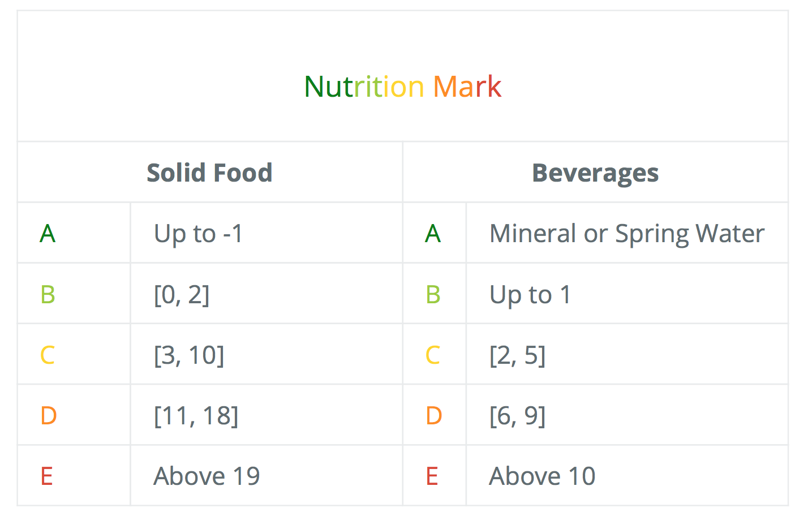

# RedHotDataProject

This page hosts our final project for the <i><a href="https://dlab.epfl.ch/teaching/fall2018/cs401/">Applied Data Analysis</a></i> course of the <a href="https://www.epfl.ch/en/home/">EPFL</a>.

## Abstract

Everything we do possess a certain carbon footprint, and our diet is of course no exception. From growing, farming, processing and packaging our food, energy and organic resources are consumed and released, which reflects in the emission of greenhouse gases, such as CO2. In this story, we explore the arcane of the food industry, such as its manufacturing, product composition and sales, and delve into its carbon emission as well as its nutrition standards of quality. Using the <a href="https://world.openfoodfacts.org">Open Food Facts</a> dataset as well as <a href="http://www.eaternity.org">Eaternity</a>'s, we present the carbon footprint repartition, starting on an understanding of the products, followed by the breakdown of production countries as well as point of sales and evaluating trends in diet composition, with a special focus on nutritionally high marked products in France and the UK. With this study, we want to provide a better understanding of the agri-food industry, and eventually help reducing carbon emissions by promoting a healthier product base for our consumption.

## Before the Story, the Cleaning ...

Our journey starts at the Open Food Facts dataset. This very rich source of information is unfortunately not a panacea: many entries are missing and overall each column lacks standardisation. The first step, after loading the interesting entries, was to harmonise them.

For example, the country names in the origin, manufacturing and purchasing address did not match a single language (<i>United-Kingdom, Royaume-Uni, ...</i>) nor a single format (<i>United-Kingdom, United Kingdom, UK, ...</i>). We clarified this problem thanks to a dedicated <a href="https://mledoze.github.io/countries/">database</a> that we manually enriched to encapsulate most of the entries we observed. 

This linguistic challenge was also met when we confronted the food categories both in the Open Food Facts and the Eaternity datasets. A sample of the last one was given to us by <b>Manuel Klarmann</b>, founder & CEO of the project. We deeply thank him for his help. Adding this source was a necessary step because the original dataset only contained a very limited number of carbon-footprint entries and these were biased towards certain categories of product (such as <i>dairy</i>). 

Another way to enrich our very sparse dataset consisted in scraping from the web. We harvested information about the product prices and, for Eaternity, categories thanks to dedicated web crawler spanning the sites of <i><a href="https://www.amazon.com">Amazon</a>, <a href="https://www.monoprix.fr">Monoprix</a>, <a href="https://search.migros.ch/de/q">Migros</a>, <a href="https://www.coradrive.fr/colmar/">Cora</a>, <a href="https://www.coop.ch/fr.html">Coop</a></i> and an <i> API</i> for  <i><a href="https://www.walmart.com">Walmart</a></i>.

Thanks to these cleansing steps, we gathered a modified version of the Open Food Database that was suitable to the task we were setting to achieve.

### Production / manufacture impact

Our first query, equipped with our brand new database, is to explore the distribution of the products information over the world. This is presented here in three steps: we first observe the place(s) of origin of the product, then the manufacturing place(s) and finally the purchasing place(s). Note the plural form since these can sometime have links to different countries.

#### Distribution of origin places? 

<iframe id="igraph" scrolling="no" style="border:none;" seamless="seamless" src="https://plot.ly/~maxencedraguet/35.embed" height="500" width="100%"></iframe>

#### Distribution of manufacturings places? 

<iframe id="igraph" scrolling="no" style="border:none;" seamless="seamless" src="https://plot.ly/~maxencedraguet/37.embed" height="500" width="100%"></iframe>

#### Distribution of pruchasing places? 

<iframe id="igraph" scrolling="no" style="border:none;" seamless="seamless" src="https://plot.ly/~maxencedraguet/39.embed" height="500" width="100%"></iframe>

Note that we mainly have data for "western" countries, with a <b> huge bias toward France</b>. We mostly lack information for countries in Africa, the Middle East and the centre of Asia. Our dataset is thus clearly not a truthful representation of the world. We shall therefore restrict the analysis to the case of France, since it is the most prevalent among the different columns. This means products are to be limited to those available for purchasing in France. This requirement is not an exclusive one: we do <b>not only</b> require them to be sold in France but to be <b>at least</b> available in France.

With these changes brought about, what can we say about the origin countries? 

<iframe id="igraph" scrolling="no" style="border:none;" seamless="seamless" src="https://plot.ly/~maxencedraguet/43.embed" height="500" width="100%"></iframe>

And the manufacturing countries? 

<iframe id="igraph" scrolling="no" style="border:none;" seamless="seamless" src="https://plot.ly/~maxencedraguet/41.embed" height="500" width="100%"></iframe>

Interestingly, the distribution only seems to change for the developing country! Indeed, these tend to rather be exporting products of <i>origin</i> instead of <i>manufactured</i> ones. On the contrary, developed countries contribute in the exports of both types of categories. This is of course not a surprising fact: developed countries are industrial powerhouses.

Now that this restriction in the representation power of our database is established, let us attack the first part of the problem: <b>palm oil</b> in the food industry. 

## The Palm Oil Connection

The <a href="https://en.wikipedia.org/wiki/Social_and_environmental_impact_of_palm_oil">damaging effect of the over-production of palm oil</a> is a well-known issue popularised in the beginning of the century. Many problems arise from this intensive exploitation, among them deforestation, greenhouse gas emissions, water pollution and even social issues, such as appropriation of native lands.

Considering this globally negative press, we would expect a clear trend in the evolution of the number of products using this calamitous oil. What insights does our database offer on the subject? 

<iframe id="igraph" scrolling="no" style="border:none;" seamless="seamless" src="https://plot.ly/~maxencedraguet/45.embed" height="550" width="100%"></iframe>

The data in the Open Food Facts started being gathered in 2012, which explains this start date of observation. Note how, after a flat behaviour, the palm oil usage noticeably decreased after 2015. For the palm-oil-history padawan, 2015 was a dramatic year of bad press for this type of oil with scandals in France surrounding  Nutella, dubbed the <i><a href="https://www.theguardian.com/environment/2015/jun/17/stop-eating-nutella-and-save-the-forests-urges-french-ecology-minister">#Nutellagate</a></i>, and palm oil production clearances linked to <a href="https://www.theguardian.com/sustainable-business/gallery/2015/dec/28/palm-oil-nutella-forest-fires-wildlife-deforestation-west-africa-india-2015-gallery">fires in Indonesia</a>. 

One could thus expect that products available in France and added during this year would have been more likely to have their palm oil content tagged! "One has to <i>observe</i> something in order to <i>see</i> it". The same explanation can be attributed to the previous years. The decrease following could have several explanation: 

- The optimist would conclude in a reduction in the use of palm oil.

- The pessimist (and sadly <a href="https://www.statista.com/statistics/263937/vegetable-oils-global-consumption/">realist</a>) would however conclude in a decrease in attention focused on palm oil, the subject going "out of fashion" but the palm trees still growing on freshly cleared exotic forestlands. 

But what can we say about the manufacturing countries behind these palm-oil-containing products? 

<iframe id="igraph" scrolling="no" style="border:none;" seamless="seamless" src="https://plot.ly/~maxencedraguet/73.embed" height="250" width="100%"></iframe>

Clearly, <b>France's neighbours</b> are its <b>biggest contributors</b>, after obviously France itself, with the UK heading, followed by Germany, Italy (and its Nutella) and Belgium. Interestingly, the <a href="https://en.wikipedia.org/wiki/Palm_oil">main palm oil producers</a> (Indonesia, Malaysia, Nigeria, etc.) do not appear in this plot. They clearly do not generate the final product and naturally palm oil is not directly consumed but mostly part of a manufacturing process. As we saw earlier, these manufacturing hubs are mostly in developed countries explaining this distinction. 

Palm oil is thus visibly a product imported and manufactured in the developed world. Clearly, developed nations are well equipped to regulate the ecological impact palm oil inflicts on the world.

## The Nutritional dilemna

The meaning of the nutrition score index we shall be using can be found on the following <a href="https://world.openfoodfacts.org/nutriscore">page</a>, thanks to <a href="https://solidarites-sante.gouv.fr/IMG/pdf/rapport_Hercberg_15_11_2013.pdf">the work of Pr. Serge Hercberg</a>. The main facts are the following: 

- Products are marked according to the amount of nutrients they contain [per 100 g] and given a <b>grade between A and E </b>(A being obviously the best mark).

- Whether the product is solid or a beverage, it is assigned a nutrition score accordingly to that displayed on the next table. This score itself is computed in two parts. The first one considers the energy, saturated fat, sugars and sodium. A high level in that category is considered unhealthy. The second part reflects the proportion of fruits, vegetables and nuts, fibres and proteins for which high levels are considered beneficial to the health. The difference of these two parts in the order presented here gives a <b><i>nutritional scores</i></b> that is <b>better for low values</b>. 

After running a small routine transforming the nutrition score into a nutrition mark, we first query the following histogram, displaying the number of products added per year by mark.

<iframe id="igraph" scrolling="no" style="border:none;" seamless="seamless" src="https://plot.ly/~maxencedraguet/55.embed" height="525" width="100%"></iframe>

Clearly, a peak in the number of products added with a nutrition grade happened in 2015. However, the behaviour displayed here above matches that of the total number of product added to the database per year. Can we say something about the evolution of the relative weight of each mark through the years? 

<iframe id="igraph" scrolling="no" style="border:none;" seamless="seamless" src="https://plot.ly/~maxencedraguet/57.embed" height="525" width="100%"></iframe>

Yes! Interestingly the levels are overall quite stable. Note however how the two best nutrition mark, <b><i>A</i></b> and <b><i>B</i></b>, slightly peaked during 2013. In 2018, this trend has reversed and their sum is now even smaller at 29% than in the beginning of the database history, when it was closed to 37%. This decrease has been matched by a similar increase in the less nutritionally favourable products, <b><i>D</i></b> and <b><i>E</i></b> gaining this 8% difference. 

One would therefore be tempted to state there has been a trend towards nutritionally poor products, with the average mark stable. However, it is important at this stage to remember that the dataset does not indicate anything about the popularity of a given product. It merely offers insights into information related to the product itself. Even though more products are added with a poor nutrition mark, it could be that the healthy and less diverse products are in fact more demanded in shops around France than the less ideal ones. The only <b>conclusion to be drawn? More products are added with a bad nutrition mark</b> than a good one. In this respect, food sellers, and of course the government, are the ones who could easily overturn the trend. But who are they? 

<iframe id="igraph" scrolling="no" style="border:none;" seamless="seamless" src="https://plot.ly/~maxencedraguet/75.embed" height="250" width="100%"></iframe>

And unsurprisingly we find the <a href="https://www.statista.com/statistics/535415/grocery-market-share-france/">leaders in the French food retailer market</a>. Now that this trend has been observed, what can we say about the categories of products per mark? How do vegetables, meat, fishery and all fare in the eyes of Pr. Serge Hercberg's team?  

<iframe id="igraph" scrolling="no" style="border:none;" seamless="seamless" src="https://plot.ly/~maxencedraguet/53.embed" height="525" width="100%"></iframe>

Naturally, <i>plant-based</i> products are overwhelmingly the most nutritionally favourable, occupying more than half of the mark <b><i>A</i></b>. They, as well as <i>carbs</i>, are less and less prevalent the worse the nutrition mark. On the opposite, <i>sugary snacks</i> are vastly more common in the bad sector of nutrition and become marginal when considering healthier standards. 

In the middle ground, <i>dairy</i>, <i>meat</i> and <i>seafood</i>. Surprisingly, what is commonly considered in Europe to constitute the main part of a meal is not the most nutritionally favourable. <i>Meat</i> is indeed well distributed among the different marks but does tend to peak at the lowest values of the nutrition index. <i>Dairy</i> performs slightly better, peaking in the lower part of the middle marks and finally, <i>sea-food</i> in the middle part.

This suggests a different approach to crafting <b>meals</b> and to <b>centre</b> them <b>around plant-based products and carbs</b> in order to embrace a <b>healthier lifestyle</b>. 

## The Carbon Footprint

Let us now investigate the carbon footprint of different products and categories by exploring our modified Open Food Facts dataset. Indeed, the original one, restricted to France, only contained the information for a hundred different products with a heavy bias on their category. To remedy this lack of amplitude, we shall make good use of the Eaternity database sample, provided by Mr. Manuel Klarmann whom we deeply thank again, to enrich our modified version. The approach was to get the direct and parent categories of each product in the Eaternity sample by web scraping, translate them from German to English and then match these with the categories in the Open Food Facts. 

Common sense would suggest organic products are rarely manufactured and, due to their origin, inflicting a smaller footprint than the less nutritionally  favourable products such as sugary snacks and meat. Let's take a closer look at this. First, hat can we say about the categories of the products possessing carbon footprint information? 

<iframe id="igraph" scrolling="no" style="border:none;" seamless="seamless" src="https://plot.ly/~maxencedraguet/71.embed" height="300" width="100%"></iframe>

They unfortunately exhibit a bias towards <i>plant-based</i> products. We shall nonetheless keep it in such proportion since the last section suggested that category to be the most promising one for its nutritional and ecological impact. The category <i>Others</i> gathers products with a category name that did not match our Open Food Fact ones and is discarded in the next part of the analysis. 

Let us then observe the relation ship of carbon footprint and price per 100 g. This next plot displays a zoom of our data to make it easier to distinguish between categories. 

<iframe id="igraph" scrolling="no" style="border:none;" seamless="seamless" src="https://plot.ly/~maxencedraguet/67.embed" height="525" width="100%"></iframe>

The two variables do not seem to be closely correlated: there are many inexpensive products with a heavy footprint and vice versa. Note however how clustered the plot is! Products of the same category tend to occupy a certain portion of this phase-space. Observe for example how <i>seafood</i>, <i>meat</i> and <i>dairies</i> occupy the heavy footprint area, <i>sugary snacks</i> cluster (such as chocolate at (200, 2.6), how <i>carbs</i>, <i>plant-based</i> products and <i>beverages</i> (with tea as a notable outlier) concentrate around the low price low carbon footprint area. This last point is made evident when zooming even more on the origin.

<iframe id="igraph" scrolling="no" style="border:none;" seamless="seamless" src="https://plot.ly/~maxencedraguet/69.embed" height="525" width="100%"></iframe>

We therefore reach an interesting conclusion: <b>plant-based and carbs-full products are not only better in a nutritional sense, they are also superior in term of ecological impact!</b> Even better: considering the first scatter plot, they seem to cost less on average than their meaty/fishy counterpart. 

And on this bombshell it is time to end this discussion ...

# <b>Thank you for following our journey ! </b>

### Sources:

https://world.openfoodfacts.org/

https://en.wikipedia.org/wiki/Social_and_environmental_impact_of_palm_oil
    
https://www.theguardian.com/sustainable-business/gallery/2015/dec/28/palm-oil-nutella-forest-fires-wildlife-deforestation-west-africa-india-2015-gallery

https://www.theguardian.com/environment/2015/jun/17/stop-eating-nutella-and-save-the-forests-urges-french-ecology-minister

https://www.statista.com/statistics/263937/vegetable-oils-global-consumption/

https://en.wikipedia.org/wiki/Palm_oil

https://www.statista.com/statistics/535415/grocery-market-share-france/
