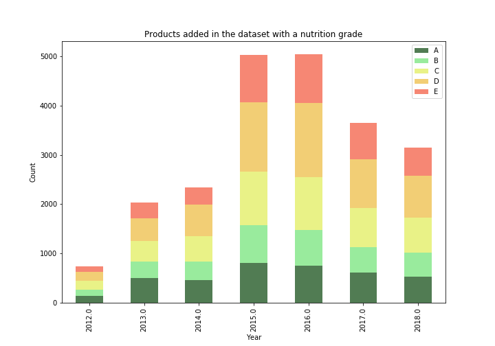

hello 

<div w3-include-html="./Images/plots/map_manufacturing_all.html"></div>

# RedHotDataProject

This page hosts our final project for the <i><a href="https://dlab.epfl.ch/teaching/fall2018/cs401/">Applied Data Analysis</a></i> course of the <a href="https://www.epfl.ch/en/home/">EPFL</a>.

## Abstract
Everything we do possess a certain carbon footprint, and our diet is of course no exception. From growing, farming, processing and packaging our food, energy and organic resources are consumed and released, which reflects in the emission of greenhouse gases, such as CO<sub>2</sub>. In this story, we explore the arcanes of the food industry, such as its manufacturing, product composition and sales, and delve into it's carbon emission as well as its nutrition standards of quality. Using the <a href="https://world.openfoodfacts.org">Open Food Facts</a> dataset as well as <a href="http://www.eaternity.org">Eaternity</a>'s, we present the carbon footprint repartition, starting on an understanding of the products, followed by the breakdown of production countries as well as point of sales and evaluating trends in diet composition, with a special focus on nutritionally high marked products in France and the UK. With this study, we want to provide a better understanding of the agri-food industry, and eventually help reducing carbon emissions by promoting a healtier product base for our consumption.

## Before the Story, the Cleaning ...

Our journey starts at the Open Food Facts dataset. This very rich source of information is unfortunately not a panacea: many entries are missing and overall every column lack uniformisation. The first step, after loading the interesting entries, was to harmonise these.

For example, the country names in the origin, manufacturing and purchasing address did not match a single language (<i>United-Kingdom, Royaume-Unis, ...</i>) nor a single format (<i>United-Kingdom, United Kingdom, UK, ...</i>). we leviated this problem thanks to a dedicated <a href="https://mledoze.github.io/countries/">database</a> that we manually enriched to encapsulate most of the entries we observed. 

This linguistic challenge was also met when we confronted the food categories both in the Open Food Facts and the Eaternity datasets. A sample of the last one was given to us by <b>Manuel Klarmann</b>, founder & CEO of the project. We deeply thank him for his help. Adding this source was a necessary step because the original dataset only contained a very limited number of carbon-footprint entries and these were biased towards certain categories of product (such as <i>dairy</i>). 

Another way to enrich our very sparsed dataset consisted in scraping from the web. We harvested information about the product prices and, for Eaternity, categories thanks to dedicated web crawler spanning the sites of <i><a href="https://www.amazon.com">Amazon</a>, <a href="https://www.monoprix.fr">Monoprix</a>, <a href="https://search.migros.ch/de/q">Migros</a>, <a href="https://www.coradrive.fr/colmar/">Cora</a>, <a href="https://www.coop.ch/fr.html">Coop</a></i> and an <i> API</i> for  <i><a href="https://www.walmart.com">Walmart</a></i>.

Thanks to these cleansing steps, we gathered a modified version of the Open Food Database that was suitable to the task we were setting to achieve.

### Production / manufacture impact

Our first query with our brand new database was to explore the distribution of the products information over the world. This is presented here in three steps: we first observe the place(s) of origin of the product, then the manufacturing place(s) and finally the purchasing place(s). Note the plural form since these can sometime have links to different countries.

#### Distribution of origin places ? 

<iframe id="igraph" scrolling="no" style="border:none;" seamless="seamless" src="https://plot.ly/~maxencedraguet/27.embed" height="525" width="100%"></iframe>


#### Distribution of manufacturings places  ? 

<iframe id="igraph" scrolling="no" style="border:none;" seamless="seamless" src="https://plot.ly/~maxencedraguet/29.embed" height="525" width="100%"></iframe>


#### Distribution of pruchasing places  ? 

<iframe id="igraph" scrolling="no" style="border:none;" seamless="seamless" src="https://plot.ly/~maxencedraguet/31.embed" height="525" width="100%"></iframe>

Note that we mainly have data for "western" countries, with a <b> huge bias toward France</b>. We mostly lack information for countries in Africa, the Middle East and the centre of Asia. Our dataset is thus clearly not a truthful representation of the world. We shall therefore restrict the analysis to the case of France, since it is the most prevalent among the different columns. This means products will be limited to those available for purchasing in France. Note that this requirement is not an exclusive one: we do <b>not only</b> require them to be sold in France but to be <b>at least</b> available in France.

Now that this restriction in the representation power of our database is established, let us attack the first part of the problem: <b>palm oil</b> in the food industry. 

## The Palm Oil Connection

The <a href="https://en.wikipedia.org/wiki/Social_and_environmental_impact_of_palm_oil">damaging effect of the over-production of palm oil</a> is a well-known issue popularised in the beginning of the century. Many problems arise from this intensive exploitation: deforastation, greenhouse gas emissions, water pollution and even social issues, such as appropriation of native lands.

Considering this globally negative press, we would expect a clear trend in the evolution of the number of products using this calomnious oil. Let us see this


https://www.theguardian.com/sustainable-business/gallery/2015/dec/28/palm-oil-nutella-forest-fires-wildlife-deforestation-west-africa-india-2015-gallery

<iframe id="igraph" scrolling="no" style="border:none;" seamless="seamless" src="https://plot.ly/~maxencedraguet/13.embed" height="525" width="100%"></iframe>

The data in the Open Food Facts started being gathered in 2012 which explains this start of observation. Note how, after a slow increase, the palm oil usage in product drastically peaked in 2015. For the palm-oil-history padawan, 2015 was a dramatic year of bad press for this brand of oil with scandals in France surronding Nutella, dubbed the <i><a href="https://www.theguardian.com/environment/2015/jun/17/stop-eating-nutella-and-save-the-forests-urges-french-ecology-minister">#Nutellagate</a></i>, and palm oil production clearances linked to <a href="https://www.theguardian.com/sustainable-business/gallery/2015/dec/28/palm-oil-nutella-forest-fires-wildlife-deforestation-west-africa-india-2015-gallery">fires in Indonesia</a>. 

One could thus expect that products available in France and added during this year would have been more likely to have their palm oil content tagged ! "One has to <i>observe</i> something in order to <i>see</i> it". The decrease following could have several explanation: 
- The optimist would conclude in a reduction in the use of palm oil.
- The pessimist (and sadly <a href="https://www.statista.com/statistics/263937/vegetable-oils-global-consumption/">realist</a>) would however conclude in  a decrease in the attention focused on palm oil, the subject going "out of fashion" but the palm trees still growing on freshly cleared exotic forest lands. 

But what can we say about the manufacturing countries behind these palm-oil-containing products ? Let us exclude the case of France, since most product sold in France are manufactured in ... France. 

<iframe id="igraph" scrolling="no" style="border:none;" seamless="seamless" src="https://plot.ly/~maxencedraguet/15.embed" height="525" width="100%"></iframe>

<i>Unknown</i> maps places that were not identified during the cleansing. Clearly, <b>France's neighbours</b> are its <b>biggest contributors</b> with the UK heading, followed by Italy (and its Nutella), Germany and Belgium. Interestingly, the <a href="https://en.wikipedia.org/wiki/Palm_oil">main palm oil producers</a> (Indonesia, Malaysia, Nigeria, ...) do not appear in this plot. They clearly do not generate the final product and naturally palm oil is not directly consumed but mostly part of a manufacturing process. 

<iframe id="igraph" scrolling="no" style="border:none;" seamless="seamless" src="https://plot.ly/~maxencedraguet/17.embed" height="525" width="100%"></iframe>

## The Nutritional dilemna

Meaning of the nutrition score index can be found on the following <a href="https://world.openfoodfacts.org/nutriscore">page</a>, thanks to <a href="https://solidarites-sante.gouv.fr/IMG/pdf/rapport_Hercberg_15_11_2013.pdf">the work of Pr. Serge Hercberg</a>. The main facts are the following : 
- Products are marked according to the amount of nutrients they contain [per 100 g] and given a <b>grade between A and E </b>(A being obviously the best mark).

<center></center>

- If the product is solid, it is assigned a nutrition score accordingly to that displayed on the next table. This score itself is computed in two parts. The first one considers the energy, saturated fat, sugars and sodium. A high level in that category is considered unhealthy. The second part reflects the proportion of fruits, vegetables and nuts, fibers and proteins for which high levels are considered beneficial to the health. The difference of these two parts in the order presented here gives a <b><i>nutritional scores</i></b> that is <b>better for low values</b>. 


<TABLE  BORDER="5" width="70%">
   <TR ALIGN="CENTER">
      <TH COLSPAN="4">
         <H3><BR><font color="#008010">Nut</font><font color="#9ACD32">rit</font><font color="#FFD700">ion</font> <font color="#FF8C00">Ma</font><font color="#DB4832">rk</font></H3>
      </TH>
   </TR>
   <TR ALIGN="CENTER">
       <TH COLSPAN="2" width="50%">
          Solid Food</TH>
       <TH COLSPAN="2" width="50%">
          Beverages</TH>
   </TR>
   <TR>
      <TD><font color="#008010">A</font></TD>
      <TD>Up to -1</TD>
      <TD><font color="#008010">A</font></TD>
      <TD>Mineral or Spring Water</TD>
   </TR>
   <TR>
      <TD><font color="#9ACD32">B</font></TD>
      <TD>[0, 2]</TD>
      <TD><font color="#9ACD32">B</font></TD>
      <TD>Up to 1</TD>
   </TR>
   <TR>
      <TD><font color="#FFD700">C</font></TD>
      <TD>[3, 10]</TD>
      <TD><font color="#FFD700">C</font></TD>
      <TD>[2, 5]</TD>
   </TR>
   <TR>
      <TD><font color="#FF8C00">D</font></TD>
      <TD>[11, 18]</TD>
      <TD><font color="#FF8C00">D</font></TD>
      <TD>[6, 9]</TD>
   </TR>   
   <TR>
      <TD><font color="#DB4832">E</font></TD>
      <TD>Above 19</TD>
      <TD><font color="#DB4832">E</font></TD>
      <TD>Above 10</TD>
   </TR>
</TABLE>

2

After running a small routine transforming the nutrition score into a nutrition mark, we first query the following histogram, displaying the number of products added per year by mark.

<center></center>

The trend seems to mimick that of the overall number of products added with a nutrition grade. Can we say something about the evolution of the relative weight of each mark through the years ? 

<center></center>

Yes ! Interestingly the levels are overall quite stable. Note however how the two best nutrition mark, <b><i>A</i></b> and <b><i>B</i></b>, slightly peaked during 2013. In 2018, this trend has reversed and their sum is now even smaller at 30% than in the beginning of the database history, 40% in 2012. This decrease has been matched by a similar increase in the less nutritionally favourable products, <b><i>D</i></b> and <b><i>E</i></b> gaining this 10% difference. 

One would therefore be tempted to state there has been a trend towards nutritionally poor products. However, it is important at this stage to remember that the dataset does not indicate anything about the popularity of a given product. It merely offers insights into information related to the product itself. Even though more products are added with a poor nutrition mark, it could be that the good and lesser in number products are in fact more demanded in shops around France. The only <b>conclusion to be drawn? More products are added with a bad nutrition mark</b>. 

Now that this trend has been observed, what can we say about the categories of products per mark? How do vegetables, meat, fishery, ... fare in the eyes of Pr. Serge Hercberg's team ? 

<center></center>

Naturally, <i>plant-based</i> products are overwhelmingly the most nutritionaly favouralbe, occupaying more than half of the mark <b><i>A</i></b>. They, as well as <i>carbs</i> and <i>canned-food</i>, are less and less prevalent the worse the nutrition mark considered. On the opposite, <i>sugary snacks</i> are vastly more common in the bad sector of nutrition and become marginal when considering healthier standards. 

In the middle ground, <i>dairy</i>, <i>meat</i> and <i>sea-food</i>. Surprisingly, what are commonly considered in Europe as the main parts of a meal are not the most nutritionaly favourable. <i>Meat</i> is indeed well distributed among the different marks but does tend to peak at the lowest values of the nutrition index. <i>Dairy</i> performs slightly better, peaking in the lower part of the middle marks and finally, <i>sea-food</i> in the middle part. 

This suggests a different approach to crafting <b>meals</b> and to <b>centre</b> them <b>around plant-based products and carbs</b> in order to embrace a <b>healthier lifestyle</b>. 

## The Carbon Footprint

### Open Food Fact

We shall now investigate the carbon footprint of different products and categories by exploring our modified Open Food Facts dataset. Common sense would suggest  organic  products are rarely manufactured and, due to their origin, impeding a smaller footprint than the less nutritionaly favourable products such as sugary snacks and meat. 

But once again, we should be careful as this part of the dataset is also heavily biased. So we begin by examing what kind of data is available to our curiosity. What can we say about the manufacturing countries of these products that, remember, are available for purchasing in France?

useless ?
<iframe id="igraph" scrolling="no" style="border:none;" seamless="seamless" src="https://plot.ly/~maxencedraguet/19.embed" height="525" width="100%"></iframe>

useless ? 
<iframe id="igraph" scrolling="no" style="border:none;" seamless="seamless" src="https://plot.ly/~maxencedraguet/21.embed" height="525" width="100%"></iframe>

What can we say about the categories of these products that, remember, are available for purchasing in France? 

<iframe id="igraph" scrolling="no" style="border:none;" seamless="seamless" src="https://plot.ly/~maxencedraguet/23.embed" height="525" width="100%"></iframe>

Two important remarks should be brought here. First, notice how small the sample is with merely 102 elements. Secondly, categories are not evenly distributed. To remedy this lack of amplitude, we shall make good use of the Eaternity database sample provided to us by Mr. Manuel Klarmann. But first, let us observe the relation ship of carbon footprint and price per 100 g as displayed next. 

<iframe id="igraph" scrolling="no" style="border:none;" seamless="seamless" src="https://plot.ly/~maxencedraguet/25.embed" height="525" width="100%"></iframe>

The two variable seem to be loosely correlated. Note however how clustered the plot is ! Product of the same categories tend to occupy a certain portion of this phase-space. Observe for exemple how <i>seafood</i> aligns, <i>sugary snacks</i> like chocolate cluster, how <i>carbs</i>, <i>plant-based</i> products and <i>beverages</i> (with the notable exception of tea) concentrate around the low price low carbon footprint area. 

### Eaternity Enriching

Because the carbon footprint column of the Open Food Facts database contained only a sparsed amount of data, we matched it with the sample of Eaternity we received. The approach was to webscraped the direct and parent categories of each product, translate them from German to English and then match these with the categories in the Open Food Facts. The value added was taken to be the mean of that available on our join information.

# <b>Thank you for following our journey ! </b>

### Sources:

https://world.openfoodfacts.org/

https://en.wikipedia.org/wiki/Social_and_environmental_impact_of_palm_oil
    
https://www.theguardian.com/sustainable-business/gallery/2015/dec/28/palm-oil-nutella-forest-fires-wildlife-deforestation-west-africa-india-2015-gallery

https://www.theguardian.com/environment/2015/jun/17/stop-eating-nutella-and-save-the-forests-urges-french-ecology-minister

https://www.statista.com/statistics/263937/vegetable-oils-global-consumption/

https://en.wikipedia.org/wiki/Palm_oil


```python

```
